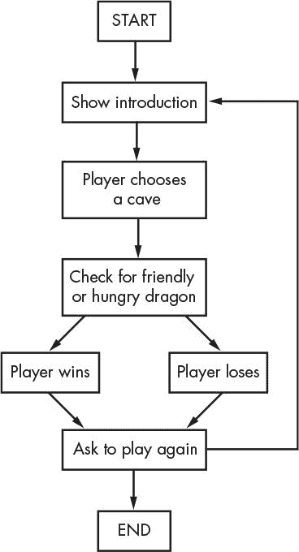
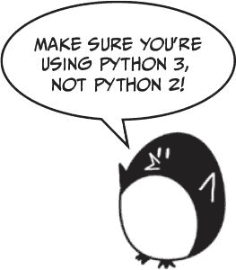
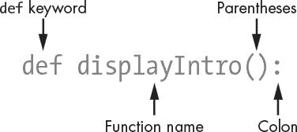
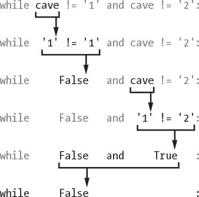

# 5 龙王国

> 原文：<https://inventwithpython.com/invent4thed/chapter5.html>


你将在这一章中创建的游戏名为“龙族”。玩家在两个洞穴中做出选择，要么是宝藏，要么是厄运。

### **龙之境界怎么玩**

在这款游戏中，玩家身处一片充满龙的土地。龙都住在洞穴里，带着它们收集的大量财宝。有些龙很友好，会分享它们的财宝。其他的龙很饿，会吃掉任何进入它们洞穴的人。玩家接近两个洞穴，一个有一条友好的龙，另一个有一条饥饿的龙，但不知道哪条龙在哪个洞穴里。玩家必须在两者之间做出选择。

**本章涵盖的主题**

流程图

使用 def 关键字创建您自己的函数

多行字符串

while 语句

和、或和非布尔运算符

真值表

返回关键字

全局和局部变量范围

参数和自变量

sleep() 功能

### **龙之国度试玩**

这是龙之国度游戏运行时的样子。玩家的输入以粗体显示。

```py
You are in a land full of dragons. In front of you,
you see two caves. In one cave, the dragon is friendly
and will share his treasure with you. The other dragon
is greedy and hungry, and will eat you on sight.
Which cave will you go into? (1 or 2)
1
You approach the cave...
It is dark and spooky...
A large dragon jumps out in front of you! He opens his jaws and...
Gobbles you down in one bite!
Do you want to play again? (yes or no)
no
```

### **龙族领域流程图**

在你开始写代码之前，写下你想让你的游戏或程序做的每一件事通常是有帮助的。当你这样做的时候，你就是在*设计程序*。

例如，它可能有助于绘制流程图。一个*流程图*是一个图表，显示游戏中可能发生的每一个可能的动作，以及哪些动作是有联系的。[图 5-1](#calibre_link-50) 是龙领域的流程图。

要查看游戏中会发生什么，请将手指放在开始框上。然后沿着一个箭头从这个盒子到另一个盒子。你的手指就像程序的执行。当您的手指落在结束框上时，程序终止。



*图 5-1:龙之境界游戏*流程图

当你进入“检查友好或饥饿的龙”框时，你可以进入“玩家赢”框或“玩家输”框。在这个分支点上，程序可以走向不同的方向。无论哪种方式，两条路径最终都会在“要求再玩一次”框中结束。

### **龙之国度的源代码**

点击**文件**  **新建窗口**，打开一个新的文件编辑器窗口。输入源代码，保存为 *dragon.py* 。然后按 F5 运行程序。如果你遇到错误，用在线比较工具在 https://www.nostarch.com/inventwithpython#diff将你输入的代码与书中的代码进行比较。



*龙. py*

```py
 1\. import random
 2\. import time
 3.
 4\. def displayIntro():
 5.     print('''You are in a land full of dragons. In front of you,
 6\. you see two caves. In one cave, the dragon is friendly
 7\. and will share his treasure with you. The other dragon
 8\. is greedy and hungry, and will eat you on sight.''')
 9\. print()
10.
11\. def chooseCave():
12.     cave = ''
13.     while cave != '1' and cave != '2':
14.         print('Which cave will you go into? (1 or 2)')
15.         cave = input()
16.
17.     return cave
18.
19\. def checkCave(chosenCave):
20.     print('You approach the cave...')
21.     time.sleep(2)
22.     print('It is dark and spooky...')
23.     time.sleep(2)
24.     print('A large dragon jumps out in front of you! He opens his jaws
          and...')
25.     print()
26.     time.sleep(2)
27.
28.     friendlyCave = random.randint(1, 2)
29.
30.     if chosenCave == str(friendlyCave):
31.         print('Gives you his treasure!')
32.     else:
33.         print('Gobbles you down in one bite!')
34.
35\. playAgain = 'yes'
36\. while playAgain == 'yes' or playAgain == 'y':
37.     displayIntro()
38.     caveNumber = chooseCave()
39.     checkCave(caveNumber)
40.
41.     print('Do you want to play again? (yes or no)')
42.     playAgain = input()
```

让我们更详细地看看源代码。

### **导入随机和时间模块**

该程序导入两个模块:

```py
1\. import random
2\. import time
```

random 模块提供了 randint() 函数，我们在[第三章](#calibre_link-40)的猜数字游戏中使用了这个函数。第 2 行导入了时间模块，该模块包含与时间相关的函数。

### **龙族**的功能

函数使您可以多次运行相同的代码，而不必一次又一次地复制和粘贴代码。相反，您将代码放在一个函数中，并在需要时调用该函数。因为你在函数中只写一次代码，如果函数的代码有错误，你只需要在程序中的一个地方修改它。

您已经使用了一些函数，如 print() 、 input() 、 randint() 、 str() 和 int() 。你的程序调用了这些函数来执行其中的代码。在龙族游戏中，你将使用 def 语句编写自己的函数。

#### ***def 报表***

第 4 行是一个 def 语句:

```py
4\. def displayIntro():
5.     print('''You are in a land full of dragons. In front of you,
6\. you see two caves. In one cave, the dragon is friendly
7\. and will share his treasure with you. The other dragon
8\. is greedy and hungry, and will eat you on sight.''')
9.     print()
```

def 语句定义了一个新函数(在本例中是 displayIntro() 函数)，您可以在程序的后面调用它。

[图 5-2](#calibre_link-796) 显示了一个 def 语句的各个部分。它有 def 关键字，后跟一个带括号的函数名，然后是一个冒号( : )。 def 语句后的块称为 def 块。



*图 5-2:部分* `def` *语句*

#### ***调用函数***

当您*定义*一个函数时，您指定它在下面的块中运行的指令。当你*调用*一个函数时， def 块内的代码就会执行。除非调用该函数，否则 def 块中的指令不会执行。

换句话说，当执行到达一个 def 语句时，它会跳到 def 块之后的第一行。但是当一个函数被调用时，执行会在函数内部移动到 def 块的第一行。

例如，看看第 37 行对 displayIntro() 函数的调用:

```py
37.     displayIntro()
```

调用这个函数运行 print() 调用，显示“你在一个充满龙的土地上……”引言。

#### ***在哪里放函数定义***

函数的 def 语句和 def 块必须在调用函数之前*出现，就像你必须在使用变量之前给变量赋值一样。如果你把函数调用放在函数定义之前，你会得到一个错误。让我们看一个短程序作为例子。打开一个新的文件编辑器窗口，输入这段代码，保存为 *example.py* ，并运行它:*

```py
sayGoodbye()

def sayGoodbye():
    print('Goodbye!')
```

如果您尝试运行这个程序，Python 将会给您一个如下所示的错误消息:

```py
Traceback (most recent call last):
  File "C:/Users/Al/AppData/Local/Programs/Python/Python36/example.py",
    line 1, in <module>
    sayGoodbye()
NameError: name 'sayGoodbye' is not defined
```

若要修复此错误，请在函数调用之前移动函数定义:

```py
def sayGoodbye():
    print('Goodbye!')

sayGoodbye()
```

现在，函数在被调用之前就被定义了，所以 Python 会知道 sayGoodbye() 应该做什么。否则，Python 在被调用时将没有 sayGoodbye() 的指令，因此将无法运行它。

### **多行字符串**

到目前为止，我们的 print() 函数调用中的所有字符串都在一行上，并且在开头和结尾都有一个引号字符。然而，如果你在一个字符串的开头和结尾使用三个引号，那么它可能会跨越几行。这些是*多线弦*。

在交互式 shell 中输入以下内容，看看多行字符串是如何工作的:

```py
>>> fizz = '''Dear Alice,
I will return to Carol's house at the end of the month.
Your friend,
Bob'''
>>> print(fizz)
Dear Alice,
I will return to Carol's house at the end of the month.
Your friend,
Bob
```

请注意打印字符串中的换行符。在多行字符串中，换行符是字符串的一部分。只要不同时使用三个引号，就不必使用 \n 转义字符或转义引号。当涉及大量文本时，这些换行符使代码更容易阅读。

### **如何用 while 语句循环**

第 11 行定义了另一个名为 chooseCave() 的函数:

```py
11\. def chooseCave():
```

这个函数的代码询问玩家他们想进入哪个洞穴，是 1 还是 2 。我们将需要使用一个 while 语句来要求玩家选择一个洞穴，这标志着一种新循环的开始:一个 while 循环。

与循环特定次数的 for 循环不同， while 循环只要某个条件为真就会重复。当执行到达一个 while 语句时，它会评估 while 关键字旁边的条件。如果条件评估为真，则执行移动到下一个块内，称为 while 块。如果条件评估为假，则执行移过而块。

你可以认为一个 while 语句和一个 if 语句几乎是一样的。如果两个语句的条件为真，则程序执行进入这两个语句的程序块。但是，当条件在一个 while 循环中到达块的末尾时，它会返回到 while 语句来重新检查条件。

查看 chooseCave() 的 def 块，查看同时循环动作:

```py
12.     cave = ''
13.     while cave != '1' and cave != '2':
```

第 12 行创建了一个名为 cave 的新变量，并在其中存储了一个空字符串。然后在第 13 行开始一个而循环。 chooseCave() 函数需要确保玩家输入的是 1 或 2 而不是别的。这里的一个循环会一直询问玩家他们选择哪个洞穴，直到他们输入这两个有效答案中的一个。这被称为*输入验证*。

该条件还包含一个您以前没有见过的新操作符:和。就像 - 、 * 是数学运算符，而 == 、！= 是比较运算符，和是布尔运算符。让我们仔细看看布尔运算符。

### **布尔运算符**

布尔逻辑处理非真即假的事情。布尔运算符比较值并计算出单个布尔值。

想起“猫有胡须，狗有尾巴”这句话。“猫有胡须”是真的，“狗有尾巴”也是真的，所以整句“猫有胡须*狗有尾巴*是真的。

但是“猫有胡须，狗有翅膀”这句话是错误的。即使“猫有胡须”是真的，但狗没有翅膀，所以“狗有翅膀”是假的。在布尔逻辑中，事物只能是全真或全假。因为单词*和*，只有当*的两个*部分都为真时，整个句子才为真。如果一部分或两部分都是假的，那么整个句子都是假的。

#### ***与运算符***

Python 中的和运算符也要求整个布尔表达式为真或假。如果和关键字两边的布尔值都是真，那么表达式的计算结果为真。如果布尔值中的一个或两个为假，则表达式评估为假。

使用和操作符在交互式 shell 中输入以下表达式:

```py
>>> True and True
True
>>> True and False
False
>>> False and True
False
>>> False and False
False
>>> spam = 'Hello'
>>> 10 < 20 and spam == 'Hello'
True
```

和运算符可用于计算任意两个布尔表达式。在最后一个示例中， 10 < 20 的计算结果为真，而 spam == 'Hello' 的计算结果也为真，因此由和运算符连接的两个布尔表达式的计算结果为真。

如果您忘记了布尔运算符是如何工作的，您可以查看它的*真值表*，它显示了布尔值的每个组合是如何计算的。[表 5-1](#calibre_link-797) 显示了和操作符的各种组合。

**表 5-1:**`and`运算符的真值表

| **A**T3和 **B** | **评估为** |
| --- | --- |
| 真与真 | 真 |
| 真与假 | 假 |
| 真假 | 假 |
| 假与假 | 假 |

#### ***or 运算符***

或操作符类似于和操作符，除了如果两个布尔值*中的任意一个*为真，则它评估为真。唯一一次或操作符评估为假是如果*两个布尔值*都为假。

现在，在交互式 shell 中输入以下内容:

```py
>>> True or True
True
>>> True or False
True
>>> False or True
True
>>> False or False
False
>>> 10 > 20 or 20 > 10
True
```

在最后一个示例中， 10 不大于 20 ，但是 20 大于 10 ，因此第一个表达式的计算结果为假，第二个表达式的计算结果为真。因为第二个表达式为真，所以这个整个表达式的计算结果为真。

或操作员真值表如[表 5-2](#calibre_link-798) 所示。

**表 5-2:**`or`运算符的真值表

| **A** 或 **B** | **评估为** |
| --- | --- |
| 真或真 | 真 |
| 真或假 | 真 |
| 假或真 | 真 |
| 假或假 | 假 |

#### ***非符***

not 运算符只处理一个值，而不是组合两个值。 not 运算符计算出相反的布尔值:真表达式计算出假，假表达式计算出真。

在交互式 shell 中输入以下内容:

```py
>>> not True
False
>>> not False
True
>>> not ('black' == 'white')
True
```

not 运算符也可以用于任何布尔表达式。在最后一个例子中，表达式‘黑’=‘白’的计算结果为假。这就是为什么不是('黑' = '白')是真。

非算子真值表如[表 5-3](#calibre_link-799) 所示。

**表 5-3:**`not`运算符的真值表

| 不是 **而是** | **评估为** |
| --- | --- |
| 不真实 | 假 |
| 不假 | 真 |

#### ***评估布尔运算符***

再看龙之境界游戏第 13 行:

```py
13.     while cave != '1' and cave != '2':
```

条件有两部分，由布尔运算符和连接。只有当两部分都为真时，条件才为真。

第一次检查 while 语句的条件时， cave 被设置为空字符串， '' 。空白字符串不等于字符串‘1’，所以左侧求值为真。空白字符串也不等于字符串‘2’，所以右侧计算为真。

于是条件变成了真和真。因为两个值都是真，整个条件评估为真，所以程序执行进入 while 块，在这里程序将试图为 cave 分配一个非空值。

第 14 行要求玩家选择一个洞穴:

```py
13.     while cave != '1' and cave != '2':
14.         print('Which cave will you go into? (1 or 2)')
15.         cave = input()
```

第 15 行让玩家输入他们的回答，然后按下<small class="calibre11">回车</small>。此回复存储在洞穴中。执行完这段代码后，执行返回到语句的顶部，同时语句重新检查第 13 行的条件。

如果玩家输入了 1 或者 2 ，那么 cave 要么是‘1’要么是‘2’(因为 input() 总是返回字符串)。这使得条件为假，并且程序执行将继续越过而循环。例如，如果用户输入‘1’，那么评估将如下所示:



但如果玩家输入了 3 或 4 或你好，那么该响应将无效。然后，条件将为真，并且将进入而块以再次询问玩家。程序不断询问玩家选择哪个洞穴，直到他们进入 1 或 2 。这保证了一旦执行继续，变量 cave 包含一个有效的响应。

### **返回值**

第 17 行有一个新东西叫做 return 语句:

```py
17.     return cave
```

一个 return 语句只出现在定义了一个函数的 def 块中——在这里是 chooseCave() 。还记得 input() 函数是如何返回玩家输入的字符串值的吗？ chooseCave() 函数也将返回值。第 17 行返回存储在洞穴中的字符串，或者是‘1’或者是‘2’。

一旦 return 语句执行，程序执行立即跳出 def 块(正如 break 语句使执行跳出 while 块)。程序执行返回到函数调用的那一行。函数调用本身将计算函数的返回值。

暂时跳到第 38 行，这里调用了 chooseCave() 函数:

```py
38.     caveNumber = chooseCave()
```

在第 38 行，当程序调用第 11 行定义的函数 chooseCave() 时，函数调用计算出 cave 中的字符串，然后存储在 caveNumber 中。 chooseCave() 内的 while 循环保证 chooseCave() 将只返回 '1' 或 '2' 作为其返回值。所以 caveNumber 只能有这两个值中的一个。

### **全局范围和局部范围**

函数内部创建的变量有些特殊，比如第 12 行的 chooseCave() 函数中的 cave 变量:

```py
12.     cave = ''
```

每当调用函数时，就会创建一个*局部作用域*。该函数中的任何变量都存在于局部范围内。把一个*范围*想象成一个变量容器。局部作用域中的变量的特殊之处在于，当函数返回时它们会被遗忘，如果再次调用函数，它们会被重新创建。函数调用之间不会记住局部变量的值。

在函数之外赋值的变量存在于*全局范围*中。只有一个全局作用域，它是在程序开始时创建的。当你的程序终止时，全局作用域被破坏，它的所有变量都被遗忘。否则，下次运行程序时，变量会记住上次运行时的值。

存在于局部范围内的变量称为*局部变量*，而存在于全局范围内的变量称为*全局变量*。变量必须是其中之一；它不可能既是局部的又是全球性的。

变量 cave 在 chooseCave() 函数中创建。这意味着它是在 chooseCave() 函数的局部范围内创建的。当 chooseCave() 返回时它将被忘记，如果 chooseCave() 被第二次调用，它将被重新创建。

局部变量和全局变量可以同名，但它们是不同的变量，因为它们在不同的范围内。让我们写一个新程序来说明这些概念:

```py
   def bacon():
➊     spam = 99      # Creates a local variable named spam
➋     print(spam)    # Prints 99

➌ spam = 42      # Creates a global variable named spam
➍ print(spam)    # Prints 42
➎ bacon()        # Calls the bacon() function and prints 99
➏ print(spam)    # Prints 42
```

我们先做一个函数叫做 bacon() 。在 bacon() 中，我们创建了一个名为 spam 的变量，并将其赋值为 99 ➊ 。在 ➋ ，我们调用 print() 来打印这个本地 spam 变量，也就是 99 。在 ➌ ，一个名为 spam 的全局变量也被声明并被设置为 42 。这个变量是全局的，因为它在所有函数之外。当全局 spam 变量传递给 ➍ 的 print() 时，它打印 42 。当 bacon() 函数在 ➎ 被调用时， ➊ 和 ➋ 被执行，本地 spam 变量被创建、设置，然后被打印。所以调用 bacon() 打印值 99 。在 bacon() 函数调用返回后，局部 spam 变量被遗忘。如果我们在 ➏ 打印垃圾邮件，我们打印的是全局变量，所以那里的输出是 42 。

运行时，此代码将输出以下内容:

```py
42
99
42
```

变量的创建位置决定了它的作用域。写程序的时候要记住这一点。

### **功能参数**

龙族领域程序中定义的下一个函数名为 checkCave() 。

```py
19\. def checkCave(chosenCave):
```

注意括号之间的文本 chosenCave 。这是一个*参数*:函数代码使用的局部变量。当调用该函数时，调用的参数是赋给参数的值。

让我们暂时回到交互 shell。请记住，对于一些函数调用，如 str() 或 randint() ，您将在括号之间传递一个或多个参数:

```py
>>> str(5)
'5'
>>> random.randint(1, 20)
14
>>> len('Hello')
5
```

这个例子包含了一个你还没见过的 Python 函数: len() 。 len() 函数返回一个整数，表示传递给它的字符串中有多少个字符。在这种情况下，它告诉我们字符串‘Hello’有 5 个字符。

调用 checkCave() 时也会传递一个参数。这个参数存储在一个名为 chosenCave 的新变量中，这个变量是 checkCave() 的参数。

下面是一个简短的程序，演示了如何定义一个带有参数(名)的函数( sayHello ):

```py
def sayHello(name):
    print('Hello, ' + name + '. Your name has ' + str(len(name)) +
      ' letters.')
sayHello('Alice')
sayHello('Bob')
spam = 'Carol'
sayHello(spam)
```

当你调用 sayHello() 并在圆括号中有一个实参时，实参被赋给 name 形参，函数中的代码被执行。在 sayHello() 函数中只有一行代码，这是一个 print() 函数调用。在 print() 函数调用中有一些字符串和 name 变量，以及对 len() 函数的调用。这里， len() 用于统计名称中的字符数。如果运行该程序，输出如下所示:

```py
Hello, Alice. Your name has 5 letters.
Hello, Bob. Your name has 3 letters.
Hello, Carol. Your name has 5 letters.
```

对于每个对 sayHello() 的调用，都会打印一个问候语和名称参数的长度。注意，因为字符串‘卡罗尔’被赋给了 spam 变量， sayHello(spam) 等价于say hello(‘卡罗尔’)。

### **显示游戏结果**

让我们回到龙之境界游戏的源代码:

```py
20.     print('You approach the cave...')
21.     time.sleep(2)
```

时间模块有一个名为睡眠()的函数可以暂停程序。第 21 行传递整数值 2 ，这样 time.sleep() 将暂停程序 2 秒钟。

```py
22.     print('It is dark and spooky...')
23.     time.sleep(2)
```

这里代码打印了更多的文本，并等待了 2 秒钟。这些短暂的停顿增加了游戏的悬念，而不是一次显示全部文本。在[第四章](#calibre_link-21)的段子程序中，你调用了 input() 函数暂停，直到玩家按下 <small class="calibre11">ENTER</small> 。在这里，玩家不需要做任何事情，只需要等待几秒钟。

```py
24.     print('A large dragon jumps out in front of you! He opens his jaws
          and...')
25.     print()
26.     time.sleep(2)
```

随着悬念的建立，我们的节目下一步将决定哪一个洞穴有友好的龙。

### **决定哪个洞穴有友好的龙**

第 28 行调用 randint() 函数，该函数将随机返回 1 或 2 。

```py
28.     friendlyCave = random.randint(1, 2)
```

该整数值存储在 friendlyCave 中，表示有友好龙的洞穴。

```py
30.     if chosenCave == str(friendlyCave):
31.         print('Gives you his treasure!')
```

第 30 行检查玩家在 chosenCave 变量(‘1’或‘2’)中选择的洞穴是否等于友军龙穴。

但是 friendlyCave 中的值是一个整数，因为 randint() 返回整数。不能用 == 符号来比较字符串和整数，因为它们将*永远不会*彼此相等:‘1’不等于 1 ，‘2’不等于 2 。

所以 friendlyCave 被传递给 str() 函数，该函数返回 friendlyCave 的字符串值。现在，这些值将具有相同的数据类型，并且可以进行有意义的相互比较。我们也可以将 chosenCave 转换成一个整数值。那么第 30 行应该是这样的:

```py
    if int(chosenCave) == friendlyCave:
```

如果 chosenCave 等于 friendlyCave ，则条件评估为 True ，第 31 行告诉玩家他们赢得了宝藏。

现在，我们必须添加一些代码，以便在条件为假时运行。第 32 行是一个 else 语句:

```py
32.     else:
33.         print('Gobbles you down in one bite!')
```

一个 else 语句只能出现在一个 if 块之后。如果 if 语句的条件为 False ，则 else 块执行。可以把这想象成程序的说法，“如果这个条件为真，那么执行 if 块，否则执行 else 块。”

在这种情况下， else 语句在 chosenCave 不等于 friendlyCave 时运行。然后，运行第 33 行的 print() 函数调用，告诉玩家他们被龙吃掉了。

### **游戏循环**

程序的第一部分定义了几个函数，但并不运行其中的代码。第 35 行是程序主要部分开始的地方，因为它是运行的第一行:

```py
35\. playAgain = 'yes'
36\. while playAgain == 'yes' or playAgain == 'y':
```

这一行是程序主要部分开始的地方。前面的 def 语句仅仅定义了函数。他们不运行这些函数内部的代码。

第 35 行和第 36 行建立了一个包含游戏代码其余部分的循环。在游戏结束时，玩家可以告诉程序他们是否想再玩一次。如果是这样，执行将进入而循环，再次运行整个游戏。如果没有，则 while 语句的条件将为假，执行将移动到程序的末尾并终止。

第一次执行到这个 while 语句时，第 35 行将刚刚把‘yes’赋值给 playAgain 变量。这意味着在程序开始时，条件将为真。这保证了执行至少进入循环一次。

#### ***调用程序中的函数***

第 37 行调用了 displayIntro() 函数:

```py
37.     displayIntro()
```

这不是一个 Python 函数——它是您之前在第 4 行定义的函数。调用该函数时，程序执行跳转到第 5 行的 displayIntro() 函数的第一行。当函数中的所有行都被执行后，执行跳回到第 37 行，并继续向下移动。

第 38 行还调用了您定义的函数:

```py
38.     caveNumber = chooseCave()
```

请记住， chooseCave() 函数让玩家选择他们想要进入的洞穴。当第 17 行的返回洞穴执行时，程序执行跳回到第 38 行。然后， chooseCave() 调用计算出返回值，这将是一个表示玩家选择进入的洞穴的整数值。这个返回值存储在一个名为 caveNumber 的新变量中。

然后程序执行移到第 39 行:

```py
39.     checkCave(caveNumber)
```

第 39 行调用 checkCave() 函数，将 caveNumber 中的值作为参数传递。不仅执行跳转到第 20 行，而且 caveNumber 中的值被复制到 checkCave() 函数中的参数 chosenCave 中。这个功能将显示“给你他的宝藏！”或‘一口吞掉你！’取决于玩家选择进入的洞穴。

#### ***要求玩家再次玩***

无论玩家赢了还是输了，他们都会被问及是否想再玩一次。

```py
41.     print('Do you want to play again? (yes or no)')
42.     playAgain = input()
```

变量 playAgain 存储玩家输入的内容。第 42 行是 while 块的最后一行，所以程序跳回到第 36 行来检查 while 循环的条件: playAgain == 'yes '或 playAgain == 'y' 。

如果玩家输入字符串‘yes’或‘y’，那么在第 37 行执行再次进入循环。

如果玩家输入‘否’或者‘n’或者类似‘亚伯拉罕·林肯’的傻逼，那么条件就是假，程序执行继续到之后的行，而阻塞。但是由于在 while 块之后没有任何行，程序终止。

有一点需要注意:字符串‘YES’不等于字符串‘YES’，因为计算机不认为大小写字母相同。如果玩家输入字符串‘YES’，那么 while 语句的条件将评估为 False ，程序仍将终止。稍后，Hangman 程序将向您展示如何避免这个问题。(参见第 101 页[中的](#calibre_link-324)[lower()和 upper() 字符串方法](#calibre_link-521))。)

您刚刚完成了您的第二个游戏！在《龙族》中，你用了很多你在猜数字游戏中学到的东西，并学会了一些新的技巧。如果你不理解这个程序中的一些概念，再次检查源代码的每一行，并尝试改变代码，看看程序是如何改变的。

在[第 6 章](#calibre_link-143)中，你不会再创建另一个游戏。相反，你将学习如何使用 IDLE 的一个特性，叫做*调试器*。

### **总结**

在龙族领域游戏中，你创建了自己的函数。函数是程序中的一个小程序。函数内部的代码在函数被调用时运行。通过将代码分解成函数，可以将代码组织成更短、更容易理解的部分。

参数是在调用函数时复制到函数参数中的值。函数调用本身计算返回值。

您还了解了可变作用域。在函数内部创建的变量存在于局部范围内，而在所有函数外部创建的变量存在于全局范围内。全局范围内的代码不能使用局部变量。如果局部变量与全局变量同名，Python 会将它视为一个单独的变量。给局部变量赋值不会改变全局变量的值。

变量作用域看起来可能很复杂，但是它们对于将函数组织成独立于程序其余部分的代码片段是很有用的。因为每个函数都有自己的局部作用域，所以您可以确保一个函数中的代码不会导致其他函数中的错误。

几乎每个程序都有函数，因为它们非常有用。通过理解函数是如何工作的，您可以省去大量的打字工作，并使错误更容易修复。