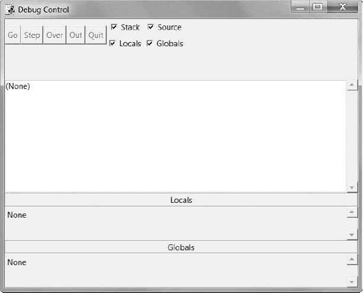
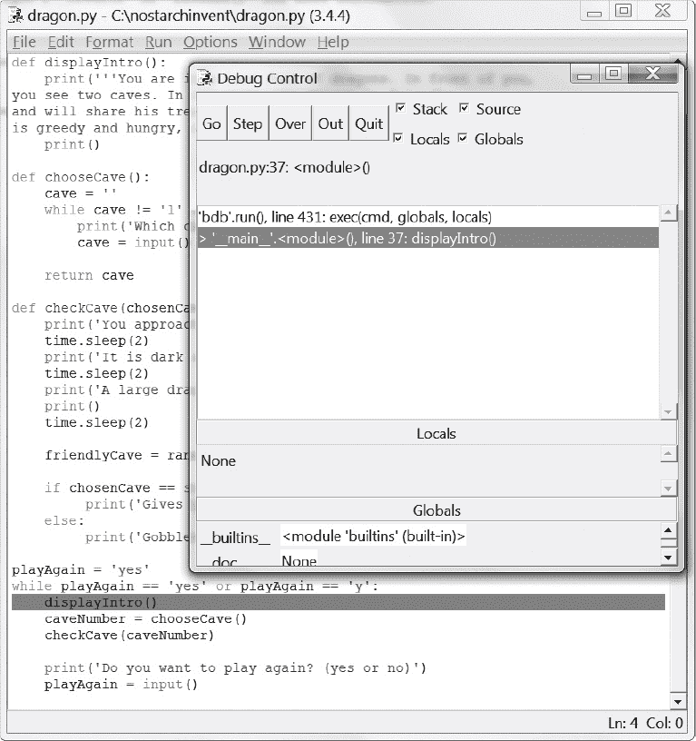
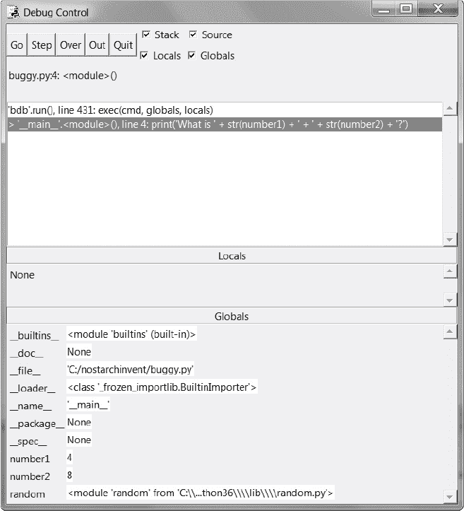
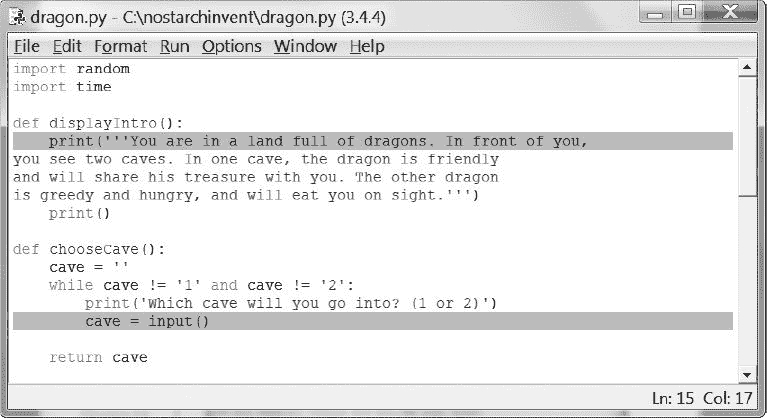
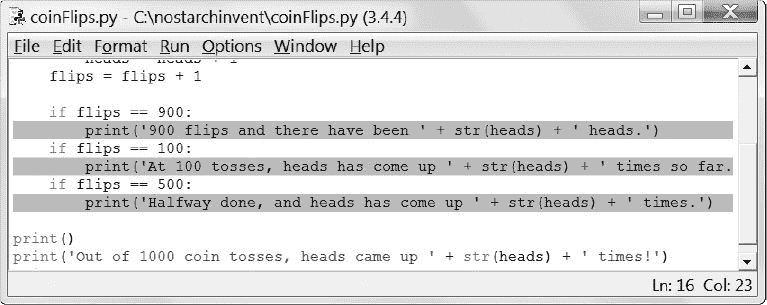

# 6 使用调试器

> 原文：<https://inventwithpython.com/invent4thed/chapter6.html>


如果你输入错误的代码，计算机不会给你正确的程序。计算机程序总是会做你让它做的事情，但是你让它做的事情可能并不是你真正想要它做的事情。这些错误是计算机程序中的*错误*。当程序员没有仔细考虑程序到底在做什么时，错误就发生了。

**本章涵盖的主题**

三种错误

IDLE 的调试器

Go 和 Quit 按钮

步入、越过和走出

断点

### **bug 类型**

程序中可能会出现三种类型的错误:

**语法错误**这类 bug 来自错别字。当 Python 解释器看到语法错误时，那是因为你的代码不是用正确的 Python 语言编写的。即使只有一个语法错误的 Python 程序也不会运行。

运行时错误这些是程序运行时出现的错误。程序将继续运行，直到到达有错误的代码行，然后程序将终止，并显示一条错误消息(这被称为*崩溃*)。Python 解释器将显示一个*回溯*:一个错误消息，显示包含问题的行。

语义错误这些最难修复的错误不会使程序崩溃，但是它们会阻止程序做程序员想让它做的事情。例如，如果程序员希望变量 total 是变量 a 、 b 和 c 中的值的*总和*，但是写成 total = a * b * c ，那么 total 中的值就会是错误的。这可能会使程序在以后崩溃，但是语义错误发生在哪里并不明显。

如果你注意到程序中的 bug，发现它们是很困难的。当运行你的程序时，你可能会发现有时候函数在应该被调用的时候并没有被调用，或者它们被调用了太多次。当循环不正确时，您可能会为编写条件代码，从而导致它循环错误的次数。你可能会写一个永远不存在的循环，一个被称为*无限循环*的语义错误。要停止陷入无限循环的程序，可以在交互 shell 中按下 <small class="calibre11">CTRL</small> -C。

事实上，通过在交互式 shell 中输入以下代码来创建一个无限循环(记住按两次 <small class="calibre11">ENTER</small> 让交互式 shell 知道您已经完成了在 while 块中的输入):

```py
>>> while True:
        print('Press Ctrl-C to stop this infinite loop!!!')
```

现在按住 <small class="calibre11">CTRL</small> -C 停止程序。交互式 shell 将如下所示:

```py
Press Ctrl-C to stop this infinite loop!!!
Press Ctrl-C to stop this infinite loop!!!
Press Ctrl-C to stop this infinite loop!!!
Press Ctrl-C to stop this infinite loop!!!
Press Ctrl-C to stop this infinite loop!!!
Traceback (most recent call last):
  File "<pyshell#1>", line 2, in <module>
    print('Press Ctrl-C to stop this infinite loop!!!')
  File "C:\Program Files\Python 3.5\lib\idlelib\PyShell.py", line 1347, in
write
    return self.shell.write(s, self.tags)
KeyboardInterrupt
```

while 循环总是 True ，所以程序将永远继续打印同一行，直到被用户停止。在这个例子中，当循环执行了五次之后，我们在之后按下 <small class="calibre11">CTRL</small> -C 来停止无限循环。

### **调试器**

找出 bug 的来源可能很难，因为代码行执行得很快，变量中的值变化得很频繁。一个*调试器*是一个程序，它让你一次一行地单步调试你的代码，其顺序与 Python 执行每条指令的顺序相同。调试器还向您展示了在每一步变量中存储了什么值。

#### ***启动调试器***

在空闲时，打开你在[第五章](#calibre_link-52)中制作的龙族境界游戏。打开 *dragon.py* 文件后，点击交互 shell，然后点击**Debug****Debugger**显示调试控制窗口([图 6-1](#calibre_link-86) )。

当调试器运行时，调试控制窗口将看起来像[图 6-2](#calibre_link-87) 。确保选中**栈**、**局部**、**源**和**全局**复选框。

现在当你按 F5 运行龙之境游戏时，IDLE 的调试器将会激活。这被称为在调试器下运行程序*。在调试器下运行 Python 程序时，程序会在执行第一条指令之前停止。如果您单击文件编辑器的标题栏(并且您已经在调试控制窗口中选择了**源**复选框)，第一条指令将以灰色突出显示。调试控制窗口显示在第 1 行执行，这是导入随机行。*



*图 6-1:调试控制窗口*


*图 6-2:在调试器下运行龙之境游戏*

#### ***用调试器单步调试程序***

调试器允许您一次执行一条指令；这个过程叫做*步进*。点击调试控制窗口中的**步骤**按钮，执行一条指令。Python 会执行导入随机指令，然后在执行下一条指令前停止。调试控制窗口向您显示当您单击 Step 按钮时，关于的第*行将被执行，因此执行现在应该在第 2 行，即导入时间行。点击**退出**按钮暂时终止程序。*

下面是在调试器下运行 Dragon Realm 时点击“单步执行”按钮会发生什么的总结。按 F5 再次开始运行龙领域，然后按照以下说明操作:

1.  点击**步骤**按钮两次，运行两条导入线。

2.  再次点击**步骤**按钮三次，执行三条定义语句。

3.  再次点击**步骤**按钮，定义再次播放变量。

4.  点击 **Go** 运行程序的剩余部分，或者点击 **Quit** 终止程序。

调试器跳过了第 3 行，因为它是一个空行。请注意，您只能使用调试器向前移动；你不能倒退。

##### **全局区域**

调试控制窗口中的*全局区域*是显示所有全局变量的地方。记住，全局变量是在任何函数之外(即在全局范围内)创建的变量。

全局区域中函数名旁边的文本看起来像是 " <函数 checkCave at 0x012859B0 > " 。模块名旁边也有看起来令人困惑的文本，如 " <模块' random ' from ' C:\ \ python 31 \ \ lib \ \ random . pyc '>"。你不需要知道这段文字是什么意思来调试你的程序。只要看看函数和模块是否在全局区域中，就可以知道是定义了函数还是导入了模块。

也可以忽略 __builtins__ 、 __doc__ 、 __name__ 以及全局区域中其他类似的行。(这些变量出现在每个 Python 程序中。)

在 Dragon Realm 程序中，执行和定义函数的三个 def 语句将出现在调试控制窗口的全局区域。当 playAgain 变量被创建时，它也会出现在全局区域。变量名旁边将是字符串‘是’。调试器让您在程序运行时看到程序中所有变量的值。这对修复 bug 很有用。

##### **本地人地区**

除了全局区域之外，还有一个*局部区域*，它向您显示局部范围变量及其值。只有当程序在函数内部执行时，局部变量区域才会包含变量。当在全局范围内执行时，此区域为空白。

##### **继续和退出按钮**

如果您厌倦了重复单击“步骤”按钮，只想让程序正常运行，请单击调试控制窗口顶部的“继续”按钮。这将告诉程序正常运行，而不是步进。

要完全终止程序，请单击调试控制窗口顶部的退出按钮。程序将立即退出。如果您必须从程序的开头重新开始调试，这将很有帮助。

##### **步入、越过、退出**

用调试器启动龙族程序。继续单步执行，直到调试器到达第 37 行。如[图 6-3](#calibre_link-88) 所示，这是带有 displayIntro() 的线。当你再次点击 Step 时，调试器将跳转到这个函数调用，并出现在第 5 行，即 displayIntro() 函数的第一行。这种步进，也就是你目前一直在做的，叫做*步进*。

当执行在第 5 行暂停时，您需要停止单步执行。如果您再次单击 Step，调试器将进入 print() 函数。 print() 函数是 Python 的内置函数之一，所以用调试器逐句调试是没有用的。Python 自己的函数——比如 print() 、 input() 、 str() 和randint()——都经过了仔细的错误检查。你可以假设它们不是程序中导致错误的部分。

你不会想浪费时间去遍历 print() 函数的内部。因此，不要点击“一步一步”来进入 print() 函数的代码，而是点击上方的**。这将*遍历*print()函数中的代码。 print() 内的代码将以正常速度执行，然后一旦执行从 print() 返回，调试器将暂停。**

单步执行是跳过函数内部代码的一种便捷方式。调试器现在将在第 38 行暂停， caveNumber = chooseCave() 。

再次点击**步骤**进入 chooseCave() 功能。继续遍历代码，直到第 15 行，调用 input() 。该程序将一直等待，直到您在交互式 shell 中键入响应，就像您正常运行该程序时一样。如果您现在尝试单击“步骤”按钮，将不会发生任何事情，因为程序正在等待键盘响应。



*图 6-3:保持步进，直到第 37 行。*

点击返回到交互式外壳，并键入您想要进入的洞穴。在您可以输入之前，闪烁的光标必须在交互式 shell 的最下面一行。否则，您键入的文本将不会出现。

一旦您按下 <small class="calibre11">ENTER</small> ，调试器将继续再次单步调试代码行。

接下来，点击调试控制窗口上的 **Out** 按钮。这被称为*步出*，因为它将导致调试器根据需要步出尽可能多的行，直到执行从它所在的函数返回。在它跳出之后，执行将在调用函数的那一行之后。

如果您不在函数内部，单击 Out 将导致调试器执行程序中所有剩余的行。这与单击 Go 按钮时发生的行为相同。

以下是每个按钮的功能概述:

**Go** 正常执行剩余代码，或者直到到达断点(参见[第 73 页](#calibre_link-90)的[设置断点](#calibre_link-89))。

**步骤**执行一条指令或一个步骤。如果该行是函数调用，调试器将单步执行该函数。

**Over** 执行一条指令或一个步骤。如果该行是一个函数调用，调试器不会*进入*函数，而是*跳过*调用。

**Out** 继续单步执行代码行，直到调试器离开单击 Out 时所在的函数。此*步出功能的*。

**退出**立即终止程序。

现在我们知道了如何使用调试器，让我们试着在一些程序中找到错误。

### **发现 Bug**

调试器可以帮助你找到程序中错误的原因。举个例子，下面是一个有 bug 的小程序。程序会提出一个随机加法问题，让用户来解决。在交互 shell 中，点击**文件**  **新建窗口**打开一个新的文件编辑窗口。将该程序输入到该窗口，并将其保存为 *buggy.py* 。

*buggy.py*

```py
1\. import random
2\. number1 = random.randint(1, 10)
3\. number2 = random.randint(1, 10)
4\. print('What is ' + str(number1) + ' + ' + str(number2) + '?')
5\. answer = input()
6\. if answer == number1 + number2:
7.     print('Correct!')
8\. else:
9.     print('Nope! The answer is ' + str(number1 + number2))
```

完全按照显示的内容键入程序，即使您已经知道问题是什么。然后按 F5 运行程序。下面是运行该程序时的样子:

```py
What is 5 + 1?
6
Nope! The answer is 6
```

那是个 bug！程序没有崩溃，但是运行不正常。即使用户输入了正确的答案，程序也会说用户错了。

在调试器下运行程序将有助于找到错误的原因。在交互外壳的顶部，点击**调试**  **调试器**显示调试控制窗口。(确保您已经选中了**堆栈**、**源**、**局部**和**全局**复选框。)然后在文件编辑器中按 F5 运行程序。这次它将在调试器下运行。

调试器从导入随机行开始:

```py
1\. import random
```

这里没有什么特别的事情发生，所以只要点击**步骤**就可以执行了。你会看到随机模块被添加到全局区域。

再次点击**步骤**运行 2 号线:

```py
2\. number1 = random.randint(1, 10)
```

一个新的文件编辑器窗口将会出现，并带有 *random.py* 文件。您已经进入了 random 模块中的 randint() 函数。你知道 Python 的内置函数不会成为你的 bug 来源，所以点击 **Out** 跳出 randint() 函数，回到你的程序。然后关闭 *random.py* 文件的窗口。下一次，您可以单击 Over 来跳过 randint() 函数，而不是单步执行它。

第 3 行也是一个 randint() 函数调用:

```py
3\. number2 = random.randint(1, 10)
```

点击上的**跳过这段代码。**

第 4 行是一个 print() 调用，向玩家显示随机数:

```py
4\. print('What is ' + str(number1) + ' + ' + str(number2) + '?')
```

你甚至在打印之前就知道程序会打印什么数字！只要看看调试控制窗口的全局区域。你可以看到数字 1 和数字 2 变量，它们旁边是存储在这些变量中的整数值。

数字 1 变量的值为 4 ，而数字 2 变量的值为 8 。(您的随机数可能会有所不同。)当你点击 Step 的时候， str() 函数会把这些整数的字符串版本串联起来，程序会用这些值在 print() 调用中显示字符串。当我运行调试器时，它看起来像[图 6-4](#calibre_link-91) 。

从第 5 行点击**步骤**，执行输入()。

```py
5\. answer = input()
```

调试器会一直等待，直到播放器在程序中输入响应。在交互式 shell 中输入正确的答案(在我的例子中是 12)。调试器将恢复并向下移动到第 6 行:

```py
6\. if answer == number1 + number2:
7.     print('Correct!')
```

第 6 行是一个 if 语句。条件是答案中的值必须与数字 1 和数字 2 之和相匹配。如果条件为真，调试器将移动到第 7 行。如果条件为假，调试器将移至第 9 行。再次点击**步骤**以找出它的去向。

```py
8\. else:
9.     print('Nope! The answer is ' + str(number1 + number2))
```



*图 6-4:* `number1` *设置为* `4` *，* `number2` *设置为* `8`。

调试器现在在第 9 行！发生了什么事？ if 语句中的条件必须为 False 。看看数字 1 、数字 2 、答案的数值。请注意，数字 1 和数字 2 是整数，因此它们的和也是整数。但是答案是字符串。

这意味着答案==数字 1 +数字 2 将会计算为‘12’= = 12。一个字符串值和一个整数值永远不会相等，所以条件评估为假。

那就是程序中的 bug:代码在应该使用 int(answer) 的时候使用了 answer 。将第 6 行改为int(answer)= = number 1+number 2，再次运行程序。

```py
What is 2 + 3?
5
Correct!
```

现在程序工作正常。再运行一次，故意输入错误答案。您现在已经调试了这个程序！记住，即使你输入的不是你想要的，计算机也会完全按照你输入的运行你的程序。

### **设置断点**

一次单步执行一行代码可能仍然太慢。通常，您会希望程序以正常速度运行，直到运行到某一行。当您希望调试器在执行到达某行时控制该行时，可以在该行上设置一个*断点*。如果您认为第 17 行的代码有问题，只需在那一行设置一个断点(或者在那之前几行)。

当执行到那一行时，程序将进入调试器。然后，您可以逐行查看发生了什么。单击 Go 将正常执行程序，直到它到达另一个断点或程序的结尾。

要在 Windows 上设置断点，在文件编辑器中右键单击该行，并从出现的菜单中选择**设置断点**。在 OS X 上， <small class="calibre11">CTRL</small> ，点击进入菜单，选择**设置断点**。您可以在任意多行上设置断点。文件编辑器用黄色突出显示每个断点行。图 6-5 显示了一个断点的例子。



*图 6-5:设置了两个断点*的文件编辑器

要删除断点，点击该行并从出现的菜单中选择**清除断点**。

### **使用断点**

接下来我们将看一个调用 random.randint(0，1) 来模拟抛硬币的程序。如果函数返回整数 1 ，那将是正面，如果返回整数 0 ，那将是反面。翻转变量将跟踪已经完成了多少次硬币翻转。头变量将跟踪有多少头出现。

这个程序将会掷 1000 次硬币。这需要一个人花一个多小时才能完成，但计算机可以在一秒钟内完成。这个程序没有错误，但是调试器会让我们看到程序运行时的状态。在文件编辑器中输入以下代码，并保存为 *coinFlips.py* 。如果输入代码后出现错误，请使用在线比较工具在 https://www.nostarch.com/inventwithpython#diff将您输入的代码与书中的代码进行比较。

*【coinfigips . py】*

```py
 1\. import random
 2\. print('I will flip a coin 1000 times. Guess how many times it will come up
      heads. (Press enter to begin)')
 3\. input()
 4\. flips = 0
 5\. heads = 0
 6\. while flips < 1000:
 7.     if random.randint(0, 1) == 1:
 8.         heads = heads + 1
 9.     flips = flips + 1
10.
11.     if flips == 900:
12.         print('900 flips and there have been ' + str(heads) + ' heads.')
13.     if flips == 100:
14.         print('At 100 tosses, heads has come up ' + str(heads) + ' times
              so far.')
15.     if flips == 500:
16.         print('Halfway done, and heads has come up ' + str(heads) +
              ' times.')
17.
18\. print()
19\. print('Out of 1000 coin tosses, heads came up ' + str(heads) + ' times!')
20\. print('Were you close?')
```

这个程序运行得相当快。它花费更多的时间等待用户按下<small class="calibre11">回车</small>而不是掷硬币。假设你想看它一个接一个地抛硬币。在交互 shell 窗口中，点击**调试**T5】调试器弹出调试控制窗口。然后按 F5 运行程序。

程序从调试器的第 1 行开始。在调试控制窗口中按下**步骤**三次，执行前三行(即第 1、2、3 行)。您会注意到按钮被禁用了，因为 input() 被调用了，交互式 shell 正在等待用户输入内容。点击交互外壳，按<small class="calibre11">进入</small>。(确保在交互式 shell 中点击文本下方；否则，IDLE 可能接收不到您的按键。)

你可以多点击几次 Step，但是你会发现完成整个程序需要相当长的时间。相反，在第 12、14 和 16 行设置一个断点，这样当翻转分别等于 900 、 100 和 500 时，调试器就会中断。文件编辑器将突出显示这些行，如图 6-6 中的[所示。](#calibre_link-93)



*图 6-6:*coin flips . py 中设置的三个断点

设置断点后，点击调试控制窗口中的 **Go** 。程序将以正常速度运行，直到到达下一个断点。当翻转设置为 100 时，第 13 行的 if 语句的条件为真。这会导致第 14 行(这里设置了一个断点)执行，这告诉调试器停止程序并接管。查看调试控制窗口的全局区域，查看翻转和头的值。

再次点击 **Go** ，程序将继续运行，直到到达第 16 行的下一个断点。同样，看看翻转和头部中的值是如何变化的。

再次点击 **Go** 继续执行，直到到达第 12 行的下一个断点。

### **总结**

写程序只是编程的第一部分。接下来的部分是确保你写的代码实际工作。调试器允许您一次一行地单步调试代码。您可以检查哪些行以什么顺序执行，以及变量包含什么值。当逐行执行太慢时，可以设置断点，只在需要的行停止调试器。

使用调试器是理解程序正在做什么的一个好方法。虽然这本书提供了我们使用的所有游戏代码的解释，调试器可以帮助你自己找到更多。