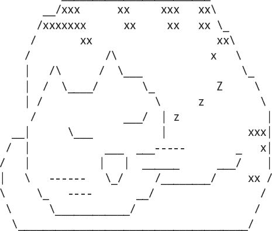
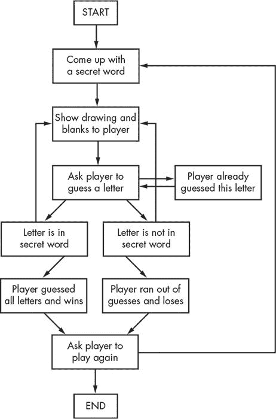
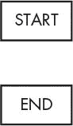
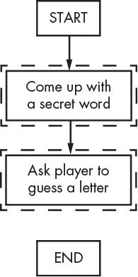
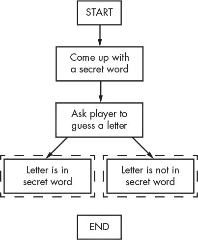
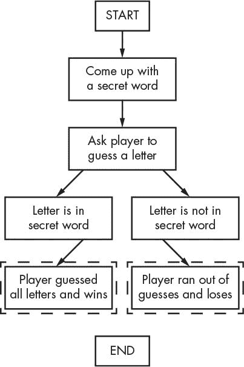
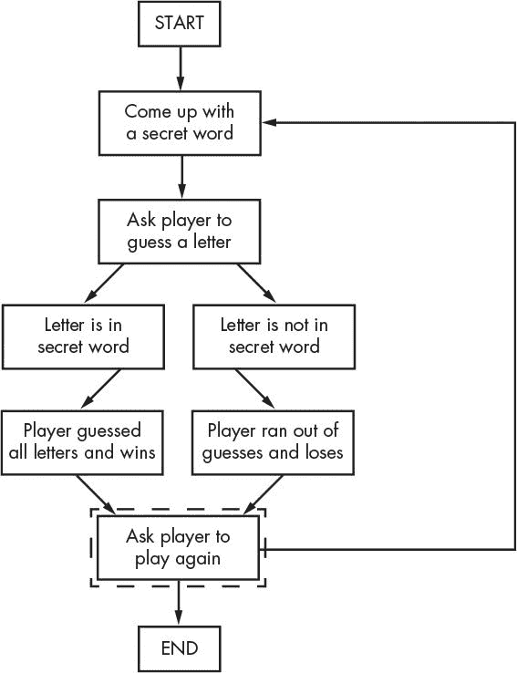
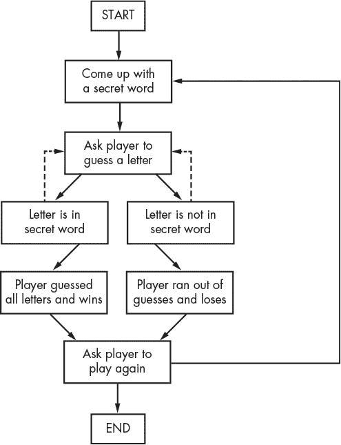
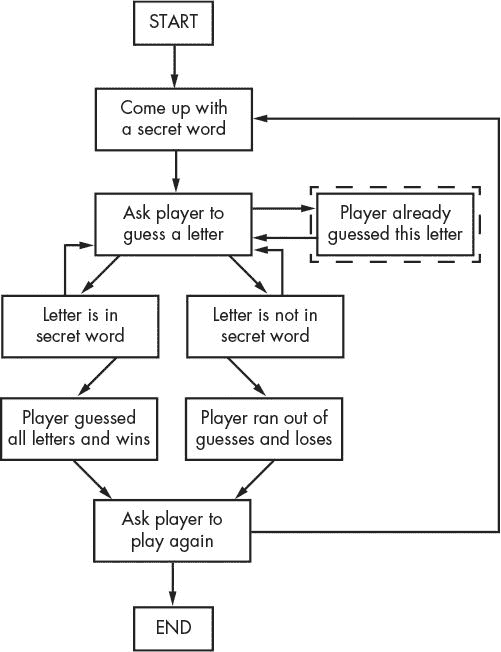

# 用流程图设计刽子手

> 原文：<https://inventwithpython.com/invent4thed/chapter7.html>


在这一章中，你将设计一个刽子手游戏。这个游戏比我们以前的游戏更复杂，但也更有趣。因为游戏是高级的，我们将首先通过在这一章创建一个流程图来仔细计划它。在第 8 章中，我们将真正为 Hangman 编写代码。

**本章涵盖的主题**

ASCII 艺术

用流程图设计程序

### **如何玩刽子手**

Hangman 是两个人玩的游戏，其中一个玩家想到一个单词，然后在页面上为单词中的每个字母画一个空行。然后第二个玩家试着猜测单词中可能的字母。

如果第二个玩家猜对了字母，第一个玩家把字母写在适当的空白处。但是如果第二个玩家猜错了，第一个玩家就画一个吊死人的单个身体部位。第二个玩家必须猜出单词中的所有字母，然后吊死的人才能被完全抽出来赢得游戏。

### **刽子手的试运行**

这是一个玩家运行刽子手程序时可能会看到的例子，你将在第 8 章中写。玩家输入的文本以粗体显示。

```py
H A N G M A N
  +---+
      |
      |
      |
     ===
Missed letters:
_ _ _
Guess a letter.
a
  +---+
      |
      |
      |
     ===
Missed letters:
_ a _
Guess a letter.
o
  +---+
  O   |
      |
      |
     ===
Missed letters: o
_ a _
Guess a letter.
r
  +---+
  O   |
  |   |
      |
     ===
Missed letters: or
_ a _
Guess a letter.
t
  +---+
  O   |
  |   |
      |
     ===
Missed letters: or
_ a t
Guess a letter.
a
You have already guessed that letter. Choose again.
Guess a letter.
c
Yes! The secret word is "cat"! You have won!
Do you want to play again? (yes or no)
no
```

### **ASCII 艺术**

Hangman 的图形是打印在屏幕上的键盘字符。这种图形被称为 *ASCII 艺术*(发音为 *ask-ee* )，是表情符号的一种前身。这是一只用 ASCII 艺术绘制的猫:



刽子手游戏的图片将看起来像这样的 ASCII 艺术:

```py
  +---+    +---+    +---+    +---+    +---+    +---+    +---+
      |    O   |    O   |    O   |    O   |    O   |    O   |
      |        |    |   |   /|   |   /|\  |   /|\  |   /|\  |
      |        |        |        |        |   /    |   / \  |
     ===      ===      ===      ===      ===      ===      ===
```

### **用流程图设计程序**

这个游戏比你到目前为止看到的要复杂一点，所以让我们花一点时间来思考它是如何组合在一起的。首先你要创建一个流程图(就像《龙族》游戏第 47 页上[的](#calibre_link-51)[图 5-1](#calibre_link-50) 中的那个)来帮助想象这个程序将会做什么。

如第 5 章中所述，流程图是用箭头连接的方框来表示一系列步骤的示意图。每个框代表一个步骤，箭头显示可能的后续步骤。将您的手指放在流程图的“开始”框上，沿着箭头到其他框来跟踪整个程序，直到您到达“结束”框。您只能沿箭头方向从一个框移动到另一个框。你永远不能后退，除非有一个箭头返回，就像在“玩家已经猜到了这个字母”框中一样。

图 7-1 是刽子手的完整流程图。



*图 7-1:刽子手游戏*的完整流程图

当然，你没有*有*做流程图；你可以开始写代码。但是通常一旦你开始编程，你会想到必须增加或改变的东西。您可能最终不得不删除大量代码，这将是一种浪费。为了避免这种情况，最好在开始编写程序之前就计划好程序将如何工作。

#### ***创建流程图**T3】*

你的流程图不必看起来像图 7-1 中的那个。只要*你*理解你的流程图，在你开始编码的时候会有帮助。你可以从一个开始框和一个结束框开始制作一个流程图，如图[图 7-2](#calibre_link-54) 所示。

现在想想当你玩刽子手时会发生什么。首先，计算机会想到一个秘密单词。然后玩家猜字母。为这些事件添加方框，如图[图 7-3](#calibre_link-55) 所示。每个流程图中的新方框都有虚线轮廓。



图 7-2:用一个开始框和一个结束框开始你的流程图。



*图 7-3:将 Hangman 的前两步画成带描述的方框。*

但是游戏不会在玩家猜中一个字母后就结束。该程序需要检查该字母是否在密码中。

#### ***从流程图框中分支出***

有两种可能:字母要么在单词里，要么不在。您将在流程图中添加两个新框，每个框对应一个案例。这在流程图中创建了一个分支，如图[图 7-4](#calibre_link-56) 所示。



*图 7-4:分支有两个箭头分别指向不同的方框。*

如果字母在秘密单词中，检查玩家是否已经猜出所有字母并赢得游戏。如果字母不在密语里，检查吊人是否完整，玩家是否输了。为这些箱子添加盒子。

流程图现在看起来像[图 7-5](#calibre_link-57) 。



*图 7-5:分支后，各步骤继续各自的路径。*

你不需要一个箭头从“字母在秘密单词中”框指向“玩家猜不到了，输了”框，因为如果玩家刚刚猜对了，他是不可能输的。如果玩家只是猜错了，也不可能赢，所以你也不需要画箭头。

#### ***结束或重启游戏***

一旦玩家赢了或输了，问他们是否想用一个新的秘密单词再玩一次。如果玩家不想再玩，程序结束；否则，程序继续并想出一个新的秘密词。这在[图 7-6](#calibre_link-58) 中显示。



*图 7-6:流程图要求玩家再玩一次后分支。*

#### ***再次猜测***

流程图现在看起来基本完成了，但是我们仍然缺少一些东西。首先，玩家不会只猜一次字母；他们一直猜字母，直到输赢。画两个新箭头，如图[图 7-7](#calibre_link-59) 所示。

如果玩家又猜中了同一个字母怎么办？与其再数一遍这个字母，不如让他们猜一个不同的字母。这个新的盒子如图 7-8 中的[所示。](#calibre_link-60)



*图 7-7:虚线箭头表示玩家可以再次猜测。*



*图 7-8:增加一个步骤，以防玩家猜出一个他们已经猜到的字母。*

如果玩家两次猜出同一个字母，流程图返回到“让玩家猜一个字母”框。

#### ***向玩家提供反馈***

玩家需要知道他们在游戏中的表现。程序应该向他们展示绞刑者的画像和秘密的单词(空白的字母他们还没有猜到)。这些视觉效果会让他们看到他们离比赛的输赢有多近。

每当玩家猜出一个字母时，该信息就会更新。在流程图的“想出一个秘密单词”框和“让玩家猜一个字母”框之间添加一个“向玩家显示图画和空白”框，如图[图 7-9](#calibre_link-61) 所示。


*图 7-9:添加一个“显示图纸和空白给玩家”框，给玩家反馈。*

看起来不错！这个流程图完整地描绘了刽子手游戏中可能发生的所有事情的顺序。当你设计自己的游戏时，流程图可以帮助你记住所有你需要编码的东西。

### **总结**

首先画出程序的流程图似乎是一项繁重的工作。毕竟人是要玩游戏的，不是看流程图的！但是在为程序编写代码之前，通过思考程序如何工作会更容易做出改变和发现问题。

如果你先开始写代码，你可能会发现需要你修改已经写好的代码的问题，浪费时间和精力。每次你修改代码时，你都冒着因修改太少或太多而产生新错误的风险。先知道自己要造什么，再去造，效率要高得多。现在我们有了流程图，让我们在第 8 章中创建刽子手程序！