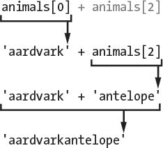
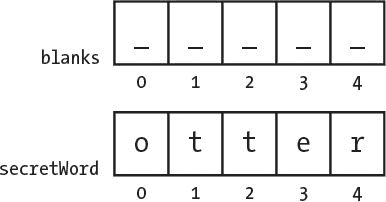
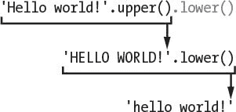
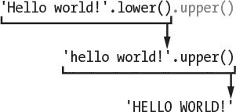

# 8 编写刽子手代码

> 原文：<https://inventwithpython.com/invent4thed/chapter8.html>


本章的游戏引入了许多新概念，但是不要担心:在实际编写游戏之前，您将在交互式 shell 中试验这些概念。您将了解到*方法*，它们是附加到值上的函数。您还将了解一种叫做*列表*的新数据类型。一旦你理解了这些概念，编程 Hangman 就容易多了。

**本章涵盖的主题**

列表

操作器中的

方法

split() ， lower() ， upper() ， startswith() 和 endswith() 字符串方法

elif 语句

### **刽子手的源代码**

这一章的游戏比之前的游戏要长一点，但是大部分是绞刑者图片的 ASCII 艺术。在文件编辑器中输入以下内容，并保存为 *hangman.py* 。如果输入以下代码后出现错误，请使用在线比较工具在 https://www.nostarch.com/inventwithpython#diff 的*T3 将您输入的代码与书中的代码进行比较。*


*hangman.py*

```py
  1\. import random
  2\. HANGMAN_PICS = ['''
  3.   +---+
  4.       |
  5.       |
  6.       |
  7.      ===''', '''
  8.   +---+
  9.   O   |
 10.       |
 11.       |
 12.      ===''', '''
 13.   +---+
 14.   O   |
 15.   |   |
 16.       |
 17.      ===''', '''
 18.   +---+
 19.   O   |
 20.  /|   |
 21.       |
 22.      ===''', '''
 23.   +---+
 24.   O   |
 25.  /|\  |
 26.       |
 27.      ===''', '''
 28.   +---+
 29.   O   |
 30.  /|\  |
 31.  /    |
 32.      ===''', '''
 33.   +---+
 34.   O   |
 35.  /|\  |
 36.  / \  |
 37.      ===''']
 38\. words = 'ant baboon badger bat bear beaver camel cat clam cobra cougar
       coyote crow deer dog donkey duck eagle ferret fox frog goat goose hawk
       lion lizard llama mole monkey moose mouse mule newt otter owl panda
       parrot pigeon python rabbit ram rat raven rhino salmon seal shark sheep
       skunk sloth snake spider stork swan tiger toad trout turkey turtle
       weasel whale wolf wombat zebra'.split()
 39.
 40\. def getRandomWord(wordList):
 41.     # This function returns a random string from the passed list of
           strings.
 42.     wordIndex = random.randint(0, len(wordList) - 1)
 43.     return wordList[wordIndex]
 44.
 45\. def displayBoard(missedLetters, correctLetters, secretWord):
 46.     print(HANGMAN_PICS[len(missedLetters)])
 47.     print()
 48.
 49.     print('Missed letters:', end=' ')
 50.     for letter in missedLetters:
 51.         print(letter, end=' ')
 52.     print()
 53.
 54.     blanks = '_' * len(secretWord)
 55.
 56.     for i in range(len(secretWord)): # Replace blanks with correctly
           guessed letters.
 57.         if secretWord[i] in correctLetters:
 58.             blanks = blanks[:i] + secretWord[i] + blanks[i+1:]
 59.
 60.     for letter in blanks: # Show the secret word with spaces in between
           each letter.
 61.         print(letter, end=' ')
 62.     print()
 63.
 64\. def getGuess(alreadyGuessed):
 65.     # Returns the letter the player entered. This function makes sure the
           player entered a single letter and not something else.
 66.     while True:
 67.         print('Guess a letter.')
 68.         guess = input()
 69.         guess = guess.lower()
 70.         if len(guess) != 1:
 71.             print('Please enter a single letter.')
 72.         elif guess in alreadyGuessed:
 73.             print('You have already guessed that letter. Choose again.')
 74.         elif guess not in 'abcdefghijklmnopqrstuvwxyz':
 75.             print('Please enter a LETTER.')
 76.         else:
 77.             return guess
 78.
 79\. def playAgain():
 80.     # This function returns True if the player wants to play again;
           otherwise, it returns False.
 81.     print('Do you want to play again? (yes or no)')
 82.     return input().lower().startswith('y')
 83.
 84.
 85\. print('H A N G M A N')
 86\. missedLetters = ''
 87\. correctLetters = ''
 88\. secretWord = getRandomWord(words)
 89\. gameIsDone = False
 90.
 91\. while True:
 92.     displayBoard(missedLetters, correctLetters, secretWord)
 93.
 94.     # Let the player enter a letter.
 95.     guess = getGuess(missedLetters + correctLetters)
 96.
 97.     if guess in secretWord:
 98.         correctLetters = correctLetters + guess
 99.
100.         # Check if the player has won.
101.         foundAllLetters = True
102.         for i in range(len(secretWord)):
103.             if secretWord[i] not in correctLetters:
104.                 foundAllLetters = False
105.                 break
106.         if foundAllLetters:
107.             print('Yes! The secret word is "' + secretWord +
                   '"! You have won!')
108.             gameIsDone = True
109.     else:
110.         missedLetters = missedLetters + guess
111.
112.         # Check if player has guessed too many times and lost.
113.         if len(missedLetters) == len(HANGMAN_PICS) - 1:
114.             displayBoard(missedLetters, correctLetters, secretWord)
115.             print('You have run out of guesses!\nAfter ' +
                   str(len(missedLetters)) + ' missed guesses and ' +
                   str(len(correctLetters)) + ' correct guesses,
                   the word was "' + secretWord + '"')
116.             gameIsDone = True
117.
118.     # Ask the player if they want to play again (but only if the game is
           done).
119.     if gameIsDone:
120.         if playAgain():
121.             missedLetters = ''
122.             correctLetters = ''
123.             gameIsDone = False
124.             secretWord = getRandomWord(words)
125.         else:
126.             break
```

### **导入随机模块**

Hangman 程序从单词列表中随机选择一个秘密单词让玩家猜。 random 模块将提供这种能力，所以 line 1 导入了它。

```py
1\. import random
```

但是第 2 行的 HANGMAN_PICS 变量看起来与我们目前看到的变量有些不同。为了理解这段代码的意思，我们需要学习更多的概念。

### **常量变量**

第 2 到 37 行是一个很长的赋值语句，用于变量 HANGMAN_PICS 。

```py
2\. HANGMAN_PICS = ['''
3.   +---+
4.       |
5.       |
6.       |
7.      ===''', '''
--snip--
37.     ===''']
```

HANGMAN_PICS 变量的名字全是大写字母。这是常量变量的编程惯例。*常量*是指其值从第一次赋值语句开始就不会改变的变量。虽然您可以像更改任何其他变量一样更改 HANGMAN_PICS 中的值，但是全大写的名称提醒您不要这样做。

就像所有的惯例一样，你不需要*遵循这个惯例。但是这样做可以让其他程序员更容易阅读你的代码。他们将知道 HANGMAN_PICS 将总是拥有从第 2 行到第 37 行赋予它的值。*

### **列表数据类型**

HANGMAN_PICS 包含多个多行字符串。它可以这样做，因为它是一个列表。列表有一个列表值，它可以包含几个其他值。在交互式 shell 中输入以下内容:

```py
>>> animals = ['aardvark', 'anteater', 'antelope', 'albert']
>>> animals
['aardvark', 'anteater', 'antelope', 'albert']
```

动物中的列表值包含四个值。列表值以左方括号开始，以右方括号结束。这就像字符串如何在引号中开始和结束一样。

逗号分隔列表中的各个值。这些值也被称为*项*。 HANGMAN_PICS 中的每一项都是多行字符串。

列表允许您存储多个值，而无需为每个值使用一个变量。如果没有列表，代码将如下所示:

```py
>>> animals1 = 'aardvark'
>>> animals2 = 'anteater'
>>> animals3 = 'antelope'
>>> animals4 = 'albert'
```

如果你有成百上千的字符串，这段代码将很难管理。但是列表可以很容易地包含任意数量的值。

#### ***访问带索引的项目***

您可以通过在列表变量的末尾添加方括号并在它们之间加一个数字来访问列表中的项目。方括号之间的数字是*索引*。在 Python 中，列表中第一项的索引是 0 。第二项位于索引 1 ，第三项位于索引 2 ，依此类推。因为索引开始于 0 而不是 1 ，我们说 Python 列表是*零索引*。

当我们仍然在交互式 shell 中使用动物列表时，输入 动物【0】， 动物【1】， 动物【2】和 动物【3】来查看它们如何评估:

```py
>>> animals[0]
'aardvark'
>>> animals[1]
'anteater'
>>> animals[2]
'antelope'
>>> animals[3]
'albert'
```

注意，列表中的第一个值‘土豚’存储在索引 0 中，而不是索引 1 中。列表中的每一项从 0 开始依次编号。

使用方括号，您可以像对待任何其他值一样对待列表中的项目。例如，在交互 shell 中输入 动物[0] +动物[2] :

```py
>>> animals[0] + animals[2]
'aardvarkantelope'
```

在动物的索引 0 和 2 处的两个变量都是字符串，所以值被连接起来。评估是这样的:



##### **超出范围的指数和指数误差**

如果你试图访问一个太高而不在列表中的索引，你会得到一个 IndexError ，这会使你的程序崩溃。要查看此错误的示例，请在交互式 shell 中输入以下内容:

```py
>>> animals = ['aardvark', 'anteater', 'antelope', 'albert']
>>> animals[9999]
Traceback (most recent call last):
  File "", line 1, in
    animals[9999]
IndexError: list index out of range
```

因为索引 9999 处没有值，所以会出现错误。

##### **用索引分配改变列表项**

您还可以使用*索引赋值*来更改列表中某个项目的值。在交互式 shell 中输入以下内容:

```py
>>> animals = ['aardvark', 'anteater', 'antelope', 'albert']
>>> animals[1] = 'ANTEATER'
>>> animals
['aardvark', 'ANTEATER', 'antelope', 'albert']
```

新的‘食蚁兽’字符串覆盖了动物列表中的第二项。因此键入 animals[1] 本身会计算出列表的当前第二项，但是在赋值操作符的左侧使用它会给列表的第二项赋值。

#### ***列表串联***

您可以使用 + 操作符将几个列表合并成一个列表，就像处理字符串一样。这样做被称为*列表连接*。要查看这一过程，请在交互式 shell 中输入以下内容:

```py
>>> [1, 2, 3, 4] + ['apples', 'oranges'] + ['Alice', 'Bob']
[1, 2, 3, 4, 'apples', 'oranges', 'Alice', 'Bob']
```

['苹果'] + ['橘子'] 将评估为 ['苹果'，'橘子'] 。但是[‘苹果’]+‘橘子’会导致错误。不能用 + 运算符将列表值和字符串值相加。如果要在不使用列表串联的情况下将值添加到列表末尾，请使用 append() 方法(在第 95 页的 [The reverse() 和 append() 列表方法](#calibre_link-24)中有所描述)。

#### ***在运算符***

操作符中的可以告诉你一个值是否在列表中。在运算符中使用的表达式返回一个布尔值:如果值在列表中，则返回 True ，如果不在列表中，则返回 False 。在交互式 shell 中输入以下内容:

```py
>>> animals = ['aardvark', 'anteater', 'antelope', 'albert']
>>> 'antelope' in animals
True
>>> 'ant' in animals
False
```

动物中的表达式‘羚羊’返回 True ，因为字符串‘羚羊’是动物列表中的值之一。它位于索引 2 处。但是当你在 animals 中输入表达式‘ant’时，它返回 False ，因为字符串‘ant’在列表中不存在。

操作符中的也适用于字符串，检查一个字符串是否存在于另一个字符串中。在交互式 shell 中输入以下内容:

```py
>>> 'hello' in 'Alice said hello to Bob.'
True
```

在 HANGMAN_PICS 变量中存储多行字符串的列表涵盖了很多概念。例如，您看到列表对于在单个变量中存储多个值非常有用。您还学习了一些使用列表的技术，比如索引赋值和列表连接。方法是你将学习如何在刽子手游戏中使用的另一个新概念；我们接下来将探索它们。

### **调用方法**

一个*方法*是一个附属于一个值的函数。若要调用方法，必须使用句点将其附加到特定值。Python 有许多有用的方法，我们将在 Hangman 程序中使用其中的一些。

但是首先，让我们看看一些列表和字符串方法。

#### ***反转()和追加()列表方法***

列表数据类型有两个您可能会经常用到的方法: reverse() 和 append() 。方法的作用是:反转列表中条目的顺序。尝试输入 spam = [1，2，3，4，5，6，'喵'，' woof'] ，然后输入 spam.reverse() 来反转列表。然后输入 spam 查看变量的内容。

```py
>>> spam = [1, 2, 3, 4, 5, 6, 'meow', 'woof']
>>> spam.reverse()
>>> spam
['woof', 'meow', 6, 5, 4, 3, 2, 1]
```

您将使用的最常见的列表方法是 append() 。该方法会将您作为参数传递的值添加到列表的末尾。尝试在交互式 shell 中输入以下内容:

```py
>>> eggs = []
>>> eggs.append('hovercraft')
>>> eggs
['hovercraft']
>>> eggs.append('eels')
>>> eggs
['hovercraft', 'eels']
```

这些方法确实改变了它们被调用的列表。他们不会返回新的列表。我们说这些方法改变了列表*的位置*。

#### ***【分裂()串法】***

string 数据类型有一个 split() 方法，该方法返回由已拆分的字符串组成的字符串列表。通过在交互式 shell 中输入以下内容，尝试使用 split() 方法:

```py
>>> sentence = input()
My very energetic mother just served us nachos.
>>> sentence.split()
['My', 'very', 'energetic', 'mother', 'just', 'served', 'us', 'nachos.']
```

结果是一个包含八个字符串的列表，原始字符串中的每个单词对应一个字符串。只要字符串中有空格，就会发生拆分。空格不包含在列表的任何项目中。

Hangman 程序的第 38 行也使用了 split() 方法，如下所示。代码很长，但它实际上只是一个简单的赋值语句，有一长串由空格分隔的单词，最后有一个 split() 方法调用。 split() 方法计算出一个列表，其中字符串中的每个单词都是一个列表项。

```py
38\. words = 'ant baboon badger bat bear beaver camel cat clam cobra cougar
      coyote crow deer dog donkey duck eagle ferret fox frog goat goose hawk
      lion lizard llama mole monkey moose mouse mule newt otter owl panda
      parrot pigeon python rabbit ram rat raven rhino salmon seal shark sheep
      skunk sloth snake spider stork swan tiger toad trout turkey turtle
      weasel whale wolf wombat zebra'.split()
```

用 split() 写这个程序更简单。如果你首先创建一个列表，你必须键入[‘蚂蚁’，‘狒狒’，‘獾’，等等，每个单词都要用引号和逗号隔开。

你也可以在第 38 行的字符串中添加你自己的单词，或者删除任何你不想出现在游戏中的单词。只要确保单词之间用空格隔开。

### **从单词列表中获取秘密单词**

第 40 行定义了 getRandomWord() 函数。将为其单词列表参数传递一个列表参数。该函数将从单词表的列表中返回一个秘密单词。

```py
40\. def getRandomWord(wordList):
41.     # This function returns a random string from the passed list of
          strings.
42.     wordIndex = random.randint(0, len(wordList) - 1)
43.     return wordList[wordIndex]
```

在第 42 行，我们通过用两个参数调用 randint() 将这个列表的随机索引存储在 wordIndex 变量中。第一个参数是 0 (用于第一个可能的索引)，第二个参数是表达式 len(单词列表)- 1 计算的值(用于单词列表中最后一个可能的索引)。

记住列表索引从 0 开始，而不是从 1 开始。如果你有一个三项列表，第一项的索引是 0 ，第二项的索引是 1 ，第三项的索引是 2 。这个列表的长度是 3，但是索引 3 将在最后一个索引之后。这就是为什么第 42 行从字表的长度中减去 1 的原因。无论单词表的大小如何，第 42 行的代码都将工作。如果你愿意，现在你可以在单词表中添加或删除字符串。

对于作为单词列表参数传递的列表，单词索引变量将被设置为随机索引。第 43 行将返回存储在 wordIndex 中的整数处的单词列表中的元素。

让我们假设 ['apple '，' orange '，grape'] 作为参数被传递给 getRandomWord() ，并且 randint(0，2) 返回整数 2 。这意味着第 43 行将计算为返回单词列表[2] ，然后计算为返回‘葡萄’。这就是 getRandomWord() 在单词列表中返回随机字符串的方式。

因此， getRandomWord() 的输入是一个字符串列表，返回值输出是从该列表中随机选择的字符串。在刽子手游戏中，这是如何选择一个秘密单词让玩家猜。

### **向玩家显示棋盘**

接下来，您需要一个函数在屏幕上打印刽子手板。它还应该显示玩家猜对(和猜错)了多少个字母。

```py
45\. def displayBoard(missedLetters, correctLetters, secretWord):
46.     print(HANGMAN_PICS[len(missedLetters)])
47.     print()
```

这段代码定义了一个名为 displayBoard() 的新函数。该函数有三个参数:

玩家已经猜到不在密语中的一串字母

更正字母 玩家已经猜到的密语中的一串字母

secretWord 玩家试图猜测的一串秘密单词

第一个 print() 函数调用将显示纸板。全局变量 HANGMAN_PICS 有每个可能棋盘的字符串列表。(记住全局变量可以从函数内部读取。) HANGMAN_PICS[0] 显示一个空绞刑架， HANGMAN_PICS[1] 显示头部(当玩家漏掉一个字母时)， HANGMAN_PICS[2] 显示头部和身体(当玩家漏掉两个字母时)，以此类推，直到 HANGMAN_PICS[6] ，显示完整的绞刑人。

未猜中字母中的字母数将反映玩家猜错的次数。打电话给 len(missedLetters) 找出这个号码。所以，如果的 missedLetters 是‘aetr’，那么len(‘aetr’)将返回 4 。打印 HANGMAN_PICS[4] 将显示四次未命中的相应 HANGMAN 图片。这就是第 46 行的HANGMAN _ PICS[len(missed letters)]的计算结果。

第 49 行打印字符串 'Missed letters:' ,在末尾有一个空格字符，而不是换行符:

```py
49.     print('Missed letters:', end=' ')
50.     for letter in missedLetters:
51.         print(letter, end=' ')
52.     print()
```

第 50 行的循环的将遍历字符串中的每个字符，并将其打印在屏幕上。记住 end=' ' 会用一个空格字符替换字符串后面的换行符。例如，如果漏写的字母是‘ajtw’，这个 for loop 会显示 a j t w 。

其余的 displayBoard() 函数(第 54 行到第 62 行)显示遗漏的字母，并用所有尚未猜到的字母作为空白来创建密码字符串。它使用 range() 函数和列表切片来实现这一点。

#### ***list()和 range()函数***

当用一个参数调用时， range() 将返回一个从 0 到(但不包括)该参数的整数范围对象。这个 range 对象在中用于循环，但也可以用 list() 函数转换成更熟悉的列表数据类型。进入列表(range(10)) 进入交互 shell:

```py
>>> list(range(10))
[0, 1, 2, 3, 4, 5, 6, 7, 8, 9]
>>> list('Hello')
['H', 'e', 'l', 'l', 'o']
```

list() 函数类似于 str() 或 int() 函数。它接受传递的值并返回一个列表。用 range() 函数很容易生成巨大的列表。例如，在交互 shell 中输入 列表(范围(10000)) :

```py
>>> list(range(10000))
[0, 1, 2, 3, 4, 5, 6, 7, 8, 9, 10, 11, 12, 13, 14, 15,...
      --snip--
...9989, 9990, 9991, 9992, 9993, 9994, 9995, 9996, 9997, 9998, 9999]
```

这个列表太大了，屏幕都放不下。但是您可以将列表存储在一个变量中:

```py
>>> spam = list(range(10000))
```

如果您向 range() 传递两个整数参数，则它返回的 range 对象是从第一个整数参数到第二个整数参数(但不包括第二个整数参数)。接下来进入 列表(范围(10，20)) 进入如下交互 shell:

```py
>>> list(range(10, 20))
[10, 11, 12, 13, 14, 15, 16, 17, 18, 19]
```

如你所见，我们的列表只到 19，不包括 20。

#### ***列表和字符串切片***

*列表切片*使用另一个列表项目的子集创建一个新的列表值。要分割列表，请指定两个索引(开头和结尾),并在列表名称后的方括号中加上冒号。例如，在交互式 shell 中输入以下内容:

```py
>>> spam = ['apples', 'bananas', 'carrots', 'dates']
>>> spam[1:3]
['bananas', 'carrots']
```

表达式 spam[1:3] 计算出一个列表，其中包含从索引 1 到索引 3 的 spam 中的项目。

如果你遗漏了第一个索引，Python 会自动认为你想要索引 0 为第一个索引:

```py
>>> spam = ['apples', 'bananas', 'carrots', 'dates']
>>> spam[:2]
['apples', 'bananas']
```

如果您遗漏了第二个索引，Python 会自动认为您需要列表的其余部分:

```py
>>> spam = ['apples', 'bananas', 'carrots', 'dates']
>>> spam[2:]
['carrots', 'dates']
```

您也可以像在列表中使用切片一样在字符串中使用切片。字符串中的每个字符就像列表中的一项。在交互式 shell 中输入以下内容:

```py
>>> myName = 'Zophie the Fat Cat'
>>> myName[4:12]
'ie the F'
>>> myName[:10]
'Zophie the'
>>> myName[7:]
'the Fat Cat'
```

Hangman 代码的下一部分使用切片。

#### ***用空格显示密码***

现在你想打印这个秘密的单词，但是要为没有被猜到的字母留出空行。为此，您可以使用下划线字符( _ )。首先创建一个字符串，该字符串中的每个字母只有一个下划线。然后替换正确字母中每个字母的空格。

因此，如果密语是‘otter’，那么空出来的字符串将是‘_ _ _ _ _’(五个下划线)。如果正确的字母是字符串‘rt’，你就把字符串改成【T8’_ TT _ r’。第 54 行到第 58 行是执行该操作的代码部分:

```py
54.     blanks = '_' * len(secretWord)
55.
56.     for i in range(len(secretWord)): # Replace blanks with correctly
          guessed letters.
57.         if secretWord[i] in correctLetters:
58.             blanks = blanks[:i] + secretWord[i] + blanks[i+1:]
```

第 54 行使用字符串复制创建了充满下划线的空格变量。请记住， * 运算符可以用于字符串和整数，因此表达式 '_' * 5 的计算结果为' _ _ _ _ _ _ '。这将确保空格的下划线数量与 secretWord 的字母数量相同。

第 56 行有一个用于循环，该循环遍历 secretWord 中的每个字母，并用实际字母替换下划线，如果它存在于 correctLetters 中的话。

让我们再来看看前面的例子，其中secret world的值是‘水獭’，而 correctLetters 中的值是‘tr’。您可能希望向玩家显示字符串 '_tt_r' 。让我们弄清楚如何创建这个字符串。

第 56 行的len(secret world)调用将返回 5 。range(len(secret world))调用变成 range(5) ，使得循环的迭代 0 、 1 、 2 、 3 和 4 。

因为 i 的值将采用【0，1，2，3，4】中的每个值，所以循环的中的代码如下所示:

```py
if secretWord[0] in correctLetters:
    blanks = blanks[:0] + secretWord[0] + blanks[1:]

if secretWord[1] in correctLetters:
    blanks = blanks[:1] + secretWord[1] + blanks[2:]
--snip--
```

我们只显示了循环中的前两次迭代，但是从 0 开始， i 将取该范围内每个数字的值。在第一次迭代中， i 取值 0 ，因此 if 语句检查 secretWord 中索引 0 处的字母是否在正确字母中。循环对 secretWord 中的每个字母都这样做，一次一个字母。

如果你对secret world[0]或 blanks[3:] 之类的东西的值感到困惑，看看[图 8-1](#calibre_link-26) 。它显示了 secretWord 和 blanks 变量的值以及字符串中每个字母的索引。



*图 8-1:*`blanks`*和* `secretWord` *字符串的索引*

如果用列表片和列表索引代表的值替换它们，循环代码如下所示:

```py
if 'o' in 'tr': # False
    blanks = '' + 'o' + '____' # This line is skipped.
--snip--
if 'r' in 'tr': # True
    blanks = '_tt_' + 'r' + '' # This line is executed.

# blanks now has the value '_tt_r'.
```

当secret world为‘otter’correct letters为‘tr’时，前面的代码示例都做*同样的事情*。接下来的几行代码打印出空格的新值，每个字母之间有空格:

```py
60.     for letter in blanks: # Show the secret word with spaces in between
          each letter.
61.         print(letter, end=' ')
62.     print()
```

注意第 60 行的循环的没有调用 range() 函数。该函数调用不是迭代返回 range 对象，而是迭代空格变量中的字符串值。在每次迭代中，字母变量从空格中的‘otter’字符串中获取一个新字符。

添加空格后的打印输出将是 '_ t t _ r' 。

### **获得玩家的猜测**

将调用 getGuess() 函数，以便玩家可以输入一个字母进行猜测。该函数将玩家猜测的字母作为字符串返回。此外， getGuess() 将确保播放器在从函数返回之前键入有效的字母。

```py
64\. def getGuess(alreadyGuessed):
65.     # Returns the letter the player entered. This function makes sure the
          player entered a single letter and not something else.
```

玩家已经猜到的一串字母作为参数已经被传递给了。然后 getGuess() 函数让玩家猜一个字母。这个字母将是 getGuess() 的返回值。现在，因为 Python 是区分大小写的，我们需要确保玩家的猜测是小写字母，这样我们就可以对照秘密单词进行检查。这就是使用 lower() 方法的原因。

#### ***下层()和上层()字符串方法***

输入‘你好世界！’。lower()进入交互 shell 查看 lower() 方法的例子:

```py
>>> 'Hello world!'.lower()
'hello world!'
```

lower() 方法返回一个包含所有小写字符的字符串。还有一个用于字符串的 upper() 方法，它返回一个所有字符都是大写的字符串。进入‘你好，世界！’试试吧。上层()进入交互外壳:

```py
>>> 'Hello world!'.upper()
'HELLO WORLD!'
```

因为 upper() 方法返回一个字符串，所以你也可以在这个字符串上调用一个方法。

现在在交互式 shell 中输入以下内容:

```py
>>> 'Hello world!'.upper().lower()
'hello world!'
```

“你好，世界！”。upper() 计算出字符串‘HELLO WORLD！’，然后字符串的 lower() 方法被调用。这将返回字符串‘hello world！，评估中的最终值:



顺序很重要。“你好，世界！”。降低()。upper() 和‘你好，世界！’不一样。鞋帮()。下():

```py
>>> 'Hello world!'.lower().upper()
'HELLO WORLD!'
```

这个评估看起来是这样的:



如果字符串存储在变量中，也可以对该变量调用字符串方法:

```py
>>> spam = 'Hello world!'
>>> spam.upper()
'HELLO WORLD!'
```

这段代码不会改变 spam 中的值。 spam 变量仍将包含‘Hello world！’。

回到 Hangman 程序，当我们询问玩家的猜测时，我们使用 lower() :

```py
66.     while True:
67.         print('Guess a letter.')
68.         guess = input()
69.         guess = guess.lower()
```

现在，即使玩家输入大写字母作为猜测， getGuess() 函数也会返回小写字母。

#### ***离开 while 循环***

第 66 行的 while 循环将继续要求玩家输入一个字母，直到他们输入一个之前没有被猜到的字母。

当循环的条件是简单的布尔值真。这意味着执行离开这个循环的唯一方式是执行一个 break 语句，它会离开循环，或者执行一个 return 语句，它不仅会离开循环，还会离开整个函数。

循环内部的代码要求玩家输入一个字母，这个字母存储在变量 guess 中。如果玩家输入一个大写字母，它将在第 69 行被一个小写字母覆盖。

### **elif 语句**

Hangman 程序的下一部分使用了 elif 语句。你可以把 elif 或者“else-if”语句想成是在说，“如果这是真的，就这么做。否则如果下一个条件为真，就这么做。否则，如果没有一个是真的，做这最后一件事。”看一下下面的代码:

```py
if catName == 'Fuzzball':
    print('Your cat is fuzzy.')
elif catName == 'Spots':
    print('Your cat is spotted.')
else:
    print('Your cat is not fuzzy or spotted.')
```

如果猫名变量等于字符串‘模糊球’，那么 if 语句的条件为真，并且 if 块告诉用户他们的猫是模糊的。然而，如果这个条件为假，那么 Python 接下来会尝试 elif 语句的条件。如果猫名是‘斑点’，那么字符串‘你的猫有斑点。’打印到屏幕上。如果两者都是假，那么代码告诉用户他们的猫不是模糊的或者有斑点的。

您可以拥有任意多的 elif 语句:

```py
if catName == 'Fuzzball':
    print('Your cat is fuzzy.')
elif catName == 'Spots':
    print('Your cat is spotted.')
elif catName == 'Chubs':
    print('Your cat is chubby.')
elif catName == 'Puff':
    print('Your cat is puffy.')
else:
    print('Your cat is neither fuzzy nor spotted nor chubby nor puffy.')
```

当 elif 条件之一为真时，其代码被执行，然后执行跳转到经过 else 块的第一行。所以*如果-elif-else语句将执行中的一个*、*且只有一个*。如果不需要的话，也可以去掉 else 块，只使用 if - elif 语句。

### **确保玩家输入了有效的猜测**

guess 变量包含玩家的字母猜测。程序需要确保他们输入了一个有效的猜测:一个，而且只有一个，还没有被猜到的字母。如果他们没有，执行将返回并再次要求他们提供一封信。

```py
70.         if len(guess) != 1:
71.             print('Please enter a single letter.')
72.         elif guess in alreadyGuessed:
73.             print('You have already guessed that letter. Choose again.')
74.         elif guess not in 'abcdefghijklmnopqrstuvwxyz':
75.             print('Please enter a LETTER.')
76.         else:
77.             return guess
```

第 70 行的条件检查猜测是否不是一个字符长，第 72 行的条件检查猜测是否已经存在于已经使用的变量中，第 74 行的条件检查猜测是否不是标准英语字母表中的字母。如果这些条件中的任何一个为真，游戏将提示玩家输入新的猜测。

如果所有这些条件都是假，那么 else 语句的块执行，并且 getGuess() 在第 77 行返回 guess 中的值。

记住，一条if-elif-else语句中只有一个块会被执行。

### **要求玩家再玩一次**

playAgain() 函数只有一个 print() 函数调用和一个 return 语句:

```py
79\. def playAgain():
80.     # This function returns True if the player wants to play again;
          otherwise, it returns False.
81.     print('Do you want to play again? (yes or no)')
82.     return input().lower().startswith('y')
```

return 语句有一个看起来很复杂的表达式，但是你可以分解它。如果用户输入 YES ，这里将一步一步看 Python 如何评估这个表达式:


play again()函数的作用是让玩家输入 yes 或 no 来告诉程序他们是否想再玩一轮 Hangman。玩家应该能够键入 YES 、 yes 、 Y ，或者任何以 y 开头的字符来表示“是”如果玩家输入 YES ，那么 input() 的返回值就是字符串 'YES' 。和‘是’。lower() 返回附加字符串的小写版本。所以的返回值为‘是’。下()是‘是’。

但是还有第二个方法调用，以(' y') 开始。如果关联字符串以括号中的字符串参数开头，该函数返回 True ，否则返回 False 。的返回值为‘是’。startswith('y') 为真。

就是这样——你评估了这个表达式！它让玩家输入一个响应，将响应设置为小写，检查它是否以字母 y 开头，如果是，则返回 True ，否则返回 False 。

顺便提一下，还有一个ends with(some string)string 方法，如果字符串以 someString 中的字符串结尾，该方法将返回 True ，否则返回 False 。 endswith() 有点像 startswith() 的反义词。

### **回顾刽子手的职能**

这就是我们为这个游戏创造的所有功能！让我们回顾一下:

【getRandomWord(word list)获取传递给它的字符串列表，并从中返回一个字符串。这就是如何选择一个单词让玩家去猜。

【display board(missed letters，correctLetters，secretWord) 显示棋盘的当前状态，包括目前为止玩家已经猜出了多少秘密单词，以及玩家已经猜错的字母。这个函数需要传递三个参数才能正常工作。正确的字母和错误的字母是由玩家已经猜到的分别在和不在秘密单词中的字母组成的字符串。并且 secretWord 是玩家试图猜测的秘密单词。这个函数没有返回值。

【get guess】取一串玩家已经猜到的字母，并不断要求玩家输入一个不在中的字母。这个函数返回玩家猜测的有效字母的字符串。

playAgain() 询问玩家是否想再玩一轮 Hangman。如果玩家这样做，这个函数返回真，如果玩家不这样做，返回假。

在函数之后，程序主要部分的代码从第 85 行开始。到目前为止，所有的东西都只是函数定义和一个大的赋值语句给 HANGMAN_PICS 。

### **游戏循环**

Hangman 程序的主要部分显示游戏名称，设置一些变量，并执行一个 while 循环。本节将逐步介绍程序的其余部分。

```py
85\. print('H A N G M A N')
86\. missedLetters = ''
87\. correctLetters = ''
88\. secretWord = getRandomWord(words)
89\. gameIsDone = False
```

第 85 行是游戏运行时执行的第一个 print() 调用。它显示游戏的标题。接下来，空白字符串被分配给变量错过的字母和正确的字母，因为玩家还没有猜到任何错过的或正确的字母。

第 88 行的 getRandomWord(words) 调用将评估从单词列表中随机选择的单词。

第 89 行将 gameIsDone 设置为假。当代码想要发出游戏结束的信号并询问玩家是否想再玩一次时，它会将 gameIsDone 设置为 True 。

#### ***调用 displayBoard()函数***

程序的剩余部分由一个 while 循环组成。循环的条件总是真，这意味着它将永远循环下去，直到遇到中断语句。(这发生在后面的第 126 行。)

```py
91\. while True:
92.     displayBoard(missedLetters, correctLetters, secretWord)
```

第 92 行调用 displayBoard() 函数，向其传递第 86、87 和 88 行设置的三个变量。根据玩家猜对和错过的字母数，这个函数向玩家显示适当的刽子手棋盘。

#### ***让玩家输入他们的猜测***

接下来调用 getGuess() 函数，这样玩家可以输入他们的猜测。

```py
94.     # Let the player enter a letter.
95.     guess = getGuess(missedLetters + correctLetters)
```

getGuess() 函数需要一个已经过的参数，这样它可以检查玩家是否输入了他们已经猜到的字母。第 95 行连接了 missedLetters 和 correctLetters 变量中的字符串，并将结果作为已经获得的参数的自变量传递。

#### ***检查信件是否在密语中***

如果猜测字符串存在于secret world中，那么这段代码将猜测连接到正确字母字符串的末尾:

```py
97.     if guess in secretWord:
98.         correctLetters = correctLetters + guess
```

该字符串将成为修正字母的新值。

#### ***检查玩家是否赢得***

程序如何知道玩家是否已经猜到了密语中的每一个字母？嗯， correctLetters 有玩家猜对的每个字母，secret world就是密语本身。但你不能简单地检查是否正确 letters = = secret world。如果 secretWord 是字符串、【otter】和 correctLetters 是字符串、【orte】，那么correct letters = = secret word将是 False ，即使玩家*已经*猜出了秘密单词中的每个字母。

你能确定玩家赢了的唯一方法是迭代secret world中的每个字母，看看它是否存在于 correctLetters 中。当且仅当秘密世界中的每个字母都存在于正确字母中时，玩家获胜。

```py
100.         # Check if the player has won.
101.         foundAllLetters = True
102.         for i in range(len(secretWord)):
103.             if secretWord[i] not in correctLetters:
104.                 foundAllLetters = False
105.                 break
```

如果你在 secretWord 中发现一个 correctLetters 中不存在的字母，你就知道玩家已经*而不是*猜中了所有的字母。在循环开始之前，第 101 行上的新变量 foundAllLetters 被设置为 True 。循环开始时假设已经找到了秘密单词中的所有字母。但是第 104 行的循环代码会在第一次发现 secretWord 中的字母不在 correctLetters 中时，将 foundAllLetters 改为 False 。

如果找到了秘密单词中的所有字母，玩家被告知他们赢了，并且 gameIsDone 被设置为 True :

```py
106.         if foundAllLetters:
107.             print('Yes! The secret word is "' + secretWord +
                   '"! You have won!')
108.             gameIsDone = True
```

#### ***处理一次猜错***

第 109 行是 else 块的开始。

```py
109.     else:
110.         missedLetters = missedLetters + guess
```

记住，如果条件为假，这个块中的代码将会执行。但是什么条件呢？要找到答案，将手指指向 else 关键字的开头，然后直接向上移动。你会看到第 97 行的 else 关键字的缩进和 if 关键字的缩进是一样的:

```py
97.     if guess in secretWord:
--snip--
109.     else:
110.         missedLetters = missedLetters + guess
```

因此，如果第 97 行的条件(在 secret world中猜测)为假，那么执行将移动到这个 else 块。

第 110 行的 missedLetters 串中连接了猜错的字母。这就像第 98 行对玩家猜对的字母所做的一样。

#### ***检查玩家是否输了***

每当玩家猜错时，代码会将错误的字母连接到 missedLetters 中的字符串。所以误信的长度——或者用代码来说， len(误信)——也是错误猜测的次数。

```py
112.         # Check if player has guessed too many times and lost.
113.         if len(missedLetters) == len(HANGMAN_PICS) - 1:
114.             displayBoard(missedLetters, correctLetters, secretWord)
115.             print('You have run out of guesses!\nAfter ' +
                   str(len(missedLetters)) + ' missed guesses and ' +
                   str(len(correctLetters)) + ' correct guesses,
                   the word was "' + secretWord + '"')
116.             gameIsDone = True
```

HANGMAN_PICS 列表有七个 ASCII 艺术字符串。所以当 missedLetters 字符串的长度等于 len(HANGMAN_PICS) - 1 (即 6 )时，玩家已经用完了猜测。你知道玩家已经输了，因为吊人图就要完成了。记住， HANGMAN_PICS[0] 是列表的第一项， HANGMAN_PICS[6] 是最后一项。

第 115 行打印密码，第 116 行将 gameIsDone 变量设置为 True 。

```py
118.     # Ask the player if they want to play again (but only if the game is
           done).
119.     if gameIsDone:
120.         if playAgain():
121.             missedLetters = ''
122.             correctLetters = ''
123.             gameIsDone = False
124.             secretWord = getRandomWord(words)
```

#### ***结束或重置游戏***

在猜中他们的字母后，无论玩家赢了还是输了，游戏都应该问玩家是否想再玩一次。 playAgain() 函数处理从玩家那里得到是或否，所以它在第 120 行被调用。

如果玩家确实想再玩一次，必须将误信和正确信中的值重置为空字符串，将游戏代码重置为假，并将一个新的密码存储在 secretWord 中。这样，当执行循环回到的开始，而循环到第 91 行时，棋盘将被重置为新游戏。

如果玩家在被问及是否想再玩一次时没有输入以 y 开头的内容，那么 line 120 的条件将是假，并且 else 块将执行:

```py
125.         else:
126.             break
```

break 语句导致执行跳转到循环后的第一条指令。但是因为循环后没有更多的指令，程序终止。

### **总结**

《刽子手》是我们迄今为止最先进的游戏，在制作过程中，你已经学到了一些新概念。随着你的游戏变得越来越复杂，给你的程序画一个流程图是个好主意。

列表是可以包含其他值的值。方法是附加到值上的函数。列表有一个 append() 方法。字符串有 lower() 、 upper() 、 split() 、 startswith() 、 endswith() 方法。在本书的其余部分，您将了解到更多的数据类型和方法。

elif 语句允许您在 if - else 语句中间添加一个“否则-if”子句。