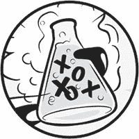
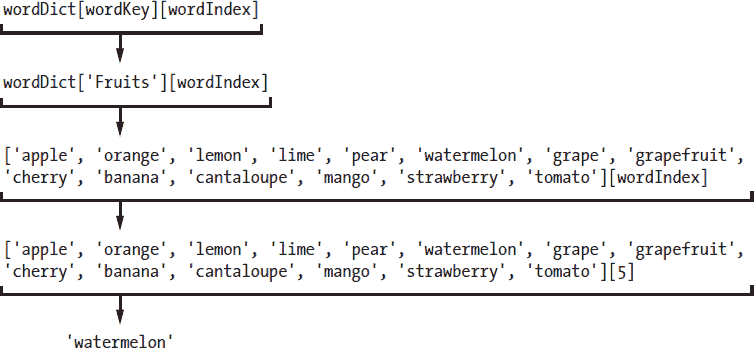

# 9 延伸刽子手

> 原文：<https://inventwithpython.com/invent4thed/chapter9.html>



现在你已经创建了一个基本的刽子手游戏，让我们看看你可以用新的特性来扩展它的一些方法。在这一章中，你将添加多个单词集供电脑使用，并能改变游戏的难度。

**本章涵盖的主题**

字典数据类型

键值对

键()和值()字典方法

多变量赋值

### **增加更多猜测**

在你玩过几次 Hangman 之后，你可能会认为六次猜测对于玩家来说是不够的。通过向 HANGMAN_PICS 列表中添加更多的多行字符串，您可以很容易地给他们更多的猜测。

将你的 *hangman.py* 程序另存为 *hangman2.py* 。然后在第 37 行及之后添加以下指令，以扩展包含 hanging man ASCII 艺术的列表:

```py
37.       ===''', '''
38.    +---+
39.   [O   |
40.   /|\  |
41.   / \  |
42.       ===''', '''
43.    +---+
44.   [O]  |
45.   /|\  |
46.   / \  |
47.       ===''']
```

这段代码向 HANGMAN_PICS 列表添加了两个新的多行字符串，一个绘制了绞刑者的左耳，另一个绘制了双耳。因为程序会根据len(missed letters)= = len(HANGMAN _ PICS)-1告诉玩家他们已经输了，这是你唯一需要做的改动。程序的其余部分与新的 HANGMAN_PICS 列表配合得很好。

### **字典数据类型**

在 Hangman 程序的第一个版本中，我们使用了一个动物单词表，但是你可以在第 48 行修改单词表。你可以用颜色代替动物:

```py
48\. words = 'red orange yellow green blue indigo violet white black brown'
      .split()
```

或形状:

```py
48\. words = 'square triangle rectangle circle ellipse rhombus trapezoid
      chevron pentagon hexagon septagon octagon'.split()
```

或水果:

```py
48\. words = 'apple orange lemon lime pear watermelon grape grapefruit cherry
      banana cantaloupe mango strawberry tomato'.split()
```

通过一些修改，你甚至可以改变代码，使刽子手游戏使用多组单词，如动物、颜色、形状或水果。这个程序可以告诉玩家这个秘密单词来自哪一组。

为了进行这种改变，你需要一种新的数据类型，叫做*字典*。字典是像列表一样的值的集合。但是，您可以使用任何数据类型的索引来访问字典中的条目，而不是使用整数索引。对于字典，这些索引被称为*键*。

字典用 { 、 } (花括号)代替 [ 、 ] (方括号)。在交互式 shell 中输入以下内容:

```py
>>> spam = {'hello':'Hello there, how are you?', 4:'bacon', 'eggs':9999 }
```

花括号之间的值是*键值对*。键在冒号的左边，键值在右边。您可以通过使用键来访问列表中的项目等值。要查看示例，请在交互式 shell 中输入以下内容:

```py
>>> spam = {'hello':'Hello there, how are you?', 4:'bacon', 'eggs':9999}
>>> spam['hello']
'Hello there, how are you?'
>>> spam[4]
'bacon'
>>> spam['eggs']
9999
```

除了将一个整数放在方括号中，您还可以使用一个字符串键。在 spam 字典中，我使用了整数 4 和字符串‘eggs’作为键。

#### ***用 len()*** 获取字典的大小

您可以使用 len() 函数获得字典中键值对的数量。例如，在交互式 shell 中输入以下内容:

```py
>>> stuff = {'hello':'Hello there, how are you?', 4:'bacon', 'spam':9999}
>>> len(stuff)
3
```

len() 函数将返回键值对数量的整数值，在本例中为 3 。

#### ***字典和列表的区别***

字典和列表的一个区别是字典可以有任何数据类型的键，正如你所看到的。但是要记住，因为 0 和‘0’是不同的值，所以会是不同的键。在交互式 shell 中输入以下内容:

```py
>>> spam = {'0':'a string', 0:'an integer'}
>>> spam[0]
'an integer'
>>> spam['0']
'a string'
```

使用 for 循环，你也可以循环列表和字典中的关键字。要了解这是如何工作的，请在交互式 shell 中输入以下内容:

```py
>>> favorites = {'fruit':'apples', 'animal':'cats', 'number':42}
>>> for k in favorites:
        print(k)
fruit
number
animal
>>> for k in favorites:
        print(favorites[k])
apples
42
cats
```

键和值可能以不同的顺序打印出来，因为与列表不同，字典是无序的。名为 listStuff 的列表中的第一项将是 listStuff[0] 。但是字典里没有第一项，因为字典没有任何排序。在这段代码中，Python 只是根据字典在内存中的存储方式来选择顺序，并不保证总是相同的。

在交互式 shell 中输入以下内容:

```py
>>> favorites1 = {'fruit':'apples', 'number':42, 'animal':'cats'}
>>> favorites2 = {'animal':'cats', 'number':42, 'fruit':'apples'}
>>> favorites1 == favorites2
True
```

表达式 favorites1 == favorites2 的计算结果为 True ，因为字典是无序的，如果字典中有相同的键值对，则认为它们是相等的。同时，列表是有序的，所以两个值相同但顺序不同的列表是不相等的。要查看区别，请在交互式 shell 中输入以下内容:

```py
>>> listFavs1 = ['apples', 'cats', 42]
>>> listFavs2 = ['cats', 42, 'apples']
>>> listFavs1 == listFavs2
False
```

表达式 listFavs1 == listFavs2 的计算结果为 False ，因为列表的内容排序不同。

#### ***【键()和值()字典方法***

字典有两个有用的方法， keys() 和 values() 。这些函数将分别返回名为 dict_keys 和 dict_values 的类型值。与 range 对象非常相似，这些数据类型的列表形式由 list() 返回。

在交互式 shell 中输入以下内容:

```py
>>> favorites = {'fruit':'apples', 'animal':'cats', 'number':42}
>>> list(favorites.keys())
['fruit', 'number', 'animal']
>>> list(favorites.values())
['apples', 42, 'cats']
```

将 list() 与 keys() 或 values() 方法一起使用，可以得到一个字典的键或值的列表。

#### ***使用字典中的单词***

让我们更改新刽子手游戏中的代码，以支持不同的密语集。首先，用一个字典替换分配给单词的值，该字典的键是字符串，值是字符串列表。字符串方法 split() 将返回一个字符串列表，每个字符串包含一个单词。

```py
48\. words = {'Colors':'red orange yellow green blue indigo violet white black
      brown'.split(),
49\. 'Shapes':'square triangle rectangle circle ellipse rhombus trapezoid
      chevron pentagon hexagon septagon octagon'.split(),
50\. 'Fruits':'apple orange lemon lime pear watermelon grape grapefruit cherry
      banana cantaloupe mango strawberry tomato'.split(),
51\. 'Animals':'bat bear beaver cat cougar crab deer dog donkey duck eagle
      fish frog goat leech lion lizard monkey moose mouse otter owl panda
      python rabbit rat shark sheep skunk squid tiger turkey turtle weasel
      whale wolf wombat zebra'.split()}
```

第 48 到 51 行仍然只是一个赋值语句。指令直到第 51 行的最后一个花括号才结束。

### **从列表中随机选择**

random 模块中的 choice() 函数接受一个列表参数并从中返回一个随机值。这类似于前面的 getRandomWord() 函数所做的。您将在新版本的 getRandomWord() 函数中使用 choice() 。

要查看 choice() 函数是如何工作的，请在交互式 shell 中输入以下内容:

```py
>>> import random
>>> random.choice(['cat', 'dog', 'mouse'])
'mouse'
>>> random.choice(['cat', 'dog', 'mouse'])
'cat'
```

正如 randint() 函数每次返回一个随机整数一样， choice() 函数从列表中返回一个随机值。

更改 getRandomWord() 函数，使其参数成为字符串列表的字典，而不仅仅是字符串列表。下面是该函数最初的样子:

```py
40\. def getRandomWord(wordList):
41.     # This function returns a random string from the passed list of
          strings.
42.     wordIndex = random.randint(0, len(wordList) - 1)
43.     return wordList[wordIndex]
```

更改该函数中的代码，使其如下所示:

```py
53\. def getRandomWord(wordDict):
54.     # This function returns a random string from the passed dictionary of
          lists of strings and its key.
55.     # First, randomly select a key from the dictionary:
56.     wordKey = random.choice(list(wordDict.keys()))
57.
58.     # Second, randomly select a word from the key's list in the
          dictionary:
59.     wordIndex = random.randint(0, len(wordDict[wordKey]) - 1)
60.
61.     return [wordDict[wordKey][wordIndex], wordKey]
```

我们已经将单词表参数的名称改为单词表以便更具描述性。现在，该函数不是从字符串列表中选择一个随机单词，而是通过调用 random.choice() 在 wordDict 字典中选择一个随机键。该函数没有返回字符串 wordList[wordIndex] ，而是返回一个包含两个项目的列表。第一项是word dict[word key][word index]。第二项是字键。

第 61 行的word dict[word key][word index]表达式可能看起来很复杂，但它只是一个表达式，你可以像其他任何东西一样一步一步地评估。首先，假设单词 Key 的值为【水果】，单词 Index 的值为 5 。下面是word dict[word key][word index]的评估结果:



在这种情况下，该函数返回的列表项将是字符串‘西瓜’。(记住索引从 0 开始，所以【5】指的是列表中的第六项，而不是第五项。)

因为 getRandomWord() 函数现在返回两个项目的列表，而不是一个字符串，secret world将被分配一个列表，而不是一个字符串。你可以使用多重赋值将这两个项目赋给两个独立的变量，我们将在第 118 页的[的](#calibre_link-337)[多重赋值](#calibre_link-544)中介绍。

### **从列表中删除项目**

一个 del 语句将从列表中删除某个索引处的一个项目。因为 del 是一个语句，而不是一个函数或操作符，所以它没有括号，也不计算返回值。要进行试验，请在交互式 shell 中输入以下内容:

```py
>>> animals = ['aardvark', 'anteater', 'antelope', 'albert']
>>> del animals[1]
>>> animals
['aardvark', 'antelope', 'albert']
```

请注意，当您删除索引 1 处的项目时，原来在索引 2 处的项目变成了索引 1 处的新值；原来在索引 3 的项目变成了索引 2 的新值；诸如此类。已删除项目上面的所有内容都下移一个索引。

您可以反复输入 del animals[1] 来不断从列表中删除项目:

```py
>>> animals = ['aardvark', 'anteater', 'antelope', 'albert']
>>> del animals[1]
>>> animals
['aardvark', 'antelope', 'albert']
>>> del animals[1]
>>> animals
['aardvark', 'albert']
>>> del animals[1]
>>> animals
['aardvark']
```

HANGMAN_PICS 列表的长度也是玩家获得的猜测次数。通过从这个列表中删除字符串，可以减少猜测的次数，让游戏变得更难。

将以下代码行添加到程序中的行 print('H A N G M A N') 和 missedLetters = '' 之间:

```py
103\. print('H A N G M A N')
104.
105\. difficulty = 'X'
106\. while difficulty not in 'EMH':
107.     print('Enter difficulty: E - Easy, M - Medium, H - Hard')
108.     difficulty = input().upper()
109\. if difficulty == 'M':
110.     del HANGMAN_PICS[8]
111.     del HANGMAN_PICS[7]
112\. if difficulty == 'H':
113.     del HANGMAN_PICS[8]
114.     del HANGMAN_PICS[7]
115.     del HANGMAN_PICS[5]
116.     del HANGMAN_PICS[3]
117.
118\. missedLetters = ''
```

这段代码从刽子手图片列表中删除项目，根据所选的难度级别缩短列表。随着难度的增加，更多的项目会从刽子手图片列表中删除，从而减少猜测。Hangman 游戏中的其余代码使用这个列表的长度来告诉玩家何时用完了猜测。

### **多重赋值**

*多重赋值*是在一行代码中给多个变量赋值的快捷方式。要使用多重赋值，请用逗号分隔变量，并将它们赋值给一个值列表。例如，在交互式 shell 中输入以下内容:

```py
>>> spam, eggs, ham = ['apples', 'cats', 42]
>>> spam
'apples'
>>> eggs
'cats'
>>> ham
42
```

上述示例等效于以下赋值语句:

```py
>>> spam = ['apples', 'cats', 42][0]
>>> eggs = ['apples', 'cats', 42][1]
>>> ham = ['apples', 'cats', 42][2]
```

您必须在 = 赋值操作符的左侧放置与右侧列表中项目数量相同的变量。Python 会自动将列表中第一项的值赋给第一个变量，将第二项的值赋给第二个变量，依此类推。如果没有相同数量的变量和项目，Python 解释器会给出一个错误，如下所示:

```py
>>> spam, eggs, ham, bacon = ['apples', 'cats', 42, 10, 'hello']
Traceback (most recent call last):
  File "<pyshell#8>", line 1, in <module>
    spam, eggs, ham, bacon = ['apples', 'cats', 42, 10, 'hello']
ValueError: too many values to unpack

>>> spam, eggs, ham, bacon = ['apples', 'cats']
Traceback (most recent call last):
  File "<pyshell#9>", line 1, in <module>
    spam, eggs, ham, bacon = ['apples', 'cats']
ValueError: need more than 2 values to unpack
```

将 Hangman 代码的第 120 行和第 157 行改为使用多重赋值，返回值为 getRandomWord() :

```py
119\. correctLetters = ''
120\. secretWord, secretSet = getRandomWord(words)
121\. gameIsDone = False
--snip--
156.             gameIsDone = False
157.             secretWord, secretSet = getRandomWord(words)
158.         else:
159.             break
```

第 120 行将从 getRandomWord(words) 返回的两个值分配给 secretWord 和 secretSet 。如果玩家选择玩另一个游戏，第 157 行再次这样做。

### **为玩家打印单词类别**

你要做的最后一个改变是告诉玩家他们要猜的是哪一组单词。这样，玩家就会知道这个秘密单词是动物、颜色、形状还是水果。以下是原始代码:

```py
91\. while True:
92.     displayBoard(missedLetters, correctLetters, secretWord)
```

在 Hangman 的新版本中，添加第 124 行，使您的程序看起来像这样:

```py
123\. while True:
124.     print('The secret word is in the set: ' + secretSet)
125.     displayBoard(missedLetters, correctLetters, secretWord)
```

现在你已经完成了对 Hangman 程序的修改。不是只有一个字符串列表，而是从许多不同的字符串列表中选择密码。该程序还会告诉玩家这个秘密单词来自哪一组单词。尝试播放这个新版本。您可以很容易地从第 48 行开始修改单词字典，以包含更多的单词集。

### **总结**

我们和刽子手玩完了！当您在本章中添加额外功能时，您学到了一些新概念。即使你已经写完了一个游戏，随着你对 Python 编程的了解越来越多，你也可以添加更多的特性。

字典类似于列表，除了它们可以为索引使用任何类型的值，而不仅仅是整数。字典中的索引叫做关键字。多重赋值是给多个变量赋值的快捷方式。

与本书中的前几个游戏相比，Hangman 相当先进。但此时，你已经知道了编写程序的大部分基本概念:变量、循环、函数以及列表和字典等数据类型。本书后面的程序对你来说仍然是一个挑战，但是你已经完成了最陡峭的部分！