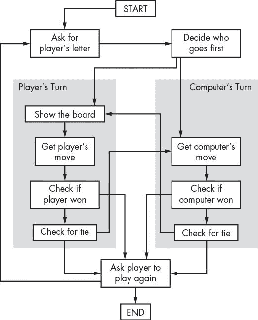
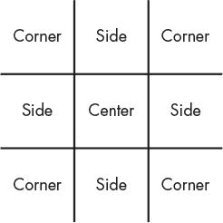
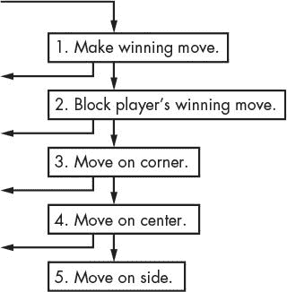
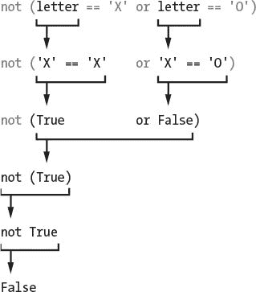
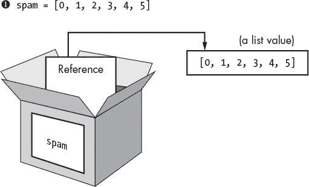
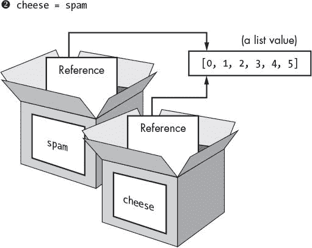
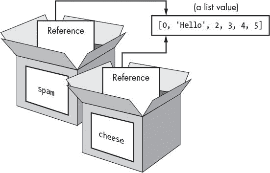
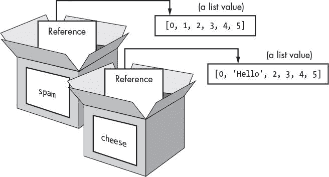

# 10 个 TIC tac toe

> 原文：<https://inventwithpython.com/invent4thed/chapter10.html>


这一章的特色是井字游戏。井字游戏通常是两个人玩的。一个玩家是 *X* ，另一个玩家是 *O* 。玩家轮流放置他们的 *X* 或 *O* 。如果一个玩家在棋盘上得到三个成行、成列或成对角线的标记，他们获胜。当棋盘上没有一方获胜时，游戏以平局结束。

这一章没有介绍很多新的编程概念。用户将与一个简单的人工智能对抗，我们将使用现有的编程知识编写这个人工智能。An *人工智能(AI)* 是一种计算机程序，可以智能地对玩家的动作做出反应。玩井字游戏的人工智能并不复杂；这真的只是几行代码。

让我们从查看该程序的一个示例运行开始。玩家通过输入他们想要占据的空间的数量来移动。为了帮助我们记住列表中的哪个索引对应哪个空格，我们将像键盘的数字键盘一样给板子编号，如图[图 10-1](#calibre_link-111) 所示。


*图 10-1:板子的编号像键盘的数字键一样。*

**本章涵盖的主题**

人工智能

列出参考文献

短路评估

无值

### **井字游戏的试玩**

这是用户运行井字游戏程序时看到的。玩家输入的文本以粗体显示。

```py
Welcome to Tic-Tac-Toe!
Do you want to be X or O?
X
The computer will go first.
O| |
-+-+-
 | |
-+-+-
 | |
What is your next move? (1-9)
3
O| |
-+-+-
 | |
-+-+-
O| |X

What is your next move? (1-9)
4
O| |O
-+-+-
X| |
-+-+-
O| |X
What is your next move? (1-9)
5
O|O|O
-+-+-
X|X|
-+-+-
O| |X
The computer has beaten you! You lose.
Do you want to play again? (yes or no)
no
```

### **井字游戏的源代码**

在一个新文件中，输入下面的源代码，保存为 *tictactoe.py* 。然后按 F5 运行游戏。如果出现错误，在 https://www.nostarch.com/inventwithpython#diff用在线比较工具将你输入的代码与书中的代码进行比较。


*触觉 toe.py*

```py
  1\. # Tic-Tac-Toe
  2.
  3\. import random
  4.
  5\. def drawBoard(board):
  6.     # This function prints out the board that it was passed.
  7.
  8.     # "board" is a list of 10 strings representing the board (ignore
           index 0).
  9.     print(board[7] + '|' + board[8] + '|' + board[9])
 10.     print('-+-+-')
 11.     print(board[4] + '|' + board[5] + '|' + board[6])
 12.     print('-+-+-')
 13.     print(board[1] + '|' + board[2] + '|' + board[3])
 14.
 15\. def inputPlayerLetter():
 16.     # Lets the player type which letter they want to be.
 17.     # Returns a list with the player's letter as the first item and the
           computer's letter as the second.
 18.     letter = ''
 19.     while not (letter == 'X' or letter == 'O'):
 20.         print('Do you want to be X or O?')
 21.         letter = input().upper()
 22.
 23.     # The first element in the list is the player's letter; the second is
           the computer's letter.
 24.     if letter == 'X':
 25.         return ['X', 'O']
 26.     else:
 27.         return ['O', 'X']
 28.
 29\. def whoGoesFirst():
 30.     # Randomly choose which player goes first.
 31.     if random.randint(0, 1) == 0:
 32.         return 'computer'
 33.     else:
 34.         return 'player'
 35.
 36\. def makeMove(board, letter, move):
 37.     board[move] = letter
 38.
 39\. def isWinner(bo, le):
 40.     # Given a board and a player's letter, this function returns True if
           that player has won.
 41.     # We use "bo" instead of "board" and "le" instead of "letter" so we
           don't have to type as much.
 42.     return ((bo[7] == le and bo[8] == le and bo[9] == le) or # Across the
           top
 43.     (bo[4] == le and bo[5] == le and bo[6] == le) or # Across the middle
 44.     (bo[1] == le and bo[2] == le and bo[3] == le) or # Across the bottom
 45.     (bo[7] == le and bo[4] == le and bo[1] == le) or # Down the left side
 46.     (bo[8] == le and bo[5] == le and bo[2] == le) or # Down the middle
 47.     (bo[9] == le and bo[6] == le and bo[3] == le) or # Down the right
           side
 48.     (bo[7] == le and bo[5] == le and bo[3] == le) or # Diagonal
 49.     (bo[9] == le and bo[5] == le and bo[1] == le)) # Diagonal
 50.
 51\. def getBoardCopy(board):
 52.     # Make a copy of the board list and return it.
 53.     boardCopy = []
 54.     for i in board:
 55.         boardCopy.append(i)
 56.     return boardCopy
 57.
 58\. def isSpaceFree(board, move):
 59.     # Return True if the passed move is free on the passed board.
 60.     return board[move] == ' '
 61.
 62\. def getPlayerMove(board):
 63.     # Let the player enter their move.
 64.     move = ' '
 65.     while move not in '1 2 3 4 5 6 7 8 9'.split() or not
           isSpaceFree(board, int(move)):
 66.         print('What is your next move? (1-9)')
 67.         move = input()
 68.     return int(move)
 69.
 70\. def chooseRandomMoveFromList(board, movesList):
 71.     # Returns a valid move from the passed list on the passed board.
 72.     # Returns None if there is no valid move.
 73.     possibleMoves = []
 74.     for i in movesList:
 75.         if isSpaceFree(board, i):
 76.             possibleMoves.append(i)
 77.
 78.     if len(possibleMoves) != 0:
 79.         return random.choice(possibleMoves)
 80.     else:
 81.         return None
 82.
 83\. def getComputerMove(board, computerLetter):
 84.     # Given a board and the computer's letter, determine where to move
           and return that move.
 85.     if computerLetter == 'X':
 86.         playerLetter = 'O'
 87.     else:
 88.         playerLetter = 'X'
 89.
 90.     # Here is the algorithm for our Tic-Tac-Toe AI:
 91.     # First, check if we can win in the next move.
 92.     for i in range(1, 10):
 93.         boardCopy = getBoardCopy(board)
 94.         if isSpaceFree(boardCopy, i):
 95.             makeMove(boardCopy, computerLetter, i)
 96.             if isWinner(boardCopy, computerLetter):
 97.                 return i
 98.
 99.     # Check if the player could win on their next move and block them.
100.     for i in range(1, 10):
101.         boardCopy = getBoardCopy(board)
102.         if isSpaceFree(boardCopy, i):
103.             makeMove(boardCopy, playerLetter, i)
104.             if isWinner(boardCopy, playerLetter):
105.                 return i
106.
107.     # Try to take one of the corners, if they are free.
108.     move = chooseRandomMoveFromList(board, [1, 3, 7, 9])
109.     if move != None:
110.         return move
111.
112.     # Try to take the center, if it is free.
113.     if isSpaceFree(board, 5):
114.         return 5
115.
116.     # Move on one of the sides.
117.     return chooseRandomMoveFromList(board, [2, 4, 6, 8])
118.
119\. def isBoardFull(board):
120.     # Return True if every space on the board has been taken. Otherwise,
           return False.
121.     for i in range(1, 10):
122.         if isSpaceFree(board, i):
123.             return False
124.     return True
125.
126.
127\. print('Welcome to Tic-Tac-Toe!')
128.
129\. while True:
130.     # Reset the board.
131.     theBoard = [' '] * 10
132.     playerLetter, computerLetter = inputPlayerLetter()
133.     turn = whoGoesFirst()
134.     print('The ' + turn + ' will go first.')
135.     gameIsPlaying = True
136.
137.     while gameIsPlaying:
138.         if turn == 'player':
139.             # Player's turn
140.             drawBoard(theBoard)
141.             move = getPlayerMove(theBoard)
142.             makeMove(theBoard, playerLetter, move)
143.
144.             if isWinner(theBoard, playerLetter):
145.                 drawBoard(theBoard)
146.                 print('Hooray! You have won the game!')
147.                 gameIsPlaying = False
148.             else:
149.                 if isBoardFull(theBoard):
150.                     drawBoard(theBoard)
151.                     print('The game is a tie!')
152.                     break
153.                 else:
154.                     turn = 'computer'
155.
156.         else:
157.             # Computer's turn
158.             move = getComputerMove(theBoard, computerLetter)
159.             makeMove(theBoard, computerLetter, move)
160.
161.             if isWinner(theBoard, computerLetter):
162.                 drawBoard(theBoard)
163.                 print('The computer has beaten you! You lose.')
164.                 gameIsPlaying = False
165.             else:
166.                 if isBoardFull(theBoard):
167.                     drawBoard(theBoard)
168.                     print('The game is a tie!')
169.                     break
170.                 else:
171.                     turn = 'player'
172.
173.     print('Do you want to play again? (yes or no)')
174.     if not input().lower().startswith('y'):
175.         break
```

### **设计程序**

[图 10-2](#calibre_link-112) 显示了井字游戏程序的流程图。该程序首先要求玩家选择他们的字母， *X* 或 *O* 。谁先开始是随机选择的。然后玩家和电脑轮流出招。



*图 10-2:井字游戏*流程图

流程图左侧的方框显示玩家回合时发生的情况，右侧的方框显示电脑回合时发生的情况。玩家或电脑走完一步后，程序会检查他们是赢了还是打成了平手，然后游戏就开始了。游戏结束后，程序会询问玩家是否想再玩一次。

#### ***代表板卡数据***

首先，您必须弄清楚如何在变量中将电路板表示为数据。在纸面上，井字棋盘被画成一对横线和一对竖线，九个空格中的每一个都有一个 *X* 、 *O* 或空格。

在程序中，井字游戏棋盘被表示为类似 Hangman 的 ASCII 艺术的字符串列表。每个字符串代表棋盘上九个空格中的一个。字符串或者是 *X* 播放器的‘X’，或者是播放器的*的‘O’，或者是空格的‘。*

请记住，我们把我们的白板像键盘上的数字键盘一样摆放。因此，如果一个包含 10 个字符串的列表存储在一个名为 board 的变量中，那么 board[7] 将是棋盘的左上角空格， board[8] 将是右上角空格， board[9] 将是右上角空格，依此类推。程序忽略列表中索引 0 处的字符串。玩家将输入一个从 1 到 9 的数字来告诉游戏他们想要移动到哪个空间。

#### ***用游戏 AI** 运筹帷幄*

人工智能需要能够看着棋盘，并决定它将移动到哪种类型的空间。为了清楚起见，我们将在井字游戏板上标记三种类型的空间:角、边和中心。图 10-3 中的图表显示了每个空间是什么。

人工智能玩井字游戏的策略将遵循一个简单的*算法*——一系列有限的指令来计算结果。一个程序可以使用几种不同的算法。算法可以用流程图来表示。井字游戏人工智能的算法将会计算出最佳的走法，如图[图 10-4](#calibre_link-114) 所示。



*图 10-3:边、角和中心空间的位置*



*图 10-4:方框代表“让计算机动起来”算法的五个步骤。指向左侧的箭头指向“检查计算机是否获胜”框。*

人工智能的算法有以下步骤:

1.  看看电脑能做出什么举动来赢得比赛。如果有，那就行动吧。否则，请转到步骤 2。

2.  看看玩家是否可以做出会导致电脑输掉游戏的举动。如果有，移动到那里阻挡玩家。否则，转到步骤 3。

3.  检查是否有角落空间(空间 1、3、7 或 9)空闲。如果有，就搬到那里去。如果没有空闲的角落空间，请转到步骤 4。

4.  检查中心是否空闲。如果有，就搬到那里去。如果不是，请转到步骤 5。 
5.  在任何侧边空格上移动(空格 2、4、6 或 8)。没有更多的步骤，因为如果执行到第 5 步，就只剩下侧空格了。

这一切都发生在[图 10-2](#calibre_link-112) 中流程图上的获取计算机移动框中。你可以用[图 10-4](#calibre_link-114) 中的方框将这些信息添加到流程图中。

该算法在 getComputerMove() 和 getComputerMove() 调用的其他函数中实现。

### **导入随机模块**

前几行由一个注释和一个导入 random 模块的行组成，这样您就可以稍后调用 randint() 函数:

```py
1\. # Tic-Tac-Toe
2.
3\. import random
```

这两个概念你以前都见过，所以让我们进入程序的下一部分。

### **在屏幕上打印电路板**

在代码的下一部分，我们定义一个函数来绘制棋盘:

```py
 5\. def drawBoard(board):
 6.     # This function prints out the board that it was passed.
 7.
 8.     # "board" is a list of 10 strings representing the board (ignore
          index 0).
 9.     print(board[7] + '|' + board[8] + '|' + board[9])
10.     print('-+-+-')
11.     print(board[4] + '|' + board[5] + '|' + board[6])
12.     print('-+-+-')
13.     print(board[1] + '|' + board[2] + '|' + board[3])
```

drawBoard() 函数打印由棋盘参数表示的游戏棋盘。记住棋盘被表示为 10 个字符串的列表，其中索引 1 处的字符串是井字游戏棋盘上空格 1 的标记，以此类推。索引 0 处的字符串被忽略。游戏的许多功能都是通过将 10 个字符串作为棋盘来传递的。

请确保字符串的间距正确；否则，板在屏幕上打印时会看起来很滑稽。下面是一些对 drawBoard() 的示例调用(带有 board 的参数)以及该函数将打印的内容。

```py
>>> drawBoard([' ', ' ', ' ', ' ', 'X', 'O', ' ', 'X', ' ', 'O'])
X| |
-+-+-
X|O|
-+-+-
 | |
>>> drawBoard([' ', ' ', ' ', ' ', ' ', ' ', ' ', ' ', ' ', ' '])
 | |
-+-+-
 | |
-+-+-
 | |
```

程序从[图 10-1](#calibre_link-111) 中取出每根弦，根据键盘数字小键盘按数字顺序放在棋盘上，所以前三根弦是棋盘的底排，接下来的三根弦是中间的，最后三根弦是上面的。

### **让玩家选择 X 或 O**

接下来，我们将定义一个函数来为玩家分配 *X* 或 *O* :

```py
15\. def inputPlayerLetter():
16.     # Lets the player enter which letter they want to be.
17.     # Returns a list with the player's letter as the first item and the
          computer's letter as the second.
18.     letter = ''
19.     while not (letter == 'X' or letter == 'O'):
20.         print('Do you want to be X or O?')
21.         letter = input().upper()
```

inputPlayerLetter() 函数询问玩家是想成为 *X* 还是 *O* 。 while 循环的条件包含括号，这意味着括号内的表达式首先被求值。如果字母变量被设置为‘X’，表达式的计算结果如下:



如果字母的值为‘X’或‘O’，则循环的条件为假，并让程序继续执行，越过程序块，同时执行程序块。如果条件为真，程序会一直要求玩家选择一个字母，直到玩家输入一个 *X* 或 *O* 为止。第 21 行用 upper() string 方法自动将调用 input() 返回的字符串改为大写字母。

下一个函数返回包含两个项目的列表:

```py
23.     # The first element in the list is the player's letter; the second is
          the computer's letter.
24.     if letter == 'X':
25.         return ['X', 'O']
26.     else:
27.         return ['O', 'X']
```

第一项(索引 0 处的字符串)是玩家的字母，第二项(索引 1 处的字符串)是电脑的字母。 if 和 else 语句选择合适的列表返回。

### **决定谁先走**

接下来我们创建一个函数，它使用 randint() 来选择是播放器还是电脑先玩:

```py
29\. def whoGoesFirst():
30.     # Randomly choose which player goes first.
31.     if random.randint(0, 1) == 0:
32.         return 'computer'
33.     else:
34.         return 'player'
```

函数的作用是掷一枚虚拟硬币来决定是电脑先走还是玩家先走。抛硬币是通过调用 random.randint(0，1) 来完成的。该函数有 50%的几率返回 0 ，有 50%的几率返回 1 。如果这个函数调用返回一个 0 ，那么whooes first()函数将返回字符串‘computer’。否则，该函数返回字符串‘player’。调用这个函数的代码将使用返回值来决定谁将进行游戏的第一步。

### **在板上放置标记**

makeMove() 函数很简单:

```py
36\. def makeMove(board, letter, move):
37.     board[move] = letter
```

参数为板、字母、移动。变量 board 是一个有 10 个字符串的列表，代表板卡的状态。变量字母是玩家的字母(不是‘X’就是‘O’)。变量 move 是该玩家想去的棋盘上的位置(是从 1 到 9 的整数)。

但是等等——在第 37 行，这段代码似乎将板列表中的一个项目更改为字母中的值。因为这段代码在一个函数中，当函数返回时，板参数将被遗忘。那么对板的改动不也应该被忘记吗？

实际上，情况并非如此，因为当你将列表作为参数传递给函数时，列表是很特殊的。你实际上是在传递一个对列表的引用，而不是列表本身。让我们了解一下列表和列表引用之间的区别。

#### ***列出参考文献***

在交互式 shell 中输入以下内容:

```py
>>> spam = 42
>>> cheese = spam
>>> spam = 100
>>> spam
100
>>> cheese
42
```

根据你目前所知，这些结果是有意义的。您将 42 赋给 spam 变量，然后将 spam 中的值赋给变量 cheese 。当您稍后覆盖垃圾信息到 100 时，这不会影响奶酪中的值。这是因为 spam 和 cheese 是存储不同值的不同变量。

但是列表不是这样工作的。当你给一个变量分配一个列表时，你实际上是在给这个变量分配一个列表引用。一个*引用*是一个指向某个数据位存储位置的值。让我们看一些代码，这将使它更容易理解。在交互式 shell 中输入以下内容:

```py
➊ >>> spam = [0, 1, 2, 3, 4, 5]
➋ >>> cheese = spam
➌ >>> cheese[1] = 'Hello!'
   >>> spam
   [0, 'Hello!', 2, 3, 4, 5]
   >>> cheese
   [0, 'Hello!', 2, 3, 4, 5]
```

代码只改变了奶酪列表，但是似乎奶酪和垃圾信息列表都改变了。这是因为 spam 变量并不包含列表值本身，而是一个对列表的引用，如图 10-5 所示。列表本身不包含在任何变量中，而是存在于变量之外。



*图 10-5:**创建的* `spam` *列表。变量不存储列表，而是存储对列表的引用。*

注意， cheese = spam 将 spam 中的*列表引用*复制到 cheese ➋ 中，而不是复制列表值本身。现在 spam 和 cheese 都存储了指向相同列表值的引用。但是只有一个列表，因为列表本身没有被复制。[图 10-6](#calibre_link-116) 显示了这种复制。



*图 10-6:*`spam`*和* `cheese` *变量存储了对同一个链表的两个引用。*

所以奶酪[1] = '你好！'行在 ➌ 改变垃圾邮件引用的同一列表。这就是为什么 spam 返回与 cheese 相同的列表值。它们都有引用相同列表的引用，如图[图 10-7](#calibre_link-117) 所示。



*图 10-7:改变列表会改变引用该列表的所有变量。*

如果你想让 spam 和 cheese 存储两个不同的列表，你必须创建两个列表，而不是复制一个引用:

```py
>>> spam = [0, 1, 2, 3, 4, 5]
>>> cheese = [0, 1, 2, 3, 4, 5]
```

在前面的例子中， spam 和 cheese 存储了两个不同的列表(即使这些列表内容相同)。现在，如果你修改其中一个列表，不会影响另一个，因为垃圾邮件和奶酪引用了两个不同的列表:

```py
>>> spam = [0, 1, 2, 3, 4, 5]
>>> cheese = [0, 1, 2, 3, 4, 5]
>>> cheese[1] = 'Hello!'
>>> spam
[0, 1, 2, 3, 4, 5]
>>> cheese
[0, 'Hello!', 2, 3, 4, 5]
```

[图 10-8](#calibre_link-118) 显示了本例中变量和列表值是如何设置的。

字典也是这样工作的。变量不存储字典；他们存储对字典的引用。



*图 10-8:*`spam`*和* `cheese` *变量现在各自存储对两个不同列表的引用。*

#### ***在 makeMove()中使用列表引用***

让我们回到 makeMove() 函数:

```py
36\. def makeMove(board, letter, move):
37.     board[move] = letter
```

当列表值被传递给板参数时，函数的局部变量实际上是列表引用的副本，而不是列表本身的副本。所以在这个函数中对板的任何改变也会影响到原来的列表。尽管板是一个局部变量，但是 makeMove() 函数会修改原始列表。

字母和移动参数是您传递的字符串和整数值的副本。由于它们是值的副本，如果您在该函数中修改了字母或移动，那么您在调用 makeMove() 时使用的原始变量不会被修改。

### **检查玩家是否赢了**

isWinner() 函数中的第 42 到 49 行实际上是一个长的返回语句:

```py
39\. def isWinner(bo, le):
40.     # Given a board and a player's letter, this function returns True if
          that player has won.
41.     # We use "bo" instead of "board" and "le" instead of "letter" so we
          don't have to type as much.
42.     return ((bo[7] == le and bo[8] == le and bo[9] == le) or # Across the
          top
43.     (bo[4] == le and bo[5] == le and bo[6] == le) or # Across the middle
44.     (bo[1] == le and bo[2] == le and bo[3] == le) or # Across the bottom
45.     (bo[7] == le and bo[4] == le and bo[1] == le) or # Down the left side
46.     (bo[8] == le and bo[5] == le and bo[2] == le) or # Down the middle
47.     (bo[9] == le and bo[6] == le and bo[3] == le) or # Down the right
          side
48.     (bo[7] == le and bo[5] == le and bo[3] == le) or # Diagonal
49.     (bo[9] == le and bo[5] == le and bo[1] == le)) # Diagonal
```

bo和 le 名称是板和字母参数的快捷键。这些更短的名字意味着你在这个函数中输入的内容更少。记住，Python 不在乎你给变量取什么名字。

在井字游戏中有八种可能的获胜方法:你可以在顶行、中间行或底行划一条线；您可以在左栏、中栏或右栏下划一行。或者你可以在两条对角线上画一条线。

条件的每一行检查给定行的三个空格是否等于所提供的字母(结合了和操作符)。您使用或运算符组合每一行，检查八种不同的获胜方式。这意味着八种方式中只有一种必须为真，我们才能说拥有 le 中字母的玩家是赢家。

我们假设了是‘O’，博是 [' '，' O '，' O '，' '，' '，' X '，' '，' X '，' '，' '，' '] 。板子看起来会像这样:

```py
X| |
-+-+-
 |X|
-+-+-
O|O|O
```

下面是第 42 行的 return 关键字后的表达式的计算方式。首先 Python 用每个变量中的值替换了变量 bo 和 le :

return (('X' == 'O '和' ' == 'O '和' ' == 'O ')或
(' ' == 'O '和' X ' = 'O '和' ' = 'O ')或
(' O ' = ' O '和' O ' = ' O ' = ' O ' = ' O ')或【T2(' X ' = ' O '和' ' = ' O '和' O ' = ' O ')或
(' ' = = ' O ' O '和' O ' = ' O ' = ' O ') 或者
(“== 'O '和“= = ' O '和' O ' = ' O ')或者
(' X ' = ' O '和' X ' = ' O '和' O ' = ' O ' = ' O ')或者
(“= = ' O '和' X ' = ' O '和' O ' = ' O '))

接下来，Python 将括号内的所有这些 == 比较结果评估为布尔值:

return((假与假与假)或
(假与假与假)或
(真与真与真)或
(假与假与真)或
(假与假与真)或
(假与假与真)或
(假与假与真)或
(假与假与真))

然后 Python 解释器评估括号内的所有表达式:

return ((False)或
(False)或
(True)或
(False)或
(False)或
(False)或
(False)或
(False))

因为现在每个内括号中只有一个值，所以可以去掉它们:

返回(False 或
False 或
True 或
False 或
False 或
False 或
False 或
False)

现在 Python 计算由所有这些或操作符连接的表达式:

返回(真)

再一次，去掉括号，只剩下一个值:

返回 True

因此，给定这些值为 bo 和 le ，表达式将评估为真。这就是程序如何判断一个玩家是否赢得了比赛。

### **复制板卡数据**

getBoardCopy() 函数允许您轻松地复制一个给定的 10 字符串列表，该列表代表游戏中的井字游戏棋盘。

```py
51\. def getBoardCopy(board):
52.     # Make a copy of the board list and return it.
53.     boardCopy = []
54.     for i in board:
55.         boardCopy.append(i)
56.     return boardCopy
```

当人工智能算法计划它的移动时，它有时需要修改棋盘的临时副本，而不改变实际的棋盘。在这种情况下，我们调用这个函数来复制电路板列表。新列表在第 53 行创建。

现在，存储在 boardCopy 中的列表只是一个空列表。循环的将迭代板参数，将实际板中字符串值的副本追加到复制板。在 getBoardCopy() 函数建立了实际电路板的副本后，它返回一个对电路板副本中的这个新电路板的引用，而不是对电路板中的原始电路板的引用。

### **检查板上的空间是否空闲**

给定一个井字游戏棋盘和一个可能的走法，简单的 isSpaceFree() 函数返回该走法是否可用:

```py
58\. def isSpaceFree(board, move):
59.     # Return True if the passed move is free on the passed board.
60.     return board[move] == ' '
```

请记住，电路板列表中的空白标记为单空格字符串。如果空间索引处的项目不等于“，则该空间被占用。

### **让玩家进入一步**

getPlayerMove() 函数要求玩家输入他们想要移动的空间的数字:

```py
62\. def getPlayerMove(board):
63.     # Let the player enter their move.
64.     move = ' '
65.     while move not in '1 2 3 4 5 6 7 8 9'.split() or not
          isSpaceFree(board, int(move)):
66.         print('What is your next move? (1-9)')
67.         move = input()
68.     return int(move)
```

如果或运算符左侧或右侧的表达式中有一个为真，则第 65 行的条件为真。该循环确保执行不会继续，直到玩家输入 1 到 9 之间的整数。它还检查输入的空间是否已经被占用，假定井字游戏棋盘被传递给棋盘参数的函数。在 while 循环中的两行代码只是要求玩家输入一个从 1 到 9 的数字。

左侧的表达式通过用这些字符串创建一个列表(用 split() 方法)并检查移动是否在这个列表中，来检查玩家的移动是否等于‘1’、‘2’、‘3’等等，直到【T6’‘9’。在这个表达式中，‘1 2 3 4 5 6 7 8 9’。split() 计算结果为 ['1 '，' 2 '，' 3 '，' 4 '，' 5 '，' 6 '，' 7 '，' 8 '，' 9'] ，但前者更容易键入。

右边的表达式通过调用 isSpaceFree() 来检查玩家进入的棋步是否是棋盘上的自由空间。记住 isSpaceFree() 返回 True 如果你传递的移动在棋盘上可用。注意 isSpaceFree() 需要一个整数用于移动，所以 int() 函数返回一个整数形式的移动。

两边都添加了 not 运算符，以便当这些要求中的任何一个不满足时，条件为真。这导致循环一次又一次地向玩家询问一个数字，直到他们输入正确的走法。

最后，第 68 行返回玩家输入的任何移动的整数形式。 input() 返回字符串，所以调用 int() 函数返回字符串的整数形式。

### **短路评估**

您可能已经注意到在 getPlayerMove() 函数中可能存在一个问题。如果玩家输入了‘Z’或者其他非整数字符串会怎么样？这个表达方式在‘123456789’中不动。在或左边的 split() 会像预期的那样返回 False ，然后 Python 会对或操作符右边的表达式求值。

但是调用 int('Z') 会导致 Python 给出一个错误，因为 int() 函数只能接受像 '9' 或【T6]' 0 '这样的数字字符字符串，而不能接受像 'Z' 这样的字符串。

要查看此类错误的示例，请在交互式 shell 中输入以下内容:

```py
>>> int('42')
42
>>> int('Z')
Traceback (most recent call last):
  File "<pyshell#3>", line 1, in <module>
    int('Z')
ValueError: invalid literal for int() with base 10: 'Z'
```

但是当你玩井字游戏并尝试输入‘Z’来移动时，这个错误不会发生。这是因为 while 回路的状态被短路。

*短路*意味着表达式只计算一部分，因为表达式的其余部分不会改变表达式的计算结果。这里有一个简短的程序，给出了一个短路的好例子。在交互式 shell 中输入以下内容:

```py
>>> def ReturnsTrue():
        print('ReturnsTrue() was called.')
        return True
>>> def ReturnsFalse():
        print('ReturnsFalse() was called.')
        return False
>>> ReturnsTrue()
ReturnsTrue() was called.
True
>>> ReturnsFalse()
ReturnsFalse() was called.
False
```

当 ReturnsTrue() 被调用时，打印‘return strue()被调用’然后还显示 ReturnsTrue() 的返回值。同样的道理也适用于 ReturnsFalse() 。

现在，在交互式 shell 中输入以下内容:

```py
>>> ReturnsFalse() or ReturnsTrue()
ReturnsFalse() was called.
ReturnsTrue() was called.
True
>>> ReturnsTrue() or ReturnsFalse()
ReturnsTrue() was called.
True
```

第一部分是有意义的:表达式 ReturnsFalse()或 returns rue()调用这两个函数，所以您会看到两个打印的消息。

但是第二个表达式只显示了‘return strue()被调用。’，而不是调用了 ReturnsFalse()。这是因为 Python 根本没有调用 ReturnsFalse() 。由于或运算符的左边是 True ，所以 ReturnsFalse() 返回什么并不重要，Python 也就懒得调用了。评估短路了。

这同样适用于和操作符。现在，在交互式 shell 中输入以下内容:

```py
>>> ReturnsTrue() and ReturnsTrue()
ReturnsTrue() was called.
ReturnsTrue() was called.
True
>>> ReturnsFalse() and ReturnsFalse()
ReturnsFalse() was called.
False
```

同样，如果左边的和运算符是假，那么整个表达式就是假。和的右边是真还是假并不重要，Python 也懒得评价。假和真和假和假都评估为假，所以 Python 短路了评估。

让我们回到井字游戏程序的第 65 到 68 行:

```py
65.     while move not in '1 2 3 4 5 6 7 8 9'.split() or not
          isSpaceFree(board, int(move)):
66.         print('What is your next move? (1-9)')
67.         move = input()
68.     return int(move)
```

左边的部分条件自或运算符(移不进‘1 2 3 4 5 6 7 8 9’。split() 评估为真，Python 解释器知道整个表达式将评估为真。无论或右侧的表达式计算结果为真还是假都没有关系，因为对于整个表达式为真来说，或运算符两侧只需要有一个值为真。

所以 Python 停止检查表达式的其余部分，甚至懒得计算 not isSpaceFree(board，int(move)) 部分。这意味着只要不在“1 2 3 4 5 6 7 8 9”中移动，就永远不会调用 int() 和 isSpaceFree() 函数。split() 为真。

这对程序来说很好，因为如果条件的右边是真，那么移动就不是一个一位数的字符串。这将导致 int() 给我们一个错误。但是如果没有在‘123456789’中移动。split() 评估为 True ，Python short-circuitsnot is space free(board，int(move)) 和 int(move) 未被调用。

### **从招式列表中选择一招**

现在让我们看一下chooseRandomMoveFromList()函数，它对程序后面的 AI 代码很有用:

```py
70\. def chooseRandomMoveFromList(board, movesList):
71.     # Returns a valid move from the passed list on the passed board.
72.     # Returns None if there is no valid move.
73.     possibleMoves = []
74.     for i in movesList:
75.         if isSpaceFree(board, i):
76.             possibleMoves.append(i)
```

记住棋盘参数是代表井字游戏棋盘的字符串列表。第二个参数， movesList ，是一个可以从中选择空间的整数列表。例如，如果 movesList 是 [1，3，7，9] ，这意味着chooseRandomMoveFromList()应该返回一个角空间的整数。

然而，chooseRandomMoveFromList()首先检查空间是否有效，以便继续前进。可能移动列表从空白列表开始。然后循环的迭代 movesList 。使用 append() 方法将导致 isSpaceFree() 返回 True 的移动添加到 possibleMoves 中。

此时，可能的走法列表中有所有在走法列表中的走法，这些走法也是自由空间。然后，程序检查列表是否为空:

```py
78.     if len(possibleMoves) != 0:
79.         return random.choice(possibleMoves)
80.     else:
81.         return None
```

如果列表不是空的，那么在棋盘上至少有一个可能的移动。

但是这个列表可能是空的。例如，如果 movesList 是【1，3，7，9】，但是由 board 参数表示的棋盘已经占据了所有的角落空间，那么 possibleMoves list 将是 [] 。在这种情况下， len(possibleMoves) 的计算结果为 0 ，函数返回值 None 。

### **无值**

无值表示缺少一个值。 None 是数据类型 NoneType 的唯一值。当您需要一个表示“不存在”或“以上都不存在”的值时，您可以使用 None 值

例如，假设您有一个名为 quizAnswer 的变量，它保存了用户对一些真/假突击测验问题的答案。该变量可以为用户的答案保存真或假。但是如果用户没有回答问题，你不会想要将 quizAnswer 设置为真或假，因为这样看起来就像用户回答了问题。相反，如果用户跳过问题，您可以将 quizAnswer 设置为 None 。

顺便提一下， None 不像其他值那样显示在交互式 shell 中:

```py
>>> 2 + 2
4
>>> 'This is a string value.'
'This is a string value.'
>>> None
>>>
```

前两个表达式的值作为输出打印在下一行，但是 None 没有值，所以不打印。

看起来不返回任何东西的函数实际上会返回 None 值。例如， print() 返回 None :

```py
>>> spam = print('Hello world!')
Hello world!
>>> spam == None
True
```

这里我们分配了print(‘Hello world！’)到的垃圾邮件。与所有函数一样， print() 函数也有返回值。即使 print() 打印输出，函数调用也返回 None 。IDLE 在交互 shell 中不显示 None ，但是你可以告诉 spam 被设置为 None ，因为 spam == None 评估为 True 。

### **创造计算机的人工智能**

getComputerMove() 函数包含 AI 的代码:

```py
83\. def getComputerMove(board, computerLetter):
84.     # Given a board and the computer's letter, determine where to move
          and return that move.
85.     if computerLetter == 'X':
86.         playerLetter = 'O'
87.     else:
88.         playerLetter = 'X'
```

第一个参数是用于棋盘参数的井字棋盘。第二个参数是计算机使用的字母——在 computerLetter 参数中可以是‘X’或‘O’。前几行只是将另一个字母赋给一个名为 playerLetter 的变量。这样，无论计算机是 *X* 还是 *O* 都可以使用相同的代码。

还记得井字游戏人工智能算法是如何工作的吗:

1.  看看电脑能做出什么举动来赢得比赛。如果有，就采取行动。否则，请转到步骤 2。

2.  看看玩家是否可以做出会导致电脑输掉游戏的举动。如果有，电脑应该移到那里屏蔽播放器。否则，转到步骤 3。

3.  检查是否有任何角落(空间 1、3、7 或 9)空闲。如果没有空闲的角落空间，请转到步骤 4。

4.  检查中心是否空闲。如果有，就搬到那里去。如果不是，请转到步骤 5。

5.  在任一侧移动(空格 2、4、6 或 8)。没有更多的步骤，因为如果执行到了这一步，侧空格是唯一剩下的空格。

该函数将返回一个从 1 到 9 的整数，代表计算机的移动。让我们看看这些步骤是如何在代码中实现的。

#### ***检验电脑能否一招制胜***

首先，如果计算机能在下一步棋中获胜，它应该立即采取获胜的一步。

```py
90.     # Here is the algorithm for our Tic-Tac-Toe AI:
91.     # First, check if we can win in the next move.
92.     for i in range(1, 10):
93.         boardCopy = getBoardCopy(board)
94.         if isSpaceFree(boardCopy, i):
95.             makeMove(boardCopy, computerLetter, i)
96.             if isWinner(boardCopy, computerLetter):
97.                 return i
```

从第 92 行开始的循环的遍历从 1 到 9 的每一个可能的移动。循环中的代码模拟了如果计算机做出那个动作会发生什么。

循环中的第一行(第 93 行)复制了板列表。这是为了让循环中的模拟移动不会修改存储在棋盘变量中的真实井字游戏棋盘。 getBoardCopy() 返回一个相同但独立的电路板列表值。

第 94 行检查空间是否空闲，如果是，模拟在棋盘副本上移动。如果这步棋的结果是计算机赢了，函数返回这步棋的整数。

如果没有空格导致获胜，循环结束，程序继续执行到第 100 行。

#### ***检验玩家能否一招制胜***

接下来，代码将模拟玩家在每个空间上移动:

```py
 99.     # Check if the player could win on their next move and block them.
100.     for i in range(1, 10):
101.         boardCopy = getBoardCopy(board)
102.         if isSpaceFree(boardCopy, i):
103.             makeMove(boardCopy, playerLetter, i)
104.             if isWinner(boardCopy, playerLetter):
105.                 return i
```

代码类似于第 92 行的循环，只是玩家的字母放在棋盘副本上。如果 isWinner() 函数显示玩家将通过一步棋获胜，那么计算机将返回相同的一步棋来阻止这种情况发生。

如果人类玩家不能再赢一步，则用于的循环结束，并且执行继续到行 108。

 **如果计算机不能做出获胜的移动，并且不需要阻止玩家的移动，它将移动到角落、中心或侧面空间，这取决于可用的空间。

计算机首先尝试移动到一个角落空间:

```py
107.     # Try to take one of the corners, if they are free.
108.     move = chooseRandomMoveFromList(board, [1, 3, 7, 9])
109.     if move != None:
110.         return move
```

使用列表 [1，3，7，9] 调用chooseRandomMoveFromList()函数确保该函数返回某个角空间的整数:1、3、7 或 9。

如果所有的角空间都被占用了，chooseRandomMoveFromList()函数返回 None ，并且执行继续到第 113 行:

```py
112.     # Try to take the center, if it is free.
113.     if isSpaceFree(board, 5):
114.         return 5
```

如果没有角可用，114 行在中心空间移动，如果它是自由的。如果中间的空间没有被释放，则执行移到第 117 行:

```py
116.     # Move on one of the sides.
117.     return chooseRandomMoveFromList(board, [2, 4, 6, 8])
```

这段代码还调用了chooseRandomMoveFromList()，除了您传递给它一个侧空格列表:【2，4，6，8】。这个函数不会返回 None ，因为侧边空格是唯一可能留下的空格。这就结束了 getComputerMove() 函数和 AI 算法。

#### ***检查板子是否满了***

最后一个函数是 isBoardFull() :

```py
119\. def isBoardFull(board):
120.     # Return True if every space on the board has been taken. Otherwise,
           return False.
121.     for i in range(1, 10):
122.         if isSpaceFree(board, i):
123.             return False
124.     return True
```

如果被传递的板参数中的 10 字符串列表在每个索引中都有‘X’或‘O’(除了索引 0 被忽略)，则该函数返回 True 。循环的让我们检查板列表上的 1 到 9 。一旦在板上找到空闲空间(即当 isSpaceFree(board，i) 返回 True 时， isBoardFull() 函数将返回 False 。

如果执行设法通过循环的每一次迭代，那么没有空间是空闲的。然后，第 124 行将执行返回真值。

### **游戏循环**

第 127 行是不在函数内部的第一行，所以它是运行这个程序时执行的第一行代码。

```py
127\. print('Welcome to Tic-Tac-Toe!')
```

这条线在游戏开始前问候玩家。然后程序在第 129 行进入 while 循环:

```py
129\. while True:
130.     # Reset the board.
131.     theBoard = [' '] * 10
```

while 循环一直循环，直到执行遇到 break 语句。第 131 行在一个名为 theBoard 的变量中设置了主井字牌。棋盘开始是空的，我们用 10 个单空格字符串的列表来表示。第 131 行使用列表复制，而不是输出完整的列表。键入 [' '] * 10 比 [' '，' '，' '，' '，' '，' '，' '，' '，' '，' '，' '，' '] 要短。

#### ***选择玩家的标记，谁先走***

接下来， inputPlayerLetter() 函数让玩家输入他们是想成为 *X* 还是 *O* :

```py
132.     playerLetter, computerLetter = inputPlayerLetter()
```

该函数返回一个双字符串列表，可以是 ['X '，' O'] 或 ['O '，' X'] 。我们使用多重赋值将 playerLetter 设置为返回列表的第一项，将 computerLetter 设置为第二项。

从那里， whoGoesFirst() 函数随机决定谁先走，返回字符串‘玩家’或字符串‘计算机’，然后第 134 行告诉玩家谁先走:

```py
133.     turn = whoGoesFirst()
134.     print('The ' + turn + ' will go first.')
135.     gameIsPlaying = True
```

game isplay变量记录游戏是否还在进行，或者有人赢了或者打成平手。

#### ***轮到奔跑的玩家了***

只要 gameIsPlaying 设置为 True ，137 号线的循环就会在玩家回合的代码和电脑回合的代码之间不停地来回穿梭:

```py
137.     while gameIsPlaying:
138.         if turn == 'player':
139.             # Player's turn
140.             drawBoard(theBoard)
141.             move = getPlayerMove(theBoard)
142.             makeMove(theBoard, playerLetter, move)
```

第 133 行的 whoGoesFirst() 调用最初将 turn 变量设置为‘玩家’或‘计算机’。如果轮等于‘计算机’，则第 138 行的条件为假，执行跳转到第 156 行。

但是如果第 138 行评估为真，第 140 行调用 drawBoard() 并传递 theBoard 变量在屏幕上打印井字棋盘。然后 getPlayerMove() 让玩家输入他们的移动(并确保这是一个有效的移动)。 makeMove() 函数将玩家的 *X* 或 *O* 添加到棋盘中。

现在玩家已经走了一步，程序应该检查他们是否赢得了游戏:

```py
144.             if isWinner(theBoard, playerLetter):
145.                 drawBoard(theBoard)
146.                 print('Hooray! You have won the game!')
147.                 gameIsPlaying = False
```

如果 isWinner() 函数返回 True ，则 if 块的代码显示获胜的棋盘，并打印一条消息告诉玩家他们已经获胜。game isplay变量也被设置为 False ，以便执行不会继续到计算机的回合。

如果玩家的最后一步棋没有赢，也许他们的一步棋填满了整个棋盘并使游戏打平。程序接下来用一个 else 语句检查该条件:

```py
148.             else:
149.                 if isBoardFull(theBoard):
150.                     drawBoard(theBoard)
151.                     print('The game is a tie!')
152.                     break
```

在这个 else 块中，如果没有更多的移动，函数 isBoardFull() 返回 True 。在这种情况下，从第 149 行开始的 if 块显示平局牌，并告诉玩家出现平局。然后，执行从 while 循环中脱离，并跳转到第 173 行。

如果玩家没有赢或平，程序进入另一个 else 语句:

```py
153.             else:
154.                 turn = 'computer'
```

第 154 行将 turn 变量设置为‘计算机’，这样程序将在下一次迭代中执行计算机 turn 的代码。

#### ***轮到运行电脑的***

如果第 138 行的条件中的回合变量不是【玩家】，那么就该轮到计算机了。这个 else 块中的代码类似于玩家回合的代码:

```py
156.         else:
157.             # Computer's turn
158.             move = getComputerMove(theBoard, computerLetter)
159.             makeMove(theBoard, computerLetter, move)
160.
161.             if isWinner(theBoard, computerLetter):
162.                 drawBoard(theBoard)
163.                 print('The computer has beaten you! You lose.')
164.                 gameIsPlaying = False
165.         else:
166.             if isBoardFull(theBoard):
167.                 drawBoard(theBoard)
168.                 print('The game is a tie!')
169.                 break
170.             else:
171.                 turn = 'player'
```

第 157 至 171 行与第 139 至 154 行中玩家回合的代码几乎相同。唯一的区别是这段代码使用了计算机的字母并调用了 getComputerMove() 。

如果游戏没有赢或平局，行 171 将回合设置为玩家的回合。在 while 循环中没有更多的代码行，所以执行跳回到第 137 行的 while 语句。

#### ***要求玩家再次玩***

最后，程序会询问玩家是否想玩另一个游戏:

```py
173.     print('Do you want to play again? (yes or no)')
174.     if not input().lower().startswith('y'):
175.         break
```

第 173 到 175 行在第 137 行的 while 语句启动的 while 块之后立即执行。当游戏结束时，gameIsPlaying】被设置为 False ，所以此时游戏会询问玩家是否想再玩一次。

未输入()。降低()。如果玩家输入不是以‘y’开头的任何东西，starts with(‘y’)表达式将为真。在这种情况下，执行 break 语句。这中断了从第 129 行开始的 while 循环的执行。但是由于在之后不再有代码行，同时阻塞，程序终止，游戏结束。

### **总结**

用人工智能创建一个程序归结为仔细考虑人工智能可能遇到的所有可能的情况，以及在每种情况下它应该如何响应。井字游戏人工智能很简单，因为在井字游戏中，不像在国际象棋或跳棋这样的游戏中，可能有那么多的移动。

我们的电脑人工智能检查任何可能的获胜步骤。否则，它会检查是否必须阻挡玩家的移动。然后，人工智能简单地选择任何可用的角落空间，然后是中心空间，然后是侧面空间。这是一个计算机可以遵循的简单算法。

实现我们的人工智能的关键是复制棋盘数据并在副本上模拟移动。这样一来，人工智能代码就能看出一步棋是赢是输。然后人工智能可以在真实的棋盘上移动。这种类型的模拟在预测什么是或不是一个好的移动是有效的。**