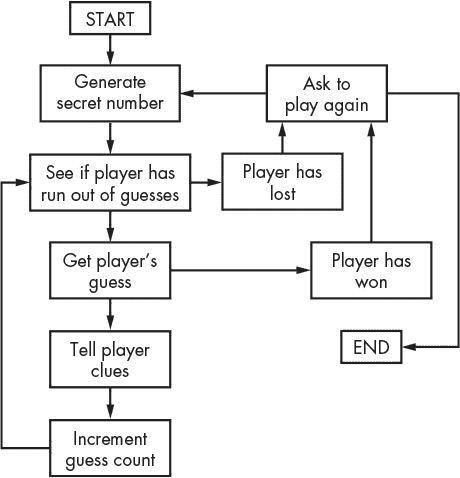

# 11 百吉饼推演游戏

> 原文：<https://inventwithpython.com/invent4thed/chapter11.html>


百吉饼是一种推演游戏，玩家试图猜出一个由计算机生成的随机三位数(没有重复数字)。每次猜中后，电脑会给玩家三种线索:

**百吉饼**猜出来的三个数字没有一个在暗号里。

**Pico** 其中一个数字在暗号里，但是猜测把数字放错了地方。

费米猜想在正确的地方有正确的数字。

电脑可以给出多条线索，按字母顺序排列。如果秘密数字是 456，而玩家的猜测是 546，那么线索就是“费米微微微微”“费米”来自 6，“微微”来自 4 和 5。

在这一章中，你将学习 Python 中的一些新方法和函数。您还将学习扩充赋值操作符和字符串插值。虽然它们不会让你做任何你以前不能做的事情，但它们是让编码更容易的好捷径。

**本章涵盖的主题**

random.shuffle() 函数

增强赋值操作符， += ， -= ， *= ， /=

sort() 列表方法

join() 字符串方法

字符串插值

转换说明符 %s

嵌套循环

### **百吉饼的样品运行**

这是用户运行百吉饼程序时看到的。玩家输入的文本以粗体显示。

```py
I am thinking of a 3-digit number. Try to guess what it is.
The clues I give are...
When I say:    That means:
  Bagels       None of the digits is correct.
  Pico         One digit is correct but in the wrong position.
  Fermi        One digit is correct and in the right position.
I have thought up a number. You have 10 guesses to get it.
Guess #1:
123
Fermi
Guess #2:
453
Pico
Guess #3:
425
Fermi
Guess #4:
326
Bagels
Guess #5:
489
Bagels
Guess #6:
075
Fermi Fermi
Guess #7:
015
Fermi Pico
Guess #8:
175
You got it!
Do you want to play again? (yes or no)
no
```

### **面包圈的源代码**

在一个新文件中，输入下面的源代码并保存为 *bagels.py* 。然后按 F5 运行游戏。如果出现错误，在 https://www.nostarch.com/inventwithpython#diff用在线比较工具将你输入的代码与书中的代码进行比较。


*百吉饼. py*

```py
 1\. import random
 2.
 3\. NUM_DIGITS = 3
 4\. MAX_GUESS = 10
 5.
 6\. def getSecretNum():
 7.     # Returns a string of unique random digits that is NUM_DIGITS long.
 8.     numbers = list(range(10))
 9.     random.shuffle(numbers)
10.     secretNum = ''
11.     for i in range(NUM_DIGITS):
12.         secretNum += str(numbers[i])
13.     return secretNum
14.
15\. def getClues(guess, secretNum):
16.     # Returns a string with the Pico, Fermi, & Bagels clues to the user.
17.     if guess == secretNum:
18.         return 'You got it!'
19.
20.     clues = []
21.     for i in range(len(guess)):
22.         if guess[i] == secretNum[i]:
23.             clues.append('Fermi')
24.         elif guess[i] in secretNum:
25.             clues.append('Pico')
26.     if len(clues) == 0:
27.         return 'Bagels'
28.
29.     clues.sort()
30.     return ' '.join(clues)
31.
32\. def isOnlyDigits(num):
33.     # Returns True if num is a string of only digits. Otherwise, returns
          False.
34.     if num == '':
35.         return False
36.
37.     for i in num:
38.         if i not in '0 1 2 3 4 5 6 7 8 9'.split():
39.             return False
40.
41.     return True
42.
43.
44\. print('I am thinking of a %s-digit number. Try to guess what it is.' %
      (NUM_DIGITS))
45\. print('The clues I give are...')
46\. print('When I say:    That means:')
47\. print(' Bagels        None of the digits is correct.')
48\. print(' Pico          One digit is correct but in the wrong position.')
49\. print(' Fermi         One digit is correct and in the right position.')
50.
51\. while True:
52.     secretNum = getSecretNum()
53.     print('I have thought up a number. You have %s guesses to get it.' %
          (MAX_GUESS))
54.
55.     guessesTaken = 1
56.     while guessesTaken <= MAX_GUESS:
57.         guess = ''
58.         while len(guess) != NUM_DIGITS or not isOnlyDigits(guess):
59.             print('Guess #%s: ' % (guessesTaken))
60.             guess = input()
61.
62.         print(getClues(guess, secretNum))
63.         guessesTaken += 1
64.
65.         if guess == secretNum:
66.             break
67.         if guessesTaken > MAX_GUESS:
68.             print('You ran out of guesses. The answer was %s.' %
                  (secretNum))
69.
70.     print('Do you want to play again? (yes or no)')
71.     if not input().lower().startswith('y'):
72.         break
```

### **百吉饼流程图**

[图 11-1](#calibre_link-815) 中的流程图描述了这个游戏中会发生什么，以及每一步可以发生的顺序。

百吉饼的流程图非常简单。电脑生成一个秘密数字，玩家试着猜这个数字，电脑根据玩家的猜测给出线索。这种情况一次又一次地发生，直到玩家要么赢要么输。游戏结束后，无论玩家是否赢了，电脑都会询问玩家是否想再玩一次。



*图 11-1:百吉饼游戏的流程图*

### **导入 random 并定义 getSecretNum()**

在程序开始时，我们将导入随机模块并设置一些全局变量。然后我们将定义一个名为 getSecretNum() 的函数。

```py
1\. import random
2.
3\. NUM_DIGITS = 3
4\. MAX_GUESS = 10
5.
6\. def getSecretNum():
7.     # Returns a string of unique random digits that is NUM_DIGITS long.
```

我们使用常量变量 NUM_DIGITS ，而不是使用整数 3 来表示答案中的位数。玩家猜测的次数也是如此；我们使用常量变量 MAX_GUESS 代替整数 10 。现在很容易改变猜测的次数或秘密数字。只需更改第 3 行或第 4 行的值，程序的其余部分仍然可以工作，无需再做任何更改。

getSecretNum() 函数生成一个仅包含唯一数字的秘密数字。如果密码中没有重复的数字，如‘244’或‘333’，百吉饼游戏会有趣得多。我们将在 getSecretNum() 中使用一些新的 Python 函数来实现这一点。

### **洗牌一组独特的数字**

getSecretNum() 的前两行打乱了一组不重复的数字:

```py
8.     numbers = list(range(10))
9.     random.shuffle(numbers)
```

第 8 行的列表(范围(10)) 计算为【0，1，2，3，4，5，6，7，8，9】，因此数字变量包含所有 10 个数字的列表。

#### ***用 random.shuffle()函数改变列表项顺序***

函数的作用是:随机改变列表条目的顺序(在这个例子中，是数字列表)。这个函数不返回值，而是修改你传递给它的列表*就地*。这类似于[第 10 章](#calibre_link-12)的井字游戏中的 makeMove() 函数修改它传递的列表，而不是返回一个有变化的新列表。这就是为什么你要*而不是*编写类似numbers = random . shuffle(numbers)的代码。

通过在交互式 shell 中输入以下代码，尝试使用 shuffle() 函数:

```py
>>> import random
>>> spam = list(range(10))
>>> print(spam)
[0, 1, 2, 3, 4, 5, 6, 7, 8, 9]
>>> random.shuffle(spam)
>>> print(spam)
[3, 0, 5, 9, 6, 8, 2, 4, 1, 7]
>>> random.shuffle(spam)
>>> print(spam)
[9, 8, 3, 5, 4, 7, 1, 2, 0, 6]
```

每次在垃圾邮件上调用 random.shuffle() ，就会打乱垃圾邮件列表中的项目。接下来，您将看到我们如何使用 shuffle() 函数来生成一个秘密数字。

#### ***从混洗的数字中获取秘密数字***

秘密数字将是混洗的整数列表的第一个 NUM_DIGITS 位的字符串:

```py
10.     secretNum = ''
11.     for i in range(NUM_DIGITS):
12.         secretNum += str(numbers[i])
13.     return secretNum
```

secretNum 变量以空白字符串开始。第 11 行的循环的迭代 NUM_DIGITS 次。在循环的每次迭代中，从混洗列表中取出索引为 i 的整数，将其转换为字符串，并连接到 secretNum 的末尾。

举个例子，如果数字引用的是列表【9，8，3，5，4，7，1，2，0，6】，那么在第一次迭代时，数字【0】(即 9 )会被传递给str()；这将返回‘9’，它被连接到 secretNum 的末尾。在第二次迭代时，数字[1] (即 8 )会发生同样的情况，在第三次迭代时，数字[2] (即 3 )也会发生同样的情况。返回的 secretNum 的最终值为‘983’。

注意，这个函数中的 secretNum 包含一个字符串，而不是一个整数。这可能看起来很奇怪，但是请记住，您不能连接整数。表达式 9 + 8 + 3 求值为 20 ，而你要的是 '9' + '8' + '3' ，求值为 '983' 。

### **扩充赋值运算符**

第 12 行的 += 运算符是*增强赋值运算符*之一。通常，如果您想要向变量添加或连接一个值，您可以使用如下所示的代码:

```py
>>> spam = 42
>>> spam = spam + 10
>>> spam
52
>>> eggs = 'Hello '
>>> eggs = eggs + 'world!'
>>> eggs
'Hello world!'
```

增强的赋值操作符是快捷方式，使您不必重新键入变量名。下面的代码与前面的代码做同样的事情:

```py
>>> spam = 42
>>> spam += 10       # The same as spam = spam + 10
>>> spam
52
>>> eggs = 'Hello '
>>> eggs += 'world!' # The same as eggs = eggs + 'world!'
>>> eggs
'Hello world!'
```

还有其他增强的赋值操作符。在交互式 shell 中输入以下内容:

```py
>>> spam = 42
>>> spam -= 2
>>> spam
40
```

语句spam-= 2与语句spam = spam-2相同，因此表达式的计算结果为spam = 42–2，然后为 spam = 40 。

乘法和除法也有增强的赋值运算符:

```py
>>> spam *= 3
>>> spam
120
>>> spam /= 10
>>> spam
12.0
```

语句 spam *= 3 与 spam = spam * 3 相同。因此，由于之前垃圾邮件被设置为等于 40 ，完整的表达式将是垃圾邮件= 40 * 3 ，其计算结果为 120 。表达式 spam /= 10 与 spam = spam / 10 相同， spam = 120 / 10 的计算结果为 12.0 。请注意，垃圾邮件被除法运算后变成了浮点数。

### **计算给出的线索**

getClues() 函数将根据 guess 和 secretNum 参数返回一个带有费米、微微和百吉饼线索的字符串。

```py
15\. def getClues(guess, secretNum):
16.     # Returns a string with the Pico, Fermi, & Bagels clues to the user.
17.     if guess == secretNum:
18.         return 'You got it!'
19.
20.     clues = []
21.     for i in range(len(guess)):
22.         if guess[i] == secretNum[i]:
23.             clues.append('Fermi')
24.         elif guess[i] in secretNum:
25.             clues.append('Pico')
```

最明显的步骤是检查猜测值是否与秘密数字相同，我们在第 17 行中就是这么做的。在这种情况下，第 18 行返回‘您成功了！’。

如果猜测和秘密数字不一样，程序必须想出给玩家什么线索。在线索中的列表将开始为空，并根据需要添加【费米】和【皮科】弦。

程序通过在 guess 和 secretNum 中循环每个可能的索引来完成这个任务。两个变量中的字符串长度相同，所以第 21 行可能使用了 len(guess) 或 len(secretNum) 并且工作方式相同。随着 i 的值从 0 变为 1 再变为 2 等等，第 22 行检查猜测的第一、第二、第三等等字符是否与 secretNum 的相应索引中的字符相同。如果是这样，第 23 行将字符串‘费米’添加到线索中。

否则，第 24 行检查猜测中第 i 位的数字是否存在于秘密中的任何地方。如果是这样，你就知道这个数在暗号的某个地方但不在同一个位置。在这种情况下，第 25 行将‘Pico’添加到线索中。

如果循环后线索列表为空，那么你知道猜测中根本没有正确的数字:

```py
26.     if len(clues) == 0:
27.         return 'Bagels'
```

在这种情况下，第 27 行返回字符串‘Bagels’作为唯一的线索。

### **sort()列表方法**

列表有一个名为 sort() 的方法，它按字母或数字顺序排列列表项。当调用 sort() 方法时，它并不返回一个已排序的列表，而是就地对列表进行排序。这就像洗牌()方法的工作原理一样。

你绝不会想要使用 return spam.sort() 因为那将会返回值 None 。相反，您需要一个单独的行， spam.sort() ，然后行返回 spam 。

在交互式 shell 中输入以下内容:

```py
>>> spam = ['cat', 'dog', 'bat', 'anteater']
>>> spam.sort()
>>> spam
['anteater', 'bat', 'cat', 'dog']
>>> spam = [9, 8, 3, 5.5, 5, 7, 1, 2.1, 0, 6]
>>> spam.sort()
>>> spam
[0, 1, 2.1, 3, 5, 5.5, 6, 7, 8, 9]
```

当我们对字符串列表排序时，字符串按字母顺序返回，但当我们对数字列表排序时，数字按数字顺序返回。

在第 29 行，我们对线索使用 sort() :

```py
29.     clues.sort()
```

你想按字母顺序排列线索列表的原因是为了去掉额外的信息，这些信息会帮助玩家更容易地猜出秘密数字。如果线索是 ['皮科'，'费米'，'皮科'] ，那会告诉玩家猜对的中间数字在正确的位置。由于另外两条线索都是微微，玩家会知道他们所要做的就是交换第一个和第三个数字来得到秘密数字。

如果线索总是按字母顺序排列，玩家就不能确定费米线索指的是哪个数字。这使得游戏更难玩，也更有趣。

### **join()字符串方法**

string 方法返回一个字符串列表，作为连接在一起的单个字符串。

```py
30.     return ' '.join(clues)
```

调用该方法的字符串(在第 30 行，这是一个空格， ' ' )出现在列表中的每个字符串之间。要查看示例，请在交互式 shell 中输入以下内容:

```py
>>> ' '.join(['My', 'name', 'is', 'Zophie'])
'My name is Zophie'
>>> ', '.join(['Life', 'the Universe', 'and Everything'])
'Life, the Universe, and Everything'
```

所以第 30 行返回的字符串是线索中的每个字符串，每个字符串之间有一个空格。 join() 字符串方法有点像 split() 字符串方法的反义词。当 split() 从拆分的字符串中返回一个列表时， join() 从组合的列表中返回一个字符串。

### **检查字符串是否只有数字**

isonlydights()函数帮助确定玩家是否输入了有效的猜测:

```py
32\. def isOnlyDigits(num):
33.     # Returns True if num is a string of only digits. Otherwise, returns
          False.
34.     if num == '':
35.         return False
```

第 34 行首先检查 num 是否为空字符串，如果是，则返回 False 。

然后，循环的遍历字符串 num 中的每个字符:

```py
37.     for i in num:
38.         if i not in '0 1 2 3 4 5 6 7 8 9'.split():
39.             return False
40.
41.     return True
```

在每次迭代中， i 的值将有一个字符。在块的中，代码检查 i 是否存在于‘0 1 2 3 4 5 6 7 8 9’返回的列表中。拆分()。(从 split() 返回的值相当于 ['0 '，' 1 '，' 2 '，' 3 '，' 4 '，' 5 '，' 6 '，' 7 '，' 8 '，' 9'] 。)如果 i 不在那个列表中，你知道在 num 中有一个非数字字符。在这种情况下，第 39 行返回假。

但是如果执行继续越过循环的，那么你就知道 num 中的每个字符都是一个数字。在这种情况下，第 41 行返回真值。

### **开始游戏**

在所有的函数定义之后，第 44 行是程序的实际开始:

```py
44\. print('I am thinking of a %s-digit number. Try to guess what it is.' %
      (NUM_DIGITS))
45\. print('The clues I give are...')
46\. print('When I say:    That means:')
47\. print('  Bagels       None of the digits is correct.')
48\. print('  Pico         One digit is correct but in the wrong position.')
49\. print('  Fermi        One digit is correct and in the right position.')
```

函数调用告诉玩家游戏的规则以及 pico、fermi 和 bagels 线索的含义。第 44 行的 print() 调用在末尾添加了 % (NUM_DIGITS) ，在字符串内添加了 %s 。这是一种被称为*字符串插值*的技术。

### **字符串插值**

字符串插值，又称*字符串格式化*，是一种编码快捷方式。通常，如果你想在另一个字符串中使用变量内的字符串值，你必须使用 + 串联运算符:

```py
>>> name = 'Alice'
>>> event = 'party'
>>> location = 'the pool'
>>> day = 'Saturday'
>>> time = '6:00pm'
>>> print('Hello, ' + name + '. Will you go to the ' + event + ' at ' +
location + ' this ' + day + ' at ' + time + '?')
Hello, Alice. Will you go to the party at the pool this Saturday at 6:00pm?
```

正如您所看到的，输入一行连接几个字符串的代码非常耗时。相反，您可以使用字符串插值，这允许您将类似于 %s 的占位符放入字符串。这些占位符被称为*转换说明符*。一旦你放入了转换说明符，你就可以把所有的变量名放在字符串的末尾。每一个 %s 都被替换为行尾的变量，按照你输入变量的顺序。例如，下面的代码与前面的代码做同样的事情:

```py
>>> name = 'Alice'
>>> event = 'party'
>>> location = 'the pool'
>>> day = 'Saturday'
>>> time = '6:00pm'
>>> print('Hello, %s. Will you go to the %s at %s this %s at %s?' % (name,
event, location, day, time))
Hello, Alice. Will you go to the party at the pool this Saturday at 6:00pm?
```

注意，第一个变量名用于第一个 %s ，第二个变量用于第二个 %s ，依此类推。您拥有的 %s 转换说明符的数量必须与变量的数量相同。

使用字符串插值而不是字符串串联的另一个好处是插值适用于任何数据类型，而不仅仅是字符串。所有值都自动转换为字符串数据类型。如果您将一个整数连接到一个字符串，您会得到以下错误:

```py
>>> spam = 42
>>> print('Spam == ' + spam)
Traceback (most recent call last):
  File "<stdin>", line 1, in <module>
TypeError: Can't convert 'int' object to str implicitly
```

字符串串联只能组合两个字符串，但是 spam 是整数。你必须记得把的 str(spam) 而不是的 spam 。

现在在交互式 shell 中输入以下内容:

```py
>>> spam = 42
>>> print('Spam is %s' % (spam))
Spam is 42
```

使用字符串插值，这种到字符串的转换会自动完成。

### **游戏循环**

第 51 行是一个无限的 while 循环，其条件为 True ，因此它将永远循环下去，直到执行了一个 break 语句:

```py
51\. while True:
52.     secretNum = getSecretNum()
53.     print('I have thought up a number. You have %s guesses to get it.' %
          (MAX_GUESS))
54.
55.     guessesTaken = 1
56.     while guessesTaken <= MAX_GUESS:
```

在无限循环中，您从 getSecretNum() 函数中获得一个秘密数字。这个秘密号码被分配给 secretNum 。记住， secretNum 中的值是字符串，不是整数。

第 53 行通过使用字符串插值而不是字符串串联来告诉玩家秘密数字有多少位。第 55 行将变量guess es takes设置为 1 以标记这是第一次猜测。然后第 56 行有了一个新的而循环，只要玩家还有猜测就循环。在代码中，这是当 guessesTaken 小于或等于 MAX_GUESS 时。

注意第 56 行上的 while 循环在另一个从第 51 行开始的 while 循环中。这些循环中的循环被称为*嵌套循环*。任何 break 或 continue 语句，比如第 66 行的 break 语句，只会在最内层循环之外中断或继续，而不会在任何外层循环之外中断或继续。

#### ***得到玩家的猜测***

guess 变量保存从 input() 返回的玩家猜测。代码不断循环，并要求玩家猜一猜，直到他们输入一个有效的猜测:

```py
57.         guess = ''
58.         while len(guess) != NUM_DIGITS or not isOnlyDigits(guess):
59.             print('Guess #%s: ' % (guessesTaken))
60.             guess = input()
```

有效的猜测只有位数，并且位数与秘密数字相同。从第 58 行开始的 while 循环检查猜测的有效性。

第 57 行的猜测变量被设置为空字符串，因此第 58 行的【T2 而循环的条件在第一次被检查时为假，确保执行从第 59 行开始进入循环。

#### ***获取玩家猜测的线索***

在执行通过从第 58 行开始的 while 循环后，猜测包含一个有效的猜测。现在程序将猜测和秘密传递给 getClues() 函数:

```py
62.         print(getClues(guess, secretNum))
63.         guessesTaken += 1
```

它返回一串线索，在第 62 行显示给玩家。第 63 行使用增加的赋值操作符增加了 guessesTaken 。

#### ***检查玩家是赢还是输***

现在我们算出玩家是赢了还是输了游戏:

```py
65.         if guess == secretNum:
66.             break
67.         if guessesTaken > MAX_GUESS:
68.             print('You ran out of guesses. The answer was %s.' %
                  (secretNum))
```

如果猜测与秘密的值相同，则玩家已经正确猜测了秘密数字，并且 66 线脱离了在 56 线开始的而循环。如果没有，则执行继续到第 67 行，在那里程序检查玩家是否用完了猜测。

如果玩家还有更多猜测，执行跳回到，而循环到第 56 行，让玩家再猜一次。如果玩家猜中了(或者程序用第 66 行的 break 语句跳出了循环)，执行将越过循环，转到第 70 行。

#### ***要求玩家再次玩***

第 70 行询问玩家是否想再玩一次:

```py
70.     print('Do you want to play again? (yes or no)')
71.     if not input().lower().startswith('y'):
72.         break
```

玩家的响应由 input() 返回，调用 lower() 方法，然后调用 startswith() 方法检查玩家的响应是否以 y 开始。如果没有，程序从第 51 行开始的 while 循环中退出。由于在这个循环之后没有更多的代码，程序终止。

如果响应以 y 开始，程序不执行 break 语句，执行跳回到第 51 行。然后程序会生成一个新的密码，这样玩家就可以玩新游戏了。

### **总结**

百吉饼是一个简单的游戏编程，但可能很难赢得。但是如果你继续玩下去，你最终会发现利用游戏给你的线索来猜测的更好的方法。这就像你越坚持，编程就会越好。

本章介绍了一些新的函数和方法——shuffle()、 sort() 和join()——以及一些方便的快捷方式。当你想改变一个变量的相对值时，增加的赋值操作符需要较少的输入；比如 spam = spam + 1 可以简称为 spam += 1 。使用字符串插值，您可以通过将 %s (称为*转换说明符*)放在字符串中，而不是使用许多字符串连接操作，来使您的代码更具可读性。

在第 12 章中，我们不会做任何编程，但是这些概念——笛卡尔坐标和负数——对于本书后面章节的游戏来说是必要的。这些数学概念不仅会用在我们将要制作的声纳寻宝、Reversegam 和 Dodger 游戏中，还会用在许多其他游戏中。即使你已经知道了这些概念，还是让[第 12 章](#calibre_link-72)简单地读一下，让自己清醒一下。