# 12 笛卡尔坐标系

> 原文：<https://inventwithpython.com/invent4thed/chapter12.html>


这一章讲述了一些简单的数学概念，你将在本书的其余部分用到。在二维(2D)游戏中，屏幕上的图形可以左右上下移动。这些游戏需要一种方法将屏幕上的位置转换成程序可以处理的整数。

这就是*笛卡尔坐标系*的用武之地。*坐标*是代表屏幕上特定点的数字。这些数字可以作为整数存储在程序的变量中。

**本章涵盖的主题**

笛卡尔坐标系

x 轴和 y 轴

负数

像素

加法的交换性质

绝对值和 abs() 功能

### **网格和笛卡尔坐标**

指棋盘上特定位置的一种常见方式是用字母和数字标记每一行和每一列。[图 12-1](#calibre_link-801) 显示了一个每一行和每一列都有标记的棋盘。

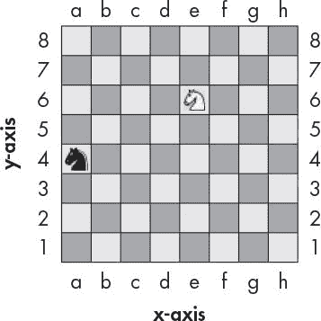

*图 12-1:一个样本棋盘，一个黑骑士在(A，4)，一个白骑士在(e，6)*

棋盘上一个空间的坐标是一行和一列的组合。在国际象棋中，骑士棋子看起来像马头。[图 12-1](#calibre_link-801) 中的白骑士因为在 e 列 6 行，所以位于点(e，6)，黑骑士因为在 a 列 4 行，所以位于点(a，4)。

你可以把棋盘想象成一个笛卡尔坐标系。通过使用行标签和列标签，您可以为棋盘上的一个(且仅一个)空间给出一个坐标。如果你在数学课上学过笛卡尔坐标系，你可能知道数字既用于行也用于列。使用数字坐标的棋盘看起来像图 12-2 。

沿着列向左和向右的数字是 x 轴的一部分。沿着行上下移动的数字是 *y 轴*的一部分。坐标总是首先用 x 坐标描述，然后用 y 坐标描述。在[图 12-2](#calibre_link-802) 中，白骑士的 x 坐标是 5，y 坐标是 6，所以白骑士位于坐标(5，6)而不是(6，5)。同样，黑骑士位于坐标(1，4)，而不是(4，1)，因为黑骑士的 x 坐标是 1，y 坐标是 4。


*图 12-2:相同的棋盘，但是行和列都有数字坐标*

请注意，为了让黑骑士移动到白骑士的位置，黑骑士必须向上移动两个空格，向右移动四个空格。但是你不需要看黑板就能明白。如果知道白骑士位于(5，6)，黑骑士位于(1，4)，可以用减法算出这些信息。

用白骑士的 x 坐标减去黑骑士的 x 坐标:5–1 = 4。黑骑士要沿着 x 轴移动四格。现在从白骑士的 y 坐标中减去黑骑士的 y 坐标:6–4 = 2。黑骑士必须沿 y 轴移动两个空格。

通过对坐标数字做一些数学运算，你可以算出两个坐标之间的距离。

### **负数**

笛卡尔坐标也使用负数(小于零的数字)。数字前面的减号表示它是负数:–1 小于 0。并且–2 小于–1。但是 0 本身不是正的也不是负的。在[图 12-3](#calibre_link-803) 中，你可以看到在一条数字线上正数向右增加，负数向左减少。

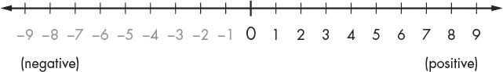

*图 12-3:正负数的数轴*

数字线对看减法和加法很有用。你可以把表达式 5 + 3 想成白骑士从位置 5 开始，向右移动 3 格。正如你在[图 12-4](#calibre_link-804) 中看到的，白骑士最终在位置 8。这是有道理的，因为 5 + 3 等于 8。

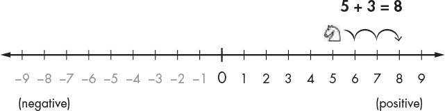

*图 12-4:向右移动白骑士增加坐标。*

你通过向左移动白骑士来减去。所以如果表达式是 5–6，白骑士从位置 5 开始向左移动 6 格，如图[图 12-5](#calibre_link-805) 所示。

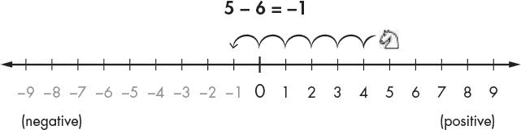

*图 12-5:向左移动白骑士从坐标中减去。*

白骑士最终在位置-1。这意味着 5–6 等于–1。

如果你加上或减去一个负数，白骑士会向与正数相反的方向移动。如果你加上一个负数，骑士移动到左边的*。如果你减去一个负数，骑士移动到右边的*。表达式–1 –(–4)将等于 3，如图 12-6 所示。请注意–1 –(–4)与–1+4 的答案相同。**

**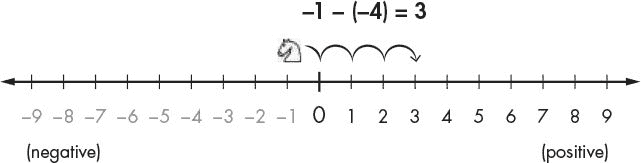

*图 12-6:骑士从–6 开始，向*右侧*移动 4 格。*

你可以把 x 轴想象成一条数轴。为 y 轴添加另一条上下的数字线。如果你把这两条线放在一起，你就有了一个笛卡尔坐标系统，就像图 12-7 中的那样。

加上一个正数(或减去一个负数)会使骑士在 y 轴上向上移动或在 x 轴上向右移动，减去一个正数(或加上一个负数)会使骑士在 y 轴上向下移动或在 x 轴上向左移动。

中心的(0，0)坐标称为*原点*。你可能在数学课上用过这样的坐标系。正如你将要看到的，像这样的坐标系统有很多小技巧，可以让你更容易地计算出坐标。

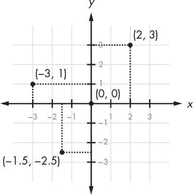

*图 12-7:将两条数轴放在一起创建一个笛卡尔坐标系。*

### **电脑屏幕的坐标系**

你的电脑屏幕是由*个像素*组成的，这是屏幕所能显示的最小颜色点。计算机屏幕通常使用一个坐标系统，其原点(0，0)在左上角，并且向下和向右增加。你可以在[图 12-8](#calibre_link-808) 中看到这一点，它展示了一台屏幕分辨率为 1920 像素宽和 1080 像素高的笔记本电脑。

没有负坐标。大多数计算机图形在屏幕上使用这个坐标系统来表示像素，你将在本书的游戏中使用它。对于编程来说，了解坐标系是如何工作的很重要——既有用于数学的坐标系，也有用于计算机屏幕的坐标系。

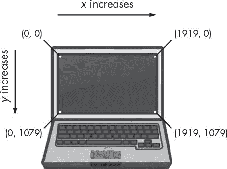

*图 12-8:电脑屏幕上的笛卡尔坐标系*

### **数学窍门**

当你面前有一条数字线时，负数的加减是很容易的。没有数字线也可以很容易。这里有三个小技巧可以帮助你自己加减负数。

#### ***招数一:A 减吃掉其左边的加号***

当你看到一个负号，左边有一个加号，你可以把加号换成负号。想象减号“吃掉”它左边的加号。答案还是一样的，因为加一个负值等于减一个正值。因此，4+–2 和 4–2 的计算结果都是 2，如下所示:

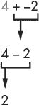

#### ***招数二:两个负号组合成一个加号***

当你看到两个减号相邻，中间没有数字，它们可以组合成一个加号。答案还是一样的，因为减去一个负值和加上一个正值是一样的:

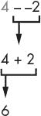

#### ***招数三:被加的两个数可以互换位置***

此外，您还可以交换号码。这就是加法的*交换性质。这意味着像 6 + 4 到 4 + 6 这样的交换不会改变答案，正如你在[图 12-9](#calibre_link-809) 中数盒子时所看到的。*

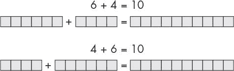

*图 12-9:加法的交换性让你交换数字。*

假设您正在添加一个负数和一个正数，比如–6+8。因为你在加数字，所以你可以交换数字的顺序而不改变答案。这意味着–6+8 与 8+–6 相同。然后当你看 8+–6 时，你会看到减号可以吃掉它左边的加号，问题就变成了 8–6 = 2，就像你在这里看到的:

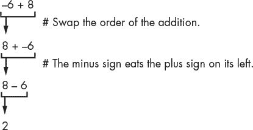

您已经重新安排了问题，以便在不使用计算器或计算机的情况下更容易解决。

### **绝对值和 abs()函数**

数字的*绝对值*是前面没有减号的数字。所以正数不变，负数变正。例如,–4 的绝对值是 4。–7 的绝对值是 7。5 的绝对值(已经是正的)正好是 5。

你可以通过减去两个物体的位置并取差值的绝对值来计算出它们之间的距离。假设白骑士在位置 4，黑骑士在位置-2。距离应该是 6，因为 4–2 是 6，而 6 的绝对值是 6。

不管数字的顺序是什么，它都是有效的。例如–2–4(即负二减四)是–6，而–6 的绝对值也是 6。

Python 的 abs() 函数返回一个整数的绝对值。在交互式 shell 中输入以下内容:

```py
>>> abs(-5)
5
>>> abs(42)
42
>>> abs(-10.5)
10.5
```

-5 的绝对值为 5 。正数的绝对值就是这个数，所以 42 的绝对值就是 42 。带小数的偶数有绝对值，所以 -10.5 的绝对值就是 10.5 。

### **总结**

大多数编程不需要理解很多数学知识。到本章为止，我们一直在学习简单的加法和乘法。

需要笛卡尔坐标系来描述某个位置在二维区域中的位置。坐标有两个数字:x 坐标和 y 坐标。x 轴左右运行，y 轴上下运行。在电脑屏幕上，原点在左上角，坐标向右下方递增。

你在这一章中学到的三个数学技巧可以让你轻松地将正整数和负整数相加。第一个技巧是减号会吃掉它左边的加号。第二个技巧是两个相邻的负号会组合成一个正号。第三个技巧是你可以交换你要加的数字的位置。

本书中的其余游戏使用这些概念，因为它们有二维区域。所有的图形游戏都需要理解笛卡尔坐标是如何工作的。**