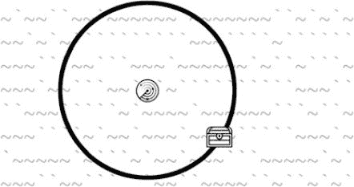
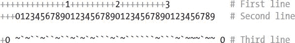
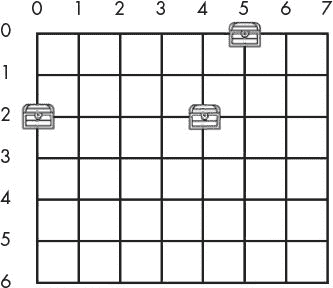
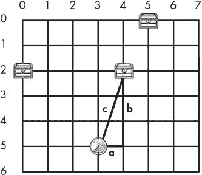
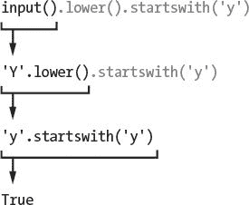

# 13 声纳寻宝

> 原文：<https://inventwithpython.com/invent4thed/chapter13.html>


本章的声纳寻宝游戏是第一个利用你在[第 12 章](#calibre_link-72)中学到的笛卡尔坐标系的游戏。这个游戏也使用数据结构，这只是一种奇特的说法，它有包含其他列表和类似复杂变量的列表值。随着你编写的游戏变得越来越复杂，你需要把你的数据组织成数据结构。

在这一章的游戏中，玩家在海洋的不同地方放下声纳设备来定位沉没的宝箱。*声纳*是船只用来定位海底物体的技术。这个游戏中的声纳设备会告诉玩家最近的宝箱有多远，但不会告诉玩家在哪个方向。但通过放置多个声纳设备，玩家可以找出宝箱的位置。

**本章涵盖的主题**

数据结构

勾股定理

remove() 列表方法

isdigit() 字符串方法

sys.exit() 函数

有 3 个箱子需要收集，玩家只有 20 个声纳设备来找到它们。想象一下你看不到[图 13-1](#calibre_link-73) 中的宝箱。因为每个声纳设备只能找到离箱子的距离，而不是箱子的方向，所以宝藏可能在声纳设备周围的任何地方。



*图 13-1:声纳装置的圆环触碰到(隐藏的)宝箱。*

但是多个声纳设备一起工作可以将胸部的位置缩小到圆环相交的精确坐标(见[图 13-2](#calibre_link-74) )。


*图 13-2:多个戒指的组合显示了藏宝箱的地方。*

### **声纳寻宝试运行**

这是用户运行声纳寻宝程序时看到的。玩家输入的文本以粗体显示。

```py
S O N A R !

Would you like to view the instructions? (yes/no)
no
             1         2         3         4         5
   012345678901234567890123456789012345678901234567890123456789

 0 ~`~``~``~``~`~`~```~`~```py```~```~`~~~`~~```py~~`~~~~~`~~`~~~~` 0
 1 ~~~~~`~~~~~````~``~~```py~``~`~`~`~``~~```~~~`~`~```py~~~~`~`~~` 1
 2 ```~```py`~``~`~`~~~``~~`````~~``~``~``~~```py~~``~~`~~~````~~`~ 2
 3 ```py``~~``````py~`~~~~~```~~``~~~`~`~~~~~~```py``~`~```~~~``~``~` 3
 4 ~~~`~~~`~`~~~``~~~`~`~``~~~~``~~~~``~~~~`~`~``~~```py~``~~`~`~ 4
 5 `~``~````~`~`~~``~~~~```py```~```~~~~```py`````~``~~~`~~``~~```py` 5
 6 ~`~```~~`~~```py~``````py``~~```~```py~~~~``~~~`~`~~`~``~~~`~~`~`` 6
 7 ~`~~~```~``~```py~`~```~~~~~~~`~~`~`~~~~``~```py~~~`~```~``~``~` 7
 8 `~``~~`~`~~`~~`~~``~```py~````~`~```py~``~````~~~```py`~~``~~``~~` 8
 9 ~`~``~~````~~```py~`~~```~~`~``~`~~``~`~`~~~~`~`~~`~`~```py~~``` 9
10 `~~~~~~`~``~``~~~``~``~~~~`~``~```py~`~~``~~~~~~``````py~~`~``~~ 10
11 ~``~~~````~`~~`~~~`~~~``~```py```~`~``~~~~`````~~~```py```~`~`~~ 11
12 ~~~~~``~`~````~```py~`~`~`~~`~~`~``~~~~~~~`~~```~~``~~`~~~~```py 12
13 `~~```~~```py`````~~~`~~~```py~~~~~~~~`~~``~~`~```~`~~```py`~~~``~ 13
14 ```~``~`~`~``~```py~`~``~`~``~~```~`~~~``~~``~```py~`~~`~``````py~ 14

   012345678901234567890123456789012345678901234567890123456789
             1         2         3         4         5
You have 20 sonar device(s) left. 3 treasure chest(s) remaining.
Where do you want to drop the next sonar device? (0-59 0-14) (or type quit)
25 5
             1         2         3         4         5
   012345678901234567890123456789012345678901234567890123456789

 0 ~`~``~``~``~`~`~```~`~```py```~```~`~~~`~~```py~~`~~~~~`~~`~~~~` 0
 1 ~~~~~`~~~~~````~``~~```py~``~`~`~`~``~~```~~~`~`~```py~~~~`~`~~` 1
 2 ```~```py`~``~`~`~~~``~~`````~~``~``~``~~```py~~``~~`~~~````~~`~ 2
 3 ```py``~~``````py~`~~~~~```~~``~~~`~`~~~~~~```py``~`~```~~~``~``~` 3
 4 ~~~`~~~`~`~~~``~~~`~`~``~~~~``~~~~``~~~~`~`~``~~```py~``~~`~`~ 4
 5 `~``~````~`~`~~``~~~~```py`5`~```~~~~```py`````~``~~~`~~``~~```py` 5
 6 ~`~```~~`~~```py~``````py``~~```~```py~~~~``~~~`~`~~`~``~~~`~~`~`` 6
 7 ~`~~~```~``~```py~`~```~~~~~~~`~~`~`~~~~``~```py~~~`~```~``~``~` 7
 8 `~``~~`~`~~`~~`~~``~```py~````~`~```py~``~````~~~```py`~~``~~``~~` 8
 9 ~`~``~~````~~```py~`~~```~~`~``~`~~``~`~`~~~~`~`~~`~`~```py~~``` 9
10 `~~~~~~`~``~``~~~``~``~~~~`~``~```py~`~~``~~~~~~``````py~~`~``~~ 10
11 ~``~~~````~`~~`~~~`~~~``~```py```~`~``~~~~`````~~~```py```~`~`~~ 11
12 ~~~~~``~`~````~```py~`~`~`~~`~~`~``~~~~~~~`~~```~~``~~`~~~~```py 12
13 `~~```~~```py`````~~~`~~~```py~~~~~~~~`~~``~~`~```~`~~```py`~~~``~ 13
14 ```~``~`~`~``~```py~`~``~`~``~~```~`~~~``~~``~```py~`~~`~``````py~ 14

   012345678901234567890123456789012345678901234567890123456789
             1         2         3         4         5
Treasure detected at a distance of 5 from the sonar device.
You have 19 sonar device(s) left. 3 treasure chest(s) remaining.
Where do you want to drop the next sonar device? (0-59 0-14) (or type quit)
30 5
             1         2         3         4         5
   012345678901234567890123456789012345678901234567890123456789

 0 ~`~``~``~``~`~`~```~`~```py```~```~`~~~`~~```py~~`~~~~~`~~`~~~~` 0
 1 ~~~~~`~~~~~````~``~~```py~``~`~`~`~``~~```~~~`~`~```py~~~~`~`~~` 1
 2 ```~```py`~``~`~`~~~``~~`````~~``~``~``~~```py~~``~~`~~~````~~`~ 2
 3 ```py``~~``````py~`~~~~~```~~``~~~`~`~~~~~~```py``~`~```~~~``~``~` 3
 4 ~~~`~~~`~`~~~``~~~`~`~``~~~~``~~~~``~~~~`~`~``~~```py~``~~`~`~ 4
 5 `~``~````~`~`~~``~~~~```py`5`~``3~~~~``````py``~``~~~`~~``~~```` 5
 6 ~`~```py~~`~~```~```py`````~~```py~```~~~~``~~~`~`~~`~``~~~`~~`~`` 6
 7 ~`~~~```py~``~```~`~```py~~~~~~~`~~`~`~~~~``~```~~~`~```py~``~``~` 7
 8 `~``~~`~`~~`~~`~~``~```~```py`~`~```~``~```py`~~~````~~``~~``~~` 8
 9 ~`~``~~```py`~~```~`~~```py~~`~``~`~~``~`~`~~~~`~`~~`~`~```~~```py 9
10 `~~~~~~`~``~``~~~``~``~~~~`~``~```~`~~``~~~~~~```py```~~`~``~~ 10
11 ~``~~~````~`~~`~~~`~~~``~```py```~`~``~~~~`````~~~```py```~`~`~~ 11
12 ~~~~~``~`~````~```py~`~`~`~~`~~`~``~~~~~~~`~~```~~``~~`~~~~```py 12
13 `~~```~~```py`````~~~`~~~```py~~~~~~~~`~~``~~`~```~`~~```py`~~~``~ 13
14 ```~``~`~`~``~```py~`~``~`~``~~```~`~~~``~~``~```py~`~~`~``````py~ 14

   012345678901234567890123456789012345678901234567890123456789
             1         2         3         4         5
Treasure detected at a distance of 3 from the sonar device.
You have 18 sonar device(s) left. 3 treasure chest(s) remaining.
Where do you want to drop the next sonar device? (0-59 0-14) (or type quit)
25 10
             1         2         3         4         5
   012345678901234567890123456789012345678901234567890123456789

 0 ~`~``~``~``~`~`~```~`~```py```~```~`~~~`~~```py~~`~~~~~`~~`~~~~` 0
 1 ~~~~~`~~~~~````~``~~```py~``~`~`~`~``~~```~~~`~`~```py~~~~`~`~~` 1
 2 ```~```py`~``~`~`~~~``~~`````~~``~``~``~~```py~~``~~`~~~````~~`~ 2
 3 ```py``~~``````py~`~~~~~```~~``~~~`~`~~~~~~```py``~`~```~~~``~``~` 3
 4 ~~~`~~~`~`~~~``~~~`~`~``~~~~``~~~~``~~~~`~`~``~~```py~``~~`~`~ 4
 5 `~``~````~`~`~~``~~~~```py`5`~``3~~~~``````py``~``~~~`~~``~~```` 5
 6 ~`~```py~~`~~```~```py`````~~```py~```~~~~``~~~`~`~~`~``~~~`~~`~`` 6
 7 ~`~~~```py~``~```~`~```py~~~~~~~`~~`~`~~~~``~```~~~`~```py~``~``~` 7
 8 `~``~~`~`~~`~~`~~``~```~```py`~`~```~``~```py`~~~````~~``~~``~~` 8
 9 ~`~``~~```py`~~```~`~~```py~~`~``~`~~``~`~`~~~~`~`~~`~`~```~~```py 9
10 `~~~~~~`~``~``~~~``~``~~~4`~``~```~`~~``~~~~~~```py```~~`~``~~ 10
11 ~``~~~````~`~~`~~~`~~~``~```py```~`~``~~~~`````~~~```py```~`~`~~ 11
12 ~~~~~``~`~````~```py~`~`~`~~`~~`~``~~~~~~~`~~```~~``~~`~~~~```py 12
13 `~~```~~```py`````~~~`~~~```py~~~~~~~~`~~``~~`~```~`~~```py`~~~``~ 13
14 ```~``~`~`~``~```py~`~``~`~``~~```~`~~~``~~``~```py~`~~`~``````py~ 14

   012345678901234567890123456789012345678901234567890123456789
             1         2         3         4         5
Treasure detected at a distance of 4 from the sonar device.
You have 17 sonar device(s) left. 3 treasure chest(s) remaining.
Where do you want to drop the next sonar device? (0-59 0-14) (or type quit)
29 8
             1         2         3         4         5
   012345678901234567890123456789012345678901234567890123456789
 0 ~`~``~``~``~`~`~```~`~```py```~```~`~~~`~~```py~~`~~~~~`~~`~~~~` 0
 1 ~~~~~`~~~~~````~``~~```py~``~`~`~`~``~~```~~~`~`~```py~~~~`~`~~` 1
 2 ```~```py`~``~`~`~~~``~~`````~~``~``~``~~```py~~``~~`~~~````~~`~ 2
 3 ```py``~~``````py~`~~~~~```~~``~~~`~`~~~~~~```py``~`~```~~~``~``~` 3
 4 ~~~`~~~`~`~~~``~~~`~`~``~~~~``~~~~``~~~~`~`~``~~```py~``~~`~`~ 4
 5 `~``~````~`~`~~``~~~~```py`X`~``X~~~~``````py``~``~~~`~~``~~```` 5
 6 ~`~```py~~`~~```~```py`````~~```py~```~~~~``~~~`~`~~`~``~~~`~~`~`` 6
 7 ~`~~~```py~``~```~`~```py~~~~~~~`~~`~`~~~~``~```~~~`~```py~``~``~` 7
 8 `~``~~`~`~~`~~`~~``~```~```py`~X~```~``~```py`~~~````~~``~~``~~` 8
 9 ~`~``~~```py`~~```~`~~```py~~`~``~`~~``~`~`~~~~`~`~~`~`~```~~```py 9
10 `~~~~~~`~``~``~~~``~``~~~X`~``~```~`~~``~~~~~~```py```~~`~``~~ 10
11 ~``~~~````~`~~`~~~`~~~``~```py```~`~``~~~~`````~~~```py```~`~`~~ 11
12 ~~~~~``~`~````~```py~`~`~`~~`~~`~``~~~~~~~`~~```~~``~~`~~~~```py 12
13 `~~```~~```py`````~~~`~~~```py~~~~~~~~`~~``~~`~```~`~~```py`~~~``~ 13
14 ```~``~`~`~``~```py~`~``~`~``~~```~`~~~``~~``~```py~`~~`~``````py~ 14

   012345678901234567890123456789012345678901234567890123456789
             1         2         3         4         5
You have found a sunken treasure chest!
You have 16 sonar device(s) left. 2 treasure chest(s) remaining.
Where do you want to drop the next sonar device? (0-59 0-14) (or type quit)
--snip--
```

### **声纳寻宝的源代码**

在一个新文件中输入以下源代码，并将该文件另存为 *sonar.py* 。然后按 F5(或 OS X 上的 <small class="calibre11">FN</small> -F5)运行它。如果你输入代码后出现错误，用在线比较工具在 https://www.nostarch.com/inventwithpython#diff将你输入的代码与书中的代码进行比较。


*声纳. py*

```py
  1\. # Sonar Treasure Hunt
  2.
  3\. import random
  4\. import sys
  5\. import math
  6.
  7\. def getNewBoard():
  8.     # Create a new 60x15 board data structure.
  9.     board = []
 10.     for x in range(60): # The main list is a list of 60 lists.
 11.         board.append([])
 12.         for y in range(15): # Each list in the main list has
               15 single-character strings.
 13.             # Use different characters for the ocean to make it more
                   readable.
 14.             if random.randint(0, 1) == 0:
 15.                 board[x].append('~')
 16.             else:
 17.                 board[x].append('`')
 18.     return board
 19.
 20\. def drawBoard(board):
 21.     # Draw the board data structure.
 22.     tensDigitsLine = '    ' # Initial space for the numbers down the left
           side of the board
 23.     for i in range(1, 6):
 24.         tensDigitsLine += (' ' * 9) + str(i)
 25.
 26.     # Print the numbers across the top of the board.
 27.     print(tensDigitsLine)
 28.     print('   ' + ('0123456789' * 6))
 29.     print()
 30.
 31.     # Print each of the 15 rows.
 32.     for row in range(15):
 33.         # Single-digit numbers need to be padded with an extra space.
 34.         if row < 10:
 35.             extraSpace = ' '
 36.         else:
 37.             extraSpace = ''
 38.
 39.         # Create the string for this row on the board.
 40.         boardRow = ''
 41.         for column in range(60):
 42.             boardRow += board[column][row]
 43.
 44.         print('%s%s %s %s' % (extraSpace, row, boardRow, row))
 45.
 46.     # Print the numbers across the bottom of the board.
 47.     print()
 48.     print(' ' + ('0123456789' * 6))
 49.     print(tensDigitsLine)
 50.
 51\. def getRandomChests(numChests):
 52.     # Create a list of chest data structures (two-item lists of x, y int
           coordinates).
 53.     chests = []
 54.     while len(chests) < numChests:
 55.         newChest = [random.randint(0, 59), random.randint(0, 14)]
 56.         if newChest not in chests: # Make sure a chest is not already
               here.
 57.             chests.append(newChest)
 58.     return chests
 59.
 60\. def isOnBoard(x, y):
 61.     # Return True if the coordinates are on the board; otherwise, return
           False.
 62.     return x >= 0 and x <= 59 and y >= 0 and y <= 14
 63.
 64\. def makeMove(board, chests, x, y):
 65.     # Change the board data structure with a sonar device character.
           Remove treasure chests from the chests list as they are found.
 66.     # Return False if this is an invalid move.
 67.     # Otherwise, return the string of the result of this move.
 68.     smallestDistance = 100 # Any chest will be closer than 100.
 69.     for cx, cy in chests:
 70.         distance = math.sqrt((cx - x) * (cx - x) + (cy - y) * (cy - y))
 71.
 72.         if distance < smallestDistance: # We want the closest treasure
               chest.
 73.             smallestDistance = distance
 74.
 75.     smallestDistance = round(smallestDistance)
 76.
 77.     if smallestDistance == 0:
 78.         # xy is directly on a treasure chest!
 79.         chests.remove([x, y])
 80.         return 'You have found a sunken treasure chest!'
 81.     else:
 82.         if smallestDistance < 10:
 83.             board[x][y] = str(smallestDistance)
 84.             return 'Treasure detected at a distance of %s from the sonar
                   device.' % (smallestDistance)
 85.         else:
 86.             board[x][y] = 'X'
 87.             return 'Sonar did not detect anything. All treasure chests
                   out of range.'
 88.
 89\. def enterPlayerMove(previousMoves):
 90.     # Let the player enter their move. Return a two-item list of int
           xy coordinates.
 91.     print('Where do you want to drop the next sonar device? (0-59 0-14)
           (or type quit)')
 92.     while True:
 93.         move = input()
 94.         if move.lower() == 'quit':
 95.             print('Thanks for playing!')
 96.             sys.exit()
 97.
 98.         move = move.split()
 99.         if len(move) == 2 and move[0].isdigit() and move[1].isdigit() and
               isOnBoard(int(move[0]), int(move[1])):
100.             if [int(move[0]), int(move[1])] in previousMoves:
101.                 print('You already moved there.')
102.                 continue
103.             return [int(move[0]), int(move[1])]
104.
105.         print('Enter a number from 0 to 59, a space, then a number from
               0 to 14.')
106.
107\. def showInstructions():
108.     print('''Instructions:
109\. You are the captain of the Simon, a treasure-hunting ship. Your current
       mission
110\. is to use sonar devices to find three sunken treasure chests at the
       bottom of
111\. the ocean. But you only have cheap sonar that finds distance, not
       direction.
112.
113\. Enter the coordinates to drop a sonar device. The ocean map will be
       marked with
114\. how far away the nearest chest is, or an X if it is beyond the sonar
       device's
115\. range. For example, the C marks are where chests are. The sonar device
       shows a
116\. 3 because the closest chest is 3 spaces away.
117.
118.                     1         2         3
119.           012345678901234567890123456789012
120.
121.         0 ~~~~`~```~`~``~~~``~`~~``~~~``~`~ 0
122.         1 ~`~`~``~~`~```py~~~```~~`~`~~~`~~~~ 1
123.         2 `~`C``3`~~~~`C`~~~~```py``~~``~~~`` 2
124.         3 ``````py``~~~`````~~~`~```py``~`~``~` 3
125.         4 ~`~~~~`~~`~~`C`~``~~`~~~`~```~``~ 4
126.
127.           012345678901234567890123456789012
128.                     1         2         3
129\. (In the real game, the chests are not visible in the ocean.)
130.
131\. Press enter to continue...''')
132.     input()
133.
134.     print('''When you drop a sonar device directly on a chest, you
           retrieve it and the other
135\. sonar devices update to show how far away the next nearest chest is. The
       chests
136\. are beyond the range of the sonar device on the left, so it shows an X.
137.
138.                     1         2         3
139.           012345678901234567890123456789012
140.
141.         0 ~~~~`~```py~`~``~~~``~`~~``~~~``~`~ 0
142.         1 ~`~`~``~~`~```~~~```py~~`~`~~~`~~~~ 1
143.         2 `~`X``7`~~~~`C`~~~~`````~~``~~~`` 2
144.         3 ```py`````~~~```py``~~~`~`````~`~``~` 3
145.         4 ~`~~~~`~~`~~`C`~``~~`~~~`~```py~``~ 4
146.
147.           012345678901234567890123456789012
148.                     1         2         3
149.
150\. The treasure chests don't move around. Sonar devices can detect treasure
       chests
151\. up to a distance of 9 spaces. Try to collect all 3 chests before running
       out of
152\. sonar devices. Good luck!
153.
154\. Press enter to continue...''')
155.     input()
156.
157.
158.
159\. print('S O N A R !')
160\. print()
161\. print('Would you like to view the instructions? (yes/no)')
162\. if input().lower().startswith('y'):
163.     showInstructions()
164.
165\. while True:
166.     # Game setup
167.     sonarDevices = 20
168.     theBoard = getNewBoard()
169.     theChests = getRandomChests(3)
170.     drawBoard(theBoard)
171.     previousMoves = []
172.
173.     while sonarDevices > 0:
174.         # Show sonar device and chest statuses.
175.         print('You have %s sonar device(s) left. %s treasure chest(s)
               remaining.' % (sonarDevices, len(theChests)))
176.
177.         x, y = enterPlayerMove(previousMoves)
178.         previousMoves.append([x, y]) # We must track all moves so that
               sonar devices can be updated.
179.
180.         moveResult = makeMove(theBoard, theChests, x, y)
181.         if moveResult == False:
182.             continue
183.         else:
184.             if moveResult == 'You have found a sunken treasure chest!':
185.                 # Update all the sonar devices currently on the map.
186.                 for x, y in previousMoves:
187.                     makeMove(theBoard, theChests, x, y)
188.             drawBoard(theBoard)
189.             print(moveResult)
190.
191.         if len(theChests) == 0:
192.             print('You have found all the sunken treasure chests!
                   Congratulations and good game!')
193.             break
194.
195.         sonarDevices -= 1
196.
197.     if sonarDevices == 0:
198.         print('We\'ve run out of sonar devices! Now we have to turn the
               ship around and head')
199.         print('for home with treasure chests still out there! Game
               over.')
200.         print('    The remaining chests were here:')
201.         for x, y in theChests:
202.             print('    %s, %s' % (x, y))
203.
204.     print('Do you want to play again? (yes or no)')
205.     if not input().lower().startswith('y'):
206.         sys.exit()
```

### **设计程序**

在试图理解源代码之前，先玩几遍游戏，了解是怎么回事。声纳寻宝游戏使用列表列表和其他复杂的变量，称为数据结构。数据结构存储值的排列来表示某些东西。例如，在《T2》第 10 章中，井字游戏棋盘的数据结构是字符串列表。该字符串代表一个 *X* ，一个 *O* ，或者一个空的空格，该字符串在列表中的索引代表棋盘上的空格。声纳寻宝游戏对于宝箱和声纳设备的位置将会有相似的数据结构。

### **导入随机、系统和数学模块**

在程序开始时，我们导入随机、系统和数学模块:

```py
1\. # Sonar Treasure Hunt
2.
3\. import random
4\. import sys
5\. import math
```

sys 模块包含 exit() 函数，该函数立即终止程序。在 sys.exit() 调用之后的任何一行代码都不会运行；程序就停止了，好像它已经到达了终点。这个函数将在程序的后面使用。

math 模块包含了 sqrt() 函数，用于求一个数的平方根。平方根背后的数学在第 186 页的[寻找最近的宝箱](#calibre_link-75)中有解释。

### **创建新的游戏棋盘**

每个新游戏的开始都需要一个新的板数据结构，这个数据结构是由 getNewBoard() 创建的。声纳寻宝游戏板是一个 ASCII 艺术海洋，周围有 x 和 y 坐标。

当我们使用板数据结构时，我们希望能够像访问笛卡尔坐标一样访问其坐标系。为此，我们将使用一组列表来调用棋盘上的每个坐标，如下所示:棋盘[x][y] 。x 坐标在 y 坐标之前——要获得坐标(26，12)处的字符串，您可以访问板[26][12] ，而不是板[12][26] 。

```py
 7\. def getNewBoard():
 8.     # Create a new 60x15 board data structure.
 9.     board = []
10.     for x in range(60): # The main list is a list of 60 lists.
11.         board.append([])
12.         for y in range(15): # Each list in the main list has
              15 single-character strings.
13.             # Use different characters for the ocean to make it more
                  readable.
14.           if random.randint(0, 1) == 0:
15.               board[x].append('~')
16.           else:
17.               board[x].append('`')
```

板数据结构是字符串列表的列表。第一个列表表示 x 坐标。因为游戏的棋盘有 60 个字符，所以第一个列表需要包含 60 个列表。在第 10 行，我们为循环创建了一个,它将追加 60 个空白列表。

但是板不仅仅是 60 个空白列表的列表。60 个列表中的每一个代表游戏板的 x 坐标。棋盘上有 15 行，所以这 60 个列表中的每一行都必须包含 15 个字符串。第 12 行是循环的另一个，它添加了 15 个表示海洋的单字符字符串。

海洋将是一串随机选择的 '~' 和 '`' 弦。波浪号( ~ )和反斜线( ` )字符(位于键盘上 1 键的旁边)将用于海浪。为了确定使用哪个字符，第 14 到 17 行应用了这个逻辑:如果 random.randint() 的返回值是 0 ，则添加 '~' 字符串；否则，添加 '`' 字符串。这将给海洋一个随机的，波涛汹涌的外观。

举个小一点的例子，如果棋盘设置为['~ '、' ~ '、'`']、['~ '、'`'、'`']、['~ '、' ~ '、' ` ']、[' ~ '、' ` '、' ` '、' ` ']、[' ` '、' ~ '、' ` ']，那么它画出的棋盘就会是这样的:

```py
~~~~`
~~~`~
`````
```py

最后，该函数在第 18 行返回板变量中的值:

```
18.     return board
```py

### **绘制游戏板**

接下来，我们将定义 drawBoard() 方法，每当我们实际绘制一个新的画板时都会调用该方法:

```
20\. def drawBoard(board):
```py

沿着边缘带有坐标的完整游戏板看起来像这样:

```
             1         2         3         4         5
   012345678901234567890123456789012345678901234567890123456789
 0 ~~~`~``~~~``~~~~``~`~`~`~`~~`~~~`~~`~```py```~~`~``~`~~```~`~` 0
 1 `~`~```py`~~``~`~```~```py~```~`~~~``~~`~~~```py```~`~``~~``~~`~~` 1
 2 ```~~~~`~`~~```py~~~``~````~~`~`~~`~`~`~```py~~`~``~~`~`~~~~~~`~ 2
 3 ~~~~`~~~``~```~``~~`~`~~`~`~~``~```py`~`~````~```py~`~`~`~`````~ 3
 4 ~```py~~~~~`~~````~~~~```py~~~`~`~`~````~`~~`~`~~``~~`~``~`~``~~ 4
 5 `~```py~`~`~~`~~~```~~``~```py```~~``~`~`~~~~`~~``~~~~~~`~```~~` 5
 6 ``~~`~~`~``~```py``~````~~``~`~~~~`~~```py~~~``~`~`~~``~~~```~~~ 6
 7 ``~``~~~~~~```py~`~```~~~``~`~``~`~~~~~~```py````~~~`~~`~~`~~`~~ 7
 8 ~~`~`~~```py~``~~``~~~``~~`~`~~`~`~```~```py~~~```~~~~~~`~`~~~~` 8
 9 ```py~``~`~~~`~~```~``~``~~~```py~````~```py~`~~`~~~~~`~``~~~~~``` 9
10 `~~~~```py~`~````~`~`~~``~`~~~~`~``~``~```py~~``````py`~`~``~````` 10
11 ~~`~`~~`~``~`~~~```py```````py``````~~```py``~`~~``~`~~~~`~~~`~~`~ 11
12 ~~`~~~~```~~~```py``~~``~`~`~~``````py~`~~``~``````py`~~``~~~`~~`~ 12
13 `~``````py~~``~`~~~```~~~~```py~~`~`~~~`~``````py`~~`~```~``~`~~~~ 13
14 ~~~``~```py~`````~~`~`~``~~`~``~`~~`~`~``~`~``~~``~`~``~```py~~~ 14
   012345678901234567890123456789012345678901234567890123456789
             1         2         3         4         5
```

drawBoard() 功能中的绘图有四个步骤:

1.  用 1、2、3、4 和 5 创建一个字符串变量，它们之间的间距很大。这些数字标记了 x 轴上 10、20、30、40 和 50 的坐标。

2.  使用该字符串在屏幕顶部显示 x 轴坐标。

3.  在屏幕两侧打印海洋的每一行以及 y 轴坐标。

4.  在底部再次打印 x 轴。在所有的边上都有坐标可以更容易的看到在哪里放置声纳设备。

#### ***沿棋盘顶部绘制 X 坐标***

drawBoard() 的第一部分打印板子顶部的 x 轴。因为我们希望棋盘的每个部分都是均匀的，所以每个坐标标签只能占用一个字符空间。当坐标编号达到 10 时，每个数字有两位数，所以我们将十位的数字单列一行，如图[图 13-3](#calibre_link-77) 所示。x 轴是这样组织的，第一行显示十位数字，第二行显示一位数字。



*图 13-3:游戏板*顶部印刷使用的间距

第 22 到 24 行创建棋盘第一行的字符串，这是 x 轴的十位部分:

```py
21.     # Draw the board data structure.
22.     tensDigitsLine = '    ' # Initial space for the numbers down the left
          side of the board
23.     for i in range(1, 6):
24.         tensDigitsLine += (' ' * 9) + str(i)
```

第一行标记十位的数字之间都有 9 个空格， 1 前面有 13 个空格。第 22 到 24 行用这一行创建一个字符串，并将它存储在一个名为 tensDigitsLine 的变量中:

```py
26.     # Print the numbers across the top of the board.
27.     print(tensDigitsLine)
28.     print('   ' + ('0123456789' * 6))
29.     print()
```

要打印游戏棋盘顶部的数字，首先要打印变量 tensDigitsLine 的内容。然后，在下一行，打印三个空格(以便这一行正确地排列)，然后将字符串 '0123456789' 打印六次: ('0123456789' * 6) 。

#### ***绘制海洋***

第 32 到 44 行打印了海浪的每一行，包括标注 y 轴的数字:

```py
31.     # Print each of the 15 rows.
32.     for row in range(15):
33.         # Single-digit numbers need to be padded with an extra space.
34.         if row < 10:
35.             extraSpace = ' '
36.         else:
37.             extraSpace = ''
```

循环的打印第 0 行到第 14 行，以及电路板两侧的行号。

但是我们有和 x 轴一样的问题。只有一位数的数字(如 0、1、2 等)打印时只占一个空格，而两位数的数字(如 10、11、12)则占两个空格。如果坐标大小不同，行就不会对齐。板子看起来会像这样:

```py
8 ~~`~`~~```~``~~``~~~``~~`~`~~`~`~```py~```~~~```py~~~~~~`~`~~~~` 8
9 ```~``~`~~~`~~```py~``~``~~~```~```py`~```~`~~`~~~~~`~``~~~~~```py 9
10 `~~~~```~`~```py`~`~`~~``~`~~~~`~``~``~```~~```py````~`~``~```py`` 10
11 ~~`~`~~`~``~`~~~``````py```````py```~~`````~`~~``~`~~~~`~~~`~~`~ 11
```py

解决办法很简单:在所有的个位数前面加一个空格。第 34 到 37 行将变量 extraSpace 设置为空格或空字符串。额外空格变量总是被打印，但是它有一个空格字符，仅用于一位数的行号。否则，它是一个空字符串。这样，当您打印它们时，所有的行将会排成一行。

#### ***印刷海洋中的一排***

板参数是整个海洋波浪的数据结构。第 39 到 44 行读取板变量并打印一行:

```
39.     # Create the string for this row on the board.
40.     boardRow = ''
41.     for column in range(60):
42.         boardRow += board[column][row]
43.
44.     print('%s%s %s %s' % (extraSpace, row, boardRow, row))
```py

在第 40 行， boardRow 以空白字符串开始。第 32 行的循环的为当前要打印的海浪行设置行变量。在第 41 行的这个循环中是另一个 for 循环，它遍历当前行的每一列。我们通过在这个循环中串联板[列][行] 来制作板行，这意味着串联板[0][行] 、板[1][行] 、板[2][行] ，以此类推直到板[59][行】。这是因为该行包含 60 个字符，从索引 0 到索引 59 。

第 41 行的循环的迭代整数 0 到 59 。在每次迭代中，棋盘数据结构中的下一个字符被复制到棋盘行的末尾。当循环结束时， boardRow 拥有了该行完整的 ASCII 艺术波。然后将 boardRow 中的字符串连同行号一起打印在第 44 行。

#### ***沿棋盘底部绘制 X 坐标***

第 46 到 49 行类似于第 26 到 29 行:

```
46.     # Print the numbers across the bottom of the board.
47.     print()
48.     print('   ' + ('0123456789' * 6))
49.     print(tensDigitsLine)
```py

这些线打印了电路板底部的 x 坐标。

### **创建随机宝箱**

游戏随机决定藏宝箱的位置。宝箱被表示为两个整数的列表。这两个整数是单个胸部的 x 和 y 坐标。例如，如果箱子数据结构是 [[2，2]，[2，4]，[10，0]] ，那么这将意味着有三个宝箱，一个在(2，2)，另一个在(2，4)，第三个在(10，0)。

getrandomcheps()函数在随机分配的坐标上创建一定数量的胸腔数据结构:

```
51\. def getRandomChests(numChests):
52.     # Create a list of chest data structures (two-item lists of x, y int
          coordinates).
53.     chests = []
54.     while len(chests) < numChests:
55.         newChest = [random.randint(0, 59), random.randint(0, 14)]
56.         if newChest not in chests: # Make sure a chest is not already
              here.
57.             chests.append(newChest)
58.     return chests
```py

参数 numChests 告诉函数要生成多少个宝箱。第 54 行的 while 循环将迭代，直到所有箱子都被分配了坐标。为第 55 行的坐标选择两个随机整数。x 坐标可以是 0 到 59 之间的任何值，y 坐标可以是 0 到 14 之间的任何值。 [random.randint(0，59)，random.randint(0，14)] 表达式将计算出类似于 [2，2] 或 [2，4] 或 [10，0] 的列表值。如果这些坐标不存在于箱子列表中，它们被追加到第 57 行的箱子中。

### **确定移动是否有效**

当玩家输入他们想要放置声纳设备的 x 和 y 坐标时，我们需要确保这些数字是有效的。如前所述，移动有效有两个条件:x 坐标必须在 0 到 59 之间，y 坐标必须在 0 到 14 之间。

isOnBoard() 函数使用带有和运算符的简单表达式将这些条件组合成一个表达式，并确保表达式的每个部分都是真:

```
60\. def isOnBoard(x, y):
61.     # Return True if the coordinates are on the board; otherwise, return
          False.
62.     return x >= 0 and x <= 59 and y >= 0 and y <= 14
```py

因为我们使用了和布尔运算符，如果其中一个坐标无效，那么整个表达式的计算结果为假。

### **在棋盘上下一步棋**

在声纳寻宝游戏中，游戏面板会更新以显示一个数字，代表每个声纳设备到最近的宝箱的距离。因此，当玩家通过给程序一个 x 和 y 坐标来移动时，棋盘会根据宝箱的位置而变化。

```
64\. def makeMove(board, chests, x, y):
65.     # Change the board data structure with a sonar device character.
          Remove treasure chests from the chests list as they are found.
66.     # Return False if this is an invalid move.
67.     # Otherwise, return the string of the result of this move.
```py

makeMove() 函数有四个参数:游戏板的数据结构、宝箱的数据结构、x 坐标和 y 坐标。 makeMove() 函数将返回一个字符串值，描述在响应移动时发生了什么:

如果坐标直接落在宝箱上， makeMove() 返回‘你找到了一个沉没的宝箱！’。

如果坐标与箱子的距离在 9°以内， makeMove() 返回‘在距离声纳设备%s 处检测到宝藏。’(其中 %s 替换为整数距离)。

否则， makeMove() 将返回声纳没有探测到任何东西。所有的宝箱都不在范围内。。

给定玩家想要放下声纳设备的坐标和一系列宝箱的 x 和 y 坐标，你需要一个算法来找出哪个宝箱是最近的。

#### ***寻找最近的宝箱***

第 68 到 75 行是一种算法，用于确定哪个宝箱离声纳设备最近。

```
68.     smallestDistance = 100 # Any chest will be closer than 100.
69.     for cx, cy in chests:
70.         distance = math.sqrt((cx - x) * (cx - x) + (cy - y) * (cy - y))
71.
72.         if distance < smallestDistance: # We want the closest treasure
              chest.
73.             smallestDistance = distance
```py

x 和 y 参数是整数(比如， 3 和 5 )，它们一起代表游戏者在游戏板上猜测的位置。宝箱变量会有一个值，比如 [[5，0]，[0，2]，[4，2]] ，代表三个宝箱的位置。[图 13-4](#calibre_link-78) 显示了该值。

要找到声纳设备和宝箱之间的距离，我们需要做一些数学运算来找到两个 x 和 y 坐标之间的距离。假设我们在(3，5)处放置了一个声纳设备，并希望找到(4，2)处到宝箱的距离。



*图 13-4:*`[[5, 0], [0, 2], [4, 2]]`代表的宝箱

为了找到两组 x 和 y 坐标之间的距离，我们将使用*勾股定理*。这个定理适用于*直角三角形*——其中一个角为 90 度的三角形，与你在矩形中找到的角相同。勾股定理说，三角形的对角线可以从水平边和垂直边的长度计算出来。[图 13-5](#calibre_link-79) 显示了在(3，5)处的声纳装置和(4，2)处的宝箱之间画的一个直角三角形。



*图 13-5:声纳装置和宝箱上方画有直角三角形的木板*

勾股定理是*a*<sup class="calibre17">2</sup>*+b*<sup class="calibre17">2</sup>*= c*<sup class="calibre17">2</sup>，其中 *a* 是横边的长度， *b* 是竖边的长度， *c* 是斜边的长度，或*斜边*。这些长度是*的平方*，也就是说这个数是自身的倍数。“解平方”一个数叫做求这个数的平方根，因为我们必须从 c*c*T28】2 得到 c*c*。

让我们用毕达哥拉斯定理求出(3，5)处的声纳装置和(4，2)处的胸部之间的距离:

1.  要找到 *a* ，从第一个 x 坐标 3:3–4 =–1 中减去第二个 x 坐标 4。

2.  要找到*a*T2 2，将 *a* 乘以*a*:–1×–1 = 1。(负数乘以负数永远是正数。)

3.  要找到 *b* ，从第一个 y 坐标 5:5–2 = 3 中减去第二个 y 坐标 2。

4.  要找到*b*T2】2，用 *b* 乘以 *b* : 3 × 3 = 9。

5.  求*c*T2【2】T3】加*a*T6】2 和*b*T10】2:1+9 = 10。

6.  从*c*T4】2 得到 *c* ，需要求*c*T8】2 的平方根。

我们在第 5 行导入的数学模块有一个名为 sqrt() 的平方根函数。在交互式外壳中输入以下内容:

```
>>> import math
>>> math.sqrt(10)
3.1622776601683795
>>> 3.1622776601683795 * 3.1622776601683795
10.000000000000002
```py

请注意，平方根乘以它本身会产生平方数。(在 10 末尾多出来的 2 是来自于 sqrt() 函数中不可避免的微小不精确。)

通过 *c* <sup class="calibre17">2</sup> 到 sqrt() ，我们可以得知声纳装置距离宝箱 3.16 个单位。游戏会将这个数字四舍五入到 3。

让我们再看看第 68 到 70 行:

```
68.     smallestDistance = 100 # Any chest will be closer than 100.
69.     for cx, cy in chests:
70.         distance = math.sqrt((cx - x) * (cx - x) + (cy - y) * (cy - y))
```py

第 69 行的中用于循环的代码计算每个胸部的距离。第 68 行给出了最小距离在循环开始时 100 的不可思议的长距离，这样至少有一个你找到的宝箱会被放到第 73 行的最小距离中。由于CX–x代表胸部与声纳装置之间的水平距离 *a* ，所以 (cx - x) * (cx - x) 就是我们勾股定理计算的 *a* <sup class="calibre17">2</sup> 。添加到 (cy - y) * (cy - y) ， *b* ， <sup class="calibre17">2</sup> 。这个和就是*c*T26】2 并传递给 sqrt() 得到胸部与声纳装置的距离。

我们希望找到声纳设备和最近的胸部之间的距离，因此如果该距离小于最小距离，则在第 73 行将其保存为新的最小距离:

```
72.         if distance < smallestDistance: # We want the closest treasure
              chest.
73.             smallestDistance = distance
```py

当循环的结束时，你知道最小距离保持着声纳设备和游戏中所有宝箱之间的最短距离。

#### ***用 remove()列表方法删除值***

remove() list 方法删除与传入参数匹配的第一个值。例如，在交互式 shell 中输入以下内容:

```
>>> x = [42, 5, 10, 42, 15, 42]
>>> x.remove(10)
>>> x
[42, 5, 42, 15, 42]
```py

从 x 列表中删除了 10 值。

现在，在交互式 shell 中输入以下内容:

```
>>> x = [42, 5, 10, 42, 15, 42]
>>> x.remove(42)
>>> x
[5, 10, 42, 15, 42]
```py

请注意，只有第一个 42 值被删除，第二个和第三个值仍然存在。 remove() 方法删除第一次出现的值，并且只删除第一次出现的值。

如果您试图删除不在列表中的值，将会出现错误:

```
>>> x = [5, 42]
>>> x.remove(10)
Traceback (most recent call last):
  File "<stdin>", line 1, in <module>
ValueError: list.remove(x): x not in list
```py

像 append() 方法一样， remove() 方法是在列表上调用的，并不返回列表。你想使用像 x.remove(42) 这样的代码，而不是 x = x.remove(42) 。

让我们回到寻找游戏中声纳设备和宝箱之间的距离。唯一一次最小距离等于 0 是当声纳设备的 x 和 y 坐标与宝箱的 x 和 y 坐标相同时。这意味着玩家已经正确地猜到了宝箱的位置。

```
77.     if smallestDistance == 0:
78.         # xy is directly on a treasure chest!
79.         chests.remove([x, y])
80.         return 'You have found a sunken treasure chest!'
```py

当这种情况发生时，程序用 remove() list 方法从箱子数据结构中删除这个箱子的双整数列表。然后函数返回‘你找到了一个沉没的宝箱！’。

但是如果最小距离不是 0 ，玩家没有猜出宝箱的确切位置，从第 81 行开始的 else 块执行:

```
81.     else:
82.         if smallestDistance < 10:
83.             board[x][y] = str(smallestDistance)
84.             return 'Treasure detected at a distance of %s from the sonar
                  device.' % (smallestDistance)
85.         else:
86.             board[x][y] = 'X'
87.             return 'Sonar did not detect anything. All treasure chests
                  out of range.'
```py

如果声纳设备到宝箱的距离小于 10，行 83 用字符串版本的 smallestDistance 标记棋盘。如果没有，则在板上标记一个‘X’。这样，玩家就知道每个声纳设备离宝箱有多近。如果玩家看到一个 0，他们知道他们差得很远。

#### ***得到玩家的移动***

enterPlayerMove() 函数收集玩家下一步的 x 和 y 坐标:

```
89\. def enterPlayerMove(previousMoves):
90.     # Let the player enter their move. Return a two-item list of int
          xy coordinates.
91.     print('Where do you want to drop the next sonar device? (0-59 0-14)
          (or type quit)')
92.     while True:
93.         move = input()
94.         if move.lower() == 'quit':
95.             print('Thanks for playing!')
96.             sys.exit()
```py

previousMoves 参数是一个双整数列表，列出了玩家之前放置声纳设备的位置。这个信息将被使用，这样玩家就不能在他们已经放置的地方放置声纳设备。

while 循环将继续询问玩家的下一步行动，直到他们输入一个还没有声纳设备的地方的坐标。玩家也可以输入‘退出’退出游戏。在这种情况下，第 96 行调用 sys.exit() 函数来立即终止程序。

假设玩家没有输入‘quit’，代码检查输入的是由空格分隔的两个整数。第 98 行调用 move 上的 split() 方法作为 move 的新值:

```
 98.         move = move.split()
 99.         if len(move) == 2 and move[0].isdigit() and move[1].isdigit() and
               isOnBoard(int(move[0]), int(move[1])):
100.             if [int(move[0]), int(move[1])] in previousMoves:
101.                 print('You already moved there.')
102.                 continue
103.             return [int(move[0]), int(move[1])]
104.
105.         print('Enter a number from 0 to 59, a space, then a number from
               0 to 14.')
```py

如果玩家输入类似 '1 2 3' 的值，那么 split() 返回的列表将是 ['1 '，' 2 '，' 3'] 。在这种情况下，表达式 len(move) == 2 将为False(move 中的列表应该只有两个数字，因为它表示一个坐标)，整个表达式将立即计算为 False 。Python 不会因为短路而检查表达式的其余部分(这在第 139 页的[短路评估](#calibre_link-80)中有所描述)。

如果列表的长度为 2 ，那么这两个值将位于索引移动[0] 和移动[1] 。要检查这些值是否是数字(如 '2' 或 '17' )，您可以使用类似isonlydights()的函数，从第 158 页的[检查一个字符串是否只有数字](#calibre_link-82)。但是 Python 已经有了这样的方法。

如果字符串仅由数字组成，字符串方法 isdigit() 将返回 True 。否则，返回假。在交互式 shell 中输入以下内容:

```
>>> '42'.isdigit()
True
>>> 'forty'.isdigit()
False
>>> ''.isdigit()
False
>>> 'hello'.isdigit()
False
>>> x = '10'
>>> x.isdigit()
True
```py

两个移动【0】。isdigit() 和 move[1]。isdigit() 必须为真，整个条件才会为真。第 99 行条件的最后一部分调用 isOnBoard() 函数来检查 x 和 y 坐标是否存在于板上。

如果整个条件为真，行 100 检查该移动是否存在于先前移动列表中。如果是，那么第 102 行的继续语句导致执行返回到的开始，同时循环到第 92 行，然后再次要求玩家移动。如果没有，第 103 行返回一个两个整数的 x 和 y 坐标列表。

### **为玩家打印游戏说明**

showInstructions() 函数是几个打印多行字符串的 print() 调用:

```
107\. def showInstructions():
108.     print('''Instructions:
109\. You are the captain of the Simon, a treasure-hunting ship. Your current
       mission
--snip--
154\. Press enter to continue...''')
155.     input()
```py

input()功能让玩家有机会在打印下一个字符串之前按下 <small class="calibre11">ENTER</small> 。这是因为空闲窗口一次只能显示这么多文本，我们不希望播放器必须向上滚动才能看到文本的开头。玩家按下<small class="calibre11">回车</small>后，函数返回到调用该函数的那一行。

### **游戏循环**

现在我们已经输入了我们的游戏将调用的所有函数，让我们进入游戏的主要部分。玩家运行程序后首先看到的是第 159 行打印的游戏标题。这是程序的主要部分，首先向玩家提供指令，然后设置游戏将使用的变量。

```
159\. print('S O N A R !')
160\. print()
161\. print('Would you like to view the instructions? (yes/no)')
162\. if input().lower().startswith('y'):
163\. showInstructions()
164.
165\. while True:
166.     # Game setup
167.     sonarDevices = 20
168.     theBoard = getNewBoard()
169.     theChests = getRandomChests(3)
170.     drawBoard(theBoard)
171.     previousMoves = []
```py

表达式输入()。降低()。startswith('y') 让玩家请求指令，如果玩家输入一个以 'y' 或 'Y' 开头的字符串，它将评估为 True 。例如:



如果该条件为真，则在第 163 行调用 showInstructions() 。否则，游戏开始。

第 167 到 171 行设置了几个变量；这些在[表 13-1](#calibre_link-84) 中描述。

**表 13-1:** 主游戏循环中使用的变量

| **变量** | **描述** |
| --- | --- |
| 声纳设备 | 玩家剩下的声纳设备(和回合)数量。 |
| 板子 | 用于此游戏的棋盘数据结构。 |
| 支票 | 胸部数据结构列表。getRandomChests】返回棋盘上任意位置的三个宝箱列表。 |
| 先前移动 | 玩家在游戏中所有 x 和 y 移动的列表。 |

我们很快就会用到这些变量，所以在继续之前，请务必查看它们的描述！

#### ***向玩家显示游戏状态***

只要玩家还有声纳设备，第 173 行的 while 循环就会执行，并打印一条消息告诉他们还有多少声纳设备和宝箱:

```
173.     while sonarDevices > 0:
174.         # Show sonar device and chest statuses.
175.         print('You have %s sonar device(s) left. %s treasure chest(s)
               remaining.' % (sonarDevices, len(theChests)))
```py

打印剩余器件数量后， while 循环继续执行。

#### ***处理玩家的移动***

第 177 行仍然是 while 循环的一部分，并使用多重赋值将 x 和 y 变量赋给由 enterPlayerMove() 返回的代表玩家移动坐标的两项列表。我们将传入先前的移动，以便 enterPlayerMove() 的代码可以确保玩家不会重复先前的移动。

```
177.         x, y = enterPlayerMove(previousMoves)
178.         previousMoves.append([x, y]) # We must track all moves so that
               sonar devices can be updated.
179.
180.         moveResult = makeMove(theBoard, theChests, x, y)
181.         if moveResult == False:
182.             continue
```py

然后将 x 和 y 变量附加到先前移动列表的末尾。 previousMoves 变量是玩家在游戏中每一步的 x 和 y 坐标列表。这个列表将在程序的第 177 行和第 186 行使用。

x 、 y 、 theBoard 和the chets变量都被传递给第 180 行的 makeMove() 函数。此功能进行必要的修改，以便在板上放置声纳设备。

如果 makeMove() 返回 False ，那么传递给它的 x 和 y 值有问题。继续语句将执行返回到的开始，而循环在第 173 行再次向玩家询问 x 和 y 坐标。

#### ***寻找沉没的宝箱***

如果 makeMove() 没有返回 False ，它将返回该移动的结果字符串。如果这根弦是‘你找到了一个沉没的宝箱！’，那么板上的所有声纳设备应该更新以探测板上下一个最近的*宝箱:*

```
183.         else:
184.             if moveResult == 'You have found a sunken treasure chest!':
185.                 # Update all the sonar devices currently on the map.
186.                 for x, y in previousMoves:
187.                     makeMove(theBoard, theChests, x, y)
188.                 drawBoard(theBoard)
189.                 print(moveResult)
```py

所有声纳设备的 x 和 y 坐标都在之前的移动中。通过迭代第 186 行的 previousMoves ，您可以将所有这些 x 和 y 坐标再次传递给 makeMove() 函数，以重新绘制棋盘上的值。因为程序没有在这里打印任何新的文本，玩家没有意识到程序正在重做所有以前的动作。看起来董事会在自我更新。

#### ***检查玩家是否赢得***

记住， makeMove() 函数修改你发送的选择列表。因为 theChests 是一个列表，所以在函数内部对它所做的任何更改都将在执行从函数返回后保持不变。当找到宝箱时， makeMove() 函数从chets中移除物品，所以最终(如果玩家一直猜对)所有的宝箱都将被移除。(记住，我们所说的“百宝箱”指的是在选择列表中的 x 和 y 坐标的两个列表。)

```
191.         if len(theChests) == 0:
192.             print('You have found all the sunken treasure chests!
                   Congratulations and good game!')
193.             break
```py

当所有的宝箱都在棋盘上找到并从选择中移除后，选择列表的长度将为 0 。当这种情况发生时，代码会向玩家显示一条祝贺消息，然后执行一条 break 语句来中断这个 while 循环。然后，执行将移动到第 197 行，即在 while 块之后的第一行。

#### ***检查玩家是否输了***

第 195 行是第 173 行开始的 while 循环的最后一行。

```
195.         sonarDevices -= 1
```py

因为玩家已经使用了一个声纳设备，所以程序减少了声纳设备变量。如果玩家不断丢失宝箱，最终 sonarDevices 将会减少到 0 。在这一行之后，执行跳回到第 173 行，这样它可以重新评估 while 语句的条件(即 sonarDevices > 0 )。

如果 sonarDevices 为 0 ，则条件将为假，执行将在之外继续，同时块位于第 197 行。但在那之前，条件将保持真，玩家可以继续猜测:

```
197.     if sonarDevices == 0:
198.         print('We\'ve run out of sonar devices! Now we have to turn the
               ship around and head')
199.         print('for home with treasure chests still out there! Game
               over.')
200.         print('    The remaining chests were here:')
201.         for x, y in theChests:
202.             print(' %s, %s' % (x, y))
```py

197 行是 while 循环外的第一行。当执行力达到这个点，游戏就结束了。如果声纳设备是 0 ，你就知道玩家在找到所有箱子之前用完了声纳设备，输了。

第 198 到 200 行将告诉玩家他们已经输了。第 201 行上的循环的将遍历的中剩余的宝箱，并显示它们的位置，这样玩家就可以看到宝箱藏在哪里。

#### ***用 sys.exit()函数*** 终止程序

无论输赢，该程序都让玩家决定是否继续玩下去。如果玩家没有输入‘yes’或‘Y’，或者输入了不是以字母 *y* 开头的其他字符串，那么不输入()。降低()。startswith('y') 评估为真，执行 sys.exit() 函数。这将导致程序终止。

```
204.     print('Do you want to play again? (yes or no)')
205.     if not input().lower().startswith('y'):
206.         sys.exit()
```

否则，执行跳回到的开始，同时在第 165 行循环，新的游戏开始。

### **总结**

还记得我们的井字游戏是如何将井字游戏棋盘上的空格编号为 1 到 9 的吗？对于少于 10 个空格的棋盘来说，这种坐标系可能还可以。但是声纳寻宝板有 900 个车位！我们在[第 12 章](#calibre_link-72)中学到的笛卡尔坐标系确实让所有这些空间变得易于管理，尤其是当我们的游戏需要找到棋盘上两点之间的距离时。

游戏中使用笛卡尔坐标系的位置可以存储在列表的列表中，其中第一个索引是 x 坐标，第二个索引是 y 坐标。这使得使用板【x】【y】访问坐标变得容易。

这些数据结构(比如用于海洋和宝箱位置的数据结构)使得将复杂的概念表示为数据成为可能，并且你的游戏程序主要是修改这些数据结构。

在下一章，我们将把字母表示成数字。通过将文本表示为数字，我们可以对它们执行数学运算来加密或解密秘密消息。