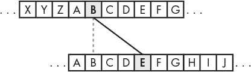
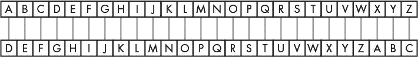
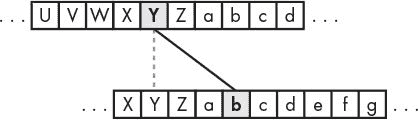

# 14 凯撒密码

> 原文：<https://inventwithpython.com/invent4thed/chapter14.html>


这一章的程序并不是一个真正的游戏，但仍然很有趣。这个程序会把普通英语转换成密码。它还可以将密码转换回普通英语。只有知道密码的人才能理解这些信息。

因为这个程序操纵文本将其转换成秘密消息，所以您将学习几个操纵字符串的新函数和方法。您还将了解程序如何像处理数字一样处理文本字符串。

**本章涵盖的主题**

密码术和密码

密文、明文、密钥和符号

加密和解密

凯撒密码

find() 字符串方法

密码分析

暴力破解技术

### **密码术和加密**

写密码的科学叫做*密码学*。几千年来，密码术使得发送只有发送者和接收者能够阅读的秘密消息成为可能，即使有人捕获了信使并阅读了编码的消息。一个秘密代码系统被称为*密码*。本章程序使用的密码叫做*凯撒密码*。

在密码学中，我们把想要保密的消息称为*明文*。假设我们有一条看起来像这样的明文消息:

```py
There is a clue behind the bookshelf.
```

将明文转换成编码消息称为*加密*明文。明文被加密成*密文*。密文看起来像是随机的字母，所以光看密文是无法理解原来的明文是什么的。下面是前面加密成密文的例子:

```py
aolyl pz h jsBl ilopuk Aol ivvrzolsm.
```

如果你知道用来加密信息的密码，你可以*解密*密文回到明文。(解密是加密的反义词。)

许多密码使用*密钥*，这是让你解密用特定密码加密的密文的秘密值。把密码想象成门锁。你只能用特定的钥匙打开它。

如果你对写密码程序感兴趣，你可以阅读我的书*用 Python* 破解秘密密码。从 http://inventwithpython.com/hacking/T3*T5【免费下载】。*

### **凯撒密码如何工作**

凯撒密码是最早发明的密码之一。在这种密码中，你通过用一个“移位”的字母替换信息中的每个字母来加密信息。在密码学中，加密的字母被称为*符号*，因为它们可以是字母、数字或任何其他符号。如果将字母 A 移动一个空格，则得到字母 b。如果将字母 A 移动两个空格，则得到字母 c。[图 14-1](#calibre_link-42) 显示了一些移动了三个空格的字母。



*图 14-1:凯撒密码将字母移动三个空格。在这里，B 变成了 e*

要得到每个移位的字母，用字母表中的每个字母画一排方框。然后在它下面画第二排方框，但是你的字母要有一定的间隔。当你到达明文字母表的末尾时，绕回 A. [图 14-2](#calibre_link-43) 显示了一个字母移动了三个空格的例子。



*图 14-2:整个字母表移动了三个空格*

你移动字母的空格数(1 到 26 之间)是凯撒密码的关键。除非你知道密钥(用来加密信息的数字)，否则你无法解密密码。图 14-2 中的例子显示了键 3 的字母翻译。

**注**

虽然有 26 个可能的密钥，但用 26 个加密你的信息会得到一个与明文完全相同的密文！

如果用密钥 3 加密明文单词 HOWDY，则:

字母 H 变成 k。

字母 O 变成 r。

字母 W 变成 z。

字母 D 变成 g。

字母 Y 变成 b。

所以，HOWDY 用密钥 3 的密文就变成了 KRZGB。为了用密钥 3 解密 KRZGB，我们从底部的盒子回到顶部。

如果你想包括小写字母以区别于大写字母，那么在你已经有的盒子上再增加 26 个盒子，并用这 26 个小写字母填满它们。现在用一个键 3，字母 Y 变成了 b，如图[图 14-3](#calibre_link-44) 所示。



*图 14-3:整个字母表，现在包括小写字母，移动了三个空格*

这种密码的工作方式和只用大写字母一样。事实上，如果你想使用另一种语言的字母表中的字母，你可以用这些字母写盒子来创建你的密码。

### **凯撒密码的样本运行**

以下是 Caesar 密码程序加密消息的运行示例:

```py
Do you wish to encrypt or decrypt a message?
encrypt
Enter your message:
The sky above the port was the color of television, tuned to a dead channel.
Enter the key number (1-52)
13
Your translated text is:
gur FxL noBIr Gur CBEG JnF Gur pByBE Bs GryrIvFvBA, GHArq GB n qrnq punAAry.
```

现在运行程序，解密刚刚加密的文本:

```py
Do you wish to encrypt or decrypt a message?
decrypt
Enter your message:
gur FxL noBIr Gur CBEG JnF Gur pByBE Bs GryrIvFvBA, GHArq GB n qrnq punAAry.
Enter the key number (1-52)
13
Your translated text is:
The sky above the port was the color of television, tuned to a dead channel.
```

如果没有使用正确的密钥解密，文本将无法正确解密:

```py
Do you wish to encrypt or decrypt a message?
decrypt
Enter your message:
gur FxL noBIr Gur CBEG JnF Gur pByBE Bs GryrIvFvBA, GHArq GB n qrnq punAAry.
Enter the key number (1-52)
15
Your translated text is:
Rfc qiw YZmtc rfc nmpr uYq rfc amjmp md rcjctgqgml, rslcb rm Y bcYb afYllcj.
```

### **凯撒密码的源代码**

输入 Caesar 密码程序的源代码，然后将文件保存为 *cipher.py* 。

如果你输入这个代码后出现错误，在用在线比较工具将你输入的代码与书中的代码进行比较。


*cipher.py*

```py
 1\. # Caesar Cipher
 2\. SYMBOLS = 'ABCDEFGHIJKLMNOPQRSTUVWXYZabcdefghijklmnopqrstuvwxyz'
 3\. MAX_KEY_SIZE = len(SYMBOLS)
 4.
 5\. def getMode():
 6.     while True:
 7.         print('Do you wish to encrypt or decrypt a message?')
 8.         mode = input().lower()
 9.         if mode in ['encrypt', 'e', 'decrypt', 'd']:
10.             return mode
11.         else:
12.             print('Enter either "encrypt" or "e" or "decrypt" or "d".')
13.
14\. def getMessage():
15.     print('Enter your message:')
16.     return input()
17.
18\. def getKey():
19.     key = 0
20.     while True:
21.         print('Enter the key number (1-%s)' % (MAX_KEY_SIZE))
22.         key = int(input())
23.         if (key >= 1 and key <= MAX_KEY_SIZE):
24.             return key
25.
26\. def getTranslatedMessage(mode, message, key):
27.     if mode[0] == 'd':
28.         key = -key
29.     translated = ''
30.
31.     for symbol in message:
32.         symbolIndex = SYMBOLS.find(symbol)
33.         if symbolIndex == -1: # Symbol not found in SYMBOLS.
34.             # Just add this symbol without any change.
35.             translated += symbol
36.         else:
37.             # Encrypt or decrypt.
38.             symbolIndex += key
39.
40.             if symbolIndex >= len(SYMBOLS):
41.                 symbolIndex -= len(SYMBOLS)
42.             elif symbolIndex < 0:
43.                 symbolIndex += len(SYMBOLS)
44.
45.             translated += SYMBOLS[symbolIndex]
46.     return translated
47.
48\. mode = getMode()
49\. message = getMessage()
50\. key = getKey()
51\. print('Your translated text is:')
52\. print(getTranslatedMessage(mode, message, key))
```

### **设定最大密钥长度**

加密和解密过程是彼此相反的，但是它们共享许多相同的代码。让我们看看每一行是如何工作的:

```py
1\. # Caesar Cipher
2\. SYMBOLS = 'ABCDEFGHIJKLMNOPQRSTUVWXYZabcdefghijklmnopqrstuvwxyz'
3\. MAX_KEY_SIZE = len(SYMBOLS)
```

MAX_KEY_SIZE 是存储符号 ( 52 )长度的常数。这个常数提醒我们，在这个程序中，密码中使用的密钥应该总是在 1 到 52 之间。

### **决定加密或解密消息**

getMode() 函数让用户决定是否要使用程序的加密或解密模式:

```py
 5\. def getMode():
 6.     while True:
 7.         print('Do you wish to encrypt or decrypt a message?')
 8.         mode = input().lower()
 9.         if mode in ['encrypt', 'e', 'decrypt', 'd']:
10.             return mode
11.         else:
12.             print('Enter either "encrypt" or "e" or "decrypt" or "d".')
```

第 8 行调用 input() 让用户输入想要的模式。然后在这个字符串上调用 lower() 方法来返回字符串的小写版本。从输入()返回的值。lower() 存储在模式中。 if 语句的条件检查模式中存储的字符串是否存在于 ['encrypt '，' e '，' decrypt '，' d'] 列表中。

只要模式等于【加密】【e】【解密】或【d】，该函数将返回模式下的字符串。因此， getMode() 会返回字符串 mode 。如果用户键入的内容不是‘加密’、‘e’、‘解密’或‘d’，那么 while 循环将再次询问它们。

### **从玩家那里得到消息**

getMessage() 函数只是从用户那里获取要加密或解密的消息，并返回它:

```py
14\. def getMessage():
15.     print('Enter your message:')
16.     return input()
```

对 input() 的调用与 return 结合在一起，这样我们只用了一行而不是两行。

### **从玩家处获取密钥**

getKey() 函数让玩家输入他们将用来加密或解密消息的密钥:

```py
18\. def getKey():
19.     key = 0
20.     while True:
21.         print('Enter the key number (1-%s)' % (MAX_KEY_SIZE))
22.         key = int(input())
23.         if (key >= 1 and key <= MAX_KEY_SIZE):
24.             return key
```

while 循环确保函数一直循环，直到用户输入有效的键。这里的有效键是整数值 1 和 52 之间的一个(记住 MAX_KEY_SIZE 是 52 ，因为符号变量中有 52 个字符)。然后， getKey() 函数返回这个键。第 22 行将 key 设置为用户输入的整数版本，因此 getKey() 返回一个整数。

### **加密或解密消息**

getTranslatedMessage() 函数执行实际的加密和解密:

```py
26\. def getTranslatedMessage(mode, message, key):
27.     if mode[0] == 'd':
28.         key = -key
29.     translated = ''
```

它有三个参数:

模式 将功能设置为加密模式或解密模式。

报文 这是要加密(或解密)的明文(或密文)。

密钥 这是这个密码中使用的密钥。

第 27 行检查模式变量中的第一个字母是否是字符串‘d’。如果是，则程序处于解密模式。解密和加密模式的唯一区别在于，在解密模式下，密钥被设置为自身的负版本。例如，如果键是整数 22 ，那么解密模式将其设置为 -22 。原因在第 205 页[的](#calibre_link-46)[加密或解密每个字母](#calibre_link-45)中解释。

转换后的变量将包含结果的字符串:要么是密文(如果您正在加密)，要么是明文(如果您正在解密)。它以空白字符串开始，并在末尾连接加密或解密的字符。然而，在我们开始将字符连接到翻译的之前，我们需要加密或解密文本，这将在 getTranslatedMessage() 的剩余部分中完成。

#### ***用 find()字符串方法查找传递的字符串***

为了移动字母进行加密或解密，我们首先需要将它们转换成数字。符号串中每个字母的数字将是它出现的索引。由于字母 A 在符号[0] 处，数字 0 将代表大写的 A。如果我们想用密钥 3 对此进行加密，我们可以简单地使用 0 + 3 来获得加密字母的索引:符号[3] 或‘D’。

我们将使用 find() string 方法，该方法在调用该方法的字符串中查找传递的字符串的第一个匹配项。在交互式 shell 中输入以下内容:

```py
>>> 'Hello world!'.find('H')
0
>>> 'Hello world!'.find('o')
4
>>> 'Hello world!'.find('ell')
1
```

“你好，世界！”。find('H') 返回 0 ，因为在字符串 'Hello world！'的第一个索引处找到了 'H' 。记住，索引从 0 开始，而不是从 1 开始。代码‘你好，世界！’。find('o') 返回 4 因为小写的 'o' 最先出现在 'Hello' 的末尾。 find() 方法在第一次出现后停止查找，因此‘world’中的第二个‘o’无关紧要。您也可以查找包含多个字符的字符串。从索引 1 开始找到字符串ell。

如果找不到传递的字符串， find() 方法返回 -1 :

```py
>>> 'Hello world!'.find('xyz')
-1
```

让我们回到凯撒密码程序。第 31 行是循环的，它迭代消息字符串中的每个字符:

```py
31.     for symbol in message:
32.         symbolIndex = SYMBOLS.find(symbol)
33.         if symbolIndex == -1: # Symbol not found in SYMBOLS.
34.             # Just add this symbol without any change.
35.             translated += symbol
```

第 32 行使用了 find() 方法来获取符号中字符串的索引。如果 find() 返回 -1 ，那么符号中的字符将被添加到中，而不会有任何变化。这意味着任何不属于字母表的字符，如逗号和句号，都不会被改变。

#### ***加密或解密每个字母***

一旦你找到了一个字母的索引号，把密钥加到这个号码上就会执行移位，给你加密字母的索引。

第 38 行做了这个加法来获得加密(或解密)的字母。

```py
37.             # Encrypt or decrypt.
38.             symbolIndex += key
```

请记住，在第 28 行，我们将键中的整数设为负，以进行解密。添加键的代码现在将减去它，因为添加负数等同于减法。

然而，如果这个加法(或减法，如果键为负)导致符号索引经过符号的最后一个索引，我们将需要在 0 处绕回列表的开头。这由从第 40 行开始的 if 语句处理:

```py
40.             if symbolIndex >= len(SYMBOLS):
41.                 symbolIndex -= len(SYMBOLS)
42.             elif symbolIndex < 0:
43.                 symbolIndex += len(SYMBOLS)
44.
45.             translated += SYMBOLS[symbolIndex]
```

第 40 行通过与符号字符串的长度进行比较，检查符号索引是否经过了最后一个索引。如果有，第 41 行从符号索引中减去符号的长度。如果 symbolIndex 现在为负，那么索引需要绕回到符号字符串的另一侧。第 42 行检查在添加解密密钥之后符号索引的值是否为负。如果是，第 43 行将符号的长度加到符号索引上。

symbolIndex 变量现在包含正确加密或解密符号的索引。符号【symbol index】将指向该索引的字符，该字符被添加到第 45 行翻译的末尾。

执行循环回到第 31 行，对消息中的下一个字符重复此操作。一旦循环完成，函数在第 46 行返回翻译的中的加密(或解密)字符串:

```py
46.     return translated
```

getTranslatedMessage() 函数中的最后一行返回了翻译后的字符串。

### **启动程序**

程序的开始调用之前定义的三个函数中的每一个来从用户处获得模式、消息和键:

```py
48\. mode = getMode()
49\. message = getMessage()
50\. key = getKey()
51\. print('Your translated text is:')
52\. print(getTranslatedMessage(mode, message, key))
```

这三个值被传递给 getTranslatedMessage() ，它的返回值(翻译的字符串)被打印给用户。

**展开符号**

如果你想加密数字、空格和标点符号，只需将它们添加到第 2 行的符号字符串中。例如，您可以通过将第 2 行改为以下内容，让您的密码程序加密数字、空格和标点符号:

```py
2\. SYMBOLS = 'ABCDEFGHIJKLMNOPQRSTUVWXYZabcdefghijklmnopqrstuvwxyz 123
     [email protected]#$%^&*()'
```

注意符号字符串在小写 z 后面有一个空格字符。

如果你愿意，你可以在这个列表中添加更多的字符。并且你不需要改变你程序的其余部分，因为所有需要字符列表的代码行都使用了符号常量。

只要确保每个字符在字符串中只出现一次。此外，您需要使用加密时使用的相同的符号字符串来解密您的消息。

### **暴力破解技术**

这是整个凯撒密码。然而，虽然这种密码可能会欺骗一些不懂密码学的人，但它不会对知道密码分析的人保密。密码学是制造代码的科学，而密码分析是破解代码的科学。

加密的全部意义在于确保如果其他人得到了加密的信息，他们就无法破解原始文本。让我们假设我们是密码破译者，我们所拥有的只是这个加密文本:

```py
LwCjBA uiG vwB jm xtmiAivB, jCB kmzBiqvBG qA ijACzl.
```

*是一种尝试每一个可能的键直到你找到正确的键的技术。因为只有 52 个可能的密钥，所以密码分析者很容易编写一个用每个可能的密钥解密的黑客程序。然后他们可以寻找解密成简单英语的密钥。让我们给程序添加一个暴力破解特性。*

 *### **添加暴力模式**

首先，修改第 7、9 和 12 行——它们在 getMode() 函数中——如下所示(修改以粗体显示):

```py
 5\. def getMode():
 6.     while True:
 7.         print('Do you wish to encrypt or decrypt or brute-force a
              message?')
 8.         mode = input().lower()
 9.         if mode in ['encrypt', 'e', 'decrypt', 'd', 'brute', 'b']:
10.             return mode
11.         else:
12.             print('Enter either "encrypt" or "e" or "decrypt" or "d" or
                  "brute" or "b".')
```

这段代码将让用户选择暴力作为一种模式。

接下来，对程序的主要部分进行以下更改:

```py
48\. mode = getMode()
49\. message = getMessage()
50\. if mode[0] != 'b':
51.     key = getKey()
52\. print('Your translated text is:')
53\. if mode[0] != 'b':
54.     print(getTranslatedMessage(mode, message, key))
55\. else:
56.     for key in range(1, MAX_KEY_SIZE + 1):
57.         print(key, getTranslatedMessage('decrypt', message, key))
```

如果用户没有处于暴力模式，他们会被要求输入一个密钥，发出最初的 getTranslatedMessage() 调用，并打印翻译后的字符串。

然而，如果用户处于暴力模式，那么 getTranslatedMessage() 循环从 1 一直迭代到 MAX_KEY_SIZE (也就是 52 )。请记住， range() 函数返回一个整数列表，直到第二个参数，但不包括第二个参数，这就是我们添加 + 1 的原因。然后，该程序将打印该消息的每一种可能的翻译(包括翻译中使用的键号)。下面是这个修改后的程序的运行示例:

```py
Do you wish to encrypt or decrypt or brute-force a message?
brute
Enter your message:
LwCjBA uiG vwB jm xtmiAivB, jCB kmzBiqvBG qA ijACzl.
Your translated text is:
1 KvBiAz thF uvA il wslhzhuA, iBA jlyAhpuAF pz hizByk.
2 JuAhzy sgE tuz hk vrkgygtz, hAz ikxzgotzE oy ghyAxj.
3 Itzgyx rfD sty gj uqjfxfsy, gzy hjwyfnsyD nx fgxzwi.
4 Hsyfxw qeC rsx fi tpiewerx, fyx givxemrxC mw efwyvh.
5 Grxewv pdB qrw eh sohdvdqw, exw fhuwdlqwB lv devxug.
6 Fqwdvu ocA pqv dg rngcucpv, dwv egtvckpvA ku cduwtf.
7 Epvcut nbz opu cf qmfbtbou, cvu dfsubjouz jt bctvse.
8 Doubts may not be pleasant, but certainty is absurd.
9 Cntasr lZx mns ad okdZrZms, ats bdqsZhmsx hr Zartqc.
10 BmsZrq kYw lmr Zc njcYqYlr, Zsr acprYglrw gq YZqspb.
11 AlrYqp jXv klq Yb mibXpXkq, Yrq ZboqXfkqv fp XYproa.
12 zkqXpo iWu jkp Xa lhaWoWjp, Xqp YanpWejpu eo WXoqnZ.
--snip--
```

看完每一行后，你会发现第八条信息不是废话，而是简单的英语！密码分析员可以推断出这个加密文本的原始密钥一定是 8 。这种暴力方法在朱利叶斯·凯撒和罗马帝国时代是很难做到的，但今天我们有了可以在短时间内快速处理数百万甚至数十亿个密钥的计算机。

### **总结**

计算机擅长做数学。当我们创建一个系统将一些信息转换成数字时(就像我们处理文本和序数或空间和坐标系统一样)，计算机程序可以快速有效地处理这些数字。编写程序的很大一部分是弄清楚如何将您想要操作的信息表示为 Python 可以理解的值。

虽然我们的凯撒密码程序可以加密信息，对那些必须用笔和纸才能破解的人保密，但该程序不会对那些知道如何让计算机处理信息的人保密。(我们的蛮力模式证明了这一点。)

在第 15 章中，我们将创建 Reversegam(也称为黑白棋或奥赛罗)。玩这个游戏的 AI 比[第十章](#calibre_link-12)里玩井字游戏的 AI 高级多了。事实上，它太好了，大多数时候你都打不过它！*