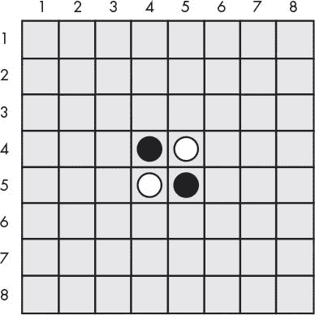
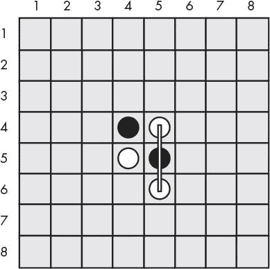
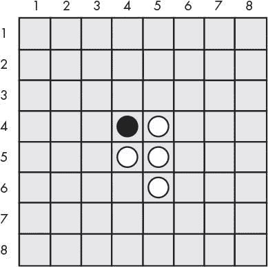
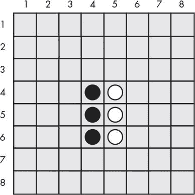
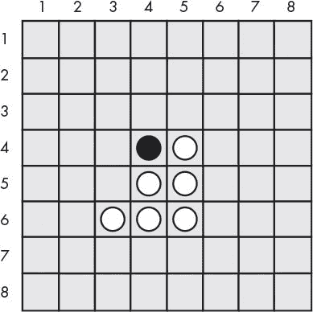
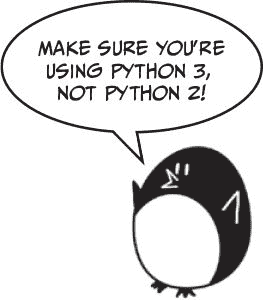
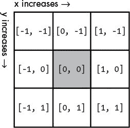

# 15 逆转游戏

> 原文：<https://inventwithpython.com/invent4thed/chapter15.html>


在本章中，我们将制作 Reversegam，也称为黑白棋或奥赛罗。这个双人棋盘游戏是在一个网格上进行的，所以我们将使用一个带有 x 和 y 坐标的笛卡尔坐标系。我们的游戏版本将会有一个电脑人工智能，比我们第十章中的井字游戏人工智能更高级。事实上，这个 AI 太棒了，几乎每次你玩的时候它都会打败你。(我每次和它对战都输！)

**本章涵盖的主题**

如何玩 Reversegam

bool() 函数

在 Reversegam 板上模拟移动

对 Reversegam AI 进行编程

### **如何玩 Reversegam**

Reversegam 有一个 8×8 的棋盘和一面是黑色一面是白色的瓷砖(我们的游戏将使用 *O* s 和 *X* s 代替)。出发板看起来像[图 15-1](#calibre_link-13) 。



*图 15-1:出发 Reversegam 板有两个白牌和两个黑牌。*

两名玩家轮流将他们选择的颜色(黑色或白色)的瓷砖放在棋盘上。当一个玩家在棋盘上放置一张牌时，在新牌和该玩家颜色的其他牌之间的任何对手的牌都会被翻转。例如，当白牌手在空间(5，6)放置一个新的白牌时，如图[图 15-2](#calibre_link-14) ，在(5，5)的黑牌在两个白牌之间，所以它会翻转成白色，如图[图 15-3](#calibre_link-15) 。游戏的目标是结束时你的颜色比对手的颜色多。



*图 15-2:白色放置一个新的瓷砖。*



*图 15-3:白棋的移动导致黑棋的一个牌翻转。*

黑棋接下来可以做类似的移动，在(4，6)上放置一个黑棋，这将在(4，5)翻转白棋。这使得电路板看起来像[图 15-4](#calibre_link-16) 。



*图 15-4:黑方放置了一个新的方块，翻转了白方的一个方块。*

所有方向的牌只要在玩家的新牌和该颜色的现有牌之间，就会翻转。在[图 15-5](#calibre_link-17) 中，白方在(3，6)处放置一个方块，并向两个方向翻转黑方方块(用线条标出)。结果如图[图 15-6](#calibre_link-18) 所示。

每个玩家可以在一两个动作中快速翻转棋盘上的许多牌。玩家必须始终移动至少一张牌。当玩家不能移动或棋盘已满时，游戏结束。拥有最多颜色牌的玩家获胜。


*图 15-5:白方在(3，6)的第二次移动将翻转黑方的两个牌。*



*图 15-6:白棋第二步棋后的棋盘。*

我们为这个游戏制作的人工智能将会寻找棋盘上任何它可以采取的角落移动。如果没有可用的拐角移动，计算机将选择要求最多牌的移动。

### **reverse gam 的样品运行**

下面是用户运行 Reversegam 程序时看到的内容。玩家输入的文本是粗体的。

```py
Welcome to Reversegam!
Do you want to be X or O?
x
The player will go first.
  12345678
 +--------+
1|        |1
2|        |2
3|        |3
4|   XO   |4
5|   OX   |5
6|        |6
7|        |7
8|        |8
 +--------+
  12345678
You: 2 points. Computer: 2 points.
Enter your move, "quit" to end the game, or "hints" to toggle hints.
53
  12345678
 +--------+
1|        |1
2|        |2
3|    X   |3
4|   XX   |4
5|   OX   |5
6|        |6
7|        |7
8|        |8
 +--------+
  12345678
You: 4 points. Computer: 1 points.
Press Enter to see the computer's move.

--snip--

  12345678
 +--------+
1|OOOOOOOO|1
2|OXXXOOOO|2
3|OXOOOOOO|3
4|OXXOXXOX|4
5|OXXOOXOX|5
6|OXXXXOOX|6
7|OOXXOOOO|7
8|OOXOOOOO|8
 +--------+
  12345678
X scored 21 points. O scored 43 points.
You lost. The computer beat you by 22 points.
Do you want to play again? (yes or no)
no
```

如你所见，人工智能很擅长击败我，43 比 21。为了帮助玩家，我们将为游戏编写提供提示的程序。玩家可以随着他们的移动键入提示，这将切换提示模式的开和关。当提示模式开启时，玩家可以做出的所有可能的移动都会在棋盘上显示为句点()。)，像这样:

```py
  12345678
 +--------+
1|        |1
2|   .    |2
3|  XO.   |3
4|   XOX  |4
5|   OOO  |5
6|   . .  |6
7|        |7
8|        |8
 +--------+
  12345678
```

如你所见，玩家可以根据棋盘上的提示继续前进(4，2)、(5，3)、(4，6)或(6，6)。

### 【Reversegam 的源代码

与我们之前的游戏相比，Reversegam 是一个庞大的项目。将近 300 行长！但是不要担心:其中许多都是注释或空行，用来分隔代码，使其可读性更好。



与我们的其他程序一样，我们将首先创建几个函数来执行主要部分将调用的 Reversegam 相关任务。大约前 250 行代码用于这些辅助函数，后 30 行代码实现 Reversegam 游戏本身。

如果输入代码后出现错误，在用在线比较工具将你的代码与书中的代码进行比较。

*反转。py*

```py
  1\. # Reversegam: a clone of Othello/Reversi
  2\. import random
  3\. import sys
  4\. WIDTH = 8 # Board is 8 spaces wide.
  5\. HEIGHT = 8 # Board is 8 spaces tall.
  6\. def drawBoard(board):
  7.     # Print the board passed to this function. Return None.
  8.     print('  12345678')
  9.     print(' +--------+')
 10.     for y in range(HEIGHT):
 11.         print('%s|' % (y+1), end='')
 12.         for x in range(WIDTH):
 13.             print(board[x][y], end='')
 14.         print('|%s' % (y+1))
 15.     print(' +--------+')
 16.     print('  12345678')
 17.
 18\. def getNewBoard():
 19.     # Create a brand-new, blank board data structure.
 20.     board = []
 21.     for i in range(WIDTH):
 22.         board.append([' ', ' ', ' ', ' ', ' ', ' ', ' ', ' '])
 23.     return board
 24.
 25\. def isValidMove(board, tile, xstart, ystart):
 26.     # Return False if the player's move on space xstart, ystart is
           invalid.
 27.     # If it is a valid move, return a list of spaces that would become
           the player's if they made a move here.
 28.     if board[xstart][ystart] != ' ' or not isOnBoard(xstart, ystart):
 29.         return False
 30.
 31.     if tile == 'X':
 32.         otherTile = 'O'
 33.     else:
 34.         otherTile = 'X'
 35.
 36.     tilesToFlip = []
 37.     for xdirection, ydirection in [[0, 1], [1, 1], [1, 0], [1, -1],
           [0, -1], [-1, -1], [-1, 0], [-1, 1]]:
 38.         x, y = xstart, ystart
 39.         x += xdirection # First step in the x direction
 40.         y += ydirection # First step in the y direction
 41.         while isOnBoard(x, y) and board[x][y] == otherTile:
 42.             # Keep moving in this x & y direction.
 43.             x += xdirection
 44.             y += ydirection
 45.             if isOnBoard(x, y) and board[x][y] == tile:
 46.                 # There are pieces to flip over. Go in the reverse
                       direction until we reach the original space, noting all
                       the tiles along the way.
 47.             while True:
 48.                 x -= xdirection
 49.                 y -= ydirection
 50.                 if x == xstart and y == ystart:
 51.                     break
 52.                 tilesToFlip.append([x, y])
 53.
 54.     if len(tilesToFlip) == 0: # If no tiles were flipped, this is not a
           valid move.
 55.         return False
 56.     return tilesToFlip
 57.
 58\. def isOnBoard(x, y):
 59.     # Return True if the coordinates are located on the board.
 60.     return x >= 0 and x <= WIDTH - 1 and y >= 0 and y <= HEIGHT - 1
 61.
 62\. def getBoardWithValidMoves(board, tile):
 63.     # Return a new board with periods marking the valid moves the player
           can make.
 64.     boardCopy = getBoardCopy(board)
 65.
 66.     for x, y in getValidMoves(boardCopy, tile):
 67.         boardCopy[x][y] = '.'
 68.     return boardCopy
 69.
 70\. def getValidMoves(board, tile):
 71.     # Return a list of [x,y] lists of valid moves for the given player
           on the given board.
 72.     validMoves = []
 73.     for x in range(WIDTH):
 74.         for y in range(HEIGHT):
 75.             if isValidMove(board, tile, x, y) != False:
 76.                 validMoves.append([x, y])
 77.     return validMoves
 78.
 79\. def getScoreOfBoard(board):
 80.     # Determine the score by counting the tiles. Return a dictionary
           with keys 'X' and 'O'.
 81.     xscore = 0
 82.     oscore = 0
 83.     for x in range(WIDTH):
 84.         for y in range(HEIGHT):
 85.             if board[x][y] == 'X':
 86.                 xscore += 1
 87.             if board[x][y] == 'O':
 88.                 oscore += 1
 89.     return {'X':xscore, 'O':oscore}
 90.
 91\. def enterPlayerTile():
 92.     # Let the player enter which tile they want to be.
 93.     # Return a list with the player's tile as the first item and the
           computer's tile as the second.
 94.     tile = ''
 95.     while not (tile == 'X' or tile == 'O'):
 96.         print('Do you want to be X or O?')
 97.         tile = input().upper()
 98.
 99.     # The first element in the list is the player's tile, and the second
           is the computer's tile.
100.     if tile == 'X':
101.         return ['X', 'O']
102.     else:
103.         return ['O', 'X']
104.
105\. def whoGoesFirst():
106.     # Randomly choose who goes first.
107.     if random.randint(0, 1) == 0:
108.         return 'computer'
109.     else:
110.         return 'player'
111.
112\. def makeMove(board, tile, xstart, ystart):
113.     # Place the tile on the board at xstart, ystart and flip any of the
           opponent's pieces.
114.     # Return False if this is an invalid move; True if it is valid.
115.     tilesToFlip = isValidMove(board, tile, xstart, ystart)
116.
117.     if tilesToFlip == False:
118.         return False
119.
120.     board[xstart][ystart] = tile
121.     for x, y in tilesToFlip:
122.         board[x][y] = tile
123.     return True
124.
125\. def getBoardCopy(board):
126.     # Make a duplicate of the board list and return it.
127.     boardCopy = getNewBoard()
128.
129.     for x in range(WIDTH):
130.         for y in range(HEIGHT):
131.             boardCopy[x][y] = board[x][y]
132.
133.     return boardCopy
134.
135\. def isOnCorner(x, y):
136.     # Return True if the position is in one of the four corners.
137.     return (x == 0 or x == WIDTH - 1) and (y == 0 or y == HEIGHT - 1)
138.
139\. def getPlayerMove(board, playerTile):
140.     # Let the player enter their move.
141.     # Return the move as [x, y] (or return the strings 'hints' or
           'quit').
142.     DIGITS1TO8 = '1 2 3 4 5 6 7 8'.split()
143.     while True:
144.         print('Enter your move, "quit" to end the game, or "hints" to
               toggle hints.')
145.         move = input().lower()
146.         if move == 'quit' or move == 'hints':
147.             return move
148.
149.         if len(move) == 2 and move[0] in DIGITS1TO8 and move[1] in
               DIGITS1TO8:
150.             x = int(move[0]) - 1
151.             y = int(move[1]) - 1
152.             if isValidMove(board, playerTile, x, y) == False:
153.                 continue
154.             else:
155.                 break
156.         else:
157.             print('That is not a valid move. Enter the column (1-8) and
                   then the row (1-8).')
158.             print('For example, 81 will move on the top-right corner.')
159.
160.     return [x, y]
161.
162\. def getComputerMove(board, computerTile):
163.     # Given a board and the computer's tile, determine where to
164.     # move and return that move as an [x, y] list.
165.     possibleMoves = getValidMoves(board, computerTile)
166.     random.shuffle(possibleMoves) # Randomize the order of the moves.
167.
168.     # Always go for a corner if available.
169.     for x, y in possibleMoves:
170.         if isOnCorner(x, y):
171.             return [x, y]
172.
173.     # Find the highest-scoring move possible.
174.     bestScore = -1
175.     for x, y in possibleMoves:
176.         boardCopy = getBoardCopy(board)
177.         makeMove(boardCopy, computerTile, x, y)
178.         score = getScoreOfBoard(boardCopy)[computerTile]
179.         if score > bestScore:
180.             bestMove = [x, y]
181.             bestScore = score
182.     return bestMove
183.
184\. def printScore(board, playerTile, computerTile):
185.     scores = getScoreOfBoard(board)
186.     print('You: %s points. Computer: %s points.' % (scores[playerTile],
           scores[computerTile]))
187.
188\. def playGame(playerTile, computerTile):
189.     showHints = False
190.     turn = whoGoesFirst()
191.     print('The ' + turn + ' will go first.')
192.
193.     # Clear the board and place starting pieces.
194.     board = getNewBoard()
195.     board[3][3] = 'X'
196.     board[3][4] = 'O'
197.     board[4][3] = 'O'
198.     board[4][4] = 'X'
199.
200.     while True:
201.         playerValidMoves = getValidMoves(board, playerTile)
202.         computerValidMoves = getValidMoves(board, computerTile)
203.
204.         if playerValidMoves == [] and computerValidMoves == []:
205.             return board # No one can move, so end the game.
206.
207.         elif turn == 'player': # Player's turn
208.             if playerValidMoves != []:
209.                 if showHints:
210.                     validMovesBoard = getBoardWithValidMoves(board,
                           playerTile)
211.                     drawBoard(validMovesBoard)
212.                 else:
213.                     drawBoard(board)
214.                 printScore(board, playerTile, computerTile)
215.
216.                 move = getPlayerMove(board, playerTile)
217.                 if move == 'quit':
218.                     print('Thanks for playing!')
219.                     sys.exit() # Terminate the program.
220.                 elif move == 'hints':
221.                     showHints = not showHints
222.                     continue
223.                 else:
224.                     makeMove(board, playerTile, move[0], move[1])
225.             turn = 'computer'
226.
227.         elif turn == 'computer': # Computer's turn
228.             if computerValidMoves != []:
229.                 drawBoard(board)
230.                 printScore(board, playerTile, computerTile)
231.
232.                 input('Press Enter to see the computer\'s move.')
233.                 move = getComputerMove(board, computerTile)
234.                 makeMove(board, computerTile, move[0], move[1])
235.             turn = 'player'
236.
237.
238.
239\. print('Welcome to Reversegam!')
240.
241\. playerTile, computerTile = enterPlayerTile()
242.
243\. while True:
244.     finalBoard = playGame(playerTile, computerTile)
245.
246.     # Display the final score.
247.     drawBoard(finalBoard)
248.     scores = getScoreOfBoard(finalBoard)
249.     print('X scored %s points. O scored %s points.' % (scores['X'],
           scores['O']))
250.     if scores[playerTile] > scores[computerTile]:
251.         print('You beat the computer by %s points! Congratulations!' %
               (scores[playerTile] - scores[computerTile]))
252.     elif scores[playerTile] < scores[computerTile]:
253.         print('You lost. The computer beat you by %s points.' %
               (scores[computerTile] - scores[playerTile]))
254.     else:
255.         print('The game was a tie!')
256.
257.     print('Do you want to play again? (yes or no)')
258.     if not input().lower().startswith('y'):
259.         break
```

### **导入模块和设置常量**

与我们的其他游戏一样，我们通过导入模块来开始这个程序:

```py
1\. # Reversegam: a clone of Othello/Reversi
2\. import random
3\. import sys
4\. WIDTH = 8  # Board is 8 spaces wide.
5\. HEIGHT = 8 # Board is 8 spaces tall.
```

第 2 行为其 randint() 和 choice() 函数导入了 random 模块。第 3 行为其 exit() 函数导入了 sys 模块。

第 4 行和第 5 行设置了两个常量，宽度和高度，用于设置游戏板。

### **游戏板数据结构**

让我们弄清楚电路板的数据结构。这个数据结构是一个列表的列表，就像[第十三章](#calibre_link-19)的声纳寻宝游戏里的那个。创建列表列表，使得板[x][y] 将表示位于 x 轴位置 x (向左/向右)和 y 轴位置 y (向上/向下)的空间上的角色。

这个字符可以是一个 ' ' (一个代表空位置的空格)，一个'。'(在提示模式中代表可能移动的句点)，或‘X’或‘O’(代表牌的字母)。每当你看到一个名为 board 的参数，它就意味着是这种列表列表的数据结构。

重要的是要注意，虽然游戏板的 x 和 y 坐标的范围是从 1 到 8，但是列表数据结构的索引的范围是从 0 到 7。考虑到这一点，我们的代码需要做一些细微的调整。

#### ***在屏幕上绘制板卡数据结构***

board 数据结构只是一个 Python 列表值，但是我们需要一种更好的方式在屏幕上显示它。 drawBoard() 函数获取一个棋盘数据结构，并将其显示在屏幕上，这样玩家就知道棋子放在哪里了:

```py
 6\. def drawBoard(board):
 7.     # Print the board passed to this function. Return None.
 8.     print('  12345678')
 9.     print(' +--------+')
10.     for y in range(HEIGHT):
11.         print('%s|' % (y+1), end='')
12.         for x in range(WIDTH):
13.             print(board[x][y], end='')
14.         print('|%s' % (y+1))
15.     print(' +--------+')
16.     print('  12345678')
```

drawBoard() 函数根据棋盘中的数据结构打印当前游戏棋盘。

第 8 行是对每个电路板执行的第一个 print() 函数调用，它打印电路板顶部 x 轴的标签。第 9 行打印电路板的顶部水平线。第 10 行的循环的将循环八次，每行一次。第 11 行打印棋盘左侧 y 轴的标签，它有一个 end='' 关键字参数，不打印任何内容，而只打印新的一行。

这样，第 12 行上的另一个循环(也是循环八次，对行中的每一列一次)打印每个位置以及一个 X 、 O 、。或空格，取决于板【x】【y】中存储的内容。第 13 行的 print() 函数调用在这个循环中也有一个 end='' 关键字参数，这样就不会打印换行符。这将在屏幕上产生一个类似于 '1|XXXXXXXX|1' 的单行(如果每个 board[x][y] 值都是一个 'X' )。

内部循环完成后， print() 函数调用第 15 行和第 16 行来打印底部水平线和 x 轴标签。

当第 13 行的循环的打印该行八次时，它形成整个板:

```py
  12345678
 +--------+
1|XXXXXXXX|1
2|XXXXXXXX|2
3|XXXXXXXX|3
4|XXXXXXXX|4
5|XXXXXXXX|5
6|XXXXXXXX|6
7|XXXXXXXX|7
8|XXXXXXXX|8
 +--------+
  12345678
```

当然，不是 X ，棋盘上的一些空格会是对方玩家的标记( O )，句号()。)如果提示模式开启，或者空格为空位置。

#### ***创建新板数据结构***

drawBoard() 函数将在屏幕上显示电路板数据结构，但是我们也需要一种方法来创建这些电路板数据结构。 getNewBoard() 函数返回一个包含八个列表的列表，每个列表包含八个 ' ' 字符串，代表一个没有移动的空白棋盘:

```py
18\. def getNewBoard():
19.     # Create a brand-new, blank board data structure.
20.     board = []
21.     for i in range(WIDTH):
22.         board.append([' ', ' ', ' ', ' ', ' ', ' ', ' ', ' '])
23.     return board
```

第 20 行创建了包含内部列表的列表。循环的在这个列表中添加了八个内部列表。这些内部列表有八个字符串来代表棋盘上的八个空格。这些代码一起创建了一个有 64 个空格的棋盘——一个空白的 Reversegam 棋盘。

### **检查移动是否有效**

给定棋盘的数据结构、玩家的牌以及玩家移动的 x 和 y 坐标，如果 Reversegam 游戏规则允许在这些坐标上移动， isValidMove() 函数应该返回 True ，如果不允许，则返回 False 。要使一步棋有效，它必须在棋盘上，并且至少翻转对手的一张牌。

这个函数使用了棋盘上的几个 x 和 y 坐标，所以 xstart 和 ystart 变量跟踪最初移动的 x 和 y 坐标。

```py
25\. def isValidMove(board, tile, xstart, ystart):
26.     # Return False if the player's move on space xstart, ystart is
          invalid.
27.     # If it is a valid move, return a list of spaces that would become
          the player's if they made a move here.
28.     if board[xstart][ystart] != ' ' or not isOnBoard(xstart, ystart):
29.         return False
30.
31.     if tile == 'X':
32.         otherTile = 'O'
33.     else:
34.         otherTile = 'X'
35.
36.     tilesToFlip = []
```

第 28 行使用 isOnBoard() 函数(我们将在程序的后面定义)检查 x 和 y 坐标是否在游戏板上，以及空格是否为空。该功能确保 x 和 y 坐标都在板的 0 和宽度或高度减去 1 之间。

玩家的牌(人类玩家或电脑玩家)在牌中，但是这个功能需要知道对手的牌。如果玩家的牌是 X ，那么显然对方的牌是 O ，反之亦然。为此，我们在第 31 到 34 行使用了 if-else 语句。

最后，如果给定的 x 和 y 坐标是一个有效的移动， isValidMove() 返回将被该移动翻转的所有对手牌的列表。我们创建一个新的空列表， tilesToFlip ，我们将使用它来存储所有的图块坐标。

#### ***检查八个方向的每一个***

为了使一个移动有效，它需要翻转至少一个对手的牌，将当前玩家的新牌与该玩家的旧牌夹在中间。这意味着新牌必须紧挨着对手的一张牌。

第 37 行的 for 循环遍历一系列列表，这些列表表示程序将检查对手牌的方向:

```py
37.     for xdirection, ydirection in [[0, 1], [1, 1], [1, 0], [1, -1],
          [0, -1], [-1, -1], [-1, 0], [-1, 1]]:
```

游戏板是具有 x 和 y 方向的笛卡尔坐标系。有八个方向需要检查:上、下、左、右和四个对角线方向。第 37 行列表中的八个双项目列表中的每一个都用于检查这些方向中的一个。程序通过将两项列表中的第一个值添加到 x 坐标，将第二个值添加到 y 坐标来检查方向。

因为 x 坐标随着您向右移动而增加，所以您可以通过在 x 坐标上添加 1 来检查正确的方向。所以 [1，0] 列表将 1 添加到 x 坐标，将 0 添加到 y 坐标。检查向左的方向是相反的:你将从 x 坐标中减去 1 (即加上 -1 )。

但是要对角检查，你需要对两个坐标进行加减。例如，将 1 添加到 x 坐标并将 -1 添加到 y 坐标将导致检查右上对角线方向。

[图 15-7](#calibre_link-20) 是为了更容易记住哪个二项列表代表哪个方向的示意图。



*图 15-7:每个二项表代表八个方向中的一个。*

第 37 行的循环的遍历每个两项列表，以便检查每个方向。在循环的内，使用第 38 行的多重赋值，将 x 和 y 变量分别设置为与 xstart 和 ystart 相同的值。 xdirection 和 ydirection 变量被设置为两项列表中的一个值，并根据在 for 循环的迭代中被检查的方向改变 x 和 y 变量；

```py
37.     for xdirection, ydirection in [[0, 1], [1, 1], [1, 0], [1, -1],
          [0, -1], [-1, -1], [-1, 0], [-1, 1]]:
38.         x, y = xstart, ystart
39.         x += xdirection # First step in the x direction
40.         y += ydirection # First step in the y direction
```

变量 xstart 和 ystart 将保持不变，这样程序就能记住它最初是从哪个空间开始的。

请记住，要使一个移动有效，它必须在棋盘上并且紧挨着另一个玩家的牌。(否则，没有对手的牌可以翻转，移动必须翻转至少一张牌才有效。)第 41 行检查这个条件，如果不是真，执行返回到语句的以检查下一个方向。

```py
41.         while isOnBoard(x, y) and board[x][y] == otherTile:
42.             # Keep moving in this x & y direction.
43.             x += xdirection
44.             y += ydirection
```

但是如果检查的第一个空间确实有对手的牌，那么程序应该在那个方向检查更多的对手的牌，直到它到达玩家的一个牌或棋盘的末端。再次使用x 方向和y 方向检查同一方向的下一个图块，使 x 和 y 成为要检查的下一个坐标。因此程序在第 43 和 44 行改变了 x 和 y 。

#### ***找出是否有要翻转的牌***

接下来，我们检查是否有相邻的瓷砖可以翻转。

```py
45.             if isOnBoard(x, y) and board[x][y] == tile:
46.                 # There are pieces to flip over. Go in the reverse
                      direction until we reach the original space, noting all
                      the tiles along the way.
47.                 while True:
48.                     x -= xdirection
49.                     y -= ydirection
50.                     if x == xstart and y == ystart:
51.                         break
52.                     tilesToFlip.append([x, y])
```

第 45 行的 if 语句检查一个坐标是否被玩家自己的牌占据。该牌将标志着由玩家的牌围绕对手的牌形成的三明治的结束。我们还需要记录所有应该翻转的对手牌的坐标。

而回路在线路 48 和 49 上反向移动 x 和 y 。直到 x 和 y 回到原来的 xstart 和 ystart 位置，从 x 和 y 中减去 xdirection 和 ydirection ，并将每个 x 和 y 位置附加到 tilesToFlip 当 x 和 y 到达 xstart 和 ystart 位置时，线 51 中断循环执行。由于最初的 xstart 和 ystart 位置是一个空的空间(我们确保第 28 和 29 行是这种情况)，第 41 行的 while 循环的条件将是假。程序移动到第 37 行，用于循环的检查下一个方向。

循环的在所有八个方向都这样做。该循环完成后， tilesToFlip 列表将包含如果玩家移动到 xstart 、 ystart 时将被翻转的所有对手牌的 x 和 y 坐标。记住， isValidMove() 函数只是检查最初的移动是否有效；它实际上并没有永久地改变游戏板的数据结构。

如果八个方向都没有翻转对手的至少一张牌，那么 tilesToFlip 将是一个空列表:

```py
54.     if len(tilesToFlip) == 0: # If no tiles were flipped, this is not a
          valid move.
55.         return False
56.     return tilesToFlip
```

这是该移动无效的标志，并且 isValidMove() 应该返回 False 。否则， isValidMove() 返回 tilesToFlip 。

### **检查有效坐标**

从 isValidMove() 调用 isOnBoard() 函数。它做一个简单的检查，看看给定的 x 和 y 坐标是否在板上。例如， 4 的 x 坐标和 9999 的 y 坐标不会在板上，因为 y 坐标只上升到 7 ，等于宽度- 1 或高度- 1 。

```py
58\. def isOnBoard(x, y):
59.     # Return True if the coordinates are located on the board.
60.     return x >= 0 and x <= WIDTH - 1 and y >= 0 and y <= HEIGHT - 1
```

调用此函数是第 72 行布尔表达式的简写，该表达式检查 x 和 y 是否都在 0 和宽度或高度减去 1 之间，即 7 。

#### ***获取所有有效招式列表***

现在让我们创建一个提示模式，显示一个标有所有可能移动的棋盘。 getBoardWithValidMoves() 函数返回一个带有句点(的游戏棋盘数据结构。)对于所有有效移动的空格:

```py
62\. def getBoardWithValidMoves(board, tile):
63.     # Return a new board with periods marking the valid moves the player
          can make.
64.     boardCopy = getBoardCopy(board)
65.
66.     for x, y in getValidMoves(boardCopy, tile):
67.         boardCopy[x][y] = '.'
68.     return boardCopy
```

该函数创建一个复制的游戏棋盘数据结构，称为棋盘副本(由第 64 行的 getBoardCopy() 返回)，而不是修改在棋盘参数中传递给它的数据结构。第 66 行调用 getValidMoves() 来获得一个 x 和 y 坐标列表，其中包含玩家可以进行的所有合法移动。板书在空白处标上句号，然后寄回。

函数的作用是:返回一个包含两个条目的列表。两项列表保存了牌所有有效移动的 x 和 y 坐标，在牌参数中给出了该牌的数据结构:

```py
70\. def getValidMoves(board, tile):
71.     # Return a list of [x,y] lists of valid moves for the given player
          on the given board.
72.     validMoves = []
73.     for x in range(WIDTH):
74.         for y in range(HEIGHT):
75.             if isValidMove(board, tile, x, y) != False:
76.                 validMoves.append([x, y])
77.     return validMoves
```

这个函数使用嵌套循环(在第 73 和 74 行)来检查每个 x 轴和 y 轴坐标(总共 64 个),方法是在那个空间上调用 isValidMove() ,并检查它是否返回 False 或一个可能的移动列表(在这种情况下，移动是有效的)。每个有效的 x 和 y 坐标被添加到有效移动的列表中。

#### ***调用 bool()函数***

你可能已经注意到，程序检查第 75 行的是否返回 False ，即使这个函数返回一个列表。要理解这是如何工作的，您需要学习更多关于布尔和 bool() 函数的知识。

bool() 函数类似于 int() 和 str() 函数。它返回传递给它的值的布尔值形式。

大多数数据类型都有一个值被认为是该数据类型的 False 值。其他所有值都被认为是真值。例如，整数 0 、浮点数 0.0 、空字符串、空链表、空字典在用作 if 或 loop 语句的条件时，都被认为是 False 。所有其他值为真。在交互式 shell 中输入以下内容:

```py
>>> bool(0)
False
>>> bool(0.0)
False
>>> bool('')
False
>>> bool([])
False
>>> bool({})
False
>>> bool(1)
True
>>> bool('Hello')
True
>>> bool([1, 2, 3, 4, 5])
True
>>> bool({'spam':'cheese', 'fizz':'buzz'})
True
```

条件被自动解释为布尔值。这就是为什么第 75 行的条件工作正常。对 isValidMove() 函数的调用要么返回布尔值 False 要么返回一个非空列表。

如果您想象整个条件都放在对 bool() 的调用中，那么第 75 行的条件 False 就变成了 bool(False) (当然，其结果是 False )。并且作为参数放置到 bool() 的非空列表的条件将返回 True 。

### **获取游戏板的分数**

getScoreOfBoard() 函数使用嵌套的 for 循环来检查棋盘上的所有 64 个位置，并查看哪个玩家的牌(如果有的话)在上面:

```py
79\. def getScoreOfBoard(board):
80.     # Determine the score by counting the tiles. Return a dictionary
          with keys 'X' and 'O'.
81.     xscore = 0
82.     oscore = 0
83.     for x in range(WIDTH):
84.         for y in range(HEIGHT):
85.             if board[x][y] == 'X':
86.                 xscore += 1
87.             if board[x][y] == 'O':
88.                 oscore += 1
89.     return {'X':xscore, 'O':oscore}
```

对于每个 X 图块，代码在第 86 行增加 xscore 。对于每个或区块，代码在第 88 行增加 oscore 。该函数然后返回字典中的 xscore 和 oscore 。

### **获取玩家的牌选择**

enterPlayerTile() 函数询问玩家他们想成为哪一张牌，是 *X* 还是 *O* :

```py
91\. def enterPlayerTile():
92.     # Let the player enter which tile they want to be.
93.     # Return a list with the player's tile as the first item and the
          computer's tile as the second.
94.     tile = ''
95.     while not (tile == 'X' or tile == 'O'):
96.         print('Do you want to be X or O?')
97.         tile = input().upper()
98.
99.     # The first element in the list is the player's tile, and the second
          is the computer's tile.
100.     if tile == 'X':
101.         return ['X', 'O']
102.     else:
103.         return ['O', 'X']
```

循环的将一直循环，直到玩家输入大写或小写的 X 或 O 为止。然后， enterPlayerTile() 函数返回一个两项列表，其中玩家的牌选择是第一项，计算机的牌是第二项。稍后，第 241 行调用 enterPlayerTile() 并使用多重赋值将这两个返回的项放入两个变量中。

### **决定谁先走**

whoGoesFirst() 函数随机选择谁先走，并返回字符串‘计算机’或字符串‘玩家’:

```py
105\. def whoGoesFirst():
106.     # Randomly choose who goes first.
107.     if random.randint(0, 1) == 0:
108.         return 'computer'
109.     else:
110.         return 'player'
```

### **在棋盘上放置瓷砖**

当玩家想要在棋盘上放置一个方块并根据 Reversegam 的规则翻转其他方块时，会调用 makeMove() 函数:

```py
112\. def makeMove(board, tile, xstart, ystart):
113.     # Place the tile on the board at xstart, ystart and flip any of the
           opponent's pieces.
114.     # Return False if this is an invalid move; True if it is valid.
115.     tilesToFlip = isValidMove(board, tile, xstart, ystart)
```

该函数在适当的位置修改通过的板数据结构。对板变量(因为它是一个列表引用)所做的更改将会影响全局范围。

大部分工作由第 115 行的 isValidMove() 完成，它返回需要翻转的图块的 x 和 y 坐标列表(在两项列表中)。记住，如果 xstart 和 ystart 参数指向一个无效的移动， isValidMove() 将返回布尔值 False ，这将通过第 117 行检查:

```py
117.     if tilesToFlip == False:
118.         return False
119.
120.     board[xstart][ystart] = tile
121.     for x, y in tilesToFlip:
122.         board[x][y] = tile
123.     return True
```

如果的返回值是 ValidMove() (现在存储在 tilesToFlip 中)是 False ，那么 makeMove() 也会在第 118 行返回 False 。

否则， isValidMove() 返回棋盘上放置瓷砖的空格列表(在瓷砖中的‘X’或‘O’字符串)。第 120 行设置玩家移动的空间。循环的第 121 行设置 tilesToFlip 中的所有图块。

### **复制板卡数据结构**

getBoardCopy() 函数不同于 getNewBoard() 。 getNewBoard() 函数创建了一个空白的游戏板数据结构，其中只有空白空间和四个起始方块。 getBoardCopy() 创建一个空白的游戏棋盘数据结构，然后用嵌套循环复制棋盘参数中的所有位置。AI 使用 getBoardCopy() 函数，因此它可以在不改变真实游戏板的情况下改变游戏板副本。第 10 章中的[井字游戏程序也使用了这种技术。](#calibre_link-12)

```py
125\. def getBoardCopy(board):
126.     # Make a duplicate of the board list and return it.
127.     boardCopy = getNewBoard()
128.
129.     for x in range(WIDTH):
130.         for y in range(HEIGHT):
131.             boardCopy[x][y] = board[x][y]
132.
133.     return boardCopy
```

对 getNewBoard() 的调用将 boardCopy 设置为新的游戏板数据结构。然后循环的两个嵌套的将 64 个图块从板复制到板副本中的复制板数据结构。

### **确定空间是否在拐角处**

如果坐标在坐标(0，0)，(7，0)，(0，7)或(7，7)处的角空间上，函数 isOnCorner() 返回 True :

```py
135\. def isOnCorner(x, y):
136.     # Return True if the position is in one of the four corners.
137.     return (x == 0 or x == WIDTH - 1) and (y == 0 or y == HEIGHT - 1)
```

否则， isOnCorner() 返回 False 。我们稍后将为 AI 使用这个函数。

### **获得玩家的移动**

调用 getPlayerMove() 函数让玩家输入他们下一步棋的坐标(并检查该棋是否有效)。玩家也可以输入提示来开启提示模式(如果关闭)或关闭提示模式(如果开启)。最后，玩家可以输入退出来退出游戏。

```py
139\. def getPlayerMove(board, playerTile):
140.     # Let the player enter their move.
141.     # Return the move as [x, y] (or return the strings 'hints' or
           'quit').
142.     DIGITS1TO8 = '1 2 3 4 5 6 7 8'.split()
```

digits 1 到 8 常量变量是列表 ['1 '，' 2 '，' 3 '，' 4 '，' 5 '，' 6 '，' 7 '，' 8'] 。 getPlayerMove() 函数使用了几次digits 1 到 8 ，这个常量比完整的列表值更易读。您不能使用 isdigit() 方法，因为这将允许输入 0 和 9，这在 8×8 板上是无效的坐标。

while 循环保持循环，直到玩家输入有效的移动:

```py
143.     while True:
144.         print('Enter your move, "quit" to end the game, or "hints" to
               toggle hints.')
145.         move = input().lower()
146.         if move == 'quit' or move == 'hints':
147.             return move
```

第 146 行检查玩家是否想要退出或切换提示模式，第 147 行分别返回字符串‘退出’或‘提示’。在由 input() 返回的字符串上调用 lower() 方法，因此玩家可以键入提示或退出并且仍然理解命令。

如果玩家想要退出或者切换提示模式，调用 getPlayerMove() 的代码将处理该做什么。如果玩家输入坐标继续前进，第 149 行的【T2 if 语句检查移动是否有效:

```py
149.         if len(move) == 2 and move[0] in DIGITS1TO8 and move[1] in
               DIGITS1TO8:
150.             x = int(move[0]) - 1
151.             y = int(move[1]) - 1
152.             if isValidMove(board, playerTile, x, y) == False:
153.                 continue
154.             else:
155.                 break
```

游戏期望玩家输入他们移动的 x 和 y 坐标，作为两个数字，中间没有任何东西。第 149 行首先检查玩家输入的字符串的大小是 2 。之后，它还检查 move[0] (字符串中的第一个字符)和 move[1] (字符串中的第二个字符)都是存在于digits 1 到 8 中的字符串。

请记住，游戏板数据结构的索引是从 0 到 7，而不是从 1 到 8。当棋盘显示在 drawBoard() 中时，代码打印 1 到 8，因为非程序员习惯于从 1 而不是 0 开始编号。所以为了将 move[0] 和 move[1] 中的字符串转换成整数，第 150 和 151 行从 x 和 y 中减去 1。

即使玩家输入了正确的走法，代码也需要检查该走法是否被 Reversegam 的规则所允许。这是由 isValidMove() 函数完成的，该函数被传递游戏棋盘数据结构、玩家的牌以及移动的 x 和 y 坐标。

如果 isValidMove() 返回 False ，第 153 行继续语句执行。然后执行返回到的开始，同时循环并再次要求玩家进行有效的移动。否则，玩家确实输入了一个有效的移动，执行需要跳出 while 循环。

如果第 149 行的 if 语句的条件为 False ，那么玩家没有进入有效的移动。第 157 和 158 行指导他们如何正确地输入移动:

```py
156.         else:
157.             print('That is not a valid move. Enter the column (1-8) and
                   then the row (1-8).')
158.             print('For example, 81 will move on the top-right corner.')
```

之后，执行返回到第 143 行的 while 语句，因为第 158 行不仅是 else 块中的最后一行，也是 while 块中的最后一个行。 while 循环将一直循环，直到玩家输入有效的移动。如果玩家输入 x 和 y 坐标，第 160 行将执行:

```py
160.     return [x, y]
```

最后，如果第 160 行执行， getPlayerMove() 返回一个两项列表，其中包含玩家有效移动的 x 和 y 坐标。

### **启动电脑**

getComputerMove() 函数是实现 AI 算法的地方:

```py
162\. def getComputerMove(board, computerTile):
163.     # Given a board and the computer's tile, determine where to
164.     # move and return that move as an [x, y] list.
165.     possibleMoves = getValidMoves(board, computerTile)
```

通常你使用来自 getValidMoves() 的结果作为提示模式，它将打印。在棋盘上向玩家展示他们可能采取的所有行动。但如果用计算机 AI 的瓦片(在 computerTile 中)调用 getValidMoves() ，它也会找到*计算机*能做出的所有可能的移动。人工智能将从这个列表中选择最好的移动。

首先， random.shuffle() 函数将随机排列可能移动列表中的移动顺序:

```py
166.     random.shuffle(possibleMoves) # Randomize the order of the moves.
```

我们想要打乱可能的移动列表，因为这将使人工智能更难预测；否则，玩家只需记住获胜所需的步骤，因为电脑的反应总是一样的。我们来看算法。

#### ***运筹帷幄与拐角招式***

角落移动是 Reversegam 中的一个好主意，因为一旦方块被放置在角落上，它就不能被翻转。第 169 行循环通过可能移动中的每个移动。如果它们中的任何一个在拐角处，程序将随着计算机的移动返回那个空间:

```py
168.     # Always go for a corner if available.
169.     for x, y in possibleMoves:
170.         if isOnCorner(x, y):
171.             return [x, y]
```

由于 possibleMoves 是两项列表的列表，我们将在循环的中使用多重赋值来设置 x 和 y 。如果可能移动包含多个拐角移动，总是使用第一个。但是由于可能的移动在第 166 行被打乱，哪个角落移动在列表中是第一个是随机的。

#### ***获得最高分招式列表***

如果没有角球移动，程序将遍历所有可能的移动列表，找出哪一个移动得分最高。然后 bestMove 被设置为代码到目前为止找到的得分最高的棋步，而 bestScore 被设置为最佳棋步的得分。重复这一过程，直到找到最高分的可能移动。

```py
173.     # Find the highest-scoring move possible.
174.     bestScore = -1
175.     for x, y in possibleMoves:
176.         boardCopy = getBoardCopy(board)
177.         makeMove(boardCopy, computerTile, x, y)
178.         score = getScoreOfBoard(boardCopy)[computerTile]
179.         if score > bestScore:
180.             bestMove = [x, y]
181.             bestScore = score
182.     return bestMove
```

第 174 行首先将最佳得分设置为 -1 ，这样代码检查的第一次移动将被设置为第一次最佳移动。这保证了最佳移动在返回时被设置为可能移动中的一个移动。

在第 175 行，循环的将 x 和 y 设置为可能移动的每一步。在模拟移动之前，第 176 行通过调用 getBoardCopy() 创建了一个复制的游戏棋盘数据结构。您将需要一个副本，可以在不改变存储在 board 变量中的真实游戏板数据结构的情况下进行修改。

然后第 177 行调用 makeMove() ，传递复制板(存储在 boardCopy 中)而不是真正的板。这将模拟如果移动的话，在真实的棋盘上会发生什么。 makeMove() 函数将处理放置计算机的牌和在复制板上翻转玩家的牌。

第 178 行用复制板调用 getScoreOfBoard() ，返回一个字典，其中键是‘X’和【T4’【O’，值是分数。当循环中的代码找到得分高于 bestScore 的棋步时，第 179 行到第 181 行会将该棋步和得分存储为 bestMove 和 bestScore 中的新值。在可能移动被完全迭代后，最佳移动被返回。

比如说 getScoreOfBoard() 返回字典 {'X':22，' O ':8 }computer tile为 'X' 。然后getScoreOfBoard(board copy)[computer tile]将计算为 {'X':22，' O':8}['X'] ，然后计算为 22 。如果 22 大于最佳得分，则最佳得分被设置为 22 ，最佳移动被设置为当前的 x 和 y 值。

当循环的这个结束时，你可以确定最佳得分是一步棋可以得到的最高分，并且该步棋存储在最佳移动中。

即使代码总是选择这些并列移动列表中的第一个，这个选择看起来是随机的，因为列表顺序在第 166 行被打乱了。这确保了当有不止一个最佳策略时，人工智能是不可预测的。

### **将分数打印到屏幕上**

showPoints() 函数调用 getScoreOfBoard() 函数，然后打印玩家和电脑的分数:

```py
184\. def printScore(board, playerTile, computerTile):
185.     scores = getScoreOfBoard(board)
186.     print('You: %s points. Computer: %s points.' % (scores[playerTile],
           scores[computerTile]))
```

记住 getScoreOfBoard() 返回一个字典，其中包含键‘X’和‘O’，以及玩家 *X* 和 *O* 的得分值。

这就是 Reversegam 游戏的所有功能。 playGame() 函数中的代码实现了实际的游戏，并根据需要调用这些函数。

### **开始游戏**

playGame() 函数调用我们之前编写的函数来玩一个游戏:

```py
188\. def playGame(playerTile, computerTile):
189.     showHints = False
190.     turn = whoGoesFirst()
191.     print('The ' + turn + ' will go first.')
192.
193.     # Clear the board and place starting pieces.
194.     board = getNewBoard()
195.     board[3][3] = 'X'
196.     board[3][4] = 'O'
197.     board[4][3] = 'O'
198.     board[4][4] = 'X'
```

playGame() 函数被传递给 playerTile 和 computerTile 的‘X’或‘O’字符串。先走的玩家由线 190 决定。回合变量包含字符串‘computer’或‘player’来记录该轮到谁了。第 194 行创建了一个空白板数据结构，而第 195 到 198 行在板上设置了最初的四个块。游戏现在可以开始了。

#### ***查看相持***

在轮到玩家或电脑之前，我们需要检查他们中的任何一个是否有可能移动。如果没有，那么游戏就处于僵持状态，应该结束了。(如果只有一方没有有效的移动，则该回合跳到另一方。)

```py
200.     while True:
201.         playerValidMoves = getValidMoves(board, playerTile)
202.         computerValidMoves = getValidMoves(board, computerTile)
203.
204.         if playerValidMoves == [] and computerValidMoves == []:
205.             return board # No one can move, so end the game.
```

200 线是运行玩家和计算机回合的主循环。只要这个循环一直循环下去，游戏就会继续下去。但是在运行这些回合之前，第 201 和 202 行通过获得有效移动的列表来检查任一方是否可以移动。如果这两个列表都是空的，那么两个玩家都不能移动。第 205 行通过返回最后的棋盘退出 playGame() 函数，结束游戏。

#### ***轮到奔跑的玩家了***

如果游戏没有陷入僵局，程序通过检查回合是否被设置为字符串‘玩家’来确定是否轮到玩家:

```py
207.         elif turn == 'player': # Player's turn
208.             if playerValidMoves != []:
209.                 if showHints:
210.                     validMovesBoard = getBoardWithValidMoves(board,
                           playerTile)
211.                     drawBoard(validMovesBoard)
212.                 else:
213.                     drawBoard(board)
214.                 printScore(board, playerTile, computerTile)
```

第 207 行开始于一个包含代码的 elif 块，该代码在轮到玩家时运行。(从第 227 行开始的 elif 块包含计算机回合的代码。)

所有这些代码将仅在玩家具有有效移动的情况下运行，这由行 208 通过检查 playerValidMoves 不为空来确定。我们通过调用第 211 或 213 行的 drawBoard() 在屏幕上显示棋盘。

如果提示模式开启(即显示提示为真，那么板卡数据结构应该显示。在玩家可以移动的每一个有效空间上，这是通过 getBoardWithValidMoves() 函数完成的。它被传递一个游戏板数据结构，并返回一个也包含句点的副本()。)。第 211 行将该板传递给 drawBoard() 函数。

如果提示模式关闭，则行 213 转而将板传递给画板()。

在将游戏板打印给玩家后，您还想通过调用第 214 行的 printScore() 来打印当前分数。

接下来，玩家需要输入他们的移动。 getPlayerMove() 函数处理这一点，它的返回值是玩家移动的 x 和 y 坐标的两项列表:

```py
216.                 move = getPlayerMove(board, playerTile)
```

当我们定义 getPlayerMove() 时，我们已经确保了玩家的移动是有效的。

getPlayerMove()函数可能返回了字符串‘quit’或‘hints’，而不是在棋盘上移动。第 217 到 222 行处理这些情况:

```py
217.                 if move == 'quit':
218.                     print('Thanks for playing!')
219.                     sys.exit() # Terminate the program.
220.                 elif move == 'hints':
221.                     showHints = not showHints
222.                     continue
223.                 else:
224.                     makeMove(board, playerTile, move[0], move[1])
225.             turn = 'computer'
```

如果玩家为他们的移动输入了 quit ，那么 getPlayerMove() 将返回字符串‘quit’。在这种情况下，第 219 行调用 sys.exit() 来终止程序。

如果玩家为他们的移动输入了提示，那么 getPlayerMove() 将返回字符串‘提示’。在这种情况下，您需要打开(如果已关闭)或关闭(如果已打开)提示模式。

第 221 行的 showHints = not showHints 赋值语句处理这两种情况，因为不为假评估为真，而不为真评估为假。然后 continue 语句将执行移动到循环的开始(回合没有改变，所以仍然会是玩家的回合)。

否则，如果玩家没有退出或切换提示模式，第 224 行调用 makeMove() 使玩家在棋盘上移动。

最后，第 225 行设置转到‘电脑’。执行流程跳过 else 块，到达 while 块的末尾，因此执行跳回到第 200 行的 while 语句。然而，这一次将轮到计算机了。

#### ***轮到运行电脑的***

如果回合变量包含字符串‘计算机’，那么计算机回合的代码将运行。它类似于玩家回合的代码，但有一些变化:

```py
227.         elif turn == 'computer': # Computer's turn
228.             if computerValidMoves != []:
229.                 drawBoard(board)
230.                 printScore(board, playerTile, computerTile)
231.
232.                 input('Press Enter to see the computer\'s move.')
233.                 move = getComputerMove(board, computerTile)
234.                 makeMove(board, computerTile, move[0], move[1])
```

在用 drawBoard() 打印棋盘之后，程序还通过调用第 230 行的 showPoints() 来打印当前分数。

第 232 行调用 input() 来暂停脚本，以便玩家可以查看棋盘。这很像在第 4 章的[中使用 input() 来暂停笑话程序。不要在调用 input() 之前使用 print() 调用来打印字符串，您可以通过将要打印的字符串传递给 input() 来做同样的事情。](#calibre_link-21)

玩家看完棋盘并按下 <small class="calibre11">ENTER</small> 后，第 233 行调用 getComputerMove() 来获取计算机下一步的 x 和 y 坐标。这些坐标使用多重赋值存储在变量 x 和 y 中。

最后， x 和 y ，连同游戏板数据结构和电脑的磁贴，被传递给 makeMove() 函数。这将计算机的牌放在游戏棋盘的棋盘中，以反映计算机的移动。第 233 行调用 getComputerMove() 得到了计算机的移动(并存储在变量 x 和 y 中)。第 234 行对 makeMove() 的调用在棋盘上移动。

接下来，第 235 行将回合变量设置为【玩家】:

```py
235.             turn = 'player'
```

第 235 行之后的 while 块中没有更多的代码，所以执行循环回到第 200 行的 while 语句。

### **游戏循环**

这就是我们要为 Reversegam 做的所有函数。从第 239 行开始，程序的主要部分通过调用 playGame() 来运行一个游戏，但它也显示最终得分并询问玩家是否想再玩一次:

```py
239\. print('Welcome to Reversegam!')
240.
241\. playerTile, computerTile = enterPlayerTile()
```

该程序首先在第 239 行欢迎玩家，并询问他们是想成为 *X* 还是 *O* 。第 241 行使用多重赋值技巧将 playerTile 和 computerTile 设置为由 enterPlayerTile() 返回的两个值。

第 243 行上的 while 循环运行每个游戏:

```py
243\. while True:
244.     finalBoard = playGame(playerTile, computerTile)
245.
246.     # Display the final score.
247.     drawBoard(finalBoard)
248.     scores = getScoreOfBoard(finalBoard)
249.     print('X scored %s points. O scored %s points.' % (scores['X'],
           scores['O']))
250.     if scores[playerTile] > scores[computerTile]:
251.         print('You beat the computer by %s points! Congratulations!' %
               (scores[playerTile] - scores[computerTile]))
252.     elif scores[playerTile] < scores[computerTile]:
253.         print('You lost. The computer beat you by %s points.' %
               (scores[computerTile] - scores[playerTile]))
254.     else:
255.         print('The game was a tie!')
```

它首先调用 playGame() 。这个函数调用直到游戏结束才返回。 playGame() 返回的棋盘数据结构将传递给 getScoreOfBoard() 统计 *X* 和 *O* 瓦片，确定最终分数。第 249 行显示了这个最终分数。

如果玩家的牌比计算机的多，第 251 行祝贺玩家获胜。如果电脑赢了，第 253 行告诉玩家他们输了。否则，第 255 行告诉玩家游戏是平局。

### **要求玩家再玩一次**

游戏结束后，玩家会被询问是否想再玩一次:

```py
257.     print('Do you want to play again? (yes or no)')
258.     if not input().lower().startswith('y'):
259.         break
```

如果玩家没有键入以字母 *y* 开头的回复，例如是或是或 Y ，那么行 258 上的条件评估为真，并且行 259 脱离从行 243 开始的循环，从而结束游戏。否则，这个 while 循环自然循环，再次调用 playGame() 开始下一个游戏。

### **总结**

Reversegam 人工智能看起来几乎是不可战胜的，但这并不是因为计算机比我们聪明；只是快多了！它遵循的策略很简单:如果可以的话，在拐角处移动，否则，移动将翻转最多的瓷砖。人类可以做到这一点，但计算出每一次可能的有效移动将会翻转多少块瓷砖将会非常耗时。对计算机来说，计算这个数很简单。

这个游戏类似于声纳寻宝，因为它使用了一个棋盘网格。它也像井字游戏，因为有一个人工智能为计算机规划出最好的移动。这一章只介绍了一个新概念:空列表、空字符串和整数 0 在一个条件的上下文中全部计算为 False 。除此之外，这个游戏使用了你已经知道的编程概念！

在第 16 章中，你将学习如何让人工智能互相玩电脑游戏。