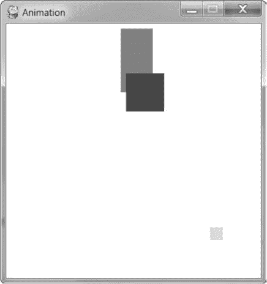

# 18 动画图形

> 原文：<https://inventwithpython.com/invent4thed/chapter18.html>


既然你已经学会了一些游戏技巧，我们将编写一个程序来制作在窗口周围弹跳的盒子的动画。这些盒子有不同的颜色和大小，只能沿对角线方向移动。为了制作盒子的动画，我们将在游戏循环中的每次迭代中把它们移动几个像素。这将使它看起来像盒子在屏幕上移动。

**本章涵盖的主题**

用游戏循环制作对象动画

改变物体的方向

### **动画程序示例运行**

当你运行动画程序时，它会看起来像[图 18-1](#calibre_link-120) 。砖块会从窗户的边缘反弹回来。



*图 18-1:动画程序截图*

### **动画程序源代码**

将下面的程序输入文件编辑器，保存为 *animation.py* 。如果你在输入这段代码后出现错误，用 https://www.nostarch.com/inventwithpython#diffT3*T5【在线比较工具】将你输入的代码与书中的代码进行比较。*


*animation.py*

```py
 1\. import pygame, sys, time
 2\. from pygame.locals import *
 3.
 4\. # Set up pygame.
 5\. pygame.init()
 6.
 7\. # Set up the window.
 8\. WINDOWWIDTH = 400
 9\. WINDOWHEIGHT = 400
10\. windowSurface = pygame.display.set_mode((WINDOWWIDTH, WINDOWHEIGHT),
      0, 32)
11\. pygame.display.set_caption('Animation')
12.
13\. # Set up direction variables.
14\. DOWNLEFT = 'downleft'
15\. DOWNRIGHT = 'downright'
16\. UPLEFT = 'upleft'
17\. UPRIGHT = 'upright'
18.
19\. MOVESPEED = 4
20.
21\. # Set up the colors.
22\. WHITE = (255, 255, 255)
23\. RED = (255, 0, 0)
24\. GREEN = (0, 255, 0)
25\. BLUE = (0, 0, 255)
26.
27\. # Set up the box data structure.
28\. b1 = {'rect':pygame.Rect(300, 80, 50, 100), 'color':RED, 'dir':UPRIGHT}
29\. b2 = {'rect':pygame.Rect(200, 200, 20, 20), 'color':GREEN, 'dir':UPLEFT}
30\. b3 = {'rect':pygame.Rect(100, 150, 60, 60), 'color':BLUE, 'dir':DOWNLEFT}
31\. boxes = [b1, b2, b3]
32.
33\. # Run the game loop.
34\. while True:
35.     # Check for the QUIT event.
36.     for event in pygame.event.get():
37.         if event.type == QUIT:
38.             pygame.quit()
39.             sys.exit()
40.
41.     # Draw the white background onto the surface.
42.     windowSurface.fill(WHITE)
43.
44.     for b in boxes:
45.         # Move the box data structure.
46.         if b['dir'] == DOWNLEFT:
47.             b['rect'].left -= MOVESPEED
48.             b['rect'].top += MOVESPEED
49.         if b['dir'] == DOWNRIGHT:
50.             b['rect'].left += MOVESPEED
51.             b['rect'].top += MOVESPEED
52.         if b['dir'] == UPLEFT:
53.             b['rect'].left -= MOVESPEED
54.             b['rect'].top -= MOVESPEED
55.         if b['dir'] == UPRIGHT:
56.             b['rect'].left += MOVESPEED
57.             b['rect'].top -= MOVESPEED
58.
59.         # Check whether the box has moved out of the window.
60.         if b['rect'].top < 0:
61.             # The box has moved past the top.
62.             if b['dir'] == UPLEFT:
63.                 b['dir'] = DOWNLEFT
64.             if b['dir'] == UPRIGHT:
65.                 b['dir'] = DOWNRIGHT
 66.         if b['rect'].bottom > WINDOWHEIGHT:
67.             # The box has moved past the bottom.
68.             if b['dir'] == DOWNLEFT:
69.                 b['dir'] = UPLEFT
70.             if b['dir'] == DOWNRIGHT:
71.                 b['dir'] = UPRIGHT
72.         if b['rect'].left < 0:
73.             # The box has moved past the left side.
74.             if b['dir'] == DOWNLEFT:
75.                 b['dir'] = DOWNRIGHT
76.             if b['dir'] == UPLEFT:
77.                 b['dir'] = UPRIGHT
78.         if b['rect'].right > WINDOWWIDTH:
79.             # The box has moved past the right side.
80.             if b['dir'] == DOWNRIGHT:
81.                 b['dir'] = DOWNLEFT
82.             if b['dir'] == UPRIGHT:
83.                 b['dir'] = UPLEFT
84.
85.         # Draw the box onto the surface.
86.         pygame.draw.rect(windowSurface, b['color'], b['rect'])
87.
88.     # Draw the window onto the screen.
89.     pygame.display.update()
90.     time.sleep(0.02)
```

### **移动和弹跳盒子**

在这个节目中，我们将有三个不同颜色的盒子在窗户上来回移动和反弹。在接下来的章节中，我们将使用这个程序作为基础来制作一个游戏，在游戏中我们控制其中一个盒子。为此，首先我们需要考虑如何移动盒子。

每个盒子将向四个对角线方向之一移动。当一个盒子撞到窗户的边上时，它应该会弹开并向一个新的对角线方向移动。盒子将如[图 18-2](#calibre_link-121) 所示弹起。


*图 18-2:盒子会如何弹跳*

盒子反弹后移动的新方向取决于两个因素:它在反弹前移动的方向和它被哪面墙反弹回来。盒子有八种可能的弹跳方式:四面墙各有两种不同的方式。例如，如果一个盒子向下和向右移动，然后从窗口的底部边缘反弹，我们希望盒子的新方向是向上和向右。

我们可以使用一个 Rect 对象来表示盒子的位置和大小，一个由三个整数组成的元组来表示盒子的颜色，一个整数来表示盒子当前在四个对角线方向中的哪个方向移动。

游戏循环将调整盒子在 Rect 对象中的 x 和 y 位置，并在每次迭代中在当前位置绘制屏幕上的所有盒子。随着程序在循环中迭代执行，盒子将逐渐在屏幕上移动，这样它们看起来就像在平滑地移动和来回跳动。

### **设置常量变量**

第 1 到 5 行只是设置我们的模块并初始化 pygame ，就像我们在[第 17 章](#calibre_link-95)中所做的一样:

```py
 1\. import pygame, sys, time
 2\. from pygame.locals import *
 3.
 4\. # Set up pygame.
 5\. pygame.init()
 6.
 7\. # Set up the window.
 8\. WINDOWWIDTH = 400
 9\. WINDOWHEIGHT = 400
10\. windowSurface = pygame.display.set_mode((WINDOWWIDTH, WINDOWHEIGHT),
      0, 32)
11\. pygame.display.set_caption('Animation')
```

在第 8 行和第 9 行，我们为窗口的宽度和高度定义了两个常量，然后在第 10 行，我们使用这些常量来设置 windowSurface ，它将代表我们的 pygame 窗口。第 11 行使用 set_caption() 将窗口的标题设置为‘动画’。

在这个程序中，你会看到窗口的宽度和高度不仅仅用于调用 set_mode() 。我们将使用常量变量，这样如果你想改变窗口的大小，你只需要改变第 8 行和第 9 行。因为窗口的宽度和高度在程序执行过程中不会改变，所以常量变量是个好主意。

#### ***常量变量为方向***

我们将为盒子可以移动的四个方向中的每一个方向使用常量变量:

```py
13\. # Set up direction variables.
14\. DOWNLEFT = 'downleft'
15\. DOWNRIGHT = 'downright'
16\. UPLEFT = 'upleft'
17\. UPRIGHT = 'upright'
```

你可以为这些方向使用任何你想要的值，而不是使用一个常量变量。例如，您可以直接使用字符串‘down left’来表示向下和向左的对角线方向，并在每次需要指定该方向时重新键入字符串。然而，如果你曾经打错了‘down left’字符串，你将会以一个错误结束，这将导致你的程序行为异常，即使程序不会崩溃。

如果您使用常量变量，而不小心输错了变量名，Python 会注意到没有同名的变量，并导致程序出错。这仍然是一个非常糟糕的 bug，但是至少你可以立即知道它并且修复它。

我们还创建了一个常量变量来确定盒子移动的速度:

```py
19\. MOVESPEED = 4
```

常量变量 MOVESPEED 中的值 4 告诉程序在游戏循环的每次迭代中每个盒子应该移动多少像素。

#### ***常量变量为颜色***

第 22 到 25 行为颜色设置了常量变量。记住， pygame 使用三个整数值的元组来表示红色、绿色和蓝色的数量，称为 RGB 值。整数范围从 0 到 255 。

```py
21\. # Set up the colors.
22\. WHITE = (255, 255, 255)
23\. RED = (255, 0, 0)
24\. GREEN = (0, 255, 0)
25\. BLUE = (0, 0, 255)
```

常量变量用于可读性，就像在 pygame Hello World 程序中一样。

### **设置盒子数据结构**

接下来，我们将定义盒子。为了简单起见，我们将建立一个字典作为数据结构(参见[第 112 页](#calibre_link-123)上的"[字典数据类型](#calibre_link-122))来表示每个移动的盒子。字典将有键【矩形】(用一个矩形对象作为值)【颜色】(用一组三个整数作为值)，以及【dir】(用一个方向常量变量作为值)。我们现在只设置三个盒子，但是您可以通过定义更多的数据结构来设置更多的盒子。我们稍后将使用的动画代码可用于制作任意多个盒子的动画，这些盒子是在设置数据结构时定义的。

变量 b1 将存储这些盒子数据结构中的一个:

```py
27\. # Set up the box data structure.
28\. b1 = {'rect':pygame.Rect(300, 80, 50, 100), 'color':RED, 'dir':UPRIGHT}
```

该框的左上角位于 x 坐标 300 和 y 坐标 80 处。它的宽度为 50 像素，高度为 100 像素。其颜色为红色，初始方向为直立。

第 29 行和第 30 行为不同大小、位置、颜色和方向的盒子创建了两个更相似的数据结构:

```py
29\. b2 = {'rect':pygame.Rect(200, 200, 20, 20), 'color':GREEN, 'dir':UPLEFT}
30\. b3 = {'rect':pygame.Rect(100, 150, 60, 60), 'color':BLUE, 'dir':DOWNLEFT}
31\. boxes = [b1, b2, b3]
```

如果需要从列表中检索一个框或值，可以使用索引和键。进入框【0】将访问 b1 中的字典数据结构。如果我们输入框[0]['color'] ，这将访问 b1 中的 'color' 键，因此表达式框[0]['color'] 将计算为 (255，0，0) 。您可以从box开始引用任何 box 数据结构中的任何值。三个字典， b1 、 b2 和 b3 ，然后被存储在框变量的列表中。

### **游戏循环**

游戏循环处理移动盒子的动画。动画的工作原理是绘制一系列略有不同的图片，一张接一张地展示出来。在我们的动画中，图片是移动的盒子，每个盒子的位置略有不同。在每张图片中，每个方框将移动 4 个像素。图片显示得如此之快，以至于这些方框看起来像是在屏幕上平滑地移动。如果一个盒子撞到了窗户的侧面，那么游戏循环会通过改变它的方向来使盒子反弹。

现在我们已经对游戏循环的工作原理有了一点了解，让我们来编码吧！

#### ***玩家退出时的处理***

当玩家关闭窗口退出时，我们需要像停止 pygame Hello World 程序一样停止程序。我们需要在游戏循环中这样做，以便我们的程序不断检查是否有退出事件。第 34 行开始循环，第 36 到 39 行处理退出:

```py
33\. # Run the game loop.
34\. while True:
35.     # Check for the QUIT event.
36.     for event in pygame.event.get():
37.         if event.type == QUIT:
38.             pygame.quit()
39.             sys.exit()
```

之后，我们要确保窗口表面已经准备好可以绘制了。稍后，我们将使用 rect() 方法在窗口表面上绘制每个盒子。在游戏循环的每一次迭代中，代码都用新的盒子重新绘制整个窗口，每次新的盒子都位于几个像素之外。当我们这样做的时候，我们并没有重画整个表面对象；相反，我们只是将 Rect 对象的绘图添加到 windowSurface 中。但是当游戏循环再次迭代绘制所有的 Rect 对象时，它会重新绘制每个 Rect 并且不会擦除旧的 Rect 绘图。如果我们只是让游戏循环继续在屏幕上绘制 Rect 对象，我们最终会得到一串 Rect 对象，而不是一个平滑的动画。为了避免这种情况，我们需要为游戏循环的每次迭代清除窗口。

为了做到这一点，线 42 用白色填充整个表面,这样之前画在上面的任何东西都被擦掉:

```py
41.     # Draw the white background onto the surface.
42.     windowSurface.fill(WHITE)
```

在新位置绘制矩形之前，如果不调用window surface . fill(WHITE)来涂白整个窗口，那么就会有一串 Rect 对象。如果您想尝试一下，看看会发生什么，您可以通过在第 42 行的开头添加一个 # 来注释掉该行。

一旦窗口表面被填充，我们就可以开始绘制我们所有的矩形对象。

#### ***移动每个盒子***

为了更新每个盒子的位置，我们需要迭代游戏循环中的盒子列表:

```py
44.     for b in boxes:
```

在循环的中，您将把当前框称为 b 以使代码更容易键入。我们需要根据每个盒子已经移动的方向来改变它，所以我们将使用 if 语句，通过检查盒子数据结构中的 dir 键来计算出盒子的方向。然后我们将根据盒子移动的方向改变它的位置。

```py
45.         # Move the box data structure.
46.         if b['dir'] == DOWNLEFT:
47.             b['rect'].left -= MOVESPEED
48.             b['rect'].top += MOVESPEED
49.         if b['dir'] == DOWNRIGHT:
50.             b['rect'].left += MOVESPEED
51.             b['rect'].top += MOVESPEED
52.         if b['dir'] == UPLEFT:
53.             b['rect'].left -= MOVESPEED
54.             b['rect'].top -= MOVESPEED
55.         if b['dir'] == UPRIGHT:
56.             b['rect'].left += MOVESPEED
57.             b['rect'].top -= MOVESPEED
```

设置每个盒子的左和上属性的新值取决于盒子的方向。如果方向是下左或上右，你想*增加*上的属性。如果方向是向上或向上，您想要*减少*顶部属性。

如果盒子的方向是垂直或垂直，你要*增加*左边属性。如果方向是向下向左或向上向左，您想要*减少*向左属性。

这些属性的值将增加或减少存储在 MOVESPEED 中的整数的数量，该整数存储了在游戏循环的每次迭代中盒子移动了多少像素。我们在第 19 行设置了移动速度。

例如，如果将 b['dir'] 设置为 'downleft' ， b['rect']。左侧至 40 ，以及b【rect】。top 到 100 ，那么第 46 行上的条件将为真。如果 MOVESPEED 被设置为 4 ，那么第 47 和 48 行将改变 Rect 对象，以便 b['rect']。左为 36 和 b【矩形】。顶部为 104 。更改 Rect 值会导致第 86 行的绘制代码将矩形稍微向下绘制到其先前位置的左侧。

#### ***弹跳一个盒子***

在第 44 到 57 行移动了盒子之后，我们需要检查盒子是否已经越过了窗口的边缘。如果是的话，你要弹一下盒子。在代码中，这意味着循环的将为盒子的‘dir’键设置一个新值。盒子将在游戏循环的下一次迭代中向新的方向移动。这使得它看起来像是从窗户的侧面反弹回来的。

在第 60 行的 if 语句中，如果盒子的 Rect 对象的 top 属性小于 0 ，我们确定盒子已经移动超过了窗口的上边缘:

```py
59.         # Check whether the box has moved out of the window.
60.         if b['rect'].top < 0:
61.             # The box has moved past the top.
62.             if b['dir'] == UPLEFT:
63.                 b['dir'] = DOWNLEFT
64.             if b['dir'] == UPRIGHT:
65.                 b['dir'] = DOWNRIGHT
```

在这种情况下，方向将根据盒子移动的方向而改变。如果盒子向上移动，那么它现在将向下移动；如果它正朝着的方向移动，那么它现在将朝着的方向完全移动。

第 66 行到第 71 行处理盒子已经移过窗口底部边缘的情况:

```py
66.         if b['rect'].bottom > WINDOWHEIGHT:
67.             # The box has moved past the bottom.
68.             if b['dir'] == DOWNLEFT:
69.                 b['dir'] = UPLEFT
70.             if b['dir'] == DOWNRIGHT:
71.                 b['dir'] = UPRIGHT
```

这几行检查底部属性(不是顶部属性)是否比窗口高度中的值*大*。记住 y 坐标从窗口顶部的 0 开始，增加到窗口底部的窗口高度。

第 72 到 83 行处理盒子从侧面反弹时的行为:

```py
72.         if b['rect'].left < 0:
73.             # The box has moved past the left side.
74.             if b['dir'] == DOWNLEFT:
75.                 b['dir'] = DOWNRIGHT
76.             if b['dir'] == UPLEFT:
77.                 b['dir'] = UPRIGHT
78.         if b['rect'].right > WINDOWWIDTH:
79.             # The box has moved past the right side.
80.             if b['dir'] == DOWNRIGHT:
81.                 b['dir'] = DOWNLEFT
82.             if b['dir'] == UPRIGHT:
83.                 b['dir'] = UPLEFT
```

第 78 行到第 83 行与第 72 行到第 77 行类似，但是检查盒子的右边是否已经移动过了窗口的右边。记住，x 坐标从窗口左边缘的 0 开始，增加到窗口右边缘的窗口宽度。

#### ***在新位置绘制窗口上的方框***

每当盒子移动时，我们需要通过调用 pygame.draw.rect() 函数，将它们绘制在 windowSurface 上的新位置:

```py
85.         # Draw the box onto the surface.
86.         pygame.draw.rect(windowSurface, b['color'], b['rect'])
```

您需要将 windowSurface 传递给该函数，因为它是要在其上绘制矩形的表面对象。将 b['color'] 传递给函数，因为它是矩形的颜色。最后，传递 b['rect'] ，因为它是带有要绘制的矩形的位置和大小的 Rect 对象。

第 86 行是循环的的最后一行。

#### ***在屏幕上绘制窗口***

在循环的之后，框列表中的每一个框都将被绘制，所以你需要调用 pygame.display.update() 在屏幕上绘制窗口面:

```py
88.     # Draw the window onto the screen.
89.     pygame.display.update()
90.     time.sleep(0.02)
```

计算机移动、弹跳和绘制盒子的速度如此之快，以至于如果程序全速运行，所有的盒子看起来都是一片模糊。为了让程序运行得足够慢，我们可以看到方框，我们需要添加 time.sleep(0.02) 。你可以试着注释掉 time.sleep(0.02) 行，然后运行程序，看看是什么样子。对 time.sleep() 的调用将在盒子的每次移动之间暂停程序 0.02 秒，即 20 毫秒。

在这一行之后，执行返回到游戏循环的开始，并再次开始该过程。通过这种方式，盒子不断地移动，从墙上弹回，并被绘制在屏幕上的新位置。

### **总结**

这一章介绍了一种创建计算机程序的全新方法。前几章的程序会停下来等待玩家输入文本。然而，在我们的动画程序中，程序不断更新数据结构，而不等待玩家的输入。

请记住，在我们的 Hangman 和 Tic-Tac-Toe 游戏中，我们有代表棋盘状态的数据结构。这些数据结构被传递给一个 drawBoard() 函数以显示在屏幕上。我们的动画程序也差不多。盒子变量保存了一个数据结构列表，表示将要绘制到屏幕上的盒子，这些盒子是在游戏循环中绘制的。

但是没有对 input() 的调用，我们如何从玩家那里获得输入呢？在[第 19 章](#calibre_link-97)中，我们将讲述程序如何知道玩家何时按下键盘上的键。我们还将了解一个叫做碰撞检测的新概念。