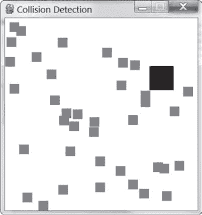
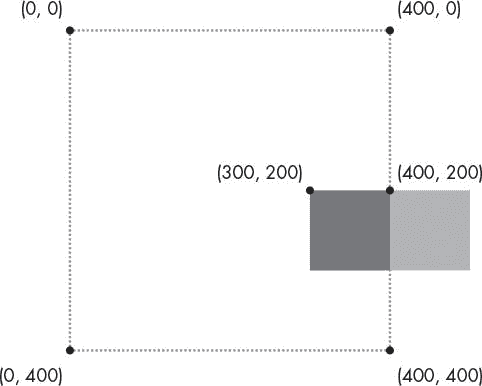
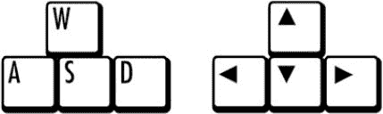

# 19 碰撞检测

> 原文：<https://inventwithpython.com/invent4thed/chapter19.html>


*碰撞检测*涉及计算屏幕上的两个物体何时相互接触(即碰撞)。碰撞检测对游戏真的很有用。例如，如果玩家接触到敌人，他们可能会失去生命值。或者如果玩家触摸到硬币，他们应该自动捡起来。碰撞检测有助于确定游戏角色是站在坚实的地面上，还是脚下空空如也。

在我们的游戏中，碰撞检测将确定两个矩形是否相互重叠。本章的示例程序将涵盖这一基本技术。我们还将看看我们的 pygame 程序如何通过键盘和鼠标接受玩家的输入。这是一个比调用 input() 函数更复杂的，就像我们对文本程序所做的那样。但是在 GUI 程序中使用键盘更具交互性，而在我们的文本游戏中使用鼠标甚至是不可能的。这两个概念会让你的游戏更加精彩！

**本章涵盖的主题**

时钟对象

pygame 中的键盘输入

在 pygame 中的鼠标输入

碰撞检测

迭代时不修改列表

### **碰撞检测程序的示例运行**

在这个程序中，玩家使用键盘的箭头键在屏幕上移动一个黑盒。代表食物的较小的绿色方块出现在屏幕上，当盒子碰到它们时就会“吃掉”它们。玩家可以点击窗口中的任何地方来创建新的食物方块。另外， <small class="calibre11">ESC</small> 退出程序，X 键把玩家传送到屏幕上随机的地方。

图 19-1 显示了程序完成后的样子。



*图 19-1:*`pygame`*碰撞检测程序*的截图

### **碰撞检测程序的源代码**

新建一个文件，输入以下代码，然后另存为 *collisionDetection.py* 。如果你在输入这段代码后出现错误，用 https://www.nostarch.com/inventwithpython#diffT3*T5【在线比较工具】将你输入的代码与书中的代码进行比较。*


*碰撞检测. py*

```py
  1\. import pygame, sys, random
  2\. from pygame.locals import *
  3.
  4\. # Set up pygame.
  5\. pygame.init()
  6\. mainClock = pygame.time.Clock()
  7.
  8\. # Set up the window.
  9\. WINDOWWIDTH = 400
 10\. WINDOWHEIGHT = 400
 11\. windowSurface = pygame.display.set_mode((WINDOWWIDTH, WINDOWHEIGHT),
       0, 32)
 12\. pygame.display.set_caption('Collision Detection')
 13.
 14\. # Set up the colors.
 15\. BLACK = (0, 0, 0)
 16\. GREEN = (0, 255, 0)
 17\. WHITE = (255, 255, 255)
 18.
 19\. # Set up the player and food data structures.
 20\. foodCounter = 0
 21\. NEWFOOD = 40
 22\. FOODSIZE = 20
 23\. player = pygame.Rect(300, 100, 50, 50)
 24\. foods = []
 25\. for i in range(20):
 26.     foods.append(pygame.Rect(random.randint(0, WINDOWWIDTH - FOODSIZE),
           random.randint(0, WINDOWHEIGHT - FOODSIZE), FOODSIZE, FOODSIZE))
 27.
 28\. # Set up movement variables.
 29\. moveLeft = False
 30\. moveRight = False
 31\. moveUp = False
 32\. moveDown = False
 33.
 34\. MOVESPEED = 6
 35.
 36.
 37\. # Run the game loop.
 38\. while True:
 39.     # Check for events.
 40.     for event in pygame.event.get():
 41.         if event.type == QUIT:
 42.             pygame.quit()
 43.             sys.exit()
 44.         if event.type == KEYDOWN:
 45.             # Change the keyboard variables.
 46.             if event.key == K_LEFT or event.key == K_a:
 47.                 moveRight = False
 48.                 moveLeft = True
 49.             if event.key == K_RIGHT or event.key == K_d:
 50.                 moveLeft = False
 51.                 moveRight = True
 52.             if event.key == K_UP or event.key == K_w:
 53.                 moveDown = False
 54.                 moveUp = True
 55.             if event.key == K_DOWN or event.key == K_s:
 56.                 moveUp = False
 57.                 moveDown = True
 58.         if event.type == KEYUP:
 59.             if event.key == K_ESCAPE:
 60.                 pygame.quit()
 61.                 sys.exit()
 62.             if event.key == K_LEFT or event.key == K_a:
 63.                 moveLeft = False
 64.             if event.key == K_RIGHT or event.key == K_d:
 65.                 moveRight = False
 66.             if event.key == K_UP or event.key == K_w:
 67.                 moveUp = False
 68.             if event.key == K_DOWN or event.key == K_s:
 69.                 moveDown = False
 70.             if event.key == K_x:
 71.                 player.top = random.randint(0, WINDOWHEIGHT -
                       player.height)
 72.                 player.left = random.randint(0, WINDOWWIDTH -
                       player.width)
 73.
 74.         if event.type == MOUSEBUTTONUP:
 75.             foods.append(pygame.Rect(event.pos[0], event.pos[1],
                   FOODSIZE, FOODSIZE))
 76.
 77.     foodCounter += 1
 78.     if foodCounter >= NEWFOOD:
 79.         # Add new food.
 80.         foodCounter = 0
 81.         foods.append(pygame.Rect(random.randint(0, WINDOWWIDTH -
               FOODSIZE), random.randint(0, WINDOWHEIGHT - FOODSIZE),
               FOODSIZE, FOODSIZE))
 82.
 83.     # Draw the white background onto the surface.
 84.     windowSurface.fill(WHITE)
 85.
 86.     # Move the player.
 87.     if moveDown and player.bottom < WINDOWHEIGHT:
 88.         player.top += MOVESPEED
 89.     if moveUp and player.top > 0:
 90.         player.top -= MOVESPEED
 91.     if moveLeft and player.left > 0:
 92.         player.left -= MOVESPEED
 93.     if moveRight and player.right < WINDOWWIDTH:
 94.         player.right += MOVESPEED
 95.
 96.     # Draw the player onto the surface.
 97.     pygame.draw.rect(windowSurface, BLACK, player)
 98.
 99.     # Check whether the player has intersected with any food squares.
100.     for food in foods[:]:
101.         if player.colliderect(food):
102.             foods.remove(food)
103.
104.     # Draw the food.
105.     for i in range(len(foods)):
106.         pygame.draw.rect(windowSurface, GREEN, foods[i])
107.
108.     # Draw the window onto the screen.
109.     pygame.display.update()
110.     mainClock.tick(40)
```

### **导入模块**

pygame 碰撞检测程序导入与[第 18 章](#calibre_link-96)中动画程序相同的模块，加上随机模块:

```py
  1\. import pygame, sys, random
  2\. from pygame.locals import *
```

### **用时钟给程序定步调**

第 5 行到第 17 行主要做动画程序做过的事情:它们初始化 pygame ，设置 WINDOWHEIGHT 和 WINDOWWIDTH ，并分配颜色和方向常量。

但是，第 6 行是新的:

```py
  6\. mainClock = pygame.time.Clock()
```

在动画程序中，一个对 time.sleep(0.02) 的调用减慢了程序的速度，这样它就不会运行得太快。虽然这个调用在所有计算机上总是暂停 0.02 秒，但程序其余部分的速度取决于计算机的速度。如果我们想让这个程序在任何一台计算机上以同样的速度运行，我们需要一个函数，在速度快的计算机上暂停更长时间，在速度慢的计算机上暂停更短时间。

一个 pygame.time.Clock 对象可以在任何计算机上暂停适当的时间。110 线在游戏循环内部调用 mainClock.tick(40) 。这个对时钟对象的 tick() 方法的调用等待了足够长的时间，以至于不管计算机的速度如何，它都以大约每秒 40 次迭代的速度运行。这确保了游戏永远不会比你预期的运行得更快。对 tick() 的调用在游戏循环中应该只出现一次。

### **设置窗口和数据结构**

第 19 到 22 行为出现在屏幕上的食物方块设置了一些变量:

```py
19\. # Set up the player and food data structures.
20\. foodCounter = 0
21\. NEWFOOD = 40
22\. FOODSIZE = 20
```

foodCounter 变量将从值 0 开始， NEWFOOD 在 40 开始， FOODSIZE 在 20 开始。我们稍后在制作食物时会看到这些是如何使用的。

第 23 行设置了一个 pygame。玩家位置的 Rect 对象:

```py
23\. player = pygame.Rect(300, 100, 50, 50)
```

玩家变量有一个 pygame。Rect 对象，表示盒子的大小和位置。玩家的盒子会像动画程序中的盒子一样移动(参见[第 280 页](#calibre_link-127)上的[移动每个盒子](#calibre_link-126))，但是在这个程序中，玩家可以控制盒子移动的位置。

接下来，我们设置一些代码来跟踪食物方块:

```py
24\. foods = []
25\. for i in range(20):
26.     foods.append(pygame.Rect(random.randint(0, WINDOWWIDTH - FOODSIZE),
          random.randint(0, WINDOWHEIGHT - FOODSIZE), FOODSIZE, FOODSIZE))
```

该程序将使用食品中的矩形对象列表来跟踪每个食品方块。第 25 行和第 26 行创建了随机放置在屏幕周围的 20 个食物方块。您可以使用 random.randint() 函数来得出随机的 x 和 y 坐标。

在第 26 行，程序调用了 pygame。Rect() 构造函数返回一个新的 pygame。Rect 对象。它将代表一个新的食品广场的位置和大小。 pygame 的前两个参数。Rect() 是左上角的 x 和 y 坐标。您希望随机坐标介于 0 和窗口大小减去食物方块大小之间。如果在 0 和窗口大小之间设置随机坐标，那么食物方块可能会被完全推出窗口，如图[图 19-2](#calibre_link-128) 所示。

第三和第四个参数为 pygame。Rect() 是美食广场的宽度和高度。宽度和高度都是 FOODSIZE 常量中的值。



*图 19-2:对于 400×400 窗口中的一个 100×100 的正方形，将左上边缘设置为 400 会将矩形放置在窗口之外。要在里面，左边缘应改为设置为 300。*

第三和第四个参数为 pygame。Rect() 是美食广场的宽度和高度。宽度和高度都是 FOODSIZE 常量中的值。

### **设置变量以跟踪运动**

从第 29 行开始，代码设置了一些变量来跟踪玩家的盒子在每个方向上的移动:

```py
28\. # Set up movement variables.
29\. moveLeft = False
30\. moveRight = False
31\. moveUp = False
32\. moveDown = False
```

这四个变量具有布尔值来跟踪哪个箭头键被按下，并且最初被设置为假。例如，当玩家按下键盘上的左箭头键移动盒子时， moveLeft 被设置为 True 。当他们放开按键时，向左移动被设置回错误。

第 34 到 43 行几乎与之前的 pygame 程序中的代码相同。这些行处理游戏循环的开始，以及当玩家退出程序时该做什么。我们将跳过对这段代码的解释，因为我们在前一章已经介绍过了。

### **处理事件**

pygame 模块可以生成事件来响应来自鼠标或键盘的用户输入。以下是 pygame.event.get() 可以返回的事件:

退出玩家关闭窗口时产生的。

KEYDOWN 玩家按下一个键时产生。有一个键属性，告诉你哪个键被按下了。还有一个 mod 属性，告知当这个键被按下时 <small class="calibre11">SHIFT</small> 、 <small class="calibre11">CTRL</small> 、 <small class="calibre11">ALT</small> 或其他键是否被按住。

KEYUP 玩家释放按键时产生。具有与 KEYDOWN 类似的键和 mod 属性。

鼠标在窗口上移动时产生的鼠标动作 。有一个 pos 属性(是 *position* 的缩写)，返回一个元组 (x，y) ，表示鼠标在窗口中的位置坐标。 rel 属性也返回一个 (x，y) 元组，但是它给出了自上一次 MOUSEMOTION 事件以来的相对坐标。比如鼠标从 (200，200) 向左移动 4 个像素到 (196，200) ，那么 rel 就是元组值 (-4，0) 。按钮属性返回一个由三个整数组成的元组。元组中的第一个整数用于鼠标左键，第二个整数用于鼠标中键(如果有)，第三个整数用于鼠标右键。如果鼠标移动时没有被按下，这些整数将是 0 ，如果被按下，这些整数将是 1 。

MOUSEBUTTONDOWN 当鼠标按钮在窗口中按下时生成。这个事件有一个 pos 属性，它是一个 (x，y) 元组，表示按钮被按下时鼠标所在位置的坐标。还有一个按钮属性，它是一个从 1 到 5 的整数，告诉你哪个鼠标按钮被按下了，如[表 19-1](#calibre_link-129) 中所解释的。

鼠标按钮释放时生成的 。这与鼠标按钮按钮具有相同的属性。

当 MOUSEBUTTONDOWN 事件生成时，它有一个按钮属性。按钮属性是一个与鼠标可能拥有的不同类型的按钮相关联的值。例如，左按钮的值为 1 ，右按钮的值为 3 。[表 19-1](#calibre_link-129) 列出了鼠标事件的所有按钮属性，但是请注意，鼠标可能没有这里列出的所有按钮值。

**表 19-1:**`button`属性值

| 按钮 的**值** | **鼠标键** |
| --- | --- |
| one | 向左按钮 |
| Two | 中间按钮 |
| three | 右按钮 |
| four | 滚轮向上移动 |
| five | 向下移动滚轮 |

我们将使用这些事件让玩家通过按键事件和鼠标点击来控制盒子。

#### ***处理按键事件***

处理按键和按键释放事件的代码从第 44 行开始；它包括 KEYDOWN 事件类型:

```py
44.         if event.type == KEYDOWN:
```

如果事件类型是 KEYDOWN ，那么事件对象具有一个键属性，指示哪个键被按下。当玩家按下箭头键或 WASD 键(发音为 *wazz-dee* ，这些键与箭头键布局相同，但在键盘的左侧)，然后我们希望盒子移动。我们将使用 if 语句来检查被按下的键，以判断盒子应该向哪个方向移动。

第 46 行将这个键属性与 K_LEFT 和 K_a 进行比较，它们是 pygame.locals 常量，分别表示键盘上的左箭头键和 WASD 中的 A。第 46 到 57 行检查每个箭头键和 WASD 键:

```py
45.             # Change the keyboard variables.
46.             if event.key == K_LEFT or event.key == K_a:
47.                 moveRight = False
48.                 moveLeft = True
49.             if event.key == K_RIGHT or event.key == K_d:
50.                 moveLeft = False
51.                 moveRight = True
52.             if event.key == K_UP or event.key == K_w:
53.                 moveDown = False
54.                 moveUp = True
55.             if event.key == K_DOWN or event.key == K_s:
56.                 moveUp = False
57.                 moveDown = True
```

当按下其中一个键时，代码告诉 Python 将相应的移动变量设置为 True 。Python 也会将反方向的运动变量设置为假。

例如，当按下左箭头键时，程序执行第 47 和 48 行。在这种情况下，Python 会将 moveLeft 设置为 True ，将 moveRight 设置为 False (即使 moveRight 可能已经为 False ，Python 也会再次将其设置为 False 以确保万无一失)。

在第 46 行， event.key 可以等于 K_LEFT 或者 K_a 。如果按下左箭头键，则 event.key 中的值设置为与 K_LEFT 相同的值，如果按下 A 键，则设置为与 K_a 相同的值。

通过执行第 47 行和第 48 行的代码，如果击键是 K_LEFT 或 K_a ，你可以让左箭头键和 A 键做同样的事情。W、A、S 和 D 键被用作改变移动变量的备用键，如果玩家愿意，可以让他们用左手而不是右手。你可以在[图 19-3](#calibre_link-130) 中看到两组键的图示。



*图 19-3:WASD 键可以被编程为和箭头键做同样的事情。*

字母和数字键的常数很容易算出来:A 键的常数是 K_a ，B 键的常数是 K_b ，以此类推。3 键的常数是k3。[表 19-2](#calibre_link-131) 列出了其他键盘按键的常用常量变量。

**表 19-2:** 键盘按键的常量变量

| pygame **常量变量** | **键盘按键** |
| --- | --- |
| K_LEFT | 向左箭头 |
| K _ 右 | 向右箭头 |
| K_UP | 向上箭头 |
| K_DOWN | 下箭头键 |
| K_ESCAPE | ESC |
| K _ 退格键 | 退格 |
| K_TAB | <small class="calibre11">选项卡</small> |
| K_RETURN | <small class="calibre11">回车</small>或<small class="calibre11">回车</small> |
| K _ 空间 | 空格键 |
| K_DELETE | 的<small class="calibre11"></small> |
| k _ lshift | 向左<small class="calibre11">移动</small> |
| k _ rsift | 向右<small class="calibre11">移动</small> |
| K_LCTRL | 左 <small class="calibre11">CTRL</small> |
| K_RCTRL | 右 <small class="calibre11">CTRL</small> |
| k _ Lall | 左侧 <small class="calibre11">ALT</small> |
| 【t0 k _ ralt】t1 号线 | 右 <small class="calibre11">ALT</small> |
| K_HOME | <small class="calibre11">首页</small> |
| K_END | <small class="calibre11">结束</small> |
| K_PAGEUP | <small class="calibre11">PGUP</small> |
| K_PAGEDOWN | <small class="calibre11">PGDN</small> |
| K_F1 | 子一代 |
| K_F2 | 第二子代 |
| K_F3 | 第三子代 |
| K_F4 | 法乐四联症 |
| K_F5 | F5 |
| K_F6 | F6 |
| K_F7 | F7 |
| K_F8 | F8 |
| K_F9 | F9 |
| K_F10 | F10 |
| K_F11 | F11 |
| K_F12 | F12 |

#### ***处理 KEYUP 事件***

当玩家释放他们按下的键时，会生成一个 KEYUP 事件:

```py
58.         if event.type == KEYUP:
```

如果玩家释放的键是 <small class="calibre11">ESC</small> ，那么 Python 应该终止程序。请记住，在 pygame 中，您必须在调用 sys.exit() 函数之前调用 pygame.quit() 函数，我们在第 59 行到第 61 行中这样做:

```py
59.             if event.key == K_ESCAPE:
60.                 pygame.quit()
61.                 sys.exit()
```

第 62 到 69 行将一个移动变量设置为 False ，如果该方向的键被释放:

```py
62.             if event.key == K_LEFT or event.key == K_a:
63.                 moveLeft = False
64.             if event.key == K_RIGHT or event.key == K_d:
65.                 moveRight = False
66.             if event.key == K_UP or event.key == K_w:
67.                 moveUp = False
68.             if event.key == K_DOWN or event.key == K_s:
69.                 moveDown = False
```

通过 KEYUP 事件将移动变量设置为 False 会使盒子停止移动。

### **传送玩家**

你也可以在游戏中加入传送。如果玩家按下 X 键，第 71 行和第 72 行将玩家盒子的位置设置为窗口上的一个随机位置:

```py
70.             if event.key == K_x:
71.                 player.top = random.randint(0, WINDOWHEIGHT -
                      player.height)
72.                 player.left = random.randint(0, WINDOWWIDTH -
                      player.width)
```

第 70 行检查玩家是否按了 X 键。然后，第 71 行设置一个随机的 x 坐标，将玩家传送到 0 和窗口高度减去玩家矩形高度之间。第 72 行执行类似的代码，但是针对 y 坐标。这使得玩家可以通过按下 X 键在窗口周围传送，但他们无法控制他们将传送到哪里——这完全是随机的。

### **添加新的食物方块**

玩家可以通过两种方式在屏幕上添加新的食物方块。他们可以在窗口中单击他们希望新的食物方块出现的位置，或者他们可以等到游戏循环迭代了 NEWFOOD 次，在这种情况下，新的食物方块将在窗口中随机生成。

我们先来看看如何通过玩家的鼠标输入来添加食物:

```py
74.         if event.type == MOUSEBUTTONUP:
75.             foods.append(pygame.Rect(event.pos[0], event.pos[1],
                  FOODSIZE, FOODSIZE))
```

鼠标输入由事件处理，就像键盘输入一样。当玩家点击鼠标按钮后释放鼠标按钮时，就会发生 MOUSEBUTTONUP 事件。

在第 75 行，x 坐标存储在 event.pos[0] 中，y 坐标存储在 event.pos[1] 中。第 75 行创建一个新的 Rect 对象来表示一个新的食物方块，并将其放在发生 MOUSEBUTTONUP 事件的地方。通过向食物列表添加一个新的 Rect 对象，代码在屏幕上显示一个新的食物方块。

除了根据玩家的判断手动添加之外，食物方块是通过第 77 到 81 行的代码自动生成的:

```py
77.     foodCounter += 1
78.     if foodCounter >= NEWFOOD:
79.         # Add new food.
80.         foodCounter = 0
81.         foods.append(pygame.Rect(random.randint(0, WINDOWWIDTH -
              FOODSIZE), random.randint(0, WINDOWHEIGHT - FOODSIZE),
              FOODSIZE, FOODSIZE))
```

变量 foodCounter 记录食物添加的频率。每次游戏循环迭代，第 77 行的食物计数器增加 1 。

一旦 foodCounter 大于或等于常数 NEWFOOD ， foodCounter 被重置，并且通过线 81 产生新的食物方块。你可以通过调整第 21 行的新食物来改变新食物方块的添加速率。

第 84 行只是用白色填充了窗口表面，我们在[第 279 页](#calibre_link-133)的“[玩家退出](#calibre_link-132)时的处理”中已经讨论过了，所以我们将继续讨论玩家如何在屏幕上移动。

### **在窗口周围移动玩家**

我们已经将移动变量( moveDown 、 moveUp 、 moveLeft 和 moveRight )设置为真或假，这取决于玩家按下了什么键。现在我们需要移动玩家的盒子，用 pygame 表示。存储在播放器中的 Rect 对象。我们将通过调整玩家的 x 和 y 坐标来做到这一点。

```py
86.     # Move the player.
87.     if moveDown and player.bottom < WINDOWHEIGHT:
88.         player.top += MOVESPEED
89.     if moveUp and player.top > 0:
90.         player.top -= MOVESPEED
91.     if moveLeft and player.left > 0:
92.         player.left -= MOVESPEED
93.     if moveRight and player.right < WINDOWWIDTH:
94.         player.right += MOVESPEED
```

如果 moveDown 被设置为 True (并且玩家盒子的底部不低于窗口的底部边缘)，那么第 88 行通过将 MOVESPEED 添加到玩家当前的 top 属性来向下移动玩家的盒子。第 89 到 94 行对其他三个方向做了同样的事情。

#### ***在窗口上绘制播放器***

第 97 行在窗口上绘制玩家的盒子:

```py
96.     # Draw the player onto the surface.
97.     pygame.draw.rect(windowSurface, BLACK, player)
```

移动盒子后，第 97 行将它绘制到新的位置。为第一个参数传递的 windowSurface 告诉 Python 要在哪个表面对象上绘制矩形。存储了 (0，0，0) 的 BLACK 变量告诉 Python 绘制一个黑色矩形。存储在 player 变量中的 Rect 对象告诉 Python 要绘制的矩形的位置和大小。

#### ***检查碰撞***

在绘制食物方块之前，程序需要检查玩家的盒子是否与任何方块重叠。如果有，那么这个方块需要从食品列表中删除。这样 Python 就不会画出任何盒子已经吃过的食物方块。

我们将在第 101 行使用所有 Rect 对象都有的碰撞检测方法， colliderect() :

```py
 99.     # Check whether the player has intersected with any food squares.
100.     for food in foods[:]:
101.         if player.colliderect(food):
102.             foods.remove(food)
```

在通过 for 循环的每次迭代中，来自 foods (复数)列表的当前食物方块被放入变量 food (单数)中。用于 pygame 的 colliderect() 方法。Rect 对象被传递给玩家矩形的 pygame。Rect 对象作为参数，如果两个矩形冲突，则返回 True ，如果不冲突，则返回 False 。如果为真，第 102 行从食物列表中移除重叠的食物方块。

**迭代时不要改变列表**

请注意，循环的与我们见过的任何其他循环的略有不同。如果你仔细观察第 100 行，它不是在食品上迭代，而是在食品[:] 上迭代。

记住切片是如何工作的。 foods[:2] 计算列表的副本，其中包含从开始到(但不包括)索引 2 处的项目。 foods[:] 会给你一份从头到尾都有项目的清单。基本上， foods[:] 用 foods 中所有条目的副本创建一个新列表。这是一种比 getBoardCopy() 函数在[第 10 章](#calibre_link-12)的井字游戏中所做的更短的复制列表的方式。

迭代列表时，不能添加或移除列表中的项目。如果食物列表的大小总是在变化，Python 可能会忘记食物变量的下一个值应该是什么。想象一下，当有人在添加或取出软糖时，数一数罐子里的软糖是多么困难。

但是如果你遍历列表的一个副本(这个副本永远不会改变)，从原始列表中添加或删除条目不会有问题。

### **在窗户上画食物方块**

第 105 行和第 106 行的代码类似于我们用来为玩家绘制黑盒的代码:

```py
104.     # Draw the food.
105.     for i in range(len(foods)):
106.         pygame.draw.rect(windowSurface, GREEN, foods[i])
```

第 105 行循环通过食物列表中的每个食物方块，第 106 行将食物方块绘制到窗口表面。

现在玩家和食物方块都在屏幕上了，窗口准备好被更新，所以我们调用第 109 行的 update() 方法，并通过调用我们之前创建的时钟对象上的 tick() 方法来完成程序:

```py
108.     # Draw the window onto the screen.
109.     pygame.display.update()
110.     mainClock.tick(40)
```

该程序将继续通过游戏循环，并保持更新，直到玩家退出。

### **总结**

本章介绍了碰撞检测的概念。检测两个矩形之间的碰撞在图形游戏中非常常见，以至于 pygame 为 pygame 提供了自己的碰撞检测方法，名为 colliderect() 。Rect 对象。

本书中的前几个游戏是基于文本的。程序的输出是打印到屏幕上的文本，输入是玩家在键盘上输入的文本。但是图形程序也可以接受键盘和鼠标输入。

此外，当玩家按下或释放单个键时，这些程序可以响应单次击键。玩家不需要输入完整的回答并按下<small class="calibre11">回车</small>。这允许即时反馈和更多的互动游戏。

这个互动程序很有趣，但是让我们超越画矩形。在第 20 章中，你将学习如何用 pygame 加载图像和播放音效。