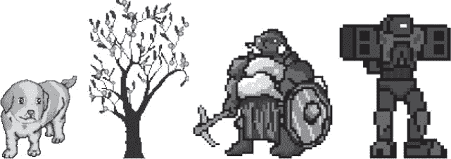
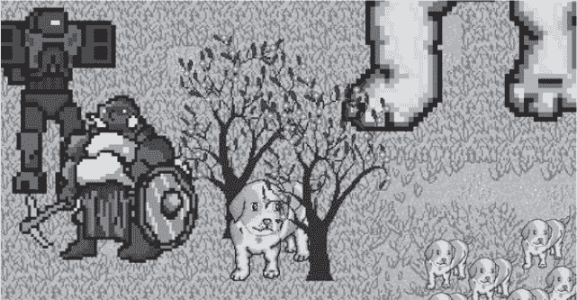
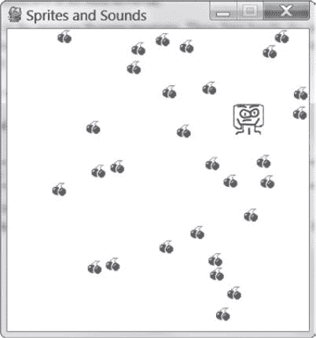

# 20 使用声音和图像

> 原文：<https://inventwithpython.com/invent4thed/chapter20.html>


在第 18 章和[第 19 章](#calibre_link-97)中，你学习了如何制作有图形并能接受键盘和鼠标输入的 GUI 程序。你还学习了如何画不同的形状。在这一章中，你将学习如何给你的游戏添加声音、音乐和图像。

**本章涵盖的主题**

声音和图像文件

绘制和缩放精灵

添加音乐和声音

打开和关闭声音

### **用精灵添加图像**

一个*子画面*是一个单独的二维图像，被用作屏幕上图形的一部分。[图 20-1](#calibre_link-2) 显示了一些精灵的例子。



*图 20-1:精灵的一些例子*

精灵图像绘制在背景之上。您可以水平翻转精灵图像，使其面向另一个方向。您也可以在同一个窗口中多次绘制同一个精灵图像，并且可以调整精灵的大小，使其大于或小于原始精灵图像。背景图像也可以被认为是一个大精灵。[图 20-2](#calibre_link-4) 显示了一起使用的精灵。



图 20-2:一个完整的场景，精灵绘制在背景之上

下一个程序将演示如何使用 pygame 播放声音和绘制精灵。

### **声音和图像文件**

精灵存储在计算机上的图像文件中。有几种图像格式 pygame 可以使用。要判断图像文件使用的格式，请查看文件名的结尾(在最后一个句点之后)。这被称为*文件扩展名*。例如，player.png 的文件*是 PNG 格式的。pygame 支持的图像格式包括 BMP、PNG、JPG 和 GIF。*

您可以从网络浏览器下载图像。在大多数 web 浏览器上，您可以右键单击网页中的图像，然后从出现的菜单中选择“保存”。记住您在硬盘上保存图像文件的位置，因为您需要将下载的图像文件复制到与 Python 程序的*相同的文件夹中。py* 文件。你也可以用微软画图软件或者 Tux 画图软件来创建你自己的图像。

pygame 支持的声音文件格式有 MIDI、WAV、MP3。您可以像下载图像文件一样从 internet 下载声音效果，但是声音文件必须是这三种格式之一。如果您的计算机有麦克风，您还可以录制声音并制作自己的 WAV 文件，以便在游戏中使用。

### **精灵和声音程序的运行示例**

本章程序与[第 19 章](#calibre_link-97)中的碰撞检测程序相同。然而，在这个程序中，我们将使用精灵，而不是简单的正方形。我们将用一个人的精灵代替黑盒来代表玩家，用一个樱桃的精灵代替绿色的食物方块。我们还会播放背景音乐，当玩家雪碧吃了一个樱桃时，我们会添加一个音效。

在这个游戏中，玩家精灵会吃樱桃精灵，当它吃樱桃时，它会长大。当你运行程序时，游戏看起来会像[图 20-3](#calibre_link-135) 。



*图 20-3:精灵和声音游戏*的截图

### **精灵和声音程序的源代码**

启动一个新文件，输入以下代码，然后保存为 *spritesAndSounds.py* 。你可以从本书的网站 https://www.nostarch.com/inventwithpython/下载本节目中用到的图像和声音文件。将这些文件放在与 *spritesAndSounds.py* 程序相同的文件夹中。


如果你输入这个代码后出现错误，在用在线比较工具将你输入的代码与书中的代码进行比较。

*精灵和声音. py*

```py
  1\. import pygame, sys, time, random
  2\. from pygame.locals import *
  3.
  4\. # Set up pygame.
  5\. pygame.init()
  6\. mainClock = pygame.time.Clock()
  7.
  8\. # Set up the window.
  9\. WINDOWWIDTH = 400
 10\. WINDOWHEIGHT = 400
 11\. windowSurface = pygame.display.set_mode((WINDOWWIDTH, WINDOWHEIGHT),
       0, 32)
 12\. pygame.display.set_caption('Sprites and Sounds')
 13.
 14\. # Set up the colors.
 15\. WHITE = (255, 255, 255)
 16.
 17\. # Set up the block data structure.
 18\. player = pygame.Rect(300, 100, 40, 40)
 19\. playerImage = pygame.image.load('player.png')
 20\. playerStretchedImage = pygame.transform.scale(playerImage, (40, 40))
 21\. foodImage = pygame.image.load('cherry.png')
 22\. foods = []
 23\. for i in range(20):
 24.     foods.append(pygame.Rect(random.randint(0, WINDOWWIDTH - 20),
           random.randint(0, WINDOWHEIGHT - 20), 20, 20))
 25.
 26\. foodCounter = 0
 27\. NEWFOOD = 40
 28.
 29\. # Set up keyboard variables.
 30\. moveLeft = False
 31\. moveRight = False
 32\. moveUp = False
 33\. moveDown = False
 34.
 35\. MOVESPEED = 6
 36.
 37\. # Set up the music.
 38\. pickUpSound = pygame.mixer.Sound('pickup.wav')
 39\. pygame.mixer.music.load('background.mid')
 40\. pygame.mixer.music.play(-1, 0.0)
 41\. musicPlaying = True
 42.
 43\. # Run the game loop.
 44\. while True:
 45.     # Check for the QUIT event.
 46.     for event in pygame.event.get():
 47.         if event.type == QUIT:
 48.             pygame.quit()
 49.             sys.exit()
 50.         if event.type == KEYDOWN:
 51.             # Change the keyboard variables.
 52.             if event.key == K_LEFT or event.key == K_a:
 53.                 moveRight = False
 54.                 moveLeft = True
 55.             if event.key == K_RIGHT or event.key == K_d:
 56.                 moveLeft = False
 57.                 moveRight = True
 58.             if event.key == K_UP or event.key == K_w:
 59.                 moveDown = False
 60.                 moveUp = True
 61.             if event.key == K_DOWN or event.key == K_s:
 62.                 moveUp = False
 63.                 moveDown = True
 64.         if event.type == KEYUP:
 65.             if event.key == K_ESCAPE:
 66.                 pygame.quit()
 67.                 sys.exit()
 68.             if event.key == K_LEFT or event.key == K_a:
 69.                 moveLeft = False
 70.             if event.key == K_RIGHT or event.key == K_d:
 71.                 moveRight = False
 72.             if event.key == K_UP or event.key == K_w:
 73.                 moveUp = False
 74.             if event.key == K_DOWN or event.key == K_s:
 75.                 moveDown = False
 76.             if event.key == K_x:
 77.                 player.top = random.randint(0, WINDOWHEIGHT -
                       player.height)
 78.                 player.left = random.randint(0, WINDOWWIDTH -
                       player.width)
 79.             if event.key == K_m:
 80.                 if musicPlaying:
 81.                     pygame.mixer.music.stop()
 82.                 else:
 83.                     pygame.mixer.music.play(-1, 0.0)
 84.                 musicPlaying = not musicPlaying
 85.
 86.         if event.type == MOUSEBUTTONUP:
 87.             foods.append(pygame.Rect(event.pos[0] - 10,
                   event.pos[1] - 10, 20, 20))
 88.
 89.     foodCounter += 1
 90.     if foodCounter >= NEWFOOD:
 91.         # Add new food.
 92.         foodCounter = 0
 93.         foods.append(pygame.Rect(random.randint(0, WINDOWWIDTH - 20),
               random.randint(0, WINDOWHEIGHT - 20), 20, 20))
 94.
 95.     # Draw the white background onto the surface.
 96.     windowSurface.fill(WHITE)
 97.
 98.     # Move the player.
 99.     if moveDown and player.bottom < WINDOWHEIGHT:
100.         player.top += MOVESPEED
101.     if moveUp and player.top > 0:
102.         player.top -= MOVESPEED
103.     if moveLeft and player.left > 0:
104.         player.left -= MOVESPEED
105.     if moveRight and player.right < WINDOWWIDTH:
106.         player.right += MOVESPEED
107.
108.
109.     # Draw the block onto the surface.
110.     windowSurface.blit(playerStretchedImage, player)
111.
112.     # Check whether the block has intersected with any food squares.
113.     for food in foods[:]:
114.         if player.colliderect(food):
115.             foods.remove(food)
116.             player = pygame.Rect(player.left, player.top,
                   player.width + 2, player.height + 2)
117.             playerStretchedImage = pygame.transform.scale(playerImage,
                   (player.width, player.height))
118.             if musicPlaying:
119.                 pickUpSound.play()
120.
121.     # Draw the food.
122.     for food in foods:
123.         windowSurface.blit(foodImage, food)
124.
125.     # Draw the window onto the screen.
126.     pygame.display.update()
127.     mainClock.tick(40)
```

### **设置窗口和数据结构**

这个程序中的大部分代码与[第 19 章](#calibre_link-97)中的碰撞检测程序相同。我们将只关注添加精灵和声音的部分。首先，在第 12 行，让我们将标题栏的标题设置为描述该程序的字符串:

```py
12\. pygame.display.set_caption('Sprites and Sounds')
```

为了设置标题，你需要将字符串‘精灵和声音’传递给pygame . display . set _ caption()函数。

#### ***添加一个精灵***

现在我们已经设置了标题，我们需要实际的精灵。我们将使用三个变量来表示玩家，不像之前的程序只使用一个变量。

```py
17\. # Set up the block data structure.
18\. player = pygame.Rect(300, 100, 40, 40)
19\. playerImage = pygame.image.load('player.png')
20\. playerStretchedImage = pygame.transform.scale(playerImage, (40, 40))
21\. foodImage = pygame.image.load('cherry.png')
```

第 18 行的 player 变量将存储一个 Rect 对象，该对象跟踪玩家的位置和大小。玩家变量不包含玩家的图像。程序开始时，播放器的左上角位于(300，100)，播放器的初始高度和宽度为 40 个像素。

第二个代表玩家的变量是第 19 行的 playerImage 。向函数 pygame.image.load() 传递一个要加载的图像的文件名字符串。返回值是一个表面对象，其表面绘制了图像文件中的图形。我们将这个表面对象存储在 playerImage 中。

#### ***改变精灵的大小***

在第 20 行，我们将在 pygame.transform 模块中使用一个新函数。 pygame.transform.scale() 函数可以缩小或放大精灵。第一个参数是一个绘制了图像的表面对象。第二个参数是第一个参数中图像的新宽度和高度的元组。 scale() 函数返回一个表面对象，其图像以新的尺寸绘制。在本章的程序中，我们将让玩家雪碧吃更多的樱桃时伸展得更大。我们将原始图像存储在 playerImage 变量中，但拉伸图像存储在 playerStretchedImage 变量中。

在第 21 行，我们再次调用 load() 来创建一个表面对象，上面绘制了樱桃图像。确保 player.png 和 cherry.png 的*文件与 *spritesAndSounds.py* 文件在同一个文件夹中；否则， pygame 将无法找到它们，并会给出一个错误。*

### **设置音乐和声音**

接下来，您需要加载声音文件。在 pygame 中有两个声音模块。 pygame.mixer 模块可以在游戏中播放简短的音效。 pygame.mixer.music 模块可以播放背景音乐。

#### ***添加声音文件***

调用 pygame.mixer.Sound() 构造函数创建一个 pygame.mixer.Sound 对象(简称 Sound 对象)。这个对象有一个 play() 方法，在被调用时会播放声音效果。

```py
37\. # Set up the music.
38\. pickUpSound = pygame.mixer.Sound('pickup.wav')
39\. pygame.mixer.music.load('background.mid')
40\. pygame.mixer.music.play(-1, 0.0)
41\. musicPlaying = True
```

第 39 行调用pygame . mixer . music . load()加载背景音乐，第 40 行调用pygame . mixer . music . play()开始播放。第一个参数告诉 pygame 在我们第一次播放背景音乐后要播放多少次。所以传递 5 会导致 pygame 播放六次背景音乐。这里我们传递参数 -1 ，是一个让背景音乐永远重复的特殊值。

play() 的第二个参数是声音文件中开始播放的点。通过 0.0 将从头开始播放背景音乐。通过 2.5 将从开始 2.5 秒开始播放背景音乐。

最后， musicPlaying 变量有一个布尔值，告诉程序是否应该播放背景音乐和音效。给玩家一个不播放声音就运行程序的选项是很好的。

#### ***开关声音***

M 键将打开或关闭背景音乐。如果 musicPlaying 设置为 True ，那么背景音乐当前正在播放，我们应该通过调用pygame . mixer . music . stop()来停止播放。如果 musicPlaying 设置为 False ，那么背景音乐当前没有播放，我们应该通过调用 play() 来启动它。第 79 到 84 行使用了 if 语句来实现这一点:

```py
79.             if event.key == K_m:
80.                 if musicPlaying:
81.                     pygame.mixer.music.stop()
82.                 else:
83.                     pygame.mixer.music.play(-1, 0.0)
84.                 musicPlaying = not musicPlaying
```

无论音乐是否正在播放，我们都希望切换音乐播放中的值。*切换*一个布尔值意味着设置一个与其当前值相反的值。行music playing = not music playing如果当前为真则将变量设置为假，或者如果当前为假则将变量设置为真。把切换想象成你打开或关闭电灯开关时发生的事情:切换电灯开关会把它设置到相反的设置。

### **在窗口上画玩家**

记住存储在 playerStretchedImage 中的值是一个表面对象。第 110 行使用 blit() 将玩家的精灵绘制到窗口的表面对象(存储在 windowSurface 中):

```py
109.     # Draw the block onto the surface.
110.     windowSurface.blit(playerStretchedImage, player)
```

blit() 方法的第二个参数是一个 Rect 对象，它指定应该在表面对象上的什么位置绘制精灵。该程序使用存储在播放器中的 Rect 对象，该对象跟踪播放器在窗口中的位置。

### **检查碰撞**

这段代码类似于前面程序中的代码，但是有几行新代码:

```py
114.         if player.colliderect(food):
115.             foods.remove(food)
116.             player = pygame.Rect(player.left, player.top,
                   player.width + 2, player.height + 2)
117.             playerStretchedImage = pygame.transform.scale(playerImage,
                   (player.width, player.height))
118.             if musicPlaying:
119.                 pickUpSound.play()
```

当玩家雪碧吃掉其中一个樱桃时，它的大小在高度和宽度上增加了两个像素。在第 116 行，比旧的 Rect 对象大两个像素的新的 Rect 对象将被指定为玩家的新值。

当 Rect 对象表示玩家的位置和尺寸时，玩家的图像作为表面对象存储在 playerStretchedImage 中。在第 117 行，程序通过调用 scale() 创建一个新的拉伸图像。

拉伸图像通常会使图像有点变形。如果你继续重新拉伸已经拉伸的图像，失真会迅速增加。但是通过每次将原始图像拉伸到一个新的尺寸——通过传递 playerImage ，而不是 playerStretchedImage ，作为 scale() 的第一个参数——你只能扭曲图像一次。

最后，第 119 行对存储在 pickUpSound 变量中的声音对象调用 play() 方法。但只有当 musicPlaying 设置为 True (这意味着声音打开)时，它才会这样做。

### **在窗户上画樱桃**

在前面的程序中，您调用了 pygame.draw.rect() 函数，为存储在 foods 列表中的每个 Rect 对象绘制一个绿色方块。然而，在这个程序中，您想要绘制樱桃精灵。调用 blit() 方法并传递存储在 foodImage 中的表面对象，其上绘制了樱桃图像:

```py
121.     # Draw the food.
122.     for food in foods:
123.         windowSurface.blit(foodImage, food)
```

food 变量包含 foods 中的每个 Rect 对象，通过 for 循环的每次迭代，告诉 blit() 方法在哪里绘制 foodImage 。

### **总结**

您已经为游戏添加了图像和声音。这些图像被称为精灵，看起来比以前程序中使用的简单绘制形状好得多。精灵可以缩放(即拉伸)到更大或更小的尺寸，因此我们可以以任何想要的尺寸显示精灵。本章介绍的游戏也有背景，并播放音效。

现在我们知道了如何创建窗口、显示精灵、绘制图元、收集键盘和鼠标输入、播放声音以及实现碰撞检测，我们准备在 pygame 中创建一个图形游戏。[第 21 章](#calibre_link-99)为我们迄今为止最先进的游戏汇集了所有这些元素。