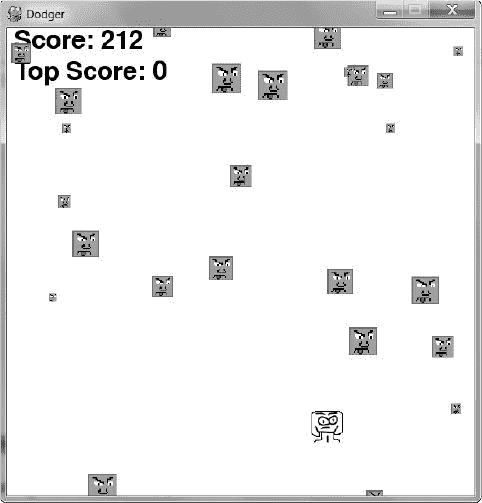

# 21 一个有声音和图像的道奇游戏

> 原文：<https://inventwithpython.com/invent4thed/chapter21.html>


前四章讲述了 pygame 模块并演示了如何使用它的许多特性。在这一章中，我们将使用这些知识来创建一个名为 Dodger 的图形游戏。

**本章涵盖的主题**

pygame。全屏标志

move_ip() Rect 方法

实施作弊代码

修改道奇队的比赛

在 Dodger 游戏中，玩家控制一个精灵(玩家的角色),它必须躲避从屏幕上方掉下来的一大堆坏蛋。玩家躲避坏人的时间越长，他们的分数就越高。

只是为了好玩，我们还会在这个游戏中加入一些作弊模式。如果玩家按住 X 键，每一个坏人的速度都会降低到一个超慢的速度。如果玩家按住 Z 键，坏人将会反转方向，在屏幕上向上而不是向下移动。

### **回顾基本 pygame 数据类型**

在我们开始制作 Dodger 之前，让我们回顾一下 pygame 中使用的一些基本数据类型:

pygame.直肠

Rect 对象代表一个矩形空间的位置和大小。该位置由矩形对象的顶部左侧属性(或顶部右侧、底部左侧和底部右侧属性)决定。这些角属性是 x 和 y 坐标的整数元组。尺寸由宽度和高度属性决定，这两个属性是整数，表示矩形的长度或高度。 Rect 对象有一个 colliderect() 方法，该方法检查它们是否与另一个 Rect 对象冲突。

pygame。表面

表面物体是彩色像素的区域。一个表面对象代表一个矩形图像，而一个矩形对象只代表一个矩形空间和位置。表面对象有一个 blit() 方法，用于将一个表面对象上的图像绘制到另一个表面对象上。由py game . display . set _ mode()函数返回的 Surface 对象是特殊的，因为当调用py game . display . update()时，在那个 Surface 对象上绘制的任何东西都会显示在用户的屏幕上。

pygame . event . eventT3】

每当用户提供键盘、鼠标或其他输入时， pygame.event 模块生成事件对象。 pygame.event.get() 函数返回这些事件对象的列表。您可以通过检查类型属性来确定事件对象的类型。 QUIT 、 KEYDOWN 和 MOUSEBUTTONUP 是一些事件类型的例子。(有关所有事件类型的完整列表，请参见第 292 页[的](#calibre_link-138)[处理事件](#calibre_link-137))。)

游戏机.字体

pygame.font 模块使用字体数据类型，代表 pygame 中文本使用的字体。传递给 pygame.font. SysFont() 的参数是一个字体名称字符串(通常为字体名称传递 None 以获得默认的系统字体)和一个字体大小的整数。

pygame . time . clock

pygame.time 模块中的时钟对象有助于防止我们的游戏运行速度超过玩家可见的速度。时钟对象有一个 tick() 方法，可以将我们希望游戏运行的每秒帧数(FPS)传递给它。FPS 越高，游戏运行越快。

### **道奇的试运行**

当你运行这个程序时，游戏看起来会像[图 21-1](#calibre_link-139) 。



*图 21-1:道奇队比赛截图*

### **道奇的源代码**

在一个新文件中输入以下代码，保存为 *dodger.py* 。您可以从 https://www.nostarch.com/inventwithpython/的*T3*下载代码、图像和声音文件。将图像和声音文件放在与 *dodger.py* 相同的文件夹中。


如果你输入这个代码后出现错误，在用在线比较工具将你输入的代码与书中的代码进行比较。

*道奇. py*

```py
  1\. import pygame, random, sys
  2\. from pygame.locals import *
  3.
  4\. WINDOWWIDTH = 600
  5\. WINDOWHEIGHT = 600
  6\. TEXTCOLOR = (0, 0, 0)
  7\. BACKGROUNDCOLOR = (255, 255, 255)
  8\. FPS = 60
  9\. BADDIEMINSIZE = 10
 10\. BADDIEMAXSIZE = 40
 11\. BADDIEMINSPEED = 1
 12\. BADDIEMAXSPEED = 8
 13\. ADDNEWBADDIERATE = 6
 14\. PLAYERMOVERATE = 5
 15.
 16\. def terminate():
 17.     pygame.quit()
 18.     sys.exit()
 19.
 20\. def waitForPlayerToPressKey():
 21.     while True:
 22.         for event in pygame.event.get():
 23.             if event.type == QUIT:
 24.                 terminate()
 25.             if event.type == KEYDOWN:
 26.                 if event.key == K_ESCAPE: # Pressing ESC quits.
 27.                     terminate()
 28.                 return
 29.
 30\. def playerHasHitBaddie(playerRect, baddies):
 31.     for b in baddies:
 32.         if playerRect.colliderect(b['rect']):
 33.             return True
 34.     return False
 35.
 36\. def drawText(text, font, surface, x, y):
 37.     textobj = font.render(text, 1, TEXTCOLOR)
 38.     textrect = textobj.get_rect()
 39.     textrect.topleft = (x, y)
 40.     surface.blit(textobj, textrect)
 41.
 42\. # Set up pygame, the window, and the mouse cursor.
 43\. pygame.init()
 44\. mainClock = pygame.time.Clock()
 45\. windowSurface = pygame.display.set_mode((WINDOWWIDTH, WINDOWHEIGHT))
 46\. pygame.display.set_caption('Dodger')
 47\. pygame.mouse.set_visible(False)
 48.
 49\. # Set up the fonts.
 50\. font = pygame.font.SysFont(None, 48)
 51.
 52\. # Set up sounds.
 53\. gameOverSound = pygame.mixer.Sound('gameover.wav')
 54\. pygame.mixer.music.load('background.mid')
 55.
 56\. # Set up images.
 57\. playerImage = pygame.image.load('player.png')
 58\. playerRect = playerImage.get_rect()
 59\. baddieImage = pygame.image.load('baddie.png')
 60.
 61\. # Show the "Start" screen.
 62\. windowSurface.fill(BACKGROUNDCOLOR)
 63\. drawText('Dodger', font, windowSurface, (WINDOWWIDTH / 3),
       (WINDOWHEIGHT / 3))
 64\. drawText('Press a key to start.', font, windowSurface,
       (WINDOWWIDTH / 3) - 30, (WINDOWHEIGHT / 3) + 50)
 65\. pygame.display.update()
 66\. waitForPlayerToPressKey()
 67.
 68\. topScore = 0
 69\. while True:
 70.     # Set up the start of the game.
 71.     baddies = []
 72.     score = 0
 73.     playerRect.topleft = (WINDOWWIDTH / 2, WINDOWHEIGHT - 50)
 74.     moveLeft = moveRight = moveUp = moveDown = False
 75.     reverseCheat = slowCheat = False
 76.     baddieAddCounter = 0
 77.     pygame.mixer.music.play(-1, 0.0)
 78.
 79.     while True: # The game loop runs while the game part is playing.
 80.         score += 1 # Increase score.
 81.
 82.         for event in pygame.event.get():
 83.             if event.type == QUIT:
 84.                 terminate()
 85.
 86.             if event.type == KEYDOWN:
 87.                 if event.key == K_z:
 88.                     reverseCheat = True
 89.                 if event.key == K_x:
 90.                     slowCheat = True
 91.                 if event.key == K_LEFT or event.key == K_a:
 92.                     moveRight = False
 93.                     moveLeft = True
 94.                 if event.key == K_RIGHT or event.key == K_d:
 95.                     moveLeft = False
 96.                     moveRight = True
 97.                 if event.key == K_UP or event.key == K_w:
 98.                     moveDown = False
 99.                     moveUp = True
100.                 if event.key == K_DOWN or event.key == K_s:
101.                     moveUp = False
102.                     moveDown = True
103.
104.             if event.type == KEYUP:
105.                 if event.key == K_z:
106.                     reverseCheat = False
107.                     score = 0
108.                 if event.key == K_x:
109.                     slowCheat = False
110.                     score = 0
111.                 if event.key == K_ESCAPE:
112.                     terminate()
113.
114.                 if event.key == K_LEFT or event.key == K_a:
115.                     moveLeft = False
116.                 if event.key == K_RIGHT or event.key == K_d:
117.                     moveRight = False
118.                 if event.key == K_UP or event.key == K_w:
119.                     moveUp = False
120.                 if event.key == K_DOWN or event.key == K_s:
121.                     moveDown = False
122.
123.             if event.type == MOUSEMOTION:
124.                 # If the mouse moves, move the player to the cursor.
125.                 playerRect.centerx = event.pos[0]
126.                 playerRect.centery = event.pos[1]
127.         # Add new baddies at the top of the screen, if needed.
128.         if not reverseCheat and not slowCheat:
129.             baddieAddCounter += 1
130.         if baddieAddCounter == ADDNEWBADDIERATE:
131.             baddieAddCounter = 0
132.             baddieSize = random.randint(BADDIEMINSIZE, BADDIEMAXSIZE)
133.             newBaddie = {'rect': pygame.Rect(random.randint(0,
                                WINDOWWIDTH - baddieSize), 0 - baddieSize,
                                baddieSize, baddieSize),
134.                          'speed': random.randint(BADDIEMINSPEED,
                                BADDIEMAXSPEED),
135.                          'surface':pygame.transform.scale(baddieImage,
                                (baddieSize, baddieSize)),
136.                         }
137.
138.             baddies.append(newBaddie)
139.
140.         # Move the player around.
141.         if moveLeft and playerRect.left > 0:
142.             playerRect.move_ip(-1 * PLAYERMOVERATE, 0)
143.         if moveRight and playerRect.right < WINDOWWIDTH:
144.             playerRect.move_ip(PLAYERMOVERATE, 0)
145.         if moveUp and playerRect.top > 0:
146.             playerRect.move_ip(0, -1 * PLAYERMOVERATE)
147.         if moveDown and playerRect.bottom < WINDOWHEIGHT:
148.             playerRect.move_ip(0, PLAYERMOVERATE)
149.
150.         # Move the baddies down.
151.         for b in baddies:
152.             if not reverseCheat and not slowCheat:
153.                 b['rect'].move_ip(0, b['speed'])
154.             elif reverseCheat:
155.                 b['rect'].move_ip(0, -5)
156.             elif slowCheat:
157.                 b['rect'].move_ip(0, 1)
158.
159.         # Delete baddies that have fallen past the bottom.
160.         for b in baddies[:]:
161.             if b['rect'].top > WINDOWHEIGHT:
162.                 baddies.remove(b)
163.
164.         # Draw the game world on the window.
165.         windowSurface.fill(BACKGROUNDCOLOR)
166.
167.         # Draw the score and top score.
168.         drawText('Score: %s' % (score), font, windowSurface, 10, 0)
169.         drawText('Top Score: %s' % (topScore), font, windowSurface,
               10, 40)
170.
171.         # Draw the player's rectangle.
172.         windowSurface.blit(playerImage, playerRect)
173.
174.         # Draw each baddie.
175.         for b in baddies:
176.             windowSurface.blit(b['surface'], b['rect'])
177.
178.         pygame.display.update()
179.
180.         # Check if any of the baddies have hit the player.
181.         if playerHasHitBaddie(playerRect, baddies):
182.             if score > topScore:
183.                 topScore = score # Set new top score.
184.             break
185.
186.         mainClock.tick(FPS)
187.
188.     # Stop the game and show the "Game Over" screen.
189.     pygame.mixer.music.stop()
190.     gameOverSound.play()
191.
192.     drawText('GAME OVER', font, windowSurface, (WINDOWWIDTH / 3),
           (WINDOWHEIGHT / 3))
193.     drawText('Press a key to play again.', font, windowSurface,
           (WINDOWWIDTH / 3) - 80, (WINDOWHEIGHT / 3) + 50)
194.     pygame.display.update()
195.     waitForPlayerToPressKey()
196.
197.     gameOverSound.stop()
```

### **导入模块**

道奇游戏导入了与之前的 pygame 程序相同的模块: pygame 、 random 、 sys 和 pygame.locals 。

```py
1\. import pygame, random, sys
2\. from pygame.locals import *
```

py game . locals模块包含了 pygame 使用的几个常量变量，比如事件类型( QUIT 、 KEYDOWN 等等)和键盘按键( K_ESCAPE 、 K_LEFT 等等)。通过使用 pygame.locals import * 语法中的，可以在源代码中只使用 QUIT 而不是 pygame.locals.QUIT 。

### **设置常量变量**

第 4 行到第 7 行设置了窗口尺寸、文本颜色和背景颜色的常量:

```py
4\. WINDOWWIDTH = 600
5\. WINDOWHEIGHT = 600
6\. TEXTCOLOR = (0, 0, 0)
7\. BACKGROUNDCOLOR = (255, 255, 255)
```

我们使用常量变量，因为它们比我们输入的值更具描述性。比如window surface . fill(background color)这一行就比 windowSurface.fill((255，255，255)) 更好理解。

你可以通过改变常量来改变游戏。通过改变第 4 行的窗口宽度，你可以自动改变任何使用窗口宽度的地方的代码。如果您使用值 600 来代替，您将不得不改变代码中每次出现的 600 。一次更改常量中的值更容易。

在第 8 行，您为 FPS 设置常数，即您希望游戏每秒运行的帧数:

```py
8\. FPS = 60
```

一个*帧*是为游戏循环中的单次迭代绘制的屏幕。您将第 186 行上的 FPS 传递给 mainClock.tick() 方法，以便该函数知道程序暂停多长时间。这里 FPS 被设置为 60 ，但是你可以将 FPS 更改为更高的值以使游戏运行得更快，或者更改为更低的值以使游戏变慢。

第 9 行到第 13 行为下落的坏蛋设置了更多的常量变量:

```py
 9\. BADDIEMINSIZE = 10
10\. BADDIEMAXSIZE = 40
11\. BADDIEMINSPEED = 1
12\. BADDIEMAXSPEED = 8
13\. ADDNEWBADDIERATE = 6
```

坏家伙的宽度和高度将在baddie 最小尺寸和baddie 最大尺寸之间。在整个游戏循环中，每次迭代中坏人掉下屏幕的比率将在 BADDIEMINSPEED 和 BADDIEMAXSPEED 像素之间。在整个游戏循环中，每次addnewbadierate迭代，都会有一个新的坏蛋被添加到窗口的顶部。

最后，player overate存储玩家角色在游戏循环的每次迭代中在窗口中移动的像素数(如果角色正在移动):

```py
14\. PLAYERMOVERATE = 5
```

通过增加该数值，可以提高角色的移动速度。

### **定义功能**

你将为这个游戏创建几个函数。 terminate() 和waitForPlayerToPressKey()函数将分别结束和暂停游戏，player hashit badie()函数将跟踪玩家与坏人的碰撞， drawText() 函数将比分和其他文本绘制到屏幕上。

#### ***结束和暂停游戏***

pygame 模块要求你同时调用 pygame.quit() 和 sys.exit() 来结束游戏。第 16 到 18 行将它们放入一个名为 terminate() 的函数中。

```py
16\. def terminate():
17.     pygame.quit()
18.     sys.exit()
```

现在只需要调用 terminate() 而不是同时调用 pygame.quit() 和 sys.exit() 。

有时你会想暂停程序，直到玩家按下一个键，比如在游戏开始时出现*道奇队*的标题文本，或者在游戏结束时出现*战胜*的游戏。第 20 到 24 行创建了一个名为waitForPlayerToPressKey()的新函数:

```py
20\. def waitForPlayerToPressKey():
21.     while True:
22.         for event in pygame.event.get():
23.             if event.type == QUIT:
24.                 terminate()
```

在这个函数中，有一个无限循环，只有当收到一个 KEYDOWN 或 QUIT 事件时才会中断。在循环开始时， pygame.event.get() 返回一个要检查的事件对象列表。

如果玩家在程序等待玩家按键时关闭了窗口， pygame 将生成一个 QUIT 事件，您可以在第 23 行用 event.type 检查该事件。如果玩家已经退出，Python 在第 24 行调用 terminate() 函数。

如果游戏接收到一个 KEYDOWN 事件，首先要检查 <small class="calibre11">ESC</small> 是否被按下:

```py
25.             if event.type == KEYDOWN:
26.                 if event.key == K_ESCAPE: # Pressing ESC quits.
27.                     terminate()
28.                 return
```

如果玩家按下 <small class="calibre11">ESC</small> ，程序应该会终止。如果不是这种情况，那么执行将跳过第 27 行的 if 块，直接进入 return 语句，退出waitForPlayerToPressKey()函数。

如果没有生成退出或按键事件，代码会继续循环。由于循环什么也不做，这将使它看起来像游戏已经冻结，直到玩家按下一个键。

 **如果玩家的角色与其中一个坏人相撞，函数将返回 True :

```py
30\. def playerHasHitBaddie(playerRect, baddies):
31.     for b in baddies:
32.         if playerRect.colliderect(b['rect']):
33.             return True
34.     return False
```

坏人参数是坏人字典数据结构的列表。这些字典中的每一个都有一个‘Rect’键，该键的值是一个 Rect 对象，它表示坏人的大小和位置。

playerRect 也是一个 Rect 对象。 Rect 对象有一个名为 colliderect() 的方法，如果 Rect 对象与传递给它的 Rect 对象发生冲突，该方法返回 True 。否则， colliderect() 返回 False 。

第 31 行的循环的遍历坏人列表中的每个坏人字典。如果这些坏蛋中的任何一个与玩家的角色发生冲突，那么player hashit badie()返回 True 。如果代码设法遍历了 baddies 列表中的所有 baddies 而没有检测到冲突，则player hashit badie()返回 False 。

#### ***绘制文本到窗口***

在窗口上绘制文本包括几个步骤，我们用 drawText() 来完成。这样，当我们想要在屏幕上显示玩家的分数或者在文本上显示*游戏时，只有一个函数可以调用。*

```py
36\. def drawText(text, font, surface, x, y):
37.     textobj = font.render(text, 1, TEXTCOLOR)
38.     textrect = textobj.get_rect()
39.     textrect.topleft = (x, y)
40.     surface.blit(textobj, textrect)
```

首先，第 37 行的 render() 方法调用创建了一个表面对象，该对象以特定的字体呈现文本。

接下来，你需要知道面物体的大小和位置。您可以使用 get_rect() Surface 方法获得带有这些信息的 Rect 对象。

从第 38 行的 get_rect() 返回的 Rect 对象具有来自表面对象的宽度和高度信息的副本。第 39 行通过为 topleft 属性设置一个新的元组值来改变 Rect 对象的位置。

最后，第 40 行将呈现文本的表面对象绘制到传递给 drawText() 函数的表面对象上。在 pygame 中显示文本比简单地调用 print() 函数需要更多的步骤。但是如果你把这段代码放到一个名为 drawText() 的函数中，那么你只需要调用这个函数就可以在屏幕上显示文本。

### **初始化 pygame 并设置窗口**

既然常量变量和函数已经完成，我们将开始调用设置窗口和时钟的 pygame 函数:

```py
42\. # Set up pygame, the window, and the mouse cursor.
43\. pygame.init()
44\. mainClock = pygame.time.Clock()
```

第 43 行通过调用 pygame.init() 函数来设置 pygame 。第 44 行创建了一个 pygame.time.Clock() 对象，并将其存储在 mainClock 变量中。这个对象将帮助我们防止程序运行过快。

第 45 行创建一个新的表面对象，用于窗口显示:

```py
45\. windowSurface = pygame.display.set_mode((WINDOWWIDTH, WINDOWHEIGHT))
```

注意，只有一个参数传递给了py game . display . set _ mode():一个元组。py game . display . set _ mode()的参数不是两个整数，而是两个整数的一个元组。您可以通过传递一个带有常量变量 WINDOWWIDTH 和 WINDOWHEIGHT 的元组来指定这个表面对象(以及窗口)的宽度和高度。

py game . display . set _ mode()函数有第二个可选参数。可以通过 pygame。全屏常量使窗口充满整个屏幕。请看对第 45 行的修改:

```py
45\. windowSurface = pygame.display.set_mode((WINDOWWIDTH, WINDOWHEIGHT),
      pygame.FULLSCREEN)
```

参数 WINDOWWIDTH 和 WINDOWHEIGHT 仍然被传递给窗口的宽度和高度，但是图像将被拉伸得更大以适应屏幕。尝试在全屏模式和不全屏模式下运行程序。

第 46 行将窗口的标题设置为字符串‘Dodger’:

```py
46\. pygame.display.set_caption('Dodger')
```

该标题将出现在窗口顶部的标题栏中。

在 Dodger 中，鼠标光标应该是不可见的。您希望鼠标能够在屏幕上移动玩家的角色，但是鼠标光标会妨碍角色的图像。我们只用一行代码就可以让鼠标隐形:

```py
47\. pygame.mouse.set_visible(False)
```

调用py game . mouse . set _ visible(False)告诉 pygame 使光标不可见。

### **设置字体、声音和图像对象**

因为我们在这个程序的屏幕上显示文本，我们需要给 pygame 模块一个字体对象用于文本。第 50 行通过调用 pygame.font.SysFont() 创建了一个字体对象:

```py
49\. # Set up the fonts.
50\. font = pygame.font.SysFont(None, 48)
```

传递 None 使用默认字体。通过 48 赋予字体 48 磅的大小。

接下来，我们将创建声音对象并设置背景音乐:

```py
52\. # Set up sounds.
53\. gameOverSound = pygame.mixer.Sound('gameover.wav')
54\. pygame.mixer.music.load('background.mid')
```

pygame.mixer.Sound() 构造函数创建一个新的声音对象，并将对该对象的引用存储在 gameOverSound 变量中。在你自己的游戏中，你可以创建尽可能多的声音对象，每个都有不同的声音文件。

pygame . mixer . music . load()函数加载一个声音文件作为背景音乐播放。这个函数不返回任何对象，一次只能加载一个背景声音文件。背景音乐会在游戏过程中不断播放，但只有当玩家因撞上坏人而输掉游戏时，才会播放声音物体。

你可以为这个游戏使用任何 WAV 或 MIDI 文件。一些声音文件可以在本书的网站*[【https://www.nostarch.com/inventwithpython/】](https://www.nostarch.com/inventwithpython/)*获得。你也可以为这个游戏使用你自己的声音文件，只要你将这些文件命名为 *gameover.wav* 和 *background.mid* 或者改变第 53 行和第 54 行使用的字符串来匹配你想要的文件名。

接下来你将加载用于玩家角色和坏人的图像文件:

```py
56\. # Set up images.
57\. playerImage = pygame.image.load('player.png')
58\. playerRect = playerImage.get_rect()
59\. baddieImage = pygame.image.load('baddie.png')
```

人物的图像存储在*player.png*中，坏人的图像存储在*baddie.png*中。所有的坏人看起来都一样，所以你只需要一个图像文件。你可以在 https://www.nostarch.com/inventwithpython/的*网站下载这些图片。*

### **显示开始屏幕**

当游戏第一次开始时，Python 应该在屏幕上显示 Dodger 标题。你还想告诉玩家，他们可以按任意键开始游戏。出现此屏幕是为了让玩家在运行程序后有时间准备开始播放。

在第 63 和 64 行，我们编写代码来调用 drawText() 函数:

```py
61\. # Show the "Start" screen.
62\. windowSurface.fill(BACKGROUNDCOLOR)
63\. drawText('Dodger', font, windowSurface, (WINDOWWIDTH / 3),
      (WINDOWHEIGHT / 3))
64\. drawText('Press a key to start.', font, windowSurface,
      (WINDOWWIDTH / 3) - 30, (WINDOWHEIGHT / 3) + 50)
65\. pygame.display.update()
66\. waitForPlayerToPressKey()
```

我们给这个函数传递五个参数:

1.  要显示的文本字符串

2.  您希望字符串显示的字体

3.  文本将被渲染到的表面对象

4.  在表面对象上绘制文本的 x 坐标

5.  在表面对象上绘制文本的 y 坐标

对于一个函数调用来说，这似乎需要传递很多参数，但是请记住，每次调用这个函数调用都会替换掉五行代码。这缩短了程序，并且由于需要检查的代码更少，所以更容易找到 bug。

waitForPlayerToPressKey()函数通过循环暂停游戏，直到生成 KEYDOWN 事件。然后执行中断循环，程序继续运行。

### **开始游戏**

现在已经定义了所有的函数，我们可以开始编写主要的游戏代码了。第 68 行及以后的代码将调用我们之前定义的函数。程序第一次运行时， topScore 变量中的值从 0 开始。每当玩家输了并且得分大于当前最高得分时，最高得分将被这个更大的得分替换。

```py
68\. topScore = 0
69\. while True:
```

从第 69 行开始的无限循环从技术上来说不是游戏循环。游戏循环在游戏运行时处理事件和绘制窗口。相反，每当玩家开始一个新游戏时，这个 while 循环就会迭代。当玩家输了，游戏重置，程序的执行循环回到第 69 行。

开始时，您还想将 baddies 设置为空列表:

```py
70.     # Set up the start of the game.
71.     baddies = []
72.     score = 0
```

baddies 变量是包含以下关键字的字典对象列表:

【Rect】Rect对象，描述坏蛋的位置和大小。

【速度】 坏蛋倒在屏幕上的速度有多快。该整数表示游戏循环中每次迭代的像素。

【表面】表面其上绘制有缩放的坏人图像的对象。这是pygame . display . set _ mode()返回的曲面对象所绘制的曲面。

第 72 行将玩家的分数重置为 0 。

播放器的起始位置在屏幕的中央，从底部向上 50 个像素，这是由第 73 行设置的:

```py
73.     playerRect.topleft = (WINDOWWIDTH / 2, WINDOWHEIGHT - 50)
```

第 73 行的元组中的第一项是左边缘的 x 坐标，第二项是上边缘的 y 坐标。

接下来，我们为玩家动作和作弊设置变量:

```py
74.     moveLeft = moveRight = moveUp = moveDown = False
75.     reverseCheat = slowCheat = False
76.     baddieAddCounter = 0
```

运动变量 moveLeft 、 moveRight 、 moveUp 和 moveDown 被设置为 False 。reverse chat和slow heat变量也被设置为 False 。只有当玩家通过分别按住 Z 和 X 键来启用这些作弊时，它们才会被设置为真。

变量 baddieAddCounter 是一个计数器，告诉程序什么时候在屏幕顶部添加一个新的坏蛋。每次游戏循环迭代时， baddieAddCounter 中的值增加 1。(这类似于第 295 页[的](#calibre_link-141)[添加新的食物方块](#calibre_link-140)中的代码)。)

当 baddieAddCounter 等于addnewbadierate时，则 baddieAddCounter 重置为 0 ，一个新的 baddie 被添加到屏幕顶部。(这项检查将在第 130 行完成。)

背景音乐从第 77 行开始播放，调用py game . mixer . music . play()函数:

```py
77.     pygame.mixer.music.play(-1, 0.0)
```

因为第一个参数是 -1 ， pygame 无休止的重复音乐。第二个参数是一个浮点数，它表示音乐开始多少秒后开始播放。超过 0.0 表示音乐从头开始播放。

### **游戏循环**

游戏循环的代码通过改变玩家和坏蛋的位置，处理 pygame 产生的事件，在屏幕上绘制游戏世界，不断更新游戏世界的状态。所有这些每秒钟发生几十次，这使得游戏实时运行。

第 79 行是主游戏循环的开始:

```py
79.     while True: # The game loop runs while the game part is playing.
80.         score += 1 # Increase score.
```

线 80 在游戏循环的每次迭代中增加玩家的分数。玩家能坚持不输的时间越长，他们的分数就越高。只有当玩家输掉游戏或退出程序时，循环才会退出。

#### ***处理键盘事件***

程序将处理四种类型的事件:退出、按键、按键和鼠标运动。

第 82 行是事件处理代码的开始:

```py
82.         for event in pygame.event.get():
83.             if event.type == QUIT:
84.                 terminate()
```

它调用 pygame.event.get() ，返回一列事件对象。每一个事件对象都代表一个自上次调用 pygame.event.get() 以来发生的事件。代码检查事件对象的类型属性，以查看它是什么类型的事件，然后相应地处理它。

如果事件对象的类型属性等于退出，则用户已经关闭程序。退出常量变量是从 pygame.locals 模块导入的。

如果事件的类型是 KEYDOWN ，玩家按下了一个键:

```py
86.             if event.type == KEYDOWN:
87.                 if event.key == K_z:
88.                     reverseCheat = True
89.                 if event.key == K_x:
90.                     slowCheat = True
```

第 87 行检查该事件是否描述了 Z 键被按下时的事件。如果这个条件为真，Python 将reverse chat变量设置为真来激活反向欺骗。类似地，第 89 行检查是否已经按下了 X 键来激活慢速欺骗。

第 91 到 102 行检查事件是否是由玩家按下箭头键或 WASD 键产生的。该代码类似于前面章节中与键盘相关的代码。

如果事件的类型是 KEYUP ，玩家已经释放了一个键:

```py
104.             if event.type == KEYUP:
105.                 if event.key == K_z:
106.                     reverseCheat = False
107.                     score = 0
108.                 if event.key == K_x:
109.                     slowCheat = False
110.                     score = 0
```

第 105 行检查玩家是否释放了 Z 键，这将使反向欺骗无效。在这种情况下，106 行将reverse chet设置为 False ，107 行将分数重置为 0 。分数重置是为了阻止玩家使用作弊。

第 108 到 110 行对 X 键和慢速欺骗做了同样的事情。当释放 X 键时，slow heat被设置为 False ，玩家的分数被重置为 0 。

在游戏过程中的任何时候，玩家都可以按 <small class="calibre11">ESC</small> 退出:

```py
111.                 if event.key == K_ESCAPE:
112.                     terminate()
```

第 111 行通过检查事件来确定被释放的键是否是 <small class="calibre11">ESC</small> 。如果是，第 112 行调用 terminate() 函数来退出程序。

第 114 到 121 行检查玩家是否已经停止按住箭头键或 WASD 键。在这种情况下，代码将相应的移动变量设置为假。这类似于[第 19 章](#calibre_link-97)和[第 20 章](#calibre_link-98)程序中的动作代码。

#### ***处理鼠标移动***

现在您已经处理了键盘事件，让我们来处理可能已经生成的任何鼠标事件。如果玩家点击了鼠标按钮，Dodger 游戏不会做任何事情，但是当玩家移动鼠标时，它会做出响应。这给了玩家两种控制游戏角色的方法:键盘或鼠标。

每当鼠标移动时，就会产生 MOUSEMOTION 事件:

```py
123.             if event.type == MOUSEMOTION:
124.                 # If the mouse moves, move the player to the cursor.
125.                 playerRect.centerx = event.pos[0]
126.                 playerRect.centery = event.pos[1]
```

将类型设置为鼠标运动的事件对象也有一个名为位置的属性，用于表示鼠标事件的位置。 pos 属性存储鼠标光标在窗口中移动位置的 x 和 y 坐标元组。如果事件的类型是 MOUSEMOTION ，玩家的角色移动到鼠标光标的位置。

第 125 和 126 行将玩家角色的中心 x 和 y 坐标设置为鼠标光标的 x 和 y 坐标。

### **添加新的坏人**

在游戏循环的每次迭代中，代码将变量 baddieAddCounter 递增 1:

```py
127.         # Add new baddies at the top of the screen, if needed.
128.         if not reverseCheat and not slowCheat:
129.             baddieAddCounter += 1
```

这种情况只有在作弊没有启用的情况下才会发生。请记住，只要 Z 键和 X 键分别被按住，则 reverseCheat 和slow heat被设置为 True 。当 Z 和 X 键被按住时， baddieAddCounter 不会递增。因此，屏幕上方不会出现新的坏人。

当 baddieAddCounter 达到addnewbadierate中的值时，就该在屏幕顶部添加一个新的坏蛋了。首先， baddieAddCounter 被重置为 0 :

```py
130.         if baddieAddCounter == ADDNEWBADDIERATE:
131.             baddieAddCounter = 0
132.             baddieSize = random.randint(BADDIEMINSIZE, BADDIEMAXSIZE)
133.             newBaddie = {'rect': pygame.Rect(random.randint(0,
                                WINDOWWIDTH - baddieSize), 0 - baddieSize,
                                baddieSize, baddieSize),
134.                         'speed': random.randint(BADDIEMINSPEED,
                                BADDIEMAXSPEED),
135.                         'surface':pygame.transform.scale(baddieImage,
                                (baddieSize, baddieSize)),
136.                         }
```

第 132 行以像素为单位生成坏人的大小。大小将是在 BADDIEMINSIZE 和 BADDIEMAXSIZE 之间的随机整数，它们是分别在第 9 行和第 10 行设置为 10 和 40 的常数。

第 133 行是创建新的坏人数据结构的地方。请记住，坏蛋的数据结构只是一个带有关键字、【矩形】、、【速度】、、【表面】、的字典。‘Rect’键保存了对 Rect 对象的引用，该对象存储了坏蛋的位置和大小。对 pygame 的调用。Rect() 构造函数有四个参数:区域上边缘的 x 坐标，区域左边缘的 y 坐标，以像素为单位的宽度，以像素为单位的高度。

坏人需要出现在窗口顶部的随机点上，所以传递 random.randint(0，WINDOWWIDTH - baddieSize) 作为坏人左边的 x 坐标。你传递 WINDOWWIDTH - baddieSize 而不是 WINDOWWIDTH 的原因是，如果坏人的左边缘太靠右，那么坏人的一部分将离开窗口边缘，在屏幕上不可见。

坏人的底边应该刚好在窗口的上边。窗口上边缘的 y 坐标为 0 。为了把坏人的底部边缘放在那里，设置顶部边缘为 0 -坏人尺寸。

坏人的宽度和高度应该是相同的(图像是正方形)，所以为第三和第四个参数传递 baddieSize 。

坏人在屏幕上移动的速度在‘speed’键中设定。将其设置为一个在 BADDIEMINSPEED 和 BADDIEMAXSPEED 之间的随机整数。

第 138 行将把新创建的坏数据结构添加到坏数据结构列表中:

```py
138.             baddies.append(newBaddie)
```

该程序使用这个列表来检查玩家是否与任何坏人相撞，并确定在窗口的哪里画坏人。

### **移动玩家的角色和坏人**

当 pygame 产生 KEYDOWN 和 KEYUP 事件时，四个移动变量 moveLeft 、 moveRight 、 moveUp 和 moveDown 分别被设置为真和假。

如果玩家的角色向左移动，并且玩家角色的左边缘大于 0 (即窗口的左边缘)，那么 playerRect 应该向左移动:

```py
140.         # Move the player around.
141.         if moveLeft and playerRect.left > 0:
142.             playerRect.move_ip(-1 * PLAYERMOVERATE, 0)
```

move _ IP()方法将把 Rect 对象的位置水平或垂直移动一定数量的像素。 move_ip() 的第一个参数是将 Rect 对象向右移动多少像素(要将其向左移动，传递一个负整数)。第二个参数是将 Rect 对象下移多少像素(若要上移，请传递一个负整数)。例如， playerRect.move_ip(10，20) 会将 Rect 对象向右移动 10 像素，向下移动 20 像素，而 playerRect.move_ip(-5，-15) 会将 Rect 对象向左移动 5 像素，向上移动 15 像素。

move_ip() 末尾的 *ip* 代表“到位”这是因为该方法改变了 Rect 对象本身，而不是返回一个新的 Rect 对象。还有一个 move() 方法，它不改变 Rect 对象，而是在新位置创建并返回一个新的 Rect 对象。

您将始终按照player overate中的像素数来移动 playerRect 对象。要得到一个整数的负形式，将它乘以 -1 。在第 142 行，由于 5 存储在player overate中，表达式-1 * player overate计算为 -5 。因此，调用player rect . move _ IP(-1 * player overate，0) 会将 playerRect 的位置从其当前位置向左改变 5 个像素。

第 143 到 148 行对其他三个方向做同样的事情:右、上、下。

```py
143.         if moveRight and playerRect.right < WINDOWWIDTH:
144.             playerRect.move_ip(PLAYERMOVERATE, 0)
145.         if moveUp and playerRect.top > 0:
146.             playerRect.move_ip(0, -1 * PLAYERMOVERATE)
147.         if moveDown and playerRect.bottom < WINDOWHEIGHT:
148.             playerRect.move_ip(0, PLAYERMOVERATE)
```

第 143 到 148 行的三个 if 语句中的每一个都检查它的移动变量是否被设置为 True 并且播放器的 Rect 对象的边缘是否在窗口内。然后调用 move_ip() 来移动 Rect 对象。

现在，代码遍历 baddies 列表中的每个 baddie 数据结构，将它们向下移动一点:

```py
150.         # Move the baddies down.
151.         for b in baddies:
152.             if not reverseCheat and not slowCheat:
153.                 b['rect'].move_ip(0, b['speed'])
```

如果这两个骗子都没有被激活，那么坏人的位置就会向下移动相当于其速度的像素数(存储在‘speed’键中)。

### **实施作弊代码**

如果反向作弊被激活，那么坏人应该向上移动 5 个像素:

```py
154.             elif reverseCheat:
155.                 b['rect'].move_ip(0, -5)
```

将第二个参数的 -5 传递给 move_ip() 会将 Rect 对象向上移动 5 个像素。

如果慢速作弊已经被激活，那么坏人应该仍然向下移动，但是在游戏循环中以每次迭代 1 个像素的慢速移动:

```py
156.             elif slowCheat:
157.                 b['rect'].move_ip(0, 1)
```

当慢速欺骗被激活时，坏人的正常速度(同样，存储在坏人数据结构的‘speed’键中)被忽略。

### **清除坏人**

任何低于窗口底部边缘的坏人都应该从坏人列表中删除。记住，你不应该在遍历列表时添加或删除列表项。不是用循环的遍历坏人列表，而是遍历坏人列表的*副本*。要制作该副本，请使用空白切片操作符 [:] :

```py
159.         # Delete baddies that have fallen past the bottom.
160.         for b in baddies[:]:
```

第 160 行的循环的通过坏蛋[:] 使用变量 b 作为迭代中的当前项。如果坏人低于窗口的底部边缘，我们应该删除它，我们在第 162 行这样做:

```py
161.             if b['rect'].top > WINDOWHEIGHT:
162.                 baddies.remove(b)
```

b 字典是来自坏人[:] 列表的当前坏人数据结构。列表中的每个 baddie 数据结构都是一个带有‘Rect’键的字典，其中存储了一个 Rect 对象。所以 b['rect'] 是坏人的 Rect 对象。最后， top 属性是矩形区域上边缘的 y 坐标。请记住，y 坐标向下增加。所以 b['rect']。top > WINDOWHEIGHT 将检查坏家伙的顶部边缘是否低于窗口底部。如果该条件为真，则行 162 从坏人列表中移除坏人数据结构。

### **绘制窗口**

在所有的数据结构被更新后，游戏世界应该使用 pygame 的图像函数来绘制。因为游戏循环每秒执行几次，当坏人和玩家被吸引到新的位置时，他们看起来像是在平稳地移动。

在绘制任何其他内容之前，第 165 行填满整个屏幕，擦除之前在其上绘制的任何内容:

```py
164.         # Draw the game world on the window.
165.         windowSurface.fill(BACKGROUNDCOLOR)
```

记住 windowSurface 中的 Surface 对象是特殊的，因为它是由pygame . display . set _ mode()返回的。因此，在调用 pygame.display.update() 后，在那个表面对象上绘制的任何东西都会出现在屏幕上。

#### ***抽取玩家的分数***

第 168 和 169 行将当前得分和最高得分的文本呈现在窗口的左上角。

```py
167.         # Draw the score and top score.
168.         drawText('Score: %s' % (score), font, windowSurface, 10, 0)
169.         drawText('Top Score: %s' % (topScore), font, windowSurface,
               10, 40)
```

分数:%s' % (score) 表达式使用字符串插值将分数变量中的值插入到字符串中。这个字符串、存储在字体变量中的字体对象、要在其上绘制文本的表面对象以及文本应该放置位置的 x 和 y 坐标被传递给 drawText() 方法，该方法将处理对 render() 和 blit() 方法的调用。

对于最高分，做同样的事情。为 y 坐标传递 40 而不是 0 ，这样最高分数的文本就会出现在当前分数文本的下方。

#### ***描绘玩家的性格和坏人***

关于玩家的信息保存在两个不同的变量中。玩家图像是一个表面对象，包含组成玩家角色图像的所有彩色像素。 playerRect 是一个 Rect 对象，存储玩家角色的大小和位置。

blit() 方法在 playerRect 中的位置在窗口表面上绘制玩家角色的图像(在 playerImage 中):

```py
171.         # Draw the player's rectangle.
172.         windowSurface.blit(playerImage, playerRect)
```

第 175 行的循环的在窗口表面对象上画出每个坏蛋:

```py
174.         # Draw each baddie.
175.         for b in baddies:
176.             windowSurface.blit(b['surface'], b['rect'])
```

坏蛋名单中的每一项都是一本字典。字典' 'surface' 和 'rect' 键分别包含带有坏人图像的 Surface 对象和带有位置和大小信息的 Rect 对象。

现在一切都已经绘制到了 windowSurface 上，我们需要更新屏幕，这样玩家就可以看到那里有什么:

```py
178.         pygame.display.update()
```

通过调用 update() ，将这个曲面对象绘制到屏幕上。

### **检查碰撞**

第 181 行通过调用player hashit badie()检查玩家是否与任何坏人发生碰撞。如果玩家的角色与坏人列表中的任何一个坏人发生冲突，该函数将返回 True 。否则，函数返回假。

```py
180.         # Check if any of the baddies have hit the player.
181.         if playerHasHitBaddie(playerRect, baddies):
182.             if score > topScore:
183.                 topScore = score # Set new top score.
184.             break
```

如果玩家的角色击中了一个坏蛋，并且如果当前得分高于最高得分，则第 182 行和第 183 行更新最高得分。程序的执行在第 184 行跳出游戏循环，并移到第 189 行，结束游戏。

为了让计算机尽可能快地运行游戏循环(这对于玩家来说太快了，跟不上)，调用 mainClock.tick() 来非常短暂地暂停游戏:

```py
186.         mainClock.tick(FPS)
```

这个暂停足够长，以确保游戏循环中每秒钟有大约 40 (存储在 FPS 变量中的值)次迭代。

### **游戏结束画面**

当玩家输了，游戏停止播放背景音乐，并播放“游戏结束”音效:

```py
188.     # Stop the game and show the "Game Over" screen.
189.     pygame.mixer.music.stop()
190.     gameOverSound.play()
```

第 189 行调用 pygame.mixer.music 模块中的 stop() 函数停止背景音乐。第 190 行调用存储在 gameOverSound 中的 Sound 对象的 play() 方法。

然后第 192 和 193 行调用 drawText() 函数将“游戏结束”文本绘制到 windowSurface 对象:

```py
192.     drawText('GAME OVER', font, windowSurface, (WINDOWWIDTH / 3),
           (WINDOWHEIGHT / 3))
193.     drawText('Press a key to play again.', font, windowSurface,
           (WINDOWWIDTH / 3) - 80, (WINDOWHEIGHT / 3) + 50)
194.     pygame.display.update()
195.     waitForPlayerToPressKey()
```

第 194 行调用 update() 将这个表面对象绘制到屏幕上。显示该文本后，游戏停止，直到玩家通过调用waitForPlayerToPressKey()函数按下一个键。

在玩家按下一个键之后，程序执行从第 195 行上的waitForPlayerToPressKey()调用返回。根据玩家按下一个键的时间长短,“游戏结束”音效可能会播放，也可能不会播放。为了在新游戏开始前停止这种声音效果，第 197 行调用 gameOverSound.stop() :

```py
197.     gameOverSound.stop()
```

这就是我们的图形游戏！

### **修改道奇游戏**

你可能会发现这个游戏太简单或者太难。幸运的是，这个游戏很容易修改，因为我们花时间使用常量变量，而不是直接输入值。现在我们需要做的就是修改常量变量中的值。

比如，如果你想让游戏总体运行得慢一些，就把第 8 行的 FPS 变量改成一个更小的值，比如 20 。这将使坏人和玩家的角色都移动得更慢，因为游戏循环每秒只会执行 20 次，而不是 40 。

如果你只是想让坏人而不是玩家减速，那么就把 BADDIEMAXSPEED 改成一个更小的值，比如 4 。这将使所有坏人在游戏循环中每次迭代在 1(T4 BADDIEMINSPEED 中的值)和 4 像素之间移动，而不是在 1 和 8 之间移动。

如果你希望游戏有更少但更大的坏蛋，而不是许多更小的坏蛋，那么增加addnewbadierate到 12 ， BADDIEMINSIZE 到 40 ，以及 BADDIEMAXSIZE 到 80 。现在在游戏循环中每 12 次迭代就添加一次坏人，而不是每 6 次迭代，所以坏人的数量是以前的一半。但是为了保持游戏的趣味性，坏人要大得多。

在保持基本游戏不变的情况下，您可以修改任何常量变量来显著影响游戏的运行方式。不断尝试常量变量的新值，直到找到您最喜欢的一组值。

### **总结**

与我们基于文本的游戏不同，Dodger 看起来真的像一个现代的电脑游戏。它有图形和音乐，并使用鼠标。虽然 pygame 提供了函数和数据类型作为构建模块，但是是你这个程序员把它们放在一起创建有趣的交互式游戏。

你可以做所有这些，因为你知道如何指导计算机去做，一步一步，一行一行。通过说计算机的语言，你可以让它为你做计算和绘图。这是一项有用的技能，我希望您能继续学习更多关于 Python 编程的知识。(还有很多要学的！)

现在开始发明你自己的游戏吧。祝你好运！**