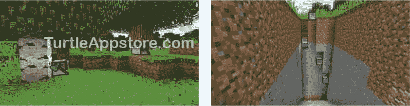

# 介绍

> 原文：<https://turtleappstore.com/book/introduction.html>


“再来三颗钻石，然后我就停下来，”我记得在玩《《我的世界》》时对自己说。我需要钻石来做新的鹤嘴锄。我需要鹤嘴锄来开采更多的黑曜石。我需要黑曜石来建造一个虚空之门。我需要去虚空去捡熔岩。我需要熔岩。。。我要熔岩做什么？哦，对了。我在山边雕刻一个巨大的凤凰雕像，我想让熔岩从它的眼睛和嘴中流出。两个小时后，我仍然在玩，无法将自己从手头的任务中解脱出来。

《我的世界》是一个令人上瘾的游戏。它已经售出超过 1.07 亿份，成为有史以来第二大最受欢迎的视频游戏，仅次于俄罗斯方块。这是一个开放式的、创造性的平台，用于收集资源和构建任何你能想象的东西。你可以建造城堡来抵御僵尸群，种植作物和照顾动物，或者与朋友合作建造大型艺术作品。《我的世界》吸引了各种各样的人:儿童，青少年，甚至成年人都喜欢玩它。

在本书中，你将使用 ComputerCraft mod(也称为 CC)把你对建筑的嗜好变成对编码的嗜好。但是到底什么是计算机工艺——或者说是一个 mod？

### **什么是 MINECRAFT MODS？**

《我的世界》本身被称为香草《我的世界》，这仅仅是个开始。《我的世界》可以通过名为 *mods* (简称*修改*)的第三方软件进行修改和扩展，以提供普通版本游戏中不包含的额外功能，如街区、环境、物品、怪物甚至世界。由于其受欢迎程度，《我的世界》吸引了最大的视频游戏改装社区之一。

这些粉丝自制的 mod 都是免费下载的。有些 mod 增加了太空探索和火箭。其他人添加巫术和咒语。你甚至可以找到 Minecraft mods 来创建你自己的恐龙动物园、高速列车网络和蜜蜂繁殖蜂场。在本书中，我们将使用 ComputerCraft mod 来学习如何编程。

### 什么是 COMPUTERCRAFT？

ComputerCraft 是一个《我的世界》mod，给《我的世界》增加了可编程的海龟。这些乌龟几乎可以做玩家能做的任何事情:挖矿、砍树、建造建筑、制作物品、播种、产奶牛、烤蛋糕等等(见[图 1](#calibre_link-564) )。一大群这种盒子形状的乌龟可以自动完成玩家通常必须手动完成的所有耗时的杂务。



*图 1:乌龟砍树(左)和采矿(右)*

问题是你必须先学会编程。这些海龟理解用 Lua ( *moon* 葡萄牙语)编写的代码，Lua 是一种编程语言，由嵌入式计算系统和视频游戏开发等领域的专业软件开发人员使用。运行 Lua 脚本的解释软件只有 100KB，这意味着它可以很容易地嵌入到其他软件中，比如《我的世界》mod。Lua 经常在视频游戏代码中使用——例如，在*魔兽世界*、*黑暗之魂*、*传送门 2* 、*工厂*以及其他许多游戏中。

虽然 Lua 比其他编程语言简单，但它仍然快速而强大。这些品质对你有利。Lua 的简单性使得如果你没有编程经验，它是一种很好的语言。

### **如何使用这本书**

> **《我的世界》1.16 安装说明更新**
> 
> 书中的说明仅适用于《我的世界》1.8 版本。不是用 ATLauncher 程序来给《我的世界》添加 ComputerCraft mod，当前版本的《我的世界》使用 Forge。在这篇博客文章中可以找到更新的说明，[为《我的世界》1.16(和更高版本)安装 computer craft Mod](https://inventwithpython.com/blog/2020/12/24/installing-the-computercraft-mod-for-minecraft-116-and-later/)，以及[安装 Forge 和 Mod 的视频在 YouTube 上](https://www.youtube.com/watch?v=6-hyqrwBEq0)..

要使用这本书，你需要购买一份《我的世界》的 Windows 或 macOS 版本，免费的 ComputerCraft mod 和免费的 ATLauncher 软件。有关所有下载和安装说明，请参见第 1 章。

当键入本书中的源代码时，不要在每行的开头键入行号。例如，如果您看到下面一行代码，您不需要在左侧键入`9.`或紧接其后的一个空格:

```turtle
9\. print('What is your name?')
```

您只需输入以下内容:

```turtle
print('What is your name?')
```

这些数字只是为了让本书能够引用程序中的特定行。它们不是实际程序源代码的一部分。

有时候你还会在代码中看到一个没有编号的`...` snip `...`行。这表明为了简洁起见，省略了一些代码。`...` snip `...`不是代码本身的一部分。

### 这本书里有什么？

前几章介绍了基本的编程概念，之后，本书的每一章都集中在如何编写一个程序，让你的海龟可以运行，帮助你在《我的世界》生存和发展。您还会发现有助于测试编程技能的额外活动。

以下是您在每一章中会发现的内容:

*   **[第 1 章](#calibre_link-6):计算机工艺入门**帮助你安装和设置《我的世界》和计算机工艺模块，这样你就可以开始编程了。
*   **[第二章](#calibre_link-10):编程基础**向你介绍基本的编程概念和交互式 shell。
*   **[第三章](#calibre_link-18):与你的海龟交谈**介绍了文件编辑器，你将使用它来编写你的第一个程序。
*   第四章:让海龟跳舞向你展示了如何编写一个程序让海龟在《我的世界》世界里移动。
*   **[第五章](#calibre_link-13):成为更好的舞者**在前一章的舞蹈节目上增加了一些新的编程指令。
*   **[第六章](#calibre_link-47):编程一个机器人伐木工**有一个程序可以让一只乌龟砍倒一棵树并收集它的木头。
*   **[第七章](#calibre_link-49):创建模块重用你的代码**教你如何一次编写代码，并与多个程序共享。
*   **[第八章](#calibre_link-35):经营一个自动化的林场**扩展了第六章中[的程序，创建一个全自动化的林场，这样你的海龟就可以从多棵树上收获木材了。](#calibre_link-47)
*   **[第 9 章](#calibre_link-57):建造一个鹅卵石发电机**有一个开采无限量鹅卵石的程序，海龟们会用这些石头作为[第 10 章](#calibre_link-62)到[第 13 章](#calibre_link-100)的建筑材料。
*   **[第 10 章](#calibre_link-62):制作石砖工厂**有一个将[第 9 章](#calibre_link-57)的鹅卵石变成石砖的项目。
*   **[第十一章](#calibre_link-80):筑墙**包括一个用石砖砌墙的程序。
*   第 12 章:建造房间包含了一个让你将墙壁连接起来建造房间的程序。
*   第十三章:建造地板有一个为你的房间建造地板和天花板的程序。
*   第十四章:给机器人农场编程有一个程序可以让海龟种植和收获不同种类的作物，这样你就可以养活自己了。
*   第 15 章:编程一个楼梯矿工有一个程序可以在地下挖楼梯来开采矿石和其他有价值的区块。
*   **[功能参考](#calibre_link-541)** 列出并解释了如何使用本书中的所有功能。
*   **[名称 ID 引用](#calibre_link-558)** 列出了常用的《我的世界》块和项目以及它们的名称 ID，您将使用它们来标识程序中的块类型和其他项目。

### **获得帮助**

众所周知，《我的世界》缺乏新手指南。它没有说明书，甚至没有帮助菜单。《我的世界》强迫你对自己的教育负责。你需要做在线研究，形成问题，找到答案，有时只是做一些简单的老实验。《我的世界》培养球员的成长心态。即使在跌入熔岩或他们的基地被爬山虎炸毁后，玩家回来后决心学习如何克服这些问题。

然而，这本书是关于计算机工艺的，而不是玩《我的世界》的基础。要使用这本书，你应该已经知道如何在《我的世界》做以下事情:

*   开采矿石、石头、煤、木材和其他石块
*   制作一个工作台和工具，比如斧子、铲子、火把和鹤嘴锄
*   制造一个炉子，给它加燃料，然后在里面熔化矿石块或煮肉
*   制作楼梯、梯子、箱子、门、栅栏和其他用于建筑的部件
*   植物种子和农场食物

如果你不知道如何做所有这些事情，不要担心。可以通过网上搜索自学。进入你选择的搜索引擎，输入单词 *minecraft* 以及你想学的内容。例如，你可以使用搜索词 *minecraft 冶炼矿石*、 *minecraft 烘焙蛋糕*，甚至仅仅是 *minecraft 基础教程*来找到你需要的信息。你也可以在*[【https://www.youtube.com/】](https://www.youtube.com/)*等网站上搜索《我的世界》视频教程，使用的搜索术语与你在搜索引擎中使用的相同。

正如我之前提到的，因为《计算机工艺》和《《我的世界》》不是由同一批人制作的，大多数《我的世界》网站不会有关于 CC 的信息。你可以在从 ComputerCraft Wiki 了解 CC。如果你对 CC 有任何疑问，你可以在 http://www.computercraft.info/forums2/的 ComputerCraft 论坛上注册一个免费账户。如果您对本书中的程序有其他问题，您可以在*[https://www.reddit.com/r/turtleappstore/](https://www.reddit.com/r/turtleappstore/)*的社区中发布这些问题。

### **在线资源**

您可以直接从《我的世界》游戏内部下载本书中的所有程序(参见[第 42](#calibre_link-5) 页的[在线共享和下载程序](#calibre_link-4))。而且，虽然《我的世界》不支持从游戏外复制粘贴文字，但这本书的所有代码和资源都可以在它的伙伴网站【https://www.nostarch.com/codingwithminecraft/】上参考到。在那里，你也可以下载奖金活动的代码，如果你卡住了，想看看解决方案！您还可以找到安装文件的链接(详细的安装说明见[第 1 章](#calibre_link-6))。如果你想探索其他程序或分享你的代码，你可以通过*[https://turtleappstore.com/](https://turtleappstore.com/)*来实现，这是一个免费的 ComputerCraft 脚本网站(详见[第 44 页](#calibre_link-166)上的[turtleappstore.com](http://turtleappstore.com))。

### **你学到了什么**

《我的世界》是一种游戏现象，可以用多种方式玩，吸引了不同人群的玩家。在这本书里，你将学习如何使用 ComputerCraft 在更短的时间内构建更多，computer craft 是一个让你用 Lua 编程语言编写海龟程序的 mod。通过学习使用 Lua 和 CC 编程，您可以自动化许多原本需要自己完成的工作，包括采矿、农业、建筑和手工艺。

使用《我的世界》和 ComputerCraft，您将独立解决问题，并在此过程中学习基本的计算机编程技能。

我们开始吧！