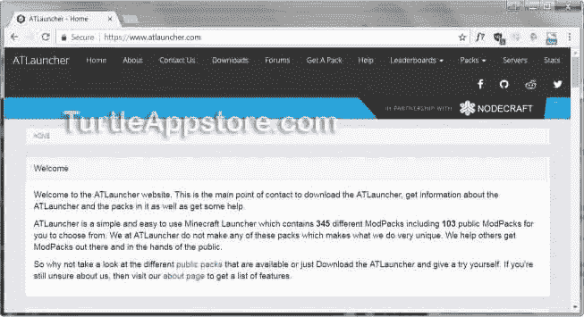
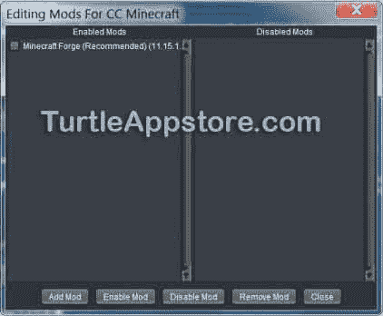
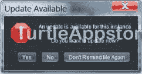
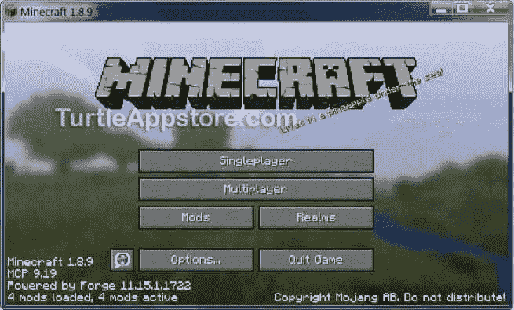
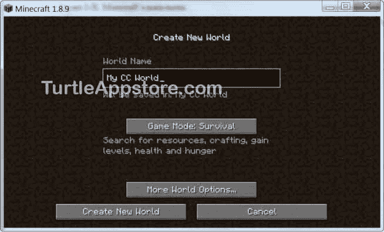
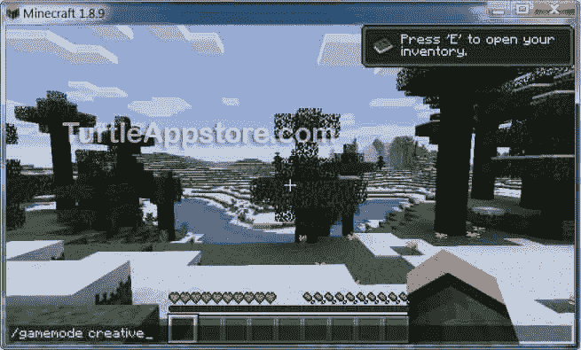

# COMPUTERCRAFT 入门

> 原文：<https://turtleappstore.com/book/chapter1.html>

在你开始给机器海龟编程来执行你的命令之前，你需要安装并设置《我的世界》和电脑模型。幸运的是，免费的 ATLauncher 软件让这个过程变得不那么痛苦。在这一章中，我将向你展示如何获得《我的世界》和 ComputerCraft mod，然后我将引导你在开始编程之前完成所有的配置步骤。

### **安装 MINECRAFT、ATLAUNCHER 和 COMPUTERCRAFT**

> **《我的世界》1.16 安装说明更新**
> 
> 书中的说明仅适用于《我的世界》1.8 版本。不是用 ATLauncher 程序来给《我的世界》添加 ComputerCraft mod，当前版本的《我的世界》使用 Forge。在这篇博客文章中可以找到更新的说明，[为《我的世界》1.16(和更高版本)安装 computer craft Mod](https://inventwithpython.com/blog/2020/12/24/installing-the-computercraft-mod-for-minecraft-116-and-later/)，以及[安装 Forge 和 Mod 的视频在 YouTube 上](https://www.youtube.com/watch?v=6-hyqrwBEq0)..

配置《我的世界》的 mods 曾经很棘手，因为它涉及一系列复杂的步骤。然而，你现在可以使用 ATLauncher 软件更容易地将 mods 加载到《我的世界》。因为《我的世界》、ATLauncher 和 ComputerCraft 是由不同的团队创建的，你需要分别下载和安装每个程序。这三款游戏都可以在 Windows、macOS 和 Ubuntu 操作系统上使用，但 ComputerCraft mod 不能在《我的世界》的移动、Xbox 或 PlayStation 平台上使用。

Mods 只适用于《我的世界》的 Java 版，也就是《我的世界》的 Windows 版。《我的世界》的 Windows 10 版本不支持 mods，尽管它支持一种新形式的 mods，称为*插件*。但是不用担心！我们将使用名为 ATLauncher 的软件下载并安装《我的世界》的正确版本。

#### **在线购买 MINECRAFT】**

虽然 ATLauncher 和 ComputerCraft 是免费的，但《我的世界》是由 Mojang(现归微软所有)出售的。您可以在创建免费的 Mojang 帐户后，在 https://www.minecraft.net/的在线购买。完成此次购买后，不要从该网站下载《我的世界》。相反，你将使用 ATLauncher 软件下载并安装《我的世界》到你的电脑上。(如果你已经安装了《我的世界》，你仍然应该按照说明用 ATLauncher 安装《我的世界》。)

**注**

*确保您的 Mojang 帐户密码安全保密。不要分享给朋友或者自称是 Mojang 员工的人。仅用于登录 ATLauncher 软件或 https://www.minecraft.net/*的* [网站，不得登录其他网站。如果您认为其他人可能正在登录您的帐户，请立即更改您的密码。](https://www.minecraft.net/)*

#### **下载并安装 ATLAUNCHER**

ATLauncher 软件可以很容易地将 mod 添加到《我的世界》。[图 1-1](#calibre_link-567) 展示了如何在 https://www.atlauncher.com/T3*T5【免费下载】。点击页面顶部的**下载**链接，找到安装帮助视频。按照视频中的步骤下载并安装 ATLauncher。该视频也可以在 YouTube 上的*[https://youtu.be/gTf7rRCwMcI/](https://youtu.be/gTf7rRCwMcI/)*获得。*

*图 1-1:ATLauncher 网站，你可以在这里下载软件*

安装 ATLauncher 后，运行它，点击右侧的**账户**标签。填写您的 Mojang 帐户的用户名和密码。您可以选择**记住密码**，这样您就不必每次运行《我的世界》时都输入这些信息。

要连接到《我的世界》服务器，您必须安装与服务器相同的 mod(以及每个 mod 的版本)。因为如此多的模块组合是可能的，粉丝们已经创建了由一组标准化模块组成的模块包。我们现在将下载一个“普通”的 modpack(也就是一个 modpack，mod 很少)，接下来我们将添加 ComputerCraft mod。点击**包**并找到香草《我的世界》模块包。你将把计算机工艺加入到这个版本的《我的世界》中。

点击香草《我的世界》模块包的**新实例**按钮。一个*实例*是在你的计算机上安装一个特定的 modpack。在出现的窗口中，将实例命名为类似于 **CC《我的世界》**的名称。*请务必选择* ***1.8.9(《我的世界》1.8.9)*** *作为要安装的版本，因为这是目前 ComputerCraft 支持的最新版本*。保持启用用户锁定未选中。启用用户锁意味着只有您登录的 Windows、macOS 或 Linux 用户才能访问该实例。

**注**

ComputerCraft 的未来版本可能与《我的世界》的新版本兼容。在这种情况下，最新的安装说明将在*提供。*

在出现的选择要安装的模块窗口中，仅选择**《我的世界》锻造(推荐)**旁边的框，然后点击**安装**。《计算机工艺》需要《我的世界》锻模。

**在服务器上使用 MOD**

当你第一次玩《我的世界》时，我推荐你在单人模式下玩。但是如果你想连接一个公共的多人游戏服务器，你的实例需要和服务器有相同的 mods。大多数公共服务器不会只安装了 ComputerCraft mod，所以你需要安装一个 modpack 实例，而不是从 Packs 标签中的 Vanilla《我的世界》。包括 ComputerCraft 在内的流行 modpacks 有《共振崛起》、《天空工厂 2》、《太空天文学》、《金色鹅卵石》和《瑜伽修炼全集》。(我最喜欢的是共振崛起。)你也可以在 ATLauncher 的 packs 选项卡上浏览 modpacks 列表，点击**查看 Mods** 按钮查看是否包含 ComputerCraft。如果您使用这些 modpacks 中的一个，您可以跳过第 4 页的[上的“](#calibre_link-236)[下载和安装 ComputerCraft](#calibre_link-340) 中的说明，因为正确版本的 ComputerCraft 和《我的世界》会自动随该软件包一起安装。modpack 有版本号，所以当你在公共服务器上玩的时候，你需要安装服务器使用的相同版本的 modpack。

要找到这些 modpack 的公共服务器，请在网上搜索< *modpack 名称>公共服务器*或前往*[https://www.atlauncher.com/](https://www.atlauncher.com/)*并点击顶部的**服务器**链接。

安装完成后，你可以通过选择 ATLauncher 窗口右侧的**实例**选项卡找到你的《我的世界》实例。这个实例是为香草《我的世界》，所以你必须手动下载并安装计算机。

#### **下载并安装 COMPUTERCRAFT**

这一节告诉你如何下载和安装 ComputerCraft mod。还有一个视频展示了如何在*[【https://youtu.be/g4Zs2JY1vi8/】](https://youtu.be/g4Zs2JY1vi8/)*安装 ComputerCraft。你可以在 http://www.computercraft.info/download/的 *[下载 ComputerCraft mod。点击**下载 ComputerCraft 1.79(适用于《我的世界》1.8.9)** 链接，下载文件 *ComputerCraft1.79.jar* 。该文件在](http://www.computercraft.info/download/)*[https://www.nostarch.com/codingwithminecraft/](https://www.nostarch.com/codingwithminecraft/)*也有。*

我喜欢把这个文件放在 ATLauncher 的文件夹里，这样很容易找到。在 ATLauncher 的实例选项卡上，点击普通《我的世界》实例旁边的**编辑模块**按钮。你会看到 CC《我的世界》窗口的编辑 Mods，如图[图 1-2](#calibre_link-568) 所示，目前只安装并启用了《我的世界》锻造(推荐)mod。

*图 1-2:CC《我的世界》窗口的编辑模块*

点击**添加 Mod** 按钮，在出现的窗口中点击**选择**按钮，找到您下载的 *ComputerCraft1.79.jar* 文件。在 Mod 类型旁边，从下拉菜单中选择 Minecraft.jar 内的**。然后点击**添加**按钮。**

 ***ComputerCraft1.79.jar* 文件会出现在右侧的 Disabled Mods 下。这个 mod 现在已经安装到您的《我的世界》实例中，但是您必须启用它才能使用它。选中 **ComputerCraft1.79.jar** 旁边的复选框，然后点击窗口底部的 **Enable Mod** 按钮。计算机工艺模块将移动到窗口左侧的已启用模块下。点击**关闭**按钮完成该过程。

返回“实例”标签，点击《我的世界》实例旁边的 **Play** 按钮启动游戏。第一次点击**播放**，会出现一个窗口告诉你有更新了，如图[图 1-3](#calibre_link-569) 所示。点击**不要再提醒我**按钮拒绝更新，以后隐藏此窗口。

*图 1-3:更新可用窗口*

如果您意外地单击“是”并更新实例，ComputerCraft mod 可能无法正常工作。您必须删除实例，并再次重复所有的实例和模块添加步骤。

**配置 COMPUTERCRAFT**

ComputerCraft 有一些可配置的设置存储在一个名为 *ComputerCraft.cfg* 的文本文件中。一般来说，您不需要修改这个文件，本书假设您使用的是默认配置。大多数公共多人《我的世界》服务器也使用默认配置。但是，如果您出于某种原因想要更改 CC 的设置，您需要知道配置文件的位置。

您将在您的计算机上安装 ATLauncher 的同一子文件夹下找到该文件。在我的 Windows 电脑上，我已经在 *C:\ATLauncher* 文件夹中安装了 ATLauncher，所以配置文件位于*C:\ at launcher \ Instances \ CCMinecraft \ config \ computer craft . CFG*中。在文本编辑器中打开该文件，如记事本或 TextMate。文件中描述了这些设置，您可以通过在等号( = )后输入新值来更改它们。

### **运行 MINECRAFT**

运行 ATLauncher 后点击**播放**按钮，《我的世界》主菜单出现，如图[图 1-4](#calibre_link-570) 所示。

*图 1-4:矿用工艺主菜单*

点击**单人游戏**按钮，你将会看到你制作的《我的世界》世界列表。如果这是你第一次运行《我的世界》，你需要创建一个世界。

#### **创造新世界**

《我的世界》没有一套标准的水平。相反，游戏世界是随机生成的，总是给你提供一个新的、未知的领域去探索。在单人游戏菜单中，点击**创建新世界**按钮，会出现创建新世界菜单，如图[图 1-5](#calibre_link-571) 所示。在**世界名称**文本框中输入名称我的 CC 世界。然后点击**游戏模式**按钮，直到显示游戏模式:生存。(你也可以在玩游戏时切换模式。)

*图 1-5:创建新世界菜单*

点击**更多世界选项…** 按钮，然后点击**允许作弊**按钮，直到显示允许作弊:开。作弊将允许你在生存和创新游戏模式之间切换，这将在下面解释。要生成新世界，点击**创建新世界**按钮。

#### **MINECRAFT 游戏模式差异**

《我的世界》有三种模式可以玩:创意，生存和硬核。

在*创意*模式下，可以飞，不需要吃饭，不能死，并且会无限量供应所有区块。如果你只是想用《我的世界》积木建造建筑，比如城堡或巨型艺术品，这种模式是理想的。

在*生存*模式中，事情变得真实。你需要找到食物来防止自己挨饿。你唯一能用来建造的积木是你自己开采的。你不能飞，如果你掉下悬崖，你会受到伤害甚至死亡。晚上，怪物出来了。

因为你在创建世界时设置了允许作弊选项，你可以使用`/gamemode`命令在生存模式和创造模式之间切换。要改变游戏模式，按 T 键打开聊天窗口，进入/游戏模式创意或/游戏模式生存，如图[图 1-6](#calibre_link-572) 所示。

*图 1-6:进入聊天窗口*/游戏模式创意 *命令*

我认为在生存模式下玩让游戏更有挑战性和趣味性。资源是有限的，你必须为你的街区工作。生存模式也是 ComputerCraft 的闪光点。通过给海龟编程来帮助你自动完成无聊的杂务，你可以让自己吃饱、安全、储备充足，同时还能抵御恶劣天气。

不用担心在生存模式下会死掉。当你死亡时，你会丢掉你携带的物品，回到你原来的产卵点，但是你可以继续玩。

*硬核*模式和生存模式差不多，但是你得到一条命，而且只有一条命。死了之后一定要删除游戏世界。ComputerCraft 也可以在硬核模式下工作，但我建议现在坚持使用生存模式。

### **你学到了什么**

现在，您已经完成了使用这本书所需的所有设置步骤。你下载并安装了《我的世界》、阿特兰彻和电脑工艺模块。如前所述，ATLauncher 和 ComputerCraft 是免费的。《我的世界》不是。

《我的世界》是如此之大，有这么多的模块，它需要一点设置才能运行。但是现在你已经准备好玩了，你也准备好开始学习编码了，所以让我们写一些代码吧！**