# 2 编程基础

> 原文：<https://turtleappstore.com/book/chapter2.html>


在这一章中，我们将探索制作《我的世界》机器人的基础知识，或称之为*海龟*。我们将创建我们的第一只海龟，并给它命名。然后我们会给它加满油，并尝试一些编程指令！您还将学习一些基本的编程概念，以及如何在《我的世界》练习编码。

### **海龟入门**

创建于 20 世纪 60 年代的 Logo 编程语言引入了可编程海龟。在 Logo 中，乌龟是屏幕上的点，你可以通过编程来移动和画线，创造出令人惊叹的图案。使用 Logo，你可以一边学习编程，一边用你的电脑创作艺术！[图 2-1](#calibre_link-575) ，使用布赖森·佩恩(无淀粉出版社，2015)的*教你的孩子编码*中的程序制作，展示了一个用 Python 编程语言编写的标志风格艺术的例子。

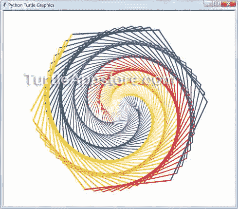

*图 2-1:彩龟艺术示例*

ComputerCraft 将同样的想法带到了《我的世界》世界，在那里，海龟是可以根据你编写的程序采矿和制作的机器人。[图 2-2](#calibre_link-576) 展示了这些块状乌龟机器人(也叫*机器人*)的样子。

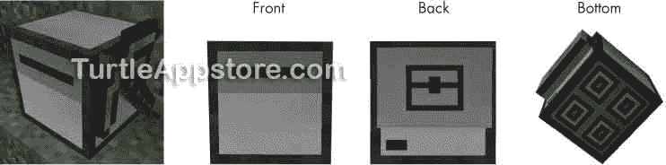

*图 2-2:一只配有鹤嘴锄的乌龟(左)和从不同角度看乌龟的样子*

这些四四方方的机器人可能看起来不怎么样，但它们有很大的潜力。乌龟可以向各个方向移动。他们可以盘旋，在水下生存，携带物品，并通过熔岩移动。一旦你掌握了一些编程技巧，你的海龟就会在你的指挥下完成复杂的任务。

#### **制作一只采矿龟**

当你处于创造模式时，你可以像其他物品一样生出一只乌龟。你可以通过按 E 打开你的目录，点击指南针标签，然后输入 turtle 找到所有不同种类的乌龟，如图[图 2-3](#calibre_link-577) 所示。这本书用灰色的*基础海龟*代替金色的*高级海龟*，但它们的工作原理相似。

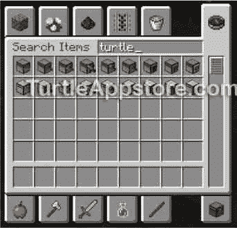

*图 2-3:在创意模式下产卵的乌龟*

**注**

*要切换到创意模式，按 T 或/键调出聊天/命令窗口；然后输入* /gamemode 创意 *按<small class="calibre12">进入</small>。要切换到生存模式，按 T 或/键并输入*/game mode Survival*。*

但是我们想在生存模式下使用海龟，我们需要从头开始制作海龟(以及其他东西)。下面是怎么做的。

1.  制作一台电脑。制作乌龟的食谱需要一台电脑，所以在我们制作乌龟之前，我们必须用石头、红石和一块玻璃制作一台电脑。(如果你不知道如何制作石头或玻璃窗格，或者不知道在哪里可以找到红石，打开网络浏览器，进入搜索引擎网站，输入“minecraft find redstone”或“craft glass pane”。)要制作一台电脑，我们将遵循[图 2-4](#calibre_link-578) 中的配方。

    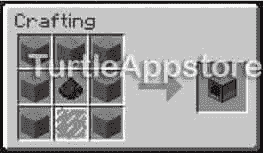

    *图 2-4:用七块石头、一块红石和一块玻璃制作一台电脑*

2.  用电脑制作一只乌龟。我们不会费心将计算机放置在世界中，因为我们不会在本书中使用它。我们只是需要它作为海龟食谱中的一个工艺品。我们将使用电脑、一些铁和一个箱子来制作一只基本的乌龟，如图 2-5 中[的食谱所示。](#calibre_link-579)

    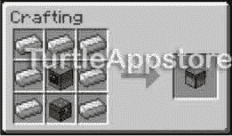

    *图 2-5:用七个铁块、一个箱子和一台电脑制作一只乌龟*

3.  **给乌龟装备工具！**到目前为止，我们只有一只基本的海龟。它可以四处移动，但在我们给它工具之前，它不能采矿、挖掘或做其他事情。我们可以给海龟配备钻石镐、铲子、斧子、锄头或剑。这些工具必须是全新的钻石工具*和*。有磨损的铁工具或金刚石工具是行不通的。我们也可以给海龟配备手工桌。

对于我们的第一只乌龟，让我们按照[图 2-6](#calibre_link-580) 中的食谱，用一把钻石镐来制作一只采矿龟。

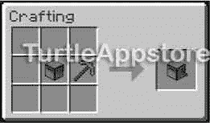

*图 2-6:用一只乌龟和一把钻石镐制作一只采矿龟*

#### **在 TURTLE GUI 中运行程序**

要使用乌龟，右键单击将其放置在世界中，就像放置任何其他方块一样。然后，右键单击 turtle 打开它的*图形用户界面(GUI)* ，在这里您将对 turtle 进行编程并管理它的库存。请记住，当您查看 GUI 时，《我的世界》不会暂停，所以您需要小心，在您输入命令时，怪物不会偷偷溜到您身后。[图 2-7](#calibre_link-581) 显示了海龟的图形用户界面。

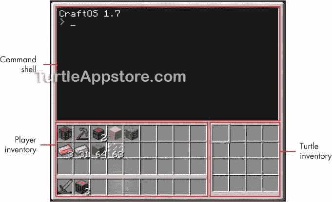

*图 2-7:乌龟的 GUI*

GUI 由你的清单、海龟的清单和*命令外壳*组成，这是你写程序和输入命令的地方。(奇怪的是，术语*壳*和*龟*只是一个巧合。)您可以在一个库存槽中存储多个相同的物品，以创建一个*物品堆*。对于大多数项目，您可以在一个插槽中堆叠多达 64 个项目。海龟有 16 个存货格，你可以很容易地在你的存货格和海龟的存货格之间拖动物品。

海龟们预装了一些程序，包括`label`、`dance`、`refuel`、`go`和`lua`。我们应该首先用`label`程序给我们的乌龟命名。在这本书里，我用四位意大利文艺复兴时期画家的名字给海龟命名:Sofonisba，Lavinia，Artemisia 和 Elisabetta。您可以使用这些名称或选择不同的名称。

右键单击海龟以打开 GUI，并通过在命令 shell 中输入标签来运行`label`程序，后面是设置海龟名称的单词，在本例中是 set Sofonisba 。然后按<small class="calibre12">键进入</small>:

```turtle
> label set Sofonisba
Computer label set to "Sofonisba"
```

单词`set Sofonisba`被称为*命令行参数*，它们告诉`label`程序要做什么。总的来说，`label`程序和`set Sofonisba`命令行参数组成了一个*命令*供海龟执行。

代码开头的`>`符号称为*提示*。我们在提示符下输入命令，当海龟执行完命令后，会出现一个新的`>`提示符，等待我们的下一个命令。

**警告**

你可以用鹤嘴锄把乌龟挖出来放在你的物品栏里，但只有在你给它贴上标签后才能这样做。否则，它将失去所有的燃料，并清除所有的程序。(燃料将在下一节介绍。)挖掘一只海龟也会导致它的库存下降，就像挖掘一个箱子一样。

现在`label`程序已经将海龟的名字设置为 Sofonisba，运行`dance`命令启动另一个预加载程序:

```turtle
> dance
Preparing to get down...
Press any key to stop the groove
```

按下 <small class="calibre12">ESC</small> 关闭乌龟 GUI。你会看到当`dance`程序运行时，海龟机器人随机旋转。右键单击海龟，再次打开海龟 GUI。`dance`程序仍在运行，但它被编程为当您按下任何键时停止。你也可以在 GUI 打开时按住 <small class="calibre12">CTRL</small> -T 一秒钟来停止任何程序。

**跳舞，跳舞，海龟:重新运行命令**

如果要运行以前运行过的程序，可以使用快捷方式。当您按下向上和向下箭头键时，命令外壳将显示您以前运行的程序。例如，您已经输入了`dance`命令:

```turtle
> dance
```

如果想再次运行`dance`程序，就不必再次输入`dance`命令；只需按向上箭头键，命令 shell 将使用最后一个写入的命令填充自己。如果您再次按下向上箭头，命令 shell 将继续返回到您的*命令历史*中，从最近输入的命令开始查找您之前输入的命令。这也适用于 Lua shell，这在第 17 页的[的](#calibre_link-158)[Lua 编程入门](#calibre_link-350)中有所描述。

#### **给乌龟加油**

乌龟可以向前、向后、向上或向下移动(它们还会飞！).但是为了移动，他们需要燃料。你可以在炉子里燃烧的任何物品都可以作为燃料消耗，一个单位的燃料可以让乌龟移动一个街区。表 2-1 显示了每个项目提供多少单位的燃料。

**表 2-1:** 龟燃料来源

| **项目** | **项目名称** | **燃料单位** |
| --- | --- | --- |
|  | 粘贴 | five |
|  | 木制工具(鹤嘴锄、铲子等) | Ten |
|  | 木 | Fifteen |
|  | 政纲条目 | Fifteen |
|  | 煤或木炭 | Eighty |
|  | 火焰棒 | One hundred and twenty |
|  | 煤柱 | eight hundred |
|  | 熔岩桶 | One thousand |

提供最多燃料的物品是一桶熔岩。注意木头和木板都提供 15 个燃料单位。你可以把一个木块加工成四块木板，所以如果你把木块加工成木板再用作燃料，你可以得到四倍的燃料。总的来说，用煤或木炭通常是给你的海龟提供燃料的最简单的方法。煤提供 80 个燃料单位，但煤块提供 800 个单位。因为加工一个煤块只需要九种煤，所以在加燃料之前把煤加工成煤块更有效率。火焰棒很稀有(只有在虚空中被击败的火焰怪才会丢下它们),而且不会给你太多燃料，所以你应该把它们留着做手工。

一只普通的海龟可以储存 20，000 单位的燃料。只有*移动*使用燃油。你不需要燃料来转动、采矿、制作、挖掘，以及做海龟做的其他事情。在空中盘旋也不需要燃料；就像在地面上一样。

要燃烧一个物品作为燃料，它必须在乌龟的库存中并且在*选择的槽*中，槽的周围有一个粗边框，如图[图 2-8](#calibre_link-583) 所示。

当你在选定的插槽中有一个项目要刻录时，运行`refuel`程序。如果你有一个以上的物品可以燃烧作为燃料，在`refuel`之后输入你想要燃烧的物品数量。


*图 2-8:乌龟清单中当前选中的槽的边框比其他槽的边框要厚。*

例如，在命令 shell 中输入以下内容:

```turtle
> refuel 64
Fuel level is 5120
```

该命令将运行`refuel`程序，并在当前选择的插槽中刻录多达 64 个项目。产生的燃料单位数量取决于槽中物品的类型。要知道海龟有多少燃料，只需运行`refuel 0`:

```turtle
> refuel 0
Fuel level is 5120
```

这个命令将显示海龟有多少燃料，而不消耗库存中的任何燃料。

**警告**

如果你在给乌龟贴标签之前，用鹤嘴锄挖了一只乌龟放在你的库存里，它会失去所有的燃料。一定要先运行 标签 *程序给它一个标签。*

#### **移动乌龟**

现在乌龟已经加满油了，让我们移动它。从命令 shell 中，我们可以运行`go`程序来告诉它向前和向后移动。在命令 shell 中输入以下内容:

```turtle
> go forward
```

当你按下 <small class="calibre12">ESC</small> 关闭 GUI 时，乌龟将会向前移动一格。注意，如果乌龟前面有一个障碍物挡住了它的路，乌龟会一直等到它被清除。如果你想终止程序，按住 <small class="calibre12">CTRL</small> -T 整整一秒钟。

要让海龟后退，输入以下命令:

```turtle
> go back
```

乌龟将后退一格。在`forward`或`back`后输入一个数字，将乌龟移动该数量的空格，如下例所示:

```turtle
> go forward 2
```

乌龟会向前移动两格。

翻龟也差不多。输入单词`left`或`right`后面跟一个数字，让乌龟向左或向右转那个次数。例如，`go left`会让乌龟把脸转向左边。输入`go right 2`将使乌龟向右转两次，因此它面向相反的方向。

我们甚至可以将多个动作链接在一起，如下例所示:

```turtle
> go forward 2 up right forward down back 3 left
```

乌龟会往前走两格，往上走一格，右转，往前走一格，往下走一格，往后走三格，然后左转。

对于`go`程序，你可以使用几个快捷词:`fd`代表`forward`，`bk`代表`back`，`lt`代表`left`，`rt`代表`right`，`dn`代表`down`。在命令 shell 中输入以下示例:

```turtle
> go fd 2 up rt fd dn bk 3 lt
```

这与上一个例子移动乌龟的方式相同，只是需要输入的内容少得多。

### **LUA 编程入门**

运行海龟们自带的程序是有用的，但是真正强大的是当你用 Lua 编程语言写自己的程序时。编程语言是一种你可以用来编写计算机可以理解的指令的语言。在这一点上，可能很难确定这些指令和编程字的用途，但请记住，它们只是您稍后将编写的有用程序的构建块。您将一次学习一个 Lua 指令。

#### **运行 LUA 外壳**

Lua 有一个 *Lua shell* ，它允许你在海龟的 GUI 中输入和运行 Lua 指令。你需要运行`lua`程序来访问它:

```turtle
> lua
Interactive Lua prompt.
Call exit() to exit.
lua>
```

该命令打开 Lua 外壳，如图 2-9 所示，这是你输入 Lua 指令的地方。Lua shell 可以方便地查看每条指令做了什么，因为您可以一次输入一条指令，这样可以节省很多工作。

**注**

在本书中，Lua shell 是你输入 Lua 代码的地方。它在你用 lua 语言输入指令的每一行的前面显示 lua > *提示符。命令外壳是您输入命令来运行程序的地方。它有更简单的* > *提示。这两者很容易混淆。如果在运行代码时收到错误消息，请仔细检查您使用的是哪个提示符。*

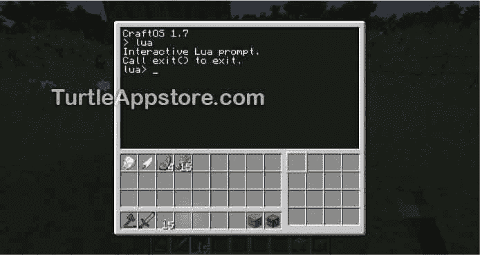

*图 2-9:海龟 GUI 中的 Lua 外壳*

让我们从一个简单的指令开始，告诉一只乌龟向左转。在 Lua shell 中输入以下指令:

```turtle
lua> turtle.turnLeft()
true
```

当您键入时，Lua 会自动填充它认为您正在键入的指令。您可以按下<small class="calibre12">键</small>来使用自动完成建议并节省时间。在[图 2-10](#calibre_link-585) 中，我已经输入了`turtle.tu`，自动补全提示了`turtle.turnLeft(`。按下<small class="calibre12">键</small>将填充`rnLeft(`高亮显示的部分，然后我可以输入剩余的`)`。

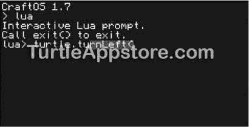

*图 2-10:输入* turtle.tu *时，自动完成提示* turtle.turnLeft( *)。*

你输入命令后出现的单词`true`被称为*返回值*，它让你知道海龟成功左转了。很多海龟指令如果能执行你的指令，会返回`true`，如果不能，会返回`false`。(`true`和`false`值被称为*布尔值*，在第 5 章的[中有解释。)](#calibre_link-13)

返回`true`后，再次出现`lua>`提示，等待您的下一个指令。按下 <small class="calibre12">ESC</small> 键，乌龟向左转，如图[图 2-11](#calibre_link-586) 所示。

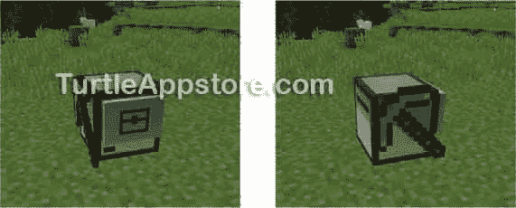

*图 2-11:乌龟跑前跑后* turtle.turnLeft()

右键单击海龟，再次打开海龟的 GUI，并在 Lua shell 中输入以下内容:

```turtle
lua> turtle.turnRight()
true
```

现在当你按下 <small class="calibre12">ESC</small> ，你会看到乌龟已经转向右边，正对着它原来的方向。`turtle.turnLeft()`和`turtle.turnRight()`指令是*功能*。在程序设计中，函数是程序中的一种小程序。函数包含一组执行一个小动作的指令。当一个函数作为 Lua 指令运行时，我们说我们正在*调用*这个函数。

`turtle.turnLeft()`和`turtle.turnRight()`功能在`turtle`模块中。一个*模块*是函数的集合。要调用`turtle`模块中的函数，您需要在函数名前键入带句点的`turtle`。`turtle`模块有很多功能，可以让乌龟移动、采矿、挖掘、放置石块，以及做其他任何事情。在这本书里，你会学到很多这些功能和模块！

#### **再见 LUA:退出 LUA 的提示**

注意，按下 <small class="calibre12">ESC</small> 将会退出 GUI，但是下一次右键单击海龟时，您仍然会在 Lua shell 中。您可以通过调用`exit()`函数退出 Lua shell 并返回到命令 shell 提示符。在 Lua shell 中输入以下内容:

```turtle
lua> exit()
>
```

在退出命令 shell 提示符后，您会看到`lua>`提示符已经被命令 shell 的`>`提示符所取代。

### **让 LUA 算算**

如果你认为你不擅长数学，不要担心——Lua 会为你做所有的数学工作！如果你给它正确的指令，Lua 可以像计算器一样解决数学问题。

返回 Lua 提示符，输入以下内容:

```turtle
lua> 2 + 2
4
```

我们称这些数学问题为*表达式*。表达式中的`2`称为*值*。具体来说，它们是数值。表达式中的`+`符号称为*运算符*。当你把这些值和操作符作为表达式给 Lua 时，Lua 会*把表达式*求值为单个值，这就是数学题的答案。表达式`2 + 2`的计算结果为`4`。

表达式中的间距无关紧要。您可以使用任意多或任意少的空格。在 Lua shell 中输入以下内容:

```turtle
lua> 3+4
7
lua> 3         +   4
7
```

尽管您可以使用任意多的空格，但大多数程序员会在值和操作符之间使用一个空格，以使他们的代码更容易阅读。

Lua 识别加法(`+`)、减法(`-`)、乘法(`*`)、除法(`/`)和求幂(`^`)的数学运算符。在 Lua shell 中输入以下内容，查看这些操作符的使用示例:

```turtle
lua> 100 + 1
101
lua> 10 – 4
6
lua> 7 * 5
35
lua> 21 / 3
7
lua> 3^2
9
```

尽管其中一些运算使用的符号与你在数学课上使用的不同，但它们的工作方式是一样的。

一个值本身也是一个表达式:它对自身求值。在命令 shell 中输入以下内容以查看示例:

```turtle
lua> 42
42
```

您可以看到值`42`本身计算为`42`。表达式总是评估为单个值，即使是像`42`这样的小表达式。

表达式可以是你喜欢的长度。在 Lua shell 中输入以下内容:

```turtle
lua> 1 + 2 + 3 + 4 + 5
15
```

这个表达式有五个值和四个操作符，但是 Lua 可以将它评估为单个值`15`。Lua 从左到右一步一步地计算表达式，但是你在你的计算机上看不到所有这些步骤。

**错误！错误！**

注意，对于乘法，Lua 使用星号`*`，而不是十字符号或字母`x`。如果你尝试使用`x`进行乘法运算，Lua 会显示一个错误:

```turtle
lua> 5 x 5
bios.lua:14: [string "lua"]:1:
unexpected symbol
```

一个错误仅仅意味着 Lua 不能理解你给它的指令。请确保您的指令输入正确，并再次输入。

编程错误信息可能会令人困惑。如果您不理解消息的含义，您可以将错误消息(例如示例中的“意外符号”)输入到搜索引擎中，以查找对它的解释。

#### **操作顺序**

决定表达式的哪些部分首先被求值的规则被称为运算顺序*。Lua 中的运算顺序和数学中的运算顺序是一样的。从左到右，首先执行括号中的操作，然后是`^`操作，然后是`*`和`/`操作，最后是`+`和`–`操作。在命令 shell 中输入以下内容:*

```turtle
lua> 2 + 3 * 4
14
```

表达式`2 + 3 * 4`计算结果为`14`而不是`20`，因为`3 * 4`首先计算结果为`12`，使得表达式`2 + 12`计算结果为`14`。

Lua 一步一步地计算这个表达式，如下所示:

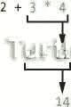

您可以使用括号来更改运算的顺序。在 Lua shell 中输入以下内容:

```turtle
lua> (2 + 3) * 4
20
```

现在`(2 + 3)`部分先求值为`5`，做表达式`5 * 4`，求值为`20`。Lua 对该表达式求值，如下所示:


#### **太随机了:生成随机数**

Lua 帮助你做数学的另一种方法是提供随机数。许多游戏和程序使用随机数(想想有多少棋盘游戏使用通过掷骰子产生的随机数)，所以有时你也需要为你的程序产生随机数。为此，您将使用`math.random()`函数，该函数在每次调用时返回一个随机数。注意，`random()`函数在`math`模块内部。在 Lua shell 中输入以下内容:

```turtle
lua> math.random(1, 6)
6
lua> math.random(1, 6)
1
lua> math.random(1, 6)
1
lua> math.random(1, 6)
3
lua> math.random(100, 200)
142
```

因为返回值是随机的，所以您的数字可能与本例中的数字不同。注意，当我们调用`random()`函数时，我们在括号中包含了两个数字。这些值是函数调用的参数。参数是给函数调用的值，告诉函数如何运行。当你将参数放入函数调用的括号中时，你是在*将参数*传递给函数调用。`random()`函数有两个参数:函数调用应该返回的最小和最大随机数。当您将`1`和`6`传递给函数调用时，返回值将始终在 1 和 6 之间。当你通过`100`和`200`的时候，返回值会在 100 到 200 之间。

每当你需要向你的程序添加一个随机元素时，你将使用`random()`函数。我们将在第四章的[中编写的`mydance`程序中这样做。](#calibre_link-14)

### **用变量存储数值**

要多次使用值，可以将它们存储在变量中。一个*变量*就像计算机内存中的一个盒子，你可以在里面存储一个单一的值(见[图 2-12](#calibre_link-587) )。要创建一个变量，您需要写下变量名，后跟一个等号(=)，然后是您想要存储在变量中的值。例如，如果你想跟踪你有多少煤，你可以使用指令`coal = 10`将值`10`存储在一个名为`coal`的变量中。(也许这个变量记录了海龟开采了多少煤。)这种指令叫做*赋值语句*，等号(`=`)叫做*赋值运算符*。

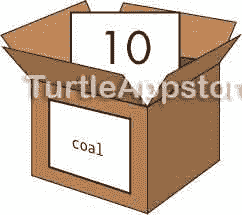

*图 2-12:指令* 煤= 10 *就像告诉程序，“变量* 煤 *现在有数值* 10 *在里面。”*

您可以在表达式中任何需要使用变量值的地方使用变量。例如，在 Lua shell 中输入以下内容:

```turtle
lua> coal = 10
lua> coal + 4
14
lua> coal + 10
20
lua> 12 – coal + 3
5
```

您在第一行将`coal`变量设置为`10`。这样做之后，只要使用`coal`，就会使用值`10`。

你也可以在赋值操作符的右边放一个表达式来给变量赋值。表达式计算的值随后存储在变量中。当`coal = 2 * 3 + 4`时，Lua 计算`coal`为值`10`，如下所示:

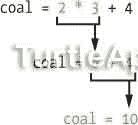

此外，就像一个值本身如何评估自身一样，您可以通过在 Lua shell 中输入变量名来查看变量中的值:

```turtle
lua> coal
10
```

我们之前给`coal`分配了数字`10`，所以当我们输入`coal`时，它的值为`10`。

让我们使用另一个赋值语句来改变存储在`coal`变量中的值。这叫做*覆盖*变量。在 Lua shell 中输入以下内容:

```turtle
lua> coal = 100
lua> 2 + coal + 3
105
lua> coal = 200
lua> 2 + coal + 3
205
```

变量一次只能存储一个值。当一个变量值被新值覆盖时，旧值被丢弃并被遗忘，如图[图 2-13](#calibre_link-588) 所示。


*图 2-13:*煤炭 *变量被值* 200 *覆盖，旧的* 100 *值被遗忘。*

一旦一个变量有了值，你可以在它自己的赋值语句中使用这个变量。使用名为`counter`的不同变量，在 Lua shell 中输入以下内容:

```turtle
➊ lua> counter = 0
   lua> counter
   0
➋ lua> counter = counter + 1
   lua> counter
➌ 1
➍ lua> counter = counter + 1
   lua> counter
   2
➎ lua> counter = counter + 100
   lua> counter
   102
```

你先给`counter`赋值`0` ➊ 的值，然后给`counter`赋值等于自身加上`1` ➋ 。结果是`counter`现在等于`1` ➌ 。您可以继续添加`1`到`counter` ➍ ，方法是按向上箭头显示之前的指令，就像您在命令 shell 中所做的一样。将`1`加到`counter`上可以让你使用`counter`进行向上计数。这种技术在你未来的程序中会很有用，例如，当你需要计算你运行一个命令的次数时。你可以任意多次重新分配`counter`，你甚至可以用`1`以外的值来修改它，比如`100` ➎ 。

变量对于存储计算结果或程序中以后要使用的其他数据很有用。你将编写的大多数程序(以及本书中的几乎每个程序)都使用变量。

**变量名**

变量名可以是任何名称，只要它们以字母或下划线开头，并且只由字母、数字和下划线组成。变量名通常描述它们存储的值，如`fuelPercentage`、`spaceLeft`或`coal`。变量名*区分大小写*，这意味着不同大小写的相同变量名被认为是不同的变量。变量`coal`、`Coal`和`COAL`被认为是三个不同的变量。

### **检查海龟的燃油量**

让我们使用 Lua shell 中的变量和表达式来计算完全给海龟提供燃料所需的煤炭量。`turtle.getFuelLevel()`函数返回当前的油量，而`turtle.getFuelLimit()`函数返回海龟能容纳的最大油量。在 Lua shell 中输入以下内容:

```turtle
   lua> turtle.getFuelLimit()
   20000
   lua> turtle.getFuelLevel()
   968
➊ lua> spaceLeft = turtle.getFuelLimit() – turtle.getFuelLevel()
   lua> spaceLeft
   19032
➋ lua> coalNeeded = spaceLeft / 80
   lua> coalNeeded
   237.9
```

表达式`turtle.getFuelLimit() – turtle.getFuelLevel()`计算海龟油箱的剩余空间 ➊ 。该表达式计算的值存储在`spaceLeft`变量中。因为一个煤项目可以为 80 个单位提供燃料，所以需要的煤量是`spaceLeft / 80`。该值存储在`coalNeeded`变量 ➋ 中。

你可以看到如何将函数调用、表达式和变量组合成对海龟机器人有用的代码。随着您学习更多的编程概念，您创建的代码将变得更加复杂。

### **你学到了什么**

在这一章，你学习了如何创造和控制海龟。海龟机器人可以像《我的世界》的任何其他物品一样制作，它们可以配备全新的钻石工具。海龟需要像木头或煤这样的东西作为燃料才能移动。右键单击 turtle 会弹出它的 GUI，显示它的清单和命令 shell。命令 shell 是您输入命令和程序的地方。海龟自带一些程序，比如`label`、`dance`、`refuel`。

您还学习了一些使用 Lua shell 的基本 Lua 编程。Lua 指令最简单的类型是表达式，比如`2 + 2`。表达式由值(如`2`)和操作符(如`+`)组成，它们计算出一个值。

Lua 代码还包括函数，这些函数是 Lua 程序中的小程序。通过调用这些函数，您可以执行简单的操作，比如让海龟掉头或者生成一个随机数。函数调用计算出值，这些值称为返回值。

值可以存储在变量中，供以后在程序中使用，几乎每个程序都使用变量。您使用赋值语句，比如`coal = 10`，在变量中存储一个值。

虽然你在这一章学到的编程概念与制造令人敬畏的机器人相比似乎很无聊，但它们是软件的组成部分。在第 3 章中，你将在真实的程序中使用它们。*