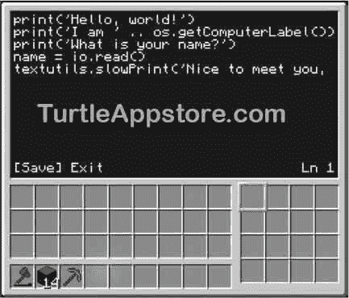
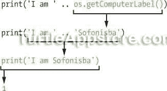

# 3 和你的乌龟说话

> 原文：<https://turtleappstore.com/book/chapter3.html>


它还活着！在[第二章](#calibre_link-10)中，你创造了你的第一个海龟机器人，给它加燃料，并赋予它生命。你的机器人创造有一个身体，但它没有大脑。《我的世界》海龟的大脑是它的程序，告诉它该做什么。没有程序运行，你的机器人什么都不做。让我们写一个程序，让我们与机器人交谈，从而赋予它一点个性。

### **教你的乌龟打招呼！**

我们将使用海龟的`edit`程序创建一个新文件，并编写和编辑我们的第一个程序。像`edit`程序这样我们用来编写其他程序的程序被称为*文本编辑器*。右键单击 turtle 打开它的 GUI，然后在命令 shell 中输入以下内容:

```turtle
> edit hello
```

每当你想创建或打开一个文件时，你可以写关键字`edit`后跟文件名。`edit hello`代码运行`edit`程序，创建并打开一个`hello`文件进行编辑。在这个文件中，我们将为我们的程序编写指令。这些指令将会一个接一个地运行，而不是像我们在第 2 章中把它们输入 Lua 外壳时那样一次运行一个。`hello`程序将在屏幕上显示`Hello, world!`——这是一个供新程序员编写的传统程序。

即使文本编辑器没有太多的空间，您仍然可以在一行中输入长指令。要将闪烁的光标移动到其他行，使用[表 3-1](#calibre_link-11) 中列出的键盘按键。

**表 3-1:** 移动文本编辑器光标的键盘按键

| **键盘按键** | **光标动作** |
| --- | --- |
| 上，下，左，右 | 向键的方向移动光标 |
| PgUp，PgDn | 一次向上或向下移动光标几行 |
| 退格 | 擦除光标后面的文本 |
| 删除 | 擦除光标前面的文本 |
| 主页 | 将光标移动到行首 |
| 目标 | 将光标移动到行尾 |
| 标签 | 可以自动完成您开始键入的指令 |

一个程序的指令被称为它的*源代码*。将下面的`hello`程序源代码输入到编辑器中，但不要在每行的开头键入数字、句点和空格。在本书中，行号仅用作参考。我将在本章中一步一步地解释代码，所以现在不用担心每一行是什么意思。

*你好*

```turtle
1\. print('Hello, world!')
2\. print('I am ' .. os.getComputerLabel())
3\. print('What is your name?')
4\. name = io.read()
5\. textutils.slowPrint('Nice to meet you, ' .. name)
```

输入完代码后，按下 <small class="calibre12">CTRL</small> 键，在外壳底部调出保存/退出菜单。当菜单打开时，`edit`程序将看起来像[图 3-1](#calibre_link-12) 。



*图 3-1:将* 你好 *程序键入编辑器*

[Save]选项用括号括起来以突出显示。按下<small class="calibre12">键，输入</small>，将`hello`文件保存在 turtle 上，这样你就可以在以后访问、编辑和运行程序。然后按下 <small class="calibre12">CTRL</small> 再次调出保存/退出菜单。按右箭头键突出显示**【退出】**，按<small class="calibre12">回车</small>带你离开文件，回到命令 shell 提示符。

#### **运行 HELLO 程序**

在命令 shell 中，您可以像运行`label`、`dance`和`refuel`程序一样运行`hello`程序。只需在命令行输入`hello`:

```turtle
> hello
Hello, world!
I am Sofonisba
What is your name?
```

我的程序没有运行！

当你运行程序时，如果你看到错误 hello:1:试图连接字符串和零，你没有用标签程序给你的海龟命名。在 shell 的 > 提示符下，运行 label set Sofonisba 命令，将海龟的名字设置为 Sofonisba。(您也可以选择不同的名称。)

乌龟打招呼，介绍自己，等你打名字。在我输入我的名字`Al`之后，程序看起来是这样的:

```turtle
> hello
Hello, world!
I am Sofonisba
What is your name?
Al
Nice to meet you, Al
```

当程序完成时，它返回到`>`提示符，并准备好运行另一个程序。

运行用 Lua 编程语言编写的程序的软件被称为 *Lua 解释器*。我们将解释器的名称缩短，称之为 Lua，因此 *Lua* 既指编程语言，也指运行用该语言编写的代码的软件。代码中 Lua 解释器当前运行指令的地方被称为*执行*。执行总是从程序的第一行开始。它*执行*(或运行)第 1 行的指令。然后，它向下移动并执行每条指令或源代码的每一行。

看看程序产生的文本，然后回头看看`hello`程序的源代码。在开始解释之前，试着自己弄清楚每一行代码是做什么的。尝试将`print('Hello, world!')`行改为`print('Greetings')`。然后保存程序，退出编辑器，再次运行`hello`程序，看看有什么变化。这些是你成为一个熟练的程序员所使用的步骤:猜测代码做什么，确定你的猜测是否正确，找出你的猜测不正确的原因(如果是)，并试验代码，看看有什么变化。

#### **用 LS 命令列出所有文件**

如果你忘记了 turtle 上有哪些文件，你可以运行`ls`(或者“list”，注意小写的“l”)命令来列出它们。在命令 shell 中输入以下内容:

```turtle
> ls
rom
hello
```

`ls`命令列出文件，包括程序和包含其他文件的文件夹。rom 文件夹包含了海龟附带的其他文件，但是我们不会在本书中用到它们。

### **使用 PRINT()功能显示文本**

让我们一行一行地看一下`hello`程序。第一行如下:

*你好*

```turtle
1\. print('Hello, world!')
```

这一行是对`print()`函数的函数调用，它使得`Hello, world!`文本出现。您可以在 Lua shell 中试验一下`print()`函数。运行`lua`程序，并输入以下内容。

```turtle
lua> print('Hello, world!')
Hello, world!
1
```

当您想确定一段代码如何工作时，您可以将它输入 Lua shell 来检查它做了什么。如你所见，`print()`功能在屏幕上显示文本。最后的`1`是`print()`函数的返回值，也就是被打印的文本行数。在`hello`这样的程序中调用`print()`函数时`1`不会出现。它出现在这里只是因为 Lua shell 显示了所有函数的返回值。

回想一下第二章中的[，当`math.random()`函数被调用时，它在括号内有两个值。这些参数告诉函数它应该返回的随机数的范围。`print()`函数也接受一个参数，在本例中是`'Hello, world!'`。这种类型的文本值被称为字符串，您将在接下来了解它。](#calibre_link-10)

#### **字符串数据类型**

你已经在程序中使用了数字值，比如`2`和`10`，但是你也想使用字母。*字符串*是一种包含文本而非数字的数值类型。与数值类似，字符串可以存储在变量中，也可以用在表达式中。字符串和数字是这些值的*数据类型*。你将在第 5 章中学习其他数据类型，比如布尔和`nil`。

因为字符串是由看起来像 Lua 命令的字母组成的，所以 Lua 需要知道一个字符串值何时开始和结束，这样就不会将其混淆为 Lua 代码。字符串以单引号(`'`)开始和结束，如`'Hello, world!'`。单引号不是正文的一部分；它只是标记了文本在源代码中的开始和结束位置。你也可以使用双引号(`"`)，比如`"Hello, world!"`。

您也可以使用两个引号之间没有任何文本的字符串值:`''`。这被称为一个*空串*。

#### **用串接将字符串串在一起**

让我们看看`hello`程序源代码中的第 2 行:

*你好*

```turtle
2\. print('I am ' .. os.getComputerLabel())
```

第 2 行调用了`print()`函数，但是我们传递给`print()`的值有一些新的 Lua 代码。这个`..`叫做*字符串连接操作符*。除了用于字符串之外，它的行为类似于用于数字的`+`操作符。就像`+`运算符可以将两个数字组合成一个新数字一样，`..`运算符可以*连接*，或者将两个字符串值组合成一个字符串。在 Lua shell 中输入以下内容:

```turtle
lua> 'Hello,' .. 'world!'
Hello,world!
```

这行代码是一个表达式，就像`2 + 2`一样。`'Hello,'`和`'world!'`是数值，`..`是运算符。像所有表达式一样，`'Hello,' .. 'world!'`计算出一个值，在本例中是字符串`'Hello,world!'`。

当你连接字符串时，Lua 不会添加空格。因为我们示例中的两个字符串都没有空格，所以在计算的字符串中单词之间没有空格。如果希望文本之间有空格，必须将其添加到两个字符串值之一。例如，`'Hello, ' .. 'world!'`或`'Hello,' .. ' world!'`将评估为`'Hello, world!'`。

程序的第 2 行连接了两个字符串`'I am '`和一个名为`os.getComputerLabel()`的新函数返回的字符串。我们将在下一节看看这个函数是如何工作的。

### **检索龟名**

在[第二章](#calibre_link-10)中，你使用`label`程序设置海龟的名字。您的程序可以使用`os.getComputerLabel()`函数以字符串值的形式检索这个名称。函数调用可以是表达式的一部分，就像值一样，因为函数调用计算其返回值。在 Lua shell 中输入以下内容，看看这个函数是如何工作的:

```turtle
lua> os.getComputerLabel()
Sofonisba
lua> turtleName = os.getComputerLabel()
lua> print(turtleName)
Sofonisba
1
```

函数调用的计算结果是海龟名字的字符串值，所以`turtleName = os.getComputerLabel()`与`turtleName = 'Sofonisba'`相同。

再看一下`hello`程序中的第 2 行:

*你好*

```turtle
2\. print('I am ' .. os.getComputerLabel())
```

表达式`'I am ' .. os.getComputerLabel()`将乌龟的名字和字符串`'I am '`连接起来，计算出一个字符串。这个字符串被传递给`print()`函数，这就是为什么当程序运行时`I am Sofonisba`会出现在屏幕上。第 2 行只是一个计算为单个值的表达式，如下所示:



记住，`print()`函数返回它打印的行数的值，这就是它计算为`1`的原因。`print()`函数输出的字符串值不是它的返回值。

### **用 IO 获取键盘输入。READ()函数**

查看`hello`程序中的第 3 行和第 4 行:

*你好*

```turtle
3\. print('What is your name?')
4\. name = io.read()
```

第 3 行是对`print()`的另一个调用。但是 4 号线有了新功能:`io.read()`。当被调用时，`io.read()`功能会暂停程序，直到玩家输入一些东西并按下<small class="calibre12">键进入</small>。玩家输入的文本作为一个字符串从`io.read()`返回，并赋给变量`name`。

如果玩家输入`Al`，`name`将被赋予字符串值`'Al'`。

**奖励活动:适当的介绍**

你写了一个 *hello* 程序告诉海龟你的名字，但是你也可以告诉海龟更多关于你自己的信息。写一个程序，让海龟不仅问玩家他们的名字，还问他们的年龄和最喜欢的游戏。将每个响应保存在单独的变量中，然后使用 print() 函数和..操作员将它们显示回给玩家。

### **赋予文本打字机效果**

你可能已经注意到，当你运行`hello`程序时，最后一行的文本是一个字母一个字母地显示的，就好像是用打字机慢慢打出来的一样。这是使用`textutils.slowPrint()`功能完成的:

*你好*

```turtle
5\. textutils.slowPrint('Nice to meet you, ' .. name)
```

`slowPrint()`的参数是字符串`'Nice to meet you, '`和变量`name`中的字符串，这是程序用玩家的名字向他们问好的方式。第 5 行是代码的最后一行，所以程序*在执行后终止*，或者退出。

### **改龟名**

您可以通过调用`os.setComputerLabel()`函数并向其传递一个字符串值来更改海龟的名称。在 Lua shell 中输入以下代码。

```turtle
lua> os.setComputerLabel('Elisabetta')
lua> os.getComputerLabel()
Elisabetta
```

你的乌龟现在叫伊丽莎白。你可以使用`os.setComputerLabel()`功能给你的乌龟重新命名。

**奖励活动:一只别名为**的乌龟

尝试编写自己版本的`label`程序。您可以运行`edit mylabel`来创建文件。让你的程序调用`print()`和`io.read()`向玩家询问海龟的新名字，然后将这个名字传递给`os.setComputerLabel()`函数。

### **你学到了什么**

在这一章中，我们创建了一个“你好，世界！”程序，这是新程序员习惯的第一个程序。该程序可以输出文本(使用`print()`和`textutils.slowPrint()`功能)和输入文本(使用`io.read()`功能)。在 Lua 中，文本采用字符串值的形式，可以存储在变量中或在表达式中使用，就像数值一样。

字符串值也有运算符，就像数字值一样。`..`字符串连接操作符可以将多个字符串组合成一个新的字符串。

本章中的`hello`程序只是为你的机器人编写程序的第一步。在第四章中，你会学到更多的概念和功能来让海龟动起来(和跳舞！)左右。