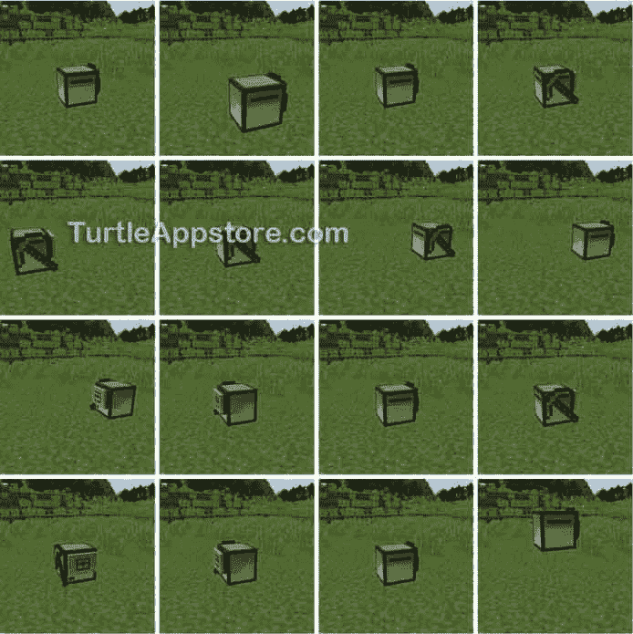
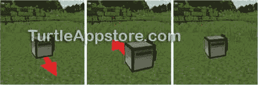
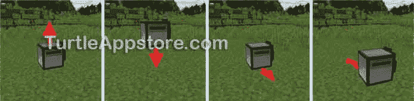
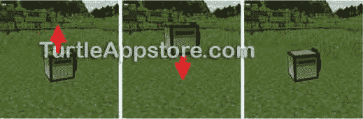
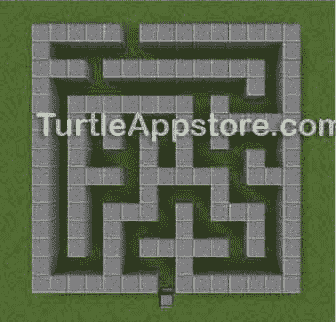

# 4 只编程海龟跳舞

> 原文：<https://turtleappstore.com/book/chapter4.html>


现在我们的乌龟会说话了，让我们让它们走路吧。或者更好，让我们让他们跳舞！虽然海龟们有一个叫做`dance`的程序，但这是一个简单的程序，只会让海龟们随机转向。在这一章中，你将创建一个更好的海龟跳舞程序。这些步骤将看起来像[图 4-1](#calibre_link-16) 。



*图 4-1:乌龟的舞步*

### **编写舞蹈程序**

使用文本编辑器，通过在命令行输入 edit mydance 创建一个名为`mydance`的程序。在文本编辑器中，输入以下代码行。记住不要键入行号，因为它们仅供参考。

*my image*

```turtle
 1\. --[[Dance program by Al Sweigart
 2\. Make the turtle dance!]]
 3.
 4\. print('Time to dance!')
 5.
 6\. -- Turtle starts dancing
 7\. turtle.forward()
 8\. turtle.back()
 9\. turtle.turnRight()
10\. turtle.forward()
11\. turtle.back()
12\. turtle.back()
13\. turtle.turnLeft()
14\. turtle.turnLeft()
15\. turtle.back()
16\. turtle.turnRight()
17.
18\. -- Turtle spins around
19\. for i = 1, 4 do
20.   turtle.turnRight()
21\. end
22.
23\. turtle.up()
24\. turtle.down()
25\. print('Done.')
```

输入所有这些指令后，按下 <small class="calibre12">CTRL</small> 按钮保存程序，确保选择**【保存】**，按下 <small class="calibre12">ENTER</small> 。然后按 <small class="calibre12">CTRL</small> ，选择**【退出】**，按 <small class="calibre12">ENTER</small> 退出编辑器。

### **运行 MYDANCE 程序**

退出编辑器后，在命令 shell 中运行`mydance`程序:

```turtle
> mydance
Time to dance!
Done.
```

文本`Time to dance!`将出现在屏幕上。当机器人完成跳舞时，文本`Done.`将会出现。运行完程序后，在文本`Done.`出现之前，立即按下 <small class="calibre12">ESC</small> 键，观看海龟跳一小段舞。海龟走的每一步都是你设计好的！[图 4-2](#calibre_link-17) 显示了海龟如何响应第 7 行和第 8 行的`turtle.forward()`和`turtle.back()`函数调用而移动。



*图 4-2:乌龟的前两个舞步*

让我们看看`mydance`程序中的每一条指令。

### **在代码中使用注释**

程序中的前两行包含一个注释。Lua 忽略注释，因为它们只是程序员的笔记。这个注释描述了程序做什么以及谁写了这个程序。

*my nce*

```turtle
 1\. --[[Dance program by Al Sweigart
 2\. Make the turtle dance!]]
 3.
 4\. print('Time to dance!')
 5.
 6\. -- Turtle starts dancing
```

这个程序中从第 1 行开始并延续到第 2 行的注释是一个*多行注释*，因为它超出了一行。多行注释以`--[[`开始，直到出现`]]`为止。

第 4 行调用`print()`函数，并在运行程序时让`Time to dance!`出现在命令 shell 中。你在第三章的[中学习了`print()`功能。](#calibre_link-18)

第 6 行也是注释，但它是一个*单行注释*。注释从`--`开始，到行尾结束，而不是跨多行。Lua 忽略了`Turtle starts dancing`文本，它描述了第 6 行后面的代码做了什么，因为这是给阅读程序的人的一个提示。

### **乌龟运动功能**

在第 6 行之后，`mydance`中接下来的几行代码调用让海龟移动的函数。

*my image*

```turtle
 6\. -- Turtle starts dancing
 7\. turtle.forward()
 8\. turtle.back()
 9\. turtle.turnRight()
10\. turtle.forward()
11\. turtle.back()
12\. turtle.back()
13\. turtle.turnLeft()
14\. turtle.turnLeft()
15\. turtle.back()
16\. turtle.turnRight()
```

你在第 2 章的[中学习了`turtle.turnLeft()`和`turtle.turnRight()`功能。还有四个你没见过的移动乌龟的功能:`turtle.up()`、`turtle.down()`、`turtle.forward()`、`turtle.back()`。](#calibre_link-10)

### **实验移动乌龟**

让我们在 Lua shell 中试验这些运动函数。确保您在正确的 shell 中(提示将是`lua>`而不是`>`，并运行以下指令:

```turtle
lua> turtle.up()
true
lua> turtle.down()
true
lua> turtle.forward()
true
lua> turtle.back()
true
```

记得在方向名称前加上`turtle.`，并确保乌龟有燃料。功能`turtle.up()`和`turtle.down()`将海龟升到空中，然后返回地面。功能`turtle.forward()`和`turtle.back()`使乌龟朝它当前面对的方向前进，然后朝相反的方向后退。你可以在[图 4-3](#calibre_link-19) 中看到这些动作。



*图 4-3:实验乌龟的运动功能*

如果乌龟能够按照你的指示移动，函数调用将会有一个返回值`true`。(值`true`和`false`是布尔数据类型的值，我将在第 5 章的[中解释。)](#calibre_link-13)

海龟已经在地面上了，调用 Lua shell 中的`turtle.down()`函数，就像这样:

```turtle
lua> turtle.down()
false
Movement obstructed
```

因为有一个障碍物挡住了路，乌龟将无法移动，`turtle.down()`函数调用将返回`false`和一个显示错误消息的字符串值。如果乌龟没有燃料，移动也会失败，但会显示不同的信息:

```turtle
lua> turtle.forward()
false
Out of fuel
```

这些函数告诉你乌龟不能动的原因。你会在本书的程序中经常调用这些移动函数来移动乌龟。

### **用 FOR 循环进行循环**

到目前为止，`mydance`程序的执行，也称为执行的*流程，已经从源代码的顶部开始，一直向下，执行每一行代码。然而，我们可以对一组指令进行多次执行循环。改变正常的逐行顺序执行流程的指令被称为*流程控制语句*。*

在 Lua shell 中输入以下代码行，查看一种称为`for`循环的流控制语句:

```turtle
lua> for i = 1, 4 do print(i) end
1
2
3
4
```

您输入的指令是一个`for`循环语句。一个`for`循环可以多次执行一组指令。这组代码位于`do`和`end`关键字之间，称为*块*，该块的每次执行称为一次*迭代*。示例中的块由`print(i)`函数调用组成。(程序员经常在`for`循环中使用变量名`i`。它代表“迭代”)一个块可以由几行代码组成，但是在这种情况下，这个块很简单，只有一个函数调用。这个`for`循环告诉 Lua 执行这个块四次，因为`1, 4`告诉循环从 1 到 4 迭代。

语句`for i = 1, 4 do print(i) end`打印数字`1`到`4`。Lua 第一次执行该块中的代码时，`i`变量被设置为`1`，其计算结果为`print(1)`，在屏幕上显示`1`。这是`for`循环的第一次迭代。当执行到达块中代码的末尾时，它会返回到块的开头，再次运行代码。在第二次迭代中，`1`被添加到`i`变量中，因此它被设置为`2`，并且`2`被打印到屏幕上。执行继续循环，直到第四次也是最后一次迭代时`i`被设置为`4`，这是`for`循环语句中逗号后的数字。

我们可以向`for`循环提供任意两个数字。例如，在 Lua shell 中输入以下内容，使一个`for`循环从`10`迭代到`13`:

```turtle
lua> for i = 10, 13 do print(i) end
10
11
12
13
```

我们还可以指定第三个数字，称为*步数*。我们可以让`for`循环增加或减少任意数量的循环变量，而不是在每次迭代后增加`1`。在 Lua shell 中输入以下内容:

```turtle
lua> for i = 10, 20, 2 do print(i) end
10
12
14
16
18
20
```

这一行代码做了步数`2`，所以 Lua 会打印 10 到 20 之间的所有偶数。

我们也可以在一个`for`循环中使用负数，让循环从起始数开始递减计数。在下面的代码行中，我们使用了步骤号`-1`:

```turtle
lua> for i = 4, 1, -1 do print(i) end
4
3
2
1
```

这段代码使`for`循环从`4`倒计数到`1`。尝试将步数改为`-2`，看看会发生什么。使用`for`循环是多次执行一组指令的简单方法。您将在第 5 章的[中学习其他流控制语句。](#calibre_link-13)

### **带乌龟兜一圈**

让我们回到`mydance`程序。第 19 到 21 行使用了一个`for`循环让海龟旋转:

*my nce*

```turtle
18\. -- Turtle spins around
19\. for i = 1, 4 do
20.   turtle.turnRight()
21\. end
```

当我们在程序中使用`for`循环时，常见的是*缩进*(也就是说，在循环块中的每一行代码的开头添加空格)。缩进代码行可以更容易地看出哪些行在哪些块内，尤其是当你开始在其他块内添加块时(我们将在第 5 章的[中这样做)。`end`关键字和`for`关键字在同一个缩进层次上，很容易看到循环的开始和结束。](#calibre_link-13)

第 20 行，把乌龟转到右边，执行四次，让乌龟做一个完整的 360 度旋转。如果你把第 19 行改成`for i = 1, 8 do`，你可以让海龟完成两个完整的旋转，就像[图 4-4](#calibre_link-20) 。


*图 4-4:一只乌龟右转八次，转两圈。*

### **做一个小跳跃**

最后，在第 23 行和第 24 行，海龟会向上移动一点，然后再向下移动:

*my image*

```turtle
23\. turtle.up()
24\. turtle.down()
25\. print('Done.')
```

这个跳跃看起来像[图 4-5](#calibre_link-21) 。程序的最后一行打印出`Done.`，因为第 25 行之后没有更多的代码，程序终止。



*图 4-5:当* turtle.up() *和* turtle.down() *被调用时，乌龟跳一跳。*

**奖励活动:新舞步**

尝试为乌龟创造你自己的舞步。你可以使用移动和转动功能，让乌龟按照你自己的编排跳跃、旋转和跳舞！

### **在线分享和下载程序**

当你把你的程序输入到 turtle 后，你可能想和你的朋友们分享它。要从你的海龟身上复制程序到互联网上，你可以使用一个 *pastebin* 网站，人们可以通过复制和粘贴到网站上来在线分享文本。你可以用所有海龟自带的`pastebin`程序，把你的海龟程序以文本形式上传到 https://pastebin.com/，一个流行的 pastebin 网站。在命令 shell 中输入以下内容以上传`mydance`:

```turtle
> pastebin put mydance
Connecting to pastebin.com... Success.
Uploaded as
https://pastebin.com/BLCJbpQJ
Run "pastebin get BLCJbpQJ" to download
anywhere
```

上传程序后，网站将为其生成一个新的、唯一的网址。当我运行`pastebin`程序时，它告诉我`mydance`程序已经成功上传到*[https://pastebin.com/BLCJbpQJ/](https://pastebin.com/BLCJbpQJ/)*。现在，任何人都可以通过打开该网站的 web 浏览器来查看该程序。你也可以把这个程序下载到你的 turtle 上，方法是在命令行输入以下内容:

```turtle
> pastebin get BLCJbpQJ mydance
Connecting to pastebin.com... Success.
Downloaded as mydance
```

`get BLCJbpQJ mydance`命令行参数告诉`pastebin`你想在获得程序，并以`mydance`的名字保存在海龟上。现在，您可以上传和下载文件并与他人分享。

如果`pastebin`程序在运行时显示消息`Connecting to pastebin.com... Failed.`，请仔细检查您是否正确键入了命令行参数(`BLCJbpQJ`或任何分配给 pastebin 的地址)，以及您是否连接到了互联网。如果`pastebin`程序显示`File already exists`，您需要先删除现有的`mydance`程序，这将在下面介绍。

#### **删除海龟上的文件**

当你运行`pastebin`程序时，你告诉它下载文件，保存在海龟上，并命名文件为`mydance`。但是如果一个程序已经以这个名字存在(比如你用`edit mydance`创建的那个)，你需要选择一个不同的名字或者删除现有的`mydance`程序。

要从 turtle 上删除一个程序，运行`delete`命令，后跟要删除的程序名。例如，在命令 shell 中输入以下内容:

```turtle
> delete mydance
```

这一行删除了`mydance`程序。现在你可以运行`pastebin get BLCJbpQJ mydance`从网上下载程序。

#### **【PASTEBIN.COM】T2 局限性**

请记住，对于每个《我的世界》服务器，网站只允许*每天* 25 个新“贴子”。如果你的服务器上有很多玩家，这个限制会使你很难用程序的新变化来更新粘贴。

#### **TURTLEAPPSTORE.COM**

您还可以在 https://turtleappstore.com/*T5T7】无限制地在线分享您的节目。不使用`pastebin`程序，可以使用`appstore`程序。在命令行运行`pastebin get iXRkjNsG appstore`下载`appstore`程序；*

```turtle
> pastebin get iXRkjNsG appstore
Connecting to pastebin.com... Success.
Downloaded as appstore
```

`appstore`程序会像`pastebin`程序一样给你的海龟下载程序。比如你可以在网站上运行`appstore get AlSweigart mydance`从`AlSweigart` `appstore`下载`mydance`程序。

要将您的程序上传到`appstore`并浏览其他人制作的程序，请访问 https://turtleappstore.com/的 *[网站并注册一个免费帐户。你会发现别人写的程序，你可以从他们的代码中学习！这个网站也包含了这本书的所有程序。](https://turtleappstore.com/)*

**奖励活动:迷宫赛跑者**

用一些积木搭建一个小迷宫，就像在[图 4-6](#calibre_link-22) 中一样，然后写一个程序让乌龟跑过去。你必须计划出乌龟穿过迷宫的确切路径。如果乌龟卡住了，你可以通过挖掘乌龟并将其移回迷宫的起点来重新开始。



*图 4-6:一只乌龟在一个小迷宫的起点*

### **你学到了什么**

在本章中，你学习了几个新的编程概念。您学习了如何使用注释来做 Lua 会忽略的笔记。这些注释可以作为提醒或者描述你的程序的不同部分做什么。单行注释以`--`开始，多行注释以`--[[`开始，以`]]`结束。

你已经学会了如何使用`turtle.forward()`、`turtle.back()`、`turtle.turnLeft()`、`turtle.turnRight()`、`turtle.up()`和`turtle.down()`的移动功能来移动乌龟。

本章介绍了一种新型的流控制语句，称为`for`循环。这些循环允许您执行相同的代码块一定的次数。

你可以在 https://pastebin.com/的使用电脑海龟自带的`pastebin`程序在线分享程序。在*[https://turtleappstore.com/](https://turtleappstore.com/)*的`appstore`程序也提供了一些附加功能。

在第五章中，我们将扩展`mydance`程序，并使用一些新的流控制语句、数据类型和操作符。有了这些知识，你就可以和海龟一起做《我的世界》的家务了！