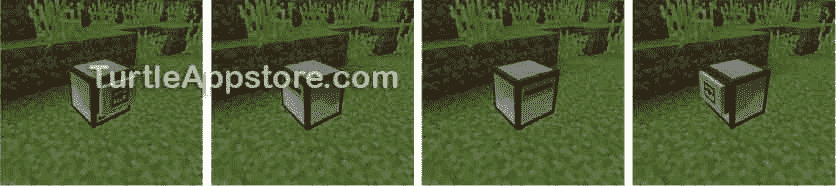
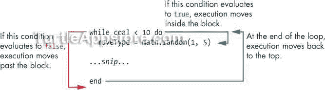
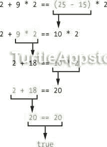
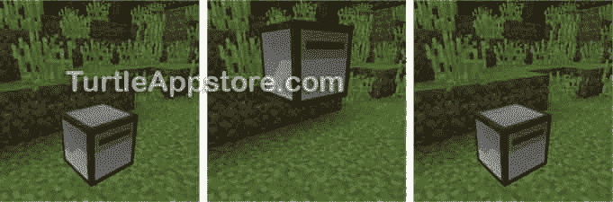

# 5 成为更好的舞者

> 原文：<https://turtleappstore.com/book/chapter5.html>


《T2》第四章中的舞蹈程序相当简单，总是指导你的海龟做同样的舞蹈动作。在这一章，我们将创建一个新的程序，让海龟做各种随机的动作。在创建这个程序时，您将了解到`while`循环、布尔和`nil`数据类型，以及如何根据条件运行或跳过代码块。

### **编写更好的舞蹈程序**

通过在命令 shell 中输入 edit mydance2 来运行文本编辑器。在文本编辑器中，输入以下代码行，但不要键入行号，因为它们在这里仅用作参考:

*my nce 2*

```turtle
 1\. --[[A Better Dance program by Al Sweigart
 2\. Make the turtle dance better!]]
 3.
 4\. local isUp = false
 5\. local isBack = false
 6\. local danceMove
 7\. print('Hold Ctrl-T to stop dancing.')
 8\. while true do
 9.   danceMove = math.random(1, 5)
10.
11.   if danceMove == 1 then
12.     -- turn left
13.     print('Turn to the left!')
14.     turtle.turnLeft()
15.
16.   elseif danceMove == 2 then
17.     -- turn right
18.     print('Turn to the right!')
19.     turtle.turnRight()
20.
21.   elseif danceMove == 3 then
22.     -- forward/back moves
23.     if isBack then
24.       print('Move forward!')
25.       turtle.forward()
26.       isBack = false
27.     else
28.       print('Move back!')
29.       turtle.back()
30.       isBack = true
31.     end
32.
33.   elseif danceMove == 4 then
34.     -- up/down moves
35.     if isUp then
36.       print('Get down!')
37.       turtle.down()
38.       isUp = false
39.     else
40.       print('Get up!')
41.       turtle.up()
42.       isUp = true
43.     end
44.
45.   else
46.     -- spin around
47.     print('Spin!')
48.     for i = 1, 4 do
49.       turtle.turnLeft()
50.     end
51.   end
52\. end
```

输入完所有这些指令后，按 <small class="calibre12">CTRL</small> ，确认**【保存】**被选中，按 <small class="calibre12">ENTER</small> 。然后按 <small class="calibre12">CTRL</small> ，选择**【退出】**，再按 <small class="calibre12">ENTER</small> 退出编辑器。

### **运行 MYDANCE2 程序**

退出编辑器后，在命令 shell 中运行`mydance2`程序。在运行程序后不久按下 <small class="calibre12">ESC</small> 键，看乌龟做随机的舞蹈动作。这个程序将继续运行，直到你按住 <small class="calibre12">CTRL</small> -T 整整一秒钟来终止它。当您停止程序后，返回到命令提示符查看类似如下的输出:

```turtle
> mydance2
Hold Ctrl-T to stop dancing.
Spin!
Get down!
Move back!
Move forward!
Spin!
Get up!
Turn to the left!
Terminated
```

图 5-1 显示了海龟旋转的动作。



*图 5-1:旋转的乌龟*

如果您在运行这个程序时遇到错误，请仔细地将您的代码与本书中的代码进行比较，找出任何打字错误。如果你仍然不能修复你的程序，通过运行`delete mydance2`删除文件，然后通过运行`pastebin get QAH0uYqS mydance2`下载它。

`mydance2`程序使用布尔、`nil`、`while`循环、`if`语句等等。我们一步一步来看。

### **布尔数据类型**

程序的前几行包含解释程序是什么和谁写的注释。第 4 行和第 5 行是赋值语句:

*my nce 2*

```turtle
 1\. --[[A Better Dance program by Al Sweigart
 2\. Make the turtle dance better!]]
 3.
 4\. local isUp = false
 5\. local isBack = false
```

分配给`isUp`和`isBack`变量的值是`false`和`false`。你可以看出这些不是字符串，因为它们不以单引号开始和结束。相反，这些是另一种数据类型的布尔值*。布尔值，或者布尔，总是要么是`true`要么是`false`。(“Boolean”是大写的，不像“string”或“number”，因为它是以 19 世纪数学家乔治·布尔的名字命名的。)*

 *一些海龟舞蹈动作包括向上移动和向后移动。为了防止海龟离开原来的位置太远，我们使用`isUp`和`isBack`变量来跟踪海龟是向上移动还是向后移动。虽然我们在程序开始时就设置了这些变量，但是我们直到程序的后面才会用到它们。

### **NIL 数据类型**

注意，第 6 行声明了`danceMove`变量，但没有给它赋值:

*my nce 2*

```turtle
 6\. local danceMove
```

即使没有写在代码中，`danceMove`也会被自动赋予一个名为`nil`的值。`nil`值是数据类型中唯一的值，也称为`nil`。该值代表*没有值*或*缺少值*。任何没有给声明的变量赋值的`local`语句都会给`nil`赋值。第 6 行同写`local danceMove = nil`。

### **用 WHILE 循环进行循环**

除了`for`循环，另一种循环是`while`循环。只要某个条件为`true`，while 循环就会重复执行一段代码。一个*条件*是一个表达式，可以是`true`或`false`。条件作为`while`语句的一部分被检查，当条件为`true`时，它执行的代码块是我们希望它做的动作。

第 7 行向玩家显示一个提示，他们可以通过按住 <small class="calibre12">CTRL</small> -T 来终止程序，第 8 行是`while`语句:

*my nce 2*

```turtle
 7\. print('Hold Ctrl-T to stop dancing.')
 8\. while true do
 9.   danceMove = math.random(1, 5)
```

`while`语句由`while`关键字组成，后面跟着一个条件(在本例中是`true`)和`do`关键字来标记块的开始。指令在从第 9 行开始的代码块中。块的末尾标有`end`关键字。(因为代码块很长，所以这段代码只显示了代码块的第一行，没有显示第 31 行的`end`关键字。)当执行到达`end`关键字时，它移动到块的顶部并再次检查条件。只要条件评估为`true`，它就继续循环代码。如果条件为`false`，执行将越过`while`循环的块。

[图 5-2](#calibre_link-26) 显示了一个示例`while`循环。



*图 5-2:执行一个* 而 *循环*

只要条件不是`false`或`nil`，循环`while`就会继续循环。许多条件使用比较运算符，例如本例中的`coal < 10`，它测试`coal`变量中的值是否小于 10。(在本章的后面你会学到更多关于比较运算符的知识。)使用比较运算符的条件可以评估为`true`或`false`。如果一个条件评估为一个数字或字符串值(例如，一些函数将返回数字值)，它被认为与`true`相同。

请记住，一个表达式可以只由一个值组成，在这种情况下，表达式的计算结果是自身。回想一下在第 2 章的[中，当您在 Lua shell 中输入值`42`时，它会计算出值`42`。`mydance2`程序第 8 行的条件就是`true`值。因为这个表达式总是计算为`true`，所以`while`循环将永远循环下去，直到用户通过终止程序来停止它。这种永无止境的循环被称为*无限循环*。我们在这个程序中使用了一个无限循环，因为我们希望乌龟一直跳舞，直到我们按住 <small class="calibre12">CTRL</small> -T 来终止程序。](#calibre_link-10)

乌龟有五种不同的舞步，程序根据`danceMove`中的值随机选择一种。第 9 行调用`math.random()`函数在`1`和`5`之间创建一个随机数，并将这个随机数存储在`danceMove`变量中。

### **用 IF 语句做决策**

回想一下，执行流就是代码行的执行顺序。我们程序的正常执行流程是自上而下的。像`for`循环或`while`循环这样的循环被认为是流控制语句，因为它们可以使执行返回到循环的开始。

`if`语句是另一种流控制语句。第 11 行使用了一个`if`语句，该语句仅在条件评估为`true`时执行代码块，如下所示。

*【myd nce 2】*

```turtle
11.   if danceMove == 1 then
12.     -- turn left
13.     print('Turn to the left!')
14.     turtle.turnLeft()
15.
16.   elseif danceMove == 2 then
```

一个`if`语句是由`if`关键字后跟一个条件和`then`关键字组成的，它标志着代码块的开始。第 12 行开始代码块中的指令，如果条件是`true`，这些指令应该执行。一个`elseif`、`else`或`end`关键字标记了`if`语句代码块的结束。在这种情况下，在第 16 行，代码块以关键字`elseif`结束，稍后您将了解到更多内容。

第 11 行的条件还包含您不熟悉的代码，因为它使用了比较运算符。为了更好地理解`if`语句是如何工作的，接下来让我们看看比较运算符。

### **用比较运算符比较两个值**

*比较运算符*通过比较两个值来检查条件，并评估为布尔值`true`或`false`。第 11 行的条件是`danceMove == 1`，它包括“等于”(`==`)比较运算符。`==`运算符检查前后的值是否相等，如果相等则返回`true`,否则返回`false`。如果`danceMove`变量等于值`1`，则执行第 12、13 和 14 行的代码(在`then`和`elseif`关键字之间)。这将在 GUI 上打印出`Turn to the left!`,并使乌龟向左转。

注意不要混淆“等于”运算符(`==`)和赋值运算符(`=`)。比较运算符`==`检查运算符两边的值是否相同，如果相同则返回`true`，而赋值运算符`=`将运算符右边的值赋给运算符左边的变量。

表 5-1 描述了 Lua 的比较运算符。

**表 5-1:**Lua 中的比较运算符

| **比较运算符** | **描述** |
| --- | --- |
| `==` | 等于 |
| `~=` | 不等于 |
| `>` | 大于 |
| `<` | 小于 |
| `>=` | 大于或等于 |
| `<=` | 小于或等于 |

让我们通过在 Lua shell 中输入以下操作符来进行实验:

```turtle
➊ lua> 2 == 2
   true
   lua> 4 == 2 + 2
   true
➋ lua> 2 ~= 3
   true
   lua> 2 < 3
   true
   lua> 3 < 3
➌ false
   lua> 3 > 2
   true
   lua> 2 >= 2
   true
➍ lua> 2 + 9 * 2 == (25 – 15) * 2
   true
```

如您所见，带有比较运算符的表达式总是计算出布尔值`true`或`false`。“等于”运算符(`==`)比较两个值，如果它们等于 ➊ ，则返回`true`。如果不等于 ➋ ，则“不等于”运算符(`~=`)返回`true`。“小于”(`<`)和“大于”(`>`)运算符的工作方式就像在数学课中一样。它们比较运算符开放部分旁边的值是否大于运算符另一侧的值，如果是，则返回`true`。但是如果运算符两边的值相等，或者运算符开放部分旁边的值小于运算符另一边的值，比较将返回`false` ➌ 。

“大于或等于”(`>=`)和“小于或等于”(`<=`)运算符将进行与小于和大于运算符相同的比较，但如果运算符两边的值相等，将返回`true`。

还可以使用比较运算符来比较表达式，比如`2 + 9 * 2 == (25 – 15) * 2` ➍ 。当您看到这种类型的表达式时，您可以一次评估一部分，如下所示:



最后，表达式将总是只计算出`true`或`false`。

### **用 ELSEIF 语句做备选决策**

您可以在一个`if`块的末尾添加一个`elseif`语句。事实上，`elseif`语句的工作方式几乎和`if`语句一模一样。它们都包括自己的关键字(`if`或`elseif`)、一个条件和`then`关键字，后者标志着块的开始。执行指令在代码块内部，一个`elseif`、`else`或`end`关键字标记代码块的结束。

`elseif`语句必须与`if`语句成对出现，并且只在`if`语句的条件为`false`而`elseif`语句的条件为`true`时执行其代码块。简单地说，它的意思是，“如果这是真的，就这样做，否则如果另一件事是真的，就那样做。”如果两个条件都不是`true`，则两个块都不执行，代码的下一部分执行。

如果第 11 行的条件`danceMove == 1`是`false`，第 16 行的条件`danceMove == 2`是`true`，则执行第 17 到 19 行:

*my nce 2*

```turtle
16.   elseif danceMove == 2 then
17.     -- turn right
18.     print('Turn to the right!')
19.     turtle.turnRight()
20.
21.   elseif danceMove == 3 then
```

如果第 9 行的`danceMove`变量被设置为`2`，程序打印出`Turn to the right!`并将海龟转向右边。

### **嵌套代码块**

当`danceMove`被设置为`3`时，另一个`elseif`语句在第 21 行。在`elseif`语句的块内是第 23 行的另一个`if`语句及其块，从第 24 行开始，到第 26 行结束。将一个代码块放入另一个代码块中称为*嵌套*。注意，因为第 24 行到第 26 行在一个新的块中，所以代码多缩进了两个空格。这种缩进并不是必需的，但它确实使代码更容易阅读。

*my nce 2*

```turtle
21.   elseif danceMove == 3 then
22.     -- forward/back moves
23.     if isBack then
24.       print('Move forward!')
25.       turtle.forward()
26.       isBack = false
```

只有当`elseif`语句的条件为`true`时，嵌套在`elseif`块中的`if`语句才会执行。我们需要一个嵌套的`if`语句，因为第 21 行的舞蹈动作与其他不同。这个舞蹈动作让乌龟往前走，但是我们不希望乌龟一直往前走；否则，它可能会走失！所以我们检查乌龟是否已经向前移动了，如果是，就把乌龟向后移动。我们使用嵌套的`if`语句来实现这一点，该语句在的条件中使用了`isBack`变量。我们在程序开始时设置了`isBack`变量，并用它来存储一个布尔值，该值指示海龟是否回到了它最初开始的地方。

请记住，变量可以在表达式中使用，因为它的计算结果是表达式内部的值。所以如果`isBack`被设置为`true`，那么第 23 行的条件是`true`，第 24 到 26 行执行，这将海龟向前移动，并将`isBack`设置为`false`。

**缩进**

Lua 源代码中的缩进是可选的，但是在行首添加空格可以使它们更容易阅读。通过查看缩进，您可以立即识别代码块的开始和结束位置。比较下面的代码清单:左边的代码有缩进；右边的那个没有:

| -这段代码更容易阅读！
如果是后退，则
打印('向前移动！')
turtle . forward()
is back = false
else
print('向后移动！')
turtle . back()
is back = true
end | -这个代码更难读。
如果是后退，则
打印('向前移动！')
turtle . forward()
is back = false
else
print('向后移动！')
turtle . back()
is back = true
end |

您可以清楚地看到代码块在左侧代码清单中的位置。但是在右边，更难找到 else 和 end 语句来知道块在哪里结束。缩进代码是最佳实践。

### 做决定。。。不然！

第 27 行是一个`else`语句，它结束了`if`语句的块。如果前面的`if`和`elseif`条件的*都为`false`，则执行`else`语句后的块。简单地说，它的意思是，“如果这是真的，就这样做，否则，如果这是假的，就那样做。”在这种情况下，`else`语句与第 23 行的`if`语句成对出现，但不与第 11、16 和 21 行的`if`或`elseif`语句成对出现。原因是`else`语句也嵌套在第 21 行的`elseif`语句中，意味着只有当第 21 行的条件为`true`时才执行。*

如果第 23 行的条件是`false`，则执行第 28 至 30 行。当程序到达一个`end`关键字时，`else`语句后的块结束。只有当前面所有的`if`和`elseif`语句都是`false`时，`else`块才会运行，所以它没有条件。

*my nce 2*

```turtle
27.     else
28.       print('Move back!')
29.       turtle.back()
30.       isBack = true
31.     end
```

如果`isBack`被设置为`false`，第 28 到 30 行执行，在海龟的 GUI 上打印`Move back!`，向后移动海龟，然后将`isBack`设置为`true`。

注意，如果`isBack`是`true`，程序将其设置为`false`。如果`isBack`为`false`，程序将其设置为`true`。结果，每次`danceMove`被设置为`3`时，海龟在前进和后退之间交替。所以海龟不会向后或向前太远，总是在两个位置之间移动。

#### **上下移动**

第 33 行是一个`elseif`语句，它检查`danceMove`是否等于`4`。注意，因为第 23 行的`if`语句(`if isBack then`)嵌套在前面的`elseif`块中，如果执行移到第 33 行的`elseif`语句，程序将跳过它。这意味着第 33 行的`elseif`语句与第 11 行的`if`语句成对出现。

*my nce 2*

```turtle
33.   elseif danceMove == 4 then
34.     -- up/down moves
35.     if isUp then
36.       print('Get down!')
37.       turtle.down()
38.       isUp = false
39.     else
40.       print('Get up!')
41.       turtle.up()
42.       isUp = true
43.     end
```

第 35 到 43 行的代码类似于第 23 到 31 行的代码。如果`danceMove`是`4`，如果`isUp`是`true`，第 35 行嵌套的`if`语句运行它的块。否则，第 39 行的`else`语句运行它的块。

该程序使用`isBack`和`isUp`来记录当`danceMove`是`3`或`4`时该采取何种行动。`if`、`elseif`和`else`语句根据这三个变量指示程序的执行方向。

[图 5-3](#calibre_link-28) 显示乌龟上下移动。



*图 5-3:乌龟上下移动*

#### **四处打转**

另一个`else`语句在第 45 行，它与第 11 行的`if`语句成对出现。如果第 11、16、21、33 和 45 行上的`if`和`elseif`语句的每个条件都是`false`，那么`else`语句之后的块将运行:

*my nce 2*

```turtle
 8\. while true do
 9.   danceMove = math.random(1, 5)
10.
11.   if danceMove == 1 then

      ...snip...

45.   else
46.     -- spin around
47.     print('Spin!')
48.     for i = 1, 4 do
49.       turtle.turnLeft()
50.     end
51.   end
52\. end
```

在这个代码块中(从第 46 行到第 51 行)，海龟将`Spin!`打印到它的 GUI 上，并进入一个循环，让海龟左转四次。这种旋转使海龟面向原来的方向。

第 50、51 和 52 行都是`end`语句。通过查看缩进，我们可以将这些`end`语句与其配对的语句匹配起来，如下所示:

*   第 50 行是由第 48 行的`for`语句开始的块的结尾。
*   第 51 行是由第 45 行的`else`语句开始的块的结尾。
*   第 52 行是由第 8 行的`while`语句开始的块的结尾。

记住，在`if`、`elseif`和`else`语句之后，有且只有一个程序块执行。执行会跳过其余部分。因此，在这些块中的一个运行之后，执行将越过第 51 行上的`end`语句。下一行是`while`循环的`end`语句，所以执行返回到第 8 行，重新检查`while`语句的条件。因为这个条件只是值`true`，执行将总是重新进入块，并进行另一个随机的舞蹈动作。

由于无限循环，这个程序没有自然的结束方式。乌龟会一直跳舞，直到你按住 <small class="calibre12">CTRL</small> -T 终止程序。

**奖励活动:守望乌龟**

让你的乌龟站岗。使用循环，让乌龟向前行进 10 步，然后转身向后行进。将所有这些代码放入一个循环中，让乌龟继续行进，直到玩家按下 <small class="calibre17">CTRL</small> -T 终止程序(或者直到乌龟耗尽燃料)。

### **你学到了什么**

在这一章中，你学习了`while`循环和条件，它们允许你重复运行相同的代码。您还学习了如何使用带有`if`、`elseif`和`else`语句的条件以及比较运算符来执行或跳过代码。这些流量控制语句允许你编写软件来决定你的海龟的行为。比较运算符计算两个布尔值之一:`true`或`false`。`nil`数据类型只有一个值`nil`，表示缺少值。

当然，如果你想要更聪明的海龟，你必须在代码中使用更多的语句和循环。但是你和你的跳舞乌龟有一个好的开始！*