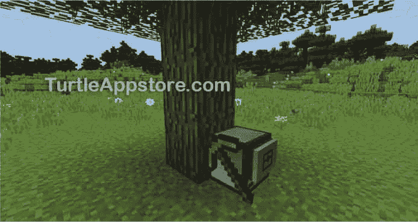
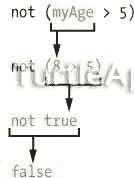
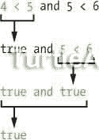
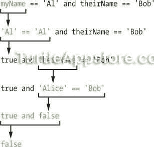
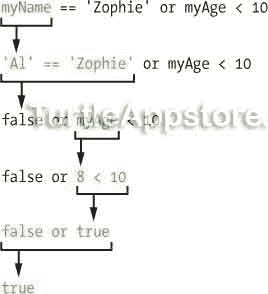
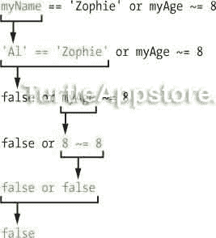

# 6 给机器人伐木工人编程

> 原文：<https://turtleappstore.com/book/chapter6.html>


是时候在《我的世界》的世界里测试你的新编程知识了。我们将为我们的第一只乌龟编写程序，让它砍倒一棵树的所有木块。在这些乌龟的帮助下，你的木材供应问题将会结束！

在《我的世界》用手砍树有很多问题。它很慢，会磨损你的工具，你需要到达最顶端的木块才能完全砍倒一棵树。相比之下，海龟可以一次砍下一块木头，它们的工具不会磨损，而且它们可以悬停在你需要的高度，如图 6-1 所示。


*图 6-1:四只乌龟砍一棵高大的丛林树*

在我们写砍树程序之前，你需要学习一些额外的 turtle 函数，你需要考虑这个程序是如何工作的。

### **给海龟配备工具**

要砍树，你需要给乌龟配备一个全新的钻石工具。你可以用钻石镐、铲子、斧头、锄头或剑来装备海龟，但是铁制工具或用过的钻石工具都不行。幸运的是，一旦海龟装备了工具，它的耐用性永远不会降低。

要给海龟配备工具，将工具放入海龟当前选择的库存槽，或*当前槽*。这是库存槽，四周有粗边框。制作一把钻石鹤嘴锄，并把它放入乌龟当前的槽中。通过输入以下命令运行 Lua shell:

```turtle
> lua
Interactive Lua prompt.
Call exit() to exit.
```

然后，通过运行以下命令，用所选择的物品装备你的乌龟:

```turtle
lua> turtle.equipLeft()
```

海龟最多可以装备两个工具:一个在它们的左侧，另一个在它们的右侧。如果你想取消海龟的装备，只需调用`turtle.equipLeft()`或`turtle.equipRight()`函数，在当前选择的槽中什么都不用。海龟会把工具拿走，放到它的库存里。

海龟可以装备任何钻石工具，但钻石鹤嘴锄是最通用的。钻石铲可以挖掘泥土块，钻石斧可以挖掘木头块，但不能挖掘石头或矿石块。钻石鹤嘴锄可以挖掘所有类型的石块，所以我们将在这本书里用它来挖掘所有的海龟。有了鹤嘴锄，海龟就可以调用`turtle.dig()`函数，我将在下一节解释这个函数，来挖矿或者砍柴。

### **设计砍树算法**

在我们写代码之前，让我们彻底想想伐木工海龟需要做什么。通过提前计划，你可以在早期发现程序中的错误，而不是在你写完程序后才发现。正如老木匠所说，“量两次；割一次。”我们将计划海龟的砍树算法。算法是计算机解决问题的一系列步骤。

要砍树，我们从底部的乌龟开始，挖，向前，挖到乌龟上方，向上，然后对整棵树重复最后两步。当乌龟吃完后，它会回到地上，这样就可以被捡起来了。图 6-2 至 [6-6](#calibre_link-32) 展示了整个过程。


*图 6-2:乌龟从树底开始，面向底部木块。*


*图 6-3:乌龟砍下底部的木块，然后向前移动所以它在树下。*


*图 6-4:乌龟向上劈，然后向上移动一格。*


*图 6-5:乌龟不停地向上劈，直到它的上面再也没有木块。*


图 6-6:乌龟回到地面，这样玩家可以把它捡起来。树叶会腐烂。

我们需要使用`turtle.forward()`和`turtle.up()`函数来移动乌龟。我们还将使用`turtle.dig()`函数，它让乌龟挖掘(即挖掘)它前面的方块，以及`turtle.digUp()`函数，它挖掘乌龟上面的方块。

《我的世界》的树有各种各样的高度，所以你最不想做的事情就是写一个程序，硬编码海龟可以砍倒的树的高度。*硬编码*意思是用有限的、固定的解决方案来写程序。如果程序员不重写代码，硬编码的程序就无法处理不同的情况。所以你*不要*想这样写代码:

```turtle
turtle.digUp()
turtle.up()
turtle.digUp()
turtle.up()
turtle.digUp()
turtle.up()
turtle.digUp()
```

虽然这个程序可能很容易理解，但是海龟只能砍倒四个街区高的树。如果你想让乌龟砍倒一棵不同大小的树，你就必须重写代码，这并不理想。

相反，让我们设计一个算法来砍倒任何大小的树。例如，我们可以将这些步骤用于砍树算法:

1.  从树底部的地面开始，面向树。

2.  把甲鱼前面的底木块剁碎。

3.  移到树下。

4.  在龟的上方砍木块，每砍一次就向上移动，直到上面没有木头为止。

5.  向下移动，直到乌龟回到地面。

6.  停下来。

这种算法允许海龟砍倒任何高度的树。现在伐木就容易了！您将在`choptree`程序中实现这个算法。

### **编写 CHOPTREE 程序**

在命令 shell 中输入`edit choptree`运行文本编辑器。在文本编辑器中，输入以下代码行。记住不要键入行号，因为它们仅用于参考。

斩波树

```turtle
 1\. --[[Tree Chopping program by Al Sweigart
 2\. Chops down the tree in front of turtle.]]
 3.
 4\. if not turtle.detect() then
 5.   error('Could not find tree!')
 6\. end
 7.
 8\. print('Chopping tree...')
 9.
10\. if not turtle.dig() then  -- chop base of tree
11.   error('Turtle needs a digging tool!')
12\. end
13.
14\. turtle.forward()  -- move under tree
15\. while turtle.compareUp() do
16.   -- keep chopping until no more wood
17.   turtle.digUp()
18.   turtle.up()  
19\. end
20.
21\. -- move back down to ground
22\. while not turtle.detectDown() do
23.   turtle.down()
24\. end
25.
26\. print('Done chopping tree.')
```

输入所有这些指令后，保存`choptree`程序。

### **运行 CHOPTREE 程序**

使用鹤嘴锄挖掘乌龟，并将其放入您的库存中。在《我的世界》世界中找到一棵树，将乌龟面向树的最底部木块，如图 6-7 所示。



*图 6-7:将乌龟面向一棵树最底部的木块。*

右键单击乌龟打开它的 GUI，确保乌龟有燃料，并且它当前的槽是空的，这样它砍的木块就可以到那里。然后运行`choptree`程序，看它从树上收割所有的木材。当海龟采完木头后，它会回到地面，在那里你可以把它放回你的存货中。

如果您在运行这个程序时遇到错误，请仔细地将您的代码与本书中的代码进行比较，找出任何打字错误。如果你仍然不能修复你的程序，通过运行`delete choptree`删除文件，然后通过运行`pastebin get 8NgPXXxN choptree`下载它。

### **具有海龟检测功能的检测块**

让我们一行一行地回顾一下`choptree`程序的源代码。乌龟首先需要检查它前面是否有一棵树。

斩波树

```turtle
 1\. --[[Tree Chopping program by Al Sweigart
 2\. Chops down the tree in front of turtle.]]
 3.
 4\. if not turtle.detect() then
```

如果乌龟前面有东西，函数`turtle.detect()`返回`true`，如果没有空气，函数`false`返回。如果乌龟前面有水或熔岩，这个函数也会返回`false`，因为乌龟可以穿过这些类型的障碍物。

就像 ComputerCraft 中有`turtle.digUp()`和`turtle.digDown()`函数一样，`turtle.detectUp()`和`turtle.detectDown()`函数可以分别检测海龟上方和下方的方块。虽然`turtle.detect()`功能可以检测出海龟面前是否有实心块，但不能检测出是哪种块。该程序依赖于用户在树前正确地设置乌龟。

第 4 行`turtle.detect()`前面的`not`是布尔运算符，我们接下来会学习。

#### **非布尔运算符**

`not`布尔运算符只对一个布尔值进行运算，并通过计算一个表达式的相反值来工作。所以`not true`是`false`，`not false`是`true`。在 Lua shell 中输入以下内容:

```turtle
lua> not true
false
lua> not false
true
lua> myAge = 8
lua> not (myAge > 5)
false
```

您可以对布尔值(如`not false`)或表达式(如`not (myAge > 5)`)使用`not`运算符，计算如下:



在`choptree`程序的第 4 行，`not`操作符将`turtle.detect()`返回的布尔值改为相反的值。当乌龟前面没有障碍物时，`turtle.detect()`将返回`false`，并且`not`操作员将此评估为`true`。行`if not turtle.detect() then`可以理解为“如果 turtle 没有检测到阻塞，那么运行代码。”如果在 turtle 前面检测到任何代码块，执行将进入`if`语句后面的代码块。

还有另外两个布尔运算符，`and`和`or`。我们不会在`choptree`程序中使用它们，但是让我们看看它们是如何工作的，因为它们在其他程序中会很有用。

#### **与布尔运算符**

`and`布尔运算符比较两个布尔值，如果它们都是*`true`，则计算为`true`。如果任一值为`false`，则整个表达式的计算结果为`false`。在 Lua shell 中输入以下内容:*

```turtle
lua> true and true
true
lua> true and false
false
lua> false and true
false
lua> false and false
false
```

值的顺序不影响表达式的计算结果。

您还可以将`and`用于更复杂的表达式，例如:

```turtle
lua> 4 < 5 and 5 < 6
true
lua> myName = 'Al'
lua> theirName = 'Alice'
lua> myName == 'Al' and theirName == 'Bob'
false
```

表达式`4 < 5 and 5 < 6`是这样计算的:



因为`and`运算符的两边都是`true`，所以表达式的计算结果是`true`。

但是在`myName == 'Al' and theirName == 'Bob'`中，双方都不评价到`true`:



#### **OR 布尔运算符**

`or`布尔运算符比较两个布尔值，如果*或*为`true`，则求值为`true`。如果*的两个*值都是`false`，则整个表达式的计算结果为`false`。在 Lua shell 中输入以下内容:

```turtle
lua> true or true
true
lua> true or false
true
lua> false or true
true
lua> false or false
false
```

与`and`运算符不同，使用`or`运算符时，只有最后一个表达式的计算结果为`false`。

你也可以把`or`用于更复杂的表达，比如:

```turtle
lua> 10 > 5 or 'Hello' == 'Hello'
true
lua> myName = 'Al'
lua> myAge = 8
lua> myName == 'Zophie' or myAge < 10
true
lua> myName == 'Zophie' or myAge ~= 8
false
```

表达式`myName == 'Zophie' or myAge < 10`是这样计算的:



即使`myName == 'Zophie' or myAge < 10`的一边是`false`，另一边是`true`，所以整个表达式的计算结果是`true`。然而，`myName == 'Zophie' or myAge ~= 8`的双方评价到`false`:



这就是为什么`myName == 'Zophie' or myAge ~= 8`计算为`false`。

像`and`操作符一样，`or`操作符将处理使用不同数据类型的表达式。

布尔运算符`and`、`or`和`not`让您为`if`、`elseif`和`while`语句创建更复杂的条件。

### **用 ERROR()函数终止程序**

让我们回到`choptree`程序。当`choptree`程序运行时，如果乌龟前面什么都没有——也就是说，如果第 4 行的`not turtle.detect()`是`true`——程序应该以一个错误信息终止。通常，程序只有在到达代码末尾时才会终止。但是，您可以用一个字符串参数调用`error()`函数来提前终止程序并显示一条错误消息。当您调用`error()`函数*而*没有传递字符串参数时，程序将简单地停止而不显示错误消息。

如果海龟没有面对障碍物，我们想要显示一条错误消息，所以我们使用`error()`并在第 5 行传递一个字符串参数:

斩波树

```turtle
 4\. if not turtle.detect() then
 5.   error('Could not find tree!')
 6\. end
```

如果乌龟前面没有方块，那么程序停止并在乌龟的 GUI 上打印`choptree:5:` `Could not find tree!`。Lua 添加了`choptree:5`部分，说明`choptree`程序的第 5 行有一个错误。因此，如果乌龟面前没有木块可以砍，程序就会停止。

### **具有挖龟功能的矿块**

如果第 4 行的`not turtle.detect()`条件是`false`，也就是说，如果乌龟确实检测到了它前面有东西，那么`error()`就不会被调用。相反，`choptree`程序将使用`turtle.dig()`砍下树的底部，然后将乌龟移到树下。木块将出现在当前的插槽中(或者另一个插槽，如果当前插槽中已经有项目)。第 8 行到第 14 行打印一条消息，告诉用户程序已经启动，将乌龟剁碎，然后将乌龟移到树下。

斩波树

```turtle
 8\. print('Chopping tree...')
 9.
10\. if not turtle.dig() then  -- chop base of tree
11.   error('Turtle needs a digging tool!')
12\. end
13.
14\. turtle.forward()  -- move under tree
```

注意，乌龟必须有一个鹤嘴锄，否则`turtle.dig()`不起作用，会返回`false`。如果发生这种情况，乌龟就不能砍树了。当`turtle.dig()`函数返回`false`时，它使`not turtle.dig()`条件`true`，所以第 11 行将停止程序并显示错误信息`choptree:11:Turtle needs a digging tool!`。

除了`turtle.dig()`之外，`turtle.digUp()`和`turtle.digDown()`功能会分别砍乌龟上方或下方的方块。

### **用海龟比较函数比较块**

`turtle.compare()`函数将海龟面对的方块与海龟当前位置的方块进行比较。如果它们相同，`turtle.compare()`返回`true`。如果它们不同，`turtle.compare()`返回`false`。`turtle.compareUp()`和`turtle.compareDown()`函数做同样的事情，除了它们分别比较海龟上方或下方的块。

因为程序的第一部分是在把乌龟移到树下之前砍最底层的木块，所以乌龟当前的槽里应该有一个木块被装入。我们需要检查海龟上方的块与其当前槽中的块是否是同一类型，这就是为什么在启动程序之前确保当前槽是空的很重要。我们用`turtle.compareUp()`来做这件事。函数看乌龟的上面而不是前面，只要乌龟上面有木块就返回`true`。

斩波树

```turtle
15\. while turtle.compareUp() do
16.   -- keep chopping until no more wood
17.   turtle.digUp()
18.   turtle.up()  
19\. end
```

从第 15 行开始的`while`循环使用`turtle.compareUp()`的返回值作为其条件。只要乌龟上方有木头，程序就会继续执行`while`循环中的代码。第 17 行挖到海龟上方，第 18 行把海龟往上推。只有当`turtle.compareUp()`返回`false`时循环才会停止，这发生在海龟上方没有木头的时候。

注意，在你可能需要的情况下，你可以使用`turtle.compareDown()`函数来比较海龟下面的方块。

### **返回地面**

当海龟上方不再有木头时，程序执行离开`while`循环。乌龟砍完了，就该回地面了。

斩波树

```turtle
21\. -- move back down to ground
22\. while not turtle.detectDown() do
23.   turtle.down()
24\. end
25.
26\. print('Done chopping tree.')
```

在第 22 行，我们使用一个`while`循环来检查`not turtle.detectDown()`。只要乌龟没有检测到它下面的一个方块，条件就会返回`true`T5，调用`turtle.down()`。当循环结束，海龟回到地面时，程序打印出`Done chopping tree.`，让玩家知道是时候挖掘海龟并将其捡起来(连同所有的碎木头)。

### **启动程序和外壳。运行()函数**

我们可以让这个程序更容易使用，只要把乌龟放在树前，就运行`choptree`程序。使用一个特殊的`startup`程序，我们可以让程序在乌龟被放置和 GUI 第一次打开时运行。接下来我们将创建`startup`程序。

在命令 shell 中输入`edit startup`运行文本编辑器。在文本编辑器中，输入以下代码行:

*启动*

```turtle
shell.run('choptree')
```

`shell.run()`函数将运行您传递的字符串，就像您在命令提示符下键入它一样。在这种情况下，当您第一次打开它的 GUI 时，turtle 运行`startup`，而`startup`程序运行`choptree`，因此您不必在命令提示符下键入`choptree`。如果运行了程序，函数`shell.run()`将返回`true`,如果找不到程序或者程序因`error()`被调用而停止，函数将返回`false`。

**奖励活动:往下走**

创建一个程序，让乌龟挖一个深洞，而不是砍树。你可以通过使用循环让海龟反复调用 turtle.digDown() 和 turtle.down() 来实现。让海龟调用 t urtle.up() 的次数和它调用 turtle.down() 的次数一样多，这样它就会返回水面。你不想让乌龟卡在洞底吧！

### **你学到了什么**

我们设计的伐木乌龟将会加快你收获木材的速度。如果你创建了多个伐木工海龟，并在上面加载了`choptree`和`startup`程序，你就可以让很多海龟同时伐木了。把一只乌龟放在一棵树上，然后当它在挖掘木块时，把另一只乌龟放在另一棵树上，以此类推。你马上就会有大量的木材供应！

然后你可以用这些海龟砍下的木头给你的海龟提供燃料。确保先用每块木头制作四块木板，因为木头和木板都提供 15 个燃料单位。

尽管这只伐木乌龟帮了很大的忙，但要把它放在每棵树的底部还是需要大量的手工工作。在接下来的几章中，您将学习如何重用您的代码，以及如何通过编程海龟来自动种植和收获树木，从而创建一个林场。*