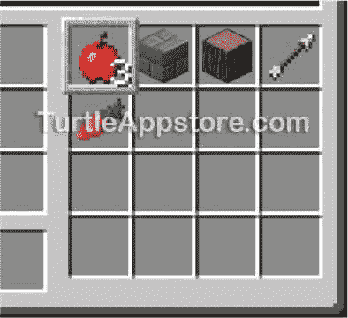
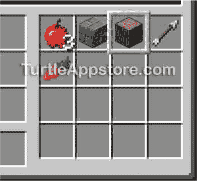
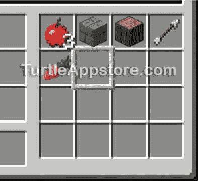
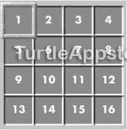

# 7 创建模块以重用您的代码

> 原文：<https://turtleappstore.com/book/chapter7.html>


随着您的程序变得越来越复杂，您可能想要重用您已经编写的代码来节省时间。幸运的是，你可以将你的代码复用为一个*模块*，它是一个包含其他程序可以调用的函数的程序。

在本章中，你将学习如何创建自定义函数和你自己的模块。海龟们将需要在第 8 章中运行这些函数，所以你将编写你的树农海龟(以及你在后面章节中制作的海龟)将作为一个模块加载的函数。

### **用函数语句创建函数**

要创建自己的函数，可以使用一个`function`语句，该语句由关键字`function`后跟函数名和一组括号组成。在`function`语句之后和`end`语句之前的所有代码都是函数的一部分。

让我们通过编写一个函数来看看它是如何工作的。运行 edit hellofunction 并输入以下代码，创建一个新程序:

*hellofunction*

```turtle
1\. print('Start of the program.')
2.
3\. function hello()
4.   print('Hello, world!')
5\. end
6.
7\. hello()
8\. hello()
9\. print('End of the program.')
```

然后从命令 shell 运行 hellofunction 。输出将如下所示:

```turtle
> hellofunction
Start of the program.
Hello, world!
Hello, world!
End of the program.
```

第 1 行打印`Start of the program.`并且不是函数的一部分。第 3 行创建了`hello()`函数，但是请注意`hello()`函数并没有在这里运行，而是跳到了第 7 行。

创建函数时，函数中的代码不会运行。它只在函数被调用时运行。你在程序中调用一个函数，使用它的名字后面跟一组括号。这个语法告诉程序执行包含在函数中的代码。我们在第 7 行调用`hello()`函数，这使得执行移动到创建函数的第 4 行。4 号线打印`Hello, world!`。

当函数调用结束时，程序返回到最初调用函数的那一行并继续执行。在这种情况下，当执行到达`hello()`函数的`end`语句时，它返回到调用它的第 7 行，然后移动到第 8 行。第 8 行也调用`hello()`，使执行返回到第 4 行的函数，再次打印`Hello, world!`。然后，当执行到达`hello()`函数的末尾时，它返回到第 8 行。最后，第 9 行打印`End of the program.`，程序终止。

`hello()`函数很简单，但是它并不比编写两个`print()`调用更方便。然而，随着程序变得越来越复杂，将代码组织成函数将变得更加有用，尤其是当您开始使用参数时。

#### **自变量和参数**

我们可以在调用函数时向函数发送值。这些值被称为*自变量*。自变量被分配给称为*参数*的变量。参数在函数内部使用，就像变量一样。

要查看自变量和参数是如何工作的，运行 edit sayhello 并输入以下代码来创建一个新程序。这个程序告诉海龟打印一条问候另一只海龟的信息:

*打招呼*

```turtle
1\. function sayHello(name) -- name is a parameter
2.   print('Hello, ' .. name)
3\. end
4.
5\. sayHello('Artemisia')  -- 'Artemisia' is an argument
6\. sayHello('Elisabetta') -- 'Elisabetta' is an argument
```

在这个程序中，第 1 行的`sayHello`函数语句中的`name`变量是一个参数。第 5 行和第 6 行的字符串`'Artemisia'`和`'Elisabetta'`是参数。

第 1 行创建了`sayHello()`函数，但是`sayHello()`只在被调用时运行，所以执行跳到第 5 行。第 5 行是对`sayHello()`函数的函数调用。当我们像这样在函数调用中使用参数时，我们说我们正在*传递*参数给函数调用。第 5 行将`'Artemisia'`作为参数传递给`sayHello()`，这使得执行转移到第 2 行的`sayHello()`函数。然后，`name`变量，即函数的参数，被设置为它所传递的参数，即`'Artemisia'`。第 2 行的`print()`函数调用中使用了`name`变量，因此程序打印出`Hello, Artemisia`。

当执行到达`sayHello()`函数的结尾时，它返回到第 5 行，然后移动到第 6 行。第 6 行再次调用`sayHello()`，但是这次将`'Elisabetta'`作为参数传递，这使得执行将`name`设置为`'Elisabetta'`。执行移至第 2 行并打印`Hello, Elisabetta`。然后，执行到达`sayHello()`函数的末尾，并返回到第 6 行。因为没有更多的代码行，程序终止。

在你的海龟身上运行`sayhello`程序。它将显示以下内容:

```turtle
> sayhello
Hello, Artemisia
Hello, Elisabetta
```

`sayHello()`函数将根据传递给它的参数打印不同的字符串。

#### **返回值**

函数调用计算出一个*返回值*，您可以像使用任何其他值一样使用它。因此，您可以在表达式中任何需要使用值的地方使用函数调用。例如，在 Lua shell 中输入以下内容。

```turtle
lua> math.random(1, 6) + 1
5
```

函数调用`math.random(1, 6)`从`1`到`6`返回一个随机值。在这个例子中，返回值是`4`，所以这个表达式计算为`4 + 1`，然后计算为值`5`。(你可能会得到一个不同的数字，因为`math.random()`毕竟是随机的。)

当创建自己的函数时，使用一个`return`语句指定返回值。一条`return`语句由`return`关键字后跟一个值或表达式组成。要查看`return`语句如何工作，运行 edit givecandy 并输入以下代码创建一个新程序:

*给糖果*

```turtle
 1\. function candiesToGive(name)
 2.   if name == 'Al' then
 3.     return 10
 4.   end
 5.
 6.   return 2
 7\. end
 8.
 9\. lavCandy = candiesToGive('Lavinia')
10\. alCandy = candiesToGive('Al')
11\. print('Lavinia gets ' .. lavCandy .. ' pieces')
12\. print('Al gets ' .. alCandy .. ' pieces')
```

`candiesToGive()`函数返回值`10`或`2`，这取决于为其`name`参数传递的内容。当`'Al'`传递给函数时，函数中的`if`语句为`true`，使得执行移动到第 3 行并返回`10`。当任何其他值被传递给函数时，`if`语句的比较结果是`false`，所以执行跳到第 6 行，使函数返回`2`。您可以将参数视为函数的输入，将返回值视为输出。

在第 9 行，当`'Lavinia'`被传递给`candiesToGive()`时，函数返回`2`，这意味着变量`lavCandy`被赋值给`2`。在第 10 行上，`alCandy`被赋予值`10`，当`'Al'`作为参数传递时，该值由`candiesToGive()`返回。变量`lavCandy`和`alCandy`可以在`print()`函数调用中使用，如第 11 行和第 12 行，因为它们都存储返回值。

当您运行该程序时，输出如下所示:

```turtle
> givecandy
Lavinia gets 2 pieces
Al gets 10 pieces
```

### **制作功能模块**

不需要在每个使用它们的程序中输入函数，只需在一个模块中输入一次函数，然后每个加载该模块的程序都可以使用它们。这叫做*代码复用*。

您可以像创建程序一样用`edit`程序创建模块，然后您可以将模块导入到其他程序中。在这一章，你将学习如何创建一个模块，在下一章，你将学习如何在其他程序中使用模块。我们现在将创建`hare`模块(就像寓言“龟兔赛跑”中一样)，并用它给我们所有的乌龟一些方便的实用函数。

通过在命令 shell 中运行 edit hare 并输入以下代码来创建`hare`模块:

我会

```turtle
 1\. --[[Function Module program by Al Sweigart
 2\. Provides useful utility functions.]]
 3.
 4\. -- selectItem() selects the inventory
 5\. -- slot with the named item, returns
 6\. -- true if found and false if not
 7\. function selectItem(name)
 8.   -- check all inventory slots
 9.   local item
10.   for slot = 1, 16 do
11.     item = turtle.getItemDetail(slot)
12.     if item ~= nil and item['name'] == name then
13.       turtle.select(slot)
14.       return true
15.     end
16.   end
17.
18.   return false  -- couldn't find item
19\. end
20.
21.
22\. -- selectEmptySlot() selects inventory
23\. -- slot that is empty, returns true if
24\. -- found, false if no empty spaces
25\. function selectEmptySlot()
26
27.   -- loop through all slots
28.   for slot = 1, 16 do  
29.     if turtle.getItemCount(slot) == 0 then
30.       turtle.select(slot)
31.       return true
32.     end
33.   end
34.   return false -- couldn't find empty space
35\. end
```

这个模块有 35 行，但是你只需要输入一次。如果没有这个模块，你将不得不在每一个你想使用它的程序中输入这个代码。模块为您节省大量时间！在下一节中，我们将在 Lua shell 中试验`hare`模块的功能。

如果您在运行这个程序时遇到错误，请仔细地将您的代码与本书中的代码进行比较，找出任何打字错误。如果你仍然不能修复你的程序，通过运行`delete hare`删除文件，然后通过运行`pastebin get wwzvaKuW hare`下载它。(注意，你从 pastebin 下载的`hare`模块包含了书中所有添加到它上面的函数，而不仅仅是本章中添加的函数。)

#### **用操作系统加载模块。LOADAPI()函数**

`hare`模块包含两个功能:`selectItem()`和`selectEmptySlot()`。`selectItem()`功能选择一个包含给定物品的库存位置，而`selectEmptySlot()`功能选择它能找到的第一个没有任何物品的库存位置。当你在处理海龟的存货时，这两个功能都很有用。

Lua 的内置模块(比如`math`或者`os`模块)是自动为所有海龟程序加载的，但是你需要通过调用`os.loadAPI()`函数来加载你创建的模块。注意 ComputerCraft 也调用模块*应用编程接口(API)*。要使用`os.loadAPI()`，将您想要加载的模块的名称作为一个字符串值传递。例如，你需要运行`os.loadAPI('hare')`来在你程序的其余部分使用`hare`模块的功能。

`os.loadAPI()`函数使程序的函数可供调用程序使用。如果模块被找到并运行，函数返回`true`。如果模块不存在，它将返回`false`——例如，如果您打错了一个错别字，比如`os.loadAPI('har')`。在下一节中，您将加载`hare`模块并调用它的一些函数。

#### **试验野兔模块**

要查看`selectItem()`功能是如何工作的，打开乌龟的 GUI，把橡木原木和其他几样东西放到乌龟的库存里，如图 7-1 所示。

然后，打开 Lua shell 并输入以下代码来选择包含日志的插槽:

```turtle
lua> os.loadAPI('hare')
true
lua> hare.selectItem('minecraft:log')
true
```

第一行代码加载了`hare`模块，第二行代码通过将字符串`'minecraft:log'`传递给`selectItem()`来选择海龟库存中的木头块。



图 7-1:海龟的图形用户界面包含橡树原木和各种项目，槽 1 是当前槽。

`'minecraft:log'`字符串是橡木原木的《我的世界》名称 ID。一个*名称 ID* 是一个以`'minecraft:'`开头的唯一字符串，《我的世界》用它来标识块和库存项目。您可以在第 219 页的[的](#calibre_link-38)[模块名称 id 列表](#calibre_link-37)中找到名称 id 列表。在第 80 页[的](#calibre_link-40)[从插槽](#calibre_link-39)获取物品详情中，您将了解如何使用`turtle.getItemDetail()`函数获取物品的名称 ID，而不是去查找。

当你查看乌龟的库存时，注意木头块当前被选中，如图[图 7-2](#calibre_link-41) 所示。无论日志在哪个库存槽中，`hare.selectItem()`功能都可以找到并选择日志。尝试将日志移动到不同的插槽并再次运行`hare.selectItem('minecraft:log')`。日志所在的插槽将再次被选中，如插槽周围的粗边框所示。



*图 7-2:运行*hare . selectitem(‘minecraft:log’)*后选择有日志的槽。*

`selectEmptySlot()`函数选择它能找到的第一个空的库存槽。这个函数在你要开采区块时很有用，因为你需要一个空的槽来存放开采的区块。在 Lua shell 中，运行以下代码:

```turtle
lua> os.loadAPI('hare')
true
lua> hare.selectEmptySlot()
true
```

调用`hare.selectEmptySlot()`后，将选择第一个空槽，如图[图 7-3](#calibre_link-42) 所示。



*图 7-3:调用*hare . selectemptyslot()*后选择第一个空槽。*

《T2》第八章中的植树程序将使用两个函数`selectItem()`和`selectEmptySlot()`，但它们在许多海龟程序中可能会有用。让我们看看它们背后的代码。

### **看乌龟的库存**

`hare`模块的第一部分包含程序的注释和解释`selectItem()`功能的附加注释。

我会

```turtle
 1\. --[[Function Module program by Al Sweigart
 2\. Provides useful utility functions.]]
 3.
 4\. -- selectItem() selects the inventory
 5\. -- slot with the named item, returns
 6\. -- true if found and false if not
 7\. function selectItem(name)
```

`selectItem()`函数的`function`语句在第 7 行。请记住，每当函数被*调用*时，就会执行函数语句后面的代码。当第一次遇到`function`语句时，块中的代码不会运行。要理解`selectItem()`中的功能代码，首先需要了解用于查看海龟库存的某些功能。

每只海龟有 16 个槽位，编号如图[图 7-4](#calibre_link-43) 所示。



*图 7-4:一只海龟的库存槽编号*

海龟有三个内置的功能，允许你用槽号和海龟的库存互动。这些功能被称为`turtle.select()`、`turtle.getItemCount()`和`turtle.getItemDetail()`。让我们更详细地看看这些函数是如何工作的。

#### **选择库存槽**

您可以使用`turtle.select()`功能更改当前插槽，方法是将您想要选择的插槽编号传递给该功能。参见图 7-4 中[所示的槽号。在 Lua shell 中输入以下几行，看看这个函数是如何工作的:](#calibre_link-43)

```turtle
lua> turtle.select(2)
true
lua> turtle.select(16)
true
```

调用该函数后，请注意指示当前插槽变更的粗边框。许多其他 turtle 函数使用当前槽，所以当你需要与特定槽或槽中的项目交互时，知道如何在程序中改变它是很有用的。

#### **计算插槽中的物品数量**

如果您想知道一个库存槽中有多少物品，调用`turtle.getItemCount()`函数并向其传递一个槽号。在 Lua shell 中输入以下行:

```turtle
lua> turtle.getItemCount(1)
1
lua> turtle.getItemCount(16)
0
```

如果不向`turtle.getItemCount()`传递任何参数，该函数将检查当前选择的插槽。这个函数很简单，它返回一个库存槽中的商品数量，但是它不告诉您库存槽中有什么。要了解槽中存储了什么的细节，您需要使用`turtle.getItemDetail()`函数。

#### **从插槽中获取物品详情**

你可以通过调用`turtle.getItemDetail()`函数并把你想要检查的槽号传递给函数来检测海龟库存的细节。在 inventory slot 1 中放入一个木制日志，然后在 Lua shell 中输入以下代码:

```turtle
lua> turtle.getItemDetail(1)
{
  count = 1,
  name = "minecraft:log",
  damage = 0,
}
```

`turtle.getItemDetail()`返回的值表示一个日志在库存槽 1 中。如果那个库存槽中什么都没有，`turtle.getItemDetail()`返回`nil`。如果不向`turtle.getItemDetail()`传递任何参数，它将返回关于当前所选插槽的信息。

返回值看起来与您到目前为止看到的其他值完全不同，因为它是一个表值。

#### **表格数据类型**

*表值*可以保存多个值。与字符串以引号开始和结束类似，表数据类型的值以大括号`{` `}`开始和结束。表值包含的值被组织在*键-值对*中，这些键-值对用逗号分隔。在 Lua shell 中输入下面一行来创建一个新的表值，看看这些对是什么样子的:

```turtle
lua> myStuff = {logs=5, stone=4, arrows=10}
```

这一行将表格值`{logs=5, stone=4, arrows=10}`分配给变量`myStuff`。该表中的三个数值——`5`、`4`和`10`——是键-值对的*值*部分。它们可以通过各自的按键来识别:`'logs'`、`'stone'`和`'arrows'`。一个键和一个值一起构成一个键-值对，比如`logs=5`，键在前，等号(`=`)，然后是值。键和值几乎可以是任何数据类型，因此键可以是整数，值可以是字符串。唯一的例外是表键不能是`nil`值。

要访问表中的单个值，请输入变量`myStuff`，后跟方括号中的键`[ ]`。该语句将计算与该键关联的表中的值。例如，在 Lua shell 中输入以下内容，从我们之前创建的表中访问一个值:

```turtle
lua> myStuff['logs']
5
lua> 'I have ' .. myStuff['stone'] .. ' stone.'
I have 4 stone.
lua> 'I need ' .. (12 - myStuff['arrows']) .. ' more arrows to have a dozen.'
I need 2 more arrows to have a dozen.
```

第一行代码计算出与`'logs'`相关的值，也就是数字`5`。因为表达式的计算结果是一个值，所以您可以在通常使用值的任何地方使用它，例如连接字符串或进行数学运算时(如果值是一个数字)。

#### **查看乌龟送回的桌子。GETITEMDETAIL()函数**

我们再来看一下`turtle.getItemDetail()`函数。将一根原木放入库存槽 1，然后在 Lua shell 中输入以下内容:

```turtle
lua> item = turtle.getItemDetail(1)
lua> item['name']
minecraft:log
lua> item['count']
1
```

当您输入`item['name']`时，您将获得表中键`name`处的值，即`minecraft:log`。您还可以检索其他值，比如与键`count`相关联的值。现在，您有了一种以字符串和数值形式获取海龟库存信息的方法！请注意，如果`turtle.getItemDetail()`返回`nil`，因为该库存槽中没有任何东西，尝试使用方括号将导致错误:

```turtle
lua> item = turtle.getItemDetail(16)
lua> item['name']
lua:1: attempt to index ? (a nil value)
```

为了防止这种错误在你的程序中发生，确保没有使用`if`语句将`item`设置为`nil`。虽然我们不会在本章的程序中使用这个代码，但是如果你需要在以后的程序中这样做，你可以使用下面的代码:

```turtle
local item = turtle.getItemDetail(16)
if item ~= nil then
    print(item['name'])
end
```

使用此代码，`item['name']`仅在`item`不等于`~=`和`nil`时运行。

### **全局和局部范围**

`selectItem()`函数将在海龟的库存中找到一个对应于传递给函数的`name`参数的字符串的项目。这个函数首先在第 9 行声明了一个名为`item`的局部变量。这个局部变量只存在于`selectItem()`函数中，不能在程序的其他地方使用。

*我会*

```turtle
 7\. function selectItem(name)
 8.   -- check all inventory slots
 9.   local item
```

你已经学习了第 49 页的[的](#calibre_link-45)[布尔数据类型](#calibre_link-44)中的`local`关键字，但是你还没有学习作用域。一个*作用域*是程序的一部分，其中变量是可见的，局部变量只存在于一个作用域内。Lua 有两种类型的作用域:全局和局部。

在*全局作用域*中声明的变量是在任何函数之外声明的，在程序的所有部分都是可见的。如果您不小心重用了变量名，这可能会导致问题，因为程序将使用变量中任何以前存储的值，或者允许函数用新值覆盖变量。为了解决这个问题，您可以在每次创建函数时创建的*局部作用域*中创建变量。当一个变量被声明为函数的局部变量时，它将只存在于该函数的局部范围内，一旦函数返回，它将不复存在。

通过使用局部变量，只要存在于不同的作用域中，就可以有两个同名的变量。因为将来您会给`hare`模块添加更多的函数，所以我们将`item`声明为`selectItem()`函数的局部函数。除非你需要一个可以在整个程序中被访问的变量，否则最好在每个函数中将变量声明为局部变量，以避免将来出现问题。

在`for`循环中使用的变量，例如`for i = 1, 4 do`中的`i`变量，是那个`for`循环的局部变量。这些变量不会存在于`for`循环之外，就像函数的局部变量不会存在于函数之外一样。

### **使用 FOR 循环查找项目**

在我们设置好变量之后，程序创建一个名为`slot`的变量，它位于第 10 行的`for`循环中。

我会

```turtle
10.   for slot = 1, 16 do
11.     item = turtle.getItemDetail(slot)
12.     if item ~= nil and item['name'] == name then
13.       turtle.select(slot)
14.       return true
15.     end
16.   end
17.
18.   return false  -- couldn't find item
19\. end
```

在循环的`end`语句之后，`for slot = 1, 16 do`中的`slot`变量将不存在。它是本地的`for`循环。`for`循环将`slot`设置为`1`和`16`之间的每个值。在这个`for`循环中，第 11 行在`slot`获取库存项目的表值，并将该值存储在`item`中。第 12 行检查`item`不是`nil`，并且检查项目名称是否与`name`参数匹配。如果名称匹配，程序就找到了该项目并选择了该插槽。第 14 行返回`true`告诉代码`selectItem()`已经选择了该项。

第 15 行的`end`语句结束了`if`语句，第 16 行的`end`语句结束了`for`循环语句。如果执行完成了`for`循环的所有迭代，并且没有找到具有匹配名称的项目，则函数在第 18 行返回`false`。最后，第 19 行的`end`语句结束了`function`语句。

### **选择一个空的库存槽**

`selectEmptySlot()`功能试图找到一个空的库存位置。如果找到一个，它使用`turtle.select()`选择插槽并返回`true`。如果乌龟的库存完全满了，函数会返回`false`。像`selectItem()`功能一样，`selectEmptySlot()`有一个`for`循环，检查库存槽`1`到`16`。该函数中的`for`循环还在第 28 行声明了变量`slot`，这是因为在第 10 行定义的`slot`变量和这个`slot`变量在不同的局部范围内。

我会

```turtle
25\. function selectEmptySlot()
26.
27.   -- loop through all slots
28.   for slot = 1, 16 do  
29.     if turtle.getItemCount(slot) == 0 then
30.       turtle.select(slot)
31.       return true
32.     end
33.   end
34.   return false -- couldn't find empty space
35\. end
```

在循环内部，第 29 行调用`turtle.getItemCount()`来检查当前正在检查的槽中的项目数是否为`0`。当第 29 行找到第一个空的库存槽时，第 30 行选择这个槽，第 31 行返回`true`。

如果执行完成了`for`循环的所有迭代，而没有发现任何空的库存槽，则第 34 行返回`false`。

**奖励活动:舞蹈动作模块**

试着创造一个海龟可以表演的舞蹈动作的新模块。您可以编写执行跳跃、旋转和月球漫步(向后行走)的函数。

### **你学到了什么**

在本章中，你学习了如何用`function`语句创建模块和你自己的函数。函数可以有参数，参数作为输入传递给函数。函数也可以向调用该函数的代码返回值。

函数每次被调用时都会创建一个新的局部作用域。当函数返回时，作用域和其中的所有变量都被销毁，这意味着不同的变量可以有相同的名称，只要它们在不同的作用域中。一个`for`循环的变量也存在于循环块中它自己的局部范围内。您的`hare`模块中的函数调用其他 ComputerCraft 函数:`turtle.select()`、`turtle.getItemDetail()`和`turtle.getItemCount()`。

您可以将自己创建的函数放在模块中，让其他程序使用它们。创建自己的函数和模块是一种编程技术，可以让你编写更复杂的海龟程序。在第 8 章的[中，你将使用`hare`模块创建一个林场来自动采集原木。](#calibre_link-35)