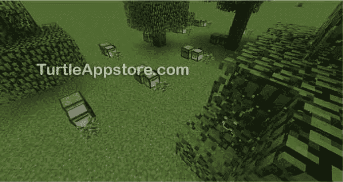
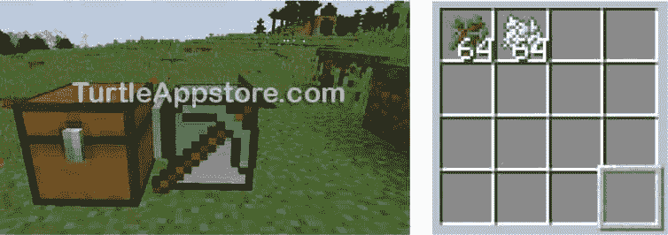
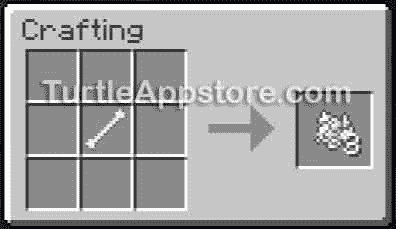
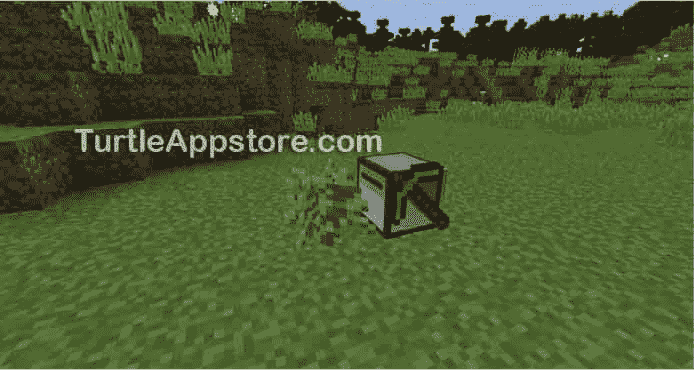
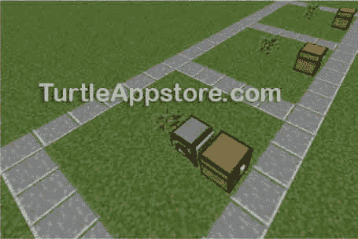

# 8 运行自动化林场

> 原文：<https://turtleappstore.com/book/chapter8.html>


在[第六章](#calibre_link-47)中，我们编程了一只乌龟去砍树，但是玩家还是要手动将乌龟放置在一棵树前，程序才能运行。在每一棵你想砍倒的树前放一只乌龟并不比你自己砍一棵树更有效率。我们可以去掉这一手动步骤，通过给海龟编程来种植树苗，实现木材加工过程的完全自动化。结果，乌龟可以种一棵树苗，等它变成树的时候收割，然后再种一棵新的树苗，重复这个过程，不需要任何人为干预！为此，我们将编写一个名为`farmtrees`的程序。可以设置多只乌龟种树，如图[图 8-1](#calibre_link-48) 所示。



*图 8-1:一个由海龟看管的自动化林场，每只海龟运行* 农场树木 *程序*

我们将重用我们已经在`hare`模块([第 7 章](#calibre_link-49))和`choptree`程序([第 6 章](#calibre_link-47))中编写的代码来收获木材，所以没有必要重写所有代码！

### **设计植树计划**

我们将让乌龟停留在一个地方，而不是把它移到每棵树上。海龟会用骨粉种植树苗，以加速树苗的生长。然后，一旦树苗长成了树，乌龟就会把它收获，把收获的木头放进乌龟后面的一个箱子里。

以下是植树计划的详细步骤:

1.  检查以确保`hare`模块和`choptree`程序存在。

2.  在乌龟的清单中选择树苗。如果没有，退出程序。

3.  种树苗。

4.  在种植的树苗上反复使用骨粉，直到它长大。

5.  运行`choptree`程序。

6.  把伐木放在乌龟后面的箱子里。

7.  重复整个过程。

海龟会重复这一过程，直到用完树苗或骨粉。现在我们知道了代码应该做什么，让我们来写程序。

### **编写农家乐程序**

在命令行输入 edit farmtrees 运行文本编辑器。在文本编辑器中，输入以下代码行。记住不要键入行号，因为它们仅用于参考。

*农场树*

```turtle
 1\. --[[Tree Farming program by Al Sweigart
 2\. Plants tree then cuts it down.]]
 3.
 4\. os.loadAPI('hare')  -- load the hare module
 5.
 6\. local blockExists, item
 7\. local logCount = 0
 8.
 9\. -- check if choptree program exists
10\. if not fs.exists('choptree') then
11.   error('You must install choptree program first.')
12\. end
13.
14\. while true do
15.   -- check inventory for saplings
16.   if not hare.selectItem('minecraft:sapling') then
17.     error('Out of saplings.')
18.   end
19.
20.   print('Planting...')
21.   turtle.place()  -- plant sapling
22.
23.   -- loop until a tree has grown
24.   while true do
25.     blockExists, item = turtle.inspect()
26.     if blockExists and item['name'] == 'minecraft:sapling' then
27.       -- "dye" is the name ID for bone meal
28.       if not hare.selectItem('minecraft:dye') then
29.         error('Out of bone meal.')
30.       end
31.
32.       print('Using bone meal...')
33.       turtle.place()  -- use bone meal  
34.     else
35.       break  -- tree has grown
36.     end
37.   end
38.
39.   hare.selectEmptySlot()
40.   shell.run('choptree')  -- run choptree
41.
42.   -- move to and face chest
43.   turtle.back()
44.   turtle.turnLeft()
45.   turtle.turnLeft()
46.
47.   -- put logs into chest
48.   while hare.selectItem('minecraft:log') do
49.     logCount = logCount + turtle.getItemCount()
50.     print('Total logs: ' .. logCount)
51.     turtle.drop()
52.   end
53.
54.   -- face planting spot
55.   turtle.turnLeft()
56.   turtle.turnLeft()
57\. end
```

输入所有代码后，按下 <small class="calibre12">CTRL</small> 键，确认选择【保存】，按下 <small class="calibre12">ENTER</small> 。然后按 <small class="calibre12">CTRL</small> ，选择【退出】，再按 <small class="calibre12">ENTER</small> 退出编辑器。

### **运行 FARMTREES 程序**

在运行`farmtrees`程序之前，你需要做一些设置。首先，确保一个箱子在乌龟的正后方，并且树苗和骨粉在乌龟的存货中，如图[图 8-2](#calibre_link-50) 所示。



*图 8-2:在乌龟后面放置一个箱子，将树苗和骨粉放入乌龟的存货中。*

你可以用击败骷髅后掉落的骨头制作骨粉。使用[图 8-3](#calibre_link-51) 所示的食谱制作骨粉。



*图 8-3:用一根骨头制作三种骨粉*

第二，确保你留了一个空的存货格来储存海龟将要收获的木材。

当您完成程序的所有准备工作后，运行`farmtrees`。你应该看到海龟种下一棵树苗，然后在树苗长成大树时把它砍倒。接下来，乌龟将返回地面，面对箱子放下它收集的木头。然后乌龟会转身面对它原来的方向，重复这个过程。

如果您在运行这个程序时遇到错误，请仔细地将您的代码与本书中的代码进行比较，找出任何打字错误。如果你仍然不能修复你的程序，通过运行`delete farmtrees`删除文件，然后通过运行`pastebin get v5h8AgGs farmtrees`下载它。

### **MINECRAFT 中的树类型**

虽然《我的世界》有许多不同种类的树，每一种都有它们自己的树苗，但是某些树比其他的更适合用在`farmtrees`中，因为海龟会收获树的一根柱子，直接向上移动。如果一棵树分叉了，海龟会很快停止收割，因为它不会沿着树的曲线前进。因此，最好的树是像图 8-4 所示的橡树、云杉、桦树和丛林树那样的又高又窄的树干。相思树分枝太多没有用，暗橡树需要在 2 × 2 的区域内种植树苗，这意味着它们要占用很多空间。


*图 8-4:从左到右:橡树、云杉、桦树和丛林树*

当我们在第 16 行调用`hare.selectItem()`时，所有的树苗都将有名字`'minecraft:sapling'`，所以当你把树苗放进海龟的存货清单让它耕种时，确保它们是橡树、云杉、桦树或丛林树苗。

### **MINECRAFT 中的大块装载**

对于`farmtrees`计划，你不需要在海龟伐木的时候监督它，但是由于《我的世界》世界的运作方式，你不应该离开海龟太远。《我的世界》的世界实际上是无限的，因为当你进入某个区域时，它会生成世界的一部分。然而，因为总是加载整个世界会占用太多的计算机内存，所以《我的世界》只加载玩家附近的区域。在《我的世界》，地图被分成 16 块乘 16 块的区域，称为*块*，从游戏世界的底部到顶部加载。当玩家向其他块移动时，块从硬盘加载到计算机的内存中，而离玩家最远的块被卸载。

块对 turtle 编程很重要，因为如果块卸载了，turtle 就会关闭。例如，在我的电脑上，如果我离海龟 400 到 450 个街区远，它们就会关闭。同样，如果你的**渲染距离**选项(在**选项****视频设置**下找到)设置为一个较低的数字，海龟们会更快地卸载。如果你养了几只树龟，然后搬到离我家很远的地方，它们可能会停止工作。当海龟的程序运行时，最好把它们放在附近，并把尽可能多的海龟放进一个小区域。

现在你已经知道了如何使用`farmtrees`程序的所有细节，让我们看看它的每一部分代码。

### **用操作系统加载模块。LOADAPI()函数**

在第 1 行和第 2 行描述程序的注释之后，第 4 行加载您在第 7 章的[中创建的`hare`模块。](#calibre_link-49)

*农场树*

```turtle
 1\. --[[Tree Farming program by Al Sweigart
 2\. Plants tree then cuts it down.]]
 3.
 4\. os.loadAPI('hare')  -- load the hare module
 5.
 6\. local blockExists, item
 7\. local logCount = 0
```

为了允许程序调用`hare.selectEmptySlot()`和`hare.selectItem()`函数，这在第 7 章的[中有解释，你的程序必须首先调用`os.loadAPI()`函数并传递字符串`'hare'`来加载`hare`模块。](#calibre_link-49)

第 6 行和第 7 行声明了程序将使用的变量，以便于查找。当海龟检查它种下的树苗是否已经长成一棵树时，`blockExists`和`item`变量在程序的后面存储值。`logCount`变量记录海龟收获了多少木块，这是程序第一次运行时的`0`。

### **用 FS 检查文件。EXISTS()函数**

在程序开始种树之前，它检查海龟身上是否存在`choptree`程序。否则，当 turtle 试图运行`farmtrees`程序时，你会得到一个错误。

*农场树*

```turtle
 9\. -- check if choptree program exists
10\. if not fs.exists('choptree') then
11.   error('You must install choptree program first.')
12\. end
```

您可以使用`fs.exists()`函数检查`choptree`程序是否存在，该函数获取一个文件名，如果存在同名文件，则返回`true`，如果不存在，则返回`false`。如果`choptree`程序不存在，第 11 行终止程序并显示错误信息`You must install choptree program first`。

### **在乌龟的库存中挑选树苗**

第 14 行开始了程序的`while`循环，种植树苗并收获木材。每次程序完成从它种植的树上采集木材，它循环回到第 14 行重复这个过程。因为`while`循环的条件总是`true`，所以它是一个无限循环，直到程序以`error()`调用或`break`语句终止才停止(我在第 94 页的[用`break`语句](#calibre_link-53)跳出循环中对此进行了解释)。

在`while`循环中，程序首先检查海龟库存中的树苗。

*农场树*

```turtle
14\. while true do
15.   -- check inventory for saplings
16.   if not hare.selectItem('minecraft:sapling') then
17.     error('Out of saplings.')
18.   end
```

第 16 行使用`hare`模块的`selectItem()`函数来选择包含树苗的库存槽。如果海龟的库存里没有树苗，这个函数返回`false`。在这种情况下，第 17 行通过调用`error()`并显示错误消息`Out of saplings`来终止程序。

#### **种树**

如果执行通过了树苗检查，第 20 行显示一个状态更新，说明海龟将要种植树苗。第 21 行调用`turtle.place()`函数来完成种植。

*农场树*

```turtle
20.   print('Planting...')
21.   turtle.place()  -- plant sapling
```

`turtle.place()`函数将方块放在海龟前面的当前位置。该功能适用于树苗、木板、石砖或玩家可以放置在世界上的任何其他砖块。回想一下，第 16 行选择了带有树苗的库存槽，因此`turtle.place()`函数放置了一棵树苗。[图 8-5](#calibre_link-55) 显示的是栽在乌龟面前的树苗。



*图 8-5:乌龟种下的树苗*

**注**

*在你可能需要它们的情况下，你也可以使用* turtle.placeUp() *和*turtle . place down()*函数在乌龟的上方和下方放置方块。如果放置成功，这些函数返回* true *。如果一个块已经在那里，或者其他东西阻止了块的放置，这些函数返回* false *。*

#### **检查方块并等待树生长**

在种植树苗后，执行进入第 14 行的`while`循环内的另一个`while`循环。这个内部`while`循环从第 24 行开始。在这个循环中，程序使用`turtle.inspect()`函数检查海龟前面的方块，这个函数与`turtle.detect()`类似，除了`turtle.detect()`只在方块出现时返回`true`或`false`，而`turtle.inspect()`返回一个表值，详细说明海龟前面是哪种方块。

*农场树*

```turtle
23.   -- loop until a tree has grown
24.   while true do
25.     blockExists, item = turtle.inspect()
```

`turtle.inspect()`函数返回两个值，存储在程序开始时声明的`blockExists`和`item`变量中。如果乌龟前面有方块，第一个返回值(存储在`blockExists`中)是布尔型`true`，如果乌龟前面没有方块，则返回`false`。第二个返回值(存储在`item`中)是一个表值，包含关于该块的信息。如果乌龟前面没有方块，这个第二个返回值将是`nil`。

当方块在乌龟前面时，在 Lua shell 中运行`turtle.inspect()`可以找到任何项目的名称。例如，如果一棵树苗在一只乌龟前面，并且您运行该命令，您将会看到以下内容:

```turtle
lua> turtle.inspect()
true
{
  state = {
    type = "oak",
    stage = 0,
  },
  name = "minecraft:sapling",
  metadata = 0,
}
```

第 26 行的`if`语句检查海龟前面的块是否存在，并且它是一棵树苗。如果是，那么第 28 行到第 33 行将反复尝试在树苗上使用骨粉来加速它长成一棵树。

*农场树*

```turtle
26.     if blockExists and item['name'] == 'minecraft:sapling' then
27.       -- "dye" is the name ID for bone meal
28.       if not hare.selectItem('minecraft:dye') then
29.         error('Out of bone meal.')
30.       end
```

第 28 行检查海龟的骨粉库存。骨粉项目在《我的世界》的名称是`'minecraft:dye'`。类似于不同的树苗有相同的名字`'minecraft:sapling'`，骨粉与其他类型的物品共享名字 ID `'minecraft:dye'`。

如果乌龟的库存中没有骨粉，那么`hare.selectItem('minecraft:dye')`返回`false`，第 29 行终止程序，并显示错误消息`Out of bone meal`。

否则，执行继续到第 32 行，在那里程序打印一条消息告诉用户乌龟在做什么，然后通过把它放在乌龟前面来使用树苗上的骨粉。

*农场树*

```turtle
32.       print('Using bone meal...')
33.       turtle.place()  -- use bone meal
```

执行跳过第 34 行的`else`语句，因为条件不是`false`，并且在`while`循环中没有其他行。使用骨粉后，执行循环回到第 24 行，重复检查乌龟前面的树苗。

#### **用 BREAK 语句跳出循环**

如果第 26 行的条件是`false`，那么海龟前面没有检测到树苗，执行移到第 34 行的`else`语句之后的块。树苗将会消失，因为它已经长成了一棵树，一个木块现在在乌龟的面前。当第 35 行运行时，`break`语句导致执行退出从第 24 行开始的`while`循环。

*农场树*

```turtle
34.     else
35.       break  -- tree has grown
36.     end
37.   end
```

`break`语句仅由`break`关键字组成。一条`break`语句导致执行立即退出一个循环，并跳过它，而不重新检查`while`循环的条件。第 35 行的`break`语句导致执行移到循环外的第一行，也就是第 39 行。

第 36 行结束了`else`语句的代码块，第 37 行结束了`while`语句的代码块。

### 用外壳运行其他程序。运行()函数

`shell.run()`函数让你的程序像在命令 shell 中一样执行命令。`farmtrees`程序将使用这个函数来运行`choptree`程序。

*农场树*

```turtle
39.   hare.selectEmptySlot()
40.   shell.run('choptree')  -- run choptree
```

第 39 行调用`hare`模块的`selectEmptySlot()`函数，以确保海龟矿的木块将进入一个空的库存槽。(否则,`choptree`计划就不会起作用。)然后，第 40 行通过调用`shell.run()`并传递字符串`'choptree'`来运行`choptree`程序。

传递给`shell.run()`的字符串与您在命令 shell 中输入的文本相同。在程序中调用`shell.run('choptree')`与在命令 shell 中运行`choptree`程序做同样的事情。

这就是你的程序运行其他程序的方式。当`choptree`程序终止时，将从第 40 行继续执行。

### **用乌龟掉落功能处理物品**

在`choptree`程序的最后，海龟将会下降到树苗最初种植的地方。然后它向后移动一个的空间回到原来的位置，左转两次面向胸部，准备放下木头。

*农场树*

```turtle
42.   -- move to and face chest
43.   turtle.back()
44.   turtle.turnLeft()
45.   turtle.turnLeft()
```

`turtle.drop()`功能使乌龟将当前存货格中的所有物品放入它所面对的箱子中(如果没有箱子，则放在地上)。如果您将一个数字传递给`turtle.drop()`函数，您可以在当前槽中放置一定数量的项目，而不是所有的项目。例如，下面的 Lua shell 示例将只删除一项:

```turtle
lua> turtle.drop(1)
```

**注**

*在你可能需要它们的情况下，你也可以使用* turtle.dropUp() *和*turtle . drop down()*函数将项目放到乌龟的上面和下面，而不是乌龟的前面。*

只要木块还在海龟的库存中，循环就继续选择木块。在循环中，代码记录了木头被投入箱子的数量。

*农场树*

```turtle
47.   -- put logs into chest
48.   while hare.selectItem('minecraft:log') do
49.     logCount = logCount + turtle.getItemCount()
50.     print('Total logs: ' .. logCount)
51.     turtle.drop()
52.   end
```

第 48 行的`hare.selectItem()`函数调用返回`true`，只要它能找到一个名称 ID 为`'minecraft:log'`的项目，这意味着只要木块在海龟的库存中，`while`循环就会一直循环下去。`turtle.getItemCount()`调用返回当前槽中的日志数量。这个计数加到第 49 行`logCount`中的数字上，以记录海龟放入箱子中的木块总数，第 50 行显示总数。然后使用第 51 行的`turtle.drop()`函数调用，将这些木头从海龟的库存中放入海龟前面的箱子中。

线 55 和线 56 使乌龟向左转两次，返回到它原来的位置，面对它种植树苗的地方。第 57 行标志着从第 14 行开始的`while`循环的结束，所以执行跳回到第 14 行，准备种植另一棵树苗。

*农场树*

```turtle
54.   -- face planting spot
55.   turtle.turnLeft()
56.   turtle.turnLeft()
57\. end
```

回想一下，第 14 行的`while`循环是一个无限循环。只有当第 17 行或第 29 行上的`error()`调用被执行时，`farmtrees`程序才会终止，而这发生在海龟用完树苗或骨粉的时候。玩家也可以通过按住 <small class="calibre12">CTRL</small> -T 来终止程序。玩家甚至可以在程序运行的时候补充海龟的存货。只要玩家一直给乌龟储备树苗和骨粉，程序就会一直运行下去。

### **当你没有骨粉的时候重写你的代码**

随着您编程技能的提高，您可能会在编写完程序后想到改进程序的想法。你可以随心所欲地重写你的程序。例如，你可能已经注意到，海龟吃掉你的骨粉的速度比你杀死骨骼的速度还要快。机器人不会感到无聊，所以你可以给你的病人乌龟重新编程，让它等待树自然生长，而不是使用骨粉。

目前，如果海龟们的存货里没有骨粉，他们就会退出。为了重新编程，让它们在骨粉用完时等待树苗长成大树，将第 29 行从`error('Out of bone meal.')`改为:

*农场树*

```turtle
29.         os.sleep(10)
```

`os.sleep()`功能在您通过程序时暂停程序。修改后的第 29 行让海龟在继续程序的其余部分之前休息 10 秒钟。这个停顿让乌龟每 10 秒检查一次，看看树苗是否已经长成大树。

使用`os.sleep()`而不是不断循环的另一个好处是，当`os.sleep()`被调用时，《我的世界》可以停止运行海龟的代码，然后在暂停结束时继续运行代码。暂停程序执行可以防止延迟，特别是当几个海龟都在运行程序的时候。

**奖励活动:孤独的龟农**

你的林场不需要每棵树都养一只乌龟。你可以在一条线上设置几块树，然后让一只乌龟每隔几分钟检查一次每棵树。写一个程序，让一只乌龟运行几块地的 farmtrees 程序，如图[图 8-6](#calibre_link-56) 。

你需要修改 farmtrees 程序，这样在进入下一个地块之前，它只检查一次每棵树是否已经从树苗长成，而不是永远循环检查一棵树。这样，你可以重用 farmtrees 中的代码，但是可以创建更大的农场。



*图 8-6:一只乌龟在三块地中的一块照料树苗*

### **你学到了什么**

这个程序的真正强大之处在于它可以随着你添加更多的海龟而扩展。如果增加 10 只乌龟，木材产量也会相应增加。这种木材不仅用作建筑材料，还可以在炉子里燃烧，变成木炭。木炭可以像煤一样给海龟提供燃料，这意味着这些海龟不需要人类为它们寻找燃料。最好希望他们不要造反！

在这一章中，你学习了《我的世界》不同种类的树。你学习了大块交易，以及海龟们如何在《我的世界》世界里，只要它们在一个有负荷的大块中，就会继续奔跑。

你还学习了一些额外的海龟函数。函数`fs.exists()`将检查 turtle 上是否存在程序。在`farmtrees`中，`turtle.place()`功能将树苗放在地上，但你也可以用它在乌龟面前放置任何种类的砖块。`turtle.inspect()`功能让海龟看到它前面是什么块。`turtle.drop()`功能可以掉落物品，包括放入箱子。`shell.run()`功能让`farmtrees`程序运行其他程序，如`choptree`程序。

`break`语句使程序的执行立即跳出`while`或`for`循环。`os.sleep()`功能可以让你暂停你的程序一段时间。

在第 9 章中，我们将扩大我们的自动化生产，生产鹅卵石和石砖。这个石砖厂将会生产出我们需要的所有建筑材料，而无需踏足矿山！