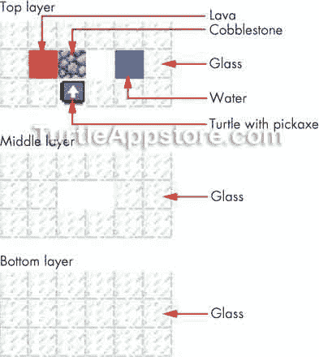
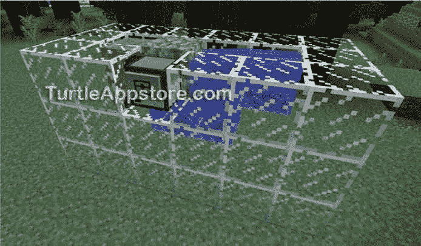
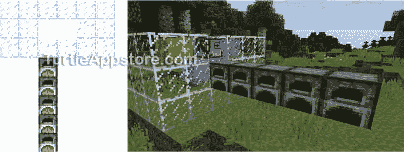
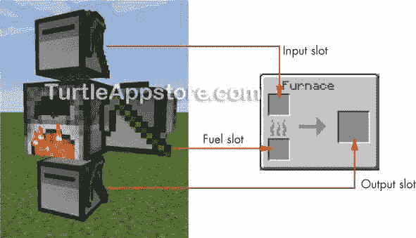
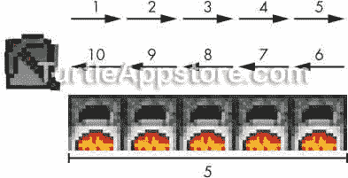
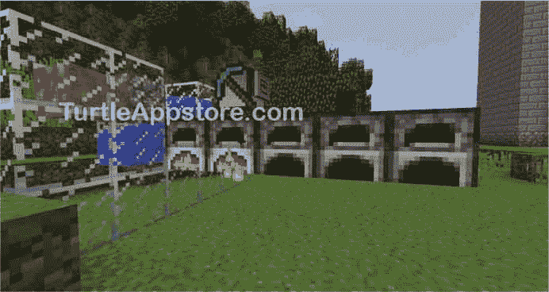

# 9 建造鹅卵石发电机

> 原文：<https://turtleappstore.com/book/chapter9.html>


最常见的石块是石头。开采时它们会变成鹅卵石，但你可以通过在熔炉中熔化它们来把它们变回石头。然后你可以把这种石头加工成石砖，作为你的建筑材料。

咻！仅仅是为了得到石砖，在危险、黑暗的矿井里就要做很多工作。在这一章中，你将学习如何创建一个鹅卵石生成器，它会给你无限的鹅卵石，然后你将创建一个 turtle 程序来自动开采和冶炼鹅卵石成为石头。安全地呆在你的基地里，你会有一条生产线来生产无限量的石头砖块。

### **鹅卵石发电机的蓝图**

虽然你可以通过在《我的世界》采矿来获得鹅卵石，但是你也可以通过将一股水流和一股熔岩流混合在一起来制造鹅卵石。您可以使用这些知识来构建一个鹅卵石生成器，该生成器执行相同的过程来创建无限数量的鹅卵石块。海龟可以永远开采这块鹅卵石，因为它们的工具不会磨损。

按照图 9-1 中的蓝图，创建一个鹅卵石发电机。发电机有三层模块。你需要一种类型的石块作为容纳水和熔岩流的围栏。我用的是玻璃，但是你也可以用任何不可燃的材料。你需要用三个铁锭来制作一个桶，然后从一个岩浆池里装满。虽然你可以在地表找到熔岩池，但它们更常见于靠近基岩的地下深处。你可以从地表的河流、池塘和海洋中取水。



图 9-1:鹅卵石发电机蓝图的鸟瞰图

放置熔岩和水时，*务必先放置水*。否则水流会直接和熔岩块(而不是熔岩流)混合，变成黑曜石。不需要在蓝图中放置鹅卵石块。它会自动形成。

[图 9-2](#calibre_link-60) 显示了完成的鹅卵石发电机。



*图 9-2:完成的鹅卵石发电机，顶层的空槽里有一只乌龟*

每当开采发电机中的鹅卵石块时，它都会为熔岩流入创造新的鹅卵石块打开空间。你可以开采鹅卵石无数次，但你会磨损很多镐。将一只乌龟放在顶层面向鹅卵石的空地上，你可以让乌龟永远在鹅卵石上挖矿。因为乌龟甚至不需要移动，它也不使用任何燃料！

### **搭建熔炉熔炼鹅卵石**

即使我们现在有无限的鹅卵石，我们仍然需要把鹅卵石炼成石头来使用它。为此，我们将创建`cobminer`程序，让一只海龟从发电机中开采鹅卵石，然后将开采的鹅卵石放入熔炉中熔炼成石头。

在你创建`cobminer`程序之前，你需要做一些设置。首先，你需要扩展鹅卵石发电机，在乌龟后面的中间层增加五个熔炉，如图[图 9-3](#calibre_link-61) 所示。

运行新的鹅卵石矿工程序的海龟会一直采矿，直到它有满满一堆 64 块鹅卵石。然后它会在炉子上向后移动，把鹅卵石扔进炉子里。熔炉会把鹅卵石熔化成石头。如果所有的炉子都满了，乌龟会等五分钟，然后再往里面扔鹅卵石。这整个过程将永远重复下去。



*图 9-3:鹅卵石发电机中间层增加的五个熔炉(左)和游戏中的熔炉(右)*

在[第 10 章](#calibre_link-62)，我们将创建一个`brickcrafter`程序来运行第二只海龟。`brickcrafter`计划将从熔炉中提取熔化的石头，并用它来制作石砖。乌龟会把这些石砖块存放在附近的箱子里，供玩家使用。

### **编写 COBMINER 程序**

要编写`cobminer`程序，从命令外壳运行 edit cobminer 并输入以下代码:

钴

```turtle
 1\. --[[Stone Brick Factory program by Al Sweigart
 2\. Mines cobblestone from a generator, turtle 1 of 2]]
 3.
 4\. os.loadAPI('hare')  -- load the hare module
 5\. local numToDrop
 6\. local NUM_FURNACES = 5
 7.
 8\. print('Starting mining program...')
 9\. while true do
10.   -- mine cobblestone
11.   if turtle.detect() then
12.     print('Cobblestone detected. Mining...')
13.     turtle.dig()  -- mine cobblestone
14.   else
15.     print('No cobblestone. Sleeping...')
16.     os.sleep(0.5)  -- half-second pause
17.   end
18.
19.   -- check for a full stack of cobblestone
20.   hare.selectItem('minecraft:cobblestone')
21.   if turtle.getItemCount() == 64 then
22.     -- check turtle's fuel
23.     if turtle.getFuelLevel() < (2 * NUM_FURNACES) then
24.       error('Turtle needs more fuel!')
25.     end
26.
27.     -- put cobblestone in furnaces
28.     print('Dropping off cobblestone...')
29.     for furnacesToFill = NUM_FURNACES, 1, -1 do
30.       turtle.back()  -- move over furnace
31.       numToDrop = math.floor(turtle.getItemCount() / furnacesToFill)
32.       turtle.dropDown(numToDrop)  -- put cobblestone in furnace
33.     end
34.
35.     -- move back to cobblestone generator
36.     for moves = 1, NUM_FURNACES do
37.       turtle.forward()
38.     end
39.
40.     if turtle.getItemCount() > 0 then
41.       print('All furnaces full. Sleeping...')
42.       os.sleep(300)  -- wait for five minutes
43.     end
44.   end
45\. end
```

输入这些指令后，按 <small class="calibre12">CTRL</small> ，确认【保存】被选中，按 <small class="calibre12">ENTER</small> 。然后按 <small class="calibre12">CTRL</small> ，选择【退出】，按 <small class="calibre12">ENTER</small> 退出编辑器。此外，您还需要`hare`模块，可以通过运行`pastebin get wwzvaKuW hare`来下载。

### **运行 COBMINER 程序**

在你设置好有五个熔炉的鹅卵石发生器后，将乌龟面向鹅卵石放置并运行 cobminer 。乌龟会开始开采鹅卵石，直到它有 64 块；然后它会把它们扔进熔炉。直到你写下[第 10 章](#calibre_link-62)中的`brickcrafter`程序，你将不得不手动将燃料装入熔炉，并从其中取出熔化的石块。为了给炉子制造燃料，在不同的炉子里熔化树木养殖龟的木块，生产木炭给炉子提供燃料。让我们来看看`cobminer`程序的各个部分。

如果您在运行这个程序时遇到错误，请仔细地将您的代码与本书中的代码进行比较，找出任何打字错误。如果你仍然不能修复你的程序，通过运行`delete cobminer`删除文件，然后通过运行`pastebin get YhvSiw7e cobminer`下载它。

### **设置你的程序并设定一个常量变量**

程序的前几行包含描述程序是什么的普通注释。

钴

```turtle
 1\. --[[Stone Brick Factory program by Al Sweigart
 2\. Mines cobblestone from a generator, turtle 1 of 2]]
 3.
 4\. os.loadAPI('hare')  -- load the hare module
 5\. local numToDrop
```

第 4 行加载了`hare`模块，因此程序可以调用`hare.selectItem()`。第 5 行声明了一个名为`numToDrop`的变量，这个变量将在程序的后面使用。

第 6 行声明了`NUM_FURNACES`变量，它包含一个整数，表示放在海龟后面的熔炉的数量。

钴

```turtle
 6\. local NUM_FURNACES = 5
```

这个程序有五个炉子，但是如果你喜欢，你可以添加更多的炉子。如果你添加更多的熔炉到你的鹅卵石生成器，设置`NUM_FURNACES`的值为新的熔炉数。

`NUM_FURNACES`变量是大写的，因为它是一个*常量*变量，这意味着它的值在程序运行时不会改变。常量的大写名称只是一种约定。常量仍然是常规变量。大写的名称有助于提醒您不应该编写更改变量的代码。拥有一个值永远不变的变量可能看起来很奇怪，但是使用常量将使您的代码更容易理解，并且方便将来的更改。

例如，你需要在你的代码中指出熔炉的数量，但是如果你在你的代码中使用这个数字而不是`NUM_FURNACES`，然后你改变了熔炉的数量，你将不得不在所有使用这个数字的地方更新你的代码。当您使用像`NUM_FURNACES`这样的常量时，您可以通过修改赋值语句来更新您的代码，在本例中是在第 6 行。常数使你的代码清晰并且易于修改。

### **从发电机中开采鹅卵石**

第 9 行开始了程序的主`while`循环，其中包含了让海龟开采鹅卵石、移动到熔炉上方并将鹅卵石投入熔炉的代码。

钴

```turtle
 8\. print('Starting mining program...')
 9\. while true do
10.   -- mine cobblestone
11.   if turtle.detect() then
12.     print('Cobblestone detected. Mining...')
13.     turtle.dig()  -- mine cobblestone
```

第一部分，开采鹅卵石，从第 11 行开始。如果乌龟前面有一块鹅卵石，`turtle.detect()`函数返回`true`。在这种情况下，程序显示`Cobblestone detected. Mining...`，第 13 行的调用`turtle.dig()`开采鹅卵石。

但是，如果因为之前开采过而没有鹅卵石(新的鹅卵石块还没有形成)，`turtle.detect()`返回`false`。当`if`语句的条件为`false`时，第 14 行`else`语句后的代码块运行。

钴

```turtle
14.   else
15.     print('No cobblestone. Sleeping...')
16.     os.sleep(0.5)  -- half-second pause
17.   end
```

这段代码显示`No cobblestone. Sleeping...`并调用`os.sleep(0.5)`来暂停程序半秒钟，以便新的鹅卵石块有足够的时间形成。当程序再次循环时，这个新的鹅卵石块将被开采。当海龟采完鹅卵石后，它需要在熔炉里熔化鹅卵石。

### **与熔炉互动**

熔炉有三个插槽:一个*燃料插槽*，像煤这样的可燃物品为熔炉提供动力；一个*输入插槽*，用于输入要熔炼的物品；一个*输出插槽*，在玩家取走物品之前，已熔炼的物品会留在那里。乌龟在炉子旁边的位置决定了乌龟是将一个物品放入炉子作为燃料，还是将一个物品作为块放入炉子进行熔炼，还是移走最终产品。如果乌龟在炉子的边上，它可以在炉子的燃料槽里放入和取出物品。如果一只乌龟在一个熔炉的上方，它可以在熔炉的输入槽中放入和取出物品。如果一只乌龟在熔炉下面，它可以从熔炉的输出口拿走熔炼的物品。[图 9-4](#calibre_link-63) 显示了这些位置。



*图 9-4:乌龟的位置表明它与哪个炉槽相互作用。*

接下来，乌龟会把鹅卵石放进炉子里。

#### **用常量使代码可读**

在检查了一个鹅卵石块后，程序会检查海龟是否收集了 64 个鹅卵石块，这是一个库存槽所能容纳的最大值。如果是这样的话，乌龟在检查了它有足够的燃料穿过熔炉并回到鹅卵石发电机后，准备把它们扔进后面的熔炉。

钴

```turtle
19.   -- check for a full stack of cobblestone
20.   hare.selectItem('minecraft:cobblestone')
21.   if turtle.getItemCount() == 64 then
22.     -- check turtle's fuel
23.     if turtle.getFuelLevel() < (2 * NUM_FURNACES) then
24.       error('Turtle needs more fuel!')
25.     end
```

第 20 行的`hare.selectItem()`函数找到带有鹅卵石的库存槽并选择该槽。第 21 行调用`turtle.getItemCount()`来检查这个槽中鹅卵石块的数量。如果总数是`64`鹅卵石块，程序调用`turtle.getFuelLevel()`来检查海龟的燃料水平。

第 23 行检查海龟的燃料水平是否低于`2 * NUM_FURNACES`。原因是海龟需要足够的燃料来移动通过每个熔炉，然后穿过每个熔炉返回到它的起始位置，如图 9-5 所示。



*图 9-5:来回移动熔炉所需的燃料量是熔炉数量的两倍。*

如果乌龟没有足够的燃料，24 号线调用`error()`并显示`Turtle needs more fuel!`。然后第 25 行结束程序。

#### **将鹅卵石投入熔炉**

当乌龟有 64 块鹅卵石和足够的燃料穿越熔炉并返回时，乌龟可以向后移动并放下鹅卵石，如图[图 9-6](#calibre_link-65) 所示。



*图 9-6:乌龟把鹅卵石丢进熔炉。*

第 29 行的`for`循环与我们之前使用的`for`循环略有不同。一个`for`循环可以向上计数，就像在`for i = 1, 10 do`中一样，但是当你在语句中加入第三个数字，一个步骤数时，它也可以以不同的增量计数。不是在每次迭代中添加`1`，而是`for`循环将添加步长参数中指示的数字。如果你使用一个负数，就像在`for i = 10, 1, -1 do`中，你可以让循环倒计数。

钴

```turtle
27.     -- put cobblestone in furnaces
28.     print('Dropping off cobblestone...')
29.     for furnacesToFill = NUM_FURNACES, 1, -1 do
30.       turtle.back()  -- move over furnace
31.       numToDrop = math.floor(turtle.getItemCount() / furnacesToFill)
32.       turtle.dropDown(numToDrop)  -- put cobblestone in furnace
33.     end
```

第 29 行的`for`循环告诉海龟向后移动`NUM_FURNACES`(或五次)。然而，它从`5`开始计数到`1`，而不是从`1`开始计数到`5`，所以我们可以使用第 31 行的`for`循环变量`furnacesToFill`来计算每个熔炉中投入多少鹅卵石块。该计算使用`math.floor()`功能。让我们看看这个函数是如何工作的。

#### **用数学舍入数字。地板()和数学。CEIL()函数**

`math.floor()`函数向下舍入它传递的数字并返回它，而`math.ceil()`函数(“ceil”是“ceiling”)向上舍入它传递的数字并返回它。在 Lua shell 中输入以下内容，看看这些函数是如何工作的。

```turtle
   lua> math.floor(4.2)
   4
   lua> math.floor(4.9)
   4
   lua> math.floor(10.5)
   10
   lua> math.floor(12.0)
   12
   lua> math.ceil(4.2)
   5
   lua> math.ceil(4.9)
   5
   lua> math.ceil(10.5)
   11
➊ lua> math.ceil(12.0)
   12
```

将一个值传递给`math.floor()`会导致该数字不带小数点，而将一个数字传递给`math.ceil()`会将该数字向上舍入到下一个数字。当你传递给`math.ceil()`一个十进制数值为`0`的数字时，它不会向上舍入，而是舍入到最接近的整数，正如你在 ➊ 看到的。函数的舍入帮助我们将海龟的鹅卵石均匀地分配到熔炉中。

#### **计算分配到各炉的鹅卵石**

在《我的世界》，每个熔炉的输入槽可以容纳多达 64 个项目进行熔炼。为了提高效率，我们希望所有的熔炉同时熔炼，而不是只有一个。为了计算每个熔炉中投入多少鹅卵石块，我们将当前槽中鹅卵石块的数量除以`NUM_FURNACES`。因为这个除法运算可能不会产生一个整数，比如 64 / 5 = 12.8，我们将把这个数字传递给`math.floor()`，在这种情况下，它将这个数字向下舍入到 12。然后，我们将把一定数量的鹅卵石放入每个熔炉中，这样所有的熔炉就可以同时熔炼。

但是这个计算有几个问题。例如，如果你有 64 块鹅卵石和 5 个炉子，乌龟会在每个炉子里掉 12 块鹅卵石，剩下 4 块。乌龟开采鹅卵石的速度比熔炉冶炼鹅卵石的速度还要快，每个熔炉的输入口最多可以容纳 64 件物品。对于每一个满的不能再容纳鹅卵石的炉子，海龟将会被留下来拿着那个炉子的那部分石头——在这个例子中，是 12 块。为了解决这个问题，我们将进行不同的计算。让我们再看一下第 29 到 33 行:

钴

```turtle
29.     for furnacesToFill = NUM_FURNACES, 1, -1 do
30.       turtle.back()  -- move over furnace
31.       numToDrop = math.floor(turtle.getItemCount() / furnacesToFill)
32.       turtle.dropDown(numToDrop)  -- put cobblestone in furnace
33.     end
```

使用`numToDrop`，第 31 行用`numToDrop = math.floor(turtle.getItemCount() / furnacesToFill)`计算每个熔炉中投入的鹅卵石块的数量。每次海龟移动到一个新的熔炉时，`numToDrop`的值会被重新计算，而不是计算掉一次鹅卵石块的数量并将这个数字存储在`numToDrop`变量中。[表 9-1](#calibre_link-66) 显示了当所有熔炉都是空的时，如何在`for`循环的每次迭代中计算`numToDrop`。

**表 9-1:** 所有炉空时的 numToDrop 值

| **迭代** | math . floor(turtle . getitemcount()/furnace tofill) | numtodrop | **投入熔炉的鹅卵石数量** |
| --- | --- | --- | --- |
| 第一 | `math.floor(64 / 5)` | `12` | Twelve |
| 第二 | `math.floor(52 / 4)` | `13` | Thirteen |
| 第三 | `math.floor(39 / 3)` | `13` | Thirteen |
| 第四 | `math.floor(26 / 2)` | `13` | Thirteen |
| 第五 | `math.floor(13 / 1)` | `13` | Thirteen |
|  |  |  | 总数:64 |

然而，让我们假设第二个炉子是满的，因为玩家往里面扔了一些他们自己开采的鹅卵石。现在没有鹅卵石可以放进第二个炉子里了。但是因为`numToDrop`在`for`循环的每一次迭代中都被重新计算，代码会自动将更多的鹅卵石放入后面的熔炉中。表 9-2 显示了如何在每次迭代中计算`numToDrop`。请注意，在第二次迭代中，投入熔炉的鹅卵石块的数量为 0，因为第二个熔炉已满。

**表 9-2:** 第二炉满时的 numToDrop 值

| **迭代** | math . floor(turtle . getitemcount()/furnace tofill) | numtodrop | **投入熔炉的鹅卵石数量** |
| --- | --- | --- | --- |
| 第一 | `math.floor(64 / 5)` | `12` | Twelve |
| 第二 | `math.floor(52 / 4)` | `13` | Zero |
| 第三 | `math.floor(52 / 3)` | `17` | Seventeen |
| 第四 | `math.floor(35 / 2)` | `17` | Seventeen |
| 第五 | `math.floor(18 / 1)` | `18` | Eighteen |
|  |  |  | 总数:64 |

第 29 到 33 行显示了一点聪明的代码可以使熔炉以最大效率工作。当`for`循环结束时，乌龟将越过最后一个炉子，需要回到鹅卵石路上。

### **将鹅卵石矿工移回原位**

第 36 行到第 38 行继续让乌龟向前移动，直到它在鹅卵石块的前面。

钴

```turtle
35.     -- move back to cobblestone generator
36.     for moves = 1, NUM_FURNACES do
37.       turtle.forward()
38.     end
```

在这一点上，海龟检查当前槽。记住，乌龟开采鹅卵石的速度比熔炉冶炼它们的速度还要快。用不了多久，所有的炉子都会被填满，但是乌龟有 64 块鹅卵石要扔进去。如果乌龟的库存里还有鹅卵石，那么所有的炉子都满了，乌龟就不能把鹅卵石放进去。

钴

```turtle
40.     if turtle.getItemCount() > 0 then
41.       print('All furnaces full. Sleeping...')
42.       os.sleep(300)  -- wait for 5 minutes
43.     end
44.   end
45\. end
```

`turtle.getItemCount()`返回当前槽中的项目数。如果这个数字大于`0`(意味着乌龟仍然有一些鹅卵石)，第 42 行暂停程序 300 秒，或者 5 分钟，给熔炉更多的时间来熔炼之前的鹅卵石。

第 43 行结束第 40 行的`if`语句块，第 44 行结束第 21 行的`if`语句块，第 45 行结束第 9 行的`while`循环。最后，执行循环回到第 9 行，海龟继续开采鹅卵石，填充熔炉，直到燃料耗尽。

正如第八章中的植树计划一样，你可以通过建造多台鹅卵石发电机来扩大你的鹅卵石产量。你也可以在海龟后面增加更多的熔炉，改变`NUM_FURNACES`常数。(五六个熔炉足够冶炼鹅卵石了。否则，你的乌龟将不能足够快地开矿以跟上熔炉！)

**奖励活动:凑齐更多鹅卵石炉**

尝试创建一个有五个以上炉子的鹅卵石炉子。你需要调整 cobminer 程序中的NUM _ furnees变量，这样海龟就可以使用这些额外的熔炉。

### **你学到了什么**

在这一章中，你学习了如何建造一个鹅卵石发电机，它将熔岩和水流混合在一起，为你的乌龟开采源源不断的鹅卵石，你使用了`cobminer`程序让乌龟开采这些鹅卵石，并把它们扔到乌龟后面的熔炉里。您还了解了常量，常量是不改变其值的变量，有助于提高代码的可读性。此外，您还了解了`for`循环中的 step 参数，它允许您创建`for`循环，该循环递减计数而不是递增计数。最后，您了解了`math.floor()`和`math.ceil()`函数如何分别对一个数字进行上下舍入。

在[第 10 章](#calibre_link-62)中，我们将使用`cobminer`程序创建一个石砖工厂，这是一个双龟操作。我们将编写一个程序，指导另一只海龟从熔炉中取出熔化的石块，并用`brickcrafter`程序将它们加工成石砖。