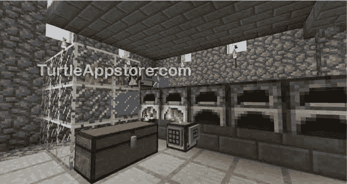
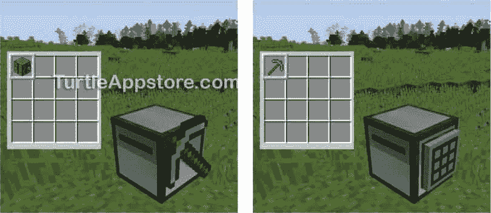
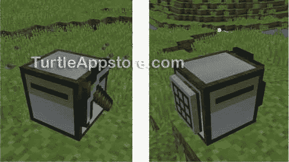
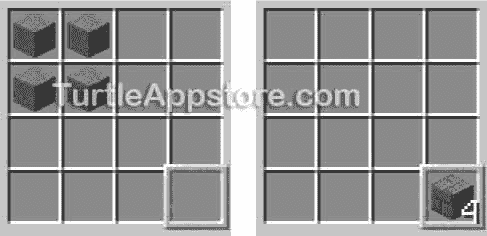
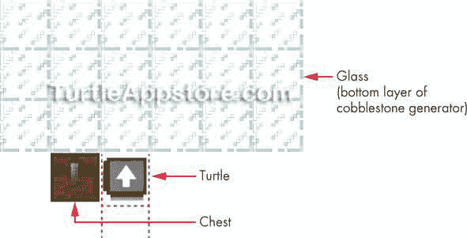
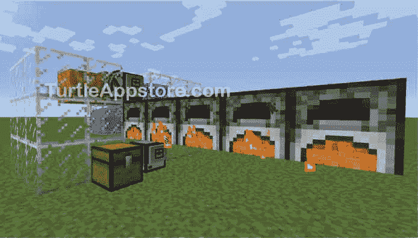
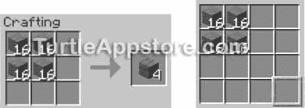
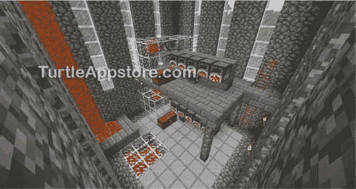
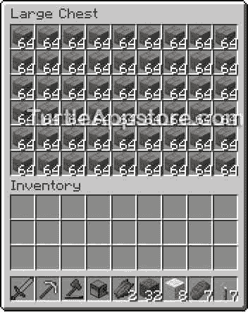

# 10 制作石砖工厂

> 原文：<https://turtleappstore.com/book/chapter10.html>


你现在应该有一只乌龟，它从一个无限的鹅卵石发生器中开采鹅卵石，然后把鹅卵石丢进熔炉里熔炼石头。你已经实现了冶炼过程的自动化，但是你仍然需要手动将石头从熔炉中取出来使用。这很有用，但它并不完全是我们所说的石砖工厂。现在你需要给第二只乌龟编程，把炼好的石头拉出来，工艺石砖。一旦你有了海龟团队，就像图 10-1 中的那样，你就有了所有你需要的石头砖块。



*图 10-1:自动化石砖工厂的完整设置*

### **设计制作石砖的程序**

运行`cobminer`程序的第一只海龟位于熔炉上方。第二只乌龟会移动到熔炉的下面，这样它就可以从每个熔炉的输出槽中拉出物品。记住开采石头或鹅卵石块会产生鹅卵石块。把这些鹅卵石块放进炉子里就会产生石块，石块可以用来工艺石砖块。

和`cobminer`程序一样，第二只海龟的程序首先需要检查海龟是否有足够的燃料穿过熔炉，回到原来的位置。当海龟移动到每个熔炉时，它收集从鹅卵石中熔化的石块。当它收集了满满一堆的 64 块石头后，它把它们加工成 64 块石头砖，放在一个箱子里。如果熔炉输出口没有足够的石头，乌龟会等两分钟，等待更多的鹅卵石被熔化。然后乌龟重复整个过程。

### **制作一只狡猾的乌龟**

要做一只会造石砖的乌龟，你首先要做一只会手艺的乌龟。乌龟可以用`turtle.craft()`功能制作物品。然而，要启用这个功能，乌龟必须装备一张手工桌，就像它装备一把钻石镐一样。选择一只不是运行`cobminer`程序的海龟，并在海龟当前选择的位置放置一张手工桌。然后在 Lua shell 中运行以下代码:

```turtle
lua> turtle.equipLeft()
```

此代码将解除乌龟左侧任何工具的装备，并在当前选择的槽中装备工艺桌。[图 10-2](#calibre_link-70) 显示了运行`turtle.equipLeft()`前后的乌龟及其存量。



*图 10-2:前(左)后(右)的乌龟在呼唤*turtle . equip left()*解开鹤嘴锄，装备工艺台*

现在你可以让你的海龟调用`turtle.craft()`函数了。你的无镐龟不会叫`turtle.dig()`，但是这个制石砖龟不需要开采任何东西。

**注**

如果你想要一只既会手艺又会挖掘的乌龟，你可以给一只乌龟配备两种工具。你可以通过调用turtle . equip left()*在 turtle 的左边装备一个工具，调用*turtle . equip right()*在右边装备另一个工具。[图 10-3](#calibre_link-71) 显示一只乌龟，左边是一把钻石镐，右边是一张神石桌，让乌龟同时调用* turtle.dig() *和*turtle . craft()*。*



*图 10-3:一只乌龟，它的左侧(左)是一把钻石镐，右侧(右)是一张工艺桌*

装备了工艺桌后，乌龟可以使用和工艺桌一样的配方来制作物品。当乌龟调用`turtle.craft()`时，制作的物品将被放置在当前选择的槽中。例如，要制作石砖，在乌龟的库存中，将四块石头排成一个正方形，如图[图 10-4](#calibre_link-72) 所示。确保所有其他库存槽都是空的，并从 Lua shell 运行`turtle.select(16)`和`turtle.craft()`:

```turtle
lua> turtle.select(16)
true
lua> turtle.craft()
true
```

[图 10-4](#calibre_link-72) 为制作石砖前后的龟圭。请注意，当前在图中选择了库存槽 16，并且手工制作的物品被放置在当前选择的槽中。



*图 10-4:调用*【turtle . craft()*函数*前后的乌龟盘点

如果你设计的项目与任何《我的世界》食谱都不匹配，`turtle.craft()`将返回`false`,你将看到以下错误消息:

```turtle
lua> turtle.craft()
false
No matching recipes
```

现在我们已经完成了第二只海龟程序的所有设置和计划，让我们来写代码。我们把第二只海龟的程序叫做`brickcrafter`。

### **编写砖匠程序**

从命令 shell 中，运行 edit brickcrafter 并输入以下代码:

*制片机*

```turtle
 1\. --[[Stone Brick Factory program by Al Sweigart
 2\. Gets stone from furnace to craft stone bricks, turtle 2 of 2]]
 3.
 4\. print('Starting stone brick crafting program...')
 5.
 6\. local NUM_FURNACES = 5
 7\. local brickCount = 0
 8\. while true do
 9.   -- check turtle's fuel
10.   if turtle.getFuelLevel() < (2 * NUM_FURNACES) then
11.     error('Turtle needs more fuel!')
12.   end
13.
14.   turtle.select(1)  -- put stone in slot 1
15.
16.   -- start collecting stone from furnaces
17.   for i = 1, NUM_FURNACES do
18.     turtle.suckUp(64 - turtle.getItemCount(1))  -- get stone from furnace
19.     if turtle.getItemCount(1) == 64 then
20.       break  -- stop once there are 64 stone blocks
21.     end
22.     if i ~= NUM_FURNACES then
23.       turtle.back()  -- move to next furnace
24.     end
25.   end
26.
27.   -- craft stone bricks
28.   if turtle.getItemCount(1) == 64 then
29.     turtle.transferTo(2, 16)  -- put in slot 2
30.     turtle.transferTo(5, 16)  -- put in slot 5
31.     turtle.transferTo(6, 16)  -- put in slot 6
32.     turtle.select(16)  -- stone bricks to go in slot 16
33.     turtle.craft()  -- craft stone bricks
34.     brickCount = brickCount + 64
35.     print('Total stone bricks: ' .. brickCount)
36.   else
37.     print('Not enough stone yet. Sleeping...')
38.     os.sleep(120)  -- wait for 2 minutes
39.   end
40.
41.   -- move back to chest (by first furnace)
42.   for i = 1, NUM_FURNACES - 1 do
43.     turtle.forward()
44.   end
45.   turtle.turnLeft()  -- face chest
46.   turtle.select(16)  -- select stone bricks
47.   turtle.drop()  -- put stone bricks into chest
48.   turtle.turnRight()  -- face generator again
49\. end
```

输入完所有这些指令后，按下 <small class="calibre12">CTRL</small> 按钮，确认**【保存】**被选中，然后按下 <small class="calibre12">ENTER</small> 。然后按 <small class="calibre12">CTRL</small> ，选择**【退出】**，再按 <small class="calibre12">ENTER</small> 退出编辑器。

### **运行砖匠程序**

在你可以运行`brickcrafter`程序之前，你需要有一个运行`cobminer`程序的海龟，用[第 9 章](#calibre_link-57)中的鹅卵石发电机和熔炉设置。你还需要第二个箱子(单人或双人)和第二只海龟来运行`brickcrafter`项目。将新箱子放在鹅卵石发电机旁边，并将新乌龟放在第一个炉子下面，如图[图 10-5](#calibre_link-73) 所示。箱子将容纳所有精心制作的石砖。确保你的海龟库存完全清空，否则`brickcrafter`程序不会按预期运行。



*图 10-5:胸和龟的位置。白色箭头表示海龟应该面向哪个方向。虚线显示了鹅卵石发电机第二层上熔炉的位置。*

您的鹅卵石发电机和石砖工匠的完整设置将看起来像[图 10-6](#calibre_link-74) 。



*图 10-6:在鹅卵石发电机旁边放一个箱子，为石砖提供存储空间。*

这个`brickcrafter`程序指示海龟移动到熔炉下面，取出每个熔炉的熔化石头。然后乌龟按照石砖配方排好石砖，调用`turtle.craft()`制作石砖，将石砖放入发电机旁边的箱子里。因为海龟必须来回移动，它会检查自己的燃料水平，如果燃料耗尽，就会停止程序。

如果您在运行这个程序时遇到错误，请仔细地将您的代码与本书中的代码进行比较，找出任何打字错误。如果你仍然不能修复你的程序，通过运行`delete brickcrafter`删除文件，然后通过运行`pastebin get 1zS07K3U brickcrafter`下载它。

### **砖匠程序的设置**

程序的前几行包含通常的描述性注释和一个显示消息告诉玩家程序已经开始的`print()`调用。我们还设置了两个变量，我们将在程序的后面使用。

*制片机*

```turtle
 1\. --[[Stone Brick Factory program by Al Sweigart
 2\. Gets stone from furnace to craft stone bricks, turtle 2 of 2]]
 3.
 4\. print('Starting stone brick crafting program...')
 5.
 6\. local NUM_FURNACES = 5
 7\. local brickCount = 0
```

`NUM_FURNACES`常量与第 9 章[的`cobminer`程序中的`NUM_FURNACES`常量作用相同。变量`brickCount`记录海龟制作的石砖数量。](#calibre_link-57)

### **检查海龟的燃料**

第 8 行开始了程序主要部分的无限循环。程序继续运行，直到乌龟耗尽燃料或者玩家按下 <small class="calibre12">CTRL</small> -T 终止程序。

*制片机*

```turtle
 8\. while true do
 9.   -- check turtle's fuel
10.   if turtle.getFuelLevel() < (2 * NUM_FURNACES) then
11.     error('Turtle needs more fuel!')
12.   end
```

在循环内部，程序首先检查海龟是否有足够的燃料到达每个熔炉并返回箱子。第 10 至 12 行类似于[第 9 章](#calibre_link-57)中`cobminer`程序的第 23 至 25 行。第 10 行检查海龟的燃料至少是熔炉数量的两倍。如果没有，调用第 11 行的`error()`终止程序。

### **从熔炉中收集石头**

如果乌龟有足够的燃料在所有的熔炉下来回移动，它会选择库存槽 1，这样当它从熔炉中取出石头时，石头会在这个槽中结束。

*制片机*

```turtle
14.   turtle.select(1)  -- put stone in slot 1
```

接下来，执行进入第 17 行的`for`循环。在循环的每一次迭代中，乌龟从它上面的熔炉中取出熔化的石头来填满存货槽 1。当乌龟把它的存货槽填满到最大容量(64 块)时，它会跳出循环，这样它就可以用石头来制作石头砖了。如果库存槽 1 尚未满，程序继续执行下一个`if`语句，并将海龟移回下一个熔炉。

*制片机*

```turtle
16.   -- start collecting stone from furnaces
17.   for i = 1, NUM_FURNACES do
18.     turtle.suckUp(64 - turtle.getItemCount(1))  -- get stone from furnace
19.     if turtle.getItemCount(1) == 64 then
20.       break  -- stop once there are 64 stone blocks
21.     end
22.     if i ~= NUM_FURNACES then
23.       turtle.back()  -- move to next furnace
24.     end
25.   end
```

函数从海龟上方的容器中取出所有的方块，并将它们存储在海龟当前选择的槽中。你可以给这个函数传递一个数字，来限制海龟选择的槽中吸收的块数。你也可以使用`turtle.suck()`和`turtle.suckDown()`函数分别从海龟前面和下面的容器中取出方块。

在这种情况下，因为乌龟在熔炉下面，它从熔炉的输出槽中取出物品。乌龟在存货槽 1 中最多可以装 64 块石头，所以我们做了一些计算来确保乌龟不会试图把它的槽装得太满。命令的`turtle.getItemCount(1)`部分返回海龟在它的槽中已经有的块数，我们从 64 中减去它，得到海龟应该从熔炉中取回的块数。例如，如果库存槽 1 中已经有 30 块石头，而熔炉中有 64 块石头，乌龟不应该取出所有 64 块石头。相反，它应该取出不超过 64-30 或 34 块石块。

如果库存槽 1 中的商品数量是 64，那么我们不想向该槽添加更多的块。第 19 行的`if`语句的计算结果为`true`，执行从这个`for`循环中脱离出来。

如果存货槽还没有满，海龟需要向后移动到下一个炉子下面。乌龟应该继续从它下面的炉子中拉出物品，然后移动到下一个炉子，直到它在最后一个炉子的下面。当`for`回路的变量`i`被设置为与`NUM_FURNACES`相同的数值时，海龟位于最后一个熔炉的下方。这就是为什么如果`i`不等于`NUM_FURNACES`，第 22 行的`if`语句只运行第 23 行。当海龟到达最后一个熔炉时，它退出`for`循环。

### **制作石砖**

当乌龟有 64 块石头时，它需要把它们加工成石砖。请记住，海龟制作石砖的配方与你在制作桌上使用的配方相同，但海龟是在自己的库存中制作石砖的。要将石块加工成石砖，将等量的石块放入四个库存槽中，形成一个正方形。[图 10-7](#calibre_link-75) 显示了制作石砖的配方。



*图 10-7:制作石砖的配方(左)和乌龟库存中的相同配方(右)*

当石头块处于正确的配方模式时，调用`turtle.craft()`将会制作尽可能多的石头块，并将它们存储在当前槽中。如果你想让海龟只制造一定数量的物品，即使它有足够的材料来制造更多，传递一个数字参数给`turtle.craft()`。例如，`turtle.craft(1)`将从每个槽中只使用一块石头，并制作一块石头砖。

第 28 行检查库存槽 1 中是否有 64 块石头。如果有，执行将进入从第 29 行开始的代码块。

*制片机*

```turtle
27.   -- craft stone bricks
28.   if turtle.getItemCount(1) == 64 then
29.     turtle.transferTo(2, 16)  -- put in slot 2
30.     turtle.transferTo(5, 16)  -- put in slot 5
31.     turtle.transferTo(6, 16)  -- put in slot 6
32.     turtle.select(16)  -- stone bricks to go in slot 16
33.     turtle.craft()  -- craft stone bricks
34.     brickCount = brickCount + 64
35.     print('Total stone bricks: ' .. brickCount)
```

`turtle.transferTo()`功能将项目从当前槽移动到另一个槽。您可以通过将一个整数作为函数的第一个参数来指定将项目移动到哪个槽，并且可以使用第二个参数来指定移动到该槽的项目数。第 29 行的`turtle.transferTo(2, 16)`函数调用将 16 块石头从当前槽(第 14 行设置为 1)移动到槽 2。

第 30 行和第 31 行将 16 块石头移动到第 5 和第 6 格，这使得乌龟的存货看起来像图 10-7 中的[中的食谱。然后，第 32 行调用`turtle.select(16)`将当前槽更改为槽 16，因此当第 33 行调用`turtle.craft()`时，制作的石砖将被放置在槽 16 中。第 34 行和第 35 行计算并打印了海龟到目前为止制作的石砖的数量。](#calibre_link-75)

如果海龟从熔炉中取出石块后，在存货槽 1 中没有 64 块石块，第 38 行暂停 120 秒(两分钟)，给熔炉更多的时间来熔化石块。

*制片机*

```turtle
36.   else
37.     print('Not enough stone yet. Sleeping...')
38.     os.sleep(120)  -- wait for 2 minutes
39.   end
```

在这种情况下，程序会继续，海龟会回到第一个炉子。不管石砖是否被制作，乌龟需要回到鹅卵石发生器旁边的第一个熔炉，这样它可以收集更多的熔化的石头。

### **将乌龟移回原位**

为了将乌龟移回它的原始位置，我们需要将乌龟向前移动，直到它再次到达第一个炉子，我们在第 42 行用一个`for`循环做这件事。一旦到了那里，海龟就把它的石砖储存在箱子里。

*制片机*

```turtle
41.   -- move back to chest (by first furnace)
42.   for i = 1, NUM_FURNACES - 1 do
43.     turtle.forward()
44.   end
45.   turtle.turnLeft()  -- face chest
46.   turtle.select(16)  -- select stone bricks
47.   turtle.drop()  -- put stone bricks into chest
48.   turtle.turnRight()  -- face generator again
49\. end
```

第 42 到 44 行将乌龟向前移动，这样它就回到了原来的位置。也就是说，乌龟移动`NUM_FURNACES – 1`到第一个炉子的下面。在第 6 行，我们将`NUM_FURNACES`设置为`5`，所以乌龟在这里移动了四格。第 45 行让乌龟面向箱子，第 46 行选择它制作的所有石砖，这些石砖都在库存槽 16 中。然后第 47 行把选中的石头砖块放进箱子里(或者什么都不做，如果没有砖块被制作的话)，第 48 行把乌龟转到右边，再次面对鹅卵石发电机。

第 49 行的`end`语句对应于从第 8 行开始的无限`while`循环，因此当执行到达这一点时，它跳回到第 8 行，开始收集石头、将其加工成石砖，并将石砖放入箱子的整个过程。

**奖励活动:蛋糕工厂**

蛋糕是《我的世界》最复杂的食谱之一，需要牛奶、鸡蛋、糖和小麦，如图[图 10-8](#calibre_link-76) 所示。


*图 10-8:《我的世界》蛋糕食谱*

编写一个程序，指导一只乌龟做蛋糕。将配料储存在不同的箱子中，然后编程让乌龟移动到每个箱子，获取蛋糕配料，制作蛋糕，并将完成的蛋糕放入另一个箱子中。如果一个箱子里没有一种配料，让乌龟等几分钟，然后再次检查玩家是否放了更多的配料。

### **建造厂房**

鹅卵石发电机和乌龟是你工厂生产线的主要部分，但是它们现在在外面，暴露在雨水和爬山虎下。你还在想念你的厂房！现在你有了无限的鹅卵石和精心制作的石砖来源，你可以创建一个建筑来放置你的鹅卵石发电机，如图[图 10-9](#calibre_link-77) 和[图 10-10](#calibre_link-78) 所示。


*图 10-9:用鹅卵石发电机的产品建造的房子，里面有鹅卵石发电机和海龟*



*图 10-10:内部，有两个鹅卵石发电机和一个装饰性的熔岩瀑布*

很快，你的乌龟将会生产出大量的石砖来建造房屋，如图 10-11 所示。



图 10-11:感谢编程的力量，你的石砖供应问题已经解决了！

为你的鹅卵石发电机建造一个建筑是可选的，但是如果你决定建造它的话，至少你不用自己去挖矿了。在第 11 章和第 12 章[的](#calibre_link-81)中，你将学习如何让海龟为你建造墙壁和房间！

### **你学到了什么**

在这一章中，你学习了如何使用`turtle.equipLeft()`和`turtle.equipRight()`功能来交换工具和装备一张手工桌。装备一张工艺桌可以让乌龟使用`turtle.craft()`功能。

要从箱子或炉子等容器中取出物品，可以使用`turtle.suck()`功能。您可以向该函数传递一个数字参数来控制所取物品的数量，并且可以调用`turtle.suckUp()`或`turtle.suckDown()`来与海龟上方或下方的容器进行交互。

在调用`turtle.craft()`之前，你需要根据食谱排列海龟库存中的物品，就像物品会被排列在一张工艺桌上一样。您可以使用`turtle.transferTo()`将物品移动到不同的库存位置来实现这一点。调用`turtle.craft()`后，制作的物品会出现在当前选择的槽中。

有了现在所有的石砖，让我们开始编写程序让乌龟在第 11 章中为我们建造巨型建筑！