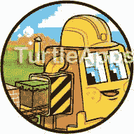
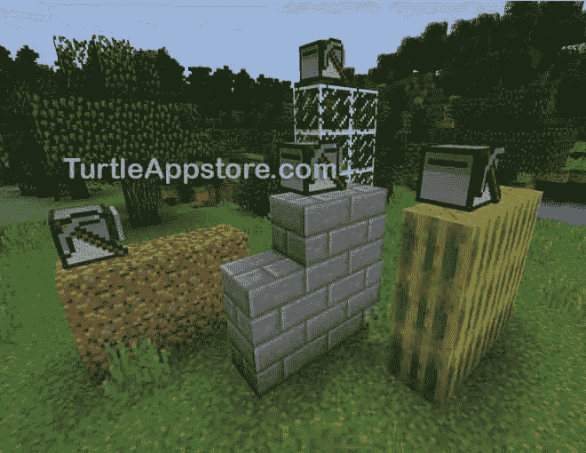
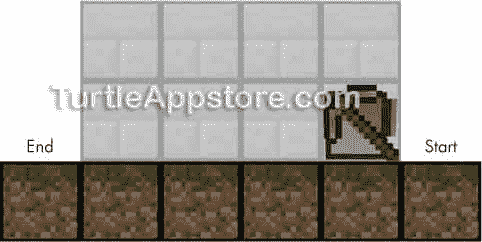
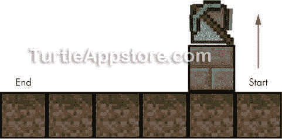
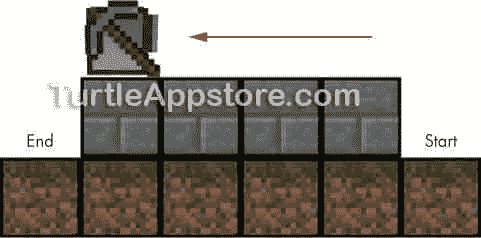
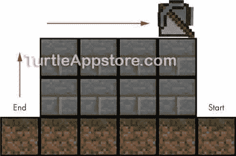
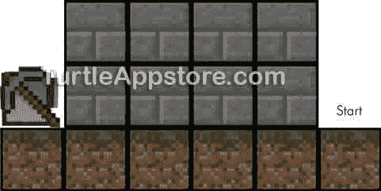
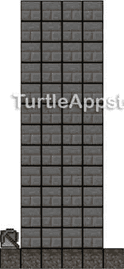
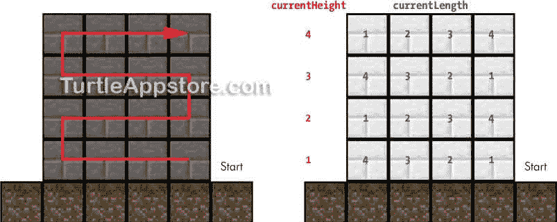

# 11 建造墙壁

> 原文：<https://turtleappstore.com/book/chapter11.html>



放置积木既费时又危险，尤其是当你在生存模式下建造大型建筑时，如果你从很高的地方掉下来。你可以给一只海龟编程，让它承担这些危险而又枯燥的建筑工作，而不是自己动手建造墙壁。在这一章中，你将设计一个算法，通过向`hare`模块添加更多的函数来创建任何尺寸的墙。虽然本章我们将重点放在创建石砖墙上，但是这些功能将适用于任何类型的砖块，包括泥土、玻璃，甚至西瓜，正如你在[图 11-1](#calibre_link-83) 中看到的。



*图 11-1:海龟用泥土、石砖、玻璃和西瓜建造墙壁*

让我们从给`hare`模块添加两个函数开始:一个计算海龟库存中的积木数量，另一个建造墙壁。

### **扩展 HARE 模块**

我们将从创建三个新的函数开始，这三个函数将对库存中的物品进行计数，选择和放置物品，并创建墙壁。我们将在本书的其他程序中使用这些函数，所以我们将它们放入我们在[第 7 章](#calibre_link-49)中开始的`hare`模块。`hare`前 35 行保持不变。因此，我将只展示第 36 行到第 107 行的代码。

从命令 shell 中，运行 edit hare 。将光标移动到文件底部，并通过输入以下内容继续执行代码:

我会

```turtle
     ...snip...
 36.
 37.
 38\. -- countInventory() returns the total
 39\. -- number of items in the inventory
 40\. function countInventory()
 41.   local total = 0
 42.
 43.   for slot = 1, 16 do
 44.     total = total + turtle.getItemCount(slot)
 45.   end
 46.   return total
 47\. end
 48.
 49.
 50\. -- selectAndPlaceDown() selects a nonempty slot
 51\. -- and places a block from it under the turtle
 52\. function selectAndPlaceDown()
 53.
 54.   for slot = 1, 16 do
 55.     if turtle.getItemCount(slot) > 0 then
 56.       turtle.select(slot)
 57.       turtle.placeDown()
 58.       return
 59.     end
 60.   end
 61\. end
 62.
 63.
 64\. -- buildWall() creates a wall stretching
 65\. -- in front of the turtle
 66\. function buildWall(length, height)
 67.   if hare.countInventory() < length * height then
 68.     return false  -- not enough blocks
 69.   end
 70.
 71.   turtle.up()
 72.
 73.   local movingForward = true
 74.
 75.   for currentHeight = 1, height do
 76.     for currentLength = 1, length do
 77.       selectAndPlaceDown()  -- place the block
 78.       if movingForward and currentLength ~= length then
 79.         turtle.forward()
 80.       elseif not movingForward and currentLength ~= length then
 81.         turtle.back()
 82.       end
 83.     end
 84.     if currentHeight ~= height then
 85.       turtle.up()
 86.     end
 87.     movingForward = not movingForward
 88.   end
 89.
 90.   -- done building wall; move to end position
 91.   if movingForward then
 92.     -- turtle is near the start position
 93.     for currentLength = 1, length do
 94.       turtle.forward()
 95.     end
 96.   else
 97.     -- turtle is near the end position
 98.     turtle.forward()
 99.   end
100.
101.   -- move down to the ground
102.   for currentHeight = 1, height do
103.     turtle.down()
104.   end
105.
106.   return true
107\. end
```

输入所有这些指令后，保存程序并退出编辑器。你也可以通过运行`pastebin get wwzvaKuW hare`来下载这个模块。

#### **用 COUNTINVENTORY()盘点库存项目**

在海龟开始建造之前，我们需要海龟检查它的库存中是否有足够的积木。假设乌龟库存中的每一件物品都是一个将在墙中使用的方块，`countInventory()`返回乌龟所有库存格中的物品总数。

我会

```turtle
 38\. -- countInventory() returns the total
 39\. -- number of items in the inventory
 40\. function countInventory()
 41.   local total = 0
```

我们将在`total`变量中存储块的总数，我们最初将它设置为`0`。然后我们将声明一个`slot`变量，它将跟踪清单中哪个插槽被检查。

接下来，第 43 行的`for`循环使用`slot`变量遍历所有 16 个库存槽。

我会

```turtle
 43.   for slot = 1, 16 do
 44.     total = total + turtle.getItemCount(slot)
 45.   end
 46.   return total
 47\. end
```

对于每个槽，程序调用`turtle.getItemCount()`函数并传递给它`slot`变量。每个库存槽中的块数被添加到`total`。循环在第 46 行结束后，函数返回`total`，它现在包含海龟库存中所有块的计数。注意，`turtle.getItemCount()`函数计算所有项目，即使它们不是石块。

#### **选择并放置一个块**

为了开始建造，我们需要海龟从一个非空的位置放置积木。为此，我们将在`hare`模块中添加一个名为`selectAndPlaceDown()` 的函数。这个函数选择第一个可用的非空槽，然后在海龟下面放置一个方块。

我会

```turtle
 50\. -- selectAndPlaceDown() selects a nonempty slot
 51\. -- and places a block from it under the turtle
 52\. function selectAndPlaceDown()
 53.
 54.   for slot = 1, 16 do
 55.     if turtle.getItemCount(slot) > 0 then
 56.       turtle.select(slot)
 57.       turtle.placeDown()
 58.       return
 59.     end
 60.   end
 61\. end
```

第 54 行是一个`for`循环，它在第一次迭代时将`slot`变量设置为`1`，在第二次迭代时设置为`2`，依此类推，直到`16`。这就是函数`selectAndPlaceDown()`如何扫描海龟库存的所有槽位。

在这个循环中，第 55 行通过调用`turtle.getItemCount(slot)`来检查插槽中有多少项目。如果槽中有多于零个块，56 行上的`turtle.select(slot)`选择该槽，57 行上的`turtle.placeDown()`将块放在海龟下面。一旦块被放置并且函数的工作完成，行 58 从函数`selectAndPlaceDown()`返回。

这个`selectAndPlaceDown()`函数不管海龟的清单上是什么类型的积木，也不管它们在哪个槽里。当海龟的库存里什么都没有时，循环结束，函数什么都不做。`buildWall()`和`buildRoom()`函数将调用`selectAndPlaceDown()`作为它们代码的一部分。

#### **设计砌墙算法**

接下来，我们需要创建`buildWall()`函数，它采用两个参数来控制墙的大小:一个用于`length`，一个用于`height`。在写函数之前，让我们设计一下海龟建造一堵墙的算法。

当一只乌龟建造一堵墙时，它需要从地面开始，向上移动，然后在自己下面放置一块石头。然后它需要向前移动并继续放置块，直到它有一行等于`length`的块。一旦海龟有了一排积木，它就反方向重复这个过程。海龟继续来回移动，放置一排排的方块，直到它到达指定的`height`。比如说，我们假设`length`是`4`，而`height`是`2`。图 11-2 显示了海龟开始的侧视图，以及 4 × 2 的墙建成后的样子。



*图 11-2:乌龟和未来 4 × 2 墙的侧视图*

乌龟需要先向上移动，并在自己下方放置一个木块，如图[图 11-3](#calibre_link-85) 所示。



图 11-3:乌龟向上移动，在它下面放了一块石头。

因为乌龟在建一堵四块长的墙，所以它向前移动三格，每移动一格就在它下面放一块。如果乌龟在建一堵六个街区长的墙，它会向前移动五格。注意这个模式:海龟前进的空间数是`length - 1`。为了让海龟放置`length`个方块，我们必须让它向前移动除了最后一个方块，导致`length - 1`向前移动。`buildWall()`功能可以这样制作任何长度的墙。

当乌龟为我们的 4 × 2 墙放置了第一行积木后，结果将看起来像图 11-4 。



图 11-4:乌龟向前移动，在它的下面放置砖块。

乌龟重复这个过程，只是这次它向后移动，如图[图 11-5](#calibre_link-87) 所示。



图 11-5:乌龟向上移动，然后向后移动，同时在它下面放置砖块。

如果乌龟有更多的行要建，它会重复这个过程，但是是向前而不是向后。但是因为海龟完成了本例所需的行数，所以海龟完成了构建。在第 12 章中，我们希望乌龟建造四面墙来建造一个房间，所以算法应该总是让乌龟在墙的另一端的地面上完成。这样，海龟就能在合适的位置建造下一堵墙。

为了让乌龟从起点移动到墙的另一端，根据它最后移动的方向，乌龟可能需要走两条潜在的路径。如果乌龟最后一次向前移动，它会向前移动一次，然后向下移动`height`次。如果乌龟最后一次向后移动，它需要向前移动`length`次，然后向下移动`height`次。任何一条路径都会使乌龟在墙的远端结束，如图[图 11-6](#calibre_link-88) 所示。



图 11-6:乌龟最终停在了墙远端的地上。

`buildWall()`功能可以构建任何长度和高度的墙。例如，只要你有足够的砖块，你就可以建造一堵像[图 11-7](#calibre_link-89) 所示的高墙。对乌龟来说都一样。



图 11-7:一堵高 4 × 12 的墙是用和 4 × 2 的墙一样的算法建造的。

让我们检查执行这个算法的函数。

#### **编写 BUILDWALL()函数**

`buildWall()`函数从计算海龟库存中的物品数量开始。它假设这些项目都是将用于建造墙的块。建造一堵墙需要的块数`length`块长和`height`块高是`length * height`，这是我们在第 67 行检查的。

我会

```turtle
 64\. -- buildWall() creates a wall stretching
 65\. -- in front of the turtle
 66\. function buildWall(length, height)
 67.   if hare.countInventory() < length * height then
 68.     return false  -- not enough blocks
 69.   end
```

如果乌龟没有足够的积木来砌墙，函数在第 68 行返回`false`，结束函数。

如果海龟有足够的块，第 71 行的代码执行，海龟上移一个块开始新的一行。然后程序继续并将`movingForward`变量设置为`true`。

*我会*

```turtle
 71.   turtle.up()
 72.
 73.   local movingForward = true
```

变量`movingForward`记录海龟应该走的方向。对于第一行，海龟会向前移动，所以`movingForward`变量应该是`true`。但是对于下一行，乌龟需要向后移动，所以我们需要在程序的后面将变量改为`false`。当海龟改变移动方向时，变量的值会在每一行交替变化。

为了跟踪海龟筑墙的高度，程序需要另一个变量，我们称之为`currentHeight`。第 75 行开始一个`for`循环，其中`currentHeight`从`1`迭代到`height`。在第一次迭代时`currentHeight`被设置为`1`，在下一次迭代时被设置为`2`，以此类推，直到最后一次迭代，其中`currentHeight`等于`height`。

*我会*

```turtle
 75.   for currentHeight = 1, height do
 76.     for currentLength = 1, length do
 77.       selectAndPlaceDown()  -- place the block
 78.       if movingForward and currentLength ~= length then
 79.         turtle.forward()
 80.       elseif not movingForward and currentLength ~= length then
 81.         turtle.back()
 82.       end
 83.     end
```

当乌龟在建造时，我们也需要记录它在每个高度建造的墙的长度。为此，我们将使用另一个名为`currentLength`的变量，它是在第 76 行的第二个`for`循环中创建的。第二个`for`循环嵌套在第 75 行的循环中。在第一个`for`循环的每次迭代中，程序运行嵌套的`for`循环。这个内部嵌套的`for`循环从`1`到`length`迭代`currentLength`。[图 11-8](#calibre_link-90) 显示了`currentHeight`和`currentLength`在建造一面 4 × 4 墙的每一点上的设置值。红色箭头显示了海龟走的路线。



*图 11-8:建造 4 × 4 墙*各点的 当前高度 *和* 当前长度 *的值*

在循环中，第 77 行调用`selectAndPlaceDown()`在海龟下面放置一个块。第 78 到 82 行的代码根据`movingForward`中的值和乌龟是否在墙的边缘，向前或向后移动乌龟。`currentLength`变量计算海龟已经走过了多少个街区。当它等于墙的`length`时，乌龟需要停下来，这样它才不会越过边缘。

记住海龟在最后一次迭代中不需要移动。因为第 76 行的`for`循环从`1`迭代到`length`，所以在最后一次迭代中`currentLength`等于`length`。这就是为什么只有当`currentLength`不等于(`~=` ) `length`时，第 78 行和第 80 行的条件才会运行。

第 82 行的`end`语句结束了第 76 行的`for`循环的代码块。在这个`for`循环之后，海龟为整行放置了积木。现在海龟必须上移一格，除非它在第 75 行的`for`循环的最后一次迭代。只有当`currentHeight`不等于`height`时，第 85 行的`turtle.up()`调用才会运行(也就是说，如果`for`循环不在最后一次迭代中)。

*我会*

```turtle
 84.     if currentHeight ~= height then
 85.       turtle.up()
 86.     end
 87.     movingForward = not movingForward
 88.   end
```

第 87 行*切换*，或将`movingForward`中的布尔值设置为相反值。如果`movingForward`为`true`，则线路将`movingForward`设置为`false`，如果`movingForward`为`false`，则线路将`movingForward`设置为`true`。如果海龟向前移动来建造最高的一排积木，开关会将`movingForward`设置为`false`。如果海龟向后移动来建造最高的一排积木，线 87 上的开关将把`movingForward`设置为`true`。第 87 行通过简单地将`movingForward`设置为`not` `movingForward`来将其设置为相反的布尔值。

第 88 行的`end`语句结束了从第 75 行开始的`for`循环。一旦执行通过了这个循环，整个墙就完成了。现在乌龟需要回到墙边的地上。首先，它需要离开墙壁，然后向下移动到地面。

回想一下，第 87 行切换了`movingForward`中的值，使海龟改变了方向。因此，如果现在将`movingForward`设置为`true`，海龟离起点最近，需要向前移动`length`块才能从墙上下来，这在第 93 行和第 94 行都做了。

我会

```turtle
 90.   -- done building wall, move to end position
 91.   if movingForward then
 92.     -- turtle is near the start position
 93.     for currentLength = 1, length do
 94.       turtle.forward()
 95.     end
```

但是如果`movingForward`现在被设置为`false`，乌龟已经在墙的另一端，只需要向前移动一格，这是它在第 98 行做的。

*我会*

```turtle
 96.   else
 97.     -- turtle is near the end position
 98.     turtle.forward()
 99.   end
```

不管乌龟最后是向前还是向后移动，它总是需要向下移动`height`个街区才能到达它开始的地面，所以 102 行上的`for`循环调用`turtle.down()`的次数等于`height`。

我会

```turtle
101.   -- move down to the ground
102.   for currentHeight = 1, height do
103.     turtle.down()
104.   end
105.
106.   return true
107\. end
```

此时，墙已经建好，乌龟在最后的位置。因此，`buildWall()`函数在第 106 行返回`true`,表示墙已经成功构建。第 107 行的`end`语句结束了`buildWall()`函数的代码块。

我们放入到`hare`模块中的`buildWall()`函数非常有用，因为在很多程序中，你可能都想做砌墙这个任务。但是如果您只是想从命令 shell 构建一堵墙，而不是启动 Lua shell 并键入`os.loadAPI('hare')`和`hare.buildWall(4, 2)`，那么创建并运行一个程序来调用这个函数会更容易。让我们创建`buildwall`程序来做这件事。

### **编写并运行 BUILDWALL 程序**

从命令 shell 中，运行 edit buildwall 并输入以下代码:

*建筑墙*

```turtle
 1\. --[[Wall Building program by Al Sweigart
 2\. Builds a wall.]]
 3.
 4\. os.loadAPI('hare')
 5.
 6\. -- handle command line arguments
 7\. local cliArgs = {...}
 8\. local length = tonumber(cliArgs[1])
 9\. local height = tonumber(cliArgs[2])
10.
11\. if length == nil or height == nil or cliArgs[1] == '?' then
12.   print('Usage: buildwall <length> <height>')
13.   return
14\. end
15.
16\. print('Building...')
17\. if hare.buildWall(length, height) == false then
18.   error('Not enough blocks.')
19\. end
20\. print('Done.')
```

输入所有这些指令后，保存程序并退出编辑器。

在放置乌龟并将石砖块(或任何其他种类的建筑块)放入其库存后，右键单击乌龟以打开其 GUI。从命令 shell 中，输入 buildwall 4 2 并按下 <small class="calibre12">ENTER</small> 来观看海龟建造一堵四个街区长、两个街区高的墙。

如果您在运行这个程序时遇到错误，请仔细地将您的代码与本书中的代码进行比较，找出任何打字错误。如果你仍然不能修复你的程序，通过运行`delete buildwall`删除文件，然后通过运行`pastebin get 1aZ8BhNX buildwall`下载它。

### **加载 HARE 模块**

`buildwall`程序的第一部分加载`hare`模块并为您调用`hare.buildWall()`。

*建筑墙*

```turtle
 1\. --[[Wall Building program by Al Sweigart
 2\. Builds a wall.]]
 3.
 4\. os.loadAPI('hare')
```

尽管大部分工作是由`hare`模块中的代码完成的，但是`buildwall`程序还有一些额外的特性。当调用`hare.buildWall()`时，程序需要知道为`length`和`height`参数传递什么值。当从命令 shell 运行`buildwall`程序时，`buildwall`程序可以从玩家输入的命令行参数中获得这些值。之前，您向`buildwall`程序传递了命令行参数`4`和`2`。你已经在运行其他程序的时候使用过命令行参数，比如在第 2 章的[中，当你把命令行参数`set Sofonisba`传递给`label`程序的时候`label set Sofonisba`。命令行参数作为一种叫做*数组*的表值存储在名为`{...}`的 Lua 对象中，该对象由两个大括号组成，中间有三个句点。在查看接受命令行参数的代码之前，让我们看看数组是如何工作的。](#calibre_link-10)

### **使用数组数据类型**

你在[第 7 章](#calibre_link-49)中第一次了解到的表值可以存储多个值。数组是另一种数据类型，其值可以存储多个值。表中的值以键值对的形式存储，而数组中的值以数字顺序存储。要访问数组中的一个值，您可以使用它的数字位置，这被称为一个*索引*。

**注**

从技术上讲，Lua 中的数组只是另一种类型的表。我们在前面的章节中使用的具有键值对的表被称为类映射表*，而数组被称为*类数组表*。*

数组的代码类似于表的代码。要创建一个数组，使用大括号`{}`，就像对表一样，但是省略键。您不需要输入键，因为值的位置会告诉 Lua 值的索引是什么。在交互式 shell 中输入以下内容以创建您自己的阵列:

```turtle
lua> pets = {'mouse', 'cat', 'dog'}
```

要访问数组中的值，请输入数组的名称，然后将值的数字索引放在方括号中，`[]`:

```turtle
lua> pets[1]
mouse
lua> pets[2]
cat
lua> 'I have a pet ' .. pets[3]
I have a pet dog
```

在 Lua 编程语言中，数组编号从`1`开始，所以要访问`pets`数组中的第一个值，可以输入`pets[1]`。

### **读取命令行参数**

回到`buildwall`程序，第 7 行将命令行参数的类似数组的表值存储在一个名为`cliArgs`的变量中。这个变量允许您的代码使用方括号访问表值中的单个值:`cliArgs[1]`是第一个命令行参数，`cliArgs[2]`是第二个，依此类推。

*建筑墙*

```turtle
 6\. -- handle command line arguments
 7\. local cliArgs = {...}
 8\. local length = tonumber(cliArgs[1])
 9\. local height = tonumber(cliArgs[2])
```

所有命令行参数值都存储为字符串，即使它们看起来像数字，如`'4'`或`'2'`。为了将值从字符串转换成数值，第 8 行和第 9 行将命令行参数传递给`tonumber()`函数，该函数返回传递给它的字符串的数值。我们将这些数值存储在`length`和`height`变量中。

### **创建使用信息**

如果玩家不输入任何命令行参数(或者只输入一个命令行参数而不是两个)，程序将没有足够的信息来运行。也许玩家不知道他们应该为`length`和`height`传递数字，或者他们可能忘记键入数字。在这种情况下，程序显示一条*使用信息*会很有帮助，它会提醒玩家如何运行程序。如果玩家使用`?`作为第一个命令行参数，用法信息也会出现。

*建筑墙*

```turtle
11\. if length == nil or height == nil or cliArgs[1] == '?' then
12.   print('Usage: buildwall <length> <height>')
13.   return
14\. end
```

如果没有命令行参数或者参数不是数字，`cliArgs[1]`和`cliArgs[2]`将被设置为`nil`值。向`tonumber()`函数传递`nil`或不包含数字的字符串将导致它返回`nil`。例如，如果玩家没有输入任何命令行参数，那么第 8 行的`length`将被设置为`nil`。如果玩家只传递了一个参数，`height`将在第 9 行被设置为`nil`。第 11 行的条件检查`length`或`height`是否为`nil`或者第一个命令行参数是否为`'?'`字符串。

在玩家没有输入有效的命令行参数的情况下，`print()`调用会显示一条用法消息，告诉玩家键入`buildwall`，后跟`length`和`height`的命令行参数。`length`和`height`周围的尖括号`<>`表示玩家不应该键入单词“长度”和“高度”，而应该键入数字作为`length`和`height`命令行参数。

### **呼唤野兔。BUILDWALL()来建造一面墙**

所有为`buildwall`程序所做的努力都在`hare`模块的`buildWall()`、`selectAndPlaceDown()`和`countInventory()`函数中。所以`buildwall`程序的代码很简单。准备好命令行参数后，它只调用第 16 行上的`hare.buildWall()`函数，并传入`length`和`height`的值。

*建筑墙*

```turtle
16\. print('Building...')
17\. if hare.buildWall(length, height) == false then
18.   error('Not enough blocks.')
19\. end
20\. print('Done.')
```

第 16 行调用`print()`，这样用户就可以看到程序已经启动。当`hare.buildWall()`函数返回`false`时，没有足够的块，程序不会运行。我们在第 17 行对此进行检查，并在出现这种情况时向用户显示一个错误。然后，第 20 行打印一条消息，告诉用户程序已经完成，不管它是否已经构建了墙，还是给了用户一条错误消息。

这就是全部的`buildwall`程序！模块中的代码处理剩余的指令。

**奖励活动:带命令行参数的 MYLABEL 程序**

回到你在《T2》第三章中编写的 mylabel 程序，修改代码，这样玩家就可以使用命令行参数而不是 io.read() 函数来设置海龟的名字。添加代码行 local cliArgs = {...} 为此。您还需要使用 cliArgs[1] 而不是使用 io.read() 函数来获取乌龟新名字的字符串。如果玩家没有给出新名字作为命令行参数，一定要添加用法信息。

注意，内置的标签程序也通过使用命令行参数来工作。命令行参数使你的程序使用起来更快，因为玩家可以在运行程序时输入。

### **你学到了什么**

在这一章中，你用新的函数扩展了你的`hare`模块。`countInventory()`函数给出海龟库存中的物品总数。这是一种检查海龟是否有足够积木的有效方法。`selectAndPlaceDown()`功能让海龟在它的清单中选择一个特定的方块，并把它放到《我的世界》世界中。使用这些函数，您可以编写代码来构建任何大小的墙！

您还学习了如何编写可以读取命令行参数的程序。从第二章的[开始，你就一直在使用命令行参数(比如在`label set Sofonisba`中使用`set Sofonisba`)。但是在这一章中，你学到了你可以访问`{...}`对象的表值来获得玩家在运行程序时输入的命令行参数。](#calibre_link-10)

当其他人运行您的程序时，他们可能不知道如何阅读 Lua 代码来判断您的程序需要哪些命令行参数。因此，程序可以显示一条用法消息，简要说明命令行参数。

在第 12 章中，你将在砌墙程序(我从不为我的双关语道歉)的基础上建造有四面墙的房间。