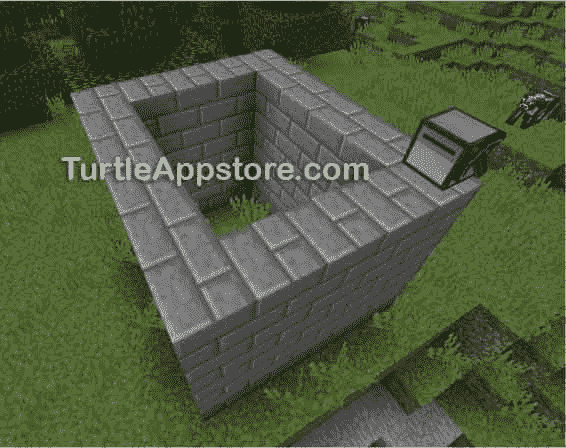
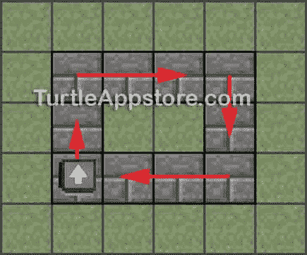
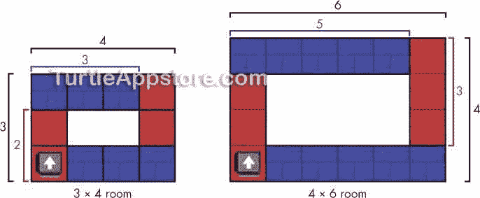
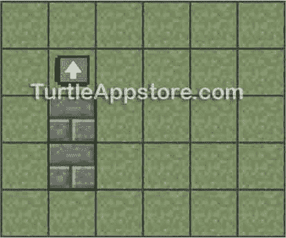
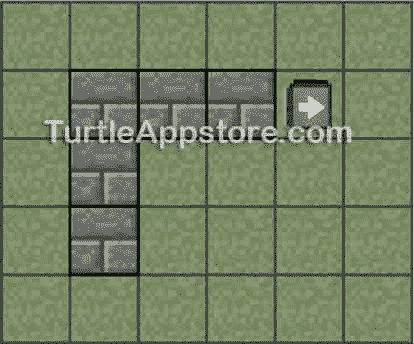
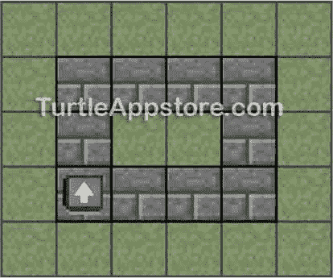
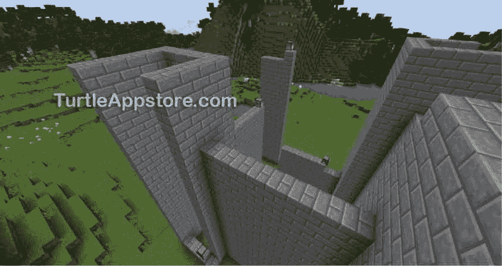
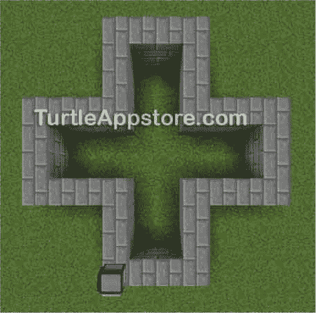

# 12 个施工间

> 原文：<https://turtleappstore.com/book/chapter12.html>


当你把四面墙拼在一起，你就有了一个房间！在这一章中，你将创建`buildRoom()`函数，该函数调用`buildWall()`四次来构建一个如图[图 12-1](#calibre_link-92) 所示的房间。这一章简短而甜蜜，因为当你在第 11 章中编写`buildWall()`函数时，你做了大部分的编码工作。当你创建完`buildRoom()`函数后，你将能够用它来建造复杂的结构，比如一座城堡！



*图 12-1:一个 5 × 6 × 4 的石砖房*

### **设计房间构建算法**

让我们设计一个算法，它采用长度、宽度和高度值来创建任意大小的房间。我们将把这个算法的代码放在`hare`模块中名为`buildRoom()`的函数中。例如，如果乌龟需要建造一个三个街区长、四个街区宽的房间，它可以建造四面墙，如图[图 12-2](#calibre_link-93) 所示。乌龟从房间的左下角开始，然后顺时针建造墙壁。



图 12-2:一只乌龟建造一个 3 × 4 的房间的俯视图。乌龟开始造的时候是朝着白色箭头的方向。

因为墙壁在房间的角落重叠，所以房间的长度和宽度与墙壁的尺寸不同。例如，要建造一个如图 12-2 中的 3 × 4 的房间，你不能只建造两堵长度为 3 的墙和两堵长度为 4 的墙，因为角会重叠。为了正确地确定房间墙壁的长度，你必须考虑墙角。看一下[图 12-3](#calibre_link-94) 中每面墙的大小，图中显示了一个 3 × 4 的房间和一个 4 × 6 的房间。



*图 12-3:一个 3 × 4 的房间(左)和一个 4 × 6 的房间(右)*

如你所见，这个 3 × 4 大小的房间由两堵两个街区长的墙和两堵三个街区长的墙组成。这个 4 × 6 大小的房间由两堵三个街区长的墙和两堵五个街区长的墙组成。

注意我们算法的模式。四面墙有两种不同的尺寸:一种尺寸是房间的宽度减一，另一种尺寸是房间的长度减一。该算法将调用我们在[第 11 章](#calibre_link-80)中创建的`buildWall()`函数。乌龟从左下角开始，如图[图 12-3](#calibre_link-94) 所示，建造房间左侧的墙壁(红色显示)。然后，算法告诉乌龟向右转，在房间的顶部建造墙壁(以蓝色显示)。乌龟再次右转，在房间的右边建红色的墙，右转，在房间的底部建蓝色的墙。当乌龟完成了所有的四面墙，它会回到它开始的地方。通过在算法中使用这种模式，`buildRoom()`函数可以创建任意大小的房间。

### **扩展 HARE 模块**

我们将把`buildRoom()`函数放在`hare`模块中，就像我们处理`buildWall()`函数一样，这样其他程序就可以使用它。从命令行运行编辑兔子。将光标移动到文件底部，并通过输入以下内容继续执行代码:

我会

```turtle
     ...snip...
110\. -- buildRoom() constructs four walls
111\. -- and a ceiling
112\. function buildRoom(length, width, height)
113.   if hare.countInventory() < (((length - 1) * height * 2) +
           ((width - 1) * height * 2)) then
114.     return false  -- not enough blocks
115.   end
116.
117.   -- build the four walls
118.   buildWall(length - 1, height)
119.   turtle.turnRight()
120.
121.   buildWall(width - 1, height)
122.   turtle.turnRight()
123.
124.   buildWall(length - 1, height)
125.   turtle.turnRight()
126.
127.   buildWall(width - 1, height)
128.   turtle.turnRight()
129.
130.   return true
131\. end
```

输入所有这些指令后，保存程序并退出编辑器。你也可以通过运行`pastebin get wwzvaKuW hare`来下载这个模块。

### **计算建造一个房间所需的总块数**

在`buildRoom()`函数可以创建一个房间之前，海龟必须首先检查它的库存中是否有足够的积木。我们需要计算房间所有四面墙所需的积木数量。我们在`hare`的第 67 行计算了一面墙所需的块数，如下所示:

```turtle
length * height
```

但是这次墙的长度比房间的长度短了一个街区。四面墙中的第一面应该有`length – 1`个街区长，所以我们的计算需要是:

```turtle
(length – 1) * height
```

因为海龟会建两堵墙，我们用这个数字乘以`2`:

```turtle
(length – 1) * height * 2
```

另外两面墙将比房间的宽度短一个街区，长度为`width – 1`街区，因此我们将这些墙的街区加入计算中，如下所示。

```turtle
((length – 1) * height * 2) + ((width – 1) * height * 2)
```

这是一个房间需要的块数的最终公式，我们将在`buildRoom()`函数中使用。

### **编写 BUILDROOM()函数**

第 113 行调用`hare.countInventory()`来找出海龟的库存中有多少块。如果这个数字小于这个房间所需的块数，我们在前面的部分中计算了这个房间所需的块数，则执行移到第 114 行，从`buildRoom()`返回`false`。调用`buildRoom()`的代码可以使用这个返回值来了解房间没有被建造。

我会

```turtle
110\. -- buildRoom() constructs four walls
111\. -- and a ceiling
112\. function buildRoom(length, width, height)
113.   if hare.countInventory() < (((length - 1) * height * 2) +
           ((width - 1) * height * 2)) then
114.     return false  -- not enough blocks
115.   end
```

否则，执行将继续越过该代码块。因为有足够的积木来建造房间，所以乌龟叫`buildWall()`。第 118 行构建了房间的第一面墙。

*我会*

```turtle
118.   buildWall(length - 1, height)
```

自下而上建造完墙后，`buildWall()`函数将乌龟移回地面。如果乌龟正在建造一个 3 × 4 的房间，在运行 118 行之后，这个房间将看起来像[图 12-4](#calibre_link-95) 中的俯视图。



*图 12-4:砌完第一面墙后的 3 × 4 房间*

在乌龟建造第二道墙之前，它必须向右转。第 119 行对`turtle.turnRight()`的调用使海龟面向正确的方向，这样它就可以在第 121 行建造下一堵墙。

*我会*

```turtle
119.   turtle.turnRight()
120.
121.   buildWall(width - 1, height)
```

注意，这堵墙的长度是`width – 1`，其中`width`是房间的宽度。如果乌龟正在建造一个 3 × 4 的房间，在第 121 行执行后，这个房间将看起来像[图 12-5](#calibre_link-96) 。



*图 12-5:砌完第二道墙后的 3 × 4 房间*

类似地，第 124 行到第 128 行构建了另外两堵墙:

我会

```turtle
122.   turtle.turnRight()
123.
124.   buildWall(length - 1, height)
125.   turtle.turnRight()
126.
127.   buildWall(width - 1, height)
128.   turtle.turnRight()
129.
130.   return true
131\. end
```

在这段代码执行之后，房间就完成了，`buildRoom()`函数在第 130 行返回`true`,告诉调用`buildRoom()`的代码房间已经成功建造。乌龟将回到它的起始位置并面向它原来的方向，但它将在它建造的第一堵墙的顶部，如图[图 12-6](#calibre_link-97) 所示。



*图 12-6:3×4 的房间完成后，乌龟回到了起点。*

第 131 行的`end`语句结束了`buildRoom()`函数的代码块。

### **编写 BUILDROOM 程序**

在《T4》第 11 章中，你制作了一个调用`hare.buildWall()`的`buildwall`程序，这样玩家就可以很容易地从命令 shell 中建造一堵墙。我们将制作一个类似的`buildroom`程序来调用`hare.buildRoom()`。从命令 shell 中，运行 edit buildroom 并输入以下代码:

*生成室*

```turtle
 1\. --[[Room Building program by Al Sweigart
 2\. Builds a room of four walls.]]
 3.
 4\. os.loadAPI('hare')
 5.
 6\. -- handle command line arguments
 7\. local cliArgs = {...}
 8\. local length = tonumber(cliArgs[1])
 9\. local width = tonumber(cliArgs[2])
10\. local height = tonumber(cliArgs[3])
11.
12\. if length == nil or width == nil or height == nil or cliArgs[1] == '?' then
13.   print('Usage: buildroom <length> <width> <height>')
14.   return
15\. end
16.
17\. print('Building...')
18\. if hare.buildRoom(length, width, height) == false then
19.   error('Not enough blocks.')
20\. end
21\. print('Done.')
```

当你输入所有这些指令后，保存程序并退出编辑器。您还需要`hare`模块，可以通过运行`pastebin get wwzvaKuW hare`下载。

像`buildwall`程序一样，`buildroom`程序主要依赖于`hare`模块中的函数。首先，它从`{...}`收集命令行参数，如果需要的话显示一条用法消息，然后它调用`hare.buildRoom()`。除了我们使用`hare.buildRoom()`函数代替`hare.buildWall()`之外，它几乎与`buildwall`程序相同。

### **运行构建程序**

在放置乌龟并将 72 块石头砖块(或任何其他种类的积木)放入其库存后，右键单击乌龟以打开其 GUI。从命令 shell 中，运行 buildroom 5 6 4 来观看海龟建造一个 5 个街区长、6 个街区宽、4 个街区高的房间。

使用`buildwall`和`buildroom`程序，你可以快速建造高大的城堡或其他建筑，而无需放置任何砖块！你可以让多个运行`buildRoom`或`buildWall`程序的海龟并行建造建筑，如图[图 12-7](#calibre_link-98) 所示。



*图 12-7:乌龟通过运行* 筑墙 *和* 筑房 *程序*建造城堡

如果您在运行这个程序时遇到错误，请仔细地将您的代码与本书中的代码进行比较，找出任何打字错误。如果你仍然不能修复你的程序，通过运行`delete buildroom`删除文件，然后通过运行`pastebin get U0WVM4wg buildroom`下载它。

**奖励活动:加号形房间**

试着创建一个程序来制作加号形状的房间，如图[图 12-8](#calibre_link-99) 所示，而不是矩形房间。你的程序类似于建造室程序，但是需要十二次调用 hare.buildWall() 而不是四次，你需要计算出海龟需要转的所有圈。



*图 12-8:一只乌龟在建造一个加号形状的房间后*

### **你学到了什么**

虽然在这一章中没有需要学习的编程概念，但是这对于开发算法来说是一个很好的实践。你把你想让海龟做什么的模糊想法变成实际代码的经验越多，你就会成为一个更好的程序员。

你在第 11 章中创建了一个砌墙功能，在本章中创建了一个建造房间的功能。在[第 13 章](#calibre_link-100)中，你将开发一个建造地板和天花板的算法。