# 13 建筑楼层

> 原文：<https://turtleappstore.com/book/chapter13.html>


我们用第 12 章中[的`buildRoom()`功能建造的房间很有用，但是它们不能挡雨。在这一章中，我们将编写一个`buildFloor()`函数来构建地板和天花板，我们还将编写一个`buildfloor`程序来调用这个函数。我们将使用一个函数来构建地板和天花板，因为天花板只是建得更高的地板，如图](#calibre_link-81)[图 13-1](#calibre_link-102) 所示。

我们将用来建造地板的算法将移动一只乌龟穿过一个矩形区域，并让乌龟在每个空间执行一个动作。在这一章中，海龟会在矩形区域的每个空间放置一个方块，但是这个灵活的算法可以执行很多任务。例如，在[第 14 章](#calibre_link-103)中，我们将使用这个算法编写一个农场程序，在一个矩形区域的每一个空间播种。使用灵活的算法而不是硬编码的解决方案允许您使用相同的代码来解决各种问题！

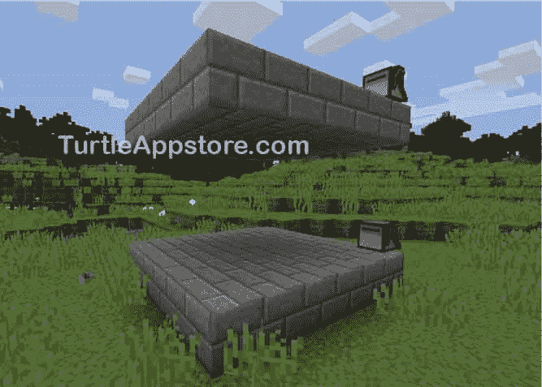

图 13-1:构建地板的代码也可以构建天花板。

### **设计扫描算法**

建造一个水平的表面就像建造一堵墙，但在铺设完一排积木后，乌龟不是向上移动，而是向左或向右移动到下一列。我们将乌龟移动穿过矩形区域的每一个空间的动作称为*扫过*，我们将矩形区域称为*场*。

我们将使用具有三个参数的算法来编写`sweepField()`函数:`length`、`width`和`sweepFunc`。`length`和`width`参数决定了区域的大小，如图[图 13-2](#calibre_link-104) 所示。

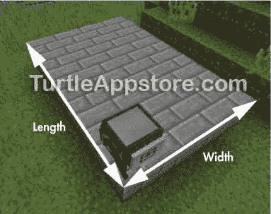

*图 13-2:*长度 *参数是乌龟前面的距离。* 宽度 *参数是乌龟右边的距离。*

`sweepFunc`参数接受一个函数，它在字段的每个空格处调用该函数。在 Lua 编程语言中，我们可以传递函数作为参数，就像传递值一样。当`buildFloor()`函数使用`sweepField()`建造地板时，它会传递一个函数，该函数会在海龟每次移动到新的空间时放置积木。因为`sweepFunc`是一个参数，我们可以传递其他函数给它，我们可以定制`sweepField()`来指示海龟执行我们想要的任何动作。本章的重点是创建楼层，所以我们将检查在`buildfloor`程序中使用的算法。

#### **建造地板**

`buildfloor`程序将接受两个命令行参数:`length`和`width`。如前所述，这些参数决定了地板的大小。

图 13-3 显示了一只海龟铺设 3 × 4 地板的俯视图。

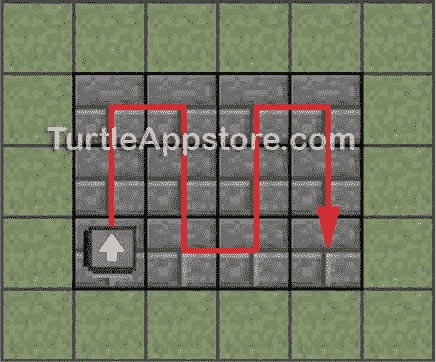

*图 13-3:乌龟扫过矩形 3 × 4 地板的路径*

为了创建地板，乌龟将首先沿着第一列向前移动，并在每个空间上调用一个函数，在它自己下面放置一块石砖。为了告诉 turtle 调用哪个函数，我们将使用`sweepFunc`参数，我们将在第 161 页的[调用`sweepFunc()`函数](#calibre_link-106)中更详细地了解这个参数。现在，只要知道这个参数取了一个函数，每当海龟移动到矩形地板上的不同位置时，这个函数都会被调用。在`buildfloor`程序中，传递给`sweepFunc`的函数是`selectAndPlaceDown`，它是`hare`模块中的函数，选择海龟的下一个非空库存槽，并将所选块放在海龟下面。因为乌龟从左下角开始，所以它沿着第一列移动时只需要向前移动`length - 1`次。这将海龟放在第一列的最后一块上，如图[图 13-4](#calibre_link-108) 所示。

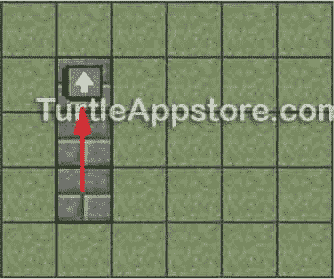

*图 13-4:向前移动* length - 1 *次后，乌龟越过了第一栏的最后一块。*

为了移动到下一列并面向正确的方向，乌龟必须向右转，向前移动一次，然后再次向右转，这样它将到达图 13-5 所示的位置。

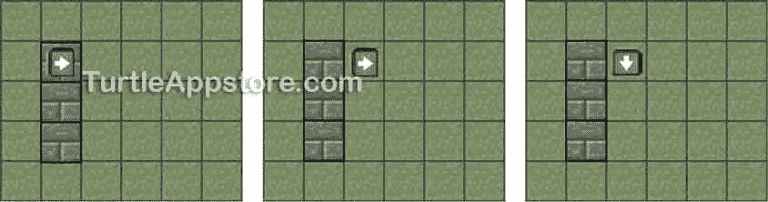

*图 13-5:乌龟右转，向前移动，再次右转准备建下一列。*

现在海龟运行类似的代码沿着下一列前进。它向前移动`length - 1`次，在每个空格处调用`selectAndPlaceDown`来放置一个方块到它自己下面。结果是现在有两列积木，如图[图 13-6](#calibre_link-110) 所示。

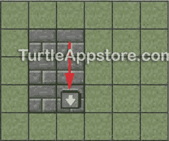

*图 13-6:海龟完成第二栏*后的位置

此时，乌龟必须左转，向前移动，再左转移动到下一列，如图[图 13-7](#calibre_link-111) 。

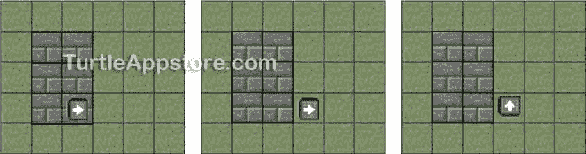

*图 13-7:第二列建成后，乌龟必须左转，向前移动，然后再左转。*

海龟继续沿着列来回移动，直到海龟完成的列数等于字段的`width`。当海龟完成了算法的这一部分，它就已经创建了地板，但是它的工作还没有完成！我们可能想在`buildfloor`程序之后运行`buildroom`程序来创建一个房间。在这种情况下，我们需要乌龟处于与开始建造地板时相同的位置并面向相同的方向。让乌龟回到它的起始位置，确保当我们调用`buildroom`程序时，它建造的墙将在地板上方对齐。

#### **回到起始位置**

在扫过整个场地后，让海龟回到它的起始位置并面对它的起始方向需要两个不同系列步骤中的一个，这取决于场地的宽度是偶数还是奇数。

如果宽度是偶数，乌龟会在地板底排最右边的方块上，如图[图 13-8](#calibre_link-112) 所示。

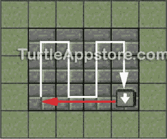

图 13-8:当场地的宽度是偶数时，乌龟在最下面一行最右边的方块。

[图 13-8](#calibre_link-112) 中的红线显示了海龟返回起始空间并面向起始方向所必须走的路线。在这种情况下，海龟必须:

1.  向右转

2.  向前移动`width - 1`个空格

3.  向右转

然而，如果场地的宽度是奇数，当海龟放置完所有的方块后，它会停在场地的顶部，如图[图 13-9](#calibre_link-113) 所示。

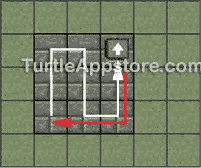

图 13-9:当字段的宽度是奇数时，乌龟在顶行最右边的块。

图 13-9 中的红线显示了海龟返回起始空间并面向起始方向所必须走的路线。在这种情况下，海龟必须:

1.  后退`length - 1`格

2.  向左转

3.  向前移动`width - 1`个空格

4.  向右转

您将在`sweepField()`函数中编写这个返回行为，但是在学习如何编写`sweepField()`函数之前，您需要了解如何将一个函数传递给另一个函数。

### **将函数传递给函数**

我们在[第 11 章](#calibre_link-80)和[第 12 章](#calibre_link-81)中分别使用的`buildWall()`和`buildRoom()`函数非常灵活，可以构建任何尺寸的墙壁和房间，因为它们使用了`length`、`width`和`height`的参数。这些参数允许函数在不改变源代码的情况下制作不同尺寸的墙壁和房间。

在本章中，我们将把`sweepField()`函数添加到`hare`模块中，并在`buildFloor`程序中调用`sweepField()`函数。目前，`sweepField()`功能移动乌龟扫过一个长方形的场地，在每个地方放置一块石头砖块。

但是我们也可以改变`sweepField()`函数，让乌龟扫过一个长方形的农场去播种和捡小麦，或者我们可以命令乌龟在自己下面挖洞，在地上挖一个长方形的洞。让海龟以扫掠模式移动的代码保持不变，但海龟的动作可以在每个空间发生变化。

`sweepField()`函数具有这种灵活性，因为它的`sweepFunc`参数被传递给一个函数，当海龟行进到矩形区域中的每个空间时，它调用这个函数。在 Lua 中，可以将函数作为参数传递，就像传递整数或字符串一样。让我们创建一个简单的示例程序，将一个函数传递给另一个函数的参数。在命令 shell 中，输入 edit announce 启动一个新程序，然后输入以下内容:

*宣布*

```turtle
 1\. function hello()
 2.   print('Hello there!')
 3\. end
 4.
 5\. function goodbye()
 6.   print('Goodbye!')
 7\. end
 8.
 9\. function announce(func)
10.   print('About to call the function.')
11.   func()
12.   print('Function called.')
13\. end
14.
15\. announce(hello)  -- no parentheses after hello
16\. announce(goodbye)  -- no parentheses after goodbye
```

输入所有这些指令后，保存程序并退出编辑器。你也可以通过运行`pastebin get sML2CbZ3 announce`来下载这个程序。

当您从命令 shell 运行该程序时，您将看到以下输出:

```turtle
> announce
About to call the function.
Hello there!
Function called.
About to call the function.
Goodbye!
Function called.
```

`announce()`函数有一个名为`func`的参数。第一次调用`announce()`时，在第 15 行，它被传递给参数的`hello()`函数。注意,`hello`后面没有括号。括号告诉 Lua“调用这个函数”，但是如果没有括号，Lua 会将`hello()`函数传递给`announce()`中的`func`参数。`hello()`函数存储在`func`参数中，就像整数或字符串存储在参数中一样。然后，在第 11 行，调用存储在`func`内的函数，因为它有括号:`func()`。因为`hello`被传递给了`func`参数，所以`hello()`函数被调用，程序显示`Hello there!`。

稍后，第 16 行将调用`announce()`函数，但这次它将为`func`参数传递`goodbye`。因此，当第 11 行调用`func()`时，`goodbye()`函数中的代码将运行并打印`Goodbye!`。

`announce()`函数中的代码没有改变。它只知道应该调用为它的`func`参数传递的任何函数。类似地，我们将创建的`sweepField()`函数将调用为其`sweepFunc`参数传递的函数。`buildFloor()`函数将把`hare.selectAndPlaceDown`传递给`sweepField()`，让它在矩形区域的每个空格里把方块放在海龟下面。

### **扩展 HARE 模块**

因为`sweepField()`函数对许多不同的程序都有用，我们将把它放在[第 7 章](#calibre_link-49)中开始的`hare`模块中。我们也将添加到`hare`模块中的`buildFloor()`函数将调用`sweepField()`。从命令 shell 中，运行 edit hare 。将光标移动到文件底部，并通过输入以下内容继续执行代码:

我会

```turtle
     ...snip...
134\. -- sweepField() moves across the rows
135\. -- and columns of an area in front and
136\. -- to the right of the turtle, calling
137\. -- the provided sweepFunc at each space
138\. function sweepField(length, width, sweepFunc)
139.   local turnRightNext = true
140.   
141.   for x = 1, width do
142.     for y = 1, length do
143.       sweepFunc()
144.
145.       -- don't move forward on the last row
146.       if y ~= length then
147.         turtle.forward()
148.       end
149.     end
150.
151.     -- don't turn on the last column
152.     if x ~= width then
153.       -- turn to the next column
154.       if turnRightNext then
155.         turtle.turnRight()
156.         turtle.forward()
157.         turtle.turnRight()
158.       else
159.         turtle.turnLeft()
160.         turtle.forward()
161.         turtle.turnLeft()
162.       end
163.
164.       turnRightNext = not turnRightNext
165.     end
166.   end
167.
168.   -- move back to the start position
169.   if width % 2 == 0 then
170.     turtle.turnRight()
171.   else
172.     for y = 1, length - 1 do
173.       turtle.back()
174.     end
175.     turtle.turnLeft()
176.   end
177.
178.   for x = 1, width - 1 do
179.     turtle.forward()
180.   end
181.   turtle.turnRight()
182.
183.   return true
184\. end
185.
186.
187\. -- buildFloor() builds a rectangular
188\. -- floor out of the blocks in the
189\. -- inventory
190\. function buildFloor(length, width)
191.   if countInventory() < length * width then
192.     return false  -- not enough blocks
193.   end
194.
195.   turtle.up()
196.   sweepField(length, width, selectAndPlaceDown)
197\. end
```

输入所有这些指令后，保存程序并退出编辑器。你也可以通过运行`pastebin get wwzvaKuW hare`来下载这个模块。

### **调用 SWEEPFUNC()函数**

让我们一次看一个新的`hare`函数，从`sweepField()`开始。`sweepField()`函数所做的就是在整个场地上移动海龟，在每个空格调用一次作为参数传入的函数。`length`和`width`参数分别告诉`sweepField()`字段有多少行长和多少列宽。

为了在海龟移动到的每个空间运行`sweepFunc()`，我们使用一个`for`循环迭代每一列，另一个`for`循环迭代每一行。

我会

```turtle
134\. -- sweepField() moves across the rows
135\. -- and columns of an area in front and
136\. -- to the right of the turtle, calling
137\. -- the provided sweepFunc at each space
138\. function sweepField(length, width, sweepFunc)
139.   local turnRightNext = true
140.   
141.   for x = 1, width do
142.     for y = 1, length do
143.       sweepFunc()
```

在每一列的末尾，海龟在向右转和向左转之间交替，所以第 139 行将`turnRightNext`变量设置为`true`。

两个嵌套的`for`循环迭代跟踪海龟在哪个列和行上。变量`x`记录乌龟在哪一列，变量`y`记录乌龟在哪一行。当`y`等于`length`时，海龟位于当前列的最后一行。当`x`等于`width`时，乌龟在其当前行的最后一列。[图 13-10](#calibre_link-114) 显示了海龟扫过场地时每个区块的`x`和`y`的值。请注意，`y`值在不同侧从`1`开始，因为海龟在上下移动列之间交替。

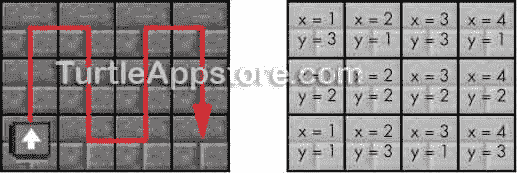

*图 13-10:乌龟扫过场地的路径(左)和每个空间的* x *和* y *变量的值(右)*

在内部`for`循环中，第 143 行调用`sweepFunc()`。记住`sweepFunc`是一个参数，而不是一个函数的名字。在我们的程序中没有任何一行`function sweepFunc()`来定义这个名字的函数。相反，`sweepFunc`是一个我们将设置为函数的参数。因此，任何函数都可以传递给`sweepField()`，并且它将在第 143 行上被调用为`sweepFunc()`。

#### **沿着行和列移动**

调用`sweepFunc()`后，乌龟需要移动到下一个空间。从 142 开始的内部`for`循环从`1`到`length`迭代`y`变量。turtle 需要上下移动每一列的`length - 1`行，所以第 146 到 148 行在`for`循环的每一次迭代中都调用`turtle.forward()`，除了最后一次迭代(当`y`将等于`length`)。

*我会*

```turtle
145.       -- don't move forward on the last row
146.       if y ~= length then
147.         turtle.forward()
148.       end
149.     end
```

当程序到达第 149 行并且从第 142 行开始的`for`循环结束时，海龟已经到达最后一行和该列的末尾。如果海龟还没有在最后一列(你可以知道，因为`x`将等于`width`)，海龟需要移动下一列。

为了移动到下一列，海龟需要转向的方向取决于`turnRightNext`是`true`还是`false`。(参见[图 13-5](#calibre_link-109) 和 [13-7](#calibre_link-111) 了解海龟必须完成的不同转弯。)如果`turnRightNext`是`true`，第 155 到 157 行让乌龟向右转，向前移动，再向右转。如果`turnRightNext`是`false`，第 159 到 161 行让乌龟向左拐，往前走，再向左拐。不管怎样，海龟将出现在下一篇专栏的开头。

我会

```turtle
151.     -- don't turn on the last column
152.     if x ~= width then
153.       -- turn to the next column
154.       if turnRightNext then
155.         turtle.turnRight()
156.         turtle.forward()
157.         turtle.turnRight()
158.       else
159.         turtle.turnLeft()
160.         turtle.forward()
161.         turtle.turnLeft()
162.       end
163.
164.       turnRightNext = not turnRightNext
165.     end
166.   end
```

下一次海龟必须转向下一列时，它必须转向另一个方向，所以第 164 行切换`turnRightNext`中的布尔值。第 165 行的`end`语句结束第 152 行的`if`语句，第 166 行的`end`语句结束第 141 行的`for`循环。当执行到第 166 行时，海龟已经扫过了整个场地，准备返回起始位置。

#### **用模数运算符计算一个数是偶数还是奇数**

乌龟必须走两条不同的路才能在清扫完场地后回到它的起始位置。回想一下，这些路径显示在图 13-8 和图 13-9 的[中，海龟选择哪条路径取决于场地的`width`是奇数还是偶数。为了确定一个数是偶数还是奇数，我们需要检查这个数是否能被 2 整除。当一个数能被 2 整除时，它就是偶数。当一个数不能被 2 整除，且余数为 1 时，这个数是奇数。](#calibre_link-112)

所以，要判断一个数是偶数还是奇数，我们只需要求这个数除以二的余数就可以了。我们可以通过使用*模数操作符*，或者*模数操作符* ( `%`)来做到这一点。(这个名字和 Minecraft mods 没关系。)

在 Lua shell 中输入以下内容，看看 mod 操作符是如何工作的:

```turtle
lua> 6 % 2
0
lua> 7 % 2
1
lua> 8 % 2
0
```

我们像使用除法运算符(`/`)一样使用 mod 运算符:输入要除的数、`%`运算符和要除的数(在本例中是 2)。由`2`修改的偶数将总是导致`0`，因为偶数被 2 除时没有余数。由`2`修改的奇数将总是导致`1`。

使用这个 mod 技巧，我们可以确定`width`是偶数还是奇数。

#### **偶数宽度和奇数宽度路径**

海龟返回起始空间的路径根据`width`是奇数还是偶数而不同，所以我们将使用一个`if`语句。

我会

```turtle
168.   -- move back to the start position
169.   if width % 2 == 0 then
170.     turtle.turnRight()
171.   else
172.     for y = 1, length - 1 do
173.       turtle.back()
174.     end
175.     turtle.turnLeft()
176.   end
```

如果字段的`width`是偶数，那么`width % 2`将等于`0`，并且第 169 行的`if`语句的条件将是`true`。在这种情况下，170 线将海龟转向右边。否则，如果`width`是奇数，则第 172 至 174 行将海龟向后移动到该行的另一端，第 175 行将海龟转向左侧。在这两种情况下，海龟都将停在柱子的开始处，面朝左。

接下来，第 178 到 180 行将海龟向前移动`width - 1`个空格，以使海龟返回到其起始位置。为了让海龟面向它的出发方向，181 行把海龟转向右边。

*我会*

```turtle
178.   for x = 1, width - 1 do
179.     turtle.forward()
180.   end
181.   turtle.turnRight()
182.
183.   return true
184\. end
```

此时，乌龟又回到了起始位置，所以 183 行返回`true`。第 184 行的`end`语句结束了`sweepField()`函数的代码块。

记住，`sweepField()`函数并不是专门为建造一个楼层而编写的。相反，我们可以把这个函数用于许多不同的目的，因为它让海龟在每个空间调用一个函数的同时扫过一片田地。为了制作地板，我们将创建`buildFloor()`函数。

### **编写 BUILDFLOOR()函数**

使用`sweepField()`函数，`buildFloor()`函数使用海龟库存中的积木搭建一个矩形地板。`buildFloor()`函数将`length`和`width`变量作为参数来指定地板应该有多大。

*我会*

```turtle
187\. -- buildFloor() builds a rectangular
188\. -- floor out of the blocks in the
189\. -- inventory
190\. function buildFloor(length, width)
191.   if countInventory() < length * width then
192.     return false  -- not enough blocks
193.   end
```

第 191 行调用`countInventory()`并将海龟库存中的积木数量与创建地板所需的积木数量进行比较。一个长`length`块宽`width`块的地板需要`length * width`块来建造。如果乌龟没有足够的积木来建造地板，这个功能将会结束。

如果乌龟有足够多的积木，195 行将乌龟向上移动一次，这样乌龟在清扫场地时就可以把地板积木放在自己下面。

我会

```turtle
195.   turtle.up()
196.   sweepField(length, width, selectAndPlaceDown)
197\. end
```

线 196 将`length`、`width`和`selectAndPlaceDown`功能传递给`sweepField()`。第 196 行的调用告诉`sweepField()`在田地的每个空间调用函数`selectAndPlaceDown()`，这样海龟就可以放置积木来建造地板。

`buildFloor()`函数到此为止。这个函数很短，因为大部分工作是由`sweepField()`函数完成的。

### **编写 BUILDFLOOR 程序**

我们将`buildFloor()`和`sweepField()`函数放在了`hare`模块中，这样程序就可以调用这些函数，但是如果一个程序只用于建筑楼层，那还是很有用的。就像 [第 11 章](#calibre_link-80)和[第 12 章](#calibre_link-81)中的`buildwall`和`buildroom`程序一样，`buildfloor`程序会接受命令行参数，提供使用信息，并调用`hare.buildFloor()`来构建地板或天花板。

从命令 shell 中，运行 edit buildfloor 并输入以下代码:

*建筑物楼*

```turtle
 1\. --[[Floor Building program by Al Sweigart
 2\. Builds a rectangular floor.]]
 3.
 4\. os.loadAPI('hare')
 5.
 6\. -- handle command line arguments
 7\. local cliArgs = {...}
 8\. local length = tonumber(cliArgs[1])
 9\. local width = tonumber(cliArgs[2])
10.
11\. if length == nil or width == nil or cliArgs[1] == '?' then
12.   print('Usage: buildwall <length> <width>')
13.   return
14\. end
15.
16\. hare.buildFloor(length, width)
```

输入所有这些指令后，保存程序并退出编辑器。

因为`buildfloor`与`buildwall`和`buildroom`程序非常相似，所以我不再解释代码。该程序只接受命令行参数来确定地板的长度和宽度，`hare.buildFloor()`函数将其传递给`sweepField()`。

### **运行 BUILDFLOOR 程序**

放置乌龟后，右键单击乌龟打开它的 GUI。装载至少 30 块石砖(或其他积木)到它的库存中。在命令 shell 中，运行 buildfloor 5 6 来观察海龟建造一个 5 个街区长、6 个街区宽的地板。

之后，你可以运行`buildroom 5 6 4`来为地板上方的房间建造墙壁。当这个房间完成后，向右旋转乌龟并再次运行`buildfloor 5 6`将为这个房间建造一个平屋顶！现在，您已经拥有了建造矩形房间所需的一切。

如果您在运行这个程序时遇到错误，请仔细地将您的代码与本书中的代码进行比较，找出任何打字错误。如果你仍然不能修复你的程序，通过运行`delete buildfloor`删除文件，然后通过运行`pastebin get Epr9CndN buildfloor`下载它。

### **创建图案化地板**

如前所述，因为`sweepField()`函数允许我们为它的`sweepFunc`参数传递任何函数，所以它非常灵活。让我们写一个`buildcheckerboard`程序，用煤块和石英块建造一个方格地板。

九块煤可以加工出煤块，四块石英可以加工出石英块。[图 13-11](#calibre_link-115) 显示了这些食谱。注意，你只能从幽冥中开采幽冥石英(参见 http://minecraft.gamepedia.com/The_Nether*[)。](http://minecraft.gamepedia.com/The_Nether)*

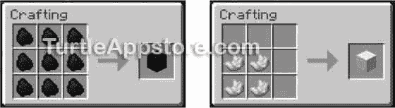

*图 13-11:制作煤块(左)和石英块(右)*

因为我们已经在做方格地板了，所以让我们把地板做成棋盘，这样你就可以在《我的世界》和你的海龟们玩跳棋了！

#### **编写构建棋盘程序**

要做一个 8 × 8 的棋盘，我们需要收集 32 块煤块和 32 块石英块。创建完`buildcheckerboard`程序后，我们将修改海龟的颜色，这样你就可以创建一个 8 × 8 的棋盘了。从命令 shell 中，运行 edit buildcheckerboard 并输入以下代码:

*构建棋盘*

```turtle
 1\. --[[Checkerboard Building program by Al Sweigart
 2\. Builds a checkerboard floor.]]
 3.
 4\. os.loadAPI('hare')
 5.
 6\. -- handle command line arguments
 7\. local cliArgs = {...}
 8\. local length = tonumber(cliArgs[1])
 9\. local width = tonumber(cliArgs[2])
10.
11\. if length == nil or width == nil or cliArgs[1] == '?' then
12.   print('Usage: buildcheckerboard <length> <width>')
13.   return
14\. end
15.
16\. local placeBlack = true
17.
18\. function placeCheckerboard()
19.   -- select coal or quartz, based on placeBlack
20.   if placeBlack then
21.     hare.selectItem('minecraft:coal_block')
22.   else
23.     hare.selectItem('minecraft:quartz_block')
24.   end
25.
26.   turtle.placeDown()
27.   placeBlack = not placeBlack
28\. end
29.
30\. turtle.up()
31\. hare.sweepField(length, width, placeCheckerboard)
```

输入所有这些指令后，保存程序并退出编辑器。

#### **运行构建棋盘程序**

将 32 个煤块和 32 个石英块放入海龟的库存中，然后从命令 shell 运行 buildcheckerboard 8 8 。乌龟将开始创造一个 8 × 8 的棋盘地板，你可以在[图 13-12](#calibre_link-116) 中看到。

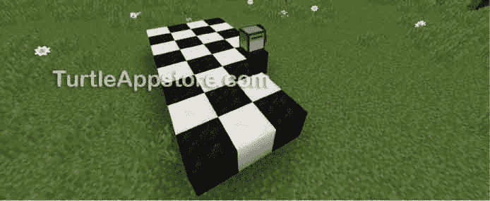

*图 13-12:制作棋盘地板过程中的乌龟*

如果您在运行这个程序时遇到错误，请仔细地将您的代码与本书中的代码进行比较，找出任何打字错误。如果你仍然不能修复你的程序，通过运行`delete buildcheckerboard`删除文件，然后通过运行`pastebin get QQQK3mqk buildcheckerboard`下载它。

虽然我们制作了`buildCheckerboard`程序来制作标准尺寸棋盘大小的方格地板，但你现在实际上可以创建任何尺寸的方格地板。这些可以是花式城堡地板的一部分，如图[图 13-13](#calibre_link-117) 所示。

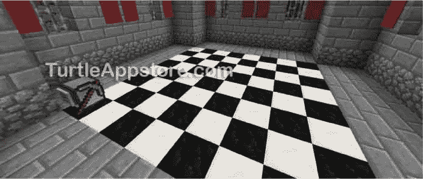

*图 13-13:海龟建造的城堡中海龟建造的方格地板*

或者，如果你创建了 24 只乌龟，拿着玫瑰红染料或骨粉，同时右击乌龟，分别将它们染成红色或白色，你可以创建一个棋子组，如图[图 13-14](#calibre_link-118) 所示。

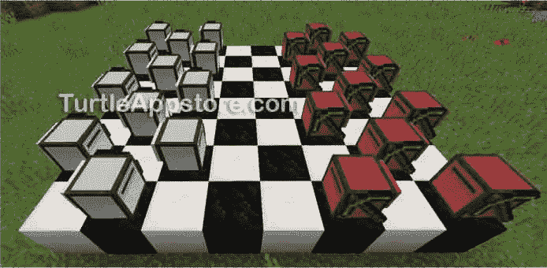

*图 13-14:海龟棋盘*

即使是建造一个巨大的 32 × 32 的方格地板，如图[图 13-15](#calibre_link-119) 所示，当一只乌龟为你做的时候也很容易。

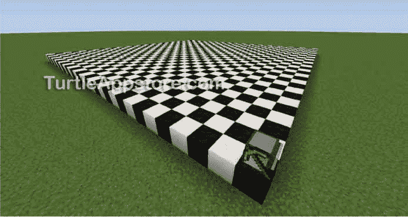

*图 13-15:海龟建造的 32 × 32 方格地板*

#### **编写 PLACECHECKERBOARD()函数**

与`hare.selectAndPlaceDown()`功能不同，它只是在放置砖块之前选择任何有物品的槽，`placeCheckerboard()`功能查看`placeBlack`变量来确定是选择煤块还是石英块。

`placeBlack`变量首先由第 16 行的`local`语句创建，在所有函数之外。

*构建棋盘*

```turtle
16\. local placeBlack = true
```

函数`placeCheckerboard()`检查这个变量是`true`还是`false`来决定海龟应该选择哪个方块。

*构建棋盘*

```turtle
18\. function placeCheckerboard()
19.   -- select coal or quartz, based on placeBlack
20.   if placeBlack then
21.     hare.selectItem('minecraft:coal_block')
22.   else
23.     hare.selectItem('minecraft:quartz_block')
24.   end
25.
26.   turtle.placeDown()
```

当`placeBlack`为`true`时，程序调用`hare.selectItem()`选择包含煤块的库存槽。当`placeBlack`为`false`时，程序选择包含石英块的库存槽。

在`if`和`else`语句指定用`hare.selectItem()`函数选择哪种块类型之后，第 26 行将选择的块类型放在海龟的下面。

然后第 27 行切换存储在`placeBlack`中的布尔值。

*构建棋盘*

```turtle
27.   placeBlack = not placeBlack
28\. end
```

如果`placeBlack`曾经是`true`，现在将会是`false`。如果`placeBlack`是`false`，那么现在就是`true`。这意味着下一次`sweepField()`函数调用`placeCheckerboard()`时，将放置相反颜色的块。这段代码产生了方格图案。

#### **调用 SWEEPFIELD()函数**

在`placeCheckerboard()`函数在第 28 行结束后，程序的主要部分继续。第 30 行将海龟上移一格，这样它就有空间在下面放置方块。

*构建棋盘*

```turtle
30\. turtle.up()
31\. hare.sweepField(length, width, placeCheckerboard)
```

然后它调用`hare.sweepField()`，将命令行参数作为`length`和`width`传入。它还把`placeCheckerboard`函数作为一个值传入，这个值后面没有括号，因为程序没有调用`placeCheckerboard()`函数，而是传入这个函数。

**奖励活动:不同颜色的棋盘**

你不必用黑煤和白石英块做棋盘。试着装上不同的积木，做成其他风格的棋盘:金积木和铁积木，蓝羊毛和红羊毛，或者瓜和南瓜。您必须调整程序中的 hare.selectItem() 函数调用来选择这些不同的块类型。

### **你学到了什么**

在这一章中，我们创建了一个通用的扫描场算法，让海龟访问矩形中的每个空间并执行一个动作。`buildfloor`程序使用这种算法来建造地板和天花板，但是你可以将这种算法应用到许多不同种类的任务中。这是可能的，因为 Lua 允许您将函数传递给其他函数，就像传递字符串或整数值一样容易。当`selectAndPlaceDown()`函数在`buildfloor`程序中被传递给`sweepField()`时，乌龟建造了一个地板。但是当更专业的`placeCheckerboard()`函数被传递给`buildCheckerboard`程序中的`sweepField()`时，海龟建造了一个方格地板。

因为`sweepField()`函数适应性很强，所以编写新的行为不需要太多额外的代码。在[第 14 章](#calibre_link-103)中，我们将使用`sweepField()`函数来创建一个自动化农场，为你完成所有的种植和收割工作。