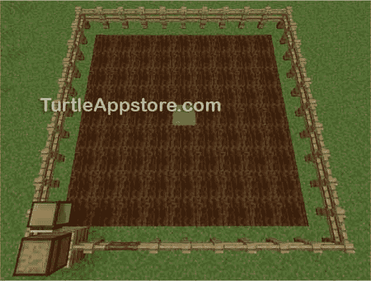
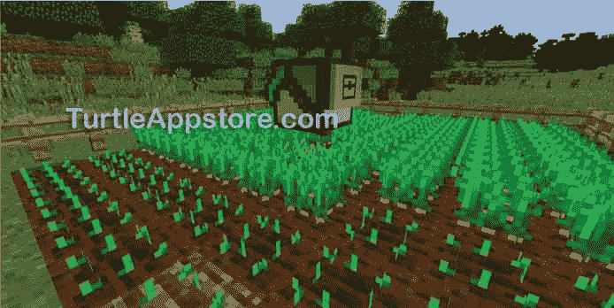
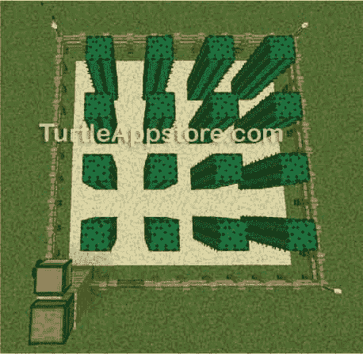
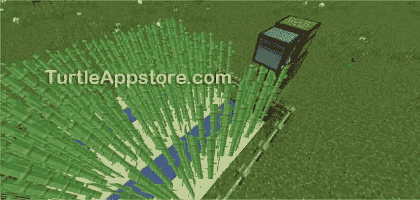

# 14 为机器人农场编程

> 原文：<https://turtleappstore.com/book/chapter14.html>


在生存模式下，你需要确保你吃饱了，但是寻找和收集食物是很费时间的。耕种和储存食物是更好的解决方案，但维持一个大农场可能是一件苦差事。然而，你可以用一只编程良好的海龟来管理一大片农田，如图[图 14-1](#calibre_link-121) 所示。


图 14-1:一只乌龟可以经营一个大规模的小麦农场。

在这一章，你将编写一个算法，告诉你的海龟如何种植、收获和储存作物。

### **建立麦田**

要创建一个小麦种植算法，你必须了解如何在《我的世界》种植小麦。要做到这一点，你需要一把锄头，一块平坦的泥土或草地，一个水桶，一个水源，如海洋或河流(水源不需要靠近草地)，栅栏和一个箱子。

首先，带着你的空桶去你的水源，用桶右键点击水来装满它。然后，去你的平坦的泥土或草块区域，用锄头翻耕平坦区域的顶部，直到你有 9 × 9 面积的翻耕块。因为如果附近没有水，耕作过的砖块会变回泥土，所以你需要在 9 × 9 的田地中间挖一个洞，然后用水桶右键单击这个洞。这样做会把洞灌满水。这个单独的水块可以浇灌任何方向上离它四个街区远的所有泥土块，为你的农场创造一个 9 × 9 的田地。你可以将这些 9 × 9 的田地一个挨着一个地放置，以创建更大的农场。

你还应该在农场周围放置一个围栏，以防止奶牛、绵羊和怪物阻挡海龟的道路，你应该在农场的左下角放置一个离地面一个街区的箱子，供海龟储存其收获。图 14-2 显示了你的字段应该是什么样子。

**注**

一只海龟可以管理任何大小的矩形区域。只要确保每 9 × 9 块地有一个水块，以保持作物得到灌溉。你只需要在长方形场地周围有一个栅栏(不管它有多大)来阻挡暴民和动物。



*图 14-2:一片 9 × 9 的麦田，中间是水，左下角是乌龟和箱子*

现在你的农场已经设置好了，让我们看看`farmwheat`程序用来运行农场的算法。

### **设计小麦种植算法**

在本章的后面，我们将编写`farmwheat`程序，但是首先我们需要计划程序应该使用的算法。在海龟开始耕种田地之前，它需要检查两件事。首先，乌龟检查它是从一个箱子旁边开始的。如果它找不到一个箱子，它就没有地方放下它收获的小麦。因为`farmwheat`程序将重用我们在[第 13 章](#calibre_link-100)中写的`hare.sweepField()`函数，海龟还需要检查它是否有足够的燃料来完成一次场地扫描。

在海龟确认它旁边有一个箱子并且有足够的燃料后，它会使用`hare.sweepField()`函数在整个区域内移动。因为小麦成熟的速度不同(大多数作物在 30 到 60 分钟内成熟，或两到三个《我的世界》日)，整个麦田很可能不会在同一时间成熟。因此，我们需要设计一个传递给`hare.sweepField()`的函数，它将决定海龟在田地的每个空间应该做什么。

海龟需要完成三个动作中的一个:

*   如果空地上没有种小麦，就种下一颗种子
*   如果种了小麦但还没有成熟，就什么也不要做
*   如果小麦成熟了，就收割它，然后播种

当乌龟在每个空格上完成这三个动作中的一个后，乌龟会回到原来的位置，这是我们在[第 13 章](#calibre_link-100)的`hare.sweepField()`函数中编程的。在这种情况下，乌龟的起始位置在胸部旁边。乌龟转身面对箱子，把任何收获的小麦丢进箱子里，然后再次转身面对田野。然后，乌龟睡 10 分钟，让种下的小麦有时间成熟，然后再清扫田地。

现在您已经理解了算法是如何工作的，您可以使用它来创建`farmwheat`程序。我们将从给`hare`添加一个叫做`findBlock()`的辅助函数开始，海龟将使用这个函数来确认它是否在一个箱子附近。

### **扩展 HARE 模块**

`findBlock()`功能使海龟旋转，看看附近是否有某个街区。这个功能将帮助我们的海龟找到附近储存收割的小麦的箱子。我们将把`findBlock()`函数添加到`hare`模块中，因为它对其他程序也很有用。

从命令 shell 中，运行 edit hare 。将光标移动到文件的底部，并通过添加以下行来继续执行代码:

*我会*

```turtle
     ...snip...
200\. -- findBlock() spins around searching
201\. -- for the named block next to the turtle
202\. function findBlock(name)
203.   local result, block
204.   
205.   for i = 1, 4 do
206.     result, block = turtle.inspect()
207.     if block ~= nil and block['name'] == name then
208.       return true
209.     end
210.     turtle.turnRight()
211.   end
212.   return false
213\. end
```

输入所有这些指令后，保存并退出编辑器。你也可以通过运行`pastebin get wwzvaKuW hare`来下载这个程序。

`findBlock()`功能使用起来非常简单。您传递给`findBlock()`一个字符串作为您正在寻找的块的名称 ID。例如，稍后我们将传递函数 name ID `'minecraft:chest'`来搜索一个箱子。`findBlock()`功能使用 205 行上的`for`循环使海龟最多右转四次，并使用`turtle.inspect()`功能让海龟在每次转弯时检查它前面的障碍物。

`turtle.inspect()`函数返回两个值。如果海龟前面有块要检查，它返回值`true`，如果没有块，返回值`false`。当有块要检查时，海龟也返回关于该块的数据。在第 206 行，我们将从`turtle.inspect()`返回的布尔值存储在变量`result`中，并将块数据存储在变量`block`中。每次 turtle 检查的时候，它都会检查一个块是否存在，以及这个块是否和传递给`findBlock()`的块有相同的名字 ID。如果乌龟找到了它要找的方块，它会停止转动并返回`true`。否则，乌龟继续转动，直到总共转了四次。如果乌龟在四圈后没有找到它要找的方块，`findBlock()`函数返回`false`。有了我们的助手函数，我们就可以开始编写主`farmwheat`程序了。

### **编写农场小麦程序**

让我们实现耕作算法。从命令 shell 中，运行 edit farmwheat 并输入以下代码:

*农家小麦*

```turtle
 1\. --[[Wheat Farming program by Al Sweigart
 2\. Plants and harvests wheat.
 3\. Assumes a field is in front and
 4\. to the right of the turtle,
 5\. with a chest behind it.]]
 6.
 7\. os.loadAPI('hare')
 8.
 9\. -- handle command line arguments
10\. local cliArgs = {...}
11\. local length = tonumber(cliArgs[1])
12\. local width = tonumber(cliArgs[2])
13.
14\. -- display "usage" info
15\. if length == nil or width == nil or cliArgs[1] == '?' then
16.   print('Usage: farmwheat <length> <width>')
17.   return
18\. end
19.
20\. print('Hold Ctrl-T to stop.')
21.
22\. -- check that chest is there
23\. if not hare.findBlock('minecraft:chest') then
24.   error('Must start next to a chest.')
25\. end
26.
27\. -- face field
28\. turtle.turnLeft()
29\. turtle.turnLeft()
30.
31.
32\. -- checkWheatCrop() harvests mature wheat
33\. -- and plants seeds
34\. function checkWheatCrop()
35.   local result, block = turtle.inspectDown()
36.
37.   if not result then
38.     turtle.digDown()  -- till the soil
39.     plantWheatSeed()
40.   elseif block ~= nil and block['name'] == 'minecraft:wheat' and
          block['metadata'] == 7 then
41.     -- collect wheat and replant
42.     turtle.digDown()
43.     print('Collected wheat.')
44.     plantWheatSeed()
45.   end
46\. end
47.
48.
49\. -- plantWheatSeed() attempts to plant
50\. -- a wheat seed below the turtle
51\. function plantWheatSeed()
52.   if not hare.selectItem('minecraft:wheat_seeds') then
53.     print('Warning: Low on seeds.')
54.   else
55.     turtle.placeDown()  -- plant a seed
56.     print('Planted seed.')
57.   end
58\. end
59.
60.
61\. -- storeWheat() puts all wheat into an
62\. -- adjacent chest
63\. function storeWheat()
64.   -- face the chest
65.   if not hare.findBlock('minecraft:chest') then
66.     error('Could not find chest.')
67.   end
68.
69.   -- store wheat in chest
70.   while hare.selectItem('minecraft:wheat') do
71.     print('Dropping off ' .. turtle.getItemCount() .. ' wheat...')
72.     if not turtle.drop() then
73.       error('Wheat chest is full!')
74.     end
75.   end
76.
77.   -- face field again
78.   turtle.turnLeft()
79.   turtle.turnLeft()
80\. end
81.
82.
83\. -- begin farming
84\. while true do
85.     -- check fuel
86.   if turtle.getFuelLevel() < (length * width + length + width) then
87.     error('Turtle needs more fuel!')
88.   end
89.
90.   -- farm wheat
91.   print('Sweeping field...')
92.   hare.sweepField(length, width, checkWheatCrop)
93.   storeWheat()
94.
95.   print('Sleeping for 10 minutes...')
96.   os.sleep(600)
97\. end
```

输入所有这些指令后，保存并退出编辑器。

### **运行农场小麦计划**

要运行`farmwheat`程序，你必须确保水在田地中每个泥土块的四个块内，并且一个箱子在田地左下角海龟出发空间的后面，如图[图 14-3](#calibre_link-123) 所示。你还必须给海龟配备一把钻石锄头，这样它就能耕作泥土或草块。设置好海龟后，在命令行输入 farmwheat 9 9 ，海龟农场就变成了一个 9 × 9 的田地。


图 14-3:乌龟必须在离地面一个街区的地方开始，身后有一个箱子。

记住，如果你离海龟太远，海龟就会停止活动。如果乌龟在麦田中间停下来，您需要将乌龟移回麦田的左下角，然后再次运行程序，让乌龟继续耕作。乌龟会像以前一样继续清扫田地，检查和种植小麦。

如果您在运行这个程序时遇到错误，请仔细地将您的代码与本书中的代码进行比较，找出任何打字错误。如果你仍然不能修复你的程序，通过运行`delete farmwheat`删除文件，然后通过运行`pastebin get SfcB8b55 farmwheat`下载它。

### **为农场小麦项目设置**

程序的前五行由通常的注释组成，这些注释描述了谁写了程序以及程序做了什么。第 7 行加载了`hare`模块，这样程序就可以调用它的函数。

然后程序读入命令行参数来获得麦田的长度和宽度。如果没有提供命令行参数，程序会显示一条用法消息。

*农家小麦*

```turtle
 9\. -- handle command line arguments
10\. local cliArgs = {...}
11\. local length = tonumber(cliArgs[1])
12\. local width = tonumber(cliArgs[2])
13.
14\. -- display "usage" info
15\. if length == nil or width == nil or cliArgs[1] == '?' then
16.   print('Usage: farmwheat <length> <width>')
17.   return
18\. end
```

因为命令行参数总是字符串，但是`length`和`width`变量总是包含数字，所以第 11 行和第 12 行将第一个和第二个命令行参数传递给`tonumber()`函数。返回值存储在`length`和`width`中。

如果没有第一个或第二个命令行参数，`tonumber()`将返回`nil`分别存储在`length`或`width`中。当没有第二个命令行参数或者如果第一个命令行参数是`'?'`时，第 15 行上的`if`语句的条件将是`true`，第 16 和 17 行将执行。第 16 行显示用法信息，第 17 行的`return`语句终止程序。

接下来，程序执行更多的设置步骤，以确保海龟拥有运行`farmwheat`程序所需的一切。

*农家小麦*

```turtle
20\. print('Hold Ctrl-T to stop.')
21.
22\. -- check that chest is there
23\. if not hare.findBlock('minecraft:chest') then
24.   error('Must start next to a chest.')
25\. end
26.
27\. -- face field
28\. turtle.turnLeft()
29\. turtle.turnLeft()
```

第 20 行向用户显示一个提示，他们可以通过按住 <small class="calibre12">CTRL</small> -T 来终止程序。然后海龟通过调用`hare.findBlock('minecraft:chest')`来试图找到箱子。如果找不到箱子，第 24 行用一条错误消息终止程序，因为如果没有箱子来存放小麦，继续程序就没有意义了。

因为胸部在乌龟和麦田后面，所以乌龟需要左转两次(第 28 行和第 29 行)才能再次面向田野。

### **编写在主程序中使用的函数**

让我们写一个名为`checkWheatCrop()`的函数，告诉海龟在它扫过的每一个空间做什么，让我们写另一个名为`plantWheatSeed()`的函数，包含播种小麦种子的指令。我们还将编写第三个名为`storeWheat()`的函数，指导海龟在收割完小麦后应该做什么。这三个函数将从`farmwheat`程序的主要部分调用。

#### **检查作物**

`checkWheatCrop()`功能检查海龟下方的空间，并决定海龟应该采取的行动。我们将把`checkWheatCrop()`传递给`sweepField()`，这样这个函数在海龟走过的每一个地方都会被调用。

下面的代码告诉乌龟，如果乌龟下面没有小麦，就种下一颗种子。

*农家小麦*

```turtle
32\. -- checkWheatCrop() harvests mature wheat
33\. -- and plants seeds
34\. function checkWheatCrop()
35.   local result, block = turtle.inspectDown()
36.
37.   if not result then
38.     turtle.digDown()  -- till the soil
39.     plantWheatSeed()
```

函数让海龟检查它正下方的空间。如果没有小麦，第 35 行的`result`变量被设置为`false`，第 38 行翻耕土壤块。第 39 行调用了`plantWheatSeed()`，我们将在下一节创建它。`plantWheatSeed()`功能将一颗小麦种子种在乌龟下面的耕地上。

如果乌龟下面的空间不是空的(也就是说，空间里有小麦或种子)，乌龟会检查空间里是否有成熟的小麦。

*农家小麦*

```turtle
40.   elseif block ~= nil and block['name'] == 'minecraft:wheat' and
          block['metadata'] == 7 then
41.     -- collect wheat and replant
42.     turtle.digDown()
43.     print('Collected wheat.')
44.     plantWheatSeed()
45.   end
46\. end
```

第 40 行检查`block`是否等于值`nil`，然后检查`block['name']`值是否与小麦块的 ID 名称相同。如果海龟下面什么都没有，那么第 35 行的`turtle.inspectDown()`调用会将`block`设置为`nil`。这将导致第 40 行的`block['name']`出错，因为`block`将是`nil`而不是表格值。这个潜在的错误就是为什么第 40 行首先检查`block`不等于`nil`。

`block`中的表值也有一个`'metadata'`键，其值指示小麦生长了多少。当小麦种子刚刚种下时，`'metadata'`值等于`0`。当值等于`7`时，小麦已经成熟，第 40 行的最后一个条件是`true`。

总之，第 40 行检查三个不同的条件:乌龟下面是否有块，这个块是否是小麦块，这个小麦块是否已经成熟。如果这些条件中的任何一个返回`false`，执行移动到第 46 行，这是块的结尾，海龟什么也不做。

如果 40 行的所有条件都是`true`，42 行通过调用`turtle.digDown()`收割小麦。无论是开采矿石，劈柴，还是收割小麦，`turtle.dig()`功能使用海龟配备的工具收集石块。44 线调用`plantWheatSeed()`，替代乌龟刚刚收割的小麦。接下来我们将研究这个函数。

#### **播种**

因为我们在第 39 行和第 44 行需要相同的小麦种植代码，所以我们将代码放在它自己的`plantWheatSeed()`函数中，以避免必须输入两次。当您编写自己的 Lua 程序时，如果使用函数来消除重复代码，您的程序将更具可读性。

第 51 行的`plantWheatSeed()`函数执行的第一个任务是通过将`'minecraft:wheat_seeds'`传递给对`hare.selectItem()`的调用来选择海龟库存中的小麦种子，这样所选的槽就包含了小麦种子。

*农家小麦*

```turtle
49\. -- plantWheatSeed() attempts to plant
50\. -- a wheat seed below the turtle
51\. function plantWheatSeed()
52.   if not hare.selectItem('minecraft:wheat_seeds') then
53.     print('Warning: Low on seeds.')
```

如果没有种子，海龟会显示一条警告信息，不播种，并继续程序的剩余部分。该计划不需要终止，因为海龟在收获成熟的小麦作物时获得了更多的种子。但是如果第 52 行上的`selectItem()`调用返回`true`，海龟的库存将会有种子被选中。

从第 54 行开始的`else`代码块植入一个种子，并向玩家显示一条消息。

*农家小麦*

```turtle
54.   else
55.     turtle.placeDown()  -- plant a seed
56.     print('Planted seed.')
57.   end
58\. end
```

在第 55 行，`turtle.placeDown()`如果种子在当前槽中，并且耕种的土壤在乌龟下面，则播种一颗种子。然后，第 56 行向用户显示`Planted seed.`，第 58 行结束`plantWheatSeed()`函数的代码块。

#### **储存小麦**

乌龟扫完田地后，需要把收获的小麦丢进箱子里。为此，当扫描完成时，程序调用`storeWheat()`函数。这个功能让乌龟先找然后面对一个箱子。

*农家小麦*

```turtle
61\. -- storeWheat() puts all wheat into an
62\. -- adjacent chest
63\. function storeWheat()
64.   -- face the chest
65.   if not hare.findBlock('minecraft:chest') then
66.     error('Could not find chest.')
67.   end
```

第 65 行调用`hare.findBlock()`并传递给它`'minecraft:chest'`，导致海龟原地打转，找到一个箱子就停下来。如果海龟找不到箱子，`hare.findBlock()`函数调用返回`false`，第 66 行终止程序，并显示一条错误消息。

否则，程序继续，并假设乌龟面对着一个箱子。海龟必须选择一个装有小麦的存货槽，并通过调用`turtle.drop()`将其投入箱子中。

*农家小麦*

```turtle
69.   -- store wheat in chest
70.   while hare.selectItem('minecraft:wheat') do
71.     print('Dropping off ' .. turtle.getItemCount() .. ' wheat...')
72.     if not turtle.drop() then
73.       error('Wheat chest is full!')
74.     end
75.   end
```

第 70 行是一个`while`循环，其条件基于`hare.selectItem('minecraft:wheat')`返回的值。只要小麦在海龟的库存中，这个函数调用就返回`true`，并且`while`循环继续循环。在这个循环中，第 71 行向玩家显示了当前槽中小麦的数量，第 72 行试图将它们放入乌龟前面的箱子中。

如果箱子已经装满，对第 72 行上的`turtle.drop()`的调用返回`false`。在这种情况下，第 73 行用一条错误消息终止程序。否则，循环会一直循环，直到没有小麦，然后执行移到第 78 行。

乌龟对着胸口的时候，田就在后面。为了再次面对这片土地，海龟需要转身。

*农家小麦*

```turtle
77.   -- face field again
78.   turtle.turnLeft()
79.   turtle.turnLeft()
80\. end
```

第 78 行和第 79 行将乌龟向左转了两次，使它再次面向田野。第 80 行结束了`storeWheat()`功能。

我们现在有了将从主程序中调用的所有三个函数:`checkWheatCrop()`、`plantWheatSeed()`和`storeWheat()`。我们开始种田吧！

### **循环养殖**

让我们用第 32 到 80 行定义的函数来写程序的主循环。在这个循环中，海龟首先检查它是否有足够的燃料。如果海龟有足够的燃料清扫它所在的田地，它会种植和收获麦田，将收获的小麦储存在箱子里，然后等待 10 分钟，让小麦生长，然后重复整个过程。

循环的第一步是检查海龟是否有足够的燃料穿越整个场地并回到起始位置。

*农家小麦*

```turtle
83\. -- begin farming
84\. while true do
85.     -- check fuel
86.   if turtle.getFuelLevel() < (length * width + length + width) then
87.     error('Turtle needs more fuel!')
88.   end
```

在第 84 行，`while`循环的条件是`true`。所以循环会永远循环下去，所以程序只有在`error()`被调用或者玩家按住 <small class="calibre12">CTRL</small> -T 的情况下才会终止

为了检查一只海龟需要多少燃料，我们需要想出一个等式来计算海龟扫过这片土地所需的燃料单位。为了简化计算，我们会高估海龟的燃料需求。

首先，我们计算出海龟沿着每一列向下移动需要多少单位的燃料。海龟每次移动消耗一个单位的燃料，向下移动一列`length`街区需要`length - 1`次移动，所以这是`length - 1`单位的燃料。然而，每当海龟移动到下一栏时，它也会消耗燃料。所以海龟需要`length - 1 + 1`或`length`单位的燃料才能沿着每根柱子移动。

然后我们用字段中的行数乘以`length`数。田地里有`width`行，所以我们将海龟扫过整个田地所需的燃料总量计算为`length * width`。

此外，海龟需要足够的燃料来回到它的起始位置。如果海龟从它的起始位置到达了场地的远端，它需要向下移动一列(`length`移动次数)和一行(`width`移动次数)。所以海龟扫过一次田地所需燃料量的最终公式是`length * width + length + width`。[图 14-4](#calibre_link-124) 显示了公式的示意图。


*图 14-4:*长*宽+长+宽 *计算*各部分示意图

当然，这个公式是高估了，因为海龟可能会停在场地更近的一边，在那里它只需要向下移动一行就可以回到它的起始位置。此外，红色箭头最左边的路径应该是`length - 1`块长，以考虑起始块，而不是`length`块长，蓝色箭头也应该是`length - 1`块长，以考虑拐角块。但是这个公式是可以接受的，因为高估所需的燃料量比低估要好。

如果海龟没有足够的燃料，第 86 行的条件返回`false`，第 87 行用`error()`函数终止程序，并告诉玩家海龟需要更多的燃料。否则，如果第 86 行的条件返回`true`，海龟可以通过调用第 92 行的`hare.sweepField()`开始养殖。

*农家小麦*

```turtle
90.   -- farm wheat
91.   print('Sweeping field...')
92.   hare.sweepField(length, width, checkWheatCrop)
93.   storeWheat()
```

和前几章一样，`hare.sweepField()`函数获取场地的长度和宽度，并控制海龟在整个场地的移动。线 92 通过`checkWheatCrop`到达`sweepField()`功能。记住不要输入`checkWheatCrop()`，因为如果你给函数名加括号，Lua 会调用`checkWheatCrop()`，并将其返回值传递给`hare.sweepField()`，而不是传递函数。

`hare.sweepField()`函数在海龟收获并种植了整个田地后返回。当乌龟完成清扫时，它需要把库存中的小麦放入起始位置旁边的箱子中。我们编写了`storeWheat()`函数来做这件事，我们在第 93 行调用它。

我们希望乌龟不断地播种和收获，但是刚刚种下的小麦需要时间来生长。如果乌龟立即开始再次清扫田地，没有小麦会有时间生长，而且乌龟会浪费燃料。相反，我们让海龟在第 95 行暂停 10 分钟，并向玩家显示一条消息告诉他们这一点。

*农家小麦*

```turtle
95.   print('Sleeping for 10 minutes...')
96.   os.sleep(600)
97\. end
```

第 96 行调用`os.sleep()`，将`600`传递给函数，因此海龟暂停 600 秒(600 秒除以每分钟 60 秒等于 10 分钟)。第 97 行结束了从第 84 行开始的`while`循环。

**奖励活动:巨型麦田**

在这一章中，我们已经把海龟养殖场建成了一个 9 × 9 的区域，但是 farmwheat 程序可以处理任何规模的养殖场。创造一个像[图 14-1](#calibre_link-121) 中的巨大麦田。然后根据你的大麦田的大小，用命令行参数运行程序，使乌龟农场覆盖整个区域！

### **自动化其他种类农业的技巧**

在`farmwheat`程序中运行的大部分代码都在`hare.sweepField()`中。因为你可以通过`hare.sweepField()`在场中的每个空间调用一个函数，它可以完成多种任务。

如果想用 ComputerCraft 制作其他类型的农场，可以编写并传递重用`hare.sweepField()`代码的函数来耕种其他作物。在接下来的部分中，我提供了一些编写不同种类的农业程序的技巧。

#### **种菜**

通过更改代码中的一些值和名称，可以很容易地用蔬菜代替小麦作物。例如，`checkWheatCrop()`和`plantWheatSeed()`可以重新命名为`checkVegCrop()`和`plantVeg()`。《我的世界》的土豆和胡萝卜没有种子。相反，您可以使用`turtle.placeDown()`功能将土豆和胡萝卜直接种植到耕作过的土壤中，当您收获成熟的植物时，会产生多种作物。[图 14-5](#calibre_link-125) 显示了一只乌龟养殖胡萝卜。

你还需要替换程序检查的《我的世界》名字 id。例如，你的蔬菜种植程序需要调用`hare.selectItem('minecraft:potato')`和`hare.selectItem('minecraft:carrot')`，而不是调用`hare.selectItem('minecraft:wheat_seeds')`。



*图 14-5:一只被编程用来种植胡萝卜的乌龟*

你的蔬菜种植计划不应该把收获的所有胡萝卜和土豆都储存在一个箱子里，因为它需要在下次海龟清扫田地时种植一些东西。

#### **挤牛奶和剪羊毛**

乌龟可以用空桶挤牛奶，或者用大剪刀剪羊毛。不需要给乌龟配备这些物品。相反，你把它们放在海龟当前选择的位置。为了给海龟提供足够的空间在牛羊上空盘旋，海龟必须在地面以上两个空间(不同于其他农场的一个空间)。图 14-6 展示了这只乌龟在离地面两个空间的地方盘旋，这样它就可以扫过牛和羊。


图 14-6:海龟必须离开地面两格才能挤牛奶或剪羊毛。

要挤牛奶，当前槽必须包含一个空桶。当乌龟在奶牛上方时，调用`turtle.placeDown()`函数将牛奶装满桶。剪羊，当前槽必须有剪。当乌龟在羊上面的时候，调用`turtle.placeDown()`函数来剪羊。乌龟会自动捡起剪下的羊毛。

牛和羊会在田野里走动，但是你可以用栅栏把它们圈起来。当乌龟扫过田野时，它们可能会避开乌龟，但乌龟会经常发现它们。另外，因为牛羊不是块，所以调用`turtle.inspectDown()`也不行。相反，海龟将不得不在当前槽中用空桶或剪刀盲目呼叫`turtle.placeDown()`来挤奶或剪牲畜。

#### **收集鸡蛋**

鸡每 5 到 10 分钟产一次蛋，但是像所有掉在地上的东西一样，如果没有被捡起来，蛋会在 5 分钟后消失。你可以给乌龟编程，让它清扫一片鸡场，把鸡蛋从地上捡起来。

要创建一个养鸡场，把鸡放在一个用栅栏围起来的长方形场地上，让乌龟清扫。然后将`turtle.suckDown`函数(不带括号)传递给`hare.sweepField()`函数，让乌龟捡起小鸡掉下的任何东西。[图 14-7](#calibre_link-127) 描绘了一只拾蛋龟。像家畜一样，蛋不是块，所以`turtle.inspectDown()`不会识别它们。


图 14-7:一只乌龟在收集鸡丢下的蛋。

#### **种植仙人掌和甘蔗**

仙人掌和甘蔗有特定的生长需求。例如，它们都需要至少一块空白空间来分隔以便生长，因此您可能需要调整代码来跳过行以创建仙人掌或甘蔗农场。

还有，仙人掌只能在沙块上生长，如图[图 14-8](#calibre_link-128) 所示。



图 14-8:仙人掌只生长在沙地上，它们之间必须有一块空间。

甘蔗只生长在靠近水的沙子或泥土块上，所以你农场的每隔一行都需要是水块，如图[图 14-9](#calibre_link-129) 所示。



图 14-9:一只乌龟在照料一个甘蔗农场。注意甘蔗一定要种在水边。

两种作物都能长到三个街区高。当一只乌龟在一片仙人掌或甘蔗地上空盘旋四个街区时，调用`turtle.digDown()`函数可以收获任何已经长到最大高度的仙人掌或甘蔗。仙人掌和甘蔗的《我的世界》id 分别是`'minecraft:cactus'`和`'minecraft:reeds'`。

### **你学到了什么**

通过重用`hare.sweepField()`代码，你可以很容易地让海龟自动收割几种不同种类的作物。在这一章中，你学习了如何使用海龟来锄土、播种和探测成熟的小麦植株。调用`turtle.inspectDown()`返回一个表值，这个表值有一个`'metadata'`键，键的值是一个从`0`到`7`的数字。当这个数值为`7`时，小麦完全成熟。海龟使用这个值来检测何时可以用钻石锄收割小麦。

`hare.sweepField()`中的算法对许多不同的任务都很有用。在第 15 章中，你将开发一个新的算法在地球上挖掘一个阶梯状的洞。