# 15 编程一个楼梯矿工

> 原文：<https://turtleappstore.com/book/chapter15.html>


从砍树、制作石砖到种植小麦，乌龟现在为你做了大部分家务。你最不需要的资源是那些你从地下深处开采的资源，如铁、金、钻石、煤、红石和天青石。

你的海龟可以帮你采矿。海龟们有一个名为`excavate`的采矿程序，你可以用它在《我的世界》世界底部的基岩上挖一个方孔。然而，如[图 15-1](#calibre_link-132) 所示，你很容易掉进这些深洞，这使得它们很危险。

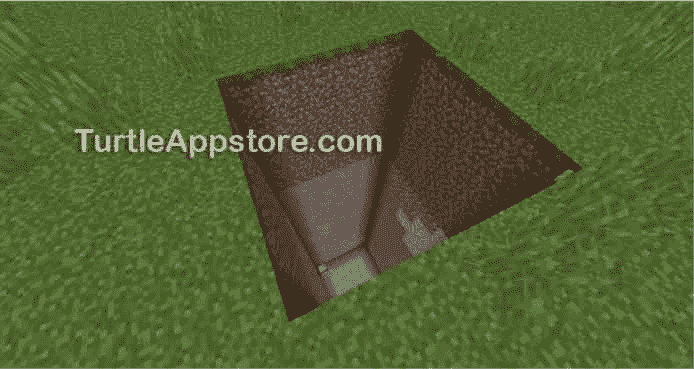

*图 15-1:*挖掘 *项目创造了又深又危险的洞。*

在这一章中，我们将编写一个名为`stairminer`的挖掘程序，在地下挖楼梯，如图[图 15-2](#calibre_link-133) 所示。在地表附近，海龟主要挖掘泥土和石块。然而，随着它挖掘得越来越深，你的乌龟会找到矿石和钻石块。

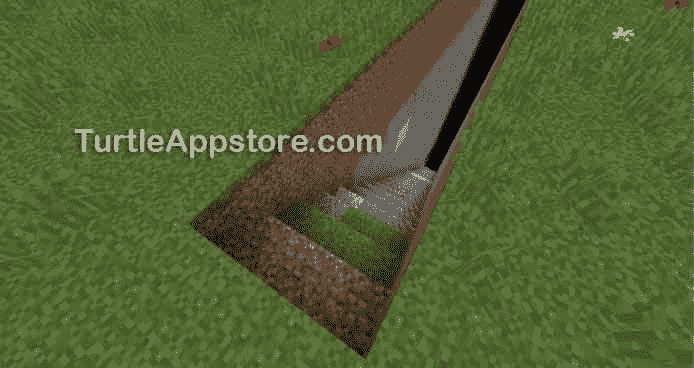

*图 15-2:*stair miner*程序在采矿时制作安全楼梯。*

在你设定了`stairminer`程序后，你将可以开采矿石而不用担心会掉进深渊！这些楼梯也可以让你安全地爬下矿井，这样你就可以挖掘新的隧道或者建造一个地下基地。

### **设计阶梯挖掘算法**

让我们从设计楼梯挖掘算法开始。这个`stairminer`项目不是直接开采到岩床，而是在泥土中切割出一个阶梯形的图案，这样你的海龟就不会在你可能会掉进去的地方留下致命的洞。海龟从水面开始，如图[图 15-3](#calibre_link-134) 所示。

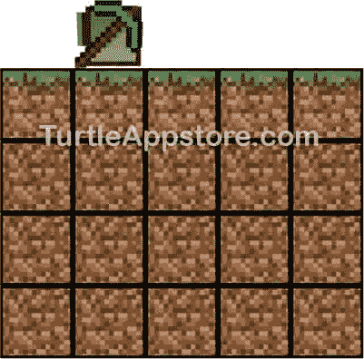

*图 15-3:地面上的乌龟，在开采之前*

我们希望算法让乌龟挖一个一格深的洞，然后向前移动一格，挖一个两格深的洞，然后向前移动一格，挖一个三格深的洞，以此类推。海龟应该继续挖掘，直到它到达基岩或玩家指定的目标深度。

我们需要将这种行为转化为海龟要遵循的特定动作，我们还需要确保程序是高效的。每当海龟向下挖掘时，它必须回到地面，然后再向下挖掘。因为每次移动都要消耗燃料，我们想限制海龟的移动，并确保海龟尽可能多地挖掘。我们将通过对海龟编程来做到这一点，不仅要让它向下挖，还要让它向上挖。因此，海龟每次移动时都会通过挖掘柱子来尽可能高效地利用它的燃料。

让我们来看看阶梯挖掘算法所涉及的动作，并找出我们如何才能使海龟在这个过程的每一个部分使用的燃料量最小化。

如[图 15-4](#calibre_link-135) 所示，海龟在 X 点挖掘方块，在算法的第一部分创建第一个阶梯。因为乌龟在这部分不动，所以不用任何燃料。乌龟只需要在程序开始的时候挖一次第一个楼梯台阶，所以算法不重复这部分。

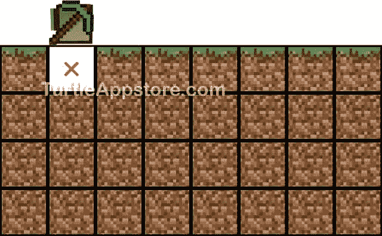

图 15-4:海龟从自己下面开始挖掘。

接下来，海龟向前移动一个街区到它要挖掘的下一列，如图[图 15-5](#calibre_link-136) 所示。每当海龟在矿井表面开始一个新的列时，它将重复这个动作。

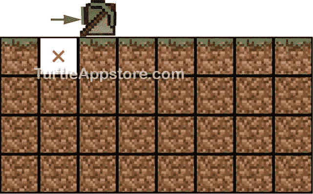

*图 15-5:挖完第一列后，乌龟向前移动一格开始下一列。*

当海龟就位去挖掘下一个柱子时，它会比先前挖掘的多挖一个街区，然后移动到柱子底部的空白区域。图 15-6 显示了这个动作。

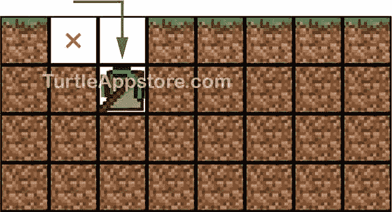

*图 15-6:海龟从表面向下挖掘下一列。*

海龟向下采完之后，需要从下往上采下一列。海龟挖掘它前面的方块，并在柱子底部向前移动一格。当乌龟在下一列时，它需要挖掘它下面的块，使该列比前一列深一个块，如图[图 15-7](#calibre_link-138) 所示。开采这两个区块不使用燃料，所以海龟在这次行动中只使用了一个单位的燃料。每当海龟从矿井内部开始一个新的列时，它就重复这个动作。

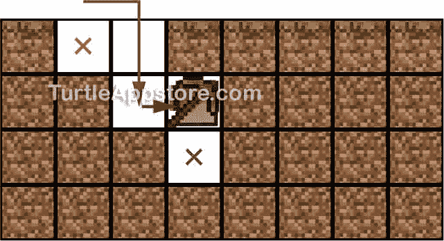

*图 15-7:乌龟挖它前面的方块，向前移动一格，然后挖它下面的方块。*

在算法的最后一部分，海龟需要挖掘来完成剩下的部分。乌龟向上挖掘到水面，如图[图 15-8](#calibre_link-139) 中的橙色箭头所示。

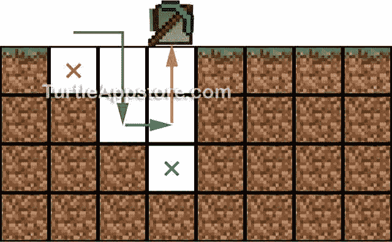

图 15-8:海龟挖洞，回到水面。

乌龟继续重复所有的动作，除了第一次，乌龟在第一列挖了一个空格。换句话说，海龟向前移动，向下挖掘，开始一个新的列，向上挖掘，重复图 15-9 所示的紫色、绿色和橙色步骤。海龟一次重复两列挖掘模式，向下挖掘，然后向上挖掘。它一直持续到到达基岩或目标深度。

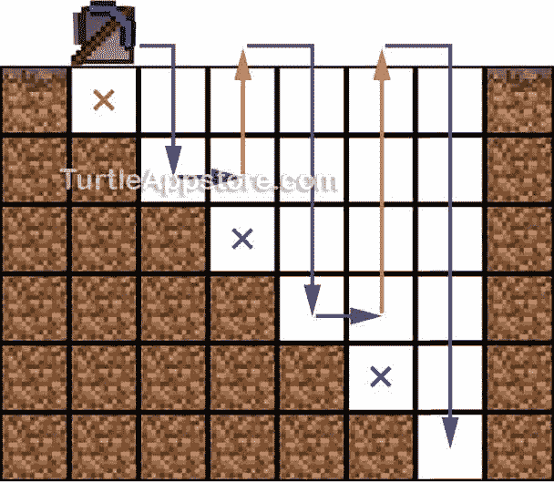

*图 15-9:乌龟挖掘出的楼梯图案*

在我们创建`stairminer`程序之前，这个程序使用了我们刚刚描述的阶梯挖掘算法，我们需要写一些帮助函数来处理沙砾块可能落入海龟正在挖掘的区域的情况。

### **扩展 HARE 模块**

你可能会认为调用`turtle.dig()`总能清空海龟前面的空间，但事实并非如此。如果海龟挖的地方上面有沙子或砾石，这些石头会掉下来，挡住海龟的路。因为我们设计的楼梯挖掘算法有时假设乌龟已经清理了它前面或上面的空间，所以你需要一个函数告诉乌龟继续挖掘，直到方块停止落入乌龟试图清理的空间。

[图 15-10](#calibre_link-141) 显示了海龟前面三个互相堆叠的沙堆。乌龟必须叫三声`turtle.dig()`来清理沙子。

为了清除块，我们将编写`digUntilClear()`和`digUpUntilClear()`函数，这两个函数几乎相同，分别清除海龟前面和海龟上面的块。因为我们可以在很多不同的海龟程序中使用这些函数，我们将把它们添加到`hare`模块中。从命令行运行编辑兔子。将光标移动到文件的底部，并通过添加以下行来继续执行代码:

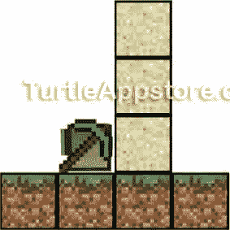

*图 15-10:乌龟必须挖三次才能清理出它前面的空间，因为沙块会一直往下掉。*

我会

```turtle
     ...snip...
216\. -- digUntilClear() keeps digging until
217\. -- there are no more blocks (used when
218\. -- sand or gravel can fall into the path)
219\. function digUntilClear()
220.   while turtle.detect() do
221.     if not turtle.dig() then
222.       return false
223.     end
224.   end
225.   return true
226\. end
227.
228\. -- digUpUntilClear() keeps digging up until
229\. -- there are no more blocks (used when
230\. -- sand or gravel can fall into the path)
231\. function digUpUntilClear()
232.   while turtle.detectUp() do
233.     if not turtle.digUp() then
234.       return false
235.     end
236.   end
237.   return true
238\. end
```

输入这些指令后，保存程序并退出编辑器。你也可以通过运行`pastebin get wwzvaKuW hare`来下载这个程序。

### **编写 DIGUNTILCLEAR()和 DIGUPUNTILCLEAR()函数**

`digUntilClear()`函数反复调用`turtle.dig()`，直到乌龟前面没有剩余的方块。如果乌龟前面的空间是空的，该函数返回值`true`，如果空间不能被清除(例如，如果乌龟遇到不可开采的基岩块)，则返回`false`。

我会

```turtle
216\. -- digUntilClear() keeps digging until
217\. -- there are no more blocks (used when
218\. -- sand or gravel can fall into the path)
219\. function digUntilClear()
220.   while turtle.detect() do
221.     if not turtle.dig() then
222.       return false
223.     end
224.   end
225.   return true
226\. end
```

只要海龟前面有块，函数就需要继续调用`turtle.dig()`，所以在第 220 行，函数使用一个`while`循环来指示海龟无限期地挖掘。只要`turtle.detect()`返回 true，这个循环就会一直循环下去，这表明海龟发现了它前面的障碍物。

221 行调用`turtle.dig()`，如果乌龟挖不到前面的块，则返回`false`。`turtle.dig()`函数返回`false`有两个原因:当有一个没有东西可挖的空地或有一个不能开采的基岩块时。如果检测到空白，执行不会进入`while`循环，因为`turtle.detect()`将返回`false`，使`not turtle.detect()`成为`true`条件。这意味着当`turtle.dig()`在`while`循环中返回`false`时，海龟必须面对一块基岩。在这种情况下，乌龟不可能越过它前面的障碍物。

否则，只要乌龟前面有一个方块，这个循环就会一直循环下去。一旦空间被清空，执行在第 224 行退出循环。第 225 行从函数返回`true`。

第 228 到 238 行的`digUpUntilClear()`函数代码与`digUntilClear()`几乎相同，除了它调用了`turtle.detectUp()`而不是`turtle.detect()`和`turtle.digUp()`而不是`turtle.dig()`。

有了我们的助手函数，让阶梯挖掘算法成为可能，让我们编写`stairminer`程序吧！

### **编写 STAIRMINER 程序**

这个程序在海龟面前的地面上挖掘出一个阶梯状的图案。从命令 shell 中，运行 edit stairminer 并输入以下代码:

*固体矿物*

```turtle
 1\. --[[Stair Miner program by Al Sweigart
 2\. Mines in a stair pattern.]]
 3.
 4\. os.loadAPI('hare')
 5.
 6\. local cliArgs, targetDepth, columnDepth, result, errorMessage
 7.
 8\. cliArgs = {...}
 9\. targetDepth = tonumber(cliArgs[1])
10.
11\. -- display "usage" info
12\. if targetDepth == nil or cliArgs[1] == '?' then
13.   print('Usage: stairminer <depth>')
14.   return
15\. end
16.
17\. turtle.digDown()
18.
19\. columnDepth = 2
20\. while true do
21.   -- move forward
22.   hare.digUntilClear()
23.   turtle.forward()
24.
25.   -- mine while descending
26.   for i = 1, columnDepth do
27.     -- check for bedrock
28.     result, errorMessage = turtle.digDown()
29.     if errorMessage == 'Unbreakable block detected' then
30.       print('Hit bedrock. Done.')
31.       return
32.     else
33.       turtle.down()
34.     end
35.   end
36.
37.   -- check if done
38.   print('Current depth: ' .. columnDepth)
39.   if columnDepth >= targetDepth then
40.     print('Done.')
41.     return
42.   end
43.
44.   -- move forward
45.   hare.digUntilClear()
46.   turtle.forward()
47.   turtle.digDown()
48.
49.   -- check if there's enough fuel to go up and back down again
50.   while turtle.getFuelLevel() < (columnDepth * 2) do
51.     -- try to burn fuel items in the inventory
52.     for slot = 1, 16 do
53.       turtle.select(slot)
54.       turtle.refuel()
55.     end
56.
57.     if turtle.getFuelLevel() < (columnDepth * 2) then
58.       print('Please load more fuel...')
59.       os.sleep(10)
60.     end
61.   end
62.
63.   -- check for a full inventory
64.   while hare.selectEmptySlot() == false do
65.     print('Please unload the inventory...')
66.     os.sleep(10)
67.   end
68.
69.   -- mine while ascending
70.   for i = 1, columnDepth do
71.     hare.digUpUntilClear()
72.     turtle.up()
73.   end
74.
75.   columnDepth = columnDepth + 2
76\. end
```

输入所有这些指令后，保存程序并退出编辑器。

### **运行 STAIRMINER 程序**

将乌龟放在地上，然后通过传递目标深度的整数参数来运行`stairminer`程序。例如，`stairminer 6`将使龟矿成为六个街区深的阶梯状路径。注意，`stairminer`程序向上舍入到最近的偶数，因为它总是向下移动一列，然后向上移动下一列。于是，`stairminer 9`将会挖掘出一条 10 个街区深的阶梯形小路，就像`stairminer 10`已经运行过一样。

如果您在运行这个程序时遇到错误，请仔细地将您的代码与本书中的代码进行比较，找出任何打字错误。如果你仍然不能修复你的程序，通过运行`delete stairminer`删除文件，然后通过运行`pastebin get PGH1WYpH stairminer`下载它。

### **stair miner 程序的设置**

`stairminer`的前四行由描述程序的注释和对`os.loadAPI()`加载`hare`模块的调用组成。在程序建立之后，我们声明几个将在程序中使用的变量。

*固体矿物*

```turtle
 6\. local cliArgs, targetDepth, columnDepth, result, errorMessage
```

第 6 行使用了一个`local`语句来创建五个变量。`cliArgs`变量包含程序执行时使用的命令行参数。`targetDepth`和`columnDepth`变量分别记录海龟应该向下走多远，以及海龟已经向上或向下走了多远。`result`和`errorMessage`变量存储来自`turtle.digDown()`调用的返回值。

接下来，程序将命令行参数存储在`targetDepth`变量中。如果玩家没有为命令行参数输入一个数字，或者他们输入了`'?'`，程序会显示一条使用信息。

*固体矿物*

```turtle
 8\. cliArgs = {...}
 9\. targetDepth = tonumber(cliArgs[1])
10.
11\. -- display "usage" info
12\. if targetDepth == nil or cliArgs[1] == '?' then
13.   print('Usage: stairminer <depth>')
14.   return
15\. end
```

命令行参数存储在`{...}`表中，第 8 行将其存储在一个名为`cliArgs`的变量中。当玩家没有为命令行参数输入一个数字时(例如，如果玩家运行`stairminer hello`)，第 9 行的`tonumber(cliArgs[1])`表达式计算为`nil`，从而将`targetDepth`设置为`nil`。第 12 行检查`targetDepth`中的值是`nil`还是命令行参数是`'?'`。如果第 12 行的任一条件是`true`，第 13 和 14 行的代码运行并显示程序的使用信息。

### **创建第一个楼梯台阶**

回想一下，乌龟并不一定要向下挖第一列。海龟从表面开始，向下挖掘，然后向前移动到下一列。第 17 行告诉海龟向下挖掘，创建一个一个街区深的列。这个动作是阶梯形路径的第一步。

*固体矿物*

```turtle
17\. turtle.digDown()
```

第一列只需要挖掘一次，因此阶梯挖掘算法从不重复这第一个操作。乌龟用一个`while`循环挖掘剩下的柱子，并在向下挖掘和向上挖掘之间交替进行。乌龟向下挖掘前两列，然后它向上挖掘第三列。在前三列之后，海龟向下挖掘每一个偶数列，向上挖掘每一个奇数列。让我们看看告诉海龟挖掘偶数列的代码。

### **向下开采**

`columnDepth`变量存储海龟为当前挖掘的列应该挖掘的块数。

*固体矿物*

```turtle
19\. columnDepth = 2
20\. while true do
21.   -- move forward
22.   hare.digUntilClear()
23.   turtle.forward()
```

因为海龟在循环前挖掘第一列，`columnDepth`从`2`开始，并在从第 20 行开始的`while`循环的每次迭代结束时增加。在`while`循环中，22 号线通过使用`hare.digUntilClear()`清除海龟前面的障碍物。如果沙子或砾石块一直落在海龟前面，`hare.digUntilClear()`确保在第 23 行告诉海龟向前移动一格之前所有的块都被清除。当程序完成第 23 行时，海龟就可以开始挖掘下一列的剩余部分了。

在海龟向前移动后，我们创建一个`for`循环，在`while`循环中运行。

*固体矿物*

```turtle
25.   -- mine while descending
26.   for i = 1, columnDepth do
27.     -- check for bedrock
28.     result, errorMessage = turtle.digDown()
29.     if errorMessage == 'Unbreakable block detected' then
30.       print('Hit bedrock. Done.')
31.       return
32.     else
33.       turtle.down()
34.     end
35.   end
```

第 26 行的`for`循环通过调用第 28 行的`turtle.digDown()`告诉海龟向下挖。然而，如果海龟在《我的世界》世界的底部，那里有牢不可破的岩床，挖掘可能会失败。在第 28 行，如果基岩在海龟下面，`turtle.digDown()`返回第一个返回值的`false`(我们存储在`result`变量中)和第二个返回值的字符串`'Unbreakable block detected'`(我们存储在`errorMessage`)。第 29 行检查`errorMessage`中的`'Unbreakable block detected'`字符串，如果字符串存在，第 30 行向玩家显示消息`Hit bedrock. Done.`。当乌龟碰到基岩时，它不能继续挖楼梯，所以程序在第 31 行终止。

否则，如果在海龟下面没有探测到岩床，海龟可以向下移动，程序继续到第 32 行的`else`语句。第 33 行位于`else`语句块内部，将海龟向下移动到挖出的空间。第 34 行结束了`else`语句块，第 35 行结束了`for`循环块。从第 26 行到第 35 行的`for`循环中的代码让海龟向下挖`columnDepth`次(或者直到海龟到达岩床)。

在挖掘完列并退出`for`循环后，程序运行完剩余的`while`循环。

*固体矿物*

```turtle
37.   -- check if done
38.   print('Current depth: ' .. columnDepth)
39.   if columnDepth >= targetDepth then
40.     print('Done.')
41.     return
42.   end
```

第 38 行打印了`columnDepth`，这是海龟在第 26 到 35 行的`for`循环中向下移动的空格数。第 39 行的`if`语句检查`columnDepth`(海龟挖的深度)是否等于或大于`targetDepth`。如果条件是`true`，第 40 行告诉玩家程序结束，第 41 行的`return`语句终止程序。记住:所有函数之外的`return`语句，比如第 41 行的语句，会终止一个 ComputerCraft 程序。

如果乌龟在挖下一根柱子后还没有到达基岩，乌龟应该清理前面的空间，向前移动，向下挖一次。这些动作在乌龟下面为下一列创建了一个楼梯。

*固体矿物*

```turtle
44.   -- move forward
45.   hare.digUntilClear()
46.   turtle.forward()
47.   turtle.digDown()
```

第 45 行，乌龟叫`hare.digUntilClear()`挖前面的块。第 46 行通过调用`turtle.forward()`使海龟向前移动。第 47 行通过调用`turtle.` `digDown()`来挖掘海龟下面的方块。[图 15-11](#calibre_link-142) 显示了 47 行执行后乌龟雕刻楼梯图案的状态。然后海龟会从下往上挖掘它现在所在的列。

但是在海龟向上采矿之前，我们需要海龟检查它是否有足够的燃料来继续阶梯采矿过程。让我们看看燃料检查是如何工作的。

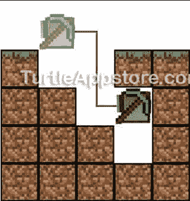

*图 15-11:47 线执行*后的楼梯井

### **检查乌龟的燃料**

当乌龟在偶数柱下挖矿时，你可以很容易地跟着它走下楼梯，如果它耗尽了燃料，就可以找回乌龟。但是，如果海龟在挖掘奇数列时耗尽了燃料，它可能会在你头顶上方漂浮太远而够不到。例如，你不希望乌龟在一个高高的柱子上爬到一半时耗尽燃料，就像图 15-12 中的[所示。](#calibre_link-143)

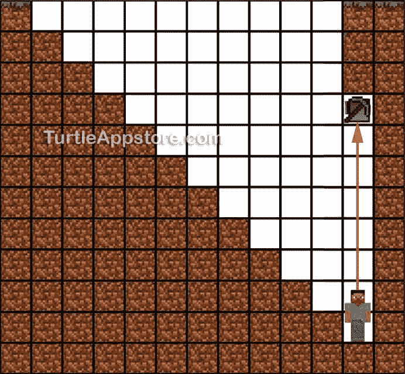

图 15-12:如果海龟在深柱的中途耗尽燃料，它可能很难到达。

海龟需要检查它是否有足够的燃料到达水面，然后再下去。因为第 26 行到第 35 行的`for`循环使海龟向下移动`columnDepth`次，所以海龟也需要向上移动`columnDepth`次来完成一列到水面。这意味着海龟必须移动`columnDepth * 2`沿着当前的柱子向下，然后再次回到水面。(回想一下，海龟每次运动只消耗一个单位的燃料。挖掘和转弯不使用燃料。)

如果海龟没有至少`columnDepth * 2`单位的燃料，它应该开始消耗库存中的任何燃料。当海龟挖出阶梯形的矿井时，它经常挖掘煤或其他可以用作燃料的石块。当海龟燃料不足时，我们可以让海龟使用库存中的煤炭为自己提供动力。从第 50 行开始的`while`循环通过调用`getFuelLevel()`来检查海龟的燃料水平。

*固体矿物*

```turtle
49.   -- check if there's enough fuel to go up and back down again
50.   while turtle.getFuelLevel() < (columnDepth * 2) do
```

如果海龟的燃料比`columnDepth * 2`少，执行进入`while`循环的块，开始在海龟的库存中寻找燃料。

`while`循环中的`for`循环在海龟的每个存货槽中寻找燃料。

*固体矿物*

```turtle
51.     -- try to burn fuel items in the inventory
52.     for slot = 1, 16 do
53.       turtle.select(slot)
54.       turtle.refuel()
55.     end
```

第 52 行的`for`循环使`slot`变量迭代数字`1`到`16`。在`for`循环的每次迭代中，第 53 行选择海龟库存中的槽号`slot`，第 54 行试图让海龟消耗槽中的物品作为燃料。如果这些物品不能用作燃料，`turtle.refuel()`功能什么也不做。

在消耗完库存中的所有燃料后，海龟会再次检查它的燃料是否少于`columnDepth * 2`。如果它还需要更多的燃料，海龟会打印出消息`Please load more fuel...`并等待 10 秒钟，让玩家手动将燃料物品放入它的库存。

*固体矿物*

```turtle
57.     if turtle.getFuelLevel() < (columnDepth * 2) then
58.       print('Please load more fuel...')
59.       os.sleep(10)
60.     end
61.   end
```

第 57 行使用出现在第 50 行的`while`语句中的相同条件检查海龟的燃料水平。如果海龟消耗的燃料超过了`columnDepth * 2`单位，程序就会跳过`if`语句的阻塞。当跳过`if`语句的块时，执行到达第 61 行的`while`循环的末尾，并返回到第 50 行以重新检查`while`循环的条件。第 50 行的`while`循环使用与第 77 行的`if`语句相同的条件，因此第 50 行的条件也将是`false`。当海龟有足够的燃料时，执行就是这样通过`while`循环的。

然而，如果 57 行的条件是`true`，因为海龟没有足够的燃料，58 行向玩家显示消息`Please load more fuel...`，然后通过调用 59 行的`os.sleep(10)`暂停 10 秒。暂停后，执行到达`while`循环的末尾，并返回到第 50 行以重新检查条件。

如果玩家在海龟的库存里放了更多的燃料物品，这些物品会在下一次循环中被消耗掉。如果玩家没有添加物品到海龟的库存中，海龟的燃料水平保持不变，并且程序再次通过`while`循环。当`while`循环再次运行时，程序显示信息`Please load more fuel...`并等待 10 秒钟。直到玩家在海龟的库存中放入足够的燃料，使`getFuelLevel()`返回一个大于`columnDepth * 2`的数字，海龟继续等待燃料。

在程序确保海龟有足够的燃料后，它需要检查以确保海龟的库存不是满的，然后才能开始挖掘下一列。接下来让我们看看这个检查是如何工作的。

### **查看乌龟的库存**

如果 turtle 通过了燃料检查，执行就离开`while`循环，准备执行库存检查。如果乌龟的库存已经满了，它会扔掉所有的矿块，这是对矿块的浪费。当乌龟在一列的底部时，它应该检查它是否有满的存货，这样如果满了，玩家就可以够到乌龟把它卸下来。

`hare`模块中的`selectEmptySlot()`函数选择它在海龟库存中找到的第一个空位。然而，我们不需要选择一个空的库存槽来进行楼梯挖掘。因为如果没有空的库存槽，`selectEmptySlot()`函数返回`false`，我们可以用它来确定海龟的库存是否满了。

*固体矿物*

```turtle
63.   -- check for a full inventory
64.   while hare.selectEmptySlot() == false do
65.     print('Please unload the inventory...')
66.     os.sleep(10)
67.   end
```

第 64 行上的`while`循环使用`selectEmptySlot()`来检查库存是否至少有一个空槽。如果海龟没有空槽，执行进入`while`循环的块，第 65 行显示一条`Please unload the inventory...`消息，第 66 行等待 10 秒。该代码类似于第 58 行和第 59 行的燃料检查。`while`循环只有在玩家卸载海龟库存并且`selectEmptySlot()`返回`true`后才会停止循环。库存检查后，程序继续到第 70 行，海龟向上回到水面。

### **向上挖掘**

因为海龟在地表下的`columnDepth`空间，它需要挖掘`columnDepth`块才能回到地表。第 70 行的`for`循环导致海龟向上挖掘和移动。

*固体矿物*

```turtle
69.   -- mine while ascending
70.   for i = 1, columnDepth do
71.     hare.digUpUntilClear()
72.     turtle.up()
73.   end
```

71 线在上移前调用`digUpUntilClear()`。我们在挖掘时使用函数`hare.digUpUntilClear()`而不是`turtle.digUp()`，因为沙子或砾石可能在海龟上方。当循环结束时，海龟会回到水面。

第 75 行将`columnDepth`增加了`2`,因为这个循环让海龟一次挖掘两列，所以我们需要在每次迭代中将`columnDepth`增加两个块。

*固体矿物*

```turtle
75.   columnDepth = columnDepth + 2
76\. end
```

通过将`columnDepth`增加`2`，海龟在下一次向下挖掘时会移动两个单位。第 76 行是第 20 行的`while`循环的`end`语句。当执行循环回到第 20 行时，第 22 和 23 行将海龟向前移动到下一个空间，它将继续向下挖掘，然后返回水面。海龟只有在`columnDepth`等于或大于`targetDepth`(玩家作为命令行参数提供的)或者海龟撞到岩床时才会停下来。

运行完`stairminer`程序后，你会有一个阶梯形的洞，可以让你安全地进入地下深处，你的物品清单将包含海龟在制作它时开采的所有石块。

**奖励活动:高大隧道**

你可能想在你的海龟建造的楼梯底部挖一个隧道。海龟自带一个名为 tunnel 的程序，它会在海龟面前挖一个 3 × 2 的洞，洞的长度通过命令行参数指定。比如你可以跑隧道 10 乌龟会挖一个 3 × 2 × 10 的隧道。这些隧道的高度刚好够玩家走过去，但他们会感到幽闭恐怖。试着创建你自己的 talltunnel 程序，做 tunnel 程序做的事情，但是创建四个街区高的隧道。

### **你学到了什么**

程序使用复杂的算法，但是一旦你写好了，你就可以把采矿的苦差事留给你的海龟了。即使你不需要`stairminer`程序开采的石块，你也可以用这个程序为一个地下巢穴雕刻出楼梯，两边是石砖墙(用你的鹅卵石发电机制作的)。只要你能为海龟编写指令，可能性是无穷的！

通过学习如何编码和说计算机语言，你可以让一大群海龟在《我的世界》自动完成许多任务。编程是一项有用且有趣的技能，我希望你能继续自己尝试更多。说到编程，总有更多的东西要学，所以开始吧，发明你自己的海龟程序。祝你好运！