# 名称 ID 参考

> 哎哎哎:# t0]https://turtlappstore . com/book/appendix b . html


在这本书里，你用《我的世界》积木的名字 id 来写你的程序。本参考列出了块名 id，以便您在修改本书中编写的程序或自己编写新程序时可以参考它们。在查看 ID 列表之前，让我们回顾一下如何查找块的名称 ID。

### **查找块名 ID**

在程序中处理特定类型的块时，需要知道块的名称 ID。当你的乌龟面对一个方块时，如图 1 中的[所示，使用`turtle.inspect()`功能来确定乌龟前面的是什么类型的方块。](#calibre_link-1)

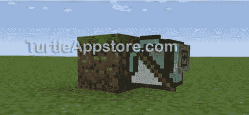

*图 1:一只乌龟面对着一个草墩，在叫* turtle.inspect() 之前

通过调用`turtle.inspect()`并检查函数返回的表值，可以找到与一个块相关的所有信息。返回的表中的`'name'`键包含海龟前面区块的名称 ID。例如，如果乌龟在一个草块前面，你在 Lua shell 中调用`turtle.inspect()`，返回的表应该如下所示:

```turtle
lua> turtle.inspect()
true
{
  state = {
    snowy = false,
  },
  name = "minecraft:grass",
  metadata = 0,
}
```

草块的名称 ID 为`"minecraft:grass"`。在大多数情况下，名称 ID 足以识别您想要在程序中使用的块。但是在某些情况下，您可能还需要使用`turtle.inspect()`返回的表中的其他键。

### **区分共享名称 id 的块**

一些块共享名称 id，您只能从表中的其他键中唯一地识别它们。例如，橡树木板和云杉木板具有相同的名称 ID`"minecraft:planks"`，但是它们的`metadata`键具有不同的值。如果当乌龟在橡树木板前时调用`turtle.inspect()`，该函数返回下表:

```turtle
lua> turtle.inspect()
true
{
  state = {
    variant = "oak",
  },
  name = "minecraft:planks",
  metadata = 0,
}
```

但是如果乌龟在云杉木板前面，函数返回这个表:

```turtle
lua> turtle.inspect()
true
{
  state = {
    variant = "spruce",
  },
  name = "minecraft:planks",
  metadata = 1,
}
```

虽然两个块的名称 ID 都是`"minecraft:planks"`，但是您可以使用不同的`metadata`值(橡木用`0`值，云杉用`1`值)来区分程序中的两种块类型。这些木板块也有一个`state`键，其中包含一个带有`variant`键的表，该表保存了关于该块的更多信息。

### **块名 id 列表**

表 1 列出了你的海龟可能接触到的大多数方块的名称 id。然而，[表 1](#calibre_link-2) 没有区分共享名称 id 的块。例如，该表列出了木板的名称 ID，但没有列出区分橡树木板和云杉木板的关键字。在您想要区分共享名称 id 的块的情况下，您需要使用`turtle.inspect()`来找出表中哪些值对于块是不同的。

**表 1:** 《我的世界》姓名 id

| **图标** | **名称** | **姓名 ID** |
| --- | --- | --- |
|  | 相思之下 | `'minecraft:acacia_door'` |
|  | 洋槐栅栏 | `'minecraft:acacia_fence'` |
|  | 洋槐栅栏门 | `'minecraft:acacia_fence_gate'` |
|  | 洋槐木楼梯 | `'minecraft:acacia_stairs'` |
| 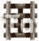 | 激活轨道 | `'minecraft:activator_rail'` |
| 没有人 | 天空 | `'minecraft:air'` |
|  | 砧骨 | `'minecraft:anvil'` |
|  | 灯塔 | `'minecraft:beacon'` |
|  | 床 | `'minecraft:bed'` |
|  | 基本原则 | `'minecraft:bedrock'` |
|  | 甜菜根 | `'minecraft:beetroots'` |
|  | 继续，婊子 | `'minecraft:birch_door'` |
|  | 婊子围栏 | `'minecraft:birch_fence'` |
|  | 婊子栅栏门 | `'minecraft:birch_fence_gate'` |
|  | 桦木楼梯 | `'minecraft:birch_stairs'` |
|  | 黑釉赤陶 | `'minecraft:black_glazed_terracotta'` |
|  | 黑色舒克盒 | `'minecraft:black_shulker_box'` |
|  | 蓝色釉面赤陶 | `'minecraft:blue_glazed_terracotta'` |
|  | 蓝色舒克盒 | `'minecraft:blue_shulker_box'` |
|  | 骨块 | `'minecraft:bone_block'` |
|  | 书架 | `'minecraft:bookshelf'` |
|  | 酿造台 | `'minecraft:brewing_stand'` |
|  | 砖砌楼梯 | `'minecraft:brick_stairs'` |
|  | 砖块 | `'minecraft:brick_block'` |
|  | 棕色釉面赤陶 | `'minecraft:brown_glazed_terracotta'` |
|  | 棕色蘑菇 | `'minecraft:brown_mushroom'` |
|  | 棕色蘑菇块 | `'minecraft:brown_mushroom_block'` |
|  | 棕色舒克盒 | `'minecraft:brown_shulker_box'` |
|  | 仙人掌 | `'minecraft:cactus'` |
|  | 蛋糕 | `'minecraft:cake'` |
|  | 地毯 | `'minecraft:carpet'` |
|  | 胡萝卜 | `'minecraft:carrots'` |
|  | 大锅 | `'minecraft:cauldron'` |
|  | 胸部 | `'minecraft:chest'` |
| 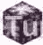 | 合唱花 | `'minecraft:chorus_flower'` |
|  | 合唱植物 | `'minecraft:chorus_plant'` |
|  | 黏土 | `'minecraft:clay'` |
|  | 煤柱 | `'minecraft:coal_block'` |
|  | 煤炭矿石 | `'minecraft:coal_ore'` |
|  | 鹅卵石 | `'minecraft:cobblestone'` |
|  | 鹅卵石楼梯 | `'minecraft:stone_stairs'` |
|  | 鹅卵石墙 | `'minecraft:cobblestone_wall'` |
|  | 蜘蛛网 | `'minecraft:web'` |
| 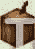 | 可可粉 | `'minecraft:cocoa'` |
|  | 具体的 | `'minecraft:concrete'` |
|  | 混凝土粉末 | `'minecraft:concrete_powder'` |
|  | 工艺桌 | `'minecraft:crafting_table'` |
|  | 青色釉赤陶 | `'minecraft:cyan_glazed_terracotta'` |
|  | 青色修格盒 | `'minecraft:cyan_shulker_box'` |
|  | 蒲公英 | `'minecraft:yellow_flower'` |
|  | 深色橡木门 | `'minecraft:dark_oak_door'` |
|  | 深色橡木栅栏 | `'minecraft:dark_oak_fence'` |
|  | 暗橡木栅栏门 | `'minecraft:dark_oak_fence_gate'` |
|  | 黑橡木楼梯 | `'minecraft:dark_oak_stairs'` |
| 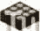 | 日光传感器 | `'minecraft:daylight_detector'` |
|  | 死灌木 | `'minecraft:deadbush'` |
| 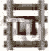 | 探测器轨道 | `'minecraft:detector_rail'` |
|  | 钻石块 | `'minecraft:diamond_block'` |
|  | 钻石矿石 | `'minecraft:diamond_ore'` |
|  | 泥土 | `'minecraft:dirt'` |
|  | 药剂师 | `'minecraft:dispenser'` |
|  | 双层红砂岩板 | `'minecraft:double_stone_slab2'` |
|  | 双层石板 | `'minecraft:double_stone_slab'` |
|  | 双层木板 | `'minecraft:double_wooden_slab'` |
|  | 龙蛋 | `'minecraft:dragon_egg'` |
|  | 使滴下的东西 | `'minecraft:dropper'` |
|  | 祖母绿块 | `'minecraft:emerald_block'` |
|  | 翡翠矿石 | `'minecraft:emerald_ore'` |
| 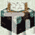 | 迷人的桌子 | `'minecraft:enchanting_table'` |
|  | 终端网关 | `'minecraft:end_gateway'` |
|  | 终端门户 | `'minecraft:end_portal'` |
|  | 结束入口框架 | `'minecraft:end_portal_frame'` |
|  | 端杆 | `'minecraft:end_rod'` |
|  | 托钻 | `'minecraft:end_stone'` |
|  | 末端石砖 | `'minecraft:end_bricks'` |
|  | 安德的箱子 | `'minecraft:ender_chest'` |
|  | 农田 | `'minecraft:farmland'` |
|  | 栅栏门 | `'minecraft:fence_gate'` |
|  | 火 | `'minecraft:fire'` |
|  | 花盆 | `'minecraft:flower_pot'` |
| 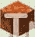 | 流动的熔岩 | `'minecraft:flowing_lava'` |
|  | 流动的水 | `'minecraft:flowing_water'` |
|  | 霜冰 | `'minecraft:frosted_ice'` |
|  | 熔炉 | `'minecraft:furnace'` |
|  | 玻璃 | `'minecraft:glass'` |
|  | 玻璃板 | `'minecraft:glass_pane'` |
| 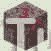 | 发光的红石矿石 | `'minecraft:lit_redstone_ore'` |
|  | 格洛索托 | `'minecraft:glowstone'` |
| 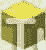 | 金块 | `'minecraft:gold_block'` |
|  | 金矿 | `'minecraft:gold_ore'` |
|  | 草 | `'minecraft:grass'` |
|  | 草地小径 | `'minecraft:grass_path'` |
|  | 草(高) | `'minecraft:tallgrass'` |
|  | 碎石 | `'minecraft:gravel'` |
|  | 灰色釉面赤陶 | `'minecraft:gray_glazed_terracotta'` |
|  | 灰色舒克盒 | `'minecraft:gray_shulker_box'` |
|  | 绿色釉面赤陶 | `'minecraft:green_glazed_terracotta'` |
|  | 绿色舒克盒 | `'minecraft:green_shulker_box'` |
|  | 硬化粘土 | `'minecraft:hardened_clay'` |
|  | 有球 | `'minecraft:hay_block'` |
|  | 箱 | `'minecraft:hopper'` |
|  | 冰 | `'minecraft:ice'` |
| 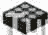 | 倒置日光传感器 | `'minecraft:daylight_detector_inverted'` |
| 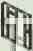 | 铁棒 | `'minecraft:iron_bars'` |
|  | 铁块 | `'minecraft:iron_block'` |
|  | 铁门 | `'minecraft:iron_door'` |
|  | 铁矿石 | `'minecraft:iron_ore'` |
|  | 铁活板门 | `'minecraft:iron_trapdoor'` |
| 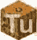 | 杰克·欧灯笼 | `'minecraft:lit_pumpkin'` |
|  | 投币式自动点唱机 | `'minecraft:jukebox'` |
|  | 穿过丛林 | `'minecraft:jungle_door'` |
|  | 丛林围栏 | `'minecraft:jungle_fence'` |
|  | 丛林栅栏门 | `'minecraft:jungle_fence_gate'` |
|  | 丛林木楼梯 | `'minecraft:jungle_stairs'` |
| 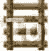 | 阶梯 | `'minecraft:ladder'` |
|  | 拉齐奥街区 | `'minecraft:lapis_block'` |
|  | 拉齐奥小时 | `'minecraft:lapis_ore'` |
|  | 大花 | `'minecraft:double_plant'` |
| 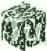 | 离开 | `'minecraft:leaves'` |
|  | 树叶(金合欢/黑橡木) | `'minecraft:leaves2'` |
|  | 工具 | `'minecraft:lever'` |
|  | 浅蓝色釉面赤陶 | `'minecraft:light_blue_glazed_terracotta'` |
|  | 浅蓝色舒克盒 | `'minecraft:light_blue_shulker_box'` |
|  | 浅灰色釉面赤陶 | `'minecraft:silver_glazed_terracotta'` |
|  | 浅灰色舒克盒 | `'minecraft:silver_shulker_box'` |
|  | 睡莲叶子 | `'minecraft:waterlily'` |
|  | 石灰釉赤陶 | `'minecraft:lime_glazed_terracotta'` |
|  | 石灰舒克箱 | `'minecraft:lime_shulker_box'` |
|  | 点燃炉 | `'minecraft:lit_furnace'` |
|  | 洋红色釉面赤陶 | `'minecraft:magenta_glazed_terracotta'` |
|  | 洋红色舒格盒 | `'minecraft:magenta_shulker_box'` |
|  | 岩浆块 | `'minecraft:magma'` |
|  | 甜瓜 | `'minecraft:melon_block'` |
|  | 甜瓜茎 | `'minecraft:melon_stem'` |
|  | 暴徒头目 | `'minecraft:skull'` |
|  | 暴民产卵者 | `'minecraft:mob_spawner'` |
|  | 怪物蛋 | `'minecraft:monster_egg'` |
|  | 苔藓石 | `'minecraft:mossy_cobblestone'` |
|  | 菌丝体 | `'minecraft:mycelium'` |
|  | 下层砖 | `'minecraft:nether_brick'` |
|  | 下层砖砌栅栏 | `'minecraft:nether_brick_fence'` |
|  | 下层砖砌楼梯 | `'minecraft:nether_brick_stairs'` |
|  | 虚空之门 | `'minecraft:portal'` |
|  | 下层石英矿石 | `'minecraft:quartz_ore'` |
|  | 下疣 | `'minecraft:nether_wart'` |
|  | 下疣块 | `'minecraft:nether_wart_block'` |
|  | 内瑟雷克 | `'minecraft:netherrack'` |
|  | 注释块 | `'minecraft:noteblock'` |
|  | 橡木盾 | `'minecraft:wooden_door'` |
|  | 橡木栅栏 | `'minecraft:fence'` |
|  | 橡木楼梯 | `'minecraft:oak_stairs'` |
|  | 观察者 | `'minecraft:observer'` |
|  | 黑曜石 | `'minecraft:obsidian'` |
|  | 橙色釉面赤陶 | `'minecraft:orange_glazed_terracotta'` |
|  | 橙色舒克盒 | `'minecraft:orange_shulker_box'` |
|  | 密集冰 | `'minecraft:packed_ice'` |
|  | 粉红色釉面赤陶 | `'minecraft:pink_glazed_terracotta'` |
|  | 粉色舒克盒 | `'minecraft:pink_shulker_box'` |
|  | 活塞 | `'minecraft:piston'` |
|  | 活塞头 | `'minecraft:piston_head'` |
|  | 罂粟 | `'minecraft:red_flower'` |
|  | 土豆 | `'minecraft:potatoes'` |
| 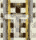 | 电动轨道 | `'minecraft:golden_rail'` |
|  | 棱镜计划 | `'minecraft:prismarine'` |
|  | 南瓜 | `'minecraft:pumpkin'` |
|  | 南瓜茎 | `'minecraft:pumpkin_stem'` |
|  | 紫色釉面赤陶 | `'minecraft:purple_glazed_terracotta'` |
|  | 紫色舒克盒 | `'minecraft:purple_shulker_box'` |
|  | 紫色区块 | `'minecraft:purpur_block'` |
|  | 紫色双层板 | `'minecraft:purpur_double_slab'` |
|  | 紫色药丸 | `'minecraft:purpur_pillar'` |
|  | 紫色斯拉夫文 | `'minecraft:purpur_slab'` |
|  | 紫色楼梯 | `'minecraft:purpur_stairs'` |
|  | 石英块 | `'minecraft:quartz_block'` |
|  | 石英楼梯 | `'minecraft:quartz_stairs'` |
|  | 铁路 | `'minecraft:rail'` |
|  | 红色釉面赤陶 | `'minecraft:red_glazed_terracotta'` |
| 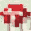 | 红色蘑菇 | `'minecraft:red_mushroom'` |
|  | 红色蘑菇块 | `'minecraft:red_mushroom_block'` |
|  | 红色下层砖 | `'minecraft:red_nether_brick'` |
|  | 红色砂岩 | `'minecraft:red_sandstone'` |
|  | 红砂岩板 | `'minecraft:stone_slab2'` |
|  | 红砂岩楼梯 | `'minecraft:red_sandstone_stairs'` |
|  | 红色舒克盒 | `'minecraft:red_shulker_box'` |
|  | 红石块 | `'minecraft:redstone_block'` |
|  | 红石比较器(供电) | `'minecraft:powered_comparator'` |
|  | 红石比较仪(未通电) | `'minecraft:unpowered_comparator'` |
|  | 红石灯(活动) | `'minecraft:lit_redstone_lamp'` |
|  | 红石灯(无效) | `'minecraft:redstone_lamp'` |
|  | 红石矿石 | `'minecraft:redstone_ore'` |
|  | 红石中继器(有源) | `'minecraft:powered_repeater'` |
|  | 红石中继器(未激活) | `'minecraft:unpowered_repeater'` |
|  | 红石手电筒(活动) | `'minecraft:redstone_torch'` |
| 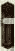 | 红石手电筒(未激活) | `'minecraft:unlit_redstone_torch'` |
|  | 红石线 | `'minecraft:redstone_wire'` |
| 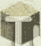 | 沙 | `'minecraft:sand'` |
|  | 砂岩 | `'minecraft:sandstone'` |
|  | 砂岩楼梯 | `'minecraft:sandstone_stairs'` |
|  | 树苗 | `'minecraft:sapling'` |
|  | 海上灯笼 | `'minecraft:sea_lantern'` |
|  | 粘液块 | `'minecraft:slime'` |
|  | 雪 | `'minecraft:snow'` |
|  | 雪层 | `'minecraft:snow_layer'` |
|  | 灵魂沙 | `'minecraft:soul_sand'` |
| 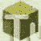 | 海绵 | `'minecraft:sponge'` |
|  | 云杉门 | `'minecraft:spruce_door'` |
|  | 云杉栅栏 | `'minecraft:spruce_fence'` |
|  | 云杉栅栏门 | `'minecraft:spruce_fence_gate'` |
|  | 云杉木楼梯 | `'minecraft:spruce_stairs'` |
|  | 染色粘土 | `'minecraft:stained_hardened_clay'` |
|  | 彩色玻璃 | `'minecraft:stained_glass'` |
|  | 彩色玻璃窗格 | `'minecraft:stained_glass_pane'` |
|  | 站立横幅 | `'minecraft:standing_banner'` |
|  | 站立标志 | `'minecraft:standing_sign'` |
| 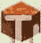 | 文具熔岩 | `'minecraft:lava'` |
|  | 文具水 | `'minecraft:water'` |
|  | 粘性活塞 | `'minecraft:sticky_piston'` |
|  | 石头 | `'minecraft:stone'` |
|  | 石砖楼梯 | `'minecraft:stone_brick_stairs'` |
|  | 石砖 | `'minecraft:stonebrick'` |
|  | 石头按钮 | `'minecraft:stone_button'` |
|  | 石压板 | `'minecraft:stone_pressure_plate'` |
|  | 石板 | `'minecraft:stone_slab'` |
|  | 甘蔗 | `'minecraft:reeds'` |
|  | 梯恩梯 | `'minecraft:tnt'` |
|  | 火炬 | `'minecraft:torch'` |
|  | 活板门 | `'minecraft:trapdoor'` |
|  | 被困的胸部 | `'minecraft:trapped_chest'` |
|  | 绊网 | `'minecraft:tripwire'` |
|  | 绊网钩 | `'minecraft:tripwire_hook'` |
| 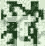 | 藤 | `'minecraft:vine'` |
|  | 墙壁横幅 | `'minecraft:wall_banner'` |
|  | 墙壁标志 | `'minecraft:wall_sign'` |
|  | 加重压力板(重) | `'minecraft:heavy_weighted_pressure_plate'` |
|  | 加重压力板(轻) | `'minecraft:light_weighted_pressure_plate'` |
| 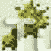 | 小麦 | `'minecraft:wheat'` |
| 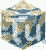 | 白釉赤陶 | `'minecraft:white_glazed_terracotta'` |
|  | 白色舒克盒 | `'minecraft:white_shulker_box'` |
|  | 木 | `'minecraft:log'` |
|  | 木材(金合欢木/黑橡木) | `'minecraft:log2'` |
|  | 木板 | `'minecraft:planks'` |
|  | 木制按钮 | `'minecraft:wooden_button'` |
|  | 木制压板 | `'minecraft:wooden_pressure_plate'` |
|  | 木板 | `'minecraft:wooden_slab'` |
|  | 羊毛 | `'minecraft:wool'` |
|  | 黄色釉面赤陶 | `'minecraft:yellow_glazed_terracotta'` |
|  | 黄色舒克盒 | `'minecraft:yellow_shulker_box'` |
|  |  |  |