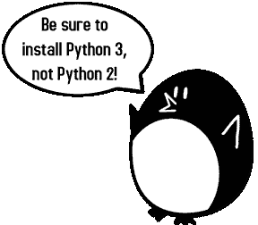
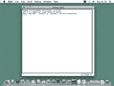

# 第 1 章——安装 Python 和 Pygame

> 原文：<http://inventwithpython.com/pygame/chapter1.html>

如果你在通读这本书之前了解一点 Python 编程(或者如何用除 Python 之外的另一种语言编程)可能会有所帮助；然而，即使你没有，你仍然可以阅读这本书。编程远没有人们想象的那么难。如果你曾经遇到一些麻烦，你可以在【http://inventwithpython.com】在线阅读免费书籍《用 Python 发明你自己的电脑游戏》,或者在【http://inventwithpython.com/wiki】的“用 Python 发明”维基上查找你觉得困惑的话题。

在阅读这本书之前，你不需要知道如何使用 Pygame 库。下一章是关于 Pygame 所有主要特性和功能的简短教程。

以防你没有读过第一本书，并且已经在你的电脑上安装了 Python 和 Pygame，安装说明在这一章。如果你已经安装了这两个，那么你可以跳过这一章。

在我们开始编程之前，你需要在你的电脑上安装一个叫做 Python 解释器的软件。(这里可能需要找大人帮忙。)解释器是一个程序，它理解你用 Python 语言编写(或者说，打印)的指令。没有解释器，你的电脑将无法运行你的 Python 程序。从现在开始，我们将把“Python 解释器”称为“Python”。

Python 解释器软件可以从 Python 编程语言官方网站【http://www.python.org】下载。你可能需要别人的帮助来下载和安装 Python 软件。根据您电脑的操作系统是 Windows、Mac OS X 还是 Ubuntu 等 Linux 操作系统，安装会有所不同。你也可以在网上找到在 http://invpy.com/installing安装 Python 软件的视频。

 当你到达的时候，你应该会在左边看到一个链接列表(比如“关于”、“新闻”、“文档”、“下载”等等)。点击**下载**链接进入下载页面，然后寻找名为“Python 3.2 Windows Installer(Windows 二进制-不包含源代码)”的文件，点击其链接下载 Python for Windows。

 双击刚刚下载的 *python-3.2.msi* 文件，启动 python 安装程序。(如果它没有启动，请尝试右键单击该文件并选择**安装**。)一旦安装程序启动，只需持续点击**下一步**按钮，并接受安装程序中的选择即可(无需做任何更改)。安装完成后，点击**完成**。

## MAC OS x 指令

Mac OS X 10.5 自带苹果预装的 Python 2.5.1。目前 Pygame 只支持 Python 2，不支持 Python 3。然而，本书中的程序既适用于 Python 2 也适用于 Python 3。

Python 网站上还有一些关于在 Mac 电脑上使用 Python 的附加信息，时间是。

 Pygame for Linux 也只支持 Python 2，不支持 Python 3。如果你的操作系统是 Ubuntu，你可以通过打开一个终端窗口(从桌面点击**应用>附件>终端**)并输入“`sudo apt-get install python2.7`”然后按回车键来安装 Python。您将需要输入 root 密码来安装 Python，因此如果您不知道密码，请让计算机的所有者键入该密码。

还需要安装 IDLE 软件。从终端输入“`sudo apt-get install idle`”。安装 IDLE 也需要 root 密码(请让您的计算机所有者为您键入该密码)。

我们将使用 IDLE 输入程序并运行它们。IDLE 代表**I**interactive**D**eve**L**opment**E**environment。开发环境是让编写 Python 程序变得容易的软件，就像文字处理软件让写书变得容易一样。

如果您的操作系统是 Windows XP，您应该可以通过单击开始按钮，然后选择程序、Python 3.1、空闲(Python GUI)来运行 Python。对于 Windows Vista 或 Windows 7，只需点击左下角的 Windows 按钮，输入“IDLE”，选择“IDLE (Python GUI)”。

如果您的操作系统是 Max OS X，请打开 Finder 窗口并单击应用程序，然后单击 Python 3.2，然后单击空闲图标，启动空闲。

如果您的操作系统是 Ubuntu 或 Linux，请通过打开终端窗口启动 IDLE，然后键入“`idle3`”并按 Enter 键。您也可以点击屏幕顶部的应用程序，然后选择编程，然后选择空闲 3。

T2】

第一次运行 IDLE 时出现的窗口称为交互 shell 。一个外壳是一个让你向计算机输入指令的程序。Python shell 允许您键入 Python 指令，shell 将这些指令发送给 Python 解释器来执行。

Pygame 没有附带 Python。和 Python 一样，Pygame 也是免费的。您必须下载并安装 Pygame，这就像下载并安装 Python 解释器一样简单。在网络浏览器中，转到网址【http://pygame.org】，点击网站左侧的“下载”链接。这本书假设你有 Windows 操作系统，但是 Pygame 对每个操作系统都是一样的。您需要下载适用于您的操作系统和 Python 版本的 Pygame 安装程序。

您不想下载 Pygame 的“源代码”,而是想下载您的操作系统的 Pygame“二进制文件”。对于 Windows，请下载 pygame-1.9.1.win32-py3.2.msi 文件。(这是 Python 3.2 在 Windows 上的 Pygame。如果您安装了不同版本的 Python(比如 2.7 或 2.6)，请下载。您的 Python 版本的 msi 文件。)在撰写本书时，Pygame 的当前版本是 1.9.1。如果你在网站上看到更新的版本，下载并安装更新的 Pygame。

对于 Mac OS X，请下载。拉链还是。dmg 文件并运行它。

对于 Linux，打开一个终端，运行“`sudo apt-get install python-pygame`”。

在 Windows 上，双击下载的文件来安装 Pygame。要检查 Pygame 安装是否正确，请在交互式 shell 中键入以下内容:

>>导入 pygame

如果你按下回车键后什么也没有出现，那么你就知道 Pygame 已经成功安装了。如果出现错误`ImportError: No module named pygame`，那么再次尝试安装 Pygame(并确保您输入的`import pygame`正确)。

这一章有五个小程序演示了如何使用 Pygame 提供的不同特性。在最后一章中，你将使用这些特性来完成一个用 Python 和 Pygame 编写的游戏。

关于如何安装 Pygame 的视频教程可以在本书的网站【http://invpy.com/videos】找到。

《用 Python & Pygame 制作游戏》不同于其他编程书籍，因为它侧重于几个游戏程序的完整源代码。这本书不是教你编程概念，让你自己去想如何用这些概念编写程序，而是向你展示一些程序，然后解释它们是如何组合在一起的。

一般来说，你应该按顺序阅读这些章节。有许多概念在这些游戏中被反复使用，它们只在它们出现的第一个游戏中被详细解释。但是如果有你觉得有趣的游戏，那就直接跳到那一章。如果你想得太多，你可以以后再读前面的章节。

每章关注一个游戏程序，并解释不同部分的代码是如何工作的。从这本书里一行一行的输入代码，复制这些程序是很有帮助的。

但是，您也可以从本书的网站下载源代码文件。在网络浏览器中，转到网址【http://invpy.com/source】，按照指示下载源代码文件。但是自己输入代码确实有助于你更好地学习代码。

虽然你可以直接输入你从这本书里读到的代码，但你需要从【http://invpy.com/downloads】下载这本书里游戏使用的图形和声音文件。请确保这些图像和声音文件与。否则你的 Python 程序将无法找到这些文件。

当您自己输入源代码时，不要键入出现在每行开头的行号。例如，如果你在书中看到这个:

```py
1\. number
= random.randint(1, 20)
2\. spam
= 42
3\. print('Hello
world!')
```

您不需要键入“1”在左边，或紧接其后的空间。就像这样输入:

```py
number = random.randint(1, 20)
spam = 42
print('Hello world!')
```

使用这些数字只是为了让本书能够引用代码中的特定行。它们不是实际程序的一部分。

除了行号之外，请确保输入的代码与显示的完全一样。请注意，有些行不是从页面的最左边开始，而是缩进了四个、八个或更多的空格。确保在每一行的开头填入正确的空格数。(由于空闲状态下的每个字符宽度相同，因此您可以通过计算您正在查看的行的上方或下方的字符数来计算空格数。)

例如，在下面的代码中，您可以看到第二行缩进了四个空格，因为上一行的四个字符(“whil”)位于缩进的空格之上。第三行缩进另外四个空格(四个字符“if n”在第三行缩进的空格之上):

```py
while spam < 10:
    if number == 42:
        print('Hello')
```

有些代码行太长，在本书的一行中放不下，代码文本会换行到下一行。当您在文件编辑器中键入这些行时，请在一行中输入所有代码，而不要按 enter。

您可以通过查看代码左侧的行号来判断新行何时开始。例如，下面的代码只有两行代码，尽管第一行换行了:

```py
1\. print('This
is the first line! xxxxxxxxxxxxxxxxxxxxxxxxxxxxx xxxxxxxxxxxxxx’)
2\. print('This
is the second line, not the third line.')
```

这本书里的一些程序有点长。虽然通过键入这些程序的源代码对学习 Python 很有帮助，但您可能会不小心犯下错别字，导致您的程序崩溃。错别字在哪里可能不明显。

您可以将源代码文本复制并粘贴到该书网站上的在线比较工具中。diff 工具将显示书中的源代码和您输入的源代码之间的任何差异。这是发现程序中任何打字错误的简单方法。

复制和粘贴文本是一项非常有用的计算机技能，尤其是对计算机编程而言。在本书的网站有复制粘贴的视频教程。

 在线 diff 工具在这个网页:。这本书的网站上还有一个视频教程，教你如何使用这个工具。

 关于编程，你可以学到很多东西。但是你不需要现在就全部学会。在这本书里有几次你可能想学习这些额外的细节和解释，但是如果我把它们包括在这本书里，那么它会增加更多的页数。如果这本更大、更重的书不小心掉在你身上，这些附加页的重量会压垮你，导致死亡。相反，我在这本书里加入了“更多信息”链接，你可以在这本书的网站上看到。你不必阅读这些额外的信息来理解这本书里的任何东西，但是如果你好奇的话，这些信息就在那里。这些(以及其他)环节都被缩短，从开始。

 来自这些“更多信息”链接的所有信息也可以从下载。

 即使这本书不太重，也请不要让它掉在你身上。
