# 第 2 章 Pygame 基础知识

> 原文：<http://inventwithpython.com/pygame/chapter2.html>

就像 Python 自带了几个模块，如`random`、`math`或`time`来为你的程序提供额外的功能一样，Pygame 框架包括几个模块，这些模块具有绘制图形、播放声音、处理鼠标输入和其他功能。

本章将涵盖 Pygame 提供的基本模块和函数，并假设您已经了解基本的 Python 编程。如果你对一些编程概念有困难，你可以在[http://invpy.com/book](//invpy.com/book)在线阅读《用 Python 发明你自己的电脑游戏》一书。这本书是针对编程初学者的。

“用 Python 发明”这本书也有几章涉及 Pygame。你可以在 http://invpy.com/chap17 的在线阅读。

一旦你对 Pygame 有了更多的了解，你可以在从在线文档中查看 Pygame 提供的其他模块。

可以用 Python 内置函数编写的 Python 程序只能通过`print()`和`input()`函数处理文本。您的程序可以在屏幕上显示文本，并让用户从键盘输入文本。这种类型的程序有一个命令行界面，或 CLI (发音像“攀登”的第一部分，与“天空”押韵)。这些程序有些局限性，因为它们不能显示图形，没有颜色，也不能使用鼠标。这些 CLI 程序仅通过`input()`功能从键盘获取输入，即使如此，用户也必须在程序响应输入之前按下 Enter 键。这意味着实时(即不等待用户继续运行代码)动作游戏是不可能做出来了。

Pygame 提供了创建程序的功能，这些程序有一个图形用户界面，或 GUI (发音为“胶粘”)。基于图形的 GUI 程序可以显示带有图像和颜色的窗口，而不是基于文本的 CLI。

我们用 Pygame 制作的第一个程序是一个小程序，它制作了一个窗口，上面写着“Hello World！”出现在屏幕上。点击 IDLE 的**文件**菜单，然后点击**新窗口**，打开一个新的文件编辑器窗口。在 IDLE 的文件编辑器中输入以下代码，保存为 *blankpygame.py* 。然后通过按下 **F5** 或从文件编辑器顶部的菜单中选择**运行>运行模块**来运行程序。

记住，不要在每一行的开头键入数字或句点(这在本书中仅供参考)。

```py
1\. import
pygame, sys
2\. from
pygame.locals import *
3\. 
4\. pygame.init()
5\. DISPLAYSURF
= pygame.display.set_mode((400, 300))
6\. pygame.display.set_caption('Hello
World!')
7\. while
True: # main game loop
8\.     for
event in pygame.event.get():
9\.         if
event.type == QUIT:
10\.             pygame.quit()
11\.             sys.exit()
12\.     pygame.display.update()
```

当你运行这个程序时，会出现一个类似这样的黑色窗口:

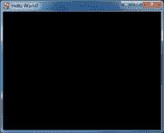

耶！你刚刚制作了世界上最无聊的电子游戏！它只是一个空白的窗口，上面写着“你好，世界！”在窗口的顶部(在被称为窗口的标题栏中，它保存了标题文本)。但是创建一个窗口是制作图形游戏的第一步。当你点击窗口角上的 X 按钮时，程序将结束，窗口将消失。

调用`print()`函数使文本出现在窗口中是行不通的，因为`print()`是 CLI 程序的函数。同样的道理也适用于`input()`从用户那里获得键盘输入。Pygame 使用了其他的输入和输出函数，这将在本章后面解释。现在，让我们更详细地看看“Hello World”程序中的每一行。

Hello World 程序中的前几行代码是您编写的几乎所有使用 Pygame 的程序的开头。

```py
1\. import
pygame, sys
```

第 1 行是一个简单的`import`语句，它导入了`pygame`和`sys`模块，这样我们的程序就可以使用其中的函数。Pygame 提供的处理图形、声音和其他特性的所有 Pygame 函数都在`pygame`模块中。

请注意，当您导入`pygame`模块时，您也会自动导入`pygame`模块中的所有模块，例如`pygame.images`和`pygame.mixer.music`。没有必要用额外的`import`语句导入这些模块内部的模块。

```py
2\. from pygame.locals
import *
```

第 2 行也是一个`import`语句。然而，它使用了`from modulename import *`格式，而不是`import modulename`格式。通常如果你想调用一个模块中的函数，你必须在导入模块后使用`modulename.functionname()`格式。然而，使用`from modulename import *`，你可以跳过`modulename.`部分，直接使用`functionname()`(就像 Python 的内置函数一样)。

我们对`pygame.locals`使用这种形式的`import`语句的原因是因为`pygame.locals`包含几个常量变量，它们很容易被识别为在`pygame.locals`模块中，前面没有`pygame.locals.`。对于所有其他模块，您通常希望使用常规的`import modulename`格式。(在[http://invpy.com/namespaces](//invpy.com/namespaces)有更多关于你为什么要这么做的信息。)

```py
4\. pygame.init()
```

第 4 行是`pygame.init()`函数调用，总是需要在导入`pygame`模块之后，调用任何其他 Pygame 函数之前调用。你不需要知道这个函数是做什么的，你只需要知道为了让很多 Pygame 函数工作，它需要先被调用。如果你看到类似`pygame.error: font not initialized`的错误信息，检查一下你是否忘记在程序开始时调用`pygame.init()`。

```py
5\. DISPLAYSURF
= pygame.display.set_mode((400, 300))
```

第 5 行是对`pygame.display.set_mode()`函数的调用，该函数返回窗口的`pygame.Surface`对象。(曲面对象将在本章后面介绍。)注意，我们将两个整数的元组值传递给函数:`(400, 300)`。这个元组告诉`set_mode()`函数以像素为单位设置窗口的宽度和高度。`(400, 300)`将制作一个宽度为 400 像素，高度为 300 像素的窗口。

记住将两个整数的元组传递给`set_mode()`，而不仅仅是两个整数本身。函数的正确调用方式是这样的:`pygame.display.set_mode((400, 300))`。像`pygame.display.set_mode(400, 300)`这样的函数调用会导致类似这样的错误:`TypeError: argument 1 must be 2-item sequence, not int`。

返回的`pygame.Surface`对象(我们简称它们为表面对象)存储在一个名为`DISPLAYSURF`的变量中。

```py
6\. pygame.display.set_caption('Hello
World!')
```

第 6 行通过调用`pygame.display.set_caption()`函数设置将出现在窗口顶部的标题文本。字符串值`'Hello World!'`在这个函数调用中传递，使文本显示为标题:

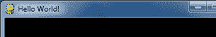

```py
7\. while
True: # main game loop
8\.     for
event in pygame.event.get():
```

第 7 行是一个`while`循环，其条件只是值`True`。这意味着它永远不会因其状态评估为`False`而退出。程序执行退出循环的唯一方式是执行`break`语句(将执行移到循环后的第一行)或`sys.exit()`(终止程序)。如果像这样的循环在函数内部，那么`return`语句也会将执行移出循环(以及函数)。

这本书里的游戏都有这些`while True`循环，还有一个注释称之为“主游戏循环”。一个游戏循环(也称为主循环)是一个代码做三件事的循环:

1.  处理事件。

2.  更新游戏状态。

3.  将游戏状态绘制到屏幕上。

游戏状态是指游戏程序中所有变量的一组值。在许多游戏中，游戏状态包括变量中的值，这些变量跟踪玩家的健康和位置、任何敌人的健康和位置、棋盘上的标记、分数或轮到谁了。每当发生一些事情，比如玩家受到伤害(降低他们的生命值)，或者敌人移动到某个地方，或者游戏世界中发生一些事情，我们就说游戏状态已经改变。

如果你玩过让你保存的游戏，“保存状态”是你保存它时的游戏状态。在大多数游戏中，暂停游戏会阻止游戏状态的改变。

由于游戏状态通常会随着事件(如鼠标点击或键盘按压)或时间的推移而更新，因此游戏循环会每秒钟多次不断地检查和重新检查发生的任何新事件。主循环内部是查看哪些事件已经被创建的代码(在 Pygame 中，这是通过调用`pygame.event.get()`函数来完成的)。主循环还有根据已创建的事件更新游戏状态的代码。这通常被称为事件处理。

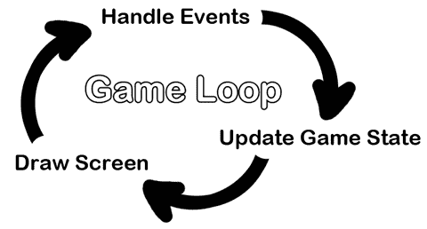

每当用户做了几个动作中的一个(它们将在本章后面列出)，比如按下键盘按键或者在程序窗口上移动鼠标，Pygame 库就会创建一个`pygame.event.Event`对象来记录这个“事件”。(这是一种名为`Event`的对象，它存在于`event`模块中，而后者本身又在`pygame`模块中。)我们可以通过调用`pygame.event.get()`函数来找出发生了哪些事件，该函数返回一个`pygame.event.Event`对象的列表(我们将简称为事件对象)。

事件对象列表将针对自上次调用`pygame.event.get()`函数以来发生的每个事件。(或者，如果`pygame.event.get()`从未被调用，则为程序开始以来发生的事件。)

```py
7\. while
True: # main game loop
8\.     for
event in pygame.event.get():
```

第 8 行是一个`for`循环，它将遍历由`pygame.event.get()`返回的事件对象列表。在`for`循环的每次迭代中，名为`event`的变量将被赋予列表中下一个事件对象的值。从`pygame.event.get()`返回的事件对象列表将按照事件发生的顺序排列。如果用户单击鼠标，然后按下键盘键，鼠标单击的事件对象将是列表中的第一项，键盘按下的事件对象将是第二项。如果没有事件发生，那么`pygame.event.get()`将返回一个空白列表。

## `QUIT`事件和`pygame.quit()`功能

```py
9\.         if
event.type == QUIT:
10\.             pygame.quit()
11\.             sys.exit()
```

`Event`对象有一个名为`type`的成员变量(也称为属性或属性)，它告诉我们对象代表哪种事件。Pygame 在`pygame.locals`模块中为每种可能的类型提供了一个常量变量。第 9 行检查事件对象的`type`是否等于常数`QUIT`。请记住，因为我们使用了`import`语句的`from pygame.locals import *`形式，所以我们只需键入`QUIT`而不是`pygame.locals.QUIT`。

如果事件对象是退出事件，则调用`pygame.quit()`和`sys.exit()`函数。`pygame.quit()`函数与`pygame.init()`函数有点相反:它运行去激活 Pygame 库的代码。你的程序应该总是在调用`sys.exit()`终止程序之前调用`pygame.quit()`。通常这并不重要，因为 Python 会在程序退出时关闭它。但是 IDLE 有一个 bug，如果一个 Pygame 程序在`pygame.quit()`被调用之前终止，会导致 IDLE 挂起。

因为我们没有为其他类型的事件对象运行代码的`if`语句，所以当用户点击鼠标、按下键盘按键或导致任何其他类型的事件对象被创建时，没有事件处理代码。用户可以创建这些事件对象，但这不会改变程序中的任何内容，因为程序没有任何针对这些类型的事件对象的事件处理代码。在第 8 行的`for`循环处理完所有由`pygame.event.get(),`返回的事件对象后，程序继续执行到第 12 行。

```py
12\.     pygame.display.update()
```

第 12 行调用`pygame.display.update()`函数，该函数将由`pygame.display.set_mode()`返回的表面对象绘制到屏幕上(记得我们将该对象存储在`DISPLAYSURF`变量中)。由于表面对象没有改变(例如，通过本章后面解释的一些绘图函数)，每次调用`pygame.display.update()`时，相同的黑色图像被重绘到屏幕上。

这就是整个程序。第 12 行完成后，无限`while`循环再次从头开始。这个程序除了让一个黑窗口出现在屏幕上，不断地检查一个`QUIT`事件，然后一遍又一遍地把没有变化的黑窗口重绘到屏幕上，其他什么都不做。让我们通过学习像素、表面对象、颜色对象、矩形对象和 Pygame 绘图函数来了解如何让有趣的东西出现在这个窗口上，而不仅仅是黑色。

“Hello World”程序创建的窗口只是由屏幕上被称为像素的小方块组成。每个像素开始为黑色，但可以设置为不同的颜色。想象一下，不是一个 400 像素宽 300 像素高的表面对象，而是一个 8 像素乘 8 像素的表面对象。如果将那个 8×8 的小表面放大，使每个像素看起来像网格中的一个正方形，并且我们为 X 轴和 Y 轴添加了数字，那么它的一个很好的表示可能如下所示:

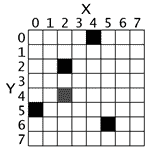

我们可以用笛卡尔坐标系来表示一个特定的像素。X 轴的每一列和 Y 轴的每一行都有一个“地址”,它是一个从 0 到 7 的整数，这样我们就可以通过指定 X 轴和 Y 轴的整数来定位任何像素。

例如，在上面的 8x8 图像中，我们可以看到 XY 坐标(4，0)、(2，2)、(0，5)和(5，6)处的像素被涂成黑色，而(2，4)处的像素被涂成灰色，而所有其他像素被涂成白色。XY 坐标也叫点。如果你上过数学课，学过笛卡尔坐标，你可能会注意到 Y 轴在*顶部*从 0 开始，然后随着*向下*增加，而不是随着向上增加。这就是笛卡尔坐标在 Pygame(以及几乎所有编程语言)中的工作方式。

Pygame 框架通常将笛卡尔坐标表示为两个整数的元组，例如(4，0)或(2，2)。第一个整数是 X 坐标，第二个是 Y 坐标。(笛卡尔坐标在第 12 章“用 Python 发明你自己的电脑游戏”中有更详细的介绍，在[http://invpy.com/chap12](//invpy.com/chap12)

函数和方法几乎是一回事。它们都可以被调用来执行其中的代码。函数和方法的区别在于方法总是被附加到对象上。通常方法会改变特定对象的某些内容(您可以将附加的对象视为传递给方法的一种永久参数)。

这是一个名为`foo()`的函数的函数调用:

foo()

这是一个名为`foo()`的方法的方法调用，它附加到一个名为`duckie`的变量中存储的对象:

duckie.foo()

对模块内部函数的调用可能看起来像方法调用。要区分这两者，您需要查看第一个名称，看看它是模块的名称还是包含对象的变量的名称。你可以看出`sys.exit()`是对模块内部函数的调用，因为在程序的顶部会有一个类似`import sys`的`import`语句。

一个构造函数和一个普通的函数调用是一样的，除了它的返回值是一个新的对象。只看源代码，函数和构造函数看起来是一样的。构造函数(也简称为“构造函数”，有时简称为“ctor”)只是返回新对象的函数的名称。但通常情况下，CT 以大写字母开头。这就是为什么当你写自己的程序时，你的函数名应该只以小写字母开头。

例如，`pygame.Rect()`和`pygame.Surface()`都是`pygame`模块中的构造函数，返回新的矩形和曲面对象。(这些对象将在后面描述。)

下面是一个函数调用、方法调用和模块内部函数调用的示例:

进口灾难

嘶嘶作响

egg =袋熊()

egg.bluhbluh()

whammy.spam()

即使这些名字都是编造的，你也能分辨出哪些是函数调用，哪些是方法调用，哪些是对方法内部函数的调用。名称`whammy`指的是一个模块，因为您可以在第一行看到它正在被导入。`fizzy`名前面没有任何东西，后面有括号，所以你知道它是一个函数调用。

`Wombat()`也是一个函数调用，本例中是一个返回对象的构造函数。(它开头的大写字母不能保证它是一个构造函数，而不是一个常规函数，但它是一个安全的赌注。)对象存储在名为`egg`的变量中。`egg.bluhbluh()`调用是一个方法调用，这一点你可以看出来，因为`bluhbluh`被附加到一个变量上，变量中有一个对象。

同时，`whammy.spam()`是函数调用，不是方法调用。您可以看出它不是一个方法，因为名称`whammy`是作为一个模块导入的。

表面对象是表示矩形 2D 图像的对象。表面对象的像素可以通过调用 Pygame 绘图函数(在本章后面描述)来改变，然后显示在屏幕上。窗口边框、标题栏和按钮不是显示表面对象的一部分。

具体来说，`pygame.display.set_mode()`返回的表面对象称为显示表面。当调用`pygame.display.update()`函数时，在显示表面对象上绘制的任何内容都将显示在窗口上。在表面对象(只存在于计算机的内存中)上绘制要比在计算机屏幕上绘制表面对象快得多。计算机内存比显示器上的像素变化快得多。

通常你的程序会在一个表面物体上画一些不同的东西。一旦你在游戏循环的这次迭代中完成了在显示表面对象上绘制一切(称为帧，就像暂停的 DVD 上的静止图像被称为),它就可以被绘制到屏幕上。计算机可以非常快速地绘制帧，我们的程序经常会在每秒 30 帧(即 30 FPS)左右运行。这被称为“帧速率”,将在本章后面解释。

在表面对象上绘图将在本章后面的“基本绘图功能”和“绘图图像”章节中讨论。

光有三原色:红、绿、蓝。(红色、蓝色和黄色是油漆和颜料的原色，但计算机显示器使用的是光，而不是油漆。)通过组合这三种颜色的不同数量，你可以形成任何其他颜色。在 Pygame 中，我们用三个整数的元组来表示颜色。元组中的第一个值是颜色中有多少红色。整数值`0`表示该颜色中没有红色，数值`255`表示该颜色中有最大量的红色。第二个值代表绿色，第三个值代表蓝色。这些用于表示一种颜色的三个整数的元组通常被称为 RGB 值。

因为可以对三原色中的每一种使用`0`到`255`的任意组合，这意味着 Pygame 可以绘制 16，777，216 种不同的颜色(即 256 x 256 x 256 种颜色)。但是，如果尝试使用大于`255`的数字或负数，将会得到类似于`ValueError: invalid color argument`的错误。

例如，我们将创建元组`(0, 0, 0)`，并将其存储在名为`BLACK`的变量中。没有任何红色、绿色或蓝色，最终的颜色是完全黑色的。黑色是指没有任何颜色。元组`(255, 255, 255)`用于最大量的红色、绿色和蓝色以产生白色。白色是红色、绿色和蓝色的完全结合。元组`(255, 0, 0)`表示红色的最大数量，但没有绿色和蓝色的数量，因此结果颜色是红色。同样，`(0, 255, 0)`是绿色，`(0, 0, 255)`是蓝色。

您可以混合红色、绿色和蓝色的数量来形成其他颜色。以下是几种常见颜色的 RGB 值:

| 颜色 | RGB 值 |
| 浅绿色 | `(  0, 255, 255)` |
| 黑色 | `(  0,   0,   0)` |
| 蓝色 | `(  0,  0, 255)` |
| 紫红色 | `(255,   0, 255)` |
| 灰色的 | `(128, 128, 128)` |
| 格林（姓氏）；绿色的 | `(  0, 128,   0)` |
| 石灰 | `(  0, 255,   0)` |
| 栗色的 | `(128,  0,   0)` |
| 深蓝色 | `(  0,  0, 128)` |
| 橄榄 | `(128, 128,   0)` |
| 紫色 | `(128,  0, 128)` |
| 红色 | `(255,   0,   0)` |
| 银 | `(192, 192, 192)` |
| 蓝绿色 | `(  0, 128, 128)` |
| 白色的 | `(255, 255, 255)` |
| 黄色 | `(255, 255,   0)` |

当你透过深红色的玻璃窗看时，它后面的所有颜色都添加了红色阴影。您可以通过向颜色值添加第四个`0`到`255`整数值来模拟这种效果。

这个值被称为阿尔法值。它是对颜色不透明程度的一种度量。通常，当你在表面物体上绘制一个像素时，新的颜色会完全替换原有的颜色。但是对于有 alpha 值的颜色，您可以只给已经存在的颜色添加一点颜色。

例如，这个由三个整数组成的元组用于颜色绿色:`(0, 255, 0)`。但是如果我们为 alpha 值添加第四个整数，我们可以将它变成半透明的绿色:`(0, 255, 0, 128)`。`255`的 alpha 值是完全不透明的(也就是说，完全不透明)。颜色`(0, 255, 0)`和 `(0, 255, 0, 255)`看起来一模一样。alpha 值为`0`表示颜色完全透明。如果你在一个表面物体上绘制任何一种 alpha 值为`0`的颜色，都不会有任何效果，因为这种颜色是完全透明不可见的。

为了使用透明颜色绘制，必须用`convert_alpha()`方法创建一个表面对象。例如，以下代码创建了一个可以在其上绘制透明颜色的表面对象:

another surface = display surf . convert _ alpha()

一旦在存储在`anotherSurface`中的表面对象上绘制了东西，那么`anotherSurface`就可以被“blitted”(即复制)到`DISPLAYSURF`，这样它就会出现在屏幕上。(参见本章后面的“用`pygame.image.load()`和`blit()`绘制图像”一节。)

需要注意的是，不能在没有从`convert_alpha()`调用返回的表面对象上使用透明颜色，包括从`pygame.display.set_mode()`返回的显示表面。

如果我们要创建一个颜色元组来绘制传说中不可见的粉红色独角兽，我们将使用`(255, 192, 192, 0)`，它最终看起来完全不可见，就像任何其他 alpha 值为`0`的颜色一样。毕竟，它是无形的。

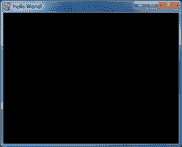

(上图是一张看不见的粉色独角兽的图纸截图。)

您需要知道如何表示一种颜色，因为 Pygame 的绘图功能需要一种方法来知道您想要用什么颜色来绘图。三个或四个整数的元组是一种方式。另一种方式是作为`pygame.Color`对象。您可以通过调用`pygame.Color()`构造函数并传递三个或四个整数来创建颜色对象。可以将这个`Color`对象存储在变量中，就像可以将元组存储在变量中一样。尝试在交互式 shell 中键入以下内容:

>>导入 pygame

> > pygame.Color(255，0，0)

(255, 0, 0, 255)

> > myColor = pygame。颜色(255，0，0，128)

> > myColor == (255，0，0，128)

真实的

>>>

Pygame 中任何有颜色参数的绘图函数(我们稍后会了解)都可以传递颜色的元组形式或颜色对象形式。即使它们是不同的数据类型，如果它们都表示相同的颜色，Color 对象也等于一个由四个整数组成的元组(就像`42 == 42.0`如何计算为`True`)。

既然您已经知道了如何表示颜色(作为一个`pygame.Color`对象或者一个由红、绿、蓝和可选的 alpha 组成的三或四个整数的元组)和坐标(作为一个由 X 和 Y 组成的两个整数的元组)，那么让我们学习一下`pygame.Rect`对象，这样我们就可以开始使用 Pygame 的绘图功能了。

Pygame 有两种方法来表示矩形区域(就像有两种方法来表示颜色一样)。第一个是四个整数的元组:

1.  左上角的 X 坐标。

2.  左上角的 Y 坐标。

3.  矩形的宽度(以像素为单位)。

4.  然后是矩形的高度(以像素为单位)。

第二种方式是作为`pygame.Rect`对象，我们将简称为 Rect 对象。例如，下面的代码创建了一个左上角为(10，20)的 Rect 对象，该对象宽 200 像素，高 300 像素:

>>导入 pygame

>>> spamRect = pygame。直肠（10， 20， 200， 300）

> > > spamRect == (10，20，200，300)

真实的

这样做的便利之处在于 Rect 对象会自动计算矩形其他特征的坐标。例如，如果您需要知道我们存储在`spamRect`变量中的`pygame.Rect`对象右边缘的 X 坐标，您可以访问 Rect 对象的`right`属性:

> > > spamRect.right

Two hundred and ten

Rect 对象的 Pygame 代码自动计算出，如果左边缘在 X 坐标 10 处，矩形的宽度为 200 像素，那么右边缘必须在 X 坐标 210 处。如果您重新分配`right`属性，所有其他属性将自动重新计算:

> > > spamRect.right = 350

> > > spamRect.left

One hundred and fifty

下面是`pygame.Rect`对象提供的所有属性的列表(在我们的例子中，变量 Rect 对象存储在名为`spamRect`的变量中):

| 属性名 | 描述 |
| `myRect.left` | 矩形左侧的 X 坐标的 int 值。 |
| `myRect.right` | 矩形右侧的 X 坐标的 int 值。 |
| `myRect.top` | 矩形顶边的 Y 坐标的整数值。 |
| `myRect.bottom` | 底边的 Y 坐标的整数值。 |
| `myRect.centerx` | 矩形中心的 X 坐标的整数值。 |
| `myRect.centery` | 矩形中心的 Y 坐标的整数值。 |
| `myRect.width` | 矩形宽度的 int 值。 |
| `myRect.height` | 矩形高度的 int 值。 |
| `myRect.size` | 两个整数的元组:(宽度，高度) |
| `myRect.topleft` | 两个整数的元组:(左，上) |
| `myRect.topright` | 两个整数的元组:(右，上) |
| `myRect.bottomleft` | 两个整数的元组:(左，下) |
| `myRect.bottomright` | 两个整数的元组:(右，下) |
| `myRect.midleft` | 两个整数的元组:(左，中) |
| `myRect.midright` | 两个整数的元组:(右，中) |
| `myRect.midtop` | 两个整数的元组:(centerx，top) |
| `myRect.midbottom` | 两个整数的元组:(centerx，bottom) |

Pygame 提供了几个不同的函数，用于在表面对象上绘制不同的形状。这些形状如矩形、圆形、椭圆形、直线或单个像素通常被称为绘图图元。打开 IDLE 的文件编辑器，输入以下程序，保存为 *drawing.py* 。

```py
1\. import
pygame, sys
2\. from
pygame.locals import *
3\. 
4\. pygame.init()
5\. 
6\. # set up the window
7\. DISPLAYSURF
= pygame.display.set_mode((500, 400), 0, 32)
8\. pygame.display.set_caption('Drawing')
9\. 
10\. # set up the colors
11\. BLACK
= (  0,   0,   0)
12\. WHITE
= (255, 255, 255)
13\. RED
= (255,   0,   0)
14\. GREEN
= (  0, 255,   0)
15\. BLUE
= (  0,   0, 255)
16\. 
17\. # draw on the surface object

19\. pygame.draw.polygon(DISPLAYSURF,
GREEN, ((146, 0), (291, 106), (236, 277), (56, 277), (0, 106)))
20\. pygame.draw.line(DISPLAYSURF,
BLUE, (60, 60), (120, 60), 4)
21\. pygame.draw.line(DISPLAYSURF,
BLUE, (120, 60), (60, 120))
22\. pygame.draw.line(DISPLAYSURF,
BLUE, (60, 120), (120, 120), 4)
23\. pygame.draw.circle(DISPLAYSURF,
BLUE, (300, 50), 20, 0)
24\. pygame.draw.ellipse(DISPLAYSURF,
RED, (300, 250, 40, 80), 1)
25\. pygame.draw.rect(DISPLAYSURF,
RED, (200, 150, 100, 50))
26\. 
27\. pixObj
= pygame.PixelArray(DISPLAYSURF)
28\. pixObj[480][380]
= BLACK
29\. pixObj[482][382]
= BLACK
30\. pixObj[484][384]
= BLACK
31\. pixObj[486][386]
= BLACK
32\. pixObj[488][388]
= BLACK
33\. del
pixObj
34\. 
35\. # run the game loop
36\. while
True:
37\.     for
event in pygame.event.get():
38\.         if
event.type == QUIT:
39\.             pygame.quit()
40\.             sys.exit()
41\.     pygame.display.update()
```

运行该程序时，将显示以下窗口，直到用户关闭该窗口:

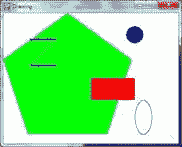

注意我们是如何为每种颜色设置常量变量的。这样做使我们的代码更具可读性，因为在源代码中看到`GREEN`表示绿色比看到`(0, 255, 0)`更容易理解。

绘图函数是根据它们绘制的形状命名的。您传递给这些函数的参数告诉它们要在哪个表面对象上绘制，在哪里绘制形状(以及大小)，使用什么颜色，以及绘制线条的宽度。你可以看到这些函数是如何在 *drawing.py* 程序中被调用的，但这里是每个函数的简短描述:

**【颜色】**—`fill()`方法不是函数而是`pygame.Surface`对象的方法。它会用你为`color`参数传递的任何颜色值完全填充整个表面对象。

**py game . draw . polygon(surface，color，pointlist，width)**–多边形是仅由平面边组成的形状。`surface`和`color`参数告诉函数在哪个表面上画多边形，以及用什么颜色。

`pointlist`参数是一个元组或点列表(即 XY 坐标的元组或双整数元组列表)。多边形是通过在元组中的每个点和其后的点之间画线来绘制的。然后从最后一个点到第一个点画一条线。也可以传递一个点的列表，而不是一个点的元组。

`width`参数是可选的。如果你忽略它，画出的多边形将被填充，就像我们屏幕上的绿色多边形被填充颜色一样。如果您确实为`width`参数传递了一个整数值，那么将只绘制多边形的轮廓。整数表示多边形轮廓的像素宽度。为`width`参数传递`1`将生成一个瘦多边形，而传递`4`或`10`或`20`将生成更粗的多边形。如果您为`width`参数传递整数`0`，多边形将被填充(就像您完全忽略`width`参数一样)。

所有的`pygame.draw`绘图功能最后都有可选的`width`参数，它们的工作方式与`pygame.draw.polygon()`的`width`参数相同。对于`width`参数，一个更好的名字可能是`thickness`，因为这个参数控制你画的线条有多粗。

**py game . draw . line(surface，color，start_point，end_point，width)**–该函数在`start_point`和`end_point`参数之间画一条线。

**pygame . draw . lines(surface，color，closed，pointlist，width)**——这个函数从一个点到下一个点绘制一系列线条，很像`pygame.draw.polygon()`。唯一的区别是，如果您为`closed`参数传递`False`，那么从`pointlist`参数中的最后一个点到第一个点之间将不会有一条直线。如果你通过`True`，那么它会从最后一个点到第一个点画一条线。

**【py game . draw . circle(曲面，颜色，中心 _ 点，半径，宽度)**–此函数绘制一个圆。圆心在`center_point`参数处。为`radius`参数传递的整数设置圆的大小。

圆的半径是从圆心到边缘的距离。(圆的半径永远是直径的一半。)为`radius`参数传递`20`将绘制一个半径为 20 像素的圆。

**py game . draw . ellipse(surface，color，bounding_rectangle，width)**–此函数绘制一个椭圆(类似于一个被压扁或拉伸的圆)。这个函数有所有常用的参数，但是为了告诉函数椭圆有多大以及在哪里画，您必须指定椭圆的边界矩形。一个边界矩形是可以围绕一个形状绘制的最小矩形。下面是一个椭圆及其边框的示例:

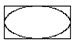

`bounding_rectangle`参数可以是一个`pygame.Rect`对象或者一个四个整数的元组。请注意，您不像对`pygame.draw.circle()`函数那样指定椭圆的中心点。

**py game . draw . rect(surface，color，rectangle_tuple，width)**–此函数绘制矩形。`rectangle_tuple`要么是一个四个整数的元组(用于左上角的 XY 坐标，以及宽度和高度),要么是一个`pygame.Rect`对象。如果`rectangle_tuple`的宽度和高度相同，将会画出一个正方形。

不幸的是，没有一个函数可以调用来将单个像素设置为一种颜色(除非使用相同的起点和终点调用`pygame.draw.line()`)。Pygame 框架需要在绘制表面对象之前和之后在后台运行一些代码。如果它必须为你想要设置的每一个像素都这样做，你的程序会运行得更慢。(根据我的快速测试，用这种方式绘制像素要慢两到三倍。)

相反，你应该创建一个表面对象的`pygame.PixelArray`对象(我们简称它们为 PixelArray 对象),然后设置单独的像素。创建表面对象的 PixelArray 对象将“锁定”表面对象。当一个表面对象被锁定时，仍然可以在其上调用绘图功能，但是不能用`blit()`方法在其上绘制像 PNG 或 JPG 图像这样的图像。(`blit()`方法将在本章稍后解释。)

如果你想查看一个表面对象是否被锁定，如果被锁定，`get_locked()` Surface 方法将返回`True`,否则返回`False`。

从`pygame.PixelArray()`返回的 PixelArray 对象可以通过用两个索引访问它们来设置单个像素。例如，第 28 行的`pixObj[480][380] = BLACK`将把 X 坐标 480 和 Y 坐标 380 处的像素设置为黑色(记住`BLACK`变量存储颜色元组`(0, 0, 0)`)。

要告诉 Pygame 您已经完成了单个像素的绘制，请用一个`del`语句删除 PixelArray 对象。这就是 33 行的作用。删除 PixelArray 对象将“解锁”表面对象，以便您可以再次在其上绘制图像。如果你忘记删除 PixelArray 对象，下一次当你试图将一个图像 blit(即，绘制)到表面时，程序将产生一个错误，显示“`pygame.error: Surfaces must not be locked during blit`”。

## `pygame.display.update()`功能

在您完成调用绘图函数以使显示表面对象看起来像您想要的样子之后，您必须调用`pygame.display.update()`以使显示表面实际出现在用户的监视器上。

你必须记住的一点是，`pygame.display.update()`只会让显示表面(也就是调用`pygame.display.set_mode()`返回的表面对象)出现在屏幕上。如果你想让其他表面对象上的图像出现在屏幕上，你必须用`blit()`方法将它们“blit ”(即复制)到显示表面对象上(这将在“绘制图像”一节中解释)。

现在我们知道了如何让 Pygame 框架绘制到屏幕上，让我们来学习如何制作动画图片。一个只有静止不动的图像的游戏会相当无聊。(我的游戏《看这块石头》的销量一直令人失望。)动画图像是在屏幕上绘制一个图像，然后在一瞬间在屏幕上绘制一个略有不同的图像的结果。假设程序的窗口宽 6 像素，高 1 像素，除了 4，0 处的一个黑色像素外，所有像素都是白色的。它看起来像这样:

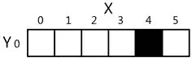

如果您更改窗口，使 3，0 为黑色，4，0 为白色，它看起来会像这样:

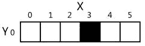

对于用户来说，看起来黑色像素已经“移动”到了左边。如果您重新绘制窗口，使黑色像素位于 2，0，它将继续看起来像黑色像素向左移动:

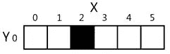

看起来黑色像素在移动，但这只是一种错觉。对计算机来说，它只是显示三个不同的图像，每个图像都有一个黑色像素。考虑一下，如果屏幕上快速显示以下三幅图像:

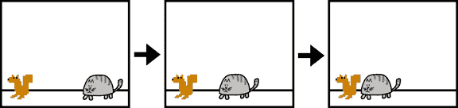

对于用户来说，这看起来像是猫在向松鼠移动。但对电脑来说，它们只是一堆像素。制作看起来可信的动画的诀窍是让你的程序在窗口画一幅画，等待几分之一秒，然后画一幅*稍微*不同的画。

下面是一个演示简单动画的示例程序。将这段代码输入到 IDLE 的文件编辑器中，保存为 *catanimation.py* 。它还要求图像文件 cat.png 与 *catanimation.py* 文件在同一个文件夹中。你可以从 http://invpy.com/cat.png 的T5T7】下载这张图片。该代码可在[【http://invpy.com/catanimation.py](//invpy.com/catanimation.py)获得。

```py
 1. import
pygame, sys
 2.
from pygame.locals import *
3\. 
 4.
pygame.init()
5\. 
 6.
FPS = 30 # frames per second setting
 7.
fpsClock = pygame.time.Clock()
8\. 
 9. # set up the window
10. DISPLAYSURF
= pygame.display.set_mode((400, 300), 0, 32)
11.
pygame.display.set_caption('Animation')
12.
13.
WHITE = (255, 255, 255)
14.
catImg = pygame.image.load('cat.png')
15.
catx = 10
16.
caty = 10
17.
direction = 'right'
18.
19.
while True: # the main game loop
20.
    DISPLAYSURF.fill(WHITE)
21\. 
22.
    if direction == 'right':
23.
        catx += 5
24.
        if catx == 280:
25.
            direction = 'down'
26.
    elif direction == 'down':
27.
        caty += 5
28.
        if caty == 220:
29.
            direction = 'left'
30.
    elif direction == 'left':
31.
        catx -= 5
32.
        if catx == 10:
33.
            direction = 'up'
34.
    elif direction == 'up':
35.
        caty -= 5
36.
        if caty == 10:
37.
            direction = 'right'
38\. 
39.
    DISPLAYSURF.blit(catImg, (catx, caty))
40\. 
41.
    for event in pygame.event.get():
42.
        if event.type == QUIT:
43.
            pygame.quit()
44.
            sys.exit()
45.
46.
    pygame.display.update()
47.
    fpsClock.tick(FPS)
```

看那只卡通猫走了！这个程序将比我的游戏“看这块石头 2:一个不同的石头”在商业上更成功。

##  `pygame.time.Clock`物体

帧率或刷新率是程序每秒绘制的图片数量，以每秒 FPS 或帧数来衡量。(在电脑显示器上，FPS 的俗称是赫兹。许多显示器的帧速率为 60 赫兹，即每秒 60 帧。)视频游戏中的低帧率会让游戏看起来起伏不定。如果程序有太多的代码要运行，以至于不能足够频繁地绘制到屏幕上，那么 FPS 就会下降。但是这本书里的游戏很简单，即使在旧电脑上也不会出现这种问题。

一个`pygame.time.Clock`对象可以帮助我们确保我们的程序以某个最大 FPS 运行。这个`Clock`对象将通过在游戏循环的每一次迭代中放置小的暂停来确保我们的游戏程序不会运行得太快。如果我们没有这些停顿，我们的游戏程序会像计算机运行它一样快。这对玩家来说通常太快了，随着计算机速度的提高，他们运行游戏的速度也会更快。在游戏循环中调用一个`Clock`对象的`tick()`方法可以确保游戏以相同的速度运行，不管它在多快的计算机上运行。在 *catanimation.py* 程序的第 7 行创建了`Clock`对象。

```py
7. fpsClock =
pygame.time.Clock()
```

对象的方法应该在游戏循环的最后调用，在调用`pygame.display.update()`之后。暂停时间的长短是根据对`tick()`的前一次调用已经过去了多长时间来计算的，这将发生在游戏循环的前一次迭代结束时。(第一次调用`tick()`方法时，它根本不会暂停。)在动画程序中，是作为游戏循环中的最后一条指令运行在第 47 行。

你所需要知道的是，你应该在循环结束时通过游戏循环每次迭代调用一次`tick()`方法。通常这是在调用`pygame.display.update()`之后。

```py
47.
    fpsClock.tick(FPS)
```

尝试修改`FPS`常量变量，以不同的帧率运行相同的程序。将其设置为较低的值会使程序运行速度变慢。将其设置为更高的值会使程序运行得更快。

##  `pygame.image.load()`和`blit()`绘制图像

如果你想在屏幕上画简单的形状，绘图功能很好，但许多游戏都有图像(也称为精灵)。Pygame 能够从 PNG、JPG、GIF 和 BMP 图像文件中加载图像到表面对象上。这些图像文件格式的区别在【http://invpy.com/formats】中有所描述。

这只猫的图像被保存在一个名为 cat.png*的文件中。为了加载这个文件的图像，字符串`'cat.png'`被传递给`pygame.image.load()`函数。`pygame.image.load()`函数调用将返回一个画有图像的表面对象。这个表面对象将是一个独立于显示表面对象的表面对象，所以我们必须将图像的表面对象复制到显示表面对象。将一个表面的内容绘制到另一个表面上。这是用`blit()`表面对象方法完成的。*

如果你在调用`pygame.image.load()`时得到类似于`pygame.error: Couldn't open cat.png`的错误信息，那么在你运行程序之前，确保【calling】文件*与*文件*在同一个文件夹中。*

```py
39.     DISPLAYSURF.blit(catImg,
(catx, caty))
```

动画程序的第 39 行使用`blit()`方法将`catImg`复制到`DISPLAYSURF`。`blit()`有两个参数。第一个是源表面对象，它将被复制到`DISPLAYSURF`表面对象上。第二个参数是一个两个整数的元组，表示左上角的 X 和 Y 值，图像应该被 blitted 到这个角。

如果`catx`和`caty`被设置为`100`和`200`，并且`catImg`的宽度为`125`，高度为`79`，那么这个`blit()`调用将把这个图像复制到`DISPLAYSURF`上，这样`catImg`的左上角在 XY 坐标(100，200)，右下角的 XY 坐标在(225，279)。

请注意，您不能 blit 到当前“锁定”的曲面(例如，当一个 PixelArray 对象已经从该曲面创建并且尚未删除时)。)

游戏循环的其余部分只是改变`catx`、`caty`和`direction`变量，以便猫在窗口周围移动。还有一个调用`pygame.event.get()`来处理`QUIT`事件。

如果你想在屏幕上绘制文本，你*可以*写几个调用给`pygame.draw.line()`来画出每个字母的行。键入所有这些`pygame.draw.line()`调用并计算出所有的 XY 坐标将是一件令人头痛的事情，并且可能看起来不太好。

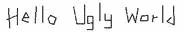

上面的消息需要调用 41 次`pygame.draw.line()`函数才能完成。相反，Pygame 为字体和创建文本提供了一些简单得多的功能。这是一个使用 Pygame 字体功能的 Hello World 小程序。将其输入到 IDLE 的文件编辑器中，并保存为 *fonttext.py* :

```py
 1. import
pygame, sys
 2. from
pygame.locals import *
 3.
 4. pygame.init()
 5. DISPLAYSURF
= pygame.display.set_mode((400, 300))
 6. pygame.display.set_caption('Hello
World!')
7\. 
 8. WHITE
= (255, 255, 255)
 9. GREEN
= (0, 255, 0)
10. BLUE
= (0, 0, 128)
11\. 
12. fontObj
= pygame.font.Font('freesansbold.ttf', 32)
13. textSurfaceObj
= fontObj.render('Hello world!', True, GREEN, BLUE)
14. textRectObj
= textSurfaceObj.get_rect()
15. textRectObj.center
= (200, 150)
16.
17. while
True: # main game loop
18.     DISPLAYSURF.fill(WHITE)
19.     DISPLAYSURF.blit(textSurfaceObj,
textRectObj)
20.     for
event in pygame.event.get():
21.         if
event.type == QUIT:
22.             pygame.quit()
23.             sys.exit()
24.     pygame.display.update()
```

让文本出现在屏幕上有六个步骤:

1.  创造一个`pygame.font.Font object`。(如第 12 行)

2.  通过调用字体对象的`render()`方法，创建一个绘制有文本的表面对象。(第 13 行)

3.  通过调用表面对象的`get_rect()`方法，从表面对象创建一个矩形对象。(第 14 行)这个 Rect 对象将为所呈现的文本正确设置宽度和高度，但是 top 和 left 属性将是`0`。

4.  通过改变矩形对象的一个属性来设置其位置。在第 15 行，我们将 Rect 对象的中心设置为 200，150。

5.  将表面对象和文本一起放到`pygame.display.set_mode()`返回的表面对象上。(第 19 行)

6.  调用`pygame.display.update()`使显示面出现在屏幕上。(第 24 行)

`pygame.font.Font()`构造函数的参数是要使用的字体文件的一个字符串，以及字体大小的一个整数(以磅为单位，就像字处理器测量字体大小一样)。在第 12 行，我们传递了`'freesansbold.ttf'`(这是 Pygame 自带的字体)和整数`32`(32 磅大小的字体)。

有关使用其他字体的更多信息，请参见[http://invpy.com/usingotherfonts](//invpy.com/usingotherfonts)。

`render()`方法调用的参数是要渲染的文本字符串、指定是否需要抗锯齿的布尔值(在本章后面解释)、文本颜色和背景颜色。如果您想要一个透明的背景，那么只需在方法调用中去掉背景颜色参数。

抗锯齿是一种图形技术，通过在边缘添加一点模糊来使文本和形状看起来不那么块状。使用抗锯齿绘制会花费更多的计算时间，因此尽管图形可能看起来更好，但您的程序可能会运行得更慢(但只是一点点)。

如果放大锯齿线和反锯齿线，它们看起来像这样:

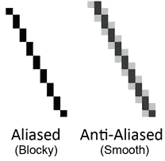

要让 Pygame 的文本使用抗锯齿，只需为`render()`方法的第二个参数传递`True`。`pygame.draw.aaline()`和`pygame.draw.aalines()`功能具有与`pygame.draw.line()`和`pygame.draw.lines()`相同的参数，除了它们将绘制反锯齿(平滑)线而不是锯齿(块状)线。

播放存储在声音文件中的声音甚至比显示图像文件中的图像更简单。首先，您必须通过调用`pygame.mixer.Sound()`构造函数来创建一个`pygame.mixer.Sound`对象(我们简称它为声音对象)。它接受一个字符串参数，即声音文件的文件名。Pygame 可以加载 WAV、MP3 或 OGG 文件。这些音频文件格式的区别在【http://invpy.com/formats】中解释。

要播放这个声音，调用 sound 对象的`play()`方法。如果你想立即停止声音对象的播放，调用`stop()`方法。`stop()`方法没有参数。以下是一些示例代码:

sound obj = pygame . mixer . sound(' beeps . wav ')。

soundObj.play()

导入时间

time.sleep(1) #等待并让声音播放 1 秒钟

soundObj.stop()

您可以从【http://invpy.com/beeps.wav】[的下载*beepes . wav*文件。](//invpy.com/beeps.wav)

调用`play()`后，程序立即继续执行；它不等待声音播放完毕就继续下一行代码。

当玩家受到伤害、挥剑或收集硬币时，声音对象适合播放声音效果。但是如果不管游戏中发生了什么都播放背景音乐，你的游戏可能会更好。Pygame 一次只能加载一个音乐文件在后台播放。要加载背景音乐文件，调用`pygame.mixer.music.load()`函数并向其传递要加载的声音文件的字符串参数。该文件可以是 WAV、MP3 或 MIDI 格式。

要开始播放加载的声音文件作为背景音乐，调用`pygame.mixer.music.play(-1, 0.0)`功能。`-1`参数使背景音乐在到达声音文件末尾时永远循环播放。如果你设置它为一个整数`0`或更大，那么音乐将只循环这个次数，而不是永远循环。`0.0`表示从头开始播放声音文件。如果您传递一个更大的整数或浮点数，音乐将在声音文件中播放该秒数。例如，如果您为第二个参数传递了`13.5`,带有的声音文件将在从开始算起 13.5 秒后开始播放。

要立即停止播放背景音乐，请调用`pygame.mixer.music.stop()`功能。这个函数没有参数。

下面是一些声音方法和函数的示例代码:

#加载并播放音效:

sound obj = pygame . mixer . sound(' beeping sound . wav ')。

soundObj.play()

#加载并播放背景音乐:

pygame . mixer . music . load(' background music . MP3 ')

pygame.mixer.music.play(-1，0.0)

#...这里还有一些你的代码...

pygame.mixer.music.stop()

这涵盖了用 Pygame 框架制作图形游戏的基础知识。当然，仅仅阅读这些函数可能不足以帮助你学习如何使用这些函数制作游戏。本书的其余章节都集中在一个完整的小游戏的源代码上。这将让你对完整的游戏程序“看起来像什么”有一个概念，这样你就可以对如何编写你自己的游戏程序有一些想法。

与《用 Python 发明你自己的电脑游戏》不同，这本书假设你了解 Python 编程的基础。如果你在记住变量、函数、循环、`if` - `else`语句和条件是如何工作的方面有困难，你可以通过查看代码中的内容和程序的行为来找出答案。但如果你仍然停滞不前，你可以在 http://inventwithpython.com[免费在线阅读《用 Python 发明》一书(面向完全不熟悉编程的人)。](//inventwithpython.com)