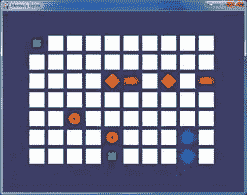
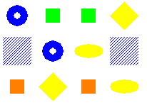
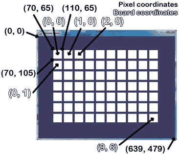

# 第三章——记忆难题

> 原文：<http://inventwithpython.com/pygame/chapter3.html>



在记忆拼图游戏中，几个图标被白色的盒子盖住了。每个图标有两个。玩家可以点击两个盒子来查看它们后面的图标。如果图标匹配，则这些框保持不被覆盖。当棋盘上的所有盒子都被揭开时，玩家获胜。为了给玩家一个提示，在游戏开始时，盒子会被迅速打开一次。

##  `for`循环

你将在 Memory Puzzle(以及本书中的大多数游戏)中看到的一个概念是在另一个`for`循环中使用一个`for`循环。这些被称为嵌套的`for`循环。嵌套的`for`循环对于遍历两个列表的每一种可能的组合都很方便。在交互式 shell 中键入以下内容:

>>>对于[0，1，2，3，4]中的 x:

...对于['a '，' b '，' c']中的 y:

...打印(x，y)

...

0 a

0 b

0 摄氏度

1 a

1 b

1 摄氏度

2 a

2 b

2 摄氏度

3 a

3 b

3 摄氏度

4 a

4 b

4 摄氏度

>>>

在记忆拼图代码中，有几次我们需要遍历棋盘上每一个可能的 X 和 Y 坐标。我们将使用嵌套的`for`循环来确保得到所有的组合。请注意，内部`for`循环(另一个`for`循环中的`for`循环)将在进入外部`for`循环的下一个迭代之前完成所有迭代。如果我们颠倒`for`循环的顺序，相同的值将被打印，但它们将以不同的顺序打印。在交互式 shell 中键入以下代码，并将它打印值的顺序与前面嵌套的`for`循环示例中的顺序进行比较:

>>>对于['a '，' b '，' c']中的 y:

...对于[0，1，2，3，4]中的 x:

...打印(x，y)

...

0 a

1 a

2 a

3 a

4 a

0 b

1 b

2 b

3 b

4 b

0 摄氏度

1 摄氏度

2 摄氏度

3 摄氏度

4 摄氏度

>>>

这个源代码可以从[【http://invpy.com/memorypuzzle.py】](http://invpy.com/memorypuzzle.py)下载。

继续，首先在 IDLE 的文件编辑器中输入整个程序，保存为 *memorypuzzle.py* ，然后运行它。如果您得到任何错误消息，请查看错误消息中提到的行号，并检查您的代码是否有任何拼写错误。您也可以在 http://invpy.com/diff/memorypuzzle将您的代码复制并粘贴到 web 表单中，看看您的代码是否与书中的代码有所不同。

只需输入一次，你就可能对这个程序的工作原理有所了解。当你输入完之后，你就可以自己玩这个游戏了。

```py
1\. # Memory Puzzle
2\. # By Al Sweigart [[email protected]](/cdn-cgi/l/email-protection)
3\. # http://inventwithpython.com/pygame
4\. # Released under a "Simplified BSD" license
5\. 
6\. import
random, pygame, sys
7\. from
pygame.locals import *
8\. 
9\. FPS
= 30 # frames per second, the general speed of
the program
10\. WINDOWWIDTH
= 640 # size of window's width in pixels
11\. WINDOWHEIGHT
= 480 # size of windows' height in pixels
12\. REVEALSPEED
= 8 # speed boxes' sliding reveals and covers
13\. BOXSIZE
= 40 # size of box height & width in pixels
14\. GAPSIZE
= 10 # size of gap between boxes in pixels
15\. BOARDWIDTH
= 10 # number of columns of icons
16\. BOARDHEIGHT
= 7 # number of rows of icons
17\. assert
(BOARDWIDTH * BOARDHEIGHT) % 2 == 0, 'Board needs to have an even number of
boxes for pairs of matches.'
18\. XMARGIN
= int((WINDOWWIDTH - (BOARDWIDTH * (BOXSIZE + GAPSIZE))) / 2)
19\. YMARGIN
= int((WINDOWHEIGHT - (BOARDHEIGHT * (BOXSIZE + GAPSIZE))) / 2)
20\. 
21\. #            R    G    B
22\. GRAY    
= (100, 100, 100)
23\. NAVYBLUE
= ( 60,  60, 100)
24\. WHITE   
= (255, 255, 255)
25\. RED     
= (255,   0,   0)
26\. GREEN   
= (  0, 255,   0)
27\. BLUE    
= (  0,   0, 255)
28\. YELLOW  
= (255, 255,   0)
29\. ORANGE  
= (255, 128,   0)
30\. PURPLE  
= (255,   0, 255)
31\. CYAN    
= (  0, 255, 255)
32\. 
33\. BGCOLOR
= NAVYBLUE
34\. LIGHTBGCOLOR
= GRAY
35\. BOXCOLOR
= WHITE
36\. HIGHLIGHTCOLOR
= BLUE
37\. 
38\. DONUT
= 'donut'
39\. SQUARE
= 'square'
40\. DIAMOND
= 'diamond'
41\. LINES
= 'lines'
42\. OVAL
= 'oval'
43\. 
44\. ALLCOLORS
= (RED, GREEN, BLUE, YELLOW, ORANGE, PURPLE, CYAN)
45\. ALLSHAPES
= (DONUT, SQUARE, DIAMOND, LINES, OVAL)
46\. assert
len(ALLCOLORS) * len(ALLSHAPES) * 2 >= BOARDWIDTH * BOARDHEIGHT, "Board
is too big for the number of shapes/colors defined."
47\. 
48\. def
main():
49\.     global
FPSCLOCK, DISPLAYSURF
50\.     pygame.init()
51\.     FPSCLOCK
= pygame.time.Clock()
52\.     DISPLAYSURF
= pygame.display.set_mode((WINDOWWIDTH, WINDOWHEIGHT))
53\. 
54\.     mousex
= 0 # used to store x coordinate of mouse event
55\.     mousey
= 0 # used to store y coordinate of mouse event
56\.     pygame.display.set_caption('Memory
Game')
57\. 
58\.     mainBoard
= getRandomizedBoard()
59\.     revealedBoxes
= generateRevealedBoxesData(False)
60\. 
61\.     firstSelection
= None # stores the (x, y) of the first box
clicked.
62\. 
63\.     DISPLAYSURF.fill(BGCOLOR)
64\.     startGameAnimation(mainBoard)
65\. 
66\.     while
True: # main game loop
67\.         mouseClicked
= False
68\. 
69\.         DISPLAYSURF.fill(BGCOLOR)
# drawing the window
70\.         drawBoard(mainBoard,
revealedBoxes)
71\. 
72\.         for
event in pygame.event.get(): # event handling
loop
73\.             if
event.type == QUIT or (event.type == KEYUP and event.key == K_ESCAPE):
74\.                 pygame.quit()
75\.                 sys.exit()
76\.             elif
event.type == MOUSEMOTION:
77\.                 mousex,
mousey = event.pos
78\.             elif
event.type == MOUSEBUTTONUP:
79\.                 mousex,
mousey = event.pos
80\.                 mouseClicked
= True
81\. 
82\.         boxx,
boxy = getBoxAtPixel(mousex, mousey)
83\.         if
boxx != None and boxy != None:
84\.             # The mouse is currently over a box.
85\.             if
not revealedBoxes[boxx][boxy]:
 86.               
drawHighlightBox(boxx, boxy)
87\.             if
not revealedBoxes[boxx][boxy] and mouseClicked:
88\.                 revealBoxesAnimation(mainBoard,
[(boxx, boxy)])
89\.                 revealedBoxes[boxx][boxy]
= True # set the box as "revealed"
90\.                 if
firstSelection == None: # the current box was the
first box clicked
91\.                     firstSelection
= (boxx, boxy)
92\.                 else:
# the current box was the second box clicked
93\.                     # Check if there is a match between the two icons.
94\.                     icon1shape,
icon1color = getShapeAndColor(mainBoard, firstSelection[0], firstSelection[1])
95\.                     icon2shape,
icon2color = getShapeAndColor(mainBoard, boxx, boxy)
96\. 
97\.                     if
icon1shape != icon2shape or icon1color != icon2color:
98\.                         # Icons don't match. Re-cover up both selections.
99\.                         pygame.time.wait(1000)
# 1000 milliseconds = 1 sec
100\.                         coverBoxesAnimation(mainBoard,
[(firstSelection[0], firstSelection[1]), (boxx, boxy)])
101\.                         revealedBoxes[firstSelection[0]][firstSelection
[1]] = False
102\.                         revealedBoxes[boxx][boxy]
= False
103\.                     elif
hasWon(revealedBoxes): # check if all pairs found
104\.                         gameWonAnimation(mainBoard)
105\.                         pygame.time.wait(2000)
106\. 
107\.                         # Reset the board
108\.                         mainBoard
= getRandomizedBoard()
109\.                         revealedBoxes
= generateRevealedBoxesData(False)
110\. 
111\.                         # Show the fully unrevealed board for a second.
112\.                         drawBoard(mainBoard,
revealedBoxes)
113\.                         pygame.display.update()
114\.                         pygame.time.wait(1000)
115\. 
116\.                         # Replay the start game animation.
117\.                         startGameAnimation(mainBoard)            
118\.                     firstSelection
= None # reset firstSelection variable
119\. 
120\.         # Redraw the screen and wait a clock tick.
121\.         pygame.display.update()
122\.         FPSCLOCK.tick(FPS)
123\. 
124\. 
125\. def
generateRevealedBoxesData(val):
126\.     revealedBoxes
= []
127\.     for
i in range(BOARDWIDTH):
128\.         revealedBoxes.append([val]
* BOARDHEIGHT)
129\.     return
revealedBoxes
130\. 
131\. 
132\. def
getRandomizedBoard():
133\.     # Get a list of every possible shape in every possible
color.
134\.     icons
= []
135\.     for
color in ALLCOLORS:
136\.         for
shape in ALLSHAPES:
137\.             icons.append(
(shape, color) )
138\. 
139\.     random.shuffle(icons)
# randomize the order of the icons list
140\.     numIconsUsed
= int(BOARDWIDTH * BOARDHEIGHT / 2) # calculate
how many icons are needed
141\.     icons
= icons[:numIconsUsed] * 2 # make two of each
142\.     random.shuffle(icons)
143.
144\.     # Create the board data structure, with randomly placed
icons.
145\.     board
= []
146\.     for
x in range(BOARDWIDTH):
147\.         column
= []
148\.         for
y in range(BOARDHEIGHT):
149\.             column.append(icons[0])
150\.             del
icons[0] # remove the icons as we assign them
151\.         board.append(column)
152\.     return
board
153\. 
154\. 
155\. def
splitIntoGroupsOf(groupSize, theList):
156\.     # splits a list into a list of lists, where the inner
lists have at
157\.     # most groupSize number of items.
158\.     result
= []
159\.     for
i in range(0, len(theList), groupSize):
160\.         result.append(theList[i:i
+ groupSize])
161\.     return
result
162\. 
163\. 
164\. def
leftTopCoordsOfBox(boxx, boxy):
165\.     # Convert board coordinates to pixel coordinates
166\.     left
= boxx * (BOXSIZE + GAPSIZE) + XMARGIN
167\.     top
= boxy * (BOXSIZE + GAPSIZE) + YMARGIN
168\.     return
(left, top)
169\. 
170\. 
171\. def
getBoxAtPixel(x, y):
172\.     for
boxx in range(BOARDWIDTH):
173\.         for
boxy in range(BOARDHEIGHT):
174\.             left,
top = leftTopCoordsOfBox(boxx, boxy)
175\.             boxRect
= pygame.Rect(left, top, BOXSIZE, BOXSIZE)
176\.             if
boxRect.collidepoint(x, y):
177\.                 return
(boxx, boxy)
178\.     return
(None, None)
179\. 
180\. 
181\. def
drawIcon(shape, color, boxx, boxy):
182\.     quarter
= int(BOXSIZE * 0.25) # syntactic sugar
183\.     half
=    int(BOXSIZE * 0.5)  # syntactic sugar
184\. 
185\.     left,
top = leftTopCoordsOfBox(boxx, boxy) # get pixel
coords from board coords
186\.     # Draw the shapes
187\.     if
shape == DONUT:
188\.         pygame.draw.circle(DISPLAYSURF,
color, (left + half, top + half), half - 5)
189\.         pygame.draw.circle(DISPLAYSURF,
BGCOLOR, (left + half, top + half), quarter - 5)
190\.     elif
shape == SQUARE:
191\.         pygame.draw.rect(DISPLAYSURF,
color, (left + quarter, top + quarter, BOXSIZE - half, BOXSIZE - half))
192\.     elif
shape == DIAMOND:
193\.         pygame.draw.polygon(DISPLAYSURF,
color, ((left + half, top), (left + BOXSIZE - 1, top + half), (left + half, top
+ BOXSIZE - 1), (left, top + half)))
194\.     elif
shape == LINES:
195\.         for
i in range(0, BOXSIZE, 4):
196\.             pygame.draw.line(DISPLAYSURF,
color, (left, top + i), (left + i, top))
197\.             pygame.draw.line(DISPLAYSURF,
color, (left + i, top + BOXSIZE - 1), (left + BOXSIZE - 1, top + i))
198\.     elif
shape == OVAL:
199\.         pygame.draw.ellipse(DISPLAYSURF,
color, (left, top + quarter, BOXSIZE, half))
200\. 
201\. 
202\. def
getShapeAndColor(board, boxx, boxy):
203\.     # shape value for x, y spot is stored in board[x][y][0]
204\.     # color value for x, y spot is stored in board[x][y][1]
205\.     return
board[boxx][boxy][0], board[boxx][boxy][1]
206\. 
207\. 
208\. def
drawBoxCovers(board, boxes, coverage):
209\.     # Draws boxes being covered/revealed. "boxes"
is a list
210\.     # of two-item lists, which have the x & y spot of
the box.
211\.     for
box in boxes:
212\.         left,
top = leftTopCoordsOfBox(box[0], box[1])
213\.         pygame.draw.rect(DISPLAYSURF,
BGCOLOR, (left, top, BOXSIZE, BOXSIZE))
214\.         shape,
color = getShapeAndColor(board, box[0], box[1])
215\.         drawIcon(shape,
color, box[0], box[1])
216\.         if
coverage > 0: # only draw the cover if there
is an coverage
217\.             pygame.draw.rect(DISPLAYSURF,
BOXCOLOR, (left, top, coverage, BOXSIZE))
218\.     pygame.display.update()
219\.     FPSCLOCK.tick(FPS)
220\. 
221\. 
222\. def
revealBoxesAnimation(board, boxesToReveal):
223\.     # Do the "box reveal" animation.
224\.     for
coverage in range(BOXSIZE, (-REVEALSPEED) - 1, - REVEALSPEED):
225\.         drawBoxCovers(board,
boxesToReveal, coverage)
226\. 
227\. 
228\. def
coverBoxesAnimation(board, boxesToCover):
229\.     # Do the "box cover" animation.
230\.     for
coverage in range(0, BOXSIZE + REVEALSPEED, REVEALSPEED):
231\.         drawBoxCovers(board,
boxesToCover, coverage)
232\. 
233\. 
234\. def
drawBoard(board, revealed):
235\.     # Draws all of the boxes in their covered or revealed
state.
236\.     for
boxx in range(BOARDWIDTH):
237\.         for
boxy in range(BOARDHEIGHT):
238\.             left,
top = leftTopCoordsOfBox(boxx, boxy)
239\.             if
not revealed[boxx][boxy]:
240\.                 # Draw a covered box.
241\.                 pygame.draw.rect(DISPLAYSURF,
BOXCOLOR, (left, top, BOXSIZE, BOXSIZE))
242\.             else:
243\.                 # Draw the (revealed) icon.
244\.                 shape,
color = getShapeAndColor(board, boxx, boxy)
245\.                 drawIcon(shape,
color, boxx, boxy)
246\. 
247\. 
248\. def
drawHighlightBox(boxx, boxy):
249\.     left,
top = leftTopCoordsOfBox(boxx, boxy)
250\.     pygame.draw.rect(DISPLAYSURF,
HIGHLIGHTCOLOR, (left - 5, top - 5, BOXSIZE + 10, BOXSIZE + 10), 4)
251\. 
252\. 
253\. def
startGameAnimation(board):
254\.     # Randomly reveal the boxes 8 at a time.
255\.     coveredBoxes
= generateRevealedBoxesData(False)
256\.     boxes
= []
257\.     for
x in range(BOARDWIDTH):
258\.         for
y in range(BOARDHEIGHT):
259\.             boxes.append(
(x, y) )
260\.     random.shuffle(boxes)
261\.     boxGroups
= splitIntoGroupsOf(8, boxes)
262\. 
263.    
drawBoard(board, coveredBoxes)
264\.     for
boxGroup in boxGroups:
265\.         revealBoxesAnimation(board,
boxGroup)
266\.         coverBoxesAnimation(board,
boxGroup)
267\. 
268\. 
269\. def
gameWonAnimation(board):
270\.     # flash the background color when the player has won
271\.     coveredBoxes
= generateRevealedBoxesData(True)
272\.     color1
= LIGHTBGCOLOR
273\.     color2
= BGCOLOR
274\. 
275\.     for
i in range(13):
276\.         color1,
color2 = color2, color1 # swap colors
277\.         DISPLAYSURF.fill(color1)
278\.         drawBoard(board,
coveredBoxes)
279\.         pygame.display.update()
280\.         pygame.time.wait(300)
281\. 
282\. 
283\. def
hasWon(revealedBoxes):
284\.     # Returns True if all the boxes have been revealed,
otherwise False
285\.     for
i in revealedBoxes:
286\.         if
False in i:
287\.             return
False # return False if any boxes are covered.
288\.     return
True
289\. 
290\. 
291\. if
__name__ == '__main__':
292\.     main()
```

```py
1\. # Memory Puzzle
2\. # By Al Sweigart [[email protected]](/cdn-cgi/l/email-protection)
3\. # http://inventwithpython.com/pygame
4\. # Released under a "Simplified BSD" license
5\. 
6\. import
random, pygame, sys
7\. from
pygame.locals import *
```

在程序的顶部是关于游戏是什么，谁制作的，以及用户在哪里可以找到更多信息的评论。还有一点需要注意的是，源代码可以在“简化 BSD”许可下自由复制。简化的 BSD 许可证比创造性的通用许可证(这本书是根据它发布的)更适合软件，但它们基本上意味着相同的事情:人们可以自由地复制和共享这个游戏。更多关于许可证的信息可以在[【http://invpy.com/licenses】](http://invpy.com/licenses)找到。

这个程序使用了其他模块中的许多函数，所以它在第 6 行导入这些模块。第 7 行也是一个`from (module name) import *`格式的`import`语句，这意味着您不必在它前面键入模块名。在`pygame.locals`模块中没有函数，但是有几个我们想使用的常量变量，如`MOUSEMOTION`、`KEYUP`或`QUIT`。使用这种风格的`import`语句，我们只需要输入`MOUSEMOTION`而不是`pygame.locals.MOUSEMOTION`。

```py
9\. FPS
= 30 # frames per second, the general speed of
the program
10\. WINDOWWIDTH
= 640 # size of window's width in pixels
11\. WINDOWHEIGHT
= 480 # size of windows' height in pixels
12\. REVEALSPEED
= 8 # speed boxes' sliding reveals and covers
13\. BOXSIZE
= 40 # size of box height & width in pixels
14\. GAPSIZE
= 10 # size of gap between boxes in pixels
```

这本书里的游戏程序用了很多常量变量。你可能没有意识到为什么它们如此方便。例如，我们可以直接在代码中输入整数`40`，而不是在代码中使用`BOXSIZE`变量。但是使用常量变量有两个原因。

首先，如果我们以后想改变每个框的大小，我们必须遍历整个程序，每次输入`40`时都要查找并替换。通过使用`BOXSIZE`常量，我们只需修改第 13 行，程序的其余部分就已经是最新的了。这要好得多，尤其是因为除了白盒的大小之外，我们可能会将整数值`40`用于其他用途，而不小心更改这个`40`会导致程序出错。

其次，它使代码更具可读性。下到下一部分，看第 18 行。这就为`XMARGIN`常量设置了一个计算方法，即整个电路板的边上有多少像素。这是一个看起来很复杂的表达，但你可以仔细揣摩它的意思。第 18 行看起来像这样:

XMARGIN = int((window width-(board width *(box size+gap size)))/2)

但是如果第 18 行没有使用常量变量，它看起来就像这样:

XMARGIN = int（（640 – （10 * （40 + 10））） / 2）

现在要记住程序员到底想表达什么变得不可能了。源代码中这些无法解释的数字通常被称为幻数。每当你发现自己在输入神奇的数字时，你应该考虑用一个常量变量来代替它们。对于 Python 解释器来说，前面的两行完全相同。但是对于一个正在阅读源代码并试图理解其工作原理的人类程序员来说，第二版的第 18 行根本没有多大意义！常量确实有助于源代码的可读性。

当然，你可以用常量变量代替数字。请看下面的代码:

零= 0

一= 1

二= 99999999

又四分之二= 2.75

不要那样写代码。那太愚蠢了。

##  `assert`语句进行健全性检查

```py
15\. BOARDWIDTH
= 10 # number of columns of icons
16\. BOARDHEIGHT
= 7 # number of rows of icons
17\. assert
(BOARDWIDTH * BOARDHEIGHT) % 2 == 0, 'Board needs to have an even number of
boxes for pairs of matches.'
18\. XMARGIN
= int((WINDOWWIDTH - (BOARDWIDTH * (BOXSIZE + GAPSIZE))) / 2)
19\. YMARGIN
= int((WINDOWHEIGHT - (BOARDHEIGHT * (BOXSIZE + GAPSIZE))) / 2)
```

第 17 行的`assert`语句确保我们选择的棋盘宽度和高度将产生偶数个方块(因为在这个游戏中我们将有成对的图标)。一个`assert`语句有三个部分:`assert`关键字，一个表达式，如果`False`，会导致程序崩溃。第三部分(表达式后的逗号之后)是一个字符串，如果程序因为断言而崩溃，就会出现这个字符串。

带表达式的`assert`语句基本上是说，“程序员断言这个表达式必须是`True`，否则使程序崩溃。”这是向程序添加健全性检查的好方法，以确保如果执行通过了断言，我们至少可以知道代码正在按预期工作。

如果板的宽度和高度的乘积除以 2，余数为 0(模数运算符`%`计算余数是多少)，则该数为偶数。偶数除以 2 的余数总是零。奇数除以 2 总会有一个余数。如果您需要代码来判断一个数字是偶数还是奇数，这是一个很好的技巧:

> > isEven = someNumber % 2 == 0

>>> isOdd = someNumber % 2 ！= 0

在上面的例子中，如果`someNumber`中的整数是偶数，那么`isEven`将是`True`。如果是奇数，那么`isOdd`就是`True`。

让你的程序崩溃是一件坏事。当你的程序在代码中有一些错误并且不能继续运行时，就会发生这种情况。但是在某些情况下，尽早让程序崩溃可以避免以后更严重的错误。

如果我们在第 15 行和第 16 行为`BOARDWIDTH`和`BOARDHEIGHT`选择的值导致纸板的盒子数为奇数(比如宽度为 3，高度为 5)，那么总会有一个剩余图标没有配对。这将导致程序稍后出现错误，并且可能需要大量的调试工作来找出错误的真正来源是在程序的最开始。事实上，只是为了好玩，试着把断言注释掉，这样它就不会运行，然后把`BOARDWIDTH`和`BOARDHEIGHT`常量都设为奇数。当你运行程序时，它会立即显示在 *memorypuzzle.py* 的第 149 行发生了错误，这是在`getRandomizedBoard()`函数中！

回溯(最近一次呼叫):

<module>中文件“C:\ book 2 SVN \ src \ memory puzzle . py”的第 292 行</module>

主()

文件“C:\ book 2 SVN \ src \ memory puzzle . py”，第 58 行，在 main 中

主板=跟踪板()

文件“C:\ book2 SVN \ src \ memory puzzle . py”，第 149 行，在 getRandomizedBoard 中

columns.append(图标[0])

索引错误:列表索引超出范围

在意识到`getRandomizedBoard()`完全正常之前，我们可能会花很多时间查看`getRandomizedBoard()`试图找出它的问题所在:错误的真正来源是在第 15 和 16 行，我们在那里设置了`BOARDWIDTH`和`BOARDHEIGHT`常量。

断言确保这种情况永远不会发生。如果我们的代码将要崩溃，我们希望它在检测到严重错误时立即崩溃，因为否则错误可能直到程序的后期才变得明显。早点崩溃！

每当你的程序中有一些条件必须总是、总是、总是为`True`时，你就想添加`assert`语句。经常崩溃！你不必走极端，把`assert`语句放在任何地方，但是经常用断言崩溃对检测 bug 的真正来源大有帮助。早点崩溃，经常崩溃！

(在你的代码中是这样的。不是，比如说，骑小马的时候。)

```py
21\. #            R    G    B
22\. GRAY    
= (100, 100, 100)
23\. NAVYBLUE
= ( 60,  60, 100)
24\. WHITE   
= (255, 255, 255)
25\. RED     
= (255,   0,   0)
26\. GREEN   
= (  0, 255,   0)
27\. BLUE    
= (  0,   0, 255)
28\. YELLOW  
= (255, 255,   0)
29\. ORANGE  
= (255, 128,   0)
30\. PURPLE  
= (255,   0, 255)
31\. CYAN    
= (  0, 255, 255)
32\. 
33\. BGCOLOR
= NAVYBLUE
34\. LIGHTBGCOLOR
= GRAY
35\. BOXCOLOR
= WHITE
36\. HIGHLIGHTCOLOR
= BLUE
```

记住 Pygame 中的颜色是由从`0`到`255`的三个整数组成的元组来表示的。这三个整数代表颜色中红色、绿色和蓝色的数量，这就是为什么这些元组被称为 RGB 值。注意，第 22 行到第 31 行的元组间距是这样的，R、G 和 B 整数排成一行。在 Python 中，缩进(即行首的空格)需要精确，但是行尾的间距没有那么严格。通过分隔元组中的整数，我们可以清楚地看到 RGB 值如何相互比较。(关于间距和缩进的更多信息，请参见 http://invpy.com/whitespace)。)

用这种方式让你的代码可读性更好是一件好事，但是不要花太多时间去做。代码不一定要漂亮才能工作。在某一点上，您将花费更多的时间输入空格，而不是拥有可读的元组值。

```py
38\. DONUT
= 'donut'
39\. SQUARE
= 'square'
40\. DIAMOND
= 'diamond'
41\. LINES
= 'lines'
42\. OVAL
= 'oval'
```

该程序还为一些字符串设置了常量变量。这些常量将用于棋盘的数据结构中，跟踪棋盘上的哪些空格有哪些图标。使用常量变量代替字符串值是一个好主意。看看下面的代码，它来自第 187 行:

如果 shape == DONUT:

形状变量将被设置为字符串`'donut'`、`'square'`、`'diamond'`、`'lines'`或`'oval'`中的一个，然后与`DONUT`常量进行比较。例如，如果我们在写第 187 行时犯了一个错别字，大概是这样的:

如果 shape == DUNOT:

然后 Python 会崩溃，给出一个错误消息说没有名为`DUNOT`的变量。这很好。因为程序在第 187 行崩溃了，所以当我们检查那一行时，很容易发现错误是由打字错误引起的。但是，如果我们使用字符串而不是常量变量，并且犯了同样的错误，那么第 187 行将如下所示:

if shape == 'dunot ':

这是完全可以接受的 Python 代码，所以一开始运行时不会崩溃。然而，这将导致我们的程序稍后出现奇怪的错误。因为代码不会在导致问题的地方立即崩溃，所以找到问题会困难得多。

```py
44\. ALLCOLORS
= (RED, GREEN, BLUE, YELLOW, ORANGE, PURPLE, CYAN)
45\. ALLSHAPES
= (DONUT, SQUARE, DIAMOND, LINES, OVAL)
46\. assert
len(ALLCOLORS) * len(ALLSHAPES) * 2 >= BOARDWIDTH * BOARDHEIGHT, "Board
is too big for the number of shapes/colors defined."
```

为了让我们的游戏程序能够创建每种可能的颜色和形状组合的图标，我们需要创建一个保存所有这些值的元组。第 46 行还有另一个断言，以确保有足够的颜色/形状组合来适应我们拥有的电路板的大小。如果没有，那么程序将在第 46 行崩溃，我们将知道我们要么添加更多的颜色和形状，要么使纸板的宽度和高度更小。用 7 种颜色和 5 种形状，我们可以做出 35 个(也就是 7×5)不同的图标。因为我们每个图标都有一对，这意味着我们可以拥有多达 70 个(即 35 x 2 或 7 x 5 x 2)空间的板。

您可能已经注意到`ALLCOLORS`和`ALLSHAPES`变量是元组而不是列表。我们什么时候要用元组，什么时候要用列表？它们之间又有什么区别呢？

元组和列表除了两个方面都是一样的:元组用圆括号代替方括号，元组中的项不能修改(但是列表中的项可以修改)。我们通常称列表为可变(意思是它们可以被改变)，元组为不可变(意思是它们不能被改变)。

有关尝试更改列表和元组中的值的示例，请参见以下代码:

> > > listVal = [1，1，2，3，5，8]

> > > tupleVal = (1，1，2，3，5，8)

> > listVal[4] = 'hello！'

> > > listVal

[1，1，2，3，'你好！', 8]

>>元组 Val[4] = 'hello！'

回溯(最近一次呼叫):

文件“<stdin>”，第 1 行，在<module>中</module></stdin>

type error:“tuple”对象不支持项分配

>>>图普瓦尔

(1, 1, 2, 3, 5, 8)

> > > tupleVal[4]

five

注意，当我们试图改变 tuple 中索引`2`处的条目时，Python 给出了一条错误消息，指出 tuple 对象不支持“条目赋值”。

元组的不变性有一个愚蠢的好处和一个重要的好处。愚蠢的好处是使用元组的代码比使用列表的代码稍微快一点。(Python 能够进行一些优化，因为它知道元组中的值永远不会改变。)但是让你的代码运行快几纳秒并不重要。

使用元组的重要好处类似于使用常量变量的好处:这表明元组中的值永远不会改变，因此任何人在稍后阅读代码时都可以说，“我可以预计这个元组将永远是相同的。否则程序员早就用列表了。”这也让未来的程序员在阅读你的代码时可以说，“如果我看到一个列表值，我知道它可以在程序的某个地方被修改。不然写这段代码的程序员早就用 tuple 了。”

您仍然可以将新的元组值赋给变量:

> > > tupleVal = (1，2，3)

> > > tupleVal = (1，2，3，4)

这段代码有效的原因是因为这段代码没有改变第二行的`(1, 2, 3)`元组。它将一个全新的元组`(1, 2, 3, 4)`分配给`tupleVal`，并覆盖旧的元组值。但是，您不能使用方括号来修改元组中的项。

字符串也是一种不可变的数据类型。您可以使用方括号读取字符串中的单个字符，但不能更改字符串中的单个字符:

> > > strVal = '你好'

选项[1]

' e '

选项[1] = 'X '

回溯(最近一次呼叫):

文件“<stdin>”，第 1 行，在<module>中</module></stdin>

type error:“str”对象不支持项赋值

此外，关于元组还有一个小细节:如果您需要编写关于元组的代码，其中有一个值，那么它需要有一个尾随逗号，如下所示:

oneValueTuple = (42，)

如果你忘记了这个逗号(这是非常容易忘记的)，那么 Python 将无法区分这个和一组仅仅改变操作顺序的括号之间的区别。例如，看下面两行代码:

变量 A = (5 * 6)

变量 B = (5 * 6，)

存储在`variableA`中的值就是整数`30`。然而，`variableB`的赋值语句的表达式是单项元组值`(30, )`。空元组值中不需要逗号，它们本身可以是一组括号:`()`。

可以在列表值和元组值之间进行转换，就像可以在字符串值和整数值之间进行转换一样。只需将一个元组值传递给`list()`函数，它将返回该元组值的列表形式。或者，将一个列表值传递给`tuple()`函数，它将返回该列表值的元组形式。尝试在交互式 shell 中键入以下内容:

>>>垃圾邮件= (1，2，3，4)

>>>垃圾邮件=列表(垃圾邮件)

>>>垃圾邮件

[1, 2, 3, 4]

>>>垃圾邮件=元组(垃圾邮件)

>>>垃圾邮件

(1, 2, 3, 4)

>>>

## `global`陈述，以及为什么全局变量是邪恶的

```py
48\. def
main():
49\.     global
FPSCLOCK, DISPLAYSURF
50\.     pygame.init()
51\.     FPSCLOCK
= pygame.time.Clock()
52\.     DISPLAYSURF
= pygame.display.set_mode((WINDOWWIDTH, WINDOWHEIGHT))
53\. 
54\.     mousex
= 0 # used to store x coordinate of mouse event
55\.     mousey
= 0 # used to store y coordinate of mouse event
56\.     pygame.display.set_caption('Memory
Game')
```

这是`main()`函数的开始，也是游戏代码的主要部分(奇怪的是)所在之处。在`main()`函数中调用的函数将在本章稍后解释。

第 49 行是一个`global`语句。`global`语句是`global`关键字，后跟一个逗号分隔的变量名列表。然后这些变量名被标记为全局变量。在`main()`函数中，这些名字并不是为那些与全局变量同名的局部变量命名的。它们是全局变量。在`main()`函数中分配给它们的任何值都将保留在`main()`函数之外。我们将`FPSCLOCK`和`DISPLAYSURF`变量标记为全局变量，因为它们在程序中的其他几个函数中使用。(更多信息在[http://invpy.com/scope](http://invpy.com/scope))。)

有四个简单的规则来确定一个变量是局部的还是全局的:

1.  如果在函数的开头有一个变量的全局语句，那么这个变量就是全局的。

2.  如果一个函数中的一个变量的名字与一个全局变量同名，并且该函数从不给这个变量赋值，那么这个变量就是全局变量。

3.  如果函数中的一个变量的名字与一个全局变量同名，并且函数确实给这个变量赋值，那么这个变量就是一个局部变量。

4.  如果函数中没有与变量同名的全局变量，那么这个变量显然是局部变量。

您通常希望避免在函数中使用全局变量。函数应该像程序中的迷你程序，有特定的输入(参数)和输出(返回值)。但是读写全局变量的函数有额外的输入和输出。因为在调用函数之前，全局变量可能已经在许多地方被修改过，所以跟踪一个涉及全局变量中错误值设置的 bug 可能会很棘手。

将一个函数作为不使用全局变量的独立小程序，可以更容易地发现代码中的错误，因为函数的参数是明确已知的。这也使得更改函数中的代码变得更加容易，因为如果新函数使用相同的参数并给出相同的返回值，它将自动与程序的其余部分一起工作，就像旧函数一样。

基本上，使用全局变量可能会使编写程序更容易，但它们通常会使调试更困难。

在本书的游戏中，全局变量主要用于那些永远不会改变的全局常量，但需要先调用`pygame.init()`函数。因为这发生在`main()`函数中，所以它们在`main()`函数中被设置，并且必须是全局的，其他函数才能看到它们。但是全局变量是作为常量使用的，不会改变，所以它们不太可能导致令人困惑的错误。

如果你不明白这一点，不要担心。一般来说，只需编写代码，将值传递给函数，而不是让函数读取全局变量。

```py
58\.     mainBoard
= getRandomizedBoard()
59\.     revealedBoxes
= generateRevealedBoxesData(False)
```

`getRandomizedBoard()`函数返回一个代表电路板状态的数据结构。`generateRevealedBoxesData()`函数返回一个数据结构，分别代表哪些盒子被覆盖。这些函数的返回值是二维(2D)列表，或列表的列表。值列表的列表将是一个 3D 列表。二维或多维列表的另一个词是多维列表。

如果我们在一个名为`spam`的变量中存储了一个列表值，我们可以用方括号访问列表中的一个值，比如`spam[2]`来检索列表中的第三个值。如果`spam[2]`的值本身是一个列表，那么我们可以使用另一组方括号来检索列表中的值*。例如，`spam[2][4]`将检索列表中的第五个值，也就是`spam`中的第三个值。使用这种列表的列表符号可以很容易地将 2D 板映射到 2D 列表值。由于`mainBoard`变量将在其中存储图标，如果我们想在棋盘上的位置(4，5)获得图标，那么我们可以使用表达式`mainBoard[4][5]`。由于图标本身被存储为具有形状和颜色的两项元组，所以完整的数据结构是两项元组的列表。咻！*

这里举个小例子。假设黑板看起来像这样:



相应的数据结构将是:

主板= [(甜甜圈，蓝色)，(线条，蓝色)，(正方形，橙色)]，[(正方形，绿色)，(甜甜圈，蓝色)，(菱形，黄色)]，[(正方形，绿色)，(椭圆形，黄色)，(正方形，橙色)]，[(菱形，黄色)，(线条，蓝色)，(椭圆形，黄色)]]

(如果你的书是黑白的，你可以在 http://invpy.com/memoryboard看到上图的彩色版本。)您会注意到`mainBoard[x][y]`将对应于棋盘上(x，y)坐标处的图标。

同时,“显示的盒子”数据结构也是一个 2D 列表，除了不同于棋盘数据结构的两项元组，它具有布尔值:如果 x，y 坐标处的盒子被显示，则为`True`,如果它被掩盖，则为`False`。将`False`传递给`generateRevealedBoxesData()`函数会将所有的布尔值设置为`False`。(这个功能后面会详细解释。)

这两个数据结构用于跟踪游戏板的状态。

```py
61\.     firstSelection
= None # stores the (x, y) of the first box clicked.
62\. 
63\.     DISPLAYSURF.fill(BGCOLOR)
64\.     startGameAnimation(mainBoard)
```

第 61 行设置了一个名为`firstSelection`的变量，其值为`None`。(`None`是表示缺少一个值的值。这是数据类型`NoneType`的唯一值。更多信息在[http://invpy.com/None](http://invpy.com/None))当玩家点击棋盘上的图标时，程序需要跟踪这是被点击的第一个图标还是第二个图标。如果`firstSelection`是`None`，点击的是第一个图标，我们将 XY 坐标作为两个整数的元组存储在`firstSelection`变量中(一个是 X 值，另一个是 Y 值)。在第二次点击时，值将是这个元组，而不是`None`，这是程序如何跟踪它是第二次图标点击。第 63 行用背景色填充整个表面。这也将覆盖任何曾经在表面上的东西，这给我们一个干净的石板来开始绘制图形。

如果你玩过记忆拼图游戏，你会注意到在游戏开始的时候，所有的盒子都会被迅速地盖上，然后随机打开，让玩家先睹为快，看看哪个图标在哪个盒子下面。这些都发生在`startGameAnimation()`函数中，这将在本章后面解释。

让玩家先睹为快是很重要的(但是不要让玩家很容易记住图标的位置)，因为否则他们就不知道图标在哪里。盲目点击图标并不像得到一点提示那样有趣。

```py
66\.     while
True: # main game loop
67\.         mouseClicked
= False
68\. 
69\.         DISPLAYSURF.fill(BGCOLOR)
# drawing the window
70\.         drawBoard(mainBoard,
revealedBoxes)
```

游戏循环是一个无限循环，从第 66 行开始，只要游戏在进行，它就一直重复。请记住，游戏循环处理事件，更新游戏状态，并将游戏状态绘制到屏幕上。

记忆拼图程序的游戏状态存储在以下变量中:

`·` `mainBoard`

`·` `revealedBoxes`

`·` `firstSelection`

`·` `mouseClicked`

`·` `mousex`

`·` `mousey`

在记忆拼图程序中游戏循环的每次迭代中，`mouseClicked`变量存储一个布尔值，如果玩家在游戏循环的这次迭代中点击了鼠标，则该值为`True`。(这是跟踪游戏状态的一部分。)

在第 69 行，表面被涂上了背景色，以擦除之前在上面画的任何东西。然后程序调用`drawBoard()`来绘制基于棋盘和我们传递给它的“显示的盒子”数据结构的当前棋盘状态。(这几行代码是绘制和更新屏幕的一部分。)

请记住，我们的绘图函数只在内存显示表面对象上绘图。这个表面对象实际上不会出现在屏幕上，直到我们调用`pygame.display.update()`，这是在第 121 行的游戏循环结束时完成的。

```py
72\.         for
event in pygame.event.get(): # event handling
loop
73\.             if
event.type == QUIT or (event.type == KEYUP and event.key == K_ESCAPE):
74\.                 pygame.quit()
75\.                 sys.exit()
76\.             elif
event.type == MOUSEMOTION:
77\.                 mousex,
mousey = event.pos
78\.             elif
event.type == MOUSEBUTTONUP:
79\.                 mousex,
mousey = event.pos
80\.                 mouseClicked
= True
```

第 72 行的`for`循环为游戏循环最后一次迭代以来发生的每个事件执行代码。这个循环被称为事件处理循环(它不同于游戏循环，尽管事件处理循环在游戏循环内部)，并遍历由`pygame.event.get()`调用返回的`pygame.Event`对象列表。

如果事件对象是 Esc 键的一个`QUIT`事件或一个`KEYUP`事件，那么程序应该终止。否则，在发生`MOUSEMOTION`事件(即鼠标光标移动了)或`MOUSEBUTTONUP`事件(即之前按下了一个鼠标按钮，现在松开了按钮)时，鼠标光标的位置应该存储在`mousex`和`mousey`变量中。如果这是一个`MOUSEBUTTONUP`事件，那么`mouseClicked`也应该被设置为`True`。

一旦我们处理了所有的事件，存储在`mousex`、`mousey`和`mouseClicked`中的值将告诉我们玩家给我们的任何输入。现在我们应该更新游戏状态，并将结果绘制到屏幕上。

```py
82\.         boxx,
boxy = getBoxAtPixel(mousex, mousey)
83\.         if
boxx != None and boxy != None:
84\.             # The mouse is currently over a box.
85\.             if
not revealedBoxes[boxx][boxy]:
 86.               
drawHighlightBox(boxx, boxy)
```

`getBoxAtPixel()`函数将返回两个整数的元组。整数代表鼠标坐标所在的盒子的 XY 电路板坐标。稍后将解释`getBoxAtPixel()`是如何做到这一点的。我们现在要知道的是，如果`mousex`和`mousey`坐标在一个盒子上，那么 XY 板坐标的元组由函数返回并存储在`boxx`和`boxy`中。如果鼠标光标不在任何框上(例如，如果它不在棋盘的边上或在框之间的间隙中)，那么函数将返回元组`(None, None)`，并且`boxx`和`boxy`都将存储`None`。

我们只对`boxx`和`boxy`中没有`None`的情况感兴趣，所以接下来的几行代码在第 83 行`if`语句之后的代码块中，用于检查这种情况。如果执行进入了这个块，我们知道用户将鼠标光标放在了一个框上(也可能点击了鼠标，这取决于存储在`mouseClicked`中的值)。

第 85 行的`if`语句通过读取存储在`revealedBoxes[boxx][boxy]`中的值来检查盒子是否被遮盖。如果是`False`，那么我们知道盒子是盖着的。每当鼠标在一个被盖住的盒子上时，我们想在盒子周围画一个蓝色的高亮，以通知玩家他们可以点击它。对于已经露出的盒子，不进行这种突出显示。突出显示的绘图由我们的`drawHighlightBox()`函数处理，这将在后面解释。

```py
87\.             if
not revealedBoxes[boxx][boxy] and mouseClicked:
88\.                 revealBoxesAnimation(mainBoard,
[(boxx, boxy)])
89\.                 revealedBoxes[boxx][boxy]
= True # set the box as "revealed"
```

在第 87 行，我们检查鼠标光标是否不仅在一个被覆盖的框上，而且鼠标是否也被点击了。在这种情况下，我们希望通过调用我们的`revealBoxesAnimation()`函数来播放那个盒子的“reveal”动画(与所有其他函数`main()`调用一样，这将在本章后面解释)。您应该注意到，调用这个函数只会绘制盒子被打开的动画。直到我们设置`revealedBoxes[boxx][boxy] = True`的第 89 行，跟踪游戏状态的数据结构才被更新。

如果您注释掉第 89 行，然后运行该程序，您会注意到在单击一个盒子后，显示动画会播放，但随后该盒子会立即再次被覆盖。这是因为`revealedBoxes[boxx][boxy]`仍然被设置为`False`，所以在游戏循环的下一次迭代中，棋盘将被这个盒子盖住。没有第 89 行会在我们的程序中引起一个奇怪的错误。

```py
90\.                 if
firstSelection == None: # the current box was the
first box clicked
91\.                     firstSelection
= (boxx, boxy)
92\.                 else:
# the current box was the second box clicked
93\.                     # Check if there is a match between the two icons.
94\.                     icon1shape,
icon1color = getShapeAndColor(mainBoard, firstSelection[0], firstSelection[1])
95\.                     icon2shape,
icon2color = getShapeAndColor(mainBoard, boxx, boxy)
```

在执行进入游戏循环之前，`firstSelection`变量被设置为`None`。我们的程序将把这解释为没有框被点击，所以如果第 90 行的条件是`True`，这意味着这是两个可能匹配的框中的第一个被点击。我们希望播放盒子的显示动画，然后保持盒子不被覆盖。我们还将`firstSelection`变量设置为被点击的盒子的坐标元组。

如果这是玩家点击的第二个盒子，我们就要播放这个盒子的显示动画，然后检查盒子下面的两个图标是否匹配。`getShapeAndColor()`函数(稍后解释)将检索图标的形状和颜色值。(这些值将是`ALLCOLORS`和`ALLSHAPES`元组中的值之一。)

```py
97\.                     if
icon1shape != icon2shape or icon1color != icon2color:
98\.                         # Icons don't match. Re-cover up both selections.
99\.                         pygame.time.wait(1000)
# 1000 milliseconds = 1 sec
100\.                         coverBoxesAnimation(mainBoard,
[(firstSelection[0], firstSelection[1]), (boxx, boxy)])
101\.                         revealedBoxes[firstSelection[0]][firstSelection
[1]] = False
102\.                         revealedBoxes[boxx][boxy]
= False
```

第 97 行的`if`语句检查两个图标的形状或颜色是否不匹配。如果是这样的话，那么我们想通过调用`pygame.time.wait(1000)`来暂停游戏 1000 毫秒(与 1 秒相同)，让玩家有机会看到两个图标不匹配。然后为两个盒子播放“掩盖”动画。我们还希望更新游戏状态，将这些框标记为未显示(即被掩盖)。

```py
103\.                     elif
hasWon(revealedBoxes): # check if all pairs found
104\.                         gameWonAnimation(mainBoard)
105\.                         pygame.time.wait(2000)
106\. 
107\.                         # Reset the board
108\.                         mainBoard
= getRandomizedBoard()
109\.                         revealedBoxes
= generateRevealedBoxesData(False)
110\. 
111\.                         # Show the fully unrevealed board for a second.
112\.                         drawBoard(mainBoard,
revealedBoxes)
113\.                         pygame.display.update()
114\.                         pygame.time.wait(1000)
115\. 
116\.                         # Replay the start game animation.
117\.                         startGameAnimation(mainBoard)            
118\.                     firstSelection
= None # reset firstSelection variable
```

否则，如果第 97 行的条件是`False`，那么这两个图标必须匹配。在这一点上，程序实际上不必对盒子做任何其他事情:它可以让两个盒子都处于显示状态。然而，程序应该检查这是否是棋盘上最后一对匹配的图标。这是在我们的`hasWon()`函数中完成的，如果棋盘处于赢的状态(也就是说，所有的盒子都显示出来)，函数返回`True`。

如果是这样的话，我们想通过调用`gameWonAnimation()`来播放“游戏获胜”的动画，然后稍微停顿一下，让玩家陶醉在他们的胜利中，然后重置`mainBoard`和`revealedBoxes`中的数据结构来开始一个新的游戏。

第 117 行再次播放“开始游戏”动画。之后程序执行会像往常一样只是循环通过游戏循环，玩家可以继续玩，直到退出程序。

不管这两个框是否匹配，在第二个框被点击之后，行 118 将把变量`firstSelection`设置回`None`，使得玩家点击的下一个框将被解释为一对可能匹配的图标中的第一个被点击的框。

```py
120\.         # Redraw the screen and wait a clock tick.
121\.         pygame.display.update()
122\.         FPSCLOCK.tick(FPS)
```

此时，游戏状态已经根据玩家的输入进行了更新，并且最新的游戏状态已经被绘制到`DISPLAYSURF`显示表面对象。我们已经到达了游戏循环的末尾，所以我们调用`pygame.display.update()`来将`DISPLAYSURF`表面对象绘制到计算机屏幕上。

第 9 行将 FPS 常量设置为整数值`30`，这意味着我们希望游戏以每秒 30 帧(最多)的速度运行。如果我们希望程序运行得更快，我们可以增加这个数字。如果我们想让程序运行得更慢，我们可以减少这个数字。甚至可以设置成类似`0.5`这样的浮点值，以每秒半帧，也就是每两秒一帧的速度运行程序。

为了以每秒 30 帧的速度运行，每一帧必须在 1/30 <sup>秒</sup>内绘制。这意味着`pygame.display.update()`和游戏循环中的所有代码必须在 33.3 毫秒内执行。任何现代计算机都可以很容易地做到这一点，而且还有大量的剩余时间。为了防止程序运行过快，我们调用了`FPSCLOCK`中`pygame.Clock`对象的`tick()`方法，让它在剩下的 33.3 毫秒内暂停程序。

因为这是在游戏循环的最后完成的，所以它确保了游戏循环的每次迭代花费(至少)33.3 毫秒。如果出于某种原因，`pygame.display.update()`调用和游戏循环中的代码花费的时间超过了 33.3 毫秒，那么`tick()`方法根本不会等待，而是立即返回。

我一直在说，其他功能将在本章后面解释。现在我们已经学习了`main()`函数，你对一般的程序是如何工作的有了一个概念，让我们进入从`main()`调用的所有其他函数的细节。

```py
125\. def
generateRevealedBoxesData(val):
126\.     revealedBoxes
= []
127\.     for
i in range(BOARDWIDTH):
128\.         revealedBoxes.append([val]
* BOARDHEIGHT)
129\.     return
revealedBoxes
```

`generateRevealedBoxesData()`函数需要创建一个布尔值列表。布尔值就是作为`val`参数传递给函数的那个值。我们将数据结构作为一个空列表放在`revealedBoxes`变量中。

为了使数据结构具有`revealedBoxes[x][y]`结构，我们需要确保内部列表代表棋盘的垂直列，而不是水平行。否则，数据结构将有一个`revealedBoxes[y][x]`结构。

`for`循环将创建列，然后将它们追加到`revealedBoxes`。这些列是使用列表复制创建的，因此列列表中的`val`值与`BOARDHEIGHT`指定的一样多。

```py
132\. def
getRandomizedBoard():
133\.     # Get a list of every possible shape in every possible
color.
134\.     icons
= []
135\.     for
color in ALLCOLORS:
136\.         for
shape in ALLSHAPES:
137\.             icons.append(
(shape, color) )
```

棋盘数据结构只是一个元组列表，其中每个元组有两个值:一个表示图标的形状，一个表示图标的颜色。但是创建这个数据结构有点复杂。我们需要确保板上的图标数量与盒子的数量完全一样，并且确保每种类型只有两个图标。

要做到这一点，第一步是创建一个包含形状和颜色的所有可能组合的列表。回想一下，我们在`ALLCOLORS`和`ALLSHAPES`中有一个每种颜色和形状的列表，所以第 135 和 136 行的嵌套`for`循环将遍历每种可能颜色的每种可能形状。这些都被添加到第 137 行的`icons`变量列表中。

```py
139\.     random.shuffle(icons)
# randomize the order of the icons list
140\.     numIconsUsed
= int(BOARDWIDTH * BOARDHEIGHT / 2) # calculate
how many icons are needed
141\.     icons
= icons[:numIconsUsed] * 2 # make two of each
142\.     random.shuffle(icons)
```

但是记住，可能有比棋盘上的空格更多的组合。我们需要通过将`BOARDWIDTH`乘以`BOARDHEIGHT`来计算棋盘上的空格数。然后我们将这个数字除以 2，因为我们将有成对的图标。在一块有 70 个空格的板上，我们只需要 35 个不同的图标，因为每个图标有两个。该号码将被存储在`numIconsUsed`中。

第 141 行使用列表切片来获取列表中第一个`numIconsUsed`数量的图标。(如果你已经忘记了列表切片是如何工作的，看看 http://invpy.com/slicing 的。)这个列表在第 139 行被打乱了，所以每个游戏不会总是有相同的图标。然后使用`*`操作符复制这个列表，这样每个图标有两个。这个新的对折列表将覆盖`icons`变量中的旧列表。由于这个新列表的前半部分与后半部分相同，我们再次调用`shuffle()`方法来随机混合图标的顺序。

```py
144\.     # Create the board data structure, with randomly placed
icons.
145\.     board
= []
146\.     for
x in range(BOARDWIDTH):
147\.         column
= []
148\.         for
y in range(BOARDHEIGHT):
149\.             column.append(icons[0])
150\.             del
icons[0] # remove the icons as we assign them
151\.         board.append(column)
152\.     return
board
```

现在我们需要为黑板创建一个列表数据结构。我们可以用嵌套的`for`循环来做这件事，就像`generateRevealedBoxesData()`函数所做的那样。对于板上的每一列，我们将创建一个随机选择的图标列表。当我们在第 149 行添加图标时，我们将从第 150 行的`icons`列表中删除它们。这样，随着`icons`列表变得越来越短，`icons[0]`将有一个不同的图标添加到列中。

为了更好地描述这一点，请在交互式 shell 中键入以下代码。注意`del`语句是如何改变`myList`列表的。

> > > myList = ['猫'，'狗'，'老鼠'，'蜥蜴']

> > del myList[0]

> > myList

['狗'，'老鼠'，'蜥蜴']

> > del myList[0]

> > myList

['老鼠'，'蜥蜴']

> > del myList[0]

> > myList

['蜥蜴']

> > del myList[0]

> > myList

[]

>>>

因为我们删除了列表前面的项目，所以其他项目向前移动，这样列表中的下一个项目就成为新的“第一个”项目。这与 150 号线的工作方式相同。

```py
155\. def
splitIntoGroupsOf(groupSize, theList):
156\.     # splits a list into a list of lists, where the inner
lists have at
157\.     # most groupSize number of items.
158\.     result
= []
159\.     for
i in range(0, len(theList), groupSize):
160\.         result.append(theList[i:i
+ groupSize])
161\.     return
result
```

`splitIntoGroupsOf()`函数(将被`startGameAnimation()`函数调用)将一个列表分割成多个列表，其中内部列表包含`groupSize`个条目。(如果剩余的项目少于`groupSize`，则最后一个列表可能会更少。)

第 159 行对`range()`的调用使用了`range()`的三参数形式。(如果你对这个表格不熟悉，看看[http://invpy.com/range](http://invpy.com/range)。)我们来举个例子。如果列表的长度是`20`并且`groupSize`参数是`8`，那么`range(0, len(theList), groupSize)`的计算结果是`range(0, 20, 8)`。这将为`i`变量提供值`0`、`8`和`16`，用于`for`循环的三次迭代。

第 160 行上带有`theList[i:i + groupSize]`的列表切片创建了添加到`result`列表中的列表。在每次迭代中，当`i`是`0`、`8`和`16`(并且`groupSize`是`8`)时，这个列表切片表达式将是`theList[0:8]`，然后在第二次迭代中是`theList[8:16]`，然后在第三次迭代中是`theList[16:24]`。

注意，即使在我们的例子中`theList`的最大索引是`19`，即使`24`大于`19`,`theList[16:24]`也不会产生`IndexError`错误。它将创建一个列表片，包含列表中剩余的条目。列表切片不会破坏或改变存储在`theList`中的原始列表。它只是复制其中的一部分来计算一个新的列表值。这个新的列表值是附加到第 160 行的`result`变量列表中的列表。所以当我们在这个函数的末尾返回`result`时，我们返回的是一个列表的列表。

```py
164\. def
leftTopCoordsOfBox(boxx, boxy):
165\.     # Convert board coordinates to pixel coordinates
166\.     left
= boxx * (BOXSIZE + GAPSIZE) + XMARGIN
167\.     top
= boxy * (BOXSIZE + GAPSIZE) + YMARGIN
168\.     return
(left, top)
```

你应该熟悉笛卡尔坐标系。(如果你想重温一下这个话题，读读[http://invpy.com/coordinates](http://invpy.com/coordinates)。)在我们的大多数游戏中，我们将使用多个笛卡尔坐标系。记忆拼图游戏中使用的一种坐标系统是像素或屏幕坐标。但是我们也将对盒子使用另一个坐标系。这是因为使用(3，2)来引用左起第 4 个<sup>框和上起第 3 个<sup>框(记住数字从 0 开始，而不是 1)会更容易，而不是使用框左上角的像素坐标(220，165)。但是，我们需要一种方法在这两个坐标系之间进行转换。</sup></sup>

这是游戏的图片和两个不同的坐标系。记住窗口是 640 像素宽，480 像素高，所以(639，479)是右下角(因为左上角的像素是(0，0)，而不是(1，1))。



`leftTopCoordsOfBox()`函数将获取盒子坐标并返回像素坐标。因为一个盒子占用了屏幕上的多个像素，所以我们总是返回盒子左上角的单个像素。该值将以双整数元组的形式返回。当我们需要像素坐标来绘制这些方框时，会经常用到`leftTopCoordsOfBox()`函数。

```py
171\. def
getBoxAtPixel(x, y):
172\.     for
boxx in range(BOARDWIDTH):
173\.         for
boxy in range(BOARDHEIGHT):
174\.             left,
top = leftTopCoordsOfBox(boxx, boxy)
175\.             boxRect
= pygame.Rect(left, top, BOXSIZE, BOXSIZE)
176\.             if
boxRect.collidepoint(x, y):
177\.                 return
(boxx, boxy)
178\.     return
(None, None)
```

我们还需要一个函数来将像素坐标(鼠标点击和鼠标移动事件使用的坐标)转换为框坐标(这样我们就可以找出鼠标事件发生在哪个框上)。Rect 对象有一个`collidepoint()`方法，你也可以传递 X 和 Y 坐标，如果坐标在 Rect 对象的区域内(也就是说，与 Rect 对象的区域冲突),它将返回`True`。

为了找到鼠标坐标在哪个框上，我们将遍历每个框的坐标，并用这些坐标调用 Rect 对象上的`collidepoint()`方法。当`collidepoint()`返回`True`时，我们知道我们已经找到了被点击或移动的盒子，并将返回盒子坐标。如果它们都不返回`True`，那么`getBoxAtPixel()`函数将返回值`(None, None)`。这个元组被返回，而不是简单地返回`None`，因为`getBoxAtPixel()`的调用者期望返回一个两个值的元组。

```py
181\. def
drawIcon(shape, color, boxx, boxy):
182\.     quarter
= int(BOXSIZE * 0.25) # syntactic sugar
183\.     half
=    int(BOXSIZE * 0.5)  # syntactic sugar
184\. 
185\.     left,
top = leftTopCoordsOfBox(boxx, boxy) # get pixel
coords from board coords
```

`drawIcon()`功能将在其坐标在`boxx`和`boxy`参数中给出的空间绘制一个图标(带有指定的`shape`和`color`)。每种可能的形状都有一组不同的 Pygame 绘图函数调用，因此我们必须有一大组`if`和`elif`语句来区分它们。(这些语句在第 187 到 198 行。)

通过调用`leftTopCoordsOfBox()`函数可以获得盒子左边缘和上边缘的 X 和 Y 坐标。盒子的宽度和高度都在`BOXSIZE`常量中设置。然而，许多形状绘制函数调用也使用盒子的中点和四分之一点。我们可以对此进行计算，并将其存储在变量`quarter`和`half`中。我们可以很容易地用代码`int(BOXSIZE * 0.25)`代替变量`quarter`，但是这样代码变得更容易阅读，因为`quarter`的意思比`int(BOXSIZE * 0.25)`更明显。

这样的变量是句法糖的一个例子。语法糖是指我们添加了本来可以用另一种方式编写的代码(可能实际代码和变量更少)，但确实使源代码更容易阅读。常量变量是一种语法糖。预先计算一个值并将其存储在变量中是另一种类型的语法糖。(例如，在`getRandomizedBoard()`函数中，我们可以很容易地将第 140 行和第 141 行的代码合并成一行代码。但是分成两行读起来更容易。)我们不需要额外的`quarter`和`half`变量，但是拥有它们可以让代码更容易阅读。易于阅读的代码便于将来调试和升级。

```py
186\.     # Draw the shapes
187\.     if
shape == DONUT:
188\.         pygame.draw.circle(DISPLAYSURF,
color, (left + half, top + half), half - 5)
189\.         pygame.draw.circle(DISPLAYSURF,
BGCOLOR, (left + half, top + half), quarter - 5)
190\.     elif
shape == SQUARE:
191\.         pygame.draw.rect(DISPLAYSURF,
color, (left + quarter, top + quarter, BOXSIZE - half, BOXSIZE - half))
192\.     elif
shape == DIAMOND:
193\.         pygame.draw.polygon(DISPLAYSURF,
color, ((left + half, top), (left + BOXSIZE - 1, top + half), (left + half, top
+ BOXSIZE - 1), (left, top + half)))
194\.     elif
shape == LINES:
195\.         for
i in range(0, BOXSIZE, 4):
196\.             pygame.draw.line(DISPLAYSURF,
color, (left, top + i), (left + i, top))
197\.             pygame.draw.line(DISPLAYSURF,
color, (left + i, top + BOXSIZE - 1), (left + BOXSIZE - 1, top + i))
198\.     elif
shape == OVAL:
199\.         pygame.draw.ellipse(DISPLAYSURF,
color, (left, top + quarter, BOXSIZE, half))
```

圆环、正方形、菱形、线条和椭圆形函数中的每一个都需要不同的绘图原语函数调用。

```py
202\. def
getShapeAndColor(board, boxx, boxy):
203\.     # shape value for x, y spot is stored in board[x][y][0]
204\.     # color value for x, y spot is stored in board[x][y][1]
205\.     return
board[boxx][boxy][0], board[boxx][boxy][1]
```

`getShapeAndColor()`功能只有一行。你可能想知道为什么我们想要一个函数，而不是在需要的时候只输入一行代码。这样做的原因和我们使用常量变量的原因一样:它提高了代码的可读性。

很容易理解像`shape, color = getShapeAndColor()`这样的代码是做什么的。但是如果你看一个类似于`shape, color = board[boxx][boxy][0], board[boxx][boxy][1]`的代码，那就有点难以理解了。

```py
208\. def
drawBoxCovers(board, boxes, coverage):
209\.     # Draws boxes being covered/revealed. "boxes"
is a list
210\.     # of two-item lists, which have the x & y spot of
the box.
211\.     for
box in boxes:
212\.         left,
top = leftTopCoordsOfBox(box[0], box[1])
213\.         pygame.draw.rect(DISPLAYSURF,
BGCOLOR, (left, top, BOXSIZE, BOXSIZE))
214\.         shape,
color = getShapeAndColor(board, box[0], box[1])
215\.         drawIcon(shape,
color, box[0], box[1])
216\.         if
coverage > 0: # only draw the cover if there
is an coverage
217\.             pygame.draw.rect(DISPLAYSURF,
BOXCOLOR, (left, top, coverage, BOXSIZE))
218\.     pygame.display.update()
219\.     FPSCLOCK.tick(FPS)
```

`drawBoxCovers()`函数有三个参数:棋盘数据结构、应该绘制封面的每个盒子的(X，Y)元组列表，以及要为盒子绘制的覆盖量。

由于我们想对`boxes`参数中的每个框使用相同的绘图代码，我们将在第 211 行使用一个`for`循环，这样我们对`boxes`列表中的每个框执行相同的代码。在这个`for`循环中，代码应该做三件事:绘制背景色(覆盖之前存在的任何东西)，绘制图标，然后在图标上绘制所需的白色框。`leftTopCoordsOfBox()`函数将返回盒子左上角的像素坐标。第 216 行的`if`语句确保如果`coverage`中的数字恰好小于`0`，我们不会调用`pygame.draw.rect()`函数。

当`coverage`参数为`0`时，完全没有覆盖。当`coverage`设置为`20`时，图标上有一个 20 像素宽的白色方框。我们希望`coverage`设置的最大尺寸是`BOXSIZE`中的数字，这里整个图标被完全覆盖。

将从游戏循环之外的单独循环中调用。因此，它需要自己调用`pygame.display.update()`和`FPSCLOCK.tick(FPS)`来显示动画。(这确实意味着在这个循环中，没有运行任何代码来处理正在生成的任何事件。这很好，因为封面和展示动画只需要一秒钟左右的时间来播放。)

```py
222\. def
revealBoxesAnimation(board, boxesToReveal):
223\.     # Do the "box reveal" animation.
224\.     for
coverage in range(BOXSIZE, (-REVEALSPEED) - 1, - REVEALSPEED):
225\.         drawBoxCovers(board,
boxesToReveal, coverage)
226\. 
227\. 
228\. def
coverBoxesAnimation(board, boxesToCover):
229\.     # Do the "box cover" animation.
230\.     for
coverage in range(0, BOXSIZE + REVEALSPEED, REVEALSPEED):
231\.         drawBoxCovers(board,
boxesToCover, coverage)
```

请记住，动画只是在短暂的时间内显示不同的图像，它们组合在一起就好像屏幕上的东西在移动。`revealBoxesAnimation()`和`coverBoxesAnimation()`只需要绘制一个由白盒覆盖的不同数量的图标。我们可以编写一个名为`drawBoxCovers()`的函数来完成这个任务，然后让我们的动画函数为动画的每一帧调用`drawBoxCovers()`。正如我们在上一节中看到的，`drawBoxCovers()`调用了`pygame.display.update()`和`FPSCLOCK.tick(FPS)`本身。

为此，我们将建立一个`for`循环，使`converage`参数的数字减少(在`revealBoxesAnimation()`的情况下)或增加(在`coverBoxesAnimation()`的情况下)。`coverage`变量减少/增加的量是`REVEALSPEED`常量中的数字。在第 12 行，我们将这个常量设置为`8`，这意味着每次调用`drawBoxCovers()`，白盒将在每次迭代中减少/增加 8 个像素。如果我们增加这个数字，那么每次调用将绘制更多的像素，这意味着白盒将更快地减小/增大尺寸。如果我们将其设置为`1`，那么白盒在每次迭代中只会减少或增加 1 个像素，从而使整个显示或覆盖动画花费更长时间。

把它想象成爬楼梯。如果你走的每一步都爬了一个楼梯，那么爬完整个楼梯需要正常的时间。但是，如果你在每一级台阶上一次爬两级楼梯(这些台阶花的时间和以前一样长)，你可以以两倍的速度爬完整个楼梯。如果你能一次爬 8 级楼梯，那么你爬整个楼梯的速度会是 8 倍。

```py
234\. def
drawBoard(board, revealed):
235\.     # Draws all of the boxes in their covered or revealed
state.
236\.     for
boxx in range(BOARDWIDTH):
237\.         for
boxy in range(BOARDHEIGHT):
238\.             left,
top = leftTopCoordsOfBox(boxx, boxy)
239\.             if
not revealed[boxx][boxy]:
240\.                 # Draw a covered box.
241\.                 pygame.draw.rect(DISPLAYSURF,
BOXCOLOR, (left, top, BOXSIZE, BOXSIZE))
242\.             else:
243\.                 # Draw the (revealed) icon.
244\.                 shape,
color = getShapeAndColor(board, boxx, boxy)
245\.                 drawIcon(shape,
color, boxx, boxy)
```

`drawBoard()`函数为棋盘上的每个盒子调用`drawIcon()`。第 236 和 237 行嵌套的`for`循环将遍历盒子的每个可能的 X 和 Y 坐标，并将在该位置绘制图标或绘制一个白色正方形(代表一个被覆盖的盒子)。

```py
248\. def
drawHighlightBox(boxx, boxy):
249\.     left,
top = leftTopCoordsOfBox(boxx, boxy)
250\.     pygame.draw.rect(DISPLAYSURF,
HIGHLIGHTCOLOR, (left - 5, top - 5, BOXSIZE + 10, BOXSIZE + 10), 4)
```

为了帮助玩家认识到他们可以点击一个有盖的盒子来显示它，我们将在盒子周围显示一个蓝色轮廓来突出显示它。这个轮廓是通过调用`pygame.draw.rect()`来绘制一个 4 像素宽的矩形。

```py
253\. def
startGameAnimation(board):
254\.     # Randomly reveal the boxes 8 at a time.
255\.     coveredBoxes
= generateRevealedBoxesData(False)
256\.     boxes
= []
257\.     for
x in range(BOARDWIDTH):
258\.         for
y in range(BOARDHEIGHT):
259\.             boxes.append(
(x, y) )
260\.     random.shuffle(boxes)
261\.     boxGroups
= splitIntoGroupsOf(8, boxes)
```

游戏开始时播放的动画会快速提示玩家所有图标的位置。为了制作这个动画，我们必须一组接一组地展示和掩盖盒子。为此，首先我们将创建一个棋盘上所有可能空间的列表。第 257 和 258 行嵌套的`for`循环将把(X，Y)元组添加到`boxes`变量的列表中。

我们将揭示和掩盖这个列表中的前 8 个框，然后是接下来的 8 个，再后面的 8 个，依此类推。然而，由于盒子中(X，Y)元组的顺序每次都是相同的，因此将显示相同顺序的盒子。(试着注释掉第 260 行，然后运行几次程序，看看这个效果。)

为了在每次游戏开始时改变盒子，我们将调用`random.shuffle()`函数来随机打乱盒子列表中元组的顺序。那么当我们揭示和掩盖这个列表中的前 8 个盒子(以及之后的每组 8 个盒子)时，它将是 8 个盒子的随机组。

为了获得 8 个盒子的列表，我们调用我们的`splitIntoGroupsOf()`函数，传递`8`和`boxes`中的列表。该函数返回的列表将存储在一个名为`boxGroups`的变量中。

```py
263.    
drawBoard(board, coveredBoxes)
264\.     for
boxGroup in boxGroups:
265\.         revealBoxesAnimation(board,
boxGroup)
266\.         coverBoxesAnimation(board,
boxGroup)
```

首先，我们画黑板。因为`coveredBoxes`中的每一个值都被设置为`False`，所以这个对`drawBoard()`的调用最终只会画出被遮盖的白色方框。`revealBoxesAnimation()`和`coverBoxesAnimation()`功能将在这些白盒的空间上绘制。

`for`循环将遍历`boxGroups`列表中的每个内部列表。我们将这些传递给`revealBoxesAnimation()`，它将执行白盒被拉开以显示下面图标的动画。然后对`coverBoxesAnimation()`的调用将激活扩展的白框来覆盖图标。然后`for`循环进行下一次迭代，制作下一组 8 个盒子的动画。

```py
269\. def
gameWonAnimation(board):
270\.     # flash the background color when the player has won
271\.     coveredBoxes
= generateRevealedBoxesData(True)
272\.     color1
= LIGHTBGCOLOR
273\.     color2
= BGCOLOR
274\. 
275\.     for
i in range(13):
276\.         color1,
color2 = color2, color1 # swap colors
277\.         DISPLAYSURF.fill(color1)
278\.         drawBoard(board,
coveredBoxes)
279\.         pygame.display.update()
280\.         pygame.time.wait(300)
```

当玩家通过匹配棋盘上的每一对来发现所有的盒子时，我们想通过闪烁背景色来祝贺他们。`for`循环将在`color1`变量中为背景色绘制颜色，然后在其上绘制棋盘。然而，在`for`循环的每次迭代中，`color1`和`color2`中的值将在第 276 行互相交换。这样，程序将在绘制两种不同的背景颜色之间交替。

记住这个函数需要调用`pygame.display.update()`才能真正让`DISPLAYSURF`面出现在屏幕上。

```py
283\. def
hasWon(revealedBoxes):
284\.     # Returns True if all the boxes have been revealed,
otherwise False
285\.     for
i in revealedBoxes:
286\.         if
False in i:
287\.             return
False # return False if any boxes are covered.
288\.     return
True
```

当所有的图标对都匹配时，玩家就赢得了游戏。由于“显示的”数据结构在图标匹配时将其中的值设置为`True`，我们可以简单地遍历`revealedBoxes`中的每个空间，寻找一个`False`值。如果甚至一个`False`值在`revealedBoxes`中，那么我们知道棋盘上仍然有不匹配的图标。

注意，因为`revealedBoxes`是一个列表的列表，所以第 285 行的`for`循环将内部列表设置为`i`的值。但是我们可以使用 in 操作符在整个内部列表中搜索一个`False`值。这样我们就不需要编写额外的代码行，也不需要像这样嵌套两个`for`循环:

对于 revealedBoxes 中的 x:

对于 revealedBoxes 中的 y:

if False == revealedBoxes[x][y]:

返回 False

## 为什么要有一个 `main()`函数呢？

```py
291\. if
__name__ == '__main__':
292\.     main()
```

拥有一个`main()`函数似乎没有意义，因为你可以把代码放在程序底部的全局作用域中，代码会完全一样地运行。然而，有两个很好的理由将它们放在一个`main()`函数中。

首先，这让你有了局部变量，否则`main()`函数中的局部变量就必须变成全局变量。限制全局变量的数量是保持代码简单和易于调试的好方法。(参见本章中的“为什么全局变量是邪恶的”一节。)

其次，这也允许您导入程序，以便您可以调用和测试单个函数。如果 *memorypuzzle.py* 文件在 C:\Python32 文件夹中，那么您可以从交互式 shell 中导入它。键入以下内容来测试`splitIntoGroupsOf()`和`getBoxAtPixel()`函数，以确保它们返回正确的返回值:

>>>导入内存困惑

> > > memory puzzle . split 成组(3，[0，1，2，3，4，5，6，7，8，9])

[[0, 1, 2], [3, 4, 5], [6, 7, 8], [9]]

> > > memorypuzzle.getBoxAtPixel(0，0)

(无，无)

> > > memorypuzzle.getBoxAtPixel(150，150)

(1, 1)

当导入一个模块时，其中的所有代码都会运行。如果我们没有`main()`函数，并且它的代码在全局范围内，那么游戏会在我们一导入它就自动启动，这真的不允许我们在其中调用单独的函数。

这就是为什么代码在一个我们命名为`main()`的独立函数中。然后我们检查内置的 Python 变量`__name__`，看看我们是否应该调用`main()`函数。如果程序本身正在运行，这个变量由 Python 解释器自动设置为字符串`'__main__'`，如果程序正在导入，则设置为`'memorypuzzle'`。这就是为什么当我们在交互式 shell 中执行`import memorypuzzle`语句时`main()`函数没有运行。

这是一种方便的技术，可以从交互式 shell 导入您正在处理的程序，并通过一次一个调用地测试来确保各个函数返回正确的值。

## 为什么要担心可读性？

这一章中的许多建议都不是关于如何编写计算机可以运行的程序，而是关于如何编写程序员可以阅读的程序。你可能不明白为什么这很重要。毕竟，只要代码能够工作，谁会在乎人类程序员读起来是难还是容易呢？

然而，关于软件要认识到的重要的事情是，它很少被单独放置。当你在创建自己的游戏时，你很少会被程序“搞定”。你总是会得到新的游戏特性的想法，或者发现新的程序错误。因此，重要的是你的程序是可读的，这样你就可以看到代码并理解它。理解代码是修改代码以添加更多代码或修复 bug 的第一步。

作为一个例子，这里有一个模糊版本的记忆拼图程序，完全不可读。如果你输入它(或者从[【http://invpy.com/memorypuzzle_obfuscated.py】](http://invpy.com/memorypuzzle_obfuscated.py)下载)并运行它，你会发现它的运行与本章开头的代码完全一样。但是如果这段代码有错误，就不可能阅读代码并理解发生了什么，更不用说修复错误了。

计算机不介意像这样不可读的代码。对它来说都一样。

导入 random，pygame，sys

从 pygame.locals 导入*

def hhh():

全球 a、b

pygame.init()

a = pygame.time.Clock()

b = pygame.display.set_mode((640，480))

j = 0

k = 0

pygame.display.set_caption('记忆游戏')

i = c()

hh = d(假)

h =无

b.fill((60，60，100))

g(一)

虽然正确:

e =假

b.fill((60，60，100))

女(我，hh)

对于 pygame.event.get()中的 eee:

if eee . type = = QUIT or(eee . type = = KEYUP and eee . key = = K _ ESCAPE):

pygame.quit()

sys.exit()

elif eee.type == MOUSEMOTION:

j，k = eee.pos

elif eee .类型== mousebuttonup:

j，k = eee.pos

e =真

bb，ee = m(j，k)

如果 bb！=无和 ee！=无:

如果不是 hh[bb][ee]:

名词(bb，ee)

如果不是 hh[bb][ee]和 e:

o(i，[(bb，ee)])

hh[bb][ee] =真

如果 h ==无:

h = (bb，ee)

否则:

q，fff = s(i，h[0]，h[1])

r，ggg = s(i，bb，ee)

如果 q！= r 或者 fff！= ggg:

pygame.time.wait(1000)

p(i，[(h[0]，h[1])，(bb，ee)])

hh[h[0]][h[1]] = False

hh[bb][ee] = False

elif ii(hh):

jj(一)

pygame.time.wait(2000 年)

i = c()

hh = d(假)

女(我，hh)

pygame.display.update()

pygame.time.wait(1000)

g(一)

h =无

pygame.display.update()

a .打勾(30)

定义 d(ccc):

hh = []

对于范围(10)内的 I:

hh.append([ccc] * 7)

返回 hh

def c():

rr = []

对于 tt 在((255，0，0)，(0，255，0)，(0，0，255)，(255，255，0)，(255，128，0)，(255，0，255)，(0，255，255)):

对于 ss in ('a '，' b '，' c '，' d '，' e '):

rr.append((党卫军，tt))

随机洗牌

rr = rr[:35] * 2

随机洗牌

bbb = []

对于范围(10)中的 x:

v = []

对于范围(7)中的 y:

v .追加(rr[0])

来自 rr[0]

bbb.append

返回 bbb

定义 t(vv，uu):

ww = []

对于范围内的 I(0，len(uu)，vv):

ww.append(uu[i:i + vv])

返回全球

def aa(bb，ee):

返回(bb * 50 + 70，ee * 50 + 65)

定义 m(x，y):

对于范围(10)内的 bb:

对于范围(7)中的 ee:

oo，ddd = aa(bb，ee)

aaa = pygame。直肠（oo， ddd， 40， 40）

如果 aaa.collidepoint(x，y):

返回(bb，ee)

返回(无，无)

国防部长(党卫军，tt，bb，ee):

oo，ddd = aa(bb，ee)

如果 ss == 'a ':

pygame.draw.circle(b，tt，(oo + 20，ddd + 20)，15)

pygame.draw.circle(b，(60，60，100)，(oo + 20，ddd + 20)，5)

埃利夫 ss = ' b '：

pygame.draw.rect(b，tt，(oo + 10，ddd + 10，20，20))

艾列弗 ss = =：

pygame.draw.polygon(b，tt，(oo + 20，ddd)，(oo + 40 - 1，ddd + 20)，(oo + 20，ddd + 40 - 1)，(oo，ddd + 20))

elif ss =‘d’:

对于范围(0，40，4)内的 I:

pygame.draw.line(b，tt，(oo，ddd + i)，(oo + i，ddd))

pygame.draw.line(b，tt，(oo + i，ddd + 39)，(oo + 39，ddd + i))

埃利夫 ss == 'e '：

pygame.draw.ellipse(b，tt，(oo，ddd + 10，40，20))

定义 s(bbb，bb，ee):

返回 bbb[bb][ee][0]，bbb[bb][ee][1]

定义 dd(bbb，box，gg):

对于盒中盒:

oo，ddd = aa(box[0]，box[1])

pygame.draw.rect（b， （60， 60， 100）， （oo， ddd， 40， 40））

ss，tt = s(bbb，box[0]，box[1])

w(ss，tt，方框[0]，方框[1])

如果 gg > 0:

pygame.draw.rect(b，(255，255，255)，(oo，ddd，gg，40))

pygame.display.update()

a .打勾(30)

定义 o(bbb，cc):

对于范围(40，(-8) - 1，-8)内的 gg:

dd(bbb、cc、gg)

定义 p(bbb，ff):

对于范围(0，48，8)内的 gg:

dd(bbb、ff、gg)

定义 f(bbb，pp):

对于范围(10)内的 bb:

对于范围(7)中的 ee:

oo，ddd = aa(bb，ee)

如果不是 pp[bb][ee]:

pygame.draw.rectum（b， （255， 255， 255）， （oo， ddd， 40， 40））

否则:

ss，tt = s(bbb，bb，ee)

女(ss、tt、bb、ee)

定义 n(bb，ee):

oo，ddd = aa(bb，ee)

pygame.draw.rectum（b， （0， 0， 255）， （oo - 5， ddd - 5， 50， 50）， 4）

定义 g(bbb):

mm = d(假)

盒子= []

对于范围(10)中的 x:

对于范围(7)中的 y:

box . append((x，y))

随机洗牌(盒子)

kk = t(8，盒)

f(bbb，mm)

对于 kk 中的 nn:

o(bbb，nn)

p(bbb，nn)

def jj(bbb):

mm = d(真)

tt1 = (100，100，100)

tt2 = (60，60，100)

对于范围(13)中的 I:

tt1，tt2 = tt2，tt1

b .填充(tt1)

f(bbb，mm)

pygame.display.update()

pygame.time.wait(300)

def ii(hh):

对于 hh 中的 I:

如果在 I 中为假:

返回 False

返回 True

if __name__ == '__main__ ':

hhh()

千万不要这样写代码。如果你在关着灯的浴室里对着镜子这样编程，阿达·洛芙莱斯的鬼魂会从镜子里出来，把你扔进提花织机的钳口里。

本章涵盖了记忆拼图程序如何工作的完整解释。再次通读这一章和源代码，以便更好地理解它。本书中的许多其他游戏程序利用了相同的编程概念(如嵌套的`for`循环、语法糖和同一程序中的不同坐标系)，因此为了保持本书简短，不再对它们进行解释。

尝试理解代码如何工作的一个想法是通过注释掉随机的行来故意破坏它。对某些行这样做可能会导致语法错误，从而阻止脚本运行。但是注释掉其他行会导致奇怪的错误和其他很酷的效果。试着这样做，然后找出为什么一个程序会有错误。

这也是将你自己的秘密秘籍或黑客加入程序的第一步。通过打破程序的正常运行，你可以学习如何改变它来做一些简单的事情(比如偷偷给你提示如何解谜)。请随意尝试。如果你想再次玩常规游戏，你可以在不同的文件中保存一份未修改的源代码。

事实上，如果你想练习修正错误，这个游戏有几个版本的源代码都有小错误。你可以从下载这些 bug 版本。试着运行程序，找出问题所在，以及为什么程序会这样。