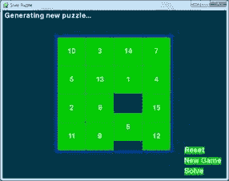
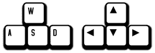
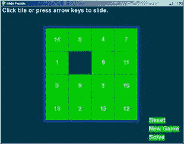
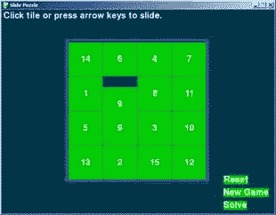

# 第 4 章–幻灯片拼图

> 原文：<http://inventwithpython.com/pygame/chapter4.html>



棋盘是一个 4x4 的格子，有 15 块瓷砖(从左到右编号为 1 到 15)和一个空格。瓷砖从随机位置开始，玩家必须四处滑动瓷砖，直到瓷砖回到原来的顺序。

这个源代码可以从[【http://invpy.com/slidepuzzle.py】](http://invpy.com/slidepuzzle.py)下载。如果您得到任何错误消息，请查看错误消息中提到的行号，并检查您的代码是否有任何拼写错误。你也可以在 http://invpy.com/diff/slidepuzzle将你的代码复制粘贴到 web 表单中，看看你的代码和书中的代码是否有区别。

```py
1\. # Slide Puzzle
2\. # By Al Sweigart [[email protected]](/cdn-cgi/l/email-protection)
3\. # http://inventwithpython.com/pygame
4\. # Creative Commons BY-NC-SA 3.0 US
5\. 
6\. import
pygame, sys, random
7\. from
pygame.locals import *
8\. 
9\. # Create the constants (go ahead and experiment with
different values)
10\. BOARDWIDTH
= 4  # number of columns in the board
11\. BOARDHEIGHT
= 4 # number of rows in the board
12\. TILESIZE
= 80
13\. WINDOWWIDTH
= 640
14\. WINDOWHEIGHT
= 480
15\. FPS
= 30
16\. BLANK
= None
17\. 
18\. #                 R    G    B
19\. BLACK
=         (  0,   0,   0)
20\. WHITE
=         (255, 255, 255)
21\. BRIGHTBLUE
=    (  0,  50, 255)
22\. DARKTURQUOISE
= (  3,  54,  73)
23\. GREEN
=         (  0, 204,   0)
24\. 
25\. BGCOLOR
= DARKTURQUOISE
26\. TILECOLOR
= GREEN
27\. TEXTCOLOR
= WHITE
28\. BORDERCOLOR
= BRIGHTBLUE
29\. BASICFONTSIZE
= 20
30\. 
31\. BUTTONCOLOR
= WHITE
32\. BUTTONTEXTCOLOR
= BLACK
33\. MESSAGECOLOR
= WHITE
34\. 
35\. XMARGIN
= int((WINDOWWIDTH - (TILESIZE * BOARDWIDTH + (BOARDWIDTH - 1))) / 2)
36\. YMARGIN
= int((WINDOWHEIGHT - (TILESIZE * BOARDHEIGHT + (BOARDHEIGHT - 1))) / 2)
37\. 
38\. UP
= 'up'
39\. DOWN
= 'down'
40\. LEFT
= 'left'
41\. RIGHT
= 'right'
42\. 
43\. def
main():
44\.     global
FPSCLOCK, DISPLAYSURF, BASICFONT, RESET_SURF, RESET_RECT, NEW_SURF, NEW_RECT,
SOLVE_SURF, SOLVE_RECT
45\. 
46\.     pygame.init()
47\.     FPSCLOCK
= pygame.time.Clock()
48\.     DISPLAYSURF
= pygame.display.set_mode((WINDOWWIDTH, WINDOWHEIGHT))
49\.     pygame.display.set_caption('Slide
Puzzle')
50\.     BASICFONT
= pygame.font.Font('freesansbold.ttf', BASICFONTSIZE)
51\. 
52\.     # Store the option buttons and their rectangles in
OPTIONS.
53\.     RESET_SURF,
RESET_RECT = makeText('Reset',    TEXTCOLOR, TILECOLOR, WINDOWWIDTH - 120,
WINDOWHEIGHT - 90)
54\.     NEW_SURF,
NEW_RECT   = makeText('New Game', TEXTCOLOR, TILECOLOR, WINDOWWIDTH - 120,
WINDOWHEIGHT - 60)

55\.     SOLVE_SURF,
SOLVE_RECT = makeText('Solve',    TEXTCOLOR, TILECOLOR, WINDOWWIDTH - 120,
WINDOWHEIGHT - 30)
56\. 
57\.     mainBoard,
solutionSeq = generateNewPuzzle(80)
58\.     SOLVEDBOARD
= getStartingBoard() # a solved board is the same
as the board in a start state.
59\.     allMoves
= [] # list of moves made from the solved
configuration
60\. 
61\.     while
True: # main game loop
62\.         slideTo
= None # the direction, if any, a tile should
slide
63\.         msg
= '' # contains the message to show in the upper
left corner.
64\.         if
mainBoard == SOLVEDBOARD:
65\.             msg
= 'Solved!'
66\. 
67\.         drawBoard(mainBoard,
msg)
68\. 
69\.         checkForQuit()
70\.         for
event in pygame.event.get(): # event handling
loop
71\.             if
event.type == MOUSEBUTTONUP:
72\.                 spotx,
spoty = getSpotClicked(mainBoard, event.pos[0], event.pos[1])
73\. 
74\.                 if
(spotx, spoty) == (None, None):
75\.                     # check if the user clicked on an option button
76\.                     if
RESET_RECT.collidepoint(event.pos):
77\.                         resetAnimation(mainBoard,
allMoves) # clicked on Reset button
78\.                         allMoves
= []
79\.                     elif
NEW_RECT.collidepoint(event.pos):
80\.                         mainBoard,
solutionSeq = generateNewPuzzle(80) # clicked on
New Game button
81\.                         allMoves
= []
82\.                     elif
SOLVE_RECT.collidepoint(event.pos):
83\.                         resetAnimation(mainBoard,
solutionSeq + allMoves) # clicked on Solve button
84\.                         allMoves
= []
85\.                 else:
86\.                     # check if the clicked tile was next to the blank spot
87\. 
88\.                     blankx,
blanky = getBlankPosition(mainBoard)
89\.                     if
spotx == blankx + 1 and spoty == blanky:
90\.                         slideTo
= LEFT
91\.                     elif
spotx == blankx - 1 and spoty == blanky:
92\.                         slideTo
= RIGHT
93\.                     elif
spotx == blankx and spoty == blanky + 1:
94\.                         slideTo
= UP
95\.                     elif
spotx == blankx and spoty == blanky - 1:
96\.                         slideTo
= DOWN
97\. 
98\.             elif
event.type == KEYUP:
99\.                 # check if the user pressed a key to slide a tile
100\.                 if
event.key in (K_LEFT, K_a) and isValidMove(mainBoard, LEFT):
101\.                     slideTo
= LEFT
102\.                 elif
event.key in (K_RIGHT, K_d) and isValidMove(mainBoard, RIGHT):
103\.                     slideTo
= RIGHT
104\.                 elif
event.key in (K_UP, K_w) and isValidMove(mainBoard, UP):
105\.                     slideTo
= UP
106\.                 elif
event.key in (K_DOWN, K_s) and isValidMove(mainBoard, DOWN):
107\.                     slideTo
= DOWN
108\. 
109\.         if
slideTo:
110\.             slideAnimation(mainBoard,
slideTo, 'Click tile or press arrow keys to slide.', 8) # show slide on screen
111\.             makeMove(mainBoard,
slideTo)
112\.             allMoves.append(slideTo)
# record the slide
113\.         pygame.display.update()
114\.         FPSCLOCK.tick(FPS)
115\. 
116\. 
117\. def
terminate():
118\.     pygame.quit()
119\.     sys.exit()
120\. 
121\. 
122\. def
checkForQuit():
123\.     for
event in pygame.event.get(QUIT): # get all the
QUIT events
124\.         terminate()
# terminate if any QUIT events are present
125\.     for
event in pygame.event.get(KEYUP): # get all the
KEYUP events
126\.         if
event.key == K_ESCAPE:
127\.             terminate()
# terminate if the KEYUP event was for the Esc
key
128\.         pygame.event.post(event)
# put the other KEYUP event objects back
129\. 
130\. 
131\. def
getStartingBoard():
132\.     # Return a board data structure with tiles in the
solved state.
133\.     # For example, if BOARDWIDTH and BOARDHEIGHT are both
3, this function
134\.     # returns [[1, 4, 7], [2, 5, 8], [3, 6, None]]
135\.     counter
= 1
136\.     board
= []
137\.     for
x in range(BOARDWIDTH):
138\.         column
= []
139\.         for
y in range(BOARDHEIGHT):
140\.             column.append(counter)
141\.             counter
+= BOARDWIDTH
142\.         board.append(column)
143\.         counter
-= BOARDWIDTH * (BOARDHEIGHT - 1) + BOARDWIDTH - 1
144\. 
145\.     board[BOARDWIDTH-1][BOARDHEIGHT-1]
= None
146\.     return
board
147\. 
148\. 
149\. def
getBlankPosition(board):
150\.     # Return the x and y of board coordinates of the blank
space.
151\.     for
x in range(BOARDWIDTH):
152\.         for
y in range(BOARDHEIGHT):
153\.             if
board[x][y] == None:
154\.                 return
(x, y)
155\. 
156\. 
157\. def
makeMove(board, move):
158\.     # This function does not check if the move is valid.
159\.     blankx,
blanky = getBlankPosition(board)
160\. 
161\.     if
move == UP:
162\.         board[blankx][blanky],
board[blankx][blanky + 1] = board[blankx][blanky + 1], board[blankx][blanky]
163\.     elif
move == DOWN:
164\.         board[blankx][blanky],
board[blankx][blanky - 1] = board[blankx][blanky - 1], board[blankx][blanky]
165\.     elif
move == LEFT:
166\.         board[blankx][blanky],
board[blankx + 1][blanky] = board[blankx + 1][blanky], board[blankx][blanky]
167\.     elif
move == RIGHT:
168\.         board[blankx][blanky],
board[blankx - 1][blanky] = board[blankx - 1][blanky], board[blankx][blanky]
169\. 
170\. 
171\. def
isValidMove(board, move):
172\.     blankx,
blanky = getBlankPosition(board)
173\.     return
(move == UP and blanky != len(board[0]) - 1) or \
174\.            (move
== DOWN and blanky != 0) or \
175\.            (move
== LEFT and blankx != len(board) - 1) or \
176\.            (move
== RIGHT and blankx != 0)
177\. 
178\. 
179\. def
getRandomMove(board, lastMove=None):
180\.     # start with a full list of all four moves
181\.     validMoves
= [UP, DOWN, LEFT, RIGHT]
182\. 
183\.     # remove moves from the list as they are disqualified
184\.     if
lastMove == UP or not isValidMove(board, DOWN):
185\.         validMoves.remove(DOWN)
186\.     if
lastMove == DOWN or not isValidMove(board, UP):
187\.         validMoves.remove(UP)
188\.     if
lastMove == LEFT or not isValidMove(board, RIGHT):
189\.         validMoves.remove(RIGHT)
190\.     if
lastMove == RIGHT or not isValidMove(board, LEFT):
191\.         validMoves.remove(LEFT)
192\. 
193\.     # return a random move from the list of remaining moves
194\.     return
random.choice(validMoves)
195\. 
196\. 
197\. def
getLeftTopOfTile(tileX, tileY):
198\.     left
= XMARGIN + (tileX * TILESIZE) + (tileX - 1)
199\.     top
= YMARGIN + (tileY * TILESIZE) + (tileY - 1)
200\.     return
(left, top)
201\. 
202\. 
203\. def
getSpotClicked(board, x, y):
204\.     # from the x & y pixel coordinates, get the x &
y board coordinates
205\.     for
tileX in range(len(board)):
206\.         for
tileY in range(len(board[0])):
207\.             left,
top = getLeftTopOfTile(tileX, tileY)
208\.             tileRect
= pygame.Rect(left, top, TILESIZE, TILESIZE)
209\.             if
tileRect.collidepoint(x, y):
210\.                 return
(tileX, tileY)
211\.     return
(None, None)
212\. 
213\. 
214\. def
drawTile(tilex, tiley, number, adjx=0, adjy=0):
215\.     # draw a tile at board coordinates tilex and tiley,
optionally a few
216\.     # pixels over (determined by adjx and adjy)
217\.     left,
top = getLeftTopOfTile(tilex, tiley)
218\.     pygame.draw.rect(DISPLAYSURF,
TILECOLOR, (left + adjx, top + adjy, TILESIZE, TILESIZE))
219\.     textSurf
= BASICFONT.render(str(number), True, TEXTCOLOR)
220\.     textRect
= textSurf.get_rect()
221\.     textRect.center
= left + int(TILESIZE / 2) + adjx, top + int(TILESIZE / 2) + adjy
222\.     DISPLAYSURF.blit(textSurf,
textRect)
223\. 
224\. 
225\. def
makeText(text, color, bgcolor, top, left):
226\.     # create the Surface and Rect objects for some text.
227\.     textSurf
= BASICFONT.render(text, True, color, bgcolor)
228\.     textRect
= textSurf.get_rect()
229\.     textRect.topleft
= (top, left)
230\.     return
(textSurf, textRect)
231\. 
232\. 
233\. def
drawBoard(board, message):
234\.     DISPLAYSURF.fill(BGCOLOR)
235\.     if
message:
236\.         textSurf,
textRect = makeText(message, MESSAGECOLOR, BGCOLOR, 5, 5)
237\.         DISPLAYSURF.blit(textSurf,
textRect)
238\. 
239\.     for
tilex in range(len(board)):
240\.         for
tiley in range(len(board[0])):
241\.             if
board[tilex][tiley]:
242\.                 drawTile(tilex,
tiley, board[tilex][tiley])
243\. 
244\.     left,
top = getLeftTopOfTile(0, 0)
245\.     width
= BOARDWIDTH * TILESIZE
246\.     height
= BOARDHEIGHT * TILESIZE
247\.     pygame.draw.rect(DISPLAYSURF,
BORDERCOLOR, (left - 5, top - 5, width + 11, height + 11), 4)
248\. 
249\.     DISPLAYSURF.blit(RESET_SURF,
RESET_RECT)
250\.     DISPLAYSURF.blit(NEW_SURF,
NEW_RECT)
251\.     DISPLAYSURF.blit(SOLVE_SURF,
SOLVE_RECT)
252\. 
253\. 
254\. def
slideAnimation(board, direction, message, animationSpeed):
255\.     # Note: This function does not check if the move is
valid.
256\. 
257\.     blankx,
blanky = getBlankPosition(board)
258\.     if
direction == UP:
259\.         movex
= blankx
260\.         movey
= blanky + 1
261\.     elif
direction == DOWN:
262\.         movex
= blankx
263\.         movey
= blanky - 1
264\.     elif
direction == LEFT:
265\.         movex
= blankx + 1
266\.         movey
= blanky
267\.     elif
direction == RIGHT:
268\.         movex
= blankx - 1
269\.         movey
= blanky
270\. 
271\.     # prepare the base surface
272\.     drawBoard(board,
message)
273\.     baseSurf
= DISPLAYSURF.copy()
274\.     # draw a blank space over the moving tile on the
baseSurf Surface.
275\.     moveLeft,
moveTop = getLeftTopOfTile(movex, movey)
276\.     pygame.draw.rect(baseSurf,
BGCOLOR, (moveLeft, moveTop, TILESIZE, TILESIZE))
277\. 
278\.     for
i in range(0, TILESIZE, animationSpeed):
279\.         # animate the tile sliding over
280\.         checkForQuit()
281\.         DISPLAYSURF.blit(baseSurf,
(0, 0))
282\.         if
direction == UP:
283\.             drawTile(movex,
movey, board[movex][movey], 0, -i)
284\.         if
direction == DOWN:
285\.             drawTile(movex,
movey, board[movex][movey], 0, i)
286\.         if
direction == LEFT:
287\.             drawTile(movex,
movey, board[movex][movey], -i, 0)
288\.         if
direction == RIGHT:
289\.             drawTile(movex,
movey, board[movex][movey], i, 0)
290\. 
291\.         pygame.display.update()
292\.         FPSCLOCK.tick(FPS)
293\. 
294\. 
295\. def
generateNewPuzzle(numSlides):
296\.     # From a starting configuration, make numSlides number
of moves (and
297\.     # animate these moves).
298\.     sequence
= []
299\.     board
= getStartingBoard()
300\.     drawBoard(board,
'')
301\.     pygame.display.update()
302\.     pygame.time.wait(500)
# pause 500 milliseconds for effect
303\.     lastMove
= None
304\.     for
i in range(numSlides):
305\.         move
= getRandomMove(board, lastMove)
306\.         slideAnimation(board,
move, 'Generating new puzzle...', int(TILESIZE / 3))
307\.         makeMove(board,
move)
308\.         sequence.append(move)
309\.         lastMove
= move
310\.     return
(board, sequence)
311\. 
312\. 
313\. def
resetAnimation(board, allMoves):
314\.     # make all of the moves in allMoves in reverse.
315\.     revAllMoves
= allMoves[:] # gets a copy of the list
316\.     revAllMoves.reverse()
317\. 
318\.     for
move in revAllMoves:
319\.         if
move == UP:
320\.             oppositeMove
= DOWN
321\.         elif
move == DOWN:
322\.             oppositeMove
= UP
323\.         elif
move == RIGHT:
324\.             oppositeMove
= LEFT
325\.         elif
move == LEFT:
326\.             oppositeMove
= RIGHT
327\.         slideAnimation(board,
oppositeMove, '', int(TILESIZE / 2))
328\.         makeMove(board,
oppositeMove)
329\. 
330\. 
331\. if
__name__ == '__main__':
332\.     main()
```

Wormy 中的大部分代码与我们之前看过的游戏相似，尤其是在代码开头设置的常量。

```py
1\. # Slide Puzzle
2\. # By Al Sweigart [[email protected]](/cdn-cgi/l/email-protection)
3\. # http://inventwithpython.com/pygame
4\. # Creative Commons BY-NC-SA 3.0 US
5\. 
6\. import
pygame, sys, random
7\. from
pygame.locals import *
8\. 
9\. # Create the constants (go ahead and experiment with
different values)
10\. BOARDWIDTH
= 4  # number of columns in the board
11\. BOARDHEIGHT
= 4 # number of rows in the board
12\. TILESIZE
= 80
13\. WINDOWWIDTH
= 640
14\. WINDOWHEIGHT
= 480
15\. FPS
= 30
16\. BLANK
= None
17\. 
18\. #                 R    G    B
19\. BLACK
=         (  0,   0,   0)
20\. WHITE
=         (255, 255, 255)
21\. BRIGHTBLUE
=    (  0,  50, 255)
22\. DARKTURQUOISE
= (  3,  54,  73)
23\. GREEN
=         (  0, 204,   0)
24\. 
25\. BGCOLOR
= DARKTURQUOISE
26\. TILECOLOR
= GREEN
27\. TEXTCOLOR
= WHITE
28\. BORDERCOLOR
= BRIGHTBLUE
29\. BASICFONTSIZE
= 20
30\. 
31\. BUTTONCOLOR
= WHITE
32\. BUTTONTEXTCOLOR
= BLACK
33\. MESSAGECOLOR
= WHITE
34\. 
35\. XMARGIN
= int((WINDOWWIDTH - (TILESIZE * BOARDWIDTH + (BOARDWIDTH - 1))) / 2)
36\. YMARGIN
= int((WINDOWHEIGHT - (TILESIZE * BOARDHEIGHT + (BOARDHEIGHT - 1))) / 2)
37\. 
38\. UP
= 'up'
39\. DOWN
= 'down'
40\. LEFT
= 'left'
41\. RIGHT
= 'right'
```

程序顶部的这段代码只是处理所有基本的模块导入和创建常量。这就像上一章记忆拼图游戏的开始。

```py
43\. def
main():
44\.     global
FPSCLOCK, DISPLAYSURF, BASICFONT, RESET_SURF, RESET_RECT, NEW_SURF, NEW_RECT,
SOLVE_SURF, SOLVE_RECT
45\. 
46\.     pygame.init()
47\.     FPSCLOCK
= pygame.time.Clock()
48\.     DISPLAYSURF
= pygame.display.set_mode((WINDOWWIDTH, WINDOWHEIGHT))
49\.     pygame.display.set_caption('Slide
Puzzle')
50\.     BASICFONT
= pygame.font.Font('freesansbold.ttf', BASICFONTSIZE)
51\. 
52\.     # Store the option buttons and their rectangles in
OPTIONS.
53\.     RESET_SURF,
RESET_RECT = makeText('Reset',    TEXTCOLOR, TILECOLOR, WINDOWWIDTH - 120,
WINDOWHEIGHT - 90)
54\.     NEW_SURF,
NEW_RECT   = makeText('New Game', TEXTCOLOR, TILECOLOR, WINDOWWIDTH - 120,
WINDOWHEIGHT - 60)
55\.     SOLVE_SURF,
SOLVE_RECT = makeText('Solve',    TEXTCOLOR, TILECOLOR, WINDOWWIDTH - 120,
WINDOWHEIGHT - 30)
56\. 
57\.     mainBoard,
solutionSeq = generateNewPuzzle(80)
58\.     SOLVEDBOARD
= getStartingBoard() # a solved board is the same
as the board in a start state.
```

就像上一章一样，从`main()`函数调用中调用的函数将在本章后面解释。现在，你只需要知道它们做什么，它们返回什么值。你不需要知道它们是如何工作的。

函数的第一部分将处理创建窗口、时钟对象和字体对象。在程序的后面定义了`makeText()`函数，但是现在你只需要知道它返回一个`pygame.Surface`对象和`pygame.Rect`对象，它们可以用来制作可点击的按钮。幻灯片拼图游戏将有三个按钮:一个“重置”按钮，将撤销玩家所做的任何移动，“新建”按钮，将创建一个新的幻灯片拼图，以及一个“解决”按钮，将为玩家解决难题。

对于这个程序，我们需要两个板数据结构。一块板子将代表当前的游戏状态。另一个棋盘的牌将处于“已解决”状态，这意味着所有的牌都按顺序排列。当当前游戏状态的棋盘与解决的棋盘完全相同时，我们就知道玩家赢了。(我们永远不会改变第二个。它只是用来比较当前的游戏状态。)

`generateNewPuzzle()`将创建一个棋盘数据结构，它从有序的、已解决的状态开始，然后在其上执行 80 次随机滑动(因为我们将整数`80`传递给它。如果我们希望棋盘更加混乱，那么我们可以给它传递一个更大的整数)。这将使棋盘进入一种玩家必须解决的随机混乱状态(这将存储在一个名为`mainBoard`的变量中)。`generateNewBoard()`还会返回一个列表，列出所有在上面执行的随机移动(这些移动会存储在一个名为`solutionSeq`的变量中)。

```py
59\.     allMoves
= [] # list of moves made from the solved
configuration
```

解决一个幻灯片难题可能真的很棘手。我们可以给计算机编程来做这件事，但这需要我们找出一种算法来解决这个幻灯片难题。这将是非常困难的，需要投入大量的智慧和努力。

幸运的是，有一个更简单的方法。我们可以让计算机记住它在创建棋盘数据结构时制作的所有随机幻灯片，然后通过执行相反的幻灯片就可以求解棋盘。由于棋盘最初是在已解决状态下开始的，撤销所有幻灯片会使它返回到已解决状态。

例如，下面我们在页面左侧的白板上执行“右”滑动，使白板处于页面右侧的状态:


在右滑动之后，如果我们做相反的滑动(左滑动),那么棋盘将回到初始状态。所以要在几张幻灯片之后回到原来的状态，我们只需要以相反的顺序做相反的幻灯片。如果我们向右滑动，然后再向右滑动，然后向下滑动，我们就必须向上滑动，向左滑动，再向左滑动来撤销前三个滑动。这比编写一个函数简单地通过查看它们的当前状态来解决这些难题要容易得多。

```py
61\.     while
True: # main game loop
62\.         slideTo
= None # the direction, if any, a tile should
slide
63\.         msg
= '' # contains the message to show in the upper
left corner.
64\.         if
mainBoard == SOLVEDBOARD:
65\.             msg
= 'Solved!'
66\. 
67\.         drawBoard(mainBoard,
msg)
```

在主游戏循环中，`slideTo`变量将跟踪玩家想要滑动瓷砖的方向(它在游戏循环开始时作为`None`开始，并在稍后设置)，而`msg`变量跟踪在窗口顶部显示什么字符串。程序在第 64 行进行快速检查，查看板数据结构是否与`SOLVEDBOARD`中存储的已求解板数据结构具有相同的值。如果是，那么`msg`变量被改变为字符串`'Solved!'`。这不会出现在屏幕上，直到`drawBoard()`被调用以将它绘制到`DISPLAYSURF`表面对象(在第 67 行完成),并且`pygame.display.update()`被调用以在实际的计算机屏幕上绘制显示表面对象(在游戏循环结束时在第 291 行完成)。

```py
69\.         checkForQuit()
70\.         for
event in pygame.event.get(): # event handling
loop
71\.             if
event.type == MOUSEBUTTONUP:
72\.                 spotx,
spoty = getSpotClicked(mainBoard, event.pos[0], event.pos[1])
73\. 
74\.                 if
(spotx, spoty) == (None, None):
75\.                     # check if the user clicked on an option button
76\.                     if
RESET_RECT.collidepoint(event.pos):
77\.                         resetAnimation(mainBoard,
allMoves) # clicked on Reset button
78\.                         allMoves
= []
79\.                     elif
NEW_RECT.collidepoint(event.pos):
80\.                         mainBoard,
solutionSeq = generateNewPuzzle(80) # clicked on
New Game button
81\.                         allMoves
= []
82\.                     elif
SOLVE_RECT.collidepoint(event.pos):
83\.                         resetAnimation(mainBoard,
solutionSeq + allMoves) # clicked on Solve button
84\.                         allMoves
= []
```

在进入事件循环之前，程序调用第 69 行上的`checkForQuit()`来查看是否有任何`QUIT`事件被创建(如果有，则终止程序)。为什么我们有一个单独的函数(`checkForQuit()`函数)来处理`QUIT`事件将在后面解释。第 70 行的`for`循环执行自上次`pygame.event.get()`被调用以来(或者自程序启动以来，如果`pygame.event.get()`以前从未被调用过)创建的任何其他事件的事件处理代码。

如果事件的类型是一个`MOUSEBUTTONUP`事件(也就是说，玩家在窗口的某个地方释放了鼠标按钮)，那么我们将鼠标坐标传递给我们的`getSpotClicked()`函数，该函数将返回发生鼠标释放的位置的坐标。`event.pos[0]`是 X 坐标，`event.pos[1]`是 Y 坐标。

如果鼠标按钮的释放没有发生在棋盘上的某个空格上(但显然仍然发生在窗口的某个地方，因为创建了一个`MOUSEBUTTONUP`事件)，那么`getSpotClicked()`将返回`None`。如果是这种情况，我们要做一个额外的检查，看看玩家是否点击了重置、新建或求解按钮(这些按钮不在板上)。

这些按钮在窗口上的坐标存储在`pygame.Rect`对象中，这些对象存储在`RESET_RECT`、`NEW_RECT`和`SOLVE_RECT`变量中。我们可以将鼠标坐标从事件对象传递给`collidepoint()`方法。如果鼠标坐标在 Rect 对象的区域内，该方法将返回`True`，否则返回`False`。

```py
85\.                 else:
86\.                     # check if the clicked tile was next to the blank spot
87\. 
88\.                     blankx,
blanky = getBlankPosition(mainBoard)
89\.                     if
spotx == blankx + 1 and spoty == blanky:
90\.                         slideTo
= LEFT
91\.                     elif
spotx == blankx - 1 and spoty == blanky:
92\.                         slideTo
= RIGHT
93\.                     elif
spotx == blankx and spoty == blanky + 1:
94\.                         slideTo
= UP
95\.                     elif
spotx == blankx and spoty == blanky - 1:
96\.                         slideTo
= DOWN
```

如果`getSpotClicked()`没有返回`(None, None)`，那么它将返回一个由两个整数值组成的元组，表示被点击的棋盘上的点的 X 和 Y 坐标。然后第 89 到 96 行的`if`和`elif`语句检查被点击的点是否是空白点旁边的块(否则块将没有滑动的地方)。

我们的`getBlankPosition()`函数将获取电路板数据结构，并返回空白点的 X 和 Y 电路板坐标，我们将这些坐标存储在变量`blankx`和`blanky`中。如果用户点击的位置是在空白区域的旁边，我们用值设置变量`slideTo`来表示磁贴应该滑动。

```py
98\.             elif
event.type == KEYUP:
99\.                 # check if the user pressed a key to slide a tile
100\.                 if
event.key in (K_LEFT, K_a) and isValidMove(mainBoard, LEFT):
101\.                     slideTo
= LEFT
102\.                 elif
event.key in (K_RIGHT, K_d) and isValidMove(mainBoard, RIGHT):
103\.                     slideTo
= RIGHT
104\.                 elif
event.key in (K_UP, K_w) and isValidMove(mainBoard, UP):
105\.                     slideTo
= UP
106\.                 elif
event.key in (K_DOWN, K_s) and isValidMove(mainBoard, DOWN):
107\.                     slideTo
= DOWN
```

我们也可以让用户通过按键盘上的键来滑动瓷砖。第 100 到 107 行的`if`和`elif`语句让用户通过按箭头键或 WASD 键(稍后解释)来设置`slideTo`变量。每个`if`和`elif`语句都有一个对`isValidMove()`的调用，以确保瓷砖可以在那个方向滑动。(我们不需要用鼠标点击来进行这个调用，因为对相邻空白区域的检查做了同样的事情。)

## 的绝招`in`算符

表达式`event.key in (K_LEFT, K_a)`只是 Python 的一个技巧，让代码更简单。这是“如果`event.key`等于`K_LEFT`或`K_a`之一，则评估为`True`”的一种说法。以下两个表达式的计算方式完全相同:

event.key in (K_LEFT，K_a)

event.key == K_LEFT 或 event.key == K_a

当您必须检查一个值是否等于多个值中的一个时，使用这个技巧确实可以节省一些空间。以下两个表达式的计算方式完全相同:

spam == '狗'或 spam == '猫'或 spam == '老鼠'或 spam == '马'或 spam == 42 或 spam == '野狗'

垃圾邮件('狗'，'猫'，'老鼠'，'马'，42，'野狗')

W、A、S 和 D 键(统称为 WASD 键，发音为“waz-dee”)通常在计算机游戏中使用，与箭头键做相同的事情，只是玩家可以用左手代替(因为 WASD 键在键盘的左侧)。w 代表向上，A 代表向左，S 代表向下，D 代表向右。您很容易记住这一点，因为 WASD 键与箭头键具有相同的布局:



```py
109\.         if
slideTo:
110\.             slideAnimation(mainBoard,
slideTo, 'Click tile or press arrow keys to slide.', 8) # show slide on screen
111\.             makeMove(mainBoard,
slideTo)
112\.             allMoves.append(slideTo)
# record the slide
113\.         pygame.display.update()
114\.         FPSCLOCK.tick(FPS)
```

现在事件都已经处理好了，我们应该更新游戏状态的变量，并在屏幕上显示新的状态。如果`slideTo`已经被设置(通过鼠标事件或键盘事件处理代码)，那么我们可以调用`slideAnimation()`来执行滑动动画。这些参数是棋盘数据结构、滑动方向、滑动磁贴时显示的消息以及滑动速度。

在它返回之后，我们需要更新实际的板数据结构(这是由`makeMove()`函数完成的),然后将幻灯片添加到到到目前为止制作的所有幻灯片的`allMoves`列表中。这样做是为了如果玩家点击“重置”按钮，我们知道如何撤销玩家的所有幻灯片。

```py
117\. def
terminate():
118\.     pygame.quit()
119\.     sys.exit()
```

这是一个我们可以调用的函数，它同时调用了`pygame.quit()`和`sys.exit()`函数。这是一点语法上的好处，这样我们就不用记住同时调用这两个函数，而只需要调用一个函数。

```py
122\. def
checkForQuit():
123\.     for
event in pygame.event.get(QUIT): # get all the
QUIT events
124\.         terminate()
# terminate if any QUIT events are present
125\.     for
event in pygame.event.get(KEYUP): # get all the
KEYUP events
126\.         if
event.key == K_ESCAPE:
127\.             terminate()
# terminate if the KEYUP event was for the Esc
key
128\.         pygame.event.post(event)
# put the other KEYUP event objects back
```

`checkForQuit()`函数将检查`QUIT`事件(或者用户是否按了 Esc 键),然后调用`terminate()`函数。但是这有点棘手，需要一些解释。

Pygame 内部有自己的列表数据结构，它创建并在创建事件对象时附加事件对象。这个数据结构被称为事件队列。当不带参数调用`pygame.event.get()`函数时，返回整个列表。然而，您可以向`pygame.event.get()`传递一个类似于`QUIT`的常量，这样它将只返回内部事件队列中的`QUIT`事件(如果有的话)。其余的事件将留在事件队列中，等待下一次调用`pygame.event.get()`。

您应该注意到 Pygame 的事件队列最多只能存储 127 个事件对象。如果你的程序调用`pygame.event.get()`不够频繁，队列被填满，那么任何新发生的事件都不会被添加到事件队列中。

第 123 行从 Pygame 的事件队列中取出一个`QUIT`事件列表并返回它们。如果事件队列中有任何`QUIT`事件，程序终止。

第 125 行从事件队列中取出所有的`KEYUP`事件，并检查它们中是否有任何一个是针对 Esc 键的。如果其中一个事件为，则程序终止。然而，除了 Esc 键之外，可能还有其他键的`KEYUP`事件。在这种情况下，我们需要将`KEYUP`事件放回 Pygame 的事件队列中。我们可以使用`pygame.event.post()`函数来实现这一点，该函数将传递给它的事件对象添加到 Pygame 事件队列的末尾。这样，当第 70 行调用`pygame.event.get()`时，非 Esc 键`KEYUP`事件将仍然存在。否则对`checkForQuit()`的调用将“消耗”所有的`KEYUP`事件，这些事件将永远不会被处理。

如果您希望您的程序将事件对象添加到 Pygame 事件队列中，那么`pygame.event.post()`函数也很方便。

```py
131\. def
getStartingBoard():
132\.     # Return a board data structure with tiles in the
solved state.
133\.     # For example, if BOARDWIDTH and BOARDHEIGHT are both
3, this function
134\.     # returns [[1, 4, 7], [2, 5, 8], [3, 6, None]]
135\.     counter
= 1
136\.     board
= []
137\.     for
x in range(BOARDWIDTH):
138\.         column
= []
139\.         for
y in range(BOARDHEIGHT):
140\.             column.append(counter)
141\.             counter
+= BOARDWIDTH
142\.         board.append(column)
143\.         counter
-= BOARDWIDTH * (BOARDHEIGHT - 1) + BOARDWIDTH - 1
144\. 
145\.     board[BOARDWIDTH-1][BOARDHEIGHT-1]
= None
146\.     return
board
```

`getStartingBoard()`数据结构将创建并返回一个代表“已解决”棋盘的数据结构，其中所有编号的方块都按顺序排列，空白方块位于右下角。这是通过嵌套的`for`循环完成的，就像记忆拼图游戏中的棋盘数据结构一样。

但是，注意第一列不是`[1, 2, 3]`，而是`[1, 4, 7]`。这是因为瓷砖上的数字是沿行增加 1，而不是沿列增加 1。沿着列往下，数字增加了棋盘的宽度(存储在`BOARDWIDTH`常量中)。我们将使用`counter`变量来跟踪下一个图块上应该出现的数字。当一列中的图块编号完成后，我们需要将`counter`设置为下一列开始时的编号。

```py
149\. def
getBlankPosition(board):
150\.     # Return the x and y of board coordinates of the blank
space.
151\.     for
x in range(BOARDWIDTH):
152\.         for
y in range(BOARDHEIGHT):
153\.             if
board[x][y] == None:
154\.                 return
(x, y)
```

每当我们的代码需要找到空白空间的 XY 坐标时，我们可以创建一个函数遍历整个棋盘并找到空白空间的坐标，而不是在每张幻灯片后跟踪空白空间的位置。在板卡数据结构中使用`None`值来表示空白空间。`getBlankPosition()`中的代码简单地使用嵌套的`for`循环来查找棋盘上的哪个空格是空白空格。

```py
157\. def
makeMove(board, move):
158\.     # This function does not check if the move is valid.
159\.     blankx,
blanky = getBlankPosition(board)
160\. 
161\.     if
move == UP:
162\.         board[blankx][blanky],
board[blankx][blanky + 1] = board[blankx][blanky + 1], board[blankx][blanky]
163\.     elif
move == DOWN:
164\.         board[blankx][blanky],
board[blankx][blanky - 1] = board[blankx][blanky - 1], board[blankx][blanky]
165\.     elif
move == LEFT:
166\.         board[blankx][blanky],
board[blankx + 1][blanky] = board[blankx + 1][blanky], board[blankx][blanky]
167\.     elif
move == RIGHT:
168\.         board[blankx][blanky],
board[blankx - 1][blanky] = board[blankx - 1][blanky], board[blankx][blanky]
```

board 参数中的数据结构是一个 2D 列表，表示所有图块的位置。每当玩家移动时，程序需要更新这个数据结构。发生的情况是，图块的值与空白空间的值交换。

`makeMove()`函数不必返回任何值，因为`board`参数有一个为其参数传递的列表引用。这意味着我们在这个函数中对`board`所做的任何更改都将被应用到传递给`makeMove()`的列表值中。(你可以在 http://invpy.com/references 的 [复习参考文献的概念。)](http://invpy.com/references)

```py
171\. def
isValidMove(board, move):
172\.     blankx,
blanky = getBlankPosition(board)
173\.     return
(move == UP and blanky != len(board[0]) - 1) or \
174\.            (move
== DOWN and blanky != 0) or \
175\.            (move
== LEFT and blankx != len(board) - 1) or \
176\.            (move
== RIGHT and blankx != 0)
```

向`isValidMove()`函数传递一个棋盘数据结构和玩家想要走的一步棋。如果这种移动是可能的，返回值是`True`，否则返回值是`False`。例如，您不能连续向左滑动一百次瓷砖，因为最终空白空间将位于边缘，并且没有更多瓷砖可向左滑动。

一个走法是否有效，取决于空格在哪里。该函数调用`getBlankPosition()`找到空白点的 X 和 Y 坐标。第 173 到 176 行是一个带有单个表达式的`return`语句。前三行末尾的`\`斜线告诉 Python 解释器这不是代码行的结尾(即使它在代码行的末尾)。这将让我们把一个“代码行”分成多行，看起来很漂亮，而不是只有一个很长的不可读的行。

因为括号中的表达式部分由 or 运算符连接，所以只需要其中一个运算符为`True`，整个表达式就为`True`。这些部分中的每一个都检查预期的移动是什么，然后查看空白空间的坐标是否允许该移动。

```py
179\. def
getRandomMove(board, lastMove=None):
180\.     # start with a full list of all four moves
181\.     validMoves
= [UP, DOWN, LEFT, RIGHT]
182\. 
183\.     # remove moves from the list as they are disqualified
184\.     if
lastMove == UP or not isValidMove(board, DOWN):
185\.         validMoves.remove(DOWN)
186\.     if
lastMove == DOWN or not isValidMove(board, UP):
187\.         validMoves.remove(UP)
188\.     if
lastMove == LEFT or not isValidMove(board, RIGHT):
189\.         validMoves.remove(RIGHT)
190\.     if
lastMove == RIGHT or not isValidMove(board, LEFT):
191\.         validMoves.remove(LEFT)
192\. 
193\.     # return a random move from the list of remaining moves
194\.     return
random.choice(validMoves)
```

在游戏开始时，我们从已解决的有序状态的棋盘数据结构开始，并通过在瓷砖周围随机滑动来创建谜题。为了决定我们应该向四个方向滑动，我们将调用我们的`getRandomMove()`函数。通常我们可以使用`random.choice()`函数并传递一个元组`(UP, DOWN, LEFT, RIGHT)`，让 Python 为我们随机选择一个方向值。但是滑动拼图游戏有一个小限制，阻止我们选择一个纯随机数。

如果你有一个滑动拼图，向左滑动一个方块，然后向右滑动一个方块，你会得到和开始时完全一样的棋盘。做一张幻灯片后面跟着另一张幻灯片是没有意义的。此外，如果空白区域在右下角，则不可能向上或向左滑动方块。

`getRandomMove()`中的代码会考虑这些因素。为了防止函数选择最后一次移动，函数的调用者可以为参数`lastMove`传递一个方向值。第 181 行以存储在`validMoves`变量中的所有四个方向值的列表开始。从`validMoves`中移除`lastMove`值(如果未设置为`None`)。根据空白区域是否在板的边缘，第 184 到 191 行将从`lastMove`列表中删除其他方向值。

在留在`lastMove`中的值中，通过调用`random.choice()`随机选择其中一个并返回。

```py
197\. def
getLeftTopOfTile(tileX, tileY):
198\.     left
= XMARGIN + (tileX * TILESIZE) + (tileX - 1)
199\.     top
= YMARGIN + (tileY * TILESIZE) + (tileY - 1)
200\.     return
(left, top)
```

`getLeftTopOfTile()`功能将电路板坐标转换为像素坐标。对于传入的电路板 XY 坐标，该函数计算并返回该电路板空间左上角像素的像素 XY 坐标。

```py
203\. def
getSpotClicked(board, x, y):
204\.     # from the x & y pixel coordinates, get the x &
y board coordinates
205\.     for
tileX in range(len(board)):
206\.         for
tileY in range(len(board[0])):
207\.             left,
top = getLeftTopOfTile(tileX, tileY)
208\.             tileRect
= pygame.Rect(left, top, TILESIZE, TILESIZE)
209\.             if
tileRect.collidepoint(x, y):
210\.                 return
(tileX, tileY)
211\.     return
(None, None)
```

`getSpotClicked()`功能与`getLeftTopOfTile()`相反，将像素坐标转换为电路板坐标。第 205 和 206 行上的嵌套循环遍历每一个可能的 XY 板坐标，如果传入的像素坐标在板上的那个空间内，它将返回这些板坐标。由于所有的图块都有一个在`TILESIZE`常量中设置的宽度和高度，我们可以通过获取棋盘空间左上角的像素坐标来创建一个代表棋盘空间的 Rect 对象，然后使用`collidepoint()` Rect 方法来查看像素坐标是否在 Rect 对象的区域内。

如果传入的像素坐标不在任何板空间上，则返回值`(None, None)`。

```py
214\. def
drawTile(tilex, tiley, number, adjx=0, adjy=0):
215\.     # draw a tile at board coordinates tilex and tiley,
optionally a few
216\.     # pixels over (determined by adjx and adjy)
217\.     left,
top = getLeftTopOfTile(tilex, tiley)
218\.     pygame.draw.rect(DISPLAYSURF,
TILECOLOR, (left + adjx, top + adjy, TILESIZE, TILESIZE))
219\.     textSurf
= BASICFONT.render(str(number), True, TEXTCOLOR)
220\.     textRect
= textSurf.get_rect()
221\.     textRect.center
= left + int(TILESIZE / 2) + adjx, top + int(TILESIZE / 2) + adjy
222\.     DISPLAYSURF.blit(textSurf,
textRect)
```

`drawTile()`功能将在板上绘制一个单独编号的方块。`tilex`和`tiley`参数是图块的板坐标。number 参数是图块编号的字符串(如`'3'`或`'12'`)。`adjx`和`adjy`关键字参数用于对图块的位置进行微调。例如，为`adjx`传递`5`将使图块出现在棋盘上`tilex`和`tiley`空间右侧的 5 个像素处。为`adjx`传递`-10`将使图块出现在空间左侧 10 个像素处。

当我们需要在滑动过程中绘制图块时，这些调整值会很方便。如果在调用`drawTile()`时没有为这些参数传递值，那么默认情况下它们被设置为`0`。这意味着它们将正好在`tilex`和`tiley`给出的棋盘空间上。

Pygame 绘图函数只使用像素坐标，所以第一行 217 将`tilex`和`tiley`中的棋盘坐标转换为像素坐标，我们将把它存储在变量`left`和`top`中(因为`getLeftTopOfTile()`返回左上角的坐标)。我们通过调用`pygame.draw.rect()`来绘制图块的背景正方形，同时将`adjx`和`adjy`的值添加到`left`和`top`中，以防代码需要调整图块的位置。

然后，第 219 到 222 行创建表面对象，其上绘制了数字文本。定位表面对象的 Rect 对象，然后使用它将表面对象 blit 到显示表面。`drawTile()`函数不调用`pygame.display.update()`函数，因为`drawTile()`的调用者可能会想在让它们出现在屏幕上之前为棋盘的其余部分绘制更多的方块。

```py
225\. def
makeText(text, color, bgcolor, top, left):
226\.     # create the Surface and Rect objects for some text.
227\.     textSurf
= BASICFONT.render(text, True, color, bgcolor)
228\.     textRect
= textSurf.get_rect()
229\.     textRect.topleft
= (top, left)
230\.     return
(textSurf, textRect)
```

`makeText()`函数处理创建 Surface 和 Rect 对象，用于在屏幕上定位文本。不用每次我们想在屏幕上显示文本时都调用这些函数，我们只需要调用`makeText()`就可以了。这为我们的程序节省了大量的打字量。(尽管`drawTile()`调用了`render()`和`get_rect()`本身，因为它通过中心点而不是顶部左侧点定位文本表面对象，并使用透明背景色。)

```py
233\. def
drawBoard(board, message):
234\.     DISPLAYSURF.fill(BGCOLOR)
235\.     if
message:
236\.         textSurf,
textRect = makeText(message, MESSAGECOLOR, BGCOLOR, 5, 5)
237\.         DISPLAYSURF.blit(textSurf,
textRect)
238\. 
239\.     for
tilex in range(len(board)):
240\.         for
tiley in range(len(board[0])):
241\.             if
board[tilex][tiley]:
242\.                 drawTile(tilex,
tiley, board[tilex][tiley])
```

该函数处理将整个棋盘及其所有图块绘制到`DISPLAYSURF`显示表面对象。第 234 行的`fill()`方法完全覆盖了之前在显示表面对象上绘制的任何内容，因此我们从头开始。

第 235 到 237 行处理在窗口顶部绘制消息。我们将它用于“生成新的谜题…”和其他我们想显示在窗口顶部的文本。请记住，`if`语句条件认为空白字符串是一个`False`值，所以如果消息被设置为`''`，那么条件就是`False`，第 236 和 237 行被跳过。

接下来，通过调用`drawTile()`函数，使用嵌套的`for`循环将每个图块绘制到显示表面对象。

```py
244\.     left,
top = getLeftTopOfTile(0, 0)
245\.     width
= BOARDWIDTH * TILESIZE
246\.     height
= BOARDHEIGHT * TILESIZE
247\.     pygame.draw.rect(DISPLAYSURF,
BORDERCOLOR, (left - 5, top - 5, width + 11, height + 11), 4)
```

第 244 到 247 行在瓷砖周围画了一个边框。边界的左上角将在棋盘坐标(0，0)处向左 5 个像素，在图块左上角上方 5 个像素。边界的宽度和高度由棋盘的宽度和高度(存储在`BOARDWIDTH`和`BOARDHEIGHT`常量中)乘以瓷砖的尺寸(存储在`TILESIZE`常量中)计算得出。

我们在线 247 上绘制的矩形将有 4 个像素的厚度，所以我们将把边界向左上方移动 5 个像素，这里是变量`top`和`left`指向的地方，这样线的厚度就不会与图块重叠。我们还将在宽度和长度上添加`11`(这 11 个像素中的 5 个用于补偿矩形向左上方的移动)。

```py
249\.     DISPLAYSURF.blit(RESET_SURF,
RESET_RECT)
250\.     DISPLAYSURF.blit(NEW_SURF,
NEW_RECT)
251\.     DISPLAYSURF.blit(SOLVE_SURF,
SOLVE_RECT)
```

最后，我们将按钮拉到屏幕的幻灯片上。这些按钮的文本和位置从不改变，这就是为什么它们在`main()`函数开始时存储在常量变量中。

```py
254\. def
slideAnimation(board, direction, message, animationSpeed):
255\.     # Note: This function does not check if the move is
valid.
256\. 
257\.     blankx,
blanky = getBlankPosition(board)
258\.     if
direction == UP:
259\.         movex
= blankx
260\.         movey
= blanky + 1
261\.     elif
direction == DOWN:
262\.         movex
= blankx
263\.         movey
= blanky - 1
264\.     elif
direction == LEFT:
265\.         movex
= blankx + 1
266\.         movey
= blanky
267\.     elif
direction == RIGHT:
268\.         movex
= blankx - 1
269\.         movey
= blanky
```

我们的磁贴滑动动画代码首先需要计算的是空白区域和移动磁贴的位置。第 255 行的注释提醒我们，调用`slideAnimation()`的代码应该确保它为方向参数传递的滑动是一个有效的移动。

空白空间的坐标来自对`getBlankPosition()`的调用。根据这些坐标和滑动方向，我们可以算出将要滑动的瓷砖的 XY 板坐标。这些坐标将存储在`movex`和`movey`变量中。

## `copy()`面法

```py
271\.     # prepare the base surface
272\.     drawBoard(board,
message)
273\.     baseSurf
= DISPLAYSURF.copy()
274\.     # draw a blank space over the moving tile on the
baseSurf Surface.
275\.     moveLeft,
moveTop = getLeftTopOfTile(movex, movey)
276\.     pygame.draw.rect(baseSurf,
BGCOLOR, (moveLeft, moveTop, TILESIZE, TILESIZE))
```

Surface objects 的`copy()`方法将返回一个新的表面对象，该对象上绘制有相同的图像。但它们是两个独立的表面物体。调用`copy()`方法后，如果我们使用`blit()`或 Pygame 绘图函数在一个表面对象上绘图，它不会改变另一个表面对象上的图像。我们将这个副本存储在第 273 行的`baseSurf`变量中。

接下来，我们在将要滑动的瓷砖上绘制另一个空白区域。这是因为当我们绘制滑动动画的每一帧时，我们将在`baseSurf`表面对象的不同部分上绘制滑动块。如果我们没有将`baseSurf`表面上的移动方块清空，那么当我们绘制滑动方块时，它仍然会在那里。在这种情况下，`baseSurf`表面看起来会是这样的:



然后，当我们绘制“9”瓷砖在它上面向上滑动时，它会是什么样子:



通过注释掉第 276 行并运行程序，您可以自己看到这一点。

```py
278\.     for
i in range(0, TILESIZE, animationSpeed):
279\.         # animate the tile sliding over
280\.         checkForQuit()
281\.         DISPLAYSURF.blit(baseSurf,
(0, 0))
282\.         if
direction == UP:
283\.             drawTile(movex,
movey, board[movex][movey], 0, -i)
284\.         if
direction == DOWN:
285\.             drawTile(movex,
movey, board[movex][movey], 0, i)
286\.         if
direction == LEFT:
287\.             drawTile(movex,
movey, board[movex][movey], -i, 0)
288\.         if
direction == RIGHT:
289\.             drawTile(movex,
movey, board[movex][movey], i, 0)
290\. 
291\.         pygame.display.update()
292\.         FPSCLOCK.tick(FPS)
```

为了绘制滑动动画的帧，我们必须在显示面上绘制`baseSurf`面，然后在动画的每一帧上绘制滑动块，使其越来越接近原来空白空间所在的最终位置。两个相邻瓷砖之间的空间与单个瓷砖的大小相同，我们已将其存储在`TILESIZE`中。代码使用一个`for`循环从`0`到`TILESIZE`。

正常情况下，这意味着我们将绘制平铺 0 像素，然后在下一帧绘制平铺 1 像素，然后 2 像素，然后 3 像素，等等。每一帧都需要 1/30 <sup>秒。如果你将`TILESIZE`设置为`80`(就像本书第 12 行的程序那样)，那么滑动一个磁贴将花费两秒半的时间，这实际上有点慢。</sup>

因此，我们将让`for`循环每帧从`0`到`TILESIZE`迭代几个像素。它跳过的像素数存储在`animationSpeed`中，调用`slideAnimation()`时会传入。例如，如果`animationSpeed`被设置为`8`，常量`TILESIZE`被设置为`80`，那么`for`循环和`range(0, TILESIZE, animationSpeed)`将把`i`变量设置为值`0`、`8`、`16`、`24`、`32`、`40`、`48`、`56`、`64`、`72`。(它不包括`80`，因为`range()`函数向上，但不包括第二个参数。)这意味着整个滑动动画将在 10 帧内完成，这意味着它将在 10/30 <sup>th</sup> 秒(三分之一秒)内完成，因为游戏以 30 FPS 运行。

第 282 到 289 行确保我们以正确的方向(基于变量`direction`的值)绘制瓷砖。动画完成后，函数返回。请注意，在播放动画时，用户创建的任何事件都不会被处理。这些事件将在下次执行到`main()`函数的第 70 行或`checkForQuit()`函数的代码时被处理。

```py
295\. def
generateNewPuzzle(numSlides):
296\.     # From a starting configuration, make numSlides number
of moves (and
297\.     # animate these moves).
298\.     sequence
= []
299\.     board
= getStartingBoard()
300\.     drawBoard(board,
'')
301\.     pygame.display.update()
302\.     pygame.time.wait(500)
# pause 500 milliseconds for effect
```

每个新游戏开始时都会调用`generateNewPuzzle()`函数。它会通过调用`getStartingBoard()`创建一个新的板卡数据结构，然后随机加扰。`generateNewPuzzle()`的前几行拿到棋盘然后画到屏幕上(定格半秒让玩家看到新鲜的棋盘一瞬间)。

```py
303\.     lastMove
= None
304\.     for
i in range(numSlides):
305\.         move
= getRandomMove(board, lastMove)
306\.         slideAnimation(board,
move, 'Generating new puzzle...', int(TILESIZE / 3))
307\.         makeMove(board,
move)
308\.         sequence.append(move)
309\.         lastMove
= move
310\.     return
(board, sequence)
```

`numSlides`参数将显示告诉函数要进行多少次随机移动。进行随机移动的代码是第 305 行的`getRandomMove()`调用来获得移动本身，然后调用`slideAnimation()`来执行屏幕上的动画。因为做幻灯片动画实际上并不更新棋盘数据结构，所以我们通过调用第 307 行的`makeMove()`来更新棋盘。

我们需要跟踪每一个随机的移动，这样玩家以后可以点击“解决”按钮，让程序撤销所有这些随机的移动。(“通过使用愚蠢的代码变得聪明”一节讲述了我们为什么以及如何这样做。)因此该移动被附加到第 308 行的`sequence`中的移动列表。

然后，我们将随机移动存储在一个名为`lastMove`的变量中，该变量将在下一次迭代中传递给`getRandomMove()`。这可以防止下一次随机移动撤销我们刚刚执行的随机移动。

所有这些都需要发生`numSlides`次，所以我们将第 305 到 309 行放在一个`for`循环中。当棋盘被打乱后，我们返回棋盘数据结构和随机移动的列表。

```py
313\. def
resetAnimation(board, allMoves):
314\.     # make all of the moves in allMoves in reverse.
315\.     revAllMoves
= allMoves[:] # gets a copy of the list
316\.     revAllMoves.reverse()
317\. 
318\.     for
move in revAllMoves:
319\.         if
move == UP:
320\.             oppositeMove
= DOWN
321\.         elif
move == DOWN:
322\.             oppositeMove
= UP
323\.         elif
move == RIGHT:
324\.             oppositeMove
= LEFT
325\.         elif
move == LEFT:
326\.             oppositeMove
= RIGHT
327\.         slideAnimation(board,
oppositeMove, '', int(TILESIZE / 2))
328\.         makeMove(board,
oppositeMove)
```

当玩家点击“重置”或“解决”时，幻灯片拼图游戏程序需要撤销对棋盘进行的所有移动。幻灯片的方向值列表将作为参数`allMoves`的参数传递。

第 315 行使用列表切片来创建一个`allMoves`列表的副本。请记住，如果您没有在`:`之前指定一个数字，那么 Python 会假设切片应该从列表的最开始处开始。如果您没有在`:`后面指定一个数字，那么 Python 会认为切片应该一直到列表的最末尾。所以`allMoves[:]`创建了整个`allMoves`列表的列表片段。这使得实际列表的副本存储在`revAllMoves`中，而不仅仅是列表引用的副本。(详见[http://invpy.com/references](http://invpy.com/references)。)

要撤消`allMoves`中的所有移动，我们需要执行与`allMoves`中的移动相反的移动，并且顺序相反。有一个叫做`reverse()`的列表方法，它可以颠倒列表中条目的顺序。我们称之为第 316 行的`revAllMoves`列表。

第 318 行的`for`循环遍历方向值列表。记住，我们想要相反的移动，所以第 319 到 326 行的`if`和`elif`语句在`oppositeMove`变量中设置了正确的方向值。然后我们调用`slideAnimation()`来执行动画，调用`makeMove()`来更新板卡数据结构。

```py
331\. if
__name__ == '__main__':
332\.     main()
```

就像在记忆拼图游戏中，在执行完所有的`def`语句创建完所有的函数后，我们调用`main()`函数开始程序的肉。

这就是所有的幻灯片拼图程序！但是让我们来谈谈这个游戏中出现的一些通用编程概念。

当然，有一些不同的方法来编写幻灯片益智游戏，使其外观和行为完全相同，即使代码不同。完成一项任务的程序有许多不同的编写方式。最常见的区别是在执行时间和内存使用之间进行权衡。

通常情况下，程序运行得越快越好。对于需要进行大量计算的程序来说尤其如此，无论是科学天气模拟器还是需要绘制大量详细 3D 图形的游戏。尽可能使用最少的内存也很好。程序使用的变量越多，列表越大，占用的内存就越多。(你可以找到如何在测量你的程序的内存使用和执行时间。)

现在，这本书里的程序还不够大和复杂，你不必担心保存内存或优化执行时间。但是当你成为一个更熟练的程序员时，这是值得考虑的。

例如，考虑`getBlankPosition()`函数。这个函数需要时间来运行，因为它会遍历所有可能的棋盘坐标来找到空白的位置。取而代之的是，我们可以有一个`blankspacex`和`blankspacey`变量，它们有这些 XY 坐标，这样我们就不必每次想知道它在哪里时都要查看整个棋盘。(我们还需要每当移动完成时更新`blankspacex`和`blankspacey`变量的代码。这个代码可以放在`makeMove()`里。)使用这些变量会占用更多的内存，但是它们会节省你的执行时间，所以你的程序会运行得更快。

另一个例子是，我们在`SOLVEDBOARD`变量中保留一个处于已解决状态的棋盘数据结构，这样我们就可以将当前棋盘与`SOLVEDBOARD`进行比较，以查看玩家是否已经解决了谜题。每次我们想做这种检查时，我们只需调用`getStartingBoard()`函数，并将返回值与当前电路板进行比较。那么我们就不需要`SOLVEDBOARD`变量了。这将为我们节省一点内存，但这样我们的程序将需要更长的时间来运行，因为它会在我们每次进行检查时重新创建已解决状态的板数据结构。

不过，有一件事你必须记住。编写可读的代码是一项非常重要的技能。“可读”的代码是容易理解的代码，尤其是对于没有编写代码的程序员来说。如果另一个程序员可以毫不费力地查看你的程序的源代码并弄清楚它做了什么，那么这个程序是非常可读的。可读性很重要，因为当你想修复程序中的错误或者给程序添加新功能时(错误和新功能的想法总是会出现)，那么拥有一个可读的程序会让这些任务变得容易得多。

此外，有一件事在这本书里说起来似乎有点傻，因为它似乎是显而易见的，但许多人对此感到疑惑。你应该知道使用像`x`或`num`这样的短变量名，而不是像`blankx`或`numSlides`这样更长、更具描述性的变量名，在你的程序实际运行时不会节省你任何内存。使用这些更长的变量名更好，因为它们会使你的程序更具可读性。

你可能还会想出一些聪明的小技巧来节省一些内存。一个技巧是，当你不再需要一个变量时，你可以为了不同的目的重用那个变量名，而不是仅仅使用两个不同命名的变量。

尽量避免这样做的诱惑。通常，这些技巧会降低代码的可读性，并使调试程序变得更加困难。现代计算机有数十亿字节的内存，在这里或那里节省几个字节真的不值得让人类程序员的代码更加混乱。

## 没人在乎几百万纳秒

类似地，有时您可以以某种方式重新排列代码，使其速度稍微快几纳秒。这些技巧通常也使代码更难阅读。当你考虑到你读这句话的时间已经过去了几十亿纳秒，在你的程序中节省几纳秒的执行时间不会被玩家注意到。

除了使用表面对象的`copy()`方法之外，本章没有介绍任何记忆拼图游戏没有使用的新 Pygame 编程概念。仅仅知道几个不同的概念就会让你创造出完全不同的游戏。

为了练习，你可以从下载滑动拼图程序的错误版本。