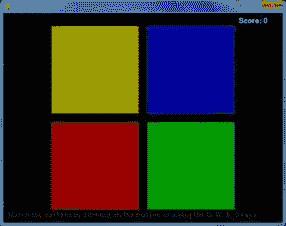

# 第 5 章–模拟

> 原文：<http://inventwithpython.com/pygame/chapter5.html>



模拟是游戏西蒙的克隆。屏幕上有四个彩色按钮。按钮以某种随机模式亮起，然后玩家必须以正确的顺序按下按钮来重复这种模式。玩家每成功模拟一次图案，图案就会变长。玩家试图尽可能长时间地匹配图案。

这个源代码可以从[【http://invpy.com/simulate.py】](http://invpy.com/simulate.py)下载。如果您得到任何错误消息，请查看错误消息中提到的行号，并检查您的代码是否有任何拼写错误。你也可以在 http://invpy.com/diff/simulate将你的代码复制粘贴到 web 表单中，看看你的代码和书中的代码是否有区别。

您可以从以下网站下载该程序使用的四种声音文件:

[http://invpy.com/beep1.ogg](http://invpy.com/beep1.ogg)

[http://invpy.com/beep2.ogg](http://invpy.com/beep2.ogg)

[http://invpy.com/beep3.ogg](http://invpy.com/beep3.ogg)

[http://invpy.com/beep4.ogg](http://invpy.com/beep4.ogg)

```py
1\. # Simulate (a Simon clone)
2\. # By Al Sweigart [[email protected]](/cdn-cgi/l/email-protection)
3\. # http://inventwithpython.com/pygame
4\. # Creative Commons BY-NC-SA 3.0 US
5\. 
  6\. import
random, sys, time, pygame
  7\. from
pygame.locals import *
  8\. 
  9\. FPS
= 30
 10\. WINDOWWIDTH
= 640
 11\. WINDOWHEIGHT
= 480
 12\. FLASHSPEED
= 500 # in milliseconds
 13\. FLASHDELAY
= 200 # in milliseconds
 14\. BUTTONSIZE
= 200
 15\. BUTTONGAPSIZE
= 20
 16\. TIMEOUT
= 4 # seconds before game over if no button is
pushed.
 17\. 
 18\. #                R    G    B
 19\. WHITE       
= (255, 255, 255)
 20\. BLACK       
= (  0,   0,   0)
 21\. BRIGHTRED   
= (255,   0,   0)
 22\. RED         
= (155,   0,   0)
 23\. BRIGHTGREEN 
= (  0, 255,   0)
 24\. GREEN       
= (  0, 155,   0)
 25\. BRIGHTBLUE  
= (  0,   0, 255)
 26\. BLUE        
= (  0,   0, 155)
 27\. BRIGHTYELLOW
= (255, 255,   0)
 28\. YELLOW   
   = (155, 155,   0)
 29\. DARKGRAY    
= ( 40,  40,  40)
 30\. bgColor
= BLACK
 31\. 
 32\. XMARGIN
= int((WINDOWWIDTH - (2 * BUTTONSIZE) - BUTTONGAPSIZE) / 2)
 33\. YMARGIN
= int((WINDOWHEIGHT - (2 * BUTTONSIZE) - BUTTONGAPSIZE) / 2)
 34\. 
35\. # Rect objects for each of the four buttons
 36\. YELLOWRECT
= pygame.Rect(XMARGIN, YMARGIN, BUTTONSIZE, BUTTONSIZE)
 37\. BLUERECT  
= pygame.Rect(XMARGIN + BUTTONSIZE + BUTTONGAPSIZE, YMARGIN, BUTTONSIZE,
BUTTONSIZE)
 38\. REDRECT   
= pygame.Rect(XMARGIN, YMARGIN + BUTTONSIZE + BUTTONGAPSIZE, BUTTONSIZE,
BUTTONSIZE)
 39\. GREENRECT 
= pygame.Rect(XMARGIN + BUTTONSIZE + BUTTONGAPSIZE, YMARGIN + BUTTONSIZE +
BUTTONGAPSIZE, BUTTONSIZE, BUTTONSIZE)
 40\. 
41\. def
main():
 42\.     global
FPSCLOCK, DISPLAYSURF, BASICFONT, BEEP1, BEEP2, BEEP3, BEEP4
 43\. 
 44\.     pygame.init()
 45\.     FPSCLOCK
= pygame.time.Clock()
 46\.     DISPLAYSURF
= pygame.display.set_mode((WINDOWWIDTH, WINDOWHEIGHT))
 47\.     pygame.display.set_caption('Simulate')
 48\. 
 49\.     BASICFONT
= pygame.font.Font('freesansbold.ttf', 16)
 50.
51\.     infoSurf
= BASICFONT.render('Match the pattern by clicking on the button or using the Q,
W, A, S keys.', 1, DARKGRAY)
 52\.     infoRect
= infoSurf.get_rect()
 53\.     infoRect.topleft
= (10, WINDOWHEIGHT - 25)
 54\.     # load the sound files
 55\.     BEEP1
= pygame.mixer.Sound('beep1.ogg')
 56\.     BEEP2
= pygame.mixer.Sound('beep2.ogg')
 57\.     BEEP3
= pygame.mixer.Sound('beep3.ogg')
 58\.     BEEP4
= pygame.mixer.Sound('beep4.ogg')
 59\. 
60\.     # Initialize some variables for a new game
 61\.     pattern
= [] # stores the pattern of colors
 62\.     currentStep
= 0 # the color the player must push next
 63\.     lastClickTime
= 0 # timestamp of the player's last button push
 64\.     score
= 0
 65\.     # when False, the pattern is playing. when True,
waiting for the player to click a colored button:
 66\.     waitingForInput
= False
 67\. 
68\.     while
True: # main game loop
 69\.         clickedButton
= None # button that was clicked (set to YELLOW,
RED, GREEN, or BLUE)
 70\.         DISPLAYSURF.fill(bgColor)
 71\.         drawButtons()
 72\. 
 73\.         scoreSurf
= BASICFONT.render('Score: ' + str(score), 1, WHITE)
 74\.         scoreRect
= scoreSurf.get_rect()
 75\.         scoreRect.topleft
= (WINDOWWIDTH - 100, 10)
 76\.         DISPLAYSURF.blit(scoreSurf,
scoreRect)
 77\. 
78\.         DISPLAYSURF.blit(infoSurf,
infoRect)
 79\. 
80\.         checkForQuit()
 81\.         for
event in pygame.event.get(): # event handling
loop
 82\.             if
event.type == MOUSEBUTTONUP:
 83\.                 mousex,
mousey = event.pos
 84\.                 clickedButton
= getButtonClicked(mousex, mousey)
85\.             elif
event.type == KEYDOWN:
86\.                 if
event.key == K_q:
 87\.                     clickedButton
= YELLOW
 88\.                 elif
event.key == K_w:
 89\.                     clickedButton
= BLUE
 90\.                 elif
event.key == K_a:
 91\.                     clickedButton
= RED
 92\.                 elif
event.key == K_s:
 93\.                     clickedButton
= GREEN
 94.
 95.
 96.
97\.         if
not waitingForInput:
 98\.             # play the pattern
 99\.             pygame.display.update()
100\.             pygame.time.wait(1000)
101\.             pattern.append(random.choice((YELLOW,
BLUE, RED, GREEN)))
102\.             for
button in pattern:
103\.                 flashButtonAnimation(button)
104\.                 pygame.time.wait(FLASHDELAY)
105\.             waitingForInput
= True
106\.         else:
107\.             # wait for the player to enter buttons
108\.             if
clickedButton and clickedButton == pattern[currentStep]:
109\.                 # pushed the correct button
110\.                 flashButtonAnimation(clickedButton)
111\.                 currentStep
+= 1
112\.                 lastClickTime
= time.time()
113.
114\.                 if
currentStep == len(pattern):
115\.                     # pushed the last button in the pattern
116\.                     changeBackgroundAnimation()
117\.                     score
+= 1
118\.                     waitingForInput
= False
119\.                     currentStep
= 0 # reset back to first step
120.
121\.             elif
(clickedButton and clickedButton != pattern[currentStep]) or (currentStep != 0
and time.time() - TIMEOUT > lastClickTime):
122\.                 # pushed the incorrect button, or has timed out
123\.                 gameOverAnimation()
124\.                 # reset the variables for a new game:
125\.                 pattern
= []
126\.                 currentStep
= 0
127\.                 waitingForInput
= False
128\.                 score
= 0
129\.                 pygame.time.wait(1000)
130\.                 changeBackgroundAnimation()
131.
132\.         pygame.display.update()
133\.         FPSCLOCK.tick(FPS)
134.
135.
136\. def
terminate():
137\.     pygame.quit()
138\.     sys.exit()
139\. 
140\. 
141\. def
checkForQuit():
142\.     for
event in pygame.event.get(QUIT): # get all the
QUIT events
143\.         terminate()
# terminate if any QUIT events are present
144\.     for
event in pygame.event.get(KEYUP): # get all the
KEYUP events
145\.         if
event.key == K_ESCAPE:
146\.             terminate()
# terminate if the KEYUP event was for the Esc
key
147\.         pygame.event.post(event)
# put the other KEYUP event objects back
148.
149.
150\. def
flashButtonAnimation(color, animationSpeed=50):
151\.     if
color == YELLOW:
152\.         sound
= BEEP1
153\.         flashColor
= BRIGHTYELLOW
154\.         rectangle
= YELLOWRECT
155\.     elif
color == BLUE:
156\.         sound
= BEEP2
157\.         flashColor
= BRIGHTBLUE
158\.         rectangle
= BLUERECT
159\.     elif
color == RED:
160\.         sound
= BEEP3
161\.         flashColor
= BRIGHTRED
162\.         rectangle
= REDRECT
163\.     elif
color == GREEN:
164\.         sound
= BEEP4
165\.         flashColor
= BRIGHTGREEN
166\.         rectangle
= GREENRECT
167.
168\.     origSurf
= DISPLAYSURF.copy()
169\.     flashSurf
= pygame.Surface((BUTTONSIZE, BUTTONSIZE))
170\.     flashSurf
= flashSurf.convert_alpha()
171\.     r,
g, b = flashColor
172\.     sound.play()
173\.     for
start, end, step in ((0, 255, 1), (255, 0, -1)): #
animation loop
174\.         for
alpha in range(start, end, animationSpeed * step):
175\.             checkForQuit()
176\.             DISPLAYSURF.blit(origSurf,
(0, 0))
177\.             flashSurf.fill((r,
g, b, alpha))
178\.             DISPLAYSURF.blit(flashSurf,
rectangle.topleft)
179\.             pygame.display.update()
180\.             FPSCLOCK.tick(FPS)
181\.     DISPLAYSURF.blit(origSurf,
(0, 0))
182\. 
183\. 
184\. def
drawButtons():
185\.     pygame.draw.rect(DISPLAYSURF,
YELLOW, YELLOWRECT)
186\.     pygame.draw.rect(DISPLAYSURF,
BLUE,   BLUERECT)
187\.     pygame.draw.rect(DISPLAYSURF,
RED,    REDRECT)
188\.     pygame.draw.rect(DISPLAYSURF,
GREEN,  GREENRECT)
189.
190.
191\. def
changeBackgroundAnimation(animationSpeed=40):
192\.     global
bgColor
193\.     newBgColor
= (random.randint(0, 255), random.randint(0, 255), random.randint(0, 255))
194\. 
195\.     newBgSurf
= pygame.Surface((WINDOWWIDTH, WINDOWHEIGHT))
196\.     newBgSurf
= newBgSurf.convert_alpha()
197\.     r,
g, b = newBgColor
198\.     for
alpha in range(0, 255, animationSpeed): #
animation loop
199\.         checkForQuit()
200\.         DISPLAYSURF.fill(bgColor)
201\. 
202\.         newBgSurf.fill((r,
g, b, alpha))
203\.         DISPLAYSURF.blit(newBgSurf,
(0, 0))
204\. 
205\.         drawButtons()
# redraw the buttons on top of the tint
206\. 
207\.         pygame.display.update()
208\.         FPSCLOCK.tick(FPS)
209\.     bgColor
= newBgColor
210.
211.
212\. def
gameOverAnimation(color=WHITE, animationSpeed=50):
213\.     # play all beeps at once, then flash the background
214\.     origSurf
= DISPLAYSURF.copy()
215\.     flashSurf
= pygame.Surface(DISPLAYSURF.get_size())
216\.     flashSurf
= flashSurf.convert_alpha()
217\.     BEEP1.play()
# play all four beeps at the same time, roughly.
218\.     BEEP2.play()
219\.     BEEP3.play()
220\.     BEEP4.play()
221\.     r,
g, b = color
222\.     for
i in range(3): # do the flash 3 times
223\.         for
start, end, step in ((0, 255, 1), (255, 0, -1)):
224\.             # The first iteration in this loop sets the following
for loop
225\.             # to go from 0 to 255, the second from 255 to 0.
226\.             for
alpha in range(start, end, animationSpeed * step): # animation loop
227\.                 # alpha means transparency. 255 is opaque, 0 is
invisible
228\.                 checkForQuit()
229\.                 flashSurf.fill((r,
g, b, alpha))
230\.                 DISPLAYSURF.blit(origSurf,
(0, 0))
231\.                 DISPLAYSURF.blit(flashSurf,
(0, 0))
232\.                 drawButtons()
233\.                 pygame.display.update()
234\.                 FPSCLOCK.tick(FPS)
235\. 
236.
237.
238\. def
getButtonClicked(x, y):
239\.     if
YELLOWRECT.collidepoint( (x, y) ):
240\.         return
YELLOW
241\.     elif
BLUERECT.collidepoint( (x, y) ):
242\.         return
BLUE
243\.     elif
REDRECT.collidepoint( (x, y) ):
244\.         return
RED
245\.     elif
GREENRECT.collidepoint( (x, y) ):
246\.         return
GREEN
247\.     return
None
248\. 
249\. 
250\. if
__name__ == '__main__':
251\.     main()
```

```py
1\. # Simulate (a Simon clone)
2\. # By Al Sweigart [[email protected]](/cdn-cgi/l/email-protection)
3\. # http://inventwithpython.com/pygame
4\. # Creative Commons BY-NC-SA 3.0 US
5\. 
  6\. import
random, sys, time, pygame
  7\. from
pygame.locals import *
  8\. 
  9\. FPS
= 30
 10\. WINDOWWIDTH
= 640
 11\. WINDOWHEIGHT
= 480
 12\. FLASHSPEED
= 500 # in milliseconds
 13\. FLASHDELAY
= 200 # in milliseconds
 14\. BUTTONSIZE
= 200
 15\. BUTTONGAPSIZE
= 20
 16\. TIMEOUT
= 4 # seconds before game over if no button is
pushed.
 17\. 
 18\. #                R    G    B
 19\. WHITE       
= (255, 255, 255)
 20\. BLACK       
= (  0,   0,   0)
 21\. BRIGHTRED   
= (255,   0,   0)
 22\. RED         
= (155,   0,   0)
 23\. BRIGHTGREEN 
= (  0, 255,   0)
 24\. GREEN       
= (  0, 155,   0)
 25\. BRIGHTBLUE  
= (  0,   0, 255)
 26\. BLUE        
= (  0,   0, 155)
 27\. BRIGHTYELLOW
= (255, 255,   0)
 28\. YELLOW      
= (155, 155,   0)
 29\. DARKGRAY    
= ( 40,  40,  40)
 30\. bgColor
= BLACK
 31\. 
 32\. XMARGIN
= int((WINDOWWIDTH - (2 * BUTTONSIZE) - BUTTONGAPSIZE) / 2)
 33\. YMARGIN
= int((WINDOWHEIGHT - (2 * BUTTONSIZE) - BUTTONGAPSIZE) / 2)
```

在这里，我们为以后可能要修改的东西设置了常用的常量，例如四个按钮的大小、按钮的颜色深浅(按钮亮起时使用亮色)以及游戏超时前玩家必须按下下一个按钮的时间。

```py
 35\. # Rect objects for each of the four buttons
 36\. YELLOWRECT
= pygame.Rect(XMARGIN, YMARGIN, BUTTONSIZE, BUTTONSIZE)
 37\. BLUERECT  
= pygame.Rect(XMARGIN + BUTTONSIZE + BUTTONGAPSIZE, YMARGIN, BUTTONSIZE,
BUTTONSIZE)
 38\. REDRECT   
= pygame.Rect(XMARGIN, YMARGIN + BUTTONSIZE + BUTTONGAPSIZE, BUTTONSIZE, BUTTONSIZE)
 39\. GREENRECT 
= pygame.Rect(XMARGIN + BUTTONSIZE + BUTTONGAPSIZE, YMARGIN + BUTTONSIZE +
BUTTONGAPSIZE, BUTTONSIZE, BUTTONSIZE)
```

就像滑动益智游戏中的“重置”、“解决”和“新游戏”按钮一样，模拟游戏有四个矩形区域和当玩家单击这些区域内部时要处理的代码。该程序将需要 Rect 对象用于四个按钮的区域，这样它就可以对它们调用`collidepoint()`方法。第 36 到 39 行用适当的坐标和大小设置了这些 Rect 对象。

## `main()`功能

```py
 41\. def
main():
 42\.     global
FPSCLOCK, DISPLAYSURF, BASICFONT, BEEP1, BEEP2, BEEP3, BEEP4
 43\. 
 44\.     pygame.init()
 45\.     FPSCLOCK
= pygame.time.Clock()
 46\.     DISPLAYSURF
= pygame.display.set_mode((WINDOWWIDTH, WINDOWHEIGHT))
 47\.     pygame.display.set_caption('Simulate')
 48\. 
 49\.     BASICFONT
= pygame.font.Font('freesansbold.ttf', 16)
 50.
51\.     infoSurf
= BASICFONT.render('Match the pattern by clicking on the button or using the Q,
W, A, S keys.', 1, DARKGRAY)
 52\.     infoRect
= infoSurf.get_rect()
 53\.     infoRect.topleft
= (10, WINDOWHEIGHT - 25)
 54\.     # load the sound files
 55\.     BEEP1
= pygame.mixer.Sound('beep1.ogg')
 56\.     BEEP2
= pygame.mixer.Sound('beep2.ogg')
 57\.     BEEP3
= pygame.mixer.Sound('beep3.ogg')
 58\.     BEEP4
= pygame.mixer.Sound('beep4.ogg')
```

`main()`函数将实现程序的大部分，并在需要时调用其他函数。调用常见的 Pygame 设置函数来初始化库，创建时钟对象，创建窗口，设置标题，并创建将用于在窗口上显示分数和说明的字体对象。由这些函数调用创建的对象将被存储在全局变量中，以便它们可以在其他函数中使用。但是它们基本上是常数，因为其中的值永远不会改变。

第 55 到 58 行将加载声音文件，以便 Simulate 可以在玩家单击每个按钮时播放声音效果。`pygame.mixer.Sound()`构造函数将返回一个声音对象，我们将它存储在变量`BEEP1`到`BEEP4`中，这些变量在第 42 行被制成全局变量。

```py
 60\.     # Initialize some variables for a new game
 61\.     pattern
= [] # stores the pattern of colors
 62\.     currentStep
= 0 # the color the player must push next
 63\.     lastClickTime
= 0 # timestamp of the player's last button push
 64\.     score
= 0
 65\.     # when False, the pattern is playing. when True,
waiting for the player to click a colored button:
 66\.     waitingForInput
= False
```

`pattern`变量将是一个颜色值列表(或者是`YELLOW`、`RED`、`BLUE`或者是`GREEN`)，用来记录玩家必须记住的图案。例如，如果 pattern 的值是`[RED, RED, YELLOW, RED, BLUE, BLUE, RED, GREEN]`，那么玩家必须首先点击红色按钮两次，然后是黄色按钮，然后是红色按钮，等等，直到最后的绿色按钮。当玩家完成每一轮时，一种新的随机颜色被添加到列表的末尾。

变量`currentStep`将记录玩家下一次点击图案列表中的哪种颜色。如果`currentStep`是`0`，而`pattern`是`[GREEN, RED, RED, YELLOW]`，那么玩家必须点击绿色按钮。如果他们点击任何其他按钮，代码将导致游戏结束。

有一个`TIMEOUT`常量让玩家在几秒钟内点击图案中的下一个按钮，否则代码会导致游戏结束。为了检查从最后一次点击按钮起是否已经过了足够的时间，`lastClickTime`变量需要记录玩家最后一次点击按钮的时间。(Python 有一个名为 time 的模块和一个返回当前时间的`time.time()`函数。这个后面会解释。)

可能很难相信，但是`score`变量记录了分数。不可思议！

我们的程序也有两种模式。要么是程序正在为播放器播放按钮的图案(在这种情况下，`waitingForInput`被设置为`False`)，要么是程序已经播放完图案，正在等待用户以正确的顺序点击按钮(在这种情况下，`waitingForInput`被设置为`True`)。

```py
 68\.     while
True: # main game loop
 69\.         clickedButton
= None # button that was clicked (set to YELLOW,
RED, GREEN, or BLUE)
 70\.         DISPLAYSURF.fill(bgColor)
 71\.         drawButtons()
 72\. 
 73\.         scoreSurf
= BASICFONT.render('Score: ' + str(score), 1, WHITE)
 74\.         scoreRect
= scoreSurf.get_rect()
 75\.         scoreRect.topleft
= (WINDOWWIDTH - 100, 10)
 76\.         DISPLAYSURF.blit(scoreSurf,
scoreRect)
 77\. 
78\.         DISPLAYSURF.blit(infoSurf,
infoRect)
```

第 68 行是主游戏循环的开始。在每次迭代开始时，`clickedButton`将被重置为`None`。如果在这个迭代过程中点击了一个按钮，那么`clickedButton`将被设置为一个颜色值来匹配这个按钮(`YELLOW`、`RED`、`GREEN`或`BLUE`)。

第 70 行调用了`fill()`方法来重新绘制整个显示表面，这样我们就可以从头开始绘制了。四个彩色按钮是通过调用`drawButtons()`绘制的(稍后解释)。然后在第 73 到 76 行创建乐谱文本。

还会有文本告诉玩家他们当前的分数是多少。与第 51 行对指令文本的`render()`方法的调用不同，乐谱的文本发生了变化。它以`'Score: 0'`开始，然后变成`'Score: 1'`，然后是`'Score: 2'`，以此类推。这就是为什么我们在游戏循环中通过调用第 73 行的`render()`方法来创建新的表面物体。由于指令文本(“匹配模式的方式...”)从不改变，我们只需要在第 50 行的游戏循环之外调用一次`render()`。

```py
 80\.         checkForQuit()
 81\.         for
event in pygame.event.get(): # event handling
loop
 82\.             if
event.type == MOUSEBUTTONUP:
 83\.                 mousex,
mousey = event.pos
 84\.                 clickedButton
= getButtonClicked(mousex, mousey)
```

第 80 行对任何`QUIT`事件进行快速检查，然后第 81 行是事件处理循环的开始。任何鼠标点击的 XY 坐标将存储在`mousex`和`mousey`变量中。如果鼠标点击了四个按钮中的一个，那么我们的`getButtonClicked()`函数将返回被点击按钮的颜色对象(否则返回`None`)。

```py
 85\.             elif
event.type == KEYDOWN:
86\.                 if
event.key == K_q:
 87\.                     clickedButton
= YELLOW
 88\.                 elif
event.key == K_w:
 89\.                     clickedButton
= BLUE
 90\.                 elif
event.key == K_a:
 91\.                     clickedButton
= RED
 92\.                 elif
event.key == K_s:
 93\.                     clickedButton
= GREEN
```

第 85 到 93 行检查任何`KEYDOWN`事件(当用户按下键盘上的一个键时创建的)。Q、W、A 和 S 键与按钮相对应，因为它们在键盘上排列成正方形。

Q 键在四个键盘键的左上方，就像屏幕上的黄色按钮在左上方一样，所以我们会让按 Q 键和点击黄色按钮一样。我们可以通过将`clickedButton`变量设置为常量变量`YELLOW`中的值来实现这一点。我们可以对其他三把钥匙做同样的事情。这样，用户可以用鼠标或键盘玩模拟游戏。

```py
 97\.         if
not waitingForInput:
 98\.             # play the pattern
 99\.             pygame.display.update()
100\.             pygame.time.wait(1000)
101\.             pattern.append(random.choice((YELLOW,
BLUE, RED, GREEN)))
102\.             for
button in pattern:
103\.                 flashButtonAnimation(button)
104\.                 pygame.time.wait(FLASHDELAY)
105\.             waitingForInput
= True
```

程序可以有两种不同的“模式”或“状态”。当`waitingForInput`为`False`时，程序将显示图案的动画。当`waitingForInput`为`True`时，程序将等待用户选择按钮。

第 97 到 105 行将涵盖程序显示模式动画的情况。因为这是在游戏开始时或当玩家完成一个图案时完成的，所以行 101 将向图案列表添加随机颜色，以使图案更长一步。然后，第 102 到 104 行循环遍历模式列表中的每个值，并调用`flashButtonAnimation()`,这使得按钮变亮。点亮模式列表中的所有按钮后，程序将`waitingForInput`变量设置为`True`。

```py
106\.         else:
107\.             # wait for the player to enter buttons
108\.             if
clickedButton and clickedButton == pattern[currentStep]:
109\.                 # pushed the correct button
110\.                 flashButtonAnimation(clickedButton)
111\.                 currentStep
+= 1
112\.                 lastClickTime
= time.time()
```

如果`waitingForInput`是`True`，那么将执行第 106 行的`else`语句中的代码。行 108 检查玩家在游戏循环的这一迭代中是否点击了按钮，以及该按钮是否是正确的按钮。`currentStep`变量跟踪玩家下一次应该点击的按钮在模式列表中的索引。

例如，如果 pattern 设置为`[YELLOW, RED, RED]`，变量`currentStep`设置为`0`(就像玩家第一次开始游戏时一样)，那么玩家点击的正确按钮应该是`pattern[0]`(黄色按钮)。

如果玩家点击了正确的按钮，我们希望通过调用`flashButtonAnimation()`来闪烁玩家点击的按钮，然后将`currentStep`增加到下一步，然后将`lastClickTime`变量更新为当前时间。(`time.time()`函数返回自 1970 年 1 月 1 日<sup>日</sup>起的秒数的浮点值，因此我们可以用它来跟踪时间。)

```py
114\.                 if
currentStep == len(pattern):
115\.                     # pushed the last button in the pattern
116\.                     changeBackgroundAnimation()
117\.                     score
+= 1
118\.                     waitingForInput
= False
119\.                     currentStep
= 0 # reset back to first step
```

第 114 到 119 行位于从第 106 行开始的`else`语句中。如果执行在那个`else`语句中，我们知道玩家点击了一个按钮，而且是正确的按钮。第 114 行通过检查存储在`currentStep`中的整数是否等于模式列表中值的数量来检查这是否是模式列表中最后一个正确的按钮。

如果这是`True`，那么我们想通过调用我们的`changeBackgroundAnimation()`来改变背景颜色。这是让玩家知道他们已经正确输入了整个图案的简单方法。分数递增，`currentStep`被设置回`0`，变量`waitingForInput`被设置为`False`，这样在游戏循环的下一次迭代中，代码将向模式列表添加一个新的颜色值，然后闪烁按钮。

```py
121\.             elif
(clickedButton and clickedButton != pattern[currentStep]) or (currentStep != 0
and time.time() - TIMEOUT > lastClickTime):
```

如果玩家没有点击正确的按钮，第 121 行的`elif`语句处理玩家点击错误的按钮或者玩家等待太久才点击按钮的情况。无论哪种方式，我们都需要显示“游戏结束”动画并开始一个新游戏。

`elif`语句的条件的`(clickedButton and clickedButton != pattern[currentStep])`部分检查一个按钮是否被点击并且是错误的按钮。你可以将它与第 108 行的`if`语句的条件`clickedButton and clickedButton == pattern[currentStep]`进行比较，如果玩家点击了一个按钮，并且点击的是正确的按钮，则条件`clickedButton and clickedButton == pattern[currentStep]`的值为`True`。

121 行的`elif`条件的另一部分是`(currentStep != 0 and time.time() - TIMEOUT > lastClickTime)`。这将确保播放器不会“超时”。注意，条件的这一部分有两个由关键字`and`连接的表达式。这意味着 and 关键字的两边都需要评估为`True`。

为了“超时”，它必须不是玩家的第一个按钮点击。但是一旦他们开始点击按钮，他们必须保持足够快的速度点击按钮，直到他们进入了整个模式(或者点击了错误的模式，获得了“游戏结束”)。如果`currentStep != 0`是`True`，那么我们知道玩家已经开始点击按钮。

同样为了“超时”，当前时间(由`time.time()`返回)减去 4 秒(因为`4`存储在`TIMEOUT`中)必须大于最后一次点击按钮的时间(存储在`lastClickTime`)。`time.time() - TIMEOUT > lastClickTime`的工作原理与大纪元时间的工作方式有关。纪元时间(也称为 Unix 纪元时间)是自 1970 年 1 月 1 日 <sup>st</sup> 以来的秒数。这个日期被称为 Unix 纪元。

例如，当我从交互式 shell 运行`time.time()`时(不要忘记先导入时间模块)，它看起来是这样的:

>>>导入时间

> > > time.time()

One billion three hundred and twenty million four hundred and sixty thousand two hundred and forty-two point one one eight

这个数字意味着从 1970 年 1 月 1 日<sup>日</sup>午夜开始，`time.time()`函数被调用的时间是 1，320，460，242 秒多一点。(翻译过来就是 2011 年 11 月 4 日<sup>晚 7 点 30 分 42 秒</sup>。你可以在 http://invpy.com/epochtime学习如何将 Unix 纪元时间转换为常规英语时间

如果几秒钟后我从交互式 shell 中调用`time.time()`,它可能看起来像这样:

> > > time.time()

One billion three hundred and twenty million four hundred and sixty thousand two hundred and sixty-one point three one five

Unix 纪元午夜后 1320460261.315 秒是 2011 年 11 月 4 日<sup>日</sup>下午 7:31:01。(其实要精确的话是 7:31，0.315 秒。)

如果我们必须处理弦，那么处理时间就很困难。如果我们只有字符串值`'7:30:42 PM'`和`'7:31:01 PM'`进行比较，很难判断已经过了 19 秒。但是对于纪元时间，这只是减去整数`1320460261.315 - 1320460242.118`的问题，其计算结果为`19.197000026702881`。该值是这两个时间之间的秒数。(额外的`0.000026702881`来自当你用浮点数做数学运算时发生的非常小的舍入误差。它们只是偶尔发生，而且通常很小，无关紧要。您可以在[http://invpy.com/roundingerrors](http://invpy.com/roundingerrors)了解更多关于浮点舍入误差的信息。)

回到第 121 行，如果`time.time() - TIMEOUT > lastClickTime`评估为`True`，那么自从`time.time()`被调用并存储在`lastClickTime`中以来已经超过 4 秒。如果它评估为`False`，那么它已经不到 4 秒了。

```py
122\.                 # pushed the incorrect button, or has timed out
123\.                 gameOverAnimation()
124\.                 # reset the variables for a new game:
125\.                 pattern
= []
126\.                 currentStep
= 0
127\.                 waitingForInput
= False
128\.                 score
= 0
129\.                 pygame.time.wait(1000)
130\.                 changeBackgroundAnimation()
```

如果玩家点击了错误的按钮或者超时了，程序应该播放“游戏结束”动画，然后重新设置新游戏的变量。这包括将`pattern`列表设置为空白列表、`currentStep`设置为`0`、`waitingForInput`设置为`False`，然后`score`设置为`0`。将设置小的暂停和新的背景颜色，以向玩家指示新游戏的开始，这将在游戏循环的下一次迭代中开始。

```py
132\.         pygame.display.update()
133\.         FPSCLOCK.tick(FPS)
```

就像其他游戏程序一样，游戏循环中最后做的事情是将显示面对象绘制到屏幕上，并调用`tick()`方法。

## 功能`terminate()`

```py
136\. def
terminate():
137\.     pygame.quit()
138\.     sys.exit()
139\. 
140\. 
141\. def
checkForQuit():
142\.     for
event in pygame.event.get(QUIT): # get all the
QUIT events
143\.         terminate()
# terminate if any QUIT events are present
144\.     for
event in pygame.event.get(KEYUP): # get all the
KEYUP events
145\.         if
event.key == K_ESCAPE:
146\.             terminate()
# terminate if the KEYUP event was for the Esc
key
147\.         pygame.event.post(event)
# put the other KEYUP event objects back
```

`terminate()`和`checkForQuit()`函数已经在滑动拼图一章中使用和解释过了，所以我们将跳过对它们的再次描述。

```py
150\. def
flashButtonAnimation(color, animationSpeed=50):
151\.     if
color == YELLOW:
152\.         sound
= BEEP1
153\.         flashColor
= BRIGHTYELLOW
154\.         rectangle
= YELLOWRECT
155\.     elif
color == BLUE:
156\.         sound
= BEEP2
157\.         flashColor
= BRIGHTBLUE
158\.         rectangle
= BLUERECT
159\.     elif
color == RED:
160\.         sound
= BEEP3
161\.         flashColor
= BRIGHTRED
162\.         rectangle
= REDRECT
163\.     elif
color == GREEN:
164\.         sound
= BEEP4
165\.         flashColor
= BRIGHTGREEN
166\.         rectangle
= GREENRECT
```

根据作为 Color 参数的参数传递的颜色值，闪光的声音、颜色以及闪光的矩形区域会有所不同。第 151 到 166 行根据`color`参数中的值不同地设置了三个局部变量:`sound`、`flashColor`和`rectangle`。

```py
168\.     origSurf
= DISPLAYSURF.copy()
169\.     flashSurf
= pygame.Surface((BUTTONSIZE, BUTTONSIZE))
170\.     flashSurf
= flashSurf.convert_alpha()
171\.     r,
g, b = flashColor
172\.     sound.play()
```

动画按钮闪烁的过程很简单:在动画的每一帧上，绘制正常的棋盘，然后在此之上，在按钮上绘制按钮闪烁的亮色版本。对于动画的第一帧，亮色的 alpha 值从`0`开始，但是在每一帧之后，alpha 值慢慢增加，直到它完全不透明，亮色版本完全覆盖正常的按钮颜色。这将使按钮看起来慢慢变亮。

亮起来的是动画的前半部分。后半部分是按钮调光。这是用相同的代码完成的，除了每帧的 alpha 值不是增加，而是减少。随着 alpha 值越来越低，涂在上面的亮色会越来越看不见，直到只看得见原来那块颜色暗淡的木板。

为了在代码中做到这一点，第 168 行创建了显示表面对象的副本，并将其存储在`origSurf`中。第 169 行创建了一个单个按钮大小的新表面对象，并将其存储在`flashSurf`中。在`flashSurf`上调用`convert_alpha()`方法，这样表面对象可以有透明的颜色绘制在上面(否则，我们使用的颜色对象中的 alpha 值将被忽略，并自动假定为 255)。在你自己的游戏程序中，如果你在让颜色透明工作时遇到问题，确保你已经在任何涂有透明颜色的表面对象上调用了`convert_alpha()`方法。

第 171 行创建名为`r`、`g`和`b`的单个局部变量，以存储存储在`flashColor`中的元组的单个 RGB 值。这只是一些语法上的糖，使得这个函数中的其余代码更容易阅读。在我们开始动画按钮闪烁之前，第 172 行将播放该按钮的声音效果。声音效果开始播放后，程序继续执行，因此声音将在按钮闪烁动画期间播放。

```py
173\.     for
start, end, step in ((0, 255, 1), (255, 0, -1)): #
animation loop
174\.         for
alpha in range(start, end, animationSpeed * step):
175\.             checkForQuit()
176\.             DISPLAYSURF.blit(origSurf,
(0, 0))
177\.             flashSurf.fill((r,
g, b, alpha))
178\.             DISPLAYSURF.blit(flashSurf,
rectangle.topleft)
179\.             pygame.display.update()
180\.             FPSCLOCK.tick(FPS)
181\.     DISPLAYSURF.blit(origSurf,
(0, 0))
```

记住，要制作动画，我们首先要用从`0`到`255`增加 alpha 值的颜色绘制`flashSurf`，来制作动画的增亮部分。然后做调光，我们希望阿尔法值从`255`到`0`。我们*可以*用这样的代码做到这一点:

对于 **范围内的 alpha，255，animationSpeed)** : #增亮

checkForQuit()

DISPLAYSURF.blit(开放曲面，0，0))

flashSurf.fill((r、g、b、alpha))

DISPLAYSURF.blit(flashSurf、rectangle.topleft)

pygame.display.update()

FPSCLOCK.tick(FPS)

对于 **范围内的 alpha(255，0，-animation speed)**:# dimming

checkForQuit()

DISPLAYSURF.blit(开放曲面，0，0))

flashSurf.fill((r、g、b、alpha))

DISPLAYSURF.blit(flashSurf、rectangle.topleft)

pygame.display.update()

FPSCLOCK.tick(FPS)

但是请注意，`for`循环中的代码处理画框，并且彼此相同。如果我们像上面这样编写代码，那么第一个`for`循环将处理动画的变亮部分(alpha 值从`0`到`255`)，第二个`for`循环将处理动画的变暗部分(alpha 值从`255`到`0`)。注意，对于第二个`for`循环，`range()`调用的第三个参数是一个负数。

每当我们有这样相同的代码时，我们可以缩短代码，这样就不必重复了。这就是我们对第 173 行上的`for`循环所做的，它为第 174 行上的`range()`调用提供不同的值:

```py
173\.     for
start, end, step in ((0, 255, 1), (255, 0, -1)): #
animation loop
174\.         for
alpha in range(start, end, animationSpeed * step):
```

在第 173 行`for`循环的第一次迭代中，`start`被设置为`0`，`end`被设置为`255`，`step`被设置为`1`。这样，当执行第 174 行上的`for`循环时，它正在调用`range(0, 255, animationSpeed)`。(注意`animationSpeed * 1`与`animationSpeed`相同。用一个数字乘以`1`得到的是同一个数字。)

然后，第 174 行的`for`循环执行并执行增亮动画。

在第 173 行的`for`循环的第二次迭代中(这个内`for`循环总是有两次且只有两次迭代)，`start`被设置为`255`，`end`被设置为`0`，`step`被设置为`-1`。当执行第 174 行的`for`循环时，它正在调用`range(255, 0, -animationSpeed)`。(请注意，`animationSpeed * -1`的计算结果为`-animationSpeed`，因为将任意数字乘以`-1`会得出该数字的负形式。)

这样，我们就不必有两个单独的`for`循环并重复其中的所有代码。这是第 174 行的`for`循环中的代码:

```py
175\.             checkForQuit()
176\.             DISPLAYSURF.blit(origSurf,
(0, 0))
177\.             flashSurf.fill((r,
g, b, alpha))
178\.             DISPLAYSURF.blit(flashSurf,
rectangle.topleft)
179\.             pygame.display.update()
180\.             FPSCLOCK.tick(FPS)
181\.     DISPLAYSURF.blit(origSurf,
(0, 0))
```

我们检查任何`QUIT`事件(以防用户在动画过程中试图关闭程序)，然后将`origSurf`表面 blit 到显示表面。然后我们通过调用`fill()`绘制`flashSurf`表面(提供我们在第 171 行得到的颜色的`r`、`g`、`b`值以及`for`循环在`alpha`变量中设置的 alpha 值)。然后将`flashSurf`表面用位图传送到显示表面。

然后，为了使显示面出现在屏幕上，在第 179 行调用`pygame.display.update()`。为了确保动画的播放速度不会跟得上计算机绘制的速度，我们通过调用`tick()`方法添加了短暂的暂停。(如果你想看闪烁的动画播放得很慢，把一个像 1 或 2 这样的小数字作为`tick()`的参数，而不是`FPS`。)

```py
184\. def
drawButtons():
185\.     pygame.draw.rect(DISPLAYSURF,
YELLOW, YELLOWRECT)
186\.     pygame.draw.rect(DISPLAYSURF,
BLUE,   BLUERECT)
187\.     pygame.draw.rect(DISPLAYSURF,
RED,    REDRECT)
188\.     pygame.draw.rect(DISPLAYSURF,
GREEN,  GREENRECT)
```

由于每个按钮只是某个位置的某个颜色的矩形，我们只需调用四次`pygame.draw.rect()`就可以在显示面上绘制按钮。我们用来定位它们的颜色对象和矩形对象永远不会改变，这就是为什么我们把它们存储在像`YELLOW`和`YELLOWRECT`这样的常量变量中。

```py
191\. def
changeBackgroundAnimation(animationSpeed=40):
192\.     global
bgColor
193\.     newBgColor
= (random.randint(0, 255), random.randint(0, 255), random.randint(0, 255))
194\. 
195\.     newBgSurf
= pygame.Surface((WINDOWWIDTH, WINDOWHEIGHT))
196\.     newBgSurf
= newBgSurf.convert_alpha()
197\.     r,
g, b = newBgColor
198\.     for
alpha in range(0, 255, animationSpeed): #
animation loop
199\.         checkForQuit()
200\.         DISPLAYSURF.fill(bgColor)
201\. 
202\.         newBgSurf.fill((r,
g, b, alpha))
203\.         DISPLAYSURF.blit(newBgSurf,
(0, 0))
204\. 
205\.         drawButtons()
# redraw the buttons on top of the tint
206\. 
207\.         pygame.display.update()
208\.         FPSCLOCK.tick(FPS)
209\.     bgColor
= newBgColor
```

每当玩家正确输入整个图案时，背景颜色变化动画就会发生。在从第 198 行开始的循环的每次迭代中，整个显示表面必须被重画(与越来越不透明的新背景颜色混合，直到背景被新颜色完全覆盖)。在循环的每次迭代中完成的步骤是:

线 200 用旧背景色(存储在`bgColor`中)填充整个显示面(存储在`DISPLAYSURF`中)。

行 202 用新的背景颜色的 RGB 值填充不同的表面对象(存储在`newBgSurf`中)(并且阿尔法透明度值在每次迭代中改变，因为这是行 198 上的`for`循环所做的)。

行 203 然后将`newBgSurf`表面绘制到`DISPLAYSURF`中的显示表面。我们没有一开始就在`DISPLAYSURF`上绘制半透明的新背景色的原因是因为`fill()`方法只是替换表面的颜色，而`blit()`方法将混合颜色。

现在我们已经有了想要的背景，我们将通过调用第 205 行的`drawButtons()`在它上面绘制按钮。

行 207 和 208 然后仅仅将显示表面绘制到屏幕上并添加暂停。

在`changeBackgroundAnimation()`函数的开头有一个`global`语句是为了`bgColor`变量，因为这个函数用第 209 行的赋值语句修改了变量的内容。任何函数都可以在不指定`global`语句的情况下读取全局变量的值。

如果这个函数在没有使用`global`语句的情况下给一个全局变量赋值，那么 Python 会认为这个变量是一个与全局变量同名的局部变量。`main()`函数使用`bgColor`变量，但不需要全局语句，因为它只读取`bgColor`的内容,`main()`函数不会给`bgColor`赋值。这个概念在[http://invpy.com/global](http://invpy.com/global)有更详细的解释。

```py
212\. def
gameOverAnimation(color=WHITE, animationSpeed=50):
213\.     # play all beeps at once, then flash the background
214\.     origSurf
= DISPLAYSURF.copy()
215\.     flashSurf
= pygame.Surface(DISPLAYSURF.get_size())
216\.     flashSurf
= flashSurf.convert_alpha()
217\.     BEEP1.play()
# play all four beeps at the same time, roughly.
218\.     BEEP2.play()
219\.     BEEP3.play()
220\.     BEEP4.play()
221\.     r,
g, b = color
222\.     for
i in range(3): # do the flash 3 times
```

下一行(下面的第 223 行)的`for`循环的每次迭代都将执行一次刷新。为了完成三次刷新，我们将所有代码放入一个有三次迭代的`for`循环中。如果你想要更多或更少的闪光，那么改变传递给第 222 行的`range()`的整数。

```py
223\.         for
start, end, step in ((0, 255, 1), (255, 0, -1)):
```

第 223 行上的`for`循环与第 173 行上的完全相同。`start`、`end`和`step`变量将用于下一个`for`循环(在第 224 行)来控制`alpha`变量如何变化。如果你需要重新了解这些循环是如何工作的，请重读“动画按钮闪烁”一节。

```py
224\.             # The first iteration in this loop sets the following
for loop
225\.             # to go from 0 to 255, the second from 255 to 0.
226\.             for
alpha in range(start, end, animationSpeed * step): # animation loop
227\.                 # alpha means transparency. 255 is opaque, 0 is
invisible
228\.                 checkForQuit()
229\.                 flashSurf.fill((r,
g, b, alpha))
230\.                 DISPLAYSURF.blit(origSurf,
(0, 0))
231\.                 DISPLAYSURF.blit(flashSurf,
(0, 0))
232\.                 drawButtons()
233\.                 pygame.display.update()
234\.                 FPSCLOCK.tick(FPS)
```

这个动画循环的工作原理与“背景变化动画”一节中前面的闪烁动画代码相同。存储在`origSurf`中的原始表面对象的副本被绘制在显示表面上，然后`flashSurf`(其上绘制了新的闪烁颜色)被 blit 传送到显示表面的顶部。背景颜色设置好之后，按钮被绘制在第 232 行的顶部。最后，通过调用`pygame.display.update()`，显示面被绘制到屏幕上。

第 226 行的`for`循环为动画的每一帧调整颜色的 alpha 值(开始增加，然后减少)。

```py
238\. def
getButtonClicked(x, y):
239\.     if
YELLOWRECT.collidepoint( (x, y) ):
240\.         return
YELLOW
241\.     elif
BLUERECT.collidepoint( (x, y) ):
242\.         return
BLUE
243\.     elif
REDRECT.collidepoint( (x, y) ):
244\.         return
RED
245\.     elif
GREENRECT.collidepoint( (x, y) ):
246\.         return
GREEN
247\.     return
None
248\. 
249\. 
250\. if
__name__ == '__main__':
251\.     main()
```

`getButtonClicked()`函数只是获取 XY 像素坐标，如果单击了其中一个按钮，则返回值`YELLOW`、`BLUE`、`RED`或`GREEN`，如果 XY 像素坐标不在四个按钮中的任何一个上，则返回`None`。

您可能已经注意到，`getButtonClicked()`的代码以第 247 行的 return `None`语句结束。这似乎是一件奇怪的事情，因为如果没有任何`return`语句，所有函数都会返回`None`。我们可以完全省略第 47 行，程序也会以完全相同的方式运行。所以为什么要写进去呢？

通常，当一个函数到达末尾并隐式返回`None`值时(也就是说，没有`return`语句明确表示它正在返回`None`)，调用它的代码并不关心返回值。所有的函数调用都必须返回一个值(这样它们可以计算出某个值并成为表达式的一部分)，但是我们的代码并不总是利用返回值。

例如，想想`print()`函数。从技术上讲，这个函数返回`None`值，但是我们从来不关心它:

> > > spam = print('Hello ')

你好

>>>垃圾邮件==无

真实的

>>>

然而，当`getButtonClicked()`返回`None`时，意味着传递给它的坐标不在四个按钮上。为了弄清楚在这种情况下值`None`是从`getButtonClicked()`返回的，我们在函数的末尾有了`return` `None`行。

为了提高代码的可读性，最好让代码显式(也就是说，清楚地陈述一些事情，即使它可能是显而易见的)而不是隐式(也就是说，让阅读代码的人知道它是如何工作的，而不是直接告诉他们)。事实上，“显式比隐式更好”是 Python Koans 之一。

koans 是一组关于如何写好代码的小谚语。Python 交互式 shell 中有一个复活节彩蛋(也就是一个隐藏的小惊喜)，如果你试图导入一个名为`this`的模块，它将显示“Python 的禅”koans。在交互式 shell 中尝试一下:

>>>导入此

蒂姆·彼得斯的《Python 之禅》

漂亮总比难看好。

显性比隐性好。

简单比复杂好。

复杂总比复杂好。

扁平的比嵌套的好。

疏比密好。

可读性很重要。

特例不足以特殊到打破规则。

虽然实用性战胜了纯粹性。

错误永远不会无声无息地过去。

除非明确沉默。

面对暧昧，拒绝猜测的诱惑。

应该有一种——最好只有一种——显而易见的方法来做这件事。

尽管这种方式一开始可能并不明显，除非你是荷兰人。

现在总比没有好。

尽管从来没有比现在更好。

如果实现很难解释，这是一个坏主意。

如果实现很容易解释，这可能是一个好主意。

名称空间是一个非常棒的想法——让我们多做一些吧！

如果你想知道更多关于这些个别公案的意思，请访问。