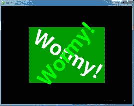
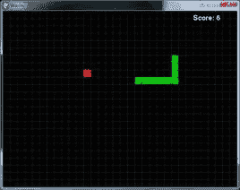
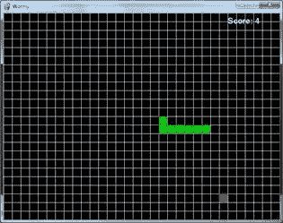
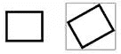
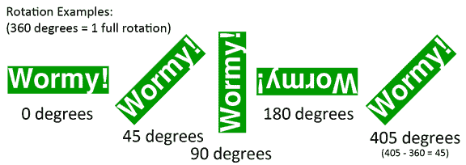

# 第 6 章–虫蛀

> 原文：<http://inventwithpython.com/pygame/chapter6.html>

 

Wormy 是一个克隆人。玩家开始控制一个不断在屏幕上移动的小虫子。玩家不能停止或减慢蠕虫的速度，但他们可以控制它转向哪个方向。一个红色的苹果随机出现在屏幕上，玩家必须移动虫子，让它吃掉苹果。蠕虫每吃一个苹果，蠕虫就长一段，一个新的应用随机出现在屏幕上。如果蠕虫撞到自己或屏幕边缘，游戏就结束了。

这个源代码可以从[【http://invpy.com/wormy.py】](http://invpy.com/wormy.py)下载。如果您得到任何错误消息，请查看错误消息中提到的行号，并检查您的代码是否有任何拼写错误。你也可以在 http://invpy.com/diff/wormy将你的代码复制粘贴到 web 表单中，看看你的代码和书中的代码是否有区别。

```py

  2\. # By Al Sweigart [[email protected]](/cdn-cgi/l/email-protection)
  3\. # http://inventwithpython.com/pygame
  4\. # Creative Commons BY-NC-SA 3.0 US
  5\. 
  6\. import
random, pygame, sys
  7\. from
pygame.locals import *
  8\. 
  9\. FPS
= 15
 10\. WINDOWWIDTH
= 640
 11\. WINDOWHEIGHT
= 480
 12\. CELLSIZE
= 20
 13\. assert
WINDOWWIDTH % CELLSIZE == 0, "Window width must be a multiple of cell
size."
 14\. assert
WINDOWHEIGHT % CELLSIZE == 0, "Window height must be a multiple of cell
size."
 15\. CELLWIDTH
= int(WINDOWWIDTH / CELLSIZE)
 16\. CELLHEIGHT
= int(WINDOWHEIGHT / CELLSIZE)
 17\. 
18\. #             R    G    B
 19\. WHITE    
= (255, 255, 255)
 20\. BLACK    
= (  0,   0,   0)
 21\. RED      
= (255,   0,   0)
 22\. GREEN    
= (  0, 255,   0)
 23\. DARKGREEN
= (  0, 155,   0)
 24\. DARKGRAY 
= ( 40,  40,  40)
 25\. BGCOLOR
= BLACK
 26\. 
 27\. UP
= 'up'
 28\. DOWN
= 'down'
 29\. LEFT
= 'left'
 30\. RIGHT
= 'right'
 31\. 
 32\. HEAD
= 0 # syntactic sugar: index of the worm's head
 33\. 
34\. def
main():
 35\.     global
FPSCLOCK, DISPLAYSURF, BASICFONT
 36\. 
 37\.     pygame.init()
 38\.     FPSCLOCK
= pygame.time.Clock()
 39\.     DISPLAYSURF
= pygame.display.set_mode((WINDOWWIDTH, WINDOWHEIGHT))
 40\.     BASICFONT
= pygame.font.Font('freesansbold.ttf', 18)
 41\.     pygame.display.set_caption('Wormy')
 42\. 
 43\.     showStartScreen()
 44\.     while
True:
 45\.         runGame()
 46\.         showGameOverScreen()
 47\. 
 48\. 
49\. def
runGame():
50\.     # Set a random start point.
51\.     startx
= random.randint(5, CELLWIDTH - 6)
52\.     starty
= random.randint(5, CELLHEIGHT - 6)
53\.     wormCoords
= [{'x': startx,     'y': starty},
54\.                   {'x':
startx - 1, 'y': starty},
55\.                   {'x':
startx - 2, 'y': starty}]
56\.     direction
= RIGHT
57\. 
58\.     # Start the apple in a random place.
59\.     apple
= getRandomLocation()
60\. 
61\.     while
True: # main game loop
62\.         for
event in pygame.event.get(): # event handling
loop
63\.             if
event.type == QUIT:
64\.                 terminate()
65\.             elif
event.type == KEYDOWN:
66\.                 if
(event.key == K_LEFT or event.key == K_a) and direction != RIGHT:
67\.                     direction
= LEFT
68\.                 elif
(event.key == K_RIGHT or event.key == K_d) and direction != LEFT:
69\.                     direction
= RIGHT
70\.                 elif
(event.key == K_UP or event.key == K_w) and direction != DOWN:
71\.                     direction
= UP
72\.                 elif
(event.key == K_DOWN or event.key == K_s) and direction != UP:
73\.                     direction
= DOWN
74\.                 elif
event.key == K_ESCAPE:
75\.                     terminate()
76\. 
77\.         # check if the worm has hit itself or the edge
78\.         if
wormCoords[HEAD]['x'] == -1 or wormCoords[HEAD]['x'] == CELLWIDTH or
wormCoords[HEAD]['y'] == -1 or wormCoords[HEAD]['y'] == CELLHEIGHT:
79\.             return
# game over
80\.         for
wormBody in wormCoords[1:]:
81\.             if
wormBody['x'] == wormCoords[HEAD]['x'] and wormBody['y'] ==
wormCoords[HEAD]['y']:
82\.                 return
# game over
83\. 
84\.         # check if worm has eaten an apply
85\.         if
wormCoords[HEAD]['x'] == apple['x'] and wormCoords[HEAD]['y'] == apple['y']:
86\.             # don't remove worm's tail segment
87\.             apple
= getRandomLocation() # set a new apple somewhere
88\.         else:
89\.             del
wormCoords[-1] # remove worm's tail segment
90\. 
91\.         # move the worm by adding a segment in the direction it
is moving
92\.         if
direction == UP:
93\.             newHead
= {'x': wormCoords[HEAD]['x'], 'y': wormCoords[HEAD]['y'] - 1}
94\.         elif
direction == DOWN:
95\.             newHead
= {'x': wormCoords[HEAD]['x'], 'y': wormCoords[HEAD]['y'] + 1}
96\.         elif
direction == LEFT:
97\.             newHead
= {'x': wormCoords[HEAD]['x'] - 1, 'y': wormCoords[HEAD]['y']}
98\.         elif
direction == RIGHT:
99\.             newHead
= {'x': wormCoords[HEAD]['x'] + 1, 'y': wormCoords[HEAD]['y']}
100.        
wormCoords.insert(0, newHead)
101\.         DISPLAYSURF.fill(BGCOLOR)
102.         drawGrid()
103\.         drawWorm(wormCoords)
104\.         drawApple(apple)
105\.         drawScore(len(wormCoords)
- 3)
106\.         pygame.display.update()
107\.         FPSCLOCK.tick(FPS)
108\. 
109\. def
drawPressKeyMsg():
110\.     pressKeySurf
= BASICFONT.render('Press a key to play.', True, DARKGRAY)
111\.     pressKeyRect
= pressKeySurf.get_rect()
112\.     pressKeyRect.topleft
= (WINDOWWIDTH - 200, WINDOWHEIGHT - 30)
113\.     DISPLAYSURF.blit(pressKeySurf,
pressKeyRect)
114\. 
115.
116\. def
checkForKeyPress():
117\.     if
len(pygame.event.get(QUIT)) > 0:
118\.         terminate()
119\. 
120\.     keyUpEvents
= pygame.event.get(KEYUP)
121.    
if len(keyUpEvents) == 0:
122.        
return None
123\.     if
keyUpEvents[0].key == K_ESCAPE:
124\.         terminate()
125\.     return
keyUpEvents[0].key
126.
127.
128\. def
showStartScreen():
129\.     titleFont
= pygame.font.Font('freesansbold.ttf', 100)
130\.     titleSurf1
= titleFont.render('Wormy!', True, WHITE, DARKGREEN)
131\.     titleSurf2
= titleFont.render('Wormy!', True, GREEN)
132\. 
133\.     degrees1
= 0
134\.     degrees2
= 0
135\.     while
True:
136\.         DISPLAYSURF.fill(BGCOLOR)
137\.         rotatedSurf1
= pygame.transform.rotate(titleSurf1, degrees1)
138\.         rotatedRect1
= rotatedSurf1.get_rect()
139\.         rotatedRect1.center
= (WINDOWWIDTH / 2, WINDOWHEIGHT / 2)
140\.         DISPLAYSURF.blit(rotatedSurf1,
rotatedRect1)
141\. 
142\.         rotatedSurf2
= pygame.transform.rotate(titleSurf2, degrees2)
143\.         rotatedRect2
= rotatedSurf2.get_rect()
144\.         rotatedRect2.center
= (WINDOWWIDTH / 2, WINDOWHEIGHT / 2)
145\.         DISPLAYSURF.blit(rotatedSurf2,
rotatedRect2)
146\. 
147\.         drawPressKeyMsg()
148\. 
149\.         if
checkForKeyPress():
150\.             pygame.event.get()
# clear event queue
151.            
return
152\.         pygame.display.update()
153\.         FPSCLOCK.tick(FPS)
154\.         degrees1
+= 3 # rotate by 3 degrees each frame
155\.         degrees2
+= 7 # rotate by 7 degrees each frame
156\. 
157\. 
158\. def
terminate():
159\.     pygame.quit()
160\.     sys.exit()
161\. 
162\. 
163\. def
getRandomLocation():
164\.     return
{'x': random.randint(0, CELLWIDTH - 1), 'y': random.randint(0, CELLHEIGHT - 1)}
165\. 
166\. 
167\. def
showGameOverScreen():
168\.     gameOverFont
= pygame.font.Font('freesansbold.ttf', 150)
169\.     gameSurf
= gameOverFont.render('Game', True, WHITE)
170\.     overSurf
= gameOverFont.render('Over', True, WHITE)
171\.     gameRect
= gameSurf.get_rect()
172\.     overRect
= overSurf.get_rect()
173\.     gameRect.midtop
= (WINDOWWIDTH / 2, 10)
174\.     overRect.midtop
= (WINDOWWIDTH / 2, gameRect.height + 10 + 25)
175\. 
176\.     DISPLAYSURF.blit(gameSurf,
gameRect)
177\.     DISPLAYSURF.blit(overSurf,
overRect)
178\.     drawPressKeyMsg()
179\.     pygame.display.update()
180\.     pygame.time.wait(500)
181\.     checkForKeyPress()
# clear out any key presses in the event queue
182\. 
183\.     while
True:
184\.         if
checkForKeyPress():
185\.             pygame.event.get()
# clear event queue
186.            
return
187\. 
188\. def
drawScore(score):
189\.     scoreSurf
= BASICFONT.render('Score: %s' % (score), True, WHITE)
190\.     scoreRect
= scoreSurf.get_rect()
191\.     scoreRect.topleft
= (WINDOWWIDTH - 120, 10)
192\.     DISPLAYSURF.blit(scoreSurf,
scoreRect)
193\. 
194\. 
195\. def
drawWorm(wormCoords):
196\.     for
coord in wormCoords:
197\.         x
= coord['x'] * CELLSIZE
198\.         y
= coord['y'] * CELLSIZE
199\.         wormSegmentRect
= pygame.Rect(x, y, CELLSIZE, CELLSIZE)
200\.         pygame.draw.rect(DISPLAYSURF,
DARKGREEN, wormSegmentRect)
201\.         wormInnerSegmentRect
= pygame.Rect(x + 4, y + 4, CELLSIZE - 8, CELLSIZE - 8)
202\.         pygame.draw.rect(DISPLAYSURF,
GREEN, wormInnerSegmentRect)
203\. 
204\. 
205\. def
drawApple(coord):
206\.     x
= coord['x'] * CELLSIZE
207\.     y
= coord['y'] * CELLSIZE
208\.     appleRect
= pygame.Rect(x, y, CELLSIZE, CELLSIZE)
209\.     pygame.draw.rect(DISPLAYSURF,
RED, appleRect)
210\. 
211\. 
212\. def
drawGrid():
213\.     for
x in range(0, WINDOWWIDTH, CELLSIZE): # draw
vertical lines
214\.         pygame.draw.line(DISPLAYSURF,
DARKGRAY, (x, 0), (x, WINDOWHEIGHT))
215\.     for
y in range(0, WINDOWHEIGHT, CELLSIZE): # draw
horizontal lines
216\.         pygame.draw.line(DISPLAYSURF,
DARKGRAY, (0, y), (WINDOWWIDTH, y))
217.
218.
219\. if
__name__ == '__main__':
220\.     main()
```



如果你稍微玩一下这个游戏，你会注意到苹果和蠕虫身体的部分总是沿着一个网格线排列。我们将把这个网格中的每个方块称为一个单元(网格中的一个空间并不总是被这样称呼，它只是我想出来的一个名字)。单元格有自己的笛卡尔坐标系，其中(0，0)是左上角的单元格,( 31，23)是右下角的单元格。

```py
  1\. # Wormy (a Nibbles clone)
  2\. # By Al Sweigart [[email protected]](/cdn-cgi/l/email-protection)
  3\. # http://inventwithpython.com/pygame
  4\. # Creative Commons BY-NC-SA 3.0 US
  5\. 
  6\. import
random, pygame, sys
  7\. from
pygame.locals import *
  8\. 
  9\. FPS
= 15
 10\. WINDOWWIDTH
= 640
 11\. WINDOWHEIGHT
= 480
 12\. CELLSIZE
= 20
 13\. assert
WINDOWWIDTH % CELLSIZE == 0, "Window width must be a multiple of cell
size."
 14\. assert
WINDOWHEIGHT % CELLSIZE == 0, "Window height must be a multiple of cell
size."
 15\. CELLWIDTH
= int(WINDOWWIDTH / CELLSIZE)
 16\. CELLHEIGHT
= int(WINDOWHEIGHT / CELLSIZE)
```

程序开头的代码只是设置了一些游戏中使用的常量变量。单元格的宽度和高度存储在`CELLSIZE`中。第 13 行和第 14 行的`assert`语句确保单元格完全适合窗口。例如，如果`CELLSIZE`为`10`，而`WINDOWWIDTH`或`WINDOWHEIGHT`常量被设置为`15`，那么只有 1.5 个单元格可以容纳。`assert`语句确保只有整数个单元格适合窗口。

```py
 18\. #             R    G    B
 19\. WHITE    
= (255, 255, 255)
 20\. BLACK    
= (  0,   0,   0)
 21\. RED      
= (255,   0,   0)
 22\. GREEN    
= (  0, 255,   0)
 23\. DARKGREEN
= (  0, 155,   0)
 24\. DARKGRAY 
= ( 40,  40,  40)
 25\. BGCOLOR
= BLACK
 26\. 
 27\. UP
= 'up'
 28\. DOWN
= 'down'
 29\. LEFT
= 'left'
 30\. RIGHT
= 'right'
 31\. 
 32\. HEAD
= 0 # syntactic sugar: index of the worm's head
```

第 19 到 32 行设置了更多的常量。常数`HEAD`将在本章后面解释。

## `main()`功能

```py
 34\. def
main():
 35\.     global
FPSCLOCK, DISPLAYSURF, BASICFONT
 36\. 
 37\.     pygame.init()
 38\.     FPSCLOCK
= pygame.time.Clock()
 39\.     DISPLAYSURF
= pygame.display.set_mode((WINDOWWIDTH, WINDOWHEIGHT))
 40\.     BASICFONT
= pygame.font.Font('freesansbold.ttf', 18)
 41\.     pygame.display.set_caption('Wormy')
 42\. 
 43\.     showStartScreen()
 44\.     while
True:
 45\.         runGame()
 46\.         showGameOverScreen()
```

在蠕虫游戏程序中，我们将代码的主要部分放在一个名为`runGame()`的函数中。这是因为我们只想在程序启动时(通过调用`showStartScreen()`函数)显示一次“开始屏幕”(带有旋转“虫状”文本的动画)。然后我们要调用`runGame()`，这将开始一个虫虫游戏。当玩家的蠕虫撞到墙壁或自身并导致游戏结束时，该函数将返回。

此时，我们将通过调用`showGameOverScreen()`在屏幕上显示游戏。当该函数调用返回时，循环再次回到起点`calls runGame()`。第 44 行的`while`循环将永远循环下去，直到程序终止。

## 功能`runGame()`

```py
49\. def
runGame():
50\.     # Set a random start point.
51\.     startx
= random.randint(5, CELLWIDTH - 6)
52\.     starty
= random.randint(5, CELLHEIGHT - 6)
53\.     wormCoords
= [{'x': startx,     'y': starty},
54\.                   {'x':
startx - 1, 'y': starty},
55\.                   {'x':
startx - 2, 'y': starty}]
56\.     direction
= RIGHT
57\. 
58\.     # Start the apple in a random place.
59\.     apple
= getRandomLocation()
```

在游戏开始时，我们希望蠕虫在一个随机的位置开始(但不要太靠近棋盘的边缘)，所以我们在`startx`和`starty`中存储一个随机坐标。(请记住，`CELLWIDTH`和`CELLHEIGHT`是窗口宽度和高度的单元格数量，而不是宽度和高度的像素数量)。

蠕虫的主体将存储在字典值列表中。蠕虫的每个身体部分都有一个字典值。字典将有键`'x'`和`'y'`用于该身体部分的 XY 坐标。身体的头部位于`startx`和`starty`。另外两个身体部分将是头部左侧的一个和两个细胞。

在`wormCoords[0]`时，蠕虫的头部将始终是身体的一部分。为了让这段代码更具可读性，我们在第 32 行将`HEAD`常量设置为`0`，这样我们就可以用`wormCoords[HEAD]`代替`wormCoords[0]`。

```py
61\.     while
True: # main game loop
62\.         for
event in pygame.event.get(): # event handling
loop
63\.             if
event.type == QUIT:
64\.                 terminate()
65\.             elif
event.type == KEYDOWN:
66\.                 if
(event.key == K_LEFT or event.key == K_a) and direction != RIGHT:
67\.                     direction
= LEFT
68\.                 elif
(event.key == K_RIGHT or event.key == K_d) and direction != LEFT:
69\.                     direction
= RIGHT
70\.                 elif
(event.key == K_UP or event.key == K_w) and direction != DOWN:
71\.                     direction
= UP
72\.                 elif
(event.key == K_DOWN or event.key == K_s) and direction != UP:
73\.                     direction
= DOWN
74\.                 elif
event.key == K_ESCAPE:
75\.                     terminate()
```

线 61 是主游戏循环的开始，线 62 是事件处理循环的开始。如果事件是一个`QUIT`事件，那么我们调用`terminate()`(我们在之前的游戏程序中定义了与`terminate()`函数相同的函数)。

否则，如果事件是一个`KEYDOWN`事件，那么我们检查被按下的键是箭头键还是 WASD 键。我们需要额外的检查，这样蠕虫就不会自己打开。例如，如果蠕虫向左移动，那么如果玩家不小心按下了右箭头键，蠕虫将立即开始向右移动并撞向自己。

这就是为什么我们要检查变量`direction`的当前值。这样，如果玩家不小心按下了一个箭头键，将导致他们立即崩溃的蠕虫，我们只需忽略该按键。

```py
77\.         # check if the worm has hit itself or the edge
78\.         if
wormCoords[HEAD]['x'] == -1 or wormCoords[HEAD]['x'] == CELLWIDTH or
wormCoords[HEAD]['y'] == -1 or wormCoords[HEAD]['y'] == CELLHEIGHT:
79\.             return
# game over
80\.         for
wormBody in wormCoords[1:]:
81\.             if
wormBody['x'] == wormCoords[HEAD]['x'] and wormBody['y'] ==
wormCoords[HEAD]['y']:
82\.                 return
# game over
```

当头部移出栅格边缘时，或者当头部移动到已经被另一个身体分段占据的单元上时，蠕虫崩溃。

我们可以通过查看头部的 X 坐标(存储在`wormCoords[HEAD]['x']`中)是`-1`(超过了网格的左边缘)还是等于`CELLWIDTH`(超过了右边缘，因为最右边的 X 单元坐标比`CELLWIDTH`小 1)，来检查头部是否已经离开了网格的边缘。

如果头部的 Y 坐标(存储在`wormCoords[HEAD]['y']`中)是`-1`(超过上边缘)或`CELLHEIGHT`(超过下边缘)，头部也已经离开网格。

我们要结束当前游戏所要做的就是从`runGame()`中返回。当`runGame()`返回到`main()`中的函数调用时，`runGame()`调用之后的下一行(第 46 行)是对`showGameOverScreen()`的调用，这使得大的“游戏结束”文本出现。这就是为什么我们在第 79 行有了`return`语句。

线 80 循环穿过头部(在索引`0`处)之后的`wormCoords`中的每个身体段。这就是为什么`for`循环迭代`wormCoords[1:]`，而不仅仅是`wormCoords`。如果身体部分的`'x'`和`'y'`值与头部的`'x'`和`'y'`值相同，那么我们也通过退出`runGame()`函数来结束游戏。

```py
84\.         # check if worm has eaten an apply
85\.         if
wormCoords[HEAD]['x'] == apple['x'] and wormCoords[HEAD]['y'] == apple['y']:
86\.             # don't remove worm's tail segment
87\.             apple
= getRandomLocation() # set a new apple somewhere
88\.         else:
89\.             del
wormCoords[-1] # remove worm's tail segment
```

我们在蠕虫的头部和苹果的 XY 坐标之间进行类似的碰撞检测。如果它们匹配，我们将苹果的坐标设置为一个随机的新位置(从`getRandomLocation()`的返回值中获得)。

如果头部没有与苹果相撞，那么我们删除`wormCoords`列表中的最后一个身体片段。请记住，索引的负整数从列表的末尾开始计数。因此，`0`是列表中第一项的索引，`1`是第二项，`-1`是列表中最后一项，`-2`是倒数第二项。

第 91 到 100 行的代码(将在“移动蠕虫”一节中描述)将在蠕虫前进的方向上添加一个新的身体段(头部)。这将使蠕虫长一段。由于蠕虫在吃苹果时没有删除最后一个身体部分，蠕虫的总长度增加了一个。但是当第 89 行删除最后一个正文段时，大小保持不变，因为紧接着添加了一个新的头段。

```py
91\.         # move the worm by adding a segment in the direction it
is moving
92\.         if
direction == UP:
93\.             newHead
= {'x': wormCoords[HEAD]['x'], 'y': wormCoords[HEAD]['y'] - 1}
94\.         elif
direction == DOWN:
95\.             newHead
= {'x': wormCoords[HEAD]['x'], 'y': wormCoords[HEAD]['y'] + 1}
96\.         elif
direction == LEFT:
97\.             newHead
= {'x': wormCoords[HEAD]['x'] - 1, 'y': wormCoords[HEAD]['y']}
98\.         elif
direction == RIGHT:
99\.             newHead
= {'x': wormCoords[HEAD]['x'] + 1, 'y': wormCoords[HEAD]['y']}
100.         wormCoords.insert(0,
newHead)
```

为了移动蠕虫，我们在`wormCoords`列表的开头添加了一个新的身体片段。因为 body 段被添加到列表的开头，所以它将成为新的头部。新头部的坐标将紧挨着旧头部的坐标。是否从 X 或 Y 坐标中增加或减去`1`取决于蠕虫前进的方向。

用第 100 行的`insert()`列表方法将这个新的头段添加到`wormCoords`。

## `insert()`列表法

与只能将项目添加到列表末尾的`append()` list 方法不同，`insert()` list 方法可以将项目添加到列表中的任何位置。`insert()`的第一个参数是项目应该去的索引(所有最初在这个索引上的项目和之后的项目的索引都增加 1)。如果为第一个参数传递的参数大于列表的长度，那么该项就被添加到列表的末尾(就像`append()`所做的那样)。`insert()`的第二个参数是要添加的项目值。在交互式 shell 中键入以下内容，看看`insert()`是如何工作的:

> > > spam = ['猫'，'狗'，'蝙蝠']

> > > spam.insert(0，'青蛙')

>>>垃圾邮件

['青蛙'，'猫'，'狗'，'蝙蝠']

> > > spam.insert(10，42)

>>>垃圾邮件

['青蛙'，'猫'，'狗'，'蝙蝠'，42]

> > > spam.insert(2，'马')

>>>垃圾邮件

['青蛙'，'猫'，'马'，'狗'，'蝙蝠'，42]

>>>

```py
101\.         DISPLAYSURF.fill(BGCOLOR)
102.         drawGrid()
103\.         drawWorm(wormCoords)
104\.         drawApple(apple)
105\.         drawScore(len(wormCoords)
- 3)
106\.         pygame.display.update()
107\.         FPSCLOCK.tick(FPS)
```

在`runGame()`函数中绘制屏幕的代码相当简单。第 101 行用背景色填充整个显示表面。第 102 到 105 行将网格、蠕虫、苹果和分数绘制到显示表面。然后对`pygame.display.update()`的调用将显示表面绘制到实际的计算机屏幕上。

```py
109\. def
drawPressKeyMsg():
110\.     pressKeySurf
= BASICFONT.render('Press a key to play.', True, DARKGRAY)
111\.     pressKeyRect
= pressKeySurf.get_rect()
112\.     pressKeyRect.topleft
= (WINDOWWIDTH - 200, WINDOWHEIGHT - 30)
113\.     DISPLAYSURF.blit(pressKeySurf,
pressKeyRect)
```

当开始屏幕动画正在播放或游戏结束屏幕正在显示时，右下角会有一些小文本，上面写着“按一个键开始游戏”我们没有在`showStartScreen()`和`showGameOverScreen()`中输入代码，而是把它放在一个单独的函数中，简单地从`showStartScreen()`和`showGameOverScreen()`中调用函数。

## `checkForKeyPress()`功能

```py
116\. def
checkForKeyPress():
117\.     if
len(pygame.event.get(QUIT)) > 0:
118\.         terminate()
119\. 
120\.     keyUpEvents
= pygame.event.get(KEYUP)
121.    
if len(keyUpEvents) == 0:
122.        
return None
123\.     if
keyUpEvents[0].key == K_ESCAPE:
124\.         terminate()
125\.     return
keyUpEvents[0].key
```

该函数首先检查事件队列中是否有任何`QUIT`事件。第 117 行对`pygame.event.get()`的调用返回事件队列中所有`QUIT`事件的列表(因为我们将`QUIT`作为参数传递)。如果事件队列中没有`QUIT`事件，那么`pygame.event.get()`返回的列表将是空列表:`[]`

如果`pygame.event.get()`返回一个空列表，第 117 行上的`len()`调用将返回`0`。如果在由`pygame.event.get()`返回的列表中有多于零个条目(记住，这个列表中的任何条目都将仅仅是`QUIT`事件，因为我们将`QUIT`作为参数传递给了`pygame.event.get()`)，那么在第 118 行调用`terminate()`函数，程序终止。

之后，对`pygame.event.get()`的调用获得事件队列中所有`KEYUP`事件的列表。如果按键事件是针对 Esc 键的，那么程序也会在这种情况下终止。否则，`pygame.event.get()`返回的列表中的第一个按键事件对象就是这个`checkForKeyPress()`函数返回的。

```py
128\. def
showStartScreen():
129\.     titleFont
= pygame.font.Font('freesansbold.ttf', 100)
130\.     titleSurf1
= titleFont.render('Wormy!', True, WHITE, DARKGREEN)
131\.     titleSurf2
= titleFont.render('Wormy!', True, GREEN)
132\. 
133\.     degrees1
= 0
134\.     degrees2
= 0
135\.     while
True:
136\.         DISPLAYSURF.fill(BGCOLOR)
```

当蠕虫游戏程序第一次开始运行时，玩家不会自动开始玩游戏。相反，会出现一个开始屏幕，告诉玩家他们正在运行什么程序。开始屏幕也给玩家一个准备游戏开始的机会(否则玩家可能没有准备好并在他们的第一个游戏中崩溃)。

蠕虫开始屏幕需要两个表面对象与“蠕虫！”写在上面的文字。这些是`render()`方法调用在第 130 和 131 行创建的内容。文本会很大:第 129 行的`Font()`构造函数调用创建了一个字体对象，大小为 100 磅。第一个“虫虫！”文本将有深绿色背景的白色文本，另一个将有透明背景的绿色文本。

第 135 行开始了开始屏幕的动画循环。在此动画过程中，这两段文本将被旋转并绘制到显示表面对象。

```py
137\.         rotatedSurf1
= pygame.transform.rotate(titleSurf1, degrees1)
138\.         rotatedRect1
= rotatedSurf1.get_rect()
139\.         rotatedRect1.center
= (WINDOWWIDTH / 2, WINDOWHEIGHT / 2)
140\.         DISPLAYSURF.blit(rotatedSurf1,
rotatedRect1)
141\. 
142\.         rotatedSurf2
= pygame.transform.rotate(titleSurf2, degrees2)
143\.         rotatedRect2
= rotatedSurf2.get_rect()
144\.         rotatedRect2.center
= (WINDOWWIDTH / 2, WINDOWHEIGHT / 2)
145\.         DISPLAYSURF.blit(rotatedSurf2,
rotatedRect2)
146\. 
147\.         drawPressKeyMsg()
148\. 
149\.         if
checkForKeyPress():
150\.             pygame.event.get()
# clear event queue
151.             return
152\.         pygame.display.update()
153\.         FPSCLOCK.tick(FPS)
```

`showStartScreen()`功能将旋转表面物体上的图像文字写在上面。第一个参数是要制作旋转副本的曲面对象。第二个参数是旋转表面的度数。`pygame.transform.rotate()`函数不会改变您传递给它的表面对象，而是返回一个新的表面对象，其上绘制了旋转后的图像。

请注意，这个新曲面对象可能会比原始曲面对象大，因为所有曲面对象都表示矩形区域，并且旋转曲面的角会突出超过原始曲面的宽度和高度。下面的图片有一个黑色的矩形以及轻微旋转的版本。为了使曲面对象能够适合旋转的矩形(下图中为灰色)，它必须大于原始黑色矩形的曲面对象:



旋转的角度是以度数给出的，这是旋转的度量。一个圆有 360 度。完全不旋转就是 0 度。逆时针旋转四分之一就是 90 度。要顺时针旋转，请传递一个负整数。旋转 360 度就是把图像旋转一整圈，也就是说你最后得到的图像和你旋转 0 度得到的图像是一样的。事实上，如果你传递给`pygame.transform.rotate()`的旋转参数是 360 或更大，那么 Pygame 会自动从中减去 360，直到得到一个小于 360 的数。此图显示了不同旋转量的几个示例:



两人轮换着“虫！”在第 140 和 145 行的动画循环的每一帧上，表面对象被位块传送到显示表面。

在第 147 行上,`drawPressKeyMsg()`函数调用画出了“按键播放”显示表面对象下角的文本。这个动画循环将一直循环，直到`checkForKeyPress()`返回一个不是`None`的值，如果玩家按下一个键就会发生这种情况。在返回之前，简单地调用`pygame.event.get()`来清除在开始屏幕显示的事件队列中累积的任何其他事件。

你可能想知道为什么我们将旋转的表面存储在一个单独的变量中，而不是仅仅覆盖`titleSurf1`和`titleSurf2`变量。原因有二。

首先，旋转 2D 图像从来都不是完美的。旋转后的图像总是近似的。如果您将图像逆时针旋转 10 度，然后再顺时针旋转 10 度，您得到的图像将与开始时的图像不完全相同。把它想象成制作一个影印件，然后是第一个影印件的影印件，以及那个影印件的另一个影印件。如果你一直这样做，随着轻微失真的增加，图像会变得越来越差。

(唯一的例外是将图像旋转 90 度的倍数，如 0 度、90 度、180 度、270 度或 360 度。在这种情况下，像素可以无任何失真地旋转。)

第二，如果你旋转 2D 图像，那么旋转后的图像会比原始图像稍大。如果您旋转了旋转后的图像，那么下一个旋转后的图像将再次稍微变大。如果您继续这样做，最终图像会变得太大，Pygame 无法处理，您的程序会崩溃，并显示错误消息`pygame.error: Width or height is too large`。

```py
154\.         degrees1
+= 3 # rotate by 3 degrees each frame
155\.         degrees2
+= 7 # rotate by 7 degrees each frame
```

我们转动两个“虫”的数量文本表面对象存储在`degrees1`和`degrees2`中。在动画循环的每次迭代中，我们将存储在`degrees1`中的数字增加`3`，将`degrees2`中的数字增加`7`。这意味着在动画循环的下一次迭代中，白色文本“虫虫！”表面物体将再旋转 3 度，绿色文字“虫蛀！”曲面对象将再旋转 7 度。这就是为什么一个表面物体比另一个旋转得慢。

```py
158\. def
terminate():
159\.     pygame.quit()
160\.     sys.exit()
```

`terminate()`函数调用`pygame.quit()`和`sys.exit()`，以便游戏正确关闭。与之前游戏程序中的`terminate()`功能相同。

```py
163\. def
getRandomLocation():
164\.     return
{'x': random.randint(0, CELLWIDTH - 1), 'y': random.randint(0, CELLHEIGHT - 1)}
```

每当需要苹果的新坐标时，就会调用`getRandomLocation()`函数。该函数返回一个带有键`'x'`和`'y'`的字典，其值设置为随机 XY 坐标。

```py
167\. def
showGameOverScreen():
168\.     gameOverFont
= pygame.font.Font('freesansbold.ttf', 150)
169\.     gameSurf
= gameOverFont.render('Game', True, WHITE)
170\.     overSurf
= gameOverFont.render('Over', True, WHITE)
171\.     gameRect
= gameSurf.get_rect()
172\.     overRect
= overSurf.get_rect()
173\.     gameRect.midtop
= (WINDOWWIDTH / 2, 10)
174\.     overRect.midtop
= (WINDOWWIDTH / 2, gameRect.height + 10 + 25)
175\. 
176\.     DISPLAYSURF.blit(gameSurf,
gameRect)
177\.     DISPLAYSURF.blit(overSurf,
overRect)
178\.     drawPressKeyMsg()
179\.     pygame.display.update()
```

屏幕上的游戏类似于开始屏幕，除了它不是动画。单词“游戏”和“结束”被渲染到两个表面对象上，然后这两个表面对象被绘制在屏幕上。

```py
180\.     pygame.time.wait(500)
181\.     checkForKeyPress()
# clear out any key presses in the event queue
182\. 
183\.     while
True:
184\.         if
checkForKeyPress():
185\.             pygame.event.get()
# clear event queue
186.             return
```

在玩家按下一个键之前，文本上的游戏将停留在屏幕上。为了确保玩家不会意外地过早按键，我们将在第 180 行调用`pygame.time.wait()`时暂停半秒钟。(500 参数代表 500 毫秒的暂停，即半秒。)

然后，`checkForKeyPress()`被调用，以便忽略自`showGameOverScreen()`功能启动以来发生的任何按键事件。这种暂停和放下关键事件是为了防止以下情况:假设玩家在最后一刻试图从屏幕边缘转开，但按键太晚，撞上了棋盘边缘。如果发生这种情况，那么按键就会发生在`showGameOverScreen()`被调用之后，并且按键会导致游戏在屏幕上几乎立即消失。下一场比赛将在那之后立即开始，可能会让玩家大吃一惊。添加这种暂停有助于使游戏更加“用户友好”。

绘制分数的代码、worm、apple 和 grid 都放在单独的函数中。

```py
188\. def
drawScore(score):
189\.     scoreSurf
= BASICFONT.render('Score: %s' % (score), True, WHITE)
190\.     scoreRect
= scoreSurf.get_rect()
191\.     scoreRect.topleft
= (WINDOWWIDTH - 120, 10)
192\.     DISPLAYSURF.blit(scoreSurf,
scoreRect)
```

`drawScore()`函数只是在显示表面对象上呈现和绘制在它的`score`参数中传递的乐谱文本。

```py
195\. def
drawWorm(wormCoords):
196\.     for
coord in wormCoords:
197\.         x
= coord['x'] * CELLSIZE
198\.         y
= coord['y'] * CELLSIZE
199\.         wormSegmentRect
= pygame.Rect(x, y, CELLSIZE, CELLSIZE)
200\.         pygame.draw.rect(DISPLAYSURF,
DARKGREEN, wormSegmentRect)
201\.         wormInnerSegmentRect
= pygame.Rect(x + 4, y + 4, CELLSIZE - 8, CELLSIZE - 8)
202\.         pygame.draw.rect(DISPLAYSURF,
GREEN, wormInnerSegmentRect)
```

`drawWorm()`函数将为蠕虫身体的每个部分绘制一个绿色方框。这些段在`wormCoords`参数中传递，这是一个字典列表，每个字典都有一个`'x'`键和一个`'y'`键。第 196 行的`for`循环遍历`wormCoords`中的每个字典值。

因为网格坐标占据了整个窗口，并且从 0，0 像素开始，所以从网格坐标转换到像素坐标相当容易。第 197 和 198 行简单地将`coord['x']`和`coord['y']`坐标乘以`CELLSIZE`。

第 199 行为 worm 段创建了一个 Rect 对象，该对象将被传递给第 200 行的`pygame.draw.rect()`函数。请记住，网格中的每个单元格的宽度和高度都是`CELLSIZE`，所以这就是 segment 的 Rect 对象的大小。第 200 行为该线段绘制了一个深绿色的矩形。然后在此之上，绘制一个更小的亮绿色矩形。这使得蠕虫看起来更好一点。

内部亮绿色矩形从单元格左上角的右侧 4 个像素和下方 4 个像素开始。这个矩形的宽度和高度比单元格小 8 个像素，所以右边和下边也有 4 个像素的边距。

```py
205\. def
drawApple(coord):
206\.     x
= coord['x'] * CELLSIZE
207\.     y
= coord['y'] * CELLSIZE
208\.     appleRect
= pygame.Rect(x, y, CELLSIZE, CELLSIZE)
209\.     pygame.draw.rect(DISPLAYSURF,
RED, appleRect)
```

`drawApple()`函数与`drawWorm()`非常相似，除了因为红苹果只是填充单元格的单个矩形，所有函数需要做的就是转换成像素坐标(这是第 206 和 207 行所做的)，用苹果的位置和大小创建 Rect 对象(第 208 行)，然后将这个 Rect 对象传递给`pygame.draw.rect()`函数。

```py
212\. def
drawGrid():
213\.     for
x in range(0, WINDOWWIDTH, CELLSIZE): # draw vertical
lines
214\.         pygame.draw.line(DISPLAYSURF,
DARKGRAY, (x, 0), (x, WINDOWHEIGHT))
215\.     for
y in range(0, WINDOWHEIGHT, CELLSIZE): # draw
horizontal lines
216\.         pygame.draw.line(DISPLAYSURF,
DARKGRAY, (0, y), (WINDOWWIDTH, y))
```

只是为了更容易地可视化细胞的网格，我们调用`pygame.draw.line()`来画出网格的每一条垂直线和水平线。

通常，要画出所需的 32 条垂直线，我们需要 32 次对`pygame.draw.line()`的调用，坐标如下:

pygame.draw.line(DISPLAYSURF，DARKGRAY，(0，0)、(0，WINDOWHEIGHT))

pygame.draw.line(DISPLAYSURF，DARKGRAY，(20，0)，(20，WINDOWHEIGHT))

pygame.draw.line(DISPLAYSURF，DARKGRAY，(40，0)，(40，WINDOWHEIGHT))

pygame.draw.line(DISPLAYSURF，DARKGRAY，(60，0)，(60，WINDOWHEIGHT))

...为简洁起见跳过...

pygame.draw.line(DISPLAYSURF，DARKGRAY，(560.0)，(560，WINDOWHEIGHT))

pygame.draw.line(DISPLAYSURF，DARKGRAY，(580.0)，(580，WINDOWHEIGHT))

pygame.draw.line(DISPLAYSURF，DARKGRAY，(600.0)，(600，WINDOWHEIGHT))

pygame.draw.line(DISPLAYSURF，DARKGRAY，(620.0)，(620，WINDOWHEIGHT))

我们可以在一个`for`循环中有一行代码，而不是打出所有这些代码行。请注意，垂直线的模式是起点和终点的 X 坐标从`0`开始，向上到`620`，每次增加`20`。Y 坐标始终是起点参数的`0`和终点参数的`WINDOWHEIGHT`。这意味着`for`循环应该迭代`range(0, 640, 20)`。这就是为什么第 213 行的`for`循环会迭代`range(0, WINDOWWIDTH, CELLSIZE)`的原因。

对于水平线，坐标必须是:

pygame.draw.line(DISPLAYSURF，DARKGRAY，(0，0)，(WINDOWWIDTH，0))

pygame.draw.line(DISPLAYSURF，DARKGRAY，(0，20)，(WINDOWWIDTH，20))

pygame.draw.line(DISPLAYSURF，DARKGRAY，(0，40)，(WINDOWWIDTH，40))

pygame.draw.line(DISPLAYSURF，DARKGRAY，(0，60)，(WINDOWWIDTH，60))

...为简洁起见跳过...

pygame.draw.line(DISPLAYSURF，DARKGRAY，(0，400)，(WINDOWWIDTH，400))

pygame.draw.line(DISPLAYSURF，DARKGRAY，(0，420)，(WINDOWWIDTH，420))

pygame.draw.line(DISPLAYSURF，DARKGRAY，(0，440)，(WINDOWWIDTH，440))

pygame.draw.line(DISPLAYSURF，DARKGRAY，(0，460)，(WINDOWWIDTH，460))

Y 坐标范围从`0`到`460`，每次增加`20`。X 坐标始终是起点参数的`0`和终点参数的`WINDOWWIDTH`。我们也可以在这里使用一个`for`循环，这样我们就不必打出所有的`pygame.draw.line()`调用。

注意到调用所需的规则模式并使用循环是一个聪明的程序员技巧，可以将我们从大量的输入中解救出来。我们可以把所有 56 个电话都打出来，程序也会完全一样地工作。但是如果我们稍微聪明一点，我们可以省去很多工作。

```py
219\. if
__name__ == '__main__':
220\.     main()
```

在所有的函数和常量以及全局变量都被定义和创建之后，调用`main()`函数开始游戏。

再看一下来自`drawWorm()`函数的几行代码:

```py
199\.         wormSegmentRect
= pygame.Rect(x, y, CELLSIZE, CELLSIZE)
200\.         pygame.draw.rect(DISPLAYSURF,
DARKGREEN, wormSegmentRect)
201\.         wormInnerSegmentRect
= pygame.Rect(x + 4, y + 4, CELLSIZE - 8, CELLSIZE - 8)
202\.         pygame.draw.rect(DISPLAYSURF,
GREEN, wormInnerSegmentRect)
```

注意，在第 199 行和第 201 行创建了两个不同的 Rect 对象。在第 199 行创建的 Rect 对象存储在`wormSegmentRect`局部变量中，并传递给第 200 行的`pygame.draw.rect()`函数。在行 201 上创建的 Rect 对象存储在`wormInnerSegmentRect`局部变量中，并传递给行 202 上的`pygame.draw.rect()`函数。

每次创建一个变量，都会占用少量的计算机内存。您可能认为为两个 Rect 对象重用`wormSegmentRect`变量是聪明的，如下所示:

199。wormsesegment rect = pygame。矩形(x、y、CELLSIZE、CELLSIZE)

200 .pygame . draw . rect(display surf、DARKGREEN、wormsegmentrect)

201。wormsesegment rect = pygame。矩形(x + 4、y + 4、CELLSIZE - 8、CELLSIZE - 8)

202 .pygame . draw . rect(display surf、GREEN、worminnersegmentrect)

因为第 199 行的`pygame.Rect()`返回的 Rect 对象在 200 之后就不再需要了，所以我们可以覆盖这个值，重用这个变量来存储第 201 行的`pygame.Rect()`返回的 Rect 对象。因为我们现在使用了更少的变量，所以节省了内存，对吗？

虽然这在技术上是正确的，但您实际上只节省了几个字节。现代计算机有几十亿字节的内存。所以节省并不多。同时，重用变量降低了代码的可读性。如果程序员在这段代码写完之后通读它，他们会看到`wormSegmentRect`被传递给第 200 和 202 行上的`pygame.draw.rect()`调用。如果他们试图找到第一次给`wormSegmentRect`变量赋值的时间，他们会在第 199 行看到`pygame.Rect()`调用。他们可能没有意识到由第 199 行的`pygame.Rect()`调用返回的 Rect 对象与传递给第 202 行的`pygame.draw.rect()`调用的对象不同。

像这样的小事会让你更难理解你的程序到底是如何工作的。不仅仅是其他程序员看着你的代码会感到困惑。当你写完代码几周后再看自己的代码时，你可能很难记起它到底是如何工作的。代码可读性比到处节省几个字节的内存重要得多。

对于额外的编程实践，你可以从[【http://invpy.com/buggy/wormy】](http://invpy.com/buggy/wormy)下载蠕虫病毒的错误版本，并尝试找出如何修复这些错误。