# 第七章-河豚

> 原文：<http://inventwithpython.com/pygame/chapter7.html>

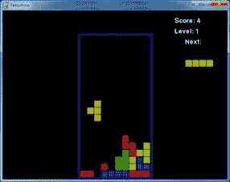

俄罗斯方块是俄罗斯方块的克隆。不同形状的方块(每个由四个盒子组成)从屏幕顶部落下，玩家必须引导它们向下形成完整的行，其中没有间隙。当形成一个完整的行时，该行消失，它上面的每一行都向下移动一行。玩家试图保持形成完整的线，直到屏幕填满，并且新的下落块不能放在屏幕上。

在这一章中，我为游戏程序中的不同事物提出了一套术语。

**棋盘**–棋盘由 10 x 20 个空格组成，积木可以在这些空格中落下和堆叠。

**方块**–方块是棋盘上一个单独填充的正方形空间。

**棋子**——玩家可以旋转和定位的从棋盘顶部落下的东西。每一块都有一个形状，由 4 个盒子组成。

**形状**——形状是游戏中不同类型的棋子。这些形状的名称是 T、S、Z、J、L、I 和 o。

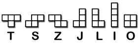

**模板**–代表一个形状所有可能旋转的形状数据结构列表。它们存储在名为`S_SHAPE_TEMPLATE`或`J_SHAPE_TEMPLATE`变量中。

**落地**——当一个棋子到达棋盘底部或接触到棋盘上的一个方格时，我们说这个棋子已经落地。在那个时候，下一块应该开始下落。

这个源代码可以从[【http://invpy.com/tetromino.py】](http://invpy.com/tetromino.py)下载。如果您得到任何错误消息，请查看错误消息中提到的行号，并检查您的代码是否有任何拼写错误。你也可以在 http://invpy.com/diff/tetromino将你的代码复制粘贴到 web 表单中，看看你的代码和书中的代码是否有区别。

您还需要将背景音乐文件放在与 *tetromino.py* 文件相同的文件夹中。您可以从这里下载它们:

[http://invpy.com/tetrisb.mid](http://invpy.com/tetrisb.mid)

[http://invpy.com/tetrisc.mid](http://invpy.com/tetrisc.mid)

```py
  1\. # Tetromino (a Tetris clone)
  2\. # By Al Sweigart [[email protected]](/cdn-cgi/l/email-protection)
  3\. # http://inventwithpython.com/pygame
  4\. # Creative Commons BY-NC-SA 3.0 US
  5\. 
  6\. import
random, time, pygame, sys
  7\. from
pygame.locals import *
  8\. 
  9\. FPS
= 25
 10\. WINDOWWIDTH
= 640
 11\. WINDOWHEIGHT
= 480
 12\. BOXSIZE
= 20
 13\. BOARDWIDTH
= 10
 14\. BOARDHEIGHT
= 20
 15\. BLANK
= '.'
 16\. 
17\. MOVESIDEWAYSFREQ
= 0.15
 18\. MOVEDOWNFREQ
= 0.1
 19\. 
20\. XMARGIN
= int((WINDOWWIDTH - BOARDWIDTH * BOXSIZE) / 2)
 21\. TOPMARGIN
= WINDOWHEIGHT - (BOARDHEIGHT * BOXSIZE) - 5
 22\. 
23\. #               R    G    B
 24\. WHITE
      = (255, 255, 255)
 25\. GRAY       
= (185, 185, 185)
 26\. BLACK      
= (  0,   0,   0)
 27\. RED        
= (155,   0,   0)
 28\. LIGHTRED   
= (175,  20,  20)
 29\. GREEN      
= (  0, 155,   0)
 30\. LIGHTGREEN 
= ( 20, 175,  20)
 31\. BLUE       
= (  0,   0, 155)
 32\. LIGHTBLUE  
= ( 20,  20, 175)
 33\. YELLOW     
= (155, 155,   0)
 34\. LIGHTYELLOW
= (175, 175,  20)
35\. 
 36\. BORDERCOLOR
= BLUE
 37\. BGCOLOR
= BLACK
 38\. TEXTCOLOR
= WHITE
 39\. TEXTSHADOWCOLOR
= GRAY
 40\. COLORS     
= (     BLUE,      GREEN,      RED,      YELLOW)
 41\. LIGHTCOLORS
= (LIGHTBLUE, LIGHTGREEN, LIGHTRED, LIGHTYELLOW)
 42\. assert
len(COLORS) == len(LIGHTCOLORS) # each color must
have light color
43\. 
44\. TEMPLATEWIDTH
= 5
 45\. TEMPLATEHEIGHT
= 5
 46\. 
 47\. S_SHAPE_TEMPLATE
= [['.....',
 48\.                      '.....',
 49\.                      '..OO.',
 50\.                      '.OO..',
 51\.                      '.....'],
 52\.                     ['.....',
 53\.                      '..O..',
 54\.                      '..OO.',
 55\.                      '...O.',
 56\.                      '.....']]
 57\. 
 58\. Z_SHAPE_TEMPLATE
= [['.....',
 59\.                      '.....',
 60\.                      '.OO..',
 61\.                      '..OO.',
 62\.                      '.....'],
 63\.                     ['.....',
 64\.                      '..O..',
 65\.                      '.OO..',
 66\.                      '.O...',
 67\.                      '.....']]
 68\. 
 69\. I_SHAPE_TEMPLATE
= [['..O..',
 70\.                      '..O..',
 71\.                      '..O..',
 72\.                      '..O..',
 73\.                      '.....'],
 74\.                     ['.....',
 75\.                      '.....',
 76\.                      'OOOO.',
 77\.                      '.....',
 78\.                      '.....']]
 79\. 
 80\. O_SHAPE_TEMPLATE
= [['.....',
 81\.                      '.....',
 82\.                      '.OO..',
 83\.                      '.OO..',
 84\.                      '.....']]
 85\. 
 86\. J_SHAPE_TEMPLATE
= [['.....',
 87\.                      '.O...',
 88\.                      '.OOO.',
 89\.                      '.....',
 90\.                      '.....'],
 91\.                     ['.....',
 92\.                      '..OO.',
 93\.                      '..O..',
 94\.                      '..O..',
 95\.                      '.....'],
 96\.                     ['.....',
 97\.                      '.....',
 98\.                      '.OOO.',
 99\.                      '...O.',
100\.                      '.....'],
101\.                     ['.....',
102\.                      '..O..',
103\.                      '..O..',
104\.                      '.OO..',
105\.                      '.....']]
106\. 
107\. L_SHAPE_TEMPLATE
= [['.....',
108\.                      '...O.',
109\.                      '.OOO.',
110\.                      '.....',
111\.                      '.....'],
112\.                     ['.....',
113\.                      '..O..',
114\.                      '..O..',
115\.                      '..OO.',
116\.                      '.....'],
117\.                     ['.....',
118\.                      '.....',
119\.                      '.OOO.',
120\.                      '.O...',
121\.                      '.....'],
122\.                     ['.....',
123\.                      '.OO..',
124\.                      '..O..',
125\.                      '..O..',
126\.                      '.....']]
127\. 
128\. T_SHAPE_TEMPLATE
= [['.....',
129\.                      '..O..',
130\.                      '.OOO.',
131\.                      '.....',
132\.                      '.....'],
133\.                     ['.....',
134\.                      '..O..',
135\.                      '..OO.',
136\.                      '..O..',
137\.                      '.....'],
138\.                     ['.....',
139\.                      '.....',
140\.                      '.OOO.',
141\.                      '..O..',
142\.                      '.....'],
143\.                     ['.....',
144\.                      '..O..',
145\.                      '.OO..',
146\.                      '..O..',
147\.                      '.....']]
148\. 
149\. SHAPES
= {'S': S_SHAPE_TEMPLATE,
150\.           'Z':
Z_SHAPE_TEMPLATE,
151\.           'J':
J_SHAPE_TEMPLATE,
152\.           'L':
L_SHAPE_TEMPLATE,
153\.           'I':
I_SHAPE_TEMPLATE,
154\.           'O':
O_SHAPE_TEMPLATE,
155\.           'T':
T_SHAPE_TEMPLATE}
156\. 
157.
158\. def
main():
159\.     global
FPSCLOCK, DISPLAYSURF, BASICFONT, BIGFONT
160\.     pygame.init()
161\.     FPSCLOCK
= pygame.time.Clock()
162\.     DISPLAYSURF
= pygame.display.set_mode((WINDOWWIDTH, WINDOWHEIGHT))
163\.     BASICFONT
= pygame.font.Font('freesansbold.ttf', 18)
164\.     BIGFONT
= pygame.font.Font('freesansbold.ttf', 100)
165\.     pygame.display.set_caption('Tetromino')
166\. 
167\.     showTextScreen('Tetromino')
168\.     while
True: # game loop
169\.         if
random.randint(0, 1) == 0:
170\.             pygame.mixer.music.load('tetrisb.mid')
171\.         else:
172\.             pygame.mixer.music.load('tetrisc.mid')
173\.         pygame.mixer.music.play(-1,
0.0)
174\.         runGame()
175\.         pygame.mixer.music.stop()
176\.         showTextScreen('Game
Over')
177\. 
178\. 
179\. def
runGame():
180\.     # setup variables for the start of the game
181\.     board
= getBlankBoard()
182\.     lastMoveDownTime
= time.time()
183\.     lastMoveSidewaysTime
= time.time()
184\.     lastFallTime
= time.time()
185\.     movingDown
= False # note: there is no movingUp variable
186\.     movingLeft
= False
187\.     movingRight
= False
188\.     score
= 0
189\.     level,
fallFreq = calculateLevelAndFallFreq(score)
190\. 
191\.     fallingPiece
= getNewPiece()
192\.     nextPiece
= getNewPiece()
193\. 
194\.     while
True: # main game loop
195\.         if
fallingPiece == None:
196\.             # No falling piece in play, so start a new piece at the
top
197\.             fallingPiece
= nextPiece
198\.             nextPiece
= getNewPiece()
199\.             lastFallTime
= time.time() # reset lastFallTime
200\. 
201\.             if
not isValidPosition(board, fallingPiece):
202\.                 return
# can't fit a new piece on the board, so game
over
203\. 
204\.         checkForQuit()
205\.         for
event in pygame.event.get(): # event handling
loop
206\.             if
event.type == KEYUP:
207\.                 if
(event.key == K_p):
208\.                     # Pausing the game
209\.                     DISPLAYSURF.fill(BGCOLOR)
210\.                     pygame.mixer.music.stop()
211\.                     showTextScreen('Paused')
# pause until a key press
212\.                     pygame.mixer.music.play(-1,
0.0)
213\.                     lastFallTime
= time.time()
214\.                     lastMoveDownTime
= time.time()
215\.                     lastMoveSidewaysTime
= time.time()
216\.                 elif
(event.key == K_LEFT or event.key == K_a):
217\.                     movingLeft
= False
218\.                 elif
(event.key == K_RIGHT or event.key == K_d):
219\.                     movingRight
= False
220\.                 elif
(event.key == K_DOWN or event.key == K_s):
221\.                     movingDown
= False
222\. 
223\.             elif
event.type == KEYDOWN:
224\.                 # moving the block sideways
225\.                 if
(event.key == K_LEFT or event.key == K_a) and isValidPosition(board,
fallingPiece, adjX=-1):
226\.                     fallingPiece['x']
-= 1
227\.                     movingLeft
= True
228\.                     movingRight
= False
229\.                     lastMoveSidewaysTime
= time.time()
230.
231\.                 elif
(event.key == K_RIGHT or event.key == K_d) and isValidPosition(board,
fallingPiece, adjX=1):
232\.                     fallingPiece['x']
+= 1
233\.                     movingRight
= True
234\.                     movingLeft
= False
235\.                     lastMoveSidewaysTime
= time.time()
236\. 
237\.                 # rotating the block (if there is room to rotate)
238\.                 elif
(event.key == K_UP or event.key == K_w):
239\.                     fallingPiece['rotation']
= (fallingPiece['rotation'] + 1) % len(SHAPES[fallingPiece['shape']])
240\.                     if
not isValidPosition(board, fallingPiece):
241\.                         fallingPiece['rotation']
= (fallingPiece['rotation'] - 1) % len(SHAPES[fallingPiece['shape']])
242\.                 elif
(event.key == K_q): # rotate the other direction
243\.                     fallingPiece['rotation']
= (fallingPiece['rotation'] - 1) % len(SHAPES[fallingPiece['shape']])
244\.                     if
not isValidPosition(board, fallingPiece):
245\.                         fallingPiece['rotation']
= (fallingPiece['rotation'] + 1) % len(SHAPES[fallingPiece['shape']])
246\. 
247\.                 # making the block fall faster with the down key
248\.                 elif
(event.key == K_DOWN or event.key == K_s):
249\.                     movingDown
= True
250\.                     if
isValidPosition(board, fallingPiece, adjY=1):
251\.                         fallingPiece['y']
+= 1
252\.                     lastMoveDownTime
= time.time()
253\. 
254\.                 # move the current block all the way down
255\.                 elif
event.key == K_SPACE:
256\.                     movingDown
= False
257\.                     movingLeft
= False
258\.                     movingRight
= False
259\.                     for
i in range(1, BOARDHEIGHT):
260\.                         if
not isValidPosition(board, fallingPiece, adjY=i):
261\.                             break
262\.                     fallingPiece['y']
+= i - 1
263\. 
264\.         # handle moving the block because of user input
265\.         if
(movingLeft or movingRight) and time.time() - lastMoveSidewaysTime > MOVESIDEWAYSFREQ:
266\.             if
movingLeft and isValidPosition(board, fallingPiece, adjX=-1):
267\.                 fallingPiece['x']
-= 1
268\.             elif
movingRight and isValidPosition(board, fallingPiece, adjX=1):
269\.                 fallingPiece['x']
+= 1
270\.             lastMoveSidewaysTime
= time.time()
271\. 
272\.         if
movingDown and time.time() - lastMoveDownTime > MOVEDOWNFREQ and
isValidPosition(board, fallingPiece, adjY=1):
273\.             fallingPiece['y']
+= 1
274\.             lastMoveDownTime
= time.time()
275\. 
276\.         # let the piece fall if it is time to fall
277\.         if
time.time() - lastFallTime > fallFreq:
278\.             # see if the piece has landed
279\.             if
not isValidPosition(board, fallingPiece, adjY=1):
280\.                 # falling piece has landed, set it on the board
281\.                 addToBoard(board,
fallingPiece)
282\.                 score
+= removeCompleteLines(board)
283\.                 level,
fallFreq = calculateLevelAndFallFreq(score)
284\.                 fallingPiece
= None
285\.             else:
286\.                 # piece did not land, just move the block down
287\.                 fallingPiece['y']
+= 1
288\.                 lastFallTime
= time.time()
289\. 
290\.         # drawing everything on the screen
291\.         DISPLAYSURF.fill(BGCOLOR)
292\.         drawBoard(board)
293\.         drawStatus(score,
level)
294\.         drawNextPiece(nextPiece)
295\.         if
fallingPiece != None:
296\.             drawPiece(fallingPiece)
297\. 
298\.         pygame.display.update()
299\.         FPSCLOCK.tick(FPS)
300\. 
301\. 
302\. def
makeTextObjs(text, font, color):
303\.     surf
= font.render(text, True, color)
304\.     return
surf, surf.get_rect()
305\. 
306\. 
307\. def
terminate():
308\.     pygame.quit()
309\.     sys.exit()
310\. 
311\. 
312\. def
checkForKeyPress():
313\.     # Go through event queue looking for a KEYUP event.
314\.     # Grab KEYDOWN events to remove them from the event
queue.
315\.     checkForQuit()
316.
317\.     for
event in pygame.event.get([KEYDOWN, KEYUP]):
318\.         if
event.type == KEYDOWN:
319\.             continue
320\.         return
event.key
321\.     return
None
322\. 
323\. 
324\. def
showTextScreen(text):
325\.     # This function displays large text in the
326\.     # center of the screen until a key is pressed.
327\.     # Draw the text drop shadow
328\.     titleSurf,
titleRect = makeTextObjs(text, BIGFONT, TEXTSHADOWCOLOR)
329\.     titleRect.center
= (int(WINDOWWIDTH / 2), int(WINDOWHEIGHT / 2))
330\.     DISPLAYSURF.blit(titleSurf,
titleRect)
331\. 
332\.     # Draw the text
333\.     titleSurf,
titleRect = makeTextObjs(text, BIGFONT, TEXTCOLOR)
334\.     titleRect.center
= (int(WINDOWWIDTH / 2) - 3, int(WINDOWHEIGHT / 2) - 3)
335\.     DISPLAYSURF.blit(titleSurf,
titleRect)
336\. 
337\.     # Draw the additional "Press a key to play."
text.
338\.     pressKeySurf,
pressKeyRect = makeTextObjs('Press a key to play.', BASICFONT, TEXTCOLOR)
339\.     pressKeyRect.center
= (int(WINDOWWIDTH / 2), int(WINDOWHEIGHT / 2) + 100)
340\.     DISPLAYSURF.blit(pressKeySurf,
pressKeyRect)
341\. 
342\.     while
checkForKeyPress() == None:
343\.         pygame.display.update()
344\.         FPSCLOCK.tick()
345\. 
346\. 
347\. def
checkForQuit():
348\.     for
event in pygame.event.get(QUIT): # get all the QUIT
events
349\.         terminate()
# terminate if any QUIT events are present
350\.     for
event in pygame.event.get(KEYUP): # get all the
KEYUP events
351\.         if
event.key == K_ESCAPE:
352\.             terminate()
# terminate if the KEYUP event was for the Esc
key
353\.         pygame.event.post(event)
# put the other KEYUP event objects back
354\. 
355.
356\. def
calculateLevelAndFallFreq(score):
357\.     # Based on the score, return the level the player is on
and
358\.     # how many seconds pass until a falling piece falls one
space.
359\.     level
= int(score / 10) + 1
360\.     fallFreq
= 0.27 - (level * 0.02)
361\.     return
level, fallFreq
362\. 
363\. def
getNewPiece():
364\.     # return a random new piece in a random rotation and
color
365\.     shape
= random.choice(list(SHAPES.keys()))
366\.     newPiece
= {'shape': shape,
367\.                 'rotation':
random.randint(0, len(SHAPES[shape]) - 1),
368\.                 'x':
int(BOARDWIDTH / 2) - int(TEMPLATEWIDTH / 2),
369\.                 'y':
-2, # start it above the board (i.e. less than 0)
370\.                 'color':
random.randint(0, len(COLORS)-1)}
371\.     return
newPiece
372\. 
373\. 
374\. def
addToBoard(board, piece):
375\.     # fill in the board based on piece's location, shape,
and rotation
376\.     for
x in range(TEMPLATEWIDTH):
377\.         for
y in range(TEMPLATEHEIGHT):
378\.             if
SHAPES[piece['shape']][piece['rotation']][y][x] != BLANK:
379\.                 board[x
+ piece['x']][y + piece['y']] = piece['color']
380\. 
381\. 
382\. def
getBlankBoard():
383\.     # create and return a new blank board data structure
384\.     board
= []
385\.     for
i in range(BOARDWIDTH):
386\.         board.append([BLANK]
* BOARDHEIGHT)
387\.     return
board
388\. 
389\. 
390\. def
isOnBoard(x, y):
391\.     return
x >= 0 and x < BOARDWIDTH and y < BOARDHEIGHT
392\. 
393\. 
394\. def
isValidPosition(board, piece, adjX=0, adjY=0):
395\.     # Return True if the piece is within the board and not
colliding
396\.     for
x in range(TEMPLATEWIDTH):
397\.         for
y in range(TEMPLATEHEIGHT):
398.            
isAboveBoard = y + piece['y'] + adjY < 0
399\.             if
isAboveBoard or SHAPES[piece['shape']][piece['rotation']][y][x] == BLANK:
400\.                 continue
401\.             if
not isOnBoard(x + piece['x'] + adjX, y + piece['y'] + adjY):
402\.                 return
False
403\.             if
board[x + piece['x'] + adjX][y + piece['y'] + adjY] != BLANK:
404\.                 return
False
405\.     return
True
406\. 
407\. def
isCompleteLine(board, y):
408\.     # Return True if the line filled with boxes with no
gaps.
409\.     for
x in range(BOARDWIDTH):
410\.         if
board[x][y] == BLANK:
411\.             return
False
412\.     return
True
413\. 
414\. 
415\. def
removeCompleteLines(board):
416\.     # Remove any completed lines on the board, move
everything above them down, and return the number of complete lines.
417\.     numLinesRemoved
= 0
418\.     y
= BOARDHEIGHT - 1 # start y at the bottom of the
board
419\.     while
y >= 0:
420\.         if
isCompleteLine(board, y):
421\.             # Remove the line and pull boxes down by one line.
422\.             for
pullDownY in range(y, 0, -1):
423\.                 for
x in range(BOARDWIDTH):
424\.                     board[x][pullDownY]
= board[x][pullDownY-1]
425\.             # Set very top line to blank.
426\.             for
x in range(BOARDWIDTH):
427\.                 board[x][0]
= BLANK
428\.             numLinesRemoved
+= 1
429\.             # Note on the next iteration of the loop, y is the
same.
430\.             # This is so that if the line that was pulled down is
also
431\.             # complete, it will be removed.
432\.         else:
433\.             y
-= 1 # move on to check next row up
434\.     return
numLinesRemoved
435\. 
436\. 
437\. def
convertToPixelCoords(boxx, boxy):
438\.     # Convert the given xy coordinates of the board to xy 
439\.     # coordinates of the location on the screen.
440\.     return
(XMARGIN + (boxx * BOXSIZE)), (TOPMARGIN + (boxy * BOXSIZE))
441\. 
442\. 
443\. def
drawBox(boxx, boxy, color, pixelx=None, pixely=None):
444\.     # draw a single box (each tetromino piece has four
boxes)
445\.     # at xy coordinates on the board. Or, if pixelx &
pixely
446\.     # are specified, draw to the pixel coordinates stored
in
447\.     # pixelx & pixely (this is used for the
"Next" piece).
448\.     if
color == BLANK:
449\.         return
450\.     if
pixelx == None and pixely == None:
451\.         pixelx,
pixely = convertToPixelCoords(boxx, boxy)
452\.     pygame.draw.rect(DISPLAYSURF,
COLORS[color], (pixelx + 1, pixely + 1, BOXSIZE - 1, BOXSIZE - 1))
453\.     pygame.draw.rect(DISPLAYSURF,
LIGHTCOLORS[color], (pixelx + 1, pixely + 1, BOXSIZE - 4, BOXSIZE - 4))
454\. 
455\. 
456\. def
drawBoard(board):
457\.     # draw the border around the board
458\.     pygame.draw.rect(DISPLAYSURF,
BORDERCOLOR, (XMARGIN - 3, TOPMARGIN - 7, (BOARDWIDTH * BOXSIZE) + 8,
(BOARDHEIGHT * BOXSIZE) + 8), 5)
459\. 
460\.     # fill the background of the board
461\.     pygame.draw.rect(DISPLAYSURF,
BGCOLOR, (XMARGIN, TOPMARGIN, BOXSIZE * BOARDWIDTH, BOXSIZE * BOARDHEIGHT))
462\.     # draw the individual boxes on the board
463\.     for
x in range(BOARDWIDTH):
464\.         for
y in range(BOARDHEIGHT):
465\.             drawBox(x,
y, board[x][y])
466\. 
467\. 
468\. def
drawStatus(score, level):
469\.     # draw the score text
470\.     scoreSurf
= BASICFONT.render('Score: %s' % score, True, TEXTCOLOR)
471\.     scoreRect
= scoreSurf.get_rect()
472\.     scoreRect.topleft
= (WINDOWWIDTH - 150, 20)
473\.     DISPLAYSURF.blit(scoreSurf,
scoreRect)
474\. 
475\.     # draw the level text
476\.     levelSurf
= BASICFONT.render('Level: %s' % level, True, TEXTCOLOR)
477\.     levelRect
= levelSurf.get_rect()
478\.     levelRect.topleft
= (WINDOWWIDTH - 150, 50)
479\.     DISPLAYSURF.blit(levelSurf,
levelRect)
480\. 
481\. 
482\. def
drawPiece(piece, pixelx=None, pixely=None):
483\.     shapeToDraw
= SHAPES[piece['shape']][piece['rotation']]
484\.     if
pixelx == None and pixely == None:
485\.         # if pixelx & pixely hasn't been specified, use the
location stored in the piece data structure
486\.         pixelx,
pixely = convertToPixelCoords(piece['x'], piece['y'])
487\. 
488\.     # draw each of the blocks that make up the piece
489\.     for
x in range(TEMPLATEWIDTH):
490\.         for
y in range(TEMPLATEHEIGHT):
491\.             if
shapeToDraw[y][x] != BLANK:
492\.                 drawBox(None,
None, piece['color'], pixelx + (x * BOXSIZE), pixely + (y * BOXSIZE))
493.
494.
495\. def
drawNextPiece(piece):
496\.     # draw the "next" text
497\.     nextSurf
= BASICFONT.render('Next:', True, TEXTCOLOR)
498\.     nextRect
= nextSurf.get_rect()
499\.     nextRect.topleft
= (WINDOWWIDTH - 120, 80)
500\.     DISPLAYSURF.blit(nextSurf,
nextRect)
501\.     # draw the "next" piece
502\.     drawPiece(piece,
pixelx=WINDOWWIDTH-120, pixely=100)
503\. 
504\. 
505\. if
__name__ == '__main__':
506\.     main()
```

```py
  1\. # Tetromino (a Tetris clone)
  2\. # By Al Sweigart [[email protected]](/cdn-cgi/l/email-protection)
  3\. # http://inventwithpython.com/pygame
  4\. # Creative Commons BY-NC-SA 3.0 US
  5\. 
  6\. import
random, time, pygame, sys
  7\. from
pygame.locals import *
  8\. 
  9\. FPS
= 25
 10\. WINDOWWIDTH
= 640
 11\. WINDOWHEIGHT
= 480
 12\. BOXSIZE
= 20
 13\. BOARDWIDTH
= 10
 14\. BOARDHEIGHT
= 20
 15\. BLANK
= '.'
```

这些是我们的俄罗斯方块游戏使用的常量。每个方框是一个 20 像素宽和高的正方形。板子本身是 10 个盒子宽，20 个盒子高。`BLANK`常量将被用作表示板卡数据结构中空白空间的值。

```py
 17\. MOVESIDEWAYSFREQ
= 0.15
 18\. MOVEDOWNFREQ
= 0.1
```

每当玩家按下左或右箭头键时，下落的棋子应该分别向左或向右移动一个盒子。但是，玩家也可以按住左箭头键或右箭头键来继续移动下落的棋子。`MOVESIDEWAYSFREQ`常量将设置它，这样每 0.15 秒按住左或右箭头键，棋子将移动另一格。

常数`MOVEDOWNFREQ`是一样的，除了它告诉当玩家按住向下箭头键时，棋子多长时间掉一格。

```py
 20\. XMARGIN
= int((WINDOWWIDTH - BOARDWIDTH * BOXSIZE) / 2)
 21\. TOPMARGIN
= WINDOWHEIGHT - (BOARDHEIGHT * BOXSIZE) - 5
```

该程序需要计算有多少像素是董事会的左侧和右侧，以供在程序中稍后使用。`WINDOWWIDTH`是整个窗口的总像素宽度。棋盘有`BOARDWIDTH`个方块宽，每个方块有`BOXSIZE`个像素宽。如果我们从棋盘上的每个宽框中减去`BOXSIZE`像素(即`BOARDWIDTH * BOXSIZE`，我们将得到棋盘左右两边的边距大小。如果我们将此除以`2`，那么我们将只有一个边距的大小。由于页边距大小相同，我们可以使用`XMARGIN`来表示左侧或右侧的页边距。

我们可以用类似的方法计算木板顶部和窗户顶部之间的空间大小。棋盘将在窗口底部上方 5 个像素处绘制，因此从`topmargin`中减去`5`以说明这一点。

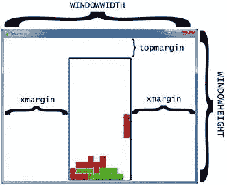

```py
 23\. #               R    G    B
 24\. WHITE      
= (255, 255, 255)
 25\. GRAY       
= (185, 185, 185)
 26\. BLACK      
= (  0,   0,   0)
 27\. RED        
= (155,   0,   0)
 28\. LIGHTRED   
= (175,  20,  20)
 29\. GREEN      
= (  0, 155,   0)
 30\. LIGHTGREEN 
= ( 20, 175,  20)
 31\. BLUE       
= (  0,   0, 155)
 32\. LIGHTBLUE  
= ( 20,  20, 175)
 33\. YELLOW     
= (155, 155,   0)
 34\. LIGHTYELLOW
= (175, 175,  20)
35\. 
 36\. BORDERCOLOR
= BLUE
 37\. BGCOLOR
= BLACK
 38\. TEXTCOLOR
= WHITE
 39\. TEXTSHADOWCOLOR
= GRAY
 40\. COLORS     
= (     BLUE,      GREEN,      RED,      YELLOW)
 41\. LIGHTCOLORS
= (LIGHTBLUE, LIGHTGREEN, LIGHTRED, LIGHTYELLOW)
 42\. assert
len(COLORS) == len(LIGHTCOLORS) # each color must
have light color
```

这些作品将有四种颜色:蓝色、绿色、红色和黄色。当我们画盒子的时候，盒子上会有一个浅色的高光。所以这意味着我们需要创造浅蓝、浅绿、浅红和浅黄的颜色。

这四种颜色中的每一种都将存储在名为`COLORS`(正常颜色)和`LIGHTCOLORS`(较亮颜色)的元组中。

```py
 44\. TEMPLATEWIDTH
= 5
 45\. TEMPLATEHEIGHT
= 5
 46\. 
 47\. S_SHAPE_TEMPLATE
= [['.....',
 48\.                      '.....',
 49\.                      '..OO.',
 50\.                      '.OO..',
 51\.                      '.....'],
 52\.                     ['.....',
 53\.                      '..O..',
 54\.                      '..OO.',
 55\.                      '...O.',
 56\.                      '.....']]
 57\. 
 58\. Z_SHAPE_TEMPLATE
= [['.....',
 59\.                      '.....',
 60\.                      '.OO..',
 61\.                      '..OO.',
 62\.                      '.....'],
 63\.                     ['.....',
 64\.                      '..O..',
 65\.                      '.OO..',
 66\.                      '.O...',
 67\.                      '.....']]
 68\. 
 69\. I_SHAPE_TEMPLATE
= [['..O..',
 70\.                      '..O..',
 71\.                      '..O..',
 72\.                      '..O..',
 73\.                      '.....'],
 74\.                     ['.....',
 75\.                      '.....',
 76\.                      'OOOO.',
 77\.                      '.....',
 78\.                      '.....']]
 79\. 
 80\. O_SHAPE_TEMPLATE
= [['.....',
 81\.                      '.....',
 82\.                      '.OO..',
 83\.                      '.OO..',
 84\.                      '.....']]
 85\. 
 86\. J_SHAPE_TEMPLATE
= [['.....',
 87\.                      '.O...',
 88\.                      '.OOO.',
 89\.                      '.....',
 90\.                      '.....'],
 91\.                     ['.....',
 92\.                      '..OO.',
 93\.                      '..O..',
 94\.                      '..O..',
 95\.                      '.....'],
 96\.                     ['.....',
 97\.                      '.....',
 98\.                      '.OOO.',
 99\.                      '...O.',
100\.                      '.....'],
101\.                     ['.....',
102\.                      '..O..',
103\.                      '..O..',
104\.                      '.OO..',
105\.                      '.....']]
106\. 
107\. L_SHAPE_TEMPLATE
= [['.....',
108\.                      '...O.',
109\.                      '.OOO.',
110\.                      '.....',
111\.                      '.....'],
112\.                     ['.....',
113\.                      '..O..',
114\.                      '..O..',
115\.                      '..OO.',
116\.                      '.....'],
117\.                     ['.....',
118\.                      '.....',
119\.                      '.OOO.',
120\.                      '.O...',
121\.                      '.....'],
122\.                     ['.....',
123\.                      '.OO..',
124\.                      '..O..',
125\.                      '..O..',
126\.                      '.....']]
127\. 
128\. T_SHAPE_TEMPLATE
= [['.....',
129\.                      '..O..',
130\.                      '.OOO.',
131\.                      '.....',
132\.                      '.....'],
133\.                     ['.....',
134\.                      '..O..',
135\.                      '..OO.',
136\.                      '..O..',
137\.                      '.....'],
138\.                     ['.....',
139\.                      '.....',
140\.                      '.OOO.',
141\.                      '..O..',
142\.                      '.....'],
143\.                     ['.....',
144\.                      '..O..',
145\.                      '.OO..',
146\.                      '..O..',
147\.                      '.....']]
```

我们的游戏程序需要知道每个形状是如何形成的，包括所有可能的旋转。为了做到这一点，我们将创建字符串列表。内部字符串列表将表示形状的一次旋转，如下所示:

['.....',

'.....',

'..“哦，”,

。“哦..”,

'.....']

我们将编写其余的代码，以便它解释如上所示的字符串列表来表示一个形状，其中句点是空格，O 是方框，如下所示:

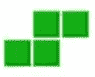

您可以看到这个列表分布在文件编辑器的许多行中。这是完全有效的 Python，因为 Python 解释器意识到，直到它看到结束方括号`]`，列表才结束。缩进并不重要，因为 Python 知道列表中间的新块不会有不同的缩进。下面的代码运行良好:

spam = ['hello '，3.14，' world '，42，10，' fuzz']

彩蛋= ['你好'，3.14，

世界

         , 42,

10，“模糊”

当然，如果我们将列表中的所有项目排成一行，或者像`spam`一样放在一行中，那么`eggs`列表的代码可读性会更好。

通常，在文件编辑器中将一行代码拆分成多行需要在行尾添加一个`\`字符。`\`告诉 Python，“这段代码继续到下一行。”(这条斜线最早是在`isValidMove()`功能中的滑动益智游戏中使用的。)

我们将通过创建这些字符串列表的列表来制作形状的“模板”数据结构，并将它们存储在诸如`S_SHAPE_TEMPLATE`的变量中。这样，`len(S_SHAPE_TEMPLATE)`将表示 S 形有多少种可能的旋转，`S_SHAPE_TEMPLATE[0]`将表示 S 形的第一种可能的旋转。第 47 到 147 行将为每个形状创建“模板”数据结构。

想象一下，每一个可能的棋子都在一个 5 x 5 的小棋盘上，棋盘上的一些空间被盒子填满。以下使用`S_SHAPE_TEMPLATE[0]`的表达式是`True`:

S_SHAPE_TEMPLATE[0][2][2] == 'O '

S_SHAPE_TEMPLATE[0][2][3] == 'O '

S_SHAPE_TEMPLATE[0][3][1] == 'O '

S_SHAPE_TEMPLATE[0][3][2] == 'O '

如果我们在纸上描绘这个形状，它看起来会像这样:

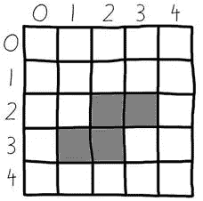

这就是我们如何将像 Tetromino 片段这样的东西表示为字符串和列表这样的 Python 值。`TEMPLATEWIDTH`和`TEMPLATEHEIGHT`常量简单地设置每个形状旋转的每行和每列应该有多大。(模板将始终为 5x5。)

```py
149\. SHAPES
= {'S': S_SHAPE_TEMPLATE,
150\.           'Z':
Z_SHAPE_TEMPLATE,
151\.           'J':
J_SHAPE_TEMPLATE,
152\.           'L':
L_SHAPE_TEMPLATE,
153\.           'I':
I_SHAPE_TEMPLATE,
154\.           'O':
O_SHAPE_TEMPLATE,
155\.           'T':
T_SHAPE_TEMPLATE}
```

`SHAPES`变量将是一个存储所有不同模板的字典。因为每个模板都有单个形状的所有可能旋转，这意味着`SHAPES`变量包含每个可能形状的所有可能旋转。这将是包含我们游戏中所有形状数据的数据结构。

## `main()`功能

```py
158\. def
main():
159\.     global
FPSCLOCK, DISPLAYSURF, BASICFONT, BIGFONT
160\.     pygame.init()
161\.     FPSCLOCK
= pygame.time.Clock()
162\.     DISPLAYSURF
= pygame.display.set_mode((WINDOWWIDTH, WINDOWHEIGHT))
163\.     BASICFONT
= pygame.font.Font('freesansbold.ttf', 18)
164\.     BIGFONT
= pygame.font.Font('freesansbold.ttf', 100)
165\.     pygame.display.set_caption('Tetromino')
166\. 
167\.     showTextScreen('Tetromino')
```

`main()`函数处理创建更多的全局常量，并显示程序运行时出现的开始屏幕。

```py
168\.     while
True: # game loop
169\.         if
random.randint(0, 1) == 0:
170\.             pygame.mixer.music.load('tetrisb.mid')
171\.         else:
172\.             pygame.mixer.music.load('tetrisc.mid')
173\.         pygame.mixer.music.play(-1,
0.0)
174\.         runGame()
175\.         pygame.mixer.music.stop()
176\.         showTextScreen('Game
Over')
```

实际游戏的代码都在`runGame()`里。这里的`main()`函数只是随机决定开始播放什么背景音乐(要么是 *tetrisb.mid* 要么是 *tetrisc.mid* MIDI 音乐文件)，然后调用`runGame()`开始游戏。当玩家输了，`runGame()`将返回到`main()`，然后停止背景音乐并在屏幕上显示游戏。

当玩家按下一个键时，在屏幕上显示游戏的`showTextScreen()`功能将返回。游戏循环将循环回到第 169 行的开始，并开始另一个游戏。

```py
179\. def
runGame():
180\.     # setup variables for the start of the game
181\.     board
= getBlankBoard()
182\.     lastMoveDownTime
= time.time()
183\.     lastMoveSidewaysTime
= time.time()
184\.     lastFallTime
= time.time()
185\.     movingDown
= False # note: there is no movingUp variable
186\.     movingLeft
= False
187\.     movingRight
= False
188\.     score
= 0
189\.     level,
fallFreq = calculateLevelAndFallFreq(score)
190\. 
191\.     fallingPiece
= getNewPiece()
192\.     nextPiece
= getNewPiece()
```

在游戏开始和棋子开始下落之前，我们需要将一些变量初始化为游戏开始时的值。在第 191 行上,`fallingPiece`变量将被设置为玩家可以旋转的当前下落的棋子。在第 192 行，`nextPiece`变量将被设置为在屏幕“下一个”部分显示的棋子，这样玩家就知道在设置了落下的棋子后哪个棋子将会出现。

```py
194\.     while
True: # main game loop
195\.         if
fallingPiece == None:
196\.             # No falling piece in play, so start a new piece at the
top
197\.             fallingPiece
= nextPiece
198\.             nextPiece
= getNewPiece()
199\.             lastFallTime
= time.time() # reset lastFallTime
200\. 
201\.             if
not isValidPosition(board, fallingPiece):
202\.                 return
# can't fit a new piece on the board, so game
over
203\. 
204\.         checkForQuit()
```

从第 194 行开始的主游戏循环在棋子掉到底部时处理游戏主要部分的所有代码。落体落地后，`fallingPiece`变量被设置为`None`。这意味着`nextPiece`中的棋子应该被复制到`fallingPiece`变量中，一个随机的新棋子应该被放入`nextPiece`变量中。通过`getNewPiece()`功能可以生成一个新的工件。`lastFallTime`变量也被重置为当前时间，因此无论`fallFreq`中有多少秒，棋子都会落下。

`getNewPiece()`放置在棋盘上方一点的棋子，通常棋子的一部分已经在棋盘上。但是如果这是一个无效位置，因为棋盘已经填满了(在这种情况下，201 行上的`isValidPosition()`调用将返回`False`，那么我们知道棋盘已经填满了，玩家应该输掉这场游戏。当这种情况发生时，`runGame()`函数返回。

```py
205\.         for
event in pygame.event.get(): # event handling
loop
206\.             if
event.type == KEYUP:
```

事件处理循环负责玩家何时旋转落下的棋子、移动落下的棋子或暂停游戏。

```py
207\.                 if
(event.key == K_p):
208\.                     # Pausing the game
209\.                     DISPLAYSURF.fill(BGCOLOR)
210\.                     pygame.mixer.music.stop()
211\.                     showTextScreen('Paused')
# pause until a key press
212\.                     pygame.mixer.music.play(-1,
0.0)
213\.                     lastFallTime
= time.time()
214\.                     lastMoveDownTime
= time.time()
215\.                     lastMoveSidewaysTime
= time.time()
```

如果玩家按了 P 键，那么游戏应该暂停。我们需要对玩家隐藏棋盘(否则玩家可能会通过暂停游戏并花时间决定将棋子移动到哪里来作弊)。

代码通过调用`DISPLAYSURF.fill(BGCOLOR)`清空显示界面并停止音乐。调用`showTextScreen()`函数来显示“暂停”文本，并等待玩家按键继续。

一旦玩家按下一个键，`showTextScreen()`就会返回。212 行将重启背景音乐。此外，由于玩家暂停游戏后可能已经过了很长时间，因此`lastFallTime`、`lastMoveDownTime`和`lastMoveSidewaysTime`变量都应该被重置为当前时间(这是在第 213 到 215 行完成的)。

```py
216\.                 elif
(event.key == K_LEFT or event.key == K_a):
217\.                     movingLeft
= False
218\.                 elif
(event.key == K_RIGHT or event.key == K_d):
219\.                     movingRight
= False
220\.                 elif
(event.key == K_DOWN or event.key == K_s):
221\.                     movingDown
= False
```

放松其中一个箭头键(或 WASD 键)会将`movingLeft`、`movingRight`或`movingDown`变量设置回`False`，表明玩家不再想向这些方向移动棋子。稍后的代码将根据这些“移动”变量中的布尔值来处理该做什么。请注意，向上箭头和 W 键用于旋转棋子，而不是向上移动棋子。这就是为什么没有`movingUp`变量。

```py
223\.             elif
event.type == KEYDOWN:
224\.                 # moving the block sideways
225\.                 if
(event.key == K_LEFT or event.key == K_a) and isValidPosition(board, fallingPiece,
adjX=-1):
226\.                     fallingPiece['x']
-= 1
227\.                     movingLeft
= True
228\.                     movingRight
= False
229\.                     lastMoveSidewaysTime
= time.time()
```

当左箭头键被按下时(向左移动是下落棋子的有效移动，由对`isValidPosition()`的调用确定)，那么我们应该通过用`1`减去`fallingPiece['x']`的值，将位置向左改变一格。`isValidPosition()`功能有可选参数`adjX`和`adjY`。通常情况下,`isValidPosition()`函数检查由第二个参数传递的 piece 对象提供的数据的位置。然而，有时我们并不想检查这个片段当前的位置，而是从那个位置过去几个空格。

如果我们为`adjX`(“adjusted X”的简称)传递`-1`，那么它不会检查块的数据结构中位置的有效性，而是检查块向左移动一个空格时的位置。通过`1`到`adjX`会检查右边的一个空格。还有一个`adjY`可选参数。为`adjY`传递`-1`将检查棋子当前位置上方的一个空格，为`adjY`传递类似`3`的值将检查棋子当前位置下方的三个空格。

`movingLeft`变量被设置为`True`，为了确保下落的棋子不会向左*和向右*移动，第 228 行的`movingRight`变量被设置为`False`。第 229 行的`lastMoveSidewaysTime`变量将被更新为当前时间。

设置这些变量是为了让玩家只需按住箭头键就可以继续移动棋子。如果`movingLeft`变量设置为`True`，程序就可以知道左箭头键(或一个键)已经被按下，还没有放开。如果从存储在`lastMoveSidewaysTime`中的时间开始已经过了 0.15 秒(存储在`MOVESIDEWAYSFREQ`中的数字)，那么是时候让程序将下落的棋子再次向左移动了。

`lastMoveSidewaysTime`的工作方式就像`lastClickTime`变量在模拟章节中的工作方式一样。

```py
231\.                 elif
(event.key == K_RIGHT or event.key == K_d) and isValidPosition(board, fallingPiece,
adjX=1):
232\.                     fallingPiece['x']
+= 1
233\.                     movingRight
= True
234\.                     movingLeft
= False
235\.                     lastMoveSidewaysTime
= time.time()
```

第 231 行到第 235 行的代码与第 225 行到第 229 行的几乎相同，除了它处理当右箭头键(或 D 键)被按下时将下落的棋子向右移动。

```py
237\.                 # rotating the block (if there is room to rotate)
238\.                 elif
(event.key == K_UP or event.key == K_w):
239\.                     fallingPiece['rotation']
= (fallingPiece['rotation'] + 1) % len(SHAPES[fallingPiece['shape']])
```

向上箭头键(或 W 键)将旋转下落的棋子到下一个旋转点。代码所要做的就是用`1`增加`fallingPiece`字典中`'rotation'`键的值。然而，如果增加`'rotation'`键的值使其大于旋转的总数，那么“修改”该形状可能旋转的总数(这就是`len(SHAPES[fallingPiece['shape']]`)那么它将“翻转”到`0`。

这里有一个 J 形状的例子，它有 4 种可能的旋转:

>>> 0 % 4

Zero

>>> 1 % 4

one

>>> 2 % 4

Two

>>> 3 % 4

three

>>> 5 % 4

one

>>> 6 % 4

Two

>>> 7 % 4

three

>>> 8 % 4

Zero

>>>

```py
240\.                     if
not isValidPosition(board, fallingPiece):
241\.                         fallingPiece['rotation']
= (fallingPiece['rotation'] - 1) % len(SHAPES[fallingPiece['shape']])
```

如果新的旋转位置无效，因为它覆盖了棋盘上已经存在的一些方块，那么我们要通过从`fallingPiece['rotation']`中减去`1`将其切换回原始旋转。我们也可以通过`len(SHAPES[fallingPiece['shape']])`修改它，这样如果新的值是`-1`，修改会把它改回列表中的最后一个循环。这里有一个修改负数的例子:

>>> -1 % 4

three

```py
242\.                 elif
(event.key == K_q): # rotate the other direction
243\.                     fallingPiece['rotation']
= (fallingPiece['rotation'] - 1) % len(SHAPES[fallingPiece['shape']])
244\.                     if
not isValidPosition(board, fallingPiece):
245\.                         fallingPiece['rotation']
= (fallingPiece['rotation'] + 1) % len(SHAPES[fallingPiece['shape']])
```

第 242 到 245 行做了与第 238 到 241 行相同的事情，除了它们处理玩家按下 Q 键将棋子旋转到相反方向的情况。在这种情况下，我们*从`fallingPiece['rotation']`中减去* `1`(在第 243 行完成)，而不是加上`1`。

```py
247\.                 # making the block fall faster with the down key
248\.                 elif
(event.key == K_DOWN or event.key == K_s):
249\.                     movingDown
= True
250\.                     if
isValidPosition(board, fallingPiece, adjY=1):
251\.                         fallingPiece['y']
+= 1
252\.                     lastMoveDownTime
= time.time()
```

如果向下箭头或 S 键被按下，那么玩家希望棋子比正常情况下下落得更快。第 251 行将棋子在棋盘上下移一格(但前提是这是一个有效的空格)。变量`movingDown`被设置为`True`并且`lastMoveDownTime`被重置为当前时间。稍后将检查这些变量，以便只要按住向下箭头或 S 键，棋子就能以更快的速度下落。

```py
254\.                 # move the current block all the way down
255\.                 elif
event.key == K_SPACE:
256\.                     movingDown
= False
257\.                     movingLeft
= False
258\.                     movingRight
= False
259\.                     for
i in range(1, BOARDHEIGHT):
260\.                         if
not isValidPosition(board, fallingPiece, adjY=i):
261\.                             break
262\.                     fallingPiece['y']
+= i - 1
```

当玩家按下空格键时，下落的棋子将会立即下落到棋盘上尽可能远的地方并落地。这个程序首先需要找出这个棋子在落地前可以移动多少格。

第 256 到 258 行将所有移动变量设置为`False`(这使得编程后面部分的代码认为用户已经放开了任何被按住的箭头键)。这样做是因为这段代码会将棋子移动到绝对底部，并开始下落下一个棋子，我们不想让玩家感到惊讶，因为当他们按下空格键时，这些棋子会立即开始移动。

为了找到棋子能落下的最远距离，我们应该首先调用`isValidPosition()`并为`adjY`参数传递整数`1`。如果`isValidPosition()`返回`False`，我们知道棋子不能再跌了，已经在底部了。如果`isValidPosition()`返回`True`，那么我们知道它可以向下`1`空格。

在这种情况下，我们应该调用`isValidPosition()`并将`adjY`设置为`2`。如果它再次返回`True`，我们将调用`isValidPosition()`并将`adjY`设置为`3`，以此类推。这就是第 259 行上的`for`循环所处理的:用递增的整数值调用`isValidPosition()`以传递给`adjY`，直到函数调用返回`False`。此时，我们知道 I 中的值比底部多了一个空间。这就是为什么第 262 行将`fallingPiece['y']`增加了`i - 1`而不是`i`。

(还要注意，第 259 行的`for`语句中`range()`的第二个参数被设置为`BOARDHEIGHT`，因为这是棋子在碰到棋盘底部之前可能下落的最大值。)

```py
264\.         # handle moving the block because of user input
265\.         if
(movingLeft or movingRight) and time.time() - lastMoveSidewaysTime >
MOVESIDEWAYSFREQ:
266\.             if
movingLeft and isValidPosition(board, fallingPiece, adjX=-1):
267\.                 fallingPiece['x']
-= 1
268\.             elif
movingRight and isValidPosition(board, fallingPiece, adjX=1):
269\.                 fallingPiece['x']
+= 1
270\.             lastMoveSidewaysTime
= time.time()
```

还记得在第 227 行，如果玩家按下左箭头键，变量`movingLeft`被设置为`True`吗？(同样适用于第 233 行，其中如果玩家按下右箭头键，则`movingRight`被设置为`True`。)如果用户也放开这些键，移动变量被设置回`False`(见第 217 和 219 行)。

当玩家按下左箭头键或右箭头键时，还会发生的情况是`lastMoveSidewaysTime`变量被设置为当前时间(这是`time.time()`的返回值)。如果玩家继续按住箭头键不放松，那么`movingLeft`或`movingRight`变量仍将被设置为`True`。

如果用户按住键超过 0.15 秒(存储在`MOVESIDEWAYSFREQ`中的值是浮点值`0.15`)，那么表达式`time.time() - lastMoveSidewaysTime > MOVESIDEWAYSFREQ`将计算为`True`。如果用户同时按住箭头键并且已经过了 0.15 秒，则第 265 行的条件是`True`，在这种情况下，即使用户没有再次按下箭头键，我们也应该向左或向右移动下落的棋子。

这是非常有用的，因为对于玩家来说，重复按箭头键来让下落的棋子在棋盘上移动多个空格会变得令人厌倦。相反，他们只需按住一个箭头键，棋子将继续移动，直到他们放开该键。当这种情况发生时，第 216 到 221 行的代码将移动变量设置为`False`，第 265 行的条件将为`False`。这就是阻止下落的碎片继续滑落的原因。

为了演示为什么在`MOVESIDEWAYSFREQ`的秒数过去后`time.time() - lastMoveSidewaysTime > MOVESIDEWAYSFREQ`返回`True`，运行这个短程序:

导入时间

等待时间= 4

begin = time.time()

虽然正确:

now = time.time()

message = '%s，%s，%s' % (begin，now，(now - begin))

如果现在开始>等待时间:

print(message +'已过等待时间！')

否则:

打印(消息+'尚未...')

时间.睡眠(0.2)

这个程序有一个无限循环，所以为了终止它，请按 Ctrl-C。这个程序的输出如下所示:

1322106392.2，1322106392.2，0.0 还没有...

1322106392.2，1322106392.42，0.292106399 还没有...

1322106392.2，1322106392.65，0.425666566...

1322106392.2，1322106392.88，0 还没有。132221.866666666617...

1322106392.2，1322106393.11，0.900008561...

1322106392.2，1322106393.34，1.140000001...

1322106392.2，1322106393.57，1.3700000005 还没有...

1322106392.2，1322106393.83，1.666676766...

1322106392.2，1322106394.05，1 .还没有。1322106467...

1322106392.2，1322106394.28，2.022106321...

1322106392.2，1322106394.51，2.356536566...

1322106392.2，1322106394.74，2 .还没有。1322106467...

1322106392.2，1322106394.97，2 .还没有。1322106467...

1322106392.2，1322106395.2，2 .还没有。1322106...

1322106392.2，132210635.42，3 .还没有。1322106...

1322106392.2，1322106395.65，3 .还没有。1322106467...

1322106392.2，1322106395.89，3 .还没有。1322106467...

1322106392.2，1322106396.12，3.900000001...

1322106392.2，1322106396.35，4.14899992943 过了等待时间！

1322106392.2，1322106396.58，4.3789999485 过了等待时间！

1322106392.2，1322106396.81，4.60700011253 过了等待时间！

1322106392.2，1322106397.04，4.83700013161 过了等待时间！

1322106392.2，1322106397.26，5.06500005722 过了等待时间！

回溯(最近一次呼叫):

文件“C:\timetest.py”，第 13 行，在<module>中</module>

时间.睡眠(0.2)

键盘中断

每行输出的第一个数字是程序第一次启动时的返回值`time.time()`(这个值永远不会改变)。第二个数字是来自`time.time()`的最新返回值(该值在循环的每次迭代中不断更新)。第三个数字是当前时间减去开始时间。第三个数字是自从执行了代码的`begin = time.time()`行以来经过的秒数。

如果这个数字大于 4，代码将开始打印“经过的等待时间！”而不是“还没有……”。这就是我们的游戏程序如何知道一行代码运行后是否过了一定的时间。

在我们的 Tetromino 程序中，`time.time() – lastMoveSidewaysTime`表达式将计算自上次`lastMoveSidewaysTime`被设置为当前时间以来经过的秒数。如果这个值大于`MOVESIDEWAYSFREQ`中的值，我们知道是时候让代码将下落的棋子多移动一格了。

别忘了再次将`lastMoveSidewaysTime`更新到当前时间！这就是我们在第 270 行所做的。

```py
272\.         if
movingDown and time.time() - lastMoveDownTime > MOVEDOWNFREQ and
isValidPosition(board, fallingPiece, adjY=1):
273\.             fallingPiece['y']
+= 1
274\.             lastMoveDownTime
= time.time()
```

第 272 到 274 行几乎做了和第 265 到 270 行一样的事情，除了向下移动下落的棋子。这有一个单独的移动变量(`movingDown`)和“上次”变量(`lastMoveDownTime`)以及一个不同的“移动频率”变量(`MOVEDOWNFREQ`)。

```py
276\.         # let the piece fall if it is time to fall
277\.         if
time.time() - lastFallTime > fallFreq:
278\.             # see if the piece has landed
279\.             if
not isValidPosition(board, fallingPiece, adjY=1):
280\.                 # falling piece has landed, set it on the board
281\.                 addToBoard(board,
fallingPiece)
282\.                 score
+= removeCompleteLines(board)
283\.                 level,
fallFreq = calculateLevelAndFallFreq(score)
284\.                 fallingPiece
= None
285\.             else:
286\.                 # piece did not land, just move the block down
287\.                 fallingPiece['y']
+= 1
288\.                 lastFallTime
= time.time()
```

棋子自然向下移动(即下落)的速率由`lastFallTime`变量跟踪。如果从落下的棋子上次落下一格起已经过了足够的时间，第 279 到 288 行将处理棋子落下一格。

如果第 279 行的条件是`True`，那么该物件已经着陆。对`addToBoard()`的调用将使棋子成为棋盘数据结构的一部分(以便将来的棋子可以落在上面)，而`removeCompleteLines()`调用将处理擦除棋盘上任何完整的行并拉下盒子。`removeCompleteLines()`函数也返回删除了多少行的整数值，所以我们将这个数字加到分数中。

因为分数可能已经改变，所以我们调用`calculateLevelAndFallFreq()`函数来更新棋子落下的当前级别和频率。最后，我们将`fallingPiece`变量设置为`None`，以指示下一个棋子应该成为新的下落棋子，并且应该为新的下一个棋子生成随机的新棋子。(这是在游戏循环开始时的第 195 到 199 行完成的。)

如果棋子没有落地，我们只需将其 Y 位置向下设置一格(在第 287 行)，并将`lastFallTime`重置为当前时间(在第 288 行)。

```py
290\.         # drawing everything on the screen
291\.         DISPLAYSURF.fill(BGCOLOR)
292\.         drawBoard(board)
293\.         drawStatus(score,
level)
294\.         drawNextPiece(nextPiece)
295\.         if
fallingPiece != None:
296\.             drawPiece(fallingPiece)
297\. 
298\.         pygame.display.update()
299\.         FPSCLOCK.tick(FPS)
```

既然游戏循环已经处理了所有事件并更新了游戏状态，那么游戏循环只需要将游戏状态绘制到屏幕上。大部分绘图是由其他函数处理的，所以游戏循环代码只需要调用那些函数。然后对`pygame.display.update()`的调用使显示面出现在实际的计算机屏幕上，`tick()`方法调用添加了一个轻微的停顿，这样游戏就不会运行得太快。

```py
302\. def
makeTextObjs(text, font, color):
303\.     surf
= font.render(text, True, color)
304\.     return
surf, surf.get_rect()
```

`makeTextObjs()`函数只是给我们提供了一个快捷方式。给定文本、字体对象和颜色对象，它为我们调用`render()`并返回该文本的 Surface 和 Rect 对象。这让我们不必每次需要时都键入代码来创建 Surface 和 Rect 对象。

## 功能`terminate()`

```py
307\. def
terminate():
308\.     pygame.quit()
309\.     sys.exit()
```

`terminate()`功能的工作原理与之前的游戏程序相同。

## 功能等待按键事件

```py
312\. def
checkForKeyPress():
313\.     # Go through event queue looking for a KEYUP event.
314\.     # Grab KEYDOWN events to remove them from the event
queue.
315\.     checkForQuit()
316.
317\.     for
event in pygame.event.get([KEYDOWN, KEYUP]):
318\.         if
event.type == KEYDOWN:
319\.             continue
320\.         return
event.key
321\.     return
None
```

`checkForKeyPress()`功能的工作原理几乎和在虫虫游戏中一样。首先，它调用`checkForQuit()`来处理任何`QUIT`事件(或专门针对 Esc 键的`KEYUP`事件),如果有任何事件，就终止程序。然后它从事件队列中取出所有的`KEYUP`和`KEYDOWN`事件。它忽略任何`KEYDOWN`事件(`KEYDOWN`被指定给`pygame.event.get()`只是为了从事件队列中清除那些事件)。

如果事件队列中没有`KEYUP`事件，那么函数返回`None`。

```py
324\. def
showTextScreen(text):
325\.     # This function displays large text in the
326\.     # center of the screen until a key is pressed.
327\.     # Draw the text drop shadow
328\.     titleSurf,
titleRect = makeTextObjs(text, BIGFONT, TEXTSHADOWCOLOR)
329\.     titleRect.center
= (int(WINDOWWIDTH / 2), int(WINDOWHEIGHT / 2))
330\.     DISPLAYSURF.blit(titleSurf,
titleRect)
331\. 
332\.     # Draw the text
333\.     titleSurf,
titleRect = makeTextObjs(text, BIGFONT, TEXTCOLOR)
334\.     titleRect.center
= (int(WINDOWWIDTH / 2) - 3, int(WINDOWHEIGHT / 2) - 3)
335\.     DISPLAYSURF.blit(titleSurf,
titleRect)
336\. 
337\.     # Draw the additional "Press a key to play."
text.
338\.     pressKeySurf,
pressKeyRect = makeTextObjs('Press a key to play.', BASICFONT, TEXTCOLOR)
339\.     pressKeyRect.center
= (int(WINDOWWIDTH / 2), int(WINDOWHEIGHT / 2) + 100)
340\.     DISPLAYSURF.blit(pressKeySurf,
pressKeyRect)
```

我们将创建一个名为`showTextScreen()`的通用函数，而不是为开始屏幕和游戏结束屏幕创建单独的函数。`showTextScreen()`函数将绘制我们为文本参数传递的任何文本。此外，文本“按一个键播放。”将另外显示。

请注意，第 328 行到第 330 行首先以较暗的阴影颜色绘制文本，然后第 333 行到第 335 行再次绘制相同的文本，只是向左偏移了 3 个像素，向上偏移了 3 个像素。这创造了一个“投影”效果，使文字看起来更漂亮。您可以通过注释掉第 328 行到第 330 行来比较不同之处，以查看没有阴影的文本。

`showTextScreen()`将用于开始屏幕、游戏结束屏幕以及暂停屏幕。(本章稍后将解释暂停屏幕。)

```py
342\.     while
checkForKeyPress() == None:
343\.         pygame.display.update()
344\.         FPSCLOCK.tick()
```

我们希望文本一直显示在屏幕上，直到用户按键。这个小循环会不断调用`pygame.display.update()`和`FPSCLOCK.tick()`，直到`checkForKeyPress()`返回除`None`以外的值。当用户按下一个键时，就会发生这种情况。

## `checkForQuit()`功能

```py
347\. def
checkForQuit():
348\.     for
event in pygame.event.get(QUIT): # get all the
QUIT events
349\.         terminate()
# terminate if any QUIT events are present
350\.     for
event in pygame.event.get(KEYUP): # get all the
KEYUP events
351\.         if
event.key == K_ESCAPE:
352\.             terminate()
# terminate if the KEYUP event was for the Esc
key
353\.         pygame.event.post(event)
# put the other KEYUP event objects back
```

可以调用`checkForQuit()`函数来处理任何导致程序终止的事件。如果事件队列中有任何`QUIT`事件(这由第 348 和 349 行处理)，或者如果有 Esc 键的`KEYUP`事件，就会发生这种情况。播放器应该能够在任何时候按 Esc 键退出程序。

因为第 350 行上的`pygame.event.get()`调用取出了所有的`KEYUP`事件(包括 Esc 键以外的键的事件)，如果事件不是 Esc 键的，我们想通过调用`pygame.event.post()`函数把它放回事件队列。

## `calculateLevelAndFallFreq()`功能

```py
356\. def
calculateLevelAndFallFreq(score):
357\.     # Based on the score, return the level the player is on
and
358\.     # how many seconds pass until a falling piece falls one
space.
359\.     level
= int(score / 10) + 1
360\.     fallFreq
= 0.27 - (level * 0.02)
361\.     return
level, fallFreq
```

玩家每完成一行，他们的分数就会增加一分。每 10 分，游戏就上升一级，棋子开始下落得更快。水平和下降频率都可以通过传递给该函数的分数来计算。

为了计算等级，我们使用`int()`函数将分数除以`10`后向下取整。因此，如果分数在`0`和`9`之间，那么`int()`调用会将其四舍五入到`0`。这里有代码的`+ 1`部分，因为我们希望第一级是 1 级，而不是 0 级。当分数达到`10`时，那么`int(10 / 10)`将评估为 1，并且`+ 1`将使等级为 2。下图显示了 1 至 34 分的等级值:

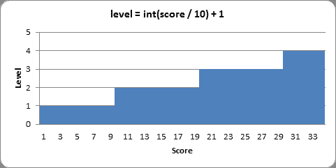

为了计算下落频率，我们从一个基准时间`0.27`开始(意思是每 0.27 秒棋子会自然下落一次)。然后，我们将该水平乘以`0.02`，并从`0.27`基准时间中减去该值。所以在 1 级上，我们从`0.27`中减去`0.02 * 1`(也就是`0.02`)得到`0.25`。在第 2 级，我们减去`0.02 * 2`(也就是`0.04`)得到`0.23`。你可以把等式的`level * 0.02`部分想成“每升一级，棋子将比前一级快 0.02 秒。”

我们还可以制作一个图表，显示在游戏的每个关卡中棋子下落的速度:

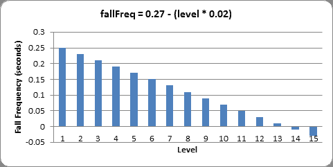

可以看到 14 级的时候下降频率会小于`0`。这不会给我们的代码带来任何错误，因为第 277 行只是检查自下落的棋子上次下落一格以来所经过的时间是否大于计算的下落频率。因此，如果下落频率为负，那么第 277 行的条件将始终为`True`，并且棋子将在游戏循环的每次迭代中下落。从 14 级开始，这个棋子就不能再快了。

如果`FPS`被设置为`25`，这意味着在到达 14 级时，下落的棋子将每秒下落 25 格。考虑到棋盘只有 20 格高，这意味着玩家只有不到一秒的时间来设置每一个棋子！

如果你想让碎片开始(如果你明白我的意思)以更慢的速度下落，你可以改变`calculateLevelAndFallFreq()`使用的等式。例如，假设第 360 行是这样的:

360。 fallFreq = 0.27 - (level * 0.01)

在上面的例子中，棋子在每一关只会快 0.01 秒而不是快 0.02 秒。图表看起来像这样(图表中的原始线条也是浅灰色的):

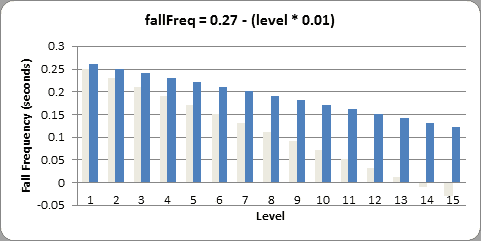

正如你所看到的，有了这个新的等式，14 级只会和原来的 7 级一样难。你可以通过改变`calculateLevelAndFallFreq()`中的方程式来改变游戏的难易程度。

## 功能生成棋子`getNewPiece()`

```py
363\. def
getNewPiece():
364\.     # return a random new piece in a random rotation and color
365\.     shape
= random.choice(list(SHAPES.keys()))
366\.     newPiece
= {'shape': shape,
367\.                 'rotation':
random.randint(0, len(SHAPES[shape]) - 1),
368\.                 'x':
int(BOARDWIDTH / 2) - int(TEMPLATEWIDTH / 2),
369\.                 'y':
-2, # start it above the board (i.e. less than 0)
370\.                 'color':
random.randint(0, len(COLORS)-1)}
371\.     return
newPiece
```

`getNewPiece()`函数生成一个随机的棋子，放置在棋盘的顶部。首先，为了随机选择棋子的形状，我们通过调用第 365 行的`list(SHAPES.keys())`来创建一个所有可能形状的列表。`keys()`字典方法返回一个数据类型为“dict_keys”的值，在传递给`random.choice()`之前，必须用`list()`函数将其转换成一个列表值。这是因为`random.choice()`函数只接受其参数的列表值。然后，`random.choice()`函数从列表中随机返回一个项目的值。

片段数据结构只是一个带有关键字`'shape'`、`'rotation'`、`'x'`、`'y'`和`'color'`的字典值。

`'rotation'`键的值是从`0`到比该形状可能的旋转数少一的随机整数。一个形状旋转的次数可以从表达式`len(SHAPES[shape])`中找到。

请注意，我们并没有在每个片段的数据结构中存储字符串值的列表(就像存储在常量`S_SHAPE_TEMPLATE`中的那些)来表示每个片段的盒子。相反，我们只是存储了一个形状和旋转的索引，该索引引用了`PIECES`常量。

`'x'`键的值总是设置在棋盘的中间(也考虑了棋子本身的宽度，这可以从我们的`TEMPLATEWIDTH`常量中找到)。`'y'`键的值总是被设置为`-2`,使其稍微高于电路板。(棋盘的第一行是第 0 行。)

因为`COLORS`常数是不同颜色的元组，所以从`0`到`COLORS`的长度中选择一个随机数(减一)将会给我们一块颜色的随机索引值。

一旦设置了`newPiece`字典中的所有值，`getNewPiece()`函数将返回`newPiece`。

```py
374\. def
addToBoard(board, piece):
375\.     # fill in the board based on piece's location, shape,
and rotation
376\.     for
x in range(TEMPLATEWIDTH):
377\.         for
y in range(TEMPLATEHEIGHT):
378\.             if
SHAPES[piece['shape']][piece['rotation']][y][x] != BLANK:
379\.                 board[x
+ piece['x']][y + piece['y']] = piece['color']
```

棋盘数据结构是矩形空间的数据表示，在该矩形空间中跟踪先前已经着陆的棋子。当前落下的棋子没有在棋盘数据结构上标记。`addToBoard()`函数的作用是获取一块数据结构，并将其盒子添加到电路板数据结构中。这发生在一件物品落地之后。

第 376 行和第 377 行上嵌套的`for`循环遍历 piece 数据结构中的每个空间，如果它在空间中找到一个盒子(第 378 行)，它就把它添加到板子上(第 379 行)。

```py
382\. def
getBlankBoard():
383\.     # create and return a new blank board data structure
384\.     board
= []
385\.     for
i in range(BOARDWIDTH):
386\.         board.append([BLANK]
* BOARDHEIGHT)
387\.     return
board
```

用于纸板的数据结构相当简单:它是一个值列表的列表。如果该值与`BLANK`中的值相同，则为空白。如果该值是一个整数，那么它代表一个方框，该方框是整数在`COLORS`常量列表中索引的颜色。也就是说，`0`是蓝色，`1`是绿色，`2`是红色，`3`是黄色。

为了创建空白板，使用列表复制来创建代表一列的`BLANK`值列表。这在第 386 行完成。为棋盘中的每一列创建一个列表(这就是第 385 行的`for`循环所做的)。

## `isOnBoard()`和`isValidPosition()`功能

```py
390\. def
isOnBoard(x, y):
391\.     return
x >= 0 and x < BOARDWIDTH and y < BOARDHEIGHT
```

`isOnBoard()`是一个简单的函数，它检查传递的 XY 坐标是否代表板上存在的有效值。只要 XY 坐标不小于`0`或大于等于`BOARDWIDTH`和`BOARDHEIGHT`常数，那么函数返回`True`。

```py
394\. def
isValidPosition(board, piece, adjX=0, adjY=0):
395\.     # Return True if the piece is within the board and not
colliding
396\.     for
x in range(TEMPLATEWIDTH):
397\.         for
y in range(TEMPLATEHEIGHT):
398.            
isAboveBoard = y + piece['y'] + adjY < 0
399\.             if
isAboveBoard or SHAPES[piece['shape']][piece['rotation']][y][x] == BLANK:
400\.                 continue
```

给`isValidPosition()`函数一个棋盘数据结构和一个棋子数据结构，如果棋子中的所有盒子都在棋盘上并且不与棋盘上的任何盒子重叠，则返回`True`。这是通过获取块的 XY 坐标(实际上是块的 5x5 框上右上框的坐标)并将坐标添加到块数据结构中来完成的。这里有几张图片可以帮助说明这一点:

| 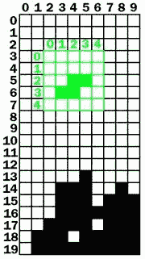 | 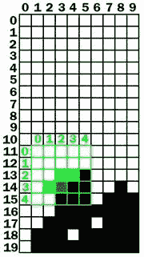 |
| 一块下落的棋子在有效位置的棋盘。 | 下落棋子处于无效位置的棋盘。 |

在左边的棋盘上，下落棋子(即下落棋子的左上角)的 XY 坐标在棋盘上是(2，3)。但是下落物体坐标系内的盒子有自己的坐标。要找到这些棋子的“棋盘”坐标，我们只需将下落棋子左上角方框的“棋盘”坐标和方框的“棋子”坐标相加。

在左侧棋盘上，下落棋子的盒子位于以下“棋子”坐标:

            (2, 2)    (3, 2)    (1, 3)    (2, 3)

当我们将(2，3)坐标(棋子在棋盘上的坐标)加到这些坐标上时，它看起来像这样:

            (2 + 2, 2 + 3)    (3 + 2, 2 + 3)    (1 + 2, 3 + 3)    (2 + 2, 3 + 3)

添加(2，3)坐标后，方框位于以下“电路板”坐标:

(4, 5)    (5, 5)    (3, 6)    (4, 6)

现在我们可以算出下落物体的盒子在棋盘坐标上的位置，我们可以看到它们是否与已经在棋盘上的落地盒子重叠。第 396 行和第 397 行嵌套的`for`循环遍历下落物体上的每一个可能的坐标。

我们要检查下落棋子的盒子是离开棋盘还是与棋盘上的盒子重叠。(尽管有一个例外，如果盒子在棋盘上方，当下落的棋子刚刚开始下落时，它可能就在棋盘上方。)第 398 行创建一个名为`isAboveBoard`的变量，如果下落物体上指向 x 和 y 坐标的盒子在棋盘上方，该变量被设置为`True`。否则设置为`False`。

第 399 行的`if`语句检查棋子的空间是在棋盘上方还是空白。如果其中任何一个是`True`，那么代码执行一个`continue`语句并进入下一次迭代。(注意第 399 行的结尾有`[y][x]`而不是`[x][y]`。这是因为`PIECES`数据结构中的坐标颠倒了。请参见上一节“设置片段模板”)。

```py
401\.             if
not isOnBoard(x + piece['x'] + adjX, y + piece['y'] + adjY):
402\.                 return
False
403\.             if
board[x + piece['x'] + adjX][y + piece['y'] + adjY] != BLANK:
404\.                 return
False
405\.     return
True
```

第 401 行的`if`语句检查棋子的盒子不在棋盘上。第 403 行的`if`语句检查棋子所在的棋盘空间不为空。如果这些条件中的任何一个是`True`，那么`isValidPosition()`函数将返回`False`。注意，这些`if`语句还调整了传递给函数的`adjX`和`adjY`参数的坐标。

如果代码通过了嵌套的`for`循环，并且没有找到返回`False`的理由，那么该块的位置必须是有效的，因此函数在第 405 行返回`True`。

```py
407\. def
isCompleteLine(board, y):
408\.     # Return True if the line filled with boxes with no
gaps.
409\.     for
x in range(BOARDWIDTH):
410\.         if
board[x][y] == BLANK:
411\.             return
False
412\.     return
True
```

`isCompleteLine`对由`y`参数指定的行进行简单的检查。棋盘上的一行被认为是“完整的”，当每一个空格都被一个盒子填满。第 409 行的`for`循环穿过该行的每个空格。如果一个空格为空(这是因为它与`BLANK`常量的值相同)，那么函数返回`False`。

```py
415\. def
removeCompleteLines(board):
416\.     # Remove any completed lines on the board, move
everything above them down, and return the number of complete lines.
417\.     numLinesRemoved
= 0
418\.     y
= BOARDHEIGHT - 1 # start y at the bottom of the
board
419\.     while
y >= 0:
```

`removeCompleteLines()`函数将在传递的棋盘数据结构中找到任何完整的行，删除这些行，然后将棋盘上该行上方的所有方框向下移动一行。该函数将返回被删除的行数(由`numLinesRemoved`变量跟踪)，以便将其添加到分数中。

这个函数的工作方式是从第 419 行开始运行一个循环，变量`y`从最低的一行开始(也就是`BOARDHEIGHT - 1`)。每当`y`指定的行未完成时，`y`将递减到下一个最高的行。一旦 y 到达`-1`，循环最终停止。

```py
420\.         if
isCompleteLine(board, y):
421\.             # Remove the line and pull boxes down by one line.
422\.             for
pullDownY in range(y, 0, -1):
423\.                 for
x in range(BOARDWIDTH):
424\.                     board[x][pullDownY]
= board[x][pullDownY-1]
425\.             # Set very top line to blank.
426\.             for
x in range(BOARDWIDTH):
427\.                 board[x][0]
= BLANK
428\.             numLinesRemoved
+= 1
429\.             # Note on the next iteration of the loop, y is the
same.
430\.             # This is so that if the line that was pulled down is
also
431\.             # complete, it will be removed.
432\.         else:
433\.             y
-= 1 # move on to check next row up
434\.     return
numLinesRemoved
```

如果`y`引用的行是完整的，那么`isCompleteLine()`函数将返回`True`。在这种情况下，程序需要将删除的行上面的每一行的值复制到下一个最低的行。这就是第 422 行上的`for`循环所做的事情(这就是为什么它对`range()`函数的调用从`y`开始，而不是`0`。还要注意，它使用了三个参数形式的`range()`，所以它返回的列表从`y`开始，到`0`结束，并且在每次迭代之后“增加”了`-1`。)

让我们看看下面的例子。为了节省空间，只显示了电路板的顶五行。第 3 行是一个完整的行，这意味着它上面的所有行(第 2 行、第 1 行和第 0 行)都必须被“下拉”。首先，将第 2 行复制到第 3 行。右边的板子显示了完成后板子的样子:

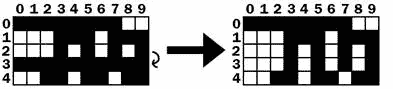

这种“下拉”实际上只是将第 424 行上较高一行的值复制到它下面的一行。将第 2 行复制到第 3 行后，将第 1 行复制到第 2 行，然后将第 0 行复制到第 1 行:

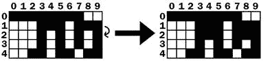

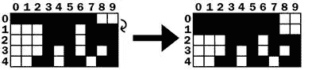

第 0 行(最顶端的那一行)上面没有一行可以向下复制值。但是 row 0 不需要复制一行给它，它只需要将所有空格设置为`BLANK`。这就是 426 和 427 行的作用。此后，纸板将从下图左侧所示的纸板变为下图右侧所示的纸板:

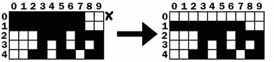

在删除完整的行之后，执行到达从第 419 行开始的`while`循环的结尾，因此执行跳回到循环的开始。请注意，在删除行和下拉行时，`y`变量根本没有改变。所以在下一次迭代中，`y`变量将指向与之前相同的行。

这是必要的，因为如果有两条完整的线，那么第二条完整的线将被拉下，也将被移除。然后，代码将删除这一完整行，然后进行下一次迭代。只有当没有完成的行时，行 433 上的`y`变量才递减。一旦`y`变量一直递减到`0`，执行将退出`while`循环。

```py
437\. def
convertToPixelCoords(boxx, boxy):
438\.     # Convert the given xy coordinates of the board to xy 
439\.     # coordinates of the location on the screen.
440\.     return
(XMARGIN + (boxx * BOXSIZE)), (TOPMARGIN + (boxy * BOXSIZE))
```

这个辅助函数将棋盘的方块坐标转换成像素坐标。这个函数的工作方式与之前游戏程序中使用的其他“转换坐标”函数相同。

```py
443\. def
drawBox(boxx, boxy, color, pixelx=None, pixely=None):
444\.     # draw a single box (each tetromino piece has four
boxes)
445\.     # at xy coordinates on the board. Or, if pixelx &
pixely
446\.     # are specified, draw to the pixel coordinates stored
in
447\.     # pixelx & pixely (this is used for the
"Next" piece).
448\.     if
color == BLANK:
449\.         return
450\.     if
pixelx == None and pixely == None:
451\.         pixelx,
pixely = convertToPixelCoords(boxx, boxy)
452\.     pygame.draw.rect(DISPLAYSURF,
COLORS[color], (pixelx + 1, pixely + 1, BOXSIZE - 1, BOXSIZE - 1))
453\.     pygame.draw.rect(DISPLAYSURF,
LIGHTCOLORS[color], (pixelx + 1, pixely + 1, BOXSIZE - 4, BOXSIZE - 4))
```

`drawBox()`功能在屏幕上绘制一个单独的方框。该函数可以接收`boxx`和`boxy`参数，用于确定应在何处绘制方框的板坐标。然而，如果指定了`pixelx`和`pixely`参数，那么这些像素坐标将覆盖`boxx`和`boxy`参数。`pixelx`和`pixely`参数用于绘制不在棋盘上的“下一个”棋子的盒子。

如果未设置`pixelx`和`pixely`参数，则在功能首次开始时，它们将默认设置为`None`。那么第 450 行上的`if`语句将用来自`convertToPixelCoords()`的返回值覆盖`None`值。该调用获取由`boxx`和`boxy`指定的电路板坐标的像素坐标。

代码不会用颜色填充整个盒子的空间。为了在一个块的方框之间有一个黑色轮廓，在`pygame.draw.rect()`调用中的`left` 和`top`参数中添加了`+ 1`，并且在`width`和`height`参数中添加了一个`- 1`。为了绘制突出显示的方框，首先在第 452 行用较暗的颜色绘制方框。然后，在第 453 行，一个稍微小一点的盒子被画在一个较暗的盒子上面。

```py
456\. def
drawBoard(board):
457\.     # draw the border around the board
458\.     pygame.draw.rect(DISPLAYSURF,
BORDERCOLOR, (XMARGIN - 3, TOPMARGIN - 7, (BOARDWIDTH * BOXSIZE) + 8,
(BOARDHEIGHT * BOXSIZE) + 8), 5)
459\. 
460\.     # fill the background of the board
461\.     pygame.draw.rect(DISPLAYSURF,
BGCOLOR, (XMARGIN, TOPMARGIN, BOXSIZE * BOARDWIDTH, BOXSIZE * BOARDHEIGHT))
462\.     # draw the individual boxes on the board
463\.     for
x in range(BOARDWIDTH):
464\.         for
y in range(BOARDHEIGHT):
465\.             drawBox(x,
y, board[x][y])
```

`drawBoard()`函数负责调用画板边框和板上所有方框的函数。首先在`DISPLAYSURF`上画出棋盘的边框，然后是棋盘的背景色。然后对棋盘上的每个空格调用`drawBox()`。如果`board[x][y]`被设置为`BLANK`，则`drawBox()`功能足够智能，可以省去盒子。

```py
468\. def
drawStatus(score, level):
469\.     # draw the score text
470\.     scoreSurf
= BASICFONT.render('Score: %s' % score, True, TEXTCOLOR)
471\.     scoreRect
= scoreSurf.get_rect()
472\.     scoreRect.topleft
= (WINDOWWIDTH - 150, 20)
473\.     DISPLAYSURF.blit(scoreSurf,
scoreRect)
474\. 
475\.     # draw the level text
476\.     levelSurf
= BASICFONT.render('Level: %s' % level, True, TEXTCOLOR)
477\.     levelRect
= levelSurf.get_rect()
478\.     levelRect.topleft
= (WINDOWWIDTH - 150, 50)
479\.     DISPLAYSURF.blit(levelSurf,
levelRect)
```

`drawStatus()`函数负责呈现屏幕右上角显示的“分数:”和“级别:”信息的文本。

```py
482\. def
drawPiece(piece, pixelx=None, pixely=None):
483\.     shapeToDraw
= SHAPES[piece['shape']][piece['rotation']]
484\.     if
pixelx == None and pixely == None:
485\.         # if pixelx & pixely hasn't been specified, use the
location stored in the piece data structure
486\.         pixelx,
pixely = convertToPixelCoords(piece['x'], piece['y'])
487\. 
488\.     # draw each of the blocks that make up the piece
489\.     for
x in range(TEMPLATEWIDTH):
490\.         for
y in range(TEMPLATEHEIGHT):
491\.             if
shapeToDraw[y][x] != BLANK:
492\.                 drawBox(None,
None, piece['color'], pixelx + (x * BOXSIZE), pixely + (y * BOXSIZE))
```

`drawPiece()`函数将根据传递给它的棋子数据结构绘制棋子的方框。该功能将用于绘制下落的棋子和“下一个”棋子。因为片段数据结构将包含所有的形状、位置、旋转和颜色信息，所以除了片段数据结构之外，不需要向函数传递任何其他信息。

然而，“下一个”棋子并没有画在棋盘上。在这种情况下，我们忽略存储在棋子数据结构中的位置信息，而是让`drawPiece()`函数的调用者为可选的`pixelx`和`pixely`参数传入参数，以指定棋子应该绘制在窗口上的确切位置。

如果没有传入`pixelx`和`pixely`参数，那么第 484 和 486 行将使用`convertToPixelCoords()`调用的返回值覆盖这些变量。

第 489 行和第 490 行上嵌套的`for`循环将为需要绘制的每一个方块调用`drawBox()`。

```py
495\. def
drawNextPiece(piece):
496\.     # draw the "next" text
497\.     nextSurf
= BASICFONT.render('Next:', True, TEXTCOLOR)
498\.     nextRect
= nextSurf.get_rect()
499\.     nextRect.topleft
= (WINDOWWIDTH - 120, 80)
500\.     DISPLAYSURF.blit(nextSurf,
nextRect)
501\.     # draw the "next" piece
502\.     drawPiece(piece,
pixelx=WINDOWWIDTH-120, pixely=100)
503\. 
504\. 
505\. if
__name__ == '__main__':
506\.     main()
```

`drawNextPiece()`在屏幕右上角绘制“下一个”棋子。它通过调用`drawPiece()`函数并传入`drawPiece()`的`pixelx`和`pixely`参数来实现这一点。

这是最后一个功能。第 505 行和第 506 行在所有函数定义执行完毕后运行，然后调用`main()`函数开始程序的主要部分。

俄罗斯方块游戏(它是更受欢迎的游戏“俄罗斯方块”的克隆版)很容易用英语向人解释:“积木从一块木板的顶部落下，玩家移动并旋转它们，使它们形成完整的线条。完整的线消失了(给玩家分数),上面的线向下移动。游戏继续进行，直到方块填满整个棋盘，玩家输了。”

用简单的英语解释是一回事，但是当我们必须告诉计算机确切地做什么时，有许多细节我们必须填写。最初的俄罗斯方块游戏是 1984 年由苏联的亚历克斯·帕基特诺夫一个人设计和编程的。这个游戏简单，有趣，而且容易上瘾。这是有史以来最受欢迎的视频游戏之一，已经售出 1 亿份，许多人都在制作自己的克隆版和变体。

这一切都是由一个懂得编程的人创造的。

有了正确的想法和一些编程知识，你可以创造出非常有趣的游戏。经过一些练习，你将能够把你的游戏想法变成真正的程序，它可能会像俄罗斯方块一样受欢迎！

对于额外的编程实践，你可以从[【http://invpy.com/buggy/tetromino】](http://invpy.com/buggy/tetromino)下载 Tetromino 的错误版本，并尝试找出如何修复这些错误。

这本书的网站上也有俄罗斯方块游戏的变体。“五联骨牌”是这种游戏的一个版本，棋子由五个盒子组成。还有“白痴用的俄罗斯方块”，所有的棋子都由一个盒子组成。

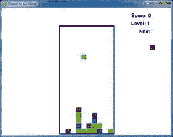

这些变体可以从以下网站下载:

[http://invpy.com/pentomino.py](http://invpy.com/pentomino.py)

[http://invpy.com/tetrominoforidiots.py](http://invpy.com/tetrominoforidiots.py)