# 第 8 章-松鼠吃松鼠

> 原文：<http://inventwithpython.com/pygame/chapter8.html>

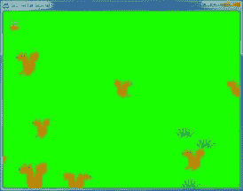 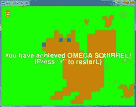

松鼠吃松鼠是松散地基于游戏“Katamari Damacy”。玩家控制一只小松鼠，它必须在屏幕上跳来跳去，吃掉小松鼠，避开大松鼠。玩家的松鼠每吃一只比它小的松鼠，它就长得更大。如果玩家的松鼠被比它更大的松鼠击中，它就会失去一个生命点。当松鼠变成被称为欧米茄松鼠的巨大松鼠时，玩家获胜。如果松鼠被击中三次，玩家就输了。

我不确定我是从哪里得到松鼠互相吃掉的视频游戏的灵感的。我有时候有点奇怪。

这个游戏有三种数据结构，用字典值表示。这些类型是玩家松鼠、敌人松鼠和草地物体。游戏中一次只有一个玩家松鼠对象。

注意:从技术上来说，“对象”是指面向对象编程中特定的东西。Python 确实有 OOP 特性，但是这本书没有涉及到。从技术上讲，Pygame 对象，如“矩形对象”或“表面对象”是对象。但我在这本书里要用“物体”这个词来指代“游戏世界里存在的东西”。但实际上，玩家松鼠、敌人松鼠和草“对象”只是字典值。

所有对象在其字典值中都有以下键:`'x'`、`'y'`和`'rect'`。`'x'`和`'y'`键的值给出了*游戏世界坐标*中物体左上角的坐标。这些与像素坐标不同(像素坐标是`'rect'`键的值所跟踪的)。游戏世界和像素坐标的区别会在你了解相机概念的时候解释。

此外，玩家松鼠、敌人松鼠和草对象还有其他的键，在源代码开头的大注释中有解释。

这个源代码可以从[【http://invpy.com/squirrel.py】](//invpy.com/squirrel.py)下载。如果您得到任何错误消息，请查看错误消息中提到的行号，并检查您的代码是否有任何拼写错误。你也可以在 http://invpy.com/diff/squirrel将你的代码复制粘贴到 web 表单中，看看你的代码和书中的代码是否有区别。

您还需要下载以下图像文件:

[【http://invpy . com/gameicon . png】](//invpy.com/gameicon.png)

[【http://invpy . com/squirrel . png】](//invpy.com/squirrel.png)

[【http://invpy . com/grass 1 . png】](//invpy.com/grass1.png)

[【http://invpy . com/grass 2 . png】](//invpy.com/grass2.png)

[【http://invpy . com/grass 3 . png】](//invpy.com/grass3.png)

[【http://invpy . com/grass 4 . png】](//invpy.com/grass4.png)

```py
  1\. # Squirrel Eat Squirrel (a 2D Katamari Damacy clone)
  2\. # By Al Sweigart [[email protected]](/cdn-cgi/l/email-protection)
  3\. # http://inventwithpython.com/pygame
  4\. # Creative Commons BY-NC-SA 3.0 US
  5\. 
  6\. import
random, sys, time, math, pygame
  7\. from
pygame.locals import *
  8\. 
  9\. FPS
= 30 # frames per second to update the screen
 10\. WINWIDTH
= 640 # width of the program's window, in pixels
 11\. WINHEIGHT
= 480 # height in pixels
 12\. HALF_WINWIDTH
= int(WINWIDTH / 2)
 13\. HALF_WINHEIGHT
= int(WINHEIGHT / 2)
 14\. 
 15\. GRASSCOLOR
= (24, 255, 0)
 16\. WHITE
= (255, 255, 255)
 17\. RED
= (255, 0, 0)
 18\. 
19\. CAMERASLACK
= 90     # how far from the center the squirrel
moves before moving the camera
20\. MOVERATE
= 9         # how fast the player moves
 21\. BOUNCERATE
= 6       # how fast the player bounces (large is
slower)
 22\. BOUNCEHEIGHT
= 30    # how high the player bounces
 23\. STARTSIZE
= 25       # how big the player starts off
 24\. WINSIZE
= 300        # how big the player needs to be to
win
 25\. INVULNTIME
= 2       # how long the player is invulnerable
after being hit in seconds
 26\. GAMEOVERTIME
= 4     # how long the "game over" text
stays on the screen in seconds
 27\. MAXHEALTH
= 3        # how much health the player starts
with
 28\. 
 29\. NUMGRASS
= 80        # number of grass objects in the active
area
 30\. NUMSQUIRRELS
= 30    # number of squirrels in the active area
 31\. SQUIRRELMINSPEED
= 3 # slowest squirrel speed
 32\. SQUIRRELMAXSPEED
= 7 # fastest squirrel speed
 33\. DIRCHANGEFREQ
= 2    # % chance of direction change per frame
 34\. LEFT
= 'left'
 35\. RIGHT
= 'right'
 36\. 
37\. """
 38\. This program has three data structures to represent the
player, enemy squirrels, and grass background objects. The data structures are
dictionaries with the following keys:
 39\. 
 40\. Keys used by all three data structures:
 41\.     'x' - the left edge coordinate of the object in the
game world (not a pixel coordinate on the screen)
 42\.     'y' - the top edge coordinate of the object in the game
world (not a pixel coordinate on the screen)
 43\.     'rect' - the pygame.Rect object representing where on
the screen the object is located.
 44\. Player data structure keys:
 45\.     'surface' - the pygame.Surface object that stores the
image of the squirrel which will be drawn to the screen.
 46\.     'facing' - either set to LEFT or RIGHT, stores which
direction the player is facing.
 47\.     'size' - the width and height of the player in pixels.
(The width & height are always the same.)
 48\.     'bounce' - represents at what point in a bounce the
player is in. 0 means standing (no bounce), up to BOUNCERATE (the completion of
the bounce)
 49\.     'health' - an integer showing how many more times the
player can be hit by a larger squirrel before dying.
 50\. Enemy Squirrel data structure keys:
 51\.     'surface' - the pygame.Surface object that stores the
image of the squirrel which will be drawn to the screen.
 52\.     'movex' - how many pixels per frame the squirrel moves
horizontally. A negative integer is moving to the left, a positive to the
right.
 53\.     'movey' - how many pixels per frame the squirrel moves
vertically. A negative integer is moving up, a positive moving down.
 54\.     'width' - the width of the squirrel's image, in pixels
 55\.     'height' - the height of the squirrel's image, in
pixels
 56\.     'bounce' - represents at what point in a bounce the
player is in. 0 means standing (no bounce), up to BOUNCERATE (the completion of
the bounce)
 57\.     'bouncerate' - how quickly the squirrel bounces. A
lower number means a quicker bounce.
 58\.     'bounceheight' - how high (in pixels) the squirrel
bounces
 59\. Grass data structure keys:
 60\.     'grassImage' - an integer that refers to the index of
the pygame.Surface object in GRASSIMAGES used for this grass object
 61\. """
 62\. 
63\. def
main():
 64\.     global
FPSCLOCK, DISPLAYSURF, BASICFONT, L_SQUIR_IMG, R_SQUIR_IMG, GRASSIMAGES
 65\. 
 66\.     pygame.init()
 67\.     FPSCLOCK
= pygame.time.Clock()
 68\.     pygame.display.set_icon(pygame.image.load('gameicon.png'))
 69\.     DISPLAYSURF
= pygame.display.set_mode((WINWIDTH, WINHEIGHT))
 70\.     pygame.display.set_caption('Squirrel
Eat Squirrel')
 71\.     BASICFONT
= pygame.font.Font('freesansbold.ttf', 32)
 72\. 
73\.     # load the image files
 74\.     L_SQUIR_IMG
= pygame.image.load('squirrel.png')
 75\.     R_SQUIR_IMG
= pygame.transform.flip(L_SQUIR_IMG, True, False)
 76\.     GRASSIMAGES
= []
 77\.     for
i in range(1, 5):
 78\.         GRASSIMAGES.append(pygame.image.load('grass%s.png'
% i))
 79\. 
80\.     while
True:
 81\.         runGame()
 82\. 
 83\. 
84\. def
runGame():
 85.    
# set up variables for the start of a new game
 86\.     invulnerableMode
= False  # if the player is invulnerable
 87\.     invulnerableStartTime
= 0 # time the player became invulnerable
 88\.     gameOverMode
= False      # if the player has lost
 89\.     gameOverStartTime
= 0     # time the player lost
 90\.     winMode
= False           # if the player has won
 91\.     
92\.     # create the surfaces to hold game text
 93\.     gameOverSurf
= BASICFONT.render('Game Over', True, WHITE)
 94\.     gameOverRect
= gameOverSurf.get_rect()
 95\.     gameOverRect.center
= (HALF_WINWIDTH, HALF_WINHEIGHT)
 96\. 
 97\.     winSurf
= BASICFONT.render('You have achieved OMEGA SQUIRREL!', True, WHITE)
 98\.     winRect
= winSurf.get_rect()
 99\.     winRect.center
= (HALF_WINWIDTH, HALF_WINHEIGHT)
100\. 
101\.     winSurf2
= BASICFONT.render('(Press "r" to restart.)', True, WHITE)
102\.     winRect2
= winSurf2.get_rect()
103\.     winRect2.center
= (HALF_WINWIDTH, HALF_WINHEIGHT + 30)
104\. 
105\.     # camerax and cameray are where the middle of the
camera view is
106\.     camerax
= 0
107\.     cameray
= 0
108\. 
109\.     grassObjs
= []    # stores all the grass objects in the
game
110\.     squirrelObjs
= [] # stores all the non-player squirrel objects
111\.     # stores the player object:
112\.     playerObj
= {'surface': pygame.transform.scale(L_SQUIR_IMG, (STARTSIZE, STARTSIZE)),
113\.                  'facing':
LEFT,
114\.                  'size':
STARTSIZE,
115\.                  'x':
HALF_WINWIDTH,
116\.                  'y':
HALF_WINHEIGHT,
117\.                  'bounce':0,
118\.                  'health':
MAXHEALTH}
119\. 
120\.     moveLeft 
= False
121\.     moveRight
= False
122\.     moveUp   
= False
123\.     moveDown 
= False
124\. 
125\.     # start off with some random grass images on the screen
126\.     for
i in range(10):
127\.         grassObjs.append(makeNewGrass(camerax,
cameray))
128\.         grassObjs[i]['x']
= random.randint(0, WINWIDTH)
129\.         grassObjs[i]['y']
= random.randint(0, WINHEIGHT)
130\. 
131\.     while
True: # main game loop
132\.         # Check if we should turn off invulnerability
133\.         if
invulnerableMode and time.time() - invulnerableStartTime > INVULNTIME:
134\.             invulnerableMode
= False
135\. 
136\.         # move all the squirrels
137\.         for
sObj in squirrelObjs:
138\.             # move the squirrel, and adjust for their bounce
139\.             sObj['x']
+= sObj['movex']
140\.             sObj['y']
+= sObj['movey']
141\.             sObj['bounce']
+= 1
142\.             if
sObj['bounce'] > sObj['bouncerate']:
143\.                 sObj['bounce']
= 0 # reset bounce amount
144.
145\.             # random chance they change direction
146\.             if
random.randint(0, 99) < DIRCHANGEFREQ:
147\.                 sObj['movex']
= getRandomVelocity()
148\.                 sObj['movey']
= getRandomVelocity()
149\.                 if
sObj['movex'] > 0: # faces right
150\.                     sObj['surface']
= pygame.transform.scale(R_SQUIR_IMG, (sObj['width'], sObj['height']))
151\.                 else:
# faces left
152\.                     sObj['surface']
= pygame.transform.scale(L_SQUIR_IMG, (sObj['width'], sObj['height']))
153.
154\. 
155\.         # go through all the objects and see if any need to be
deleted.
156\.         for
i in range(len(grassObjs) - 1, -1, -1):
157\.             if
isOutsideActiveArea(camerax, cameray, grassObjs[i]):
158\.                 del
grassObjs[i]
159\.         for
i in range(len(squirrelObjs) - 1, -1, -1):
160\.             if
isOutsideActiveArea(camerax, cameray, squirrelObjs[i]):
161\.                 del
squirrelObjs[i]
162\. 
163\.         # add more grass & squirrels if we don't have
enough.
164\.         while
len(grassObjs) < NUMGRASS:
165\.             grassObjs.append(makeNewGrass(camerax,
cameray))
166\.         while
len(squirrelObjs) < NUMSQUIRRELS:
167\.             squirrelObjs.append(makeNewSquirrel(camerax,
cameray))
168\. 
169\.         # adjust camerax and cameray if beyond the "camera
slack"
170\.         playerCenterx
= playerObj['x'] + int(playerObj['size'] / 2)
171\.         playerCentery
= playerObj['y'] + int(playerObj['size'] / 2)
172.         if
(camerax + HALF_WINWIDTH) - playerCenterx > CAMERASLACK:
173.             camerax
= playerCenterx + CAMERASLACK - HALF_WINWIDTH
174.         elif
playerCenterx – (camerax + HALF_WINWIDTH) > CAMERASLACK:
175.             camerax
= playerCenterx – CAMERASLACK - HALF_WINWIDTH
176.         if
(cameray + HALF_WINHEIGHT) - playerCentery > CAMERASLACK:
177.             cameray
= playerCentery + CAMERASLACK - HALF_WINHEIGHT
178.         elif
playerCentery – (cameray + HALF_WINHEIGHT) > CAMERASLACK:
179.             cameray
= playerCentery – CAMERASLACK - HALF_WINHEIGHT
180\. 
181\.         # draw the green background
182\.         DISPLAYSURF.fill(GRASSCOLOR)
183\. 
184\.         # draw all the grass objects on the screen
185\.         for
gObj in grassObjs:
186\.             gRect
= pygame.Rect( (gObj['x'] - camerax,
187\.                                   gObj['y']
- cameray,
188\.                                   gObj['width'],
189\.                                   gObj['height'])
)
190\.             DISPLAYSURF.blit(GRASSIMAGES[gObj['grassImage']],
gRect)
191.
192\. 
193\.         # draw the other squirrels
194\.         for
sObj in squirrelObjs:
195\.             sObj['rect']
= pygame.Rect( (sObj['x'] - camerax,
196\.                                          sObj['y']
- cameray - getBounceAmount(sObj['bounce'], sObj['bouncerate'],
sObj['bounceheight']),
197\.                                          sObj['width'],
198\.                                          sObj['height'])
)
199\.             DISPLAYSURF.blit(sObj['surface'],
sObj['rect'])
200.
201\. 
202\.         # draw the player squirrel
203\.         flashIsOn
= round(time.time(), 1) * 10 % 2 == 1
204\.         if
not gameOverMode and not (invulnerableMode and flashIsOn):
205\.             playerObj['rect']
= pygame.Rect( (playerObj['x'] - camerax,
206\.                                               playerObj['y']
– cameray - getBounceAmount(playerObj['bounce'], BOUNCERATE, BOUNCEHEIGHT),
207\.                                               playerObj['size'],
208\.                                               playerObj['size'])
)
209\.             DISPLAYSURF.blit(playerObj['surface'],
playerObj['rect'])
210.
211\. 
212\.         # draw the health meter
213\.         drawHealthMeter(playerObj['health'])
214\. 
215\.         for
event in pygame.event.get(): # event handling
loop
216\.             if
event.type == QUIT:
217\.                 terminate()
218.
219\.             elif
event.type == KEYDOWN:
220\.                 if
event.key in (K_UP, K_w):
221\.                     moveDown
= False
222\.                     moveUp
= True
223\.                 elif
event.key in (K_DOWN, K_s):
224\.                     moveUp
= False
225\.                     moveDown
= True
226\.                 elif
event.key in (K_LEFT, K_a):
227\.                     moveRight
= False
228\.                     moveLeft
= True
229\.                     if
playerObj['facing'] == RIGHT: # change player
image
230\.                         playerObj['surface']
= pygame.transform.scale(L_SQUIR_IMG, (playerObj['size'], playerObj['size']))
231\.                     playerObj['facing']
= LEFT
232\.                 elif
event.key in (K_RIGHT, K_d):
233\.                     moveLeft
= False
234\.                     moveRight
= True
235\.                     if
playerObj['facing'] == LEFT: # change player
image
236\.                         playerObj['surface']
= pygame.transform.scale(R_SQUIR_IMG, (playerObj['size'], playerObj['size']))
237\.                     playerObj['facing']
= RIGHT
238\.                 elif
winMode and event.key == K_r:
239\.                     return
240.
241\.             elif
event.type == KEYUP:
242\.                 # stop moving the player's squirrel
243\.                 if
event.key in (K_LEFT, K_a):
244\.                     moveLeft
= False
245\.                 elif
event.key in (K_RIGHT, K_d):
246\.                     moveRight
= False
247\.                 elif
event.key in (K_UP, K_w):
248\.                     moveUp
= False
249\.                 elif
event.key in (K_DOWN, K_s):
250\.                     moveDown
= False
251.
252\.                 elif
event.key == K_ESCAPE:
253\.                     terminate()
254.
255\.         if
not gameOverMode:
256\.             # actually move the player
257\.             if
moveLeft:
258\.                 playerObj['x']
-= MOVERATE
259\.             if
moveRight:
260\.                 playerObj['x']
+= MOVERATE
261\.             if
moveUp:
262\.                 playerObj['y']
-= MOVERATE
263\.             if
moveDown:
264\.                 playerObj['y']
+= MOVERATE
265.
266\.             if
(moveLeft or moveRight or moveUp or moveDown) or playerObj['bounce'] != 0:
267\.                 playerObj['bounce']
+= 1
268\. 
269\.             if
playerObj['bounce'] > BOUNCERATE:
270\.                 playerObj['bounce']
= 0 # reset bounce amount
271.
272\.             # check if the player has collided with any squirrels
273\.             for
i in range(len(squirrelObjs)-1, -1, -1):
274\.                 sqObj
= squirrelObjs[i]
275\.                 if
'rect' in sqObj and playerObj['rect'].colliderect(sqObj['rect']):
276\.                     # a player/squirrel collision has occurred
277.
278\.                     if
sqObj['width'] * sqObj['height'] <= playerObj['size']**2:
279\.                         # player is larger and eats the squirrel
280\.                         playerObj['size']
+= int( (sqObj['width'] * sqObj['height'])**0.2 ) + 1
281\.                         del
squirrelObjs[i]
282.
283\.                         if
playerObj['facing'] == LEFT:
284\.                             playerObj['surface']
= pygame.transform.scale(L_SQUIR_IMG, (playerObj['size'], playerObj['size']))
285\.                         if
playerObj['facing'] == RIGHT:
286\.                             playerObj['surface']
= pygame.transform.scale(R_SQUIR_IMG, (playerObj['size'], playerObj['size']))
287.
288\.                         if
playerObj['size'] > WINSIZE:
289\.                             winMode
= True # turn on "win mode"
290.
291\.                     elif
not invulnerableMode:
292\.                         # player is smaller and takes damage
293\.                         invulnerableMode
= True
294\.                         invulnerableStartTime
= time.time()
295\.                         playerObj['health']
-= 1
296\.                         if
playerObj['health'] == 0:
297\.                             gameOverMode
= True # turn on "game over mode"
298\.                             gameOverStartTime
= time.time()
299\.         else:
300\.             # game is over, show "game over" text
301\.             DISPLAYSURF.blit(gameOverSurf,
gameOverRect)
302\.             if
time.time() - gameOverStartTime > GAMEOVERTIME:
303\.                 return
# end the current game
304\. 
305\.         # check if the player has won.
306\.         if
winMode:
307\.             DISPLAYSURF.blit(winSurf,
winRect)
308\.             DISPLAYSURF.blit(winSurf2,
winRect2)
309\. 
310\.         pygame.display.update()
311\.         FPSCLOCK.tick(FPS)
312\. 
313\. 
314.
315.
316\. def
drawHealthMeter(currentHealth):
317\.     for
i in range(currentHealth): # draw red health bars
318\.         pygame.draw.rect(DISPLAYSURF,
RED,   (15, 5 + (10 * MAXHEALTH) - i * 10, 20, 10))
319\.     for
i in range(MAXHEALTH): # draw the white outlines
320\.         pygame.draw.rect(DISPLAYSURF,
WHITE, (15, 5 + (10 * MAXHEALTH) - i * 10, 20, 10), 1)
321\. 
322\. 
323\. def
terminate():
324\.     pygame.quit()
325\.     sys.exit()
326.
327.
328\. def
getBounceAmount(currentBounce, bounceRate, bounceHeight):
329\.     # Returns the number of pixels to offset based on the
bounce.
330\.     # Larger bounceRate means a slower bounce.
331\.     # Larger bounceHeight means a higher bounce.
332.     # currentBounce will always be less than bounceRate
333\.     return
int(math.sin( (math.pi / float(bounceRate)) * currentBounce ) * bounceHeight)
334.
335\. def
getRandomVelocity():
336\.     speed
= random.randint(SQUIRRELMINSPEED, SQUIRRELMAXSPEED)
337\.     if
random.randint(0, 1) == 0:
338\.         return
speed
339\.     else:
340\.         return
-speed
341\. 
342\. 
343\. def
getRandomOffCameraPos(camerax, cameray, objWidth, objHeight):
344\.     # create a Rect of the camera view
345\.     cameraRect
= pygame.Rect(camerax, cameray, WINWIDTH, WINHEIGHT)
346\.     while
True:
347\.         x
= random.randint(camerax - WINWIDTH, camerax + (2 * WINWIDTH))
348\.         y
= random.randint(cameray - WINHEIGHT, cameray + (2 * WINHEIGHT))
349. # create a Rect object with the random
coordinates and use colliderect()
350.         # to make sure the right edge isn't in the
camera view.
351\.         objRect
= pygame.Rect(x, y, objWidth, objHeight)
352\.         if
not objRect.colliderect(cameraRect):
353\.             return
x, y
354\. 
355\. 
356\. def
makeNewSquirrel(camerax, cameray):
357\.     sq
= {}
358\.     generalSize
= random.randint(5, 25)
359\.     multiplier
= random.randint(1, 3)
360\.     sq['width'] 
= (generalSize + random.randint(0, 10)) * multiplier
361\.     sq['height']
= (generalSize + random.randint(0, 10)) * multiplier
362\.     sq['x'],
sq['y'] = getRandomOffCameraPos(camerax, cameray, sq['width'], sq['height'])
363\.     sq['movex']
= getRandomVelocity()
364\.     sq['movey']
= getRandomVelocity()
365\.     if
sq['movex'] < 0: # squirrel is facing left
366\.         sq['surface']
= pygame.transform.scale(L_SQUIR_IMG, (sq['width'], sq['height']))
367\.     else:
# squirrel is facing right
368\.         sq['surface']
= pygame.transform.scale(R_SQUIR_IMG, (sq['width'], sq['height']))
369\.     sq['bounce']
= 0
370\.     sq['bouncerate']
= random.randint(10, 18)
371\.     sq['bounceheight']
= random.randint(10, 50)
372\.     return
sq
373\. 
374\. 
375\. def
makeNewGrass(camerax, cameray):
376\.     gr
= {}
377\.     gr['grassImage']
= random.randint(0, len(GRASSIMAGES) - 1)
378\.     gr['width'] 
= GRASSIMAGES[0].get_width()
379\.     gr['height']
= GRASSIMAGES[0].get_height()
380.   
 gr['x'], gr['y'] = getRandomOffCameraPos(camerax, cameray, gr['width'],
gr['height'])
381.    
gr['rect'] = pygame.Rect( (gr['x'], gr['y'], gr['width'], gr['height']) )
382\.     return
gr
383.
384.
385\. def
isOutsideActiveArea(camerax, cameray, obj):
386\.     # Return False if camerax and cameray are more than
387\.     # a half-window length beyond the edge of the window.
388\.     boundsLeftEdge
= camerax - WINWIDTH
389\.     boundsTopEdge
= cameray - WINHEIGHT
390\.     boundsRect
= pygame.Rect(boundsLeftEdge, boundsTopEdge, WINWIDTH * 3, WINHEIGHT * 3)
391\.     objRect
= pygame.Rect(obj['x'], obj['y'], obj['width'], obj['height'])
392\.     return
not boundsRect.colliderect(objRect)
393\. 
394\. 
395\. if
__name__ == '__main__':
396\.     main()
```

```py
  1\. # Squirrel Eat Squirrel (a 2D Katamari Damacy clone)
  2\. # By Al Sweigart [[email protected]](/cdn-cgi/l/email-protection)
  3\. # http://inventwithpython.com/pygame
  4\. # Creative Commons BY-NC-SA 3.0 US
  5\. 
  6\. import
random, sys, time, math, pygame
  7\. from
pygame.locals import *
  8\. 
  9\. FPS
= 30 # frames per second to update the screen
 10\. WINWIDTH
= 640 # width of the program's window, in pixels
 11\. WINHEIGHT
= 480 # height in pixels
 12\. HALF_WINWIDTH
= int(WINWIDTH / 2)
 13\. HALF_WINHEIGHT
= int(WINHEIGHT / 2)
 14\. 
 15\. GRASSCOLOR
= (24, 255, 0)
 16\. WHITE
= (255, 255, 255)
 17\. RED
= (255, 0, 0)
```

程序的开始分配了几个常量变量。这个程序经常使用窗口宽度和高度的一半长度，以至于`HALF_WINWIDTH`和`HALF_WINHEIGHT`变量存储这些数字。

```py
19\. CAMERASLACK
= 90     # how far from the center the squirrel
moves before moving the camera
```

“相机松弛”将在后面描述。基本上，这意味着当玩家松鼠离开窗口中心 90 个像素时，摄像机将开始跟踪它。

```py
 20\. MOVERATE
= 9         # how fast the player moves
 21\. BOUNCERATE
= 6       # how fast the player bounces (large is
slower)
 22\. BOUNCEHEIGHT
= 30    # how high the player bounces
 23\. STARTSIZE
= 25       # how big the player starts off
 24\. WINSIZE
= 300        # how big the player needs to be to
win
 25\. INVULNTIME
= 2       # how long the player is invulnerable
after being hit in seconds
 26\. GAMEOVERTIME
= 4     # how long the "game over" text
stays on the screen in seconds
 27\. MAXHEALTH
= 3        # how much health the player starts
with
 28\. 
 29\. NUMGRASS
= 80        # number of grass objects in the active
area
 30\. NUMSQUIRRELS
= 30    # number of squirrels in the active area
 31\. SQUIRRELMINSPEED
= 3 # slowest squirrel speed
 32\. SQUIRRELMAXSPEED
= 7 # fastest squirrel speed
 33\. DIRCHANGEFREQ
= 2    # % chance of direction change per frame
 34\. LEFT
= 'left'
 35\. RIGHT
= 'right'
```

这些常量旁边的注释解释了常量变量的用途。

```py
 37\. """
 38\. This program has three data structures to represent the
player, enemy squirrels, and grass background objects. The data structures are
dictionaries with the following keys:
 39\. 
 40\. Keys used by all three data structures:
 41\.     'x' - the left edge coordinate of the object in the
game world (not a pixel coordinate on the screen)
 42\.     'y' - the top edge coordinate of the object in the game
world (not a pixel coordinate on the screen)
 43\.     'rect' - the pygame.Rect object representing where on
the screen the object is located.
 44\. Player data structure keys:
 45\.     'surface' - the pygame.Surface object that stores the
image of the squirrel which will be drawn to the screen.
 46\.     'facing' - either set to LEFT or RIGHT, stores which
direction the player is facing.
 47\.     'size' - the width and height of the player in pixels.
(The width & height are always the same.)
 48\.     'bounce' - represents at what point in a bounce the
player is in. 0 means standing (no bounce), up to BOUNCERATE (the completion of
the bounce)
 49\.     'health' - an integer showing how many more times the
player can be hit by a larger squirrel before dying.
 50\. Enemy Squirrel data structure keys:
 51\.     'surface' - the pygame.Surface object that stores the
image of the squirrel which will be drawn to the screen.
 52\.     'movex' - how many pixels per frame the squirrel moves
horizontally. A negative integer is moving to the left, a positive to the
right.
 53\.     'movey' - how many pixels per frame the squirrel moves
vertically. A negative integer is moving up, a positive moving down.
 54\.     'width' - the width of the squirrel's image, in pixels
 55\.     'height' - the height of the squirrel's image, in
pixels
 56\.     'bounce' - represents at what point in a bounce the
player is in. 0 means standing (no bounce), up to BOUNCERATE (the completion of
the bounce)
 57\.     'bouncerate' - how quickly the squirrel bounces. A
lower number means a quicker bounce.
 58\.     'bounceheight' - how high (in pixels) the squirrel
bounces
 59\. Grass data structure keys:
 60\.     'grassImage' - an integer that refers to the index of
the pygame.Surface object in GRASSIMAGES used for this grass object
 61\. """
```

第 37 行到第 61 行的注释在一个大的多行字符串中。它们描述了玩家松鼠、敌人松鼠和草对象中的关键点。在 Python 中，多行字符串值本身就相当于多行注释。

## `main()`功能

```py
 63\. def
main():
 64\.     global
FPSCLOCK, DISPLAYSURF, BASICFONT, L_SQUIR_IMG, R_SQUIR_IMG, GRASSIMAGES
 65\. 
 66\.     pygame.init()
 67\.     FPSCLOCK
= pygame.time.Clock()
 68\.     pygame.display.set_icon(pygame.image.load('gameicon.png'))
 69\.     DISPLAYSURF
= pygame.display.set_mode((WINWIDTH, WINHEIGHT))
 70\.     pygame.display.set_caption('Squirrel
Eat Squirrel')
 71\.     BASICFONT
= pygame.font.Font('freesansbold.ttf', 32)
```

`main()`函数的前几行是我们在之前的游戏程序中见过的相同的设置代码。`pygame.display.set_icon()`是一个 Pygame 函数，它在窗口的标题栏中设置图标(就像`pygame.display.set_caption()`在标题栏中设置标题文本一样)。`pygame.display.set_icon()`的单个参数是一个小图像的表面对象。理想的图像大小是 32 x 32 像素，尽管您也可以使用其他大小的图像。图像将被压缩成较小的尺寸，以用作窗口的图标。

## `pygame.transform.flip()`功能

```py
 73\.     # load the image files
 74\.     L_SQUIR_IMG
= pygame.image.load('squirrel.png')
 75\.     R_SQUIR_IMG
= pygame.transform.flip(L_SQUIR_IMG, True, False)
 76\.     GRASSIMAGES
= []
 77\.     for
i in range(1, 5):
 78\.         GRASSIMAGES.append(pygame.image.load('grass%s.png'
% i))
```

玩家和敌人松鼠的图像从第 74 行的*squirrel.png*载入。确保这个 PNG 文件和 *squirrel.py* 在同一个文件夹，否则会得到错误`pygame.error: Couldn't open squirrel.png`。

squirrel.png*(你可以从 http://invpy.com/squirrel.png下载)中的图像是一只面向左侧的松鼠。我们还需要一个包含面向右侧的松鼠图片的表面对象。我们可以调用`pygame.transform.flip()`函数，而不是创建第二个 PNG 图像文件。这个函数有三个参数:带有要翻转的图像的表面对象、一个用于水平翻转的布尔值和一个用于垂直翻转的布尔值。通过为第二个参数传递`True`并为第三个参数传递`False`，返回的表面对象具有面向右侧的松鼠图像。我们传入的`L_SQUIR_IMG`中原来的表面对象没有变化。*

以下是水平和垂直翻转的图像示例:

| 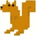 | 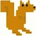 | 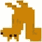 | 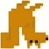 |
| 原创 | 水平翻转 | 垂直翻转 | 水平和垂直翻转 |

```py
 80\.     while
True:
 81\.         runGame()
```

`main()`中的设置完成后，游戏开始，调用`runGame()`。

```py
 84\. def
runGame():
 85.    
# set up variables for the start of a new game
 86\.     invulnerableMode
= False  # if the player is invulnerable
 87\.     invulnerableStartTime
= 0 # time the player became invulnerable
 88\.     gameOverMode
= False      # if the player has lost
 89\.     gameOverStartTime
= 0     # time the player lost
 90\.     winMode
= False           # if the player has won
```

松鼠吃松鼠游戏有很多跟踪游戏状态的变量。稍后在代码中使用这些变量时，将对它们进行更详细的解释。

```py
 92\.     # create the surfaces to hold game text
 93\.     gameOverSurf
= BASICFONT.render('Game Over', True, WHITE)
 94\.     gameOverRect
= gameOverSurf.get_rect()
 95\.     gameOverRect.center
= (HALF_WINWIDTH, HALF_WINHEIGHT)
 96\. 
 97\.     winSurf
= BASICFONT.render('You have achieved OMEGA SQUIRREL!', True, WHITE)
 98\.     winRect
= winSurf.get_rect()
 99\.     winRect.center
= (HALF_WINWIDTH, HALF_WINHEIGHT)
100\. 
101\.     winSurf2
= BASICFONT.render('(Press "r" to restart.)', True, WHITE)
102\.     winRect2
= winSurf2.get_rect()
103\.     winRect2.center
= (HALF_WINWIDTH, HALF_WINHEIGHT + 30)
```

这些变量包含表面对象与“游戏结束”，“你已经实现了欧米茄松鼠！”，和”(按“r”重新启动。)”游戏结束后出现在屏幕上的文本(玩家输或赢)。

```py
105\.     # camerax and cameray are where the middle of the
camera view is
106\.     camerax
= 0
107\.     cameray
= 0
```

`camerax`和`cameray`变量跟踪“摄像机”的游戏坐标。想象游戏世界是一个无限的 2D 空间。当然，这不可能适合任何屏幕。我们只能在屏幕上画出无限 2D 空间的一部分。我们称这部分区域为摄像机，因为就好像我们的屏幕就是摄像机所看到的游戏世界的前方区域。这里有一张游戏世界(一片无限的绿色田野)和相机可以看到的区域的图片:

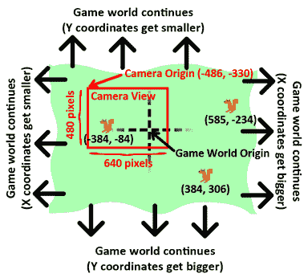

如你所见，游戏世界的 XY 坐标不断变大变小。游戏世界原点是(0，0)游戏世界坐标所在的位置。你可以看到三只松鼠位于(-384，-84)，(384，306)，和(585，-234)。

但是我们只能在屏幕上显示 640 x 480 像素的区域(尽管如果我们将不同的数字传递给`pygame.display.set_mode()`函数，这可以改变)，所以我们需要跟踪相机的原点在游戏世界坐标中的位置。上图中，相机放置在游戏世界坐标中的(-486，-330)。

下面的图片显示了相同的领域和松鼠，除了一切都在相机坐标中给出:

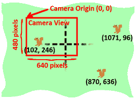

相机可以看到的区域(称为相机视图)的中心(即原点)位于游戏世界坐标(-486，-330)。由于相机看到的是显示在玩家屏幕上的，所以“相机”坐标和“像素”坐标是一样的。要找出松鼠的像素坐标(即它们出现在屏幕上的位置)，请将松鼠的游戏坐标减去摄像机原点的游戏坐标。

所以左边的松鼠在游戏中的坐标是(-384，-84)，但在屏幕上的像素坐标是(102，246)。(对于 X 坐标，-384 - -486 = 102，对于 Y 坐标，-84 - -330 = 246。)

当我们做同样的计算来寻找另外两只松鼠的像素坐标时，我们发现它们存在于屏幕的范围之外。这就是它们不出现在摄像机视野中的原因。

“活动区域”是我想出来的一个名字，用来描述游戏世界中摄像机所能看到的区域，以及摄像机周围的区域。


计算某物是否在活动区域将在本章后面的`isOutsideActiveArea()`函数中解释。当我们创建新的敌人松鼠或草地物体时，我们不希望它们被创建在摄像机的视野内，因为它们看起来像是突然冒出来的。

但是我们也不想把它们创造得离摄像机太远，因为那样它们可能永远也不会游荡到摄像机的视野里。在活动区域内，但在相机外，可以安全地创建松鼠和草地对象。

此外，当松鼠和草对象超出活动区域的边界时，它们足够远，可以删除，这样它们就不会再占用内存。不需要那么远的物体，因为它们不太可能回到相机的视野中。

如果你曾经在超级任天堂上玩过超级马里奥世界，YouTube 上有一个很好的视频解释了超级马里奥世界的相机系统是如何工作的。你可以在 http://invpy.com/mariocameraT3[找到这个视频。](//invpy.com/mariocamera)

```py
109\.     grassObjs
= []    # stores all the grass objects in the
game
110\.     squirrelObjs
= [] # stores all the non-player squirrel objects
111\.     # stores the player object:
112\.     playerObj
= {'surface': pygame.transform.scale(L_SQUIR_IMG, (STARTSIZE, STARTSIZE)),
113\.                  'facing':
LEFT,
114\.                  'size':
STARTSIZE,
115\.                  'x':
HALF_WINWIDTH,
116\.                  'y':
HALF_WINHEIGHT,
117\.                  'bounce':0,
118\.                  'health':
MAXHEALTH}
119\. 
120\.     moveLeft 
= False
121\.     moveRight
= False
122\.     moveUp   
= False
123\.     moveDown 
= False
```

`grassObjs`变量保存了游戏中所有草地对象的列表。创建新的草对象时，它们会被添加到该列表中。删除草对象时，它们将从该列表中移除。这同样适用于`squirrelObjs`变量和敌人松鼠对象。

`playerObj`变量不是一个列表，而只是字典值本身。

第 120 到 123 行的 move 变量跟踪哪个箭头键(或 WASD 键)被按下，就像前面几个游戏程序一样。

```py
125\.     # start off with some random grass images on the screen
126\.     for
i in range(10):
127\.         grassObjs.append(makeNewGrass(camerax,
cameray))
128\.         grassObjs[i]['x']
= random.randint(0, WINWIDTH)
129\.         grassObjs[i]['y']
= random.randint(0, WINHEIGHT)
```

活动区域应该从屏幕上可见的几个草地对象开始。`makeNewGrass()`函数将创建并返回一个随机位于活动区域但在摄像机视野之外的草地对象。这是我们在调用`makeNewGrass()`时通常想要的，但是因为我们想要确保最初的几个草对象在屏幕上，所以 X 和 Y 坐标被覆盖。

```py
131\.     while
True: # main game loop
```

游戏循环和之前游戏程序中的游戏循环一样，会做事件处理，更新游戏状态，把所有东西都画到屏幕上。

```py
132\.         # Check if we should turn off invulnerability
133\.         if
invulnerableMode and time.time() - invulnerableStartTime > INVULNTIME:
134\.             invulnerableMode
= False
```

当玩家被敌人的松鼠击中而没有死亡时，我们让玩家在几秒钟内不会受到伤害(因为`INVULNTIME`常量被设置为`2`)。在此期间，玩家的松鼠闪烁，不会受到其他松鼠的任何伤害。如果“刀枪不入模式”时间结束，134 行将把`invulnerableMode`设置为`False`。

```py
136\.         # move all the squirrels
137\.         for
sObj in squirrelObjs:
138\.             # move the squirrel, and adjust for their bounce
139\.             sObj['x']
+= sObj['movex']
140\.             sObj['y']
+= sObj['movey']
```

敌人的松鼠都根据它们的`'movex'`和`'movey'`键中的值移动。如果这些值为正，松鼠会向右或向下移动。如果这些值为负，它们向左或向上移动。该值越大，他们在游戏循环中的每次迭代中移动得越远(这意味着他们移动得更快)。

第 137 行的`for`循环将把这个移动代码应用到`squirrelObjs`列表中的每个敌人松鼠对象。首先，第 139 和 140 行将调整它们的`'x'`和`'y'`键的值。

```py
141\.             sObj['bounce']
+= 1
142\.             if
sObj['bounce'] > sObj['bouncerate']:
143\.                 sObj['bounce']
= 0 # reset bounce amount
```

对于每只松鼠，`sObj['bounce']`中的值在游戏循环的每次迭代中递增。当该值为`0`时，松鼠正处于弹跳的最开始。当该值等于`sObj['bouncerate']`中的值时，该值结束。(这就是为什么较小的`sObj['bouncerate']`值有助于更快的反弹。如果`sObj['bouncerate']`是`3`，那么松鼠只需要通过游戏循环三次迭代就可以完成一次完整的弹跳。如果`sObj['bouncerate']`是`10`，那么需要十次迭代。)

当`sObj['bounce']`大于`sObj['bouncerate']`时，则需要将其重置为`0`。这就是第 142 行和第 143 行的作用。

```py
145\.             # random chance they change direction
146\.             if
random.randint(0, 99) < DIRCHANGEFREQ:
147\.                 sObj['movex']
= getRandomVelocity()
148\.                 sObj['movey']
= getRandomVelocity()
149\.                 if
sObj['movex'] > 0: # faces right
150\.                     sObj['surface']
= pygame.transform.scale(R_SQUIR_IMG, (sObj['width'], sObj['height']))
151\.                 else:
# faces left
152\.                     sObj['surface']
= pygame.transform.scale(L_SQUIR_IMG, (sObj['width'], sObj['height']))
```

在游戏循环的每次迭代中，松鼠有 2%的几率随机改变速度和方向。在第 146 行上，`random.randint(0, 99)`调用从 100 个可能的整数中随机选择一个整数。如果这个数字小于`DIRCHANGEFREQ`(我们在第 33 行将其设置为`2`)，那么将为`sObj['movex']`和`sObj['movey']`设置一个新值。

因为这意味着松鼠可能已经改变了方向，所以`sObj['surface']`中的表面对象应该被一个新的表面对象所替换，这个新的表面对象应该正确地面向左或右，并且缩放到松鼠的大小。这是第 149 到 152 行确定的。注意，第 150 行从`R_SQUIR_IMG`得到一个缩放的表面对象，第 152 行从`L_SQUIR_IMG`得到一个缩放的表面对象。

```py
155\.         # go through all the objects and see if any need to be
deleted.
156\.         for
i in range(len(grassObjs) - 1, -1, -1):
157\.             if
isOutsideActiveArea(camerax, cameray, grassObjs[i]):
158\.                 del
grassObjs[i]
159\.         for
i in range(len(squirrelObjs) - 1, -1, -1):
160\.             if
isOutsideActiveArea(camerax, cameray, squirrelObjs[i]):
161\.                 del
squirrelObjs[i]
```

在游戏循环的每一次迭代中，代码将检查所有的草地和敌人松鼠对象，看它们是否在“活动区域”之外。`isOutsideActiveArea()`函数获取摄像机的当前坐标(存储在`camerax`和`cameray`中)和草/敌松鼠对象，如果对象不在活动区域，则返回`True`。

如果是这种情况，则在第 158 行(对于草地对象)或第 161 行(对于松鼠对象)删除该对象。这就是当玩家离松鼠和草足够远时(或者当敌人松鼠离玩家足够远时)松鼠和草被删除的原因。这确保了玩家附近总是有许多松鼠和草类物体。

用`del`操作符删除松鼠和草对象。但是，请注意第 156 和 159 行的`for`循环将参数传递给`range()`函数，这样编号从最后一项的索引开始，然后递减`-1`(不同于通常由`1`递增)，直到到达数字`-1`。与通常的做法相比，我们在列表的索引上向后迭代。这样做是因为我们在遍历列表，同时也在删除列表中的条目。

要了解为什么需要这种逆序，假设我们有以下列表值:

动物= ['猫'，'老鼠'，'狗'，'马']

所以我们想写代码从这个列表中删除字符串`'dog'`的所有实例。我们可能会想写出这样的代码:

对于范围内的 I(动物):

如果动物[我] == '狗':

动物数量[i]

但是如果我们运行这段代码，我们会得到一个类似这样的`IndexError`错误:

回溯(最近一次呼叫):

文件“<stdin>”，第 2 行，在<module>中</module></stdin>

索引错误:列表索引超出范围

要了解为什么会出现这种错误，让我们浏览一下代码。首先，`animals`列表将被设置为`['cat', 'mouse', 'dog', 'horse']`，`len(animals)`将返回`4`。这意味着对`range(4)`的调用将导致`for`循环用值`0`、`1`、`2`和`3`进行迭代。

当`for`循环在`i`设置为`2`的情况下迭代时，`if`语句的条件将为`True`，并且`del animals[i]`语句将删除`animals[2]`。这意味着之后动物列表将会是`['cat', 'mouse', 'horse']`。因为`'dog'`值被移除，所以`'dog'`之后的所有项目的索引都下移一位。

但是在通过`for`循环的下一次迭代中，`i`被设置为`3`。但是`animals[3]`越界了，因为动物列表的有效索引不再是`0`到`3`，而是`0`到`2`。最初对`range()`的调用是为了一个包含 4 个条目的列表。列表长度改变，但`for`循环设置为原始长度。

但是，如果我们从列表的最后一个索引迭代到`0`，就不会碰到这个问题。以下程序从`animals`列表中删除`'dog'`字符串，而不会导致`IndexError`错误:

动物= ['猫'，'老鼠'，'狗'，'马']

对于范围内的 I(len(动物)- 1，-1，-1):

如果动物[我] == '狗':

动物数量[i]

这段代码不会导致错误的原因是因为`for`循环遍历了`3`、`2`、`1`和`0`。在第一次迭代时，代码检查`animals[3]`是否等于`'dog'`。它不是(`animals[3]`是`'horse'`)，所以代码继续下一次迭代。然后检查`animals[2]`是否等于`'dog'`。确实如此，所以`animals[2]`被删除。

删除`animals[2]`后，`animals`列表被设置为`['cat', 'mouse', 'horse']`。在下一次迭代中，`i`被设置为`1`。在`animals[1]`处有一个值(`'mouse'`值)，所以不会产生误差。列表中的所有条目在`'dog'`之后都下移一位并不重要，因为我们从列表的末尾开始，并向前面移动，所有这些条目都已经被检查过了。

类似地，我们可以从`grassObjs`和`squirrelObjs`列表中无误地删除 grass 和 squirrel 对象，因为第 156 和 159 行的`for`循环以相反的顺序迭代。

```py
163\.         # add more grass & squirrels if we don't have
enough.
164\.         while
len(grassObjs) < NUMGRASS:
165\.             grassObjs.append(makeNewGrass(camerax,
cameray))
166\.         while
len(squirrelObjs) < NUMSQUIRRELS:
167\.             squirrelObjs.append(makeNewSquirrel(camerax,
cameray))
```

还记得在程序开始的时候`NUMGRASS`常量被设置为`80`而`NUMSQUIRRELS`常量被设置为`30`吗？设置这些变量是为了让我们可以确保在活动区域中始终有大量的草和松鼠对象。如果`grassObjs`或`squirrelObjs`的长度分别低于`NUMGRASS`或`NUMSQUIRRELS`，那么新的草和松鼠对象被创建。本章稍后将解释创建这些对象的`makeNewGrass()`和`makeNewSquirrel()`函数。

```py
169\.         # adjust camerax and cameray if beyond the "camera
slack"
170\.         playerCenterx
= playerObj['x'] + int(playerObj['size'] / 2)
171\.         playerCentery
= playerObj['y'] + int(playerObj['size'] / 2)
172.         if
(camerax + HALF_WINWIDTH) - playerCenterx > CAMERASLACK:
173.             camerax
= playerCenterx + CAMERASLACK - HALF_WINWIDTH
174.         elif
playerCenterx – (camerax + HALF_WINWIDTH) > CAMERASLACK:
175.             camerax
= playerCenterx – CAMERASLACK - HALF_WINWIDTH
176.         if
(cameray + HALF_WINHEIGHT) - playerCentery > CAMERASLACK:
177.             cameray
= playerCentery + CAMERASLACK - HALF_WINHEIGHT
178.         elif
playerCentery – (cameray + HALF_WINHEIGHT) > CAMERASLACK:
179.             cameray
= playerCentery – CAMERASLACK - HALF_WINHEIGHT
```

当玩家移动时，摄像机的位置(作为整数存储在`camerax`和`cameray`变量中)需要更新。我把相机更新前玩家可以移动的像素数量称为“相机松弛”。第 19 行将`CAMERASLACK`常量设置为`90`，我们的程序将使用它来表示玩家松鼠可以从中心移动 90 个像素，然后摄像机位置才会更新以跟随松鼠。

为了理解第 172、174、176 和 178 行的`if`语句中使用的等式，你应该注意到`(camerax + HALF_WINWIDTH)`和`(cameray + HALF_WINHEIGHT)`是当前在屏幕中心的 XY 游戏世界坐标。`playerCenterx`和`playerCentery`被设置在玩家松鼠位置的中间，也在游戏世界坐标中。

对于第 172 行，如果中心 X 坐标减去玩家的中心 X 坐标大于`CAMERASLACK`值，这意味着玩家在相机中心右侧的像素比相机松弛所允许的要多。需要更新`camerax`值，以便玩家松鼠刚好处于相机松弛的边缘。这就是为什么 173 行将`camerax`设置为`playerCenterx + CAMERASLACK – HALF_WINWIDTH`的原因。请注意，`camerax`变量被改变，而不是`playerObj['x']`值。我们想移动的是摄像机，而不是玩家。

其他三个`if`语句在左侧、上侧和下侧遵循相似的逻辑。

```py
181\.         # draw the green background
182\.         DISPLAYSURF.fill(GRASSCOLOR)
```

第 182 行开始绘制显示表面对象内容的代码。首先，第 182 行为背景绘制了绿色。这将覆盖所有先前的表面内容，以便我们可以从头开始绘制框架。

```py
184\.         # draw all the grass objects on the screen
185\.         for
gObj in grassObjs:
186\.             gRect
= pygame.Rect( (gObj['x'] - camerax,
187\.                                   gObj['y']
- cameray,
188\.                                   gObj['width'],
189\.                                   gObj['height'])
)
190\.             DISPLAYSURF.blit(GRASSIMAGES[gObj['grassImage']],
gRect)
```

第 185 行的`for`循环遍历`grassObjs`列表中的所有 grass 对象，并根据存储在其中的 x、y、宽度和高度信息创建一个 Rect 对象。这个 Rect 对象存储在一个名为`gRect`的变量中。在第 190 行，`gRect`被用于`blit()`方法调用中，以在显示表面上绘制草地图像。注意`gObj['grassImage']`只包含一个整数，它是`GRASSIMAGES`的索引。`GRASSIMAGES`是包含所有草地图像的表面对象列表。表面对象比单个整数占用更多的内存，所有具有相似`gObj['grassImage']`值的草对象看起来都一样。因此，在`GRASSIMAGES`中只将每个 grass 图像存储一次并简单地将整数存储在 grass 对象本身中是有意义的。

```py
193\.         # draw the other squirrels
194\.         for
sObj in squirrelObjs:
195\.             sObj['rect']
= pygame.Rect( (sObj['x'] - camerax,
196\.                                          sObj['y']
- cameray - getBounceAmount(sObj['bounce'], sObj['bouncerate'],
sObj['bounceheight']),
197\.                                          sObj['width'],
198\.                                          sObj['height'])
)
199\.             DISPLAYSURF.blit(sObj['surface'],
sObj['rect'])
```

绘制所有敌人松鼠游戏对象的`for`循环类似于前面的`for`循环，除了它创建的 Rect 对象保存在松鼠字典的`'rect'`键值中。代码这样做的原因是因为我们稍后将使用这个 Rect 对象来检查敌人松鼠是否与玩家松鼠发生了碰撞。

注意，Rect 构造函数的顶级参数不仅仅是`sObj['y'] - cameray`而是`sObj['y'] - cameray - getBounceAmount(sObj['bounce'], sObj['bouncerate'], sObj['bounceheight'])`。`getBounceAmount()`函数将返回最大值应该增加的像素数。

此外，没有松鼠图像的表面对象的公共列表，就像草地游戏对象和`GRASSIMAGES`一样。每个敌人松鼠游戏对象都有自己的表面对象存储在`'surface'`键中。这是因为松鼠图像可以缩放到不同的大小。

```py
202\.         # draw the player squirrel
203\.         flashIsOn
= round(time.time(), 1) * 10 % 2 == 1
```

画完草地和敌方松鼠后，代码会画出玩家的松鼠。然而，有一种情况我们会跳过绘制玩家的松鼠。当玩家与更大的敌人松鼠相撞时，玩家受到伤害并闪烁一小会儿，以表明玩家暂时无敌。这种闪烁效果是通过在游戏循环中的一些迭代中绘制玩家松鼠而不是在其他迭代中绘制来实现的。

玩家松鼠将在十分之一秒的游戏循环迭代中被绘制，然后在十分之一秒的游戏循环迭代中不被绘制。只要玩家是无懈可击的(在代码中，这意味着`invulnerableMode`变量被设置为`True`)，这个过程就会一遍又一遍地重复。我们的代码将使闪烁持续两秒钟，因为`2`存储在第 25 行的`INVULNTIME`常量变量中。

为了确定闪光灯是否打开，线 202 从`time.time()`获取当前时间。让我们使用这个函数调用返回`1323926893.622`的例子。该值被传递给`round()`，后者将其四舍五入到小数点后一位数(因为`1`是作为`round()`的第二个参数传递的)。这意味着`round()`将返回值`1323926893.6`。

该值然后乘以`10`，成为`13239268936`。一旦我们有了一个整数，我们就可以做“模 2”的把戏，看看它是偶数还是奇数。`13239268936 % 2`评估为`0`，这意味着`flashIsOn`将被设置为`False`，因为`0 == 1`是`False`。

事实上，`time.time()`将继续返回值，最终将`False`放入`flashIsOn`直到`1323926893.700`，这是下一个十秒。这就是为什么`flashIsOn`变量在十分之一秒内一直有`False`，然后在下一个十分之一秒内有`True`(不管在那十分之一秒内发生了多少次迭代)。

```py
204\.         if
not gameOverMode and not (invulnerableMode and flashIsOn):
205\.             playerObj['rect']
= pygame.Rect( (playerObj['x'] - camerax,
206\.                                               playerObj['y']
– cameray - getBounceAmount(playerObj['bounce'], BOUNCERATE, BOUNCEHEIGHT),
207\.                                               playerObj['size'],
208\.                                               playerObj['size'])
)
209\.             DISPLAYSURF.blit(playerObj['surface'],
playerObj['rect'])
```

在我们画出玩家的松鼠之前，有三件事是必须要做的`True`。游戏当前必须正在进行(这发生在`gameOverMode`是`False`的时候)并且玩家不是刀枪不入不闪烁(这发生在`invulnerableMode`和`flashIsOn`是`False`的时候)。

画玩家松鼠的代码和画敌人松鼠的代码几乎一模一样。

```py
212\.         # draw the health meter
213\.         drawHealthMeter(playerObj['health'])
```

`drawHealthMeter()`功能在屏幕左上角绘制指示器，告诉玩家玩家松鼠在死亡前可以被击中多少次。该功能将在本章后面解释。

```py
215\.         for
event in pygame.event.get(): # event handling
loop
216\.             if
event.type == QUIT:
217\.                 terminate()
```

事件处理循环中首先检查的是`QUIT`事件是否已经生成。如果是这样，那么程序应该终止。

```py
219\.             elif
event.type == KEYDOWN:
220\.                 if
event.key in (K_UP, K_w):
221\.                     moveDown
= False
222\.                     moveUp
= True
223\.                 elif
event.key in (K_DOWN, K_s):
224\.                     moveUp
= False
225\.                     moveDown
= True
```

如果按下了向上或向下箭头键(或其 WASD 等效键)，则移动变量(`moveRight`、`moveDown`等)。)应设置为`True`，相反方向的移动变量应设置为`False`。

```py
226\.                 elif
event.key in (K_LEFT, K_a):
227\.                     moveRight
= False
228\.                     moveLeft
= True
229\.                     if
playerObj['facing'] == RIGHT: # change player
image
230\.                         playerObj['surface']
= pygame.transform.scale(L_SQUIR_IMG, (playerObj['size'], playerObj['size']))
231\.                     playerObj['facing']
= LEFT
232\.                 elif
event.key in (K_RIGHT, K_d):
233\.                     moveLeft
= False
234\.                     moveRight
= True
235\.                     if
playerObj['facing'] == LEFT: # change player
image
236\.                         playerObj['surface']
= pygame.transform.scale(R_SQUIR_IMG, (playerObj['size'], playerObj['size']))
237\.                     playerObj['facing']
= RIGHT
```

当按下左箭头键或右箭头键时，也应设置`moveLeft`和`moveRight`变量。另外，`playerObj['facing']`中的值应该更新为`LEFT`或`RIGHT`。如果玩家松鼠现在面向一个新的方向，那么`playerObj['surface']`值应该替换为面向新方向的松鼠的正确缩放图像。

如果按下左箭头键，则运行第 229 行，并检查玩家松鼠是否面向右侧。如果是这样，那么玩家松鼠图像的新缩放表面对象被存储在`playerObj['surface']`中。第 232 行的`elif`语句中的代码处理相反的情况。

```py
238\.                 elif
winMode and event.key == K_r:
239\.                     return
```

如果玩家已经通过变得足够大赢得了游戏(在这种情况下，`winMode`将被设置为`True`)并且 R 键已经被按下，那么`runGame()`应该返回。这将结束当前游戏，下一次调用`runGame()`时将开始新游戏。

```py
241\.             elif
event.type == KEYUP:
242\.                 # stop moving the player's squirrel
243\.                 if
event.key in (K_LEFT, K_a):
244\.                     moveLeft
= False
245\.                 elif
event.key in (K_RIGHT, K_d):
246\.                     moveRight
= False
247\.                 elif
event.key in (K_UP, K_w):
248\.                     moveUp
= False
249\.                 elif
event.key in (K_DOWN, K_s):
250\.                     moveDown
= False
```

如果玩家放开任何箭头键或 WASD 键，那么代码应该将该方向的 move 变量设置为`False`。这将阻止松鼠向那个方向移动。

```py
252\.                 elif
event.key == K_ESCAPE:
253\.                     terminate()
```

如果按下的键是 Esc 键，则终止程序。

```py
255\.         if
not gameOverMode:
256\.             # actually move the player
257\.             if
moveLeft:
258\.                 playerObj['x']
-= MOVERATE
259\.             if
moveRight:
260\.                 playerObj['x']
+= MOVERATE
261\.             if
moveUp:
262\.                 playerObj['y']
-= MOVERATE
263\.             if
moveDown:
264\.                 playerObj['y']
+= MOVERATE
```

第 255 行的`if`语句中的代码只有在游戏没有结束时才会移动玩家的松鼠。(这也是为什么玩家的松鼠死了之后再按箭头键会没有效果的原因。)根据哪个移动变量被设置为`True`,`playerObj`字典的`playerObj['x']`和`playerObj['y']`值应该被`MOVERATE`改变。(这就是为什么`MOVERATE`中较大的值会让松鼠移动得更快。)

```py
266\.             if
(moveLeft or moveRight or moveUp or moveDown) or playerObj['bounce'] != 0:
267\.                 playerObj['bounce']
+= 1
268\. 
269\.             if
playerObj['bounce'] > BOUNCERATE:
270\.                 playerObj['bounce']
= 0 # reset bounce amount
```

`playerObj['bounce']`中的值记录了玩家在弹跳过程中的位置。该变量存储从`0`到`BOUNCERATE`的整数值。就像敌人松鼠的反弹值一样，`0`的`playerObj['bounce']`值意味着玩家松鼠处于反弹的开始，而`BOUNCERATE`值意味着玩家松鼠处于反弹的结束。

每当玩家移动时，或者如果玩家已经停止移动，但松鼠还没有完成当前的弹跳，玩家松鼠就会弹跳。这个条件在第 266 行的`if`语句中被捕获。如果任何一个移动变量被设置为`True`或者当前的`playerObj['bounce']`不是`0`(这意味着玩家当前在弹跳)，那么该变量应该在第 267 行递增。

因为`playerObj['bounce']`变量应该只在`0`到`BOUNCERATE`的范围内，如果递增它使得它大于`BOUNCERATE`，它应该被重置回`0`。

```py
272\.             # check if the player has collided with any squirrels
273\.             for
i in range(len(squirrelObjs)-1, -1, -1):
274\.                 sqObj
= squirrelObjs[i]
```

273 上的`for`循环将在`squirrelObjs`中的每个敌人松鼠游戏对象上运行代码。注意第 273 行`range()`的参数从`squirrelObjs`的最后一个索引开始递减。这是因为这个`for`循环内部的代码可能会删除一些敌人松鼠的游戏对象(如果玩家的松鼠最终吃掉了它们)，所以从末端向下迭代到前端是很重要的。原因在前面的“删除列表中的项目时，反向遍历列表”一节中已经解释过了。

```py
275\.                 if
'rect' in sqObj and playerObj['rect'].colliderect(sqObj['rect']):
276\.                     # a player/squirrel collision has occurred
277.
278\.                     if
sqObj['width'] * sqObj['height'] <= playerObj['size']**2:
279\.                         # player is larger and eats the squirrel
280\.                         playerObj['size']
+= int( (sqObj['width'] * sqObj['height'])**0.2 ) + 1
281\.                         del
squirrelObjs[i]
```

如果玩家的松鼠等于或大于与它相撞的敌人松鼠的大小，那么玩家的松鼠会吃掉那只松鼠而成长。添加到玩家对象中的`'size'`键的数字(即增长)是根据第 280 行中敌人松鼠的大小计算的。这张图表显示了不同大小的松鼠的生长情况。请注意，较大的松鼠会导致更多的生长:

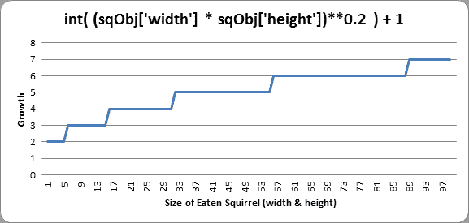

因此，根据图表，吃一只宽和高为 45(即 1600 像素的区域)的松鼠会使玩家长高和宽 5 像素。

第 281 行从`squirrelObjs`列表中删除被吃掉的松鼠对象，这样它将不再出现在屏幕上或者更新它的位置。

```py
283\.                         if
playerObj['facing'] == LEFT:
284\.                             playerObj['surface']
= pygame.transform.scale(L_SQUIR_IMG, (playerObj['size'], playerObj['size']))
285\.                         if
playerObj['facing'] == RIGHT:
286\.                             playerObj['surface']
= pygame.transform.scale(R_SQUIR_IMG, (playerObj['size'], playerObj['size']))
```

现在松鼠变大了，玩家的松鼠图像需要更新。这可以通过将`L_SQUIR_IMG`或`R_SQUIR_IMG`中的原始松鼠图像传递给`pygame.transform.scale()`函数来完成，该函数将返回图像的放大版本。根据`playerObj['facing']`是否等于`LEFT`或`RIGHT`来决定我们将哪个原始松鼠图像传递给函数。

```py
288\.                         if
playerObj['size'] > WINSIZE:
289\.                             winMode
= True # turn on "win mode"
```

玩家赢得游戏的方法是让松鼠的大小大于存储在`WINSIZE`常量变量中的整数。如果这是真的，那么`winMode`变量被设置为`True`。该函数其他部分的代码将处理祝贺文本的显示，并检查玩家是否按下 R 键重新开始游戏。

```py
291\.                     elif
not invulnerableMode:
292\.                         # player is smaller and takes damage
293\.                         invulnerableMode
= True
294\.                         invulnerableStartTime
= time.time()
295\.                         playerObj['health']
-= 1
296\.                         if
playerObj['health'] == 0:
297\.                             gameOverMode
= True # turn on "game over mode"
298\.                             gameOverStartTime
= time.time()
```

如果玩家的面积不等于或大于敌人松鼠的面积，并且`invulnerableMode`没有设置为`True`，那么玩家将因与这只更大的松鼠碰撞而受到伤害。

为了防止玩家立即被同一只松鼠伤害几次，我们将通过在第 293 行设置`invulnerableMode`到`True`来短暂地使玩家不受松鼠进一步攻击的伤害。第 294 行将`invulnerableStartTime`设置为当前时间(由`time.time()`返回)，这样第 133 和 134 行可以知道何时将`invulnerableMode`设置为`False`。

第 295 行减少玩家的生命值`1`。因为有可能玩家的健康现在处于`0`，所以行 296 对此进行检查，如果是，则将`gameOverMode`设置为`True`并将`gameOverStartTime`设置为当前时间。

```py
299\.         else:
300\.             # game is over, show "game over" text
301\.             DISPLAYSURF.blit(gameOverSurf,
gameOverRect)
302\.             if
time.time() - gameOverStartTime > GAMEOVERTIME:
303\.                 return
# end the current game
```

当玩家死亡时,“游戏结束”文本(在`gameOverSurf`变量中的表面对象上)将在屏幕上显示`GAMEOVERTIME`常量中的秒数。一旦这段时间过去，那么`runGame()`函数将返回。

这让敌人的松鼠在玩家死亡后和下一个游戏开始前的几秒钟内继续活动。《松鼠吃松鼠》中的“屏幕上的游戏”不会等到玩家按下一个键后才开始新游戏。

```py
305\.         # check if the player has won.
306\.         if
winMode:
307\.             DISPLAYSURF.blit(winSurf,
winRect)
308\.             DISPLAYSURF.blit(winSurf2,
winRect2)
309\. 
310\.         pygame.display.update()
311\.         FPSCLOCK.tick(FPS)
```

如果玩家已经达到一定的尺寸(由`WINSIZE`常数决定)，变量`winMode`被设置为第 289 行的`True`。当玩家获胜时，所有发生的事情就是“你已经获得了欧米茄松鼠！”文本(存储在`winSurf`变量中的表面对象)和"(按" r "重新启动。)"文本(存储在`winSurf2`变量中的表面对象)出现在屏幕上。游戏继续进行，直到用户按下 R 键，此时程序执行将从`runGame()`返回。R 键的事件处理代码在第 238 和 239 行完成。

```py
316\. def
drawHealthMeter(currentHealth):
317\.     for
i in range(currentHealth): # draw red health bars
318\.         pygame.draw.rect(DISPLAYSURF,
RED,   (15, 5 + (10 * MAXHEALTH) - i * 10, 20, 10))
319\.     for
i in range(MAXHEALTH): # draw the white outlines
320\.         pygame.draw.rect(DISPLAYSURF,
WHITE, (15, 5 + (10 * MAXHEALTH) - i * 10, 20, 10), 1)
```

为了绘制健康量表，首先第 317 行的`for`循环绘制了一个填充的红色矩形，表示玩家的健康值。然后第 319 行的`for`循环为玩家可能拥有的所有健康状况绘制一个未填充的白色矩形(这是存储在`MAXHEALTH`常量中的整数值)。注意在`drawHealthMeter()`中没有调用`pygame.display.update()`功能。

## 功能`terminate()`

```py
323\. def
terminate():
324\.     pygame.quit()
325\.     sys.exit()
```

`terminate()`功能的工作原理与之前的游戏程序相同。

```py
328\. def
getBounceAmount(currentBounce, bounceRate, bounceHeight):
329\.     # Returns the number of pixels to offset based on the
bounce.
330\.     # Larger bounceRate means a slower bounce.
331\.     # Larger bounceHeight means a higher bounce.
332.     # currentBounce will always be less than bounceRate
333\.     return
int(math.sin( (math.pi / float(bounceRate)) * currentBounce ) * bounceHeight)
334.
```

有一个数学函数(类似于编程中的函数，它们都根据参数“返回”或“计算”一个数字)叫做正弦(发音像“符号”，通常缩写为“s in”)。你可能在数学课上学过，但如果你没有，这里会解释。Python 在`math`模块中有这个数学函数作为 Python 函数。您可以向`math.sin()`传递一个 int 或 float 值，它将返回一个 float 值，称为“正弦值”

在交互式 shell 中，让我们看看`math.sin()`为一些值返回了什么:

>>>导入数学

> > > math.sin(1)

0.8414709848078965

> > > math.sin(2)

0.90929742682568171

> > > math.sin(3)

0.14112000805986721

> > > math.sin(4)

-0.7568024953079282

> > > math.sin(5)

-0.95892427466313845

根据我们传递给它的值，似乎很难预测`math.sin()`将返回什么值(这可能会让你想知道`math.sin()`有什么用)。但是如果我们把整数`1`到`10`的正弦值画在图上，我们会得到这个:

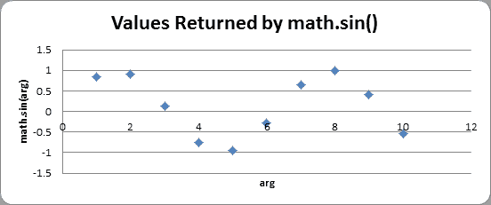

您可以在由`math.sin()`返回的值中看到一种波状模式。如果您计算出除整数之外的更多数字的正弦值(例如，`1.5`和`2.5`等等)，然后用线将点连接起来，您就可以更容易地看到这个波浪形图案:

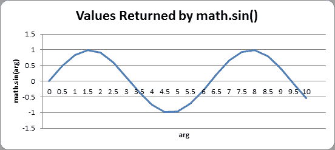

事实上，如果您不断向该图添加越来越多的数据点，您会看到正弦波看起来像这样:

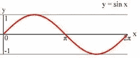

注意`math.sin(0)`返回`0`，然后逐渐增大，直到`math.sin(3.14 / 2)`返回`1`，然后开始减小，直到`math.sin(3.14)`返回`0`。数字`3.14`是数学中的一个特殊数字，叫做 pi (发音与美味的“馅饼”相同)。这个值也存储在`math`模块中的常量变量`pi`中(这就是为什么第 333 行使用变量`math.pi`)，从技术上讲，它是浮点值`3.1415926535897931`。因为我们希望松鼠的弹跳看起来像波浪，我们将只关注参数`0`到`3.14`的返回值`math.sin()`:

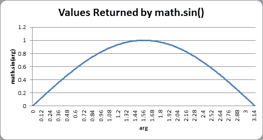

让我们看看`getBounceAmount()`的返回值，弄清楚它到底是做什么的。

```py
333\.     return
int(math.sin( (math.pi / float(bounceRate)) * currentBounce ) * bounceHeight)
```

记住，在第 21 行，我们将`BOUNCERATE`常量设置为`6`。这意味着我们的代码只会将`playerObj['bounce']`从`0`递增到`6`，我们希望将从`0`到`3.14`的浮点值范围分割成`6`个部分，我们可以通过简单的除法:`3.14 / 6 = 0.5235`来实现。“正弦波反弹”图表上`3.14`长度的每个`6`等份为`0.5235`。

可以看到当`playerObj['bounce']`在`3`(在`0`和`6`的中间)时，传递给`math.sin()`调用的值是`math.pi / 6 * 3`，也就是`1.5707`(在`0`和`3.1415`的中间)。然后`math.sin(1.5707)`会返回`1.0`，这是正弦波的最高部分(正弦波的最高部分发生在波的中途)。

随着`playerObj['bounce']`的值增加，`getBounceAmount()`函数将返回与正弦波从`0`到`3.14`的反弹形状相同的值。如果你想让反弹更高，那就增加`BOUNCEHEIGHT`常数。如果你想让反弹慢一点，那就增加`BOUNCERATE`常数。

正弦函数是三角数学中的一个概念。如果你想了解更多关于正弦波的知识，维基百科页面有详细信息:

我们调用`float()`将`bounceRate`转换成浮点数的原因很简单，这样这个程序就可以在 Python 版本 2 中工作。在 Python 版本 3 中，除法运算符将计算浮点值，即使两个操作数都是整数，如下所示:

> > > # Python 版本 3

...

>>> 10 / 5

Two

>>> 10 / 4

Two point five

>>>

然而，在 Python 版本 2 中，如果其中一个操作数也是浮点值，那么`/`除法运算符将只计算浮点值。如果两个操作数都是整数，那么 Python 2 的除法运算符将计算出一个整数值(如果需要，向下舍入)，如下所示:

> > > # Python 版本 2

...

>>> 10 / 5

Two

>>> 10 / 4

Two

>>> 10 / 4.0

Two point five

>>> 10.0 / 4

Two point five

>>> 10.0 / 4.0

Two point five

但是如果我们总是用`float()`函数将其中一个值转换成浮点值，那么无论哪个版本的 Python 运行这个源代码，除法运算符都将计算为浮点值。做出这些改变以使我们的代码能与旧版本的软件一起工作被称为向后兼容。保持向后兼容性很重要，因为不是每个人都会一直运行最新版本的软件，并且您希望确保您编写的代码能够在尽可能多的计算机上运行。

你不能总是让你的 Python 3 代码向后兼容 Python 2，但是如果可能的话，你应该这样做。否则，当使用 Python 2 的人试图运行你的游戏时，会得到错误信息，认为你的程序有问题。

Python 2 和 Python 3 之间的一些差异可以在找到。

## `getRandomVelocity()`功能

```py
335\. def
getRandomVelocity():
336\.     speed
= random.randint(SQUIRRELMINSPEED, SQUIRRELMAXSPEED)
337\.     if
random.randint(0, 1) == 0:
338\.         return
speed
339\.     else:
340\.         return
-speed
```

`getRandomVelocity()`功能用于随机确定敌人松鼠的移动速度。这个速度的范围在`SQUIRRELMINSPEED`和`SQUIRRELMAXSPEED`常量中设置，但是除此之外，速度要么是负的(表示松鼠向左或向上)，要么是正的(表示松鼠向右或向下)。随机速度有 50%的几率为正或负。

```py
343\. def
getRandomOffCameraPos(camerax, cameray, objWidth, objHeight):
344\.     # create a Rect of the camera view
345\.     cameraRect
= pygame.Rect(camerax, cameray, WINWIDTH, WINHEIGHT)
346\.     while
True:
347\.         x
= random.randint(camerax - WINWIDTH, camerax + (2 * WINWIDTH))
348\.         y
= random.randint(cameray - WINHEIGHT, cameray + (2 * WINHEIGHT))
349. # create a Rect object with the random
coordinates and use colliderect()
350.         # to make sure the right edge isn't in the
camera view.
351\.         objRect
= pygame.Rect(x, y, objWidth, objHeight)
352\.         if
not objRect.colliderect(cameraRect):
353\.             return
x, y
```

当在游戏世界中创建新的松鼠或草地对象时，我们希望它在活动区域内(这样它就在玩家的松鼠附近)，但不在摄像机的视野内(这样它就不会突然出现在屏幕上)。为此，我们创建一个 Rect 对象来表示摄像机的区域(使用`camerax`、`cameray`、`WINWIDTH`和`WINHEIGHT`常量)。

接下来，我们随机生成活动区域内 XY 坐标的数字。活动区域的左边缘和上边缘是`camerax`和`cameray`左上的`WINWIDTH`和`WINHEIGHT`像素。因此活动区域的左边缘和上边缘位于`camerax - WINWIDTH`和`cameray - WINHEIGHT`。活动区域的宽度和高度也是`WINWIDTH`和`WINHEIGHT`的三倍，如您在该图中所见(其中`WINWIDTH`设置为 640 像素，`WINHEIGHT`设置为 480 像素):

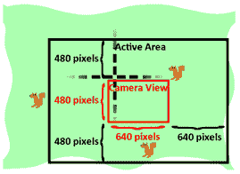

这意味着右边和底边将位于`camerax + (2 * WINWIDTH)`和`cameray + (2 * WINHEIGHT)`。第 352 行将检查随机 XY 坐标是否会与相机视图的 Rect 对象冲突。如果没有，则返回这些坐标。如果是这样，那么第 346 行的`while`循环将继续生成新的坐标，直到找到可接受的坐标。

```py
356\. def
makeNewSquirrel(camerax, cameray):
357\.     sq
= {}
358\.     generalSize
= random.randint(5, 25)
359\.     multiplier
= random.randint(1, 3)
360\.     sq['width'] 
= (generalSize + random.randint(0, 10)) * multiplier
361\.     sq['height']
= (generalSize + random.randint(0, 10)) * multiplier
362\.     sq['x'],
sq['y'] = getRandomOffCameraPos(camerax, cameray, sq['width'], sq['height'])
363\.     sq['movex']
= getRandomVelocity()
364\.     sq['movey']
= getRandomVelocity()
```

创建敌人松鼠游戏对象类似于制作草地游戏对象。每只敌方松鼠的数据也存储在字典中。在行 360 和 361 上，宽度和高度被设置为随机大小。使用`generalSize`变量是为了使每只松鼠的宽度和高度不会相差太大。否则，对宽度和高度使用完全随机的数字可能会给我们非常高和瘦的松鼠或者非常矮和宽的松鼠。松鼠的宽度和高度是这个一般大小加上一个从`0`到`10`的随机数(略有不同)，然后乘以`multiplier`变量。

松鼠的原始 XY 坐标位置将是相机看不到的随机位置，以防止松鼠在屏幕上突然出现。

速度和方向也是由`getRandomVelocity()`功能随机选择的。

```py
365\.     if
sq['movex'] < 0: # squirrel is facing left
366\.         sq['surface']
= pygame.transform.scale(L_SQUIR_IMG, (sq['width'], sq['height']))
367\.     else:
# squirrel is facing right
368\.         sq['surface']
= pygame.transform.scale(R_SQUIR_IMG, (sq['width'], sq['height']))
369\.     sq['bounce']
= 0
370\.     sq['bouncerate']
= random.randint(10, 18)
371\.     sq['bounceheight']
= random.randint(10, 50)
372\.     return
sq
```

`L_SQUIR_IMG`和`R_SQUIR_IMG`常量包含带有朝左和朝右松鼠图像的表面对象。新的表面物体将使用`pygame.transform.scale()`函数来匹配松鼠的宽度和高度(分别存储在`sq['width']`和`sq['height']`)。

之后，随机生成三个与反弹相关的值(除了`sq['bounce']`是`0`，因为松鼠总是在反弹开始时开始)，并在第 372 行返回字典。

```py
375\. def
makeNewGrass(camerax, cameray):
376\.     gr
= {}
377\.     gr['grassImage']
= random.randint(0, len(GRASSIMAGES) - 1)
378\.     gr['width'] 
= GRASSIMAGES[0].get_width()
379\.     gr['height']
= GRASSIMAGES[0].get_height()
380.    
gr['x'], gr['y'] = getRandomOffCameraPos(camerax, cameray, gr['width'],
gr['height'])
381.    
gr['rect'] = pygame.Rect( (gr['x'], gr['y'], gr['width'], gr['height']) )
382\.     return
gr
```

草地游戏对象是具有通常的`'x'`、`'y'`、`'width'`、`'height'`和`'rect'`键的字典，但是还有一个`'grassImage'`键，它是从`0`到比`GRASSIMAGES`列表长度小一的数字。这个数字将决定草地游戏对象的图像。例如，如果 grass 对象的`'grassImage'`键的值是`3`，那么它将使用存储在`GRASSIMAGES[3]`的表面对象作为它的图像。

```py
385\. def
isOutsideActiveArea(camerax, cameray, obj):
386\.     # Return False if camerax and cameray are more than
387\.     # a half-window length beyond the edge of the window.
388\.     boundsLeftEdge
= camerax - WINWIDTH
389\.     boundsTopEdge
= cameray - WINHEIGHT
390\.     boundsRect
= pygame.Rect(boundsLeftEdge, boundsTopEdge, WINWIDTH * 3, WINHEIGHT * 3)
391\.     objRect
= pygame.Rect(obj['x'], obj['y'], obj['width'], obj['height'])
392\.     return
not boundsRect.colliderect(objRect)
```

如果传递给它的对象在由`camerax`和`cameray`参数指定的“活动区域”之外，`isOutsideActiveArea()`将返回`True`。记住活动区域是摄像机视图周围的区域，摄像机视图的大小(其宽度和高度由`WINWIDTH`和`WINHEIGHT`设定)，如下所示:


我们可以创建一个表示活动区域的 Rect 对象，方法是为左边缘值传递`camerax - WINWIDTH`，为上边缘值传递`cameray - WINHEIGHT`，然后为宽度和高度传递`WINWIDTH * 3`和`WINHEIGHT * 3`。一旦我们将活动区域表示为 Rect 对象，我们就可以使用`colliderect()`方法来确定`obj`参数中的对象是否与活动区域 Rect 对象冲突(也就是说，在活动区域 Rect 对象内部)。

因为玩家松鼠、敌人松鼠和草对象都有`'x'`、`'y'`、`'width'`和`'height'`键，所以`isOutsideActiveArea()`代码可以用于任何类型的游戏对象。

```py
395\. if
__name__ == '__main__':
396\.     main()
```

最后，在定义完所有的函数后，程序会运行`main()`函数，开始游戏。

松鼠吃松鼠是我们第一个让多个敌人同时在棋盘上移动的游戏。拥有几个敌人的关键是使用一个字典值，每个敌人的松鼠都有相同的键，这样在游戏循环的迭代中，相同的代码可以在每个敌人身上运行。

还介绍了照相机的概念。我们之前的游戏不需要摄像机，因为整个游戏世界都在一个屏幕上。然而，当你制作自己的游戏，让玩家在一个大的游戏世界中移动时，你将需要代码来处理游戏世界坐标系和屏幕像素坐标系之间的转换。

最后，引入数学正弦函数来给出真实的松鼠跳跃(不管每次跳跃有多高或多长)。做编程不需要懂很多数学。在大多数情况下，只要知道加法、乘法和负数就可以了。然而，如果你学习数学，你经常会发现数学的几种用法可以让你的游戏更酷。

对于额外的编程实践，你可以从下载松鼠吃松鼠的错误版本，并尝试找出如何修复这些错误。