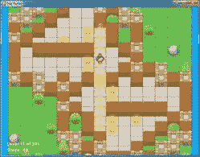
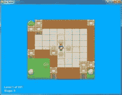
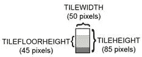
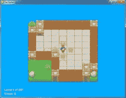

# 第 9 章–明星推手

> 原文：<http://inventwithpython.com/pygame/chapter9.html>

 

星推子是推箱子或“盒子推子”的克隆体。玩家在一个有几个星星的房间里。房间里的一些瓷砖地板上有星星标记。玩家必须弄清楚如何将星星放在有星星标记的瓷砖上。如果后面有一堵墙或另一颗星星，玩家就不能推星星。玩家不能拉星星，所以如果一颗星星被推到角落，玩家将不得不重新开始关卡。当所有的星星都被推到标有星星的地砖上时，这一关就完成了，下一关开始了。

每一层都由平铺图像的 2D 网格组成。平铺子画面是相同大小的图像，可以彼此相邻放置以形成更复杂的图像。只需几块地砖和墙砖，我们就能创造出各种有趣的形状和尺寸。

源代码中不包含级别文件。相反，您可以自己创建级别文件或下载它们。一个 201 级的关卡文件可以从 http://invpy.com/starPusherLevels.txt下载。当你运行 Star Pusher 程序时，确保这个级别文件与 *starpusher.py* 文件在同一个文件夹中。否则你会得到这个错误信息:`AssertionError: Cannot find the level file: starPusherLevels.txt`

关卡设计最初是由大卫·w·斯金纳设计的。你可以在他的网站[【http://sneezingtiger.com/sokoban/levels.html】](http://sneezingtiger.com/sokoban/levels.html)下载更多的谜题。

这个源代码可以从[【http://invpy.com/starpusher.py】](http://invpy.com/starpusher.py)下载。如果您得到任何错误消息，请查看错误消息中提到的行号，并检查您的代码是否有任何拼写错误。你也可以在 http://invpy.com/diff/starpusher将你的代码复制粘贴到 web 表单中，看看你的代码和书中的代码是否有区别。

关卡文件可以从下载。瓷砖可以从 http://invpy.com/starPusherImages.zip 的下载。

同样，就像松鼠吃松鼠游戏中的松鼠、草和敌人“对象”，当我在本章中说“地图对象”、“游戏状态对象”或“关卡对象”时，我并不是指面向对象编程意义上的对象。这些“对象”实际上只是字典值，但是将它们称为对象更容易，因为它们代表游戏世界中的事物。

```py
  1\. # Star Pusher (a Sokoban clone)
  2\. # By Al Sweigart [[email protected]](/cdn-cgi/l/email-protection)
  3\. # http://inventwithpython.com/pygame
  4\. # Creative Commons BY-NC-SA 3.0 US
  5\. 
  6\. import
random, sys, copy, os, pygame
  7\. from
pygame.locals import *
  8\. 
  9\. FPS
= 30 # frames per second to update the screen
 10\. WINWIDTH
= 800 # width of the program's window, in pixels
 11\. WINHEIGHT
= 600 # height in pixels
 12\. HALF_WINWIDTH
= int(WINWIDTH / 2)
 13\. HALF_WINHEIGHT
= int(WINHEIGHT / 2)
 14\. 
 15\. # The total width and height of each tile in pixels.
 16\. TILEWIDTH
= 50
 17\. TILEHEIGHT
= 85
 18\. TILEFLOORHEIGHT
= 45
 19\. 
 20\. CAM_MOVE_SPEED
= 5 # how many pixels per frame the camera moves
 21\. 
 22\. # The percentage of outdoor tiles that have additional
 23\. # decoration on them, such as a tree or rock.
 24\. OUTSIDE_DECORATION_PCT
= 20
 25\. 
 26\. BRIGHTBLUE
= (  0, 170, 255)
 27\. WHITE     
= (255, 255, 255)
 28\. BGCOLOR
= BRIGHTBLUE
 29\. TEXTCOLOR
= WHITE
 30\. 
 31\. UP
= 'up'
 32\. DOWN
= 'down'
 33\. LEFT
= 'left'
 34\. RIGHT
= 'right'
 35.
 36.
37\. def
main():
 38\.     global
FPSCLOCK, DISPLAYSURF, IMAGESDICT, TILEMAPPING, OUTSIDEDECOMAPPING, BASICFONT,
PLAYERIMAGES, currentImage
 39\. 
 40\.     # Pygame initialization and basic set up of the global variables.
 41\.     pygame.init()
 42\.     FPSCLOCK
= pygame.time.Clock()
 43\. 
 44\.     # Because the Surface object stored in DISPLAYSURF was
returned
 45\.     # from the pygame.display.set_mode() function, this is
the
 46\.     # Surface object that is drawn to the actual computer
screen
 47\.     # when pygame.display.update() is called.
 48\.     DISPLAYSURF
= pygame.display.set_mode((WINWIDTH, WINHEIGHT))
 49\. 
 50\.     pygame.display.set_caption('Star
Pusher')
 51\.     BASICFONT
= pygame.font.Font('freesansbold.ttf', 18)
 52.
53\.     # A global dict value that will contain all the Pygame
 54\.     # Surface objects returned by pygame.image.load().
 55\.     IMAGESDICT
= {'uncovered goal': pygame.image.load('RedSelector.png'),
 56\.                   'covered
goal': pygame.image.load('Selector.png'),
 57\.                   'star':
pygame.image.load('Star.png'),
 58\.                   'corner':
pygame.image.load('Wall Block Tall.png'),
 59\.                   'wall':
pygame.image.load('Wood Block Tall.png'),
 60\.                   'inside
floor': pygame.image.load('Plain Block.png'),
 61\.                   'outside
floor': pygame.image.load('Grass Block.png'),
 62\.                   'title':
pygame.image.load('star_title.png'),
 63\.                   'solved':
pygame.image.load('star_solved.png'),
 64\.                   'princess':
pygame.image.load('princess.png'),
 65\.                   'boy':
pygame.image.load('boy.png'),
 66\.                   'catgirl':
pygame.image.load('catgirl.png'),
 67\.                   'horngirl':
pygame.image.load('horngirl.png'),
 68\.                   'pinkgirl':
pygame.image.load('pinkgirl.png'),
 69\.                   'rock':
pygame.image.load('Rock.png'),
 70\.                   'short
tree': pygame.image.load('Tree_Short.png'),
 71\.                   'tall
tree': pygame.image.load('Tree_Tall.png'),
 72\.                   'ugly
tree': pygame.image.load('Tree_Ugly.png')}
 73\. 
74\.     # These dict values are global, and map the character
that appears
 75\.     # in the level file to the Surface object it
represents.
 76\.     TILEMAPPING
= {'x': IMAGESDICT['corner'],
 77\.                    '#':
IMAGESDICT['wall'],
 78\.                    'o':
IMAGESDICT['inside floor'],
 79\.                    '
': IMAGESDICT['outside floor']}
80\.     OUTSIDEDECOMAPPING
= {'1': IMAGESDICT['rock'],
 81\.                           '2':
IMAGESDICT['short tree'],
 82\.                           '3':
IMAGESDICT['tall tree'],
 83\.                           '4':
IMAGESDICT['ugly tree']}
 84.
85\.     # PLAYERIMAGES is a list of all possible characters the
player can be.
 86\.     # currentImage is the index of the player's current
player image.
87\.     currentImage
= 0
 88\.     PLAYERIMAGES
= [IMAGESDICT['princess'],
 89\.                     IMAGESDICT['boy'],
 90\.                     IMAGESDICT['catgirl'],
 91\.                     IMAGESDICT['horngirl'],
 92\.                     IMAGESDICT['pinkgirl']]
 93.
94\.     startScreen()
# show the title screen until the user presses a
key
 95\. 
 96\.     # Read in the levels from the text file. See the
readLevelsFile() for
 97\.     # details on the format of this file and how to make
your own levels.
 98\.     levels
= readLevelsFile('starPusherLevels.txt')
99\.     currentLevelIndex
= 0
100.
101\.     # The main game loop. This loop runs a single level,
when the user
102\.     # finishes that level, the next/previous level is
loaded.
103\.     while
True: # main game loop
104\.         # Run the level to actually start playing the game:
105\.         result
= runLevel(levels, currentLevelIndex)
106.
107\.         if
result in ('solved', 'next'):
108\.             # Go to the next level.
109\.             currentLevelIndex
+= 1
110\.             if
currentLevelIndex >= len(levels):
111\.                 # If there are no more levels, go back to the first
one.
112\.                 currentLevelIndex
= 0
113\.         elif
result == 'back':
114\.             # Go to the previous level.
115\.             currentLevelIndex
-= 1
116\.             if
currentLevelIndex < 0:
117\.                 # If there are no previous levels, go to the last one.
118\.                 currentLevelIndex
= len(levels)-1
119\.         elif
result == 'reset':
120\.             pass
# Do nothing. Loop re-calls runLevel() to reset
the level
121.
122.
123\. def
runLevel(levels, levelNum):
124.    
global currentImage
125.    
levelObj = levels[levelnum]
126\.     mapObj
= decorateMap(levelObj['mapObj'], levelObj['startState']['player'])
127\.     gameStateObj
= copy.deepcopy(levelObj['startState'])
128\.     mapNeedsRedraw
= True # set to True to call drawMap()
129\.     levelSurf
= BASICFONT.render('Level %s of %s' % (levelObj['levelNum'] + 1,
totalNumOfLevels), 1, TEXTCOLOR)
130\.     levelRect
= levelSurf.get_rect()
131\.     levelRect.bottomleft
= (20, WINHEIGHT - 35)
132\.     mapWidth
= len(mapObj) * TILEWIDTH
133\.     mapHeight
= (len(mapObj[0]) - 1) * (TILEHEIGHT - TILEFLOORHEIGHT) + TILEHEIGHT
134\.     MAX_CAM_X_PAN
= abs(HALF_WINHEIGHT - int(mapHeight / 2)) + TILEWIDTH
135\.     MAX_CAM_Y_PAN
= abs(HALF_WINWIDTH - int(mapWidth / 2)) + TILEHEIGHT
136\. 
137\.     levelIsComplete
= False
138\.     # Track how much the camera has moved:
139\.     cameraOffsetX
= 0
140\.     cameraOffsetY
= 0
141\.     # Track if the keys to move the camera are being held
down:
142\.     cameraUp
= False
143\.     cameraDown
= False
144\.     cameraLeft
= False
145\.     cameraRight
= False
146\. 
147\.     while
True: # main game loop
148\.         # Reset these variables:
149\.         playerMoveTo
= None
150\.         keyPressed
= False
151\. 
152\.         for
event in pygame.event.get(): # event handling
loop
153\.             if
event.type == QUIT:
154\.                 # Player clicked the "X" at the corner of the
window.
155\.                 terminate()
156\. 
157\.             elif
event.type == KEYDOWN:
158\.                 # Handle key presses
159\.                 keyPressed
= True
160\.                 if
event.key == K_LEFT:
161\.                     playerMoveTo
= LEFT
162\.                 elif
event.key == K_RIGHT:
163\.                     playerMoveTo
= RIGHT
164\.                 elif
event.key == K_UP:
165\.                     playerMoveTo
= UP
166\.                 elif
event.key == K_DOWN:
167\.                     playerMoveTo
= DOWN
168\. 
169\.                 # Set the camera move mode.
170\.                 elif
event.key == K_a:
171\.                     cameraLeft
= True
172\.                 elif
event.key == K_d:
173\.                     cameraRight
= True
174\.                 elif
event.key == K_w:
175\.                     cameraUp
= True
176\.                 elif
event.key == K_s:
177\.                     cameraDown
= True
178\. 
179\.                 elif
event.key == K_n:
180\.                     return
'next'
181\.                 elif
event.key == K_b:
182\.                     return
'back'
183\. 
184\.                 elif
event.key == K_ESCAPE:
185\.                     terminate()
# Esc key quits.
186\.                 elif
event.key == K_BACKSPACE:
187\.                     return
'reset' # Reset the level.
188\.                 elif
event.key == K_p:
189\.                     # Change the player image to the next one.
190\.                     currentImage
+= 1
191\.                     if
currentImage >= len(PLAYERIMAGES):
192\.                         # After the last player image, use the first one.
193\.                         currentImage
= 0
194\.                     mapNeedsRedraw
= True
195\. 
196\.             elif
event.type == KEYUP:
197\.                 # Unset the camera move mode.
198\.                 if
event.key == K_a:
199\.                     cameraLeft
= False
200\.                 elif
event.key == K_d:
201\.                     cameraRight
= False
202\.                 elif
event.key == K_w:
203\.                     cameraUp
= False
204\.                 elif
event.key == K_s:
205\.                     cameraDown
= False
206\. 
207\.         if
playerMoveTo != None and not levelIsComplete:
208\.             # If the player pushed a key to move, make the move
209\.             # (if possible) and push any stars that are pushable.
210\.             moved
= makeMove(mapObj, gameStateObj, playerMoveTo)
211\. 
212\.             if
moved:
213\.                 # increment the step counter.
214\.                 gameStateObj['stepCounter']
+= 1
215\.                 mapNeedsRedraw
= True
216\. 
217\.             if
isLevelFinished(levelObj, gameStateObj):
218\.                 # level is solved, we should show the
"Solved!" image.
219\.                 levelIsComplete
= True
220\.                 keyPressed
= False
221\. 
222\.         DISPLAYSURF.fill(BGCOLOR)
223\. 
224\.         if
mapNeedsRedraw:
225\.             mapSurf
= drawMap(mapObj, gameStateObj, levelObj['goals'])
226\.             mapNeedsRedraw
= False
227\. 
228\.         if
cameraUp and cameraOffsetY < MAX_CAM_X_PAN:
229\.             cameraOffsetY
+= CAM_MOVE_SPEED
230\.         elif
cameraDown and cameraOffsetY > -MAX_CAM_X_PAN:
231\.             cameraOffsetY
-= CAM_MOVE_SPEED
232\.         if
cameraLeft and cameraOffsetX < MAX_CAM_Y_PAN:
233\.             cameraOffsetX
+= CAM_MOVE_SPEED
234\.         elif
cameraRight and cameraOffsetX > -MAX_CAM_Y_PAN:
235\.             cameraOffsetX
-= CAM_MOVE_SPEED
236\. 
237\.         # Adjust mapSurf's Rect object based on the camera
offset.
238\.         mapSurfRect
= mapSurf.get_rect()
239\.         mapSurfRect.center
= (HALF_WINWIDTH + cameraOffsetX, HALF_WINHEIGHT + cameraOffsetY)
240\. 
241\.         # Draw mapSurf to the DISPLAYSURF Surface object.
242\.         DISPLAYSURF.blit(mapSurf,
mapSurfRect)
243\. 
244\.         DISPLAYSURF.blit(levelSurf,
levelRect)
245\.         stepSurf
= BASICFONT.render('Steps: %s' % (gameStateObj['stepCounter']), 1, TEXTCOLOR)
246\.         stepRect
= stepSurf.get_rect()
247\.         stepRect.bottomleft
= (20, WINHEIGHT - 10)
248\.         DISPLAYSURF.blit(stepSurf,
stepRect)
249\. 
250\.         if
levelIsComplete:
251\.             # is solved, show the "Solved!" image until
the player
252\.             # has pressed a key.
253\.             solvedRect
= IMAGESDICT['solved'].get_rect()
254\.             solvedRect.center
= (HALF_WINWIDTH, HALF_WINHEIGHT)
255\.             DISPLAYSURF.blit(IMAGESDICT['solved'],
solvedRect)
256\. 
257\.             if
keyPressed:
258\.                 return
'solved'
259\. 
260\.         pygame.display.update()
# draw DISPLAYSURF to the screen.
261\.         FPSCLOCK.tick()
262.
263.
274\. def
decorateMap(mapObj, startxy):
275\.     """Makes a copy of the given map object
and modifies it.
276\.     Here is what is done to it:
277\.         * Walls that are corners are turned into corner pieces.
278\.         * The outside/inside floor tile distinction is made.
279\.         * Tree/rock decorations are randomly added to the
outside tiles.
280\. 
281\.     Returns the decorated map object."""
282\. 
283\.     startx,
starty = startxy # Syntactic sugar
284\. 
285\.     # Copy the map object so we don't modify the original
passed
286\.     mapObjCopy
= copy.deepcopy(mapObj)
287\. 
288\.     # Remove the non-wall characters from the map data
289\.     for
x in range(len(mapObjCopy)):
290\.         for
y in range(len(mapObjCopy[0])):
291\.             if
mapObjCopy[x][y] in ('$', '.', '@', '+', '*'):
292\.                 mapObjCopy[x][y]
= ' '
293\. 
294\.     # Flood fill to determine inside/outside floor tiles.
295\.     floodFill(mapObjCopy,
startx, starty, ' ', 'o')
296\. 
297\.     # Convert the adjoined walls into corner tiles.
298\.     for
x in range(len(mapObjCopy)):
299\.         for
y in range(len(mapObjCopy[0])):
300.
301\.             if
mapObjCopy[x][y] == '#':
302\.                 if
(isWall(mapObjCopy, x, y-1) and isWall(mapObjCopy, x+1, y)) or \
303\.                    (isWall(mapObjCopy,
x+1, y) and isWall(mapObjCopy, x, y+1)) or \
304\.                    (isWall(mapObjCopy,
x, y+1) and isWall(mapObjCopy, x-1, y)) or \
305\.                    (isWall(mapObjCopy,
x-1, y) and isWall(mapObjCopy, x, y-1)):
306\.                     mapObjCopy[x][y]
= 'x'
307.
308\.             elif
mapObjCopy[x][y] == ' ' and random.randint(0, 99) < OUTSIDE_DECORATION_PCT:
309\.                 mapObjCopy[x][y]
= random.choice(list(OUTSIDEDECOMAPPING.keys()))
310\. 
311\.     return
mapObjCopy  
312.
313.
314\. def
isBlocked(mapObj, gameStateObj, x, y):
315\.     """Returns True if the (x, y) position
on the map is
316\.     blocked by a wall or star, otherwise return
False."""
317.
318\.     if
isWall(mapObj, x, y):
319\.         return
True
320.
321\.     elif
x < 0 or x >= len(mapObj) or y < 0 or y >= len(mapObj[x]):
322\.         return
True # x and y aren't actually on the map.
323.
324\.     elif
(x, y) in gameStateObj['stars']:
325\.         return
True # a star is blocking
326\. 
327\.     return
False
328.
329.
330\. def
makeMove(mapObj, gameStateObj, playerMoveTo):
331\.     """Given a map and game state object,
see if it is possible for the
332\.     player to make the given move. If it is, then change
the player's
333\.     position (and the position of any pushed star). If not,
do nothing.
334\. 
335\.     Returns True if the player moved, otherwise
False."""
336\. 
337\.     # Make sure the player can move in the direction they
want.
338\.     playerx,
playery = gameStateObj['player']
339\. 
340\.     # This variable is "syntactic sugar". Typing
"stars" is more
341\.     # readable than typing
"gameStateObj['stars']" in our code.
342\.     stars
= gameStateObj['stars']
343\. 
344\.     # The code for handling each of the directions is so
similar aside
345\.     # from adding or subtracting 1 to the x/y coordinates.
We can
346\.     # simplify it by using the xOffset and yOffset
variables.
347\.     if
playerMoveTo == UP:
348\.         xOffset
= 0
349\.         yOffset
= -1
350\.     elif
playerMoveTo == RIGHT:
351\.         xOffset
= 1
352\.         yOffset
= 0
353\.     elif
playerMoveTo == DOWN:
354\.         xOffset
= 0
355\.         yOffset
= 1
356\.     elif
playerMoveTo == LEFT:
357\.         xOffset
= -1
358\.         yOffset
= 0
359\. 
360\.     # See if the player can move in that direction.
361\.     if
isWall(mapObj, playerx + xOffset, playery + yOffset):
362\.         return
False
363\.     else:
364\.         if
(playerx + xOffset, playery + yOffset) in stars:
365\.             # There is a star in the way, see if the player can
push it.
366\.             if
not isBlocked(mapObj, gameStateObj, playerx + (xOffset*2), playery +
(yOffset*2)):
367\.                 # Move the star.
368\.                 ind
= stars.index((playerx + xOffset, playery + yOffset))
369\.                 stars[ind]
= (stars[ind][0] + xOffset, stars[ind][1] + yOffset)
370\.             else:
371\.                 return
False
372\.         # Move the player upwards.
373\.         gameStateObj['player']
= (playerx + xOffset, playery + yOffset)
374\.         return
True
375.
376.
377\. def
startScreen():
378\.     """Display the start screen (which has
the title and instructions)
379\.     until the player presses a key. Returns
None."""
380\. 
381\.     # Position the title image.
382\.     titleRect
= IMAGESDICT['title'].get_rect()
383\.     topCoord
= 50 # topCoord tracks where to position the top
of the text
384\.     titleRect.top
= topCoord
385\.     titleRect.centerx
= HALF_WINWIDTH
386\.     topCoord
+= titleRect.height
387\. 
388\.     # Unfortunately, Pygame's font & text system only
shows one line at
389\.     # a time, so we can't use strings with \n newline
characters in them.
390\.     # So we will use a list with each line in it.
391\.     instructionText
= ['Push the stars over the marks.',
392\.                        'Arrow
keys to move, WASD for camera control, P to change character.',
393\.                        'Backspace
to reset level, Esc to quit.',
394\.                        'N
for next level, B to go back a level.']
395\. 
396\.     # Start with drawing a blank color to the entire
window:
397\.     DISPLAYSURF.fill(BGCOLOR)
398\. 
399\.     # Draw the title image to the window:
400\.     DISPLAYSURF.blit(IMAGESDICT['title'],
titleRect)
401\. 
402\.     # Position and draw the text.
403\.     for
i in range(len(instructionText)):
404\.         instSurf
= BASICFONT.render(instructionText[i], 1, TEXTCOLOR)
405\.         instRect
= instSurf.get_rect()
406\.         topCoord
+= 10 # 10 pixels will go in between each line of
text.
407\.         instRect.top
= topCoord
408\.         instRect.centerx
= HALF_WINWIDTH
409\.         topCoord
+= instRect.height # Adjust for the height of the
line.
410\.         DISPLAYSURF.blit(instSurf,
instRect)
411\. 
412\.     while
True: # Main loop for the start screen.
413\.         for
event in pygame.event.get():
414\.             if
event.type == QUIT:
415\.                 terminate()
416\.             elif
event.type == KEYDOWN:
417\.                 if
event.key == K_ESCAPE:
418\.                     terminate()
419\.                 return
# user has pressed a key, so return.
420\. 
421\.         # Display the DISPLAYSURF contents to the actual
screen.
422\.         pygame.display.update()
423\.         FPSCLOCK.tick()
424.
425.
426\. def
readLevelsFile(filename):
427\.     assert
os.path.exists(filename), 'Cannot find the level file: %s' % (filename)
428\.     mapFile
= open(filename, 'r')
429\.     # Each level must end with a blank line
430\.     content
= mapFile.readlines() + ['\r\n']
431.    
mapFile.close()
432.
433\.     levels
= [] # Will contain a list of level objects.
434\.     levelNum
= 0
435\.     mapTextLines
= [] # contains the lines for a single level's
map.
436\.     mapObj
= [] # the map object made from the data in mapTextLines
437\.     for
lineNum in range(len(content)):
438\.         # Process each line that was in the level file.
439\.         line
= content[lineNum].rstrip('\r\n')
440\. 
441\.         if
';' in line:
442\.             # Ignore the ; lines, they're comments in the level
file.
443\.             line
= line[:line.find(';')]
444\. 
445\.         if
line != '':
446\.             # This line is part of the map.
447\.             mapTextLines.append(line)
448\.         elif
line == '' and len(mapTextLines) > 0:
449\.             # A blank line indicates the end of a level's map in
the file.
450\.             # Convert the text in mapTextLines into a level object.
451\. 
452\.             # Find the longest row in the map.
453\.             maxWidth
= -1
454\.             for
i in range(len(mapTextLines)):
455\.                 if
len(mapTextLines[i]) > maxWidth:
456\.                     maxWidth
= len(mapTextLines[i])
457\.             # Add spaces to the ends of the shorter rows. This
458\.             # ensures the map will be rectangular.
459\.             for
i in range(len(mapTextLines)):
460\.                 mapTextLines[i]
+= ' ' * (maxWidth - len(mapTextLines[i]))
461\. 
462\.             # Convert mapTextLines to a map object.
463\.             for
x in range(len(mapTextLines[0])):
464\.                 mapObj.append([])
465\.             for
y in range(len(mapTextLines)):
466\.                 for
x in range(maxWidth):
467\.                     mapObj[x].append(mapTextLines[y][x])
468\. 
469\.             # Loop through the spaces in the map and find the @, .,
and $
470\.             # characters for the starting game state.
471\.             startx
= None # The x and y for the player's starting
position
472\.             starty
= None
473\.             goals
= [] # list of (x, y) tuples for each goal.
474\.             stars
= [] # list of (x, y) for each star's starting
position.
475\.             for
x in range(maxWidth):
476\.                 for
y in range(len(mapObj[x])):
477\.                     if
mapObj[x][y] in ('@', '+'):
478\.                         # '@' is player, '+' is player & goal
479\.                         startx
= x
480\.                         starty
= y
481\.                     if
mapObj[x][y] in ('.', '+', '*'):
482\.                         # '.' is goal, '*' is star & goal
483\.                         goals.append((x,
y))
484\.                     if
mapObj[x][y] in ('$', '*'):
485\.                         # '$' is star
486\.                         stars.append((x,
y))
487\. 
488\.             # Basic level design sanity checks:
489\.             assert
startx != None and starty != None, 'Level %s (around line %s) in %s is missing
a "@" or "+" to mark the start point.' % (levelNum+1,
lineNum, filename)
490\.             assert
len(goals) > 0, 'Level %s (around line %s) in %s must have at least one
goal.' % (levelNum+1, lineNum, filename)

491\.             assert
len(stars) >= len(goals), 'Level %s (around line %s) in %s is impossible to
solve. It has %s goals but only %s stars.' % (levelNum+1, lineNum, filename,
len(goals), len(stars))
492\. 
493\.             # Create level object and starting game state object.
494\.             gameStateObj
= {'player': (startx, starty),
495\.                             'stepCounter':
0,
496\.                             'stars':
stars}
497\.             levelObj
= {'width': maxWidth,
498\.                         'height':
len(mapObj),
499\.                         'mapObj':
mapObj,
500\.                         'goals':
goals,
501\.                         'startState':
gameStateObj}
502.
503\.             levels.append(levelObj)
504\. 
505\.             # Reset the variables for reading the next map.
506\.             mapTextLines
= []
507\.             mapObj
= []
508\.             gameStateObj
= {}
509\.             levelNum
+= 1
510\.     return
levels
511.
512.
513\. def
floodFill(mapObj, x, y, oldCharacter, newCharacter):
514\.     """Changes any values matching
oldCharacter on the map object to
515\.     newCharacter at the (x, y) position, and does the same
for the
516\.     positions to the left, right, down, and up of (x, y),
recursively."""
517\. 
518\.     # In this game, the flood fill algorithm creates the
inside/outside
519\.     # floor distinction. This is a "recursive"
function.
520\.     # For more info on the Flood Fill algorithm, see:
521\.     #   http://en.wikipedia.org/wiki/Flood_fill
522\.     if
mapObj[x][y] == oldCharacter:
523\.         mapObj[x][y]
= newCharacter
524\. 
525\.     if
x < len(mapObj) - 1 and mapObj[x+1][y] == oldCharacter:
526\.         floodFill(mapObj,
x+1, y, oldCharacter, newCharacter) # call right
527\.     if
x > 0 and mapObj[x-1][y] == oldCharacter:
528\.         floodFill(mapObj,
x-1, y, oldCharacter, newCharacter) # call left
529\.     if
y < len(mapObj[x]) - 1 and mapObj[x][y+1] == oldCharacter:
530\.         floodFill(mapObj,
x, y+1, oldCharacter, newCharacter) # call down
531\.     if
y > 0 and mapObj[x][y-1] == oldCharacter:
532\.         floodFill(mapObj,
x, y-1, oldCharacter, newCharacter) # call up
533.
534.
535\. def
drawMap(mapObj, gameStateObj, goals):
536\.     """Draws the map to a Surface object,
including the player and
537\.     stars. This function does not call
pygame.display.update(), nor
538\.     does it draw the "Level" and
"Steps" text in the corner."""
539\. 
540\.     # mapSurf will be the single Surface object that the
tiles are drawn
541\.     # on, so that it is easy to position the entire map on
the DISPLAYSURF
542\.     # Surface object. First, the width and height must be
calculated.
543\.     mapSurfWidth
= len(mapObj) * TILEWIDTH
544\.     mapSurfHeight
= (len(mapObj[0]) - 1) * (TILEHEIGHT - TILEFLOORHEIGHT) + TILEHEIGHT
545\.     mapSurf
= pygame.Surface((mapSurfWidth, mapSurfHeight))
546\.     mapSurf.fill(BGCOLOR)
# start with a blank color on the surface.
547\. 
548\.     # Draw the tile sprites onto this surface.
549\.     for
x in range(len(mapObj)):
550\.         for
y in range(len(mapObj[x])):
551\.             spaceRect
= pygame.Rect((x * TILEWIDTH, y * (TILEHEIGHT - TILEFLOORHEIGHT), TILEWIDTH,
TILEHEIGHT))
552\.             if
mapObj[x][y] in TILEMAPPING:
553\.                 baseTile
= TILEMAPPING[mapObj[x][y]]
554\.             elif
mapObj[x][y] in OUTSIDEDECOMAPPING:
555\.                 baseTile
= TILEMAPPING[' ']
556\. 
557\.             # First draw the base ground/wall tile.
558\.             mapSurf.blit(baseTile,
spaceRect)
559\. 
560\.             if
mapObj[x][y] in OUTSIDEDECOMAPPING:
561\.                 # Draw any tree/rock decorations that are on this tile.
562\.                 mapSurf.blit(OUTSIDEDECOMAPPING[mapObj[x][y]],
spaceRect)
563\.             elif
(x, y) in gameStateObj['stars']:
564\.                 if
(x, y) in goals:
565\.                     # A goal AND star are on this space, draw goal first.
566\.                     mapSurf.blit(IMAGESDICT['covered
goal'], spaceRect)
567\.                 # Then draw the star sprite.
568\.                 mapSurf.blit(IMAGESDICT['star'],
spaceRect)
569\.             elif
(x, y) in goals:
570\.                 # Draw a goal without a star on it.
571\.                 mapSurf.blit(IMAGESDICT['uncovered
goal'], spaceRect)
572\. 
573\.             # Last draw the player on the board.
574\.             if
(x, y) == gameStateObj['player']:
575\.                 # Note: The value "currentImage" refers
576\.                 # to a key in "PLAYERIMAGES" which has the
577\.                 # specific player image we want to show.
578\.                 mapSurf.blit(PLAYERIMAGES[currentImage],
spaceRect)
579\. 
580\.     return
mapSurf
581.
582.
583\. def
isLevelFinished(levelObj, gameStateObj):
584\.     """Returns True if all the goals have
stars in them."""
585\.     for
goal in levelObj['goals']:
586\.         if
goal not in gameStateObj['stars']:
587\.             # Found a space with a goal but no star on it.
588\.             return
False
589\.     return
True
590.
591.
592\. def
terminate():
593\.     pygame.quit()
594\.     sys.exit()
595.
596.
597\. if
__name__ == '__main__':
598\.     main()
```

```py
  1\. # Star Pusher (a Sokoban clone)
  2\. # By Al Sweigart [[email protected]](/cdn-cgi/l/email-protection)
  3\. # http://inventwithpython.com/pygame
  4\. # Creative Commons BY-NC-SA 3.0 US
  5\. 
  6\. import
random, sys, copy, os, pygame
  7\. from
pygame.locals import *
  8\. 
  9\. FPS
= 30 # frames per second to update the screen
 10\. WINWIDTH
= 800 # width of the program's window, in pixels
 11\. WINHEIGHT
= 600 # height in pixels
 12\. HALF_WINWIDTH
= int(WINWIDTH / 2)
 13\. HALF_WINHEIGHT
= int(WINHEIGHT / 2)
 14\. 
 15\. # The total width and height of each tile in pixels.
 16\. TILEWIDTH
= 50
 17\. TILEHEIGHT
= 85
 18\. TILEFLOORHEIGHT
= 45
 19\. 
 20\. CAM_MOVE_SPEED
= 5 # how many pixels per frame the camera moves
 21\. 
 22\. # The percentage of outdoor tiles that have additional
 23\. # decoration on them, such as a tree or rock.
 24\. OUTSIDE_DECORATION_PCT
= 20
 25\. 
 26\. BRIGHTBLUE
= (  0, 170, 255)
 27\. WHITE     
= (255, 255, 255)
 28\. BGCOLOR
= BRIGHTBLUE
 29\. TEXTCOLOR
= WHITE
 30\. 
 31\. UP
= 'up'
 32\. DOWN
= 'down'
 33\. LEFT
= 'left'
 34\. RIGHT
= 'right'
```

这些常量用于程序的各个部分。`TILEWIDTH`和`TILEHEIGHT`变量显示每个区块图像是 50 像素宽和 85 像素高。但是，当在屏幕上绘制时，这些图块会相互重叠。(这个后面解释。)T2 是指代表地板的那部分瓷砖有 45 像素高。下面是普通地板图像的示意图:



关卡房间外的草地瓷砖有时会添加额外的装饰(如树木或岩石)。`OUTSIDE_DECORATION_PCT`常数显示了这些瓷砖中随机具有这些装饰的百分比。

```py
 37\. def
main():
 38\.     global
FPSCLOCK, DISPLAYSURF, IMAGESDICT, TILEMAPPING, OUTSIDEDECOMAPPING, BASICFONT, PLAYERIMAGES,
currentImage
 39\. 
 40\.     # Pygame initialization and basic set up of the global variables.
 41\.     pygame.init()
 42\.     FPSCLOCK
= pygame.time.Clock()
 43\. 
 44\.     # Because the Surface object stored in DISPLAYSURF was
returned
 45\.     # from the pygame.display.set_mode() function, this is
the
 46\.     # Surface object that is drawn to the actual computer
screen
 47\.     # when pygame.display.update() is called.
 48\.     DISPLAYSURF
= pygame.display.set_mode((WINWIDTH, WINHEIGHT))
 49\. 
 50\.     pygame.display.set_caption('Star
Pusher')
 51\.     BASICFONT
= pygame.font.Font('freesansbold.ttf', 18)
```

这是通常的 Pygame 设置，发生在程序的开始。

```py
53\.     # A global dict value that will contain all the Pygame
 54\.     # Surface objects returned by pygame.image.load().
 55\.     IMAGESDICT
= {'uncovered goal': pygame.image.load('RedSelector.png'),
 56\.                   'covered
goal': pygame.image.load('Selector.png'),
 57\.                   'star':
pygame.image.load('Star.png'),
 58\.                   'corner':
pygame.image.load('Wall Block Tall.png'),
 59\.                   'wall':
pygame.image.load('Wood Block Tall.png'),
 60\.                   'inside
floor': pygame.image.load('Plain Block.png'),
 61\.                   'outside
floor': pygame.image.load('Grass Block.png'),
 62\.                   'title':
pygame.image.load('star_title.png'),
 63\.                   'solved':
pygame.image.load('star_solved.png'),
 64\.                   'princess':
pygame.image.load('princess.png'),
 65\.                   'boy':
pygame.image.load('boy.png'),
 66\.                   'catgirl':
pygame.image.load('catgirl.png'),
 67\.                   'horngirl':
pygame.image.load('horngirl.png'),
 68\.                   'pinkgirl':
pygame.image.load('pinkgirl.png'),
 69\.                   'rock':
pygame.image.load('Rock.png'),
 70\.                   'short
tree': pygame.image.load('Tree_Short.png'),
 71\.                   'tall
tree': pygame.image.load('Tree_Tall.png'),
 72\.                   'ugly
tree': pygame.image.load('Tree_Ugly.png')}
```

`IMAGESDICT`是一个字典，其中存储了所有加载的图像。这使得在其他函数中使用更容易，因为只有`IMAGESDICT`变量需要被全局化。如果我们将这些图像分别存储在不同的变量中，那么所有 18 个变量(游戏中使用的 18 个图像)都需要全局化。包含所有表面对象和图像的字典更容易处理。

```py
 74\.     # These dict values are global, and map the character
that appears
 75\.     # in the level file to the Surface object it
represents.
 76\.     TILEMAPPING
= {'x': IMAGESDICT['corner'],
 77\.                    '#':
IMAGESDICT['wall'],
 78\.                    'o':
IMAGESDICT['inside floor'],
 79\.                    '
': IMAGESDICT['outside floor']}
```

地图的数据结构只是单个字符串的 2D 列表。`TILEMAPPING`字典将地图数据结构中使用的字符与它们代表的图像联系起来。(这将在`drawMap()`函数的解释中变得更加清楚。)

```py
 80\.     OUTSIDEDECOMAPPING
= {'1': IMAGESDICT['rock'],
 81\.                           '2':
IMAGESDICT['short tree'],
 82\.                           '3':
IMAGESDICT['tall tree'],
 83\.                           '4':
IMAGESDICT['ugly tree']}
```

`OUTSIDEDECOMAPPING`也是一个字典，它将地图数据结构中使用的字符链接到加载的图像。“外部装饰”图像绘制在室外绿草如茵的瓷砖上。

```py
85\.     # PLAYERIMAGES is a list of all possible characters the
player can be.
 86\.     # currentImage is the index of the player's current
player image.
87\.     currentImage
= 0
 88\.     PLAYERIMAGES
= [IMAGESDICT['princess'],
 89\.                     IMAGESDICT['boy'],
 90\.                     IMAGESDICT['catgirl'],
 91\.                     IMAGESDICT['horngirl'],
 92\.                     IMAGESDICT['pinkgirl']]
```

`PLAYERIMAGES`列表存储播放器使用的图像。`currentImage`变量跟踪当前选择的玩家图像的索引。例如，当`currentImage`被设置为`0`时，那么`PLAYERIMAGES[0]`，即“公主”玩家形象，被绘制到屏幕上。

```py
 94\.     startScreen()
# show the title screen until the user presses a
key
 95\. 
 96\.     # Read in the levels from the text file. See the
readLevelsFile() for
 97\.     # details on the format of this file and how to make
your own levels.
 98\.     levels
= readLevelsFile('starPusherLevels.txt')
99\.     currentLevelIndex
= 0
```

`startScreen()`功能将一直显示初始开始屏幕(其中也有游戏说明),直到玩家按下一个键。当玩家按下一个键时，`startScreen()`函数返回，然后从关卡文件中读入关卡。玩家从第一关开始，这是关卡列表中索引`0`处的关卡对象。

```py
101\.     # The main game loop. This loop runs a single level,
when the user
102\.     # finishes that level, the next/previous level is
loaded.
103\.     while
True: # main game loop
104\.         # Run the level to actually start playing the game:
105\.         result
= runLevel(levels, currentLevelIndex)
```

`runLevel()`函数处理游戏的所有动作。它被传递一个级别对象列表，以及该列表中要播放的级别的整数索引。当玩家玩完一关，`runLevel()`会返回以下字符串中的一个:`'solved'`(因为玩家已经把所有的星星都放在球门上了)、`'next'`(因为玩家想跳到下一关)、`'back'`(因为玩家想回到上一关)、`'reset'`(因为玩家想重新开始玩当前一关，可能是因为他们把一个星星推到了墙角)。

```py
107\.         if
result in ('solved', 'next'):
108\.             # Go to the next level.
109\.             currentLevelIndex
+= 1
110\.             if
currentLevelIndex >= len(levels):
111\.                 # If there are no more levels, go back to the first
one.
112\.                 currentLevelIndex
= 0
113\.         elif
result == 'back':
114\.             # Go to the previous level.
115\.             currentLevelIndex
-= 1
116\.             if
currentLevelIndex < 0:
117\.                 # If there are no previous levels, go to the last one.
118\.                 currentLevelIndex
= len(levels)-1
```

如果`runLevel()`已经返回了字符串`'solved'`或`'next'`，那么我们需要将`levelNum`增加`1`。如果这个增量`levelNum`超过存在的级数，那么`levelNum`被设置回`0`。

如果`'back'`返回，则相反，然后`levelNum`递减`1`。如果这使得它低于`0`，那么它被设置为最后一级(即`len(levels)-1`)。

```py
119\.         elif
result == 'reset':
120\.             pass
# Do nothing. Loop re-calls runLevel() to reset
the level
```

如果返回值是`'reset'`，那么代码什么也不做。`pass`语句什么也不做(像注释一样)，但却是必需的，因为 Python 解释器期望在`elif`语句后有一行缩进的代码。

我们可以从源代码中完全删除第 119 行和第 120 行，程序仍然可以正常工作。我们在这里包含它的原因是为了程序的可读性，这样如果我们以后修改代码，我们不会忘记`runLevel()`也可以返回字符串`'reset'`。

```py
123\. def
runLevel(levels, levelNum):
124.    
global currentImage
125.    
levelObj = levels[levelnum]
126\.     mapObj
= decorateMap(levelObj['mapObj'], levelObj['startState']['player'])
127\.     gameStateObj
= copy.deepcopy(levelObj['startState'])
```

级别列表包含从级别文件加载的所有级别对象。当前级别的级别对象(即`levelNum`的设置)存储在`levelObj`变量中。从`decorateMap()`函数返回一个地图对象(区分室内和室外瓷砖，并用树木和岩石装饰室外瓷砖)。为了在玩家玩这一关时跟踪游戏的状态，使用`copy.deepcopy()`函数制作了存储在`levelObj`中的游戏状态对象的副本。

制作游戏状态对象副本是因为存储在`levelObj['startState']`中的游戏状态对象代表了关卡最开始时的游戏状态，我们不想对此进行修改。否则，如果玩家重新开始该级别，该级别的原始游戏状态将会丢失。

使用`copy.deepcopy()`函数是因为游戏状态对象是具有元组的字典。但是从技术上讲，字典包含了对元组的引用。(参考资料详见 http://invpy.com/references[)。)使用赋值语句来制作字典的副本将制作引用的副本，而不是它们所引用的值的副本，因此副本和原始字典仍然引用相同的元组。](http://invpy.com/references)

`copy.deepcopy()`函数通过复制字典中的实际元组来解决这个问题。这样我们可以保证改变一个字典不会影响另一个字典。

```py
128\.     mapNeedsRedraw
= True # set to True to call drawMap()
129\.     levelSurf
= BASICFONT.render('Level %s of %s' % (levelObj['levelNum'] + 1,
totalNumOfLevels), 1, TEXTCOLOR)
130\.     levelRect
= levelSurf.get_rect()
131\.     levelRect.bottomleft
= (20, WINHEIGHT - 35)
132\.     mapWidth
= len(mapObj) * TILEWIDTH
133\.     mapHeight
= (len(mapObj[0]) - 1) * (TILEHEIGHT - TILEFLOORHEIGHT) + TILEHEIGHT
134\.     MAX_CAM_X_PAN
= abs(HALF_WINHEIGHT - int(mapHeight / 2)) + TILEWIDTH
135\.     MAX_CAM_Y_PAN
= abs(HALF_WINWIDTH - int(mapWidth / 2)) + TILEHEIGHT
136\. 
137\.     levelIsComplete
= False
138\.     # Track how much the camera has moved:
139\.     cameraOffsetX
= 0
140\.     cameraOffsetY
= 0
141\.     # Track if the keys to move the camera are being held
down:
142\.     cameraUp
= False
143\.     cameraDown
= False
144\.     cameraLeft
= False
145\.     cameraRight
= False
```

更多的变量是在开始玩关卡时设置的。`mapWidth`和`mapHeight`变量是以像素为单位的地图大小。计算`mapHeight`的表达式有点复杂，因为图块相互重叠。只有最下面一排瓷砖是全高的(这是表达式中的`+ TILEHEIGHT`部分)，所有其他排瓷砖(编号为`(len(mapObj[0]) - 1)`)稍微重叠。这意味着它们实际上都只有`(TILEHEIGHT - TILEFLOORHEIGHT)`像素高。

星际推进器中的摄像机可以独立于玩家在地图上的移动而移动。这就是为什么相机需要自己的一组“移动”变量:`cameraUp`、`cameraDown`、`cameraLeft`和`cameraRight`。`cameraOffsetX`和`cameraOffsetY`变量跟踪摄像机的位置。

```py
147\.     while
True: # main game loop
148\.         # Reset these variables:
149\.         playerMoveTo
= None
150\.         keyPressed
= False
151\. 
152\.         for
event in pygame.event.get(): # event handling
loop
153\.             if
event.type == QUIT:
154\.                 # Player clicked the "X" at the corner of the
window.
155\.                 terminate()
156\. 
```

`playerMoveTo`变量将被设置为玩家打算在地图上移动玩家角色的方向常数。`keyPressed`变量跟踪在游戏循环的迭代中是否有任何键被按下。当玩家解决了关卡后，这个变量会被检查。

```py
157\.             elif
event.type == KEYDOWN:
158\.                 # Handle key presses
159\.                 keyPressed
= True
160\.                 if
event.key == K_LEFT:
161\.                     playerMoveTo
= LEFT
162\.                 elif
event.key == K_RIGHT:
163\.                     playerMoveTo
= RIGHT
164\.                 elif
event.key == K_UP:
165\.                     playerMoveTo
= UP
166\.                 elif
event.key == K_DOWN:
167\.                     playerMoveTo
= DOWN
168\. 
169\.                 # Set the camera move mode.
170\.                 elif
event.key == K_a:
171\.                     cameraLeft
= True
172\.                 elif
event.key == K_d:
173\.                     cameraRight
= True
174\.                 elif
event.key == K_w:
175\.                     cameraUp
= True
176\.                 elif
event.key == K_s:
177\.                     cameraDown
= True
178\. 
179\.                 elif
event.key == K_n:
180\.                     return
'next'
181\.                 elif
event.key == K_b:
182\.                     return
'back'
183\. 
184\.                 elif
event.key == K_ESCAPE:
185\.                     terminate()
# Esc key quits.
186\.                 elif
event.key == K_BACKSPACE:
187\.                     return
'reset' # Reset the level.
188\.                 elif
event.key == K_p:
189\.                     # Change the player image to the next one.
190\.                     currentImage
+= 1
191\.                     if
currentImage >= len(PLAYERIMAGES):
192\.                         # After the last player image, use the first one.
193\.                         currentImage
= 0
194\.                     mapNeedsRedraw
= True
195\. 
196\.             elif
event.type == KEYUP:
197\.                 # Unset the camera move mode.
198\.                 if
event.key == K_a:
199\.                     cameraLeft
= False
200\.                 elif
event.key == K_d:
201\.                     cameraRight
= False
202\.                 elif
event.key == K_w:
203\.                     cameraUp
= False
204\.                 elif
event.key == K_s:
205\.                     cameraDown
= False
```

这段代码处理当不同的键被按下时该做什么。

```py
207\.         if
playerMoveTo != None and not levelIsComplete:
208\.             # If the player pushed a key to move, make the move
209\.             # (if possible) and push any stars that are pushable.
210\.             moved
= makeMove(mapObj, gameStateObj, playerMoveTo)
211\. 
212\.             if
moved:
213\.                 # increment the step counter.
214\.                 gameStateObj['stepCounter']
+= 1
215\.                 mapNeedsRedraw
= True
216\. 
217\.             if
isLevelFinished(levelObj, gameStateObj):
218\.                 # level is solved, we should show the
"Solved!" image.
219\.                 levelIsComplete
= True
220\.                 keyPressed
= False
```

如果`playerMoveTo`变量不再被设置为`None`，那么我们知道玩家想要移动。对`makeMove()`的调用处理改变玩家在`gameStateObj`中位置的 XY 坐标，以及推动任何星星。`makeMove()`的返回值存储在 moved 中。如果该值为`True`，则玩家角色向该方向移动。如果值是`False`，那么玩家一定试图移动到一面墙的瓷砖上，或者推动后面有东西的星星。在这种情况下，玩家不能移动，地图上的任何东西都不会改变。

```py
222\.         DISPLAYSURF.fill(BGCOLOR)
223\. 
224\.         if
mapNeedsRedraw:
225\.             mapSurf
= drawMap(mapObj, gameStateObj, levelObj['goals'])
226\.             mapNeedsRedraw
= False
```

不需要在游戏循环的每次迭代中重新绘制地图。事实上，这个游戏程序足够复杂，这样做会导致游戏稍微(但明显)变慢。而且地图真的只需要在事情发生变化的时候重画(比如玩家移动或者一个星被推)。所以当`mapNeedsRedraw`变量被设置为`True`时，`mapSurf`变量中的表面对象仅通过调用`drawMap()`函数来更新。

在线 225 上绘制地图后，变量`mapNeedsRedraw`被设置为`False`。如果你想通过游戏循环中的每次迭代来看看程序是如何变慢的，注释掉第 226 行并重新运行程序。你会注意到移动摄像机的速度明显变慢了。

```py
228\.         if
cameraUp and cameraOffsetY < MAX_CAM_X_PAN:
229\.             cameraOffsetY
+= CAM_MOVE_SPEED
230\.         elif
cameraDown and cameraOffsetY > -MAX_CAM_X_PAN:
231\.             cameraOffsetY
-= CAM_MOVE_SPEED
232\.         if
cameraLeft and cameraOffsetX < MAX_CAM_Y_PAN:
233\.             cameraOffsetX
+= CAM_MOVE_SPEED
234\.         elif
cameraRight and cameraOffsetX > -MAX_CAM_Y_PAN:
235\.             cameraOffsetX
-= CAM_MOVE_SPEED
```

如果摄像机移动变量被设置为`True`并且摄像机没有越过(即摇摄通过)由`MAX_CAM_X_PAN`和`MAX_CAM_Y_PAN`设置的边界，那么摄像机位置(存储在`cameraOffsetX`和`cameraOffsetY`中)应该移动`CAM_MOVE_SPEED`个像素。

注意，在第 228 和 230 行有一个用于上下移动摄像机的`if`和`elif`语句，然后在第 232 和 234 行有一个单独的`if`和`elif`语句。这样，用户可以同时垂直和水平移动摄像机。如果第 232 行是一个`elif`语句，这是不可能的。

```py
237\.         # Adjust mapSurf's Rect object based on the camera
offset.
238\.         mapSurfRect
= mapSurf.get_rect()
239\.         mapSurfRect.center
= (HALF_WINWIDTH + cameraOffsetX, HALF_WINHEIGHT + cameraOffsetY)
240\. 
241\.         # Draw mapSurf to the DISPLAYSURF Surface object.
242\.         DISPLAYSURF.blit(mapSurf,
mapSurfRect)
243\. 
244\.         DISPLAYSURF.blit(levelSurf,
levelRect)
245\.         stepSurf
= BASICFONT.render('Steps: %s' % (gameStateObj['stepCounter']), 1, TEXTCOLOR)
246\.         stepRect
= stepSurf.get_rect()
247\.         stepRect.bottomleft
= (20, WINHEIGHT - 10)
248\.         DISPLAYSURF.blit(stepSurf,
stepRect)
249\. 
250\.         if
levelIsComplete:
251\.             # is solved, show the "Solved!" image until
the player
252\.             # has pressed a key.
253\.             solvedRect
= IMAGESDICT['solved'].get_rect()
254\.             solvedRect.center
= (HALF_WINWIDTH, HALF_WINHEIGHT)
255\.             DISPLAYSURF.blit(IMAGESDICT['solved'],
solvedRect)
256\. 
257\.             if
keyPressed:
258\.                 return
'solved'
259\. 
260\.         pygame.display.update()
# draw DISPLAYSURF to the screen.
261\.         FPSCLOCK.tick()
262.
263.
```

第 237 行到第 261 行定位摄像机，并将地图和其他图形绘制到`DISPLAYSURF`中的显示表面对象。如果关卡被解决了，那么胜利图形也会被绘制在其他所有东西的上面。如果用户在这个迭代过程中按了一个键，`keyPressed`变量将被设置为`True`，此时`runLevel()`函数返回。

```py
264\. def
isWall(mapObj, x, y):
265\.     """Returns True if the (x, y) position
on
266\.     the map is a wall, otherwise return
False."""
267\.     if
x < 0 or x >= len(mapObj) or y < 0 or y >= len(mapObj[x]):
268\.         return
False # x and y aren't actually on the map.
269\.     elif
mapObj[x][y] in ('#', 'x'):
270\.         return
True # wall is blocking
271\.     return
False
```

如果在传递给函数的 XY 坐标上的地图对象上有一面墙，`isWall()`函数返回`True`。墙壁对象在地图对象中被表示为一个`'x'`或`'#'`字符串。

```py
274\. def
decorateMap(mapObj, startxy):
275\.     """Makes a copy of the given map object
and modifies it.
276\.     Here is what is done to it:
277\.         * Walls that are corners are turned into corner pieces.
278\.         * The outside/inside floor tile distinction is made.
279\.         * Tree/rock decorations are randomly added to the
outside tiles.
280\. 
281\.     Returns the decorated map object."""
282\. 
283\.     startx,
starty = startxy # Syntactic sugar
284\. 
285\.     # Copy the map object so we don't modify the original
passed
286\.     mapObjCopy
= copy.deepcopy(mapObj)
```

`decorateMap()`函数改变了数据结构`mapObj`,使得它不像在地图文件中出现的那样简单。`decorateMap()`改变的三件事在函数顶部的注释中有解释。

```py
288\.     # Remove the non-wall characters from the map data
289\.     for
x in range(len(mapObjCopy)):
290\.         for
y in range(len(mapObjCopy[0])):
291\.             if
mapObjCopy[x][y] in ('$', '.', '@', '+', '*'):
292\.                 mapObjCopy[x][y]
= ' '
```

地图对象具有代表玩家位置、目标和星星的字符。这些对于地图对象是必需的(在地图文件被读取后，它们被存储在其他数据结构中)，因此它们被转换为空白空间。

```py
294\.     # Flood fill to determine inside/outside floor tiles.
295\.     floodFill(mapObjCopy,
startx, starty, ' ', 'o')
```

`floodFill()`功能会将墙内的所有瓷砖从`' '`字符更改为`'o'`字符。它使用了一种叫做递归的编程概念，这将在本章后面的“递归函数”一节中解释。

```py
297\.     # Convert the adjoined walls into corner tiles.
298\.     for
x in range(len(mapObjCopy)):
299\.         for
y in range(len(mapObjCopy[0])):
300.
301\.             if
mapObjCopy[x][y] == '#':
302\.                 if
(isWall(mapObjCopy, x, y-1) and isWall(mapObjCopy, x+1, y)) or \
303\.                    (isWall(mapObjCopy,
x+1, y) and isWall(mapObjCopy, x, y+1)) or \
304\.                    (isWall(mapObjCopy,
x, y+1) and isWall(mapObjCopy, x-1, y)) or \
305\.                    (isWall(mapObjCopy,
x-1, y) and isWall(mapObjCopy, x, y-1)):
306\.                     mapObjCopy[x][y]
= 'x'
307.
308\.             elif
mapObjCopy[x][y] == ' ' and random.randint(0, 99) < OUTSIDE_DECORATION_PCT:
309\.                 mapObjCopy[x][y]
= random.choice(list(OUTSIDEDECOMAPPING.keys()))
310\. 
311\.     return
mapObjCopy  
```

第 301 行的大型多行`if`语句通过检查是否有与其相邻的形成拐角形状的墙砖来检查当前 XY 坐标处的墙砖是否是拐角墙砖。如果是这样，地图对象中代表普通墙壁的`'#'`字符串将被更改为代表墙角瓷砖的`'x'`字符串。

```py
314\. def
isBlocked(mapObj, gameStateObj, x, y):
315\.     """Returns True if the (x, y) position
on the map is
316\.     blocked by a wall or star, otherwise return
False."""
317.
318\.     if
isWall(mapObj, x, y):
319\.         return
True
320.
321\.     elif
x < 0 or x >= len(mapObj) or y < 0 or y >= len(mapObj[x]):
322\.         return
True # x and y aren't actually on the map.
323.
324\.     elif
(x, y) in gameStateObj['stars']:
325\.         return
True # a star is blocking
326\. 
327\.     return
False
```

在三种情况下，地图上的空间会被遮挡:如果有一颗星、一堵墙，或者空间的坐标超出了地图的边缘。`isBlocked()`函数检查这三种情况，如果 XY 坐标受阻，则返回`True`,否则返回`False`。

```py
330\. def
makeMove(mapObj, gameStateObj, playerMoveTo):
331\.     """Given a map and game state object,
see if it is possible for the
332\.     player to make the given move. If it is, then change
the player's
333\.     position (and the position of any pushed star). If not,
do nothing.
334\. 
335\.     Returns True if the player moved, otherwise
False."""
336\. 
337\.     # Make sure the player can move in the direction they
want.
338\.     playerx,
playery = gameStateObj['player']
339\. 
340\.     # This variable is "syntactic sugar". Typing
"stars" is more
341\.     # readable than typing
"gameStateObj['stars']" in our code.
342\.     stars
= gameStateObj['stars']
343\. 
344\.     # The code for handling each of the directions is so
similar aside
345\.     # from adding or subtracting 1 to the x/y coordinates.
We can
346\.     # simplify it by using the xOffset and yOffset
variables.
347\.     if
playerMoveTo == UP:
348\.         xOffset
= 0
349\.         yOffset
= -1
350\.     elif
playerMoveTo == RIGHT:
351\.         xOffset
= 1
352\.         yOffset
= 0
353\.     elif
playerMoveTo == DOWN:
354\.         xOffset
= 0
355\.         yOffset
= 1
356\.     elif
playerMoveTo == LEFT:
357\.         xOffset
= -1
358\.         yOffset
= 0
359\. 
360\.     # See if the player can move in that direction.
361\.     if
isWall(mapObj, playerx + xOffset, playery + yOffset):
362\.         return
False
363\.     else:
364\.         if
(playerx + xOffset, playery + yOffset) in stars:
365\.             # There is a star in the way, see if the player can
push it.
366\.             if
not isBlocked(mapObj, gameStateObj, playerx + (xOffset*2), playery +
(yOffset*2)):
367\.                 # Move the star.
368\.                 ind
= stars.index((playerx + xOffset, playery + yOffset))
369\.                 stars[ind]
= (stars[ind][0] + xOffset, stars[ind][1] + yOffset)
370\.             else:
371\.                 return
False
372\.         # Move the player upwards.
373\.         gameStateObj['player']
= (playerx + xOffset, playery + yOffset)
374\.         return
True
```

`makeMove()`函数检查以确定向特定方向移动玩家是否有效。只要没有一堵墙挡住道路，或者一颗星星后面有一堵墙或一颗星星，玩家就可以向那个方向移动。变量`gameStateObj`将被更新以反映这一点，并且`True`值将被返回以告诉函数的调用者玩家被移动了。

如果玩家想要移动空间中的一颗星星，那么这颗星星的位置也会改变，这个信息也会在`gameStateObj`变量中更新。“推星”就是这样实现的。

如果玩家被阻止向期望的方向移动，则`gameStateObj`不被修改，函数返回`False`。

```py
377\. def
startScreen():
378\.     """Display the start screen (which has
the title and instructions)
379\.     until the player presses a key. Returns
None."""
380\. 
381\.     # Position the title image.
382\.     titleRect
= IMAGESDICT['title'].get_rect()
383\.     topCoord
= 50 # topCoord tracks where to position the top
of the text
384\.     titleRect.top
= topCoord
385\.     titleRect.centerx
= HALF_WINWIDTH
386\.     topCoord
+= titleRect.height
387\. 
388\.     # Unfortunately, Pygame's font & text system only
shows one line at
389\.     # a time, so we can't use strings with \n newline
characters in them.
390\.     # So we will use a list with each line in it.
391\.     instructionText
= ['Push the stars over the marks.',
392\.                        'Arrow
keys to move, WASD for camera control, P to change character.',
393\.                        'Backspace
to reset level, Esc to quit.',
394\.                        'N
for next level, B to go back a level.']
```

`startScreen()`函数需要在窗口中央显示几段不同的文本。我们将把每一行作为一个字符串存储在`instructionText`列表中。标题图像(作为表面对象存储在`IMAGESDICT['title']`(最初从 *star_title.png* 文件加载))将被定位在距离窗口顶部 50 像素的位置。这是因为整数`50`存储在第 383 行的`topCoord`变量中。`topCoord`变量将跟踪标题图像和说明文本的 Y 轴定位。X 轴总是被设置为图像和文本居中，就像标题图像在第 385 行一样。

在第 386 行，`topCoord`变量增加了该图像的高度。这样，我们可以修改图像和开始屏幕代码将不必改变。

```py
396\.     # Start with drawing a blank color to the entire
window:
397\.     DISPLAYSURF.fill(BGCOLOR)
398\. 
399\.     # Draw the title image to the window:
400\.     DISPLAYSURF.blit(IMAGESDICT['title'],
titleRect)
401\. 
402\.     # Position and draw the text.
403\.     for
i in range(len(instructionText)):
404\.         instSurf
= BASICFONT.render(instructionText[i], 1, TEXTCOLOR)
405\.         instRect
= instSurf.get_rect()
406\.         topCoord
+= 10 # 10 pixels will go in between each line of
text.
407\.         instRect.top
= topCoord
408\.         instRect.centerx
= HALF_WINWIDTH
409\.         topCoord
+= instRect.height # Adjust for the height of the
line.
410\.         DISPLAYSURF.blit(instSurf,
instRect)
```

行 400 是标题图像被位块传送到显示表面对象的地方。从第 403 行开始的`for`循环将对`instructionText`循环中的每个指令串进行渲染、定位和块传输。`topCoord`变量将总是增加先前呈现的文本的大小(第 409 行)和 10 个附加像素(第 406 行，因此文本行之间将有 10 个像素的间隙)。

```py
412\.     while
True: # Main loop for the start screen.
413\.         for
event in pygame.event.get():
414\.             if
event.type == QUIT:
415\.                 terminate()
416\.             elif
event.type == KEYDOWN:
417\.                 if
event.key == K_ESCAPE:
418\.                     terminate()
419\.                 return
# user has pressed a key, so return.
420\. 
421\.         # Display the DISPLAYSURF contents to the actual
screen.
422\.         pygame.display.update()
423\.         FPSCLOCK.tick()
```

在`startScreen()`中有一个游戏循环，从第 412 行开始，处理指示程序是否应该终止或从`startScreen()`函数返回的事件。直到玩家这样做，循环将继续调用`pygame.display.update()`和`FPSCLOCK.tick()`来保持开始屏幕显示在屏幕上。

星推子有一个特定的水平，地图和游戏状态数据结构的格式。

游戏状态对象将是一个有三个键的字典:`'player'`、`'stepCounter'`和`'stars'`。

`'player'`键的值将是玩家当前 XY 位置的两个整数的元组。

`'stepCounter'`键处的值将是一个整数，它记录了玩家在该关卡中走了多少步(这样玩家可以在未来尝试用更少的步骤来解决难题)。

`'stars'`键的值是当前级别上每颗星星的 XY 值的双整数元组列表。

地图数据结构只是一个 2D 列表，其中使用的两个索引代表地图的 X 和 Y 坐标。列表列表中每个索引处的值是一个单字符字符串，表示地图上每个空间的标题:

`'#'`——一堵木墙。

`'x'`–一堵墙角。

`'@'`——玩家在这一关的起始空间。

`'.'`–一个目标空间。

`'$'`–一个星星在关卡起点的空间。

`'+'`——一个有球门的空格和首发球员的空格。

`'*'`–关卡开始时有目标和星星的空格。

`' '`——一片绿草如茵的户外空间。

`'o'`–室内空间。(这是小写字母 O，不是零。)

`'1'`——草地上的一块岩石。

`'2'`——草地上的一棵矮树。

`'3'`——草地上的一棵大树。

`'4'`——草地上一棵丑陋的树。

关卡对象包含一个游戏状态对象(这将是关卡第一次开始时使用的状态)、一个地图对象和一些其他值。级别对象本身是一个字典，包含以下关键字:

关键点`'width'`处的值是整个地图有多少块宽的整数。

关键点`'height'`处的值是整个地图有多少瓦片高的整数。

关键点`'mapObj'`处的值为该级别的贴图对象。

键`'goals'`处的值是一个双整数元组列表，带有地图上每个目标空间的 XY 坐标。

关键点处的值`'startState'`是一个游戏状态对象，用于显示关卡开始时星星和玩家的起始位置。

Python 有从播放器硬盘上读取文件的功能。这将有助于用一个单独的文件保存每个级别的所有数据。这也是一个好主意，因为为了获得新的级别，玩家不必改变游戏的源代码，而是可以下载新的级别文件。

文本文件是包含简单文本数据的文件。文本文件在 Windows 中由记事本应用程序创建，在 Ubuntu 上由 Gedit 创建，在 Mac OS X 上由 TextEdit 创建。还有许多称为文本编辑器的程序可以创建和修改文本文件。IDLE 自己的文件编辑器是一个文本编辑器。

文本编辑器和文字处理器(如 Microsoft Word、OpenOffice Writer 或 iWork Pages)的区别在于，文本编辑器只有文本。您不能设定文本的字体、大小或颜色。(IDLE 会根据是什么类型的 Python 代码自动设置文本的颜色，但是这个你自己是无法更改的，所以它还是一个文本编辑器。)文本和二进制文件的区别对这个游戏程序来说并不重要，但是你可以在[【http://invpy.com/textbinary】](http://invpy.com/textbinary)读到它。所有你需要知道的是这一章和星推子程序只处理文本文件。

要创建一个文件，调用`open()`函数，给它传递两个参数:一个字符串作为文件名，一个字符串`'w'`告诉`open()`函数你想以“写”模式打开文件。`open()`函数返回一个文件对象:

> > > textFile = open('hello.txt '，' w ')

>>>

如果您从交互式 shell 中运行这段代码，那么这个函数创建的 *hello.txt* 文件将创建在 python.exe 程序所在的同一个文件夹中(在 Windows 上，这个文件夹可能是 C:\Python32)。如果从一个. py 程序中调用了`open()`函数，那么该文件将在。py 文件在。

“写”模式告诉`open()`如果文件不存在就创建文件。如果它确实存在，那么`open()`将删除该文件并创建一个新的空白文件。这就像赋值语句如何创建一个新变量，或者覆盖一个已经存在的变量的当前值。**这可能有些危险。**如果您不小心将一个重要文件的文件名发送给了第二个参数为`'w'`的`open()`函数，该文件将被删除。这可能导致你不得不在电脑上重新安装操作系统和/或发射核导弹。

file 对象有一个名为`write()`的方法，可以用来向文件中写入文本。只需像传递字符串给`print()`函数一样传递一个字符串。不同之处在于，`write()`不会自动在字符串末尾添加一个换行符(`'\n'`)。如果要添加新行，必须将其包含在字符串中:

> > > textFile = open('hello.txt '，' w ')

> > > textFile.write('这将是文件的内容。\nHello world！\n ')

>>>

要告诉 Python 您已经完成了向该文件写入内容，您应该调用 file 对象的`close()`方法。(虽然 Python 会在程序结束时自动关闭任何打开的文件对象。)

> > > textFile.close()

要读取文件的内容，将字符串`'r'`而不是`'w'`传递给`open()`函数。然后在 file 对象上调用`readlines()`方法来读入文件的内容。最后，通过调用`close()`方法关闭文件。

> > > textFile = open('hello.txt '，' r ')

> > > content = textFile.readlines()

> > > textFile.close()

`readlines()`方法返回一个字符串列表:文件中的每行文本一个字符串；

>>>内容

['这将是文件的内容。\n '，'你好世界！\n']

>>>

如果您想重新读取该文件的内容，您必须调用 file 对象上的`close()`并重新打开它。

作为对`readlines()`的替代，您也可以调用`read()`方法，该方法将以单个字符串值的形式返回文件的全部内容:

> > > textFile = open('hello.txt '，' r ')

> > > content = textFile.read()

>>>内容

这将是文件的内容。\nHello world！\n '

另一方面，如果您遗漏了`open()`函数的第二个参数，Python 会认为您打算以读取模式打开文件。所以`open('foobar.txt', 'r')`和`open('foobar.txt')`做完全相同的事情。

我们需要水平文本文件在一个特定的格式。哪些字符代表墙壁，或星星，或玩家的开始位置？如果我们有多个级别的地图，我们如何知道一个级别的地图何时结束，下一个级别的地图何时开始？

幸运的是，我们将使用的地图文件格式已经为我们定义好了。有很多推箱子游戏(你可以在[【http://invpy.com/sokobanclones】](http://invpy.com/sokobanclones)找到更多)，它们都使用相同的地图文件格式。如果你从 http://invpy.com/starPusherLevels.txt 的下载关卡文件，并在文本编辑器中打开它，你会看到如下所示:

；星形推进器(推箱子克隆)

；http://inventwithpython . com/博客

；作者艾尔·斯威加特[【电子邮件保护】](/cdn-cgi/l/email-protection)

；

；之后的一切；是一个注释，将被游戏忽略

；读入这个文件。

；

；该格式描述于:

；http://sokobano.de/wiki/index.php?title=Level_format

；@ -玩家的起始位置。

；$ -可推送星形的起始位置。

；。——一个需要明星推动的目标。

；+ -球员和目标

；* -明星和目标

；(空间)——一片空旷的空地。

；# -一堵墙。

；

；等级地图用一个空行隔开(我喜欢用 a；开始

；因为这样更容易看到。)

；

；我试着使用和其他人玩推箱子游戏一样的格式，

；因此加载新的关卡很容易。只需将级别放在文本文件中

；并将其命名为“starPusherLevels.txt”(当然是在重命名这个文件之后)。

；开始演示级别:

########

## #

# .#

# $ #

# [【邮件保护】](/cdn-cgi/l/email-protection) $。#

####$ #

#.#

# ##

#####

文件顶部的注释解释了文件的格式。当您加载第一级时，它看起来像这样:



```py
426\. def
readLevelsFile(filename):
427\.     assert
os.path.exists(filename), 'Cannot find the level file: %s' % (filename)
```

如果传递给函数的字符串指定的文件存在，`os.path.exists()`函数将返回`True`。如果不存在，`os.path.exists()`返回`False`。

```py
428\.     mapFile
= open(filename, 'r')
429\.     # Each level must end with a blank line
430\.     content
= mapFile.readlines() + ['\r\n']
431.     mapFile.close()
432.
433\.     levels
= [] # Will contain a list of level objects.
434\.     levelNum
= 0
435\.     mapTextLines
= [] # contains the lines for a single level's
map.
436\.     mapObj
= [] # the map object made from the data in mapTextLines
```

打开读取的级别文件的文件对象存储在`mapFile`中。级别文件中的所有文本都作为字符串列表存储在`content`变量中，并在末尾添加一个空行。(这样做的原因稍后解释。)

创建等级对象后，它们将被存储在`levels`列表中。`levelNum`变量将记录在级别文件中找到了多少级别。`mapTextLines`列表将是来自`content`列表的单个地图的字符串列表(与`content`如何在关卡文件中存储所有地图的字符串相反)。`mapObj`变量将是一个 2D 列表。

```py
437\.     for
lineNum in range(len(content)):
438\.         # Process each line that was in the level file.
439\.         line
= content[lineNum].rstrip('\r\n')
```

第 437 行的`for`循环将遍历从级别文件中读取的每一行，一次一行。行号将存储在`lineNum`中，该行的文本字符串将存储在 line 中。字符串末尾的任何换行符都将被去除。

```py
441\.         if
';' in line:
442\.             # Ignore the ; lines, they're comments in the level
file.
443\.             line
= line[:line.find(';')]
```

映射文件中分号后的任何文本都被视为注释并被忽略。这就像 Python 注释的`#`符号一样。为了确保我们的代码不会意外地认为注释是映射的一部分，修改了`line`变量，使其只包含分号字符之前的文本(但不包括分号字符)。(记住这只是改变了`content`列表中的字符串。它没有改变硬盘上的级别文件。)

```py
445\.         if
line != '':
446\.             # This line is part of the map.
447\.             mapTextLines.append(line)
```

映射文件中可以有多个级别的映射。`mapTextLines`列表将包含当前加载级别的地图文件中的文本行。只要当前行不为空，该行将追加到`mapTextLines`的末尾。

```py
448\.         elif
line == '' and len(mapTextLines) > 0:
449\.             # A blank line indicates the end of a level's map in
the file.
450\.             # Convert the text in mapTextLines into a level object.
```

当地图文件中出现空行时，表示当前级别的地图已经结束。未来的文本行将用于后面的级别。但是请注意，`mapTextLines`中必须至少有一行，这样多行空白不会被算作多级的起点和终点。

```py
452\.             # Find the longest row in the map.
453\.             maxWidth
= -1
454\.             for
i in range(len(mapTextLines)):
455\.                 if
len(mapTextLines[i]) > maxWidth:
456\.                     maxWidth
= len(mapTextLines[i])
```

`mapTextLines`中的所有字符串都需要相同的长度(这样它们就形成了一个矩形)，所以它们应该用额外的空格填充，直到它们都和最长的字符串一样长。`for`循环遍历`mapTextLines`中的每个字符串，并在发现新的最长字符串时更新`maxWidth`。该循环执行完毕后，`maxWidth`变量将被设置为`mapTextLines`中最长字符串的长度。

```py
457\.             # Add spaces to the ends of the shorter rows. This
458\.             # ensures the map will be rectangular.
459\.             for
i in range(len(mapTextLines)):
460\.                 mapTextLines[i]
+= ' ' * (maxWidth - len(mapTextLines[i]))
```

第 459 行的`for`循环再次遍历`mapTextLines`中的字符串，这次添加足够的空格字符来填充每个与`maxWidth`一样长的字符。

```py
462\.             # Convert mapTextLines to a map object.
463\.             for
x in range(len(mapTextLines[0])):
464\.                 mapObj.append([])
465\.             for
y in range(len(mapTextLines)):
466\.                 for
x in range(maxWidth):
467\.                     mapObj[x].append(mapTextLines[y][x])
```

`mapTextLines`变量只是存储一个字符串列表。(列表中的每个字符串代表一行，字符串中的每个字符代表不同列中的一个字符。这就是为什么第 467 行的 Y 和 X 索引颠倒了，就像俄罗斯方块游戏中的`SHAPES`数据结构一样。)但是地图对象必须是单个字符串的列表，这样`mapObj[x][y]`就可以引用 XY 坐标上的图块。第 463 行的`for`循环为`mapTextLines`中的每一列向`mapObj`添加一个空列表。

第 465 行和第 466 行上嵌套的`for`循环将用单个字符串填充这些列表，以表示地图上的每个小块。这将创建 Star Pusher 使用的地图对象。

```py
469\.             # Loop through the spaces in the map and find the @, .,
and $
470\.             # characters for the starting game state.
471\.             startx
= None # The x and y for the player's starting
position
472\.             starty
= None
473\.             goals
= [] # list of (x, y) tuples for each goal.
474\.             stars
= [] # list of (x, y) for each star's starting
position.
475\.             for
x in range(maxWidth):
476\.                 for
y in range(len(mapObj[x])):
477\.                     if
mapObj[x][y] in ('@', '+'):
478\.                         # '@' is player, '+' is player & goal
479\.                         startx
= x
480\.                         starty
= y
481\.                     if
mapObj[x][y] in ('.', '+', '*'):
482\.                         # '.' is goal, '*' is star & goal
483\.                         goals.append((x,
y))
484\.                     if
mapObj[x][y] in ('$', '*'):
485\.                         # '$' is star
486\.                         stars.append((x,
y))
```

创建地图对象后，第 475 和 476 行上嵌套的`for`循环将遍历每个空间，找到 XY 坐标三件事:

1.  玩家的出发位置。这将被存储在`startx`和`starty`变量中，这些变量随后将被存储在线 494 上的游戏状态对象中。

2.  所有星星的起始位置这些将被存储在`stars`列表中，该列表稍后被存储在第 496 行的游戏状态对象中。

3.  所有目标的位置。这些将被存储在`goals`列表中，该列表稍后被存储在第 500 行的级别对象中。

记住，游戏状态对象包含了所有可以改变的东西。这就是为什么玩家的位置被存储在里面(因为玩家可以四处移动)和星星被存储在里面(因为星星可以被玩家推来推去)。但是目标存储在关卡对象中，因为它们永远不会移动。

```py
488\.             # Basic level design sanity checks:
489\.             assert
startx != None and starty != None, 'Level %s (around line %s) in %s is missing
a "@" or "+" to mark the start point.' % (levelNum+1,
lineNum, filename)
490\.             assert
len(goals) > 0, 'Level %s (around line %s) in %s must have at least one
goal.' % (levelNum+1, lineNum, filename)
491\.             assert
len(stars) >= len(goals), 'Level %s (around line %s) in %s is impossible to
solve. It has %s goals but only %s stars.' % (levelNum+1, lineNum, filename,
len(goals), len(stars))
```

此时，已经读入并处理了级别。为了确保这个级别正常工作，必须通过一些断言。如果这些断言的任何条件是`False`，那么 Python 将产生一个错误(使用来自`assert`语句的字符串),指出级别文件有什么问题。

第 489 行的第一个断言检查以确保在地图上的某个地方列出了一个玩家起点。第 490 行的第二个断言检查以确保地图上的某个地方至少有一个(或多个)目标。第 491 行的第三个断言检查以确保每个目标至少有一个星(但是允许有比目标更多的星)。

```py
493\.             # Create level object and starting game state object.
494\.             gameStateObj
= {'player': (startx, starty),
495\.                             'stepCounter':
0,
496\.                             'stars':
stars}
497\.             levelObj
= {'width': maxWidth,
498\.                         'height':
len(mapObj),
499\.                         'mapObj':
mapObj,
500\.                         'goals':
goals,
501\.                         'startState':
gameStateObj}
502.
503\.             levels.append(levelObj)
```

最后，这些对象存储在游戏状态对象中，而游戏状态对象本身存储在关卡对象中。级别对象被添加到第 503 行的级别对象列表中。当所有的地图都被处理后，`readLevelsFile()`函数将返回这个`levels`列表。

```py
505\.             # Reset the variables for reading the next map.
506\.             mapTextLines
= []
507\.             mapObj
= []
508\.             gameStateObj
= {}
509\.             levelNum
+= 1
510\.     return
levels
```

既然这个级别已经完成处理，那么`mapTextLines`、`mapObj`和`gameStateObj`的变量应该被重置为空白值，用于将从级别文件中读入的下一个级别。对于下一个级别的级别号，`levelNum`变量也由`1`递增。

在学习`floodFill()`函数如何工作之前，您需要学习递归。递归是一个简单的概念:一个递归函数就是一个调用自身的函数，就像下面的程序一样:(但是不要在每行的开头输入字母)

a .def pass ortytwonyoucallthis function(param)︰：

B. 打印(‘功能开始。’)

C。我的钱！= 42 个:

D. print('你调用这个函数的时候没有通过 42。')

E. 打印(‘好。我会自己做的。)

f .passFortyTwoWhenYouCallThisFunction(42)#这是递归调用

G。【如果我的钱== 42:

H. print('感谢您在调用此函数时传递了 42。')

I. 打印(‘功能结束。’)

J.

K. 通正交各向异性函数(41)

(在自己的程序中，不要让函数的名字有`passFortyTwoWhenYouCallThisFunction()`那么长。我只是在犯傻。愚蠢地。)

当您运行这个程序时，函数在第 A 行的`def`语句执行时被定义。执行的下一行代码是 K 行，它调用`passFortyTwoWhenYouCallThisFunction()`并通过(喘息！)`41`。结果，函数在 F 行调用自己并通过 42。我们称这个调用为递归调用。

这是我们程序的输出:

功能开始。

当您调用这个函数时，您没有传递 42。

好吧。我自己来做。

功能开始。

感谢您在调用此函数时传递 42。

功能结束。

功能结束。

请注意“函数的开始”和“功能结束”文本出现两次。让我们弄清楚到底发生了什么，以及发生的顺序。

在第 K 行，调用函数并为 param 参数传递 41。B 行打印出“函数的开始”。C 行上的条件将是`True`(从`41 != 42`开始)，因此 C 行和 D 行将打印出它们的消息。然后，F 行将递归地调用该函数，并为 param 参数传递`42`。所以执行再次从 B 行开始，并打印出“函数的开始”。C 行这次的条件是`False`，所以它跳到 G 行，发现那个条件是`True`。这将调用 H 行，并在屏幕上显示“谢谢…”。然后，函数的最后一行，即第 I 行，将执行打印出“函数结束”函数返回到调用它的那一行。

但是请记住，调用该函数的代码行是 f 行。在这个原始调用中，param 被设置为`41`。代码运行到 G 行并检查条件，条件是`False`(因为`41 == 42`是`False`，所以它跳过 h 行的`print()`调用。相反，它运行 I 行的`print()`调用，这使得“函数结束”第二次显示。

因为它已经到达了函数的末尾，所以它返回到调用该函数调用的代码行，即第 K 行。在第 K 行之后没有更多的代码行，所以程序终止。

请注意，局部变量不只是函数的局部变量，而是函数的特定调用的局部变量。

每次调用一个函数时，Python 解释器都会记住是哪一行代码进行了调用。这样，当函数返回时，Python 知道在哪里继续执行。记住这些会占用一点点内存。这通常没什么大不了的，但是请看一下这段代码:

def funky():

时髦的()

时髦的()

如果你运行这个程序，你会得到大量的输出，如下所示:

...

文件“C:\test67.py”，第 2 行，用时髦的

时髦的()

文件“C:\test67.py”，第 2 行，用时髦的

时髦的()

文件“C:\test67.py”，第 2 行，用时髦的

时髦的()

文件“C:\test67.py”，第 2 行，用时髦的

时髦的()

文件“C:\test67.py”，第 2 行，用时髦的

时髦的()

RuntimeError:超过了最大递归深度

`funky()`函数除了调用自身什么也不做。然后在这个调用中，函数再次调用自己。然后它一遍又一遍地呼唤自己。每次调用自己时，Python 必须记住哪一行代码进行了调用，这样当函数返回时，它就可以在那里继续执行。但是`funky()`函数从不返回，它只是不断调用自己。

这就像无限循环 bug，程序一直运行，永不停止。为了防止自己耗尽内存，Python 会在你深入 1000 次调用后导致错误，让程序崩溃。这种类型的错误被称为堆栈溢出。

即使没有递归函数，该代码也会导致堆栈溢出:

def spam():

鸡蛋()

def eggs():

垃圾邮件()

垃圾邮件()

当您运行此程序时，它会导致如下所示的错误:

...

垃圾邮件中文件“C:\test67.py”的第 2 行

鸡蛋()

文件“C:\test67.py”，第 5 行，在 eggs 中

垃圾邮件()

垃圾邮件中文件“C:\test67.py”的第 2 行

鸡蛋()

文件“C:\test67.py”，第 5 行，在 eggs 中

垃圾邮件()

垃圾邮件中文件“C:\test67.py”的第 2 行

鸡蛋()

RuntimeError:超过了最大递归深度

为了防止堆栈溢出错误，你必须有一个基础用例，在那里函数停止进行新的递归调用。如果没有基本情况，那么函数调用将永远不会停止，最终会发生堆栈溢出。这是一个递归函数的基本例子。基本情况是 param 参数等于 2。

def fizz(停止):

列印(停止)

如果我有钱：

返回

fizz(我的钱- 1)

嘶嘶作响(5)

当您运行该程序时，输出将如下所示:

five

four

three

Two

这个程序没有堆栈溢出错误，因为一旦 param 参数被设置为`2`，`if`语句的条件将为`True`，函数将返回，然后其余的调用也将依次返回。

但是，如果您的代码从未到达基本情况，那么这将导致堆栈溢出。如果我们将`fizz(5)`调用改为`fizz(0)`，那么程序的输出将如下所示:

文件“C:\rectest.py”，第 5 行，fizz 格式

fizz(我的钱- 1)

文件“C:\rectest.py”，第 5 行，fizz 格式

fizz(我的钱- 1)

文件“C:\rectest.py”，第 5 行，fizz 格式

fizz(我的钱- 1)

fizz 中文件“C:\rectest.py”的第 2 行

列印(停止)

RuntimeError:超过了最大递归深度

递归调用和基本用例将用于执行洪水填充算法，这将在下面描述。

在 Star Pusher 中使用 flood fill 算法来更改关卡墙壁内的所有地砖，以使用“内部地板”地砖图像，而不是“外部地板”地砖(默认情况下，地图上的所有地砖都是“外部地板”地砖)。最初的`floodFill()`呼叫在第 295 行。它会将任何用`' '`字符串表示的瓷砖(代表室外地板)转换成`'o'`字符串(代表室内地板)。

```py
513\. def
floodFill(mapObj, x, y, oldCharacter, newCharacter):
514\.     """Changes any values matching
oldCharacter on the map object to
515\.     newCharacter at the (x, y) position, and does the same
for the
516\.     positions to the left, right, down, and up of (x, y),
recursively."""
517\. 
518\.     # In this game, the flood fill algorithm creates the
inside/outside
519\.     # floor distinction. This is a "recursive"
function.
520\.     # For more info on the Flood Fill algorithm, see:
521\.     #   http://en.wikipedia.org/wiki/Flood_fill
522\.     if
mapObj[x][y] == oldCharacter:
523\.         mapObj[x][y]
= newCharacter
```

第 522 和 523 行将传递给`floodFill()`的 XY 坐标上的图块转换为`newCharacter`字符串，如果它最初与`oldCharacter`字符串相同的话。

```py
525\.     if
x < len(mapObj) - 1 and mapObj[x+1][y] == oldCharacter:
526\.         floodFill(mapObj,
x+1, y, oldCharacter, newCharacter) # call right
527\.     if
x > 0 and mapObj[x-1][y] == oldCharacter:
528\.         floodFill(mapObj,
x-1, y, oldCharacter, newCharacter) # call left
529\.     if
y < len(mapObj[x]) - 1 and mapObj[x][y+1] == oldCharacter:
530\.         floodFill(mapObj,
x, y+1, oldCharacter, newCharacter) # call down
531\.     if
y > 0 and mapObj[x][y-1] == oldCharacter:
532\.         floodFill(mapObj,
x, y-1, oldCharacter, newCharacter) # call up
```

这四个`if`语句检查 XY 坐标右侧、左侧、下方和上方的图块是否与`oldCharacter`相同，如果是，则使用这些坐标对`floodFill()`进行递归调用。

为了更好地理解`floodFill()`函数是如何工作的，这里有一个版本不使用递归调用，而是使用一个 XY 坐标列表来跟踪地图上哪些空间应该被检查并可能被更改为`newCharacter`。

def floodFill(mapObj，x，y，oldCharacter，newCharacter):

spacesToCheck = []

如果 mapObj[x][y] == oldCharacter:

spacesToCheck.append((x，y))

在太空检查的时候！= []:

x，y = spacesToCheck.pop()

mapObj[x][y] = newCharacter

如果 x < len(mapObj) - 1 且 mapObj[x+1][y] == oldCharacter:

spacesToCheck.append((x+1，y)) #向右检查

如果 x > 0 且 mapObj[x-1][y] == oldCharacter:

spacesToCheck.append((x-1，y)) # check left

如果 y < len(mapObj[x]) - 1 且 mapObj[x][y+1] == oldCharacter:

spacesToCheck.append((x，y+1)) # check down

如果 y > 0 且 mapObj[x][y-1] == oldCharacter:

spacesToCheck.append((x，y-1)) # check up

如果你想阅读更详细的递归教程，以猫和僵尸为例，去[http://invpy.com/recursivezombies](http://invpy.com/recursivezombies)。

```py
535\. def
drawMap(mapObj, gameStateObj, goals):
536\.     """Draws the map to a Surface object,
including the player and
537\.     stars. This function does not call pygame.display.update(),
nor
538\.     does it draw the "Level" and
"Steps" text in the corner."""
539\. 
540\.     # mapSurf will be the single Surface object that the
tiles are drawn
541\.     # on, so that it is easy to position the entire map on
the DISPLAYSURF
542\.     # Surface object. First, the width and height must be
calculated.
543\.     mapSurfWidth
= len(mapObj) * TILEWIDTH
544\.     mapSurfHeight
= (len(mapObj[0]) - 1) * (TILEHEIGHT - TILEFLOORHEIGHT) + TILEHEIGHT
545\.     mapSurf
= pygame.Surface((mapSurfWidth, mapSurfHeight))
546\.     mapSurf.fill(BGCOLOR)
# start with a blank color on the surface.
```

函数将返回一个绘制了整个地图(以及玩家和星星)的表面对象。该表面所需的宽度和高度必须从`mapObj`开始计算(在第 543 和 544 行完成)。将在其上绘制所有内容的表面对象是在第 545 行创建的。首先，在第 546 行，整个表面对象被涂上背景色。

```py
548\.     # Draw the tile sprites onto this surface.
549\.     for
x in range(len(mapObj)):
550\.         for
y in range(len(mapObj[x])):
551\.             spaceRect
= pygame.Rect((x * TILEWIDTH, y * (TILEHEIGHT - TILEFLOORHEIGHT), TILEWIDTH,
TILEHEIGHT))
```

行 549 和 550 上的嵌套循环组将遍历地图上每个可能的 XY 坐标，并在该位置绘制适当的图块图像。

```py
552\.             if
mapObj[x][y] in TILEMAPPING:
553\.                 baseTile
= TILEMAPPING[mapObj[x][y]]
554\.             elif
mapObj[x][y] in OUTSIDEDECOMAPPING:
555\.                 baseTile
= TILEMAPPING[' ']
556\. 
557\.             # First draw the base ground/wall tile.
558\.             mapSurf.blit(baseTile,
spaceRect)
559\. 
```

`baseTile`变量被设置为在迭代的当前 XY 坐标上绘制的图块图像的表面对象。如果单个字符串在`OUTSIDEDECOMAPPING`字典中，则使用`TILEMAPPING[' ']`(基本户外地砖的单个字符串)。

```py
560\.             if
mapObj[x][y] in OUTSIDEDECOMAPPING:
561\.                 # Draw any tree/rock decorations that are on this tile.
562\.                 mapSurf.blit(OUTSIDEDECOMAPPING[mapObj[x][y]],
spaceRect)
```

此外，如果图块在`OUTSIDEDECOMAPPING`字典中列出，则相应的树或岩石图像应绘制在刚刚在 XY 坐标绘制的图块之上。

```py
563\.             elif
(x, y) in gameStateObj['stars']:
564\.                 if
(x, y) in goals:
565\.                     # A goal AND star are on this space, draw goal first.
566\.                     mapSurf.blit(IMAGESDICT['covered
goal'], spaceRect)
567\.                 # Then draw the star sprite.
568\.                 mapSurf.blit(IMAGESDICT['star'],
spaceRect)
```

如果在地图上有一颗星位于这个 XY 坐标上(可以通过在`gameStateObj['stars']`检查列表中的`(x, y)`找到)，那么应该在这个 XY 坐标上画一颗星(在 568 行完成)。在画星号之前，代码应该首先检查在这个位置是否也有一个目标，在这种情况下，应该首先画“被覆盖的目标”图块。

```py
569\.             elif
(x, y) in goals:
570\.                 # Draw a goal without a star on it.
571\.                 mapSurf.blit(IMAGESDICT['uncovered
goal'], spaceRect)
```

如果在地图上的这个 XY 坐标处有一个目标，那么“未覆盖的目标”应该绘制在图块的顶部。绘制未覆盖的目标是因为如果执行已经到达第 569 行的`elif`语句，我们知道第 563 行的`elif`语句的条件是`False`，并且没有星也在这个 XY 坐标上。

```py
573\.             # Last draw the player on the board.
574\.             if
(x, y) == gameStateObj['player']:
575\.                 # Note: The value "currentImage" refers
576\.                 # to a key in "PLAYERIMAGES" which has the
577\.                 # specific player image we want to show.
578\.                 mapSurf.blit(PLAYERIMAGES[currentImage],
spaceRect)
579\. 
580\.     return
mapSurf
```

最后，`drawMap()`函数检查玩家是否位于这个 XY 坐标上，如果是，玩家的图像被绘制在图块上。第 580 行位于从第 549 行和第 550 行开始的嵌套的`for`循环之外，所以当返回表面对象时，整个地图已经绘制在上面了。

```py
583\. def
isLevelFinished(levelObj, gameStateObj):
584\.     """Returns True if all the goals have
stars in them."""
585\.     for
goal in levelObj['goals']:
586\.         if
goal not in gameStateObj['stars']:
587\.             # Found a space with a goal but no star on it.
588\.             return
False
589\.     return
True
```

如果所有的目标都是被遮盖的星星，`isLevelFinished()`函数返回`True`。有些关卡的星星可能比目标多，所以检查所有的目标是否都被星星覆盖是很重要的，而不是检查所有的星星是否都超过目标。

第 585 行的`for`循环遍历`levelObj['goals']`中的目标(这是每个目标的 XY 坐标元组的列表)，并检查在`gameStateObj['stars']`列表中是否有一颗星具有那些相同的 XY 坐标(这里使用`not in`操作符，因为`gameStateObj['stars']`是那些相同的 XY 坐标元组的列表)。代码第一次找到同一位置没有星的目标，函数返回`False`。

如果它遍历了所有的目标，并在每个目标上找到了一个星号，`isLevelFinished()`返回`True`。

```py
592\. def
terminate():
593\.     pygame.quit()
594\.     sys.exit()
```

该`terminate()`功能与之前所有程序中的功能相同。

```py
597\. if
__name__ == '__main__':
598\.     main()
```

在定义了所有函数之后，在第 602 行调用`main()`函数来开始游戏。

在松鼠吃松鼠游戏中，游戏世界非常简单:只有一片无限的绿色平原，周围随机散布着草的图像。星际推手游戏引入了一些新的东西:独特设计的瓷砖图案关卡。为了以计算机可读的格式存储这些级别，它们被输入到文本文件中，程序中的代码读取这些文件并为该级别创建数据结构。

事实上，比起仅仅用一张地图制作一个简单的游戏，星际推进器程序更像是一个基于关卡文件加载自定义地图的系统。仅仅通过修改关卡文件，我们就可以改变墙壁、星星和球门在游戏世界中出现的位置。Star Pusher 程序可以处理级别文件设置的任何配置(只要它通过了确保映射有意义的`assert`语句)。

你甚至不需要知道如何编程 Python 来制作你自己的关卡。一个修改 *starPusherLevels.txt* 文件的文本编辑器程序是任何人拥有自己的星际推手游戏关卡编辑器所需要的。

对于额外的编程实践，你可以从[【http://invpy.com/buggy/starpusher】](http://invpy.com/buggy/starpusher)下载错误版本的 Star Pusher，并尝试找出如何修复这些错误。