# 第 10 章–四个额外游戏

> 原文：<http://inventwithpython.com/pygame/chapter10.html>

本章包括四个额外游戏的源代码。不幸的是，这一章只有源代码(包括注释)，没有任何详细的代码解释。现在，您可以玩这些游戏，并通过查看源代码和注释来了解代码是如何工作的。

这些游戏是:

**Flippy**——一个“奥赛罗”克隆版，玩家试图翻转电脑 AI 玩家的瓷砖。

**【墨水溢出】**–一个使用洪水填充算法的“洪水”克隆。

**四连**——一个“连四”的克隆人对抗电脑的 AI 玩家。

**Gemgem**–一个“珠光宝气”的克隆游戏，玩家交换宝石，试图连续获得三颗相同的宝石。

如果你对本书的源代码有任何疑问，请随时给作者发电子邮件[【电子邮件保护】](/cdn-cgi/l/email-protection)

如果你想练习修复错误，也可以使用这些程序的错误版本:

[http://invpy.com/buggy/flippy](//invpy.com/buggy/flippy)

[http://invpy.com/buggy/inkspill](//invpy.com/buggy/inkspill)

[http://invpy.com/buggy/fourinarow](//invpy.com/buggy/fourinarow)

[http://invpy.com/buggy/gemgem](//invpy.com/buggy/gemgem)

**T3】**

## 《奥赛罗》的克隆人弗利皮

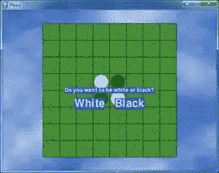 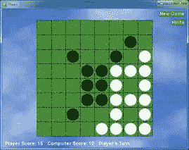

奥赛罗，通用名也叫黑白棋，有一个 8 x 8 的棋盘，一面是黑色的，另一面是白色的。起始板如图 10-1 所示。每个玩家轮流放下他们颜色的新牌。新牌与该颜色的其他牌之间的任何对手牌都会被翻转。游戏的目标是尽可能多的拥有你的颜色的瓷砖。例如，图 10-2 是如果白牌手在空格 5，6 上放置一个新的白牌时的样子。

| 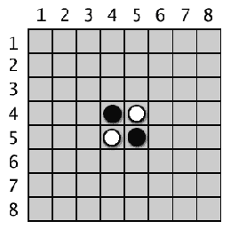 | 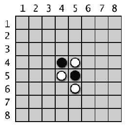 |
| 开始的黑白棋棋盘有两个白牌和两个黑牌。 | 白色放置新牌。 |

5，5 处的黑瓦片在新的白瓦片和 5，4 处的现有白瓦片之间。那块黑瓷砖被翻转过来，变成一块新的白瓷砖，使棋盘看起来如图 10-3 所示。下一步黑棋做类似的移动，在 4，6 上放置一个黑棋，在 4，5 处翻转白棋。这产生了一个如图 10-4 所示的板子。

| 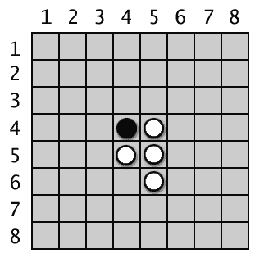 | 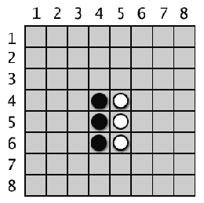 |
| 白棋的移动会翻转黑棋的一张牌。 | 黑方放置一张新的牌，它会翻转白方的一张牌。 |

只要牌在玩家的新牌和现有牌之间，所有方向的牌都会翻转。在图 10-5 中，白方玩家在 3，6 处放置一个方块，并向两个方向翻转黑方方块(用线标出)。结果如图 10-6 所示。

| 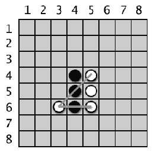 | 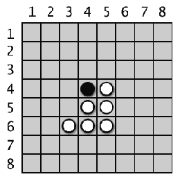 |
| 白方在 3，6 的第二步棋将翻转黑方的两张牌。 | 白棋第二步后的棋盘。 |

正如你所看到的，每个玩家只需一两个动作就能迅速抓住棋盘上的大多数牌。玩家必须始终移动至少一张牌。当一个玩家不能移动或者棋盘已满时，游戏结束。拥有最多颜色牌的玩家获胜。

可以从维基百科了解更多黑白棋:[http://en.wikipedia.org/wiki/Reversi](https://en.wikipedia.org/wiki/Reversi)

这个游戏的文本版本使用了`print()`和`input()`而不是 Pygame，在第 15 章“用 Python 发明你自己的电脑游戏”中有介绍。你可以阅读那一章，详细了解计算机人工智能的算法是如何组装的。T3【http://inventwithpython.com/chapter15.html】T5

这个游戏的电脑人工智能相当不错，因为电脑很容易模拟每一个可能的动作，并选择翻转最多瓷砖的动作。每当我玩它的时候，它通常击败我。

这个源代码可以从[【http://invpy.com/flippy.py】](//invpy.com/flippy.py)下载。

Flippy 使用的图像文件可以从下载。

```py
  1. # Flippy (an Othello or Reversi clone)
  2. # By Al Sweigart [[email protected]](/cdn-cgi/l/email-protection)
  3. # http://inventwithpython.com/pygame
  4. # Released under a "Simplified BSD" license
  5. 
  6. # Based on the "reversi.py" code that
originally appeared in "Invent
  7. # Your Own Computer Games with Python", chapter
15:
  8. #   http://inventwithpython.com/chapter15.html
9\. 
 10.
import random, sys, pygame, time, copy
 11.
from pygame.locals import *
12\. 
 13.
FPS = 10 # frames per second to update the screen
 14.
WINDOWWIDTH = 640 # width of the program's
window, in pixels
 15.
WINDOWHEIGHT = 480 # height in pixels
 16.
SPACESIZE = 50 # width & height of each space
on the board, in pixels
 17.
BOARDWIDTH = 8 # how many columns of spaces on
the game board
 18.
BOARDHEIGHT = 8 # how many rows of spaces on the
game board
 19.
WHITE_TILE = 'WHITE_TILE' # an arbitrary but
unique value
 20.
BLACK_TILE = 'BLACK_TILE' # an arbitrary but
unique value
 21.
EMPTY_SPACE = 'EMPTY_SPACE' # an arbitrary but
unique value
 22.
HINT_TILE = 'HINT_TILE' # an arbitrary but unique
value
 23.
ANIMATIONSPEED = 25 # integer from 1 to 100,
higher is faster animation
24\. 
 25. # Amount of space on the left & right side
(XMARGIN) or above and below
 26. # (YMARGIN) the game board, in pixels.
 27.
XMARGIN = int((WINDOWWIDTH - (BOARDWIDTH * SPACESIZE)) / 2)
 28.
YMARGIN = int((WINDOWHEIGHT - (BOARDHEIGHT * SPACESIZE)) / 2)
29\. 
 30. #              R    G    B
 31.
WHITE      = (255, 255, 255)
 32.
BLACK      = (  0,   0,   0)
 33.
GREEN      = (  0, 155,   0)
 34.
BRIGHTBLUE = (  0,  50, 255)
 35.
BROWN      = (174,  94,   0)
36\. 
 37.
TEXTBGCOLOR1 = BRIGHTBLUE
 38.
TEXTBGCOLOR2 = GREEN
 39.
GRIDLINECOLOR = BLACK
 40.
TEXTCOLOR = WHITE
 41.
HINTCOLOR = BROWN
42\. 
43\. 
 44.
def main():
 45.    
global MAINCLOCK, DISPLAYSURF, FONT, BIGFONT, BGIMAGE
46\. 
 47.    
pygame.init()
 48.    
MAINCLOCK = pygame.time.Clock()
 49.    
DISPLAYSURF = pygame.display.set_mode((WINDOWWIDTH, WINDOWHEIGHT))
 50.    
pygame.display.set_caption('Flippy')
 51.    
FONT = pygame.font.Font('freesansbold.ttf', 16)
 52.    
BIGFONT = pygame.font.Font('freesansbold.ttf', 32)
53\. 
 54.    
# Set up the background image.
 55.    
boardImage = pygame.image.load('flippyboard.png')
 56.    
# Use smoothscale() to stretch the board image to
fit the entire board:
 57.    
boardImage = pygame.transform.smoothscale(boardImage, (BOARDWIDTH * SPACESIZE,
BOARDHEIGHT * SPACESIZE))
 58.    
boardImageRect = boardImage.get_rect()
 59.    
boardImageRect.topleft = (XMARGIN, YMARGIN)
 60.    
BGIMAGE = pygame.image.load('flippybackground.png')
 61.    
# Use smoothscale() to stretch the background
image to fit the entire window:
 62.    
BGIMAGE = pygame.transform.smoothscale(BGIMAGE, (WINDOWWIDTH, WINDOWHEIGHT))
 63.    
BGIMAGE.blit(boardImage, boardImageRect)
64\. 
 65.    
# Run the main game.
 66.    
while True:
 67.        
if runGame() == False:
 68.            
break
69\. 
70\. 
 71.
def runGame():
 72.    
# Plays a single game of reversi each time this
function is called.
73\. 
 74.    
# Reset the board and game.
 75.    
mainBoard = getNewBoard()
 76.  
  resetBoard(mainBoard)
 77.    
showHints = False
 78.    
turn = random.choice(['computer', 'player'])
79\. 
 80.    
# Draw the starting board and ask the player what
color they want.
 81.    
drawBoard(mainBoard)
 82.    
playerTile, computerTile = enterPlayerTile()
83\. 
 84.    
# Make the Surface and Rect objects for the
"New Game" and "Hints" buttons
 85.    
newGameSurf = FONT.render('New Game', True, TEXTCOLOR, TEXTBGCOLOR2)
 86.    
newGameRect = newGameSurf.get_rect()
 87.    
newGameRect.topright = (WINDOWWIDTH - 8, 10)
 88.    
hintsSurf = FONT.render('Hints', True, TEXTCOLOR, TEXTBGCOLOR2)
 89.    
hintsRect = hintsSurf.get_rect()
 90.    
hintsRect.topright = (WINDOWWIDTH - 8, 40)
91\. 
 92.    
while True: # main game loop
 93.        
# Keep looping for player and computer's turns.
 94.        
if turn == 'player':
 95.            
# Player's turn:
 96.            
if getValidMoves(mainBoard, playerTile) == []:
 97.                
# If it's the player's turn but they
 98.                
# can't move, then end the game.
 99.                
break
100.            
movexy = None
101.            
while movexy == None:
102.                
# Keep looping until the player clicks on a valid
space.
103\. 
104.                
# Determine which board data structure to use for
display.
105.                
if showHints:
106.                    
boardToDraw = getBoardWithValidMoves(mainBoard, playerTile)
107.                
else:
108.                    
boardToDraw = mainBoard
109\. 
110.             
   checkForQuit()
111.                
for event in pygame.event.get(): # event handling
loop
112.                    
if event.type == MOUSEBUTTONUP:
113.                        
# Handle mouse click events
114.                        
mousex, mousey = event.pos
115.                        
if newGameRect.collidepoint( (mousex, mousey) ):
116.                            
# Start a new game
117.                            
return True
118.                        
elif hintsRect.collidepoint( (mousex, mousey) ):
119.                            
# Toggle hints mode
120.                            
showHints = not showHints
121.                        
# movexy is set to a two-item tuple XY
coordinate, or None value
122.                        
movexy = getSpaceClicked(mousex, mousey)
123.                        
if movexy != None and not isValidMove(mainBoard, playerTile, movexy[0],
movexy[1]):
124.                            
movexy = None
125\. 
126.                
# Draw the game board.
127.                
drawBoard(boardToDraw)
128.                
drawInfo(boardToDraw, playerTile, computerTile, turn)
129\. 
130.                
# Draw the "New Game" and
"Hints" buttons.
131.                
DISPLAYSURF.blit(newGameSurf, newGameRect)
132.                
DISPLAYSURF.blit(hintsSurf, hintsRect)
133\. 
134.                
MAINCLOCK.tick(FPS)
135.                
pygame.display.update()
136\. 
137.            
# Make the move and end the turn.
138.            
makeMove(mainBoard, playerTile, movexy[0], movexy[1], True)
139.            
if getValidMoves(mainBoard, computerTile) != []:
140.                
# Only set for the computer's turn if it can make
a move.
141.                
turn = 'computer'
142\. 
143.        
else:
144.            
# Computer's turn:
145.             if
getValidMoves(mainBoard, computerTile) == []:
146.                
# If it was set to be the computer's turn but
147.                
# they can't move, then end the game.
148.                
break
149\. 
150.            
# Draw the board.
151.            
drawBoard(mainBoard)
152.            
drawInfo(mainBoard, playerTile, computerTile, turn)
153\. 
154.            
# Draw the "New Game" and
"Hints" buttons.
155.            
DISPLAYSURF.blit(newGameSurf, newGameRect)
156.            
DISPLAYSURF.blit(hintsSurf, hintsRect)
157\. 
158.            
# Make it look like the computer is thinking by
pausing a bit.
159.            
pauseUntil = time.time() + random.randint(5, 15) * 0.1
160.            
while time.time() < pauseUntil:
161.            
    pygame.display.update()
162\. 
163.            
# Make the move and end the turn.
164.            
x, y = getComputerMove(mainBoard, computerTile)
165.            
makeMove(mainBoard, computerTile, x, y, True)
166.            
if getValidMoves(mainBoard, playerTile) != []:
167.                
# Only set for the player's turn if they can make
a move.
168.                
turn = 'player'
169\. 
170.    
# Display the final score.
171.    
drawBoard(mainBoard)
172.    
scores = getScoreOfBoard(mainBoard)
173\. 
174.    
# Determine the text of the message to display.
175.    
if scores[playerTile] > scores[computerTile]:
176.        
text = 'You beat the computer by %s points! Congratulations!' % \
177.               
(scores[playerTile] - scores[computerTile])
178.    
elif scores[playerTile] < scores[computerTile]:
179.        
text = 'You lost. The computer beat you by %s points.' % \
180.               
(scores[computerTile] - scores[playerTile])
181.    
else:
182.        
text = 'The game was a tie!'
183\. 
184.    
textSurf = FONT.render(text, True, TEXTCOLOR, TEXTBGCOLOR1)
185.    
textRect = textSurf.get_rect()
186.    
textRect.center = (int(WINDOWWIDTH / 2), int(WINDOWHEIGHT / 2))
187.    
DISPLAYSURF.blit(textSurf, textRect)
188\. 
189.    
# Display the "Play again?" text with
Yes and No buttons.
190.    
text2Surf = BIGFONT.render('Play again?', True, TEXTCOLOR, TEXTBGCOLOR1)
191.    
text2Rect = text2Surf.get_rect()
192.    
text2Rect.center = (int(WINDOWWIDTH / 2), int(WINDOWHEIGHT / 2) + 50)
193\. 
194.    
# Make "Yes" button.
195.    
yesSurf = BIGFONT.render('Yes', True, TEXTCOLOR, TEXTBGCOLOR1)
196.    
yesRect = yesSurf.get_rect()
197.    
yesRect.center = (int(WINDOWWIDTH / 2) - 60, int(WINDOWHEIGHT / 2) + 90)
198\. 
199.    
# Make "No" button.
200.    
noSurf = BIGFONT.render('No', True, TEXTCOLOR, TEXTBGCOLOR1)
201.    
noRect = noSurf.get_rect()
202.    
noRect.center = (int(WINDOWWIDTH / 2) + 60, int(WINDOWHEIGHT / 2) + 90)
203\. 
204.    
while True:
205.        
# Process events until the user clicks on Yes or
No.
206.        
checkForQuit()
207.        
for event in pygame.event.get(): # event handling
loop
208.            
if event.type == MOUSEBUTTONUP:
209.                
mousex, mousey = event.pos
210.                
if yesRect.collidepoint( (mousex, mousey) ):
211.                    
return True
212.                
elif noRect.collidepoint( (mousex, mousey) ):
213.                    
return False
214.        
DISPLAYSURF.blit(textSurf, textRect)
215.        
DISPLAYSURF.blit(text2Surf, text2Rect)
216.        
DISPLAYSURF.blit(yesSurf, yesRect)
217.        
DISPLAYSURF.blit(noSurf, noRect)
218.        
pygame.display.update()
219.        
MAINCLOCK.tick(FPS)
220\. 
221\. 
222.
def translateBoardToPixelCoord(x, y):
223.    
return XMARGIN + x * SPACESIZE + int(SPACESIZE / 2), YMARGIN + y * SPACESIZE +
int(SPACESIZE / 2)
224\. 
225\. 
226.
def animateTileChange(tilesToFlip, tileColor, additionalTile):
227.    
# Draw the additional tile that was just laid
down. (Otherwise we'd
228.    
# have to completely redraw the board & the
board info.)
229.    
if tileColor == WHITE_TILE:
230.        
additionalTileColor = WHITE
231.    
else:
232.        
additionalTileColor = BLACK
233.    
additionalTileX, additionalTileY = translateBoardToPixelCoord(additionalTile[0],
additionalTile[1])
234.    
pygame.draw.circle(DISPLAYSURF, additionalTileColor, (additionalTileX, additionalTileY),
int(SPACESIZE / 2) - 4)
235.    
pygame.display.update()
236\. 
237.    
for rgbValues in range(0, 255, int(ANIMATIONSPEED * 2.55)):
238.        
if rgbValues > 255:
239.            
rgbValues = 255
240.        
elif rgbValues < 0:
241.            
rgbValues = 0
242\. 
243.        
if tileColor == WHITE_TILE:
244.            
color = tuple([rgbValues] * 3) # rgbValues goes
from 0 to 255
245.        
elif tileColor == BLACK_TILE:
246.            
color = tuple([255 - rgbValues] * 3) # rgbValues
goes from 255 to 0
247\. 
248.        
for x, y in tilesToFlip:
249.            
centerx, centery = translateBoardToPixelCoord(x, y)
250.            
pygame.draw.circle(DISPLAYSURF, color, (centerx, centery), int(SPACESIZE / 2) -
4)
251.        
pygame.display.update()
252.        
MAINCLOCK.tick(FPS)
253.        
checkForQuit()
254\. 
255\. 
256.
def drawBoard(board):
257.    
# Draw background of board.
258.    
DISPLAYSURF.blit(BGIMAGE, BGIMAGE.get_rect())
259\. 
260.    
# Draw grid lines of the board.
261.    
for x in range(BOARDWIDTH + 1):
262.        
# Draw the horizontal lines.
263.        
startx = (x * SPACESIZE) + XMARGIN
264.         starty
= YMARGIN
265.        
endx = (x * SPACESIZE) + XMARGIN
266.        
endy = YMARGIN + (BOARDHEIGHT * SPACESIZE)
267.        
pygame.draw.line(DISPLAYSURF, GRIDLINECOLOR, (startx, starty), (endx, endy))
268.    
for y in range(BOARDHEIGHT + 1):
269.        
# Draw the vertical lines.
270.        
startx = XMARGIN
271.        
starty = (y * SPACESIZE) + YMARGIN
272.        
endx = XMARGIN + (BOARDWIDTH * SPACESIZE)
273.        
endy = (y * SPACESIZE) + YMARGIN
274.        
pygame.draw.line(DISPLAYSURF, GRIDLINECOLOR, (startx, starty), (endx, endy))
275\. 
276.    
# Draw the black & white tiles or hint spots.
277.    
for x in range(BOARDWIDTH):
278.        
for y in range(BOARDHEIGHT):
279.            
centerx, centery = translateBoardToPixelCoord(x, y)
280.            
if board[x][y] == WHITE_TILE or board[x][y] == BLACK_TILE:
281.                
if board[x][y] == WHITE_TILE:
282.                    
tileColor = WHITE
283.                
else:
284.                    
tileColor = BLACK
285.  
              pygame.draw.circle(DISPLAYSURF, tileColor, (centerx, centery),
int(SPACESIZE / 2) - 4)
286.            
if board[x][y] == HINT_TILE:
287.                
pygame.draw.rect(DISPLAYSURF, HINTCOLOR, (centerx - 4, centery - 4, 8, 8))
288\. 
289\. 
290.
def getSpaceClicked(mousex, mousey):
291.    
# Return a tuple of two integers of the board
space coordinates where
292.    
# the mouse was clicked. (Or returns None not in
any space.)
293.    
for x in range(BOARDWIDTH):
294.        
for y in range(BOARDHEIGHT):
295.            
if mousex > x * SPACESIZE + XMARGIN and \
296.               
mousex < (x + 1) * SPACESIZE + XMARGIN and \
297.               
mousey > y * SPACESIZE + YMARGIN and \
298.               
mousey < (y + 1) * SPACESIZE + YMARGIN:
299.                
return (x, y)
300.    
return None
301\. 
302\. 
303.
def drawInfo(board, playerTile, computerTile, turn):
304.    
# Draws scores and whose turn it is at the bottom
of the screen.
305.    
scores = getScoreOfBoard(board)
306.    
scoreSurf = FONT.render("Player Score: %s    Computer Score: %s    %s's
Turn" % (str(scores[playerTile]), str(scores[computerTile]), turn.title()),
True, TEXTCOLOR)
307.    
scoreRect = scoreSurf.get_rect()
308.    
scoreRect.bottomleft = (10, WINDOWHEIGHT - 5)
309.    
DISPLAYSURF.blit(scoreSurf, scoreRect)
310\. 
311\. 
312.
def resetBoard(board):
313.    
# Blanks out the board it is passed, and sets up
starting tiles.
314.    
for x in range(BOARDWIDTH):
315.        
for y in range(BOARDHEIGHT):
316.          
  board[x][y] = EMPTY_SPACE
317\. 
318.    
# Add starting pieces to the center
319.    
board[3][3] = WHITE_TILE
320.    
board[3][4] = BLACK_TILE
321.    
board[4][3] = BLACK_TILE
322.    
board[4][4] = WHITE_TILE
323\. 
324\. 
325.
def getNewBoard():
326.     # Creates a brand new, empty board data structure.
327.    
board = []
328.    
for i in range(BOARDWIDTH):
329.        
board.append([EMPTY_SPACE] * BOARDHEIGHT)
330\. 
331.    
return board
332\. 
333\. 
334.
def isValidMove(board, tile, xstart, ystart):
335.    
# Returns False if the player's move is invalid.
If it is a valid
336.    
# move, returns a list of spaces of the captured
pieces.
337.    
if board[xstart][ystart] != EMPTY_SPACE or not isOnBoard(xstart, ystart):
338.        
return False
339\. 
340.    
board[xstart][ystart] = tile # temporarily set
the tile on the board.
341\. 
342.    
if tile == WHITE_TILE:
343.        
otherTile = BLACK_TILE
344.    
else:
345.        
otherTile = WHITE_TILE
346\. 
347.    
tilesToFlip = []
348.    
# check each of the eight directions:
349.    
for xdirection, ydirection in [[0, 1], [1, 1], [1, 0], [1, -1], [0, -1], [-1,
-1], [-1, 0], [-1, 1]]:
350.        
x, y = xstart, ystart
351.        
x += xdirection
352.        
y += ydirection
353.        
if isOnBoard(x, y) and board[x][y] == otherTile:
354.            
# The piece belongs to the other player next to
our piece.
355.            
x += xdirection
356.            
y += ydirection
357.            
if not isOnBoard(x, y):
358.                
continue
359.            
while board[x][y] == otherTile:
360.                
x += xdirection
361.                
y += ydirection
362.                
if not isOnBoard(x, y):
363.                    
break # break out of while loop, continue in for
loop
364.        
    if not isOnBoard(x, y):
365.                
continue
366.            
if board[x][y] == tile:
367.                
# There are pieces to flip over. Go in the
reverse
368.                
# direction until we reach the original space,
noting all
369. 
               # the tiles along the way.
370.                
while True:
371.                    
x -= xdirection
372.                    
y -= ydirection
373.                    
if x == xstart and y == ystart:
374.                        
break
375.  
                  tilesToFlip.append([x, y])
376\. 
377.    
board[xstart][ystart] = EMPTY_SPACE # make space
empty
378.    
if len(tilesToFlip) == 0: # If no tiles flipped,
this move is invalid
379.        
return False
380.    
return tilesToFlip
381\. 
382\. 
383.
def isOnBoard(x, y):
384.    
# Returns True if the coordinates are located on
the board.
385.    
return x >= 0 and x < BOARDWIDTH and y >= 0 and y < BOARDHEIGHT
386\. 
387\. 
388.
def getBoardWithValidMoves(board, tile):
389.    
# Returns a new board with hint markings.
390.    
dupeBoard = copy.deepcopy(board)
391\. 
392.    
for x, y in getValidMoves(dupeBoard, tile):
393.        
dupeBoard[x][y] = HINT_TILE
394.    
return dupeBoard
395\. 
396\. 
397.
def getValidMoves(board, tile):
398.    
# Returns a list of (x,y) tuples of all valid
moves.
399.    
validMoves = []
400\. 
401.    
for x in range(BOARDWIDTH):
402.        
for y in range(BOARDHEIGHT):
403.            
if isValidMove(board, tile, x, y) != False:
404.                
validMoves.append((x, y))
405.    
return validMoves
406\. 
407\. 
408.
def getScoreOfBoard(board):
409.    
# Determine the score by counting the tiles.
410.    
xscore = 0
411.    
oscore = 0
412.    
for x in range(BOARDWIDTH):
413.        
for y in range(BOARDHEIGHT):
414.            
if board[x][y] == WHITE_TILE:
415.                
xscore += 1
416.            
if board[x][y] == BLACK_TILE:
417.                
oscore += 1
418.    
return {WHITE_TILE:xscore, BLACK_TILE:oscore}
419\. 
420\. 
421.
def enterPlayerTile():
422.    
# Draws the text and handles the mouse click
events for letting
423.    
# the player choose which color they want to be. 
Returns
424.    
# [WHITE_TILE, BLACK_TILE] if the player chooses
to be White,
425.    
# [BLACK_TILE, WHITE_TILE] if Black.
426\. 
427.    
# Create the text.
428.    
textSurf = FONT.render('Do you want to be white or black?', True, TEXTCOLOR,
TEXTBGCOLOR1)
429.    
textRect = textSurf.get_rect()
430.    
textRect.center = (int(WINDOWWIDTH / 2), int(WINDOWHEIGHT / 2))
431\. 
432.    
xSurf = BIGFONT.render('White', True, TEXTCOLOR, TEXTBGCOLOR1)
433.    
xRect = xSurf.get_rect()
434.    
xRect.center = (int(WINDOWWIDTH / 2) - 60, int(WINDOWHEIGHT / 2) + 40)
435\. 
436.    
oSurf = BIGFONT.render('Black', True, TEXTCOLOR, TEXTBGCOLOR1)
437.    
oRect = oSurf.get_rect()
438.    
oRect.center = (int(WINDOWWIDTH / 2) + 60, int(WINDOWHEIGHT / 2) + 40)
439\. 
440.    
while True:
441.        
# Keep looping until the player has clicked on a
color.
442.        
checkForQuit()
443.        
for event in pygame.event.get(): # event handling
loop
444.            
if event.type == MOUSEBUTTONUP:
445.                
mousex, mousey = event.pos
446.                
if xRect.collidepoint( (mousex, mousey) ):
447.                    
return [WHITE_TILE, BLACK_TILE]
448.                
elif oRect.collidepoint( (mousex, mousey) ):
449.                    
return [BLACK_TILE, WHITE_TILE]
450\. 
451.        
# Draw the screen.
452.        
DISPLAYSURF.blit(textSurf, textRect)
453.        
DISPLAYSURF.blit(xSurf, xRect)
454.        
DISPLAYSURF.blit(oSurf, oRect)
455.        
pygame.display.update()
456.        
MAINCLOCK.tick(FPS)
457\. 
458\. 
459.
def makeMove(board, tile, xstart, ystart, realMove=False):
460.    
# Place the tile on the board at xstart, ystart,
and flip tiles
461.    
# Returns False if this is an invalid move, True
if it is valid.
462.    
tilesToFlip = isValidMove(board, tile, xstart, ystart)
463\. 
464.    
if tilesToFlip == False:
465.        
return False
466\. 
467.    
board[xstart][ystart] = tile
468\. 
469.    
if realMove:
470.        
animateTileChange(tilesToFlip, tile, (xstart, ystart))
471\. 
472.    
for x, y in tilesToFlip:
473.        
board[x][y] = tile
474.    
return True
475\. 
476\. 
477.
def isOnCorner(x, y):
478.    
# Returns True if the position is in one of the
four corners.
479.    
return (x == 0 and y == 0) or \
480.           
(x == BOARDWIDTH and y == 0) or \
481.           
(x == 0 and y == BOARDHEIGHT) or \
482.           
(x == BOARDWIDTH and y == BOARDHEIGHT)
483\. 
484\. 
485.
def getComputerMove(board, computerTile):
486.    
# Given a board and the computer's tile,
determine where to
487.    
# move and return that move as a [x, y] list.
488.    
possibleMoves = getValidMoves(board, computerTile)
489\. 
490.    
# randomize the order of the possible moves
491.    
random.shuffle(possibleMoves)
492\. 
493.    
# always go for a corner if available.
494.    
for x, y in possibleMoves:
495.        
if isOnCorner(x, y):
496.            
return [x, y]
497\. 
498.    
# Go through all possible moves and remember the
best scoring move
499.    
bestScore = -1
500.    
for x, y in possibleMoves:
501.        
dupeBoard = copy.deepcopy(board)
502.        
makeMove(dupeBoard, computerTile, x, y)
503.        
score = getScoreOfBoard(dupeBoard)[computerTile]
504.        
if score > bestScore:
505.            
bestMove = [x, y]
506.            
bestScore = score
507.    
return bestMove
508\. 
509\. 
510.
def checkForQuit():
511.    
for event in pygame.event.get((QUIT, KEYUP)): #
event handling loop
512.        
if event.type == QUIT or (event.type == KEYUP and event.key == K_ESCAPE):
513.            
pygame.quit()
514.            
sys.exit()
515\. 
516\. 
517.
if __name__ == '__main__':
518.    
main()

```

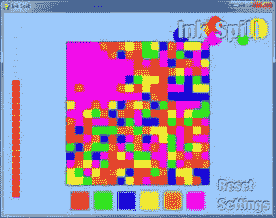 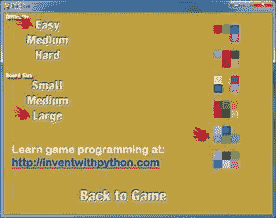

游戏“淹没它”从一块填满彩色瓷砖的木板开始。每回合，玩家选择一种新的颜色来绘制左上方的牌和与其相邻的相同颜色的牌。这个游戏利用了洪水填充算法(在星际推进器一章中有描述)。游戏的目标是在用完所有回合之前将整个棋盘变成单一颜色。

这个游戏也有一个设置屏幕，玩家可以在这里改变棋盘的大小和游戏的难度。如果玩家接受了这些颜色，他们也可以选择其他一些颜色。

这个源代码可以从[【http://invpy.com/inkspill.py】](//invpy.com/inkspill.py)下载。

Flippy 使用的图像文件可以从下载。

```py
  1. # Ink Spill (a Flood It clone)
  2. # http://inventwithpython.com/pygame
  3. # By Al Sweigart [[email protected]](/cdn-cgi/l/email-protection)
  4. # Released under a "Simplified BSD" license
5\. 
  6.
import random, sys, webbrowser, copy, pygame
  7.
from pygame.locals import *
8\. 
  9. # There are different box sizes, number of boxes, and
 10. # life depending on the "board size" setting
selected.
 11.
SMALLBOXSIZE  = 60 # size is in pixels
 12.
MEDIUMBOXSIZE = 20
 13.
LARGEBOXSIZE  = 11
14\. 
 15.
SMALLBOARDSIZE  = 6 # size is in boxes
 16.
MEDIUMBOARDSIZE = 17
 17.
LARGEBOARDSIZE  = 30
18\. 
 19.
SMALLMAXLIFE  = 10 # number of turns
 20.
MEDIUMMAXLIFE = 30
 21.
LARGEMAXLIFE  = 64
22\. 
 23.
FPS = 30
 24.
WINDOWWIDTH = 640
 25.
WINDOWHEIGHT = 480
 26.
boxSize = MEDIUMBOXSIZE
 27.
PALETTEGAPSIZE = 10
 28.
PALETTESIZE = 45
 29.
EASY = 0   # arbitrary but unique value
 30.
MEDIUM = 1 # arbitrary but unique value
 31.
HARD = 2   # arbitrary but unique value
32\. 
 33.
difficulty = MEDIUM # game starts in
"medium" mode
 34.
maxLife = MEDIUMMAXLIFE
 35.
boardWidth = MEDIUMBOARDSIZE
 36.
boardHeight = MEDIUMBOARDSIZE
37\. 
38\. 
 39. #            R    G    B
 40.
WHITE    = (255, 255, 255)
 41.
DARKGRAY = ( 70,  70,  70)
 42.
BLACK    = (  0,   0,   0)
 43.
RED      = (255,   0,   0)
 44.
GREEN    = (  0, 255,   0)
 45.
BLUE     = (  0,   0, 255)
 46.
YELLOW   = (255, 255,   0)
 47.
ORANGE   = (255, 128,   0)
 48.
PURPLE   = (255,   0, 255)
49\. 
 50. # The first color in each scheme is the background
color, the next six are the palette colors.
 51.
COLORSCHEMES = (((150, 200, 255), RED, GREEN, BLUE, YELLOW, ORANGE, PURPLE),
 52.                
((0, 155, 104),  (97, 215, 164),  (228, 0, 69),  (0, 125, 50),   (204, 246,
0),   (148, 0, 45),    (241, 109, 149)),
 53.                
((195, 179, 0),  (255, 239, 115), (255, 226, 0), (147, 3, 167),  (24, 38,
176),   (166, 147, 0),   (197, 97, 211)),
 54.                
((85, 0, 0),     (155, 39, 102),  (0, 201, 13),  (255, 118, 0),  (206, 0,
113),   (0, 130, 9),     (255, 180, 115)),
 55.                
((191, 159, 64), (183, 182, 208), (4, 31, 183),  (167, 184, 45), (122, 128,
212), (37, 204, 7),    (88, 155, 213)),
 56.                
((200, 33, 205), (116, 252, 185), (68, 56, 56),  (52, 238, 83),  (23, 149, 195), 
(222, 157, 227), (212, 86, 185)))
 57.
for i in range(len(COLORSCHEMES)):
 58.    
assert len(COLORSCHEMES[i]) == 7, 'Color scheme %s does not have exactly 7
colors.' % (i)
 59.
bgColor = COLORSCHEMES[0][0]
 60.
paletteColors =  COLORSCHEMES[0][1:]
61\. 
 62.
def main():
 63.    
global FPSCLOCK, DISPLAYSURF, LOGOIMAGE, SPOTIMAGE, SETTINGSIMAGE, SETTINGSBUTTONIMAGE,
RESETBUTTONIMAGE
64\. 
 65.    
pygame.init()
 66.    
FPSCLOCK = pygame.time.Clock()
 67.    
DISPLAYSURF = pygame.display.set_mode((WINDOWWIDTH, WINDOWHEIGHT))
68\. 
 69.    
# Load images
 70.    
LOGOIMAGE = pygame.image.load('inkspilllogo.png')
 71.    
SPOTIMAGE = pygame.image.load('inkspillspot.png')
 72.    
SETTINGSIMAGE = pygame.image.load('inkspillsettings.png')
 73.    
SETTINGSBUTTONIMAGE = pygame.image.load('inkspillsettingsbutton.png')
 74.    
RESETBUTTONIMAGE = pygame.image.load('inkspillresetbutton.png')
75\. 
 76.    
pygame.display.set_caption('Ink Spill')
 77.    
mousex = 0
 78.    
mousey = 0
 79.    
mainBoard = generateRandomBoard(boardWidth, boardHeight, difficulty)
 80.    
life = maxLife
 81.    
lastPaletteClicked = None
82\. 
 83.    
while True: # main game loop
 84.        
paletteClicked = None
 85.        
resetGame = False
86\. 
 87.        
# Draw the screen.
 88.        
DISPLAYSURF.fill(bgColor)
 89.        
drawLogoAndButtons()
 90.        
drawBoard(mainBoard)
 91.        
drawLifeMeter(life)
 92.        
drawPalettes()
93\. 
 94.        
checkForQuit()
 95.        
for event in pygame.event.get(): # event handling
loop
 96.            
if event.type == MOUSEBUTTONUP:
 97.                
mousex, mousey = event.pos
 98.                
if pygame.Rect(WINDOWWIDTH - SETTINGSBUTTONIMAGE.get_width(),
 99.                               
WINDOWHEIGHT - SETTINGSBUTTONIMAGE.get_height(),
100.                               
SETTINGSBUTTONIMAGE.get_width(),
101.                               
SETTINGSBUTTONIMAGE.get_height()).collidepoint(mousex, mousey):
102.                    
resetGame = showSettingsScreen() # clicked on
Settings button
103.                
elif pygame.Rect(WINDOWWIDTH - RESETBUTTONIMAGE.get_width(),
104.                                 
WINDOWHEIGHT - SETTINGSBUTTONIMAGE.get_height() -
RESETBUTTONIMAGE.get_height(),
105.                        
         RESETBUTTONIMAGE.get_width(),
106.                                 
RESETBUTTONIMAGE.get_height()).collidepoint(mousex, mousey):
107.                    
resetGame = True # clicked on Reset button
108.                
else:
109.                  
  # check if a palette button was clicked
110.                    
paletteClicked = getColorOfPaletteAt(mousex, mousey)
111\. 
112.        
if paletteClicked != None and paletteClicked != lastPaletteClicked:
113.            
# a palette button was clicked that is different
from the
114.            
# last palette button clicked (this check
prevents the player
115.            
# from accidentally clicking the same palette
twice)
116.            
lastPaletteClicked = paletteClicked
117.            
floodAnimation(mainBoard, paletteClicked)
118.            
life -= 1
119\. 
120.            
resetGame = False
121.            
if hasWon(mainBoard):
122.                
for i in range(4): # flash border 4 times
123.                    
flashBorderAnimation(WHITE, mainBoard)
124.                
resetGame = True
125.                
pygame.time.wait(2000) # pause so the player can
bask in victory
126.            
elif life == 0:
127.                
# life is zero, so player has lost
128.                
drawLifeMeter(0)
129.                
pygame.display.update()
130.                
pygame.time.wait(400)
131.                
for i in range(4):
132.                    
flashBorderAnimation(BLACK, mainBoard)
133.                
resetGame = True
134.                
pygame.time.wait(2000) # pause so the player can
suffer in their defeat
135\. 
136.        
if resetGame:
137.            
# start a new game
138.            
mainBoard = generateRandomBoard(boardWidth, boardHeight, difficulty)
139.            
life = maxLife
140.            
lastPaletteClicked = None
141\. 
142.        
pygame.display.update()
143.        
FPSCLOCK.tick(FPS)
144\. 
145\. 
146.
def checkForQuit():
147.    
# Terminates the program if there are any QUIT or
escape key events.
148.    
for event in pygame.event.get(QUIT): # get all
the QUIT events
149.        
pygame.quit() # terminate if any QUIT events are
present
150.        
sys.exit()
151.    
for event in pygame.event.get(KEYUP): # get all
the KEYUP events
152.        
if event.key == K_ESCAPE:
153.            
pygame.quit() # terminate if the KEYUP event was
for the Esc key
154.            
sys.exit()
155.        
pygame.event.post(event) # put the other KEYUP
event objects back
156\. 
157\. 
158.
def hasWon(board):
159.    
# if the entire board is the same color, player
has won
160.    
for x in range(boardWidth):
161.        
for y in range(boardHeight):
162.            
if board[x][y] != board[0][0]:
163.                
return False # found a different color, player
has not won
164.    
return True
165\. 
166\. 
167.
def showSettingsScreen():
168.    
global difficulty, boxSize, boardWidth, boardHeight, maxLife, paletteColors,
bgColor
169\. 
170.    
# The pixel coordinates in this function were
obtained by loading
171.    
# the inkspillsettings.png image into a graphics
editor and reading
172.    
# the pixel coordinates from there. Handy trick.
173\. 
174.    
origDifficulty = difficulty
175.    
origBoxSize = boxSize
176.    
screenNeedsRedraw = True
177\. 
178.    
while True:
179.        
if screenNeedsRedraw:
180.            
DISPLAYSURF.fill(bgColor)
181.            
DISPLAYSURF.blit(SETTINGSIMAGE, (0,0))
182\. 
183.            
# place the ink spot marker next to the selected
difficulty
184.            
if difficulty == EASY:
185.          
      DISPLAYSURF.blit(SPOTIMAGE, (30, 4))
186.            
if difficulty == MEDIUM:
187.                
DISPLAYSURF.blit(SPOTIMAGE, (8, 41))
188.            
if difficulty == HARD:
189.                
DISPLAYSURF.blit(SPOTIMAGE, (30, 76))
190\. 
191.   
         # place the ink spot marker next to the
selected size
192.            
if boxSize == SMALLBOXSIZE:
193.                
DISPLAYSURF.blit(SPOTIMAGE, (22, 150))
194.            
if boxSize == MEDIUMBOXSIZE:
195.                
DISPLAYSURF.blit(SPOTIMAGE, (11, 185))
196.            
if boxSize == LARGEBOXSIZE:
197.                
DISPLAYSURF.blit(SPOTIMAGE, (24, 220))
198\. 
199.            
for i in range(len(COLORSCHEMES)):
200.                
drawColorSchemeBoxes(500, i * 60 + 30, i)
201\. 
202. 
           pygame.display.update()
203\. 
204.        
screenNeedsRedraw = False # by default, don't
redraw the screen
205.        
for event in pygame.event.get(): # event handling
loop
206.            
if event.type == QUIT:
207.                
pygame.quit()
208.                
sys.exit()
209.            
elif event.type == KEYUP:
210.                
if event.key == K_ESCAPE:
211.                    
# Esc key on settings screen goes back to game
212.                    
return not (origDifficulty == difficulty and origBoxSize == boxSize)
213.            
elif event.type == MOUSEBUTTONUP:
214.                
screenNeedsRedraw = True # screen should be
redrawn
215.                
mousex, mousey = event.pos # syntactic sugar
216\. 
217.                
# check for clicks on the difficulty buttons
218.                
if pygame.Rect(74, 16, 111, 30).collidepoint(mousex, mousey):
219.                    
difficulty = EASY
220.                
elif pygame.Rect(53, 50, 104, 29).collidepoint(mousex, mousey):
221.                    
difficulty = MEDIUM
222.                
elif pygame.Rect(72, 85, 65, 31).collidepoint(mousex, mousey):
223.                    
difficulty = HARD
224\. 
225.                
# check for clicks on the size buttons
226.               
 elif pygame.Rect(63, 156, 84, 31).collidepoint(mousex, mousey):
227.                    
# small board size setting:
228.                    
boxSize = SMALLBOXSIZE
229.                    
boardWidth = SMALLBOARDSIZE
230.                    
boardHeight = SMALLBOARDSIZE
231.                    
maxLife = SMALLMAXLIFE
232.                
elif pygame.Rect(52, 192, 106,32).collidepoint(mousex, mousey):
233.                    
# medium board size setting:
234.                    
boxSize = MEDIUMBOXSIZE
235.                    
boardWidth = MEDIUMBOARDSIZE
236.                    
boardHeight = MEDIUMBOARDSIZE
237.                    
maxLife = MEDIUMMAXLIFE
238.                
elif pygame.Rect(67, 228, 58, 37).collidepoint(mousex, mousey):
239.           
         # large board size setting:
240.                    
boxSize = LARGEBOXSIZE
241.                    
boardWidth = LARGEBOARDSIZE
242.                    
boardHeight = LARGEBOARDSIZE
243.                    
maxLife = LARGEMAXLIFE
244.           
     elif pygame.Rect(14, 299, 371, 97).collidepoint(mousex, mousey):
245.                    
# clicked on the "learn programming" ad
246.                    
webbrowser.open('http://inventwithpython.com') #
opens a web browser
247.                
elif pygame.Rect(178, 418, 215, 34).collidepoint(mousex, mousey):
248.                    
# clicked on the "back to game" button
249.                    
return not (origDifficulty == difficulty and origBoxSize == boxSize)
250\. 
251.                
for i in range(len(COLORSCHEMES)):
252.                    
# clicked on a color scheme button
253.                    
if pygame.Rect(500, 30 + i * 60, MEDIUMBOXSIZE * 3, MEDIUMBOXSIZE *
2).collidepoint(mousex, mousey):
254.                        
bgColor = COLORSCHEMES[i][0]
255.                        
paletteColors  = COLORSCHEMES[i][1:]
256\. 
257\. 
258.
def drawColorSchemeBoxes(x, y, schemeNum):
259.    
# Draws the color scheme boxes that appear on the
"Settings" screen.
260.    
for boxy in range(2):
261.    
    for boxx in range(3):
262.            
pygame.draw.rect(DISPLAYSURF, COLORSCHEMES[schemeNum][3 * boxy + boxx + 1], (x
+ MEDIUMBOXSIZE * boxx, y + MEDIUMBOXSIZE * boxy, MEDIUMBOXSIZE,
MEDIUMBOXSIZE))
263.            
if paletteColors == COLORSCHEMES[schemeNum][1:]:
264.                
# put the ink spot next to the selected color
scheme
265.                
DISPLAYSURF.blit(SPOTIMAGE, (x - 50, y))
266\. 
267\. 
268.
def flashBorderAnimation(color, board, animationSpeed=30):
269.    
origSurf = DISPLAYSURF.copy()
270.    
flashSurf = pygame.Surface(DISPLAYSURF.get_size())
271.    
flashSurf = flashSurf.convert_alpha()
272.    
for start, end, step in ((0, 256, 1), (255, 0, -1)):
273.        
# the first iteration on the outer loop will set
the inner loop
274.        
# to have transparency go from 0 to 255, the
second iteration will
275.        
# have it go from 255 to 0\. This is the
"flash".
276.        
for transparency in range(start, end, animationSpeed * step):
277.            
DISPLAYSURF.blit(origSurf, (0, 0))
278.            
r, g, b = color
279.            
flashSurf.fill((r, g, b, transparency))
280.            
DISPLAYSURF.blit(flashSurf, (0, 0))
281.            
drawBoard(board) # draw board ON TOP OF the
transparency layer
282.            
pygame.display.update()
283.            
FPSCLOCK.tick(FPS)
284.    
DISPLAYSURF.blit(origSurf, (0, 0)) # redraw the
original surface
285\. 
286\. 
287.
def floodAnimation(board, paletteClicked, animationSpeed=25):
288.    
origBoard = copy.deepcopy(board)
289. 
   floodFill(board, board[0][0], paletteClicked, 0, 0)
290\. 
291.    
for transparency in range(0, 255, animationSpeed):
292.        
# The "new" board slowly become opaque
over the original board.
293.        
drawBoard(origBoard)
294.        
drawBoard(board, transparency)
295.        
pygame.display.update()
296.        
FPSCLOCK.tick(FPS)
297\. 
298\. 
299.
def generateRandomBoard(width, height, difficulty=MEDIUM):
300.    
# Creates a board data structure with random
colors for each box.
301.    
board = []
302.    
for x in range(width):
303.        
column = []
304.        
for y in range(height):
305.            
column.append(random.randint(0, len(paletteColors) - 1))
306.        
board.append(column)
307\. 
308.    
# Make board easier by setting some boxes to same
color as a neighbor.
309\. 
310.    
# Determine how many boxes to change.
311.    
if difficulty == EASY:
312.        
if boxSize == SMALLBOXSIZE:
313.            
boxesToChange = 100
314.        
else:
315.            
boxesToChange = 1500
316.    
elif difficulty == MEDIUM:
317.        
if boxSize == SMALLBOXSIZE:
318.            
boxesToChange = 5
319.        
else:
320.            
boxesToChange = 200
321.    
else:
322.        
boxesToChange = 0
323\. 
324.    
# Change neighbor's colors:
325.    
for i in range(boxesToChange):
326.        
# Randomly choose a box whose color to copy
327.        
x = random.randint(1, width-2)
328.        
y = random.randint(1, height-2)
329\. 
330.        
# Randomly choose neighbors to change.
331.      
  direction = random.randint(0, 3)
332.        
if direction == 0: # change left and up neighbor
333.            
board[x-1][y] = board[x][y]
334.            
board[x][y-1] = board[x][y]
335.        
elif direction == 1: # change right and down
neighbor
336.            
board[x+1][y] = board[x][y]
337.            
board[x][y+1] = board[x][y]
338.        
elif direction == 2: # change right and up
neighbor
339.            
board[x][y-1] = board[x][y]
340.            
board[x+1][y] = board[x][y]
341.  
      else: # change left and down neighbor
342.            
board[x][y+1] = board[x][y]
343.            
board[x-1][y] = board[x][y]
344.    
return board
345\. 
346\. 
347.
def drawLogoAndButtons():
348.    
# draw the Ink Spill logo and Settings and Reset
buttons.
349.    
DISPLAYSURF.blit(LOGOIMAGE, (WINDOWWIDTH - LOGOIMAGE.get_width(), 0))
350.    
DISPLAYSURF.blit(SETTINGSBUTTONIMAGE, (WINDOWWIDTH - SETTINGSBUTTONIMAGE.get_width(),
WINDOWHEIGHT - SETTINGSBUTTONIMAGE.get_height()))
351.    
DISPLAYSURF.blit(RESETBUTTONIMAGE, (WINDOWWIDTH - RESETBUTTONIMAGE.get_width(),
WINDOWHEIGHT - SETTINGSBUTTONIMAGE.get_height() - RESETBUTTONIMAGE.get_height()))
352\. 
353\. 
354.
def drawBoard(board, transparency=255):
355.    
# The colored squares are drawn to a temporary
surface which is then
356.    
# drawn to the DISPLAYSURF surface. This is done
so we can draw the
357.    
# squares with transparency on top of DISPLAYSURF
as it currently is.
358.    
tempSurf = pygame.Surface(DISPLAYSURF.get_size())
359.    
tempSurf = tempSurf.convert_alpha()
360.    
tempSurf.fill((0, 0, 0, 0))
361\. 
362.    
for x in range(boardWidth):
363.        
for y in range(boardHeight):
364.            
left, top = leftTopPixelCoordOfBox(x, y)
365.            
r, g, b = paletteColors[board[x][y]]
366.            
pygame.draw.rect(tempSurf, (r, g, b, transparency), (left, top, boxSize,
boxSize))
367.    
left, top = leftTopPixelCoordOfBox(0, 0)
368.    
pygame.draw.rect(tempSurf, BLACK, (left-1, top-1, boxSize * boardWidth + 1,
boxSize * boardHeight + 1), 1)
369.    
DISPLAYSURF.blit(tempSurf, (0, 0))
370\. 
371\. 
372.
def drawPalettes():
373.    
# Draws the six color palettes at the bottom of
the screen.
374.    
numColors = len(paletteColors)
375.    
xmargin = int((WINDOWWIDTH - ((PALETTESIZE * numColors) + (PALETTEGAPSIZE *
(numColors - 1)))) / 2)
376.    
for i in range(numColors):
377.        
left = xmargin + (i * PALETTESIZE) + (i * PALETTEGAPSIZE)
378.        
top = WINDOWHEIGHT - PALETTESIZE - 10
379.        
pygame.draw.rect(DISPLAYSURF, paletteColors[i], (left, top, PALETTESIZE,
PALETTESIZE))
380.        
pygame.draw.rect(DISPLAYSURF, bgColor,   (left + 2, top + 2, PALETTESIZE - 4,
PALETTESIZE - 4), 2)
381\. 
382\. 
383.
def drawLifeMeter(currentLife):
384.    
lifeBoxSize = int((WINDOWHEIGHT - 40) / maxLife)
385\. 
386.    
# Draw background color of life meter.
387.    
pygame.draw.rect(DISPLAYSURF, bgColor, (20, 20, 20, 20 + (maxLife * lifeBoxSize)))
388\. 
389.    
for i in range(maxLife):
390.        
if currentLife >= (maxLife - i): # draw a
solid red box
391.            
pygame.draw.rect(DISPLAYSURF, RED, (20, 20 + (i * lifeBoxSize), 20,
lifeBoxSize))
392.        
pygame.draw.rect(DISPLAYSURF, WHITE, (20, 20 + (i * lifeBoxSize), 20,
lifeBoxSize), 1) # draw white outline
393\. 
394\. 
395.
def getColorOfPaletteAt(x, y):
396.    
# Returns the index of the color in paletteColors
that the x and y parameters
397.    
# are over. Returns None if x and y are not over
any palette.
398.    
numColors = len(paletteColors)
399.    
xmargin = int((WINDOWWIDTH - ((PALETTESIZE * numColors) + (PALETTEGAPSIZE *
(numColors - 1)))) / 2)
400.    
top = WINDOWHEIGHT - PALETTESIZE - 10
401.    
for i in range(numColors):
402.        
# Find out if the mouse click is inside any of
the palettes.
403.  
      left = xmargin + (i * PALETTESIZE) + (i * PALETTEGAPSIZE)
404.        
r = pygame.Rect(left, top, PALETTESIZE, PALETTESIZE)
405.        
if r.collidepoint(x, y):
406.            
return i
407.    
return None # no palette exists at these x, y
coordinates
408\. 
409\. 
410.
def floodFill(board, oldColor, newColor, x, y):
411.    
# This is the flood fill algorithm.
412.    
if oldColor == newColor or board[x][y] != oldColor:
413.        
return
414\. 
415.    
board[x][y] = newColor # change the color of the
current box
416\. 
417.    
# Make the recursive call for any neighboring
boxes:
418.    
if x > 0:
419.        
floodFill(board, oldColor, newColor, x - 1, y) #
on box to the left
420.    
if x < boardWidth - 1:
421.        
floodFill(board, oldColor, newColor, x + 1, y) #
on box to the right
422.    
if y > 0:
423.        
floodFill(board, oldColor, newColor, x, y - 1) #
on box to up
424.    
if y < boardHeight - 1:
425.        
floodFill(board, oldColor, newColor, x, y + 1) #
on box to down
426\. 
427\. 
428.
def leftTopPixelCoordOfBox(boxx, boxy):
429.    
# Returns the x and y of the left-topmost pixel
of the xth & yth box.
430.    
xmargin = int((WINDOWWIDTH - (boardWidth * boxSize)) / 2)
431.    
ymargin = int((WINDOWHEIGHT - (boardHeight * boxSize)) / 2)
432.    
return (boxx * boxSize + xmargin, boxy * boxSize + ymargin)
433\. 
434\. 
435.
if __name__ == '__main__':
436.    
main()

```

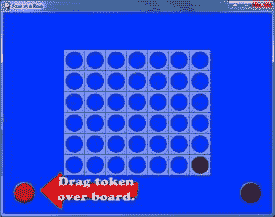 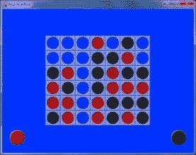

游戏“连接四个”有一个 7 x 6 的棋盘，玩家轮流从棋盘顶部投掷代币。代币将从每列的顶部落下，并停留在棋盘的底部或该列中最上面的代币的顶部。当玩家的四个代币水平、垂直或对角排成一行时，玩家获胜。

这个游戏的人工智能相当不错。它模拟它能做出的每一个可能的移动，然后模拟人类玩家能做出的每一个可能的移动来响应这些移动，然后模拟它能做出的每一个可能的移动来响应那个，然后模拟人类玩家能做出的每一个可能的移动来响应这些移动中的每一个*！*经过所有这些思考后，计算机决定哪一步最有可能获胜。

所以电脑是很难被打败的。我通常会输给它。

因为在你的回合中有七种可能的走法(除非有些列是满的)，对手有七种可能的走法，有七种可能的走法作为回应，有七种可能的走法作为回应，这意味着在每一回合中，计算机考虑 7 x 7 x 7 x 7 = 2，401 种可能的走法。你可以通过将`DIFFICULTY`常量设置为一个更大的数字来让计算机进一步考虑这个游戏，但是当我设置为一个大于`2`的值时，计算机需要很长时间来计算它的回合。

您也可以通过将`DIFFICULTY`设置为`1`来使电脑更简单。然后计算机只考虑它的每一步棋和玩家对这些棋的可能反应。如果你将`DIFFICULTY`设置为`0`，那么计算机就失去了所有的智能，只是随意移动。

这个源代码可以从[【http://invpy.com/fourinarow.py】](//invpy.com/fourinarow.py)下载。

Flippy 使用的图像文件可以从下载。

```py
  1. # Four-In-A-Row (a Connect Four clone)
  2. # By Al Sweigart [[email protected]](/cdn-cgi/l/email-protection)
  3. # http://inventwithpython.com/pygame
  4. # Released under a "Simplified BSD" license
5\. 
  6.
import random, copy, sys, pygame
  7.
from pygame.locals import *
8\. 
  9.
BOARDWIDTH = 7  # how many spaces wide the board
is
 10.
BOARDHEIGHT = 6 # how many spaces tall the board
is
 11.
assert BOARDWIDTH >= 4 and BOARDHEIGHT >= 4, 'Board must be at least
4x4.'
12\. 
 13.
DIFFICULTY = 2 # how many moves to look ahead.
(>2 is usually too slow)
14\. 
 15.
SPACESIZE = 50 # size of the tokens and
individual board spaces in pixels
16\. 
 17.
FPS = 30 # frames per second to update the screen
 18.
WINDOWWIDTH = 640 # width of the program's
window, in pixels
 19.
WINDOWHEIGHT = 480 # height in pixels
20\. 
 21.
XMARGIN = int((WINDOWWIDTH - BOARDWIDTH * SPACESIZE) / 2)
 22.
YMARGIN = int((WINDOWHEIGHT - BOARDHEIGHT * SPACESIZE) / 2)
23\. 
 24.
BRIGHTBLUE = (0, 50, 255)
 25.
WHITE = (255, 255, 255)
26\. 
 27.
BGCOLOR = BRIGHTBLUE
 28.
TEXTCOLOR = WHITE
29\. 
 30.
RED = 'red'
 31.
BLACK = 'black'
 32.
EMPTY = None
 33.
HUMAN = 'human'
 34.
COMPUTER = 'computer'
35\. 
36\. 
 37.
def main():
 38.    
global FPSCLOCK, DISPLAYSURF, REDPILERECT, BLACKPILERECT, REDTOKENIMG
 39.    
global BLACKTOKENIMG, BOARDIMG, ARROWIMG, ARROWRECT, HUMANWINNERIMG
 40.    
global COMPUTERWINNERIMG, WINNERRECT, TIEWINNERIMG
41\. 
 42.    
pygame.init()
 43.    
FPSCLOCK = pygame.time.Clock()
 44.    
DISPLAYSURF = pygame.display.set_mode((WINDOWWIDTH, WINDOWHEIGHT))
 45.    
pygame.display.set_caption('Four in a Row')
46\. 
 47.    
REDPILERECT = pygame.Rect(int(SPACESIZE / 2), WINDOWHEIGHT - int(3 * SPACESIZE
/ 2), SPACESIZE, SPACESIZE)
 48.    
BLACKPILERECT = pygame.Rect(WINDOWWIDTH - int(3 * SPACESIZE / 2), WINDOWHEIGHT
- int(3 * SPACESIZE / 2), SPACESIZE, SPACESIZE)
 49.    
REDTOKENIMG = pygame.image.load('4row_red.png')
 50.    
REDTOKENIMG = pygame.transform.smoothscale(REDTOKENIMG, (SPACESIZE, SPACESIZE))
 51.    
BLACKTOKENIMG = pygame.image.load('4row_black.png')
 52.    
BLACKTOKENIMG = pygame.transform.smoothscale(BLACKTOKENIMG, (SPACESIZE,
SPACESIZE))
 53.    
BOARDIMG = pygame.image.load('4row_board.png')
 54.    
BOARDIMG = pygame.transform.smoothscale(BOARDIMG, (SPACESIZE, SPACESIZE))
55\. 
 56.    
HUMANWINNERIMG = pygame.image.load('4row_humanwinner.png')
 57.    
COMPUTERWINNERIMG = pygame.image.load('4row_computerwinner.png')
 58.    
TIEWINNERIMG = pygame.image.load('4row_tie.png')
 59.    
WINNERRECT = HUMANWINNERIMG.get_rect()
 60.    
WINNERRECT.center = (int(WINDOWWIDTH / 2), int(WINDOWHEIGHT / 2))
61\. 
 62.    
ARROWIMG = pygame.image.load('4row_arrow.png')
 63.    
ARROWRECT = ARROWIMG.get_rect()
 64.    
ARROWRECT.left = REDPILERECT.right + 10
 65.    
ARROWRECT.centery = REDPILERECT.centery
66\. 
 67.    
isFirstGame = True
68\. 
 69.    
while True:
 70.        
runGame(isFirstGame)
 71.        
isFirstGame = False
72\. 
73\. 
 74.
def runGame(isFirstGame):
 75.    
if isFirstGame:
 76.        
# Let the computer go first on the first game, so
the player
 77.        
# can see how the tokens are dragged from the
token piles.
 78.        
turn = COMPUTER
 79.        
showHelp = True
 80.    
else:
 81.        
# Randomly choose who goes first.
 82.        
if random.randint(0, 1) == 0:
 83.            
turn = COMPUTER
 84.        
else:
 85.            
turn = HUMAN
 86.        
showHelp = False
87\. 
 88.    
# Set up a blank board data structure.
 89.    
mainBoard = getNewBoard()
90\. 
 91.    
while True: # main game loop
 92.        
if turn == HUMAN:
 93.            
# Human player's turn.
 94.            
getHumanMove(mainBoard, showHelp)
 95.            
if showHelp:
 96.                
# turn off help arrow after the first move
 97.                
showHelp = False
 98.            
if isWinner(mainBoard, RED):
 99.                
winnerImg = HUMANWINNERIMG
100.                
break
101.            
turn = COMPUTER # switch to other player's turn
102.        
else:
103.            
# Computer player's turn.
104.      
      column = getComputerMove(mainBoard)
105.            
animateComputerMoving(mainBoard, column)
106.            
makeMove(mainBoard, BLACK, column)
107.            
if isWinner(mainBoard, BLACK):
108.                
winnerImg = COMPUTERWINNERIMG
109.                 break
110.            
turn = HUMAN # switch to other player's turn
111\. 
112.        
if isBoardFull(mainBoard):
113.            
# A completely filled board means it's a tie.
114.            
winnerImg = TIEWINNERIMG
115.            
break
116\. 
117.    
while True:
118.        
# Keep looping until player clicks the mouse or
quits.
119.        
drawBoard(mainBoard)
120.        
DISPLAYSURF.blit(winnerImg, WINNERRECT)
121.        
pygame.display.update()
122.        
FPSCLOCK.tick()
123. 
       for event in pygame.event.get(): # event
handling loop
124.            
if event.type == QUIT or (event.type == KEYUP and event.key == K_ESCAPE):
125.                
pygame.quit()
126.                
sys.exit()
127.            
elif event.type == MOUSEBUTTONUP:
128.                
return
129\. 
130\. 
131.
def makeMove(board, player, column):
132.    
lowest = getLowestEmptySpace(board, column)
133.    
if lowest != -1:
134.        
board[column][lowest] = player
135\. 
136\. 
137.
def drawBoard(board, extraToken=None):
138.    
DISPLAYSURF.fill(BGCOLOR)
139\. 
140.    
# draw tokens
141.    
spaceRect = pygame.Rect(0, 0, SPACESIZE, SPACESIZE)
142.    
for x in range(BOARDWIDTH):
143.        
for y in range(BOARDHEIGHT):
144.            
spaceRect.topleft = (XMARGIN + (x * SPACESIZE), YMARGIN + (y * SPACESIZE))
145.            
if board[x][y] == RED:
146.                
DISPLAYSURF.blit(REDTOKENIMG, spaceRect)
147.            
elif board[x][y] == BLACK:
148.                
DISPLAYSURF.blit(BLACKTOKENIMG, spaceRect)
149\. 
150.    
# draw the extra token
151.    
if extraToken != None:
152.        
if extraToken['color'] == RED:
153.            
DISPLAYSURF.blit(REDTOKENIMG, (extraToken['x'], extraToken['y'], SPACESIZE,
SPACESIZE))
154.        
elif extraToken['color'] == BLACK:
155.            
DISPLAYSURF.blit(BLACKTOKENIMG, (extraToken['x'], extraToken['y'], SPACESIZE,
SPACESIZE))
156\. 
157.    
# draw board over the tokens
158.    
for x in range(BOARDWIDTH):
159.        
for y in range(BOARDHEIGHT):
160.            
spaceRect.topleft = (XMARGIN + (x * SPACESIZE), YMARGIN + (y * SPACESIZE))
161.            
DISPLAYSURF.blit(BOARDIMG, spaceRect)
162\. 
163.    
# draw the red and black tokens off to the side
164.    
DISPLAYSURF.blit(REDTOKENIMG, REDPILERECT) # red
on the left
165.    
DISPLAYSURF.blit(BLACKTOKENIMG, BLACKPILERECT) #
black on the right
166\. 
167\. 
168.
def getNewBoard():
169.    
board = []
170.    
for x in range(BOARDWIDTH):
171.        
board.append([EMPTY] * BOARDHEIGHT)
172.    
return board
173\. 
174\. 
175.
def getHumanMove(board, isFirstMove):
176.    
draggingToken = False
177.    
tokenx, tokeny = None, None
178.    
while True:
179.        
for event in pygame.event.get(): # event handling
loop
180.            
if event.type == QUIT:
181.                
pygame.quit()
182.                
sys.exit()
183.            
elif event.type == MOUSEBUTTONDOWN and not draggingToken and REDPILERECT.collidepoint(event.pos):
184.                
# start of dragging on red token pile.
185.     
           draggingToken = True
186.                
tokenx, tokeny = event.pos
187.            
elif event.type == MOUSEMOTION and draggingToken:
188.                
# update the position of the red token being
dragged
189.                
tokenx, tokeny = event.pos
190.            
elif event.type == MOUSEBUTTONUP and draggingToken:
191.                
# let go of the token being dragged
192.                
if tokeny < YMARGIN and tokenx > XMARGIN and tokenx < WINDOWWIDTH -
XMARGIN:
193.              
      # let go at the top of the screen.
194.                    
column = int((tokenx - XMARGIN) / SPACESIZE)
195.                    
if isValidMove(board, column):
196.                        
animateDroppingToken(board, column, RED)
197.              
          board[column][getLowestEmptySpace(board, column)] = RED
198.                        
drawBoard(board)
199.                        
pygame.display.update()
200.                        
return
201.                
tokenx, tokeny = None, None
202. 
               draggingToken = False
203.        
if tokenx != None and tokeny != None:
204.            
drawBoard(board, {'x':tokenx - int(SPACESIZE / 2), 'y':tokeny - int(SPACESIZE /
2), 'color':RED})
205.        
else:
206.            
drawBoard(board)
207\. 
208.        
if isFirstMove:
209.            
# Show the help arrow for the player's first
move.
210.            
DISPLAYSURF.blit(ARROWIMG, ARROWRECT)
211\. 
212.        
pygame.display.update()
213.        
FPSCLOCK.tick()
214\. 
215\. 
216.
def animateDroppingToken(board, column, color):
217.    
x = XMARGIN + column * SPACESIZE
218.    
y = YMARGIN - SPACESIZE
219.    
dropSpeed = 1.0
220\. 
221.    
lowestEmptySpace = getLowestEmptySpace(board, column)
222\. 
223.    
while True:
224.        
y += int(dropSpeed)
225.        
dropSpeed += 0.5
226.        
if int((y - YMARGIN) / SPACESIZE) >= lowestEmptySpace:
227.            
return
228.        
drawBoard(board, {'x':x, 'y':y, 'color':color})
229.        
pygame.display.update()
230.        
FPSCLOCK.tick()
231\. 
232\. 
233.
def animateComputerMoving(board, column):
234.    
x = BLACKPILERECT.left
235.    
y = BLACKPILERECT.top
236.    
speed = 1.0
237.    
# moving the black tile up
238.    
while y > (YMARGIN - SPACESIZE):
239.        
y -= int(speed)
240.        
speed += 0.5
241.        
drawBoard(board, {'x':x, 'y':y, 'color':BLACK})
242.        
pygame.display.update()
243.        
FPSCLOCK.tick()
244.    
# moving the black tile over
245.    
y = YMARGIN - SPACESIZE
246.    
speed = 1.0
247.    
while x > (XMARGIN + column * SPACESIZE):
248.        
x -= int(speed)
249.        
speed += 0.5
250.        
drawBoard(board, {'x':x, 'y':y, 'color':BLACK})
251.        
pygame.display.update()
252.        
FPSCLOCK.tick()
253.    
# dropping the black tile
254.    
animateDroppingToken(board, column, BLACK)
255\. 
256\. 
257.
def getComputerMove(board):
258.    
potentialMoves = getPotentialMoves(board, BLACK, DIFFICULTY)
259.    
# get the best fitness from the potential moves
260.    
bestMoveFitness = -1
261.    
for i in range(BOARDWIDTH):
262.        
if potentialMoves[i] > bestMoveFitness and isValidMove(board, i):
263.            
bestMoveFitness = potentialMoves[i]
264.    
# find all potential moves that have this best fitness
265.    
bestMoves = []
266.    
for i in range(len(potentialMoves)):
267.        
if potentialMoves[i] == bestMoveFitness and isValidMove(board, i):
268.            
bestMoves.append(i)
269.    
return random.choice(bestMoves)
270\. 
271\. 
272.
def getPotentialMoves(board, tile, lookAhead):
273.    
if lookAhead == 0 or isBoardFull(board):
274.        
return [0] * BOARDWIDTH
275\. 
276.    
if tile == RED:
277.        
enemyTile = BLACK
278.    
else:
279.        
enemyTile = RED
280\. 
281.    
# Figure out the best move to make.
282.    
potentialMoves = [0] * BOARDWIDTH
283.    
for firstMove in range(BOARDWIDTH):
284.        
dupeBoard = copy.deepcopy(board)
285.        
if not isValidMove(dupeBoard, firstMove):
286.            
continue
287.        
makeMove(dupeBoard, tile, firstMove)
288.        
if isWinner(dupeBoard, tile):
289.            
# a winning move automatically gets a perfect fitness
290.            
potentialMoves[firstMove] = 1
291.            
break # don't bother calculating other moves
292.        
else:
293. 
           # do other player's counter moves and
determine best one
294.            
if isBoardFull(dupeBoard):
295.                
potentialMoves[firstMove] = 0
296.            
else:
297.                
for counterMove in range(BOARDWIDTH):
298.      
              dupeBoard2 = copy.deepcopy(dupeBoard)
299.                    
if not isValidMove(dupeBoard2, counterMove):
300.                        
continue
301.                    
makeMove(dupeBoard2, enemyTile, counterMove)
302.                    
if isWinner(dupeBoard2, enemyTile):
303.                        
# a losing move automatically gets the worst fitness
304.                        
potentialMoves[firstMove] = -1
305.                        
break
306.                    
else:
307.        
                # do the recursive call to
getPotentialMoves()
308.                        
results = getPotentialMoves(dupeBoard2, tile, lookAhead - 1)
309.                        
potentialMoves[firstMove] += (sum(results) / BOARDWIDTH) / BOARDWIDTH
310.    
return potentialMoves
311\. 
312\. 
313.
def getLowestEmptySpace(board, column):
314.    
# Return the row number of the lowest empty row
in the given column.
315.    
for y in range(BOARDHEIGHT-1, -1, -1):
316.        
if board[column][y] == EMPTY:
317.            
return y
318.    
return -1
319\. 
320\. 
321.
def isValidMove(board, column):
322.    
# Returns True if there is an empty space in the
given column.
323.    
# Otherwise returns False.
324.    
if column < 0 or column >= (BOARDWIDTH) or board[column][0] != EMPTY:
325.        
return False
326.    
return True
327\. 
328\. 
329.
def isBoardFull(board):
330.    
# Returns True if there are no empty spaces
anywhere on the board.
331.    
for x in range(BOARDWIDTH):
332.        
for y in range(BOARDHEIGHT):
333.            
if board[x][y] == EMPTY:
334.                
return False
335.    
return True
336\. 
337\. 
338.
def isWinner(board, tile):
339.    
# check horizontal spaces
340.    
for x in range(BOARDWIDTH - 3):
341.        
for y in range(BOARDHEIGHT):
342.            
if board[x][y] == tile and board[x+1][y] == tile and board[x+2][y] == tile and
board[x+3][y] == tile:
343.                
return True
344.    
# check vertical spaces
345.    
for x in range(BOARDWIDTH):
346.        
for y in range(BOARDHEIGHT - 3):
347.            
if board[x][y] == tile and board[x][y+1] == tile and board[x][y+2] == tile and
board[x][y+3] == tile:
348.                
return True
349.    
# check / diagonal spaces
350.    
for x in range(BOARDWIDTH - 3):
351.        
for y in range(3, BOARDHEIGHT):
352.            
if board[x][y] == tile and board[x+1][y-1] == tile and board[x+2][y-2] == tile
and board[x+3][y-3] == tile:
353.                
return True
354.    
# check \ diagonal spaces
355.    
for x in range(BOARDWIDTH - 3):
356.        
for y in range(BOARDHEIGHT - 3):
357.            
if board[x][y] == tile and board[x+1][y+1] == tile and board[x+2][y+2] == tile
and board[x+3][y+3] == tile:
358.                
return True
359.    
return False
360\. 
361\. 
362.
if __name__ == '__main__':
363.    
main()
```

**T3】**

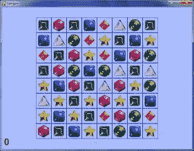 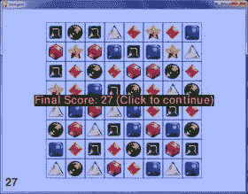

“宝石迷阵”是一个游戏，宝石会掉落并填满一个棋盘。玩家可以交换任何两个相邻的宝石，以尝试匹配一排中的三个宝石(垂直或水平，但不是对角)。匹配的宝石然后消失，为新的宝石从顶部落下让路。匹配三颗以上的宝石，或者引起宝石匹配的连锁反应，会产生更多的积分。玩家的分数随着时间慢慢下降，所以玩家必须不断地进行新的匹配。当棋盘上没有可能的匹配时，游戏结束。

这个源代码可以从[【http://invpy.com/gemgem.py】](//invpy.com/gemgem.py)下载。

Flippy 使用的图像文件可以从下载。

```py
  1. # Gemgem (a Bejeweled clone)
  2. # By Al Sweigart [[email protected]](/cdn-cgi/l/email-protection)
  3. # http://inventwithpython.com/pygame
  4. # Released under a "Simplified BSD" license
5\. 
  6. """
  7. This program has "gem data structures",
which are basically dictionaries
  8. with the following keys:
  9.   'x' and 'y' - The location of the gem on the board.
0,0 is the top left.
 10.                 There is also a ROWABOVEBOARD row that
'y' can be set to,
 11.                 to indicate that it is above the
board.
 12.   'direction' - one of the four constant variables UP,
DOWN, LEFT, RIGHT.
 13.                 This is the direction the gem is
moving.
 14.   'imageNum'  - The integer index into GEMIMAGES to
denote which image
 15.                 this gem uses.
 16. """
17\. 
 18.
import random, time, pygame, sys, copy
 19.
from pygame.locals import *
20\. 
 21.
FPS = 30 # frames per second to update the screen
 22.
WINDOWWIDTH = 600  # width of the program's
window, in pixels
 23.
WINDOWHEIGHT = 600 # height in pixels
24\. 
 25.
BOARDWIDTH = 8 # how many columns in the board
 26.
BOARDHEIGHT = 8 # how many rows in the board
 27.
GEMIMAGESIZE = 64 # width & height of each
space in pixels
28\. 
 29. # NUMGEMIMAGES is the number of gem types. You will
need .png image
 30. # files named gem0.png, gem1.png, etc. up to
gem(N-1).png.
 31.
NUMGEMIMAGES = 7
 32.
assert NUMGEMIMAGES >= 5 # game needs at least
5 types of gems to work
33\. 
 34. # NUMMATCHSOUNDS is the number of different sounds to choose
from when
 35. # a match is made. The .wav files are named match0.wav,
match1.wav, etc.
 36.
NUMMATCHSOUNDS = 6
37\. 
 38.
MOVERATE = 25 # 1 to 100, larger num means faster
animations
 39.
DEDUCTSPEED = 0.8 # reduces score by 1 point
every DEDUCTSPEED seconds.
40\. 
 41. #             R    G    B
 42.
PURPLE    = (255,   0, 255)
 43.
LIGHTBLUE = (170, 190, 255)
 44.
BLUE      = (  0,   0, 255)
 45.
RED       = (255, 100, 100)
 46.
BLACK     = (  0,   0,   0)
 47.
BROWN     = ( 85,  65,   0)
 48.
HIGHLIGHTCOLOR = PURPLE # color of the selected
gem's border
 49.
BGCOLOR = LIGHTBLUE # background color on the
screen
 50.
GRIDCOLOR = BLUE # color of the game board
 51.
GAMEOVERCOLOR = RED # color of the "Game
over" text.
 52.
GAMEOVERBGCOLOR = BLACK # background color of the
"Game over" text.
 53.
SCORECOLOR = BROWN # color of the text for the
player's score
54\. 
 55. # The amount of space to the sides of the board to the
edge of the window
 56. # is used several times, so calculate it once here and
store in variables.
 57.
XMARGIN = int((WINDOWWIDTH - GEMIMAGESIZE * BOARDWIDTH) / 2)
 58.
YMARGIN = int((WINDOWHEIGHT - GEMIMAGESIZE * BOARDHEIGHT) / 2)
59\. 
 60. # constants for direction values
 61.
UP = 'up'
 62.
DOWN = 'down'
 63.
LEFT = 'left'
 64.
RIGHT = 'right'
65\. 
 66.
EMPTY_SPACE = -1 # an arbitrary, nonpositive
value
 67.
ROWABOVEBOARD = 'row above board' # an arbitrary,
noninteger value
68\. 
 69.
def main():
 70.    
global FPSCLOCK, DISPLAYSURF, GEMIMAGES, GAMESOUNDS, BASICFONT, BOARDRECTS
71\. 
 72.    
# Initial set up.
 73.    
pygame.init()
 74.    
FPSCLOCK = pygame.time.Clock()
 75.    
DISPLAYSURF = pygame.display.set_mode((WINDOWWIDTH, WINDOWHEIGHT))
 76.    
pygame.display.set_caption('Gemgem')
 77.    
BASICFONT = pygame.font.Font('freesansbold.ttf', 36)
78\. 
 79.    
# Load the images
 80.    
GEMIMAGES = []
 81.    
for i in range(1, NUMGEMIMAGES+1):
 82.        
gemImage = pygame.image.load('gem%s.png' % i)
 83.        
if gemImage.get_size() != (GEMIMAGESIZE, GEMIMAGESIZE):
 84.   
         gemImage = pygame.transform.smoothscale(gemImage, (GEMIMAGESIZE,
GEMIMAGESIZE))
 85.        
GEMIMAGES.append(gemImage)
86\. 
 87.    
# Load the sounds.
 88.    
GAMESOUNDS = {}
 89.    
GAMESOUNDS['bad swap'] = pygame.mixer.Sound('badswap.wav')
 90.    
GAMESOUNDS['match'] = []
 91.    
for i in range(NUMMATCHSOUNDS):
 92.        
GAMESOUNDS['match'].append(pygame.mixer.Sound('match%s.wav' % i))
93\. 
 94.    
# Create pygame.Rect objects for each board space
to
 95.    
# do board-coordinate-to-pixel-coordinate
conversions.
 96.    
BOARDRECTS = []
 97.    
for x in range(BOARDWIDTH):
 98.        
BOARDRECTS.append([])
 99.        
for y in range(BOARDHEIGHT):
100.            
r = pygame.Rect((XMARGIN + (x * GEMIMAGESIZE),
101.                  
           YMARGIN + (y * GEMIMAGESIZE),
102.                             
GEMIMAGESIZE,
103.                             
GEMIMAGESIZE))
104.            
BOARDRECTS[x].append(r)
105\. 
106.    
while True:
107.        
runGame()
108\. 
109\. 
110.
def runGame():
111.    
# Plays through a single game. When the game is
over, this function returns.
112\. 
113.    
# initialize the board
114.    
gameBoard = getBlankBoard()
115.    
score = 0
116.    
fillBoardAndAnimate(gameBoard, [], score) # Drop
the initial gems.
117\. 
118.    
# initialize variables for the start of a new
game
119.    
firstSelectedGem = None
120.    
lastMouseDownX = None
121.    
lastMouseDownY = None
122.    
gameIsOver = False
123.    
lastScoreDeduction = time.time()
124.    
clickContinueTextSurf = None
125\. 
126.    
while True: # main game loop
127.        
clickedSpace = None
128.        
for event in pygame.event.get(): # event handling
loop
129.            
if event.type == QUIT or (event.type == KEYUP and event.key == K_ESCAPE):
130.                
pygame.quit()
131.                
sys.exit()
132.            
elif event.type == KEYUP and event.key == K_BACKSPACE:
133.                
return # start a new game
134\. 
135.            
elif event.type == MOUSEBUTTONUP:
136.          
      if gameIsOver:
137.                    
return # after games ends, click to start a new
game
138\. 
139.                
if event.pos == (lastMouseDownX, lastMouseDownY):
140.                    
# This event is a mouse click, not the end of a
mouse drag.
141.                    
clickedSpace = checkForGemClick(event.pos)
142.                
else:
143.                    
# this is the end of a mouse drag
144.                    
firstSelectedGem = checkForGemClick((lastMouseDownX, lastMouseDownY))
145.                    
clickedSpace = checkForGemClick(event.pos)
146.                    
if not firstSelectedGem or not clickedSpace:
147.                        
# if not part of a valid drag, deselect both
148.                        
firstSelectedGem = None
149.                        
clickedSpace = None
150.            
elif event.type == MOUSEBUTTONDOWN:
151.                
# this is the start of a mouse click or mouse
drag
152.                
lastMouseDownX, lastMouseDownY = event.pos
153\. 
154.         if
clickedSpace and not firstSelectedGem:
155.            
# This was the first gem clicked on.
156.            
firstSelectedGem = clickedSpace
157.        
elif clickedSpace and firstSelectedGem:
158.            
# Two gems have been clicked on and selected.
Swap the gems.
159.            
firstSwappingGem, secondSwappingGem = getSwappingGems(gameBoard,
firstSelectedGem, clickedSpace)
160.            
if firstSwappingGem == None and secondSwappingGem == None:
161.                
# If both are None, then the gems were not
adjacent
162.                
firstSelectedGem = None # deselect the first gem
163.                
continue
164\. 
165.            
# Show the swap animation on the screen.
166.            
boardCopy = getBoardCopyMinusGems(gameBoard, (firstSwappingGem,
secondSwappingGem))
167.            
animateMovingGems(boardCopy, [firstSwappingGem, secondSwappingGem], [], score)
168\. 
169.            
# Swap the gems in the board data structure.
170.            
gameBoard[firstSwappingGem['x']][firstSwappingGem['y']] = secondSwappingGem['imageNum']
171.            
gameBoard[secondSwappingGem['x']][secondSwappingGem['y']] = firstSwappingGem['imageNum']
172\. 
173.            
# See if this is a matching move.
174.            
matchedGems = findMatchingGems(gameBoard)
175.            
if matchedGems == []:
176.                
# Was not a matching move; swap the gems back
177.                
GAMESOUNDS['bad swap'].play()
178.                
animateMovingGems(boardCopy, [firstSwappingGem, secondSwappingGem], [], score)
179.                
gameBoard[firstSwappingGem['x']][firstSwappingGem['y']] = firstSwappingGem['imageNum']
180.                
gameBoard[secondSwappingGem['x']][secondSwappingGem['y']] =
secondSwappingGem['imageNum']
181.        
    else:
182.                
# This was a matching move.
183.                
scoreAdd = 0
184.                
while matchedGems != []:
185.                    
# Remove matched gems, then pull down the board.
186\. 
187.                    
# points is a list of dicts that tells fillBoardAndAnimate()
188.                    
# where on the screen to display text to show how
many 
189.                    
# points the player got. points is a list because
if 
190.                    
# the player gets multiple matches, then multiple
points text should appear.
191.                    
points = []
192.                    
for gemSet in matchedGems:
193.                        
scoreAdd += (10 + (len(gemSet) - 3) * 10)
194.                        
for gem in gemSet:
195.                            
gameBoard[gem[0]][gem[1]] = EMPTY_SPACE
196.                        
points.append({'points': scoreAdd,
197.                                       
'x': gem[0] * GEMIMAGESIZE + XMARGIN,
198.                         
              'y': gem[1] * GEMIMAGESIZE + YMARGIN})
199.                    
random.choice(GAMESOUNDS['match']).play()
200.                    
score += scoreAdd
201\. 
202.                    
# Drop the new gems.
203.                    
fillBoardAndAnimate(gameBoard, points, score)
204\. 
205.                    
# Check if there are any new matches.
206.                    
matchedGems = findMatchingGems(gameBoard)
207.            
firstSelectedGem = None
208\. 
209.            
if not canMakeMove(gameBoard):
210.                
gameIsOver = True
211\. 
212.        
# Draw the board.
213.        
DISPLAYSURF.fill(BGCOLOR)
214.        
drawBoard(gameBoard)
215.        
if firstSelectedGem != None:
216.            
highlightSpace(firstSelectedGem['x'], firstSelectedGem['y'])
217.        
if gameIsOver:
218.            
if clickContinueTextSurf == None:
219.                
# Only render the text once. In future
iterations, just
220.                
# use the Surface object already in
clickContinueTextSurf
221.                
clickContinueTextSurf = BASICFONT.render('Final Score: %s (Click to continue)'
% (score), 1, GAMEOVERCOLOR, GAMEOVERBGCOLOR)
222.                
clickContinueTextRect = clickContinueTextSurf.get_rect()
223.                
clickContinueTextRect.center = int(WINDOWWIDTH / 2), int(WINDOWHEIGHT / 2)
224.            
DISPLAYSURF.blit(clickContinueTextSurf, clickContinueTextRect)
225.        
elif score > 0 and time.time() - lastScoreDeduction > DEDUCTSPEED:
226.            
# score drops over time
227.            
score -= 1
228.            
lastScoreDeduction = time.time()
229.        
drawScore(score)
230.        
pygame.display.update()
231.        
FPSCLOCK.tick(FPS)
232\. 
233\. 
234.
def getSwappingGems(board, firstXY, secondXY):
235.    
# If the gems at the (X, Y) coordinates of the
two gems are adjacent,
236.    
# then their 'direction' keys are set to the
appropriate direction
237.    
# value to be swapped with each other.
238.    
# Otherwise, (None, None) is returned.
239.    
firstGem = {'imageNum': board[firstXY['x']][firstXY['y']],
240.                
'x': firstXY['x'],
241.                
'y': firstXY['y']}
242.    
secondGem = {'imageNum': board[secondXY['x']][secondXY['y']],
243.                 
'x': secondXY['x'],
244.    
             'y': secondXY['y']}
245.    
highlightedGem = None
246.    
if firstGem['x'] == secondGem['x'] + 1 and firstGem['y'] == secondGem['y']:
247.        
firstGem['direction'] = LEFT
248.        
secondGem['direction'] = RIGHT
249.    
elif firstGem['x'] == secondGem['x'] - 1 and firstGem['y'] == secondGem['y']:
250.        
firstGem['direction'] = RIGHT
251.        
secondGem['direction'] = LEFT
252.    
elif firstGem['y'] == secondGem['y'] + 1 and firstGem['x'] == secondGem['x']:
253.        
firstGem['direction'] = UP
254.        
secondGem['direction'] = DOWN
255.    
elif firstGem['y'] == secondGem['y'] - 1 and firstGem['x'] == secondGem['x']:
256.        
firstGem['direction'] = DOWN
257.        
secondGem['direction'] = UP
258.    
else:
259.         # These gems are not adjacent and can't be swapped.
260.        
return None, None
261.    
return firstGem, secondGem
262\. 
263\. 
264.
def getBlankBoard():
265.    
# Create and return a blank board data structure.
266.    
board = []
267.    
for x in range(BOARDWIDTH):
268.        
board.append([EMPTY_SPACE] * BOARDHEIGHT)
269.    
return board
270\. 
271\. 
272.
def canMakeMove(board):
273.    
# Return True if the board is in a state where a
matching
274.    
# move can be made on it. Otherwise return False.
275\. 
276.    
# The patterns in oneOffPatterns represent gems
that are configured
277.    
# in a way where it only takes one move to make a
triplet.
278.    
oneOffPatterns = (((0,1), (1,0), (2,0)),
279.                      
((0,1), (1,1), (2,0)),
280.                      
((0,0), (1,1), (2,0)),
281.                      
((0,1), (1,0), (2,1)),
282.                      
((0,0), (1,0), (2,1)),
283.                      
((0,0), (1,1), (2,1)),
284.                      
((0,0), (0,2), (0,3)),
285.                      
((0,0), (0,1), (0,3)))
286\. 
287.     # The x and y variables iterate over each space on
the board.
288.     # If we use + to represent the currently iterated
space on the
289.     # board, then this pattern: ((0,1), (1,0), (2,0))refers
to identical
290.     # gems being set up like this:
291.     #
292.     #     +A
293.     #     B
294.     #     C
295.     #
296.     # That is, gem A is offset from the + by (0,1),
gem B is offset
297.     # by (1,0), and gem C is offset by (2,0). In this
case, gem A can
298.     # be swapped to the left to form a vertical
three-in-a-row triplet.
299.     #
300.     # There are eight possible ways for the gems to be
one move
301.     # away from forming a triple, hence oneOffPattern
has 8 patterns.
302\. 
303.    
for x in range(BOARDWIDTH):
304.        
for y in range(BOARDHEIGHT):
305.            
for pat in oneOffPatterns:
306.                
# check each possible pattern of "match in
next move" to
307.                
# see if a possible move can be made.
308.                
if (getGemAt(board, x+pat[0][0], y+pat[0][1]) == \
309.                    
getGemAt(board, x+pat[1][0], y+pat[1][1]) == \
310.                    
getGemAt(board, x+pat[2][0], y+pat[2][1]) != None) or \
311.           
        (getGemAt(board, x+pat[0][1], y+pat[0][0]) == \
312.                    
getGemAt(board, x+pat[1][1], y+pat[1][0]) == \
313.                    
getGemAt(board, x+pat[2][1], y+pat[2][0]) != None):
314.                    
return True # return True the first time you find
a pattern
315.    
return False
316\. 
317\. 
318.
def drawMovingGem(gem, progress):
319.    
# Draw a gem sliding in the direction that its
'direction' key
320.    
# indicates. The progress parameter is a number
from 0 (just
321.  
  # starting) to 100 (slide complete).
322.    
movex = 0
323.    
movey = 0
324.    
progress *= 0.01
325\. 
326.    
if gem['direction'] == UP:
327.        
movey = -int(progress * GEMIMAGESIZE)
328.    
elif gem['direction'] == DOWN:
329.        
movey = int(progress * GEMIMAGESIZE)
330.    
elif gem['direction'] == RIGHT:
331.        
movex = int(progress * GEMIMAGESIZE)
332.    
elif gem['direction'] == LEFT:
333.        
movex = -int(progress * GEMIMAGESIZE)
334\. 
335.    
basex = gem['x']
336.    
basey = gem['y']
337.    
if basey == ROWABOVEBOARD:
338.        
basey = -1
339\. 
340.    
pixelx = XMARGIN + (basex * GEMIMAGESIZE)
341.    
pixely = YMARGIN + (basey * GEMIMAGESIZE)
342.    
r = pygame.Rect( (pixelx + movex, pixely + movey, GEMIMAGESIZE, GEMIMAGESIZE) )
343.    
DISPLAYSURF.blit(GEMIMAGES[gem['imageNum']], r)
344\. 
345\. 
346.
def pullDownAllGems(board):
347.    
# pulls down gems on the board to the bottom to
fill in any gaps
348.    
for x in range(BOARDWIDTH):
349.        
gemsInColumn = []
350.        
for y in range(BOARDHEIGHT):
351.            
if board[x][y] != EMPTY_SPACE:
352.                
gemsInColumn.append(board[x][y])
353.        
board[x] = ([EMPTY_SPACE] * (BOARDHEIGHT - len(gemsInColumn))) + gemsInColumn
354\. 
355\. 
356.
def getGemAt(board, x, y):
357.    
if x < 0 or y < 0 or x >= BOARDWIDTH or y >= BOARDHEIGHT:
358.        
return None
359.    
else:
360.        
return board[x][y]
361\. 
362\. 
363.
def getDropSlots(board):
364.    
# Creates a "drop slot" for each column
and fills the slot with a
365.    
# number of gems that that column is lacking.
This function assumes
366.    
# that the gems have been gravity dropped
already.
367.    
boardCopy = copy.deepcopy(board)
368.    
pullDownAllGems(boardCopy)
369\. 
370.    
dropSlots = []
371.    
for i in range(BOARDWIDTH):
372.        
dropSlots.append([])
373\. 
374.    
# count the number of empty spaces in each column
on the board
375.    
for x in range(BOARDWIDTH):
376.        
for y in range(BOARDHEIGHT-1, -1, -1): # start
from bottom, going up
377.            
if boardCopy[x][y] == EMPTY_SPACE:
378.                
possibleGems = list(range(len(GEMIMAGES)))
379.                
for offsetX, offsetY in ((0, -1), (1, 0), (0, 1), (-1, 0)):
380.                    
# Narrow down the possible gems we should put in
the
381.                    
# blank space so we don't end up putting an two
of
382.                    
# the same gems next to each other when they
drop.
383.                    
neighborGem = getGemAt(boardCopy, x + offsetX, y + offsetY)
384.                    
if neighborGem != None and neighborGem in possibleGems:
385.                        
possibleGems.remove(neighborGem)
386\. 
387.                
newGem = random.choice(possibleGems)
388.                
boardCopy[x][y] = newGem
389.                
dropSlots[x].append(newGem)
390.    
return dropSlots
391\. 
392\. 
393.
def findMatchingGems(board):
394.    
gemsToRemove = [] # a list of lists of gems in
matching triplets that should be removed
395.    
boardCopy = copy.deepcopy(board)
396\. 
397.    
# loop through each space, checking for 3
adjacent identical gems
398.    
for x in range(BOARDWIDTH):
399.        
for y in range(BOARDHEIGHT):
400.            
# look for horizontal matches
401.            
if getGemAt(boardCopy, x, y) == getGemAt(boardCopy, x + 1, y) ==
getGemAt(boardCopy, x + 2, y) and getGemAt(boardCopy, x, y) != EMPTY_SPACE:
402.                
targetGem = boardCopy[x][y]
403.                
offset = 0
404.                
removeSet = []
405.                
while getGemAt(boardCopy, x + offset, y) == targetGem:
406.                    
# keep checking, in case there's more than 3 gems
in a row
407.                    
removeSet.append((x + offset, y))
408.                    
boardCopy[x + offset][y] = EMPTY_SPACE
409.                    
offset += 1
410.                
gemsToRemove.append(removeSet)
411\. 
412.            
# look for vertical matches
413.            
if getGemAt(boardCopy, x, y) == getGemAt(boardCopy, x, y + 1) == getGemAt(boardCopy,
x, y + 2) and getGemAt(boardCopy, x, y) != EMPTY_SPACE:
414.                
targetGem = boardCopy[x][y]
415.                
offset = 0
416.                
removeSet = []
417.                
while getGemAt(boardCopy, x, y + offset) == targetGem:
418.                    
# keep checking if there's more than 3 gems in a
row
419.                    
removeSet.append((x, y + offset))
420.                    
boardCopy[x][y + offset] = EMPTY_SPACE
421.                    
offset += 1
422.         
       gemsToRemove.append(removeSet)
423\. 
424.    
return gemsToRemove
425\. 
426\. 
427.
def highlightSpace(x, y):
428.    
pygame.draw.rect(DISPLAYSURF, HIGHLIGHTCOLOR, BOARDRECTS[x][y], 4)
429\. 
430\. 
431.
def getDroppingGems(board):
432.    
# Find all the gems that have an empty space
below them
433.    
boardCopy = copy.deepcopy(board)
434.    
droppingGems = []
435.    
for x in range(BOARDWIDTH):
436.        
for y in range(BOARDHEIGHT - 2, -1, -1):
437.            
if boardCopy[x][y + 1] == EMPTY_SPACE and boardCopy[x][y] != EMPTY_SPACE:
438.                
# This space drops if not empty but the space
below it is
439.                
droppingGems.append( {'imageNum': boardCopy[x][y], 'x': x, 'y': y, 'direction':
DOWN} )
440.                
boardCopy[x][y] = EMPTY_SPACE
441.    
return droppingGems
442\. 
443\. 
444.
def animateMovingGems(board, gems, pointsText, score):
445.    
# pointsText is a dictionary with keys 'x', 'y',
and 'points'
446.    
progress = 0 # progress at 0 represents
beginning, 100 means finished.
447.    
while progress < 100: # animation loop
448.        
DISPLAYSURF.fill(BGCOLOR)
449.        
drawBoard(board)
450.        
for gem in gems: # Draw each gem.
451.            
drawMovingGem(gem, progress)
452.        
drawScore(score)
453.        
for pointText in pointsText:
454.            
pointsSurf = BASICFONT.render(str(pointText['points']), 1, SCORECOLOR)
455.            
pointsRect = pointsSurf.get_rect()
456.            
pointsRect.center = (pointText['x'], pointText['y'])
457.            
DISPLAYSURF.blit(pointsSurf, pointsRect)
458\. 
459.        
pygame.display.update()
460.        
FPSCLOCK.tick(FPS)
461.        
progress += MOVERATE # progress the animation a
little bit more for the next frame
462\. 
463\. 
464.
def moveGems(board, movingGems):
465.    
# movingGems is a list of dicts with keys x, y,
direction, imageNum
466.    
for gem in movingGems:
467.        
if gem['y'] != ROWABOVEBOARD:
468.            
board[gem['x']][gem['y']] = EMPTY_SPACE
469.            
movex = 0
470.            
movey = 0
471.            
if gem['direction'] == LEFT:
472.                
movex = -1
473.            
elif gem['direction'] == RIGHT:
474.                
movex = 1
475.            
elif gem['direction'] == DOWN:
476.               
 movey = 1
477.            
elif gem['direction'] == UP:
478.                
movey = -1
479.            
board[gem['x'] + movex][gem['y'] + movey] = gem['imageNum']
480.        
else:
481.            
# gem is located above the board (where new gems
come from)
482.            
board[gem['x']][0] = gem['imageNum'] # move to
top row
483\. 
484\. 
485.
def fillBoardAndAnimate(board, points, score):
486.    
dropSlots = getDropSlots(board)
487.    
while dropSlots != [[]] * BOARDWIDTH:
488.        
# do the dropping animation as long as there are
more gems to drop
489.        
movingGems = getDroppingGems(board)
490.        
for x in range(len(dropSlots)):
491.            
if len(dropSlots[x]) != 0:
492.                
# cause the lowest gem in each slot to begin
moving in the DOWN direction
493.                
movingGems.append({'imageNum': dropSlots[x][0], 'x': x, 'y': ROWABOVEBOARD,
'direction': DOWN})
494\. 
495.        
boardCopy = getBoardCopyMinusGems(board, movingGems)
496.        
animateMovingGems(boardCopy, movingGems, points, score)
497.        
moveGems(board, movingGems)
498\. 
499.        
# Make the next row of gems from the drop slots
500.        
# the lowest by deleting the previous lowest
gems.
501.        
for x in range(len(dropSlots)):
502. 
           if len(dropSlots[x]) == 0:
503.                
continue
504.            
board[x][0] = dropSlots[x][0]
505.            
del dropSlots[x][0]
506\. 
507\. 
508.
def checkForGemClick(pos):
509.    
# See if the mouse click was on the board
510.    
for x in range(BOARDWIDTH):
511.        
for y in range(BOARDHEIGHT):
512.            
if BOARDRECTS[x][y].collidepoint(pos[0], pos[1]):
513.                
return {'x': x, 'y': y}
514.    
return None # Click was not on the board.
515\. 
516\. 
517.
def drawBoard(board):
518.    
for x in range(BOARDWIDTH):
519.        
for y in range(BOARDHEIGHT):
520.            
pygame.draw.rect(DISPLAYSURF, GRIDCOLOR, BOARDRECTS[x][y], 1)
521.            
gemToDraw = board[x][y]
522.            
if gemToDraw != EMPTY_SPACE:
523.                
DISPLAYSURF.blit(GEMIMAGES[gemToDraw], BOARDRECTS[x][y])
524\. 
525\. 
526.
def getBoardCopyMinusGems(board, gems):
527.    
# Creates and returns a copy of the passed board
data structure,
528.    
# with the gems in the "gems" list
removed from it.
529.    
#
530.    
# Gems is a list of dicts, with keys x, y,
direction, imageNum
531\. 
532.    
boardCopy = copy.deepcopy(board)
533\. 
534.    
# Remove some of the gems from this board data
structure copy.
535.    
for gem in gems:
536.        
if gem['y'] != ROWABOVEBOARD:
537.            
boardCopy[gem['x']][gem['y']] = EMPTY_SPACE
538.    
return boardCopy
539\. 
540\. 
541.
def drawScore(score):
542.    
scoreImg = BASICFONT.render(str(score), 1, SCORECOLOR)
543.    
scoreRect = scoreImg.get_rect()
544.    
scoreRect.bottomleft = (10, WINDOWHEIGHT - 6)
545.    
DISPLAYSURF.blit(scoreImg, scoreRect)
546\. 
547\. 
548.
if __name__ == '__main__':
549.    
main()
```

我希望这些游戏程序已经给了你自己的想法，告诉你想做什么样的游戏，以及如何为它们编写代码。即使你没有自己的想法，尝试克隆你玩过的其他游戏也是很好的练习。

这里有几个网站可以教你更多关于 Python 编程的知识:

[【http://pygame.org】](http://pygame.org)——Pygame 官方网站上有数百款利用 py game 库的游戏的源代码。通过下载和阅读别人的源代码，你可以学到很多东西。

[【http://python.org/doc/】](https://python.org/doc/)-更多 Python 教程以及所有 Python 模块和函数的文档。

[【http://pygame.org/docs/】](http://pygame.org/docs/)——关于 Pygame 的模块和函数的完整文档

[http://reddit.com/r/learnpython](https://reddit.com/r/learnpython)和[http://reddit.com/r/learnprogramming](https://reddit.com/r/learnprogramming)有几个用户可以帮你找到学习编程的资源。

[【http://inventwithpython.com/pygame】](//inventwithpython.com/pygame)——本书的网站，其中包括这些程序的所有源代码和附加信息。这个网站也有在 Pygame 程序中使用的图像和声音文件。

[【http://inventwithpython.com】](//inventwithpython.com)——《用 Python 发明你自己的电脑游戏》一书的网站，该书涵盖了基本的 Python 编程。

[【http://invpy.com/wiki】](//invpy.com/wiki)——一个维基，涵盖了单个的 Python 编程概念，如果你需要了解一些具体的东西，可以查阅一下。

[【http://invpy.com/traces](//invpy.com/traces)——一个网络应用程序，帮助你一步一步地跟踪本书中程序的执行。

[【http://invpy.com/videos】](//invpy.com/videos)——本书节目的视频。

[【http://gamedevlessons.com】](http://gamedevlessons.com)-一个关于如何设计和编程视频游戏的有用网站。

[【邮箱受保护】](/cdn-cgi/l/email-protection) -我的邮箱。如果你对这本书或者 Python 编程有什么问题，欢迎发邮件给我。

或者你可以通过搜索万维网找到更多关于 Python 的信息。进入搜索网站[【http://google.com】](https://google.com)，搜索“Python 编程”或“Python 教程”，找到可以教你更多 Python 编程的网站。

现在开始发明你自己的游戏吧。祝你好运！