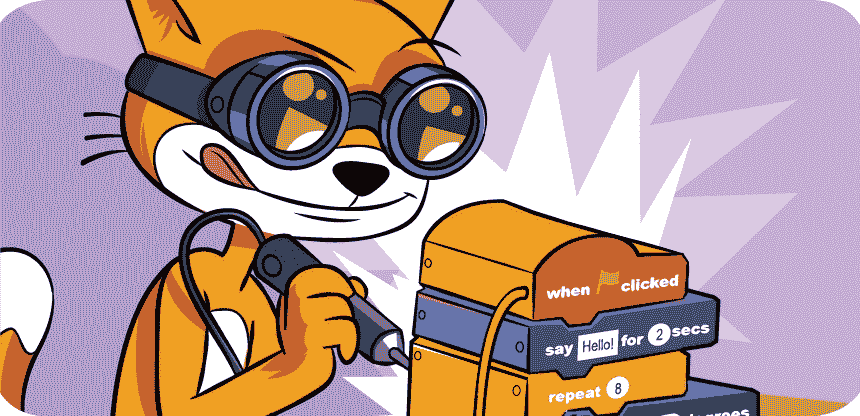
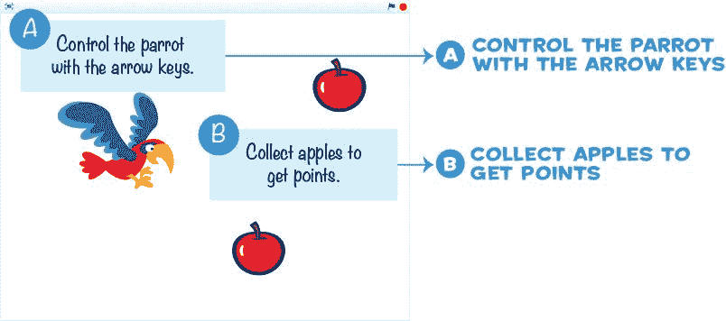

# 介绍

> 原文：<https://inventwithscratch.com/book3/chapter0.html>

制作电子游戏很有趣，但是为你自己的电子游戏编程是一项创造性的、具有挑战性的技能，它能让你创造自己的乐趣。免费的 Scratch 编程环境为每个人提供了一个学习编程技能的简单方法。虽然 Scratch 主要是为 8-16 岁的孩子设计的，但它也适用于所有年龄段的人，包括和父母在一起的更小的孩子以及学习他们第一门编程语言的大学生。

Scratch 可以做的事情太多了，很难知道从哪里开始。这就是这本书的由来。这本书指导你从头开始创建几个视频游戏。通过构建本书中的项目，您将很好地了解 Scratch 中哪些模块常用于创建视频游戏。这些项目为您创建自己的原创程序提供了坚实的基础。

## 这本书是给谁的

阅读这本书不需要以前的编程经验。唯一需要的数学技能是基本的算术:加、减、乘、除。不要让数学恐惧症阻止你学习编程。别忘了计算机会替你进行计算！

按照一步一步的说明，书中的每个程序都很容易制作。当你制作使用代码块的游戏时，你会学到这些代码块和编程概念。不管你的技能水平如何，没有理由你现在就不能开始读这本书。

孩子们可以自己跟着活动走，但是这本书也是给父母、老师和志愿者看的，他们想向他们的孩子或学生介绍编程的世界。这些项目是周末活动或课后电脑俱乐部的理想选择。成年人不一定要成为软件工程师才能用这本书来帮助别人学习。

如果你想彻底了解 Scratch 的所有功能，你可以在 https://scratch.mit.edu/help/videos/的[和 https://inventwithscratch.com/的](https://scratch.mit.edu/help/videos/)[的](https://inventwithscratch.com/)在线观看视频教程。我还推荐在[https://nostarch.com/25scratchgames/](https://nostarch.com/25scratchgames/)的 Max Wainewright(无淀粉出版社，2019)的书 *25 Scratch 3 Games* 。

但是编程是像空手道或吉他一样的*动手*技能:你不能光靠阅读来学习。确保你跟随并创造游戏——这样你会学到更多。

## 关于这本书

每章都带你完成一个游戏的编程，编程概念会在出现时解释。你将首先勾画出最终游戏的样子，并计划程序的主要部分。接下来的章节将会介绍如何一步一步地编写这些部分的代码，直到你构建出完整的游戏。构建主游戏后，你可以选择添加特殊功能和作弊模式。每章末尾的复习题帮助你检查你是否理解了所涉及的主题。

1.  **第 1 章:Scratch 入门**向您展示如何访问 Scratch 网站和 Scratch 编辑器的不同部分。
2.  第二章:彩虹纹。。。在太空！，你将使用基本代码块和几个精灵一起工作来创建一个动画艺术项目。您还将了解方向和度数。
3.  在**第三章:迷宫赛跑者**中，你将制作一个迷宫游戏，玩家使用键盘来改变猫的坐标，并引导它通过八个不同的迷宫关卡。
4.  **第四章:用重力投篮**向你展示了如何制作一个为跳跃的猫和下落的篮球实现真实重力的篮球游戏。
5.  第 5 章:一款抛光砖块游戏介绍了一些简单的技术，将一款普通的砖块游戏变成一款精致、激动人心的游戏，包括动画、音效等等。
6.  第六章:小行星破碎机。。。在太空！是经典太空射击游戏*小行星*的克隆版。您将向飞船添加鼠标和键盘控件。
7.  第 7 章:制作一个高级的平台游戏者汇集了前几章中使用的许多概念，并解释了如何创建一个具有行走和跳跃动画、平台和人工智能控制的敌人的平台游戏者游戏。

## 如何使用这本书

这本书的所有项目都从我们将要制作的游戏草图开始。草图上的标签指向我们将通过代码添加到游戏中的特性。

为了使事情易于管理，我们将一次处理一个游戏的一部分。书中的蓝色 ABC 标题与草图中的这些特征相对应。

把一个大问题拆分成一堆小问题，确实有助于组织你的思维，让一个大问题变得平易近人。在我们得到一个简单的游戏版本并运行后，我们将增加新的功能，作弊代码，等等。当你准备开始自己创作游戏时，我建议从一个简单的草图开始。

* * *

## 保存点

在本书中，你会看到这些“保存点”框。因为你要一步一步地编写程序，所以你会想不时地暂停一下，运行一下程序，即使它还没有完成。您将能够看到程序目前是否工作正常，并尽早发现任何错误。保存点框也会提醒您通过选择菜单栏中的**文件保存到您的电脑**来保存程序。

* * *

## 在线资源

虽然 Scratch 环境包括许多图像，但是您需要一些额外的文件来制作本书中的项目。这些文件在资源 ZIP 文件中，可以从[https://www . nostarch . com/scratch-playground 2e/](https://www.nostarch.com/scratch-playground2e/)下载。你需要把文件解压到你的硬盘上才能访问它们。

resources ZIP 文件包含本书项目中使用的图像文件和每个程序的框架项目文件。这些框架项目文件已经完成了所有的设置步骤，只需要添加代码块。如果在完成程序时遇到问题，可以尝试从框架项目文件开始，而不是从一个新的空白项目开始。如果您是一名正在指导几名学生的教师，并且时间有限，使用项目框架文件可能是一个好主意，因为他们只需添加代码块来完成程序。

## 勘误表和更新

虽然我们已经尽了最大努力保证这本书没有错误，但这本书的更正和更新将在[https://nostarch.com/scratch3playground/](https://nostarch.com/scratch3playground/)列出。