# 1 从 Scratch 开始

> 原文：<https://inventwithscratch.com/book3/chapter1.html>

  cratch 是当今最好的教育编程软件。没有其他工具能像 Scratch 那样让编程变得如此简单。许多类似的产品都受到了 Scratch 的启发，但 Scratch 仍然是最受欢迎的。使用 Scratch，您可以创建交互式游戏、动画和科学项目，同时获得许多乐趣！

Scratch 是一个免费的编程环境，可以在你的网络浏览器上运行。它是由麻省理工学院媒体实验室的终身幼儿园小组设计的。Scratch 用户被称为*scratcher*，他们可以通过在 Scratch 编辑器中抓取代码块来创建程序。虽然 Scratch 是为 8-16 岁的孩子设计的，但是 Scratchers 是由所有年龄的人组成的，包括和父母在一起的更小的孩子。该软件使任何人都可以轻松地开始开发他们的编程和解决问题的技能。

因为 Scratch 在你的网络浏览器中运行，所以不需要安装软件。Scratch 程序不可能破坏你电脑上的文件。Scratch 是完全免费的——没有广告或应用内购买，所以孩子们可以在 Scratch 网站上玩任何东西，成年人也不必担心意外收费。

在 Scratch 中，您使用鼠标拖放代码块，因此几乎不需要输入。下面是一个组合在一起的代码块示例:

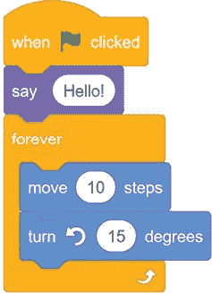可视化的 Scratch 编辑器为您提供了快速的反馈，因此您不必在几个小时内键入神秘的命令，就可以看到您的程序变得栩栩如生。Scratch 让编程变得即时而有趣。与其他编程语言不同的是，Scratch 没有任何会弹出来让程序员困惑的错误消息。如果你想学习编程的基础知识(或者帮助别人学习)，Scratch 是首屈一指的。

你可以在 https://scratch.mit.edu/info/faq/找到常见问题的答案。

## 运行划痕

要开始使用 Scratch，请打开您的网络浏览器并前往[https://scratch.mit.edu/](https://scratch.mit.edu/)。不管你运行的是 Windows、macOS、Linux、Android 还是 iOS。Scratch 3 将在平板电脑、智能手机和树莓派上运行。

注册账户是免费的。您可以在没有帐户的情况下创建临时程序，但是拥有临时帐户可以让您在线保存程序。然后，您可以通过任何连接到互联网的设备继续处理它们。

点击页面顶部的 **Join Scratch** 链接创建账户。一个新窗口打开:

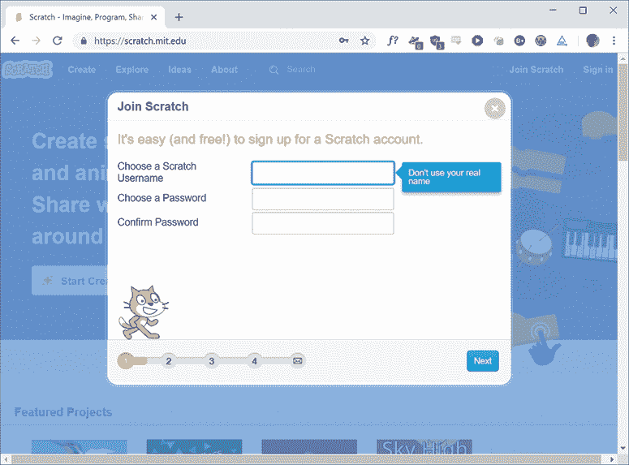选择用户名和密码，并输入您的帐户信息。未经您的允许，Scratch 绝不会共享您的电子邮件地址或个人信息。其完整的隐私政策位于 https://scratch.mit.edu/privacy_policy/的 T2。保护您私人信息的安全；除了父母或老师，不要使用你的真实姓名，也不要分享你的密码。不要把你的密码给任何自称是 Scratch 或者 MIT 员工的人(真正的员工从来不会要)。不要重复使用你用于电子邮件或任何其他在线帐户的密码，因为如果一个帐户的密码被黑客攻击，黑客也可以访问你的其他帐户。

登录 Scratch 网站后，点击页面顶部的**创建**链接，启动 Scratch 编辑器。

## Scratch 桌面:离线编辑器

Scratch Desktop 是一个离线的 Scratch 编辑器，可以让您在没有连接到互联网的情况下进行编程。如果您没有互联网接入或 Wi-Fi 不可靠，您可以在电脑上安装离线编辑器，而不是使用 Scratch 网站。唯一的区别是，程序将保存在您的计算机上，而不是在 Scratch 网站上。您可以稍后上传您的暂存程序或将它们复制到 USB 闪存驱动器，以便将它们移动到另一台计算机。

Scratch 离线编辑器可在[https://scratch.mit.edu/download/](https://scratch.mit.edu/download/)获得。

* * *

## 注

您可能会找到早期版本的编辑器软件，Scratch 1.4 或 2.0。不要使用这些版本；它们已经过时，没有 Scratch 3 拥有的新功能。如果你在网络浏览器中使用 Scratch，你使用的是 Scratch 3。如果你下载的是离线 Scratch 编辑器，一定要下载 Scratch 3。

* * *

## Scratch 编辑器和小精灵

在 Scratch editor 中，您可以将代码块整合在一起，以创建您的游戏、动画或作品。页面顶部的 **Create** 链接打开编辑器，如下图所示，您可以开始制作 Scratch 程序:

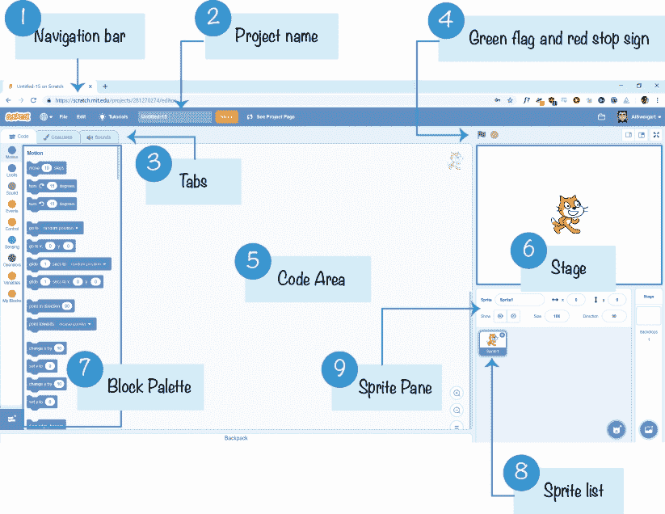Scratch 中最基本的对象是 *sprite* 。精灵出现在舞台 6 上，它们的代码块控制它们的行为。编辑器自动为所有新项目启动一个猫精灵，但是你可以删除它或者添加更多的精灵。您可以通过向屏幕右侧的代码区 5 添加代码块来编写精灵。在 Scratch 中，一堆代码块被称为一个*脚本*。

编辑器顶部的文本字段包含项目名称 2 。在您使用描述性名称命名您的项目后，请记住偶尔通过单击导航栏**文件 u 立即保存**来保存您的项目，以避免在浏览器崩溃时丢失您的工作。

你可以从中间的代码块面板 7 访问代码块。在块面板的顶部是九类代码块:*动作*、*表情*、*声音*、*事件*、*控制*、*传感*、*操作符*、*变量*、*我的块*。每个代码块属于一个类别，并且是该类别的颜色。例如，`say`区块来自紫色*外观*类别。有无限的代码块可供使用；只需将它们从块调色板拖到代码区域。

每个精灵都有自己的脚本。当你点击精灵列表 8 中的精灵时，该精灵的脚本将显示在代码区，其属性将显示在精灵窗格 9 中。选择脚本选项卡 3 显示代码区。当分别选择“服装”和“声音”选项卡时，代码区域将被“绘画编辑器”和“声音编辑器”替换。

点击绿色标志将启动你的程序，点击红色停止标志将停止它。

## 绘画编辑器

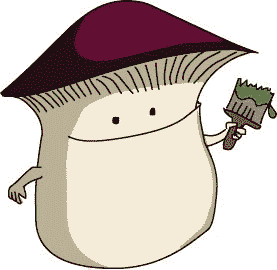有几种方法可以让精灵进入你的程序。你可以使用 Scratch 自带的精灵，从你的电脑上传精灵，或者绘制自己的精灵。如果你想自己画，可以用 Scratch 的画图编辑器。

绘画编辑器类似于其他绘画程序，如 Microsoft Paint 或 Paintbrush。要绘制新的精灵，点击*新精灵*旁边的**画笔**按钮。您可以通过切换到众多服装中的一种来改变精灵的外观。要为精灵创建新的服装，点击**服装**选项卡，然后点击*新服装*旁边的**画笔**按钮。

画图编辑器的主要部分有

*   绘图工具，您可以使用左侧的按钮进行选择
*   画布，你画图像的地方
*   服装中心，用十字符号表示服装的中心
*   线宽选择器，用于设置绘图工具的宽度
*   颜色选择器，用于改变绘图工具的颜色
*   用于放大或缩小画布的缩放按钮
*   “撤销”和“重做”按钮，可以帮助您纠正错误

绘制编辑器如下所示:

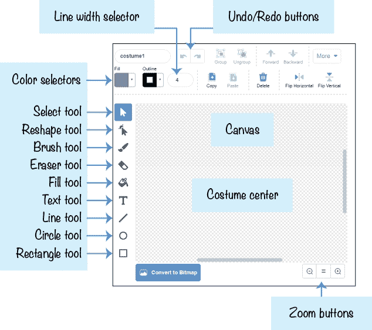通过单击绘图工具按钮并在画布上拖动鼠标来体验画图编辑器，看看这些工具是如何工作的。使用颜色选择器和线宽选择器更改绘图工具的颜色和宽度。然后，用笔刷工具在服装上画一些线条。如果出现错误，请点按顶部的“撤销”按钮。

精灵服装列表在绘图工具左侧的列中。如果您想将服装保存为图像文件，右键单击服装并选择**导出**。

## 使用代码块

在开始编程之前，最好先了解一下代码块在编辑器中是如何组合在一起的。在本书中，您将了解每个代码块的作用。

### 添加块

要创建新的代码块，请将其从中心块调色板拖到代码区域。顶部有凹口、底部有凸起的代码块称为*栈*块。要将一个堆栈块与另一个堆栈块捕捉在一起，请将该堆栈块拖到另一个堆栈块的底部附近。当灰色背景出现时，放下块以将其连接到堆栈。

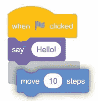堆叠块也可以放入块之间。仔细观察脚本中灰色背景出现的位置:这是块将被捕捉到的位置。下图显示了一个`wait` `1` `seconds`块被移动到脚本中间:

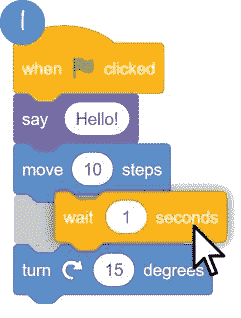您可以通过单击白色区域并输入新的输入来更改块内的白色字段。

圆形块被称为*报告子*块。他们适合白色的领域。例如，在下图中，绿色的`pick` `random` `1` `to` `10`块适合白色区域。当报告模块的*左边缘*位于白色区域上方时，白色区域周围出现白色轮廓。如果左边缘不在白色区域上，白色轮廓就不会出现，记者区块也不能放在里面。

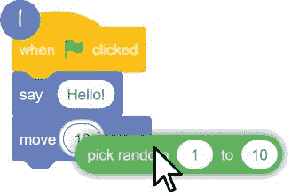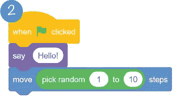### 删除块

要删除块，请将它们拖出脚本。如果您删除一个堆栈块，您也将删除连接在它下面的堆栈块，如下图所示。如果您想将其中一些块重新连接到脚本，您可能需要将这些块放在一边。将您要删除的块拖到块调色板上，以将其从舞台中删除。需要时，您可以随时从块选项板添加更多块。

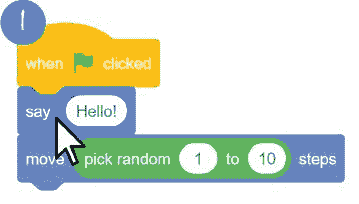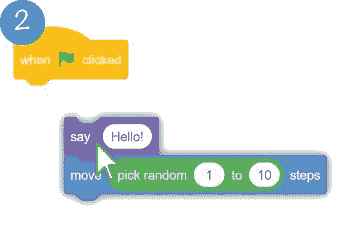你也可以右击一个块，并从出现的菜单中选择**删除块**。如果您不小心删除了一些块，您可以通过从导航栏中选择**编辑恢复**来恢复它们。

## 运行程序

通过将块从块调色板拖到代码区域来创建以下程序:

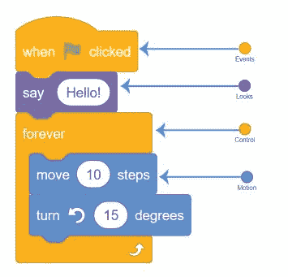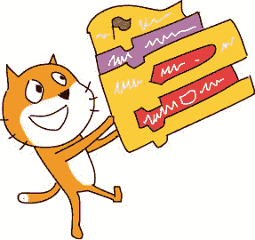当您点击舞台顶部的绿色旗帜时，此程序将启动。程序从顶层块(`when` `green` `flag` `clicked`)开始，然后运行脚本中的下一个代码块。在本例中，精灵上方出现一个语音气泡，显示单词“Hello！”在`forever`循环中，精灵向前移动 10 步，然后逆时针旋转 15 度。当程序到达最后一个块时，它*循环*回到顶部。`forever`块中的所有块将永远循环运行。只有当你点击红色停止标志时，程序才会停止。

您也可以通过单击来运行脚本或块。但是点击绿色标志是启动程序的正常方式。

程序中可以有任意多的精灵和代码块。在您创建本书中的编程项目时，您将了解 Scratch 的许多不同类型的代码块。

## 展示你的程序

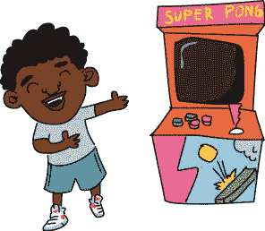当您登录到您的 Scratch 帐户时，单击编辑器右上角的**共享**按钮，让其他 Scratchers 看到您的程序。他们可以玩你的游戏并发表评论。如果 Scratchers 喜欢玩游戏，他们可以喜欢和喜爱你的程序。

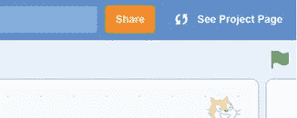一旦您完成了一个项目，您也可以将它添加到 Scratch Programming Playground studio。这个工作室以你和其他读者所做的项目为特色。一旦你在 Scratch 上分享了你的项目，复制网址并进入位于[https://inventwithscratch.com/studio/](https://inventwithscratch.com/studio/)的工作室页面。点击**添加项目**按钮，将网址粘贴到文本栏中，点击**通过网址添加**。现在，其他读者将能够在工作室中查看您的游戏！

如果你觉得你的游戏不够好，也不用担心。每个人都从简单的游戏开始他们的编码之旅。Scratch 网站上的大多数人也是初学者。数以千万计的人在 Scratch 网站上分享了他们的程序，所以如果你的程序没有得到很多浏览，也不要担心。网站上有这么多游戏，很难找到。

## 获得帮助

成为一名超级程序员并不意味着知道所有的答案；而是知道如何找到答案。你可以遵循本书中的项目步骤，但是你可能会有自己的问题。

### 教程窗口

草稿编辑器的顶部是教程菜单按钮。点按此按钮以调出“教程”窗口，该窗口包含几个临时视频教程的链接。

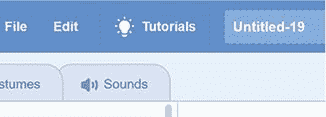### “查看内部”按钮

您可以通过查看其他 Scratchers 的代码来学习许多新技术。在 Scratch 网站上找到你喜欢的项目，然后点击**查看内部**按钮。

你可以复制和修改，或者*重新混合*，其他 Scratchers 的代码。网站上所有的 Scratch 程序都是在 Creative Commons 许可下自动发布的，所以你不需要征得原创者的同意，只要你给他们信用就行。Scratchers 经常将彼此的程序重新混合，以创建自己的版本。

还需要帮助，想和其他挠痒者聊聊？点击 https://scratch.mit.edu/[主页底部的**论坛**链接，访问论坛。](https://scratch.mit.edu/)

## 摘要

Scratch editor 是一款极具潜力的创意工具。你会在 Scratch 网站上看到各种各样的 Scratch 项目:游戏、卡通、模拟和信息演示幻灯片。

现在，您已经知道如何访问 Scratch 网站、创建帐户、使用 Scratch 和 Paint 编辑器，以及将代码块整合到脚本中，您已经准备好按照本书剩余部分中的逐步说明进行操作。如果您需要帮助，请务必使用 Scratch 编辑器中的教程窗口和 Scratch 网站上的论坛来找到您需要的答案。

让我们开始创建您的第一个 Scratch 程序吧！