# 2 条彩虹线。。。在太空！

> 原文：<https://inventwithscratch.com/book3/chapter2.html>

 在这一章中，你将创建一个看起来很酷的动画:一条彩虹 *V* 在太空中飞行并留下彩色的轨迹。这个程序的灵感来自于 *demoscene* ，这是一个精英程序员的亚文化，他们从 20 世纪 80 年代开始制作令人惊叹的图形程序。

演示者制作了美丽精致的程序，叫做*演示*，展示他们的艺术、音乐和编程技能。但是最令人惊奇的是，这些程序非常小，只有几千字节。我们将要编写的程序并不那么小，但是它生动而丰富多彩，并且只使用了几行代码。

在开始编码之前，请看下图，看看最终的程序会是什么样子。然后，去[https://www.nostarch.com/scratch3playground/](https://www.nostarch.com/scratch3playground/)播放动画。

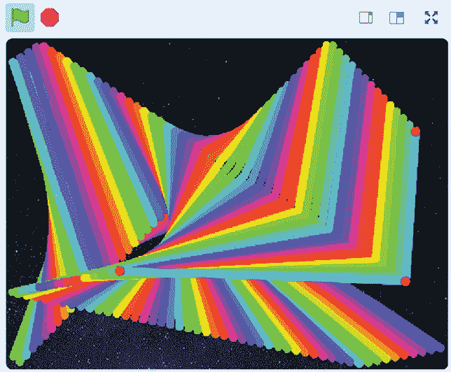就像 demosceners 一样，可以做出漂亮的程序。让我们在 Scratch 中创建我们自己的图形演示。

## 勾画出设计草图

把一个想法变成草稿的第一步是勾画出你想要的样子。规划你的程序有助于你找出你想要的精灵，以及他们会如何表现。我建议把你的想法画在纸上，这样如果你不喜欢就可以把它们划掉，并写下笔记和提醒。也最好保持项目简单。

当你完成了你的简单游戏，你可以在它的基础上增加复杂性，这就是迭代开发背后的想法。首先，你让程序工作。然后，你把程序做得更好。你可以在完成基本程序后再添加一些很酷的东西。

不要担心让草图看起来漂亮。对计划的主要部分有一个可靠的计划更重要。在我的草图中，我有三个部分:A、B 和 c。我们将一次处理一个部分，直到我们完成完整的程序。

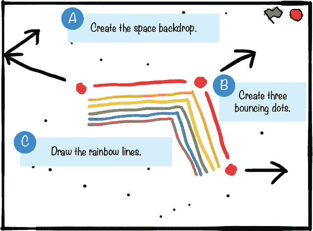在你完成了你希望你的程序做什么的草图之后，你就可以开始编程了。去[https://scratch.mit.edu/](https://scratch.mit.edu/)，在网站上注册一个账户(如果你还没有的话)，然后登录(拥有一个账户可以让你在 Scratch 网站上保存你的程序)。登录后，点击屏幕顶部的**创建**按钮，开始创建自己的 Scratch 项目。然后，点击顶部的文本字段，将项目名称从*无标题*更改为*彩虹线*。让我们从草图的 A 部分开始。

##  创造空间天幕

首先，让我们清理我们不会使用的精灵并设置一个背景。

### 1.打扫干净，准备好舞台

每次创建新的 Scratch 项目时，您都会在空白的白色舞台上看到一个橙色的猫精灵。我们的程序不需要猫精灵，所以右键单击精灵列表中的`Sprite1`猫，或者选择**删除**将猫从舞台和精灵列表中删除，或者单击精灵旁边的垃圾桶图标。

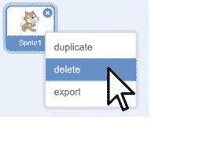在*新建背景*下点击**选择背景**按钮(看起来像山水画)。

背景库窗口将打开，并按字母顺序显示所有背景。点击**星星**背景。

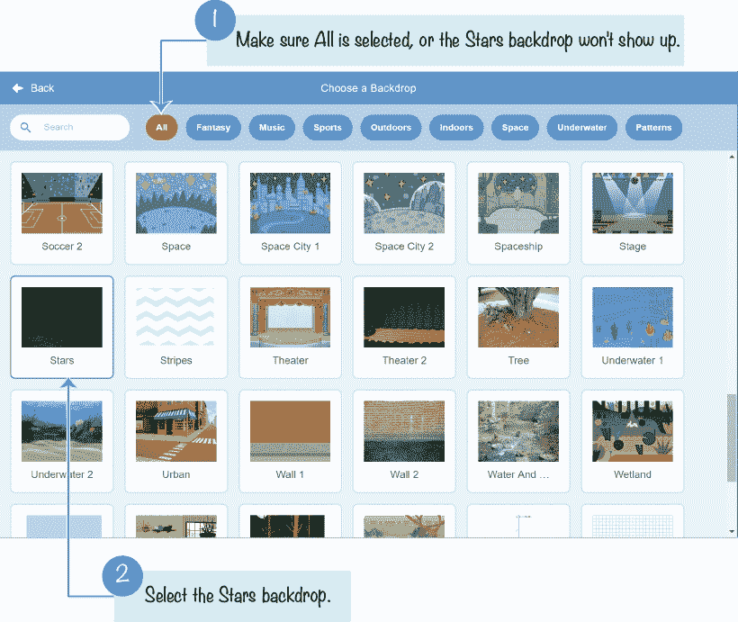现在舞台的背景看起来像外太空。

##  创建三个跳跃点

接下来，我们将添加三个新精灵，代表飞行的三个点 *V* 。

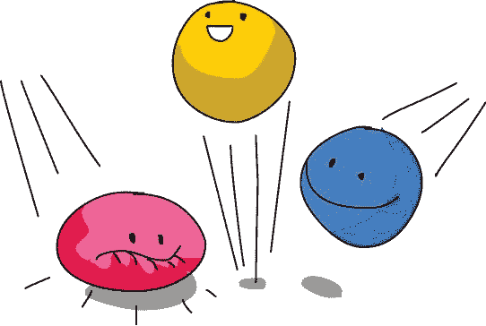### 2.画点

点击**绘制**按钮(看起来像画笔)。

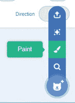在精灵列表中创建了一个名为`Sprite1`的新精灵。单击该按钮还会将编辑器切换到包含绘画编辑器的“服装”选项卡。在绘制编辑器中，使用笔刷工具在十字准线附近绘制一个小红点。在“绘制编辑器”中单击“缩放”按钮(看起来像一个放大镜)可能有助于放大。

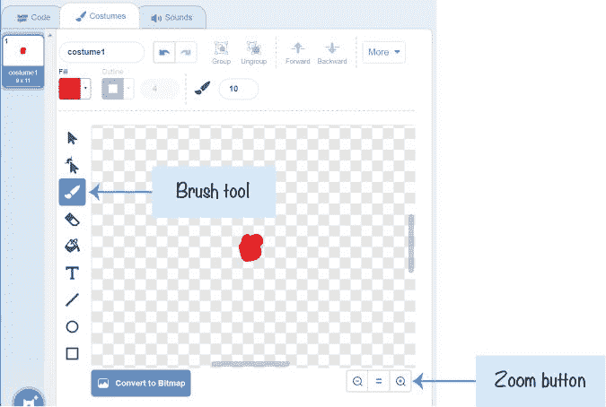在精灵列表上方的精灵窗格中，将精灵的名称从`Sprite1`更改为`Dot` `1`。

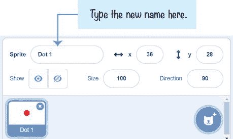### 3.为点 1 精灵添加代码

现在我们可以开始编程了。点击**脚本**选项卡，使代码区域可见。将以下代码添加到代码区域。你可以在*事件*(黄色)*动作*(深蓝色)*操作符*(绿色)*控制*(浅橙色)类别中找到这些区块。如果你不明白如何拖动这些方块，请在[https://www.nostarch.com/scratch3playground/](https://www.nostarch.com/scratch3playground/)观看动画。

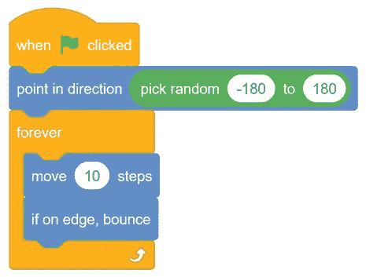当您单击绿色标志时，`Dot` `1`精灵会指向–180 到 180 度之间的任意方向。然后，`forever`循环将精灵向前移动 10 步，并使精灵在碰到舞台边缘时反弹。精灵将永远继续这样做。

注意到`Dot` `1`精灵还没有画任何彩虹线。当我们创建了更多精灵后，我们会这样做。

* * *

## 探索:方向和程度

像*向上*或*向右*这样的词被像你我这样的人类完全理解为方向。但是计算机需要一个数字来指示准确的方向。Scratch 中的所有精灵都有自己的方向号。方向编号在 180 度和 180 度之间。指向 0 度是朝上的。指向 90 度是面向右边。下图显示了几个方向及其度数。请注意，度数沿顺时针方向增加，沿逆时针方向减少。另外，请注意 180 度和 180 度指向同一个方向:向下。

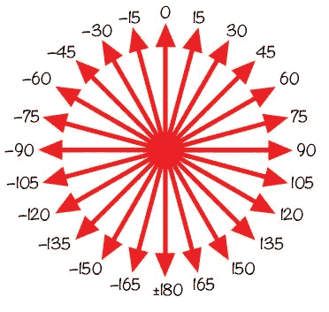`pick``random``-180``to``180`块选择一个随机数作为方向使用。然后，`point``in``direction`块将雪碧指向那个方向。这意味着精灵可以指向任何可能的方向。

让我们写一个新的脚本来演示学位是如何工作的。在你的网页浏览器中按下 ctrl -T 打开一个新的标签页，然后到【https://scratch.mit.edu/】T2 打开一个新的草稿编辑器。您可以同时编辑多个暂存程序。

在名为 `Sprite1` 的猫精灵的代码区域中，使用来自*事件*(黄色)、*控制*(浅橙色)、*动作*(深蓝色)和*外观*(紫色)类别的块添加以下代码。请记住，我们正在编写一个完全独立于*彩虹线*程序的程序。

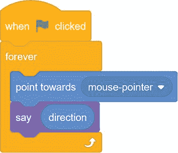当你运行这个程序时，猫精灵指向鼠标。猫会说出它所指的方向。

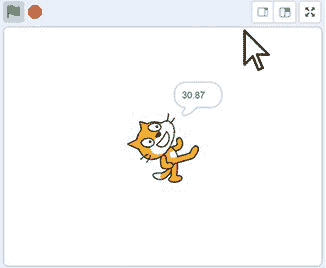请注意，方向编号会随着猫的方向变化而变化..

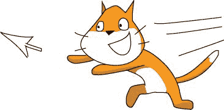* * * img/img/### 4.复制点 1 精灵

右键点击精灵列表中的`Dot` `1`精灵，选择**复制**。这样做两次，这样你就做了两个副本:`Dot` `2`和`Dot` `3`。(Scratch 自动用递增的数字给精灵命名。)

* * *

## 保存点

单击绿色标志来测试到目前为止的代码。检查这三个点是否都在舞台上移动和跳动。当你复制精灵时，你也复制了精灵代码。点击红色停止标志并保存您的程序。

* * *

##  画出彩虹线条

现在我们已经创建了所有的跳跃点，我们可以创建第四个点精灵来绘制彩虹线。我们将编写一个程序，使这个绘图点在三个跳跃点精灵之间快速移动，在移动的同时绘制一条线。这个过程会重复三次，然后 10 秒钟后，屏幕会清空。

### 5.添加绘图点精灵的代码

该项目使用 *Pen* 代码块，默认情况下不包含在块调色板中。您必须点击编辑器左下角的**添加扩展**按钮，并在出现的窗口中选择**笔**。

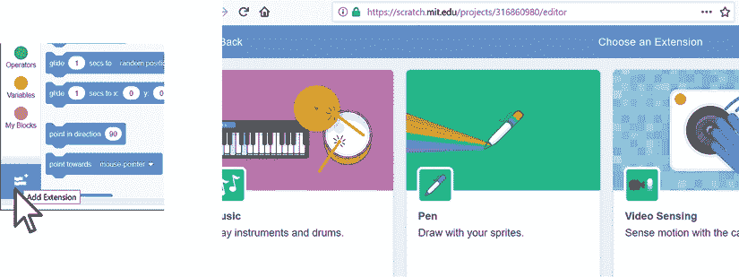右键单击其中一个弹跳点精灵，选择**复制**。因为这是弹跳点的副本，所以我们需要删除一些代码。在其代码区域中，通过将`when` `green` `flag` `clicked`块(及其下面的所有块)拖到编辑器中间的块调色板中来删除所有代码块，在那里它们将消失。

在精灵窗格中，将这个精灵重命名为`Drawing` `Dot`。

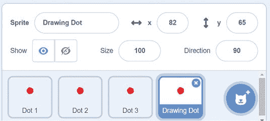将以下两个脚本添加到`Drawing` `Dot` sprite 中。你可以在*事件*(黄色)、*笔*(清晰)、*控制*(浅橙色)、以及*动作*(深蓝色)类别中找到这些区块。记住， *Pen* 代码块只有在您点击了 Add Extension 按钮并选择了 Pen 时才会出现。

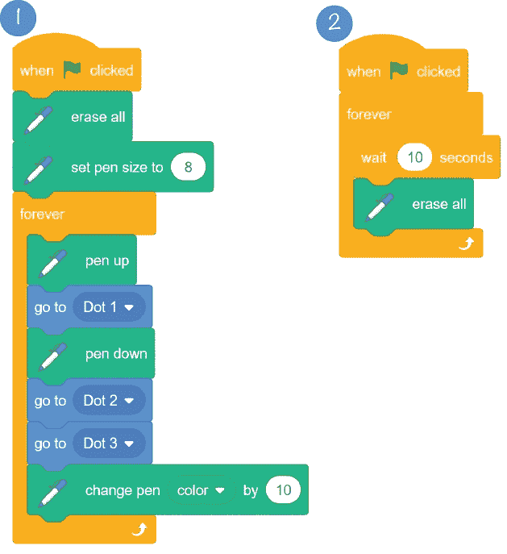在脚本 1 中，确保使用`go` `to`块，而不是`go` `to` `x` `y`块。另外，一定要改变`go` `to`块，这样它们就不会指向鼠标指针。为此，单击块上的白色三角形，并从菜单中选择一个精灵。

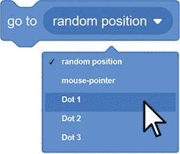在运行代码之前，让我们讨论一下它是如何工作的。当您单击脚本 1 中的绿色标志时，`Drawing` `Dot`精灵会运行`erase all`块来清除舞台上已有的任何钢笔绘图。然后，脚本运行`pen` `down`块:当精灵四处移动时，它在舞台上画一条线。

为了更好地理解`pen` `down`块的作用，想象当你绕着它走的时候，按住地板上的一个巨大的标记:标记会在地板上画一条线跟着你！画图圆点到`Dot`T3，放下笔，到`Dot`T5，再到`Dot`T7。接下来，`change` `pen` `color` `by` `10`块稍微改变一下钢笔的颜色。(您可以增加该数值，使颜色变化更快。)同时，`Dot` `1`、`Dot` `2`和`Dot` `3`小精灵继续自行移动。所以`Drawing` `Dot`精灵画的 *V* 线也是四处移动的。

脚本 2 更容易理解。该代码等待 10 秒钟，然后清除屏幕上任何由*笔*模块做出的标记。现在舞台不会因为彩虹线而变得拥挤不堪。

* * *

## 保存点

单击绿色标志来测试到目前为止的代码。你应该会看到一道飞舞的彩虹穿过舞台。然后，每隔 10 秒钟，彩虹就会消失。点击红色停止标志并保存您的程序。

* * *

## 完整的程序

这里显示了整个程序的最终代码。请注意，`Dot` `1`、`Dot` `2`和`Dot` `3`精灵的代码是相同的。如果您的程序运行不正常，请对照以下代码检查您的代码:

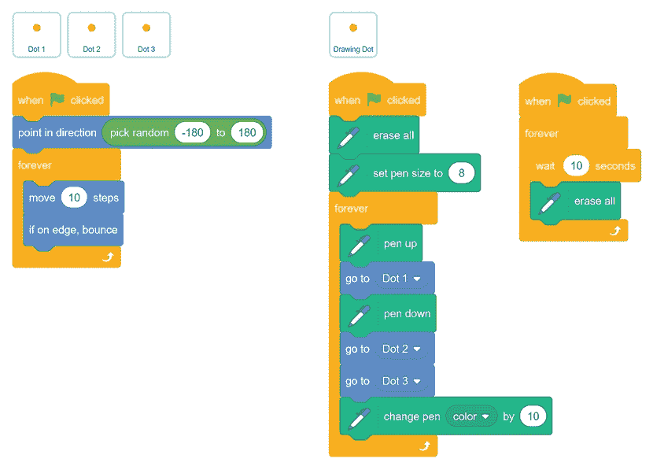## 涡轮模式

如果在点击绿色标志的同时按住 shift ，则可以在加速模式下启动程序。计算机通常能够快速运行代码块，但是将精灵绘制到屏幕上的程序会降低计算机的速度。在 Turbo 模式下，Scratch 不是在每个代码块后绘制屏幕，而是在几个代码块后才绘制屏幕。人眼不会注意到跳过的绘图，程序看起来会运行得更快。

shift-点击绿色标志，在加速模式下运行*彩虹线*程序。几乎是瞬间，屏幕就填满了。要结束涡轮模式，shift-再次点击绿色标志。

## 总结

在本章中，您构建了一个

*   拥有您创建的自定义精灵(即使它们只是点)
*   使用`pick` `random`块将精灵指向随机方向
*   使精灵在舞台边缘移动和反弹
*   复制精灵及其代码
*   使用*笔*块绘制彩虹线

这个项目是一个演示，用户可以观看，但不能控制。在第三章中，你将制作一个迷宫游戏，让玩家通过键盘与程序互动。这将是书中第一个真正的游戏项目。

* * *

## 复习问题

试着回答下面的练习题来测试你学到了什么。您可能不会马上知道所有的答案，但是您可以探索 Scratch 编辑器来找出答案。(答案也在[http://www.nostarch.com/scratch3playground/](http://www.nostarch.com/scratch3playground/)在线。)

1.  当一个精灵运行完 `pen` `down` 街区后移动会发生什么？
2.  如果一些代码移动了一个精灵，但是在它后面没有画线，是什么导致了这个问题？
3.  哪个区块导致*彩虹线*程序中的线看起来像彩虹？
4.  你用哪个代码块让彩虹线变粗？
5.  你如何打开涡轮模式？你怎么关掉它？
6.  如何复制一个精灵和它的代码块？
7.  当精灵的方向是 90 度时，它指向哪里？
8.  向上指的度数方向是什么？
9.  你希望一个精灵指向下方并朝那个方向移动。您会在哪个颜色的块类别中找到代码块来完成此任务？
10.  如何从 Scratch 的背景库中选择新的背景？
11.  你会在精灵列表中看到一个名为`Sprite1`的精灵。你如何给这个精灵重新命名？

* * * img/img/