# 3 迷宫赛跑者

> 原文：<https://inventwithscratch.com/book3/chapter3.html>

 你可能以前玩过迷宫游戏，但你有没有尝试过制作一个呢？迷宫可能很难完成，但是很容易编程。在这一章中，你将创建一个游戏，让玩家引导一只猫通过迷宫到达它的目标——一个美味的苹果！您将学习如何用键盘移动猫，以及如何用墙壁阻止它前进。

在你开始编码之前，看一下最终的程序。前往[https://nostarch.com/scratch3playground/](https://nostarch.com/scratch3playground/)玩游戏。

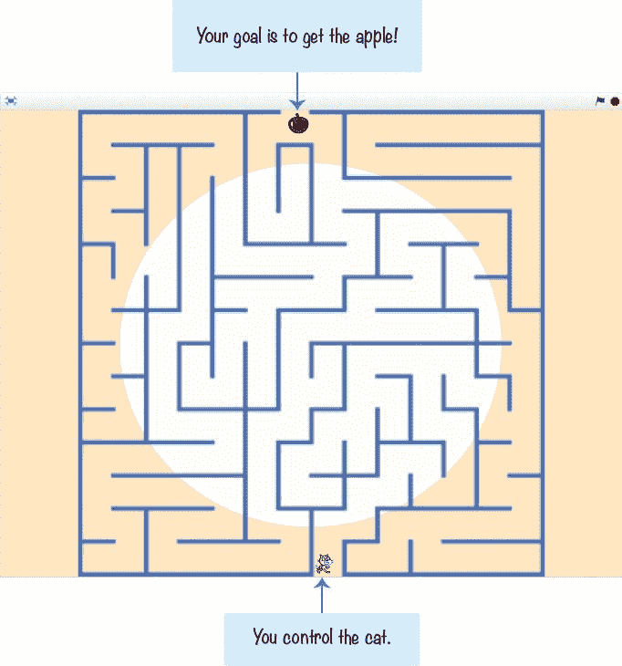## 勾画出设计草图

首先，在纸上画出你想要游戏的样子。通过一些计划，你可以使你的迷宫游戏迷宫化。(我从不为我的双关语道歉。)我的迷宫游戏草图看起来像下图。

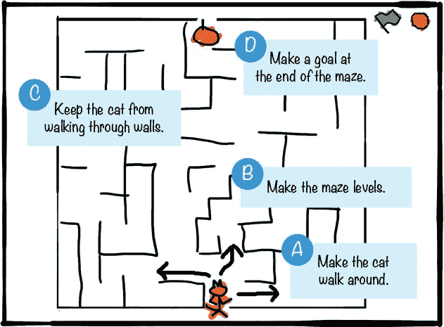如果想节省时间，可以从资源 ZIP 文件中的骨架项目文件开始，名为 *maze-skeleton.sb3* 。这个文件已经设置了项目的一部分，只需要添加代码块。到 https://nostarch.com/scratch3playground/[的](https://nostarch.com/scratch3playground/)，右键点击链接，选择**将链接另存为**或**将目标另存为**，将 ZIP 文件下载到你的电脑上。从 ZIP 文件中提取所有文件。骨架项目文件已经加载了所有的精灵，所以您只需要将代码块拖动到每个精灵中。在 Scratch editor 中点击**FileLoad from your computer**加载 *maze-skeleton .sb3* 文件。

即使不使用 skeleton 项目，也应该从网站下载 ZIP 文件。这个文件包含了你将在本章中用到的迷宫图片。

如果你想自己创建一切，点击**文件新建**开始一个新的 Scratch 项目。在左上角的文本字段中，将项目从无标题的*重命名为*迷宫赛跑者*。*

##  让猫到处走

在*迷宫跑者*游戏中，玩家将控制猫精灵。在 A 部分中，您将设置代码用键盘上的箭头键来控制猫。

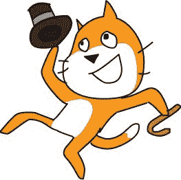img/* * *

## 探索:X 和 Y 坐标

为了让猫在舞台上四处移动，你需要使用坐标。*坐标*是表示精确位置的数字。x 坐标(也称为 *x 位置*)是一个表示精灵在舞台上向左或向右多远的数字。换句话说， *x* 是精灵的*水平*位置。y 坐标(也称为 *y 位置*)是一个数字，表示精灵在舞台上的上下位置。y 坐标是精灵的垂直位置。

x 坐标和 y 坐标一起使用，表示精灵在舞台上的精确位置。x 坐标总是在最前面，坐标之间用逗号分隔。例如，x 坐标为 42，y 坐标为 100，如下所示:(42，100)。

在载物台的中央是一个标记为(0，0)的点，称为*原点*。在下图中，我使用的是临时背景库中的 xy 网格背景。(要加载 xy 网格背景，点击右下角的**选择背景**按钮并选择背景。)我添加了几个猫精灵，它们都在说它们的 x 坐标和 y 坐标。

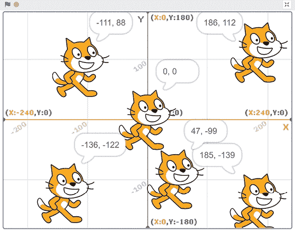舞台最右侧的 x 坐标为 240。越向左，x 坐标越小。在中心，x 坐标为 0。在中心的左边，x 坐标变成负数。舞台最左侧的 x 坐标为 240。y 坐标的工作方式相同:舞台顶部的 y 坐标为 180，中心为 0，底部为 180。

Scratch 在精灵列表的右上角显示当前选定精灵的 x 和 y 坐标。当您更改精灵的 x 和 y 坐标时，它们会在舞台上四处移动，如下所示:

| 让一个精灵走。。。 | **改变其。。。** | **由一个……。** |
| --- | --- | --- |
| 对吧 | 横坐标 | 正数 |
| 左边的 | 横坐标 | 负数 |
| 起来 | 纵座标 | 正数 |
| 向下 | 纵座标 | 负数 |

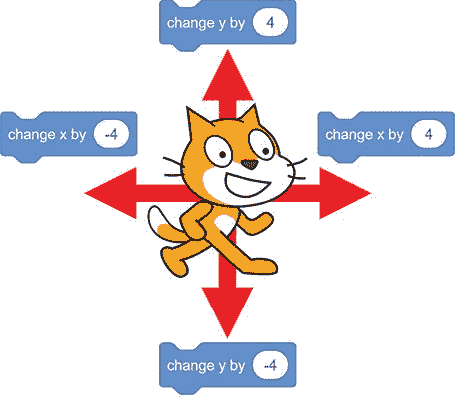深蓝色*运动*类别中的许多块，如`change``x``by`和`change``y``by`块，都会改变一个 sprite 的 x 和 y 位置。请注意，用负数改变坐标等同于从中减去正数。

* * * img/img/### 1.向播放器精灵添加运动代码

您将添加的第一段代码将使箭头键移动名为`Sprite1`的猫精灵。但是首先，点击并重命名这个精灵`Orange` `Cat`。然后添加以下代码。你会在*事件*、*控制*、*感应*和*运动*类别中找到这些方块。

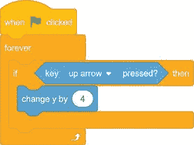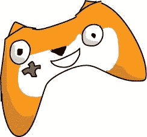该代码反复检查按键是否被按下。代码字面意思是“永远，检查是否按下了向上箭头键，如果是，那么用`4`改变 y。”如果没有按下向上箭头键，Scratch 会跳过`if` `then`块中的代码。

按向上箭头键使猫精灵向上移动。`forever`循环块意味着 Scratch 会反复检查向上箭头键是否被按下。这种情况一直持续到你点击红色停止标志。

这个程序需要使用`forever`块。如果没有它，Scratch 将只检查一次*如果向上箭头键被按下的话*。然后程序将结束。但是您希望 Scratch 继续检查向上箭头键是否被按下，以便游戏不会结束，猫可以得到苹果。如果你的程序没有做任何事情，确保你没有忘记添加`forever`块。

当你自己编写代码时，一定要使用`change` `y` `by`代码块，而不是`change` `x` `by`或`set` `y` `to`代码块。如果你的程序不能正常工作，检查你的代码是否与本书中的代码相同。

* * *

## 保存点

点击绿色旗帜，并尝试通过按向上箭头键移动猫。然后点击红色停止标志，保存你的程序。

* * *

### 2.复制猫精灵的运动代码

现在，您将为其他三个箭头键添加代码:向下、向左和向右。这段代码类似于向上移动猫精灵的代码。为了节省时间，您可以右键单击或长按`orange` `if` `then`块并选择**复制**来创建块的副本。这些块是相同的，所以你需要改变的只是其他方向的深蓝色*运动*块。复制块通常比从块调色板中拖动新块要快。

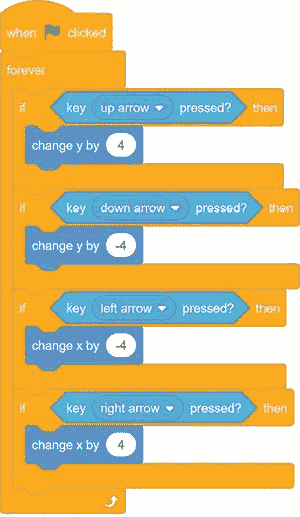Scratch 现在将检查四个箭头键是否被按下，一个接一个。检查右箭头键后，Scratch 从循环的顶部开始，并再次检查上箭头键。计算机检查它们的速度如此之快，以至于在人眼看来，好像所有的箭头键都在同时被检查！

* * *

## 保存点

单击绿色标志来测试到目前为止的代码。当你按下箭头键时，猫应该向上、向下、向左和向右走。注意`Orange` `Cat`足够小，可以放入您接下来要创建的迷宫中。点击红色停止标志并保存您的程序。

如果您的程序不工作，并且您不知道如何修复它，您可以通过使用 *maze-part-a.sb3* Scratch 项目文件重新开始，该文件位于资源 ZIP 文件中。在草稿编辑器中点击**文件从你的电脑**加载 **来加载 *maze-part-a.sb3* 文件，然后进入 b 部分**

* * *

##  制造迷宫关卡

接下来，我们将创建迷宫精灵并设置背景。如果迷宫游戏只有一个迷宫，它会很快变得无聊，所以我们还会在游戏中增加多个关卡。

### 3.下载迷宫图片

你可以自己绘制迷宫精灵，但是让我们使用 ZIP 文件中的图片。迷宫图像之一是*迷宫. sprite3* 文件。

在 Scratch 编辑器中，单击**上传精灵**按钮，该按钮在您点击或悬停在**选择精灵**按钮(看起来像一张脸)并选择 *Maze.sprite3* 上传文件后出现。这创建了一个名为`Maze`的新精灵，它有几个迷宫服装。Scratch 中的每个精灵都可以有多种服装来改变它的外观。点击**服装**标签可以看到这些服装，它们通常被用来制作精灵的动画。

你的精灵列表应该是这样的:

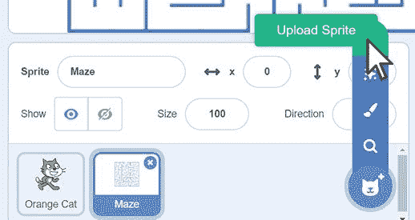### 4.改变背景

让我们通过在背景中放置一些艺术品来给迷宫增添一点趣味。你可以使用任何你喜欢的背景。单击右下角的**选择背景**按钮打开临时背景库窗口，更改舞台的背景。选择背景(我选择了光线)。

### 5.从第一个迷宫开始

将以下代码添加到`Maze` sprite 中。你可以在*事件*、*表情*和*动作*类别中找到这些方块。

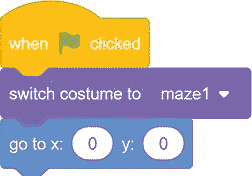每个精灵的服装都将是一个新的关卡。当玩家点击绿色旗帜开始程序时，游戏应该从第一件服装开始，并确保迷宫在舞台的中央。我们将在步骤 8 和 9 中添加切换到下一个级别的代码。

请注意，代码区域显示了所选精灵的代码块。确保在精灵列表中选择了`Maze`精灵；否则，您将把迷宫的代码添加到不同的精灵中。每个精灵都需要自己的代码才能正常工作。如果在`switch` `costume` `to`区块中没有看到`maze1`，那么`Orange` `Cat`雪碧最有可能被选中。

如果您的 Scratch 程序不工作并且您不知道如何修复它，您可以通过使用 *maze-part-b.sb3* Scratch 项目文件重新开始，该文件位于资源 ZIP 文件中。在草稿编辑器中点击**文件从你的电脑加载**来加载*迷宫-b 部分. sb3* 文件，然后进入 c 部分

##  不让猫穿墙而过

当你现在点击绿色旗帜，你将能够移动猫通过迷宫。但是你也可以移动猫穿过迷宫的墙壁，因为程序中没有任何东西阻止这种事情发生。代码只说明，“当按下右箭头键时，向右移动猫。”不管有没有墙，猫都会动。

### 6.检查猫是否正在触摸墙壁

让我们添加代码来检查猫是否正在触摸一堵蓝色的墙。如果是，那只猫应该退后。因此，如果猫向右移动并碰到一面墙，它应该会自动向左移动。这将取消玩家的移动，并防止猫穿过墙壁。点击精灵列表中的`Orange` `Cat`精灵，修改代码如下。注意，我们使用的是`touching?`块，而不是`touching` `color?`块。

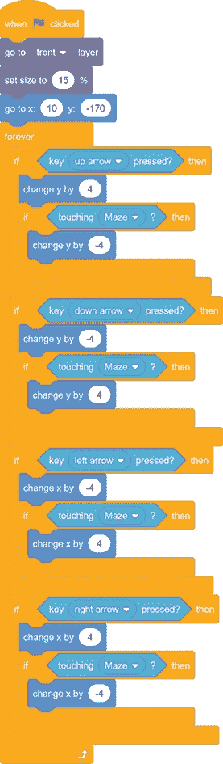此外，你可能已经注意到，与迷宫相比，`Orange` `Cat`精灵是哥斯拉大小的，使得猫看起来不真实。从*外观*类别中添加一个`set` `size`块，使`Orange` `Cat`精灵变小。您还希望`Orange` `Cat`精灵总是显示在迷宫的顶部，所以您将添加`go` `to` `front` `layer`块。将这两个代码块放在脚本的顶部。

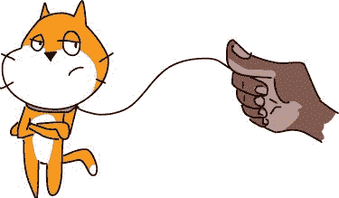img/* * *

## 保存点

单击绿色标志来测试到目前为止的代码。确保`Orange` `Cat`精灵不能穿过迷宫墙壁。对所有四个方向进行测试。然后点击红色停止标志，保存你的程序。

如果您的 Scratch 程序不工作并且您不知道如何修复它，您可以通过使用 *maze-part-c.sb3* Scratch 项目文件重新开始，该文件位于资源 ZIP 文件中。在草稿编辑器中点击**File u Load from your computer**加载 *maze-part-c.sb3* 文件，然后进入 d 部分

* * *

##  在迷宫的尽头做一个目标

现在，还不清楚玩家应该在迷宫中的什么地方结束。让我们在迷宫的另一端加上一个苹果，让玩家的目标更加明显。

### 7。创建苹果精灵

点击**选择一个精灵**按钮。当精灵库窗口出现时，选择**苹果**向精灵列表添加一个名为`Apple`的新精灵。

当游戏开始时，你希望`Apple`精灵移动到舞台顶部迷宫的尽头。这个`Apple`精灵还必须足够小，以适应迷宫。将下面的代码添加到`Apple`精灵中:

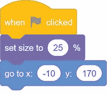### 8.检测玩家何时到达苹果

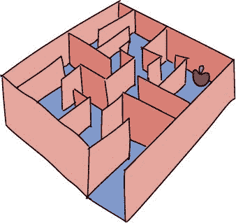*迷宫赛跑者*游戏为玩家、迷宫和迷宫尽头的苹果准备了一个精灵。现在它只需要代码来检测玩家何时到达终点。当这种情况发生时，你将让 Scratch 播放一种声音，然后将服装交换到下一关。但是在添加代码之前，需要加载`Cheer`声音。在精灵列表中选择`Orange` `Cat`。单击块调色板顶部的**声音**选项卡，然后单击左下角的**选择声音**按钮。这个按钮看起来像一个扬声器。

在出现的声音库窗口中，选择`Cheer`载入`Cheer`声音。现在点击**代码**标签。

`broadcast`块使匹配的`when` `I` `receive`块下的脚本运行。将此脚本添加到`Orange` `Cat` sprite 的代码中:

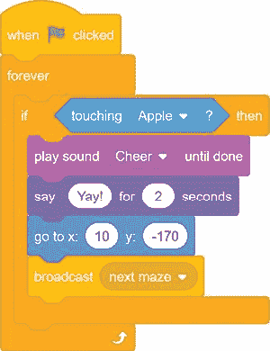要使`broadcast`块广播`next` `maze`消息，点击`broadcast`块中的白色三角形，选择**新消息**。

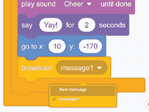在出现的窗口中，键入 *next maze* 作为消息名称，并点击 **OK** 。

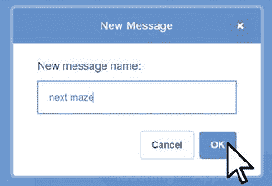### 9。将广播处理代码添加到迷宫精灵

单击精灵列表中的`Maze`精灵，并向其添加以下代码:

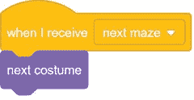该代码在接收到`next` `maze`广播时改变迷宫等级。

* * *

## 保存点

单击绿色标志来测试到目前为止的代码。尝试玩完整的游戏。确保猫碰到苹果时，关卡会切换到下一个迷宫。然后点击红色停止标志，保存你的程序。

* * *

## 完整的程序

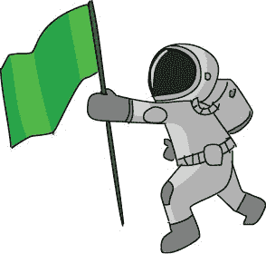下面的代码显示了整个程序。如果你的程序不能正常工作，对照完整的代码检查你的代码。完整的程序也在资源 ZIP 文件中，名为 *maze .sb3* 文件。

我希望这个迷宫程序的代码不会太复杂。

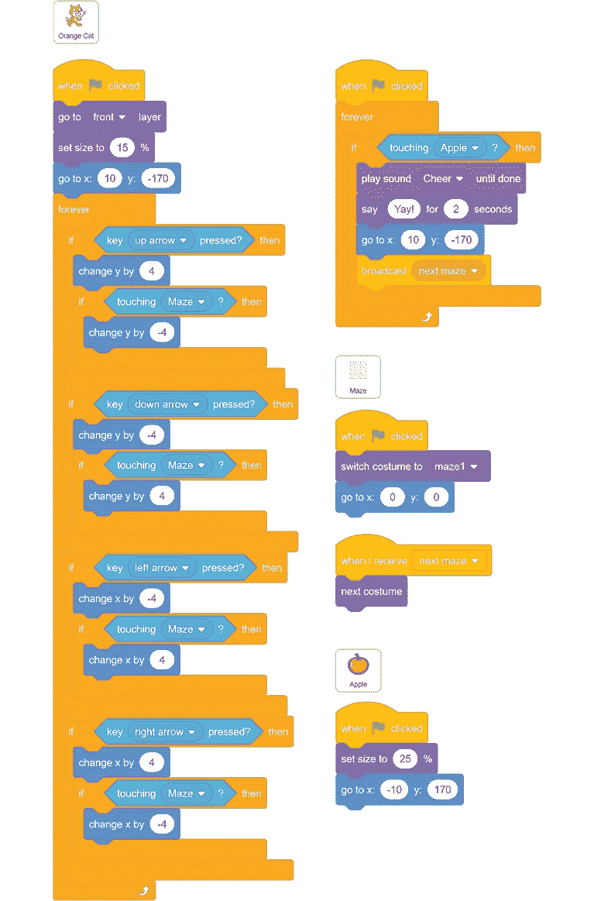## 2.0 版本:双人模式

既然基本的迷宫游戏已经运行了，你可以做一些迭代开发，一次添加一个小的改进。迭代开发可以帮助你避免做一个太大而你无法完成的游戏。

在*迷宫赛跑者*的 2.0 版本中，你将添加第二个玩家。这两个运动员将进行比赛。第一个玩家从底部开始，跑到顶部；第二个玩家从顶部跑到底部。因为它们都必须经过相同的路径，所以两者的距离是相同的。

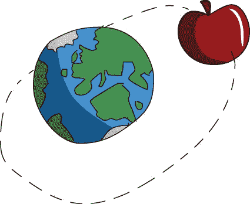### 复制苹果雪碧

第二个球员也需要进球。右键单击或长按`Apple`精灵并选择**复制**来复制`Apple`精灵及其代码。新的精灵被自动命名为`Apple2`。选择一个`pple2`精灵，点击**服装**标签。选择绿色填充颜色，然后选择右边的**填充**工具(看起来像一个倾斜的杯子)。然后点按苹果的红色部分，将其更改为绿色。当你完成后，`Apple2`将看起来如下图所示。

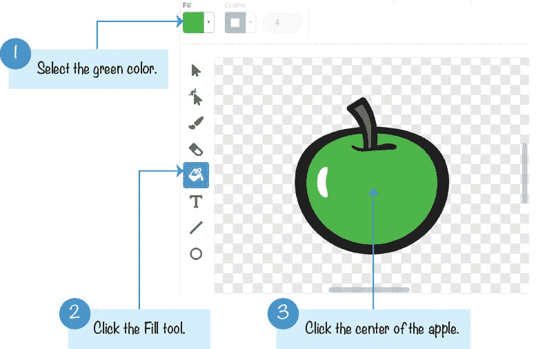### 修改苹果 2 精灵的代码

你需要修改`Apple2`精灵的代码，看起来像下面的代码，这样青苹果就从迷宫的底部开始，而不是顶部:

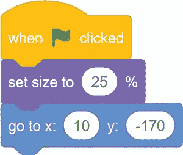### 复制橘猫雪碧

现在让我们添加第二个猫精灵。右键或长按`Orange` `Cat`精灵，从菜单中选择**复制**，复制`Orange` `Cat`及其代码。新的精灵被自动命名为`Orange` `Cat2`。`Orange` `Cat`和`Orange` `Cat2`精灵需要看起来足够不同，玩家才能区分它们。与您对`Apple2`所做的类似，点击**服装**选项卡，将`Orange` `Cat2`从橙色改为蓝色。

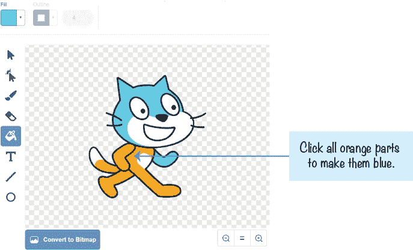在精灵窗格中，将`Orange` `Cat2`重命名为`Blue` `Cat`。

### 修改蓝猫精灵的代码

现在`Blue` `Cat`精灵和`Orange` `Cat`精灵有相同的代码。你需要修改代码；否则，箭头键将控制玩家 1 和玩家 2。第二个玩家将使用 WASD 键(发音为 *whaz-dee* )控制`Blue`精灵。W、A、S 和 D 键通常用作上、左、下和右箭头键的左手版本。

将两个`go` `to` `x` `y`块和`Blue` `Cat`的`key` `pressed?`块修改成如下代码所示。还有，记得把`if` `touching` `Apple`改成`if` `touching` `Apple2`。

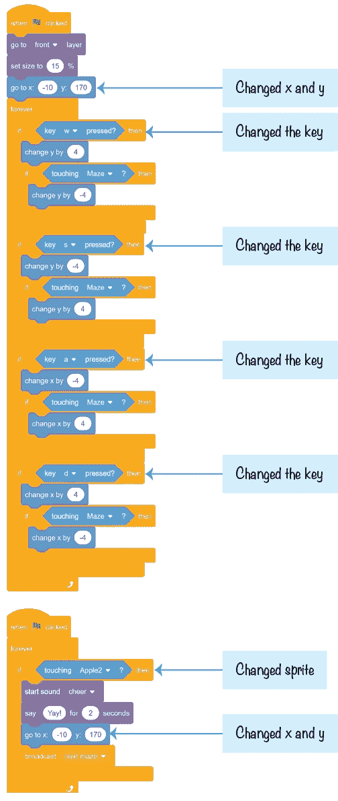### 回到起始位置

当小精灵碰到苹果时，它们会回到它们的起始位置，但是当另一只猫赢了的时候，它们也需要回到那里。将以下脚本添加到`Orange` `Cat` sprite 中:

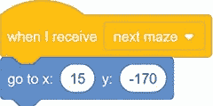然后将以下脚本添加到`Blue` `Cat` sprite 中:

这样，当另一只猫获胜并广播`next` `maze`消息时，两只猫都将回到它们的起始位置。

* * *

## 保存点

单击绿色标志来测试到目前为止的代码。尝试使用箭头键和 WASD 键移动两个球员。确保八个键中的每一个都移动正确的猫，并且只移动那只猫。尝试玩完整游戏。确保当第二个玩家碰到青苹果时，关卡会切换到下一个迷宫。确保在下一关开始时，双方都被送到起点。点击红色停止标志并保存您的程序。

* * *

您刚刚升级了迷宫游戏，可以支持两个玩家。找个朋友赛跑。玩家 1 使用箭头键，玩家 2 使用 WASD 键。

## 作弊模式:穿墙而过

传送是一个很酷的欺骗，但是玩家不能控制他们传送到哪里。此外，如果一个玩家突然穿过舞台和许多墙壁，那就太明显了，他在作弊。然而，你可以添加一个更微妙的欺骗，当按下一个特殊的键时，让猫穿过墙壁。

### 将穿墙代码添加到 Orange Cat

对于`Orange` `Cat`精灵，修改行走代码，使`touching` `Maze?`块被替换为`touching` `Maze?`和`not` `key` `l` `pressed?`块。这里只显示了向上箭头的代码，但是您可能想要替换所有四个`if` `key` `pressed`案例中的`touching` `Maze?`块。

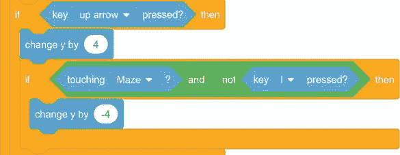只有当 L 键是*而不是*被按下时，才能启用墙阻挡代码。如果 L 键*被按下*，这个堵墙代码被跳过，玩家穿过墙。

### 将穿墙代码添加到蓝猫中

对`Blue` `Cat`精灵进行同样的穿墙代码修改，除了将`key` `l` `pressed`改为`key` `q` `pressed`。当 Q 键被按住时，第二个玩家可以穿墙。

* * *

## 保存点

单击绿色标志来测试到目前为止的代码。试着按住 L 或 Q 键穿过墙壁。确保两只猫都能穿墙，但前提是按下正确的键。点击红色停止标志并保存您的程序。

有了程序中的这个作弊代码，你就可以黑掉游戏，让你的猫穿墙而过。这个骗局向你展示了在你的 Scratch 程序中一切皆有可能。

* * * img/img/## 摘要

在本章中，您构建了一个游戏

*   有一个猫精灵，当玩家按下某些键时，它可以上下左右走动
*   有精灵无法穿过的墙
*   从一个精灵广播另一个精灵可以接收的消息
*   有一个迷宫精灵，有八种不同的服装
*   支持两个玩家使用不同的键盘按键
*   包括让猫穿墙的欺骗模式

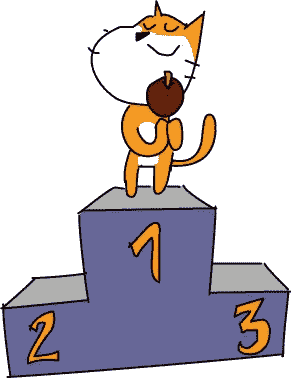双人游戏比单人游戏更刺激。现在，你不是在解决一个迷宫，而是在和另一个玩家比赛！你可以向别人炫耀你的刮刮乐。

在第 4 章中，你将使用一个篮球游戏。这个游戏使用侧视图，不像迷宫的鸟瞰图。但这意味着你将能够添加跳跃和重力，这是在许多类型的刮刮乐游戏中使用的伟大技术。

* * *

## 复习问题

试着回答下面的练习题来测试你学到了什么。您可能不会马上知道所有的答案，但是您可以探索 Scratch 编辑器来找出答案。(答案也在[https://nostarch.com/scratch3playground/](https://nostarch.com/scratch3playground/)在线。)

1.  哪个区块会改变精灵的大小？
2.  一个 sprite 中的代码如何向另一个 sprite 发送消息以执行某项操作？
3.  你如何使用键盘上的 WASD 键？
4.  如何将一些代码块从一个精灵复制到另一个精灵？
5.  如果你不小心使用了一个`change``y``by`代码块而不是一个`change``x``by`代码块会发生什么？
6.  如果你想让一个 sprite 播放`Cheer`声音，如何加载这个声音？
7.  看看下面的代码。它让玩家按下箭头键来左右移动精灵。这是可行的，但是你会改变什么来让精灵走得更快呢？

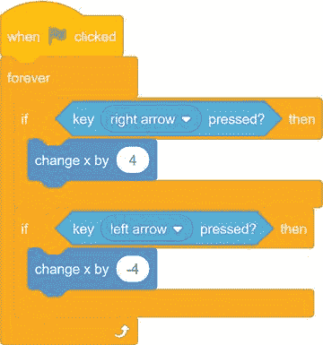* * * img/img/