# 4 个重力投篮

> 原文：<https://inventwithscratch.com/book3/chapter4.html>

 任何一款平台游戏，比如*《超级马里奥兄弟》**《刺猬索尼克》*，都是从侧面展现动作，地面在屏幕底部，人物出现在侧面。这些游戏有*重力*:人物可以跳起来，然后落下，直到落地。在这一章中，我们将编写一个有重力的篮球游戏。球员会跳起来扔一个篮球，篮球球员和球会掉到地上。

在你开始编码之前，先看看在 https://nostarch.com/scratch3playground/的最终程序。

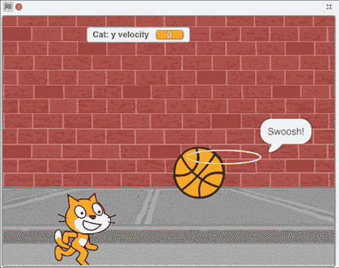## 勾画出设计草图

首先，让我们勾画出我们希望游戏做什么。玩家控制猫，猫可以左右移动和跳跃。目标是让猫把球投进一个移动的篮球框，篮球框会在舞台上随机滑行。

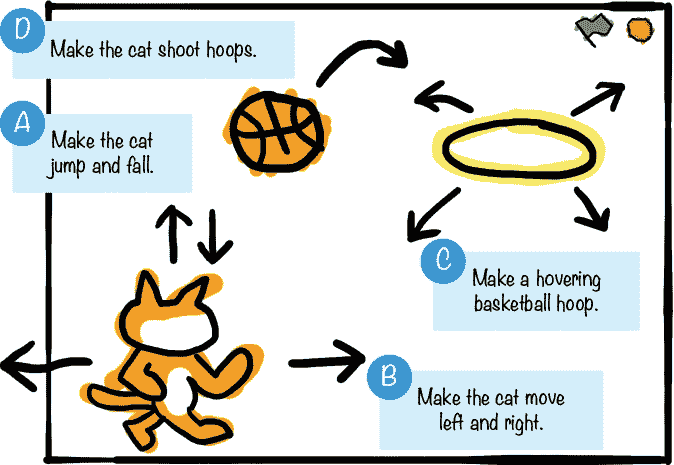如果你想节省时间，你可以从资源 ZIP 文件中的名为 *basketball-skeleton.sb3* 的骨架项目文件开始。进入[https://nostarch.com/scratch3playground/](https://nostarch.com/scratch3playground/)，右键点击链接，选择**将链接另存为**或**将目标另存为**，将 ZIP 文件下载到你的电脑上。从 ZIP 文件中提取所有文件。骨架项目文件已经加载了所有的精灵，所以您只需要将代码块拖动到每个精灵中。

##  使猫跳落

让我们从增加重力让猫跳起来再跳下来开始。

### 1.将重力代码添加到猫精灵

在精灵列表中将`Sprite1`精灵重命名为`Cat`。然后在 Scratch 编辑器顶部的文本字段中，将程序从无标题的*重命名为*篮球*。*

点击右下角的**选择背景**按钮，打开背景库窗口。选择**墙 1** 改变背景。舞台将会是这样的:

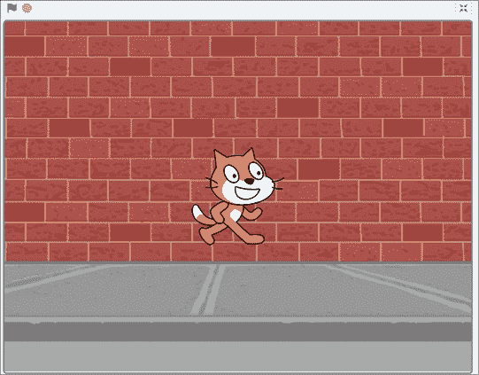编程重力需要*个变量*。您可以将变量视为一个存储数字或文本的盒子，您可以在程序中稍后使用这些数字或文本。我们将创建一个变量，其中包含一个表示猫下落速度的数字。

首先，确保在精灵列表中选择了`Cat`精灵；然后单击脚本选项卡。在橙色的*变量*类别中，点击**制作变量**按钮，调出新变量窗口。输入`y` `velocity`作为变量名。(*速度*表示某物的速度和方向。当`y` `velocity`为正数时，猫向上移动。当`y` `velocity`为负数时，猫向下移动。)确保此精灵的**仅**被选中。(如果您只看到所有精灵的**，则舞台被选中，而不是`Cat`精灵。)然后点击**确定**。**

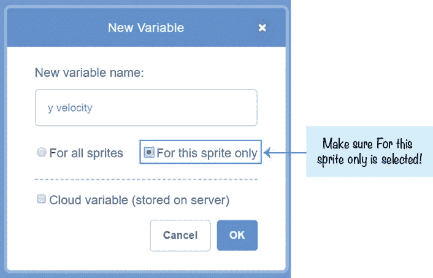几个新块将出现在*变量*类别中，其中之一是圆形`y` `velocity`变量块。

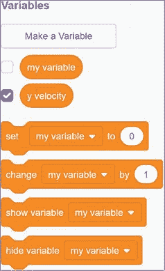img/* * *

## 探索:针对所有精灵与仅针对此精灵

当你创建`y` ``velocity`变量时，你只需要为这个精灵选择**。这个选项创建了一个只有`Cat`精灵可以使用的*变量。所有精灵的**选项将创建一个所有精灵都可以使用的变量。*****`

 `**要确定您创建的变量的种类，请选中块调板中圆形变量块旁边的框，使变量出现在舞台上。如果只为这个精灵选择了**，精灵名称将显示在变量名的前面。但是如果你为所有的精灵选择了**，那么只会显示变量名。****

 **如果你犯了一个错误，精灵名称`Cat`没有出现在你程序中变量名的开头，右击橙色*变量*类别中的**y**T5】速度块，并选择**从菜单中删除“y 速度”变量**。然后再次创建`y velocity`变量，确保只为这个精灵选择**。**

 **与任何可变块一样，您可以将`y` `velocity`块放在您通常会输入数字或一些文本的任何地方。代码块将使用变量中设置的数字或文本。当你使用变量时，你的程序可以在运行时改变变量的编号或文本*。*

* * *******` img/img/`******要在变量中输入一个值，可以使用橙色的`set` `to`块。例如，如果您创建了一个变量`greeting`，您可以使用`set` `to`将值`Hello!`放入其中。然后，您可以在`say`块中使用`greeting`，这与输入`Hello!`是一样的。(不要在你的 *Basketball* 程序中添加这些块或者创建一个`greeting`变量；这只是一个例子。)

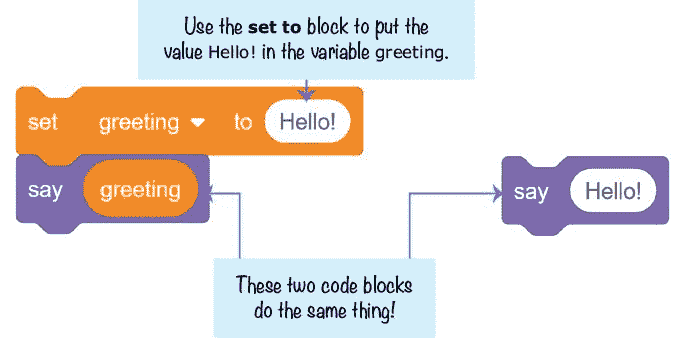使用该变量可以让`say`块在程序运行时改变其文本。如果你想在程序运行时改变问候文本，你可以在你的程序中添加另一个`set` `to`模块。如果变量包含一个数字，您可以使用`change` `by`块增加或减少这个数字。

重力使物体*加速*向下。在游戏中，`Cat`精灵要向下移动，它向下移动的速度必须在程序运行时改变*。将下面的代码添加到`Cat` sprite 中，将 gravity 添加到 Scratch 程序中。这是让精灵在重力作用下下落所需的最少代码。你可以将这段代码添加到任何 sprite 中，让它倒下。*

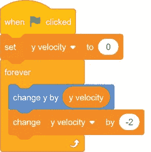当你点击绿色标志时，`y` `velocity`变量被设置为`0`，脚本进入`forever`循环。`Cat`子画面的 y 位置(垂直位置)由`y` `velocity`改变，`y` `velocity`由`-2`改变。随着程序循环的进行，y 位置会越来越快的变化，使得猫下落的速度越来越快。

* * *

## 保存点

在您单击绿色标志之前，请将`Cat`精灵拖到舞台的顶部。当你点击绿色标志时，注意猫开始下落。如果你想让猫再次坠落，点击红色停止标志，将`Cat`精灵移回舞台顶部，再次点击绿色旗帜。保存您的程序。

* * *

### 2。添加地面代码

现在，猫掉下来了。但我们希望猫落地时停下来。让我们继续添加`Cat`精灵的代码，使它看起来像这样:

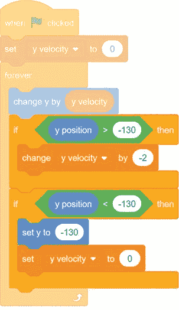在这段代码中，我们将地平面的`y` `position`设置为`-130`。如果`Cat`精灵的 y 位置大于(高于)地平面，那么`y` `velocity`被`-2`改变，`Cat`精灵将下落。最终，`Cat`精灵将越过`-130`，其 y 位置将低于`-130`地平面。当这种情况发生时，`Cat`子画面将复位到`-130`的地电平，并且`y` `velocity`将返回到`0`以阻止子画面下落。

* * *

## 保存点

单击绿色标志来测试到目前为止的代码。用鼠标把猫拖上来，然后放开。确保猫落在地上，但不会越过舞台边缘。您可以通过将`-` `130`更改为另一个数字来试验不同的地电平。然后点击红色停止标志，保存你的程序。

* * * img/img/当您完成程序测试后，通过取消选中橙色*数据*类别中的`y` `velocity`变量旁边的复选框，使其在舞台上不可见。

### 3.将跳转代码添加到猫精灵中

给`Cat` sprite 添加重力代码后，让猫跳起来就容易了。将这段代码添加到`Cat` sprite 中:

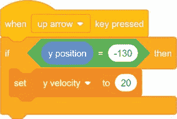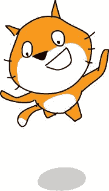现在当你按向上箭头键时，`y` `velocity`被设置为正数`20`，使得`Cat`精灵跳起来。但是`y` `velocity`变量仍然会在每次循环运行时被`-2`改变。所以虽然猫一开始跳了 20，但是下一次通过循环时，它会跳到 18，然后是 16，以此类推。注意`if` `then`模块检查`Cat`精灵是否在地面上。如果猫已经在半空中了，你不应该让它跳起来！

当`y` `velocity`设置为`0`时，`Cat`精灵处于跳跃的顶点。然后`y` `velocity`通过循环每次改变`-2`，并且`Cat`精灵继续下落直到它落地。尝试对`set` `y` `velocity` `to`和`change` `y` `velocity` `by`块使用不同的数字。弄清楚如何让猫跳得更高或更低(但总是在地面以上)或让重力更强或更弱。

* * *

## 保存点

单击绿色标志来测试到目前为止的代码。按向上箭头键，并确保猫跳起来，并下降回来。然后点击红色停止标志，保存你的程序。

* * * img/img/##  使猫左右移动

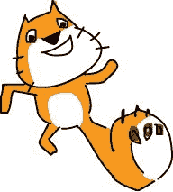接下来我们添加`Cat` sprite 的行走代码，这样玩家就可以用键盘控制猫了。

### 4.将行走代码添加到猫精灵

将以下代码添加到`Cat` sprite 代码的底部:

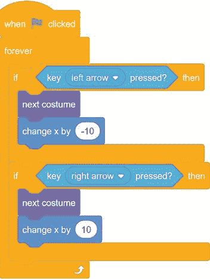在`forever`循环中，程序检查左箭头键或右箭头键是否被按下。如果按下其中一个箭头，`Cat`精灵会切换到下一个服装，并通过`-10`(向左移动)或`10`(向右移动)改变其 x 位置。`Cat`精灵有两种服装，你可以通过点击区块调色板上方的服装标签来查看。通过使用`next` `costume`块在两种服装之间切换，您可以使它看起来像猫在走路。

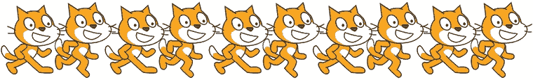img/* * *

## 保存点

单击绿色标志来测试到目前为止的代码。按下左右箭头键，确保猫在正确的方向移动。如果猫向左移动时向后走也没关系——这就是我们想要的。然后点击红色停止标志，保存你的程序。

* * *

##  做一个悬停的篮球框

现在`Cat`精灵完成了，让我们继续游戏中的下一个精灵:篮球框。

### 5.创建环形精灵

点击**绘制**按钮，该按钮在你点击或者悬停在**选择一个精灵**按钮上之后出现。绘制工具按钮将出现在绘制编辑器的左侧。选择黄色，使用圆形工具画一个环。您也可以在填充和轮廓颜色框旁边的文本栏中更改宽度，使圆的线条变粗。确保绘制编辑器的十字光标位于环的中心。

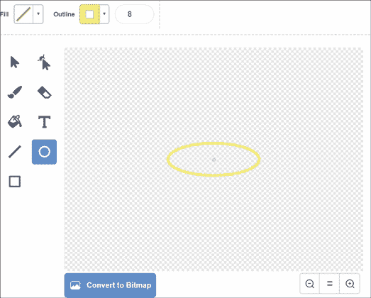在精灵窗格中重命名精灵`Hoop`。我们希望`Hoop` sprite 在玩家投篮时发出欢呼的声音，所以接下来让我们加载`Cheer`声音。单击块调色板顶部的**声音**选项卡，然后单击左下角的**选择声音**按钮。当声音库窗口打开时，选择`Cheer`。

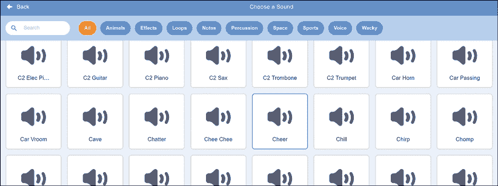现在，`Cheer`声音将作为一个选项出现在你将添加到`Hoop`精灵的`start` `sound`模块中。

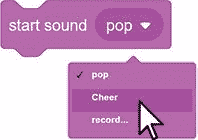将以下代码添加到`Hoop` sprite 中，使其在舞台的上半部分随机滑动。您需要通过点击`when` `I` `receive`块的白色三角形并选择**新消息**来创建广播消息。将新的广播消息命名为`swoosh`。

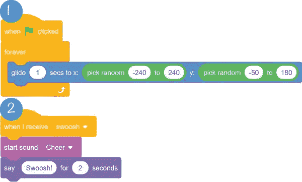脚本 1 让铁环每秒滑动到一个新的位置。一个移动的铁环会让游戏更有挑战性！脚本 2 播放`Cheer`声音并显示“哗哗！”接收到`swoosh`广播时。稍后，我们将让`Basketball`精灵在篮子制作完成时广播这条消息。

### 6.创建 Hitbox Sprite

现在让我们考虑如何创建代码来决定球员是否投篮。我们可以写一个程序来检查篮球是否只是简单地接触了篮圈。但是如果我们这样做了，仅仅是篮球的边缘接触到篮筐就会被算作一个篮子。我们希望只有当篮球穿过篮圈中间时，篮筐才算数。我们必须想出一个更好的解决办法。

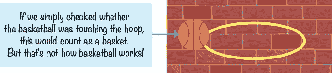相反，你可以创建一个*点击框*。击中框是一个游戏设计术语，指的是一个矩形区域，用于确定两个游戏对象是否相互碰撞。我们要做一个 hitbox 雪碧。点击**绘制**按钮创建一个新的精灵，点击或悬停在**选择精灵**按钮后会出现这个按钮。使用矩形工具并选择实心填充选项，在十字光标中间绘制一个黑色小方块。重命名这个精灵`Hitbox`。这个`Hitbox`精灵看起来像这样:

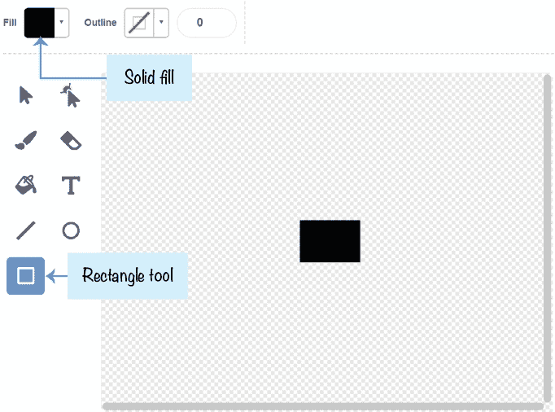将以下代码添加到`Hitbox` sprite 中:

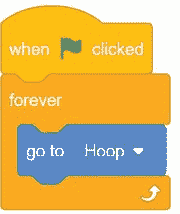`Hitbox`精灵现在将跟随`Hoop`精灵，无论它滑行到哪里。

在第 9 步中，我们将编写一个程序，确保只有当篮球接触到`Hitbox`精灵，而不是`Hoop`精灵时，一个篮子才算数。篮球必须更靠近篮圈的中间才能算作一个篮子！

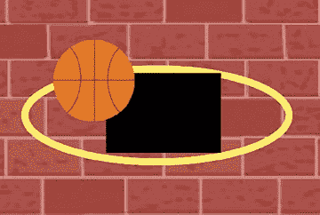在`Hoop`精灵中间看到一个黑色方块看起来很奇怪，所以让我们把`Hitbox`精灵隐藏起来。将`set` `ghost` `effect`块(最初在块调色板中显示为**设置颜色效果**，但可以将“颜色”改为“鬼影”)添加到`Hitbox` sprite 中，并设置为`100`。

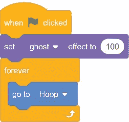`hide`挡和`set` `ghost` `effect` `to` `100`挡是有区别的。如果你使用`hide`方块使`Hitbox`精灵不可见，触摸方块将永远不会检测到球正在触摸`Hitbox`精灵，玩家将永远无法得分。`set` `ghost` `effect` `to` `100`块使精灵对你不可见，但仍允许触摸块检测到`Hitbox`精灵的存在。

* * *

## 保存点

单击绿色标志来测试到目前为止的代码。确保环在舞台周围滑动，并且 hitbox 矩形总是在它的中间。然后点击红色停止标志，保存你的程序。

* * *

##  逗猫射铁环

接下来，您将添加一个篮球供猫投掷。和猫一样，篮球也会有重力码，掉到地上。

### 7.创造篮球精灵

点击右下角的**选择精灵**按钮，打开精灵库窗口。选择**篮球**雪碧。

接下来，点击块面板顶部的**声音**标签。然后点击左下方的**选择声音**按钮，打开声音库窗口。选择`Pop`声音。单击块面板顶部的**脚本**选项卡，返回代码区域。

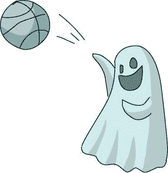现在转到橙色*变量*类别。你会制造两个变量。点击**制作变量**按钮。将变量命名为`y` `velocity`，并确保在点击**确定**之前，仅选择此精灵的**。因为它们是这个 sprite 唯一的变量**，所以`Basketball` sprite 的`y` `velocity`变量与`Cat` sprite 的`y` `velocity`变量是分开的。尽管它们有相同的名字，但它们是两个不同的变量。****

 **再次点击**制作变量**按钮，制作另一个名为`Player` `1` `Score`的变量，但这次为所有精灵选择**。(我们将`Player` `1` `Score`大写，因为我们会让它在舞台上可见。取消选中`y` `velocity`旁边的框，将其隐藏在舞台上。)新的变量块应该出现在橙色的*变量*类别中。**

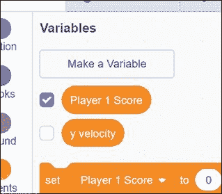### 8.添加篮球精灵的代码

在添加了`pop`声音和两个变量之后，将下面的代码添加到`Basketball` sprite 中。

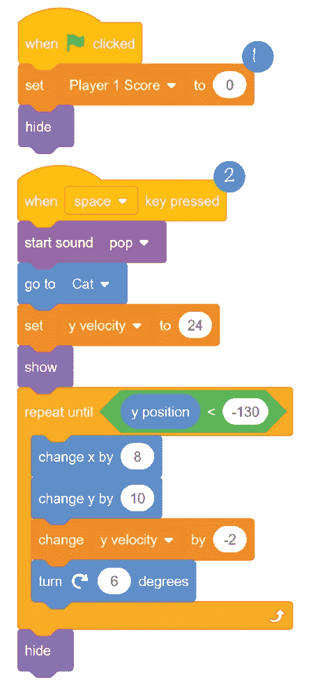脚本 1 确保玩家从 0 分开始，并隐藏`Basketball`精灵开始。

脚本 2 使用类似于`Cat`精灵代码的代码。当玩家按空格键时，篮球出现在猫面前，并开始向前移动。代码将`Basketball` sprite 的`y` `velocity`变量设置为正数，就像猫跳的时候`Cat` sprite 的`y` `velocity`变量如何设置为正数一样；猫就是这样扔球的。

`repeat` `until` `y` `position` `<` `-130`挡将保持`Basketball`精灵下落，直至落地。当它到达地面时，篮球将被隐藏，直到玩家下一次按空格键。

* * *

## 保存点

单击绿色标志来测试到目前为止的代码。按空格键让猫扔篮球。确保篮球接触地面时消失。然后点击红色停止标志，保存你的程序。

* * *

### 9.检测是否制作了篮子

接下来，您将添加检查`Basketball` sprite 是否接触到`Hitbox` sprite 的代码。这就是你如何知道一个篮子是否已经做好，如果已经做好，`Player` `1` `Score`变量应该增加。然而，有一个障碍:如果篮球穿过篮圈，篮子就不算数。

请记住，如果`y` `velocity`变量为正，则`change` `y` `by` `y` `velocity`块将向上移动`Basketball`精灵。如果`y` `velocity`是`0`，那么`Basketball`精灵不会上下移动。但如果`y` `velocity`是负数，那么`Basketball` sprite 是下降的。

因此，您将在`Basketball`精灵的代码中添加另一个`if` `then`条件。只有当篮球碰到 hitbox(使用`touching` `Hitbox?`块)并向下移动*(`y``velocity``<``0`)时，你才会增加分数。*

 *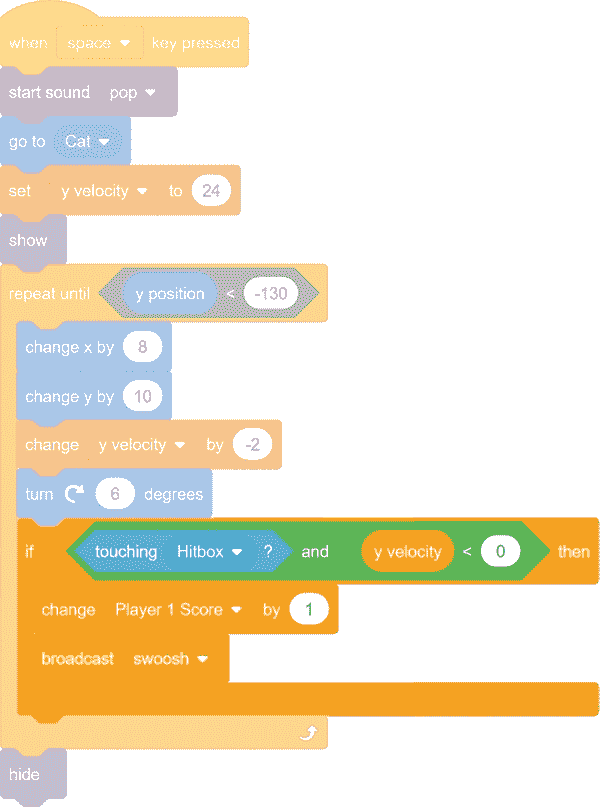`and`块结合了两个条件。对于 Scratch 来说，要运行`if` `then`块内的代码块，*这两个*条件都必须为真。对于小于`0`的`y` `velocity`变量来说，sprite 接触到`Hitbox` sprite *或*是不够的。`touching` `Hitbox?` *和* `y` `velocity` `<` `0`都必须为真，玩家才能得分。如果这些条件为真，则`Player` `1` `Score`变量增加`1`，并广播`swoosh`消息。

* * *

## 保存点

单击绿色标志来测试到目前为止的代码。投篮。`Player` `1` `Score`变量只有在篮球接触到篮圈中心并向下移动时才会增加。当这种情况发生时，`Hoop` sprite 也应该说 *swoosh* 并播放`Cheer`声音。点击红色停止标志并保存您的程序。

* * * img/img/### 10.修复评分错误

你有没有注意到`Player` `1` `Score`单个篮筐增加几个点？这是一个 *bug* ，是一个让程序以一种意想不到的方式运行的问题。我们需要仔细查看代码，找出发生这种情况的原因。

`repeat` `until`循环块一直循环，直到球落地，所以所有这些代码都是针对单次投掷的。`repeat` `until`循环块检查几次`Basketball`子画面是否接触到`Hitbox`子画面并落下。`Player` `1` `Score`值应该只在第一次增加。

您可以通过创建一个新的变量来跟踪篮球第一次接触篮筐的时间，从而修复这个错误。然后你可以确保玩家每次投掷只能得一分。

点击块调色板中橙色的*变量*类别，然后点击**生成变量**。将变量命名为`made` `basket`并选择**仅用于此精灵**。然后修改`Basketball`的精灵代码。

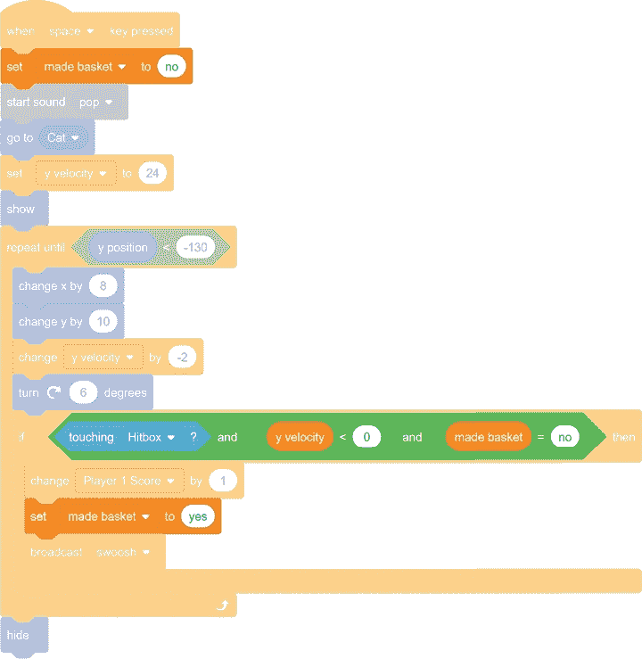当玩家第一次按空格键时，`made` `basket`变量被设置为`no`。这是有意义的，因为当球最初被扔出时，球员还没有投篮。我们还将使用一个`and`块向代码中添加另一个条件，以检查篮子是否已经完成。现在检测到一个篮子，当三个条件为真时，运行`if` `then`块中的代码:

*   `Basketball`精灵接触到了`Hitbox`精灵。
*   `y` `velocity`变量为负(篮球正在下落)。
*   `made` `basket`变量被设置为`no`。

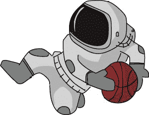第一次`Basketball` sprite 检测到它投进了一个篮子，它将`Player` `1` `Score`增加 1 点，并将`made` `basket`设置为`yes`。在以后对该镜头的检查中，`made` `basket`将不等于`no`，因此不再检测篮筐。下一次玩家按空格键扔篮球时，`made` `basket`变量重置为`no`。

* * *

## 保存点

单击绿色标志来测试到目前为止的代码。投篮。确保`Player` `1` `Score`每个篮子只增加一分。然后点击红色停止标志，保存你的程序。

* * *

## 完整的程序

这是最终的代码。如果您的程序不能正常工作，请对照此代码检查您的代码。

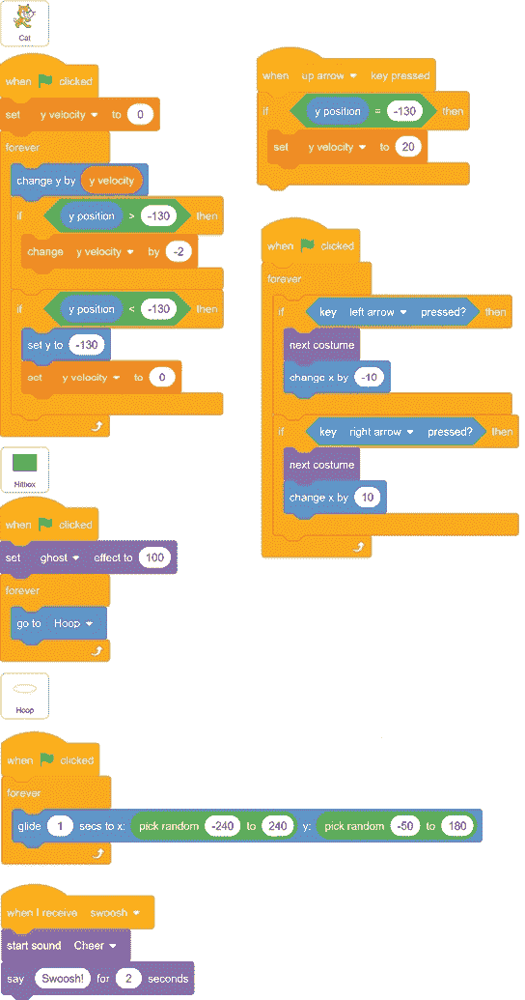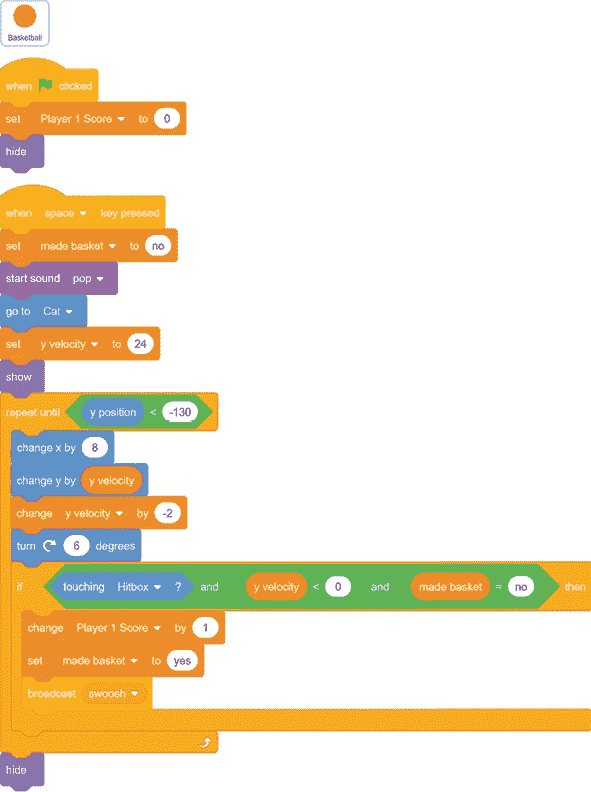## 作弊模式:冻结铁环

移动的篮球框是很难击中的目标。让我们添加一个欺骗，当玩家按下 7 键时，它会在原地冻结几秒钟。

选择`Hoop` sprite 并点击 **Make a Variable** 按钮为这个 sprite only 创建一个新的**变量，名为`freeze`。然后修改`Hoop`精灵的代码以匹配下面的代码:**

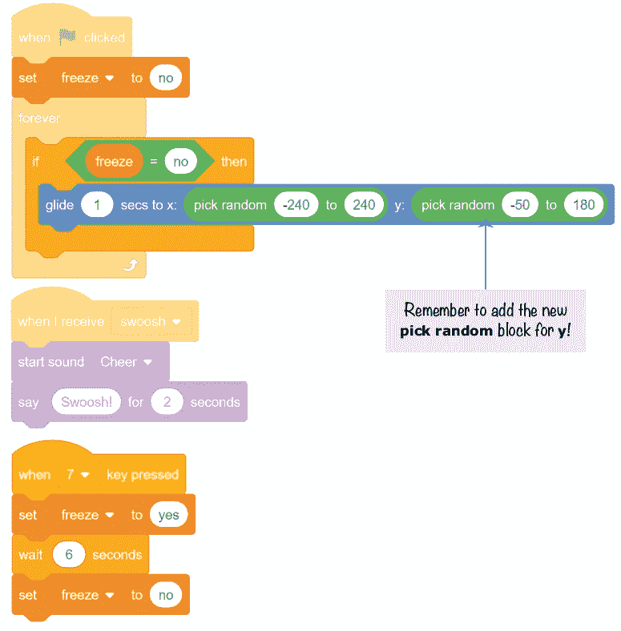img/* * *

## 保存点

单击绿色标志来测试到目前为止的代码。按下 7 键，并确保环停止滑动到新的位置六秒钟。然后点击红色停止标志，保存你的程序。

* * * img/img/## 摘要

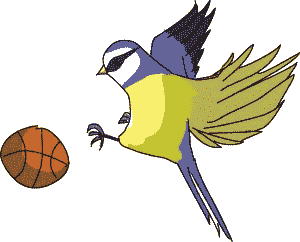在本章中，您构建了一个游戏

*   实现重力和真实下落
*   具有侧视图而不是俯视图
*   使用变量来记录分数、下落速度和第一次投篮
*   有一个 hitbox 来检测何时投篮

这个程序中重力的使用非常简单。当你读到第七章时，你将能够制作一个高级的平台游戏，有更复杂的跳跃和下落。但是有很多 Scratch 编程技术需要先练习。在第五章中，你将制作一个侧视游戏，使用克隆来复制一个精灵几十次。

* * *

## 复习问题

试着回答下面的练习题来测试你学到了什么。您可能不会马上知道所有的答案，但是您可以探索 Scratch 编辑器来找出答案。(答案也在[http://www.nostarch.com/scratch3playground/](http://www.nostarch.com/scratch3playground/)在线。)

1.  侧视游戏(如*篮球*游戏)和自上而下游戏(如*迷宫赛跑*游戏)有什么不同？
2.  变量能存储什么？
3.  这只精灵的**和所有精灵**的**有什么区别？**
4.  你怎么能让一个精灵跳起来？
5.  当猫在篮球比赛中跳跃时，是什么阻止它永远向上呢？
6.  `glide` 和`go``to``x``y`积木有什么区别？
7.  如何让一个 `if` `then` 块内的代码只在*两个*条件为真的情况下运行？

* * * img/img/*********`