# 5 一个抛光砖断路器游戏

> 原文：<https://inventwithscratch.com/book3/chapter5.html>

 你见过碎砖游戏吗？玩家控制屏幕底部的桨来拍球，打破屏幕顶部的方块。当球越过球拍时，球员就输了。这个游戏编程起来很简单，但是看起来有点无聊。在这一章中，你将学到一些通过添加动画和效果使游戏更加丰富多彩和有趣的技巧。

你将使用一个迭代过程:首先，你将制作基本游戏；然后，你会对它做一些小的改进。结果将是一个看起来更专业的游戏，Scratch 网站上的其他 Scratchers 会认为它看起来很棒。

下图显示了*砖块粉碎者*游戏在你打磨前后的样子:

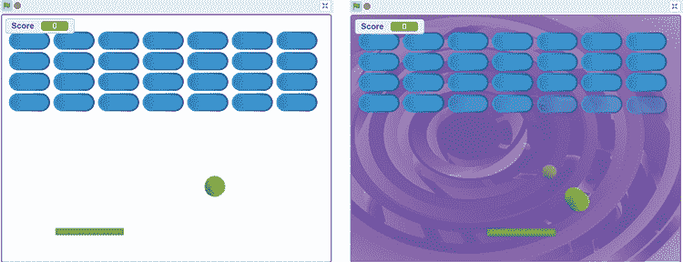在你开始编码之前，看看在 https://www.nostarch.com/scratch3playground/的最后一场比赛。

## 勾画出设计草图

让我们从画游戏应该是什么样子开始。*碎砖机*的草图可能如下图所示。

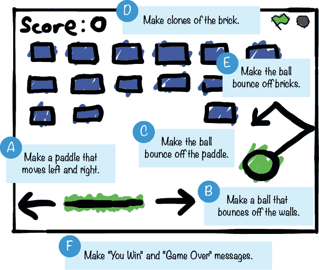如果想节省时间，可以从资源 ZIP 文件中名为*brick breaker-skeleton . sb3*的骨架项目文件开始。到 https://www.nostarch.com/scratch3playground/[的](https://www.nostarch.com/scratch3playground/)，右键点击链接，选择**将链接另存为**或**将目标另存为**，将 ZIP 文件下载到你的电脑上。从 ZIP 文件中提取所有文件。骨架项目文件已经加载了所有的精灵，所以您只需要将代码块拖动到每个精灵中。

##  做一个左右移动的桨

玩家将通过移动鼠标来控制球拍。球从拍子上弹向砖块，但是如果球越过拍子，玩家就输了。

### 1。创建船桨精灵

我们在这个游戏中不需要橙色的猫，所以右击或者长按精灵列表中的`Sprite1`猫，从菜单中选择**删除**。然后点击**选择一个精灵**按钮并选择绿色的`Paddle`精灵。

接下来，添加以下代码对`Paddle` sprite 进行编程，使其跟随鼠标在舞台底部移动:

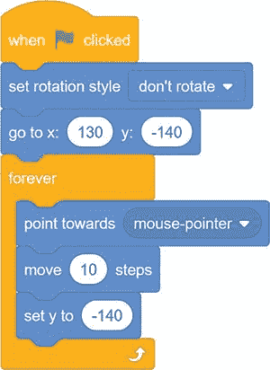`Paddle`精灵不断地直接向鼠标移动 10 步，但是它的 y 位置保持设置为`-140`。

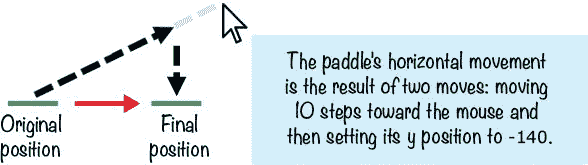`Paddle`精灵只会左右移动，因为它的 y 位置总是设置在舞台的底部(`-140`)。

* * *

## 探索:旋转样式

旋转样式设置精灵改变方向时的外观。三种旋转方式分别是`all``around``left-right``don't``rotate`。您可以使用蓝色运动类别中的**设置旋转样式**块进行设置。

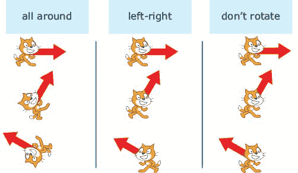当一个 sprite 被设置为`all` `around`时，它将正好面对其方向指向的地方。但这对于侧视游戏(比如第四章的*篮球*游戏)来说是行不通的，因为当精灵的方向向左时，它会上下颠倒。相反，对于这些游戏，你将使用`left-right`旋转风格。精灵将只面向 90 度(右)或 90 度(左)，以最接近精灵方向的为准。如果你根本不想让精灵旋转，即使它的方向改变，设置旋转风格为`don` `'` `t` `rotate`。

* * *

因为我们正在改变`Paddle`精灵的方向，我们还需要用`set` `rotation` `style`块设置精灵的旋转样式。`Paddle`精灵被编程为面向并向鼠标移动，但是我们希望精灵看起来总是平的和水平的，所以旋转样式被设置为`don't` `rotate`。

* * *

## 保存点

单击绿色标志来测试到目前为止的代码。四处移动鼠标，看看`Paddle`精灵是否跟随它。确保`Paddle`停留在载物台底部。然后点击红色停止标志，保存你的程序。

* * * img/img/##  使一个球在墙壁上反弹

Scratch Sprite 库有几个可以用于球的 Sprite，但是让我们在这个游戏中使用`Tennis` `Ball` sprite。

### 2.创建网球精灵

点击右下角的**选择一个精灵**按钮，从精灵库窗口中选择`Tennis` `Ball`精灵。添加以下代码:

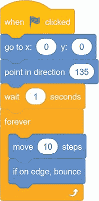游戏开始时，`Tennis` `Ball`精灵从舞台中央的位置(0，0)开始；然后`Tennis` `Ball`雪碧指向右下方，对着`Paddle`雪碧。接下来，`forever`循环中的,`Tennis``Ball`精灵开始移动。当`Tennis` `Ball` sprite 接触到舞台边缘时，它会向新的方向反弹。

* * *

## 保存点

单击绿色标志来测试到目前为止的代码。确保`Tennis` `Ball`精灵四处移动并从边缘反弹。网球不会从球拍上弹开，因为你还没有添加代码。点击红色停止标志并保存您的程序。

* * *

##  用球拍使球弹开

`Tennis` `Ball`精灵现在会从墙壁上反弹，但不会从`Paddle`精灵上反弹。现在让我们添加代码。

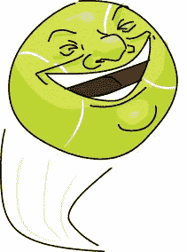### 3.将反弹代码添加到网球精灵中

将下面的代码添加到`Tennis` `Ball`精灵中，这样它将从`Paddle`精灵中反弹出来。为此，您需要创建一个新的广播消息，`bounce`。

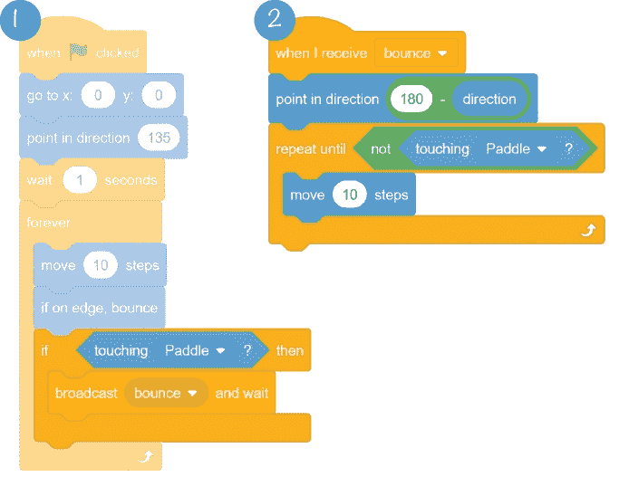您将使用脚本 1 中的广播消息来控制脚本 2 中球碰到球拍时会发生什么。

脚本 2 中的`point` `in` `direction` `180` `-` `direction`代码可能看起来有点神秘，但这个等式只是根据球的当前方向计算球将反弹的方向。如果球指向右上(45 度)，那么当它从砖块底部反弹时，它的新方向将是右下(135 度，因为 180–45 = 135)。如果球指向左上方(45 度)，那么当它从砖块底部反弹时，它的新方向将是左下方(225 度，因为 180-(–45)= 225)。

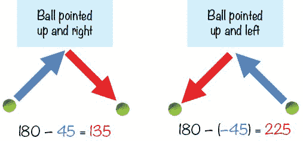在程序的后面，当你添加代码使球从砖块上弹回时，你将再次使用这个广播消息。

* * *

## 保存点

单击绿色标志来测试到目前为止的代码。确保网球从球拍上弹开。然后点击红色停止标志，保存你的程序。

* * *

* * *

## 探索:克隆

`create``clone``of``myself`块制作了精灵的副本，称为*克隆*。每当你想在你的游戏中创建一个物体的许多副本时，这个功能就很方便，例如许多看起来一样的坏人，一堆供玩家收集的硬币，或者在 *Brick Breaker* 游戏中，你需要击打的砖块。

让我们看看克隆体是如何工作的。在新标签页中打开 Scratch 并创建一个新程序。将这段代码添加到`Cat` sprite 中:

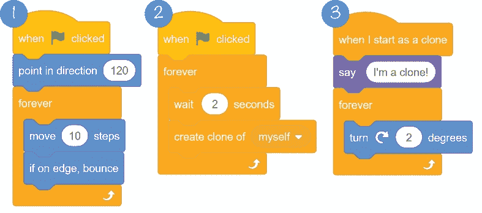脚本 1 让`Cat`精灵在舞台上弹跳，就像【T12【精灵在*碎砖*游戏中做的那样。但是在脚本 2 中，我们一次又一次地创建克隆，每两秒钟一次。脚本 3 使用`when``I``start``as``a``clone`块来控制克隆的小精灵的行为。你认为运行这段代码会发生什么？现在运行代码，看看你是否正确。

最初的`Cat`精灵在舞台上跳跃。每两秒钟就有一个精灵的副本被创建:这些是克隆体。每个克隆人都会因为剧本 3 而开始变身。

* * *

##  制造砖块的克隆体

现在游戏需要很多砖块，所以你将创建一个`Brick`精灵，然后使用 Scratch 的`create` `clone`砖块克隆它。

### 4.添加砖块精灵

点击右下角的**选择精灵**按钮，从精灵库窗口中选择`Button` `2`精灵。从精灵列表中选择`Button` `2`，并在精灵窗格中重命名该精灵为`Brick`。

你必须通过选择橙色的*变量*类别并点击**制作变量**按钮来创建一个新变量。将此变量命名为`Score`，并为所有精灵将其设置为**。然后将下面的代码添加到`Brick` sprite 中:**

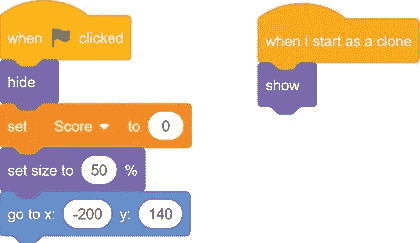在游戏开始时，`Score`变量被设置为`0`以从先前的游戏中移除任何点数。原始精灵用`hide`块隐藏自己，大小缩小 50 %,并移动到舞台的左上角(–200，140)。我们接下来要创建的克隆体用`show`块来展示自己。

### 5.克隆砖块精灵

对于*碎砖*游戏，我们想要许多排砖块。为了制作一排排砖块，我们将把原始精灵移动到屏幕的顶部，创建一串克隆体。将以下代码添加到`Brick` sprite 中。(一定不要混淆`set` `x` `to`和`change` `x` `by`区块！)

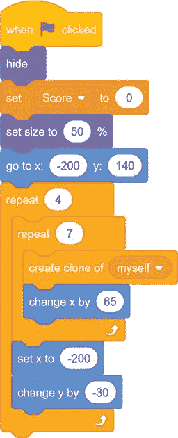这段代码将为游戏中的所有砖块创建`Brick`精灵的克隆体，如下所示:

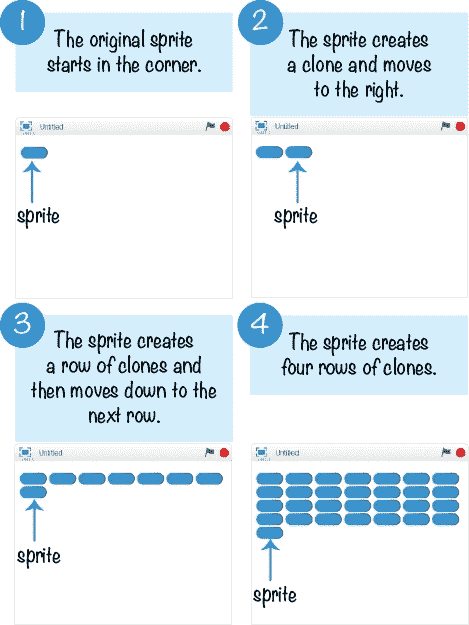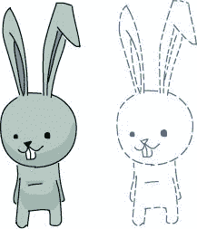原始精灵移动到舞台的左上角(–200，140) 1 。然后`repeat` `7`块重复向右移动 65 步，同时克隆子画面 2 以创建一行七个`Brick`克隆体 3 。`repeat` `4`块重复行创建代码来创建四行`Brick`克隆 4 。七个`Brick`克隆乘以四行得到 28 个`Brick`克隆。上图第 29 个`Brick`是原精灵，不是克隆的，接下来我们就把它藏起来。

现在舞台上所有的砖块都是克隆体，所以不需要再为原来的 sprite 复制`when` `I` `start` `as` `a` `clone`块下的代码。

想象一下如果你复制精灵而不是克隆他们。然后，如果你想改变代码，你必须改变所有 28 个`Brick`精灵。克隆可以节省你很多时间！

##  使球弹开砖块

`Tennis` `Ball`精灵被舞台边缘和`Paddle`精灵反弹。现在让它从`Brick`克隆体上弹开。

### 6.将反弹代码添加到砖块精灵中

更新`Brick`精灵的代码，使其与下面的代码相匹配:

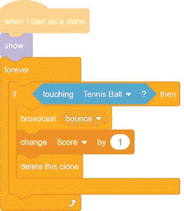当`Tennis` `Ball`小精灵点击`Brick`小精灵时，`Brick`小精灵广播`bounce`消息，从而使`Tennis` `Ball`代码发挥作用。球的方向会改变，就像它碰到球拍时一样。程序把`1`加到玩家的`Score`上，然后克隆体自己删除。

* * *

## 保存点

单击绿色标志来测试到目前为止的代码。确保舞台的顶部填充了`Brick`克隆体，当`Tennis` `Ball`精灵弹出克隆体时，克隆体消失。然后点击红色停止标志，保存你的程序。

* * *

##  发出“你赢了”和“游戏结束”的信息

你还需要两个精灵来玩这个游戏，但是他们要到游戏结束才会出现。我用画图编辑器的**文本**工具创建了我的。如果玩家打破了所有的`Brick`克隆体，程序会显示`You` `Win`精灵。如果网球越过了球拍，程序会显示`Game` `Over`精灵。

### 7.修改网球精灵的代码

当`Tennis` `Ball`精灵超过`Paddle`精灵时——也就是说，当`Tennis` `Ball`精灵的`y` `position`小于`-140`时——游戏结束。一旦游戏结束，`Tennis` `Ball` sprite 应该会广播一条`game` `over`消息。将以下代码添加到`Tennis` `Ball` sprite 中。

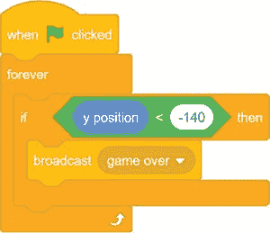`game` `over`广播会告诉`Game` `Over`精灵出现。接下来让我们创建精灵。

### 8.在雪碧上创建游戏

点击**绘制**按钮，该按钮在你点击或者悬停在**选择一个精灵**按钮上之后出现。当画图编辑器出现时，使用**文本**工具将*游戏用红色写在*上。

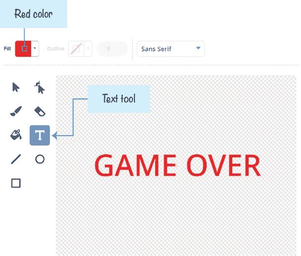在精灵列表中选择精灵，重命名为`Game` `Over`。然后将这段代码添加到`Game`的`Over` sprite 中:

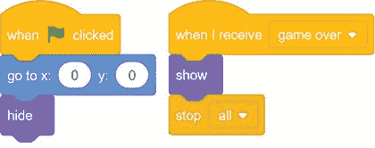子画面保持隐藏，直到它接收到`game` `over`广播。然后`stop` `all`格挡停止所有精灵的移动。

* * *

## 保存点

单击绿色标志来测试到目前为止的代码。让网球越过球拍，确保`Game` `Over`精灵出现，程序停止。保存您的程序。

* * *

### 9。创建你赢的精灵

点击**绘制**按钮，该按钮在点击或悬停在**选择一个精灵**按钮上后出现。在画图编辑器中，使用**文本**工具写出*你赢了！*绿色。

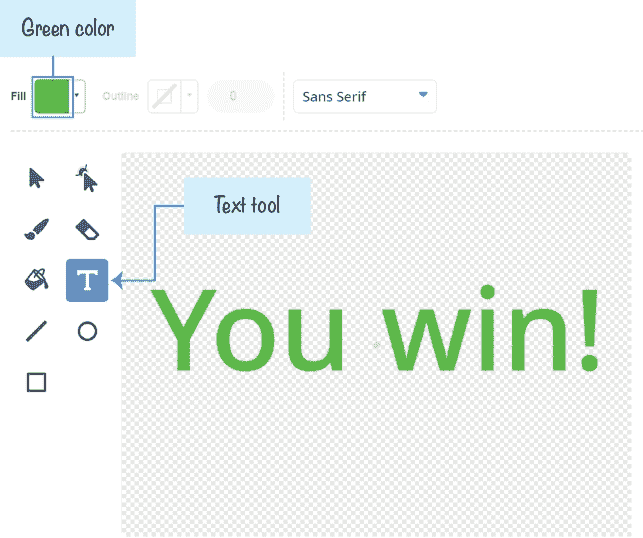在精灵列表中选择精灵，重命名为`You` `Win`。将这段代码添加到`You`的`Win` sprite 中:

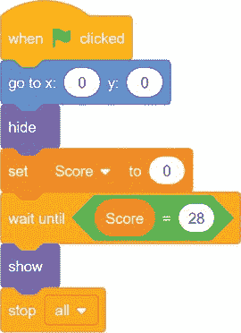与`Game` `Over`子画面一样，`You` `Win`子画面被隐藏，直到满足一个条件。在这个游戏中，玩家需要打碎全部 28 块砖块才能获胜，所以条件是`Score` `=` `28`。`You` `Win`精灵显示后，程序停止所有其他精灵随`stop` `all`移动。

* * *

## 保存点

单击绿色标志来测试到目前为止的代码。确保`You` `Win`精灵在打碎所有砖块后出现，程序停止。为了让赢得游戏更快，暂时将`wait``until``Score``=``28`改为`wait``until``Score``=``1`。那么你只需要打碎一块砖就能赢。保存您的程序。

* * *

## 完整的程序

这里显示了整个程序的最终代码。如果你的程序运行不正常，对照这个代码检查你的代码。

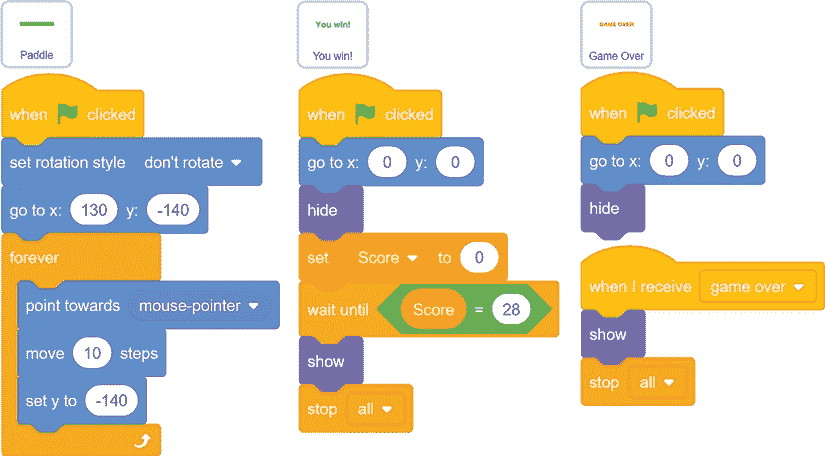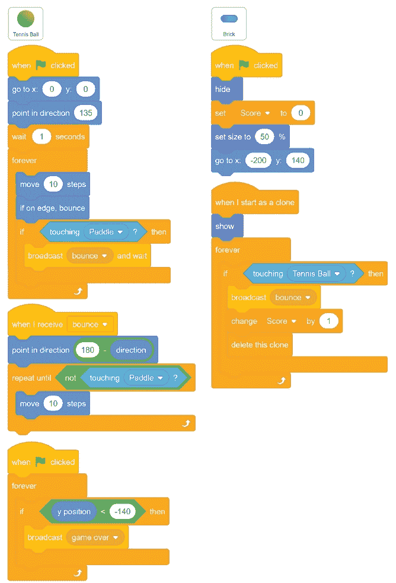## 版本 2.0:抛光时间

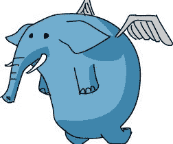这个游戏现在运行得很好。但是现在你要添加一些润色。许多关于*砖块粉碎者*游戏附加功能的想法来自于北欧游戏独立之夜的一次展示，名为“要么加油，要么失败！”马丁·乔纳松和佩特里·普霍。游戏设计中的 *juice* 一词的意思是*润色*，或者以小的方式修改游戏，使其感觉更生动，反应更灵敏。这些技巧可以把一个简单的游戏变成一个令人兴奋的、丰富多彩的游戏。一个多汁的游戏看起来比一个普通的游戏更专业。你可以观看马丁和佩特里在 https://www.nostarch.com/scratch3playground/为他们的*碎砖*游戏添加果汁的演示。

你可以在*碎砖游戏*中加入许多技巧，让它看起来更精致。更好的是，你可以在你的任何游戏中使用这些技巧。在你开始编码之前，看看 https://www.nostarch.com/scratch3playground/[的完整程序。](https://www.nostarch.com/scratch3playground/)

### 画一个很酷的背景

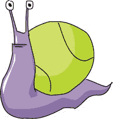添加有趣的背景是让游戏看起来更酷的简单方法。点击**选择背景**按钮，选择**霓虹隧道**。在画图编辑器中，选择一种你喜欢的颜色，使用**填充**工具填充隧道边上的随机瓷砖。这可以使隧道背景看起来更有趣。

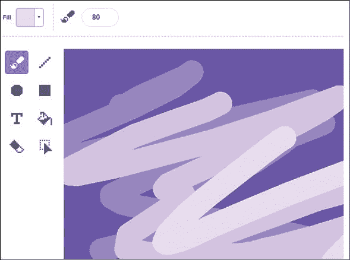### 添加音乐

声音营造气氛，让游戏更有活力。在精灵列表中选择舞台，点击块面板顶部的**声音**选项卡。点击左下角的**选择声音**按钮(看起来像扬声器)。当声音库窗口出现时，选择`Dance` `Celebrate`声音。

然后点击**代码**标签，将此代码添加到舞台代码区域，为游戏添加一些背景音乐:

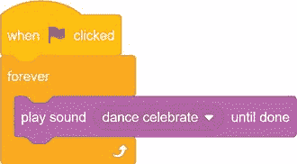### 击中时使桨闪烁

在这一步中，您将使球拍在被球击中时闪烁不同的颜色。将以下代码添加到`Paddle` sprite 中:

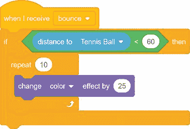当`Tennis` `Ball`精灵被`Brick`克隆体或`Paddle`精灵反弹时，就会广播`bounce`消息。`if` `distance` `to` `Tennis` `Ball` `<` `60`区块使`Tennis` `Ball` sprite 从`Paddle` sprite 弹开时颜色发生变化(这意味着球将在 60 步以内)。

* * *

## 保存点

单击绿色标志来测试到目前为止的代码。当球反弹回来时，确保球拍闪烁不同的颜色。然后点击红色停止标志，保存你的程序。

* * * img/img/### 向砖块添加动画入口和出口

克隆人的游戏入口相当无聊。它们只是一克隆出来就出现了。要制作他们进入的动画，修改`Brick` sprite 的代码来匹配这个代码。

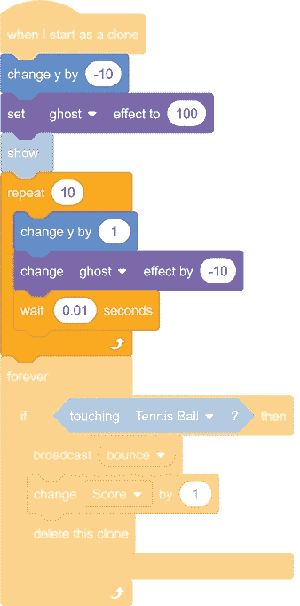将`ghost` `effect`设置为`100`，然后慢慢减小它，使`Brick`克隆体逐渐消失在视野中，而不是立即出现。代码还将`Brick`克隆体设置在其最终位置以下 10 步，并通过改变它们在`repeat`块中的 y 位置来慢慢提升它们。这使得`Brick`克隆体看起来像是在滑动到位。

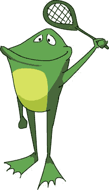img/* * *

## 保存点

单击绿色标志来测试到目前为止的代码。确保克隆体逐渐消失在视野中，而不是立即出现。然后点击红色停止标志，保存你的程序。

* * *

现在让我们制作克隆人退出的动画。修改`Brick`精灵的代码，使`Brick`克隆体有一个动画退出，而不是立即消失。

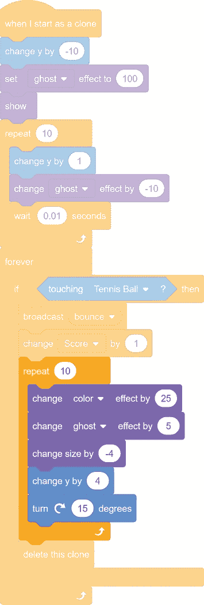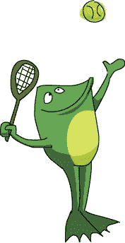现在克隆人将以令人兴奋的方式消失！`repeat`循环里面的`change` `effect` `by`块会让`Brick`克隆体闪现不同的颜色，增加它们的鬼效果，让它们变得越来越透明。同时，`change` `size` `by` `-4`块使`Brick`克隆体收缩，`change` `y` `by` `4`块将它们抬起，`turn` `clockwise` `15` `degrees`块将它们旋转。这个动画出口很短，但看起来很有趣。

* * *

## 保存点

单击绿色标志来测试到目前为止的代码。用网球击打砖块，确保它们旋转并向上移动，直到消失不见，而不是立即消失。然后点击红色停止标志，保存你的程序。

* * *

### 给砖块出口添加声音效果

让我们也让`Brick`克隆体在消失时播放不同的音效。在精灵列表中选择`Brick`精灵，然后点击区块调色板上方的**声音**标签。点击左下角的**选择声音**按钮，从声音库中选择`Laser1`。重复此步骤，添加`Laser2`声音。

修改`Brick` sprite 的代码，使其与以下代码相匹配:

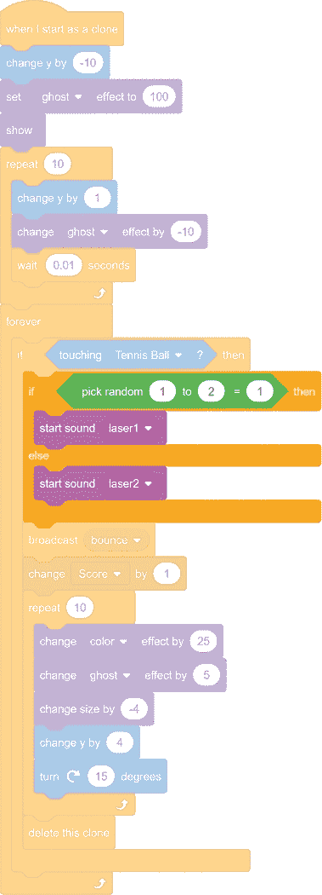当这些声音被加载并添加了先前的代码后，`Brick`克隆体将在它们消失时播放随机的声音效果。`if` `then` `else`模块通过随机选择播放的声音为程序的声音效果增加了一些变化。每次`Tennis` `Ball`精灵接触到`Brick`克隆体，程序会随机选择 1 或 2，然后播放不同的声音。

### 给网球添加声音效果

现在你将为`Tennis` `Ball`精灵点击`Paddle`精灵添加音效。已经为每个精灵加载了`Pop`声音；你所要做的就是更新`Tennis` `Ball`精灵的代码来匹配它:

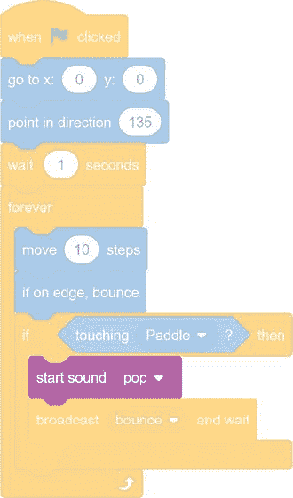### 在网球后面添加轨迹

当`Tennis` `Ball`精灵在舞台上移动时，在它后面添加一串克隆体会给它一个很酷的彗星尾巴。你不想使用`Tennis` `Ball`精灵的克隆体，因为每当最初的`Tennis` `Ball`精灵反弹时，它们就会响应`bounce`的广播。相反，点击右下角的**选择一个精灵**按钮。然后在精灵库窗口选择**网球**创建另一个精灵`Tennis` `Ball2`。您将克隆第二个球来创建轨迹。与`Tennis` `Ball`克隆不同，`Tennis` `Ball2`克隆不会有`when` `I` `receive` `bounce`块。将此代码添加到`Tennis` `Ball2` sprite 中:

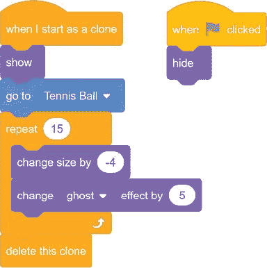克隆体被编程做的唯一一件事就是去当前`Tennis` `Ball`精灵的位置。网球继续移动，但克隆体留在原地，不断缩小，变得更加透明。在这个收缩和褪色的动画结束时，克隆被删除。

您还需要用以下代码更新`Tennis` `Ball`精灵:

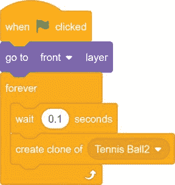这个脚本在 0.1 秒的等待后制作了一个新的`Tennis` `Ball2`克隆体，创建了网球的轨迹。

* * *

## 保存点

单击绿色标志来测试到目前为止的代码。确保一串缩小的`Tennis` `Ball2`克隆体跟随原始的`Tennis` `Ball`精灵。然后点击红色停止标志，保存你的程序。

* * *

### 在雪碧上添加游戏的动画入口

当玩家输了，简单地出现文本上的*游戏。如果*游戏在*文本上有一个像`Brick`克隆体那样的动画入口，那将会更加令人兴奋。修改`Game` `Over`精灵的代码以匹配下面的代码。点击**声音**选项卡后，点击左下角的**选择声音**按钮，首先加载`Gong`声音效果。您将创建一个名为`stop` `game`的新广播消息，它将告诉`Paddle`和`Tennis` `Ball`精灵停止移动。*

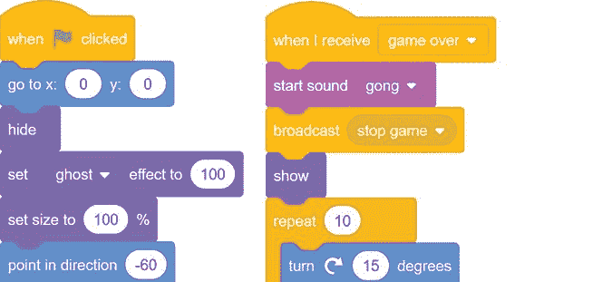游戏开始时，`Game` `Over`精灵隐藏自己，将其幽灵效果设置为`100`。当`show`区块运行到游戏结束时，*游戏超过*文字依然完全看不见。`repeat` `10`块内的动画代码通过`-10`改变的鬼影效果使*游戏超过*文本慢慢淡入。`turn` `clockwise` `15` `degrees`和`change` `size` `by` `12`块旋转并放大文本。四秒钟暂停后，`stop` `all`程序块结束程序。

为了处理`Tennis` `Ball`和`Paddle`精灵中的`stop` `game`广播消息，将以下代码添加到这两个精灵的*中:*

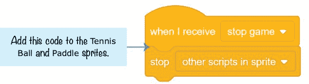你需要使用`stop` `other` `scripts` `in` `sprite`块而不是`stop` `all`块的原因是程序需要在*游戏超过*文本时继续运行。`stop` `other` `scripts` `in` `sprite`块将停止`Tennis` `Ball`和`Paddle`子画面的移动，但让程序中的其他子画面继续运行。当`Game` `Over`子画面出现在屏幕上时，`stop` `all`块将结束整个程序。

* * *

## 保存点

单击绿色标志来测试到目前为止的代码。故意输掉游戏，并确保文本上的*游戏有一个动画入口，而不是立即出现在屏幕上。然后点击红色停止标志，保存你的程序。*

* * *

### 为你赢的精灵添加一个动画入口

让我们给`You` `Win`雪碧一个花哨的，动画的入口。更新`You` `Win`精灵中的代码，以匹配以下内容。你必须在点击**声音**标签后点击左下角的**选择声音**按钮来加载`Gong`音效。

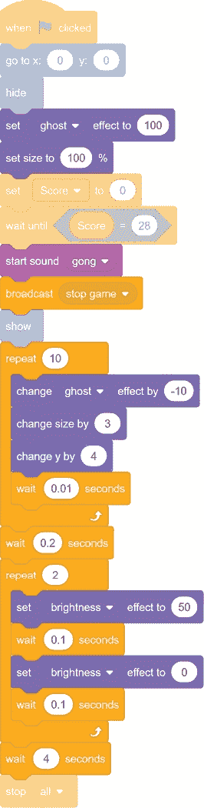有两组动画，一组在`repeat` `10`块，另一组在`repeat` `2`块。`repeat` `10`块中的代码使`You` `Win`精灵淡入可见，放大，并向上移动。在这个简短的动画播放之后，`repeat` `2`块的代码将 sprite 的亮度增加到`50`，等待十分之一秒，然后将亮度重置为`0`。这使得精灵看起来像是在闪烁。四秒钟暂停后，`stop` `all`程序块结束程序。

* * *

## 保存点

单击绿色标志来测试到目前为止的代码。当你赢得游戏时，确保你赢了！文本有一个动画入口，而不是立即出现在屏幕上。为了让赢得游戏更快，暂时将`wait``until``Score``=``28`改为`wait``until``Score``=``1`。那么你只需要打碎一块砖就能赢。保存您的程序。

* * *

## 摘要

在本章中，您构建了一个游戏

*   使用克隆快速创建许多`Brick`精灵的副本和一串`Tennis`T2 精灵
*   用鼠标而不是键盘箭头键控制`Paddle`精灵
*   向玩家显示*游戏结束后*和*你赢了！*使用画图编辑器的**文本**工具创建的消息
*   为精灵提供了几个动画入口和出口
*   使用音效和背景音乐让游戏感觉更生动

制作*砖块粉碎者*游戏为你提供了几种技术，你可以将它们添加到未来的游戏中。您可以在许多程序中包含动画入口、彩色闪烁和声音效果，使它们更加令人兴奋和有趣。但是最好是确保你的游戏的简单、基本版本先工作，然后再让它看起来更酷。

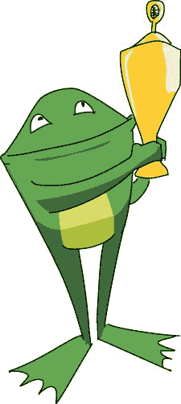本章还介绍了克隆，这是一种在程序运行时创建重复精灵的有用技术。随着你的阅读，你创建的游戏将会变得更加复杂，但是不要担心:你只需要一步一步地按照说明去做就行了！

* * *

## 复习问题

试着回答下面的练习题来测试你学到了什么。您可能不会马上知道所有的答案，但是您可以探索 Scratch 编辑器来找出答案。(答案也在[http://www.nostarch.com/scratch3playground/](http://www.nostarch.com/scratch3playground/)在线。)

1.  程序如何知道`Tennis` `Ball`精灵何时通过了`Paddle`精灵？
2.  哪个模块创建了精灵的克隆体？
3.  哪个块包含克隆创建时运行的代码？
4.  三种旋转方式是什么？
5.  为什么点击绿色旗帜后`You` `Win`和`Game` `Over`精灵会隐藏起来？
6.  `wait` `until` 块是做什么的？

* * * img/img/