# 6 小行星破碎机。。。在太空！

> 原文：<https://inventwithscratch.com/book3/chapter6.html>

  *类固醇*是雅达利公司于 1979 年开发的经典游戏。从那以后，许多程序员重新制作了这个游戏，这也是一个很棒的从头开始的编程项目。玩家驾驶一艘飞船，必须摧毁太空小行星，同时避免碎片脱落。。。在太空！(众所周知的事实是添加”。。。在太空！”让一切变得更加精彩。)

玩家*推动*飞船，而不是直接控制飞船移动的方向，就像冰上的冰球一样；因为玩家的船有惯性，所以绕着舞台滑行。为了让飞船减速，玩家必须把它推向相反的方向。在不失去控制的情况下移动飞船需要技巧，但这只是游戏的一半乐趣。另一半的乐趣是炸毁小行星。

在你开始编码之前，看看在 https://www.nostarch.com/scratch3playground/[的最终*小行星破碎者*程序。](https://www.nostarch.com/scratch3playground/)

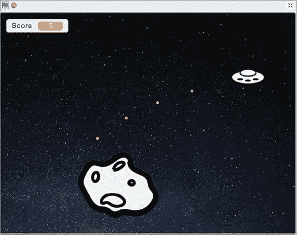## 勾画出设计草图

让我们在纸上画出游戏应该是什么样子。在我们的游戏版本中，玩家用 WASD 键控制他们的飞船，用鼠标瞄准来袭的小行星。

下面是我的草图:

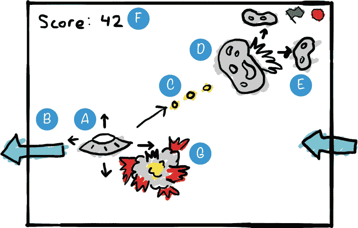下面是我们在每一部分要做的事情:

1.  制作一艘被推来推去的宇宙飞船
2.  让飞船环绕边缘
3.  用鼠标瞄准，用空格键开火
4.  D. 制造四处漂浮的小行星
5.  E. 撞击时使小行星一分为二
6.  F. 记录分数并制作计时器
7.  如果宇宙飞船被击中，就会爆炸

如果想节省时间，可以从资源 ZIP 文件中名为*asteroidbreaker-skeleton . sb3*的骨架项目文件开始。到 https://www.nostarch.com/scratch3playground/[的](https://www.nostarch.com/scratch3playground/)，右键点击链接，选择**将链接另存为**或**将目标另存为**，将 ZIP 文件下载到你的电脑上。从 ZIP 文件中提取所有文件。骨架项目文件已经加载了所有的精灵，所以您只需要将代码块拖动到每个精灵中。

##  制造一艘被推来推去的宇宙飞船

在我们编写游戏中令人兴奋的部分之前，我们需要设置背景和精灵。我们将通过添加星星背景和飞船精灵来使这个游戏变得太空化。点击右下角的**选择背景**按钮，然后选择**明星**。

我们不会使用 Scratch 开始时使用的`Cat`精灵，所以在精灵窗格中右键单击或长按该精灵，并在继续之前选择**删除**，或者单击精灵旁边的垃圾桶图标。在 Scratch 编辑器中启动一个新项目，输入*小行星破碎者*作为项目名称。

### 1.创建飞船精灵

我们将为飞船使用一个飞碟图像，您可以在参考资料 ZIP 文件中找到它。

将鼠标悬停在**选择精灵**按钮上，点击出现的**上传精灵**按钮。然后从资源 ZIP 文件中选择 Spaceship.png 的*图像文件。*

在橙色的*变量*类别中，点击**制作一个变量**并创建一个名为`x` `velocity`的变量。使`x` `velocity`成为这个精灵唯一的变量的**。重复前面的步骤，创建一个名为`y`T5 的变量。**

* * *

## 注

如果该子画面的**只有**没有出现，则选择舞台而不是`Spaceship`子画面。关闭新建变量窗口，选择`Spaceship`精灵，再次点击**制作变量**。

* * *

你还需要创建两个名为`Score`和`player` `is` `alive`的变量，但是要为所有精灵创建这些变量**。**

接下来，将下面的代码添加到`Spaceship` sprite 中。该代码定义了船的起始位置和变量的初始值；它还包含定义用户控件的逻辑。

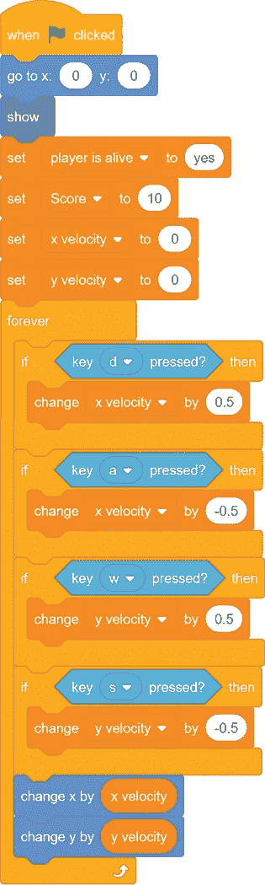你可能想知道为什么我们没有重用以前游戏中使用`change` `x` `by`或`change` `y` `by`方块的代码。在这个程序中，按住其中一个 WASD 键可以增加或减少`x` `velocity`和`y` `velocity`变量。然后，脚本底部的代码通过使用这些变量中的值来改变`Spaceship` sprite 的 x 和 y 位置。即使在玩家放开按键后，变量仍然反映更新后的位置，因此飞船继续移动。

* * *

## 保存点

单击绿色标志来测试到目前为止的代码。按下 WASD 键，看看飞船是如何被推动的。确保所有四个 WASD 键将飞船推向正确的方向。然后点击红色停止标志，保存你的程序。

* * *

##  使飞船环绕四周边缘

当您测试代码时，您是否注意到`Spaceship` sprite 在运行到舞台边缘时会立即停止？原因是 Scratch 防止精灵离开舞台，这在大多数 Scratch 程序中是有帮助的。但是在*小行星破碎者*中，我们希望精灵离开舞台的一边，而*绕到*的另一边。

### 2。将环绕代码添加到飞船精灵中

下面的代码将使飞船到达舞台的另一边。现在添加此代码。

载物台的左右边缘分别位于 x 坐标 240 和 240 处。载物台的底部和顶部边缘位于 y 坐标 180 和 180 处。我们使用这些边界来编写代码，当`Spaceship` sprite 经过这四个坐标时改变它的位置。每当`Spaceship`精灵的 x 或 y 位置在这些边缘的五步之内时，这个新代码将把`Spaceship`精灵移动到舞台的另一边。因为`x` `velocity`和`y` `velocity`变量仍将以相同的速度和相同的方向移动`Spaceship` 精灵，所以`Spaceship`精灵将看起来像是在舞台上连续移动。

* * *

## 保存点

单击绿色标志来测试到目前为止的代码。确保所有四条边都将`Spaceship`精灵发送到另一边。然后点击红色停止标志，保存你的程序。

* * *

### 3.将随机推送代码添加到飞船精灵

这个游戏的控制提供了一个挑战，但让我们玩这个游戏更加困难。我们将在`Spaceship`精灵中添加随机的小推力，这样玩家就不会停留在中心而完全不动。

将以下代码添加到`Spaceship` sprite 中，使随机推送每秒发生一次:

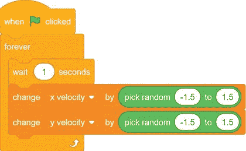在`forever`循环中，`x` `velocity`和`y` `velocity`变量在一秒钟的停顿后发生微小的随机变化。这意味着每一秒钟，飞船的运动都会受到随机的推动。

* * *

## 保存点

单击绿色标志来测试到目前为止的代码。不要按任何 WASD 键。等着看飞船是否开始自己移动。然后点击红色停止标志，保存你的程序。

* * * img/img/## 用鼠标瞄准，用空格键开火

控制`Spaceship`精灵的代码已经完成，现在让我们添加能量爆炸。这些爆炸将粉碎那些危险的太空小行星！在太空！

### 4.创建能量冲击波精灵

Scratch 的精灵库有一个精灵，我们可以用它来进行能量爆炸。点击右下角的**选择一个精灵**按钮。选择`Ball`。在精灵窗格中，将其重命名为`Energy` `Blast`。

我们希望`Energy` `Blast`精灵在`Spaceship`精灵开火时发出激光声。单击块调板上方的**声音**选项卡。然后点击左下角的**选择声音**按钮。选择`Laser1`。

我们将制作`Energy` `Blast`精灵的克隆体，但是克隆体和原始精灵将运行不同的代码。只有一个`Energy` `Blast`精灵，但是玩家应该可以一次发射很多能量冲击波。我们将创建原始`Energy` `Blast`精灵的克隆体，这样舞台上就可以出现不止一个能量爆炸。原始精灵将保持隐藏；所有出现在舞台上的`Energy` `Blast`精灵都将是克隆体。

我们将使用一个名为`I` `am` `a` `clone`的变量来跟踪哪个是原始的精灵，哪个是克隆的。点击**代码**标签，返回代码区。在橙色的*变量*类别中，点击**制作变量**按钮。为此 sprite 只创建一个**的**变量，命名为`I` `am` `a` `clone`。原来的`Energy` `Blast` sprite 会把这个变量设置为`no`，克隆体会把它设置为`yes`。将以下代码添加到`Energy` `Blast` sprite 中:

原始精灵在游戏开始时隐藏自己，并保持隐藏状态。它制造的克隆体将出现在舞台上。此外，我们使用的精灵对于游戏来说太大了，所以将其大小设置为 10 %,使其变小。

现在将下面的脚本添加到`Energy` `Blast`精灵中。玩家将通过按空格键发射能量冲击波。最初的`Energy` `Blast`精灵会创建克隆体，显示自己并向鼠标移动。由于`Energy` `Blast`克隆体向鼠标移动，玩家可以移动鼠标瞄准能量冲击波。

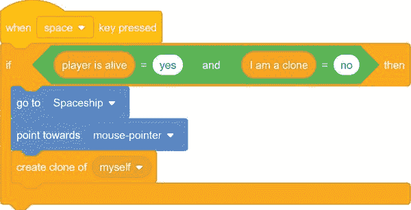`when` `space` `key` `pressed`块下的代码将为原来的精灵*和*克隆体运行，如果我们不给出指令说明这段代码应该只为原来的精灵运行。但是我们不希望现有的克隆体产生新的克隆体。`if` `then`块检查`I` `am` `a` `clone`变量是否被设置为`no`，以便只有原来的`Energy` `Blast`精灵运行该代码并创建克隆体。

显然，`Spaceship`精灵只有在玩家活着的情况下才能激发`Energy` `Blast`克隆体，因此代码还检查了`player` `is` `alive`变量是否被设置为`yes`。

接下来，将以下代码添加到`Energy` `Blast` sprite 中，以便克隆体在创建后向鼠标移动:

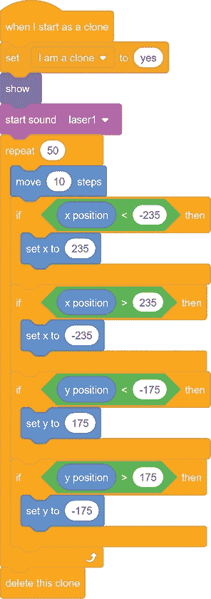克隆体从展示自己开始，向前移动。克隆体也应该环绕舞台的边缘，就像`Spaceship` sprite 一样，所以我们在这里使用类似的代码来实现。

请注意，克隆体会将自己的`I` `am` `a` `clone`变量设置为`yes`。这是为了使克隆不运行`when` `space` `key` `pressed`脚本中的代码。只有当`I` `am` `a` `clone`设置为`no`时，脚本中的`if` `then`块才会运行代码。

克隆人每次向前移动 10 步，移动 50 次。这意味着`Energy` `Blast`克隆体的活动范围有限，不会永远移动。循环重复 50 次后，克隆体会删除自身并从舞台上消失。

* * *

## 保存点

单击绿色标志来测试到目前为止的代码。用鼠标瞄准，按空格键发射。确保`Energy` `Blast`克隆体从`Spaceship`精灵开始，并向鼠标移动。克隆体应环绕舞台边缘，并最终消失。然后点击红色停止标志，保存你的程序。

* * *

##  让小行星四处漂浮

现在我们需要玩家击中的目标。这个游戏中的小行星四处漂浮，直到一个`Energy` `Blast`克隆体撞上它们。它们会不断分裂成两个更小的小行星，直到小到足以被蒸发。

### 5。创建小行星精灵

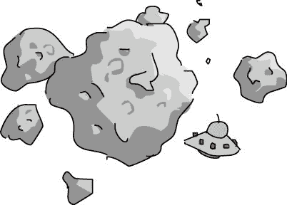将鼠标悬停在**选择精灵**按钮上，点击出现的**上传精灵**按钮，并选择*asteroid.png*文件，添加新的小行星精灵。该文件位于资源 ZIP 文件中。点击橙色的*变量*类别，然后点击**制作变量**按钮。为这个精灵创建一个名为`hits`的变量。重复这些步骤，创建名为`x` `velocity`、`y` `velocity`和`rotation`的变量。所有的**都是这个精灵唯一的**变量。在第 6 步中，我们将使用`hits`变量来记录小行星被撞击的次数和大小。

让我们编写一些代码，让`Asteroid` sprite 创建出现在舞台上的新克隆体；每个克隆体都有随机的速度和旋转。结果将是不可预测的小行星群。。。在太空！

将以下脚本添加到`Asteroid`精灵中:

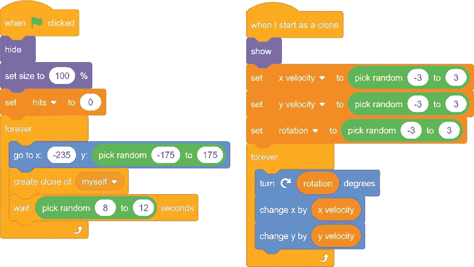和`Energy` `Blast`精灵一样，原来的`Asteroid`精灵会隐藏自己，生成克隆体。每 8 到 12 秒就会创建一个新的克隆。当克隆体被创建时，它显示自己，被赋予随机速度和旋转，并开始移动。

此外，像`Spaceship`和`Energy` `Blast`精灵一样，`Asteroid`精灵将环绕舞台边缘。将以下脚本添加到`Asteroid`精灵中:

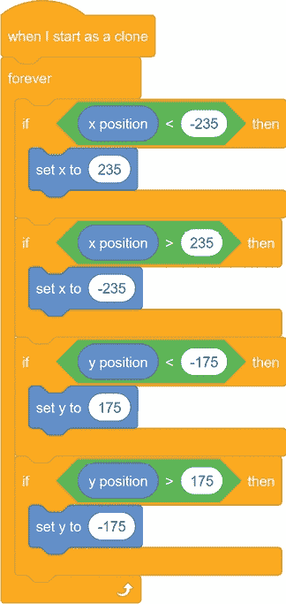img/* * *

## 保存点

单击绿色标志来测试到目前为止的代码。确保`Asteroid`精灵缓慢移动和旋转，并环绕舞台边缘。此外，确保每 8 到 12 秒出现一次新的克隆。然后点击红色停止标志，保存你的程序。

* * * img/img/##  让小行星在撞击时一分为二

当一个`Energy` `Blast`克隆体击中一个`Asteroid`时，`Asteroid`会创造出两个新的更小的克隆体，让它看起来像舞台上的`Asteroid`一分为二。

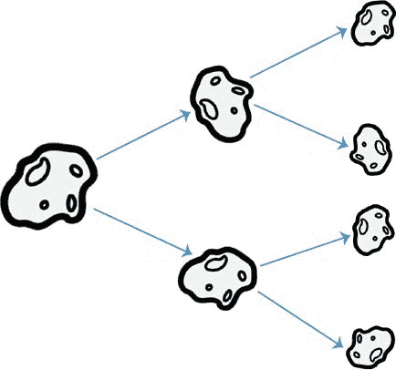### 6.添加小行星的分裂代码

从**声音**选项卡中，点击**选择声音**按钮，然后选择`Chomp`。每当克隆人撞击小行星时，就会发出`Chomp`的声音。

将以下脚本添加到`Asteroid`精灵中。您需要创建一个名为`asteroid` `blasted`的新广播消息。

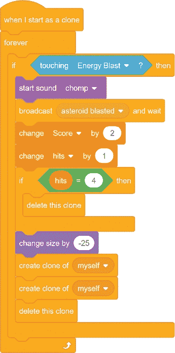当一个`Energy` `Blast`克隆人击中一个`Asteroid`克隆人时，`Asteroid`克隆人会播放`Chomp`音效并广播`asteroid` `blasted`消息。

然后`Asteroid`将`2`点加到`Score`变量上，并将`hits`变量增加`1`。被击中的`Asteroid`精灵也会缩小一点，改变它的大小`-25`，这样当它(“父”)克隆自己两次时，它的“子”克隆将是较小的大小。最后，`Asteroid`克隆删除了自己。

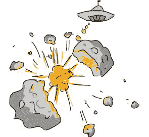两个更小的子克隆将拥有比父克隆开始时多一个的`hits`变量。第四次点击`Asteroid`克隆时，`hits`变量是`4`，代码删除克隆，而不是创建两个新的克隆。(`delete` `this` `clone`块后的代码不运行，因为克隆体不再存在。)这防止了 1 个`Asteroid`精灵变成 2 个，然后 4 个，然后 8 个，然后 16 个，然后 32 个，并且永远是指数增长的`Asteroid`精灵。

不过，如果你*做*想要成倍增加`Asteroid`个小精灵，那就增加`if` `hits` `=` `4` `then`块中的数量。

### 7.将小行星爆炸消息代码添加到能量爆炸精灵中

在精灵列表中选择`Energy` `Blast`精灵，并将该脚本添加到其中:

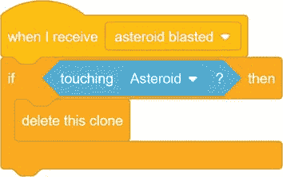所有的`Energy` `Blast`克隆体都会收到`asteroid` `blasted`消息，但是只有那些当前接触到`Asteroid`精灵的克隆体会被删除。(人们将触摸一个`Asteroid`，因为只有当它触摸一个`Energy` `Blast`子画面时，消息才由`Asteroid`子画面广播。)这就是一个`Energy` `Blast`精灵在碰到一个`Asteroid`后消失的样子。

* * *

## 保存点

单击绿色标志来测试到目前为止的代码。尝试爆破一些小行星。确保能量爆炸消失，并且`Asteroid`精灵被两个更小的克隆体代替。第四次小行星被撞击，它应该会消失。然后点击红色停止标志，保存你的程序。

* * *

##  记录分数并制作计时器

当许多小行星绕着舞台飞行时,*小行星破碎者*游戏很快变得具有挑战性。一个好的游戏策略是缓慢而小心，在向大精灵开火之前干掉小精灵。但我们也想给玩家施加一些压力，所以让`Score`变量开始每秒下降 1 点，当`Score`为`0`时游戏结束。这样，玩家在射击`Asteroid`精灵时必须保持更快的速度。

### 8.创建超时精灵

将鼠标悬停在**选择一个精灵**按钮上，并点击出现的**绘制**按钮。在画图编辑器中，使用文本工具用红色大写字母写出*超时*。

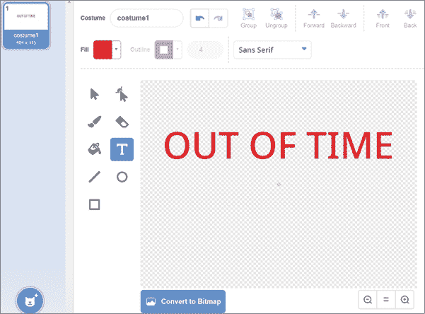回到**代码**标签，转到精灵窗格，并将精灵重命名为`Out` `of` `Time`。

将以下脚本添加到`Out` `of` `Time`雪碧中:

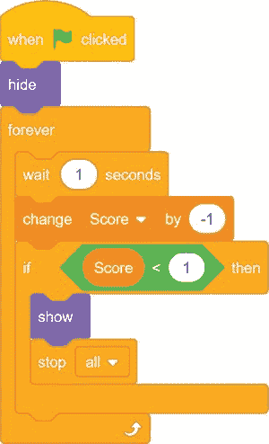这段代码在游戏开始时隐藏`Out` `of` `Time`精灵，并在一秒钟的暂停后通过`1`减少`Score`变量。当`Score`变量到达`0`时，代码显示`Out` `of` `Time`精灵。

* * *

## 保存点

单击绿色标志来测试到目前为止的代码。确保`Score`变量每秒减少`1`点。当`Score`变量为`0`时，应显示`Out` `of` `Time`精灵。然后点击红色停止标志，保存你的程序。

* * *

##  让飞船被击中爆炸

如果玩家不能足够快地爆炸小行星来阻止他们的`Score`到达`0`，他们可能会输掉游戏。但是如果一颗小行星撞上飞船，他们也会失败。让我们添加代码来检测这种情况何时发生，并显示一个很酷的爆炸动画。

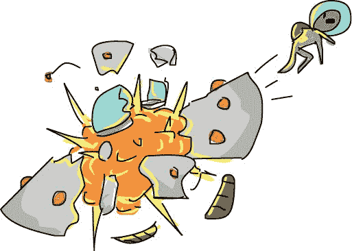### 9.上传爆炸精灵

八个图像可用于爆炸动画的帧。这些服装在资源 *ZIP 文件的*explosion . sprit 3*文件中。*

 *在 Scratch 编辑器中，将鼠标悬停在**选择精灵**按钮上，点击出现的**上传精灵**按钮，选择 *Explosion.sprite3* 。爆炸动画的八种服装出现在精灵的**服装**标签上。

### 10.添加爆炸精灵的代码

对于`Explosion` sprite，您将创建一个名为`explode`的新广播消息。当`Explosion`精灵收到这条信息时，它会出现并切换其服装来显示爆炸动画。

爆炸发生时，精灵还会播放声音效果。通过点击块调板上方的**声音**选项卡载入声音。然后点击左下角的**选择声音**按钮。选择`Alien` `Creak2`音。

将以下代码添加到`Explosion` sprite 中:

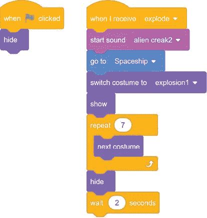`Explosion` sprite 隐藏起来，直到它接收到`explode`广播。然后它播放一个声音，走到飞船所在的位置，七次切换服装，制作出一个超赞的爆炸动画！

### 11.将分解代码添加到飞船精灵中

当`Spaceship`精灵接触到其中一个`Asteroid`克隆体时，它会广播`explode`信息。将以下脚本添加到`Spaceship` sprite 中:

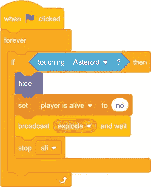爆炸动画的工作原理是，在移动到下一个服装之前，简单地展示其中一个服装。这类似于漫画和动画书使用的逐帧动画。每个服装都是一帧，代码快速变换服装，让爆炸看起来很真实。

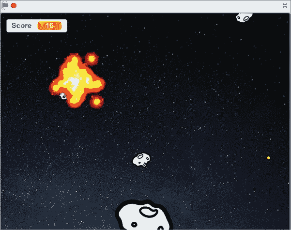img/* * *

## 保存点

单击绿色标志来测试到目前为止的代码。确保游戏开始时`Explosion`精灵不可见。飞入一颗小行星，确保`Explosion`精灵出现在`Spaceship`精灵所在的地方。然后点击红色停止标志，保存你的程序。

这个程序的代码太大，无法在这里显示，但是您可以在参考资料 ZIP 文件中查看完整的代码—文件名是 *asteroidbreaker.sb3* 。

* * *

## 版本 2.0:有限的弹药

一旦你掌握了游戏的诀窍，*小行星破碎机*就会变得太容易了。使它变得容易的一个特征是你可以像按空格键一样快地开火。这个动作让玩家不分青红皂白地开火，而不是小心翼翼地瞄准小行星。但是我们可以通过添加一个新的`Energy`变量来改变这种行为。每次发射一次能量爆炸都会减少这个变量 1。如果`Energy`变量是`0`，飞船就不能发射。`Energy`变量会随着时间慢慢增加，但它迫使玩家小心瞄准他们的投篮，不要浪费。

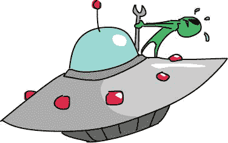你需要一个变量来记录飞船的能量水平。选择橙色的*变量*类别，点击**制作变量**按钮。制作一个名为`Energy`的变量，为所有精灵选择**。在块调色板中，确保选中了`Energy`旁边的复选框(就像选中了`Score`的复选框一样),这样它就会出现在舞台上。**

`Energy`变量将在游戏开始时从`10`开始，然后随着玩家每次发射能量冲击波而减少`1`。只有当变量`Energy`大于`0`时，玩家才能开火。

修改`Energy` `Blast` sprite 中的代码以匹配以下内容:

脚本 1 是新的。在进入`forever`循环之前，它首先将`Energy`变量设置为`10`。在循环内，如果`Energy`小于`10`，程序等待 0.4 秒后将`Energy`增加`1`。这样，`Energy`值永远不会超过`10`。脚本 2 稍作修改，使得`Energy`必须大于`0`才能让玩家开火。当一个能量冲击波发射时，`change` `Energy` `by` `-1`块减少`Energy`值。

* * *

## 保存点

单击绿色标志来测试到目前为止的代码。确保`Energy`变量在`Score`变量附近的载物台上可见。`Energy`变量在游戏开始时应该是`10`，玩家每按一次空格键就减 1。当`Energy`变量在`0`时，按空格键应该不会再发射`Energy` `Blast`克隆体了。此外，确保`Energy`变量大约每半秒充电 1 次。然后点击红色停止标志，保存你的程序。

* * * img/img/## 作弊模式:星爆炸弹

*小行星破碎者*2.0 版本中有限的能量更具挑战性，但让我们添加一个秘密的欺骗来解决它。拥有无限能量的骗局会很无聊，所以我们会添加一种特殊的能量炸弹，在飞船周围以星爆模式发射。

当玩家按下 X 键时，星爆将会爆发。这个代码类似于玩家按空格键时的常规射击代码。

将以下代码添加到`Energy` `Blast` sprite 中:

像`when` `space` `key` `pressed`脚本一样，这个脚本检查玩家是否活着，以及精灵是否是克隆的。只有原始的精灵应该运行这段代码，而不是克隆体。

在`if` `then`区块内，`Energy` `Blast`精灵移动到飞船并指向鼠标的方向。然后，精灵克隆自己 24 次。每次克隆完成后，精灵会逆时针方向改变 15 度。这导致了向四面八方的能量爆发。

* * *

## 保存点

单击绿色标志来测试到目前为止的代码。按下 X 键，看着`Energy` `Blast`克隆体从`Spaceship`精灵中向四面八方飞出。因为这一招是秘密的，所以无论玩家的能量水平如何，都要确保玩家可以使用它。然后点击红色停止标志，保存你的程序。

* * *

## 摘要

在本章中，您构建了一个游戏，它具有以下功能:

*   使用冰球推风格来控制宇宙飞船
*   有`x` `velocity`和`y` `velocity`变量来跟踪`Spaceship`精灵移动的速度
*   让精灵环绕舞台边缘
*   拥有能够制造两个更小的克隆体的克隆体
*   变量`Score`和`Energy`分别随时间不断减少和增加
*   具有爆炸的逐帧动画

这个游戏给玩家提供了一个真正的挑战，但是作为程序员，我们不得不一个接一个地添加这些功能！玩家不直接控制飞船，而是推动它。如果我们在这一点上停止编码精灵，玩家可以躲在一个角落里，远离小行星，所以我们让所有精灵围绕边缘。即使有了那个附加物，玩家也可能试图在舞台中央保持不动。那时我们给飞船增加了随机的小推力。

很难避开许多小行星，所以玩家可以在瞄准大行星之前慢慢地小心地完成小行星。在这一点上，我们让分数随着时间的推移而减少，以鼓励玩家更快地开火。玩家也可以在不仔细瞄准的情况下随意射击，所以我们做了一个`Energy`变量来限制玩家射击的速度。

每次你在游戏中加入一个特性，记住它是如何影响游戏性的。太难玩的游戏令人沮丧，太容易玩的游戏令人厌烦。一切都是为了找到平衡。

下一个游戏是迄今为止最先进的程序:它是一个类似于*超级马里奥兄弟*或*超级肉仔*的平台游戏。它不仅像*篮球*游戏一样有跳跃和重力，而且你可以在不改变代码的情况下为它设计自定义关卡！

* * *

## 复习问题

试着回答下面的练习题来测试你学到了什么。您可能不会马上知道所有的答案，但是您可以探索 Scratch 编辑器来找出答案。(答案也在[http://www.nostarch.com/scratch3playground/](http://www.nostarch.com/scratch3playground/)在线。)

1.  回绕代码是如何工作的？
2.  为什么`Energy` `Blast` sprite 有一个`I` `am` `a` `clone`变量？
3.  是什么阻止了`Asteroid`克隆体永远分裂成更多的碎片？
4.  精灵的代码是如何让飞船看起来像要爆炸的？

* * * img/img/*