# 7 制造高级平台

> 原文：<https://inventwithscratch.com/book3/chapter7.html>

 他的第一款*超级马里奥兄弟*游戏于 1985 年推出，成为任天堂最伟大的视频游戏系列和有史以来最有影响力的游戏之一。因为游戏涉及到让一个角色在平台间奔跑、跳跃，这种游戏风格被称为*平台玩家*(或*平台*游戏)。

在本章的刮刮乐游戏中，猫将扮演马里奥或路易吉。玩家可以让猫在一个关卡中跳来跳去收集苹果，同时避开试图偷吃苹果的螃蟹。游戏是计时的:玩家只有 45 秒的时间收集尽可能多的苹果，同时尽量避免螃蟹！

在你开始编码之前，看看在[https://www.nostarch.com/scratch3playground/](https://www.nostarch.com/scratch3playground/)的最终程序。

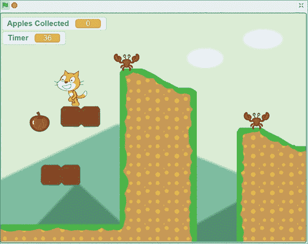准备编写一个比前几章更复杂的游戏。

## 勾画出设计草图

让我们在纸上画出这个游戏应该是什么样子。玩家控制一只猫在苹果随机出现时跳来跳去。螃蟹也在平台上随意走动和跳跃。

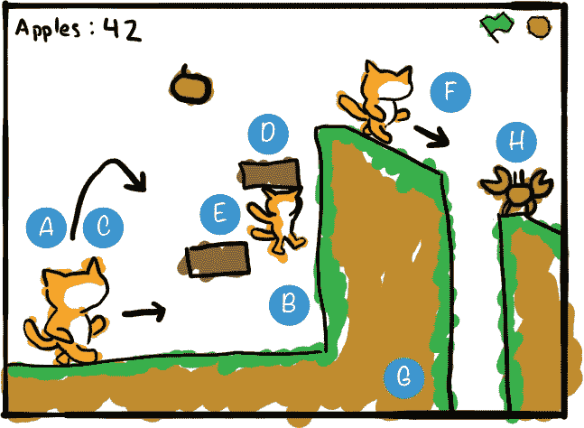下面是我们在每一部分要做的事情:

1.  A. 创造重力，下落，落地
2.  B. 处理陡坡和墙壁
3.  让猫跳得又高又低
4.  D. 添加上限检测
5.  E. 为`Cat`精灵使用一个点击盒
6.  F. 添加更好的行走动画
7.  G. 创建关卡
8.  H. 加入蟹敌和苹果

这个平台游戏是书中最雄心勃勃的一个，但任何人都可以按照本章的步骤编写代码。让我们一步一步地编写每个部分的代码。

如果想节省时间，可以从资源 ZIP 文件中名为 *platformer-skeleton.sb3* 的骨架项目文件开始。进入 https://www.nostarch.com/scratch3playground/的[，右键点击链接，选择**将链接另存为**或**将目标另存为**，将 ZIP 文件下载到你的电脑上。从 ZIP 文件中提取所有文件。骨架项目文件已经加载了所有的精灵，所以您只需要将代码块拖动到每个精灵中。](https://www.nostarch.com/scratch3playground/)

##  创造重力，下落，降落

在第一部分中，我们将添加重力、下落和着陆代码，类似于第 4 章中的*篮球*游戏。重要的区别是，在平台游戏中，猫在接触地面精灵时着陆，而不是在舞台底部。编码有点棘手，因为我们希望地面有山丘，最终有平台！

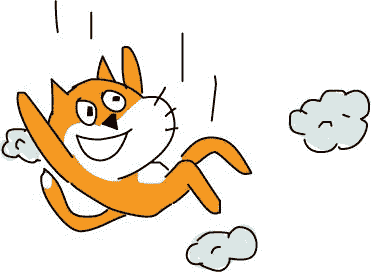首先，点击草稿编辑器左上方的文本字段，将项目从无标题的*重命名为*平台的*。*

### 1.创建地面精灵

让我们在前几个脚本中使用一个简单的地面形状，只是为了探索代码将如何工作。

悬停在**选择精灵**按钮上，点击**绘制**按钮来创建一个临时地面精灵，同时学习平台代码。在绘制编辑器中，使用笔刷或线条工具为地面绘制形状。通过增加“绘制编辑器”顶部的“线宽”文本框中的数字，可以使线条变粗。一定要右边画缓坡，左边画陡坡。

在精灵窗格中，重命名精灵`Ground`。同样，重命名`Sprite1`精灵`Cat`。

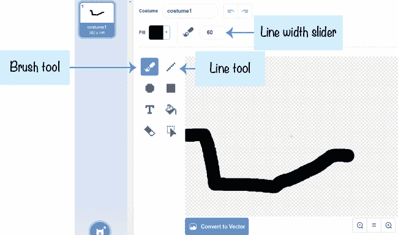### 2.添加重力和着陆代码

现在我们有了一个精灵在地上，我们需要猫掉下来落在上面。

选择`Cat`精灵。在橙色的*变量*类别中，点击**制作一个变量**按钮，为这个精灵只创建一个**变量**名为`y` `velocity`。然后将以下代码添加到`Cat` sprite 中:

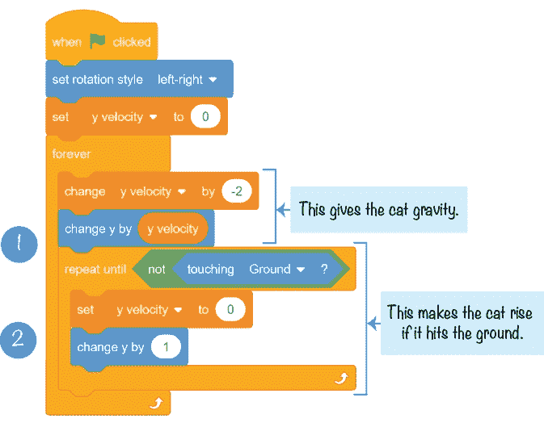这段代码在它的**永远**循环中执行两个动作:它使`Cat`精灵下落，直到接触到`Ground`精灵 1 ，然后如果`Cat`精灵在地下 2 深处，则将其提起。

有了这两个代码段，猫会落下来，撞到地面，然后在必要时升起，最终落在`Ground` sprite 的上面。

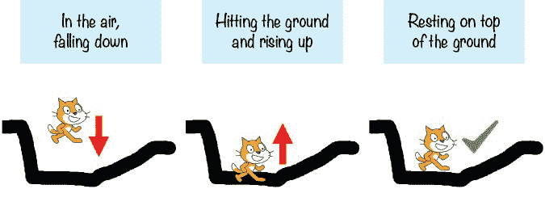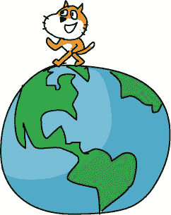1 处的下降代码从`y` `velocity`变量中减去`2`，然后将`Cat` sprite 的 y 位置移动`y` `velocity`，使猫下降的速度越来越快。如果你编程了第四章的*篮球*游戏，那掉落的代码应该很熟悉。

但是**重复** **直到**块 2 将循环直到`Cat`子画面不再接触`Ground`子画面。(如果猫还在空中下落，它就不会着地，所以跳过循环中的代码。)在这个循环中，`y` `velocity`值被设置为`0`，以便`Cat`子画面停止进一步下降。将**换成** **y** **通过** **1** 挡块将`Cat`雪碧抬起一点。**重复** **直到** **不** **碰到** **地**块继续提升雪碧，直到不再陷入`Ground`雪碧。不管`Ground`精灵是什么形状，猫都是这样待在地面上的。

* * *

## 保存点

单击绿色标志来测试到目前为止的代码。用鼠标把猫拖上来，放开。确保猫落下并沉入地面一点，然后慢慢抬起。然后点击红色停止标志，保存你的程序。

* * * img/img/### 3.让猫在舞台上走来走去

这只猫还需要使用 WASD 键左右行走，所以将下面的脚本添加到`Cat`精灵中:

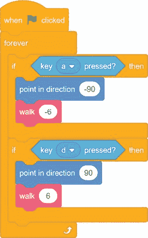这段代码很简单:按 A 把猫指向左边(`-90`)，把 x 位置移动`-6`(向左)；按下 D 使猫指向右边，并通过`6`(向右)移动 x 位置。

接下来，添加以下脚本，使`Cat`精灵在落到舞台底部时环绕到顶部:

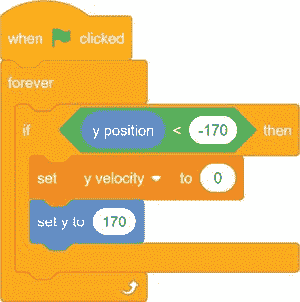这段代码类似于我们在第六章的*小行星破碎者*游戏中写的回绕代码。稍后我们将编写左右移动的环绕代码。

* * *

## 保存点

单击绿色标志来测试到目前为止的代码。按下 A 和 D 键，让猫在斜坡上上下行走。如果`Cat`精灵离开`Ground`精灵的边缘，落到舞台的底部，那么`Cat`精灵应该会重新出现在顶部。然后点击红色停止标志，保存你的程序。

这个平台有许多脚本，所以如果你感到困惑，你可能会迷路。如果你的程序不工作，并且你不知道为什么，从资源 ZIP 文件中加载项目文件 *platformer1.sb3* 。在草稿编辑器中点击**文件从你的电脑加载**来加载文件并从这一点继续读取。

* * *

### 4。消除地面提升延迟

现在代码的最大问题是`Cat`精灵从地下被提升到它上面的速度非常慢。这段代码需要运行得非常快，以至于玩家只能看到地面上的精灵，而看不到里面的精灵。

粉色定制积木可以帮助我们做到这一点。进入*我的阻止*类别，点击**进行阻止**按钮。将模块命名为**手柄** **接地**，然后勾选**运行无屏幕刷新**旁边的复选框。选中此框后，Scratch 将在加速模式下运行您的自定义粉色块中的代码，即使玩家没有通过按下绿色标志来启用加速模式。否则，地勤代码对这个游戏来说会太慢。

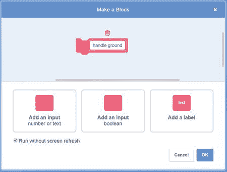**定义** **句柄** **地**块现在应该出现在代码区。更改`Cat`精灵的代码，使其使用**手柄** **接地**块。将**手柄** **接地**块移动到**重复** **直到** **不** **碰到** **接地**块，该循环移动到**定义** **手柄** **接地**下。

这段代码的工作方式和以前完全一样，但是现在**句柄** **地**块已经在没有检查屏幕刷新的情况下运行，所以循环代码以 Turbo 模式运行。举起猫现在是瞬间发生的，所以看起来猫永远不会沉入地面。

* * *

## 保存点

单击绿色标志来测试到目前为止的代码。让猫走来走去或者像以前一样用鼠标把猫从舞台顶部扔下来。现在，精灵永远不会沉入地下。然后点击红色停止标志，保存你的程序。

如果您迷路了，请打开资源 ZIP 文件中的 *platformer2.sb* ,从这一点继续阅读。

* * *

##  处理陡坡和墙壁

`Ground`精灵有猫可以行走的山丘和斜坡，你可以在画图编辑器中将`Ground`精灵改变成几乎任何形状。与在*篮球*比赛中走在舞台底部相比，这对于玩家来说是一个很大的进步。但现在的问题是`Cat`精灵可以像走右边的缓坡一样轻松地走上左边的陡坡。这不太现实。我们要陡坡挡住猫。为此，我们将对遍历代码块做一点小小的修改。

在这一点上，精灵变得过于拥挤，有很多不同的脚本。因此，右键单击或长按代码区域并选择**清理块**将脚本重新组织成整齐的行。

### 5.添加陡坡代码

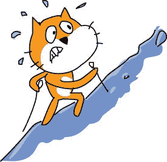现在我们需要编辑`Cat`精灵的行走代码，并添加一些新代码。我们将使用一个新的自定义块，而不是简单地用一个特定的值来改变 x 位置。让我们称之为**行走**并给这个新的定制块一个*输入*称为**步**。输入有点像变量，但是您只能在自定义模块的**定义**模块中使用它。

点击粉色*我的积木*类别中的**制作积木**按钮，制作**行走**积木。务必点击**添加输入数字或文本**按钮，进行**步骤**输入。当我们想要调用新的 **walk** 块时，我们必须用要执行的多个**步骤**来定义该输入。确保选中**不刷新屏幕运行**复选框。

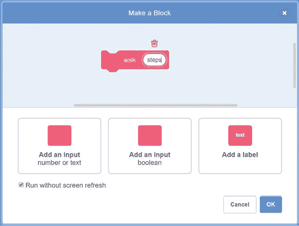这段代码还要求您为名为`ground` `lift`的`Cat` sprite 创建一个变量(对于这个 sprite，这个变量应该是**)。我们将使用这个新变量来确定一个斜坡对于猫来说是否太陡了。这段代码有点复杂，但是我们将一步一步地完成它。现在，让`Cat`精灵的代码看起来像下面这样:**

 **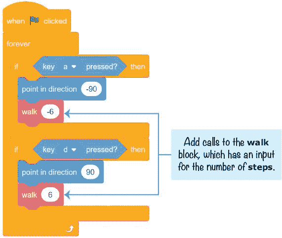我们想让猫走六个单位，就像我们之前做的那样，所以当我们调用**行走**时，我们在行走脚本中使用`-6`和`6`。在**中定义** **行走**块，在**中使用**步**输入块通过**块改变****。这使得代码更加简洁，因为我们可以使用相同的脚本将猫向左移动(使用**行走** **-6** 块)或向右移动(使用**行走** **6** 块)。****

 ****中的代码重复** **直到**循环使用`ground` `lift`变量来确定斜坡是可行走的斜坡还是应该阻挡`Cat`精灵前进的墙壁。`ground` `lift`变量从`0`开始，每次**重复** **时变化`1`，直到**循环将`Cat` sprite 的 y 位置提升`1`。该循环继续循环，直到精灵不再接触地面或者`ground` `lift`等于`8`。

如果`ground` `lift`小于`8`，那么斜率就没那么陡。精灵可以走上斜坡，所以**定义** **行走**脚本不需要做任何其他事情。

但如果**接地** **抬起** **=** **8** ，则**重复** **直到**循环停止。这个代码的意思是“精灵已经被`8`抬起，但是还在接触`Ground`精灵，所以这一定是一个陡坡。”在这种情况下，我们需要撤消提升*和行走*运动。**改变****y****by****-8**和**改变****x****by****-1*********步骤**阻止撤消`Cat`精灵的移动。将**行走**输入乘以`-1`得到输入和变量的相反数字。

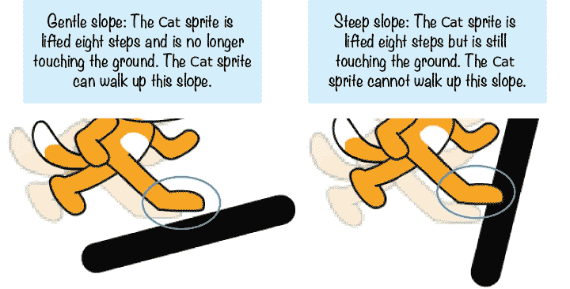这个代码和第三章*迷宫赛跑者*游戏中阻止玩家穿墙的代码一模一样。

* * *

## 保存点

单击绿色标志来测试到目前为止的代码。使用 A 和 D 键让猫走来走去。猫应该可以走上右边的缓坡，但是左边的陡坡应该会让猫停下来。点击红色停止标志并保存您的程序。

如果您迷路了，请打开资源 ZIP 文件中的 *platformer3.sb* ,从这一点继续阅读。

* * *

##  猫跳得高又低

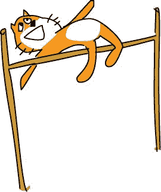行走代码做好了，我们来添加跳跃。在*篮球*游戏中，我们将`falling`变量改为一个正数。这意味着玩家每次都跳过该变量值的高度。但在许多平台游戏中，玩家可以通过快速按下跳跃按钮来进行短距离跳跃，或者通过按住跳跃按钮来跳得更高。我们想在这个平台游戏中使用高低跳跃，所以我们必须想出比*篮球*游戏的跳跃代码更高级一点的东西。

### 6.添加跳跃代码

让我们先为这个精灵只创建一个**变量**，名为`in` `air`。每当`Cat`精灵在地面上时，这个变量将被设置为`0`。但是`in`T5 会在`Cat`精灵跳跃或者下降的时候开始增加。`in` `air`值越大，猫离开地面和在空中的时间就越长。

将此脚本添加到`Cat`精灵中:

**永远**循环不断检查 W 键是否被按住。如果是的话，这将给`Cat`精灵一个`14`的速度——也就是说，`Cat`精灵将向上移动。但是请注意，猫继续向上移动有两个条件——玩家必须按住 W *和*`in``air`变量必须小于`8`。

让我们编辑两个现有的`Cat`精灵脚本，添加`in` `air`变量，限制猫能跳多高。

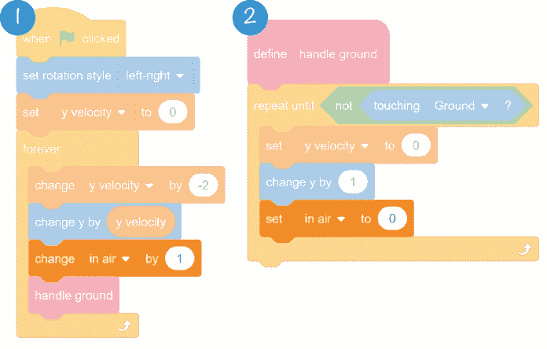当玩家第一次按住 W 键让猫跳起来的时候，`y` `velocity`变量被设置为`14`。这使得脚本 1 中的**永久**循环中的代码将`Cat`精灵的 y 位置更改为正`y`T5，将其向上移动。跳跃开始时，`in` `air`变量增加，但仍小于`8`。所以如果玩家继续按住 W 键，`y` `velocity`会继续被设置为`14`而不是减少，因为**改变** **y** **速度** **被** **-2** 阻挡。这使得向上跳跃的时间比玩家按住 W 键循环一次的时间要长。但最终`in` `air`会变得等于或大于`8`，所以 W 键按了也没关系。记住这两个条件— **键** **w** **按下** *和* **在** **空中****<****8**—对于**内的代码必须为真如果** **那么**块运行。

此时，`y` `velocity`变量会如预期的那样减少，`Cat`精灵最终会倒下。在脚本 2 中，当猫在地上时，`in` `air`变量被重置为`0`。

* * *

## 保存点

单击绿色标志来测试到目前为止的代码。按 W 键跳转。快速按键应该会引起一个小的跳跃。按住 W 键应该会引起更高的跳跃。确保猫只能在地上跳，不能跳两次。然后点击红色停止标志，保存你的程序。

如果您迷路了，请打开资源 ZIP 文件中的*platform 4 . sb*,从这一点继续阅读。

* * * img/img/##  添加上限检测

猫可以在地面上行走，现在墙壁会阻止猫穿过它们。但是如果玩家把`Cat`精灵的头从下面撞向一个平台，`Cat`精灵就会从上面飘过去！为了解决这个问题，我们需要对提升代码做一些调整，增加*上限检测*。

### 7.给地面精灵添加一个低平台

给`Ground`精灵的服装添加一个短而低的平台，如下图所示。确保它足够高，让猫可以从下面走过，但又足够低，让猫可以跳起来触摸它。

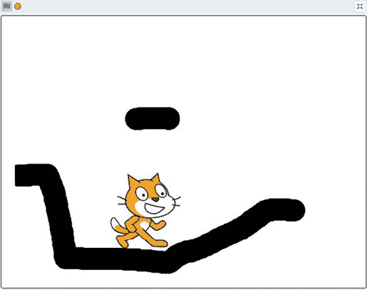这个平台应该足够低，让猫可以把头撞到上面。如果不能，那就把平台再画低一点。

* * *

## 保存点

单击绿色标志测试代码。让猫在低矮的平台下跳跃。请注意，当`Cat`精灵接触到平台时，它会停在平台上方。这是我们需要解决的问题。单击红色停止标志。

* * *

### 8.添加上限检测代码

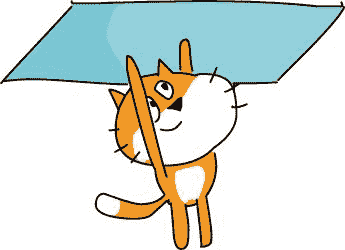代码的问题出在自定义**手柄** **接地**块。这段代码总是假设`Cat`精灵从上方落下，如果`Cat`精灵接触到了`Ground`精灵，它应该被提升到它的上方。`Ground`精灵代表猫不能穿过的任何固体部分，包括天花板。我们需要修改代码，这样如果`Cat`精灵在碰到`Ground`精灵时跳起来，猫*会因为撞到它的头而停止*上升。当`y` `velocity`大于`0`时，我们知道`Cat`精灵向上移动。所以，让我们编辑自定义**句柄** **地**块来添加一个名为**移动** **向上**的新布尔输入。

一个*布尔*是一个真或假的值。我们使用布尔输入，因为当第一次调用**句柄** **地**块时，我们需要知道`y` `velocity`是否大于`0`。该真值或假值存储在**上移** **输入**中，就像变量存储它一样。如果我们把 **y** **速度** **>** **0** 放在**如果** **那么**阻挡而不是**移动** **向上**，那么猫最终会升到天花板上方而不是撞到天花板。

右击或长按**定义** **手柄** **地**块，从菜单中选择**编辑**。

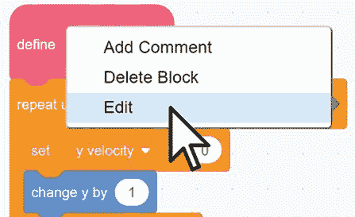点击**添加一个输入布尔**按钮。将这个新的输入字段命名为**，将** **上移**，然后点击 **OK** 。

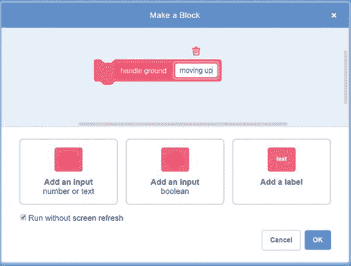这将添加一个新的**向上移动** **向上**块，您可以拖动**定义** **手柄** **地**块，就像您从块调色板中拖动块一样。此**上移****块将用于新的**块，如果** **则** **否则**块。修改**定义** **手柄** **接地**块的代码来匹配这个。**

 **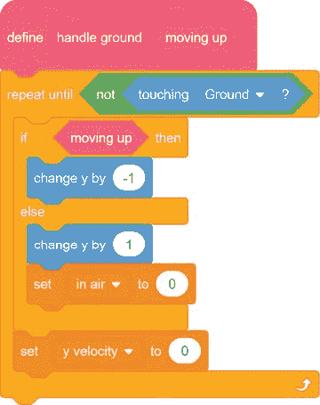如果猫在向上移动，那么**改变****y****by****-1**块让猫看起来像是在撞它的头。否则，脚本会像以前一样，抬起猫，让它坐在地面上。

接下来，我们必须编辑这个脚本中的**句柄** **地**调用。我们将添加一个布尔条件来确定 sprite 是否向上移动，即 **y** **速度** **>** **0** 。

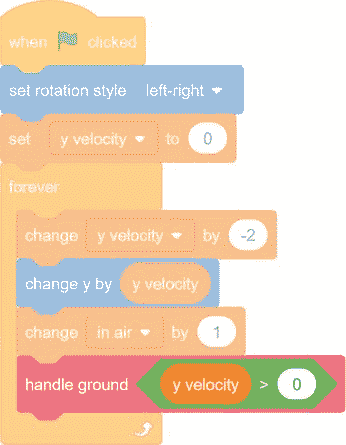手柄**的** **接地** **y** **速度** **>** **0** 块设置**移动** **向上**输入到`true`如果`y` `velocity`大于`0`(即如果精灵正在跳跃并向上移动)。如果`y` `velocity`不大于`0`，那么子画面要么下降要么静止，导致**上移** **输入被设置为`false`。**

这就是**如何定义** **句柄** **地**块决定它是否应该通过 **-1** 运行**改变** **y** **(因此`Cat`精灵不能穿过天花板)或者通过** **1** 运行**改变** **y** **(因此`Cat`精灵无论哪种方式，如果`Cat` sprite 正在接触`Ground` sprite(如果**内的代码重复** **直到** **而不是** **接触** **地**块正在运行)，那么`y` `velocity`变量应该被设置为`0`，以便`Cat` sprite 停止下降或跳跃。**

* * *

## 保存点

单击绿色标志来测试到目前为止的代码。让猫在低平台下行走并跳跃。确保猫撞上平台，但不要越过它。然后点击红色停止标志，保存你的程序。

如果您迷路了，请打开资源 ZIP 文件中的*platform 5 . sb*,从这一点继续阅读。

* * *

##  为猫精灵使用 Hitbox

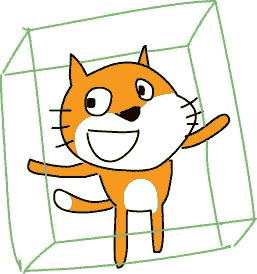这个游戏还有一个问题。因为代码依赖于`Cat`精灵接触`Ground`精灵，所以`Cat`精灵的任何部分都可以“站”在地上，甚至是它的胡须或脸颊！在这个图中，猫没有掉下来，因为它的脸颊“落”在了平台上，这不太现实。

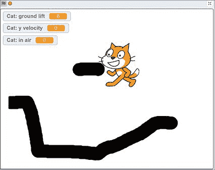幸运的是，我们可以通过使用在*篮球*游戏中使用的 hitbox 概念来解决这个问题。

### 9.给猫精灵添加 Hitbox 服装

点击`Cat`精灵的**服装**标签。然后将鼠标悬停在**选择服装**按钮上，点击出现的**绘制**按钮。画一个黑色矩形，覆盖其他两套服装的大部分(但不是全部)区域。下图显示了同一图像中的第一件略微透明的服装，这样您就可以看到黑色矩形覆盖了多少区域:

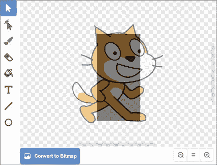给这套服装取名`hitbox`。每当*平台玩家*程序的代码检查`Cat`精灵是否接触到`Ground`精灵时，我们会在检查前将服装切换到黑色矩形`hitbox`服装，然后在检查后返回常规服装。通过这样做，`hitbox`将确定猫是否接触地面。

这些服装开关将由粉红色的自定义模块处理，这些模块有不刷新屏幕就运行的选项，所以`hitbox`服装将不会出现在屏幕上。

### 10.添加 Hitbox 代码

我们将添加**开关** **服装** **到**区块到两个粉色定制区块的开始和结束。修改`Cat`精灵的代码，如下所示:

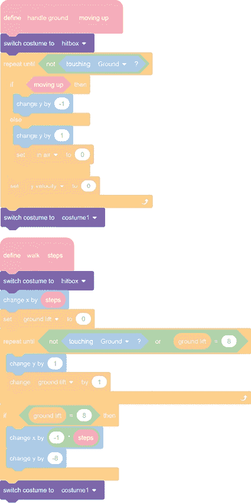这些来自紫色*长相*类别的积木会把服装换成`hitbox`。因为`hitbox`是一个简单的矩形，不像猫的头和胡须那样有突出的部分可以“抓住”平台，所以游戏将以更自然的方式运行。

* * *

## 保存点

单击绿色标志来测试到目前为止的代码。让猫跳来跳去，确保猫不能通过脸颊或尾巴挂在平台上。然后点击红色停止标志，保存你的程序。

如果您迷路了，请打开资源 ZIP 文件中的*platform 6 . sb*,从这一点继续阅读。

* * *

##  添加更好的行走动画

Scratch 项目开始时使用的`Cat`精灵有两套服装，分别名为`costume1`和`costume2`。

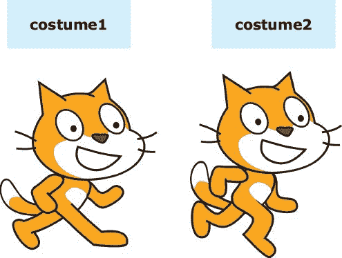通过在这两种服装之间来回切换，你可以制作一个简单的行走动画。然而，一只名叫 griffpatch 的抓痒猫(其简介在[https://scratch.mit.edu/users/griffpatch/](https://scratch.mit.edu/users/griffpatch/))为这只抓痒猫创作了一系列行走服装。

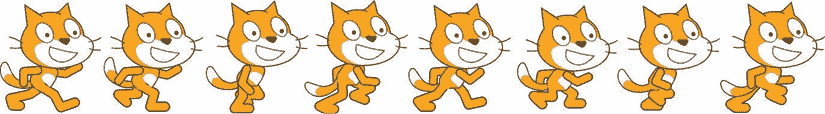此外，griffpatch 还制作了站立、跳跃和摔倒的服装。

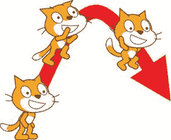使用这些服装会让*平台游戏*看起来比使用`Cat`精灵自带的两个简单服装更精致。我们只需要添加一些动画代码，在适当的时候在这些服装之间切换。幸运的是，griffpatch 已经使用在[https://nostarch.com/scratch3playground/](https://nostarch.com/scratch3playground/)下载的书籍资源中的服装创建了几个很酷的 Scratch 程序。

### 11.将新服装添加到猫精灵中

要添加新的服装，您必须将服装文件上传到您的草稿项目中。您将在资源 ZIP 文件中找到八个行走的图像以及站立、跳跃和下落的图像。这些图像的文件名是 *Walk1.svg* 、 *Walk2。svg* ，以此类推，直到 *Walk8.svg* ，还有 *Stand.svg* 、 *Jump.svg* ，以及 *Fall.svg* 。

然后，在 Scratch 编辑器中，点击`Cat`精灵的**服装**标签。将鼠标悬停在左下方的选择服装按钮上，点击**上传服装**按钮，选择 *Stand.svg* 上传文件。这创建了一个新的精灵，以 *Stand.svg* 作为它的服装。

删除原来的`costume1`和`costume2`服装，但保留`hitbox`服装。按照以下顺序摆放服装(严格按照顺序摆放很重要):

1.  1。 `Stand`
2.  2。 `Jump`
3.  3。 `Fall`
4.  4。 `Walk1`
5.  5。 `Walk2`
6.  6。 `Walk3`
7.  7。 `Walk4`
8.  8。 `Walk5`
9.  9。 `Walk6`
10.  10。 `Walk7`
11.  11。 `Walk8`
12.  12。 `hitbox`

每件服装不仅有名字(如`Walk1`、`Jump`或`Fall`)，还有编号。服装编号基于**服装**选项卡中的服装顺序。比如最上面的服装名为`Stand`，但也被称为服装 1。它下面的服装被命名为`Jump`，但它也被称为服装 2。我们在下一步中添加的代码将通过名称和编号来引用服装。

### 12.创建设置正确的服装块

有了这些不同的服装，确定我们需要展示哪一帧以及何时展示会有点棘手。我们将使用动画帧的概念:几个显示在一起的帧快速制作一个移动的图像，就像一本翻页书。

为了跟踪帧，只为这个精灵创建两个**变量**，分别命名为`frame`和`frames``per`T3。然后当****绿色** **被点击**脚本时，为这些初始变量添加两个 **set** 块到`Cat` sprite 的**中。****

 **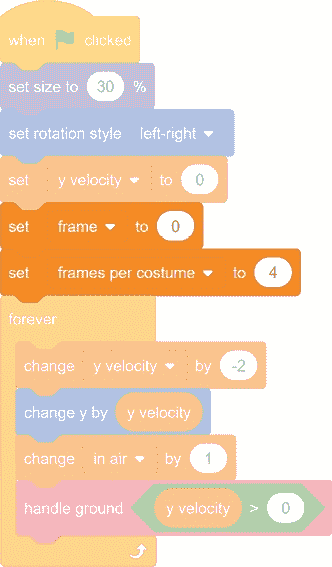现在设置完成了。

当玩家向左或向右移动`Cat`精灵时，我们希望`frame`变量增加。`frames` `per` `costume`变量记录动画运行的快慢。

让我们编辑**定义** **行走**自定义块中的代码，将`frame`变量增加一个从`frames` `per` `costume.`计算的量

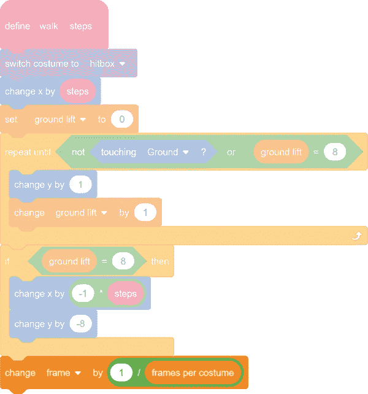当猫静止不动时(即不向左或向右移动)，应将`frame`变量重置为`0`。修改`Cat`精灵的现有**当** **绿色** **标志** **被点击**脚本添加第三个 **if** **then** 块重置`frame`变量。

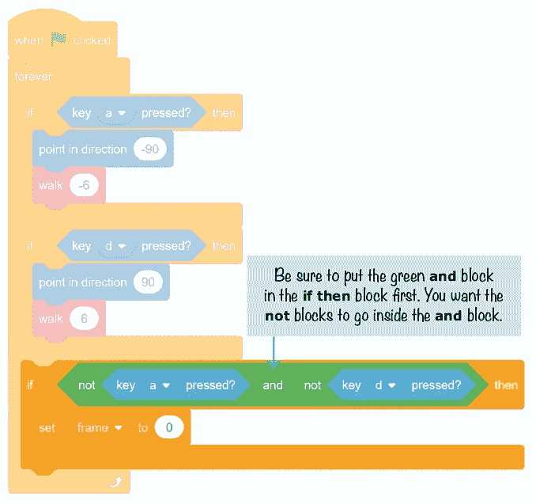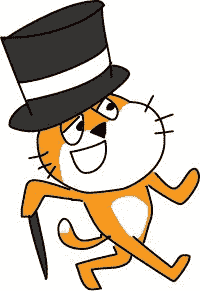现在，让我们编写一些代码来确定要展示的服装。我们将在我们编写的脚本中的几个地方使用这些代码，所以让我们创建一个自定义块。

在粉红色的*我的积木*类别中，点击**制作积木**按钮，并将该积木命名为**set**T7】correctT9】costume。勾选选项**不刷新屏幕运行**，然后点击**确定**。将以下块添加到`Cat` sprite 中，从新的**开始定义** **设置** **修正** **服装**块。

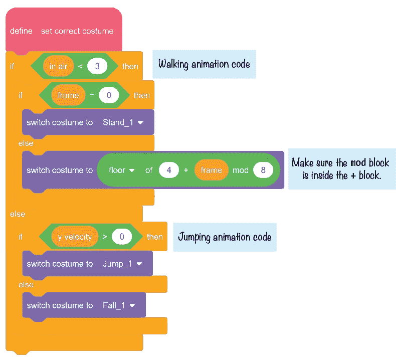如果`Cat`精灵在地上(或者刚刚开始跳跃或下落，因此`in` `air`小于`3`，那么我们想要显示站立服装或行走服装中的一个。记住当 **绿色** **标志** **被点击**脚本保持设置`frame`为`0`如果玩家没有按下 A 键或 D 键。所以当`frame`为`0`时，**开关** **服装** **到** **支架**挡显示`Stand`服装。不然就要算算八个行走的服装要展示哪一个了。该计算通过服装编号来引用服装，编号基于服装在**服装**选项卡中的顺序。

显示哪种行走服装由**开关** **服装** **到** **的** **楼层【4】****+****画面** **模块** **8** 决定。哇，这看起来很复杂！让我们分解一下，以便更好地理解每一部分。

**mod** 模块执行*模*数学运算，这是除法的余数部分。比如 7 / 3 = 2 余数 1，那么 7 mod 3 = 1(余数部分)。我们将使用 **mod** 来计算显示哪个服装号。

尽管我们只有八套行走服装，变量仍在不断增加。当`frame`被设置为一个从`0`到`7`的数字时，我们希望它显示服装 4 到 11。这就是为什么我们的代码有 **4** **+** **帧**块。但是当`frame`增加到`8`时，我们想回到服装 4，而不是服装 12。

**mod** 模块帮助我们完成服装编号的包装。我们可以通过使用一个数学技巧来控制显示的服装:因为 8 mod 8 = 0，所以一个`8`的`frame`值将显示第一个行走服装！我们必须在这个数字上加上`4`，因为第一个行走的服装实际上是服装 4。(记住，服装 1、服装 2 和服装 3 分别是站立、跳跃和下落的服装。)该总和随后用于**楼层**模块。 *Floor* 是一个编程术语，意思是“向下舍入”有时**帧**会被设置为类似`4.25`或`4.5`的数字，所以 **4** **+** **帧**会是`8.25`或`8.5`，但我们只是想向下舍入以显示服装 8。

咻！到目前为止，这是你在这本书里看到的最多的数学，但是当它被分解时，它变得更容易理解。

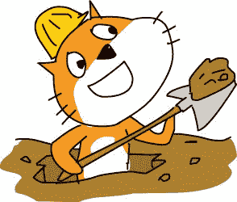**的 **else** 部分的代码如果** **那么** **else** 块处理`in` `air`大于等于`3`时发生的事情。我们检查`y` `velocity`看猫是在下落(即`y` `velocity`是否小于等于`0`)还是在跳跃(即`y` `velocity`是否大于`0`)，切换到正确的服装。最后，**定义** **设置** **修正** **服装**代码完成。

将**定义** **手柄** **地面**和**定义** **行走**模块中的**切换****服装**到 **服装 1** 模块替换为新的设置**修正** **服装**模块。此外，根据 **服装**块，通过 **1** **/** **帧** **添加**变化** **帧** **帧，以便`frame`变量随时间增加，如下所示:****

img/* * *

## 保存点

单击绿色标志来测试到目前为止的代码。在舞台上四处移动猫，确保行走动画正确显示。此外，确保站立、跳跃和下落的服装在正确的时间展示。然后点击红色停止标志，保存你的程序。

如果您迷路了，请打开资源 ZIP 文件中的*platform 7 . sb*,从这一点继续阅读。

* * * img/img/##  创建关卡

新的行走动画让*平台游戏*看起来更有吸引力。现在让我们把普通的白色背景变成真实的水平。我们为`Cat`精灵编写的行走、跳跃和跌倒的代码的伟大之处在于，它可以与任何形状或颜色的`Ground`精灵一起工作。所以如果我们改变`Ground`精灵的服装(比如说，不同等级)，我们不需要重新编程`Cat`精灵！

### 13.下载并添加舞台背景

点击`Ground`精灵的**服装**标签。将鼠标悬停在**选择服装**按钮上，点击出现的**上传服装**按钮，选择资源 ZIP 文件中的*platform back drop . png*。此服装上传后，您可以删除之前的服装。

给`Ground`精灵添加文件*PlatformerBackdrop.png*作为服装是不够的。您还必须将其作为舞台背景上传。悬停在**选择精灵**按钮上，点击出现的**上传背景**按钮，选择*PlatformerBackdrop.png*上传。我们需要将文件上传到这两个地方，因为下一步我们将从`Ground`精灵中删除所有的“背景部分”。我们只需要`Ground`精灵标记出`Cat`精灵可以行走的部分。背景将是舞台上显示的图像。

### 14。为地面精灵创建一个 Hitbox 服装

*平台玩家*游戏代码基于`Cat`精灵触摸`Ground`精灵。`Ground`精灵的服装是一个 hitbox，所以如果`Ground`精灵的服装是一个占据整个舞台的完整矩形，它将被视为整个舞台是实心地面。我们需要移除`Ground`精灵服装中属于背景而不是平台的部分。

最简单的方法是在绘制编辑器中单击选择工具。将选择矩形拖到要删除的服装部分。选择一个区域后，按删除删除该块。

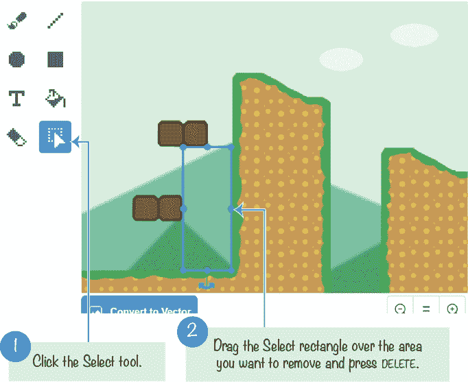使用橡皮擦工具擦除非矩形区域。如果出现错误，请单击“绘制编辑器”顶部的“撤消”按钮来撤消删除。

不断去除服装的背景部分，直到只剩下平台部分。

如果你在制作这套服装时遇到了问题，你可以使用参考资料 ZIP 文件中预先制作的*PlatformerBackdropHitbox.png*图像。图像的背景部分已经被删除，您只需点击**服装**选项卡上的**上传服装**按钮即可添加。

### 15.添加地面精灵的代码

舞台背景用于设置平台和背景的外观。`Ground`精灵用于识别`Cat`精灵可以行走的坚实地面。将以下代码添加到`Ground`精灵的代码区域:

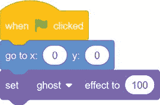精灵的服装需要在舞台背景上完美地排列起来，这样你就看不出它在那里。因为舞台背景和`Ground`精灵的服装来自同一个图像文件，你可以通过将`Ground`精灵移动到坐标(0，0)来实现。否则，`Ground`精灵的服装不会完美地排列在背景上。

`Ground`精灵服装的*画图*和服装的*造型*一样不重要。只要`Ground` 精灵完美地躺在背景幕的上面，我们就可以将幽灵效果设置为`100`，而`Ground`的服装和背景幕就会排成一行。背景显示了关卡的样子，而`Ground`精灵充当了它的 hitbox。

* * *

## 保存点

单击绿色标志来测试到目前为止的代码。确保你能让猫在舞台上四处走动。然后点击红色停止标志，保存你的程序。

* * *

### 16.向猫精灵添加更多的环绕代码

注意这个关卡有两个浮动平台和一个中间有坑的小山。当猫掉进坑里时，它会缠绕舞台，重新出现在顶部。让我们也为舞台的左右边缘添加环绕代码。将以下脚本添加到`Cat` sprite 中:

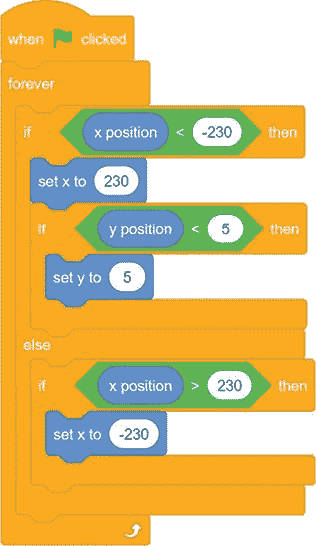猫走到舞台左边缘时，其 **x** **位置**会小于`-230`。在这种情况下，我们通过将 **x** **位置**设置为`230`，使其绕到右边。

同样，如果猫从舞台的左侧移动，它的 **y** **位置**将小于`5`。当移动到载物台的右边缘时，这将把它放在地面内，因此如果 **则**块检查这种情况并将 **y** **位置**设置为`5`。

另一个 **if** **then** 块将右边缘的`Cat`绕到舞台的左边缘(即其**x**T8】位置大于`230`)。

* * *

## 保存点

单击绿色标志来测试到目前为止的代码。确保猫可以离开舞台的左边，绕到右边，反之亦然。然后点击红色停止标志，保存你的程序。

如果您迷路了，请打开资源 ZIP 文件中的*platform 8 . sb*,从这一点继续阅读。

* * *

##  添加螃蟹敌人和苹果

整个*平台*游戏设置完成！玩家可以让`Cat`精灵行走、跳跃、跌倒、站在平台上。这个`Cat`精灵有一些很酷的动画，背景看起来像一个真正的视频游戏。

现在我们要做的就是用我们所有的棋子做一个游戏。我们将添加一个随机出现在舞台周围的苹果，并添加一些试图触摸`Cat`精灵并偷走苹果的敌人。

### 17.添加苹果精灵和代码

点击**选择精灵**按钮，从出现的精灵库窗口中选择`Apple`精灵；然后点击**确定**。

和之前的游戏一样，我们将使用一个变量来跟踪游戏的分数。点击橙色的*变量*类别，然后点击**制作变量**按钮，为所有精灵创建一个**变量，名为`Apples` `Collected`。这个变量将记录玩家的分数。**

在`Apple` sprite 的代码区域，添加以下代码:

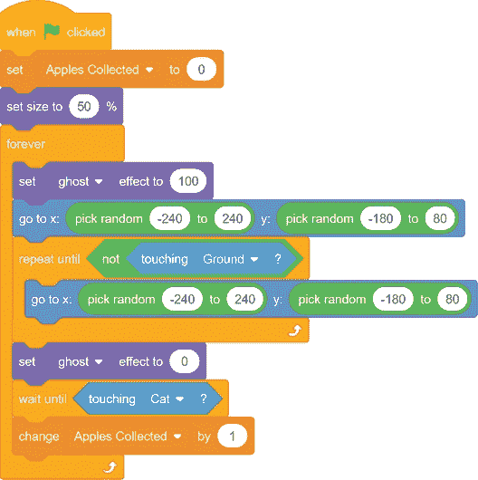游戏开始时，玩家点击绿色旗帜，`Apples` `Collected`中的分数被设置为`0`。此外，因为`Apple`精灵有点太大，我们将其大小设置为 50%。

在游戏过程中，`Apple`精灵需要出现在舞台上随机的地方。我们使用**设置** **幽灵** **效果** **到** **100** 使`Apple`精灵不可见。然后它移动到舞台上的一个随机位置。

但不是舞台上随便一个地方都可以。我们需要确保`Apple`精灵不在`Ground`精灵中，因为玩家不可能得到它。为了防止`Apple`精灵移动到`Ground`精灵内部的某个地方，循环不断尝试新的随机位置，直到`Apple`精灵不再接触`Ground`精灵。玩家看不到苹果的移动，因为幽灵效果仍然设置为`100`。当`Apple` sprite 找到一个没有接触到`Ground` sprite 的地方，随着**设置** **鬼影** **效果** **到** **0** ，它又变得可见。

然后`Apple`精灵等待，直到`Cat`精灵碰到它。当这种情况发生时，`Apples` `Collected`中的分数会增加`1`，并且`Apple`精灵会循环在舞台上找到一个新的随机位置。

* * *

## 保存点

单击绿色标志来测试到目前为止的代码。确保`Apple`精灵永远不会出现在地面上。当猫触摸苹果时，`Apples` `Collected`中的分数应该增加`1`，并且`Apple`精灵应该移动到一个新的随机位置。点击红色停止标志并保存您的程序。

* * *

### 18.创建螃蟹精灵

如果玩家所要做的就是跳来跳去收集苹果，这个游戏就不会很有挑战性。让我们添加一些玩家必须避免的敌人。

右击或长按`Cat`精灵，选择**复制**。敌人将使用与`Cat`精灵相同的代码，这样他们就可以在平台上跳跃和坠落。(我们将删除分配键盘按键来控制精灵的代码，并替换为随机移动螃蟹的代码。)重命名这个复制的精灵`Crab`。然后，在**服装**选项卡上，点击**选择服装**按钮，选择`crab-a`服装。然后再次打开服装库，选择`crab-b`服装。

`Crab`精灵将仍然拥有所有`Cat`精灵的服装(`Stand`、`Fall`、`Walk1`等等)。删除这些`Cat`精灵服装，包括`hitbox`服装。为螃蟹制作一套合适尺寸的新`hitbox`服装。下面是`hitbox`服装应该看起来的样子(已经将`crab-a`服装放在它上面，所以你可以看到相对的尺寸，但是服装只是黑色的长方形):

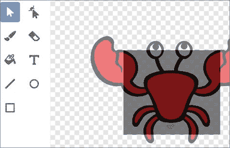### 19.创造敌人的人工智能

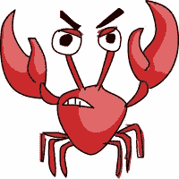在游戏中，*人工智能(AI)* 指的是控制敌人行动以及敌人如何对玩家做出反应的代码。在平台游戏中，螃蟹的人工智能实际上相当 *un* 智能:螃蟹会随机移动。

在橙色的*变量*类别中，点击**制作一个变量**按钮，为这个精灵只创建一个**变量**，名为`movement`。变量 T1 将存储一个代表 T2 精灵运动的数字。

*   向左走
*   向右走
*   直着跳起来
*   跳到左边
*   向右跳
*   静止不动

精灵的动作是随机决定的，而且会经常改变。将以下代码添加到`Crab` sprite 中:

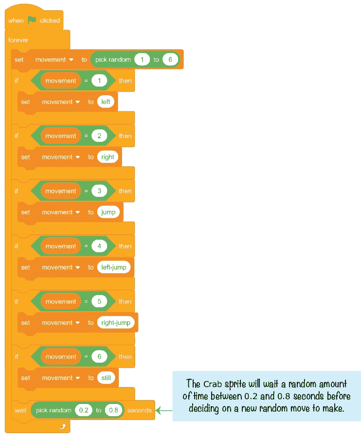首先，`movement`变量被设置为一个在`1`和`6`之间的随机数，这个随机数决定了螃蟹将做出哪个动作。

其余的`Crab` sprite 代码定义了这些运动。当 **键** **按下**块时，从使用**的`Cat` sprite 代码中找出任何代码，并用检查`movement`变量的代码替换这些代码块。(如果你现在运行这个程序，键盘上的键会控制`Cat` *和* `Crab`精灵，因为它们有相同的代码！)**

修改`Crab` sprite 脚本，该脚本检查玩家是按下 A 键还是 D 键，以匹配以下代码:

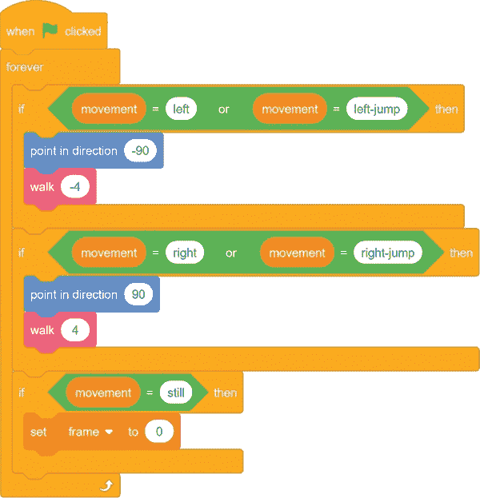与`Cat`精灵一样，这段代码让`Crab`精灵左右行走。将**行走**区块中的值更改为`-4`和`4`，使螃蟹的移动速度比玩家慢。

然后修改处理玩家按下 W 键跳转的脚本，以匹配以下代码:

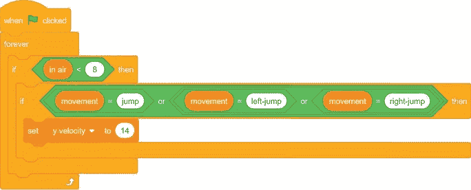这段代码让`Crab`精灵上下左右跳跃。

现在让我们制作螃蟹运动的动画。这个`Crab`精灵只有两种服装，`crab-a`和`crab-b`。我们将在这两套服装之间切换，让它看起来像螃蟹在走路。我们可以稍微简化一下`Crab`精灵的**设定** **修正** **服装**区块。

修改**设定** **修正** **服装**代码如下:

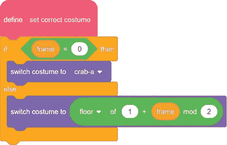注意， **1** **+** **帧** **mod** **2** 区块的**楼层** **中的数字也发生了变化。第一套服装是服装 1，`Crab`只有两套服装，所以这几个街区的数字都改成了`1`和`2`。**

最后，我们需要创建一个新的脚本，以便螃蟹可以从玩家那里偷苹果。将这段代码添加到`Crab` sprite 中:

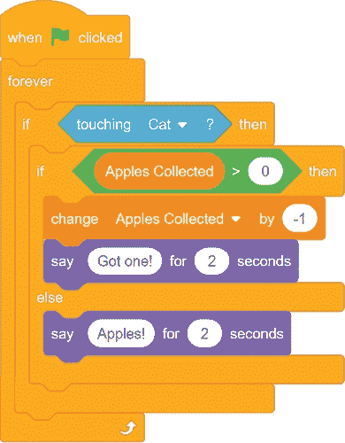`Crab`精灵从`Apples`T3 中减去`1`，然后说“得到一个！”当他们碰到玩家的时候。如果玩家有`0`苹果，`Crab`精灵会说“苹果！”但不会从`Apples` `Collected`中减去`1`。

两只螃蟹的游戏会更刺激一些，所以右击或者长按精灵列表中的`Crab`精灵，从菜单中选择**复制**。

* * *

## 保存点

单击绿色标志来测试到目前为止的代码。确定两只螃蟹在跳来跳去。当他们触摸猫时，他们应该偷一个苹果，并说“得到一个！”如果猫没有苹果，螃蟹应该只说“苹果！”然后点击红色停止标志，保存你的程序。

* * *

### 20。添加时间到了的精灵

我们快完成了！我们需要添加到游戏中的最后一件事是一个计时器。现在，玩家将面临尽快抓取苹果的压力，而不是安全行事。将鼠标悬停在**选择一个精灵**按钮上，点击**绘制**按钮，并在绘制编辑器中绘制文本*时间到了*。我的看起来像这样:

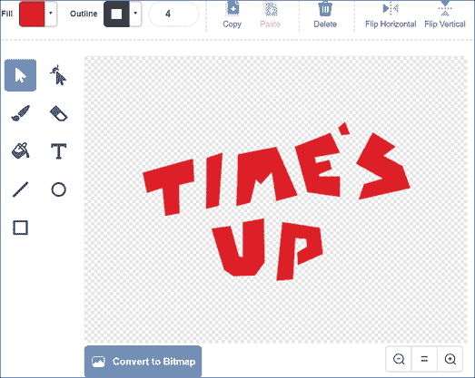重命名精灵`Time's` `Up`。然后为所有精灵创建一个名为`Timer`的**变量，并添加以下代码:**

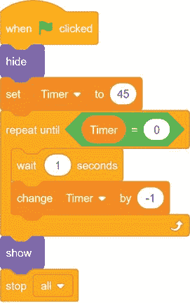这段代码给玩家 45 秒的时间收集尽可能多的苹果，同时尽量避免螃蟹偷吃。当`Timer`变量达到`0`时，会出现`Time's` `Up`精灵，游戏结束。

现在*平台游戏*已经准备好进行最后的测试了！

* * *

## 保存点

单击绿色标志来测试到目前为止的代码。走来走去，跳来跳去，一边收集苹果，一边试图避开螃蟹。确保当计时器到达`0`时，游戏结束。然后点击红色停止标志，保存你的程序。

这个程序的完整代码太大，无法在本书中列出。但是，您可以在资源 ZIP 文件中查看完整的代码——文件名是 *platformer.sb3* 。

* * *

## 摘要

你做到了！你是刮刮乐大师！高级*平台游戏*是本书中最精细复杂的项目。你结合并使用了许多不同的概念来制作这个游戏，所以多读几遍这一章可能会有帮助。

在本章中，您构建了一个游戏

*   使用玩家站在上面的地面精灵
*   使用启用了“运行时不刷新屏幕”选项的粉色自定义块
*   让玩家在斜坡上下行走
*   有天花板检测，所以玩家在低平台上碰到他们的头
*   有行走、跳跃和下落的详细动画
*   为敌人实施人工智能，使他们可以自行移动

本书到此结束，但不要让这阻止你继续你的编程冒险。你可以经常浏览其他 Scratchers 的程序来获得更多的想法。找到一个你喜欢的游戏，试着从*开始*创造它。(我所有的双关语都是有意的。)

Scratch 的伟大之处在于，它为你可以制作的游戏类型提供了无限可能。你可以克隆流行的经典游戏，比如《吃豆人》或者《T2》。或者你可以用自己的设计制作独特的游戏。祝你好运！

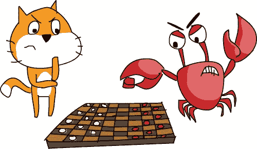img/* * *

## 复习问题

试着回答下面的练习题来测试你学到了什么。您可能不会马上知道所有的答案，但是您可以探索 Scratch 编辑器来找出答案。(答案也在[http://www.nostarch.com/scratch3playground/](http://www.nostarch.com/scratch3playground/)在线。)

1.  粉红色的自定义块有助于避免重复代码。为什么这是一件好事？
2.  粉色自定义块的输入如何像一个变量？
3.  在哪里可以使用粉色自定义块的输入？
4.  *模*在数学上是什么意思？
5.  编程中*楼层*是什么意思？

* * *

********